# JVM

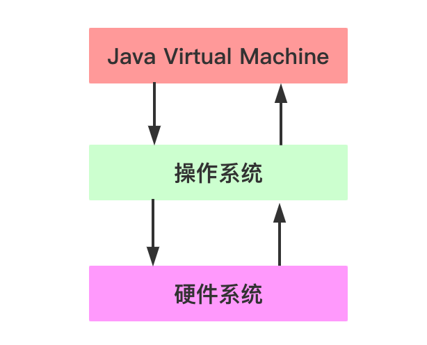

JVM是运行在操作系统之上的，它与硬件没有直接的交互


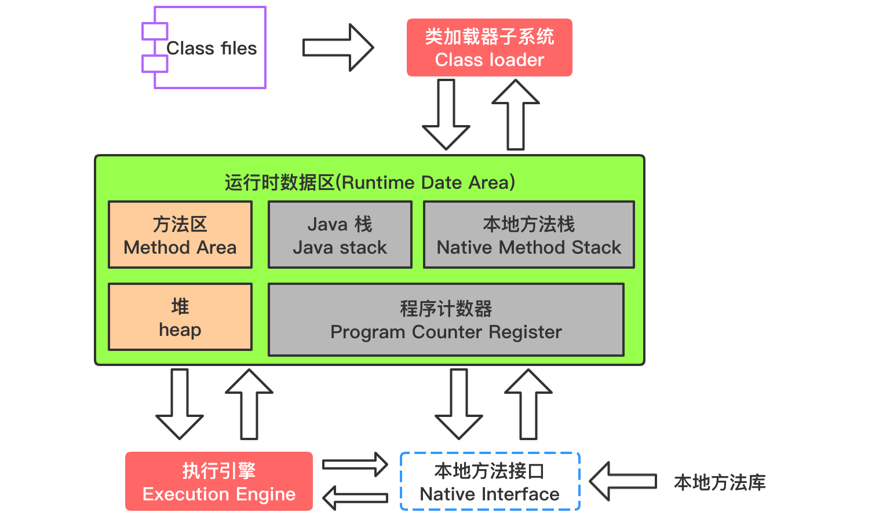

## 类加载器 ClassLoader

负责加载class文件，class文件在``文件开头有特定的文件标示``，将class文件字节码内容加载到内存中，并将这些内容转换成方法区中的运行时数据结构并且ClassLoader只负责class文件的加载，至于它是否可以运行，则由``Execution Engine``决定。


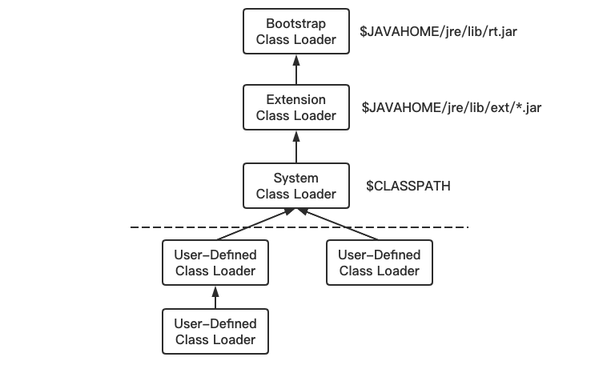

**虚拟机自带的加载器**
``启动类加载器（Bootstrap）`` C++
``扩展类加载器（Extension）`` Java(拓展的包javax)
``应用程序类加载器（AppClassLoader）``Java也叫系统类加载器，加载当前应用的classpath的所有类

**用户自定义加载器**

Java.lang.ClassLoader的子类，用户可以定制类的加载方式

```java
public class MyObject {
    public static void main(String[] args) {
        Object object = new Object();
        //System.out.println(object.getClass().getClassLoader().getParent().getParent()); NullPointerException
        //System.out.println(object.getClass().getClassLoader().getParent()); NullPointerException
        System.out.println(object.getClass().getClassLoader());

        MyObject myObject = new MyObject();
        System.out.println(myObject.getClass().getClassLoader().getParent().getParent());
        System.out.println(myObject.getClass().getClassLoader().getParent());
        System.out.println(myObject.getClass().getClassLoader());
    }
}
// null
// null
// sun.misc.Launcher$ExtClassLoader@2503dbd3
// sun.misc.Launcher$AppClassLoader@135fbaa4
```

> sun.misc.Launcher 它是一个java虚拟机的入口应用

### 双亲委派机制

```java
package java.lang;

public class String {
    public static void main(String[] args) {
        System.out.println("hello");
    }
}
// 在类 java.lang.String 中找不到 main 方法
```

当一个类收到了类加载请求，他首先不会尝试自己去加载这个类，而是把这个请求委派给父类去完成，每一个层次类加载器都是如此，因此所有的加载请求都应该传送到启动类加载其中，只有当父类加载器反馈自己无法完成这个请求的时候（在它的加载路径下没有找到所需加载的Class），子类加载器才会尝试自己去加载。 
采用双亲委派的一个好处是比如加载位于 rt.jar 包中的类 java.lang.Object，不管是哪个加载器加载这个类，最终都是委托给顶层的启动类加载器进行加载，这样就保证了使用不同的类加载器最终得到的都是同样一个 Object对象。

> Execution Engine执行引擎负责解释命令，提交操作系统执行。 

### 沙箱安全

它防止了恶意代码去干涉善意的代码，这是通过为不同的类加载器装入的类提供了不同的命名空间来实现的，命名空间互相独立。

## 本地方法栈 Native Method Stack

它的具体做法是Native Method Stack中登记native方法，在Execution Engine 执行时加载本地方法库。

```java
Thread t1 = new Thread();
t1.start();
// t1.start();
// Exception in thread "main" java.lang.IllegalThreadStateException
```

```java
public class Thread implements Runnable {
  ...
	public synchronized void start() {
    ...
  	start0();
    ...
	}
	...
	private native void start0();
}
```

### Native Interface本地接口

本地接口的作用是融合不同的编程语言为 Java 所用，它的初衷是融合 C/C++程序，Java 诞生的时候是 C/C++横行的时候，要想立足，必须有调用 C/C++程序，于是就在内存中专门开辟了一块区域处理标记为native的代码，它的具体做法是 Native Method Stack中登记 native方法，在Execution Engine 执行时加载native libraies。
目前该方法使用的越来越少了，除非是与硬件有关的应用，比如通过Java程序驱动打印机或者Java系统管理生产设备，在企业级应用中已经比较少见。因为现在的异构领域间的通信很发达，比如可以使用 Socket通信，也可以使用Web Service等等，不多做介绍。

## 程序计数器 Program Counter Register

程序计数器（PC 寄存器）

每个线程都有一个程序计数器，是线程私有的,就是一个指针，指向方法区中的方法字节码（``用来存储指向下一条指令的地址,也即将要执行的指令代码``），由执行引擎读取下一条指令，是一个非常小的内存空间，几乎可以忽略不记。
这块内存区域很小，``它是当前线程所执行的字节码的行号指示器``，字节码解释器通过改变这个计数器的值来选取下一条需要执行的字节码指令。
如果执行的是一个Native方法，那这个计数器是空的。
用以完成分支、循环、跳转、异常处理、线程恢复等基础功能。不会发生内存溢出(OutOfMemory=OOM)错误。

## Method Area 方法区

供各线程共享的运行时内存区域。``它存储了每一个类的结构信息``，例如运行时常量池（Runtime Constant Pool）、字段和方法数据、构造函数和普通方法的字节码内容。上面讲的是规范，在不同虚拟机里头实现是不一样的，最典型的就是永久代(PermGen space)和元空间(Metaspace)。

> But
> 实例变量存在堆内存中,和方法区无关

## 栈 Stack

> 栈管运行，堆管存储
>
> 栈，先进后出

栈也叫栈内存，主管Java程序的运行，是在线程创建时创建，它的生命期是跟随线程的生命期，线程结束栈内存也就释放，对于栈来说不存在垃圾回收问题，只要线程一结束该栈就Over，生命周期和线程一致，是线程私有的。``8种基本类型的变量+对象的引用变量+实例方法``都是在函数的栈内存中分配。

### 栈存储什么

栈帧(java 方法)中主要保存3 类数据：

``本地变量（Local Variables）`` 输入参数和输出参数以及方法内的变量

``栈操作（Operand Stack）`` 记录出栈、入栈的操作

``栈帧数据（Frame Data）`` 包括类文件、方法等等

### 栈运行原理
栈中的数据都是以栈帧（Stack Frame）的格式存在，栈帧是一个内存区块，是一个数据集，是一个有关方法(Method)和运行期数据的数据集。

当一个方法A被调用时就产生了一个栈帧 F1，并被压入到栈中
A方法又调用了 B方法，于是产生栈帧 F2 也被压入栈
B方法又调用了 C方法，于是产生栈帧 F3 也被压入栈
……
执行完毕后，先弹出F3栈帧，再弹出F2栈帧，再弹出F1栈帧……

遵循“先进后出”/“后进先出”原则。

``每个方法执行的同时都会创建一个栈帧，用于存储局部变量表、操作数栈、动态链接、方法出口等信息``，每一个方法从调用直至执行完毕的过程，就对应着一个栈帧在虚拟机中入栈到出栈的过程。``栈的大小和具体JVM的实现有关，通常在256K~756K之间,与等于1Mb左右``。


图示在一个栈中有两个栈帧：

栈帧 2是最先被调用的方法，先入栈，然后方法 2 又调用了方法1，栈帧 1处于栈顶的位置，栈帧 2 处于栈底，执行完毕后，依次弹出栈帧 1和栈帧 2，线程结束，栈释放。 

每执行一个方法都会产生一个栈帧，保存到栈(后进先出)的顶部，顶部栈就是当前的方法，该方法执行完毕后会自动将此栈帧出栈。

### 栈溢出

```java
public class Test {
    public static void main(String[] args) {
        m1();
    }

    public static void m1() {
        m1();
    }
}
// Exception in thread "main" java.lang.StackOverflowError
// 是错误，不是异常
```


### 堆+栈+方法区的交互关系

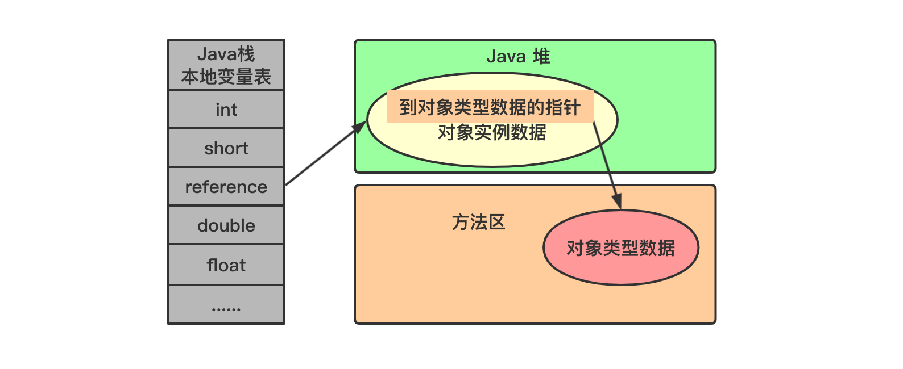

> HotSpot是使用``指针``的方式来访问对象：Java堆中会存放访问``类元数据``的地址，reference存储的就直接是对象的地址

## 堆 Heap

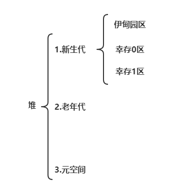

一个JVM实例只存在一个堆内存，堆内存的大小是可以调节的。类加载器读取了类文件后，需要把类、方法、常变量放到堆内存中，保存所有引用类型的真实信息，以方便执行器执行，堆内存分为三部分：

``Young Generation Space 新生区``         Young/New

``Tenure generation space 养老区``          Old/ Tenure

``Permanent Space  永久区``             Perm

一个JVM实例只存在一个堆内存，堆内存的大小是可以调节的。类加载器读取了类文件后，需要把类、方法、常变量放到堆内存中，保存所有引用类型的真实信息，以方便执行器执行。

堆内存物理上上分为：新生+养老

堆内存逻辑上分为三部分：新生+养老+永久

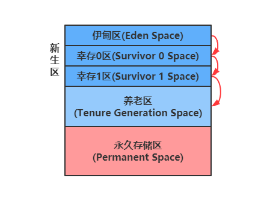

新生区是类的诞生、成长、消亡的区域，一个类在这里产生，应用，最后被垃圾回收器收集，结束生命。新生区又分为两部分： 伊甸区（Eden space）和幸存者区（Survivor pace） ，所有的类都是在伊甸区被new出来的。幸存区有两个： 0区（Survivor 0 space）和1区（Survivor 1 space）。当伊甸园的空间用完时，程序又需要创建对象，JVM的垃圾回收器将对伊甸园区进行``垃圾回收(Minor GC)``，将伊甸园区中的不再被其他对象所引用的对象进行销毁。然后将伊甸园中的剩余对象移动到幸存 0区。若幸存 0区也满了，再对该区进行垃圾回收，然后移动到 1 区。那如果1 区也满了呢？再移动到养老区。若养老区也满了，那么这个时候将产生``MajorGC（FullGC）``，进行养老区的内存清理。若养老区执行了Full GC之后发现依然无法进行对象的保存，就会``产生OOM异常“OutOfMemoryError”``。

如果出现java.lang.OutOfMemoryError: Java heap space异常，说明Java虚拟机的堆内存不够。原因有二：

1. Java虚拟机的堆内存设置不够，可以通过参数-Xms、-Xmx来调整。

2. 代码中创建了大量大对象，并且长时间不能被垃圾收集器收集（存在被引用）。

### MinorGC 过程（复制->清空->互换）

Java 堆从 GC 的角度还可以细分为：新生代（Eden区、From Survivor区和 To Survivor）和老年代。

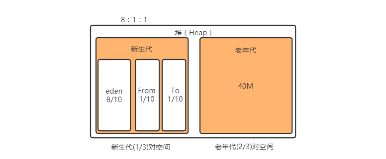

1、eden、SurvivorFrom 复制到 SurvivorTo，年龄+1 

首先，当Eden区满的时候会触发第一次GC,把还活着的对象拷贝到SurvivorFrom区，当Eden区再次触发GC的时候会扫描Eden区和From区域,对这两个区域进行垃圾回收，经过这次回收后还存活的对象,则直接复制到To区域（如果有对象的年龄已经达到了老年的标准，则赋值到老年代区），同时把这些对象的年龄+1

2、清空 eden、SurvivorFrom 

然后，清空Eden和SurvivorFrom中的对象，也即复制之后有交换，谁空谁是to

3、SurvivorTo和 SurvivorFrom 互换 

最后，SurvivorTo和SurvivorFrom互换，原SurvivorTo成为下一次GC时的SurvivorFrom区。部分对象会在From和To区域中复制来复制去,如此交换15次(由JVM参数``MaxTenuringThreshold``决定,这个参数默认是15),最终如果还是存活,就存入到老年代

### 永久代

实际而言，方法区（Method Area）和堆一样，是各个线程共享的内存区域，它用于存储虚拟机加载的：类信息+普通常量+静态常量+编译器编译后的代码等等，虽然JVM规范将方法区描述为堆的一个逻辑部分，但它却还有一个别名叫做Non-Heap(非堆)，目的就是要和堆分开。

对于HotSpot虚拟机，很多开发者习惯将方法区称之为``“永久代(Parmanent Gen)”`` ，但严格本质上说两者不同，或者说使用永久代来实现方法区而已，永久代是方法区(相当于是一个接口interface)的一个实现，``jdk1.7的版本中，已经将原本放在永久代的字符串常量池移走。``


永久区(java7之前有)，永久存储区是一个常驻内存区域，用于存放JDK自身所携带的 Class,Interface 的元数据，也就是说它存储的是运行环境必须的类信息，被装载进此区域的数据是不会被垃圾回收器回收掉的，关闭 JVM 才会释放此区域所占用的内存。

### 堆参数调优


在Java8中，永久代已经被移除，被一个称为**元空间**的区域所取代。元空间的本质和永久代类似。

元空间与永久代之间最大的区别在于：永久带使用的JVM的堆内存，但是java8以后的``元空间并不在虚拟机中而是使用本机物理内存``。

因此，默认情况下，元空间的大小仅受本地内存限制。类的元数据放入 native memory, ``字符串池和类的静态变量放入 java 堆中``，这样可以加载多少类的元数据就不再由MaxPermSize 控制, 而由系统的实际可用空间来控制。 


```java
public class T2 {
    public static void main(String[] args) {
        System.out.println("当前计算机核数 = " + Runtime.getRuntime().availableProcessors());

        //返回 Java 虚拟机试图使用的最大内存量
        long maxMemory = Runtime.getRuntime().maxMemory();
        //返回 Java 虚拟机中的内存总量
        long totalMemory = Runtime.getRuntime().totalMemory();
        System.out.println("-Xmx:MAX_MEMORY = " + maxMemory + "（字节）、" + (maxMemory / (double)1024 / 1024) + "MB");
        System.out.println("-Xms:TOTAL_MEMORY = " + totalMemory + "（字节）、" + (totalMemory / (double)1024 / 1024) + "MB");
    }
}
// 当前计算机核数 = 4
// -Xmx:MAX_MEMORY = 3793747968（字节）、3618.0MB
// -Xms:TOTAL_MEMORY = 257425408（字节）、245.5MB
```

> 发现默认的情况下分配的内存是总内存的“1 / 4”、而初始化的内存为“1 / 64”

配置VM参数：`` -Xms1024m -Xmx1024m -XX:+PrintGCDetails``

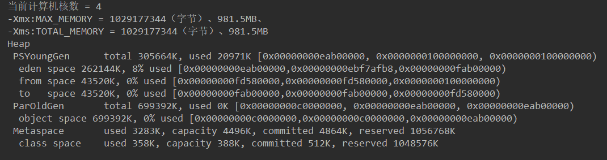

```java
public class T2 {
    public static void main(String[] args) {
        String str = "www.baidu.com" ;
        while(true) {
            str += str + new Random().nextInt(88888888) + new Random().nextInt(999999999) ;
        }
    }
}
// Exception in thread "main" java.lang.OutOfMemoryError: Java heap space
```

配置VM参数：``-Xms8m -Xmx8m -XX:+PrintGCDetails``

```markdown
[GC (Allocation Failure) [PSYoungGen: 1526K->504K(2048K)] 1526K->772K(7680K), 0.0009672 secs] [Times: user=0.00 sys=0.00, real=0.00 secs] 
[GC (Allocation Failure) [PSYoungGen: 1915K->499K(2048K)] 2183K->1017K(7680K), 0.0007847 secs] [Times: user=0.00 sys=0.00, real=0.00 secs] 
[GC (Allocation Failure) [PSYoungGen: 1942K->456K(2048K)] 2461K->1210K(7680K), 0.0008139 secs] [Times: user=0.00 sys=0.00, real=0.00 secs] 
[GC (Allocation Failure) [PSYoungGen: 1664K->504K(2048K)] 3363K->2674K(7680K), 0.0007038 secs] [Times: user=0.00 sys=0.00, real=0.00 secs] 
[GC (Allocation Failure) [PSYoungGen: 1949K->488K(2048K)] 6951K->5490K(7680K), 0.0009813 secs] [Times: user=0.00 sys=0.00, real=0.00 secs] 
[GC (Allocation Failure) --[PSYoungGen: 1432K->1432K(2048K)] 6434K->6434K(7680K), 0.0072110 secs] [Times: user=0.00 sys=0.00, real=0.01 secs] 
[Full GC (Ergonomics) [PSYoungGen: 1432K->0K(2048K)] [ParOldGen: 5002K->2625K(5632K)] 6434K->2625K(7680K), [Metaspace: 3294K->3294K(1056768K)], 0.0032568 secs] [Times: user=0.00 sys=0.00, real=0.00 secs] 
[GC (Allocation Failure) [PSYoungGen: 30K->0K(2048K)] 4544K->4513K(7680K), 0.0002178 secs] [Times: user=0.00 sys=0.00, real=0.00 secs] 
[GC (Allocation Failure) [PSYoungGen: 0K->0K(2048K)] 4513K->4513K(7680K), 0.0001809 secs] [Times: user=0.00 sys=0.00, real=0.00 secs] 
[Full GC (Allocation Failure) [PSYoungGen: 0K->0K(2048K)] [ParOldGen: 4513K->3568K(5632K)] 4513K->3568K(7680K), [Metaspace: 3294K->3294K(1056768K)], 0.0041181 secs] [Times: user=0.03 sys=0.00, real=0.00 secs] 
[Full GC (Allocation Failure) Exception in thread "main" java.lang.OutOfMemoryError: Java heap space
	at java.util.Arrays.copyOf(Arrays.java:3332)
	at java.lang.AbstractStringBuilder.expandCapacity(AbstractStringBuilder.java:137)
	at java.lang.AbstractStringBuilder.ensureCapacityInternal(AbstractStringBuilder.java:121)
	at java.lang.AbstractStringBuilder.append(AbstractStringBuilder.java:647)
	at java.lang.StringBuilder.append(StringBuilder.java:208)
	at jvm.T2.main(T2.java:22)
[PSYoungGen: 0K->0K(2048K)] [ParOldGen: 3568K->3547K(5632K)] 3568K->3547K(7680K), [Metaspace: 3294K->3294K(1056768K)], 0.0047886 secs] [Times: user=0.00 sys=0.00, real=0.01 secs] 
Heap
 PSYoungGen      total 2048K, used 61K [0x00000000ffd80000, 0x0000000100000000, 0x0000000100000000)
  eden space 1536K, 3% used [0x00000000ffd80000,0x00000000ffd8f438,0x00000000fff00000)
  from space 512K, 0% used [0x00000000fff80000,0x00000000fff80000,0x0000000100000000)
  to   space 512K, 0% used [0x00000000fff00000,0x00000000fff00000,0x00000000fff80000)
 ParOldGen       total 5632K, used 3547K [0x00000000ff800000, 0x00000000ffd80000, 0x00000000ffd80000)
  object space 5632K, 62% used [0x00000000ff800000,0x00000000ffb76fd0,0x00000000ffd80000)
 Metaspace       used 3327K, capacity 4496K, committed 4864K, reserved 1056768K
  class space    used 363K, capacity 388K, committed 512K, reserved 1048576K
```

​                        

## GC 算法

GC是什么(分代收集算法)

次数上频繁收集Young区

次数上较少收集Old区

基本不动元空间

### GC 算法总体概述


JVM在进行GC时，并非每次都对上面三个内存区域一起回收的，大部分时候回收的都是指新生代。
因此GC按照回收的区域又分了两种类型，一种是普通GC（minor GC），一种是全局GC（major GC or Full GC）

> Minor GC和Full GC的区别：
> ``普通GC（minor GC）``只针对新生代区域的GC,指发生在新生代的垃圾收集动作，因为大多数Java对象存活率都不高，所以Minor GC非常频繁，一般回收速度也比较快
> ``全局GC（major GC or Full GC）``指发生在老年代的垃圾收集动作，出现了Major GC，经常会伴随至少一次的Minor GC（但并不是绝对的）。Major GC的速度一般要比Minor GC慢上10倍以上

### 引用计数算法

```java
public class RefCountGC {
  private byte[] bigSize = new byte[2 * 1024 * 1024];//这个成员属性唯一的作用就是占用一点内存
  Object instance = null;
 
  public static void main(String[] args)
  {
    RefCountGC objectA = new RefCountGC();
    RefCountGC objectB = new RefCountGC();
    objectA.instance = objectB;
    objectB.instance = objectA;
    objectA = null;
    objectB = null;
 	// 不会立即开始GC，类似Thread.start0
    System.gc();
  }
}
```

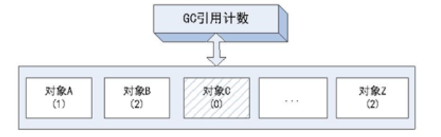

缺点：

1. 每次对对象赋值时均要维护引用计数器，且计数器本身也有一定的消耗

2. 较难处理循环引用

JVM的实现一般不采用这种方式。

### 复制算法(Copying)

#### 原理

年轻代中使用的是Minor GC，这种GC算法采用的是复制算法(Copying)。

Minor GC会把Eden中的所有活的对象都移到Survivor区域中，如果Survivor区中放不下，那么剩下的活的对象就被移到Old generation中，``也即一旦收集后，Eden是就变成空的了``。
当对象在 Eden ( 包括一个 Survivor 区域，这里假设是 from 区域 ) 出生后，在经过一次 Minor GC 后，如果对象还存活，并且能够被另外一块 Survivor 区域所容纳( 上面已经假设为 from 区域，这里应为 to 区域，即 to 区域有足够的内存空间来存储 Eden 和 from 区域中存活的对象 )，则使用复制算法将这些仍然还存活的对象复制到另外一块 Survivor 区域 ( 即 to 区域 ) 中，然后清理所使用过的 Eden 以及 Survivor 区域 ( 即 from 区域 )，并且将这些对象的年龄设置为1，以后对象在 Survivor 区每熬过一次 Minor GC，就将对象的年龄 + 1，当对象的年龄达到某个值时 ( 默认是 15 岁，通过-XX:MaxTenuringThreshold 来设定参数)，这些对象就会成为老年代。

``-XX:MaxTenuringThreshold`` 设置对象在新生代中存活的次数

#### 动态演示

年轻代中的GC,主要是复制算法（Copying）

HotSpot JVM把年轻代分为了三部分：1个Eden区和2个Survivor区（分别叫from和to）。默认比例为8:1:1,一般情况下，新创建的对象都会被分配到Eden区(一些大对象特殊处理),这些对象经过第一次Minor GC后，如果仍然存活，将会被移到Survivor区。对象在Survivor区中每熬过一次Minor GC，年龄就会增加1岁，当它的年龄增加到一定程度时，就会被移动到年老代中。因为年轻代中的对象基本都是朝生夕死的(90%以上)，所以在``年轻代的垃圾回收算法使用的是复制算法``，复制算法的基本思想就是将内存分为两块，每次只用其中一块，当这一块内存用完，就将还活着的对象复制到另外一块上面。``复制算法不会产生内存碎片``。


在GC开始的时候，对象只会存在于Eden区和名为“From”的Survivor区，Survivor区“To”是空的。紧接着进行GC，Eden区中所有存活的对象都会被复制到“To”，而在“From”区中，仍存活的对象会根据他们的年龄值来决定去向。年龄达到一定值(年龄阈值，可以通过-XX:MaxTenuringThreshold来设置)的对象会被移动到年老代中，没有达到阈值的对象会被复制到“To”区域。``经过这次GC后，Eden区和From区已经被清空。这个时候，“From”和“To”会交换他们的角色，也就是新的“To”就是上次GC前的“From”，新的“From”就是上次GC前的“To”``。不管怎样，都会保证名为To的Survivor区域是空的。Minor GC会一直重复这样的过程，直到“To”区被填满，“To”区被填满之后，会将所有对象移动到年老代中。


因为Eden区对象一般存活率较低，一般的，使用两块10%的内存作为空闲和活动区间，而另外80%的内存，则是用来给新建对象分配内存的。一旦发生GC，将10%的from活动区间与另外80%中存活的eden对象转移到10%的to空闲区间，接下来，将之前90%的内存全部释放，以此类推。 


#### 劣势

复制算法它的缺点也是相当明显的。 

1. 它浪费了一半的内存，这太要命了。 
2. 如果对象的存活率很高，我们可以极端一点，假设是100%存活，那么我们需要将所有对象都复制一遍，并将所有引用地址重置一遍。复制这一工作所花费的时间，在对象存活率达到一定程度时，将会变的不可忽视。 所以从以上描述不难看出，复制算法要想使用，最起码对象的存活率要非常低才行，而且最重要的是，我们必须要克服50%内存的浪费。

### 标记清除(Mark-Sweep)

#### 原理

老年代一般是由标记清除或者是标记清除与标记整理的混合实现。


用通俗的话解释一下标记清除算法，就是当程序运行期间，若可以使用的内存被耗尽的时候，GC线程就会被触发并将程序暂停，随后将要回收的对象标记一遍，最终统一回收这些对象，完成标记清理工作接下来便让应用程序恢复运行。

主要进行两项工作，第一项则是标记，第二项则是清除。  
标记：从引用根节点开始标记遍历所有的GC Roots， 先标记出要回收的对象。
清除：遍历整个堆，把标记的对象清除。 
缺点：此算法需要暂停整个应用，会产生内存碎片 

#### 动态演示


#### 劣势

1. 首先，它的缺点就是效率比较低（递归与全堆对象遍历），而且在进行GC的时候，需要停止应用程序，这会导致用户体验非常差劲。
2. 其次，主要的缺点则是这种方式清理出来的空闲内存是不连续的，这点不难理解，我们的死亡对象都是随即的出现在内存的各个角落的，现在把它们清除之后，内存的布局自然会乱七八糟。而为了应付这一点，JVM就不得不维持一个内存的空闲列表，这又是一种开销。而且在分配数组对象的时候，寻找连续的内存空间会不太好找。

### 标记压缩(Mark-Compact)

#### 原理

老年代一般是由标记清除或者是标记清除与标记整理的混合实现 。

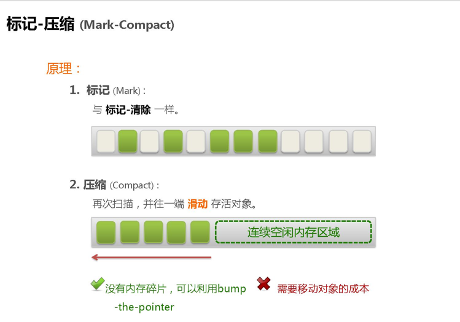

在整理压缩阶段，不再对标记的对像做回收，而是通过所有存活对像都向一端移动，然后直接清除边界以外的内存。
可以看到，标记的存活对象将会被整理，按照内存地址依次排列，而未被标记的内存会被清理掉。如此一来，当我们需要给新对象分配内存时，JVM只需要持有一个内存的起始地址即可，这比维护一个空闲列表显然少了许多开销。

标记/整理算法不仅可以弥补标记/清除算法当中，内存区域分散的缺点，也消除了复制算法当中，内存减半的高额代价 

#### 动态演示


#### 劣势

标记/整理算法唯一的缺点就是效率也不高，不仅要标记所有存活对象，还要整理所有存活对象的引用地址。
从效率上来说，标记/整理算法要低于复制算法。

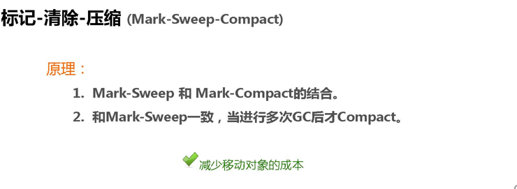

### 总结

内存效率：复制算法>标记清除算法>标记整理算法（此处的效率只是简单的对比时间复杂度，实际情况不一定如此）。 
内存整齐度：复制算法=标记整理算法>标记清除算法。 
内存利用率：标记整理算法=标记清除算法>复制算法。 

可以看出，效率上来说，复制算法是当之无愧的老大，但是却浪费了太多内存，而为了尽量兼顾上面所提到的三个指标，标记/整理算法相对来说更平滑一些，但效率上依然不尽如人意，它比复制算法多了一个标记的阶段，又比标记/清除多了一个整理内存的过程

难道就没有一种最优算法吗？ 猜猜看，下面还有


回答：无，没有最好的算法，只有最合适的算法。==========>分代收集算法。

#### 年轻代(Young Gen)  

``年轻代特点是区域相对老年代较小，对像存活率低``。


这种情况复制算法的回收整理，速度是最快的。复制算法的效率只和当前存活对像大小有关，因而很适用于年轻代的回收。而复制算法内存利用率不高的问题，通过hotspot中的两个survivor的设计得到缓解。

#### 老年代(Tenure Gen)

``老年代的特点是区域较大，对像存活率高``。

这种情况，存在大量存活率高的对像，复制算法明显变得不合适。一般是由标记清除或者是标记清除与标记整理的混合实现。

``Mark阶段的开销与存活对像的数量成正比``，这点上说来，对于老年代，标记清除或者标记整理有一些不符，但可以通过多核/线程利用，对并发、并行的形式提标记效率。

``Sweep阶段的开销与所管理区域的大小形正相关``，但Sweep“就地处决”的特点，回收的过程没有对像的移动。使其相对其它有对像移动步骤的回收算法，仍然是效率最好的。但是需要解决内存碎片问题。

``Compact阶段的开销与存活对像的数据成开比``，如上一条所描述，对于大量对像的移动是很大开销的，做为老年代的第一选择并不合适。

基于上面的考虑，老年代一般是由标记清除或者是标记清除与标记整理的混合实现。以hotspot中的CMS回收器为例，CMS是基于Mark-Sweep实现的，对于对像的回收效率很高，而对于碎片问题，CMS采用基于Mark-Compact算法的Serial Old回收器做为补偿措施：当内存回收不佳（碎片导致的Concurrent Mode Failure时），将采用Serial Old执行Full GC以达到对老年代内存的整理。

# JUC

## JUC 是什么

java.util.concurrent 在并发编程中使用的工具类

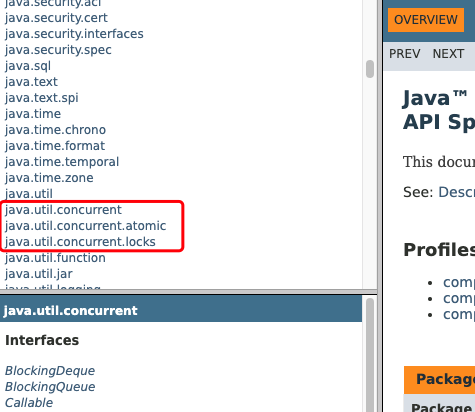

## 进程/线程

``进程`` 是一个具有一定独立功能的程序关于某个数据集合的一次运行活动。它是操作系统动态执行的基本单元，在传统的操作系统中，进程既是基本的分配单元，也是基本的执行单元。 

``线程`` 通常在一个进程中可以包含若干个线程，当然一个进程中至少有一个线程，不然没有存在的意义。线程可以利用进程所拥有的资源，在引入线程的操作系统中，通常都是把进程作为分配资源的基本单位，而把线程作为独立运行和独立调度的基本单位，由于线程比进程更小，基本上不拥有系统资源，故对它的调度所付出的开销就会小得多，能更高效的提高系统多个程序间并发执行的程度。 

## 线程状态

```java
Thread.State
public enum State {
     NEW, //新建
     RUNNABLE, //就绪
     BLOCKED, // 阻塞
     WAITING, //等待
     TIMED_WAITING, //等待时间内等待
     TERMINATED; // 终结
}
```

## wait/sleep的区别

功能都是当前线程暂停，有什么区别？ 

wait放开手去睡，放开手里的锁

sleep握紧手去睡，醒了手里还有锁 

## 并行/并发

并发：同一时刻多个线程在访问同一个资源，多个线程对一个点   例子：小米9今天上午10点，限量抢购 春运抢票      电商秒杀... 

并行：多项工作一起执行，之后再汇总   例子：泡方便面，电水壶烧水，一边撕调料倒入桶中 

## Synchronized

多线程编程模板：在高内聚低耦合的前提下，线程 --> 操作（对外暴露的调用方法）--> 资源类

```java
// 1、创建资源类
class Ticket {
    private int number = 30;
    private Lock lock = new ReentrantLock();

    public synchronized void saleTicket() {
        if (number > 0) {
            System.out.println(Thread.currentThread().getName() + "\t卖出第" + (number--) + "\t还剩下" + number);
        }
    }
}

// 2、资源类里创建同步方法、同步代码块
public class SaleTicket {
    public static void main(String[] args) {
        Ticket ticket = new Ticket();
        new Thread(new Runnable() {
            @Override
            public void run() {
                for (int i = 0; i <= 40 ; i++) {
                    ticket.saleTicket();
                }
            }
        }, "A").start();
        new Thread(new Runnable() {
            @Override
            public void run() {
                for (int i = 0; i <= 40 ; i++) {
                    ticket.saleTicket();
                }
            }
        }, "B").start();
        new Thread(new Runnable() {
            @Override
            public void run() {
                for (int i = 0; i <= 40 ; i++) {
                    ticket.saleTicket();
                }
            }
        }, "C").start();
    }
}
```

## Lock 接口

### Lock 接口是什么


> Lock implementations provide more extensive locking operations than can be obtained using synchronized methods and statements. They allow more flexible structuring, may have quite different properties, and may support multiple associated Condition objects. 

 锁实现提供了比使用同步方法和语句可以获得的更广泛的锁操作。它们允许更灵活的结构，可能具有非常不同的属性，并且可能支持多个关联的条件对象。 

### Lock接口的实现

``ReentrantLock`` 可重入锁

```java
class X {
  private final ReentrantLock lock = new ReentrantLock();
  // ...

  public void m() {
   lock.lock(); // block until condition holds
   try {
    // ... method body
   } finally {
    lock.unlock()
   }
  }
}
```

#### synchronized与Lock的区别

两者区别：

1. 首先synchronized是java内置关键字，在jvm层面，Lock是个java类；

2. synchronized无法判断是否获取锁的状态，Lock可以判断是否获取到锁；

3. synchronized会自动释放锁(a 线程执行完同步代码会释放锁 ；b 线程执行过程中发生异常会释放锁)，Lock需在finally中手工释放锁（unlock()方法释放锁），否则容易造成线程死锁；

4. 用synchronized关键字的两个线程1和线程2，如果当前线程1获得锁，线程2线程等待。如果线程1阻塞，线程2则会一直等待下去，而Lock锁就不一定会等待下去，如果尝试获取不到锁，线程可以不用一直等待就结束了；

5. synchronized的锁可重入、不可中断、非公平，而Lock锁可重入、可判断、可公平（两者皆可）

6. Lock锁适合大量同步的代码的同步问题，synchronized锁适合代码少量的同步问题。

### 创建线程的方式

```java
// 不能这样写
// 继承Thread
public   class  SaleTicket  extends  Thread //java是 单继承，资源宝贵，要用接口方式 
// new Thread()
Thread  t1  =  new  Thread(); 
t1 .start(); 

// 正确的方式
Thread(Runnable target, String name)  
// 匿名内部类-》 lambda表达式
new  Thread( new  Runnable() { 
     @Override 
     public   void  run() { 
  
    } 
   },  "your thread name" ).start(); 
new  Thread(() -> { 
  
 },  "your thread name" ).start(); 
```

```java
class Ticket {
    private int number = 30;
    private Lock lock = new ReentrantLock();

    public void saleTicket() {
        lock.lock();
        try {
            if (number > 0) {
                System.out.println(Thread.currentThread().getName() + "\t卖出第" + (number--) + "\t还剩下" + number);
            }
        } finally {
            lock.unlock();
        }
    }
}

/**
 * 多线程编程的企业级套路+模版
 * 1. 在高内聚低耦合的前提下，线程   操作（对外暴露的调用方法）   资源类
 */
public class SaleTicket {
    public static void main(String[] args) {
        Ticket ticket = new Ticket();
        new Thread(() -> {
            for (int i = 0; i <= 40 ; i++) {
                ticket.saleTicket();
            }
        }, "A").start();
        new Thread(() -> {
            for (int i = 0; i <= 40 ; i++) {
                ticket.saleTicket();
            }
        }, "B").start();
        new Thread(() -> {
            for (int i = 0; i <= 40 ; i++) {
                ticket.saleTicket();
            }
        }, "C").start();
    }
}
```

### lambda 表达式复习

```java
@FunctionalInterface
interface Foo {
    int add(int x, int y);

    default int div(int x, int y) {
        System.out.println("div");
        return x / y;
    }
    default int mul(int x, int y) {
        System.out.println("mul");
        return x * y;
    }
    public static int sub (int x, int y) {
        System.out.println("sub");
        return x - y;
    }
}

/**
 * 拷贝小括号，写死右箭头，落地大括号
 * FunctionInterface
 * default
 */
public class LambdaExpress {
    public static void main(String[] args) {
        Foo foo = (x, y) -> {
            System.out.println("add");
            return x + y;
        };
        System.out.println(foo.add(10, 5));
        System.out.println(foo.div(10,5));
        System.out.println(foo.mul(10,5));
        System.out.println(Foo.sub(10,5));
    }
}
```

## 线程间通信

1. 生产者+消费者
2. 通知等待唤醒机制

### synchronized实现

```java
class AirConditioner {
    private int number = 0;

    public synchronized void increment() throws InterruptedException {
        // 判断，如果是if，被唤醒时不会重新检查
        while (number != 0) {
            this.wait();
        }
        // 执行
        number++;
        System.out.println(Thread.currentThread().getName() + "\t" + number);
        // 通知
        this.notifyAll();
    }

    public synchronized void decrement() throws InterruptedException {
        while (number == 0) {
            this.wait();
        }
        number--;
        System.out.println(Thread.currentThread().getName() + "\t" + number);
        this.notifyAll();
    }
}

/**
 * 两个线程，操作一个初始值为0的变量
 * 实现一个线程对该变量+1，一个-1
 * 实现交替，10轮，变量初始值为0
 *
 * 判断/执行/通知
 * 多线程交互中，必须要防止多线程的虚假唤醒，也就（判断用while，不用if）
 */
public class ThreadWaitNotifyDemo {
    public static void main(String[] args) {
        AirConditioner airConditioner = new AirConditioner();
        new Thread(() -> {
            for (int i = 1; i <= 10; i++) {
                try {
                    Thread.sleep(200);
                    airConditioner.increment();
                } catch (InterruptedException e) {
                    e.printStackTrace();
                }
            }
        }, "A").start();
        new Thread(() -> {
            for (int i = 1; i <= 10; i++) {
                try {
                    Thread.sleep(300);
                    airConditioner.decrement();
                } catch (InterruptedException e) {
                    e.printStackTrace();
                }
            }
        }, "B").start();

        new Thread(() -> {
            for (int i = 1; i <= 10; i++) {
                try {
                    Thread.sleep(400);
                    airConditioner.increment();
                } catch (InterruptedException e) {
                    e.printStackTrace();
                }
            }
        }, "C").start();
        new Thread(() -> {
            for (int i = 1; i <= 10; i++) {
                try {
                    Thread.sleep(500);
                    airConditioner.decrement();
                } catch (InterruptedException e) {
                    e.printStackTrace();
                }
            }
        }, "D").start();
    }
}
```

### java 8 新版实现

```java
class AirConditioner {
    private int number = 0;

    private Lock lock = new ReentrantLock();
    private Condition condition = lock.newCondition();

    public void increment() throws InterruptedException {
        lock.lock();
        try {
            // 判断，如果是if，被唤醒时不会重新检查
            while (number != 0) {
                condition.await(); //this.wait();
            }
            // 执行
            number++;
            System.out.println(Thread.currentThread().getName() + "\t" + number);
            // 通知
            condition.signalAll(); //this.notifyAll();
        } finally {
            lock.unlock();
        }
    }

    public synchronized void decrement() throws InterruptedException {
        lock.lock();
        try {
            while (number == 0) {
                condition.await();
            }
            number--;
            System.out.println(Thread.currentThread().getName() + "\t" + number);
            condition.signalAll();
        } finally {
            lock.unlock();
        }
    }
}
```

## 线程间定制化调用通信

```java
class ShareResource {

    //1:A 2:B 3:C
    private int number = 1;
    private Lock lock = new ReentrantLock();
    private Condition condition1 = lock.newCondition();
    private Condition condition2 = lock.newCondition();
    private Condition condition3 = lock.newCondition();

    public void print5() {
        lock.lock();
        try {
            while (number != 1) {
                condition1.await();
            }
            for (int i = 1; i <= 5; i++) {
                System.out.println(Thread.currentThread().getName() + "\t" + i);
            }
            number = 2;
            condition2.signal();
        } catch (InterruptedException e) {
            e.printStackTrace();
        } finally {
            lock.unlock();
        }
    }

    public void print10() {
        lock.lock();
        try {
            while (number != 2) {
                condition2.await();
            }
            for (int i = 1; i <= 10; i++) {
                System.out.println(Thread.currentThread().getName() + "\t" + i);
            }
            number = 3;
            condition3.signal();
        } catch (InterruptedException e) {
            e.printStackTrace();
        } finally {
            lock.unlock();
        }
    }

    public void print15() {
        lock.lock();
        try {
            while (number != 3) {
                condition3.await();
            }
            for (int i = 1; i <= 15; i++) {
                System.out.println(Thread.currentThread().getName() + "\t" + i);
            }
            number = 1;
            condition1.signal();
        } catch (InterruptedException e) {
            e.printStackTrace();
        } finally {
            lock.unlock();
        }
    }
}

/**
 * 多线程之间实现A->B->C
 *
 * 1. 在高内聚低耦合的前提下，线程   操作（对外暴露的调用方法）   资源类
 * 2. 断/执行/通知
 * 3. 多线程交互中，必须要防止多线程的虚假唤醒，也就（判断用while，不用if）
 * 4. 标识位
 */
public class ThreadOrderAccess {
    public static void main(String[] args) {
        ShareResource shareResource = new ShareResource();
        new Thread(() -> {
            for (int i = 1; i <= 10; i++) {
                shareResource.print5();
            }
        }, "AA").start();
        new Thread(() -> {
            for (int i = 1; i <= 10; i++) {
                shareResource.print10();
            }
        }, "BB").start();
        new Thread(() -> {
            for (int i = 1; i <= 10; i++) {
                shareResource.print15();
            }
        }, "CC").start();
    }
}
```

## 多线程锁

```java
class Phone {

    public /*static*/ synchronized void sendEmail() throws Exception {
        //try { TimeUnit.SECONDS.sleep(4); } catch (InterruptedException e) { e.printStackTrace(); }
        System. out .println( "------sendEmail" );
    }

    public /*static*/ synchronized void sendSMS() throws Exception {
        System. out .println( "------sendSMS" );
    }

    public void hello() throws Exception {
        System. out .println( "------hello" );
    }
}

/**
 * 多线程8锁
 * 1. 标准访问，先打印邮件
 * 2. 邮件方法暂停4秒钟，先打印邮件
 * 3. 新增一个普通方法hello, 先打印hello
 * 4. 两部手机，先打印短信
 * 5. 两个静态同步方法，同一部手机，邮件
 * 6. 两个静态同步方法，2部手机，邮件
 * 7. 一个普通一个静态同步方法，1部手机，短信
 * 8. 一个普通一个静态同步方法，2部手机，短信
 */
public class Lock8 {
    public static void main(String[] args) throws InterruptedException {
        Phone phone = new Phone();
        Phone phone1 = new Phone();
        new Thread(() -> {
            try {
                phone.sendEmail();
            } catch (Exception e) {
                e.printStackTrace();
            }
        }, "A").start();
        Thread.sleep(100);
        new Thread(() -> {
            try {
                phone.sendSMS();
                //phone.hello();
                //phone1.sendSMS();
            } catch (Exception e) {
                e.printStackTrace();
            }
        }, "B").start();
    }
}
```

一个对象里面如果有多个synchronized方法，某一个时刻内，只要一个线程去调用其中的一个synchronized方法了， 其它的线程都只能等待，换句话说，某一个时刻内，只能有唯一一个线程去访问这些synchronized方法锁的是当前对象this，被锁定后，其它的线程都不能进入到当前对象的其它的synchronized方法 。

加个普通方法后发现和同步锁无关。

换成两个对象后，不是同一把锁了，情况立刻变化。 

 

synchronized实现同步的基础：Java中的每一个对象都可以作为锁。 

具体表现为以下3种形式。 

对于普通同步方法，锁是当前实例对象。 

对于静态同步方法，锁是当前类的Class对象。 

对于同步方法块，锁是 Synchonized 括号里配置的对象 

 当一个线程试图访问同步代码块时，它首先必须得到锁，退出或抛出异常时必须释放锁。 

 也就是说如果一个实例对象的非静态同步方法获取锁后，该实例对象的其他非静态同步方法必须等待获取锁的方法释放锁后才能获取锁， 可是别的实例对象的非静态同步方法因为跟该实例对象的非静态同步方法用的是不同的锁， 所以毋须等待该实例对象已获取锁的非静态同步方法释放锁就可以获取他们自己的锁。 

 

所有的静态同步方法用的也是同一把锁——类对象本身， 这两把锁是两个不同的对象，所以静态同步方法与非静态同步方法之间是不会有竞态条件的。 

但是一旦一个静态同步方法获取锁后，其他的静态同步方法都必须等待该方法释放锁后才能获取锁， 而不管是同一个实例对象的静态同步方法之间， 还是不同的实例对象的静态同步方法之间，只要它们同一个类的实例对象！ 

## 集合不安全

```java
/**
 * 集合类是不安全的
 * 1. 故障现象 java.util.ConcurrentModificationException
 * 解决方案
 *  Vector
 *  Collections.synchronizedList(new ArrayList<>())
 *  new CopyOnWriteArrayList<>()
 */
public class NotSafeDemo {
    public static void main(String[] args) {
        List<String> list = new CopyOnWriteArrayList<>();//Collections.synchronizedList(new ArrayList<>());//new Vector<>(); //new ArrayList<>();

        for (int i = 1; i <= 30; i++) {
            new Thread(() -> {
                list.add(UUID.randomUUID().toString().substring(0, 8));
                System.out.println(list);
            }, String.valueOf(i)).start();
        }
    }
}
```

ArrayList在迭代的时候如果同时对其进行修改就会抛出``java.util.ConcurrentModificationException``异常并发修改异常。

```java
// 看ArrayList的源码 
public boolean add( E  e) {
  ensureCapacityInternal( size  +  1 );   // Increments modCount!!
  elementData [ size ++] = e;
  return true ;
} 
// 没有 synchronized 线程不安全 
```

### Vector

```java
// 看Vector的源码 
public synchronized boolean add( E  e) {
  modCount ++;
  ensureCapacityHelper( elementCount  +  1 );
  elementData [ elementCount ++] = e;
  return true ;
} 
//有 synchronized 线程安全 
```



### Collections

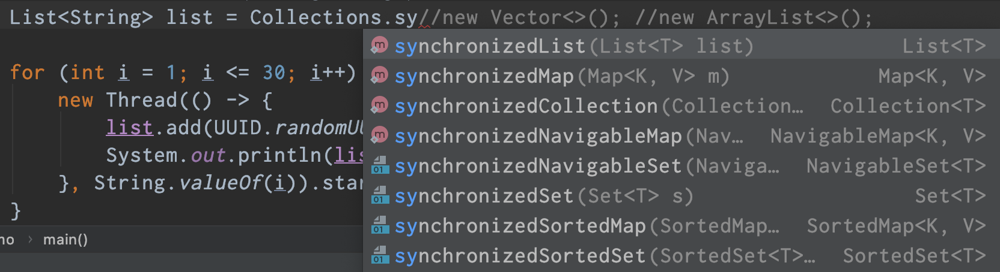

Collections提供了方法 *synchronizedList*保证*list*是同步线程安全的。

那*HashMap*，*HashSet*是线程安全的吗？也不是，所以有同样的线程安全方法。

### 写时复制

不加锁性能提升出错误，加锁数据一致性能下降。

> A thread-safe variant of ArrayList in which all mutative operations (add, set, and so on) are implemented by making a fresh copy of the underlying array. 

CopyOnWriteArrayList是arraylist的一种线程安全变体， 其中所有可变操作（add、set等）都是通过生成底层数组的新副本来实现的。 

```java
/**
 * Appends the specified element to the end of this list.
 *
 * @param e element to be appended to this list
 * @return {@code true} (as specified by {@link Collection#add})
 */
public boolean add(E e) {
    final ReentrantLock lock = this.lock;
    lock.lock();
    try {
        Object[] elements = getArray();
        int len = elements.length;
        Object[] newElements = Arrays.copyOf(elements, len + 1);
        newElements[len] = e;
        setArray(newElements);
        return true;
    } finally {
        lock.unlock();
    }
}
```

*CopyOnWrite*容器即写时复制的容器。往一个容器添加元素的时候，不直接往当前容器*Object[]*添加，而是先将当前容器*Object[]*进行*Copy*，复制出一个新的容器*Object[] newElements*，然后向新的容器*Object[] newElements*里添加元素。添加元素后，再将原容器的引用指向新的容器*setArray(newElements)*。
这样做的好处是可以对*CopyOnWrite*容器进行并发的读，而不需要加锁，因为当前容器不会添加任何元素。所以*CopyOnWrite*容器也是一种读写分离的思想，读和写不同的容器。 

#### HashSet

```java
Set<String> set = new HashSet<>();//线程不安全 
Set<String> set = new CopyOnWriteArraySet<>();//线程安全
```

 HashSet底层数据结构是什么？ 

HashMap

 但HashSet的add是放一个值，而HashMap是放K、V键值对 

```java
public HashSet() {
   map = new HashMap<>();
} 
private static final Object PRESENT = new Object(); 

public boolean add( E e) {
   return map.put(e, PRESENT)==null;
} 
```

#### HashMap

```java
Map<String,String> map =  new  HashMap<>();//线程不安全 
Map<String,String> map =  new  ConcurrentHashMap<>();//线程安全
```

## Callable接口

获得多线程的方法几种?

传统的 是继承thread类和实现runnable接口，java5以后又有实现 callable接口 和 java的线程池获得。

这是一个``函数式接口``，因此可以用作lambda表达式或方法引用的赋值对象 。 


### 与Runnable对比

```java
// 创建新类MyThread实现runnable接口 
class MyThread implements Runnable{ 
 @Override 
 public void run() { 
  
 } 
} 
// 新类MyThread2实现callable接口 
class MyThread2 implements Callable<Integer>{ 
 @Override 
 public Integer call() throws Exception { 
  return 200; 
 }  
} 
```

callable接口与runnable接口的区别？ 

（1）是否有返回值 

（2）是否抛异常 
（3）落地方法不一样，一个是run，一个是call 

### FutureTask

Thread类的构造方法根本没有Callable，可以找中间人介绍。中间人是什么？ java多态，一个类可以实现多个接口！！ 


未来的任务，用它就干一件事，异步调用 main方法就像一个冰糖葫芦，一个个方法由main串起来。 

但解决不了一个问题：正常调用挂起堵塞问题 

 在主线程中需要执行比较耗时的操作时，但又不想阻塞主线程时，可以把这些作业交给Future对象在后台完成，当主线程将来需要时，就可以通过Future对象获得后台作业的计算结果或者执行状态。 

一般FutureTask多用于耗时的计算，主线程可以在完成自己的任务后，再去获取结果。 

仅在计算完成时才能检索结果；如果计算尚未完成，则阻塞 get 方法。一旦计算完成， 就不能再重新开始或取消计算。get方法而获取结果只有在计算完成时获取，否则会一直阻塞直到任务转入完成状态， 然后会返回结果或者抛出异常。 

只计算一次，get方法放到最后 

```java
class MyThread implements Callable<Integer> {

    @Override
    public Integer call() throws Exception {
        System.out.println("********come in");
        try { TimeUnit.SECONDS.sleep(4); } catch (InterruptedException e) { e.printStackTrace(); }
        return 1024;
    }
}

public class CallableDemo {
    public static void main(String[] args) throws ExecutionException, InterruptedException {
        FutureTask futureTask = new FutureTask(new MyThread());
        new Thread(futureTask, "A").start();
        System.out.println("main*******计算完成");
        System.out.println(futureTask.get());
    }
}
```

## JUC强大的辅助类

### CountDownLatch 减少计数

CountDownLatch主要有两个方法，当一个或多个线程调用await方法时，这些线程会阻塞。 

其它线程调用countDown方法会将计数器减1(调用countDown方法的线程不会阻塞)，当计数器的值变为0时，因await方法阻塞的线程会被唤醒，继续执行。 

```java
/**
  * 
  * @Description:
  * 让一些线程阻塞直到另一些线程完成一系列操作后才被唤醒。
  * 
  * CountDownLatch主要有两个方法，当一个或多个线程调用await方法时，这些线程会阻塞。
  * 其它线程调用countDown方法会将计数器减1(调用countDown方法的线程不会阻塞)，
  * 当计数器的值变为0时，因await方法阻塞的线程会被唤醒，继续执行。
  * 
  * 解释：6个同学陆续离开教室后值班同学才可以关门。
  * main主线程必须要等前面6个线程完成全部工作后，自己才能开干 
  */
public class CountDownLatchDemo {
    public static void main(String[] args) throws InterruptedException {
        CountDownLatch countDownLatch = new CountDownLatch(6);
        for (int i = 1; i <= 6; i++) {
            new Thread(() -> {
                System.out.println(Thread.currentThread().getName() + "\t离开教室");
                countDownLatch.countDown();
            }, String.valueOf(i)).start();
        }
        countDownLatch.await();
        System.out.println(Thread.currentThread().getName() + "\t班长离开教室");
    }

    public static void closeDoor() {
        for (int i = 1; i <= 6; i++) {
            new Thread(() -> {
                System.out.println(Thread.currentThread().getName() + "\t离开教室");
            }, String.valueOf(i)).start();
        }
        System.out.println(Thread.currentThread().getName() + "\t班长离开教室");
    }
}
```

### CyclicBarrier 循环栅栏

 CountDownLatch主要有两个方法，当一个或多个线程调用await方法时，这些线程会阻塞。 

 其它线程调用countDown方法会将计数器减1(调用countDown方法的线程不会阻塞)，当计数器的值变为0时，因await方法阻塞的线程会被唤醒，继续执行。 

```java
/**
  * CyclicBarrier 的字面意思是可循环（Cyclic）使用的屏障（Barrier）。它要做的事情是，
  * 让一组线程到达一个屏障（也可以叫同步点）时被阻塞，
  * 直到最后一个线程到达屏障时，屏障才会开门，所有
  * 被屏障拦截的线程才会继续干活。
  * 线程进入屏障通过CyclicBarrier的await()方法。
  * 
  * 集齐7颗龙珠就可以召唤神龙
  */
public class CyclicBarrierDemo {
    public static void main(String[] args) {
        // CyclicBarrier(int parties, Runnable barrierAction)
        CyclicBarrier cyclicBarrier = new CyclicBarrier(7, () -> System.out.println("*********召唤神龙"));

        for (int i = 1;i <= 7;i++) {
            final int tempInt = i;
            new Thread(() -> {
                System.out.println(Thread.currentThread().getName() + "\t收集到第" + tempInt + "颗龙珠");
                try {
                    cyclicBarrier.await();
                } catch (InterruptedException e) {
                    e.printStackTrace();
                } catch (BrokenBarrierException e) {
                    e.printStackTrace();
                }
            }, String.valueOf(i)).start();
        }
    }
}
```

### Semaphore 信号灯

 在信号量上我们定义两种操作： 

 acquire（获取） 当一个线程调用acquire操作时，它要么通过成功获取信号量（信号量减1），要么一直等下去，直到有线程释放信号量，或超时。 

release（释放）实际上会将信号量的值加1，然后唤醒等待的线程。 

信号量主要用于两个目的，一个是用于多个共享资源的互斥使用，另一个用于并发线程数的控制。 

```java
public class SemaphoreDemo {
    public static void main(String[] args) {
        Semaphore semaphore = new Semaphore(3);
        for (int i = 1; i <= 6; i++) {
            new Thread(() -> {
                try {
                    semaphore.acquire();
                    System.out.println(Thread.currentThread().getName() + "\t抢占了车位");
                    try { TimeUnit.SECONDS.sleep(3); } catch (InterruptedException e) { e.printStackTrace(); }
                    System.out.println(Thread.currentThread().getName() + "\t离开了车位");
                } catch (InterruptedException e) {
                    e.printStackTrace();
                } finally {
                    semaphore.release();
                }
            }, String.valueOf(i)).start();
        }
    }
}
```

## ReentrantReadWriteLock 读写锁

```java
class MyCache {
    private volatile Map<String, Object> map = new HashMap<>();
    private ReadWriteLock readWriteLock = new ReentrantReadWriteLock();

    public void put(String key, Object value) {
        readWriteLock.writeLock().lock();
        try {
            System.out.println(Thread.currentThread().getName() + "\t---写入数据" + key);
            try { TimeUnit.MILLISECONDS.sleep(300); } catch (InterruptedException e) { e.printStackTrace(); }
            map.put(key, value);
            System.out.println(Thread.currentThread().getName() + "\t---写入完成");
        } catch (Exception e) {
            e.printStackTrace();
        } finally {
            readWriteLock.writeLock().unlock();
        }
    }

    public void get(String key) {
        readWriteLock.readLock().lock();
        try {
            System.out.println(Thread.currentThread().getName() + "\t读取数据");
            try { TimeUnit.MILLISECONDS.sleep(300); } catch (InterruptedException e) { e.printStackTrace(); }
            Object result = map.get(key);
            System.out.println(Thread.currentThread().getName() + "\t读取完成" + result);
        } catch (Exception e) {
            e.printStackTrace();
        } finally {
            readWriteLock.readLock().unlock();
        }

    }
}

public class ReadWriteLockDemo {
    public static void main(String[] args) {
        MyCache myCache = new MyCache();

        for (int i = 1; i <= 5; i++) {
            final int tempInt = i;
            new Thread(() -> {
                myCache.put(tempInt + "", tempInt + "");
            }, String.valueOf(i)).start();
        }

        for (int i = 1; i <= 5; i++) {
            final int tempInt = i;
            new Thread(() -> {
                myCache.get(tempInt + "");
            }, String.valueOf(i)).start();
        }
    }
}
```

## BlockingQueueDemo 阻塞队列

阻塞：必须要阻塞/不得不阻塞

阻塞队列是一个队列，在数据结构中起的作用如下图：

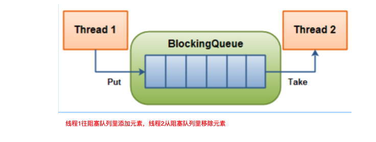

当队列是空的，从队列中 获取 元素的操作将会被阻塞 

当队列是满的，从队列中 添加 元素的操作将会被阻塞 

试图从空的队列中获取元素的线程将会被阻塞，直到其他线程往空的队列插入新的元素 

试图向已满的队列中添加新元素的线程将会被阻塞，直到其他线程从队列中移除一个或多个元素或者完全清空，使队列变得空闲起来并后续新增 

### 阻塞队列的用处

在多线程领域：所谓阻塞，在某些情况下会 挂起 线程（即阻塞），一旦条件满足，被挂起的线程又会自动被唤起 


为什么需要BlockingQueue 

好处是我们不需要关心什么时候需要阻塞线程，什么时候需要唤醒线程，因为这一切BlockingQueue都给你一手包办了。在concurrent包发布以前，在多线程环境下， 我们每个程序员都必须去自己控制这些细节，尤其还要兼顾效率和线程安全 ，而这会给我们的程序带来不小的复杂度。 

### 架构和种类


ArrayBlockingQueue：由数组结构组成的有界阻塞队列。

LinkedBlockingQueue：由链表结构组成的有界（但大小默认值为integer.MAX_VALUE）阻塞队列。

PriorityBlockingQueue：支持优先级排序的无界阻塞队列。

DelayQueue：使用优先级队列实现的延迟无界阻塞队列。

SynchronousQueue：不存储元素的阻塞队列，也即单个元素的队列。

LinkedTransferQueue：由链表组成的无界阻塞队列。

LinkedBlockingDeque：由链表组成的双向阻塞队列。

### BlockingQueue核心方法

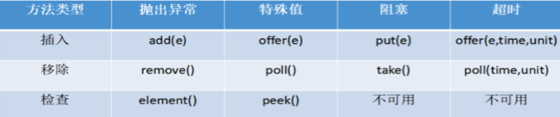

| 类型     | 详情                                                         |
| -------- | ------------------------------------------------------------ |
| 抛出异常 | 当阻塞队列满时，再往队列里add插入元素会抛IllegalStateException:Queue full<br>当阻塞队列空时，再往队列里remove移除元素会抛NoSuchElementException |
| 特殊值   | 插入方法，成功ture失败false<br/>移除方法，成功返回出队列的元素，队列里没有就返回null |
| 一直阻塞 | 当阻塞队列满时，生产者线程继续往队列里put元素，队列会一直阻塞生产者线程直到put数据or响应中断退出<br>当阻塞队列空时，消费者线程试图从队列里take元素，队列会一直阻塞消费者线程直到队列可用 |
| 超时退出 | 当阻塞队列满时，队列会阻塞生产者线程一定时间，超过限时后生产者线程会退出 |

```java
public class BlockingQueueDemo {
    public static void main(String[] args) throws InterruptedException {
        BlockingQueue<String> blockingQueue = new ArrayBlockingQueue<>(3);
        // 异常组
        //System.out.println(blockingQueue.add("a"));
        //System.out.println(blockingQueue.add("b"));
        //System.out.println(blockingQueue.add("c"));
        // 空间不足抛出异常 java.lang.IllegalStateException: Queue full
        //System.out.println(blockingQueue.add("x"));

        //System.out.println(blockingQueue.remove());
        //System.out.println(blockingQueue.remove());
        //System.out.println(blockingQueue.remove());
        // 无可取数据抛出异常 java.util.NoSuchElementException
        //System.out.println(blockingQueue.remove());

        // 队列为空 java.util.NoSuchElementException
        //System.out.println(blockingQueue.element());

        // 特殊值
        //System.out.println(blockingQueue.offer("a"));
        //System.out.println(blockingQueue.offer("b"));
        //System.out.println(blockingQueue.offer("c"));
        // false
        //System.out.println(blockingQueue.offer("x"));

        //System.out.println(blockingQueue.poll());
        //System.out.println(blockingQueue.poll());
        //System.out.println(blockingQueue.poll());
        // null
        //System.out.println(blockingQueue.poll());
        // null
        //System.out.println(blockingQueue.peek());

        // 阻塞
        //blockingQueue.put("a");
        //blockingQueue.put("b");
        //blockingQueue.put("c");
        // 满了之后一直阻塞
        //blockingQueue.put("x");
        //System.out.println(blockingQueue.take());
        //System.out.println(blockingQueue.take());
        //System.out.println(blockingQueue.take());
        // 取完阻塞
        //System.out.println(blockingQueue.take());

        // 超时
        System.out.println(blockingQueue.offer("a", 3L ,TimeUnit.SECONDS));
        System.out.println(blockingQueue.offer("b", 3L ,TimeUnit.SECONDS));
        System.out.println(blockingQueue.offer("c", 3L ,TimeUnit.SECONDS));
        // 超时已满 false
        //System.out.println(blockingQueue.offer("x", 3L ,TimeUnit.SECONDS));
        System.out.println(blockingQueue.poll(3L, TimeUnit.SECONDS));
        System.out.println(blockingQueue.poll(3L, TimeUnit.SECONDS));
        System.out.println(blockingQueue.poll(3L, TimeUnit.SECONDS));
        // 超时无可取数据 null
        System.out.println(blockingQueue.poll(3L, TimeUnit.SECONDS));
    }
}
```

## 线程池

### 为什么用线程池

例子：10年前单核CPU电脑，假的多线程，像马戏团小丑玩多个球，CPU需要来回切换。 现在是多核电脑，多个线程各自跑在独立的CPU上，不用切换效率高。 


线程池的优势：

线程池做的工作只要是控制运行的线程数量，``处理过程中将任务放入队列``，然后在线程创建后启动这些任务， ``如果线程数量超过了最大数量，超出数量的线程排队等候``，等其他线程执行完毕，再从队列中取出任务来执行。

它的主要特点为：``线程复用;控制最大并发数;管理线程``。

第一：降低资源消耗。通过重复利用已创建的线程降低线程创建和销毁造成的销耗。 

第二：提高响应速度。当任务到达时，任务可以不需要等待线程创建就能立即执行。 

第三：提高线程的可管理性。线程是稀缺资源，如果无限制的创建，不仅会销耗系统资源，还会降低系统的稳定性，使用线程池可以进行统一的分配，调优和监控。 

### 线程池的使用

#### 架构说明

Java中的线程池是通过Executor框架实现的，该框架中用到了Executor，Executors，ExecutorService，ThreadPoolExecutor这几个类。


#### 编码实现

##### Executors.newFixedThreadPool(int)

newFixedThreadPool创建的线程池corePoolSize和maximumPoolSize值是相等的，它使用的是LinkedBlockingQueue 

```java
public static ExecutorService newFixedThreadPool(int nThreads) {
    return new ThreadPoolExecutor(nThreads, nThreads,
                                  0L, TimeUnit.MILLISECONDS,
                                  new LinkedBlockingQueue<Runnable>());
}
```

##### Executors.newSingleThreadExecutor()

newSingleThreadExecutor 创建的线程池corePoolSize和maximumPoolSize值都是1，它使用的是LinkedBlockingQueue 

```java
public static ExecutorService newSingleThreadExecutor() {
    return new FinalizableDelegatedExecutorService
        (new ThreadPoolExecutor(1, 1,
                                0L, TimeUnit.MILLISECONDS,
                                new LinkedBlockingQueue<Runnable>()));
}
```

##### Executors.newCachedThreadPool()

newCachedThreadPool创建的线程池将corePoolSize设置为0，将maximumPoolSize设置为Integer.MAX_VALUE，它使用的是SynchronousQueue，也就是说来了任务就创建线程运行，当线程空闲超过60秒，就销毁线程。 

```java
public static ExecutorService newCachedThreadPool() {
    return new ThreadPoolExecutor(0, Integer.MAX_VALUE,
                                  60L, TimeUnit.SECONDS,
                                  new SynchronousQueue<Runnable>());
}
```

```java
public class MyThreadPoolDemo {
    public static void main(String[] args) {
        // 一池5个工作线程
        //ExecutorService threadPool = Executors.newFixedThreadPool(5);
        // 一池1个工作线程
        //ExecutorService threadPool = Executors.newSingleThreadExecutor();
        // 一池n线程
        ExecutorService threadPool = Executors.newCachedThreadPool();
        try {
            for (int i = 1; i <= 10; i++) {
                //try { TimeUnit.SECONDS.sleep(1); } catch (InterruptedException e) { e.printStackTrace(); }
                threadPool.execute(() -> {
                    System.out.println(Thread.currentThread().getName() + "\t办理业务");
                });
            }
        } catch (Exception e) {
            e.printStackTrace();
        } finally {
            threadPool.shutdownNow();
        }
    }
}
```

##### 三种创建线程池的方法哪个用的多

都不用，工作中只能使用自定义的


### 线程池的参数

```java
public ThreadPoolExecutor(int corePoolSize,
                          int maximumPoolSize,
                          long keepAliveTime,
                          TimeUnit unit,
                          BlockingQueue<Runnable> workQueue,
                          ThreadFactory threadFactory,
                          RejectedExecutionHandler handler) {
    if (corePoolSize < 0 ||
        maximumPoolSize <= 0 ||
        maximumPoolSize < corePoolSize ||
        keepAliveTime < 0)
        throw new IllegalArgumentException();
    if (workQueue == null || threadFactory == null || handler == null)
        throw new NullPointerException();
    this.corePoolSize = corePoolSize;
    this.maximumPoolSize = maximumPoolSize;
    this.workQueue = workQueue;
    this.keepAliveTime = unit.toNanos(keepAliveTime);
    this.threadFactory = threadFactory;
    this.handler = handler;
}
```

``corePoolSize`` 线程池中的常驻核心线程数

``maximumPoolSize`` 线程池中能够容纳同时执行的最大线程数，此值必须大于等于1

``keepAliveTime`` 多余的空闲线程的存活时间，当前池中线程数量超过corePoolSize时，当空闲时间达到keepAliveTime时，多余线程会被销毁直到只剩下corePoolSize个线程为止

``unit`` keepAliveTime的单位 

``workQueue`` 任务队列，被提交但尚未被执行的任务

``threadFactory`` 表示生成线程池中工作线程的线程工厂，用于创建线程，一般默认的即可

``handler`` 拒绝策略，表示当队列满了，并且工作线程大于等于线程池的最大线程数（maximumPoolSize）时如何来拒绝请求执行的runnable的策略

### 工作原理


1. 在创建了线程池后，开始等待请求。 

2. 当调用 ``execute()`` 方法添加一个请求任务时，线程池会做出如下判断： 

   2.1 如果正在运行的线程数量小于 ``corePoolSize`` ，那么马上创建线程运行这个任务； 

   2.2 如果正在运行的线程数量大于或等于 ``orePoolSize`` ，那么将这个任务放入队列 ； 

   2.3 如果这个时候队列满了且正在运行的线程数量还小于``maximumPoolSize``，那么还是要创建非核心线程立刻运行该任务； 

   2.4 如果队列满了且正在运行的线程数量大于或等于 ``maximumPoolSize`` ，那么线程池会启动饱和拒绝策略来执行 。 

3. 当一个线程完成任务时，它会从队列中取下一个任务来执行。 

4. 当一个线程无事可做超过一定的时间``keepAliveTime``时，线程会判断： 如果当前运行的线程数大于 ``corePoolSize``，那么这个线程就被停掉。 所以线程池的所有任务完成后， 它最终会收缩到 ``corePoolSize``的大小 。 

### 拒绝策略

等待队列已经排满了 ，再也塞不下新任务了，同时， 线程池中的max线程也达到了 ，无法继续为新任务服务。 这个时候我们就需要拒绝策略机制合理的处理这个问题。 

``AbortPolicy(默认)`` 直接抛出``RejectedExecutionException``异常阻止系统正常运行

``CallerRunsPolicy`` “调用者运行”一种调节机制，该策略既不会抛弃任务，也不会抛出异常，而是将某些任务回退到调用者，从而降低新任务的流量。

``DiscardOldestPolicy`` 抛弃队列中等待最久的任务，然后把当前任务加人队列中尝试再次提交当前任务。

``DiscardPolicy`` 该策略默默地丢弃无法处理的任务，不予任何处理也不抛出异常。如果允许任务丢失，这是最好的一种策略。

以上内置拒绝策略均实现了``RejectedExecutionHandle``接口

### 自定义线程池

```java
// maximumPoolSize
// CPU 密集型 Runtime.getRuntime().availableProcessors()(CPU核心数，逻辑处理器) + 1~2
// IO 密集型 CPU核心数/(1-阻塞系数)，实际应用2 * cpu
ExecutorService threadPool = new ThreadPoolExecutor(
        2,
        5,
        2L,
        TimeUnit.SECONDS,
        new LinkedBlockingQueue<>(3),
        Executors.defaultThreadFactory(),
        new ThreadPoolExecutor.AbortPolicy());
```

## Java8之流式计算

### 函数式接口


```java
public class StreamDemo {
    public static void main(String[] args) {
        Function<String, Integer> function = new Function<String, Integer>() {
            @Override
            public Integer apply(String s) {
                return s.length();
            }
        };
        Function<String, Integer> function1 = s -> s.length();
        System.out.println(function.apply("abc"));
        System.out.println(function1.apply("abcde"));

        Predicate<String> predicate = new Predicate<String>() {
            @Override
            public boolean test(String s) {
                return s.length() > 3;
            }
        };
        Predicate<String> predicate1 = s -> s.length() > 3;
        System.out.println(predicate.test("abc"));
        System.out.println(predicate1.test("abcde"));

        Consumer<String> consumer = new Consumer<String>() {
            @Override
            public void accept(String s) {
                System.out.println(s);
            }
        };
        Consumer<String> consumer1 = s -> System.out.println(s);
        consumer.accept("abc");
        consumer.accept("abcde");

        Supplier<String> supplier = new Supplier<String>() {
            @Override
            public String get() {
                return "abc";
            }
        };
        Supplier<String> supplier1 = () -> {return "abcde";};
        System.out.println(supplier.get());
        System.out.println(supplier1.get());
    }
}
```

### Stream流

流(Stream) 是数据渠道，用于操作数据源（集合、数组等）所生成的元素序列。 

``集合讲的是数据，流讲的是计算``

特点：

Stream 自己不会存储元素。

Stream 不会改变源对象。相反，他们会返回一个持有结果的新Stream。

Stream 操作是延迟执行的。这意味着他们会等到需要结果的时候才执行。


创建一个Stream：一个``数据源``（数组、集合）

中间操作：一个中间操作，``处理``数据源数据

终止操作：一个终止操作，``执行``中间操作链，产生结果

```java
@Data
@NoArgsConstructor
@AllArgsConstructor
class User {
    private Integer id;
    private String userName;
    private int age;
}

/**
 * 请按照给出数据，找出同时满足
 * 偶数 ID且 年龄大于 24且 用户名转为大写 且 用户名字母倒排序
 * 后 只输出一个用户名字
 */
public class StreamDemo {
    public static void main(String[] args) {
        User u1 = new User(11,"a",23);
        User u2 = new User(12,"b",24);
        User u3 = new User(13,"c",22);
        User u4 = new User(14,"d",28);
        User u5 = new User(16,"e",26);

        List<User> userList = Arrays.asList(u1, u2, u3, u4, u5);
        userList.stream().filter(u -> u.getId() % 2 == 0)
                .filter(u -> u.getAge() > 24)
                .map(u -> u.getUserName().toUpperCase())
                .sorted(Comparator.reverseOrder())
                .limit(1)
                .forEach(System.out::println);
    }
}
```

## ForkJoin

Fork：把一个复杂任务进行分拆，大事化小 

Join：把分拆任务的结果进行合并 

``ForkJoinPool ``分支合并池  类比=>  线程池 


``ForkJoinTask``  类比=>  FutureTask 

递归任务：继承后可以实现递归(自己调自己)调用的任务 


```java
class MyTask extends RecursiveTask<Integer> {

    private static final Integer ADJUST_VALUE = 10;

    private int begin;
    private int end;
    private int result;

    public MyTask(int begin, int end) {
        this.begin = begin;
        this.end = end;
    }

    @Override
    protected Integer compute() {
        if ((end - begin) <= ADJUST_VALUE) {
            for (int i = begin; i <= end; i++) {
                result = result + i;
            }
        } else {
            int middle = (end + begin) / 2;
            MyTask task01 = new MyTask(begin, middle);
            MyTask task02 = new MyTask(middle + 1, end);
            task01.fork();
            task02.fork();
            result = task01.join() + task02.join();
        }
        return result;
    }
}

public class ForkJoinDemo {
    public static void main(String[] args) throws ExecutionException, InterruptedException {
        MyTask myTask = new MyTask(0, 100);
        ForkJoinPool threadPool = new ForkJoinPool();

        ForkJoinTask<Integer> forkJoinTask = threadPool.submit(myTask);
        System.out.println(forkJoinTask.get());

        threadPool.shutdown();
    }
}
```

## 异步回调


```java
public class CompletableFutureDemo {
    public static void main(String[] args) throws ExecutionException, InterruptedException {
        CompletableFuture<Void> c = CompletableFuture.runAsync(() -> {
            System.out.println(Thread.currentThread().getName() + "没有返回");
        });
        c.get();

        // 异步回调
        CompletableFuture<Integer> c1 = CompletableFuture.supplyAsync(() -> {
            System.out.println(Thread.currentThread().getName() + "有返回");
            //int age = 10 / 0;
            return 1024;
        });
        System.out.println(c1.whenComplete((t, u) -> {
            System.out.println("***********t: " + t);
            System.out.println("***********u: " + u);
        }).exceptionally(f -> {
            System.out.println("***********exception: " + f.getMessage());
            return 404;
        }).get());
    }
}
```

