# 1 GC 算法

GC是什么(分代收集算法)

次数上频繁收集Young区，较少收集Old区，基本不动元空间

## 1.1 GC 算法总体概述


JVM在进行GC时，并非每次都对上面三个内存区域一起回收的，大部分时候回收的都是指新生代。
因此GC按照回收的区域又分了两种类型，一种是普通GC（minor GC），一种是全局GC（major GC or Full GC）

> Minor GC和Full GC的区别：
> ``普通GC（minor GC）``只针对新生代区域的GC,指发生在新生代的垃圾收集动作，因为大多数Java对象存活率都不高，所以Minor GC非常频繁，一般回收速度也比较快
> ``全局GC（major GC or Full GC）``指发生在老年代的垃圾收集动作，出现了Major GC，经常会伴随至少一次的Minor GC（但并不是绝对的）。Major GC的速度一般要比Minor GC慢上10倍以上

## 1.2 如何确定一个对象是垃圾

### 1.2.1 引用计数算法

```java
public class RefCountGC {
  private byte[] bigSize = new byte[2 * 1024 * 1024];//这个成员属性唯一的作用就是占用一点内存
  Object instance = null;
 
  public static void main(String[] args)
  {
    RefCountGC objectA = new RefCountGC();
    RefCountGC objectB = new RefCountGC();
    objectA.instance = objectB;
    objectB.instance = objectA;
    objectA = null;
    objectB = null;
 	// 不会立即开始GC，类似Thread.start0
    System.gc();
  }
}
```

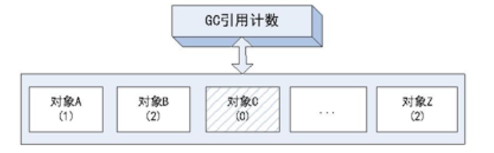

缺点：

1. 每次对对象赋值时均要维护引用计数器，且计数器本身也有一定的消耗

2. 较难处理循环引用，导致永远不能被回收

JVM的实现一般不采用这种方式。

### 1.2.2 可达性分析

通过GC Root的对象，开始向下寻找，看某个对象是否可达。

#### GC Roots

内存中已经不再被使用到的空间就是``垃圾``。

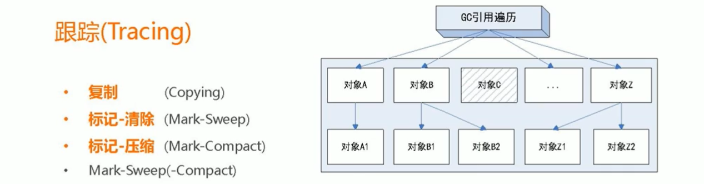

所谓 GC Roots 或者说tracing GC的 “跟集合” 就是一组必须活跃的引用。

基本思路就是通过一系列名为“GC Roots”的对象作为起始点，从这个被称为GC Roots的对象开始向下搜索，如果一个对象到GC Roots没有任何引用链相连时，则说明此对象不可用。也即给定一个集合的引用作为跟出发，通过引用关系遍历对象图，能被遍历到的（可到达的）对象就被判定为存活，否则为死亡。


> 可以作为 GC Roots 的对象：
>
> * 虚拟机栈（栈帧中的局部变量表）中的引用对象，例如各个线程被调用的方法堆栈中使用的参数、局部变量、临时变量等
>* 方法区中的类静态属性引用的对象，例如 Java 类的引用类型静态变量
> * 方法区中常量引用的对象，例如字符串常量池里的引用
>* 本地方法栈中 JNI(Native 方法) 引用的对象
> * 虚拟机内部引用，如基本数据类型对应的 Class 对象，常驻异常对象，还有类加载器等
>* 所有被同步锁持有的对象

```java
public class GCRootsDemo {
    
    // 方法区中的类静态属性引用的对象
    //private static GCRootsDemo2 demo2;
    // 方法区中常量引用的对象
    //private static final GCRootsDemo3 demo3 = new GCRootsDemo3(8);

    public static void m1() {
        // 虚拟机栈（栈帧中的局部变量区，也叫做局部变量表）中的引用对象
        GCRootsDemo t1 = new GCRootsDemo();
        System.gc();
        System.out.println("第一次GC完成");
    }

    public static void main(String[] args) {
        m1();
    }
}
```

## 1.3 复制算法(Copying)

### 原理

年轻代中使用的是Minor GC，这种GC算法采用的是复制算法(Copying)。

Minor GC会把Eden中的所有活的对象都移到Survivor区域中，如果Survivor区中放不下，那么剩下的活的对象就被移到Old generation中，``也即一旦收集后，Eden是就变成空的了``。
当对象在 Eden ( 包括一个 Survivor 区域，这里假设是 from 区域 ) 出生后，在经过一次 Minor GC 后，如果对象还存活，并且能够被另外一块 Survivor 区域所容纳( 上面已经假设为 from 区域，这里应为 to 区域，即 to 区域有足够的内存空间来存储 Eden 和 from 区域中存活的对象 )，则使用复制算法将这些仍然还存活的对象复制到另外一块 Survivor 区域 ( 即 to 区域 ) 中，然后清理所使用过的 Eden 以及 Survivor 区域 ( 即 from 区域 )，并且将这些对象的年龄设置为1，以后对象在 Survivor 区每熬过一次 Minor GC，就将对象的年龄 + 1，当对象的年龄达到某个值时 ( 默认是 15 岁，通过-XX:MaxTenuringThreshold 来设定参数)，这些对象就会成为老年代。

``-XX:MaxTenuringThreshold`` 设置对象在新生代中存活的次数

### 动态演示

年轻代中的GC,主要是复制算法（Copying）

HotSpot JVM把年轻代分为了三部分：1个Eden区和2个Survivor区（分别叫from和to）。默认比例为8:1:1,一般情况下，新创建的对象都会被分配到Eden区(一些大对象特殊处理),这些对象经过第一次Minor GC后，如果仍然存活，将会被移到Survivor区。对象在Survivor区中每熬过一次Minor GC，年龄就会增加1岁，当它的年龄增加到一定程度时，就会被移动到年老代中。因为年轻代中的对象基本都是朝生夕死的(90%以上)，所以在``年轻代的垃圾回收算法使用的是复制算法(适用于少量存活的场景)``，复制算法的基本思想就是将内存分为两块，每次只用其中一块，当这一块内存用完，就将还活着的对象复制到另外一块上面。``复制算法不会产生内存碎片``。


在GC开始的时候，对象只会存在于Eden区和名为“From”的Survivor区，Survivor区“To”是空的。紧接着进行GC，Eden区中所有存活的对象都会被复制到“To”，而在“From”区中，仍存活的对象会根据他们的年龄值来决定去向。年龄达到一定值(年龄阈值，可以通过-XX:MaxTenuringThreshold来设置)的对象会被移动到年老代中，没有达到阈值的对象会被复制到“To”区域。``经过这次GC后，Eden区和From区已经被清空。这个时候，“From”和“To”会交换他们的角色，也就是新的“To”就是上次GC前的“From”，新的“From”就是上次GC前的“To”``。不管怎样，都会保证名为To的Survivor区域是空的。Minor GC会一直重复这样的过程，直到“To”区被填满，“To”区被填满之后，会将所有对象移动到年老代中。


因为Eden区对象一般存活率较低，一般的，使用两块10%的内存作为空闲和活动区间，而另外80%的内存，则是用来给新建对象分配内存的。一旦发生GC，将10%的from活动区间与另外80%中存活的eden对象转移到10%的to空闲区间，接下来，将之前90%的内存全部释放，以此类推。 

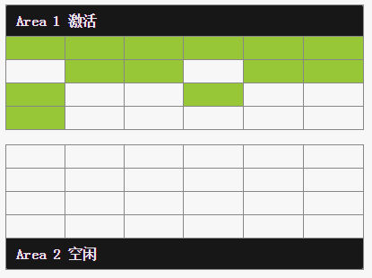

### 劣势

复制算法它的缺点也是相当明显的。 

1. 它浪费了一半的内存，这太要命了。 
2. 如果对象的存活率很高，我们可以极端一点，假设是100%存活，那么我们需要将所有对象都复制一遍，并将所有引用地址重置一遍。复制这一工作所花费的时间，在对象存活率达到一定程度时，将会变的不可忽视。 所以从以上描述不难看出，复制算法要想使用，最起码对象的存活率要非常低才行，而且最重要的是，我们必须要克服50%内存的浪费。

## 1.4 标记清除(Mark-Sweep)

### 原理

老年代一般是由标记清除或者是标记清除与标记整理的混合实现。

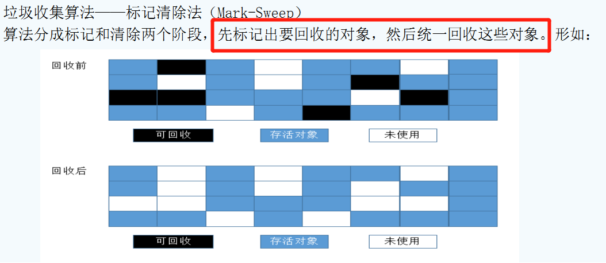


用通俗的话解释一下标记清除算法，就是当程序运行期间，若可以使用的内存被耗尽的时候，GC线程就会被触发并将程序暂停，随后将要回收的对象标记一遍，最终统一回收这些对象，完成标记清理工作接下来便让应用程序恢复运行。

主要进行两项工作，第一项则是标记，第二项则是清除。  

`标记`：从引用根节点开始标记遍历所有的 GC Roots， 先标记出要回收的对象。

`清除`：遍历整个堆，把标记的对象清除。 

### 动态演示

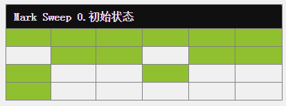

### 劣势

1. 标记和清除两个过程都比较耗时，效率不高（递归与全堆对象遍历），而且在进行GC的时候，需要停止应用程序，这会导致用户体验非常差劲。
2. 其次，主要的缺点则是这种方式清理出来的空闲内存是不连续的，这点不难理解，我们的死亡对象都是随即的出现在内存的各个角落的，现在把它们清除之后，内存的布局自然会乱七八糟。而为了应付这一点，JVM就不得不维持一个内存的空闲列表，这又是一种开销。而且在分配数组对象的时候，寻找连续的内存空间会不太好找。

## 1.5 标记压缩(Mark-Compact)

### 原理

老年代一般是由标记清除或者是标记清除与标记整理的混合实现 。

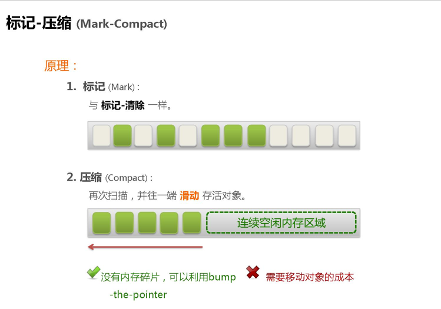

在整理压缩阶段，不再对标记的对像做回收，而是通过所有存活对像都向一端移动，然后直接清除边界以外的内存。
可以看到，标记的存活对象将会被整理，按照内存地址依次排列，而未被标记的内存会被清理掉。如此一来，当我们需要给新对象分配内存时，JVM只需要持有一个内存的起始地址即可，这比维护一个空闲列表显然少了许多开销。

标记/整理算法不仅可以弥补标记/清除算法当中，内存区域分散的缺点，也消除了复制算法当中，内存减半的高额代价 

### 动态演示


### 劣势

标记/整理算法唯一的缺点就是效率也不高，不仅要标记所有存活对象，还要整理所有存活对象的引用地址。
从效率上来说，标记/整理算法要低于复制算法。

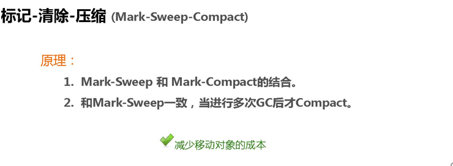

## 1.6 总结

内存效率：复制算法>标记清除算法>标记整理算法（此处的效率只是简单的对比时间复杂度，实际情况不一定如此）。 
内存整齐度：复制算法=标记整理算法>标记清除算法。 
内存利用率：标记整理算法=标记清除算法>复制算法。 

可以看出，效率上来说，复制算法是当之无愧的老大，但是却浪费了太多内存，而为了尽量兼顾上面所提到的三个指标，标记/整理算法相对来说更平滑一些，但效率上依然不尽如人意，它比复制算法多了一个标记的阶段，又比标记/清除多了一个整理内存的过程

难道就没有一种最优算法吗？ 猜猜看，下面还有


回答：无，没有最好的算法，只有最合适的算法。==========>分代收集算法。

### 年轻代(Young Gen)

``年轻代特点是区域相对老年代较小，对像存活率低``。


这种情况复制算法的回收整理，速度是最快的。复制算法的效率只和当前存活对像大小有关，因而很适用于年轻代的回收。而复制算法内存利用率不高的问题，通过hotspot中的两个survivor的设计得到缓解。

### 老年代(Tenure Gen)

``老年代的特点是区域较大，对像存活率高``。

这种情况，存在大量存活率高的对像，复制算法明显变得不合适。一般是由标记清除或者是标记清除与标记整理的混合实现。

``Mark阶段的开销与存活对像的数量成正比``，这点上说来，对于老年代，标记清除或者标记整理有一些不符，但可以通过多核/线程利用，对并发、并行的形式提标记效率。

``Sweep阶段的开销与所管理区域的大小形正相关``，但Sweep“就地处决”的特点，回收的过程没有对像的移动。使其相对其它有对像移动步骤的回收算法，仍然是效率最好的。但是需要解决内存碎片问题。

``Compact阶段的开销与存活对像的数据成开比``，如上一条所描述，对于大量对像的移动是很大开销的，做为老年代的第一选择并不合适。

基于上面的考虑，老年代一般是由标记清除或者是标记清除与标记整理的混合实现。以hotspot中的CMS回收器为例，CMS是基于Mark-Sweep实现的，对于对像的回收效率很高，而对于碎片问题，CMS采用基于Mark-Compact算法的Serial Old回收器做为补偿措施：当内存回收不佳（碎片导致的Concurrent Mode Failure时），将采用Serial Old执行Full GC以达到对老年代内存的整理。

# 2 垃圾回收器

GC 算法是内存回收的方法论，垃圾收集器就是算法的落地实现。

因为目前为止没有完美的垃圾收集器出现，更加没有万能的收集器，只有针对具体应用最合适的收集器，进行分代收集。

## 2.1 四大垃圾回收方式


**串行垃圾回收器（Serial）**

它为单线程环境下设计且只使用一个线程进行垃圾回收，会暂停所有的用户线程。所以不适合服务器环境。

**并行垃圾回收器（Parallel）**

多个垃圾收集线程并行工作，此时用户线程是暂停的，适用于科学计算/大数据处理首台处理等弱交互场景。

**并行垃圾回收器（CMS）**

用户线程和垃圾收集线程可以同时执行（不一定是并行，可能是交替执行），不需要停顿用户线程，互联网公司多用，适用对响应时间有要求的场景。

**G1垃圾回收器**

将堆内存分割成不同的区域然后并发的对其进行垃圾回收。

## 2.2 7大垃圾收集器

```markdown
# 查看默认垃圾回收器
	java -XX:+PrintCommandLineFlags -version

-XX:InitialHeapSize=266692480 -XX:MaxHeapSize=4267079680 -XX:+PrintCommandLineFlags -XX:+UseCompressedCla
ssPointers -XX:+UseCompressedOops -XX:-UseLargePagesIndividualAllocation -XX:+UseParallelGC
java version "1.8.0_77"
Java(TM) SE Runtime Environment (build 1.8.0_77-b03)
Java HotSpot(TM) 64-Bit Server VM (build 25.77-b03, mixed mode)

# -XX:+UseParallelGC即为默认垃圾回收器
```

```java
public class HelloGC {
    public static void main(String[] args) throws InterruptedException {
        System.out.println("Hello GC");
        Thread.sleep(Integer.MAX_VALUE);
    }
}
// jps -l
// 11728 com.jvm.HelloGC
// jinfo -flag UseParallelGC 11728
// -XX:+UseParallelGC
```

垃圾收集器就是来具体实现这些GC算法并实现内存回收。

不同厂商、不同版本的虚拟机实现差别很大，HotSpot中包含的收集器如下如所示：

红色表示java8版本开始，对应的垃圾收集器Deprecated，不推荐使用。


``DefNew`` Default New Generation

``Tenured`` Old(Serial Old)

``ParNew`` Parallel New Generation

``PSYoungGen`` Parallel Scavenge

``ParOldGen`` Parallel Old Generation

## 2.3 Server/Client模式

32位Window操作系统，不论硬件如何都默认使用Client的JVM模式。

32位其他操作系统，2G内存同时有2个cpu以上用Server模式，低于该配置还是Client模式。

64位只有Server模式。

## 2.4 新生代垃圾收集器

### Serial垃圾收集器

串行收集器，一个单线程的收集器，在进行垃圾收集时候，必须暂停其他所有的工作现场知道它收集结束。

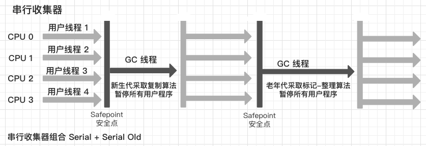

串行收集器是最古老，最稳定以及效率高的收集器，只使用一个线程去回收其在进行垃圾收集过程中可能会产生较长的停顿（``Stop-The-World状态``）。虽然在收集垃圾过程中需要暂停所有其他的工作线程，但是它简单高效，对于限定单个 CPU 环境来说，没有线程交互的开销可以获得最高的单线程垃圾收集效率，因此 Serial 垃圾收集器依然是 Java 虚拟机运行在 `Client 模式下默认`的新生代垃圾收集器。

对应JVM参数是：`-XX:+UseSerialGC`

开启后会使用：`Serial(Young区用) + Serial Old(Old区)`的收集器组合

表示：新生代、老年代都会使用串行回收收集器，新生代使用``复制算法``，老年代使用``标记-整理算法``。

```markdown
# JDK 9 使用 -Xlog:gc*，用通配符 * 将 GC 标签下所有细分过程都打印出来
-Xms10m -Xmx10m -XX:+PrintGCDetails -XX:+PrintCommandLineFlags -XX:+UseSerialGC

(DefNew + Tenured)
[GC (Allocation Failure) [DefNew: 2707K->0K(3072K), 0.0004687 secs][Tenured: 6177K->4851K(6848K), 0.0019630 secs] 6233K->4851K(9920K), [Metaspace: 3310K->3310K(1056768K)], 0.0024599 secs] [Times: user=0.02 sys=0.00, real=0.00 secs] 
[Full GC (Allocation Failure) [Tenured: 4851K->4699K(6848K), 0.0021696 secs] 4851K->4699K(9920K), [Metaspace: 3310K->3310K(1056768K)], 0.0021879 secs] [Times: user=0.00 sys=0.00, real=0.00 secs] 
```

### ParNew(并行)收集器

使用多线程进行垃圾回收，在垃圾收集时，会Stop-The-World暂停其他所有的工作线程直到它收集结束。

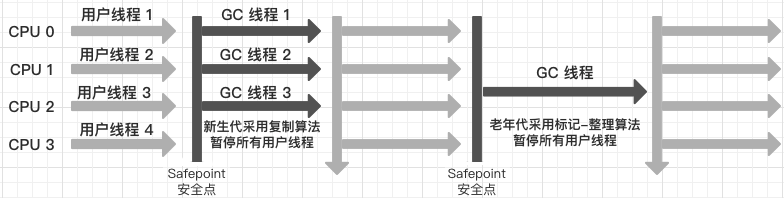

ParNew收集器其实就是Serial收集器新生代的并行多线程版本，最常见的应用场景就是配合老年代的CMS GC工作，其余的行为和Serial收集器完全一样，ParNew垃圾收集器在垃圾回收过程中同样也要暂停所有其他的工作线程。它是很多Java虚拟机运行在Server模式下新生代的默认垃圾收集器。

常用对应JVM参数：``-XX:+UseParNewGC`` 启用ParNew收集器，只影响新生代的收集，不影响老年代。

开启上诉参数后，会使用：`ParNew(Young区用) + Serial Old`的收集器组合，新生代使用``复制算法``，老年代采用``标记-整理``算法。

```markdown
# 限制线程数量，默认开启和CPU数目相同的线程数
-XX:ParallelGCThreads

-Xms10m -Xmx10m -XX:+PrintGCDetails -XX:+PrintCommandLineFlags -XX:+UseParNewGC

(ParNew + Tenured)
[GC (Allocation Failure) [ParNew (promotion failed): 2719K->2719K(3072K), 0.0004459 secs][Tenured: 6323K->4991K(6848K), 0.0020673 secs] 6378K->4991K(9920K), [Metaspace: 3311K->3311K(1056768K)], 0.0025424 secs] [Times: user=0.00 sys=0.00, real=0.00 secs] 
[Full GC (Allocation Failure) [Tenured: 4991K->4715K(6848K), 0.0023550 secs] 4991K->4715K(9920K), [Metaspace: 3311K->3311K(1056768K)], 0.0023733 secs] [Times: user=0.00 sys=0.00, real=0.00 secs] 

# 这样的搭配，java8已经不再推荐
Java HotSpot(TM) 64-Bit Server VM warning: Using the ParNew young collector with the Serial old collector is deprecated and will likely be removed in a future release(图中红叉)
```

### Parallel Scavenge收集器

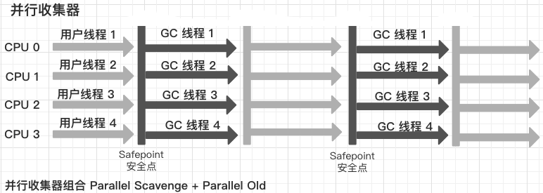

Parallel Scavenge 收集器类似 ParNew 也是新生代垃圾收集器，使用``复制算法``，也是一个并行的多线程的垃圾收集器，俗称`吞吐量优先`收集器。一句话：串行收集器在新生代和老年代的并行化

它终点关注的是：

可控制的吞吐量（Thoughput=运行用户代码时间/(运行用户代码时间+垃圾回收时间)，也即比如程序运行100分钟，垃圾收集时间1分钟，吞吐量就是99%）。高吞吐量意味着高效利用CPU的时间，它多用于在后台运算而不需要太多交互的任务。

自适应调节策略也是Parallel Scavenge收集器与ParNew收集器的一个重要区别。

自适应调节策略：虚拟机会根据当前系统的运行情况收集性能监控信息，动态调整这些参数以提供最适合的停顿时间 ``-XX:MAXGCPauseMillis``或直接设置吞吐量大小的 `-XX:GCTimeRatio`。

> 垃圾收集停顿时间缩短是以牺牲吞吐量和新生代空间为代价的：导致的是垃圾收集得更频繁，原来 10 秒收集一次，每次停顿 100 毫秒，现在变成 5秒收集一次，每次停顿 70 毫秒，停顿时间确实在下降，但吞吐量也将降下来了。

常用JVM参数：``-XX:+UseParallelGC或-XX:+UseParallelOldGC(可相互激活)``，使用Parallel Scanvenge收集器。

-XX:ParallelGCThreads=N，表示启动多少个GC线程。

cpu < 8  N = cpu数量

cpu > 8 N = (3+((5*CPU_count)/8))

```markdown
-Xms10m -Xmx10m -XX:+PrintGCDetails -XX:+PrintCommandLineFlags -XX:+UseParallelGC
-Xms10m -Xmx10m -XX:+PrintGCDetails -XX:+PrintCommandLineFlags -XX:+UseParallelOldGC

# 不加即是默认 PSYoungGen + ParOldGen
-Xms10m -Xmx10m -XX:+PrintGCDetails -XX:+PrintCommandLineFlags

(PSYoungGen + ParOldGen)
[GC (Allocation Failure) [PSYoungGen: 0K->0K(1536K)] 4366K->4366K(8704K), 0.0013401 secs] [Times: user=0.00 sys=0.00, real=0.01 secs] 
[Full GC (Allocation Failure) [PSYoungGen: 0K->0K(1536K)] [ParOldGen: 4366K->4352K(7168K)] 4366K->4352K(8704K), [Metaspace: 2667K->2667K(1056768K)], 0.0073078 secs] [Times: user=0.01 sys=0.00, real=0.00 secs] 
```

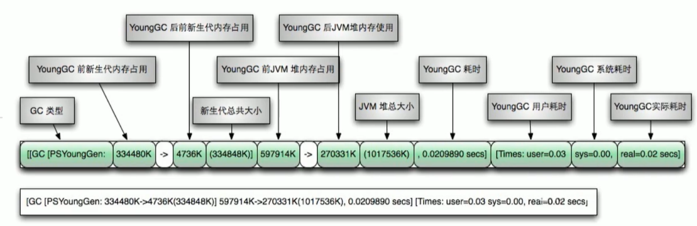

>  如果新生代回收的差值和 JVM 堆回收的差值中间有出入，说明这部分空间是 Old 区释放出来的

## 2.5 老年代垃圾收集器

### Parallel Old收集器

Parallel Old收集器是Parallel Scavenge的老年代版本，使用多线程的``标记-整理``算法，Parallel Old收集器在JDK1.6才开始提供。

在JDK1.6之前，新生代使用Parallel Scavenge收集器只能搭配老年代的Serial Old收集器，只能保证新生代的吞吐量优先，无法保证整体的吞吐量。

Parallel Old正是为了在老年代同样提供吞吐量优先的垃圾收集器，如果系统对吞吐量要求比较高，JDK1.8后可以优先考虑新生代Parallel Scavenge和老年代Parallel Old收集器的搭配策略。

JVM常用参数：``-XX:+UseParallelOldGC``，设置后，新生代Parallel + 老年代Parallel Old

### CMS收集器

CMS收集器（Concurrent Mark Sweep：并发标记清除）是一种以``获取最短回收停顿时间``为目标的收集器。

适合应用在互联网站或者B/S系统的服务器上，这类应用尤其重视服务器的响应速度，希望系统停顿时间最短。

CMS非常适合堆内存大、CPU核数多的服务器端应用，也是G1出现之前大型应用的首选收集器。

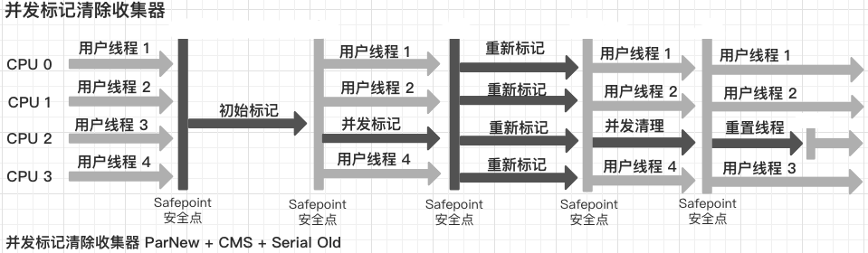

Concurrent Mark Sweep 并发标记清除，并发收集低停顿，并发指的是与用户线程一起执行。

开启该收集器JVM参数：``-XX:+UseConcMarkSweepGC``，开启参数后会自动将``-XX:+UseParNewGC``打开。

使用ParNew(Young区用) + CMS(Old区用) + Serial Old收集器组合，Serial Old将做为CMS出错的后备收集器。

4步过程：

``初始标记（CMS initial mark）``标记一下GC Roots能直接关联的对象，速度很快，仍然需要暂停所有的工作线程；

``并发标记（CMS concurrent mark）``和用户线程一起，进行GC Roots跟踪的过程，不需要暂停工作线程。主要标记过程，标记全部对象；

``重新标记（CMS remark）``为了修正在并发标记期间，因用户程序继续运行而导致标记产生变动的那一部分对象的标记记录，仍然需要暂停所有工作线程。由于并发标记时，用户线程仍然运行，因此在正式清理前，再做修正。

``并发清除（CMS concurrent sweep）``和用户线程一起，清除GC Roots不可达对象，和用户线程一起工作，不需要暂停工作线程。基于标记结果，直接清理对象。

由于耗时最长的并发标记和并发清除过程中，垃圾收集线程可以和用户现在一起并发工作，所以总体上来看CMS收集器的内存回收和用户线程是一起并发地执行。

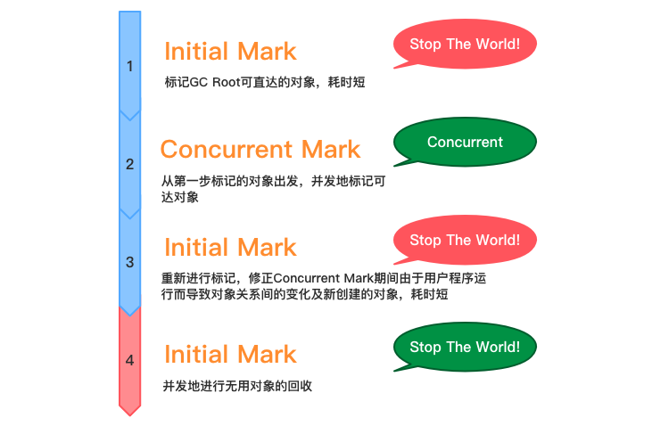

```markdown
-Xms10m -Xmx10m -XX:+PrintGCDetails -XX:+PrintCommandLineFlags -XX:+UseConcMarkSweepGC

(ParNew + CMS)
-XX:InitialHeapSize=10485760 -XX:MaxHeapSize=10485760 -XX:MaxNewSize=3497984 -XX:MaxTenuringThreshold=6 -XX:NewSize=3497984 -XX:OldPLABSize=16 -XX:OldSize=6987776 -XX:+PrintCommandLineFlags -XX:+PrintGCDetails -XX:+UseCompressedClassPointers -XX:+UseCompressedOops -XX:+UseConcMarkSweepGC -XX:+UseParNewGC 
[GC (Allocation Failure) [ParNew: 1424K->4K(3072K), 0.0014961 secs] 4496K->4420K(9920K), 0.0015363 secs] [Times: user=0.01 sys=0.00, real=0.01 secs] 
[GC (CMS Initial Mark) [1 CMS-initial-mark: 4416K(6848K)] 7108K(9920K), 0.0002154 secs] [Times: user=0.00 sys=0.00, real=0.00 secs] 
[CMS-concurrent-mark: 0.001/0.001 secs] [Times: user=0.00 sys=0.00, real=0.00 secs] 
[GC (CMS Final Remark) [YG occupancy: 2689 K (3072 K)][Rescan (parallel) , 0.0063867 secs][weak refs processing, 0.0000430 secs][class unloading, 0.0003802 secs][scrub symbol table, 0.0009412 secs][scrub string table, 0.0002421 secs][1 CMS-remark: 6426K(6848K)] 9116K(9920K), 0.0081364 secs] [Times: user=0.00 sys=0.00, real=0.01 secs] 
[CMS-concurrent-sweep: 0.000/0.000 secs] [Times: user=0.00 sys=0.00, real=0.00 secs] 
```

优点：

* 并发收集低停顿

缺点：

* 并发执行，对CPU资源压力大

  由于并发进行，CMS在收集与应用线程会同时会增加对堆内存的占用，也就是说，``CMS必须要在老年代堆内存用尽之前完成垃圾回收，否则CMS回收失败时``，将触发担保机制，串行老年代收集器将会以STW的方式进行一次GC，从而造成较大停顿时间

* CMS 无法在当次收集中处理并发清理过程中产生的垃圾，只好留待下一次垃圾收集时再清理掉，这一部分垃圾被称为`浮动垃圾`

* 采用的标记清除算法会导致大量碎片

  标记清除算法无法整理空间碎片，老年代空间会随着应用时长被逐步耗尽，最后将不得不通过担保机制堆堆内存进行压缩。CMS也提供了参数``-XX:+CMSFullGCsBeForeCompaction``(默认0，即每次都进行内存整理)来指定多少次CMS收集之后，进行一次压缩的Full GC。

### Serial Old 收集器

Serial Old是Serial垃圾收集器老年代版本，同样是个单线程的收集器，使用``标记整理算法``，这个收集器也主要是运行在Client默认的java虚拟机默认的老年代垃圾收集器。

在Server模式下，主要有两个用途：

1. 在JDK1.5之前与新生代Parallel Scavengr收集器搭配使用。
2. 做为老年代版本中使用CMS收集器的后备垃圾收集方案。

```markdown
# 理论知道即可，实际java8已经被优化掉了
-Xms10m -Xmx10m -XX:+PrintGCDetails -XX:+PrintCommandLineFlags -XX:+UseSerialOldGC

Error: Could not create the Java Virtual Machine.
Error: A fatal exception has occurred. Program will exit.
Unrecognized VM option 'UseSerialOldGC'
Did you mean '(+/-)UseSerialGC'?
```

## 2.6 垃圾收集器的选择

* 单CPU或小内存，单机程序 -XX:+UseSerialGC
* 多CPU，需要高吞吐量（如后台计算型应用） -XX:+UseParallelGC或-XX:+UseParallelOldGC
* 多CPU，追求低停顿时间，需快速响应（如互联网应用） -XX:+UseConcMarkSweppGC

> 高吞吐量和低暂停时间是一对相互竞争的目标（矛盾)。
>
> 如果选择以吞吐量优先，那么必然需要降低内存回收的执行频率，但是这样会导致 GC 需要更长的暂停时间来执行内存回收。
> 如果选择以低延迟优先为原则，那么为了降低每次执行内存回收时的暂停时间，也只能频繁地执行内存回收，但这又引起了年轻代内存的缩减和导致程序吞吐量的下降。

| 参数                                          | 新生代                 | 算法                             | 老年代           | 算法     |
| --------------------------------------------- | ---------------------- | -------------------------------- | ---------------- | -------- |
| -XX:+UseSerialGC                              | SerialGC               | 复制                             | SerialOldGC      | 标记整理 |
| -XX:+UseParNewGC                              | ParNew                 | 复制                             | SerialOldGC      | 标记整理 |
| -XX:+UseParallelGC /<br>-XX:+UseParallelOldGC | Parallel[Scavenge]     | 复制                             | Parallel Old     | 标记整理 |
| -XX:+UseConcMarkSweepGC                       | ParNew                 | 复制                             | CMS + Serial Old | 标记清除 |
| -XX:+UseG1GC                                  | G1整体采用标记整理算法 | 局部通过复制<br>不会产生内存碎片 |                  |          |

## 2.7 G1垃圾收集器

以前收集器特点：

1. 新生代和老年代是各自独立且连续的内存块
2. 新生代收集使用单eden+s0+s1进行复制算法
3. 老年代收集必须扫描整个老年代区域
4. 都是以尽可能少而快速地执行GC为设计原则

### G1是什么

G1（Garbage-First）收集器，是一款`面向服务端应用`的收集器，JDK 9 G1 宣告取代 `Parallel Scavenge 加 Parallel Old 组合`，成为服务端模式下的`默认垃圾收集器`。

G1是一种服务器端的垃圾收集器，应用在多处理器和大容量内存环境中，在实际高吞吐量的同时，尽可能的满足垃圾手机暂停时间的要求。另外，它还具有以下特性：

* 像CMS收集器一样，能与应用程序并发执行
* 整理空闲空间更快
* 需要更多的时间来预测GC停顿时间
* 不希望牺牲大量的吞吐性能
* 不需要更大的Java Heap

G1收集器的设计目标是取代CMS收集器，它同CMS相比，在以下方面表现的更出色：

* G1是一个有整理内存过程的垃圾收集器，不会产生很多内存碎片
* G1的Stop The World(STW)更可控，G1在停顿时间上添加了预测机制，用户可以指定停顿时间

CMS垃圾收集器虽然减少了暂停应用程序的运行时间，但是它还是存在着内存碎片问题。于是，为了去除内存碎片的问题，同时又保留CMS垃圾收集器低暂停时间的优点，JAVA7发布了一个新的垃圾收集器——G1垃圾收集器。

G1是在2012年才在jdk1.7u4中可用。oracle官方计划在jdk9中将G1变成默认的垃圾收集器以替代CMS。它是一款面向服务端应用的收集器，主要应用在多CPU和大内存服务环境下，极大的减少垃圾收集的停顿时间，全面提升服务器的性能，逐步替换java8以前的CMS收集器。

主要改变是Eden，Survivor和Tenured等内存区域不再是连续的了，而是变成了一个个大小一样的region，每个region从1M到32M不等。一个region有可能属于Eden，Survivor或Tenured内存区域。

### G1 特点

1. G1能充分利用多CPU、多核环境硬件优势，尽量缩减STW
2. G1整体上采用标记整理算法，局部是通过复制算法，不会产生内存碎片
3. 宏观上看G1之中不再区分年轻代和老年代。把内存划分成多个独立的子区域（Region），可以近似理解为一个围棋的棋盘
4. G1收集器里面讲整个的内存区都混合在一起了，但其本身依然在小范围内要进行新生代和老年代的区分，保留了新生代和老年代，但它们不再是物理隔离的，而是一部分Region的集合且不需要Region是连续的，也就是说依然会采用不同的GC方式来处理不同的区域
5. G1虽然也是分代收集器，但整个内存分区不存在物理上的新生代和老年代的区别，也不需要完全独立的survivor(to space)堆做复制准备。G1只是逻辑上的分代概念，或者说每个分区都可能随G1的运行在不同代之间前后切换

### G1 底层原理

`基于 Region 的堆内存布局`，最大的好处是化整为零，避免全内存扫描，只需要按照区域来进行扫描。

区域化内存划片Region，整体变为一些不连续的内存区域，核心思想是将整个堆内存区域分为大小相同的子区域（Region），在JVM启动时会自动设置这些子区域的大小，在堆使用上，G1并不要求对象的存储一定是物理上连续的只要逻辑上连续即可，每个分区也不会固定地为某个代服务，可以按需在新生代和老年代之间切换。启动时可以通过参数``-XX:G1HeapRegionSize=n``可以指定分区大小(1M~32M，且必须是2的幂)，默认将整堆划分为``2048个分区``。

即能够支持的最大内存为：32MB * 2048 = 65536MB = 64G 内存

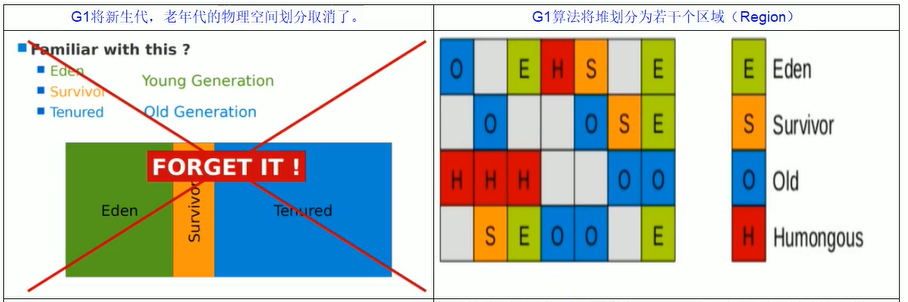

G1算法将堆划分为若干个区域（Region），它仍然属于分代收集器。这些Region的一部分包含新生代，新生代的垃圾收集依然采用暂停所有线程的方式，将存活对象拷贝到老年代或Survivor空间。

一部分Region也包含老年代，G1收集器通过将对象一个区域复制到另一个区域，完成了清理工作。这就意味着，在正常的处理过程中，G1完成了堆压缩（至少是部分堆的压缩），这样也就不会有CMS内存碎片问题了。

在G1中，还有一种特殊的区域，叫``Humongous(巨大的)``区域。如果一个对象占用的空间超过了``一个 Region 容量一半``以上，G1收集器就认为这个是一个巨型对象。这些``巨型对象默认直接被分配在老年代``，但是如果是一个短期存在的巨型对象，就会对垃圾收集器造成负面影响。为了解决这个问题，G1划分了一个Humongous区，它用来专门存放巨型对象。如果一个H区装不下一个巨型对象，那么G1会寻找连续的H分区来存储。为了能找到连续的H区，有时候不得不启动Full GC。

### G1 回收步骤

针对Eden区进行收集，Eden区耗尽后会触发，主要是小区域收集(`优先收集垃圾比价多的区域`) + 形成连续内存块，避免内存碎片：

* Eden区的数据移动到Survivor区，假如出现Survivor区空间不够，Eden区数据会部分晋升到Old区
* Survivor区的数据移动到新的Survivor区，部分数据晋升到Old区
* 最后Eden区收拾干净，GC结束，用户应用程序继续进行

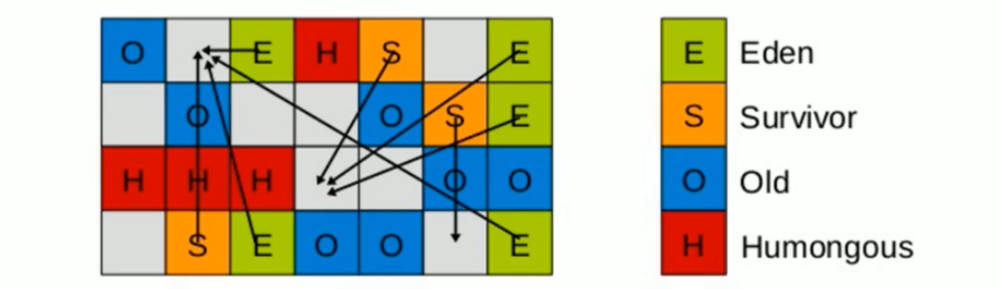

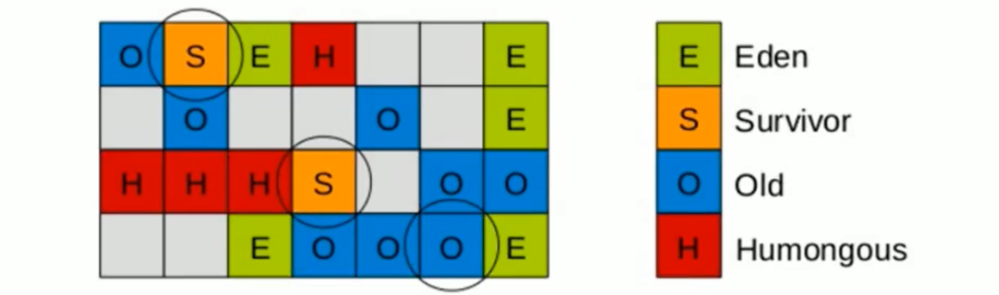

4步过程：

1. 初始标记，只标记 GC Roots 能够直接关联到的对象，这个阶段需要`停顿线程`，但耗时很短，而且是借用进行 Minor GC 的时候同步完成
2. 并发标记，从 GC Roots 开始对堆中对象进行可达性分析，递归扫描整个堆里的对象图，找出要回收的对象，这个阶段耗时较长，但可与用户程序并发执行。当对象图扫描完成后，还要重新处理 SATB 记录下的在并发时`有引用变动的对象`
3. 最终标记，对用户线程做另一个`短暂的暂停`，用以处理并发阶段结束后仍遗留下来的最后那少量的 SATB 记录
4. 筛选回收，根据用户所期望的时间来制定回收计划，可以自由选择任意多个 Region 构成回收集，然后把决定回收的那一部分 Region 的存活对象复制到空的 Region 中，再清理掉整个旧 Region 的全部空间。这里涉及到存活对象的移动，必须`暂停用户线程`，由多条收集器线程并行完成

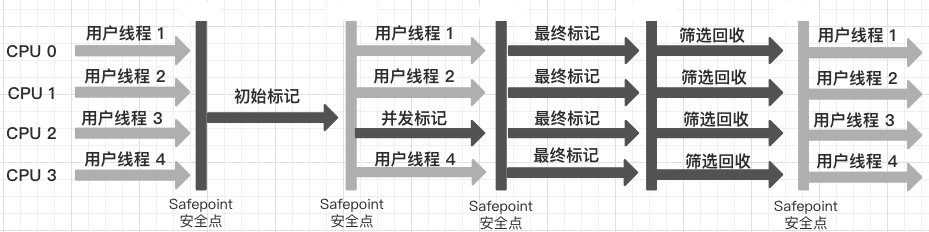

> 理解 G1日志格式 https://blogs.oracle.com/poonam/understanding-g1-gc-logs

```markdown
-Xms10m -Xmx10m -XX:+PrintGCDetails -XX:+PrintCommandLineFlags -XX:+UseG1GC

# 什么时候发生的GC，相对的时间刻，GC发生的区域young，总共花费的时间，0.0017942s
2019-12-18T16:06:46.508+0800:0.458: [GC pause (G1 Humongous Allocation) (young) (initial-mark), 0.0017942 secs]
[GC concurrent-root-region-scan-start]
[GC concurrent-root-region-scan-end, 0.0001925 secs]
[GC concurrent-mark-start]
[GC concurrent-mark-end, 0.0016351 secs]
[GC remark [Finalize Marking, 0.0000529 secs] [GC ref-proc, 0.0000632 secs] [Unloading, 0.0004366 secs], 0.0006288 secs]
 [Times: user=0.00 sys=0.00, real=0.00 secs] 
[GC cleanup 5479K->5479K(10M), 0.0001007 secs]
 [Times: user=0.00 sys=0.00, real=0.00 secs] 
```

### G1 常用配置参数

```markdown
# 开启G1收集器
	-XX:+UseG1GC

# 设置G1区域的大小，值是2的幂，范围是1MB~32MB。目标是根据最小的Java堆大小划分出约2048个区域
	-XX:G1HeapRegionSize=n

# 最大GC停顿时间，这是一个软目标，JVM将尽可能（但不保证）停顿小于这个时间，默认 200 毫秒
	-XX:MaxGCPauseMillis=n

# 堆占用了多少空间时就触发GC，默认是45
	-XX:InitiatingHeapOccupancyPercent=n

# 并发GC使用的线程数
	-XX:ConcGCThreads=n

# 设置作为空闲空间的预留空间内存百分比，以降低目标空间溢出风险，默认是10%
	-XX:G1ReservePercent=n
```

### G1调优与最佳指南

> 是否选用G1垃圾收集器的判断依据 https://docs.oracle.com/javase/8/docs/technotes/guides/vm/G1.html#use_cases
>
> * 50%以上的堆被存活对象占用
>
> * 对象分配和晋升的速度变化非常大
>
> * 垃圾回收时间比较长

```markdown
# 使用G1GC垃圾收集器，并打印日志
-XX:+UseG1GC -XX:+PrintGCDetails -XX:+PrintGCTimeStamps -XX:+PrintGCDateStamps -Xloggc:gc.log

# 使用GCViewer分析吞吐量和响应时间
	Throughput   MinPause   MaxPause		AvgPause		GCcount
	97.9%        0.00108s   0.02883s    0.01557s    7

# 调整内存大小再获取gc日志分析
	-XX:MetaspaceSize=100M -Xms320M -Xmx320M
	Throughput   MinPause   MaxPause		AvgPause		GCcount
	98.46%       0.01188s   0.03649s    0.02106s    3
------------- 吞吐量增加，GC 次数减少，但是停顿时间变大 -------------
	堆空间变大，意味着能存在更多的垃圾对象，那么每次垃圾回收的时候周期就会拉长

# 设置最大GC停顿时间指标
	-XX:MaxGCPauseMillis=35
	Throughput   MinPause   MaxPause		AvgPause		GCcount
	96.36%       0.00476s   0.03059s    0.0144s     10
------------- 停顿时间能够被控制，但是 GC 的次数增加了 -------------
	由于停顿时间的限制，每次回收并为完全回收，需要等待下次回收

# 启动并发GC时堆内存占用百分比
	-XX:InitiatingHeapOccupancyPercent=50
	Throughput   MinPause   MaxPause		AvgPause		GCcount
	97.36%       0.0036s    0.02271s    0.01038s    9
```

**最佳指南**

官网建议 https://docs.oracle.com/javase/8/docs/technotes/guides/vm/gctuning/g1_gc_tuning.html#recommendations

1. 不要手动设置新生代和老年代的大小，只要设置整个堆的大小

   G1收集器在运行过程中，会自己调整新生代和老年代的大小，其实是通过 adapt 代的大小来调整对象晋升的速度和年龄，从而达到为收集器设置的暂停时间目标如果手动设置了大小就意味着放弃了G1的自动调优。

2. 不断调优暂停时间目标

   一般情况下这个值设置到100ms或者200ms都是可以的(不同情况下会不一样)，但如果设置成50ms就不太合理。暂停时间设置的太短，就会导致出现G1跟不上垃圾产生的速度。最终退化成FullGC。所以对这个参数的调优是一个持续的过程，逐步调整到最佳状态。暂停时间只是一个目标，并不能总是得到满足。

3. 使用 `-XX:ConcGCThreads=n` 来增加标记线程的数量

   IHOP如果阀值设置过高，可能会遇到转移失败的风险，比如对象进行转移时空间不足。如果阀值设置过低，就会使标记周期运行过于频繁，并且有可能混合收集期回收不到空间。
   IHOP值如果设置合理，但是在并发周期时间过长时，可以尝试增加并发线程数，调高ConcGCThreads。

4. MixedGC调优

   -XX:InitiatingHeapOccupancyPercent 
   -XX:G1MixedGCLiveThresholdPercent 
   -XX:G1MixedGCCountTarger 
   -XX:G1OldCSetRegionThresholdPercent

5. 适当增加堆内存大小

### G1 比起CMS的优势

1. G1不会产生内存碎片
2. 可以精确的控制停顿。该收集器把整个堆（新生代、老年代）划分成多个固定大小的区域，每次根据允许停顿时间去收集垃圾最多的区域

# 3 JVM 性能优化指南

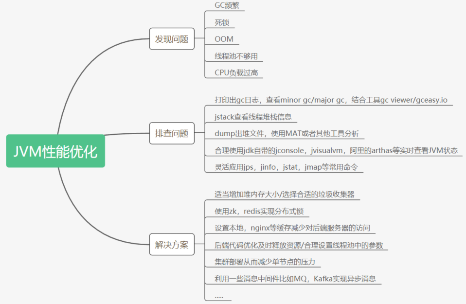

# 4 JVMGC + SpringBoot微服务的生产部署和参数调优

微服务启动时候，同时配置JVM/GC的调优参数。

IDE通过Application#main()方法启动：

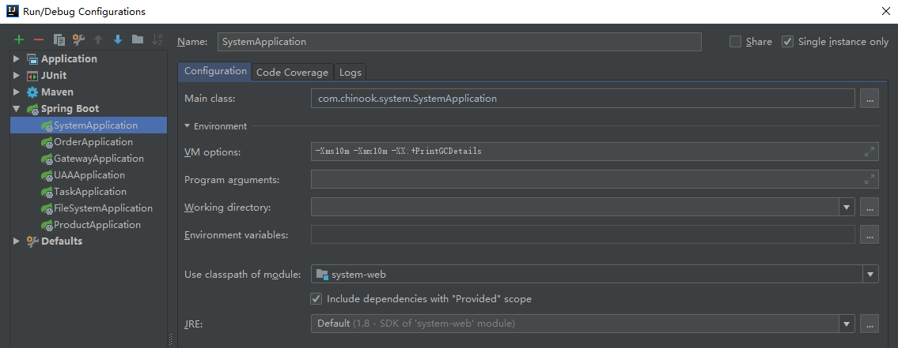

服务器部署时：

```
java -server JVM参数 -jar jar/war包名字
java -server -Xms1024m -Xmx1024m -XX:+UseG1GC -jar springboot2020-1.0-SNAPSHOT.jar
```

------

