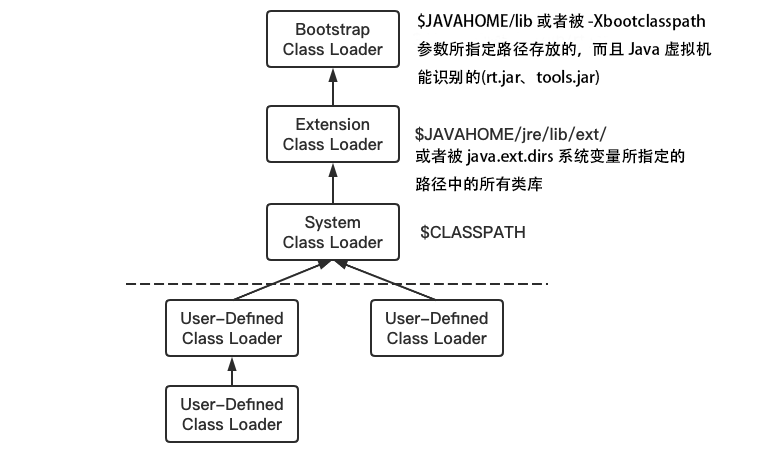

# JVM


JVM 是运行在操作系统之上的，它与硬件没有直接的交互。


# 1 源码到类文件

## 1.1 The relation of JDK/JRE/JVM

Reference -> Developer Guides -> 定位到 https://docs.oracle.com/javase/8/docs/index.html


## 1.2 编译过程

> .java -> javac -> .class
>
> Test.java -> 词法分析器 -> tokens流 -> 语法分析器 -> 语法树/抽象语法树 -> 语义分析器 -> 注解抽象语法树 -> 字节码生成器 -> Test.class文件

## 1.3 类文件(Class文件)

官网 The class File Format https://docs.oracle.com/javase/specs/jvms/se8/html/jvms-4.html

```java
ClassFile {
    u4             magic;   // 魔数与class文件版本
    u2             minor_version;
    u2             major_version;
    u2             constant_pool_count;  // 常量池
    cp_info        constant_pool[constant_pool_count-1];
    u2             access_flags;		// 访问标志
    u2             this_class;		// 类索引、父类索引、接口索引
    u2             super_class;
    u2             interfaces_count;
    u2             interfaces[interfaces_count];
    u2             fields_count;		// 字段表集合
    field_info     fields[fields_count];
    u2             methods_count;		// 方法表集合
    method_info    methods[methods_count];
    u2             attributes_count;		// 属性表集合
    attribute_info attributes[attributes_count];
}
```

```markdown
# vi -b Test.class
# :%!xxd
# magic(魔数) 标识类文件格式的幻数，它的值为 0xCAFEBABE
	cafe babe
# minor_version, major_version 
	0000 0034 对应10进制的52，代表JDK 8中的一个版本
# constant_pool_count
	001d 对应十进制29，代表常量池中29个常量
00000000: cafe babe 0000 0034 001d 0a00 0600 0f09  .......4........
00000010: 0010 0011 0800 120a 0013 0014 0700 1507  ................
00000020: 0016 0100 063c 696e 6974 3e01 0003 2829  .....<init>...()
00000030: 5601 0004 436f 6465 0100 0f4c 696e 654e  V...Code...LineN
00000040: 756d 6265 7254 6162 6c65 0100 046d 6169  umberTable...mai
...
```


# 2 类文件到虚拟机(类加载机制)

> 使用和卸载不算是类加载过程中的阶段，只是画完整了一下


## 2.1 装载(Load)

查找和导入 Class 文件

> (1)通过一个类的全限定名获取定义此类的`二进制字节流 `
>
> (2)将这个字节流所代表的`静态存储结构`转化为`方法区的运行时数据结构`
>
> (3)在 Java 堆中生成一个代表这个类的 java.lang.Class 对象，作为对方法区中这些数据的访问入口

## 2.2 链接(Link)

> 验证(Verify) 保证被加载类的正确性
>
> 准备(Prepare) 为类的静态变量分配内存，并将其初始化为默认值
>
> 解析(Resolve) 把类中的符号引用转换为直接引用，String str  = XXX符号引用 --> String str = 真实的引用地址

## 2.3 初始化(Initialize)

 对类的静态变量，静态代码块执行初始化操作

# 3 类加载器 ClassLoader

> 在装载(Load)阶段，其中第(1)步：通过类的全限定名获取其定义的二进制字节流，需要借助类装载器完成，顾名思义，就是用来装载 Class 文件的。 

`装载 Class 文件` Class 文件在``文件开头有特定的文件标示``，将 Class 文件字节码内容加载到内存中，并将这些内容转换成方法区中的运行时数据结构并且 ClassLoader 只负责 Class 文件的加载，至于它是否可以运行，则由``Execution Engine``决定。




## 3.1 虚拟机自带的加载器

``启动类加载器（Bootstrap）`` C++ 编写，加载 Java 的核心库

``扩展类加载器（Extension）`` Java 编写，加载目录 %JRE_HOME%\lib\ext 目录下的 jar包和 class 文件

``应用程序类加载器（AppClassLoader）``Java 编写，也叫系统类加载器，加载当前应用的 classpath 的所有类

### 用户自定义加载器

Java.lang.ClassLoader的子类，用户可以定制类的加载方式

```java
public class MyObject {
    public static void main(String[] args) {
        Object object = new Object();
        //System.out.println(object.getClass().getClassLoader().getParent().getParent()); NullPointerException
        //System.out.println(object.getClass().getClassLoader().getParent()); NullPointerException
        System.out.println(object.getClass().getClassLoader());

        // com.sun.java.accessibility.util.EventID --> %JRE_HOME%\lib\ext\jaccess.jar 中的类
        EventID zipFileStore = new EventID();
        System.out.println(zipFileStore.getClass().getClassLoader().getParent());
        System.out.println(zipFileStore.getClass().getClassLoader());
        
        MyObject myObject = new MyObject();
        System.out.println(myObject.getClass().getClassLoader().getParent().getParent());
        System.out.println(myObject.getClass().getClassLoader().getParent());
        System.out.println(myObject.getClass().getClassLoader());
    }
}
// null
// null
// sun.misc.Launcher$ExtClassLoader@3941a79c
// null
// sun.misc.Launcher$ExtClassLoader@3941a79c
// sun.misc.Launcher$AppClassLoader@135fbaa4
```

> sun.misc.Launcher 它是一个java虚拟机的入口应用

## 3.2 双亲委派机制

```java
package java.lang;

public class String {
    public static void main(String[] args) {
        System.out.println("hello");
    }
}
// 在类 java.lang.String 中找不到 main 方法
```

当一个类收到了类加载请求，他首先不会尝试自己去加载这个类，而是把这个请求委派给父类去完成，每一个层次类加载器都是如此，因此所有的加载请求都应该传送到启动类加载其中，只有当父类加载器反馈自己无法完成这个请求的时候（在它的加载路径下没有找到所需加载的Class），子类加载器才会尝试自己去加载。 
采用双亲委派的一个好处是比如加载位于 rt.jar 包中的类 java.lang.Object，不管是哪个加载器加载这个类，最终都是委托给顶层的启动类加载器进行加载，这样就保证了使用不同的类加载器最终得到的都是同样一个 Object对象。

> Execution Engine执行引擎负责解释命令，提交操作系统执行。 

### 沙箱安全

它防止了恶意代码去干涉善意的代码，这是通过为不同的类加载器装入的类提供了不同的命名空间来实现的，命名空间互相独立。

# 4 运行时数据区(Run-Time Data Areas)

> 在装载阶段的第(2)(3)步可以发现有运行时数据，堆，方法区等名词。
>
> 类文件被类装载器装载进来之后，类中的内容(比如变量，常量，方法，对象等这些数据得要有个去处，也就是要存储起来，存储的位置肯定是在 JVM 中有对应的空间)。

## 4.1 方法区 Method Area

方法区（Method Area）和堆一样，是各线程共享的运行时内存区域，在虚拟机启动时创建。它存储了`已被虚拟机加载的类信息`、常量(final)、静态变量、即时编译器编译后的代码等数据。

> Class 文件中除了有类的版本、字段、方法、接口等描述信息外，还有一项信息就是常量池，用于存放编译时期生成的各种字面量和符号引用，这部分内容将在类加载后进入方法区的`运行时常量池(Runtime Constant Pool)`中存放。

虽然 Java 虚拟机规范把方法区描述为堆的一个逻辑部分，但是它却又一个别名叫做 Non-Heap(非堆)，目的是与Java堆区分开来。 当方法区无法满足内存分配需求时，将抛出 OutOfMemoryError 异常。

方法区和永久代并不等价，只能说是`使用永久代来实现方法区`而已。JDK 6 开始逐步采用本地内存来实现方法区的概念。到了 JDK 7，已经把原本放在永久代的`字符串常量池`、`静态变量`等移出(移到堆中，逻辑上属于方法区)。到了 JDK 8 废弃了永久代改用在本地内存实现的元空间来代替，把还剩下的内容(主要是`类型信息`)全部移到元空间。

> But
> 实例变量存在堆内存中，和方法区无关

## 4.2 堆 Heap


`Java 堆`是Java虚拟机所管理内存中最大的一块，在虚拟机启动时创建，被所有线程共享。`Java 对象实例`以及`数组`都在堆上分配。

一个 JVM 实例只存在一个堆内存，堆内存的大小是可以调节的。类加载器读取了类文件后，需要把类、方法、常变量放到堆(此处所谓的堆包含方法区)内存中，保存所有引用类型的真实信息，以方便执行器执行，堆内存分为三部分：

``Young Generation Space 新生区`` Young/New

``Tenure generation space 养老区`` Old/ Tenure

``Permanent Space  永久区`` Perm

堆内存物理上分为：新生 + 养老

堆内存逻辑上分为三部分：新生 + 养老 + 永久


新生区是类的诞生、成长、消亡的区域，一个类在这里产生，应用，最后被垃圾回收器收集，结束生命。

新生区又分为两部分： `伊甸区(Eden space)`和`幸存者区(Survivor space) `，所有的类都是在伊甸区被 new 出来的。

幸存区有两个： 0 区（Survivor 0 space）和 1 区（Survivor 1 space）。

> 一般情况下，新创建的对象都会被分配到 Eden 区，一些特殊的大的对象会直接分配到 Old 区。
>
> HotSpot 虚拟机提供了 `-XX:PretenureSizeThreshold` 参数，指定大于该设置值的对象直接在老年代分配，PretenureSizeThreshold 参数只对 Serial 和 ParNew 两款收集器有效，默认 PretenureSizeThreshold=  4m。

当伊甸园的空间用完时，程序又需要创建对象，JVM 的垃圾回收器将对伊甸园区进行``垃圾回收(Minor GC)``，将伊甸园区中的不再被其他对象所引用的对象进行销毁。然后将伊甸园中的剩余对象移动到幸存 0 区。若幸存 0 区也满了，再对该区进行垃圾回收，然后移动到 1 区。那如果1 区也满了呢？再移动到养老区。若养老区也满了，那么这个时候将产生``MajorGC（FullGC）``，进行养老区的内存清理。

### 4.2.1 Minor GC 过程

复制->清空->互换

Java 堆从 GC 的角度还可以细分为：新生代（Eden区、From Survivor区和 To Survivor）和老年代。


1、eden、SurvivorFrom 复制到 SurvivorTo，年龄+1 

首先，当Eden区满的时候会触发第一次GC,把还活着的对象拷贝到SurvivorFrom区，当Eden区再次触发GC的时候会扫描Eden区和From区域,对这两个区域进行垃圾回收，经过这次回收后还存活的对象,则直接复制到To区域（如果有对象的年龄已经达到了老年的标准，则赋值到老年代区），同时把这些对象的年龄+1

2、清空 eden、SurvivorFrom 

然后，清空Eden和SurvivorFrom中的对象，也即复制之后有交换，谁空谁是to

3、SurvivorTo和 SurvivorFrom 互换 

最后，SurvivorTo和SurvivorFrom互换，原SurvivorTo成为下一次GC时的SurvivorFrom区。部分对象会在From和To区域中复制来复制去,如此交换15次(由JVM参数``MaxTenuringThreshold``决定,这个参数默认是15),最终如果还是存活,就存入到老年代

### 4.2.2 永久代

对于 HotSpot 虚拟机，很多开发者习惯将方法区称之为``“永久代(Parmanent Gen)”`` ，但严格本质上说两者不同，或者说使用永久代来实现方法区而已，永久代是方法区(相当于是一个接口interface)的一个实现，``jdk1.7的版本中，已经将原本放在永久代的字符串常量池移走。``


永久区(jdk1.7 及之前有)，永久存储区是一个常驻内存区域，用于存放JDK自身所携带的 Class,Interface 的元数据，也就是说它存储的是运行环境必须的类信息，被装载进此区域的数据是不会被垃圾回收器回收掉的，关闭 JVM 才会释放此区域所占用的内存。

+++++++++++++++++++++++++++++++永久代会发生垃圾回收吗？+++++++++++++++++++++++++++++++++++

## 4.3 栈 Stack

> 栈管运行，堆管存储
>
> 栈，先进后出

Java 虚拟机栈(Java Virtual Machine Stack)是线程私有的，生命周期和线程一致。

虚拟机栈描述的是 Java 方法执行的线程内存模型：``每个方法执行的同时都会创建一个栈帧(Stack Frame)，用于存储局部变量表、操作数栈、动态链接、方法出口等信息``，每一个方法从调用直至执行完毕的过程，就对应着一个栈帧在虚拟机中入栈到出栈的过程。

"栈"通常指虚拟机栈，或者更多情况下只是指虚拟机栈中局部变量表部分，主管 Java 程序的运行，栈是一个线程执行的区域，保存着一个线程中方法的调用状态。

局部变量表存放了编译器可知的各种 Java 虚拟机``基本类型``、`对象引用(reference 类型并不等于对象本身)`和 returnAddress 类型(指向了一个字节码指令的地址)。

### 4.3.1 栈运行原理

栈中的数据都是以`栈帧（Stack Frame）`的格式存在，栈帧是一个内存区块，是一个数据集，是一个有关方法(Method)和运行期数据的数据集。每一个被线程执行的方法，为该栈中的栈帧，即每个方法对应一个栈帧。

当一个方法 A 被调用时就产生了一个栈帧 F1，并被压入到栈中

A 方法又调用了 B 方法，于是产生栈帧 F2 也被压入栈

B 方法又调用了 C 方法，于是产生栈帧 F3 也被压入栈

……

执行完毕后，先弹出 F3 栈帧，再弹出 F2 栈帧，再弹出 F1 栈帧……

遵循 “先进后出/后进先出” 原则。

``栈的大小和具体JVM的实现有关，通常在256K~756K之间,约等于1Mb左右``。


图示在一个栈中有两个栈帧：

栈帧 2是最先被调用的方法，先入栈，然后方法 2 又调用了方法1，栈帧 1处于栈顶的位置，栈帧 2 处于栈底，执行完毕后，依次弹出栈帧 1和栈帧 2，线程结束，栈释放。 

每执行一个方法都会产生一个栈帧，保存到栈(后进先出)的顶部，顶部栈就是当前的方法，该方法执行完毕后会自动将此栈帧出栈。

### 4.3.2 栈帧存储什么

栈帧(Java 方法)中主要保存 4 类数据：

``局部变量表（Local Variables）`` 输入参数和输出参数以及方法内的变量，局部变量表中的变量不可直接使用，如需要使用的话，必须通过相关指令将其加载至操作数栈中作为操作数使用

``操作数栈（Operand Stack）`` 记录出栈、入栈的操作

`指向运行时常量池的引用(A reference to the run-time constant pool)` 每个栈帧都包含一个指向运行时常量池中该栈帧所属方法的引用，持有这个引用是为了支持方法调用过程中的动态连接(Dynamic Linking)

`方法返回地址(Return Address)` 当一个方法开始执行后,只有两种方式可以退出，一种是遇到方法返回的字节码指令；一种是遇见异常，并且 这个异常没有在方法体内得到处理

### 4.3.3 堆+栈+方法区的交互关系

```java
public class Test {
    public static void main(String[] args) {
        int i = 5;
        int n = i++;
    }
}
// javac Test.java & javap -v Test
// 0: iconst_5                  将 int 类型常量 5 压入【操作数栈】
// 1: istore_1                  将栈顶 int 类型值保存到【局部变量1】中
// 2: iload_1                   从【局部变量1】中装载 int 类型值入栈
// 3: iinc          1, 1        将整数值 constbyte 加到 indexbyte 指定的 int 类型的局部变量中
// 6: istore_2                  将栈顶 int 类型值保存到【局部变量2】中
// 7: return

// ++i
// 0: iconst_5
// 1: istore_1
// 2: iinc          1, 1
// 5: iload_1
// 6: istore_2
// 7: return

public class Test {
    public static void main(String[] args) {
        int i = 1;
        int n = 2;
        int result = i + n;
    }
}
// 0: iconst_1				将 int 类型常量 1 压入【操作数栈】
// 1: istore_1				将栈顶 int 类型值保存到【局部变量1】中
// 2: iconst_2				将 int 类型常量 2 压入【操作数栈】
// 3: istore_2				将栈顶 int 类型值保存到【局部变量2】中
// 4: iload_1				从【局部变量1】中装载int类型值入【操作数栈】
// 5: iload_2				从【局部变量2】中装载int类型值入【操作数栈】
// 6: iadd					将【操作数栈】中前两个 int 类型的值弹出相加，再将其结果进行入栈
// 7: istore_3				将栈顶 int 类型值保存到【局部变量3】中
// 8: return
```


> HotSpot 是使用``指针``的方式来访问对象：Java堆中会存放访问``类元数据``的地址，reference 存储的就直接是对象的地址

**<font color=red>③ 方法区指向堆</font>**

方法区中会存放静态变量，常量等数据。如果是下面这种情况，就是典型的方法区中元素指向堆中的对象。

```java
private static Object obj = new Object();
```

## 4.4 本地方法栈 Native Method Stack

与虚拟机栈作用相似，其区别是虚拟机栈为虚拟机执行 Java 方法服务，而本地方法栈则是为虚拟机使用到的`本地(Native)方法`服务。

```java
Thread t1 = new Thread();
t1.start();
// t1.start();
// Exception in thread "main" java.lang.IllegalThreadStateException
```

```java
public class Thread implements Runnable {
  ...
	public synchronized void start() {
    ...
  	start0();
    ...
	}
	...
	private native void start0();
}
```

### Native Interface 本地接口

本地接口的作用是融合不同的编程语言为 Java 所用，它的初衷是融合 C/C++程序，Java 诞生的时候是 C/C++横行的时候，要想立足，必须有调用 C/C++程序，于是就在内存中专门开辟了一块区域处理标记为native的代码，它的具体做法是 Native Method Stack中登记 native方法，在Execution Engine 执行时加载native libraies。

目前该方法使用的越来越少了，除非是与硬件有关的应用，比如通过Java程序驱动打印机或者Java系统管理生产设备，在企业级应用中已经比较少见。因为现在的异构领域间的通信很发达，比如可以使用 Socket通信，也可以使用Web Service等等，不多做介绍。

## 4.5 程序计数器 Program Counter Register

这块内存区域很小，``它是当前线程所执行的字节码的行号指示器``，字节码解释器通过改变这个计数器的值来选取下一条需要执行的字节码指令，用以完成分支、循环、跳转、异常处理、线程恢复等基础功能。

为了线程在多线程切换后能恢复到正确的执行位置，每个线程都有一个独立的程序计数器。

如果执行的是一个 Native 方法，那这个计数器是空的。

此内存区域是唯一一个不会发生任何内存溢出(OutOfMemory=OOM)的区域。

# 5 SOFE 和 OOM


## 5.1 StackOverflowError 栈溢出

```java
public class StackOverFlowErrorDemo {
    public static void main(String[] args) {
        m1();
    }

    public static void m1() {
        m1();
    }
}
// Exception in thread "main" java.lang.StackOverflowError
// 是错误，不是异常
```

## 5.2 OutOfMemoryError 内存溢出

若老年代执行了Full GC之后发现依然无法进行对象的保存，就会``产生OOM异常“OutOfMemoryError”``。

### Java heap space

如果出现java.lang.OutOfMemoryError: Java heap space异常，说明Java虚拟机的堆内存不够。原因有二：

1. Java虚拟机的堆内存设置不够，可以通过参数-Xms、-Xmx来调整。

2. 代码中创建了大量大对象，并且长时间不能被垃圾收集器收集（存在被引用）。

```java
public class JavaHeapSpaceDemo {
    public static void main(String[] args) {
        String str = "www.baidu.com" ;
        while(true) {
            str += str + new Random().nextInt(88888888) + new Random().nextInt(999999999) ;
        }
    }
}
// Exception in thread "main" java.lang.OutOfMemoryError: Java heap space
```

配置VM参数：``-Xms8m -Xmx8m -XX:+PrintGCDetails``

```markdown
[GC (Allocation Failure) [PSYoungGen: 1526K->504K(2048K)] 1526K->772K(7680K), 0.0009672 secs] [Times: user=0.00 sys=0.00, real=0.00 secs] 
[GC (Allocation Failure) [PSYoungGen: 1915K->499K(2048K)] 2183K->1017K(7680K), 0.0007847 secs] [Times: user=0.00 sys=0.00, real=0.00 secs] 
[GC (Allocation Failure) [PSYoungGen: 1942K->456K(2048K)] 2461K->1210K(7680K), 0.0008139 secs] [Times: user=0.00 sys=0.00, real=0.00 secs] 
[GC (Allocation Failure) [PSYoungGen: 1664K->504K(2048K)] 3363K->2674K(7680K), 0.0007038 secs] [Times: user=0.00 sys=0.00, real=0.00 secs] 
[GC (Allocation Failure) [PSYoungGen: 1949K->488K(2048K)] 6951K->5490K(7680K), 0.0009813 secs] [Times: user=0.00 sys=0.00, real=0.00 secs] 
[GC (Allocation Failure) --[PSYoungGen: 1432K->1432K(2048K)] 6434K->6434K(7680K), 0.0072110 secs] [Times: user=0.00 sys=0.00, real=0.01 secs] 
[Full GC (Ergonomics) [PSYoungGen: 1432K->0K(2048K)] [ParOldGen: 5002K->2625K(5632K)] 6434K->2625K(7680K), [Metaspace: 3294K->3294K(1056768K)], 0.0032568 secs] [Times: user=0.00 sys=0.00, real=0.00 secs] 
[GC (Allocation Failure) [PSYoungGen: 30K->0K(2048K)] 4544K->4513K(7680K), 0.0002178 secs] [Times: user=0.00 sys=0.00, real=0.00 secs] 
[GC (Allocation Failure) [PSYoungGen: 0K->0K(2048K)] 4513K->4513K(7680K), 0.0001809 secs] [Times: user=0.00 sys=0.00, real=0.00 secs] 
[Full GC (Allocation Failure) [PSYoungGen: 0K->0K(2048K)] [ParOldGen: 4513K->3568K(5632K)] 4513K->3568K(7680K), [Metaspace: 3294K->3294K(1056768K)], 0.0041181 secs] [Times: user=0.03 sys=0.00, real=0.00 secs] 
[Full GC (Allocation Failure) Exception in thread "main" java.lang.OutOfMemoryError: Java heap space
	at java.util.Arrays.copyOf(Arrays.java:3332)
	at java.lang.AbstractStringBuilder.expandCapacity(AbstractStringBuilder.java:137)
	at java.lang.AbstractStringBuilder.ensureCapacityInternal(AbstractStringBuilder.java:121)
	at java.lang.AbstractStringBuilder.append(AbstractStringBuilder.java:647)
	at java.lang.StringBuilder.append(StringBuilder.java:208)
	at jvm.T2.main(T2.java:22)
[PSYoungGen: 0K->0K(2048K)] [ParOldGen: 3568K->3547K(5632K)] 3568K->3547K(7680K), [Metaspace: 3294K->3294K(1056768K)], 0.0047886 secs] [Times: user=0.00 sys=0.00, real=0.01 secs] 
Heap
 PSYoungGen      total 2048K, used 61K [0x00000000ffd80000, 0x0000000100000000, 0x0000000100000000)
  eden space 1536K, 3% used [0x00000000ffd80000,0x00000000ffd8f438,0x00000000fff00000)
  from space 512K, 0% used [0x00000000fff80000,0x00000000fff80000,0x0000000100000000)
  to   space 512K, 0% used [0x00000000fff00000,0x00000000fff00000,0x00000000fff80000)
 ParOldGen       total 5632K, used 3547K [0x00000000ff800000, 0x00000000ffd80000, 0x00000000ffd80000)
  object space 5632K, 62% used [0x00000000ff800000,0x00000000ffb76fd0,0x00000000ffd80000)
 Metaspace       used 3327K, capacity 4496K, committed 4864K, reserved 1056768K
  class space    used 363K, capacity 388K, committed 512K, reserved 1048576K
```


### GC overhead limit exceeded

GC回收时间过长会抛出OutOfMerroyError。过长的定义是，超过98%的时间用来做GC并且回收了不到2%的堆内存，连续多次GC都只回收了不到2%的极端情况下才会抛出。

假如不抛出GC overhead limit exceeded错误，GC清理就这么点内存很快再次填满，迫使GC再次执行，这样恶性循环，CPU使用率一直都是100%，而GC却没有任何成果。


```java
public class GCOverheadDemo {
    public static void main(String[] args) {
        int i = 0;
        List<String> list = new ArrayList<>();

        try {
            while (true) {
                list.add(String.valueOf(++i).intern());
            }
        } catch (Exception e) {
            System.out.println("==========i: " + i);
            e.printStackTrace();
        }
    }
}
```

配置VM参数：``-Xms20m -Xmx20m -XX:+PrintGCDetails -XX:MaxDirectMemorySize=5m``

```markdown
[Full GC (Ergonomics) [PSYoungGen: 5631K->5631K(6144K)] [ParOldGen: 13777K->13777K(13824K)] 19409K->19409K(19968K), [Metaspace: 3293K->3293K(1056768K)], 0.0539105 secs] [Times: user=0.19 sys=0.00, real=0.06 secs] 
==========i: 317532
java.lang.OutOfMemoryError: GC overhead limit exceeded
	at java.lang.Integer.toString(Integer.java:403)
	at java.lang.String.valueOf(String.java:3099)
	at com.jvm.GCOverheadDemo.main(GCOverheadDemo.java:17)
```

### Direct buffer memory

写NIO程序经常使用ByteBuffer来读取或写入数据，这是一种基于通道（Channel）与缓冲区（Buffer）的I/O方式，它可以使用Native函数库直接分配堆外内存，然后通过一个存储在Java堆里面的DirectByteBuffer对象来做为这块内存的引用进行操作。这样能在一些场景中显著提升性能，因为避免了在Java堆和Native堆中来回复制数据。

``ByteBuffer.allocate(capability)`` 分配JVM堆内存，属于GC管辖范围，由于需要拷贝所以速度相对较慢。

``ByteBuffer.allocateDirect(capability)`` 分配OS本地内存，不属于GC管辖范围，由于不需要内存拷贝所以速度相对较快

但如果不断分配本地内存，堆内存很少使用，那么JVM就不需要执行GC，DirectByteBuffer对象就不会被回收，这时候堆内存充足，但本地内存可能已经用光了，再次尝试分配本地内存就会出现OutOfMemoryError，那程序就直接崩溃。

```java
public class DirectBufferMemoryDemo {
    public static void main(String[] args) {
        System.out.println("配置的maxDirectMemory:" + (VM.maxDirectMemory() / 1024 / 1023) + "MB");
        try {
            Thread.sleep(3000);
        } catch (InterruptedException e) {
            e.printStackTrace();
        }
        ByteBuffer bb = ByteBuffer.allocateDirect(6 * 1024 * 1024);
    }
}
```

配置VM参数：``-Xms10m -Xmx10m -XX:+PrintGCDetails -XX:MaxDirectMemorySize=5m``

```markdown
[Full GC (System.gc()) [PSYoungGen: 504K->0K(2560K)] [ParOldGen: 352K->738K(7168K)] 856K->738K(9728K), [Metaspace: 3298K->3298K(1056768K)], 0.0067846 secs] [Times: user=0.06 sys=0.00, real=0.01 secs] 
Exception in thread "main" java.lang.OutOfMemoryError: Direct buffer memory
	at java.nio.Bits.reserveMemory(Bits.java:693)
	at java.nio.DirectByteBuffer.<init>(DirectByteBuffer.java:123)
	at java.nio.ByteBuffer.allocateDirect(ByteBuffer.java:311)
	at com.jvm.DirectBufferMemoryDemo.main(DirectBufferMemoryDemo.java:19)
```

### unable to create new native thread

高并发请求服务器时，经常出现如下异常：java.lang.OutOfMemoryError: unable to create new native thread，准确的讲该native thread异常与对应的平台有关。

导致原因：

1. 应用创建了太多线程了，一个应用进程创建多个线程，超过系统承载极限
2. 服务器并不允许你的应用程序创建这么多线程，linux系统默认允许单个进程可以创建的线程数是1024个

解决办法：

1. 想办法降低应用程序创建线程的数量，分析应用是否真的需要创建这么多线程，如果不是，改代码将线程数降到最低
2. 对于有的应用，确实需要创建很多线程，远超过linux的默认线程限制，可以通过修改linux服务器配置，扩大linux默认限制

```java
public class UnableCreateNewThreadDemo {
    public static void main(String[] args) {
        for (int i = 1; ; i++) {
            System.out.println("=============== i = " + i);
            new Thread(() -> {
                try {
                    Thread.sleep(Integer.MAX_VALUE);
                } catch (InterruptedException e) {
                    e.printStackTrace();
                }
            }, "" + i).start();
        }
    }
}
```

```markdown
Exception in thread "main" java.lang.OutOfMemoryError: unable to create new native thread
	at java.lang.Thread.start0(Native Method)
	at java.lang.Thread.start(Thread.java:717)
	at UnableCreateNewThreadDemo.main(UnableCreateNewThreadDemo.java:17)
```

### Metaspace

使用 ``java -XX:+PrintFlagsInitial`` 命令查看本机的初始化参数，-XX:MetaspaceSize为 21810376B（约20.8M）

Java8 及之后的版本使用的 Metaspace 来替代永久代。

Metaspace 是方法区在 HotSpot 中的实现，它与永久代最大区别在于：`Metaspace 并不在虚拟机内存中而是使用本地内存`。也即在 Java 8 中，class metadata(the virtual machines internal presentation of Java class)，被存储在叫做Metaspace 的 native memory。

> 因此，默认情况下，元空间的大小仅受本地内存限制，但可以通过以下参数来指定元空间的大小：
>
> `-XX:MetaspaceSize` 初始空间大小，达到该值就会触发垃圾收集进行类型卸载，同时 GC 会对该值进行调整：如果释放了大量的空间，就适当降低该值；如果释放了很少的空间，那么在不超过 MaxMetaspaceSize 时，适当提高该值
>
> `-XX:MaxMetaspaceSize` 最大空间，默认是没有限制的

```java
public class MetaspaceOOMTest {

    static class OOMTest {}

    public static void main(String[] args) {
        // 模拟计数多少次以后发生异常
        int i = 0;
        try {
            while (true) {
                i++;
                Enhancer enhancer = new Enhancer();
                enhancer.setSuperclass(OOMTest.class);
                enhancer.setUseCache(false);
                enhancer.setCallback(new MethodInterceptor() {
                    @Override
                    public Object intercept(Object o, Method method, Object[] objects, MethodProxy methodProxy) throws Throwable {
                        return methodProxy.invokeSuper(o, args);
                    }
                });
                enhancer.create();
            }
        } catch (Throwable e) {
            System.out.println("************多少次后发生异常： " + i);
            e.printStackTrace();
        }
    }
}
```

配置VM参数： ``-XX:MetaspaceSize=8m -XX:MaxMetaspaceSize=8m``

```markdown
************多少次后发生异常： 255
java.lang.OutOfMemoryError: Metaspace
	at java.lang.Class.forName0(Native Method)
	at java.lang.Class.forName(Class.java:348)
	at org.springframework.cglib.core.ReflectUtils.defineClass(ReflectUtils.java:386)
	at org.springframework.cglib.core.AbstractClassGenerator.create(AbstractClassGenerator.java:219)
	at org.springframework.cglib.proxy.Enhancer.createHelper(Enhancer.java:377)
	at org.springframework.cglib.proxy.Enhancer.create(Enhancer.java:285)
	at com.jvm.MetaspaceOOMTest.main(MetaspaceOOMTest.java:32)
```

------

