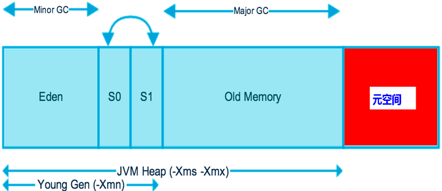
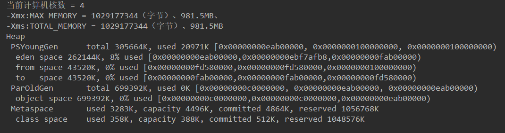
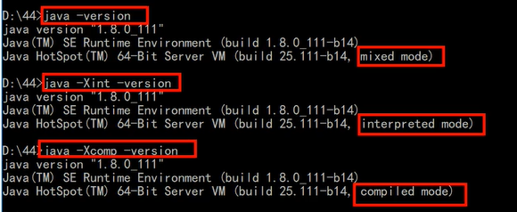
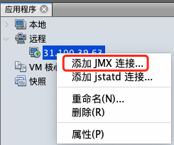
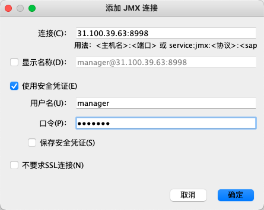
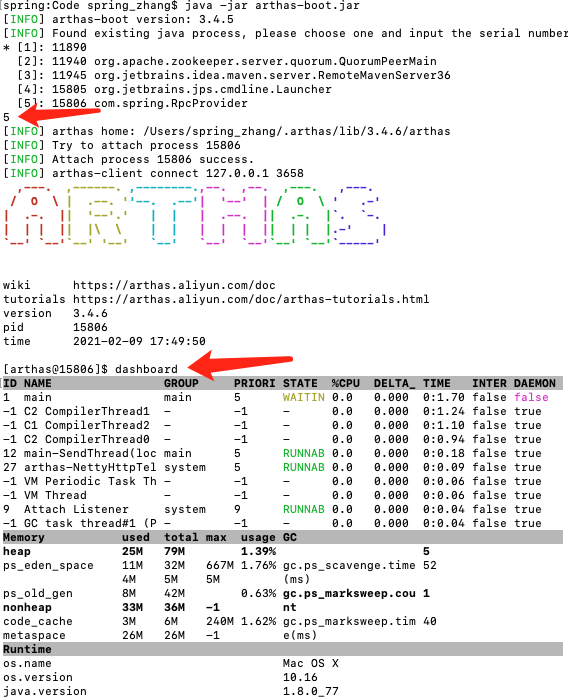
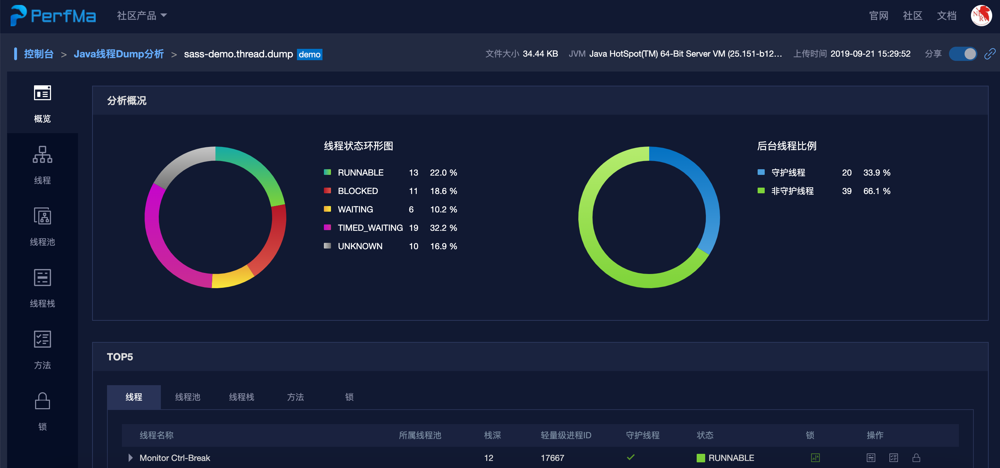
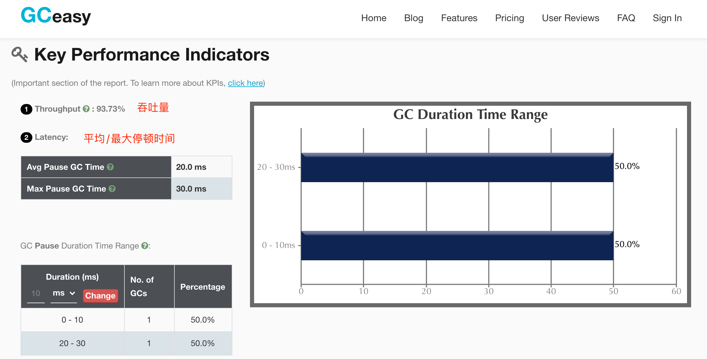
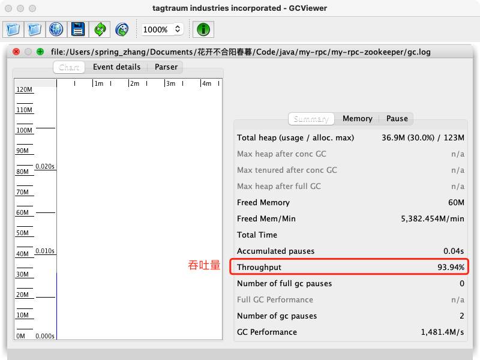
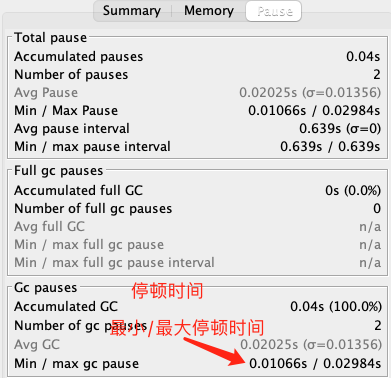

# 1 JVM 参数

## 1.1 堆大小的配置



在Java8中，永久代已经被移除，被一个称为**元空间**的区域所取代。元空间的本质和永久代类似。

元空间与永久代之间最大的区别在于：永久带使用的JVM的堆内存，但是java8以后的``元空间并不在虚拟机中而是使用本机物理内存``。

因此，默认情况下，元空间的大小仅受本地内存限制。类的元数据放入 native memory, ``字符串池和类的静态变量放入 java 堆中``，这样可以加载多少类的元数据就不再由MaxPermSize 控制, 而由系统的实际可用空间来控制。 


```java
public class MemoryOptionsDemo {
    public static void main(String[] args) {
        System.out.println("当前计算机核数 = " + Runtime.getRuntime().availableProcessors());

        //返回 Java 虚拟机试图使用的最大内存量
        long maxMemory = Runtime.getRuntime().maxMemory();
        //返回 Java 虚拟机中的内存总量
        long totalMemory = Runtime.getRuntime().totalMemory();
        System.out.println("-Xmx:MAX_MEMORY = " + maxMemory + "（字节）、" + (maxMemory / (double)1024 / 1024) + "MB");
        System.out.println("-Xms:TOTAL_MEMORY = " + totalMemory + "（字节）、" + (totalMemory / (double)1024 / 1024) + "MB");
    }
}
// 当前计算机核数 = 4
// -Xmx:MAX_MEMORY = 3793747968（字节）、3618.0MB
// -Xms:TOTAL_MEMORY = 257425408（字节）、245.5MB
```

> 发现默认的情况下分配的内存是总内存的“1 / 4”、而初始化的内存为“1 / 64”

配置VM参数：`` -Xms1024m -Xmx1024m -XX:+PrintGCDetails``

  

## 1.2 标配参数

-version

-hele

-showversion

## 1.3 X 参数（了解）

非标准参数，也就是在JDK各个版本中可能会变动

-Xint 解释执行

-Xcomp 第一次使用就编译本地代码

-Xmined 混合模式



## 1.4 XX 参数

非标准化参数，相对不稳定，主要用于JVM调优和Debug

### Boolean 类型

```markdown
# 公式
	-XX:+ 或者 - 某个属性值
		+ 表示开启
		- 表示关闭
```

### KV 设置类型

```markdown
# 公式
	-XX:属性key=属性值value

# 元空间大小
	-XX:MetaspaceSize=128m

# 控制新生代需要经历多少次GC晋升到老年代中的最大阈值
	-XX:MaxTenuringThreshold=15

# 两个经典参数
# -Xms
	等价于 -XX:InitialHeapSize

# -Xmx
	等价于 -XX:MaxHeapSize
```

## 1.5 盘点JVM家底

```markdown
# 查看初始默认 
	java -XX:+PrintFlagsInitial
		[Global flags]
			...
			uintx InitialHeapSize                     = 0                              {product}
			bool UseParallelGC                        = false                          {product}
			...
# 查询人为修改或JVM修改过之后的参数值
	java -XX:+PrintFlagsFinal -version
		[Global flags]
			uintx InitialHeapSize                     := 262144000                     {product}
			bool UseParallelGC                        := true                          {product}
     		bool UseParallelOldGC                      = true                          {product}

# := 表示人为修改或JVM修改过之后的更新参数值
# 任意一个程序 VM:options 配置	
	java -XX:+PrintFlagsFinal -XX:MetaspaceSize=128m
		[Global flags]
			...
			uintx MetaspaceSize                      := 134217728                     {pd product}

# 打印命令行参数
	java -XX:+PrintCommandLineFlags -version
		-XX:InitialHeapSize=260259904 -XX:MaxHeapSize=4164158464 -XX:+PrintCommandLineFlags -XX:+UseCompressedClassPointers -XX:+UseCompressedOops -XX:+UseParallelGC 
		openjdk version "1.8.0_232"
		OpenJDK Runtime Environment (build 1.8.0_232-b09)
		OpenJDK 64-Bit Server VM (build 25.232-b09, mixed mode)
```

## 1.6 设置参数的方式

* 开发工具中设置比如 IDEA，eclipse 

* 运行 jar 包的时候 java -XX:+UseG1GC xxx.jar 

* web 容器比如 tomcat，可以在脚本中的进行设置 

* 通过 jinfo 实时调整某个 java 进程的参数(参数只有被标记为 manageable 的 flags 可以被实时修改)

## 1.7 常用参数

```markdown
# 初始大小内存，默认为物理内存1/64
	-Xms
	-XX:InitialHeapSize

# 最大分配内存，默认为物理内存1/4
	-Xmx
	-XX:MaxHeapSize

# 设置单个线程栈的大小，一般默认为512k~1024k,表面上查看等于0，表示使用默认出厂的设置
	-Xss
	-XX:ThreadStackSize

# 设置年轻代大小
	-Xmn
	-XX:NewSize

# 年轻代最大大小
	-XX:MaxNewSize

# 设置元空间大小
	-XX:MetaspaceSize
	元空间的本质和永久代类似，都是对JVM规范中方法区的实现。
	不过元空间和永久代的区别在于：元空间并不在虚拟机中，而是使用本地内存。
	因此，默认情况下，元空间的大小仅受本地内存限制（默认只用20几M）

# 方法区最大大小
	-XX:MaxMetaspaceSize

# 典型设置案例
	-Xms128m -Xmx4096m -Xss1024k -XX:MetaspaceSize=512m -XX:+PrintCommandLineFlags -XX:+PrintGCDetails -XX:+UseSerialGC

# 输出详细GC收集日志信息
	-XX:PrintGCDetails

# 设置新生代eden和s0/s1空间的比例
	-XX:SurvivorRatio
	默认-XX:SurvivorRatio=8 ==》 Eden:s0:s1=8:1:1
	例如-XX:SurvivorRatio=4 ==》 Eden:s0:s1=4:1:1
	SurvivorRatio值设置eden区的比例占多少，s0/s1保持相同

# 配置新生代与老年代在堆结构的占比
	-XX:NewRatio
	默认-XX:NewRatio=2 新生代占1，老年代占2，新生代占整个堆的1/3
	假如-XX:NewRatio=4 新生代占1，老年代占4，新生代占整个堆的1/5
	NewRatio值就是设置老年代的占比，剩下的1给新生代

# 设置垃圾最大年龄
	-XX:MaxTenuringThreshold
	如果设置为0，则新生代对象不经过Survivor区，直接进入老年代。对于老年代比较多的应用，可以提高效率。如果将此值设置为一个较大值，则新生代对象会在Survivor区进行多次复制，这样可以增加对象在新生代的存活时间，增加在新生代即被回收的概率。

# 当JVM堆内存发生溢出时，也就是OOM，自动生成dump文件
	-XX:+HeapDumpOnOutOfMemoryError
# 指定堆内存溢出打印目录
	-XX:HeapDumpPath=heap.hprof
```

# 2 常用命令

## 2.1 jps

```markdown
# java提供的一个显示当前所有java进程pid的命令
# JVM Process Status Tool
	jps -l
		6960 com.jvm.HelloGC
# -v 输出虚拟机进程启动的 JVM 参数
# -l 输出主类的全名，如果进程执行的是 JAR 包，则输出 JAR 路径
```

## 2.2 jinfo

```markdown
# 用来查看正在运行的 java 应用程序的扩展参数，包括Java System属性和JVM命令行参数
# Configuration Info for Java
	jinfo [option] <pid>
		option
			no option 输出全部的参数和系统属性
			-flag name 输出对应名称的参数
			-flag [+|-]name 开启或者关闭对应名称的参数

# 实时修改某个进程中的JVM参数的值，PrintFlagsFinal 中括号中的值为 manageable 的属性才支持实时修改
			-flag name=value 设定对应名称的参数
			
			-flags 输出全部的参数
			-sysprops 输出系统属性
		pid 对应jvm的进程id
	jinfo -flag PrintGCDetails 6960
		-XX:-PrintGCDetails  表明6960程序未开启PrintGCDetails
	jinfo -flags 6960
		Attaching to process ID 29676, please wait...
		Debugger attached successfully.
		Server compiler detected.
		JVM version is 25.232-b09
		Non-default VM flags: -XX:CICompilerCount=3 -XX:CompressedClassSpaceSize=134217728 -XX:InitialHeapSize=536870912 -XX:MaxHeapSize=536870912 -XX:MaxMetaspaceSize=209715200 -XX:MaxNewSize=178782208 -XX:MetaspaceSize=209715200 -XX:MinHeapDeltaBytes=524288 -XX:NewSize=178782208 -XX:OldSize=358088704 -XX:+UseCompressedClassPointers -XX:+UseCompressedOops -XX:+UseParallelGC 
		Command line:  -Xms512m -Xmx512m -XX:CompressedClassSpaceSize=128m -XX:MetaspaceSize=200m -XX:MaxMetaspaceSize=200m
# Non-default VM flags JVM初始加载(系统根据机器性能配置)
# Command line 人工配置
```

## 2.3 jstat

```markdown
# jstat 监视虚拟机各种运行状态信息
# JVM Statistics Monitoring Tool
# 查看某个java进程的类加载、卸载数量、总空间以及类装载所耗费的时间，每1000毫秒输出一次，共输出10次
	jstat -class PID 1000 10 
		Loaded  Bytes  Unloaded  Bytes     Time
  		2204  4094.5        0     0.0       1.00
  		2204  4094.5        0     0.0       1.00
  		2204  4094.5        0     0.0       1.00
		...
# 监视 Java 堆状况，包括 Eden 区，2 个 Survivor 区、老年代、永久代等的容量，已用空间，垃圾收集时间合计等信息
	jstat -gc PID 1000 10
 		S0C    S1C    S0U    S1U      EC       EU        OC         OU       MC     MU    CCSC   CCSU   YGC     YGCT    FGC    FGCT     GCT
		10752.0 10752.0  0.0    0.0   65536.0  55139.0   175104.0     0.0     4480.0 776.5  384.0   76.6       0    0.000   0      0.000    0.000
		10752.0 10752.0  0.0    0.0   65536.0  55139.0   175104.0     0.0     4480.0 776.5  384.0   76.6       0    0.000   0      0.000    0.000
		10752.0 10752.0  0.0    0.0   65536.0  55139.0   175104.0     0.0     4480.0 776.5  384.0   76.6       0    0.000   0      0.000    0.000
		...
```

## 2.4 jstack

```markdown
# jstack 查看线程堆栈信息，生成虚拟机当前时刻的线程快照，目的通常是定位线程出现长时间停顿的原因，如线程间死锁、死循环、请求外部资源导致的长时间挂起等
# Stack Track for Java
	jstack PID
		2021-02-05 15:56:17
		Full thread dump Java HotSpot(TM) 64-Bit Server VM (25.271-b09 mixed mode):
		"nioEventLoopGroup-2-1" #12 prio=10 os_prio=2 tid=0x00000291ff994800 nid=0x1d9c runnable [0x000000b1d13fe000]
   			java.lang.Thread.State: RUNNABLE
        		at sun.nio.ch.WindowsSelectorImpl$SubSelector.poll0(Native Method)
        		at sun.nio.ch.WindowsSelectorImpl$SubSelector.poll(WindowsSelectorImpl.java:296)
       		 	at sun.nio.ch.WindowsSelectorImpl$SubSelector.access$400(WindowsSelectorImpl.java:278)
        		at sun.nio.ch.WindowsSelectorImpl.doSelect(WindowsSelectorImpl.java:159)
        		at sun.nio.ch.SelectorImpl.lockAndDoSelect(SelectorImpl.java:86)
        		...
# 排查死锁案例
	启动一个死锁程序 DeadLockDemo，获得 PID
	jstack PID，把打印信息拉到最后可以发现
	Found one Java-level deadlock:
		=============================
		"Thread-1":
  			waiting to lock monitor 0x000001eaeb713338 (object 0x000000076b930138, a java.lang.Object),
  			which is held by "Thread-0"
		"Thread-0":
  			waiting to lock monitor 0x000001eaeb715b18 (object 0x000000076b930148, a java.lang.Object),
  			which is held by "Thread-1"
	Java stack information for the threads listed above:
	===================================================
		"Thread-1":
        	at com.juc.DeadLock.run(DeadLockDemo.java:48)
        	- waiting to lock <0x000000076b930138> (a java.lang.Object)
        	- locked <0x000000076b930148> (a java.lang.Object)
        	at java.lang.Thread.run(Thread.java:748)
		"Thread-0":
        	at com.juc.DeadLock.run(DeadLockDemo.java:38)
        	- waiting to lock <0x000000076b930148> (a java.lang.Object)
        	- locked <0x000000076b930138> (a java.lang.Object)
        	at java.lang.Thread.run(Thread.java:748)
	Found 1 deadlock.
```

```java
//运行主类
public class DeadLockDemo
{
    public static void main(String[] args)
    {
        DeadLock d1=new DeadLock(true);
        DeadLock d2=new DeadLock(false);
        Thread t1=new Thread(d1);
        Thread t2=new Thread(d2);
        t1.start();
        t2.start();
    }
}
//定义锁对象
class MyLock{
    public static Object obj1=new Object();
    public static Object obj2=new Object();
}
//死锁代码
class DeadLock implements Runnable{
    private boolean flag;
    DeadLock(boolean flag){
        this.flag=flag;
    }
    @Override
    public void run() {
        if(flag) {
            while(true) {
                synchronized(MyLock.obj1) {
                    System.out.println(Thread.currentThread().getName()+"----if获得obj1锁");
                    synchronized(MyLock.obj2) {
                        System.out.println(Thread.currentThread().getName()+"----if获得obj2锁");
                    }
                }
            }
        }
        else {
            while(true){
                synchronized(MyLock.obj2) {
                    System.out.println(Thread.currentThread().getName()+"----否则获得obj2锁");
                    synchronized(MyLock.obj1) {
                        System.out.println(Thread.currentThread().getName()+"----否则获得obj1锁");
                    }
                }
            }
        }
    }
}
```

## 2.5 jmap

```markdown
# jmap 生成堆转储快照
# Memory Map for Java
# jmap 的作用不仅仅是为了获取堆转储快照，它还可以查询 finalize 执行队列，Java 堆和方法区的详细情况，如空间使用率、当前用的哪种收集器等
	jmap -heap PID
        Attaching to process ID 12648, please wait...
        Debugger attached successfully.
        Server compiler detected.
        JVM version is 25.271-b09

        using thread-local object allocation.
        Parallel GC with 6 thread(s)

        Heap Configuration:
            MinHeapFreeRatio         = 0
            MaxHeapFreeRatio         = 100
            MaxHeapSize              = 4273995776 (4076.0MB)
            NewSize                  = 89128960 (85.0MB)
            MaxNewSize               = 1424490496 (1358.5MB)
            OldSize                  = 179306496 (171.0MB)
            NewRatio                 = 2
            SurvivorRatio            = 8
            MetaspaceSize            = 21807104 (20.796875MB)
            CompressedClassSpaceSize = 1073741824 (1024.0MB)
            MaxMetaspaceSize         = 17592186044415 MB
            G1HeapRegionSize         = 0 (0.0MB)

        Heap Usage:
        PS Young Generation

# dump 出堆内存相关信息
	jmap -dump:format=b,file=heap.hprof PID
		Dumping heap to C:\Users\Administrator\heap.hprof ...
		Heap dump file created

# 一般在开发中，JVM参数可以加上下面两句，这样内存溢出时，会自动dump出该文件
	-XX:+HeapDumpOnOutOfMemoryError -XX:HeapDumpPath=heap.hprof
```

一般 dump 下来的文件可以结合工具来分析。

# 3 常用工具

## 3.1 JConsole

JConsole 工具是 JDK 自带的可视化监控、管理工具。查看 java 应用程序的运行概况、监控堆信息、永久区使用情况、类加载情况等。 

```markdown
# Java Monitoring and Management Console
# 命令行中输入
	jconsole

# 内存页签相当于可视化的 jstst 命令，用于监视被收集器管理的虚拟机内存（被收集器直接管理的 Java 堆和间接管理的方法区）的变化趋势
# 线程页签相当于可视化的 jstack 命令，遇到线程停顿时候可以使用这个页签的功能进行分析(“检查死锁”按钮)
```

## 3.2 jvisualvm

VisualVM 除了常规的运行监视本地的 Java 进程的 CPU，类，线程等与故障处理外，还将提供其他方面的能力，譬如性能分析，它还具备通过插件扩展功能的能力。

```markdown
# All-in-One Java Troubleshooting Tool
# 命令行中输入
	jvisualvm
```

### 3.2.1 visualgc 插件

`visualgc` 插件下载链接 https://visualvm.github.io/pluginscenters.html --> 选择对应版本链接 --> Tools --> Visual GC

Java VisualVM --> 工具 --> 插件 --> 已下载 --> 添加插件 --> 选择下载的 Visual GC 安装包 --> 打开 --> 安装


### 3.2.2 监控远端 Java 进程

```markdown
# 演示部署在阿里云服务器上的tomcat
# 1.在 visualvm 中选中“远程”，右击“添加”
# 2.主机名上写服务器的ip地址，比如31.100.39.63，然后点击“确定”
# 3.右击该主机“31.100.39.63”，添加“JMX”[也就是通过JMX技术具体监控远端服务器哪个Java进程]
# 4 要想让服务器上的tomcat被连接，需要改一下 bin/catalina.sh 这个文件
	JAVA_OPTS="$JAVA_OPTS -Dcom.sun.management.jmxremote - Djava.rmi.server.hostname=31.100.39.63 -Dcom.sun.management.jmxremote.port=8998 -Dcom.sun.management.jmxremote.ssl=false - Dcom.sun.management.jmxremote.authenticate=true - Dcom.sun.management.jmxremote.access.file=../conf/jmxremote.access - Dcom.sun.management.jmxremote.password.file=../conf/jmxremote.password"
# 5.在 ../conf 文件中添加两个文件jmxremote.access和jmxremote.password
	jmxremote.access 文件
			guest readonly
			manager readwrite
	jmxremote.password 文件
			guest guest
			manager manager
# 授予权限
	chmod 600 *jmxremot*
# 6.将连接服务器地址改为公网ip地址
	hostname -i 查看输出情况 
		172.26.225.240 172.17.0.1 
	vim /etc/hosts 
		172.26.255.240 31.100.39.63
# 7.设置上述端口对应的阿里云安全策略和防火墙策略，启动tomcat
# 8.在刚才的JMX中输入8998端口，并且输入用户名和密码则登录成功
	端口:8998
	用户名:manager
	密码:manager
```





## 3.3 Arthas

Arthas 是 Alibaba 开源的 Java 诊断工具，采用`命令行交互模式`，是`排查jvm相关问题`的利器。

```shell
curl -O https://alibaba.github.io/arthas/arthas-boot.jar 
java -jar arthas-boot.jar 
# 然后可以选择一个Java进程
```



**常用命令**

```
version:查看arthas版本号 
help:查看命名帮助信息 
cls:清空屏幕 
session:查看当前会话信息 
quit:退出arthas客户端 
---
dashboard:当前进程的实时数据面板
thread:当前JVM的线程堆栈信息
jvm:查看当前JVM的信息
sysprop:查看JVM的系统属性
---
sc:查看JVM已经加载的类信息
dump:dump已经加载类的byte code到特定目录
jad:反编译指定已加载类的源码
---
monitor:方法执行监控
watch:方法执行数据观测
trace:方法内部调用路径，并输出方法路径上的每个节点上耗时
stack:输出当前方法被调用的调用路径
......
```

## 3.4 MAT

Java 堆分析器，用于`查找内存泄漏`。Heap Dump，称为堆转储文件，是Java进程在某个时间内的快照。

下载地址 https://www.eclipse.org/mat/downloads.php

```markdown
# 获取Dump文件
# 手动
	jmap -dump:format=b,file=heap.hprof 44808
# 自动
	-XX:+HeapDumpOnOutOfMemoryError -XX:HeapDumpPath=heap.hprof
```

**Histogram**

Histogram可以列出内存中的对象，对象的个数及其大小。

`Class Name` 类名称，java类名 

`Objects` 类的对象的数量，这个对象被创建了多少个 

`Shallow Heap` 一个对象内存的消耗大小，不包含对其他对象的引用 

`Retained Heap` 是shallow Heap的总和，即该对象被GC之后所能回收到内存的总和 

```
右击类名 --> List Objects --> with incoming references -->列 出该类的实例 
右击Java对象名 --> Merge Shortest Paths to GC Roots --> exclude all ... --> 找到GC Root以及原因 
```

**Leak Suspects**

查找并分析内存泄漏的可能原因

```
Reports --> Leak Suspects --> Details 
```

**Top Consumers**

列出大对象

### 	在线 Java 线程 Dump 分析

https://thread.console.perfma.com/



## 3.5 GC 日志分析工具

《JVM 基础》SOFE 和 OOM 中做过对 GC 日志文件的分析。

这里采用图形化工具分析日志的信息，得先拿到GC日志文件才行，所以得先配置一下：

```
-XX:+PrintGCDetails -XX:+PrintGCTimeStamps -XX:+PrintGCDateStamps -Xloggc:gc.log
```

GC 日志分析，主要关注`吞吐量`和`停顿时间`两个重要指标。

**在线**

http://gceasy.io



**GCViewer**

```markdown
# 启动
	java -jar gcviewer-1.36-SNAPSHOT.jar
# 选择对应的 gc.log
```





------

