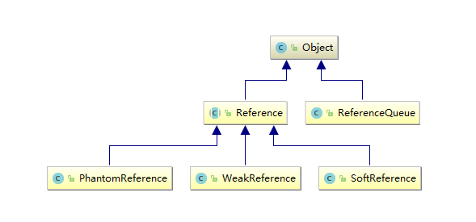
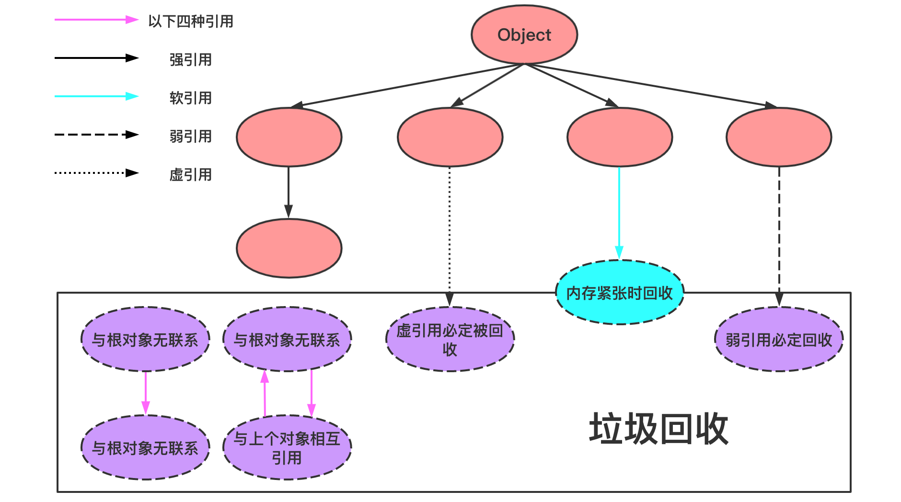

# Java 引用类型

## 整体架构



## 强引用

当内存不足，JVM开始垃圾回收，对于强引用的对象，``就算是出现了OOM也不会对该对象进行回收``，死都不收。

强引用是最常见的普通对象引用，只要还有强引用指向一个对象，就表明对象还活着，垃圾收集器不会碰这种对象。在Java中最常见的就是强引用，把一个对象赋给一个引用变量，这个引用变量就是一个强引用。当一个对象被强引用变量引用时，它处于可达状态，它是不可能被垃圾回收机制回收的，``即使该对象以后永远都不会被用到JVM也不会回收``。因此强引用是造成Java内存泄漏的主要原因之一。

对于一个普通对象，如果没有其他的引用关系，只要超过了引用的作用域或者显式地将相应（强）引用赋值为null，一般认为就是可以被垃圾收集了。

```java
public class StrongReferenceDemo {
    public static void main(String[] args) {
        // 强引用
        Object obj1 = new Object();
        // obj2引用赋值
        Object obj2 = obj1;
        obj1 = null;
        System.gc();
        System.out.println(obj2);
    }
}
// java.lang.Object@2ff4acd0
```

## 软引用

软引用是一种相对强引用弱化了一些的引用，需要用java.lang.ref.SoftReference类来实现，可以让对象豁免一些垃圾收集。

对于只有软引用的对象来说，当系统内存充足时，不会被回收，当系统内存不足时，会被回收。

软引用通常用在对内存敏感的程序中，比如``高速缓存``就有用到软引用，内存够用时就保留，不够用就回收。

```java
public class SoftReferenceDemo {

    public static void softRef_Memory_Enough() {
        Object o1 = new Object();
        SoftReference<Object> softReference = new SoftReference<>(o1);
        System.out.println(o1);
        System.out.println(softReference.get());

        o1 = null;
        System.gc();

        System.out.println(o1);
        System.out.println(softReference.get());
    }

    // -Xms5m -Xmx5m -XX:+PrintGCDetails
    public static void softRef_Memory_NotEnough() {
        Object o1 = new Object();
        SoftReference<Object> softReference = new SoftReference<>(o1);
        System.out.println(o1);
        System.out.println(softReference.get());

        o1 = null;

        try {
            // 故意产生大对象
            byte[] bytes = new byte[30 * 1024 *1024];
        } catch (Throwable e) {
            e.printStackTrace();
        } finally {
            System.out.println(o1);
            System.out.println(softReference.get());
        }
    }

    public static void main(String[] args) {
        //softRef_Memory_Enough();
        softRef_Memory_NotEnough();
    }
}
```

假如有一个应用需要读取大量的本地图片：

* 如果每次读取图片都从硬盘读取则会影响性能
* 如果一次性全部加载到内存中又可能造成内存溢出

此时使用软引用可以解决这个问题。

设计思路是：用一个HashMap来保存图片的路径和响应图片对象关联的软引用之间的映射关系，在内存不足时，JVM会自动回收这些缓存图片对象所占用的空间，从而有效地避免了OOM的问题。

```java
Map<String, SoftReference<Bitmap>> imageCache = new HashMap<String, SoftReference<Bitmap>>();
```

## 弱引用

弱引用需要用java.lang.ref.WeakReference类来实现，它比软引用的生存期更短，对于只有弱引用的对象来说，只要垃圾回收机制一运行，不管JVM的内存空间是否足够，都会回收该对象占用的内存。

```java
public class WeakReferenceDemo {
    public static void main(String[] args) {
        Object o1 = new Object();
        WeakReference<Object> weakReference = new WeakReference<>(o1);
        System.out.println(o1);
        System.out.println(weakReference.get());

        o1 = null;
        System.gc();

        System.out.println(o1);
        System.out.println(weakReference.get());
    }
}
```

### WeakHashMap

WeakHashMap内部是通过弱引用来管理`entry`的，弱引用的特性对应到WeakHashMap上意味着什么呢？将一对`key, value`放入到WeakHashMap里并不能避免该`key`值被GC回收，除非在WeakHashMap之外还有对该`key`的强引用。

和HashMap一样，WeakHashMap是不同步的。可以使用Collections.synchronizedMap方法来构造同步的WeakHashMap。

```java
public class WeakHashMapDemo {
    public static void main(String[] args) {
        myHashMap();
        myWeakHashMap();
    }

    private static void myWeakHashMap() {
        WeakHashMap<Integer, String> map = new WeakHashMap<>();
        Integer key = new Integer(2);
        String value = "WeakHashMap";

        map.put(key, value);
        System.out.println(map);
				// 此处如果不设置为null，则不会被回收  
        key = null;
        System.out.println(map);

        System.gc();
        System.out.println(map + "\t" + map.size());
    }

    private static void myHashMap() {
        HashMap<Integer, String> map = new HashMap<>();
        Integer key = new Integer(1);
        String value = "HashMap";

        map.put(key, value);
        System.out.println(map);

        key = null;
        System.out.println(map);

        System.gc();
        System.out.println(map + "\t" + map.size());
    }
}
```

## 虚引用

虚引用需要java.lang.ref.PhantomReference类来实现。

顾名思义，就是形同虚设，与其他几种引用都不同，虚引用并不会决定对象的生命周期。

如果一个对象仅持有虚引用，那么它就和没有任何引用一样，在任何时候都可能被垃圾回收器回收，它不能单独使用也不能通过它访问对象，虚引用必须和引用队列（ReferenceQueue）联合使用。

虚引用的主要作用是跟踪对象被垃圾回收的状态。仅仅是提供了一种确保对象被finalize以后，做某些事情的机制。

PhantomReference的get方法总是返回null，因此无法访问对应的引用对象。其意义在于说明一个对象已经进入finalization阶段，可以被GC回收，用来实现比finalization机制更灵活的回收操作。

换句话说，设置虚引用关联的唯一目的，就是在这个对象被收集器回收的时候收到一个系统通知或后续添加进一步的处理。

Java技术允许使用finalize()方法在垃圾收集器将对象从内存中清除出去之前做必要的清理工作。

### ReferenceQueue

被回收前需要被引用队列保存下。

创建引用的时候可以指定关联的队列，当GC释放对象内存的时候，会将引用加入到引用队列，如果程序发现某个虚引用已经被加入到引用队列，那么就可以在所引用的对象的内存被回收之前采取必要的行动，这相当于一种通知机制。

当关联引用队列中有数据的时候，意味着引用指向的堆内存中的对象被回收。通过这种方式，JVM允许我们在对象被销毁后，做一下想做的事情。

```java
public class PhantomReferenceDemo {
    public static void main(String[] args) throws InterruptedException {
        Object o1 = new Object();
        ReferenceQueue<Object> referenceQueue = new ReferenceQueue<>();
        PhantomReference<Object> phantomReference = new PhantomReference<>(o1, referenceQueue);

        System.out.println(o1);
        System.out.println(phantomReference.get());
        System.out.println(referenceQueue.poll());

        o1 = null;
        System.gc();
        Thread.sleep(500);

        System.out.println(o1);
        System.out.println(phantomReference.get());
        System.out.println(referenceQueue.poll());
    }
}

public class ReferenceQueueDemo {
    public static void main(String[] args) throws InterruptedException {
        Object o1 = new Object();
        ReferenceQueue<Object> referenceQueue = new ReferenceQueue<>();
        WeakReference<Object> weakReference = new WeakReference<>(o1, referenceQueue);

        System.out.println(o1);
        System.out.println(weakReference.get());
        System.out.println(referenceQueue.poll());
        
        o1 = null;
        System.gc();
        Thread.sleep(500);

        System.out.println(o1);
        System.out.println(weakReference.get());
        System.out.println(referenceQueue.poll());
    }
}
```

## GC Roots和四大引用




