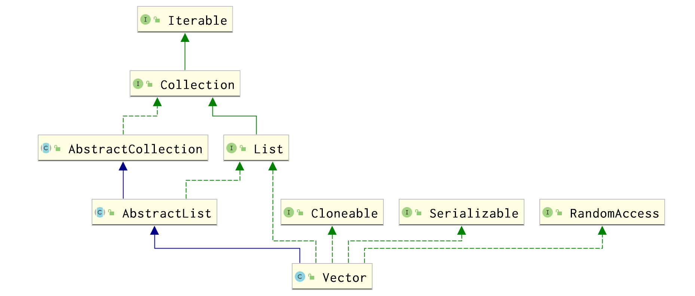
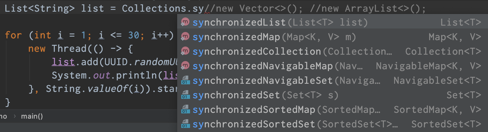

## 集合类不安全

```java
/**
 * 集合类是不安全的
 * 1. 故障现象 java.util.ConcurrentModificationException
 * 2. 解决方案
 *  Vector
 *  Collections.synchronizedList(new ArrayList<>())
 *  new CopyOnWriteArrayList<>()
 */
public class NotSafeDemo {
    public static void main(String[] args) {
        List<String> list = new CopyOnWriteArrayList<>();
        //Collections.synchronizedList(new ArrayList<>());
        //new Vector<>(); 
        //new ArrayList<>();

        for (int i = 1; i <= 30; i++) {
            new Thread(() -> {
                list.add(UUID.randomUUID().toString().substring(0, 8));
                System.out.println(list);
            }, String.valueOf(i)).start();
        }
    }
}
```

ArrayList在迭代的时候如果同时对其进行修改就会抛出``java.util.ConcurrentModificationException``异常并发修改异常。

```java
// 看ArrayList的源码 
public boolean add( E  e) {
  ensureCapacityInternal( size  +  1 );   // Increments modCount!!
  elementData [ size ++] = e;
  return true ;
} 
// 没有 synchronized 线程不安全 
```

### Vector

```java
// 看Vector的源码 
public synchronized boolean add( E  e) {
  modCount ++;
  ensureCapacityHelper( elementCount  +  1 );
  elementData [ elementCount ++] = e;
  return true ;
} 
//有 synchronized 线程安全 
```



### Collections



Collections提供了方法 *synchronizedList*保证*list*是同步线程安全的。

那*HashMap*，*HashSet*是线程安全的吗？也不是，所以有同样的线程安全方法。

### 写时复制

不加锁性能提升出错误，加锁数据一致性能下降。

> A thread-safe variant of ArrayList in which all mutative operations (add, set, and so on) are implemented by making a fresh copy of the underlying array. 

CopyOnWriteArrayList是arraylist的一种线程安全变体， 其中所有可变操作（add、set等）都是通过生成底层数组的新副本来实现的。 

```java
/**
 * Appends the specified element to the end of this list.
 *
 * @param e element to be appended to this list
 * @return {@code true} (as specified by {@link Collection#add})
 */
public boolean add(E e) {
    final ReentrantLock lock = this.lock;
    lock.lock();
    try {
        Object[] elements = getArray();
        int len = elements.length;
        Object[] newElements = Arrays.copyOf(elements, len + 1);
        newElements[len] = e;
        setArray(newElements);
        return true;
    } finally {
        lock.unlock();
    }
}
```

*CopyOnWrite*容器即写时复制的容器。往一个容器添加元素的时候，不直接往当前容器*Object[]*添加，而是先将当前容器*Object[]*进行*Copy*，复制出一个新的容器*Object[] newElements*，然后向新的容器*Object[] newElements*里添加元素。添加元素后，再将原容器的引用指向新的容器*setArray(newElements)*。
这样做的好处是可以对*CopyOnWrite*容器进行并发的读，而不需要加锁，因为当前容器不会添加任何元素。所以*CopyOnWrite*容器也是一种读写分离的思想，读和写不同的容器。 

#### HashSet

```java
Set<String> set = new HashSet<>();//线程不安全 
Set<String> set = new CopyOnWriteArraySet<>();//线程安全
```

 HashSet底层数据结构是什么？ 

HashMap

 但HashSet的add是放一个值，而HashMap是放K、V键值对 

```java
public HashSet() {
   map = new HashMap<>();
} 
private static final Object PRESENT = new Object(); 

public boolean add( E e) {
   return map.put(e, PRESENT)==null;
} 
```

#### HashMap

```java
Map<String,String> map =  new  HashMap<>();//线程不安全 
Map<String,String> map =  new  ConcurrentHashMap<>();//线程安全
```


前段时间，阿里巴巴在云栖大会上发布了阿里巴巴Java开发规约插件，在第一时间使用这款插件感觉十分强大，对于Java开发人员来说是一款非常好的礼物，感谢阿里。  在使用插件检测公司之前开发的代码时，发现了许多的“集合初始化时，指定集合初始化大小。”的问题，在公司同事之间进行了一些讨论，同时在网上查询了关于该问题的资料，发现自己对于HashMap此类集合了解的十分浅显，所以查询了许多资料来深入学习HashMap。


众说周知，HashMap是一个用于存储Key-Value键值对的集合。每一个键值对也叫做Entry，这些键值对（Entry）分散存储在一个数组当中，这个数组就是HashMap的主干。其中，每一个HashMap的值都为空。 默认初始容量 (16) 和默认加载因子 (0.75)，HashMap的最大容量值为2^30，扩容倍数为2。  也就是说，当我们new一个HashMap的时候它的长度为16，当存储到第（16*0.75=12）个的时候，HashMap会进行扩容，扩容到32，依次类推，所以HashMap的大小都是2^n。


HashMap最常用的方法是put和get方法。

## put方法

调用put方法时会利用一个哈希函数来确定Entry的插入位置（index）：index = Hash（“apple”）。

>所谓Hash函数按照定义可以实现一个伪随机数生成器(PRNG)，从这个角度可以得到一个公认的结论：哈希函数之间性能的比较可以通过比较其在伪随机生成方面的比较来衡量。对任意一类的数据存在一个理论上完美的哈希函数。这个完美的哈希函数定义是没有发生任何碰撞，这意味着没有出现重复的散列值。在现实中它很难找到一个完美的哈希散列函数，而且这种完美函数的趋近变种在实际应用中的作用是相当有限的。在实践中人们普遍认识到，一个完美哈希函数的哈希函数，就是在一个特定的数据集上产生的的碰撞最少哈希的函数。

### HashMap的Hash函数

利用Key的HashCode值来做位运算。Hash(Key) = HashCode（Key） &amp; （Length - 1）

```java
public class Test {
    public static void main(String[] args) throws Exception {
        System.out.println("apple".hashCode() & (16-1));
        System.out.println("banana".hashCode() & (16-1));
        System.out.println("book".hashCode() & (16-1));
    }
}
```

输出结果为：10 5 9  1.计算book的hashcode，结果为十进制的3029737，二进制的101110001110101110 1001。  2.假定HashMap长度是默认的16，计算Length-1的结果为十进制的15，二进制的1111。  3.把以上两个结果做与运算，101110001110101110 1001 &amp; 1111 = 1001，十进制是9，所以 index=9。

此处有一个问题，为什么HashMap的长度是2的幂？  假设初始长度为10，重复上面的位运算结果的二进制为1001  尝试101110001110101110 1011 和 101110001110101110 1111 结果也为1001，也就是说，当HashMap长度为10的时候，有些index结果的出现几率会更大，而有些index结果永远不会出现（比如0111）！显然不符合Hash算法均匀分布的原则。反观长度2的幂，Length-1的值是所有二进制位全为1，这种情况下，index的结果等同于HashCode后几位的值。只要输入的HashCode本身分布均匀，Hash算法的结果就是均匀的。

得到index值之后，也就得到了entry值插入的位置。但是由于HashMap的长度是固定的，但是在严格的Hash函数也会出现重复的情况，这样就会得到重复的index值。利用链表来解决这个问题，HashMap数组的每一个元素不止是一个Entry对象，也是一个链表的头节点。每一个Entry对象通过Next指针指向它的下一个Entry节点。当新来的Entry映射到冲突的数组位置时，只需要使用“头插法”插入到对应的链表即可。因为HashMap的发明者认为，后插入的Entry被查找的可能性更大。

## get方法

输入的Key做一次Hash映射，得到对应的index：index = Hash（“apple”）  由于刚才所说的Hash冲突，同一个位置有可能匹配到多个Entry，这时候就需要顺着对应链表的头节点，一个一个向下来查找。假设我们要查找的Key是“apple”：  第一步，我们查看的是头节点Entry6，Entry6的Key是banana，显然不是我们要找的结果。  第二步，我们查看的是Next节点Entry1，Entry1的Key是apple，正是我们要找的结果。

