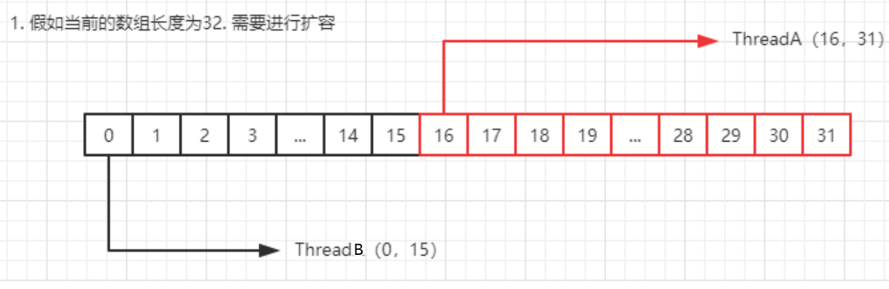
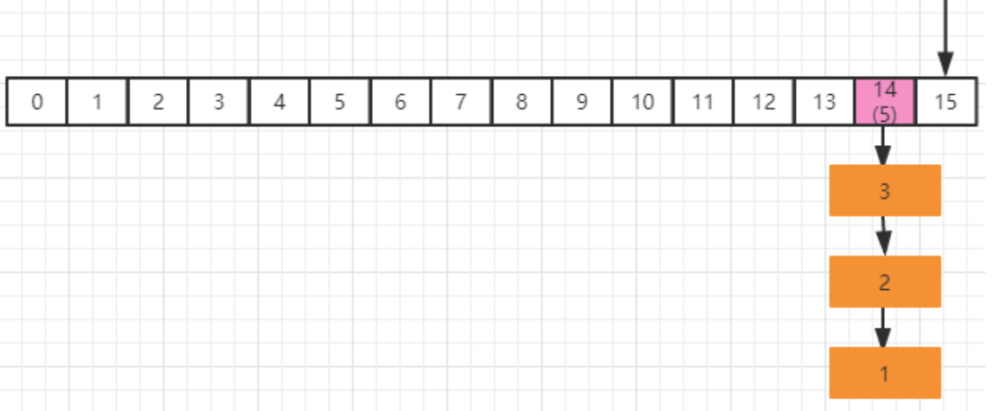
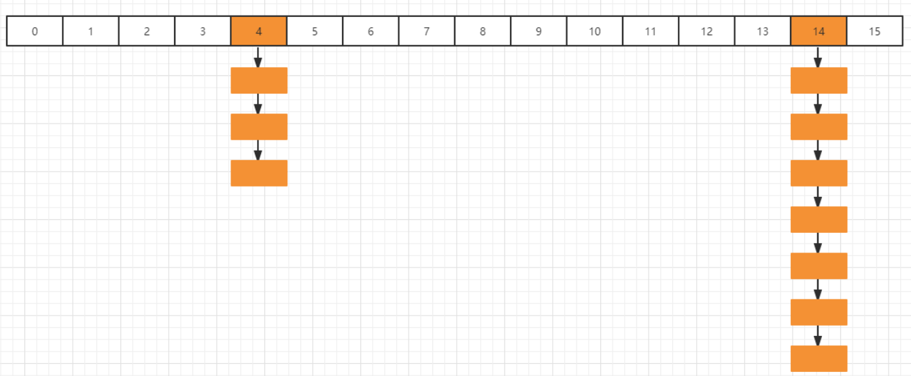
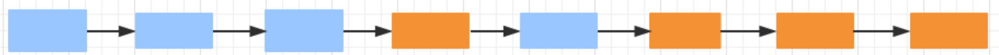
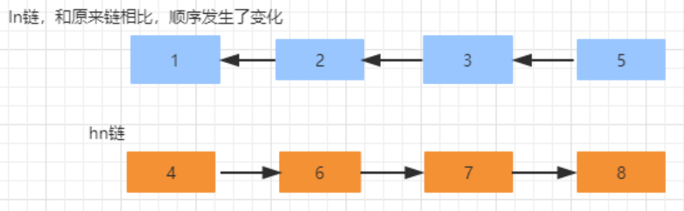

# 1 ConcurrentHashMap 的初步使用及场景

## 1.1 CHM 的使用

ConcurrentHashMap 是 J.U.C 包里面提供的一个线程安全并且高效的 HashMap，所以 ConcurrentHashMap 在并发编程的场景中使用的频率比较高，那么就从 ConcurrentHashMap 的使用上以及源码层面来分析 ConcurrentHashMap 到底是如何实现安全性的。 

## 1.2 api 使用

ConcurrentHashMap 是 Map 的派生类，所以 api 基本和 Hashmap 是类似，主要就是 put、 get 这些方法，接下来基于 ConcurrentHashMap 的 put 和 get 这两个方法作为切入点来分析 ConcurrentHashMap 的源码实现。

# 2 ConcurrentHashMap 的源码分析

先要做一个说明，分析的 ConcurrentHashMap 是基于 jdk1.8 的版本。 

## 2.1 JDK1.7 和 Jdk1.8 版本的变化

ConcurrentHashMap 和 HashMap 的实现原理是差不多的，但是因为 ConcurrentHashMap 需要支持并发操作，所以在实现上要比 hashmap 稍微复杂一些。 在 JDK1.7 的实现上 ， ConrruentHashMap 由一个个 Segment 组成，简单来说，ConcurrentHashMap 是一个 Segment 数组，它通过继承 ReentrantLock 来进行加锁，通过每次锁住一个 segment 来保证每个 segment 内的操作的线程安全性从而实现全局线程安全。 

当每个操作分布在不同的 segment 上的时候，默认情况下，理论上可以同时支持 16 个线程的并发写入。 

相比于 1.7 版本，它做了两个改进 

1. 取消了 segment 分段设计，直接使用 Node 数组来保存数据，并且采用 Node 数组元素作为锁来实现每一行数据进行加锁来进一步减少并发冲突的概率 
2. 将原本数组+单向链表的数据结构变更为了数组+单向链表+红黑树的结构。

为什么要引入红黑树呢？在正常情况下，key hash 之后如果能够很均匀的分散在数组中，那么 table 数组中的每个队列的长度主要为 0 或者 1.但是实际情况下，还是会存在一些队列长度过长的情况。如果还采用单向列表方式，那么查询某个节点的时间复杂度就变为 O(n); 因此对于队列长度超过 8 的列表，JDK1.8 采用了红黑树的结构，那么查询的时间复杂度就会降低到 O(logN),可以提升查找的性能；

这个结构和 JDK1.8 版本中的 Hashmap 的实现结构基本一致，但是为了保证线程安全性， ConcurrentHashMap 的实现会稍微复杂一下。

## 2.2 put 方法第一阶段

```java
public V put(K key, V value) {
    return putVal(key, value, false);
}
final V putVal(K key, V value, boolean onlyIfAbsent) {
    if (key == null || value == null) throw new NullPointerException();
    // 计算hash值
    int hash = spread(key.hashCode());
    // 用来计算链表长度，同时表示是否需要检查扩容
    int binCount = 0;
    //自旋操作，当出现线程竞争时不断自旋
    for (Node<K,V>[] tab = table;;) {
        Node<K,V> f; int n, i, fh;
        //如果数组为空，则进行数组初始化
        if (tab == null || (n = tab.length) == 0)
            // 初始化数组
            tab = initTable();
        //通过 hash 值对应的数组下标得到第一个节点; 以 volatile 读的方式来读取 table 数组中的元素，保证每次拿到的数据都是最新的
        else if ((f = tabAt(tab, i = (n - 1) & hash)) == null) {
            //如果该下标返回的节点为空，则直接通过 cas 将新的值封装成 node 插入即可；如果 cas 失败，说明存在竞争，则进入下一次循环
            if (casTabAt(tab, i, null,
                         new Node<K,V>(hash, key, value, null)))
                break;                   // no lock when adding to empty bin
        }
    ...
    }
}
```

假如在上面这段代码中存在两个线程，在不加锁的情况下：线程 A 成功执行 casTabAt 操作后，随后的线程 B 可以通过 tabAt 方法立刻看到 table[i] 的改变。原因如下：线程 A 的 casTabAt 操作，具有 volatile 读写相同的内存语义，根据 volatile 的 happens-before 规则：线程 A 的 casTabAt 操作，一定对线程 B 的 tabAt 操作可见。

**initTable**

数组初始化方法，这个方法比较简单，就是初始化一个合适大小的数组 `sizeCtl` 这个要单独说一下，如果没搞懂这个属性的意义，可能会被搞晕。

这个标志是在 Node 数组初始化或者扩容的时候的一个控制位标识，负数代表正在进行初始化或者扩容操作：

-1 代表正在初始化 

-N 代表有 N-1 个线程正在进行扩容操作，这里不是简单的理解成 n 个线程，sizeCtl 就是-N，这块后续在讲扩容的时候会说明

0 标识 Node 数组还没有被初始化，正数代表初始化或者下一次扩容的大小

```java
private final Node<K,V>[] initTable() {
    Node<K,V>[] tab; int sc;
    while ((tab = table) == null || tab.length == 0) {
        //被其他线程抢占了初始化的操作,则直接让出自己的 CPU 时间片
        if ((sc = sizeCtl) < 0)
            Thread.yield(); // lost initialization race; just spin
        //通过 cas 操作，将 sizeCtl 替换为-1，标识当前线程抢占到了初始化资格
        else if (U.compareAndSwapInt(this, SIZECTL, sc, -1)) {
            try {
                if ((tab = table) == null || tab.length == 0) {
                    //默认初始容量为 16
                    int n = (sc > 0) ? sc : DEFAULT_CAPACITY;
                    @SuppressWarnings("unchecked")
                    //初始化数组，长度为 16，或者初始化在构造 ConcurrentHashMap 的时候传入的长度
                    Node<K,V>[] nt = (Node<K,V>[])new Node<?,?>[n];
                    //将这个数组赋值给 table
                    table = tab = nt;
                    //计算下次扩容的大小，实际就是当前容量的 0.75 倍，这里使用了右移来计算
                    sc = n - (n >>> 2);
                }
            } finally {
                //设置 sizeCtl 为 sc, 如果默认是 16 的话，那么这个时候 sc=16*0.75=12
                sizeCtl = sc;
            }
            break;
        }
    }
    return tab;
}
```

**tabAt**

该方法获取对象中 offset 偏移地址对应的对象 field 的值。实际上这段代码的含义等价于 tab[i], 但是为什么不直接使用 tab[i] 来计算呢？ 

getObjectVolatile，一旦看到 volatile 关键字，就表示可见性。因为对 volatile 写操作 happenbefore 于 volatile 读操作，因此其他线程对 table 的修改均对 get 读取可见； 虽然 table 数组本身是增加了 volatile 属性，但是 `volatile 的数组只针对数组的引用具有 volatile 的语义，而不是它的元素`。 所以如果有其他线程对这个数组的元素进行写操作，那么当前线程来读的时候不一定能读到最新的值。 

出于性能考虑，Doug Lea 直接通过 Unsafe 类来对 table 进行操作。

```java
static final <K,V> Node<K,V> tabAt(Node<K,V>[] tab, int i) {
    return (Node<K,V>)U.getObjectVolatile(tab, ((long)i << ASHIFT) + ABASE);
}
static final <K,V> boolean casTabAt(Node<K,V>[] tab, int i,
                                    Node<K,V> c, Node<K,V> v) {
    return U.compareAndSwapObject(tab, ((long)i << ASHIFT) + ABASE, c, v);
}
```

## 2.3 put 方法第二阶段

在putVal方法执行完成以后，会通过 addCount 来增加 ConcurrentHashMap 中的元素个数， 并且还会可能触发扩容操作。这里会有两个非常经典的设计 

1. 高并发下的扩容
2. 如何保证 addCount 的数据安全性以及性能

**addCount**

在 putVal 最后调用 addCount 的时候，传递了两个参数，分别是 1 和 binCount(链表长度)， 看看 addCount 方法里面做了什么操作 x 表示这次需要在表中增加的元素个数，check 参数表示是否需要进行扩容检查，大于等于 0 都需要进行检查。

```java
private final void addCount(long x, int check) {
    CounterCell[] as; long b, s;
    //判断 counterCells 是否为空，
	//1. 如果为空，就通过 cas 操作尝试修改 baseCount 变量，对这个变量进行原子累加操作(做这个操作的意义是：如果在没有竞争的情况下，仍然采用 baseCount 来记录元素个数)
	//2. 如果 cas 失败说明存在竞争，这个时候不能再采用 baseCount 来累加，而是通过 CounterCell 来记录
    if ((as = counterCells) != null ||
        !U.compareAndSwapLong(this, BASECOUNT, b = baseCount, s = b + x)) {
        CounterCell a; long v; int m;
        //是否冲突标识，默认为没有冲突
        boolean uncontended = true;
        //这里有几个判断
//1. 计数表为空则直接调用 fullAddCount
//2. 从计数表中随机取出一个数组的位置为空，直接调用 fullAddCount
//3. 通过 CAS 修改 CounterCell 随机位置的值，如果修改失败说明出现并发情况（这里又用到了一种巧妙的方法），调用 fullAndCount
//Random 在线程并发的时候会有性能问题以及可能会产生相同的随机数,ThreadLocalRandom.getProbe 可以解决这个问题，并且性能要比 Random 高
        if (as == null || (m = as.length - 1) < 0 ||
            (a = as[ThreadLocalRandom.getProbe() & m]) == null ||
            !(uncontended =
              U.compareAndSwapLong(a, CELLVALUE, v = a.value, v + x))) {
            //执行 fullAddCount 方法
            fullAddCount(x, uncontended);
            return;
        }
        //链表长度小于等于 1，不需要考虑扩容
        if (check <= 1)
            return;
        //统计 ConcurrentHashMap 元素个数
        s = sumCount();
    }
    ...
}
```

**CounterCells 解释**

ConcurrentHashMap 是采用 CounterCell 数组来记录元素个数的，像一般的集合记录集合大小，直接定义一个 size 的成员变量即可，当出现改变的时候只要更新这个变量就行。为什么 ConcurrentHashMap 要用这种形式来处理呢？ 

问题还是处在并发上，ConcurrentHashMap 是并发集合，如果用一个成员变量来统计元素个数的话，为了保证并发情况下共享变量的的安全性，势必会需要通过加锁或者自旋来实现，如果竞争比较激烈的情况下，size 的设置上会出现比较大的冲突反而影响了性能，所以在 ConcurrentHashMap 采用了分片的方法来记录大小，具体什么意思，我们来分析下。

```java
// 标识当前 cell 数组是否在初始化或扩容中的 CAS 标志位
private transient volatile int cellsBusy;
// counterCells 数组，总数值的分值分别存在每个 cell 中
private transient volatile CounterCell[] counterCells;

@sun.misc.Contended static final class CounterCell {
    volatile long value;
    CounterCell(long x) { value = x; }
}
//看到这段代码就能够明白了，CounterCell 数组的每个元素，都存储一个元素个数，而实际我们调用size 方法就是通过这个循环累加来得到的
//又是一个设计精华，大家可以借鉴； 有了这个前提，再会过去看 addCount 这个方法，就容易理解一些了
final long sumCount() {
    CounterCell[] as = counterCells; CounterCell a;
    long sum = baseCount;
    if (as != null) {
        for (int i = 0; i < as.length; ++i) {
            if ((a = as[i]) != null)
                sum += a.value;
        }
    }
    return sum;
}
```

**fullAddCount**

fullAddCount 主要是用来初始化 CounterCell，来记录元素个数，里面包含扩容，初始化等操作。

```java
private final void fullAddCount(long x, boolean wasUncontended) {
    int h;
    //获取当前线程的 probe 的值，如果值为 0，则初始化当前线程的 probe 的值,probe 就是随机数
    if ((h = ThreadLocalRandom.getProbe()) == 0) {
        ThreadLocalRandom.localInit();      // force initialization
        h = ThreadLocalRandom.getProbe();
         // 由于重新生成了 probe，未冲突标志位设置为 true
        wasUncontended = true;
    }
    boolean collide = false;                // True if last slot nonempty
    //自旋
    for (;;) {
        CounterCell[] as; CounterCell a; int n; long v;
        //说明 counterCells 已经被初始化过了，我们先跳过这个代码，先看初始化部分
        if ((as = counterCells) != null && (n = as.length) > 0) {
            ...
        }
        //初始化 CounterCells 数组
		//cellsBusy=0 表示没有在做初始化，通过 cas 更新 cellsbusy 的值标注当前线程正在做初始化操作
        else if (cellsBusy == 0 && counterCells == as &&
                 U.compareAndSwapInt(this, CELLSBUSY, 0, 1)) {
            boolean init = false;
            try {                           // Initialize table
                if (counterCells == as) {
                    //初始化容量为 2
                    CounterCell[] rs = new CounterCell[2];
                    //将 x 也就是元素的个数放在指定的数组下标位置
                    rs[h & 1] = new CounterCell(x);
                    //赋值给 counterCells
                    counterCells = rs;
                    //设置初始化完成标识
                    init = true;
                }
            } finally {
                // 恢复标识
                cellsBusy = 0;
            }
            if (init)
                break;
        }
        //竞争激烈，其它线程占据 cell 数组，直接累加在 base 变量中
        else if (U.compareAndSwapLong(this, BASECOUNT, v = baseCount, v + x))
            break;                          // Fall back on using base
    }
}
```

## 2.4 transfer 扩容阶段

判断是否需要扩容，也就是当更新后的键值对总数 baseCount >= 阈值 sizeCtl 时，进行 rehash，这里面会有两个逻辑。 

1. 如果当前正在处于扩容阶段，则当前线程会加入并且协助扩容
2. 如果当前没有在扩容，则直接触发扩容操作

```java
//addCount方法
//如果 binCount>=0，标识需要检查扩容
if (check >= 0) {
    Node<K,V>[] tab, nt; int n, sc;
    //s 标识集合大小，如果集合大小大于或等于扩容阈值（默认值的 0.75）
	//并且 table 不为空并且 table 的长度小于最大容量
    while (s >= (long)(sc = sizeCtl) && (tab = table) != null &&
           (n = tab.length) < MAXIMUM_CAPACITY) {
        //这里是生成一个唯一的扩容戳，这个是干嘛用的呢？且听我慢慢分析
        int rs = resizeStamp(n);
        if (sc < 0) {
//sc<0，也就是 sizeCtl<0，说明已经有别的线程正在扩容了
//这 5 个条件只要有一个条件为 true，说明当前线程不能帮助进行此次的扩容，直接跳出循环
//sc >>> RESIZE_STAMP_SHIFT!=rs 表示比较高 RESIZE_STAMP_BITS 位生成戳和 rs 是否相等，不相同，则不能参与扩容
//sc=rs+1 表示扩容结束
//sc==rs+MAX_RESIZERS 表示帮助线程线程已经达到最大值了
//nt=nextTable -> 表示扩容已经结束
//transferIndex<=0 表示所有的 transfer 任务都被领取完了，没有剩余的hash 桶来给自己自己好这个线程来做 transfer
            if ((sc >>> RESIZE_STAMP_SHIFT) != rs || sc == rs + 1 ||
                sc == rs + MAX_RESIZERS || (nt = nextTable) == null ||
                transferIndex <= 0)
                break;
            if (U.compareAndSwapInt(this, SIZECTL, sc, sc + 1))
                //当前线程尝试帮助此次扩容，如果成功，则调用 transfer
                transfer(tab, nt);
        }
        // 如果当前没有在扩容，那么 rs 肯定是一个正数，通过 rs<<RESIZE_STAMP_SHIFT 将 sizeCtl 设置为一个负数，+2 表示有一个线程在执行扩容(SIZECTL 表示 sizeCtl 在对象中的偏移量，期望值为 sc)
        // sizeCtl (n = 16 扩容开始)
        // -2145714174
		// 10000000000110110000000000000010
        else if (U.compareAndSwapInt(this, SIZECTL, sc,
                                     (rs << RESIZE_STAMP_SHIFT) + 2))
            transfer(tab, null);
        // 重新计数，判断是否需要开启下一轮扩容
        s = sumCount();
    }
}
```

**resizeStamp**

这块逻辑要理解起来，也有一点复杂。 resizeStamp 用来生成一个和扩容有关的扩容戳，具体有什么作用呢？我们基于它的实现来做一个分析

```java
// 返回用于调整大小为 n 的表的大小的标记
// 保证左移时必须为负
static final int resizeStamp(int n) {
    // 1 << 15 左移 15 位，保证第十六位一定为 1，在后续计算在左移 16 位中保证首位位1，即为负数
    return Integer.numberOfLeadingZeros(n) | (1 << (RESIZE_STAMP_BITS - 1));
}
```

`Integer.numberOfLeadingZeros` 这个方法是返回无符号整数 n 最高位非 0 位前面的 0 的个数 

比如 10 的二进制是 <font color=red>0000 0000 0000 0000 0000 0000 0000</font> 1010 

那么这个方法返回的值就是 28 

根据 resizeStamp 的运算逻辑，我们来推演一下，假如 n=16，那么 resizeStamp(16)=32795 转化为二进制是 [0000 0000 0000 0000 1000 0000 0001 1011] 

> `>>`表示右移，如果该数为正，则高位补 0，若为负数，则高位补 1
>
> `>>>` 表示无符号右移，也叫逻辑右移，即若该数为正，则高位补 0，而若该数为负数，则右移后高位同样补 0
>
> 注：负值的二进制表示为正值的二进制的反码 + 1，即是补码
>
> 以 sc >>> RESIZE_STAMP_SHIFT ===》 -2145714174 >>> 16 = 32795 = resizeStamp(16) 为例：
>
> 原码：0111 1111 1110 0100 1111 1111 1111 1110
>
> 反码：1000 0000 0001 1011 0000 0000 0000 0001
>
> 补码：1000 0000 0001 1011 0000 0000 0000 0010
>
> 逻辑右移 16 位：0000 0000 0000 0000 1000 0000 0001 1011
>
> 32795 二进制：1000 0000 0001 1011
>
> ```java
> System.out.println(Integer.toBinaryString(32795));
> System.out.println(0B1000000000011011);
> System.out.println(Integer.toBinaryString(Integer.MIN_VALUE));
> System.out.println(0b10000000000000000000000000000000);
> System.out.println(0b01111111111111111111111111111111);
> // 1000000000011011
> // 32795
> // 10000000000000000000000000000000
> // -2147483648
> // 2147483647
> ```

接着再来看，当第一个线程尝试进行扩容的时候，会执行下面这段代码 

```java
U.compareAndSwapInt(this, SIZECTL, sc, (rs << RESIZE_STAMP_SHIFT) + 2) 
```

rs 左移 16 位，相当于原本的二进制低位变成了高位 1000 0000 0001 1011 0000 0000 0000 0000 

然后再+2 =1000 0000 0001 1100 0000 0000 0000 0000+10=1000 0000 0001 1011 0000 0000 0000 0010

高 16 位代表`扩容的标记`

低 16 位代表`并行扩容的线程数`

➢ 这样来存储有什么好处呢？ 

1. 首先在 CHM 中是支持并发扩容的，也就是说如果当前的数组需要进行扩容操作，可以由多个线程来共同负责，这块后续会单独讲 
2. 可以保证每次扩容都生成唯一的生成戳，每次新的扩容，都有一个不同的 n，这个生成戳就是根据 n 来计算出来的一个数字，n 不同，这个数字也不同 

➢ 第一个线程尝试扩容的时候，为什么是 +2 ？ 

因为 1 表示初始化，2 表示一个线程在执行扩容，而且对 sizeCtl 的操作都是基于位运算的， 所以不会关心它本身的数值是多少，只关心它在二进制上的数值，而 sc + 1 会在低 16 位上加 1。

**transfer**

扩容是 ConcurrentHashMap 的精华之一，扩容操作的核心在于数据的转移，在单线程环境 下数据的转移很简单，无非就是把旧数组中的数据迁移到新的数组。但是这在多线程环境下， 在扩容的时候其他线程也可能正在添加元素，这时又触发了扩容怎么办？可能大家想到的第 一个解决方案是加互斥锁，把转移过程锁住，虽然是可行的解决方案，但是会带来较大的性能开销。因为互斥锁会导致所有访问临界区的线程陷入到阻塞状态，持有锁的线程耗时越长， 其他竞争线程就会一直被阻塞，导致吞吐量较低。而且还可能导致死锁。 而 ConcurrentHashMap 并没有直接加锁，而是采用 CAS 实现无锁的并发同步策略，最精华的部分是它可以利用多线程来进行协同扩容。

简单来说，它把 Node 数组当作多个线程之间共享的任务队列，然后通过维护一个指针来划分每个线程锁负责的区间，每个线程通过区间逆向遍历来实现扩容，一个已经迁移完的 bucket 会被替换为一个 ForwardingNode 节点，标记当前 bucket 已经被其他线程迁移完了。 接下来分析一下它的源码实现

1、fwd:这个类是个标识类，用于指向新表用的，其他线程遇到这个类会主动跳过这个类，因为这个类要么就是扩容迁移正在进行，要么就是已经完成扩容迁移，也就是这个类要保证线程安全，再进行操作

2、advance:这个变量是用于提示代码是否进行推进处理，也就是当前桶处理完，处理下一个 桶的标识 

3、finishing:这个变量用于提示扩容是否结束用的

```java
private final void transfer(Node<K,V>[] tab, Node<K,V>[] nextTab) {
    int n = tab.length, stride;
    //将 (n>>>3 相当于 n/8) 然后除以 CPU 核心数。如果得到的结果小于 16，那么就使用 16
// 这里的目的是让每个 CPU 处理的桶一样多，避免出现转移任务不均匀的现象，如果桶较少的话，默认一个 CPU（一个线程）处理 16 个桶，也就是长度为 16 的时候，扩容的时候只会有一个线程来扩容
    // n=2048 NCPU=6 stride=42(42.666666...)
    if ((stride = (NCPU > 1) ? (n >>> 3) / NCPU : n) < MIN_TRANSFER_STRIDE)
        stride = MIN_TRANSFER_STRIDE; // subdivide range
    //nextTab 未初始化，nextTab 是用来扩容的 node 数组
    if (nextTab == null) {            // initiating
        try {
            @SuppressWarnings("unchecked")
            //新建一个 n<<1 原始 table 大小的 nextTab,也就是 32
            Node<K,V>[] nt = (Node<K,V>[])new Node<?,?>[n << 1];
            //赋值给 nextTab
            nextTab = nt;
        } catch (Throwable ex) {      // try to cope with OOME
             //扩容失败，sizeCtl 使用 int 的最大值
            sizeCtl = Integer.MAX_VALUE;
            return;
        }
        //更新成员变量
        nextTable = nextTab;
        //更新转移下标，表示转移时的下标
        transferIndex = n;
    }
    //新的 tab 的长度
    int nextn = nextTab.length;
    // 创建一个 fwd 节点，表示一个正在被迁移的 Node，并且它的 hash 值为-1(MOVED)，也就是前面我们在讲 putval 方法的时候，会有一个判断 MOVED 的逻辑。它的作用是用来占位，表示原数组中位置 i 处的节点完成迁移以后，就会在 i 位置设置一个 fwd 来告诉其他线程这个位置已经处理过了，具体后续还会在讲
    ForwardingNode<K,V> fwd = new ForwardingNode<K,V>(nextTab);
    // 首次推进为 true，如果等于 true，说明需要再次推进一个下标（i--），反之，如果是 false，那么就不能推进下标，需要将当前的下标处理完毕才能继续推进
    boolean advance = true;
    //判断是否已经扩容完成，完成就 return，退出循环
    boolean finishing = false; // to ensure sweep before committing nextTab
    //通过 for 自循环处理每个槽位中的链表元素，默认 advace 为真，通过 CAS 设置transferIndex 属性值，并初始化 i 和 bound 值，i 指当前处理的槽位序号，bound 指需要处理的槽位边界，先处理槽位 15 的节点；
    for (int i = 0, bound = 0;;) {
        // 这个循环使用 CAS 不断尝试为当前线程分配任务
 		// 直到分配成功或任务队列已经被全部分配完毕
 		// 如果当前线程已经被分配过 bucket 区域
 		// 那么会通过--i 指向下一个待处理 bucket 然后退出该循环
        Node<K,V> f; int fh;
        while (advance) {
            int nextIndex, nextBound;
            //--i 表示下一个待处理的 bucket，如果它>=bound,表示当前线程已经分配过 bucket 区域
            //-1 >= 0 false || finishing=false
            if (--i >= bound || finishing)
                advance = false;
            //表示所有 bucket 已经被分配完毕
            // 包含nextIndex = transferIndex,第二个进入方法帮助扩容的线程，会拿到新的 transferIndex
            else if ((nextIndex = transferIndex) <= 0) {
                i = -1;
                advance = false;
            }
            //通过 cas 来修改 TRANSFERINDEX(transferIndex),为当前线程分配任务，处理的节点区间为(nextBound,nextIndex)->(0,15)，修改 transferIndex 的值，为后面进入帮忙的线程分配新的 bucket 做准备
            // nextIndex=transferIndex=2048>42
            // nextBound = 2048-42
            // bound = 2006
            // i = 2047
            // transferIndex=2006
            //第二个进入方法帮助扩容的线程，拿到transferIndex=2006，得到nextIndex=transferIndex=2006，nextBound=2006-42，bound=1964，i = 2006
            else if (U.compareAndSwapInt
                     (this, TRANSFERINDEX, nextIndex,
                      nextBound = (nextIndex > stride ?
                                   nextIndex - stride : 0))) {
                bound = nextBound;
                i = nextIndex - 1;
                advance = false;
            }
        }
        //i<0 说明已经遍历完旧的数组，也就是当前线程已经处理完所有负责的 bucket
        if (i < 0 || i >= n || i + n >= nextn) {
            int sc;
            //如果完成了扩容
            if (finishing) {
                //删除成员变量
                nextTable = null;
                //更新 table 数组
                table = nextTab;
                //更新阈值(32*0.75=24)
                sizeCtl = (n << 1) - (n >>> 1);
                return;
            }
            // sizeCtl 在迁移前会设置为 (rs << RESIZE_STAMP_SHIFT) + 2
			// 然后，每增加一个线程参与迁移就会将 sizeCtl 加 1，
			// 这里使用 CAS 操作对 sizeCtl 的低 16 位进行减 1，代表做完了属于自己的任务
            // 此处的 sc 只是从全局取到 sizeCtl 并未-1，-1的操作被赋值给了 sizeCtl
            if (U.compareAndSwapInt(this, SIZECTL, sc = sizeCtl, sc - 1)) {
                //第一个扩容的线程，执行 transfer 方法之前，会设置 sizeCtl =(resizeStamp(n) << RESIZE_STAMP_SHIFT) + 2)后续帮其扩容的线程，执行 transfer 方法之前，会设置 sizeCtl = sizeCtl+1每一个退出 transfer 的方法的线程，退出之前，会设置 sizeCtl = sizeCtl-1那么最后一个线程退出时：必然有sc == (resizeStamp(n) << RESIZE_STAMP_SHIFT) + 2)，即 (sc - 2)== resizeStamp(n) << RESIZE_STAMP_SHIFT
				// 如果 sc - 2 不等于标识符左移 16 位。如果他们相等了，说明没有线程在帮助他们扩容了。也就是说，扩容结束了。
                // 不相等代表仍有线程在进行扩容，直接返回
                if ((sc - 2) != resizeStamp(n) << RESIZE_STAMP_SHIFT)// -2 与第一次开始扩容-2相呼应
                    return;
                // 如果相等，扩容结束了，更新 finising 变量
                finishing = advance = true;
                // 再次循环检查一下整张表
                i = n; // recheck before commit
            }
        }
        // 如果位置 i 处是空的，没有任何节点，那么放入刚刚初始化的 ForwardingNode ”空节点“
        else if ((f = tabAt(tab, i)) == null)
            advance = casTabAt(tab, i, null, fwd);
        //表示该位置已经完成了迁移，也就是如果线程 A 已经处理过这个节点，那么线程 B 处理这个节点时，hash 值一定为 MOVED
        else if ((fh = f.hash) == MOVED)
            advance = true; // already processed
        else {
            ...
            }
        }
    }
}
```

**扩容过程图解**

ConcurrentHashMap 支持并发扩容，实现方式是，把 Node 数组进行拆分，让每个线程处理自己的区域，假设 table 数组总长度是 64，默认情况下，那么每个线程可以分到 16 个 bucket。然后每个线程处理的范围，按照倒序来做迁移。

通过 for 自循环处理每个槽位中的链表元素，默认 advace 为真，通过 CAS 设置 transferIndex 属性值，并初始化 i 和 bound 值，i 指当前处理的槽位序号，bound 指需要处理的槽位边界，先处理槽位 31 的节点； （bound,i） =(16,31) 从 31 的位置往前推动。



假设这个时候 ThreadA 在进行 transfer，那么逻辑图表示如下



在当前假设条件下，槽位 15 中没有节点，则通过 CAS 插入在第二步中初始化的 ForwardingNode 节点，用于告诉其它线程该槽位已经处理过了；

**sizeCtl 扩容退出机制**

在扩容操作 transfer 的第 2414 行，代码如下

```java
if (U.compareAndSwapInt(this, SIZECTL, sc = sizeCtl, sc - 1)) {
                    if ((sc - 2) != resizeStamp(n) << RESIZE_STAMP_SHIFT)
```

每存在一个线程执行完扩容操作，就通过 cas 执行 sc-1。

接着判断(sc-2) !=resizeStamp(n) << RESIZE_STAMP_SHIFT ; 如果相等，表示当前为整个扩容操作的 最后一个线程，那么意味着整个扩容操作就结束了；如果不相等，说明还得继续。

这么做的目的，一方面是防止不同扩容之间出现相同的 sizeCtl，另外一方面，还可以避免 sizeCtl 的 ABA 问题导致的扩容重叠的情况。

## 2.5 数据迁移阶段的实现分析

通过分配好迁移的区间之后，开始对数据进行迁移。在看这段代码之前，先来了解一下原理

```java
//对数组该节点位置加锁，开始处理数组该位置的迁移工作
synchronized (f) {
    //再做一次校验
    if (tabAt(tab, i) == f) {
        //ln 表示低位， hn 表示高位;接下来这段代码的作用是把链表拆分成两部分，0 在低位，1 在高位
        Node<K,V> ln, hn;
        if (fh >= 0) {
            int runBit = fh & n;
            Node<K,V> lastRun = f;
            //遍历当前 bucket 的链表，目的是尽量重用 Node 链表尾部的一部分
            for (Node<K,V> p = f.next; p != null; p = p.next) {
                int b = p.hash & n;
                if (b != runBit) {
                    runBit = b;
                    lastRun = p;
                }
            }
            //如果最后更新的 runBit 是 0，设置低位节点
            if (runBit == 0) {
                ln = lastRun;
                hn = null;
            }
            //否则，设置高位节点
            else {
                hn = lastRun;
                ln = null;
            }
            //否则，设置高位节点
            for (Node<K,V> p = f; p != lastRun; p = p.next) {
                int ph = p.hash; K pk = p.key; V pv = p.val;
                if ((ph & n) == 0)
                    ln = new Node<K,V>(ph, pk, pv, ln);
                else
                    hn = new Node<K,V>(ph, pk, pv, hn);
            }
            //将低位的链表放在 i 位置也就是不动
            setTabAt(nextTab, i, ln);
            //将高位链表放在 i+n 位置
            setTabAt(nextTab, i + n, hn);
            // 把旧 table 的 hash 桶中放置转发节点，表明此 hash 桶已经被处理
            setTabAt(tab, i, fwd);
            advance = true;
        }
        else if (f instanceof TreeBin) {
            ...
        }
    }
}
```

**高低位原理分析**

ConcurrentHashMap 在做链表迁移时，会用高低位来实现，这里有两个问题要分析一下

1 如何实现高低位链表的区分

假如我们有这样一个队列



第 14 个槽位插入新节点之后，链表元素个数已经达到了 8，且数组长度为 16，优先通过扩容来缓解链表过长的问题，扩容这块的图解稍后再分析，先分析高低位扩容的原理。

假如当前线程正在处理槽位为 14 的节点，它是一个链表结构，在代码中，首先定义两个变量节点 ln 和 hn，实际就是 lowNode 和 HighNode，分别保存 hash 值的第 x 位为 0 和不等于 0 的节点。

通过 fn&n 可以把这个链表中的元素分为两类，A 类是 hash 值的第 X 位为 0，B 类是 hash 值的第 x 位为不等于 0（至于为什么要这么区分，稍后分析），并且通过 lastRun 记录最后要处理的节点。最终要达到的目的是，A 类的链表保持位置不动，B 类的链表为 14+16(扩容增加的长度)=30。

我们把 14 槽位的链表单独伶出来，我们用蓝色表示 fn&n=0 的节点，假如链表的分类是这样



```java
for (Node<K,V> p = f.next; p != null; p = p.next) {
    int b = p.hash & n;
    if (b != runBit) {
        runBit = b;
        lastRun = p;
    }
}
```

通过上面这段代码遍历，会记录 runBit 以及 lastRun，按照上面这个结构，那么 runBit 应该是蓝色节点，lastRun 应该是第 6 个节点

接着，再通过这段代码进行遍历，生成 ln 链以及 hn 链

```java
for (Node<K,V> p = f; p != lastRun; p = p.next) {
     int ph = p.hash; K pk = p.key; V pv = p.val;
     if ((ph & n) == 0)
          ln = new Node<K,V>(ph, pk, pv, ln);
     else
          hn = new Node<K,V>(ph, pk, pv, hn);
}
```



接着，通过 CAS 操作，把 hn 链放在 i+n 也就是 14+16 的位置，ln 链保持原来的位置不动。并且设置当前节点为 fwd，表示已经被当前线程迁移完了

**为什么要做高低位的划分**

要想了解这么设计的目的，我们需要从 ConcurrentHashMap 的根据下标获取对象的算法来看，在 putVal 方法中 1018 行

```java
(f = tabAt(tab, i = (n - 1) & hash)) == null
```

通过(n-1) & hash 来获得在 table 中的数组下标来获取节点数据，【&运算是二进制运算符，1 & 1=1，其他都为 0】

假设我们的 table 长度是 16， 二进制是【0001 0000】，减一以后的二进制是 【0000 1111】

假如某个 key 的 hash 值=9，对应的二进制是【0000 1001】，那么按照（n-1） & hash 的算法 0000 1111 & 0000 1001 =0000 1001 ， 运算结果是 9

当我们扩容以后，16 变成了 32，那么(n-1)的二进制是 【0001 1111】仍然以 hash 值=9 的二进制计算为例 0001 1111 & 0000 1001 =0000 1001 ，运算结果仍然是 9

我们换一个数字，假如某个 key 的 hash 值是 20，对应的二进制是【0001 0100】，仍然按照(n-1) & hash算法，分别在 16 为长度和 32 位长度下的计算结果

16 位： 0000 1111 & 0001 0100=0000 0100

32 位： 0001 1111 & 0001 0100 =0001 0100

从结果来看，同样一个 hash 值，在扩容前和扩容之后，得到的下标位置是不一样的，这种情况当然是不允许出现的，所以在扩容的时候就需要考虑，而使用高低位的迁移方式，就是解决这个问题。

大家可以看到，16 位的结果到 32 位的结果，正好增加了 16。

比如 20 & 15=4 、20 & 31=20 ； 20-4 =16

比如 60 & 15=12 、60 & 31=28； 28-12=16

所以对于高位，直接增加扩容的长度，当下次 hash 获取数组位置的时候，可以直接定位到对应的位置。这个地方又是一个很巧妙的设计，直接通过高低位分类以后，就使得不需要在每次扩容的时候来重新计算 hash，极大提升了效率。

**扩容结束以后的退出机制**

如果线程扩容结束，那么需要退出，就会执行 transfer 方法的如下代码

```java
//i<0 说明已经遍历完旧的数组，也就是当前线程已经处理完所有负责的 bucket
if (i < 0 || i >= n || i + n >= nextn) {
                int sc;
  							//如果完成了扩容
                if (finishing) {
                  //删除成员变量
                    nextTable = null;
                  //更新 table 数组
                    table = nextTab;
                  //更新阈值(32*0.75=24)
                    sizeCtl = (n << 1) - (n >>> 1);
                    return;
                }
                if (U.compareAndSwapInt(this, SIZECTL, sc = sizeCtl, sc - 1)) {
                  //第一个扩容的线程，执行 transfer 方法之前，会设置 sizeCtl = (resizeStamp(n) << RESIZE_STAMP_SHIFT) + 2)
                  //后续帮其扩容的线程，执行 transfer 方法之前，会设置 sizeCtl = sizeCtl+1
									//每一个退出 transfer 的方法的线程，退出之前，会设置 sizeCtl = sizeCtl-1
									//那么最后一个线程退出时：必然有sc == (resizeStamp(n) << RESIZE_STAMP_SHIFT) + 2)，即 (sc - 2) == resizeStamp(n) << RESIZE_STAMP_SHIFT
									// 如果 sc - 2 不等于标识符左移 16 位。如果他们相等了，说明没有线程在帮助他们扩容了。也就是说，扩容结束了。
                    if ((sc - 2) != resizeStamp(n) << RESIZE_STAMP_SHIFT)
                        return;
                  // 如果相等，扩容结束了，更新 finising 变量
                    finishing = advance = true;
                  // 再次循环检查一下整张表
                    i = n; // recheck before commit
                }
            }
```

**put 方法第三阶段**

如果对应的节点存在，判断这个节点的 hash 是不是等于 MOVED(-1)，说明当前节点是 ForwardingNode 节点，意味着有其他线程正在进行扩容，那么当前现在直接帮助它进行扩容，因此调用 helpTransfer方法。

```java
else if ((fh = f.hash) == MOVED)
                tab = helpTransfer(tab, f);
```

**helpTransfer**

从名字上来看，代表当前是去协助扩容

```java
    final Node<K,V>[] helpTransfer(Node<K,V>[] tab, Node<K,V> f) {
        Node<K,V>[] nextTab; int sc;
      // 判断此时是否仍然在执行扩容,nextTab=null 的时候说明扩容已经结束了
        if (tab != null && (f instanceof ForwardingNode) &&
            (nextTab = ((ForwardingNode<K,V>)f).nextTable) != null) {
          //生成扩容戳
            int rs = resizeStamp(tab.length);
          //说明扩容还未完成的情况下不断循环来尝试将当前线程加入到扩容操作中
            while (nextTab == nextTable && table == tab &&
                   (sc = sizeCtl) < 0) {
              //下面部分的整个代码表示扩容结束，直接退出循环
//transferIndex<=0 表示所有的 Node 都已经分配了线程
//sc=rs+MAX_RESIZERS 表示扩容线程数达到最大扩容线程数
//sc >>> RESIZE_STAMP_SHIFT !=rs， 如果在同一轮扩容中，那么 sc 无符号右移比较高位和 rs 的值，那么应该是相等的。如果不相等，说明扩容结束了
//sc==rs+1 表示扩容结束
                if ((sc >>> RESIZE_STAMP_SHIFT) != rs || sc == rs + 1 ||
                    sc == rs + MAX_RESIZERS || transferIndex <= 0)
                  //跳出循环
                    break;
              //在低 16 位上增加扩容线程数
                if (U.compareAndSwapInt(this, SIZECTL, sc, sc + 1)) {
                  //帮助扩容
                    transfer(tab, nextTab);
                    break;
                }
            }
            return nextTab;
        }
        return table;
    }
```

## 2.6 put 方法第四阶段

这个方法的主要作用是，如果被添加的节点的位置已经存在节点的时候，需要以链表的方式加入到节点中

如果当前节点已经是一颗红黑树，那么就会按照红黑树的规则将当前节点加入到红黑树中

```java
//进入到这个分支，说明 f 是当前 nodes 数组对应位置节点的头节点，并且不为空            
else {
                V oldVal = null;
  //给对应的头结点加锁
                synchronized (f) {
                  //再次判断对应下标位置是否为 f 节点
                    if (tabAt(tab, i) == f) {
                      //头结点的 hash 值大于 0，说明是链表
                        if (fh >= 0) {
                          //用来记录链表的长度
                            binCount = 1;
                          //遍历链表
                            for (Node<K,V> e = f;; ++binCount) {
                                K ek;
                              //如果发现相同的 key，则判断是否需要进行值的覆盖
                                if (e.hash == hash &&
                                    ((ek = e.key) == key ||
                                     (ek != null && key.equals(ek)))) {
                                    oldVal = e.val;
                                  //默认情况下，直接覆盖旧的值
                                    if (!onlyIfAbsent)
                                        e.val = value;
                                    break;
                                }
                              //一直遍历到链表的最末端，直接把新的值加入到链表的最后面
                                Node<K,V> pred = e;
                                if ((e = e.next) == null) {
                                    pred.next = new Node<K,V>(hash, key,
                                                              value, null);
                                    break;
                                }
                            }
                        }
                      //如果当前的 f 节点是一颗红黑树
                        else if (f instanceof TreeBin) {
                            Node<K,V> p;
                            binCount = 2;
                          //则调用红黑树的插入方法插入新的值
                            if ((p = ((TreeBin<K,V>)f).putTreeVal(hash, key,
                                                           value)) != null) {
                              //同样，如果值已经存在，则直接替换
                                oldVal = p.val;
                                if (!onlyIfAbsent)
                                    p.val = value;
                            }
                        }
                    }
                }
```

## 2.7 put 方法第五个阶段

判断链表的长度是否已经达到临界值 8. 如果达到了临界值，这个时候会根据当前数组的长度来决定是扩容还是将链表转化为红黑树。也就是说如果当前数组的长度小于 64，就会先扩容。否则，会把当前链表转化为红黑树

```java
//说明上面在做链表操作
if (binCount != 0) {
  //如果链表长度已经达到临界值 8 就需要把链表转换为树结构
    if (binCount >= TREEIFY_THRESHOLD)
         treeifyBin(tab, i);
  //如果 val 是被替换的，则返回替换之前的值
    if (oldVal != null)
         return oldVal;
    break;
}
```

**treeifyBin**

在 putVal 的最后部分，有一个判断，如果链表长度大于 8，那么就会触发扩容或者红黑树的转化操作。

```java
    private final void treeifyBin(Node<K,V>[] tab, int index) {
        Node<K,V> b; int n, sc;
        if (tab != null) {
          //tab 的长度是不是小于 64，如果是，则执行扩容
            if ((n = tab.length) < MIN_TREEIFY_CAPACITY)
                tryPresize(n << 1);
          //否则，将当前链表转化为红黑树结构存储
            else if ((b = tabAt(tab, index)) != null && b.hash >= 0) {
              // 将链表转换成红黑树
                synchronized (b) {
                    if (tabAt(tab, index) == b) {
                        TreeNode<K,V> hd = null, tl = null;
                        for (Node<K,V> e = b; e != null; e = e.next) {
                            TreeNode<K,V> p =
                                new TreeNode<K,V>(e.hash, e.key, e.val,
                                                  null, null);
                            if ((p.prev = tl) == null)
                                hd = p;
                            else
                                tl.next = p;
                            tl = p;
                        }
                        setTabAt(tab, index, new TreeBin<K,V>(hd));
                    }
                }
            }
        }
    }
```

**tryPresize**

tryPresize 里面部分代码和 addCount 的部分代码类似，看起来会稍微简单一些

```java
   private final void tryPresize(int size) {
     //对 size 进行修复 ,主要目的是防止传入的值不是 一个 2 次幂的整数 ，然后通过tableSizeFor 来讲入参转化为离该整数最近的 2 次幂
        int c = (size >= (MAXIMUM_CAPACITY >>> 1)) ? MAXIMUM_CAPACITY :
            tableSizeFor(size + (size >>> 1) + 1);
        int sc;
        while ((sc = sizeCtl) >= 0) {
            Node<K,V>[] tab = table; int n;
          //下面这段代码和 initTable 是一样的，如果 table 没有初始化，则开始初始化
            if (tab == null || (n = tab.length) == 0) {
                n = (sc > c) ? sc : c;
                if (U.compareAndSwapInt(this, SIZECTL, sc, -1)) {
                    try {
                        if (table == tab) {
                            @SuppressWarnings("unchecked")
                            Node<K,V>[] nt = (Node<K,V>[])new Node<?,?>[n];
                            table = nt;
                            sc = n - (n >>> 2);
                        }
                    } finally {
                        sizeCtl = sc;
                    }
                }
            }
            else if (c <= sc || n >= MAXIMUM_CAPACITY)
                break;
          //这段代码和 addCount 后部分代码是一样的，做辅助扩容操作
            else if (tab == table) {
                int rs = resizeStamp(n);
                if (sc < 0) {
                    Node<K,V>[] nt;
                    if ((sc >>> RESIZE_STAMP_SHIFT) != rs || sc == rs + 1 ||
                        sc == rs + MAX_RESIZERS || (nt = nextTable) == null ||
                        transferIndex <= 0)
                        break;
                    if (U.compareAndSwapInt(this, SIZECTL, sc, sc + 1))
                        transfer(tab, nt);
                }
                else if (U.compareAndSwapInt(this, SIZECTL, sc,
                                             (rs << RESIZE_STAMP_SHIFT) + 2))
                    transfer(tab, null);
            }
        }
    }
```

------

