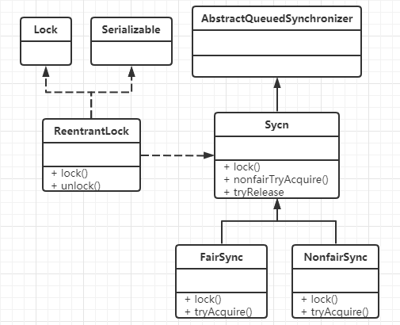
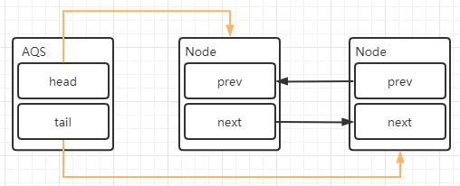
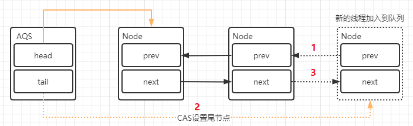
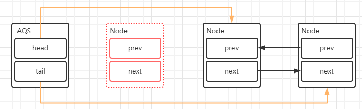

# 1 JUC

## 1.1 JUC 简介

java.util.concurrent 在并发编程中使用的工具类，里面包含很多用来在并发场景中使用的组件。比如线程池、阻塞队列、计时器、同步器、并发集合等等。并发包的作者是大名鼎鼎的 Doug Lea。


## 1.2 进程/线程

``进程`` 是一个具有一定独立功能的程序关于某个数据集合的一次运行活动。它是操作系统动态执行的基本单元，在传统的操作系统中，进程既是基本的分配单元，也是基本的执行单元。 

``线程`` 通常在一个进程中可以包含若干个线程，当然一个进程中至少有一个线程，不然没有存在的意义。线程可以利用进程所拥有的资源，在引入线程的操作系统中，通常都是把进程作为分配资源的基本单位，而把线程作为独立运行和独立调度的基本单位，由于线程比进程更小，基本上不拥有系统资源，故对它的调度所付出的开销就会小得多，能更高效的提高系统多个程序间并发执行的程度。 

## 1.3 wait/sleep的区别

功能都是当前线程暂停，有什么区别？ 

wait放开手去睡，放开手里的锁

sleep握紧手去睡，醒了手里还有锁 

## 1.4 并行/并发

并发：同一时刻多个线程在访问同一个资源，多个线程对一个点   例子：小米9今天上午10点，限量抢购 春运抢票      电商秒杀... 

并行：多项工作一起执行，之后再汇总   例子：泡方便面，电水壶烧水，一边撕调料倒入桶中 

## 1.5 Synchronized

多线程编程模板：在高内聚低耦合的前提下，线程 --> 操作（对外暴露的调用方法）--> 资源类

```java
// 1、创建资源类
class Ticket {
    private int number = 30;
    private Lock lock = new ReentrantLock();

    public synchronized void saleTicket() {
        if (number > 0) {
            System.out.println(Thread.currentThread().getName() + "\t卖出第" + (number--) + "\t还剩下" + number);
        }
    }
}

// 2、资源类里创建同步方法、同步代码块
public class SaleTicket {
    public static void main(String[] args) {
        Ticket ticket = new Ticket();
        new Thread(new Runnable() {
            @Override
            public void run() {
                for (int i = 0; i <= 40 ; i++) {
                    ticket.saleTicket();
                }
            }
        }, "A").start();
        new Thread(new Runnable() {
            @Override
            public void run() {
                for (int i = 0; i <= 40 ; i++) {
                    ticket.saleTicket();
                }
            }
        }, "B").start();
        new Thread(new Runnable() {
            @Override
            public void run() {
                for (int i = 0; i <= 40 ; i++) {
                    ticket.saleTicket();
                }
            }
        }, "C").start();
    }
}
```

## 1.6 创建线程的方式

```java
// 不能这样写
// 继承Thread
public   class  SaleTicket  extends  Thread //java是 单继承，资源宝贵，要用接口方式 
// new Thread()
Thread  t1  =  new  Thread(); 
t1 .start(); 

// 正确的方式
Thread(Runnable target, String name)  
// 匿名内部类-》 lambda表达式
new  Thread( new  Runnable() { 
     @Override 
     public   void  run() { 
  
    } 
   },  "your thread name" ).start(); 
new  Thread(() -> { 
  
 },  "your thread name" ).start(); 
```

```java
class Ticket {
    private int number = 30;
    private Lock lock = new ReentrantLock();

    public void saleTicket() {
        lock.lock();
        try {
            if (number > 0) {
                System.out.println(Thread.currentThread().getName() + "\t卖出第" + (number--) + "\t还剩下" + number);
            }
        } finally {
            lock.unlock();
        }
    }
}

/**
 * 多线程编程的企业级套路+模版
 * 1. 在高内聚低耦合的前提下，线程   操作（对外暴露的调用方法）   资源类
 */
public class SaleTicket {
    public static void main(String[] args) {
        Ticket ticket = new Ticket();
        new Thread(() -> {
            for (int i = 0; i <= 40 ; i++) {
                ticket.saleTicket();
            }
        }, "A").start();
        new Thread(() -> {
            for (int i = 0; i <= 40 ; i++) {
                ticket.saleTicket();
            }
        }, "B").start();
        new Thread(() -> {
            for (int i = 0; i <= 40 ; i++) {
                ticket.saleTicket();
            }
        }, "C").start();
    }
}
```

## 1.7 lambda 表达式复习

```java
@FunctionalInterface
interface Foo {
    int add(int x, int y);

    default int div(int x, int y) {
        System.out.println("div");
        return x / y;
    }
    default int mul(int x, int y) {
        System.out.println("mul");
        return x * y;
    }
    public static int sub (int x, int y) {
        System.out.println("sub");
        return x - y;
    }
}

/**
 * 拷贝小括号，写死右箭头，落地大括号
 * FunctionInterface
 * default
 */
public class LambdaExpress {
    public static void main(String[] args) {
        Foo foo = (x, y) -> {
            System.out.println("add");
            return x + y;
        };
        System.out.println(foo.add(10, 5));
        System.out.println(foo.div(10,5));
        System.out.println(foo.mul(10,5));
        System.out.println(Foo.sub(10,5));
    }
}
```

# 2 Lock

## 2.1 Lock 接口是什么

在 Lock 接口出现之前，Java 中的应用程序对于多线程的并发安全处理只能基于 synchronized 关键字来解决。但是 synchronized 在有些场景中会存在一些短板， 也就是它并不适合于所有的并发场景。但是在 Java5 以后，Lock 的出现可以解决 synchronized 在某些场景中的短板，它比 synchronized 更加灵活。


> Lock implementations provide more extensive locking operations than can be obtained using synchronized methods and statements. They allow more flexible structuring, may have quite different properties, and may support multiple associated Condition objects. 

锁实现提供了比使用同步方法和语句可以获得的更广泛的锁操作。它们允许更灵活的结构，可能具有非常不同的属性，并且可能支持多个关联的条件对象。 

## 2.2 Lock接口的实现

```java
class X {
  private final ReentrantLock lock = new ReentrantLock();
  // ...

  public void m() {
   lock.lock(); // block until condition holds
   try {
    // ... method body
   } finally {
    lock.unlock()
   }
  }
}
```

Lock 本质上是一个接口，它定义了释放锁和获得锁的抽象方法，定义成接口就意味着它定义了锁的一个标准规范，也同时意味着锁的不同实现。实现 Lock 接口的类有很多，以下为几个常见的锁实现：

`ReentrantLock` 表示重入锁，它是唯一一个实现了 Lock 接口的类。重入锁指的是线程在获得锁之后，再次获取该锁不需要阻塞，而是直接关联一次计数器增加重入次数 

`ReentrantReadWriteLock` 重入读写锁，它实现了 ReadWriteLock 接口，在这个类中维护了两个锁，一个是 ReadLock，一个是 WriteLock，他们都分别实现了 Lock 接口。读写锁是一种适合读多写少的场景下解决线程安全问题的工具，基本原则 是： 读和读不互斥、读和写互斥、写和写互斥。也就是说涉及到影响数据变化的 操作都会存在互斥

`StampedLock`  stampedLock 是 JDK8 引入的新的锁机制，可以简单认为是读写锁的一个改进版本，读写锁虽然通过分离读和写的功能使得读和读之间可以完全并发，但是读和写是有冲突的，如果大量的读线程存在，可能会引起写线程的饥饿。 stampedLock 是一种乐观的读策略，使得乐观锁完全不会阻塞写线程

#### 与 synchronized的区别

两者区别：

1. 首先synchronized是java内置关键字，在jvm层面，Lock是个java类；

2. synchronized无法判断是否获取锁的状态，Lock可以判断是否获取到锁；

3. synchronized会自动释放锁(a 线程执行完同步代码会释放锁 ；b 线程执行过程中发生异常会释放锁)，Lock需在finally中手工释放锁（unlock()方法释放锁），否则容易造成线程死锁；

4. 用synchronized关键字的两个线程1和线程2，如果当前线程1获得锁，线程2线程等待。如果线程1阻塞，线程2则会一直等待下去，而Lock锁就不一定会等待下去，如果尝试获取不到锁，线程可以不用一直等待就结束了；

5. synchronized的锁可重入、不可中断、非公平，而Lock锁可重入、可判断、可公平（两者皆可）

6. Lock锁适合大量同步的代码的同步问题，synchronized锁适合代码少量的同步问题。

## 2.3 Lock 的类关系图 

Lock 有很多的锁的实现，但是直观的实现是 ReentrantLock 重入锁



void lock() 如果锁可用就获得锁，如果锁不可用就阻塞直到锁释放 

void lockInterruptibly() 和 lock() 方法相似, 但阻塞的线程可中断 ， 抛出 java.lang.InterruptedExcepti on 异常 

boolean tryLock() 非阻塞获取锁;尝试获取锁，如果成功返回 true 

boolean tryLock(long timeout, TimeUnit timeUnit) 带有超时时间的获取锁方法

void unlock() 释放锁

## 2.4 ReentrantLock 重入锁

重入锁的设计目的是`避免线程的死锁`。

使用 ReentrantLock 实现多线程累加的示例：

```java
public class ReentrantLockDemo {

    private static int count = 0;
    static Lock lock = new ReentrantLock();

    public static void incr() {
        lock.lock();
        try {
            count++;
        } finally {
            lock.unlock();
        }
    }

    public static void main(String[] args) throws InterruptedException {
        for (int i = 0; i < 1000; i++) {
            new Thread(() -> {
                ReentrantLockDemo.incr();
            }).start();
        }
        Thread.sleep(3000);
        System.out.println("result:"+count);
    }
}
```

## 2.5 ReentrantReadWriteLock 读写锁

我们以前理解的锁，基本都是排他锁，也就是这些锁在同一时刻只允许一个线程进 行访问，而读写所在同一时刻可以允许多个线程访问，但是在写线程访问时，所有 的读线程和其他写线程都会被阻塞。读写锁维护了一对锁，一个读锁、一个写锁; 一般情况下，读写锁的性能都会比排它锁好，因为大多数场景读是多于写的。在读多于写的情况下，读写锁能够提供比排它锁更好的并发性和吞吐量。

```java
class MyCache {
    private volatile Map<String, Object> map = new HashMap<>();
    private ReadWriteLock readWriteLock = new ReentrantReadWriteLock();

    public void put(String key, Object value) {
        readWriteLock.writeLock().lock();
        try {
            System.out.println(Thread.currentThread().getName() + "\t---写入数据" + key);
            try { TimeUnit.MILLISECONDS.sleep(300); } catch (InterruptedException e) { e.printStackTrace(); }
            map.put(key, value);
            System.out.println(Thread.currentThread().getName() + "\t---写入完成");
        } catch (Exception e) {
            e.printStackTrace();
        } finally {
            readWriteLock.writeLock().unlock();
        }
    }

    public void get(String key) {
        readWriteLock.readLock().lock();
        try {
            System.out.println(Thread.currentThread().getName() + "\t读取数据");
            try { TimeUnit.MILLISECONDS.sleep(300); } catch (InterruptedException e) { e.printStackTrace(); }
            Object result = map.get(key);
            System.out.println(Thread.currentThread().getName() + "\t读取完成" + result);
        } catch (Exception e) {
            e.printStackTrace();
        } finally {
            readWriteLock.readLock().unlock();
        }

    }
}

public class ReadWriteLockDemo {
    public static void main(String[] args) {
        MyCache myCache = new MyCache();

        for (int i = 1; i <= 5; i++) {
            final int tempInt = i;
            new Thread(() -> {
                myCache.put(tempInt + "", tempInt + "");
            }, String.valueOf(i)).start();
        }

        for (int i = 1; i <= 5; i++) {
            final int tempInt = i;
            new Thread(() -> {
                myCache.get(tempInt + "");
            }, String.valueOf(i)).start();
        }
    }
}
```

## 2.6 ReentrantLock 的实现原理

### 2.6.1 AQS 是什么 

在 Lock 中，用到了一个同步队列 AQS，全称 `AbstractQueuedSynchronizer`，它是一个同步工具也是 Lock 用来实现线程同步的核心组件。如果你搞懂了 AQS，那 么 J.U.C 中绝大部分的工具都能轻松掌握。

### 2.6.2 AQS 的两种功能

从使用层面来说，AQS 的功能分为两种：独占和共享

独占锁，每次只能有一个线程持有锁，比如前面给大家演示的 ReentrantLock 就是以独占方式实现的互斥锁

共享锁 ，允许多个线程同时获取锁，并发访问共享资源，比如 ReentrantReadWriteLock。

### 2.6.3 AQS 的内部实现

AQS 队列内部维护的是一个 FIFO 的双向链表，这种结构的特点是每个数据结构都有两个指针，分别指向直接的后继节点和直接前驱节点。所以双向链表可以从任意一个节点开始很方便的访问前驱和后继。每个 Node 其实是由线程封装，当线程争抢锁失败后会封装成 Node 加入到 ASQ 队列中去；当获取锁的线程释放锁以后，会从队列中唤醒一个阻塞的节点(线程)。



```java
public abstract class AbstractQueuedSynchronizer
    extends AbstractOwnableSynchronizer
    implements java.io.Serializable {
	private transient volatile Node head;
	private transient volatile Node tail;
static final class Node {
    static final Node SHARED = new Node();
    static final Node EXCLUSIVE = null;
    static final int CANCELLED =  1;
    static final int SIGNAL    = -1;
    static final int CONDITION = -2;
    static final int PROPAGATE = -3;

    volatile int waitStatus;
	// 前驱节点
    volatile Node prev;
    // 后维节点
    volatile Node next;
    // 当前线程
    volatile Thread thread;
	// 存储在condition队列中的后维节点
    Node nextWaiter;
	// 是否为共享锁
    final boolean isShared() {
        return nextWaiter == SHARED;
    }

    final Node predecessor() throws NullPointerException {
        Node p = prev;
        if (p == null)
            throw new NullPointerException();
        else
            return p;
    }
    Node() {    // Used to establish initial head or SHARED marker
    }
    // 将线程构造成一个Node，添加到等待队列
    Node(Thread thread, Node mode) {     // Used by addWaiter
        this.nextWaiter = mode;
        this.thread = thread;
    }
    // 这个方法会在Condition队列使用
    Node(Thread thread, int waitStatus) { // Used by Condition
        this.waitStatus = waitStatus;
        this.thread = thread;
    }
}
}
```

**释放锁以及添加线程对于队列的变化**

当出现锁竞争以及释放锁的时候，AQS 同步队列中的节点会发生变化，首先看一 下添加节点的场景。



会涉及到两个变化 

1. 新的线程封装成 Node 节点追加到同步队列中，设置 prev 节点以及修改当前节 点的前置节点的 next 节点指向自己 
2. 通过 CAS 将 tail 重新指向新的尾部节点 

head 节点表示获取锁成功的节点，当头结点在释放同步状态时，会唤醒后继节点， 如果后继节点获得锁成功，会把自己设置为头结点，节点的变化过程如下：



这个过程也是涉及到两个变化 

1. 修改 head 节点指向下一个获得锁的节点
2.  新的获得锁的节点，将 prev 的指针指向 null 

设置 head 节点不需要用 CAS，原因是设置 head 节点是由获得锁的线程来完成的，而同步锁只能由一个线程获得，所以不需要 CAS 保证，只需要把 head 节点 设置为原首节点的后继节点，并且断开原 head 节点的 next 引用即可。

### 2.6.4 ReentrantLock 的源码分析

以 ReentrantLock 作为切入点，来看看在这个场景中是如何使用 AQS 来实现线程的同步的。

**ReentrantLock 的时序图**

调用 ReentrantLock 中的 lock()方法，源码的调用过程我使用了时序图来展现。

？？？

**ReentrantLock.lock()**

这个是 reentrantLock 获取锁的入口

```java
public void lock() {
    sync.lock();
}
```

sync 实际上是一个抽象的静态内部类，它继承了 AQS 来实现重入锁的逻辑，我们前面说过 AQS 是一个同步队列，它能够实现线程的阻塞以及唤醒，但它并不具备业务功能，所以在不同的同步场景中，会继承 AQS 来实现对应场景的功能 Sync 有两个具体的实现类，分别是： 

`NofairSync` 表示可以存在抢占锁的功能，也就是说不管当前队列上是否存在其他线程等待，新线程都有机会抢占锁 

`FailSync` 表示所有线程严格按照 FIFO 来获取锁

**NofairSync.lock**

以非公平锁为例，来看看 lock 中的实现 

1. 非公平锁和公平锁最大的区别在于，在非公平锁中我抢占锁的逻辑是，不管有没有线程排队，我先上来 cas 去抢占一下 
2. CAS 成功，就表示成功获得了锁 
3. CAS 失败，调用 acquire(1) 走锁竞争逻辑

```java
final void lock() {
    // 如果当前值为期望的值0，则更新为1，并返回true
    if (compareAndSetState(0, 1))
        setExclusiveOwnerThread(Thread.currentThread());
    else
        acquire(1);
}
```

**CAS 的实现原理**

```java
protected final boolean compareAndSetState(int expect, int update) {
    // See below for intrinsics setup to support this
    return unsafe.compareAndSwapInt(this, stateOffset, expect, update);
}
```

通过 cas 乐观锁的方式来做比较并替换，这段代码的意思是，如果当前内存中的 state 的值和预期值 expect 相等，则替换为 update。更新成功返回 true，否则返回 false。

这个操作是原子的，不会出现线程安全问题，这里面涉及到Unsafe这个类的操作， 以及涉及到 state 这个属性的意义。 

state 是 AQS 中的一个属性，它在不同的实现中所表达的含义不一样，对于重入 锁的实现来说，表示一个同步状态。它有两个含义的表示 

1. 当 state=0 时，表示无锁状态 
2. 当 state>0 时，表示已经有线程获得了锁，也就是 state=1，但是因为 ReentrantLock 允许重入，所以同一个线程多次获得同步锁的时候，state 会递增， 比如重入 5 次，那么 state=5。而在释放锁的时候，同样需要释放 5 次直到 state=0 其他线程才有资格获得锁

**Unsafe 类**

Unsafe 类是在 sun.misc 包下，不属于 Java 标准。但是很多 Java 的基础类库，包括一些被广泛使用的高性能开发库都是基于 Unsafe 类开发的，比如 Netty、 Hadoop、Kafka 等； 

Unsafe 可认为是 Java 中留下的后门，提供了一些低层次操作，如直接内存访问、 线程的挂起和恢复、CAS、线程同步、内存屏障。

而 CAS 就是 Unsafe 类中提供的一个原子操作，第一个参数为需要改变的对象， 第二个为偏移量(即之前求出来的 headOffset 的值)，第三个参数为期待的值，第四个为更新后的值。

整个方法的作用是如果当前时刻的值等于预期值 var4 相等，则更新为新的期望值 var5，如果更新成功，则返回 true，否则返回 false；

**stateOffset**

一个 Java 对象可以看成是一段内存，每个字段都得按照一定的顺序放在这段内存里，通过这个方法可以准确地告诉你某个字段相对于对象的起始内存地址的字节偏移。用于在后面的 compareAndSwapInt 中，去根据偏移量找到对象在内存中的具体位置。

所以 stateOffset 表示 state 这个字段在 AQS 类的内存中相对于该类首地址的偏移量。

**compareAndSwapInt**

在 unsafe.cpp 文件中，可以找到 compareAndSwarpInt 的实现

```c
UNSAFE_ENTRY(jboolean, Unsafe_CompareAndSwapInt(JNIEnv *env, jobject unsafe, jobject obj, jlong offset, jint e, jint x))
 UnsafeWrapper("Unsafe_CompareAndSwapInt");
 oop p = JNIHandles::resolve(obj); //将 Java 对象解析成 JVM 的 oop（普通对象指针）,
 jint* addr = (jint *) index_oop_from_field_offset_long(p, offset); //根据对象 p 和地址偏移量找到地址
 //基于 cas 比较并替换， x 表示需要更新的值，addr 表示 state在内存中的地址，e 表示预期值
 return (jint)(Atomic::cmpxchg(x, addr, e)) == e; 
UNSAFE_END
```

AQS.accquire

acquire 是 AQS 中的方法，如果 CAS 操作未能成功，说明 state 已经不为 0，此时继续 acquire(1)操作。

**acquire 方法中的 1 的参数是用来做什么呢？**

用作抢占锁后更新satet的update值或者同一线程获取锁后的递增值

这个方法的主要逻辑是 

1. 通过 tryAcquire 尝试获取独占锁，如果成功返回 true，失败返回 false 
2. 如果 tryAcquire 失败，则会通过 addWaiter 方法将当前线程封装成 Node 添加到 AQS 队列尾部 
3. acquireQueued，将 Node 作为参数，通过自旋去尝试获取锁。

```java
 public final void acquire(int arg) {
     if (!tryAcquire(arg) &&
         acquireQueued(addWaiter(Node.EXCLUSIVE), arg))
         selfInterrupt();
 }
```

**NonfairSync.tryAcquire**

这个方法的作用是尝试获取锁，如果成功返回 true，不成功返回 false。

它是重写 AQS 类中的 tryAcquire 方法，并且大家仔细看一下 AQS 中 tryAcquire 方法的定义，并没有实现，而是抛出异常。按照一般的思维模式，既然是一个不实 现的模版方法，那应该定义成 abstract，让子类来实现呀？大家想想为什么

```java
protected final boolean tryAcquire(int acquires) {
    // 如果仍存在锁，且当前线程和有锁线程不是同一个，返回false
    return nonfairTryAcquire(acquires);
}
```

**ReentrantLock.nofairTryAcquire**

1. 获取当前线程，判断当前的锁的状态 
2. 如果 state=0 表示当前是无锁状态，通过 cas 更新 state 状态的值 
3. 当前线程是属于重入，则增加重入次数

```java
final boolean nonfairTryAcquire(int acquires) {
    //获取当前执行的线程
    final Thread current = Thread.currentThread();
    int c = getState();//获得 state 的值
    if (c == 0) {//表示无锁状态
        //cas 替换 state 的值，cas 成功表示获取锁成功
        if (compareAndSetState(0, acquires)) {
            //保存当前获得锁的线程,下次再来的时候不要再尝试竞争锁
            setExclusiveOwnerThread(current);
            return true;
        }
    }
    //如果同一个线程来获得锁，直接增加重入次数
    else if (current == getExclusiveOwnerThread()) {
        int nextc = c + acquires;
        if (nextc < 0) // overflow
            throw new Error("Maximum lock count exceeded");
        setState(nextc);
        return true;
    }
    return false;
}
```

**AQS.addWaiter**

当 tryAcquire 方法获取锁失败以后，则会先调用 addWaiter 将当前线程封装成 Node。

入参 mode 表示当前节点的状态，传递的参数是 Node.EXCLUSIVE，表示独占状态。意味着重入锁用到了 AQS 的独占锁功能 

1. 将当前线程封装成 Node 
2. 当前链表中的 tail 节点是否为空，如果不为空，则通过 cas 操作把当前线程的 node 添加到 AQS 队列 
3. 如果为空或者 cas 失败，调用 enq 将节点添加到 AQS 队列

```java
private Node addWaiter(Node mode) {
    Node node = new Node(Thread.currentThread(), mode);
    // Try the fast path of enq; backup to full enq on failure
    //tail 是 AQS 中表示同比队列队尾的属性，默认是 null
    Node pred = tail;
    //tail 不为空的情况下，说明队列中存在节点
    if (pred != null) {
        //把当前线程的 Node 的 prev 指向 tail
        node.prev = pred;
        //通过 cas 把 node 加入到 AQS 队列，也就是设置为 tail
        if (compareAndSetTail(pred, node)) {
            //设置成功以后，把原 tail 节点的 next指向当前 node
            pred.next = node;
            return node;
        }
    }
    //tail=null,把 node 添加到同步队列
    enq(node);
    return node;
}
```

**enq **

enq 就是通过自旋操作把当前节点加入到队列中

```java
private Node enq(final Node node) {
    for (;;) {
        Node t = tail;
        if (t == null) { // Must initialize
            if (compareAndSetHead(new Node()))
                tail = head;
        } else {
            node.prev = t;
            if (compareAndSetTail(t, node)) {
                t.next = node;
                return t;
            }
        }
    }
}
```

**AQS.acquireQueued**

通过 addWaiter 方法把线程添加到链表后，会接着把 Node 作为参数传递给 acquireQueued 方法，去竞争锁

1. 获取当前节点的 prev 节点 
2. 如果 prev 节点为 head 节点，那么它就有资格去争抢锁，调用 tryAcquire 抢占锁 
3. 抢占锁成功以后，把获得锁的节点设置为 head，并且移除原来的初始化 head 节点 
4. 如果获得锁失败，则根据 waitStatus 决定是否需要挂起线程 
5. 最后，通过 cancelAcquire 取消获得锁的操作

```java
final boolean acquireQueued(final Node node, int arg) {
    boolean failed = true;
    try {
        boolean interrupted = false;
        for (;;) {
            //获取当前节点的 prev 节点
            final Node p = node.predecessor();
            //如果当前节点的 prev 节点是 head 节点，说明有资格去争抢锁
            if (p == head && tryAcquire(arg)) {
                //获取锁成功，也就是ThreadA 已经释放了锁，然后设置 head 为 ThreadB 获得执行权限
                setHead(node);
                //把原 head 节点从链表中移除
                p.next = null; // help GC
                failed = false;
                return interrupted;
            }
            //ThreadA 可能还没释放锁，使得 ThreadB 在执行 tryAcquire 时会返回 false
            if (shouldParkAfterFailedAcquire(p, node) &&
                parkAndCheckInterrupt())
                //并且返回当前线程在等待过程中有没有中断过
                interrupted = true;
        }
    } finally {
        if (failed)
            cancelAcquire(node);
    }
}
```

**NofairSync.tryAcquire**

这个方法在前面分析过，就是通过 state 的状态来判断是否处于无锁状态，然后在通过 cas 进行竞争锁操作。成功表示获得锁，失败表示获得锁失败

**shouldParkAfterFailedAcquire**

如果 ThreadA 的锁还没有释放的情况下，ThreadB 和 ThreadC 来争抢锁肯定是会失败，那么失败以后会调用 shouldParkAfterFailedAcquire 方法。

Node 有 5 中状态，分别是：CANCELLED（1），SIGNAL（-1）、CONDITION（- 2）、PROPAGATE(-3)、默认状态(0) 

CANCELLED: 在同步队列中等待的线程等待超时或被中断，需要从同步队列中取消该 Node 的结点, 其结点的 waitStatus 为 CANCELLED，即结束状态，进入该状 态后的结点将不会再变化 

SIGNAL: 只要前置节点释放锁，就会通知标识为 SIGNAL 状态的后续节点的线程 

CONDITION： 和 Condition 有关系，后续会讲解 

PROPAGATE：共享模式下，PROPAGATE 状态的线程处于可运行状态 

0:初始状态 

这个方法的主要作用是，通过 Node 的状态来判断，ThreadA 竞争锁失败以后是否应该被挂起。 

1. 如果 ThreadA 的 pred 节点状态为 SIGNAL，那就表示可以放心挂起当前线程 
2. 通过循环扫描链表把 CANCELLED 状态的节点移除 
3. 修改 pred 节点的状态为 SIGNAL,返回 false

返回 false 时，也就是不需要挂起，返回 true，则需要调用 parkAndCheckInterrupt 挂起当前线程

```java
private static boolean shouldParkAfterFailedAcquire(Node pred, Node node) {
    //前置节点的waitStatus
    int ws = pred.waitStatus;
    //如果前置节点为 SIGNAL，意味着只需要等待其他前置节点的线程被释放
    if (ws == Node.SIGNAL)
        //返回 true，意味着可以直接放心的挂起了
        return true;
    //ws 大于 0，意味着 prev 节点取消了排队，直接移除这个节点就行
    if (ws > 0) {
        do {
            //相当于: pred=pred.prev;node.prev=pred;
            node.prev = pred = pred.prev;
        } while (pred.waitStatus > 0);//这里采用循环，从双向列表中移除 CANCELLED 的节点
        pred.next = node;
    } else {
       //利用 cas 设置 prev 节点的状态为 SIGNAL(-1)
        compareAndSetWaitStatus(pred, ws, Node.SIGNAL);
    }
    return false;
}
```

**parkAndCheckInterrupt**

使用 LockSupport.park 挂起当前线程编程 WATING 状态

Thread.interrupted，返回当前线程是否被其他线程触发过中断请求，也就是 thread.interrupt(); 如果有触发过中断请求，那么这个方法会返回当前的中断标识 true，并且对中断标识进行复位标识已经响应过了中断请求。如果返回 true，意味着在 acquire 方法中会执行 selfInterrupt()。

```java
private final boolean parkAndCheckInterrupt() {
    LockSupport.park(this);
    return Thread.interrupted();
}
```

selfInterrupt： 标识如果当前线程在 acquireQueued 中被中断过，则需要产生一 个中断请求，原因是线程在调用 acquireQueued 方法的时候是不会响应中断请求的 

```java
static void selfInterrupt() { 
	Thread.currentThread().interrupt(); 
}
```

**LockSupport **

LockSupport类是 Java6引入的一个类，提供了基本的线程同步原语。LockSupport 实际上是调用了 Unsafe 类里的函数，归结到 Unsafe 里，只有两个函数

```java
public native void unpark(Object var1);
public native void park(boolean var1, long var2);
```

unpark 函数为线程提供“许可(permit)”，线程调用 park 函数则等待“许可”。这个有点像信号量，但是这个“许可”是不能叠加的，“许可”是一次性的。

permit 相当于 0/1 的开关，默认是 0，调用一次 unpark 就加 1 变成了 1.调用一次 park 会消费 permit，又会变成 0。 如果再调用一次 park 会阻塞，因为 permit 已 经是 0 了。直到 permit 变成 1.这时调用 unpark 会把 permit 设置为 1.每个线程都 有一个相关的 permit，permit 最多只有一个，重复调用 unpark 不会累积。


## 线程间通信

1. 生产者+消费者
2. 通知等待唤醒机制

### synchronized实现

```java
class AirConditioner {
    private int number = 0;

    public synchronized void increment() throws InterruptedException {
        // 判断，如果是if，被唤醒时不会重新检查
        while (number != 0) {
            this.wait();
        }
        // 执行
        number++;
        System.out.println(Thread.currentThread().getName() + "\t" + number);
        // 通知
        this.notifyAll();
    }

    public synchronized void decrement() throws InterruptedException {
        while (number == 0) {
            this.wait();
        }
        number--;
        System.out.println(Thread.currentThread().getName() + "\t" + number);
        this.notifyAll();
    }
}

/**
 * 两个线程，操作一个初始值为0的变量
 * 实现一个线程对该变量+1，一个-1
 * 实现交替，10轮，变量初始值为0
 *
 * 判断/执行/通知
 * 多线程交互中，必须要防止多线程的虚假唤醒，也就（判断用while，不用if）
 */
public class ThreadWaitNotifyDemo {
    public static void main(String[] args) {
        AirConditioner airConditioner = new AirConditioner();
        new Thread(() -> {
            for (int i = 1; i <= 10; i++) {
                try {
                    Thread.sleep(200);
                    airConditioner.increment();
                } catch (InterruptedException e) {
                    e.printStackTrace();
                }
            }
        }, "A").start();
        new Thread(() -> {
            for (int i = 1; i <= 10; i++) {
                try {
                    Thread.sleep(300);
                    airConditioner.decrement();
                } catch (InterruptedException e) {
                    e.printStackTrace();
                }
            }
        }, "B").start();

        new Thread(() -> {
            for (int i = 1; i <= 10; i++) {
                try {
                    Thread.sleep(400);
                    airConditioner.increment();
                } catch (InterruptedException e) {
                    e.printStackTrace();
                }
            }
        }, "C").start();
        new Thread(() -> {
            for (int i = 1; i <= 10; i++) {
                try {
                    Thread.sleep(500);
                    airConditioner.decrement();
                } catch (InterruptedException e) {
                    e.printStackTrace();
                }
            }
        }, "D").start();
    }
}
```

### java 8 新版实现

```java
class AirConditioner {
    private int number = 0;

    private Lock lock = new ReentrantLock();
    private Condition condition = lock.newCondition();

    public void increment() throws InterruptedException {
        lock.lock();
        try {
            // 判断，如果是if，被唤醒时不会重新检查
            while (number != 0) {
                condition.await(); //this.wait();
            }
            // 执行
            number++;
            System.out.println(Thread.currentThread().getName() + "\t" + number);
            // 通知
            condition.signalAll(); //this.notifyAll();
        } finally {
            lock.unlock();
        }
    }

    public synchronized void decrement() throws InterruptedException {
        lock.lock();
        try {
            while (number == 0) {
                condition.await();
            }
            number--;
            System.out.println(Thread.currentThread().getName() + "\t" + number);
            condition.signalAll();
        } finally {
            lock.unlock();
        }
    }
}
```

### 多线程协调通信 Condition

```java
class ShareResource {

    //1:A 2:B 3:C
    private int number = 1;
    private Lock lock = new ReentrantLock();
    private Condition condition1 = lock.newCondition();
    private Condition condition2 = lock.newCondition();
    private Condition condition3 = lock.newCondition();

    public void print5() {
        lock.lock();
        try {
            while (number != 1) {
                condition1.await();
            }
            for (int i = 1; i <= 5; i++) {
                System.out.println(Thread.currentThread().getName() + "\t" + i);
            }
            number = 2;
            condition2.signal();
        } catch (InterruptedException e) {
            e.printStackTrace();
        } finally {
            lock.unlock();
        }
    }

    public void print10() {
        lock.lock();
        try {
            while (number != 2) {
                condition2.await();
            }
            for (int i = 1; i <= 10; i++) {
                System.out.println(Thread.currentThread().getName() + "\t" + i);
            }
            number = 3;
            condition3.signal();
        } catch (InterruptedException e) {
            e.printStackTrace();
        } finally {
            lock.unlock();
        }
    }

    public void print15() {
        lock.lock();
        try {
            while (number != 3) {
                condition3.await();
            }
            for (int i = 1; i <= 15; i++) {
                System.out.println(Thread.currentThread().getName() + "\t" + i);
            }
            number = 1;
            condition1.signal();
        } catch (InterruptedException e) {
            e.printStackTrace();
        } finally {
            lock.unlock();
        }
    }
}

/**
 * 多线程之间实现A->B->C
 *
 * 1. 在高内聚低耦合的前提下，线程   操作（对外暴露的调用方法）   资源类
 * 2. 断/执行/通知
 * 3. 多线程交互中，必须要防止多线程的虚假唤醒，也就（判断用while，不用if）
 * 4. 标识位
 */
public class ThreadOrderAccess {
    public static void main(String[] args) {
        ShareResource shareResource = new ShareResource();
        new Thread(() -> {
            for (int i = 1; i <= 10; i++) {
                shareResource.print5();
            }
        }, "AA").start();
        new Thread(() -> {
            for (int i = 1; i <= 10; i++) {
                shareResource.print10();
            }
        }, "BB").start();
        new Thread(() -> {
            for (int i = 1; i <= 10; i++) {
                shareResource.print15();
            }
        }, "CC").start();
    }
}
```

#### Condition 源码分析

## 多线程锁

```java
class Phone {

    public /*static*/ synchronized void sendEmail() throws Exception {
        //try { TimeUnit.SECONDS.sleep(4); } catch (InterruptedException e) { e.printStackTrace(); }
        System. out .println( "------sendEmail" );
    }

    public /*static*/ synchronized void sendSMS() throws Exception {
        System. out .println( "------sendSMS" );
    }

    public void hello() throws Exception {
        System. out .println( "------hello" );
    }
}

/**
 * 多线程8锁
 * 1. 标准访问，先打印邮件
 * 2. 邮件方法暂停4秒钟，先打印邮件
 * 3. 新增一个普通方法hello, 先打印hello
 * 4. 两部手机，先打印短信
 * 5. 两个静态同步方法，同一部手机，邮件
 * 6. 两个静态同步方法，2部手机，邮件
 * 7. 一个普通一个静态同步方法，1部手机，短信
 * 8. 一个普通一个静态同步方法，2部手机，短信
 */
public class Lock8 {
    public static void main(String[] args) throws InterruptedException {
        Phone phone = new Phone();
        Phone phone1 = new Phone();
        new Thread(() -> {
            try {
                phone.sendEmail();
            } catch (Exception e) {
                e.printStackTrace();
            }
        }, "A").start();
        Thread.sleep(100);
        new Thread(() -> {
            try {
                phone.sendSMS();
                //phone.hello();
                //phone1.sendSMS();
            } catch (Exception e) {
                e.printStackTrace();
            }
        }, "B").start();
    }
}
```

一个对象里面如果有多个synchronized方法，某一个时刻内，只要一个线程去调用其中的一个synchronized方法了， 其它的线程都只能等待，换句话说，某一个时刻内，只能有唯一一个线程去访问这些synchronized方法锁的是当前对象this，被锁定后，其它的线程都不能进入到当前对象的其它的synchronized方法 。

加个普通方法后发现和同步锁无关。

换成两个对象后，不是同一把锁了，情况立刻变化。 

 

synchronized实现同步的基础：Java中的每一个对象都可以作为锁。 

具体表现为以下3种形式。 

对于普通同步方法，锁是当前实例对象。 

对于静态同步方法，锁是当前类的Class对象。 

对于同步方法块，锁是 Synchonized 括号里配置的对象 

 当一个线程试图访问同步代码块时，它首先必须得到锁，退出或抛出异常时必须释放锁。 

 也就是说如果一个实例对象的非静态同步方法获取锁后，该实例对象的其他非静态同步方法必须等待获取锁的方法释放锁后才能获取锁， 可是别的实例对象的非静态同步方法因为跟该实例对象的非静态同步方法用的是不同的锁， 所以毋须等待该实例对象已获取锁的非静态同步方法释放锁就可以获取他们自己的锁。 

所有的静态同步方法用的也是同一把锁——类对象本身， 这两把锁是两个不同的对象，所以静态同步方法与非静态同步方法之间是不会有竞态条件的。 

但是一旦一个静态同步方法获取锁后，其他的静态同步方法都必须等待该方法释放锁后才能获取锁， 而不管是同一个实例对象的静态同步方法之间， 还是不同的实例对象的静态同步方法之间，只要它们同一个类的实例对象！ 

## Callable接口

获得多线程的方法几种?

传统的 是继承thread类和实现runnable接口，java5以后又有实现 callable接口 和 java的线程池获得。

这是一个``函数式接口``，因此可以用作lambda表达式或方法引用的赋值对象 。 


### 与Runnable对比

```java
// 创建新类MyThread实现runnable接口 
class MyThread implements Runnable{ 
 @Override 
 public void run() { 
  
 } 
} 
// 新类MyThread2实现callable接口 
class MyThread2 implements Callable<Integer>{ 
 @Override 
 public Integer call() throws Exception { 
  return 200; 
 }  
} 
```

callable接口与runnable接口的区别？ 

（1）是否有返回值 

（2）是否抛异常 
（3）落地方法不一样，一个是run，一个是call 

### FutureTask

Thread类的构造方法根本没有Callable，可以找中间人介绍。中间人是什么？ java多态，一个类可以实现多个接口！！ 


未来的任务，用它就干一件事，异步调用 main方法就像一个冰糖葫芦，一个个方法由main串起来。 

但解决不了一个问题：正常调用挂起堵塞问题 

 在主线程中需要执行比较耗时的操作时，但又不想阻塞主线程时，可以把这些作业交给Future对象在后台完成，当主线程将来需要时，就可以通过Future对象获得后台作业的计算结果或者执行状态。 

一般FutureTask多用于耗时的计算，主线程可以在完成自己的任务后，再去获取结果。 

仅在计算完成时才能检索结果；如果计算尚未完成，则阻塞 get 方法。一旦计算完成， 就不能再重新开始或取消计算。get方法而获取结果只有在计算完成时获取，否则会一直阻塞直到任务转入完成状态， 然后会返回结果或者抛出异常。 

只计算一次，get方法放到最后 

```java
class MyThread implements Callable<Integer> {

    @Override
    public Integer call() throws Exception {
        System.out.println("********come in");
        try { TimeUnit.SECONDS.sleep(4); } catch (InterruptedException e) { e.printStackTrace(); }
        return 1024;
    }
}

public class CallableDemo {
    public static void main(String[] args) throws ExecutionException, InterruptedException {
        FutureTask futureTask = new FutureTask(new MyThread());
        new Thread(futureTask, "A").start();
        System.out.println("main*******计算完成");
        System.out.println(futureTask.get());
    }
}
```

## JUC强大的辅助类

### CountDownLatch 减少计数

CountDownLatch主要有两个方法，当一个或多个线程调用await方法时，这些线程会阻塞。 

其它线程调用countDown方法会将计数器减1(调用countDown方法的线程不会阻塞)，当计数器的值变为0时，因await方法阻塞的线程会被唤醒，继续执行。 

```java
/**
  * 
  * @Description:
  * 让一些线程阻塞直到另一些线程完成一系列操作后才被唤醒。
  * 
  * CountDownLatch主要有两个方法，当一个或多个线程调用await方法时，这些线程会阻塞。
  * 其它线程调用countDown方法会将计数器减1(调用countDown方法的线程不会阻塞)，
  * 当计数器的值变为0时，因await方法阻塞的线程会被唤醒，继续执行。
  * 
  * 解释：6个同学陆续离开教室后值班同学才可以关门。
  * main主线程必须要等前面6个线程完成全部工作后，自己才能开干 
  */
public class CountDownLatchDemo {
    public static void main(String[] args) throws InterruptedException {
        CountDownLatch countDownLatch = new CountDownLatch(6);
        for (int i = 1; i <= 6; i++) {
            new Thread(() -> {
                System.out.println(Thread.currentThread().getName() + "\t离开教室");
                countDownLatch.countDown();
            }, String.valueOf(i)).start();
        }
        countDownLatch.await();
        System.out.println(Thread.currentThread().getName() + "\t班长离开教室");
    }

    public static void closeDoor() {
        for (int i = 1; i <= 6; i++) {
            new Thread(() -> {
                System.out.println(Thread.currentThread().getName() + "\t离开教室");
            }, String.valueOf(i)).start();
        }
        System.out.println(Thread.currentThread().getName() + "\t班长离开教室");
    }
}
```

### CyclicBarrier 循环栅栏

 CountDownLatch主要有两个方法，当一个或多个线程调用await方法时，这些线程会阻塞。 

 其它线程调用countDown方法会将计数器减1(调用countDown方法的线程不会阻塞)，当计数器的值变为0时，因await方法阻塞的线程会被唤醒，继续执行。 

```java
/**
  * CyclicBarrier 的字面意思是可循环（Cyclic）使用的屏障（Barrier）。它要做的事情是，
  * 让一组线程到达一个屏障（也可以叫同步点）时被阻塞，
  * 直到最后一个线程到达屏障时，屏障才会开门，所有
  * 被屏障拦截的线程才会继续干活。
  * 线程进入屏障通过CyclicBarrier的await()方法。
  * 
  * 集齐7颗龙珠就可以召唤神龙
  */
public class CyclicBarrierDemo {
    public static void main(String[] args) {
        // CyclicBarrier(int parties, Runnable barrierAction)
        CyclicBarrier cyclicBarrier = new CyclicBarrier(7, () -> System.out.println("*********召唤神龙"));

        for (int i = 1;i <= 7;i++) {
            final int tempInt = i;
            new Thread(() -> {
                System.out.println(Thread.currentThread().getName() + "\t收集到第" + tempInt + "颗龙珠");
                try {
                    cyclicBarrier.await();
                } catch (InterruptedException e) {
                    e.printStackTrace();
                } catch (BrokenBarrierException e) {
                    e.printStackTrace();
                }
            }, String.valueOf(i)).start();
        }
    }
}
```

### Semaphore 信号灯

 在信号量上我们定义两种操作： 

 acquire（获取） 当一个线程调用acquire操作时，它要么通过成功获取信号量（信号量减1），要么一直等下去，直到有线程释放信号量，或超时。 

release（释放）实际上会将信号量的值加1，然后唤醒等待的线程。 

信号量主要用于两个目的，一个是用于多个共享资源的互斥使用，另一个用于并发线程数的控制。 

```java
public class SemaphoreDemo {
    public static void main(String[] args) {
        Semaphore semaphore = new Semaphore(3);
        for (int i = 1; i <= 6; i++) {
            new Thread(() -> {
                try {
                    semaphore.acquire();
                    System.out.println(Thread.currentThread().getName() + "\t抢占了车位");
                    try { TimeUnit.SECONDS.sleep(3); } catch (InterruptedException e) { e.printStackTrace(); }
                    System.out.println(Thread.currentThread().getName() + "\t离开了车位");
                } catch (InterruptedException e) {
                    e.printStackTrace();
                } finally {
                    semaphore.release();
                }
            }, String.valueOf(i)).start();
        }
    }
}
```

## BlockingQueueDemo 阻塞队列

阻塞：必须要阻塞/不得不阻塞

阻塞队列是一个队列，在数据结构中起的作用如下图：



当队列是空的，从队列中 获取 元素的操作将会被阻塞 

当队列是满的，从队列中 添加 元素的操作将会被阻塞 

试图从空的队列中获取元素的线程将会被阻塞，直到其他线程往空的队列插入新的元素 

试图向已满的队列中添加新元素的线程将会被阻塞，直到其他线程从队列中移除一个或多个元素或者完全清空，使队列变得空闲起来并后续新增 

### 阻塞队列的用处

在多线程领域：所谓阻塞，在某些情况下会 挂起 线程（即阻塞），一旦条件满足，被挂起的线程又会自动被唤起 


为什么需要BlockingQueue 

好处是我们不需要关心什么时候需要阻塞线程，什么时候需要唤醒线程，因为这一切BlockingQueue都给你一手包办了。在concurrent包发布以前，在多线程环境下， 我们每个程序员都必须去自己控制这些细节，尤其还要兼顾效率和线程安全 ，而这会给我们的程序带来不小的复杂度。 

### 架构和种类


ArrayBlockingQueue：由数组结构组成的有界阻塞队列。

LinkedBlockingQueue：由链表结构组成的有界（但大小默认值为integer.MAX_VALUE）阻塞队列。

PriorityBlockingQueue：支持优先级排序的无界阻塞队列。

DelayQueue：使用优先级队列实现的延迟无界阻塞队列。

SynchronousQueue：不存储元素的阻塞队列，也即单个元素的队列。

LinkedTransferQueue：由链表组成的无界阻塞队列。

LinkedBlockingDeque：由链表组成的双向阻塞队列。

### BlockingQueue核心方法


| 类型     | 详情                                                         |
| -------- | ------------------------------------------------------------ |
| 抛出异常 | 当阻塞队列满时，再往队列里add插入元素会抛IllegalStateException:Queue full<br>当阻塞队列空时，再往队列里remove移除元素会抛NoSuchElementException |
| 特殊值   | 插入方法，成功ture失败false<br/>移除方法，成功返回出队列的元素，队列里没有就返回null |
| 一直阻塞 | 当阻塞队列满时，生产者线程继续往队列里put元素，队列会一直阻塞生产者线程直到put数据or响应中断退出<br>当阻塞队列空时，消费者线程试图从队列里take元素，队列会一直阻塞消费者线程直到队列可用 |
| 超时退出 | 当阻塞队列满时，队列会阻塞生产者线程一定时间，超过限时后生产者线程会退出 |

```java
public class BlockingQueueDemo {
    public static void main(String[] args) throws InterruptedException {
        BlockingQueue<String> blockingQueue = new ArrayBlockingQueue<>(3);
        // 异常组
        //System.out.println(blockingQueue.add("a"));
        //System.out.println(blockingQueue.add("b"));
        //System.out.println(blockingQueue.add("c"));
        // 空间不足抛出异常 java.lang.IllegalStateException: Queue full
        //System.out.println(blockingQueue.add("x"));

        //System.out.println(blockingQueue.remove());
        //System.out.println(blockingQueue.remove());
        //System.out.println(blockingQueue.remove());
        // 无可取数据抛出异常 java.util.NoSuchElementException
        //System.out.println(blockingQueue.remove());

        // 队列为空 java.util.NoSuchElementException
        //System.out.println(blockingQueue.element());

        // 特殊值
        //System.out.println(blockingQueue.offer("a"));
        //System.out.println(blockingQueue.offer("b"));
        //System.out.println(blockingQueue.offer("c"));
        // false
        //System.out.println(blockingQueue.offer("x"));

        //System.out.println(blockingQueue.poll());
        //System.out.println(blockingQueue.poll());
        //System.out.println(blockingQueue.poll());
        // null
        //System.out.println(blockingQueue.poll());
        // null
        //System.out.println(blockingQueue.peek());

        // 阻塞
        //blockingQueue.put("a");
        //blockingQueue.put("b");
        //blockingQueue.put("c");
        // 满了之后一直阻塞
        //blockingQueue.put("x");
        //System.out.println(blockingQueue.take());
        //System.out.println(blockingQueue.take());
        //System.out.println(blockingQueue.take());
        // 取完阻塞
        //System.out.println(blockingQueue.take());

        // 超时
        System.out.println(blockingQueue.offer("a", 3L ,TimeUnit.SECONDS));
        System.out.println(blockingQueue.offer("b", 3L ,TimeUnit.SECONDS));
        System.out.println(blockingQueue.offer("c", 3L ,TimeUnit.SECONDS));
        // 超时已满 false
        //System.out.println(blockingQueue.offer("x", 3L ,TimeUnit.SECONDS));
        System.out.println(blockingQueue.poll(3L, TimeUnit.SECONDS));
        System.out.println(blockingQueue.poll(3L, TimeUnit.SECONDS));
        System.out.println(blockingQueue.poll(3L, TimeUnit.SECONDS));
        // 超时无可取数据 null
        System.out.println(blockingQueue.poll(3L, TimeUnit.SECONDS));
    }
}
```

## 线程池

### 为什么用线程池

例子：10年前单核CPU电脑，假的多线程，像马戏团小丑玩多个球，CPU需要来回切换。 现在是多核电脑，多个线程各自跑在独立的CPU上，不用切换效率高。 


线程池的优势：

线程池做的工作只要是控制运行的线程数量，``处理过程中将任务放入队列``，然后在线程创建后启动这些任务， ``如果线程数量超过了最大数量，超出数量的线程排队等候``，等其他线程执行完毕，再从队列中取出任务来执行。

它的主要特点为：``线程复用;控制最大并发数;管理线程``。

第一：降低资源消耗。通过重复利用已创建的线程降低线程创建和销毁造成的销耗。 

第二：提高响应速度。当任务到达时，任务可以不需要等待线程创建就能立即执行。 

第三：提高线程的可管理性。线程是稀缺资源，如果无限制的创建，不仅会销耗系统资源，还会降低系统的稳定性，使用线程池可以进行统一的分配，调优和监控。 

### 线程池的使用

#### 架构说明

Java中的线程池是通过Executor框架实现的，该框架中用到了Executor，Executors，ExecutorService，ThreadPoolExecutor这几个类。


#### 编码实现

##### Executors.newFixedThreadPool(int)

newFixedThreadPool创建的线程池corePoolSize和maximumPoolSize值是相等的，它使用的是LinkedBlockingQueue 

```java
public static ExecutorService newFixedThreadPool(int nThreads) {
    return new ThreadPoolExecutor(nThreads, nThreads,
                                  0L, TimeUnit.MILLISECONDS,
                                  new LinkedBlockingQueue<Runnable>());
}
```

##### Executors.newSingleThreadExecutor()

newSingleThreadExecutor 创建的线程池corePoolSize和maximumPoolSize值都是1，它使用的是LinkedBlockingQueue 

```java
public static ExecutorService newSingleThreadExecutor() {
    return new FinalizableDelegatedExecutorService
        (new ThreadPoolExecutor(1, 1,
                                0L, TimeUnit.MILLISECONDS,
                                new LinkedBlockingQueue<Runnable>()));
}
```

##### Executors.newCachedThreadPool()

newCachedThreadPool创建的线程池将corePoolSize设置为0，将maximumPoolSize设置为Integer.MAX_VALUE，它使用的是SynchronousQueue，也就是说来了任务就创建线程运行，当线程空闲超过60秒，就销毁线程。 

```java
public static ExecutorService newCachedThreadPool() {
    return new ThreadPoolExecutor(0, Integer.MAX_VALUE,
                                  60L, TimeUnit.SECONDS,
                                  new SynchronousQueue<Runnable>());
}
```

```java
public class MyThreadPoolDemo {
    public static void main(String[] args) {
        // 一池5个工作线程
        //ExecutorService threadPool = Executors.newFixedThreadPool(5);
        // 一池1个工作线程
        //ExecutorService threadPool = Executors.newSingleThreadExecutor();
        // 一池n线程
        ExecutorService threadPool = Executors.newCachedThreadPool();
        try {
            for (int i = 1; i <= 10; i++) {
                //try { TimeUnit.SECONDS.sleep(1); } catch (InterruptedException e) { e.printStackTrace(); }
                threadPool.execute(() -> {
                    System.out.println(Thread.currentThread().getName() + "\t办理业务");
                });
            }
        } catch (Exception e) {
            e.printStackTrace();
        } finally {
            threadPool.shutdownNow();
        }
    }
}
```

##### 三种创建线程池的方法哪个用的多

都不用，工作中只能使用自定义的


### 线程池的参数

```java
public ThreadPoolExecutor(int corePoolSize,
                          int maximumPoolSize,
                          long keepAliveTime,
                          TimeUnit unit,
                          BlockingQueue<Runnable> workQueue,
                          ThreadFactory threadFactory,
                          RejectedExecutionHandler handler) {
    if (corePoolSize < 0 ||
        maximumPoolSize <= 0 ||
        maximumPoolSize < corePoolSize ||
        keepAliveTime < 0)
        throw new IllegalArgumentException();
    if (workQueue == null || threadFactory == null || handler == null)
        throw new NullPointerException();
    this.corePoolSize = corePoolSize;
    this.maximumPoolSize = maximumPoolSize;
    this.workQueue = workQueue;
    this.keepAliveTime = unit.toNanos(keepAliveTime);
    this.threadFactory = threadFactory;
    this.handler = handler;
}
```

``corePoolSize`` 线程池中的常驻核心线程数

``maximumPoolSize`` 线程池中能够容纳同时执行的最大线程数，此值必须大于等于1

``keepAliveTime`` 多余的空闲线程的存活时间，当前池中线程数量超过corePoolSize时，当空闲时间达到keepAliveTime时，多余线程会被销毁直到只剩下corePoolSize个线程为止

``unit`` keepAliveTime的单位 

``workQueue`` 任务队列，被提交但尚未被执行的任务

``threadFactory`` 表示生成线程池中工作线程的线程工厂，用于创建线程，一般默认的即可

``handler`` 拒绝策略，表示当队列满了，并且工作线程大于等于线程池的最大线程数（maximumPoolSize）时如何来拒绝请求执行的runnable的策略

### 工作原理


1. 在创建了线程池后，开始等待请求。 

2. 当调用 ``execute()`` 方法添加一个请求任务时，线程池会做出如下判断： 

   2.1 如果正在运行的线程数量小于 ``corePoolSize`` ，那么马上创建线程运行这个任务； 

   2.2 如果正在运行的线程数量大于或等于 ``orePoolSize`` ，那么将这个任务放入队列 ； 

   2.3 如果这个时候队列满了且正在运行的线程数量还小于``maximumPoolSize``，那么还是要创建非核心线程立刻运行该任务； 

   2.4 如果队列满了且正在运行的线程数量大于或等于 ``maximumPoolSize`` ，那么线程池会启动饱和拒绝策略来执行 。 

3. 当一个线程完成任务时，它会从队列中取下一个任务来执行。 

4. 当一个线程无事可做超过一定的时间``keepAliveTime``时，线程会判断： 如果当前运行的线程数大于 ``corePoolSize``，那么这个线程就被停掉。 所以线程池的所有任务完成后， 它最终会收缩到 ``corePoolSize``的大小 。 

### 拒绝策略

等待队列已经排满了 ，再也塞不下新任务了，同时， 线程池中的max线程也达到了 ，无法继续为新任务服务。 这个时候我们就需要拒绝策略机制合理的处理这个问题。 

``AbortPolicy(默认)`` 直接抛出``RejectedExecutionException``异常阻止系统正常运行

``CallerRunsPolicy`` “调用者运行”一种调节机制，该策略既不会抛弃任务，也不会抛出异常，而是将某些任务回退到调用者，从而降低新任务的流量。

``DiscardOldestPolicy`` 抛弃队列中等待最久的任务，然后把当前任务加人队列中尝试再次提交当前任务。

``DiscardPolicy`` 该策略默默地丢弃无法处理的任务，不予任何处理也不抛出异常。如果允许任务丢失，这是最好的一种策略。

以上内置拒绝策略均实现了``RejectedExecutionHandle``接口

### 自定义线程池

```java
// maximumPoolSize
// CPU 密集型 Runtime.getRuntime().availableProcessors()(CPU核心数，逻辑处理器) + 1~2
// IO 密集型 CPU核心数/(1-阻塞系数)，实际应用2 * cpu
ExecutorService threadPool = new ThreadPoolExecutor(
        2,
        5,
        2L,
        TimeUnit.SECONDS,
        new LinkedBlockingQueue<>(3),
        Executors.defaultThreadFactory(),
        new ThreadPoolExecutor.AbortPolicy());
```

## ForkJoin

Fork：把一个复杂任务进行分拆，大事化小 

Join：把分拆任务的结果进行合并 

``ForkJoinPool ``分支合并池  类比=>  线程池 


``ForkJoinTask``  类比=>  FutureTask 

递归任务：继承后可以实现递归(自己调自己)调用的任务 


```java
class MyTask extends RecursiveTask<Integer> {

    private static final Integer ADJUST_VALUE = 10;

    private int begin;
    private int end;
    private int result;

    public MyTask(int begin, int end) {
        this.begin = begin;
        this.end = end;
    }

    @Override
    protected Integer compute() {
        if ((end - begin) <= ADJUST_VALUE) {
            for (int i = begin; i <= end; i++) {
                result = result + i;
            }
        } else {
            int middle = (end + begin) / 2;
            MyTask task01 = new MyTask(begin, middle);
            MyTask task02 = new MyTask(middle + 1, end);
            task01.fork();
            task02.fork();
            result = task01.join() + task02.join();
        }
        return result;
    }
}

public class ForkJoinDemo {
    public static void main(String[] args) throws ExecutionException, InterruptedException {
        MyTask myTask = new MyTask(0, 100);
        ForkJoinPool threadPool = new ForkJoinPool();

        ForkJoinTask<Integer> forkJoinTask = threadPool.submit(myTask);
        System.out.println(forkJoinTask.get());

        threadPool.shutdown();
    }
}
```

## 异步回调


```java
public class CompletableFutureDemo {
    public static void main(String[] args) throws ExecutionException, InterruptedException {
        CompletableFuture<Void> c = CompletableFuture.runAsync(() -> {
            System.out.println(Thread.currentThread().getName() + "没有返回");
        });
        c.get();

        // 异步回调
        CompletableFuture<Integer> c1 = CompletableFuture.supplyAsync(() -> {
            System.out.println(Thread.currentThread().getName() + "有返回");
            //int age = 10 / 0;
            return 1024;
        });
        System.out.println(c1.whenComplete((t, u) -> {
            System.out.println("***********t: " + t);
            System.out.println("***********u: " + u);
        }).exceptionally(f -> {
            System.out.println("***********exception: " + f.getMessage());
            return 404;
        }).get());
    }
}
```

