# 1 JUC

## 1.1 JUC 简介

java.util.concurrent 在并发编程中使用的工具类，里面包含很多用来在并发场景中使用的组件。比如线程池、阻塞队列、计时器、同步器、并发集合等等。并发包的作者是大名鼎鼎的 Doug Lea。


# 2 多线程复习

## 2.1 进程/线程

``进程`` 是一个具有一定独立功能的程序关于某个数据集合的一次运行活动。它是操作系统动态执行的基本单元，在传统的操作系统中，进程既是基本的分配单元，也是基本的执行单元。 

``线程`` 通常在一个进程中可以包含若干个线程，当然一个进程中至少有一个线程，不然没有存在的意义。线程可以利用进程所拥有的资源，在引入线程的操作系统中，通常都是把进程作为分配资源的基本单位，而把线程作为独立运行和独立调度的基本单位，由于线程比进程更小，基本上不拥有系统资源，故对它的调度所付出的开销就会小得多，能更高效的提高系统多个程序间并发执行的程度。 

## 2.2 并行/并发

`并行(paralle)`是指两个或者多个事件在同一时刻发生(在不同实体上的多个事件)

`并发(concurrent)`是指两个或多个事件在同一时间间隔发生(在同一实体上的多个事件)

## 2.3 Synchronized

多线程编程模板：在高内聚低耦合的前提下，线程 --> 操作（对外暴露的调用方法）--> 资源类

```java
// 1、创建资源类
class Ticket {
    private int number = 30;
    private Lock lock = new ReentrantLock();

    public synchronized void saleTicket() {
        if (number > 0) {
            System.out.println(Thread.currentThread().getName() + "\t卖出第" + (number--) + "\t还剩下" + number);
        }
    }
}

// 2、资源类里创建同步方法、同步代码块
public class SaleTicket {
    public static void main(String[] args) {
        Ticket ticket = new Ticket();
        new Thread(new Runnable() {
            @Override
            public void run() {
                for (int i = 0; i <= 40 ; i++) {
                    ticket.saleTicket();
                }
            }
        }, "A").start();
        new Thread(new Runnable() {
            @Override
            public void run() {
                for (int i = 0; i <= 40 ; i++) {
                    ticket.saleTicket();
                }
            }
        }, "B").start();
        new Thread(new Runnable() {
            @Override
            public void run() {
                for (int i = 0; i <= 40 ; i++) {
                    ticket.saleTicket();
                }
            }
        }, "C").start();
    }
}
```

## 2.4 线程的应用

### 2.4.1 创建线程的方式

```java
// 不能这样写
// 继承Thread
public   class  SaleTicket  extends  Thread //java是 单继承，资源宝贵，要用接口方式 
// new Thread()
Thread  t1  =  new  Thread(); 
t1 .start(); 

// 正确的方式
Thread(Runnable target, String name)  
// 匿名内部类-》 lambda表达式
new  Thread( new  Runnable() { 
     @Override 
     public   void  run() { 
  
    } 
   },  "your thread name" ).start(); 
new  Thread(() -> { 
  
 },  "your thread name" ).start(); 
```

**lambda 表达式复习**

```java
@FunctionalInterface
interface Foo {
    int add(int x, int y);

    default int div(int x, int y) {
        System.out.println("div");
        return x / y;
    }
    default int mul(int x, int y) {
        System.out.println("mul");
        return x * y;
    }
    public static int sub (int x, int y) {
        System.out.println("sub");
        return x - y;
    }
}

/**
 * 拷贝小括号，写死右箭头，落地大括号
 * FunctionInterface
 * default
 */
public class LambdaExpress {
    public static void main(String[] args) {
        Foo foo = (x, y) -> {
            System.out.println("add");
            return x + y;
        };
        System.out.println(foo.add(10, 5));
        System.out.println(foo.div(10,5));
        System.out.println(foo.mul(10,5));
        System.out.println(Foo.sub(10,5));
    }
}
```

```java
class Ticket {
    private int number = 30;
    private Lock lock = new ReentrantLock();

    public void saleTicket() {
        lock.lock();
        try {
            if (number > 0) {
                System.out.println(Thread.currentThread().getName() + "\t卖出第" + (number--) + "\t还剩下" + number);
            }
        } finally {
            lock.unlock();
        }
    }
}

/**
 * 多线程编程的企业级套路+模版
 * 1. 在高内聚低耦合的前提下，线程   操作（对外暴露的调用方法）   资源类
 */
public class SaleTicket {
    public static void main(String[] args) {
        Ticket ticket = new Ticket();
        new Thread(() -> {
            for (int i = 0; i <= 40 ; i++) {
                ticket.saleTicket();
            }
        }, "A").start();
        new Thread(() -> {
            for (int i = 0; i <= 40 ; i++) {
                ticket.saleTicket();
            }
        }, "B").start();
        new Thread(() -> {
            for (int i = 0; i <= 40 ; i++) {
                ticket.saleTicket();
            }
        }, "C").start();
    }
}
```

### 2.4.2 获得多线程的几种方式

在 Java 中，有多种方式来实现多线程。继承 Thread 类、 实现 Runnable 接口、使用线程池 ExecutorService、Callable 接口通过 Future 实现带返回结果的多线程。 

**继承 Thread 类创建线程**

Thread 类本质上是实现了 Runnable 接口的一个实例，代表一个线程的实例。启动线程的唯一方法就是通过 Thread 类的 start()实例方法。start() 方法是一个 native 方法，它会 启动一个新线程，并执行 run() 方法。这种方式实现多线程 很简单，通过自己的类直接 extend Thread，并复写 run() 方法，就可以启动新线程并执行自己定义的 run() 方法。 

```java
public class MyThread extends Thread { 
    public void run() { 
        System.out.println("MyThread.run()"); 
    } 
} 
MyThread myThread = new MyThread(); 
myThread.start();
```

**实现 Runnable 接口创建线程**

如果自己的类已经 extends 另一个类，就无法直接 extends Thread，此时，可以实现一个 Runnable 接口。

```java
public class MyThread extends OtherClass implements Runnable { 
    public void run() { 
        System.out.println("MyThread.run()"); 
    } 
} 
```

**实现 Callable 接口通过 FutureTask 包装器来创建 Thread 线程**

有的时候，我们可能需要让一步执行的线程在执行完成以后，提供一个返回值给到当前的主线程，主线程需要依赖这个值进行后续的逻辑处理，那么这个时候，就需要用到带返回值的线程了，Java 中提供了这样的实现方式。

`Callable` 是一个``函数式接口``，因此可以用作 lambda 表达式或方法引用的赋值对象 。 


**FutureTask**

Thread 类的构造方法根本没有 Callable，可以找中间人介绍。中间人是什么？ java 多态，一个类可以实现多个接口！！ 


未来的任务，用它就干一件事，异步调用 main 方法就像一个冰糖葫芦，一个个方法由 main 串起来。 

但解决不了一个问题：正常调用挂起堵塞问题 

在主线程中需要执行比较耗时的操作时，但又不想阻塞主线程时，可以把这些作业交给 Future 对象在后台完成，当主线程将来需要时，就可以通过 Future 对象获得后台作业的计算结果或者执行状态。 

一般 FutureTask 多用于耗时的计算，主线程可以在完成自己的任务后，再去获取结果。 

仅在计算完成时才能检索结果；如果计算尚未完成，则阻塞 get 方法。一旦计算完成， 就不能再重新开始或取消计算。get 方法而获取结果只有在计算完成时获取，否则会一直阻塞直到任务转入完成状态， 然后会返回结果或者抛出异常。 

只计算一次，get 方法放到最后 

```java
// 与Runnable对比
// 创建新类MyThread实现runnable接口 
class MyThread implements Runnable{ 
 @Override 
 public void run() { 
  
 } 
} 

// 新类MyThread实现callable接口 
class MyThread implements Callable<Integer> {
    @Override
    public Integer call() throws Exception {
        System.out.println("********come in");
        try { TimeUnit.SECONDS.sleep(4); } catch (InterruptedException e) { e.printStackTrace(); }
        return 1024;
    }
}

public class CallableDemo {
    public static void main(String[] args) throws ExecutionException, InterruptedException {
        FutureTask futureTask = new FutureTask(new MyThread());
        new Thread(futureTask, "A").start();
        System.out.println(futureTask.get());
        System.out.println("main*******计算完成");
    }
}
```

callable 接口与 runnable 接口的区别？ 

（1）是否有返回值 

（2）是否抛异常

（3）落地方法不一样，一个是 run，一个是 call 

## 2.5 多线程锁

```java
class Phone {

    public /*static*/ synchronized void sendEmail() throws Exception {
        //try { TimeUnit.SECONDS.sleep(4); } catch (InterruptedException e) { e.printStackTrace(); }
        System. out .println( "------sendEmail" );
    }

    public /*static*/ synchronized void sendSMS() throws Exception {
        System. out .println( "------sendSMS" );
    }

    public void hello() throws Exception {
        System. out .println( "------hello" );
    }
}

/**
 * 多线程8锁
 * 1. 标准访问，先打印邮件
 * 2. 邮件方法暂停4秒钟，先打印邮件
 * 3. 新增一个普通方法hello, 先打印hello
 * 4. 两部手机，先打印短信
 * 5. 两个静态同步方法，同一部手机，邮件
 * 6. 两个静态同步方法，2部手机，邮件
 * 7. 一个普通一个静态同步方法，1部手机，短信
 * 8. 一个普通一个静态同步方法，2部手机，短信
 */
public class Lock8 {
    public static void main(String[] args) throws InterruptedException {
        Phone phone = new Phone();
        Phone phone1 = new Phone();
        new Thread(() -> {
            try {
                phone.sendEmail();
            } catch (Exception e) {
                e.printStackTrace();
            }
        }, "A").start();
        Thread.sleep(100);
        new Thread(() -> {
            try {
                phone.sendSMS();
                //phone.hello();
                //phone1.sendSMS();
            } catch (Exception e) {
                e.printStackTrace();
            }
        }, "B").start();
    }
}
```

一个对象里面如果有多个synchronized方法，某一个时刻内，只要一个线程去调用其中的一个synchronized方法了， 其它的线程都只能等待，换句话说，某一个时刻内，只能有唯一一个线程去访问这些synchronized方法锁的是当前对象this，被锁定后，其它的线程都不能进入到当前对象的其它的synchronized方法 。

加个普通方法后发现和同步锁无关。

换成两个对象后，不是同一把锁了，情况立刻变化。 

synchronized实现同步的基础：Java中的每一个对象都可以作为锁。 

具体表现为以下3种形式。 

对于普通同步方法，锁是当前实例对象。 

对于静态同步方法，锁是当前类的Class对象。 

对于同步方法块，锁是 Synchonized 括号里配置的对象 

 当一个线程试图访问同步代码块时，它首先必须得到锁，退出或抛出异常时必须释放锁。 

 也就是说如果一个实例对象的非静态同步方法获取锁后，该实例对象的其他非静态同步方法必须等待获取锁的方法释放锁后才能获取锁， 可是别的实例对象的非静态同步方法因为跟该实例对象的非静态同步方法用的是不同的锁， 所以毋须等待该实例对象已获取锁的非静态同步方法释放锁就可以获取他们自己的锁。 

所有的静态同步方法用的也是同一把锁——类对象本身， 这两把锁是两个不同的对象，所以静态同步方法与非静态同步方法之间是不会有竞态条件的。 

但是一旦一个静态同步方法获取锁后，其他的静态同步方法都必须等待该方法释放锁后才能获取锁， 而不管是同一个实例对象的静态同步方法之间， 还是不同的实例对象的静态同步方法之间，只要它们同一个类的实例对象！ 

# 3 Lock

## 3.1 Lock 接口是什么

在 Lock 接口出现之前，Java 中的应用程序对于多线程的并发安全处理只能基于 synchronized 关键字来解决。但是 synchronized 在有些场景中会存在一些短板， 也就是它并不适合于所有的并发场景。但是在 Java 5 以后，Lock 的出现可以解决 synchronized 在某些场景中的短板，它比 synchronized 更加灵活。


> Lock implementations provide more extensive locking operations than can be obtained using synchronized methods and statements. They allow more flexible structuring, may have quite different properties, and may support multiple associated Condition objects. 

锁实现提供了比使用同步方法和语句可以获得的更广泛的锁操作。它们允许更灵活的结构，可能具有非常不同的属性，并且可能支持多个关联的条件对象。 

## 3.2 Lock 接口的实现

```java
class X {
  private final ReentrantLock lock = new ReentrantLock();
  // ...

  public void m() {
   lock.lock(); // block until condition holds
   try {
    // ... method body
   } finally {
    lock.unlock()
   }
  }
}
```

Lock 本质上是一个接口，它定义了释放锁和获得锁的抽象方法，定义成接口就意味着它定义了锁的一个标准规范，也同时意味着锁的不同实现。实现 Lock 接口的类有很多，以下为几个常见的锁实现：

`ReentrantLock` 表示重入锁，它是唯一一个实现了 Lock 接口的类。重入锁指的是线程在获得锁之后，再次获取该锁不需要阻塞，而是直接关联一次计数器增加重入次数 

`ReentrantReadWriteLock` 重入读写锁，它实现了 ReadWriteLock 接口，在这个类中维护了两个锁，一个是 ReadLock，一个是 WriteLock，他们都分别实现了 Lock 接口。读写锁是一种适合读多写少的场景下解决线程安全问题的工具，基本原则是： 读和读不互斥、读和写互斥、写和写互斥。也就是说涉及到影响数据变化的 操作都会存在互斥

`StampedLock`  stampedLock 是 JDK8 引入的新的锁机制，可以简单认为是读写锁的一个改进版本，读写锁虽然通过分离读和写的功能使得读和读之间可以完全并发，但是读和写是有冲突的，如果大量的读线程存在，可能会引起写线程的饥饿。 StampedLock 是一种乐观的读策略，使得乐观锁完全不会阻塞写线程

#### synchronized 和 ReentrantLock 的区别

1. 两者都是可重入锁

2. synchronized 依赖于 JVM 自动释放锁，而 ReentrantLock 依赖于 API(需要 lock() 和 unlock() 方法配合 try/finally 语句块来完成)，手动释放锁，否则容易造成线程死锁

3. ReentrantLock 比 synchronized 增加了一些高级功能：
   * `可中断地获取锁 lockInterruptibly()`，在锁的获取中可以中断当前线程
   * `尝试非阻塞的获取锁 tryLock()` 或`超时获取锁 tryLock(long time, TimeUnit unit)`，调用该方法后直接返回，如果能够获取则返回 true，否则返回 flase
   * 可实现公平锁
   * 可实现选择性通知（锁可以绑定多个条件）Condition

## 3.3 Lock 的类关系图

Lock 有很多的锁的实现，但是直观的实现是 ReentrantLock 重入锁


void lock() 如果锁可用就获得锁，如果锁不可用就阻塞直到锁释放 

void lockInterruptibly() 和 lock() 方法相似，但阻塞的线程可中断，抛出 java.lang.InterruptedException 异常 

boolean tryLock() 非阻塞获取锁，尝试获取锁，如果成功返回 true 

boolean tryLock(long timeout, TimeUnit timeUnit) 带有超时时间的获取锁方法

void unlock() 释放锁

## 3.4 ReentrantLock 重入锁

重入锁，表示支持重新进入的锁，也就是说，如果当前线程 t1 通过调用 lock 方法获取了锁之后，再次调用 lock，是不会再阻塞去获取锁的，直接增加重试次数就行了。synchronized 和 ReentrantLock 都是可重入锁。很多同学不理解为什么锁会存在重入的特性，那是因为对于同步锁的理解程度还不够，比如在下面这类的场景中，存在多个加锁的方法的相互调用，其实就是一种重入特性的场景。

### 3.4.1 重入锁的设计目的

比如调用 demo 方法获得了当前的对象锁，然后在这个方法中再去调用 demo2，demo2 中的存在同一个实例锁，这个时候当前线程会因为无法获得 demo2 的对象锁而阻塞，就会产生死锁。

重入锁的设计目的是`避免线程的死锁`。

```java
// 假定无法重入
public class ReentrantDemo{
	public synchronized void demo(){
		System.out.println("begin:demo");
		demo2();
	}
	public void demo2(){
		System.out.println("begin:demo1");
			synchronized (this){
		} 
	}
	public static void main(String[] args) {
		ReentrantDemo rd=new ReentrantDemo();
		new Thread(rd::demo).start();
	} 
}
```

使用 ReentrantLock 实现多线程累加的示例：

```java
public class ReentrantLockDemo {

    private static int count = 0;
    static Lock lock = new ReentrantLock();

    public static void incr() {
        lock.lock();
        try {
            count++;
        } finally {
            lock.unlock();
        }
    }

    public static void main(String[] args) throws InterruptedException {
        for (int i = 0; i < 1000; i++) {
            new Thread(() -> {
                ReentrantLockDemo.incr();
            }).start();
        }
        Thread.sleep(3000);
        System.out.println("result:"+count);
    }
}
```

## 3.5 ReentrantReadWriteLock 读写锁

我们以前理解的锁，基本都是排他锁，也就是这些锁在同一时刻只允许一个线程进行访问，而读写锁在同一时刻可以允许多个线程访问，但是在写线程访问时，`所有的读线程和其他写线程都会被阻塞`。读写锁维护了`一对锁：读锁和写锁`。

一般情况下，读写锁的性能都会比排它锁好，因为大多数场景读是多于写的。在读多于写的情况下，读写锁能够提供比排它锁`更好的并发性和吞吐量`。

`ReadWriteLock` 仅定义了获取读锁和写锁的两个方法，即 `readLock()` 和 `writeLock()` 方法，而其实现 `ReentrantReadWriteLock` 还提供了便于外界监控其内部工作的方法：

| 方法名称                | 描述                       |
| ----------------------- | -------------------------- |
| Int getReadLockCount()  | 返回当前读锁被获取的次数   |
| Int getReadHoldCount()  | 返回当前线程获取读锁的次数 |
| boolean isWriteLocked() | 判断写锁是否被获取         |
| int getWriteHoldCount() | 返回当前写锁被获取的次数   |

```java
class MyCache {
    private volatile Map<String, Object> map = new HashMap<>();
    private ReadWriteLock readWriteLock = new ReentrantReadWriteLock();

    public void put(String key, Object value) {
        readWriteLock.writeLock().lock();
        try {
            System.out.println(Thread.currentThread().getName() + "\t---写入数据" + key);
            try { TimeUnit.MILLISECONDS.sleep(300); } catch (InterruptedException e) { e.printStackTrace(); }
            map.put(key, value);
            System.out.println(Thread.currentThread().getName() + "\t---写入完成");
        } catch (Exception e) {
            e.printStackTrace();
        } finally {
            readWriteLock.writeLock().unlock();
        }
    }

    public void get(String key) {
        readWriteLock.readLock().lock();
        try {
            System.out.println(Thread.currentThread().getName() + "\t读取数据");
            try { TimeUnit.MILLISECONDS.sleep(300); } catch (InterruptedException e) { e.printStackTrace(); }
            Object result = map.get(key);
            System.out.println(Thread.currentThread().getName() + "\t读取完成" + result);
        } catch (Exception e) {
            e.printStackTrace();
        } finally {
            readWriteLock.readLock().unlock();
        }

    }
}

public class ReadWriteLockDemo {
    public static void main(String[] args) {
        MyCache myCache = new MyCache();

        for (int i = 1; i <= 5; i++) {
            final int tempInt = i;
            new Thread(() -> {
                myCache.put(tempInt + "", tempInt + "");
            }, String.valueOf(i)).start();
        }

        for (int i = 1; i <= 5; i++) {
            final int tempInt = i;
            new Thread(() -> {
                myCache.get(tempInt + "");
            }, String.valueOf(i)).start();
        }
    }
}
```

# 4 ReentrantLock 的实现原理

> 锁的内存语义：
>
> 当线程释放锁时，JMM 会把该线程对应的本地内存中的共享变量刷新到主内存中。
>
> 当线程获得锁时，JMM 会把该线程对应的本地内存置为无效。从而使得被监视器保护的临界区代码必须从主内存中读取共享变量。
>
> ReentrantLock 在加锁方法中首先读 volatile 变量 state，在释放锁的最后写 volatile 变量 state。
>
> 根据 volatile 的 happens-before 规则，释放锁的线程在写 volatile 变量之前可见的共享变量，在获取锁的线程读取同一个 volatile 变量后将立即变得对获取锁的线程可见。

## 4.1 AQS 是什么

在 Lock 中，用到了一个`队列同步器 AQS`，全称 `AbstractQueuedSynchronizer`，它是一个同步工具也是 Lock 用来实现线程同步的核心组件。如果你搞懂了 AQS，那么 J.U.C 中绝大部分的工具都能轻松掌握。

## 4.2 AQS 的两种功能

从使用层面来说，AQS 的功能分为两种：独占和共享

`独占锁` 每次只能有一个线程持有锁，比如前面给大家演示的 ReentrantLock 就是以`独占方式(acquire)`实现的互斥锁

`共享锁` 允许多个线程同时获取锁，并发访问共享资源，比如 `ReentrantReadWriteLock.ReadLock` 就是以`共享方式(acquireShared)`获取同步状态

> 共享式获取与独占式获取最主要的区别在于同一时刻能否有多个线程同时获取到同步状态。
>
> ```java
> public final void acquireShared(int arg) {
> 	if (tryAcquireShared(arg) < 0)
>     		doAcquireShared(arg);
> }
> private void doAcquireShared(int arg) {
>     final Node node = addWaiter(Node.SHARED);
>     boolean failed = true;
>     try {
>         boolean interrupted = false;
>         for (;;) {
>             final Node p = node.predecessor();
>             if (p == head) {
>                 int r = tryAcquireShared(arg);
>                 if (r >= 0) {
>                     setHeadAndPropagate(node, r);
>                     p.next = null; // help GC
>                     if (interrupted)
>                         selfInterrupt();
>                     failed = false;
>                     return;
>                 }
>             }
>             if (shouldParkAfterFailedAcquire(p, node) &&
>                 parkAndCheckInterrupt())
>                 interrupted = true;
>         }
>     } finally {
>         if (failed)
>             cancelAcquire(node);
>     }
> }
> public final boolean releaseShared(int arg) {
>     if (tryReleaseShared(arg)) {
>         doReleaseShared();
>         return true;
>     }
>     return false;
> }
> ```
>
> `tryAcquireShared` 尝试获取同步状态，当返回值大于等于 0，表示能够获取到同步状态。
>
> `doAcquireShared` 方法在自旋过程中，如果当前节点的前驱节点为头节点时，尝试获取同步状态，如果返回值大于等于 0，表示该次获取同步状态成功并从自旋中退出。
>
> `releaseShared` 与独占式的区别在于 `tryReleaseShared` 方法必须确保同步状态线程安全释放，一般是通过循环和 CAS 来保证的，因为释放同步状态的操作会同时来自多个线程。

### 独占超时式

超时获取同步状态过程可以被视为响应中断获取同步状态的增强版，主要需要计算睡眠的时间间隔 nanosTimeout，为了防止过早通知，nanosTimeout 计算公式为：nanosTimeout = deadline - System.nanoTime()，deadline 为`最终唤醒时间`，System.nanoTime() 为`当前时间`，如果 nanosTimeout 大于 0 则表示超时时间未到，需要继续睡眠 nanosTimeout 纳秒，反则表示已经超时。

```java
private boolean doAcquireNanos(int arg, long nanosTimeout)
    throws InterruptedException {
    if (nanosTimeout <= 0L)
        return false;
    // 最终唤醒时间
    final long deadline = System.nanoTime() + nanosTimeout;
    final Node node = addWaiter(Node.EXCLUSIVE);
    boolean failed = true;
    try {
        for (;;) {
            final Node p = node.predecessor();
            if (p == head && tryAcquire(arg)) {
                setHead(node);
                p.next = null; // help GC
                failed = false;
                return true;
            }
            // 最终唤醒时间 - 当前时间为 还应睡眠的时间
            nanosTimeout = deadline - System.nanoTime();
            // 获取同步状态失败，判断是否超时
            if (nanosTimeout <= 0L)
                // 超时
                return false;
            // nanosTimeout 小于等于 spinForTimeoutThreshold(1000纳秒)，将不会使该线程进行超时等待，而是进入快速自旋过程
            // 原因在于，非常短的超时等待无法做到十分精确
            if (shouldParkAfterFailedAcquire(p, node) &&
                nanosTimeout > spinForTimeoutThreshold)
                LockSupport.parkNanos(this, nanosTimeout);
            if (Thread.interrupted())
                throw new InterruptedException();
        }
    } finally {
        if (failed)
            cancelAcquire(node);
    }
}
```

## 4.3 AQS 的内部实现

AQS 队列使用一个 `int 成员变量表示同步状态`，内部维护的是一个 `FIFO 的双向链表`，这种结构的特点是每个数据结构都有两个指针，分别指向直接的后继节点和直接前驱节点。所以双向链表可以从任意一个节点开始很方便的访问前驱和后继。每个 Node 其实是由线程封装，当线程争抢锁失败后会封装成 Node 加入到 ASQ 队列中去；当获取锁的线程释放锁以后，会从队列中唤醒一个阻塞的节点(线程)。


```java
public abstract class AbstractQueuedSynchronizer extends AbstractOwnableSynchronizer implements java.io.Serializable {
	private transient volatile Node head;
	private transient volatile Node tail;
    static final class Node {
        static final Node SHARED = new Node();
        static final Node EXCLUSIVE = null;
        static final int CANCELLED =  1;
        static final int SIGNAL    = -1;
        static final int CONDITION = -2;
        static final int PROPAGATE = -3;

        volatile int waitStatus;
        // 前驱节点
        volatile Node prev;
        // 后维节点
        volatile Node next;
        // 当前线程
        volatile Thread thread;
        // 存储在condition队列中的后维节点
        Node nextWaiter;
        // 是否为共享锁
        final boolean isShared() {
            return nextWaiter == SHARED;
        }

        final Node predecessor() throws NullPointerException {
            Node p = prev;
            if (p == null)
                throw new NullPointerException();
            else
                return p;
        }
        Node() {    // Used to establish initial head or SHARED marker
        }
        // 将线程构造成一个Node，添加到等待队列
        Node(Thread thread, Node mode) {     // Used by addWaiter
            this.nextWaiter = mode;
            this.thread = thread;
        }
        // 这个方法会在Condition队列使用
        Node(Thread thread, int waitStatus) { // Used by Condition
            this.waitStatus = waitStatus;
            this.thread = thread;
        }
    }
}
```

**释放锁以及添加线程对于队列的变化**

当出现锁竞争以及释放锁的时候，AQS 同步队列中的节点会发生变化，首先看一下添加节点的场景。


会涉及到三个变化 

1. 新的线程封装成 Node 节点追加到同步队列中，设置当前节点 prev 节点为旧的尾部节点
2. 通过 CAS 将 tail 重新指向新的尾部节点
3. 修改当前节点的前置节点的 next 节点指向自己 

head 节点表示获取锁成功的节点，当头结点在释放同步状态时，会唤醒后继节点， 如果后继节点获得锁成功，会把自己设置为头结点，节点的变化过程如下：


这个过程也是涉及到三个变化 

1. 修改 head 节点指向下一个获得锁的节点
2.  新的获得锁的节点，将 prev 和 thread 的指针指向 null 
3. 旧 head 节点的 next 的指针指向 null 

设置 head 节点不需要用 CAS，原因是`设置 head 节点是由获得锁的线程来完成`的，而同步锁只能由一个线程获得，所以不需要 CAS 保证，只需要把 head 节点设置为原首节点的后继节点，并且断开原 head 节点的 next 引用即可。

## 4.4 ReentrantLock 的源码分析

以 ReentrantLock 作为切入点，来看看在这个场景中是如何使用 AQS 来实现线程的同步的。

**ReentrantLock 的时序图**

调用 ReentrantLock 中的 lock()方法，源码的调用过程我使用了时序图来展现。

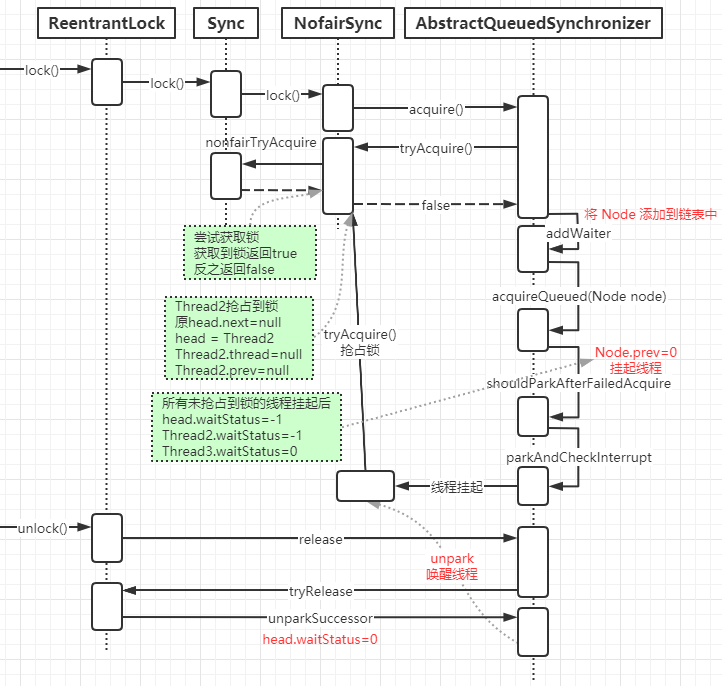

**ReentrantLock.lock()**

这个是 reentrantLock 获取锁的入口

```java
public void lock() {
    sync.lock();
}
```

sync 实际上是一个抽象的静态内部类，它继承了 AQS 来实现重入锁的逻辑，我们前面说过 AQS 是一个同步队列，它能够实现线程的阻塞以及唤醒，但它并不具备业务功能，所以在不同的同步场景中，会继承 AQS 来实现对应场景的功能 Sync 有两个具体的实现类，分别是： 

`NofairSync` 表示可以存在抢占锁的功能，也就是说不管当前队列上是否存在其他线程等待，新线程都有机会抢占锁 

`FailSync` 表示所有线程严格按照 FIFO 来获取锁

**NofairSync.lock**

以非公平锁为例，来看看 lock 中的实现 

1. 非公平锁和公平锁最大的区别在于，在非公平锁中抢占锁的逻辑是，不管有没有线程排队，先上来 CAS 去抢占一下 
2. CAS 成功，就表示成功获得了锁 
3. CAS 失败，调用 acquire(1) 走锁竞争逻辑

```java
final void lock() {
    // 如果当前值为期望的值0，则更新为1，并返回true
    if (compareAndSetState(0, 1))
        setExclusiveOwnerThread(Thread.currentThread());
    else
        acquire(1);
}
```

**CAS 的实现原理**

```java
// 表示期望将 expect 更新为 update
protected final boolean compareAndSetState(int expect, int update) {
    // See below for intrinsics setup to support this
    return unsafe.compareAndSwapInt(this, stateOffset, expect, update);
}
```

通过 CAS 乐观锁的方式来做比较并替换，这段代码的意思是，如果当前内存中的 state 的值和预期值 expect 相等，则替换为 update。更新成功返回 true，否则返回 false。

这个操作是原子的，不会出现线程安全问题，这里面涉及到 Unsafe 这个类的操作，以及涉及到 state 这个属性的意义。 

state 是 AQS 中的一个属性，它在不同的实现中所表达的含义不一样，对于重入锁的实现来说，表示一个同步状态。它有两个含义的表示 

1. 当 state=0 时，表示无锁状态 
2. 当 state>0 时，表示已经有线程获得了锁，也就是 state=1，但是因为 ReentrantLock 允许重入，所以同一个线程多次获得同步锁的时候，state 会递增， 比如重入 5 次，那么 state=5。而在释放锁的时候，同样需要释放 5 次直到 state=0 其他线程才有资格获得锁

**Unsafe 类**

Unsafe 类是在 sun.misc 包下，不属于 Java 标准。但是很多 Java 的基础类库，包括一些被广泛使用的高性能开发库都是基于 Unsafe 类开发的，比如 Netty、 Hadoop、Kafka 等； 

Unsafe 可认为是 Java 中留下的后门，提供了一些低层次操作，如直接内存访问、 线程的挂起和恢复、CAS、线程同步、内存屏障。

而 CAS 就是 Unsafe 类中提供的一个原子操作，第一个参数为需要改变的对象， 第二个为偏移量(即之前求出来的 headOffset 的值)，第三个参数为期待的值，第四个为更新后的值。

整个方法的作用是如果当前时刻的值等于预期值 var4 相等，则更新为新的期望值 var5，如果更新成功，则返回 true，否则返回 false；

**stateOffset**

一个 Java 对象可以看成是一段内存，每个字段都得按照一定的顺序放在这段内存里，通过这个方法可以准确地告诉你某个字段相对于对象的起始内存地址的字节偏移。用于在后面的 compareAndSwapInt 中，去根据偏移量找到对象在内存中的具体位置。

所以 stateOffset 表示 state 这个字段在 AQS 类的内存中相对于该类首地址的偏移量。

**compareAndSwapInt**

在 unsafe.cpp 文件中，可以找到 compareAndSwarpInt 的实现

```c
UNSAFE_ENTRY(jboolean, Unsafe_CompareAndSwapInt(JNIEnv *env, jobject unsafe, jobject obj, jlong offset, jint e, jint x))
 UnsafeWrapper("Unsafe_CompareAndSwapInt");
 oop p = JNIHandles::resolve(obj); //将 Java 对象解析成 JVM 的 oop（普通对象指针）,
 jint* addr = (jint *) index_oop_from_field_offset_long(p, offset); //根据对象 p 和地址偏移量找到地址
 //基于 cas 比较并替换， x 表示需要更新的值，addr 表示 state在内存中的地址，e 表示预期值
 return (jint)(Atomic::cmpxchg(x, addr, e)) == e; 
UNSAFE_END
```

**AQS.accquire**

acquire 是 AQS 中的方法，如果 CAS 操作未能成功，说明 state 已经不为 0，此时继续 acquire(1) 操作。

**acquire 方法中的 1 的参数是用来做什么呢？**

用作抢占锁后更新 satet 的 update 值或者同一线程获取锁后的递增值

这个方法的主要逻辑是 

1. 通过 tryAcquire 尝试获取独占锁，如果成功返回 true，失败返回 false 
2. 如果 tryAcquire 失败，则会通过 addWaiter 方法将当前线程封装成 Node 添加到 AQS 队列尾部 
3. acquireQueued，将 Node 作为参数，通过自旋去尝试获取锁。

```java
 public final void acquire(int arg) {
     if (!tryAcquire(arg) &&
         acquireQueued(addWaiter(Node.EXCLUSIVE), arg))
         selfInterrupt();
 }
```

**NonfairSync.tryAcquire**

这个方法的作用是尝试获取锁，如果成功返回 true，不成功返回 false。

它是重写 AQS 类中的 tryAcquire 方法，并且大家仔细看一下 AQS 中 tryAcquire 方法的定义，并没有实现，而是抛出异常。按照一般的思维模式，既然是一个不实现的模版方法，那应该定义成 abstract，让子类来实现呀？大家想想为什么

```java
protected final boolean tryAcquire(int acquires) {
    // 如果仍存在锁，且当前线程和有锁线程不是同一个，返回false
    return nonfairTryAcquire(acquires);
}
```

**ReentrantLock.nofairTryAcquire**

1. 获取当前线程，判断当前的锁的状态 
2. 如果 state=0 表示当前是无锁状态，通过 cas 更新 state 状态的值 
3. 当前线程是属于重入，则增加重入次数

```java
final boolean nonfairTryAcquire(int acquires) {
    //获取当前执行的线程
    final Thread current = Thread.currentThread();
    int c = getState();//获得 state 的值
    if (c == 0) {//表示无锁状态
        //cas 替换 state 的值，cas 成功表示获取锁成功
        if (compareAndSetState(0, acquires)) {
            //保存当前获得锁的线程,下次再来的时候不要再尝试竞争锁
            setExclusiveOwnerThread(current);
            return true;
        }
    }
    //如果同一个线程来获得锁，直接增加重入次数
    else if (current == getExclusiveOwnerThread()) {
        int nextc = c + acquires;
        if (nextc < 0) // overflow
            throw new Error("Maximum lock count exceeded");
        setState(nextc);
        return true;
    }
    return false;
}
```

**AQS.addWaiter**

当 tryAcquire 方法获取锁失败以后，则会先调用 addWaiter 将当前线程封装成 Node。

入参 mode 表示当前节点的状态，传递的参数是 Node.EXCLUSIVE，表示独占状态。意味着重入锁用到了 AQS 的独占锁功能 

1. 将当前线程封装成 Node 
2. 当前链表中的 tail 节点是否为空，如果不为空，则通过 cas 操作把当前线程的 node 添加到 AQS 队列 
3. 如果为空或者 cas 失败，调用 enq 将节点添加到 AQS 队列

```java
private Node addWaiter(Node mode) {
    Node node = new Node(Thread.currentThread(), mode);
    // Try the fast path of enq; backup to full enq on failure
    //tail 是 AQS 中表示同比队列队尾的属性，默认是 null
    Node pred = tail;
    //tail 不为空的情况下，说明队列中存在节点
    if (pred != null) {
        //把当前线程的 Node 的 prev 指向 旧 tail
        node.prev = pred;
        //通过 cas 把 node 加入到 AQS 队列，也就是设置为 tail
        if (compareAndSetTail(pred, node)) {
            //设置成功以后，把原 tail 节点的 next指向当前 node
            pred.next = node;
            return node;
        }
    }
    //tail=null,把 node 添加到同步队列
    enq(node);
    return node;
}
```

**enq **

enq 就是通过自旋操作把当前节点加入到队列中

```java
private Node enq(final Node node) {
    for (;;) {
        Node t = tail;
        if (t == null) { // Must initialize
            // 如果目前tail为null，则通过 CAS 将 new Node() 作为 Head 同时设置为tail
            // head = tail = new Node()
            if (compareAndSetHead(new Node()))
                tail = head;
        } else {
            // tail 和 head 初始化之后，将当前 node.prev设置为tail，并且通过 CAS 将自己设置为 node
            // 假如在Thread2设置tail时被Thread3设置过了，会继续进行下一次自旋设置tail
            node.prev = t;
            if (compareAndSetTail(t, node)) {
                // 当前 node 成功设置为 tail 之后，之前的tail的next就是自己
                t.next = node;
                return t;
            }
        }
    }
}
```

**图解分析**

假设 3 个线程来争抢锁，Thread1 获得锁，Thread2 和 Thread3 竞争锁。

那么截止到第一个进入 addWaiter方法执行 enq 方法运行结束之后，debug 到的数据信息（Node pred = tail =null，必定执行 enq）：

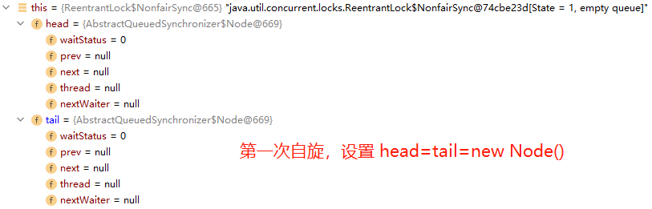

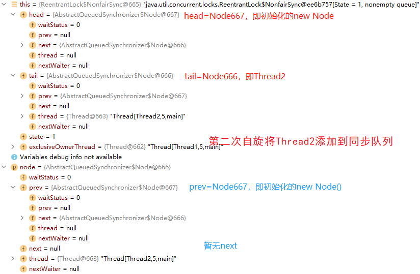

截止到所有线程调用 addwaiter 方法结束后，AQS 中的链表结构图：

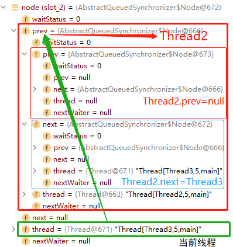

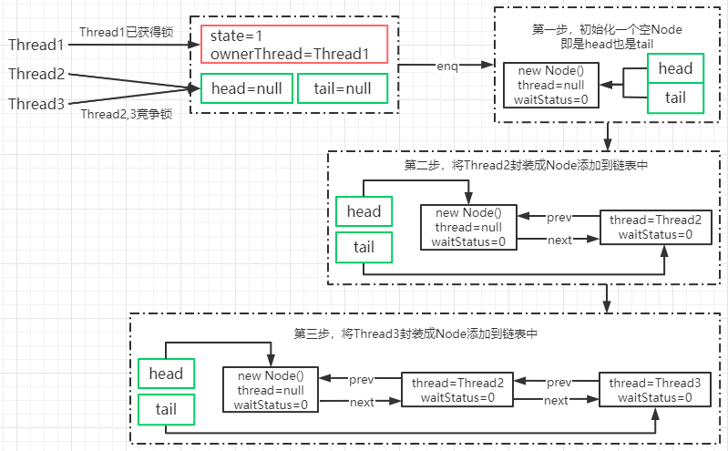

**AQS.acquireQueued**

通过 addWaiter 方法把线程添加到链表后，会接着把 Node 作为参数传递给 acquireQueued 方法，去竞争锁

1. 获取当前节点的 prev 节点 
2. 如果 prev 节点为 head 节点，那么它就有资格去争抢锁，调用 tryAcquire 抢占锁 
3. 抢占锁成功以后，把获得锁的节点设置为 head，并且移除原来的初始化 head 节点 
4. 如果获得锁失败，则根据 waitStatus 决定是否需要挂起线程 
5. 最后，通过 cancelAcquire 取消获得锁的操作

> 节点进入同步队列之后，就进入一个自旋的过程，当满足条件，获取到了同步状态，就可以从自旋中退出。
>
> 简单地判断自己的前驱节点是否为头节点？
>
> 这样使得节点的释放规则`符合 FIFO`，并且也便于对`过早通知`的处理（过早通知是指前驱节点不是头节点的线程由于中断而被唤醒）

```java
final boolean acquireQueued(final Node node, int arg) {
    boolean failed = true;
    try {
        boolean interrupted = false;
        for (;;) {
            //获取当前节点的 prev 节点
            final Node p = node.predecessor();
            //如果当前节点的 prev 节点是 head 节点，说明有资格去争抢锁
            if (p == head && tryAcquire(arg)) {
                //获取锁成功，也就是ThreadA 已经释放了锁，然后设置 head 为 ThreadB 获得执行权限
                setHead(node);
                //把原 head 节点从链表中移除
                p.next = null; // help GC
                failed = false;
                return interrupted;
            }
            //ThreadA 可能还没释放锁，使得 ThreadB 在执行 tryAcquire 时会返回 false
            if (shouldParkAfterFailedAcquire(p, node) && parkAndCheckInterrupt())
                //并且返回当前线程在等待过程中有没有中断过
                interrupted = true;
        }
    } finally {
        if (failed)
            cancelAcquire(node);
    }
}
```

**NofairSync.tryAcquire**

这个方法在前面分析过，就是通过 state 的状态来判断是否处于无锁状态，然后在通过 cas 进行竞争锁操作。成功表示获得锁，失败表示获得锁失败

**shouldParkAfterFailedAcquire**

如果 ThreadA 的锁还没有释放的情况下，ThreadB 和 ThreadC 来争抢锁肯定是会失败，那么失败以后会调用 shouldParkAfterFailedAcquire 方法。

Node 有 5 种状态，分别是：

`CANCELLED 1` 在同步队列中等待的线程等待超时或被中断，需要从同步队列中取消该 Node 的结点, 其结点的 waitStatus 为 CANCELLED，即结束状态，进入该状态后的结点将不会再变化 

`SIGNAL -1` 只要前置节点释放锁，就会通知标识为 SIGNAL 状态的后续节点的线程 

`CONDITION -2` 节点在等待队列中，当其他线程对 Condition 调用了 signal 方法后，该节点会从等待队列中转移到同步队列中

`PROPAGATE -3` 共享模式下，PROPAGATE 状态的线程处于可运行状态 

`INITIAL 0` 初始状态

这个方法的主要作用是，通过 Node 的状态来判断，ThreadB 竞争锁失败以后是否应该被挂起。 

1. 如果 ThreadB 的 pred 节点状态为 SIGNAL，那就表示可以放心挂起当前线程 
2. 通过循环扫描链表把 CANCELLED 状态的节点移除 
3. 修改 pred 节点的状态为 SIGNAL，返回 false

返回 false 时，也就是不需要挂起，返回 true，则需要调用 parkAndCheckInterrupt 挂起当前线程

```java
private static boolean shouldParkAfterFailedAcquire(Node pred, Node node) {
    //前置节点的waitStatus
    int ws = pred.waitStatus;
    //如果前置节点为 SIGNAL，意味着只需要等待其他前置节点的线程被释放
    // 初始的 new Node().waitStatus = 0
    if (ws == Node.SIGNAL)
        //返回 true，意味着可以直接放心的挂起了
        return true;
    //ws 大于 0，意味着 prev 节点取消了排队，直接移除这个节点就行
    if (ws > 0) {
        do {
            //相当于: pred=pred.prev;node.prev=pred;
            node.prev = pred = pred.prev;
        } while (pred.waitStatus > 0);//这里采用循环，从双向列表中移除 CANCELLED 的节点
        pred.next = node;
    } else {
       //利用 cas 设置 prev 节点的状态为 SIGNAL(-1)
        // 第一次自旋设置 new Node().waitStatus = -1
        // 第二次自旋设置 Thread2.waitStatus = -1
        compareAndSetWaitStatus(pred, ws, Node.SIGNAL);
    }
    return false;
}
```

**parkAndCheckInterrupt**

使用 LockSupport.park 挂起当前线程编程 WATING 状态

Thread.interrupted，返回当前线程是否被其他线程触发过中断请求，也就是 thread.interrupt(); 如果有触发过中断请求，那么这个方法会返回当前的中断标识 true，并且对中断标识进行复位标识已经响应过了中断请求。如果返回 true，意味着在 acquire 方法中会执行 selfInterrupt()。

```java
private final boolean parkAndCheckInterrupt() {
    LockSupport.park(this);
  	// 如果在挂起期间被中断过会返回ture
  	// acquireQueued 中的 interrupted 被设置为 true
    // 最终 acquireQueued 会返回true
    return Thread.interrupted();
}
```

selfInterrupt： 标识如果当前线程在 acquireQueued 中被中断过，则需要产生一个中断请求，原因是线程在调用 acquireQueued 方法的时候是不会响应中断请求的 

```java
// 响应中断
// acquireQueued 返回 true
// acquire 的判断就会执行此方法，进行中断（即响应中断）
static void selfInterrupt() { 
	Thread.currentThread().interrupt(); 
}
```

**图解分析**

通过 acquireQueued 方法来竞争锁，如果 Thread1 还在执行中没有释放锁的话， 意味着 Thread2 和 Thread3 只能挂起了。

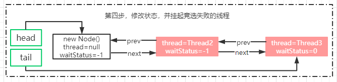

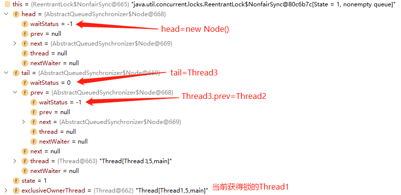

**LockSupport **

LockSupport类是 Java6引入的一个类，提供了基本的线程同步原语。LockSupport 实际上是调用了 Unsafe 类里的函数，归结到 Unsafe 里，只有两个函数

```java
public native void unpark(Object var1);
public native void park(boolean var1, long var2);
```

unpark 函数为线程提供“许可(permit)”，线程调用 park 函数则等待“许可”。这个有点像信号量，但是这个“许可”是不能叠加的，“许可”是一次性的。

permit 相当于 0/1 的开关，默认是 0，调用一次 unpark 就加 1 变成了 1.调用一次 park 会消费 permit，又会变成 0。 如果再调用一次 park 会阻塞，因为 permit 已 经是 0 了。直到 permit 变成 1.这时调用 unpark 会把 permit 设置为 1.每个线程都 有一个相关的 permit，permit 最多只有一个，重复调用 unpark 不会累积。

## 4.5 锁的释放流程

如果这个时候 Thread1 释放锁了，那么我们来看锁被释放后会产生什么效果。

**ReentrantLock.unlock**

在 unlock 中，会调用 release 方法来释放锁。

```java
public final boolean release(int arg) {
    //释放锁成功
    if (tryRelease(arg)) {
        //得到 aqs 中 head 节点
        Node h = head;
        if (h != null && h.waitStatus != 0)
            //如果 head 节点不为空并且状态！=0.调用 unparkSuccessor(h)唤醒后续节点
            unparkSuccessor(h);
        return true;
    }
    return false;
}
```

**ReentrantLock.tryRelease**

这个方法可以认为是一个设置锁状态的操作，通过将 state 状态减掉传入的参数值 （参数是 1），如果结果状态为 0，就将排它锁的 Owner 设置为 null，以使得其它的线程有机会进行执行。 

在排它锁中，加锁的时候状态会增加 1（当然可以自己修改这个值），在解锁的时候减掉 1，同一个锁，在可以重入后，可能会被叠加为 2、3、4 这些值，只有 unlock() 的次数与 lock()的次数对应才会将 Owner 线程设置为空，而且也只有这种情况下才会返回 true。

```java
protected final boolean tryRelease(int releases) {
    int c = getState() - releases;
    if (Thread.currentThread() != getExclusiveOwnerThread())
        throw new IllegalMonitorStateException();
    boolean free = false;
    if (c == 0) {
        free = true;
        setExclusiveOwnerThread(null);
    }
    setState(c);
    return free;
}
```

**unparkSuccessor**

```java
private void unparkSuccessor(Node node) {
    //获得 head 节点的状态
    int ws = node.waitStatus;
    if (ws < 0)
        // 设置 head 节点状态为 0
        compareAndSetWaitStatus(node, ws, 0);
	//得到 head 节点的下一个节点
    Node s = node.next;
    if (s == null || s.waitStatus > 0) {
        //如果下一个节点为 null 或者 status>0 表示 cancelled 状态.
		//通过从尾部节点开始扫描，找到距离 head 最近的一个 waitStatus<=0 的节点
        s = null;
        for (Node t = tail; t != null && t != node; t = t.prev)
            if (t.waitStatus <= 0)
                s = t;
    }
    //next 节点不为空，直接唤醒这个线程即可
    if (s != null)
        LockSupport.unpark(s.thread);
}
```

**为什么在释放锁的时候是从 tail 进行扫描**

我们再回到 enq 那个方法。在下面的代码来看一个新的节点是如何加入到链表中的 

1. 将新的节点的 prev 指向 tail 
2. 通过 cas 将 tail 设置为新的节点，因为 cas 是原子操作所以能够保证线程安全性 
3. t.next=node；设置原 tail 的 next 节点指向新的节点

```java
node.prev = t;
if (compareAndSetTail(t, node)) {
	t.next = node;
	return t;
}
```

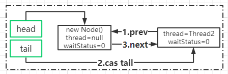

在 cas 操作之后，t.next=node 操作之前。存在其他线程调用 unlock 方法从 head 开始往后遍历，由于 t.next=node 还没执行意味着链表的关系还没有建立完整。 就会导致遍历到 t 节点的时候被中断。所以从后往前遍历，一定不会存在这个问题。

**图解分析**

通过锁的释放，原本的结构就发生了一些变化。head 节点的 waitStatus 变成了 0， ThreadB 被唤醒。

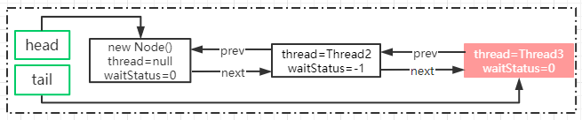

原本挂起的线程继续执行

通过 ReentrantLock.unlock，原本挂起的线程被唤醒以后继续执行，应该从哪里执行大家还有印象吧。原来`被挂起`的线程是在 `acquireQueued 方法`中，所以`被唤醒以后继续从这个方法开始`执行。

**AQS.acquireQueued**

这个方法前面已经完整分析过了，我们只关注一下 Thread2 被唤醒以后的执行流程。 由于 Thread2 的 prev 节点指向的是 head，并且 Thread1 已经释放了锁。所以这个时候调用 tryAcquire 方法时，可以顺利获取到锁 

1. 把 Thread2 节点当成 head
2. 把原 head 节点的 next 节点指向为 null

> 设置首节点是通过获取同步状态成功的线程来完成的，因此设置头节点的方法并不需要使用 CAS 来保证。

```java
final boolean acquireQueued(final Node node, int arg) {
	...
  for (;;) {
		final Node p = node.predecessor();
  	if (p == head && tryAcquire(arg)) { //可以顺利获得锁
			setHead(node);
			p.next = null; // help GC
			failed = false;
  		return interrupted;
    }
    ...
}
private void setHead(Node node) {
    // 设置当前 node 为 head
    head = node;
    // 设置 thread 为 null
    node.thread = null;
    node.prev = null;
}
```

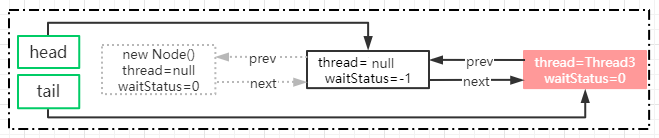

## 4.6 公平锁和非公平锁的区别

锁的公平性是相对于获取锁的顺序而言的，如果是一个公平锁，那么锁的获取顺序就应该符合请求的绝对时间顺序，也就是 FIFO。 在上面分析的例子来说，只要 CAS 设置同步状态成功，则表示当前线程获取了锁，而公平锁则不一样，差异点有两个。

**FairSync.tryAcquire**

```java
final void lock() { 
    acquire(1); 
}
```

非公平锁在获取锁的时候，会先通过 CAS 进行抢占，而公平锁则不会

```java
protected final boolean tryAcquire(int acquires) {
    final Thread current = Thread.currentThread();
    int c = getState();
    if (c == 0) {
        if (!hasQueuedPredecessors() &&
            compareAndSetState(0, acquires)) {
            setExclusiveOwnerThread(current);
            return true;
        }
    }
    else if (current == getExclusiveOwnerThread()) {
        int nextc = c + acquires;
        if (nextc < 0)
            throw new Error("Maximum lock count exceeded");
        setState(nextc);
        return true;
    }
    return false;
}
```

这个方法与 nonfairTryAcquire(int acquires) 比较，不同的地方在于判断条件多了 `hasQueuedPredecessors()` 方法，也就是加入了`同步队列中当前节点是否有前驱节点`的判断，如果该方法返回 true，则表示有线程比当前线程更早地请求获取锁， 因此需要等待前驱线程获取并释放锁之后才能继续获取锁。

> 非公平锁只要获取到同步状态即成功获取锁，在这个前提下，刚释放锁的线程再次获得同步状态的几率非常大，使得其他线程只能在同步队列中等待(`线程“饥饿”`)。
>
> 但为什么会造成线程饥饿的非公平锁会是默认实现呢？
>
> 公平锁虽然保证了锁的 FIFO 原则，但是进行了大量的线程切换。非公平锁虽然可能造成线程饥饿，但是极少的线程切换，保证了其更大的吞吐量。

# 5 读写锁的实现分析

## 5.1 读写状态的设计

读写锁同样依赖自定义同步器来实现同步功能，而读写状态就是其同步器的同步状态。

`按位切割使用` 读写锁将整型的状态变量切分为了两部分，`高 16 位表示读，低 16 位表示写`。

读写锁通过位运算迅速确定读和写各自的状态（假设当前同步状态值为 S）：

读状态等于 `S >>> 16`（无符号补 0 右移 16 位），读状态增加 1 时，等于 `S + (1 << 16)`，也就是 S + 0x00010000

写状态等于 `S & 0x0000FFFF`（将高 16 位全部抹去），写状态增加 1 时，等于 `S + 1`

> 推论：
>
> S 不等于 0 时，当写状态等于 0 时(S & 0x0000FFFF)，则读状态大于 0，即读锁已被获取。

## 5.2 写锁的获取与释放

写锁是一个支持重进入的排他锁。如果当前线程已经获取了写锁，则增加写状态。如果当前线程在获取写锁时，`读锁已经被获取`（读状态不为 0）或者`该线程不是已经获取写锁的线程`，则当前线程进入等待状态：

```java
protected final boolean tryAcquire(int acquires) {
    /*
     * Walkthrough:
     * 1. If read count nonzero or write count nonzero
     *    and owner is a different thread, fail.
     * 2. If count would saturate, fail. (This can only
     *    happen if count is already nonzero.)
     * 3. Otherwise, this thread is eligible for lock if
     *    it is either a reentrant acquire or
     *    queue policy allows it. If so, update state
     *    and set owner.
     */
    Thread current = Thread.currentThread();
    int c = getState();
    int w = exclusiveCount(c);   // ===》 c & 65535，写状态
    // 上诉推论中：c != 0 即 S 不等于 0，w == 0 即写状态等于 0，表读锁已被获取
    if (c != 0) {
        // 存在读锁或者当前获取线程不是已经获取写锁的线程
        if (w == 0 || current != getExclusiveOwnerThread())
            return false;
        if (w + exclusiveCount(acquires) > MAX_COUNT)
            throw new Error("Maximum lock count exceeded");
        // Reentrant acquire
        setState(c + acquires);
        return true;
    }
    if (writerShouldBlock() ||
        !compareAndSetState(c, c + acquires))
        return false;
    setExclusiveOwnerThread(current);
    return true;
}
```

**为什么存在读锁，则写锁不能被获取？**

读写锁要确保写锁的操作对读锁可见，如果允许读锁在已被获取的情况下对写锁的获取，那么正在进行的`其他读线程就无法感知到当前写线程的操作`。因此，只有等待其他读线程都释放了读锁，写锁才能被当前线程获取，而写锁一旦被获取，则其他读写线程的后续访问均被阻塞。

## 5.3 读锁的获取与释放

读锁是一个支持重入的共享锁，能够被多个线程同时获取，在`写状态为 0` 或者`没有其他写线程访问`时，读锁总会被成功地获取，所做的也只是线程安全的增加读状态。

```java
protected final int tryAcquireShared(int unused) {
    /*
     * Walkthrough:
     * 1. If write lock held by another thread, fail.
     * 2. Otherwise, this thread is eligible for
     *    lock wrt state, so ask if it should block
     *    because of queue policy. If not, try
     *    to grant by CASing state and updating count.
     *    Note that step does not check for reentrant
     *    acquires, which is postponed to full version
     *    to avoid having to check hold count in
     *    the more typical non-reentrant case.
     * 3. If step 2 fails either because thread
     *    apparently not eligible or CAS fails or count
     *    saturated, chain to version with full retry loop.
     */
    Thread current = Thread.currentThread();
    int c = getState();
    // 写状态 == 0 || （写状态 ！= 0 && 写线程 == 当前线程）
    // 写状态为 0		没有其他写线程访问					  
    if (exclusiveCount(c) != 0 &&
        getExclusiveOwnerThread() != current)
        return -1;
    int r = sharedCount(c);
    if (!readerShouldBlock() &&
        r < MAX_COUNT &&
        compareAndSetState(c, c + SHARED_UNIT)) { // 线程安全的设置读状态
        if (r == 0) {
            firstReader = current;
            firstReaderHoldCount = 1;
        } else if (firstReader == current) {
            firstReaderHoldCount++;
        } else {
            HoldCounter rh = cachedHoldCounter;
            if (rh == null || rh.tid != getThreadId(current))
                cachedHoldCounter = rh = readHolds.get();
            else if (rh.count == 0)
                readHolds.set(rh);
            rh.count++;
        }
        return 1;
    }
    return fullTryAcquireShared(current);
}
```

如果当前线程获取了写锁或者写锁未被获取，则当前线程（CAS）增加读状态，成功获取读锁。

读锁的每次释放（线程安全，可能有多个读线程同时释放读锁）均减少读状态，减少的值是 `1 << 16`。

# 6 BlockingQueue 阻塞队列

在使用过分布式消息队列，比如 ActiveMQ、 kafka、RabbitMQ 等等，消息队列的是有可以使得程序之间实现解耦，提升程序响应的效率。 如果我们把多线程环境比作是分布式的话，那么线程与线程之间是不是也可以使用这种消息队列的方式进行数据通信和解耦呢？

## 6.1 阻塞队列的使用案例

**注册成功后增加积分**

假如我们模拟一个场景，就是用户注册的时候，在注册成功以后发放积分。这个场景在一般来说，我们会这么去实现。

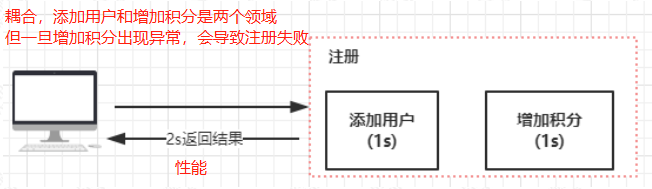

```java
public boolean register(){
    User user=new User();
    user.setName("Mic");
    addUser(user);
    sendPoints(user);
    return true;
}
```

优化之后：

```java
private final ExecutorService single = Executors.newSingleThreadExecutor();
private volatile boolean isRunning = true;
ArrayBlockingQueue arrayBlockingQueue=new ArrayBlockingQueue(10);
{
    init();
}
public void init(){
    single.execute(()->{
        while(isRunning){
            try {
                User user = (User) arrayBlockingQueue.take();//阻塞的方式获取队列中的数据
                sendPoints(user);
            } catch (InterruptedException e)
            {
                e.printStackTrace();
            }
        }
    });
}
public boolean register(){
    User user=new User();
    user.setName("Mic");
    addUser(user);
    arrayBlockingQueue.add(user);//添加到异步队列
    return true;
}
public static void main(String[] args) {
    new QueueUserService().register();
}
private void addUser(User user){
    System.out.println("添加用户："+user);
    try {
        Thread.sleep(1000);
    } catch (InterruptedException e) {
        e.printStackTrace();
    }
}
private void sendPoints(User user){
    System.out.println("发送积分给指定用户:"+user);
    try {
        Thread.sleep(1000);
    } catch (InterruptedException e) {
        e.printStackTrace();
    }
}
```

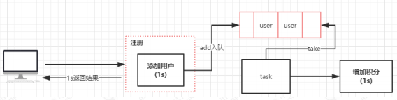

在这个案例中，我们使用了 ArrayBlockingQueue 基于数组的阻塞队列，来优化代码的执行逻辑。 

## 6.2 阻塞队列的应用场景

阻塞队列这块的应用场景，比较多的仍然是对于`生产者消费者场景`的应用，但是由于分布式架构的普及，大家更多的关注在分布式消息队列上。所以其实如果把阻塞队列比作成分布式消息队列的话，那么所谓的生产者和消费者其实就是基于阻塞队列的解耦。 另外，阻塞队列是一个 fifo 的队列，所以对于希望在线程级别需要实现对目标服务的顺序访问的场景中，也可以使用。

## 6.3 J.U.C 中的阻塞队列

### 6.3.1 J.U.C 提供的阻塞队列

阻塞队列是一个队列，在数据结构中起的作用如下图：


试图从空的队列中获取元素的线程将会被阻塞，直到其他线程往空的队列插入新的元素。

试图向已满的队列中添加新元素的线程将会被阻塞，直到其他线程从队列中移除一个或多个元素或者完全清空，使队列变得空闲起来并后续新增 

在多线程领域：所谓阻塞，在某些情况下会挂起线程（即阻塞），一旦条件满足，被挂起的线程又会自动被唤起。

在 Java8 中，提供了 7 个阻塞队列：


| 队列名称              | 介绍                                                         |
| --------------------- | ------------------------------------------------------------ |
| ArrayBlockingQueue    | 数组实现的有界阻塞队列, 此队列按照先进先出（FIFO）的原则对元素进行排序，默认情况下`不保证线程公平`的访问队列 |
| LinkedBlockingQueue   | 链表实现的有界阻塞队列, 此队列的默认和最大长度为 Integer.MAX_VALUE。此队列按照先进先出的原则对元素进行排序 |
| PriorityBlockingQueue | 支持优先级排序的无界阻塞队列, 默认情况下元素采取`自然顺序升序`排列。也可以自定义类实现 `compareTo()` 方法来指定元素排序规则，或者初始化 PriorityBlockingQueue 时，指定构造参数 `Comparator` 来对元素进行排序，不能保证同优先级元素的顺序 |
| DelayQueue            | 使用优先级队列 `PriorityQueue` 实现的无界阻塞队列，队列中的元素必须实现 `Delayed 接口`，参考 ScheduledThreadPoolExecutor 里 ScheduledFutureTask 类的实现 |
| SynchronousQueue      | 不存储元素的阻塞队列, 每一个 put 操作必须等待一个 take 操作，否则不能继续添加元素<br>将生产者线程处理的数据直接传递给消费者线程，非常适合`传递性场景` |
| LinkedTransferQueue   | 链表组成的无界阻塞队列                                       |
| LinkedBlockingDeque   | 链表组成的双向阻塞队列                                       |

> 所谓公平访问队列是指阻塞的线程，可以按照阻塞的先后顺序访问队列，为了保证公平性，通常会降低吞吐量。

### 6.3.2 阻塞队列的操作方法


| 类型     | 详情                                                         |
| -------- | ------------------------------------------------------------ |
| 抛出异常 | 当阻塞队列满时，再往队列里add插入元素会抛 `IllegalStateException:Queue full`<br>当阻塞队列空时，再往队列里remove移除元素会抛 `NoSuchElementException` |
| 特殊值   | 插入方法，插入成功返回 ture 失败 false<br/>移除方法，成功返回出队列的元素，队列里没有就返回 null |
| 一直阻塞 | 当阻塞队列满时，生产者线程继续往队列里 put 元素，队列会一直阻塞生产者线程直到 put 数据或响应中断退出<br>当阻塞队列空时，消费者线程试图从队列里 take 元素，队列会一直阻塞消费者线程直到队列可用 |
| 超时退出 | 当阻塞队列满时，队列会阻塞生产者线程一定时间，超过限时后生产者线程会退出 |

> 无界队列使用 put(e) 或 offer(e, time, unit) 方法永远不会阻塞，而使用 offer(e) 方法时永远返回 true

```java
public class BlockingQueueDemo {
    public static void main(String[] args) throws InterruptedException {
        BlockingQueue<String> blockingQueue = new ArrayBlockingQueue<>(3);
        // 异常组
        //System.out.println(blockingQueue.add("a"));
        //System.out.println(blockingQueue.add("b"));
        //System.out.println(blockingQueue.add("c"));
        // 空间不足抛出异常 java.lang.IllegalStateException: Queue full
        //System.out.println(blockingQueue.add("x"));

        //System.out.println(blockingQueue.remove());
        //System.out.println(blockingQueue.remove());
        //System.out.println(blockingQueue.remove());
        // 无可取数据抛出异常 java.util.NoSuchElementException
        //System.out.println(blockingQueue.remove());

        // 队列为空 java.util.NoSuchElementException
        //System.out.println(blockingQueue.element());

        // 特殊值
        //System.out.println(blockingQueue.offer("a"));
        //System.out.println(blockingQueue.offer("b"));
        //System.out.println(blockingQueue.offer("c"));
        // false
        //System.out.println(blockingQueue.offer("x"));

        //System.out.println(blockingQueue.poll());
        //System.out.println(blockingQueue.poll());
        //System.out.println(blockingQueue.poll());
        // null
        //System.out.println(blockingQueue.poll());
        // null
        //System.out.println(blockingQueue.peek());

        // 阻塞
        //blockingQueue.put("a");
        //blockingQueue.put("b");
        //blockingQueue.put("c");
        // 满了之后一直阻塞
        //blockingQueue.put("x");
        //System.out.println(blockingQueue.take());
        //System.out.println(blockingQueue.take());
        //System.out.println(blockingQueue.take());
        // 取完阻塞
        //System.out.println(blockingQueue.take());

        // 超时
        System.out.println(blockingQueue.offer("a", 3L ,TimeUnit.SECONDS));
        System.out.println(blockingQueue.offer("b", 3L ,TimeUnit.SECONDS));
        System.out.println(blockingQueue.offer("c", 3L ,TimeUnit.SECONDS));
        // 超时已满 false
        //System.out.println(blockingQueue.offer("x", 3L ,TimeUnit.SECONDS));
        System.out.println(blockingQueue.poll(3L, TimeUnit.SECONDS));
        System.out.println(blockingQueue.poll(3L, TimeUnit.SECONDS));
        System.out.println(blockingQueue.poll(3L, TimeUnit.SECONDS));
        // 超时无可取数据 null
        System.out.println(blockingQueue.poll(3L, TimeUnit.SECONDS));
    }
}
```

## 6.4 ArrayBlockingQueue 原理分析

**构造方法**

ArrayBlockingQueue 提供了三个构造方法，分别如下。 

capacity： 表示数组的长度，也就是队列的长度 

fair：表示是否为公平的阻塞队列，默认情况下构造的是非公平的阻塞队列。 

```java
public ArrayBlockingQueue(int capacity) {
    this(capacity, false);
}

public ArrayBlockingQueue(int capacity, boolean fair) {
    if (capacity <= 0)
        throw new IllegalArgumentException();
    this.items = new Object[capacity];
    //重入锁，出队和入队持有这一把锁
    lock = new ReentrantLock(fair);
    //初始化非空等待队列
    notEmpty = lock.newCondition();
    //初始化非满等待队列
    notFull =  lock.newCondition();
}
```

其中第三个构造方法就不解释了，它提供了接收一个几个作为数据初始化的方法。

**Add 方法**

以 add 方法作为入口，在 add 方法中会调用父类的 add 方法，也就是 AbstractQueue。如果看源码看得比较多的话， 一般这种写法都是调用父类的模版方法来解决通用性问题。

```java
public boolean add(E e) {
    return super.add(e);
}
// 从父类的 add 方法可以看到，这里做了一个队列是否满了的判断，如果队列满了直接抛出一个异常
public boolean add(E e) {
    if (offer(e))
        return true;
    else
        throw new IllegalStateException("Queue full");
}
```

**offer 方法**

add 方法最终还是调用 offer 方法来添加数据，返回一个添加成功或者失败的布尔值反馈。

这段代码做了几个事情

1. 判断添加的数据是否为空 
2. 添加重入锁 
3. 判断队列长度，如果队列长度等于数组长度，表示满了 直接返回 false 
4. 否则，直接调用 enqueue 将元素添加到队列中

```java
public boolean offer(E e) {
    checkNotNull(e);
    final ReentrantLock lock = this.lock;
    lock.lock();
    try {
        if (count == items.length)
            return false;
        else {
            enqueue(e);
            return true;
        }
    } finally {
        lock.unlock();
    }
}
```

**enqueue**

这个是最核心的逻辑，方法内部通过 putIndex 索引直接将 元素添加到数组 items。

```java
private void enqueue(E x) {
    // assert lock.getHoldCount() == 1;
    // assert items[putIndex] == null;
    final Object[] items = this.items;
    //通过 putIndex 对数据赋值
    items[putIndex] = x;
    // 当 putIndex 等于数组长度时，将 putIndex 重置为 0
    if (++putIndex == items.length)
        putIndex = 0;
    //记录队列元素的个数
    count++;
    //唤醒处于等待状态下的线程，表示当前队列中的元素不为空,如果存在消费者线程阻塞，就可以开始取出元素
    notEmpty.signal();
}
```

> 如果队列不可用，那么阻塞生产者主要通过 LockSupport.park(this) 来实现

**putIndex 为什么会在等于数组长度的时候重新设置为 0？**

因为 ArrayBlockingQueue 是一个 FIFO 的队列，队列添加元素时，是从队尾获取 putIndex 来存储元素，当 putIndex 等于数组长度时，下次就需要从数组头部开始添加了。

下面这个图模拟了添加到不同长度的元素时，putIndex 的变化，当 putIndex 等于数组长度时，不可能让 putIndex 继续累加，否则会超出数组初始化的容量大小。同时大家还需要思考两个问题

1. 当元素满了以后是无法继续添加的，因为会报错 
2. 其次，队列中的元素肯定会有一个消费者线程通过 take 或者其他方法来获取数据，而获取数据的同时元素也会从队列中移除

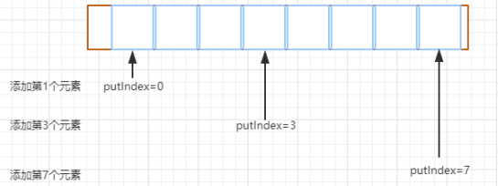

**put 方法**

put 方法和 add 方法功能一样，差异是 put 方法如果队列满了，会阻塞。

```java
public void put(E e) throws InterruptedException {
    checkNotNull(e);
    final ReentrantLock lock = this.lock;
    //这个也是获得锁，但是和 lock 的区别是，这个方法优先允许在等待时由其他线程调用等待线程的 interrupt 方法来中断等待直接返回。而 lock 方法是尝试获得锁成功后才响应中断
    lock.lockInterruptibly();
    try {
        //队列满了的情况下，当前线程将会被 notFull 条件对象挂起加到等待队列中
        while (count == items.length)
            notFull.await();
        enqueue(e);
    } finally {
        lock.unlock();
    }
}
```

**take 方法**

take 方法是一种阻塞获取队列中元素的方法。

它的实现原理很简单，有就删除没有就阻塞，注意这个阻塞是可以中断的，如果队列没有数据那么就加入 notEmpty 条件队列等待(有数据就直接取走，方法结束)，如果有新的 put 线程添加了数据，那么 put 操作将会唤醒 take 线程， 执行 take 操作。

```java
public E take() throws InterruptedException {
    final ReentrantLock lock = this.lock;
    lock.lockInterruptibly();
    try {
        //如果队列为空的情况下，直接通过 await 方法阻塞
        while (count == 0)
            notEmpty.await();
        return dequeue();
    } finally {
        lock.unlock();
    }
}
```

如果队列中添加了元素，那么这个时候，会在 enqueue 中调用 notempty.signal 唤醒 take 线程来获得元素。

**dequeue 方法**

这个是出队列的方法，主要是删除队列头部的元素并发回给客户端 takeIndex，是用来记录拿数据的索引值。

```java
private E dequeue() {
    // assert lock.getHoldCount() == 1;
    // assert items[takeIndex] != null;
    final Object[] items = this.items;
    @SuppressWarnings("unchecked")
    //默认获取 0 位置的元素
    E x = (E) items[takeIndex];
    //将该位置的元素设置为空
    items[takeIndex] = null;
    //这里的作用也是一样，如果拿到数组的最大值，那么重置为 0，继续从头部位置开始获取数据
    if (++takeIndex == items.length)
        takeIndex = 0;
    //记录元素个数递减
    count--;
    //同时更新迭代器中的元素数据
    if (itrs != null)
        itrs.elementDequeued();
    //触发 因为队列满了以后导致的被阻塞的线程
    notFull.signal();
    return x;
}
```

**itrs.elementDequeued()**

ArrayBlockingQueue 中，实现了迭代器的功能，也就是可以通过迭代器来遍历阻塞队列中的元素。

```java
public class BlockingQueueTest {
    public static void main(String[] args) throws InterruptedException {
        BlockingQueue<String> blockingQueue = new ArrayBlockingQueue<>(10);
        blockingQueue.add("a");
        blockingQueue.add("b");
        blockingQueue.add("c");
        blockingQueue.add("d");
        blockingQueue.add("e");
        blockingQueue.add("f");
        blockingQueue.take();
        blockingQueue.remove("c");
        Iterator<String> iterator = blockingQueue.iterator();
        while (iterator.hasNext()) {
            System.out.println(iterator.next());
        }
    }
}
// b d e f
```

所以 itrs.elementDequeued() 是用来更新迭代器中的元素数据的 takeIndex 的索引。

**remove 方法**

remove 方法是移除一个指定元素。看看它的实现代码：

```java
public boolean remove(Object o) {
    if (o == null) return false;
    //获取数组元素
    final Object[] items = this.items;
    //获得锁
    final ReentrantLock lock = this.lock;
    lock.lock();
    try {
         //如果队列不为空
        if (count > 0) {
            //获取下一个要添加元素时的索引
            final int putIndex = this.putIndex;
            //获取当前要被移除的元素的索引
            int i = takeIndex;
            do {
                //从 takeIndex 下标开始，找到要被删除的元素
                if (o.equals(items[i])) {
                    //移除指定元素
                    removeAt(i);
                    //返回执行结果
                    return true;
                }
                //当前删除索引执行加 1 后判断是否与数组长度相等
				//若为 true，说明索引已到数组尽头，将 i 设置为 0
                if (++i == items.length)
                    i = 0;
            } while (i != putIndex);//继续查找，直到找到最后一个元素
        }
        return false;
    } finally {
        lock.unlock();
    }
}
void removeAt(final int removeIndex) {
    final Object[] items = this.items;
    if (removeIndex == takeIndex) {
        items[takeIndex] = null;
        if (++takeIndex == items.length)
            takeIndex = 0;
        count--;
        if (itrs != null)
            itrs.elementDequeued();
    } else {
        // 调整数据结构
        final int putIndex = this.putIndex;
        // 遍历 removeIndex 后的数据，均向前移动一位，并重新给 putIndex 赋值
        for (int i = removeIndex;;) {
            int next = i + 1;
            if (next == items.length)
                next = 0;
            if (next != putIndex) {
                items[i] = items[next];
                i = next;
            } else {
                items[i] = null;
                this.putIndex = i;
                break;
            }
        }
        count--;
        if (itrs != null)
            itrs.removedAt(removeIndex);
    }
    notFull.signal();
}
```

**图解分析**

以迭代器示例 BlockingQueueTest 为例

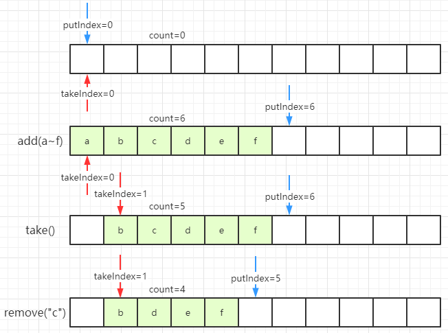

------

