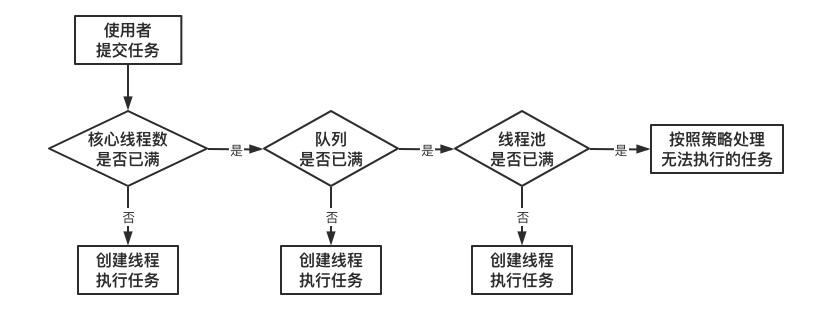

# JUC

## JUC 是什么

java.util.concurrent 在并发编程中使用的工具类


## 进程/线程

``进程`` 是一个具有一定独立功能的程序关于某个数据集合的一次运行活动。它是操作系统动态执行的基本单元，在传统的操作系统中，进程既是基本的分配单元，也是基本的执行单元。 

``线程`` 通常在一个进程中可以包含若干个线程，当然一个进程中至少有一个线程，不然没有存在的意义。线程可以利用进程所拥有的资源，在引入线程的操作系统中，通常都是把进程作为分配资源的基本单位，而把线程作为独立运行和独立调度的基本单位，由于线程比进程更小，基本上不拥有系统资源，故对它的调度所付出的开销就会小得多，能更高效的提高系统多个程序间并发执行的程度。 

## 线程状态

```java
Thread.State
public enum State {
     NEW, //新建
     RUNNABLE, //就绪
     BLOCKED, // 阻塞
     WAITING, //等待
     TIMED_WAITING, //等待时间内等待
     TERMINATED; // 终结
}
```

## wait/sleep的区别

功能都是当前线程暂停，有什么区别？ 

wait放开手去睡，放开手里的锁

sleep握紧手去睡，醒了手里还有锁 

## 并行/并发

并发：同一时刻多个线程在访问同一个资源，多个线程对一个点   例子：小米9今天上午10点，限量抢购 春运抢票      电商秒杀... 

并行：多项工作一起执行，之后再汇总   例子：泡方便面，电水壶烧水，一边撕调料倒入桶中 

## Synchronized

多线程编程模板：在高内聚低耦合的前提下，线程 --> 操作（对外暴露的调用方法）--> 资源类

```java
// 1、创建资源类
class Ticket {
    private int number = 30;
    private Lock lock = new ReentrantLock();

    public synchronized void saleTicket() {
        if (number > 0) {
            System.out.println(Thread.currentThread().getName() + "\t卖出第" + (number--) + "\t还剩下" + number);
        }
    }
}

// 2、资源类里创建同步方法、同步代码块
public class SaleTicket {
    public static void main(String[] args) {
        Ticket ticket = new Ticket();
        new Thread(new Runnable() {
            @Override
            public void run() {
                for (int i = 0; i <= 40 ; i++) {
                    ticket.saleTicket();
                }
            }
        }, "A").start();
        new Thread(new Runnable() {
            @Override
            public void run() {
                for (int i = 0; i <= 40 ; i++) {
                    ticket.saleTicket();
                }
            }
        }, "B").start();
        new Thread(new Runnable() {
            @Override
            public void run() {
                for (int i = 0; i <= 40 ; i++) {
                    ticket.saleTicket();
                }
            }
        }, "C").start();
    }
}
```

## Lock 接口

### Lock 接口是什么


> Lock implementations provide more extensive locking operations than can be obtained using synchronized methods and statements. They allow more flexible structuring, may have quite different properties, and may support multiple associated Condition objects. 

 锁实现提供了比使用同步方法和语句可以获得的更广泛的锁操作。它们允许更灵活的结构，可能具有非常不同的属性，并且可能支持多个关联的条件对象。 

### Lock接口的实现

``ReentrantLock`` 可重入锁

```java
class X {
  private final ReentrantLock lock = new ReentrantLock();
  // ...

  public void m() {
   lock.lock(); // block until condition holds
   try {
    // ... method body
   } finally {
    lock.unlock()
   }
  }
}
```

#### synchronized与Lock的区别

两者区别：

1. 首先synchronized是java内置关键字，在jvm层面，Lock是个java类；

2. synchronized无法判断是否获取锁的状态，Lock可以判断是否获取到锁；

3. synchronized会自动释放锁(a 线程执行完同步代码会释放锁 ；b 线程执行过程中发生异常会释放锁)，Lock需在finally中手工释放锁（unlock()方法释放锁），否则容易造成线程死锁；

4. 用synchronized关键字的两个线程1和线程2，如果当前线程1获得锁，线程2线程等待。如果线程1阻塞，线程2则会一直等待下去，而Lock锁就不一定会等待下去，如果尝试获取不到锁，线程可以不用一直等待就结束了；

5. synchronized的锁可重入、不可中断、非公平，而Lock锁可重入、可判断、可公平（两者皆可）

6. Lock锁适合大量同步的代码的同步问题，synchronized锁适合代码少量的同步问题。

### 创建线程的方式

```java
// 不能这样写
// 继承Thread
public   class  SaleTicket  extends  Thread //java是 单继承，资源宝贵，要用接口方式 
// new Thread()
Thread  t1  =  new  Thread(); 
t1 .start(); 

// 正确的方式
Thread(Runnable target, String name)  
// 匿名内部类-》 lambda表达式
new  Thread( new  Runnable() { 
     @Override 
     public   void  run() { 
  
    } 
   },  "your thread name" ).start(); 
new  Thread(() -> { 
  
 },  "your thread name" ).start(); 
```

```java
class Ticket {
    private int number = 30;
    private Lock lock = new ReentrantLock();

    public void saleTicket() {
        lock.lock();
        try {
            if (number > 0) {
                System.out.println(Thread.currentThread().getName() + "\t卖出第" + (number--) + "\t还剩下" + number);
            }
        } finally {
            lock.unlock();
        }
    }
}

/**
 * 多线程编程的企业级套路+模版
 * 1. 在高内聚低耦合的前提下，线程   操作（对外暴露的调用方法）   资源类
 */
public class SaleTicket {
    public static void main(String[] args) {
        Ticket ticket = new Ticket();
        new Thread(() -> {
            for (int i = 0; i <= 40 ; i++) {
                ticket.saleTicket();
            }
        }, "A").start();
        new Thread(() -> {
            for (int i = 0; i <= 40 ; i++) {
                ticket.saleTicket();
            }
        }, "B").start();
        new Thread(() -> {
            for (int i = 0; i <= 40 ; i++) {
                ticket.saleTicket();
            }
        }, "C").start();
    }
}
```

### lambda 表达式复习

```java
@FunctionalInterface
interface Foo {
    int add(int x, int y);

    default int div(int x, int y) {
        System.out.println("div");
        return x / y;
    }
    default int mul(int x, int y) {
        System.out.println("mul");
        return x * y;
    }
    public static int sub (int x, int y) {
        System.out.println("sub");
        return x - y;
    }
}

/**
 * 拷贝小括号，写死右箭头，落地大括号
 * FunctionInterface
 * default
 */
public class LambdaExpress {
    public static void main(String[] args) {
        Foo foo = (x, y) -> {
            System.out.println("add");
            return x + y;
        };
        System.out.println(foo.add(10, 5));
        System.out.println(foo.div(10,5));
        System.out.println(foo.mul(10,5));
        System.out.println(Foo.sub(10,5));
    }
}
```

## 线程间通信

1. 生产者+消费者
2. 通知等待唤醒机制

### synchronized实现

```java
class AirConditioner {
    private int number = 0;

    public synchronized void increment() throws InterruptedException {
        // 判断，如果是if，被唤醒时不会重新检查
        while (number != 0) {
            this.wait();
        }
        // 执行
        number++;
        System.out.println(Thread.currentThread().getName() + "\t" + number);
        // 通知
        this.notifyAll();
    }

    public synchronized void decrement() throws InterruptedException {
        while (number == 0) {
            this.wait();
        }
        number--;
        System.out.println(Thread.currentThread().getName() + "\t" + number);
        this.notifyAll();
    }
}

/**
 * 两个线程，操作一个初始值为0的变量
 * 实现一个线程对该变量+1，一个-1
 * 实现交替，10轮，变量初始值为0
 *
 * 判断/执行/通知
 * 多线程交互中，必须要防止多线程的虚假唤醒，也就（判断用while，不用if）
 */
public class ThreadWaitNotifyDemo {
    public static void main(String[] args) {
        AirConditioner airConditioner = new AirConditioner();
        new Thread(() -> {
            for (int i = 1; i <= 10; i++) {
                try {
                    Thread.sleep(200);
                    airConditioner.increment();
                } catch (InterruptedException e) {
                    e.printStackTrace();
                }
            }
        }, "A").start();
        new Thread(() -> {
            for (int i = 1; i <= 10; i++) {
                try {
                    Thread.sleep(300);
                    airConditioner.decrement();
                } catch (InterruptedException e) {
                    e.printStackTrace();
                }
            }
        }, "B").start();

        new Thread(() -> {
            for (int i = 1; i <= 10; i++) {
                try {
                    Thread.sleep(400);
                    airConditioner.increment();
                } catch (InterruptedException e) {
                    e.printStackTrace();
                }
            }
        }, "C").start();
        new Thread(() -> {
            for (int i = 1; i <= 10; i++) {
                try {
                    Thread.sleep(500);
                    airConditioner.decrement();
                } catch (InterruptedException e) {
                    e.printStackTrace();
                }
            }
        }, "D").start();
    }
}
```

### java 8 新版实现

```java
class AirConditioner {
    private int number = 0;

    private Lock lock = new ReentrantLock();
    private Condition condition = lock.newCondition();

    public void increment() throws InterruptedException {
        lock.lock();
        try {
            // 判断，如果是if，被唤醒时不会重新检查
            while (number != 0) {
                condition.await(); //this.wait();
            }
            // 执行
            number++;
            System.out.println(Thread.currentThread().getName() + "\t" + number);
            // 通知
            condition.signalAll(); //this.notifyAll();
        } finally {
            lock.unlock();
        }
    }

    public synchronized void decrement() throws InterruptedException {
        lock.lock();
        try {
            while (number == 0) {
                condition.await();
            }
            number--;
            System.out.println(Thread.currentThread().getName() + "\t" + number);
            condition.signalAll();
        } finally {
            lock.unlock();
        }
    }
}
```

## 线程间定制化调用通信

```java
class ShareResource {

    //1:A 2:B 3:C
    private int number = 1;
    private Lock lock = new ReentrantLock();
    private Condition condition1 = lock.newCondition();
    private Condition condition2 = lock.newCondition();
    private Condition condition3 = lock.newCondition();

    public void print5() {
        lock.lock();
        try {
            while (number != 1) {
                condition1.await();
            }
            for (int i = 1; i <= 5; i++) {
                System.out.println(Thread.currentThread().getName() + "\t" + i);
            }
            number = 2;
            condition2.signal();
        } catch (InterruptedException e) {
            e.printStackTrace();
        } finally {
            lock.unlock();
        }
    }

    public void print10() {
        lock.lock();
        try {
            while (number != 2) {
                condition2.await();
            }
            for (int i = 1; i <= 10; i++) {
                System.out.println(Thread.currentThread().getName() + "\t" + i);
            }
            number = 3;
            condition3.signal();
        } catch (InterruptedException e) {
            e.printStackTrace();
        } finally {
            lock.unlock();
        }
    }

    public void print15() {
        lock.lock();
        try {
            while (number != 3) {
                condition3.await();
            }
            for (int i = 1; i <= 15; i++) {
                System.out.println(Thread.currentThread().getName() + "\t" + i);
            }
            number = 1;
            condition1.signal();
        } catch (InterruptedException e) {
            e.printStackTrace();
        } finally {
            lock.unlock();
        }
    }
}

/**
 * 多线程之间实现A->B->C
 *
 * 1. 在高内聚低耦合的前提下，线程   操作（对外暴露的调用方法）   资源类
 * 2. 断/执行/通知
 * 3. 多线程交互中，必须要防止多线程的虚假唤醒，也就（判断用while，不用if）
 * 4. 标识位
 */
public class ThreadOrderAccess {
    public static void main(String[] args) {
        ShareResource shareResource = new ShareResource();
        new Thread(() -> {
            for (int i = 1; i <= 10; i++) {
                shareResource.print5();
            }
        }, "AA").start();
        new Thread(() -> {
            for (int i = 1; i <= 10; i++) {
                shareResource.print10();
            }
        }, "BB").start();
        new Thread(() -> {
            for (int i = 1; i <= 10; i++) {
                shareResource.print15();
            }
        }, "CC").start();
    }
}
```

## 多线程锁

```java
class Phone {

    public /*static*/ synchronized void sendEmail() throws Exception {
        //try { TimeUnit.SECONDS.sleep(4); } catch (InterruptedException e) { e.printStackTrace(); }
        System. out .println( "------sendEmail" );
    }

    public /*static*/ synchronized void sendSMS() throws Exception {
        System. out .println( "------sendSMS" );
    }

    public void hello() throws Exception {
        System. out .println( "------hello" );
    }
}

/**
 * 多线程8锁
 * 1. 标准访问，先打印邮件
 * 2. 邮件方法暂停4秒钟，先打印邮件
 * 3. 新增一个普通方法hello, 先打印hello
 * 4. 两部手机，先打印短信
 * 5. 两个静态同步方法，同一部手机，邮件
 * 6. 两个静态同步方法，2部手机，邮件
 * 7. 一个普通一个静态同步方法，1部手机，短信
 * 8. 一个普通一个静态同步方法，2部手机，短信
 */
public class Lock8 {
    public static void main(String[] args) throws InterruptedException {
        Phone phone = new Phone();
        Phone phone1 = new Phone();
        new Thread(() -> {
            try {
                phone.sendEmail();
            } catch (Exception e) {
                e.printStackTrace();
            }
        }, "A").start();
        Thread.sleep(100);
        new Thread(() -> {
            try {
                phone.sendSMS();
                //phone.hello();
                //phone1.sendSMS();
            } catch (Exception e) {
                e.printStackTrace();
            }
        }, "B").start();
    }
}
```

一个对象里面如果有多个synchronized方法，某一个时刻内，只要一个线程去调用其中的一个synchronized方法了， 其它的线程都只能等待，换句话说，某一个时刻内，只能有唯一一个线程去访问这些synchronized方法锁的是当前对象this，被锁定后，其它的线程都不能进入到当前对象的其它的synchronized方法 。

加个普通方法后发现和同步锁无关。

换成两个对象后，不是同一把锁了，情况立刻变化。 

 

synchronized实现同步的基础：Java中的每一个对象都可以作为锁。 

具体表现为以下3种形式。 

对于普通同步方法，锁是当前实例对象。 

对于静态同步方法，锁是当前类的Class对象。 

对于同步方法块，锁是 Synchonized 括号里配置的对象 

 当一个线程试图访问同步代码块时，它首先必须得到锁，退出或抛出异常时必须释放锁。 

 也就是说如果一个实例对象的非静态同步方法获取锁后，该实例对象的其他非静态同步方法必须等待获取锁的方法释放锁后才能获取锁， 可是别的实例对象的非静态同步方法因为跟该实例对象的非静态同步方法用的是不同的锁， 所以毋须等待该实例对象已获取锁的非静态同步方法释放锁就可以获取他们自己的锁。 

 

所有的静态同步方法用的也是同一把锁——类对象本身， 这两把锁是两个不同的对象，所以静态同步方法与非静态同步方法之间是不会有竞态条件的。 

但是一旦一个静态同步方法获取锁后，其他的静态同步方法都必须等待该方法释放锁后才能获取锁， 而不管是同一个实例对象的静态同步方法之间， 还是不同的实例对象的静态同步方法之间，只要它们同一个类的实例对象！ 

## 集合不安全

```java
/**
 * 集合类是不安全的
 * 1. 故障现象 java.util.ConcurrentModificationException
 * 解决方案
 *  Vector
 *  Collections.synchronizedList(new ArrayList<>())
 *  new CopyOnWriteArrayList<>()
 */
public class NotSafeDemo {
    public static void main(String[] args) {
        List<String> list = new CopyOnWriteArrayList<>();//Collections.synchronizedList(new ArrayList<>());//new Vector<>(); //new ArrayList<>();

        for (int i = 1; i <= 30; i++) {
            new Thread(() -> {
                list.add(UUID.randomUUID().toString().substring(0, 8));
                System.out.println(list);
            }, String.valueOf(i)).start();
        }
    }
}
```

ArrayList在迭代的时候如果同时对其进行修改就会抛出``java.util.ConcurrentModificationException``异常并发修改异常。

```java
// 看ArrayList的源码 
public boolean add( E  e) {
  ensureCapacityInternal( size  +  1 );   // Increments modCount!!
  elementData [ size ++] = e;
  return true ;
} 
// 没有 synchronized 线程不安全 
```

### Vector

```java
// 看Vector的源码 
public synchronized boolean add( E  e) {
  modCount ++;
  ensureCapacityHelper( elementCount  +  1 );
  elementData [ elementCount ++] = e;
  return true ;
} 
//有 synchronized 线程安全 
```



### Collections


Collections提供了方法 *synchronizedList*保证*list*是同步线程安全的。

那*HashMap*，*HashSet*是线程安全的吗？也不是，所以有同样的线程安全方法。

### 写时复制

不加锁性能提升出错误，加锁数据一致性能下降。

> A thread-safe variant of ArrayList in which all mutative operations (add, set, and so on) are implemented by making a fresh copy of the underlying array. 

CopyOnWriteArrayList是arraylist的一种线程安全变体， 其中所有可变操作（add、set等）都是通过生成底层数组的新副本来实现的。 

```java
/**
 * Appends the specified element to the end of this list.
 *
 * @param e element to be appended to this list
 * @return {@code true} (as specified by {@link Collection#add})
 */
public boolean add(E e) {
    final ReentrantLock lock = this.lock;
    lock.lock();
    try {
        Object[] elements = getArray();
        int len = elements.length;
        Object[] newElements = Arrays.copyOf(elements, len + 1);
        newElements[len] = e;
        setArray(newElements);
        return true;
    } finally {
        lock.unlock();
    }
}
```

*CopyOnWrite*容器即写时复制的容器。往一个容器添加元素的时候，不直接往当前容器*Object[]*添加，而是先将当前容器*Object[]*进行*Copy*，复制出一个新的容器*Object[] newElements*，然后向新的容器*Object[] newElements*里添加元素。添加元素后，再将原容器的引用指向新的容器*setArray(newElements)*。
这样做的好处是可以对*CopyOnWrite*容器进行并发的读，而不需要加锁，因为当前容器不会添加任何元素。所以*CopyOnWrite*容器也是一种读写分离的思想，读和写不同的容器。 

#### HashSet

```java
Set<String> set = new HashSet<>();//线程不安全 
Set<String> set = new CopyOnWriteArraySet<>();//线程安全
```

 HashSet底层数据结构是什么？ 

HashMap

 但HashSet的add是放一个值，而HashMap是放K、V键值对 

```java
public HashSet() {
   map = new HashMap<>();
} 
private static final Object PRESENT = new Object(); 

public boolean add( E e) {
   return map.put(e, PRESENT)==null;
} 
```

#### HashMap

```java
Map<String,String> map =  new  HashMap<>();//线程不安全 
Map<String,String> map =  new  ConcurrentHashMap<>();//线程安全
```

## Callable接口

获得多线程的方法几种?

传统的 是继承thread类和实现runnable接口，java5以后又有实现 callable接口 和 java的线程池获得。

这是一个``函数式接口``，因此可以用作lambda表达式或方法引用的赋值对象 。 


### 与Runnable对比

```java
// 创建新类MyThread实现runnable接口 
class MyThread implements Runnable{ 
 @Override 
 public void run() { 
  
 } 
} 
// 新类MyThread2实现callable接口 
class MyThread2 implements Callable<Integer>{ 
 @Override 
 public Integer call() throws Exception { 
  return 200; 
 }  
} 
```

callable接口与runnable接口的区别？ 

（1）是否有返回值 

（2）是否抛异常 
（3）落地方法不一样，一个是run，一个是call 

### FutureTask

Thread类的构造方法根本没有Callable，可以找中间人介绍。中间人是什么？ java多态，一个类可以实现多个接口！！ 


未来的任务，用它就干一件事，异步调用 main方法就像一个冰糖葫芦，一个个方法由main串起来。 

但解决不了一个问题：正常调用挂起堵塞问题 

 在主线程中需要执行比较耗时的操作时，但又不想阻塞主线程时，可以把这些作业交给Future对象在后台完成，当主线程将来需要时，就可以通过Future对象获得后台作业的计算结果或者执行状态。 

一般FutureTask多用于耗时的计算，主线程可以在完成自己的任务后，再去获取结果。 

仅在计算完成时才能检索结果；如果计算尚未完成，则阻塞 get 方法。一旦计算完成， 就不能再重新开始或取消计算。get方法而获取结果只有在计算完成时获取，否则会一直阻塞直到任务转入完成状态， 然后会返回结果或者抛出异常。 

只计算一次，get方法放到最后 

```java
class MyThread implements Callable<Integer> {

    @Override
    public Integer call() throws Exception {
        System.out.println("********come in");
        try { TimeUnit.SECONDS.sleep(4); } catch (InterruptedException e) { e.printStackTrace(); }
        return 1024;
    }
}

public class CallableDemo {
    public static void main(String[] args) throws ExecutionException, InterruptedException {
        FutureTask futureTask = new FutureTask(new MyThread());
        new Thread(futureTask, "A").start();
        System.out.println("main*******计算完成");
        System.out.println(futureTask.get());
    }
}
```

## JUC强大的辅助类

### CountDownLatch 减少计数

CountDownLatch主要有两个方法，当一个或多个线程调用await方法时，这些线程会阻塞。 

其它线程调用countDown方法会将计数器减1(调用countDown方法的线程不会阻塞)，当计数器的值变为0时，因await方法阻塞的线程会被唤醒，继续执行。 

```java
/**
  * 
  * @Description:
  * 让一些线程阻塞直到另一些线程完成一系列操作后才被唤醒。
  * 
  * CountDownLatch主要有两个方法，当一个或多个线程调用await方法时，这些线程会阻塞。
  * 其它线程调用countDown方法会将计数器减1(调用countDown方法的线程不会阻塞)，
  * 当计数器的值变为0时，因await方法阻塞的线程会被唤醒，继续执行。
  * 
  * 解释：6个同学陆续离开教室后值班同学才可以关门。
  * main主线程必须要等前面6个线程完成全部工作后，自己才能开干 
  */
public class CountDownLatchDemo {
    public static void main(String[] args) throws InterruptedException {
        CountDownLatch countDownLatch = new CountDownLatch(6);
        for (int i = 1; i <= 6; i++) {
            new Thread(() -> {
                System.out.println(Thread.currentThread().getName() + "\t离开教室");
                countDownLatch.countDown();
            }, String.valueOf(i)).start();
        }
        countDownLatch.await();
        System.out.println(Thread.currentThread().getName() + "\t班长离开教室");
    }

    public static void closeDoor() {
        for (int i = 1; i <= 6; i++) {
            new Thread(() -> {
                System.out.println(Thread.currentThread().getName() + "\t离开教室");
            }, String.valueOf(i)).start();
        }
        System.out.println(Thread.currentThread().getName() + "\t班长离开教室");
    }
}
```

### CyclicBarrier 循环栅栏

 CountDownLatch主要有两个方法，当一个或多个线程调用await方法时，这些线程会阻塞。 

 其它线程调用countDown方法会将计数器减1(调用countDown方法的线程不会阻塞)，当计数器的值变为0时，因await方法阻塞的线程会被唤醒，继续执行。 

```java
/**
  * CyclicBarrier 的字面意思是可循环（Cyclic）使用的屏障（Barrier）。它要做的事情是，
  * 让一组线程到达一个屏障（也可以叫同步点）时被阻塞，
  * 直到最后一个线程到达屏障时，屏障才会开门，所有
  * 被屏障拦截的线程才会继续干活。
  * 线程进入屏障通过CyclicBarrier的await()方法。
  * 
  * 集齐7颗龙珠就可以召唤神龙
  */
public class CyclicBarrierDemo {
    public static void main(String[] args) {
        // CyclicBarrier(int parties, Runnable barrierAction)
        CyclicBarrier cyclicBarrier = new CyclicBarrier(7, () -> System.out.println("*********召唤神龙"));

        for (int i = 1;i <= 7;i++) {
            final int tempInt = i;
            new Thread(() -> {
                System.out.println(Thread.currentThread().getName() + "\t收集到第" + tempInt + "颗龙珠");
                try {
                    cyclicBarrier.await();
                } catch (InterruptedException e) {
                    e.printStackTrace();
                } catch (BrokenBarrierException e) {
                    e.printStackTrace();
                }
            }, String.valueOf(i)).start();
        }
    }
}
```

### Semaphore 信号灯

 在信号量上我们定义两种操作： 

 acquire（获取） 当一个线程调用acquire操作时，它要么通过成功获取信号量（信号量减1），要么一直等下去，直到有线程释放信号量，或超时。 

release（释放）实际上会将信号量的值加1，然后唤醒等待的线程。 

信号量主要用于两个目的，一个是用于多个共享资源的互斥使用，另一个用于并发线程数的控制。 

```java
public class SemaphoreDemo {
    public static void main(String[] args) {
        Semaphore semaphore = new Semaphore(3);
        for (int i = 1; i <= 6; i++) {
            new Thread(() -> {
                try {
                    semaphore.acquire();
                    System.out.println(Thread.currentThread().getName() + "\t抢占了车位");
                    try { TimeUnit.SECONDS.sleep(3); } catch (InterruptedException e) { e.printStackTrace(); }
                    System.out.println(Thread.currentThread().getName() + "\t离开了车位");
                } catch (InterruptedException e) {
                    e.printStackTrace();
                } finally {
                    semaphore.release();
                }
            }, String.valueOf(i)).start();
        }
    }
}
```

## ReentrantReadWriteLock 读写锁

```java
class MyCache {
    private volatile Map<String, Object> map = new HashMap<>();
    private ReadWriteLock readWriteLock = new ReentrantReadWriteLock();

    public void put(String key, Object value) {
        readWriteLock.writeLock().lock();
        try {
            System.out.println(Thread.currentThread().getName() + "\t---写入数据" + key);
            try { TimeUnit.MILLISECONDS.sleep(300); } catch (InterruptedException e) { e.printStackTrace(); }
            map.put(key, value);
            System.out.println(Thread.currentThread().getName() + "\t---写入完成");
        } catch (Exception e) {
            e.printStackTrace();
        } finally {
            readWriteLock.writeLock().unlock();
        }
    }

    public void get(String key) {
        readWriteLock.readLock().lock();
        try {
            System.out.println(Thread.currentThread().getName() + "\t读取数据");
            try { TimeUnit.MILLISECONDS.sleep(300); } catch (InterruptedException e) { e.printStackTrace(); }
            Object result = map.get(key);
            System.out.println(Thread.currentThread().getName() + "\t读取完成" + result);
        } catch (Exception e) {
            e.printStackTrace();
        } finally {
            readWriteLock.readLock().unlock();
        }

    }
}

public class ReadWriteLockDemo {
    public static void main(String[] args) {
        MyCache myCache = new MyCache();

        for (int i = 1; i <= 5; i++) {
            final int tempInt = i;
            new Thread(() -> {
                myCache.put(tempInt + "", tempInt + "");
            }, String.valueOf(i)).start();
        }

        for (int i = 1; i <= 5; i++) {
            final int tempInt = i;
            new Thread(() -> {
                myCache.get(tempInt + "");
            }, String.valueOf(i)).start();
        }
    }
}
```

## BlockingQueueDemo 阻塞队列

阻塞：必须要阻塞/不得不阻塞

阻塞队列是一个队列，在数据结构中起的作用如下图：



当队列是空的，从队列中 获取 元素的操作将会被阻塞 

当队列是满的，从队列中 添加 元素的操作将会被阻塞 

试图从空的队列中获取元素的线程将会被阻塞，直到其他线程往空的队列插入新的元素 

试图向已满的队列中添加新元素的线程将会被阻塞，直到其他线程从队列中移除一个或多个元素或者完全清空，使队列变得空闲起来并后续新增 

### 阻塞队列的用处

在多线程领域：所谓阻塞，在某些情况下会 挂起 线程（即阻塞），一旦条件满足，被挂起的线程又会自动被唤起 


为什么需要BlockingQueue 

好处是我们不需要关心什么时候需要阻塞线程，什么时候需要唤醒线程，因为这一切BlockingQueue都给你一手包办了。在concurrent包发布以前，在多线程环境下， 我们每个程序员都必须去自己控制这些细节，尤其还要兼顾效率和线程安全 ，而这会给我们的程序带来不小的复杂度。 

### 架构和种类


ArrayBlockingQueue：由数组结构组成的有界阻塞队列。

LinkedBlockingQueue：由链表结构组成的有界（但大小默认值为integer.MAX_VALUE）阻塞队列。

PriorityBlockingQueue：支持优先级排序的无界阻塞队列。

DelayQueue：使用优先级队列实现的延迟无界阻塞队列。

SynchronousQueue：不存储元素的阻塞队列，也即单个元素的队列。

LinkedTransferQueue：由链表组成的无界阻塞队列。

LinkedBlockingDeque：由链表组成的双向阻塞队列。

### BlockingQueue核心方法


| 类型     | 详情                                                         |
| -------- | ------------------------------------------------------------ |
| 抛出异常 | 当阻塞队列满时，再往队列里add插入元素会抛IllegalStateException:Queue full<br>当阻塞队列空时，再往队列里remove移除元素会抛NoSuchElementException |
| 特殊值   | 插入方法，成功ture失败false<br/>移除方法，成功返回出队列的元素，队列里没有就返回null |
| 一直阻塞 | 当阻塞队列满时，生产者线程继续往队列里put元素，队列会一直阻塞生产者线程直到put数据or响应中断退出<br>当阻塞队列空时，消费者线程试图从队列里take元素，队列会一直阻塞消费者线程直到队列可用 |
| 超时退出 | 当阻塞队列满时，队列会阻塞生产者线程一定时间，超过限时后生产者线程会退出 |

```java
public class BlockingQueueDemo {
    public static void main(String[] args) throws InterruptedException {
        BlockingQueue<String> blockingQueue = new ArrayBlockingQueue<>(3);
        // 异常组
        //System.out.println(blockingQueue.add("a"));
        //System.out.println(blockingQueue.add("b"));
        //System.out.println(blockingQueue.add("c"));
        // 空间不足抛出异常 java.lang.IllegalStateException: Queue full
        //System.out.println(blockingQueue.add("x"));

        //System.out.println(blockingQueue.remove());
        //System.out.println(blockingQueue.remove());
        //System.out.println(blockingQueue.remove());
        // 无可取数据抛出异常 java.util.NoSuchElementException
        //System.out.println(blockingQueue.remove());

        // 队列为空 java.util.NoSuchElementException
        //System.out.println(blockingQueue.element());

        // 特殊值
        //System.out.println(blockingQueue.offer("a"));
        //System.out.println(blockingQueue.offer("b"));
        //System.out.println(blockingQueue.offer("c"));
        // false
        //System.out.println(blockingQueue.offer("x"));

        //System.out.println(blockingQueue.poll());
        //System.out.println(blockingQueue.poll());
        //System.out.println(blockingQueue.poll());
        // null
        //System.out.println(blockingQueue.poll());
        // null
        //System.out.println(blockingQueue.peek());

        // 阻塞
        //blockingQueue.put("a");
        //blockingQueue.put("b");
        //blockingQueue.put("c");
        // 满了之后一直阻塞
        //blockingQueue.put("x");
        //System.out.println(blockingQueue.take());
        //System.out.println(blockingQueue.take());
        //System.out.println(blockingQueue.take());
        // 取完阻塞
        //System.out.println(blockingQueue.take());

        // 超时
        System.out.println(blockingQueue.offer("a", 3L ,TimeUnit.SECONDS));
        System.out.println(blockingQueue.offer("b", 3L ,TimeUnit.SECONDS));
        System.out.println(blockingQueue.offer("c", 3L ,TimeUnit.SECONDS));
        // 超时已满 false
        //System.out.println(blockingQueue.offer("x", 3L ,TimeUnit.SECONDS));
        System.out.println(blockingQueue.poll(3L, TimeUnit.SECONDS));
        System.out.println(blockingQueue.poll(3L, TimeUnit.SECONDS));
        System.out.println(blockingQueue.poll(3L, TimeUnit.SECONDS));
        // 超时无可取数据 null
        System.out.println(blockingQueue.poll(3L, TimeUnit.SECONDS));
    }
}
```

## 线程池

### 为什么用线程池

例子：10年前单核CPU电脑，假的多线程，像马戏团小丑玩多个球，CPU需要来回切换。 现在是多核电脑，多个线程各自跑在独立的CPU上，不用切换效率高。 


线程池的优势：

线程池做的工作只要是控制运行的线程数量，``处理过程中将任务放入队列``，然后在线程创建后启动这些任务， ``如果线程数量超过了最大数量，超出数量的线程排队等候``，等其他线程执行完毕，再从队列中取出任务来执行。

它的主要特点为：``线程复用;控制最大并发数;管理线程``。

第一：降低资源消耗。通过重复利用已创建的线程降低线程创建和销毁造成的销耗。 

第二：提高响应速度。当任务到达时，任务可以不需要等待线程创建就能立即执行。 

第三：提高线程的可管理性。线程是稀缺资源，如果无限制的创建，不仅会销耗系统资源，还会降低系统的稳定性，使用线程池可以进行统一的分配，调优和监控。 

### 线程池的使用

#### 架构说明

Java中的线程池是通过Executor框架实现的，该框架中用到了Executor，Executors，ExecutorService，ThreadPoolExecutor这几个类。


#### 编码实现

##### Executors.newFixedThreadPool(int)

newFixedThreadPool创建的线程池corePoolSize和maximumPoolSize值是相等的，它使用的是LinkedBlockingQueue 

```java
public static ExecutorService newFixedThreadPool(int nThreads) {
    return new ThreadPoolExecutor(nThreads, nThreads,
                                  0L, TimeUnit.MILLISECONDS,
                                  new LinkedBlockingQueue<Runnable>());
}
```

##### Executors.newSingleThreadExecutor()

newSingleThreadExecutor 创建的线程池corePoolSize和maximumPoolSize值都是1，它使用的是LinkedBlockingQueue 

```java
public static ExecutorService newSingleThreadExecutor() {
    return new FinalizableDelegatedExecutorService
        (new ThreadPoolExecutor(1, 1,
                                0L, TimeUnit.MILLISECONDS,
                                new LinkedBlockingQueue<Runnable>()));
}
```

##### Executors.newCachedThreadPool()

newCachedThreadPool创建的线程池将corePoolSize设置为0，将maximumPoolSize设置为Integer.MAX_VALUE，它使用的是SynchronousQueue，也就是说来了任务就创建线程运行，当线程空闲超过60秒，就销毁线程。 

```java
public static ExecutorService newCachedThreadPool() {
    return new ThreadPoolExecutor(0, Integer.MAX_VALUE,
                                  60L, TimeUnit.SECONDS,
                                  new SynchronousQueue<Runnable>());
}
```

```java
public class MyThreadPoolDemo {
    public static void main(String[] args) {
        // 一池5个工作线程
        //ExecutorService threadPool = Executors.newFixedThreadPool(5);
        // 一池1个工作线程
        //ExecutorService threadPool = Executors.newSingleThreadExecutor();
        // 一池n线程
        ExecutorService threadPool = Executors.newCachedThreadPool();
        try {
            for (int i = 1; i <= 10; i++) {
                //try { TimeUnit.SECONDS.sleep(1); } catch (InterruptedException e) { e.printStackTrace(); }
                threadPool.execute(() -> {
                    System.out.println(Thread.currentThread().getName() + "\t办理业务");
                });
            }
        } catch (Exception e) {
            e.printStackTrace();
        } finally {
            threadPool.shutdownNow();
        }
    }
}
```

##### 三种创建线程池的方法哪个用的多

都不用，工作中只能使用自定义的


### 线程池的参数

```java
public ThreadPoolExecutor(int corePoolSize,
                          int maximumPoolSize,
                          long keepAliveTime,
                          TimeUnit unit,
                          BlockingQueue<Runnable> workQueue,
                          ThreadFactory threadFactory,
                          RejectedExecutionHandler handler) {
    if (corePoolSize < 0 ||
        maximumPoolSize <= 0 ||
        maximumPoolSize < corePoolSize ||
        keepAliveTime < 0)
        throw new IllegalArgumentException();
    if (workQueue == null || threadFactory == null || handler == null)
        throw new NullPointerException();
    this.corePoolSize = corePoolSize;
    this.maximumPoolSize = maximumPoolSize;
    this.workQueue = workQueue;
    this.keepAliveTime = unit.toNanos(keepAliveTime);
    this.threadFactory = threadFactory;
    this.handler = handler;
}
```

``corePoolSize`` 线程池中的常驻核心线程数

``maximumPoolSize`` 线程池中能够容纳同时执行的最大线程数，此值必须大于等于1

``keepAliveTime`` 多余的空闲线程的存活时间，当前池中线程数量超过corePoolSize时，当空闲时间达到keepAliveTime时，多余线程会被销毁直到只剩下corePoolSize个线程为止

``unit`` keepAliveTime的单位 

``workQueue`` 任务队列，被提交但尚未被执行的任务

``threadFactory`` 表示生成线程池中工作线程的线程工厂，用于创建线程，一般默认的即可

``handler`` 拒绝策略，表示当队列满了，并且工作线程大于等于线程池的最大线程数（maximumPoolSize）时如何来拒绝请求执行的runnable的策略

### 工作原理




1. 在创建了线程池后，开始等待请求。 

2. 当调用 ``execute()`` 方法添加一个请求任务时，线程池会做出如下判断： 

   2.1 如果正在运行的线程数量小于 ``corePoolSize`` ，那么马上创建线程运行这个任务； 

   2.2 如果正在运行的线程数量大于或等于 ``orePoolSize`` ，那么将这个任务放入队列 ； 

   2.3 如果这个时候队列满了且正在运行的线程数量还小于``maximumPoolSize``，那么还是要创建非核心线程立刻运行该任务； 

   2.4 如果队列满了且正在运行的线程数量大于或等于 ``maximumPoolSize`` ，那么线程池会启动饱和拒绝策略来执行 。 

3. 当一个线程完成任务时，它会从队列中取下一个任务来执行。 

4. 当一个线程无事可做超过一定的时间``keepAliveTime``时，线程会判断： 如果当前运行的线程数大于 ``corePoolSize``，那么这个线程就被停掉。 所以线程池的所有任务完成后， 它最终会收缩到 ``corePoolSize``的大小 。 

### 拒绝策略

等待队列已经排满了 ，再也塞不下新任务了，同时， 线程池中的max线程也达到了 ，无法继续为新任务服务。 这个时候我们就需要拒绝策略机制合理的处理这个问题。 

``AbortPolicy(默认)`` 直接抛出``RejectedExecutionException``异常阻止系统正常运行

``CallerRunsPolicy`` “调用者运行”一种调节机制，该策略既不会抛弃任务，也不会抛出异常，而是将某些任务回退到调用者，从而降低新任务的流量。

``DiscardOldestPolicy`` 抛弃队列中等待最久的任务，然后把当前任务加人队列中尝试再次提交当前任务。

``DiscardPolicy`` 该策略默默地丢弃无法处理的任务，不予任何处理也不抛出异常。如果允许任务丢失，这是最好的一种策略。

以上内置拒绝策略均实现了``RejectedExecutionHandle``接口

### 自定义线程池

```java
// maximumPoolSize
// CPU 密集型 Runtime.getRuntime().availableProcessors()(CPU核心数，逻辑处理器) + 1~2
// IO 密集型 CPU核心数/(1-阻塞系数)，实际应用2 * cpu
ExecutorService threadPool = new ThreadPoolExecutor(
        2,
        5,
        2L,
        TimeUnit.SECONDS,
        new LinkedBlockingQueue<>(3),
        Executors.defaultThreadFactory(),
        new ThreadPoolExecutor.AbortPolicy());
```

## Java8之流式计算

### 函数式接口


```java
public class StreamDemo {
    public static void main(String[] args) {
        Function<String, Integer> function = new Function<String, Integer>() {
            @Override
            public Integer apply(String s) {
                return s.length();
            }
        };
        Function<String, Integer> function1 = s -> s.length();
        System.out.println(function.apply("abc"));
        System.out.println(function1.apply("abcde"));

        Predicate<String> predicate = new Predicate<String>() {
            @Override
            public boolean test(String s) {
                return s.length() > 3;
            }
        };
        Predicate<String> predicate1 = s -> s.length() > 3;
        System.out.println(predicate.test("abc"));
        System.out.println(predicate1.test("abcde"));

        Consumer<String> consumer = new Consumer<String>() {
            @Override
            public void accept(String s) {
                System.out.println(s);
            }
        };
        Consumer<String> consumer1 = s -> System.out.println(s);
        consumer.accept("abc");
        consumer.accept("abcde");

        Supplier<String> supplier = new Supplier<String>() {
            @Override
            public String get() {
                return "abc";
            }
        };
        Supplier<String> supplier1 = () -> {return "abcde";};
        System.out.println(supplier.get());
        System.out.println(supplier1.get());
    }
}
```

### Stream流

流(Stream) 是数据渠道，用于操作数据源（集合、数组等）所生成的元素序列。 

``集合讲的是数据，流讲的是计算``

特点：

Stream 自己不会存储元素。

Stream 不会改变源对象。相反，他们会返回一个持有结果的新Stream。

Stream 操作是延迟执行的。这意味着他们会等到需要结果的时候才执行。


创建一个Stream：一个``数据源``（数组、集合）

中间操作：一个中间操作，``处理``数据源数据

终止操作：一个终止操作，``执行``中间操作链，产生结果

```java
@Data
@NoArgsConstructor
@AllArgsConstructor
class User {
    private Integer id;
    private String userName;
    private int age;
}

/**
 * 请按照给出数据，找出同时满足
 * 偶数 ID且 年龄大于 24且 用户名转为大写 且 用户名字母倒排序
 * 后 只输出一个用户名字
 */
public class StreamDemo {
    public static void main(String[] args) {
        User u1 = new User(11,"a",23);
        User u2 = new User(12,"b",24);
        User u3 = new User(13,"c",22);
        User u4 = new User(14,"d",28);
        User u5 = new User(16,"e",26);

        List<User> userList = Arrays.asList(u1, u2, u3, u4, u5);
        userList.stream().filter(u -> u.getId() % 2 == 0)
                .filter(u -> u.getAge() > 24)
                .map(u -> u.getUserName().toUpperCase())
                .sorted(Comparator.reverseOrder())
                .limit(1)
                .forEach(System.out::println);
    }
}
```

## ForkJoin

Fork：把一个复杂任务进行分拆，大事化小 

Join：把分拆任务的结果进行合并 

``ForkJoinPool ``分支合并池  类比=>  线程池 


``ForkJoinTask``  类比=>  FutureTask 

递归任务：继承后可以实现递归(自己调自己)调用的任务 


```java
class MyTask extends RecursiveTask<Integer> {

    private static final Integer ADJUST_VALUE = 10;

    private int begin;
    private int end;
    private int result;

    public MyTask(int begin, int end) {
        this.begin = begin;
        this.end = end;
    }

    @Override
    protected Integer compute() {
        if ((end - begin) <= ADJUST_VALUE) {
            for (int i = begin; i <= end; i++) {
                result = result + i;
            }
        } else {
            int middle = (end + begin) / 2;
            MyTask task01 = new MyTask(begin, middle);
            MyTask task02 = new MyTask(middle + 1, end);
            task01.fork();
            task02.fork();
            result = task01.join() + task02.join();
        }
        return result;
    }
}

public class ForkJoinDemo {
    public static void main(String[] args) throws ExecutionException, InterruptedException {
        MyTask myTask = new MyTask(0, 100);
        ForkJoinPool threadPool = new ForkJoinPool();

        ForkJoinTask<Integer> forkJoinTask = threadPool.submit(myTask);
        System.out.println(forkJoinTask.get());

        threadPool.shutdown();
    }
}
```

## 异步回调


```java
public class CompletableFutureDemo {
    public static void main(String[] args) throws ExecutionException, InterruptedException {
        CompletableFuture<Void> c = CompletableFuture.runAsync(() -> {
            System.out.println(Thread.currentThread().getName() + "没有返回");
        });
        c.get();

        // 异步回调
        CompletableFuture<Integer> c1 = CompletableFuture.supplyAsync(() -> {
            System.out.println(Thread.currentThread().getName() + "有返回");
            //int age = 10 / 0;
            return 1024;
        });
        System.out.println(c1.whenComplete((t, u) -> {
            System.out.println("***********t: " + t);
            System.out.println("***********u: " + u);
        }).exceptionally(f -> {
            System.out.println("***********exception: " + f.getMessage());
            return 404;
        }).get());
    }
}
```

