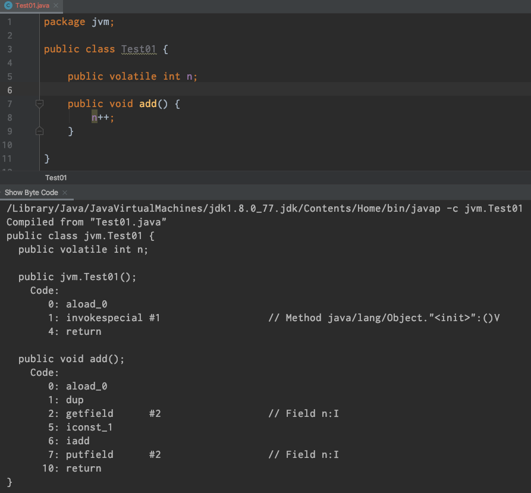
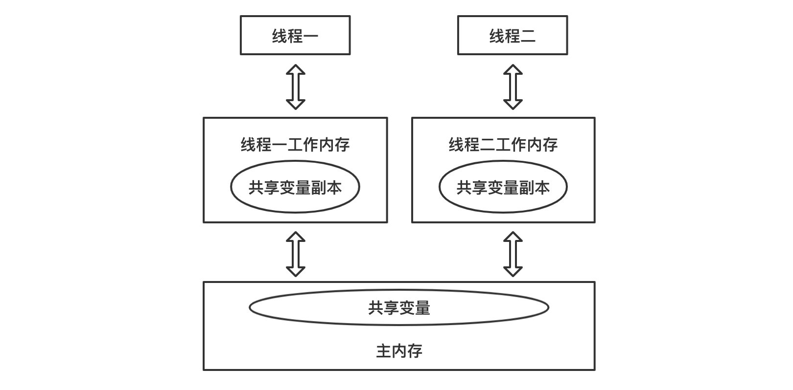
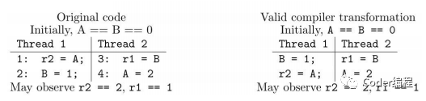
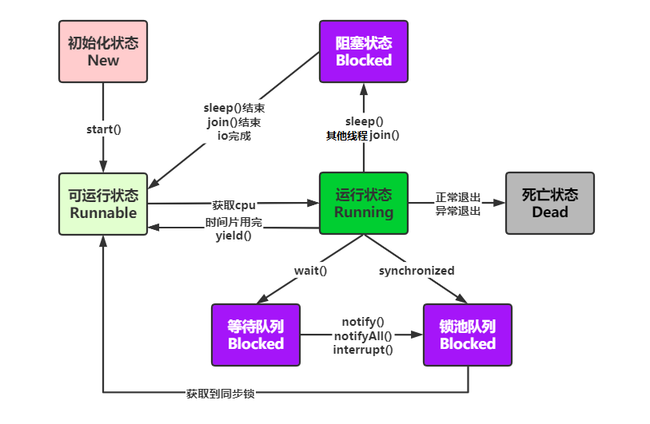
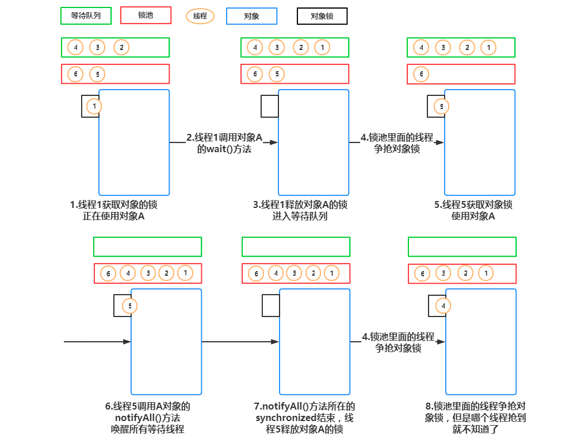

# 1 核心理论

## 1.1 共享性

``数据共享性``是线程安全的主要原因之一。如果所有的数据只是在线程内有效，那就不存在线程安全性问题，这也是我们在编程的时候经常不需要考虑线程安全的主要原因之一。但是，在多线程编程中，数据共享是不可避免的。最典型的场景是`数据库中的数据`，为了保证数据的一致性，我们通常需要共享同一个数据库中数据，即使是在主从的情况下，访问的也同一份数据(主从只是为了访问的效率和数据安全，而对同一份数据做的副本)。我们现在，通过一个简单的示例来演示多线程下共享数据导致的问题：

```java
public class ShareData {
    private static int count = 0;
    public static void main(String[] args) throws InterruptedException {
        for (int i = 0; i < 10; i++) {
            new Thread(() -> {
                try {
                    Thread.sleep(1);
                } catch (InterruptedException e) {
                    e.printStackTrace();
                }
                for (int j = 0; j < 100; j++) {
                    addCount();
                }
                System.out.print(count + "  ");
            }).start();
        }
        Thread.sleep(3000);
        System.out.println("count= " + count);
    }
    private static void addCount() {
        count++;
    }
}
// 200  607  607  370  714  807  299  453  200  907  count= 907
```

可见结果并没有像想象那样输出 1000。

可以看出，对共享变量操作，在多线程环境下很容易出现意想不到的结果。

## 1.2 互斥性

``资源互斥``是指同时只允许一个访问者对其进行访问，具有唯一性和排它性。我们通常允许多个线程同时对数据进行读操作，但同一时间内只允许一个线程对数据进行写操作。所以我们通常将锁分为共享锁和排它锁，也叫做读锁和写锁。如果资源不具有互斥性，即使是共享资源，我们也不需要担心线程安全。例如，对于不可变的数据共享，所有线程都只能对其进行读操作，所以不用考虑线程安全问题。``但是对共享数据的写操作，一般就需要保证互斥性``，上述例子中就是因为没有保证互斥性才导致数据的修改产生问题。Java 中提供多种机制来保证互斥性，最简单的方式是使用 Synchronized。现在我们在上面程序中加上 Synchronized 再执行：

```java
private synchronized static void addCount() {
    count++;
}
```

现在在执行上诉代码，无论多少次返回的最终结果都是 1000。

## 1.3 原子性(Atomicity)

原子性就是指对数据的操作是``一个独立的、不可分割的整体``。换句话说，就是一次操作，是一个连续不可中断的过程，数据不会执行的一半的时候被其他线程所修改。保证原子性的最简单方式是`操作系统指令`，就是说如果`一次操作对应一条操作系统指令，这样肯定可以能保证原子性`。但是很多操作不能通过一条指令就完成。例如，对 long 类型的运算，很多系统就需要分成多条指令分别对高位和低位进行操作才能完成。还比如，我们经常使用的整数 i++ 的操作，其实需要分成三个步骤：

（1）读取整数 i 的值；

（2）对 i 进行加一操作；

（3）将结果写回内存。



这个过程在多线程下就可能出现如下现象：


这也是代码段一执行的结果为什么不正确的原因。对于这种组合操作，``要保证原子性，最常见的方式是加锁``，如 Java 中的 ``Synchronized`` 或 ``Lock`` 都可以实现，代码段二就是通过 Synchronized 实现的。除了锁以外，还有一种方式就是``CAS（Compare And Swap）``，即修改数据之前先比较与之前读取到的值是否一致，如果一致，则进行修改，如果不一致则重新执行，这也是``乐观锁的实现原理``。不过 CAS 在某些场景下不一定有效，比如另一线程先修改了某个值，然后再改回原来值，这种情况下，CAS 是无法判断的(``ABA问题``)。

## 1.4 可见性(Visibility)

要理解可见性，需要先对 JVM 的内存模型有一定的了解，JVM 的内存模型与操作系统类似，如图所示：



从这个图中我们可以看出，每个线程都有一个自己的工作内存（相当于 CPU 高级缓冲区，这么做的目的还是在于进一步缩小存储系统与 CPU 之间速度的差异，提高性能），对于共享变量，线程每次读取的是工作内存中共享变量的副本，写入的时候也直接修改工作内存中副本的值，然后在某个时间点上再将工作内存与主内存中的值进行同步。这样导致的问题是，如果线程 1 对某个变量进行了修改，线程 2 却有可能看不到线程 1 对共享变量所做的修改。通过下面这段程序我们可以演示一下不可见的问题：

```java
public class VisibilityTest {
    private static boolean ready;
    private static int number;
    public static void main(String[] args) {
        new Thread(() -> {
            try {
                Thread.sleep(10);
            } catch (InterruptedException e) {
                e.printStackTrace();
            }
            if (!ready) {
                System.out.println(ready);
            }
            System.out.println(number);
        }).start();
        new Thread(() -> {
            try {
                Thread.sleep(10);
            } catch (InterruptedException e) {
                e.printStackTrace();
            }
            number = 100;
            ready = true;
        }).start();
    }
}
// 结果一：
// false
// 100
// 结果二：
// true
// 100
```

当然，这个结果也只能说是`有可能`是可见性造成的，当写线程设置 ready=true 后(还未刷新到共享内存)，读线程看不到修改后的结果，所以会打印 false，对于第二个结果，也就是执行 if(!ready) 时还没有读取到写线程的结果(写线程刷新但读线程读取不到)，但执行 System.out.println(ready) 时读取到了写线程执行的结果(println 会强制读取共享内存)。不过，这个结果也有可能是线程的交替执行所造成的。Java 中可通过 Synchronized 或 Volatile 来保证可见性，具体细节会在后续的文章中分析。

> System.out.println 源码
>
> ```java
> public void println(String x) {
>     synchronized (this) {
>         print(x);
>         newLine();
>     }
> }
> ```

## 1.5 有序性(Ordering)

为了提高性能，编译器和处理器常常会对既定的代码执行顺序进行指令重排序。

原因：一个好的内存模型实际上会放松对处理器和编译器规则的束缚，也就是说软件技术和硬件技术都为了一个目标而奋斗：在不改变程序执行结果的前提下，尽可能提高执行效率。JMM 对底层尽量减少约束，使其能够发挥自身优势。因此，在执行程序时，``为了提高性能，编译器和处理器常常对指令进行重排``。一般重排序可以分为三种：

（1）编译器优化的重排序。编译器在不改变单线程程序语义的前提下，可以重新安排语句的执行顺序。

（2）指令级并行的重排序。现代处理器采用了指令级并行技术（Instruction-Level Parallelism， ILP）来将多条指令重叠执行。如果不存在数据依赖性，处理器可以改变语句对应机器指令的执行顺序。　　

（3）内存系统的重排序。由于处理器使用缓存和读/写缓冲区，这使得加载和存储操作看上去可能是在乱序执行。


我们可以直接参考一下JSR 133 中对重排序问题的描述：




先看上第一个图中源码部分，从源码来看，要么指令 1 先执行要么指令 3 先执行。如果指令 1 先执行，r2 不应该能看到指令 4 中写入的值。如果指令 3 先执行，r1 不应该能看到指令 2 写的值。但是运行结果却可能出现 r2==2，r1==1 的情况，这就是“重排序”导致的结果。上第二个图即是一种可能出现的合法的编译结果，编译后，指令 1 和指令 2 的顺序可能就互换了。因此，才会出现 r2==2，r1==1 的结果。Java 中也可通过 Synchronized 或 Volatile 来保证顺序性。

### 1.5.1 as-if-serial 语义

`as-if-serial` 语义，不管怎么重排序，（单线程）程序的执行结果都不能被改变。

`数据依赖性` 两个操作访问同一变量，其中一个操作为写操作，此时两个操作之间就存在数据依赖性，编译器和处理器不会改变存在数据依赖性的两个操作的执行顺序。这里所说的数据依赖性仅针对单个处理器中执行的指令序列和单个线程中执行的操作，不同处理器之间和不同线程之间的数据依赖性不被编译器和处理器考虑。

以下有数据依赖关系，不能重排序。

写后读：

```java
int a = 1; 
int b = a;
```

写后写：

```java
int a = 1; 
int a = 2;
```

读后写：

```java
int a = 1; 
int b = a; 
int a = 2;
```

编译器和处理器不会对存在数据依赖关系的操作做重排序，因为这种重排序会改变执行结果。但是，如果操作之间不存在数据依赖关系，这些操作就可能被编译器和处理器重排序。

```java
int a = 1; 
int b = 2; 
int c = a + b;
```

上面 3 个操作的数据依赖关系如图所示：


如上图所示 a 和 c 之间存在数据依赖关系，同时 b 和 c 之间也存在数据依赖关系。因此在最终执行的指令序列中，c 不能被重排序到 a 和 b 的前面。但 a 和 b 之间没有数据依赖关系，编译器和处理器可以重排序a和b之间的执行顺序。

```java
//也可以重排序这样： 
int b = 2; 
int a = 1; 
int c = a + b;
```

```java
if (flag) { //3
 int i = a * a;//4
}
```

`控制依赖性 ` 操作 3 和 操作 4 存在控制依赖关系，会影响指令序列执行的并行度。编译器和处理器会采用`猜测(Speculation)`执行来克服执行相关性对并行度的影响。猜测实际上是对操作3，4重排序，把4的结果临时保存到一个重排序缓存中。

在多线程程序中，对存在控制依赖的操作重排序可能会改变程序结果。

#  2 线程的生命周期

## 2.1 操作系统层面线程状态图



众所周知，Java 的线程状态有5种，分别对应上图中五种不同颜色，下面对这5种状态及状态间的转化做相应的解释：

* `初始化状态`：新建一个线程对象

* `可运行状态`：其他线程调用了该线程对象的 start() 方法。该状态的线程位于可运行线程池中，变得可运行，等待获取 CPU 的使用权

* `运行状态`：可运行状态的线程获得了 CPU 时间片（timeslice），执行程序代码

* `阻塞状态`：线程因为某种原因放弃 CPU 使用权，暂时停止运行。直到线程再次进入可运行状态，才有机会转到运行状态。如图所示，会有三种不同类型的阻塞状态：
- `等待阻塞`：运行中的线程执行 wait() 方法，线程会进入等待队列中。等待 notify()、notifyAll() 或 interrupt() 对其唤醒或中断
  
- `同步阻塞`：运行中的线程执行在获取同步锁（注：只有 synchronized 这种方式的锁（monitor锁）才会让线程出现 BLOCKED 状态，等待 ReentrantLock 则不会）时，若该锁已被其他线程占用，线程则会进入锁池队列等待获取到锁
  
- `其他阻塞`：运行的线程执行 sleep()、join()，或触发了 I/O 请求，该该线程被置为阻塞状态。当 sleep() 状态超时、join() 等待线程终止或超时、I/O 处理完成，线程会重新进入可运行状态。
  
* `死亡状态`：线程执行完或因异常退出 run() 方法，线程生命周期结束

###  等待队列和锁池

``等待队列`` 和 ``锁池`` 都和 wait()、notify()、synchronized 有关，wait() 和 notify() 又必须由对象调用且必须写在 synchronized 同步代码块内。

1. 等待队列（等待被唤醒）：对应等待阻塞。调用 obj 的 wait() 方法，则进入等待队列

2. 锁池（等待抢锁）：对应同步阻塞。

   a) 当前 running 线程调用对象 obj 的同步方法时，发现锁被其他线程持有，则直接进入锁池。

   b) 当前等待队列中阻塞的线程A，等待被线程B唤醒，唤醒后并非直接进去 runnable 状态，而是进入线程A所对应的锁池中，等待抢到锁。

 下图直观描绘了running -> 等待队列 -> 锁池 -> runnable间的状态流转，帮助理解：



## 2.2 Java 线程层面线程状态

JDK 源码中 Thread 类，会发现里面有定义 State 的枚举，枚举中有：NEW、RUNNABLE、BLOCKED、WAITING、TIMED_WAITING、TERMINATED。

> Java 将操作系统中的运行和就绪两个状态合并成为运行状态。

```java
public enum State {
    NEW,
    RUNNABLE,
    /**
    * Thread state for a thread blocked waiting for a monitor lock.
    * A thread in the blocked state is waiting for a monitor lock to enter a synchronized block/method 
    * or
    * reenter a synchronized block/method after calling
    */
    // 受阻塞并且正在等待monitor锁的某一线程的线程状态
    BLOCKED,
    // 某一等待线程的线程状态
    WAITING,
    // 具有指定等待时间的某一等待线程的线程状态
    TIMED_WAITING,
    TERMINATED;
}
```

* `BLOCKED`场景：
  - 某一线程在等待 monitor lock，比如在等待执行 synchronized 代码块/方法，进入了锁池阻塞状态
  - 在 synchronized 块/方法中 `wait` 之后重进入（reenter）同步块时，也就是线程在等待进入临界区
* `WAITING`场景：某一线程因为调用下列方法之一而处于等待状态：

  - 不带超时值的 Object.wait()

  - 不带超时值的 Thread.join()

  - LockSupport.park 分析：既有可能进入等待队列，也有可能进入其他阻塞的阻塞状态
* `TIMED_WAITING`场景：某一线程因为调用以下带有指定正等待时间的方法之一而处于定时等待状态：
  * Thread.sleep(long millis)
  * 带有超时值的 Object.wait()

  * 带有超时值的 Thread.join()

  * LockSupport.parkNanos()
  * LockSupport.parkUntil() 分析：既有可能进入等待队列，也有可能进入其他阻塞的阻塞状态。和WAITING区别在于是否指定时间


```java
public class ThreadState {
    public static void main(String[] args) {
        new Thread(new TimeWaiting(), "TimeWaitingThread").start();
        new Thread(new Waiting(), "WaitingThread").start();
        new Thread(new Blocked(), "BlockedThread-1").start();
        new Thread(new Blocked(), "BlockedThread-2").start();
    }

    static class TimeWaiting implements Runnable {

        @Override
        public void run() {
            while (true) {
                try {
                    TimeUnit.SECONDS.sleep(100);
                } catch (InterruptedException e) {
                    e.printStackTrace();
                }
            }
        }
    }

    static class Waiting implements Runnable {

        @Override
        public void run() {
            while (true) {
                synchronized(Waiting.class) {
                    try {
                        Waiting.class.wait();
                    } catch (InterruptedException e) {
                        e.printStackTrace();
                    }
                }
            }
        }
    }

    static class Blocked implements Runnable {

        @Override
        public void run() {
            synchronized(Blocked.class) {
                while (true) {
                    try {
                        TimeUnit.SECONDS.sleep(100);
                    } catch (InterruptedException e) {
                        e.printStackTrace();
                    }
                }
            }
        }
    }
}
// "BlockedThread-2" #12 prio=5 os_prio=31 tid=0x00007fd4108e4800 nid=0x5503 waiting for monitor entry [0x0000700010555000]
// java.lang.Thread.State: BLOCKED (on object monitor)

// "BlockedThread-1" #11 prio=5 os_prio=31 tid=0x00007fd4108e4000 nid=0x4203 waiting on condition [0x0000700010452000]
// java.lang.Thread.State: TIMED_WAITING (sleeping)

// "WaitingThread" #10 prio=5 os_prio=31 tid=0x00007fd4108e3000 nid=0x3f03 in Object.wait() [0x000070001034f000]
// java.lang.Thread.State: WAITING (on object monitor)

// "TimeWaitingThread" #9 prio=5 os_prio=31 tid=0x00007fd411080800 nid=0x4303 waiting on condition [0x000070001024c000]
// java.lang.Thread.State: TIMED_WAITING (sleeping)
```

## 2.3 线程的启动

启动一个线程为什么是调用 start 方法，而不是 run 方法，这做一个简单的分析，先简单看一下 start 方法的定义：

```java
public synchronized void start() {
    if (threadStatus != 0)
        throw new IllegalThreadStateException();
    group.add(this);
    boolean started = false;
    try {
        start0();
        started = true;
    } finally {
        try {
            if (!started) {
                group.threadStartFailed(this);
            }
        } catch (Throwable ignore) {
        }
    }
}
```

我们看到调用 start 方法实际上是调用一个 native 方法 start0() 来启动一个线程，首先 start0()这个方法是在 Thread 的静态块中来注册的，代码如下：

```java
public class Thread implements Runnable {
    private static native void registerNatives();
    static {
        registerNatives();
    }
    ...
}
```

registerNatives 的本地方法的定义在文件 `Thread.c`，Thread.c 定义了各个操作系统平台要用的关于线程的公共数据和操作，以下是 Thread.c 的全部内容

http://hg.openjdk.java.net/jdk8/jdk8/jdk/file/00cd9dc3c2b5/src/share/native/java/lang/Thread.c

```c
static JNINativeMethod methods[] = {
    {"start0",           "()V",        (void *)&JVM_StartThread},
    {"stop0",            "(" OBJ ")V", (void *)&JVM_StopThread},
    {"isAlive",          "()Z",        (void *)&JVM_IsThreadAlive},
    {"suspend0",         "()V",        (void *)&JVM_SuspendThread},
    {"resume0",          "()V",        (void *)&JVM_ResumeThread},
    {"setPriority0",     "(I)V",       (void *)&JVM_SetThreadPriority},
    {"yield",            "()V",        (void *)&JVM_Yield},
    {"sleep",            "(J)V",       (void *)&JVM_Sleep},
    {"currentThread",    "()" THD,     (void *)&JVM_CurrentThread},
    {"countStackFrames", "()I",        (void *)&JVM_CountStackFrames},
    {"interrupt0",       "()V",        (void *)&JVM_Interrupt},
    {"isInterrupted",    "(Z)Z",       (void *)&JVM_IsInterrupted},
    {"holdsLock",        "(" OBJ ")Z", (void *)&JVM_HoldsLock},
    {"getThreads",        "()[" THD,   (void *)&JVM_GetAllThreads},
    {"dumpThreads",      "([" THD ")[[" STE, (void *)&JVM_DumpThreads},
};
```

 **JVM_StartThread **

从这段代码可以看出 ， start0() 实际会执行 JVM_StartThread 方法，这个方法是干嘛的呢？ 从名字上来看，似乎是在 JVM 层面去启动一个线程，如果真的是这样，那么`在 JVM 层面，一定会调用 Java 中定义的 run 方法`。那接下来继续去找找答案。我们找到 jvm.cpp 这个文件(需要下载 hotspot 的源码才能找到)。

```c
JVM_ENTRY(void, JVM_StartThread(JNIEnv* env, jobject jthread))
  JVMWrapper("JVM_StartThread");
  JavaThread *native_thread = NULL;
  {
      ...
      // 异步（未验证）创建线程
      native_thread = new JavaThread(&thread_entry, sz);
      ...
  // 启动线程
  Thread::start(native_thread);
JVM_END
```

**JavaThread**

JVM_ENTRY 是用来定义 JVM_StartThread 函数的，在这个函数里面创建了一个真正和平台有关的本地线程。继续寻找 JavaThread 的定义在 hotspot 的源码中 thread.cpp 文件中 1558 行的位置可以找到如下代码：

```c
JavaThread::JavaThread(ThreadFunction entry_point, size_t stack_sz) :
  Thread()
#if INCLUDE_ALL_GCS
  , _satb_mark_queue(&_satb_mark_queue_set),
  _dirty_card_queue(&_dirty_card_queue_set)
#endif // INCLUDE_ALL_GCS
{
  if (TraceThreadEvents) {
    tty->print_cr("creating thread %p", this);
  }
  initialize();
  _jni_attach_state = _not_attaching_via_jni;
  set_entry_point(entry_point);
  // JVM层面是通过调用操作系统的创建线程的方式来创建我们Java线程
  os::ThreadType thr_type = os::java_thread;
  thr_type = entry_point == &compiler_thread_entry ? os::compiler_thread :
                                                   os::java_thread;
  // 创建Java线程对应的内核线程
  os::create_thread(this, thr_type, stack_sz);
  _safepoint_visible = false;
}
```

这个方法有两个参数，第一个是函数名称，线程创建成功之后会根据这个函数名称调用对应的函数；第二个是当前进程内已经有的线程数量。最后我们重点关注与一下 `os::create_thread 调用平台创建线程的方法来创建线程`。 

**os_linux -> os::create_thread**

众所周知，JVM 是个啥，所以它的 OS 服务实现，Liunx 还有 Windows 等，都会实现线程的创建逻辑。这有点像适配器模式：

```c
bool os::create_thread(Thread* thread, ThreadType thr_type, size_t stack_size) {
  assert(thread->osthread() == NULL, "caller responsible");

  // Allocate the OSThread object
  OSThread* osthread = new OSThread(NULL, NULL);
  // 初始化已分配的状态，但此时并没有初始化
  osthread->set_state(ALLOCATED);
  
  pthread_t tid;
  // pthread_create是类Unix操作系统（Unix、Linux、Mac OS X等）的创建线程的函数
  int ret = pthread_create(&tid, &attr, (void* (*)(void*)) java_start, thread);

  return true;
}
```

`java_start` 重点关注类，是实际创建线程的方法。

**java_start**

```c
static void *java_start(Thread *thread) {
  // 线程ID
  int pid = os::current_process_id();
  // 设置线程
  ThreadLocalStorage::set_thread(thread);
  // 设置线程状态：INITIALIZED 初始化完成
  osthread->set_state(INITIALIZED);
  // 唤醒所有线程
  sync->notify_all();
  // 循环，初始化状态，则一致等待 wait
  while (osthread->get_state() == INITIALIZED) {
    sync->wait(Mutex::_no_safepoint_check_flag);
  }
  // 等待唤醒后，执行 run 方法
  thread->run();
  return 0;
}
```

**Thread::start**

接下来就是线程的启动，会调用 Thread.cpp 文件中的 Thread::start(Thread* thread) 方法，代码如下：

```c
void Thread::start(Thread* thread) {
  trace("start", thread);
  if (!DisableStartThread) {
    if (thread->is_Java_thread()) {
      java_lang_Thread::set_thread_status(((JavaThread*)thread)->threadObj(),
                                          java_lang_Thread::RUNNABLE);
    }
    os::start_thread(thread);
  }
}
```

start 方法中有一个函数调用：os::start_thread(thread)， 调用平台启动线程的方法，最终会调用 Thread.cpp 文件中的 JavaThread::run()方法。

**os::start_thread(thread)**

```c
void os::start_thread(Thread* thread) {
  // guard suspend/resume
  MutexLockerEx ml(thread->SR_lock(), Mutex::_no_safepoint_check_flag);
  OSThread* osthread = thread->osthread();
  // 设置线程状态 RUNNABLE
  osthread->set_state(RUNNABLE);
  // 启动线程，这个就由各个 OS 实现类，实现各自系统的启动方法了。比如，windows系统和Linux系统的代码是完全不同的。
  pd_start_thread(thread);
}
```

**pd_start_thread(thread)**

```java
void os::pd_start_thread(Thread* thread) {
  OSThread * osthread = thread->osthread();
  assert(osthread->get_state() != INITIALIZED, "just checking");
  Monitor* sync_with_child = osthread->startThread_lock();
  MutexLockerEx ml(sync_with_child, Mutex::_no_safepoint_check_flag);
  // notify() 最关键，它可以唤醒线程。线程唤醒后 thread->run()  就可以继续执行了
  sync_with_child->notify();
}
```

## 2.4 线程的终止

线程的终止，并不是简单的调用 stop 命令去。虽然 api 仍然可以调用，但是和其他的线程控制方法如 suspend、 resume 一样都是过期了的不建议使用，就拿 stop 来说，stop 方法在结束一个线程时并不会保证线程的资源正常释放，因此会导致程序可能出现一些不确定的状态。 要优雅的去中断一个线程，在线程中提供了一个 interrupt 方法。

### t.interrupt()

当其他线程通过调用当前线程的 interrupt 方法，表示向当前线程打个招呼，告诉他可以中断线程的执行了，至于什么时候中断，取决于当前线程自己。 线程通过检查是否被中断来进行相应操作，可以通过 `isInterrupted()` 来判断是否被中断。

打断标记：线程是否被打断，true 表示被打断了，false 表示没有

interrupt() 方法用于中断线程

1. 打断 sleep、wait、join、IO 阻塞等情况会抛出``InterruptedException`` 异常

   Java 虚拟机会先将该线程的中断标识位清除，然后抛出 InterruptedException，此时调用 isInterrupted() 方法会返回 false

2. 打断正常线程 ，线程不会真正被中断，但是线程的打断标记为 true

3. 等待获取锁的线程也不可被中断，参考“synchronized 不可被中断特性”

isInterrupted()  获取线程的打断标记 ,调用后不会修改线程的打断标记

```java
// 打断正常线程 ，线程不会真正被中断（打断状态为 true，但线程依然运行）
public class InterruptionInJava {
    public static void main(String[] args) throws InterruptedException {
        Thread testThread = new Thread(() -> {
            while(true){
                if(Thread.currentThread().isInterrupted()){
                    System.out.println("Yes,I am interruted,but I am still running");
                }else{
                    System.out.println("not yet interrupted");
                }
            }
        });
        testThread.start();
        Thread.sleep(1000);
		
        testThread.interrupt();
        System.out.println("main end");
    }
}
// 使用 interrupt() + isInterrupted()来中断线程
public class InterruptionInJava {
    public static void main(String[] args) throws InterruptedException {
        Thread testThread = new Thread(() -> {
            while(!Thread.currentThread().isInterrupted()){
                System.out.println("I am still running");
            }
            System.out.println("使用 interrupt() + isInterrupted()来中断线程，线程结束了");
        });
        testThread.start();
        Thread.sleep(100);

        testThread.interrupt();
        Thread.sleep(100);
        System.out.println("main end");
    }
}
// 使用 interrupt() + InterruptedException 来中断线程
public class InterruptionInJava01 {
    public static void main(String[] args) throws InterruptedException {
        Thread testThread = new Thread(() -> {
            try {
                Thread.sleep(888888);
            } catch (InterruptedException e) {
                // false
                System.out.println(Thread.currentThread().isInterrupted());
                System.out.println("caught exception right now: "+e);
            }
        });
        testThread.start();
        Thread.sleep(10);

        testThread.interrupt();
        Thread.sleep(10);
        System.out.println("main end");
    }
}
```

> 通过中断操作或者自定义标识都可以终止线程，但这种通过中断操作(判断标识位)的方式能够使线程在终止时有机会去清理资源，而不是武断的将线程停止，因此显得更加安全和优雅。

### Thread.interrupted

interrupted() 获取线程的打断标记，调用后清空打断标记，即如果获取为 true 调用后打断标记为 false (不常用)

上面的案例中，通过 interrupt，设置了一个标识告诉线程可以终止了，线程中还提供了静态方法 Thread.interrupted()对设置中断标识的线程复位。比如在上面的案例中，外面的线程调用 thread.interrupt 来设置中断标识，而在线程里面，又通过 Thread.interrupted 把线程的标识又进行了复位。

```java
public class InterruptedDemo {
    public static void main(String[] args) throws InterruptedException {
        Thread thread = new Thread(() -> {
            while (true) {
                if (Thread.currentThread().isInterrupted()) {
                    System.out.println("before:" + Thread.currentThread().isInterrupted());
                    Thread.interrupted(); //对线程进行复位，由 true 变成 false
                    System.out.println("after:" + Thread.currentThread().isInterrupted());
                }
            }
        }, "InterruptedDemo");
        thread.start();
        TimeUnit.SECONDS.sleep(1);
        thread.interrupt();
    }
}
```

**其他的线程复位**

除了通过 Thread.interrupted 方法对线程中断标识进行复位以外 ， 还有一种`被动复位`的场景，就是对抛出 InterruptedException 异常的方法 ， `在 InterruptedException 抛出之前，JVM 会先把线程的中断标识位清除`，然后才会抛出 InterruptedException，这个时候如果调用 isInterrupted 方法，将会返回 false(上例 InterruptionInJava01.java)。

**为什么要复位**

Thread.interrupted() 是属于当前线程的，是当前线程对外界中断信号的一个响应，表示自己已经得到了中断信号， 但不会立刻中断自己，具体什么时候中断由自己决定，让外界知道`在自身中断前，他的中断状态仍然是 false`，这就是复位的原因。

### 线程的终止原理

```java
// Thread.java
public void interrupt() {
    if (this != Thread.currentThread())
        checkAccess();
    synchronized (blockerLock) {
        Interruptible b = blocker;
        if (b != null) {
            interrupt0();           // Just to set the interrupt flag
            b.interrupt(this);
            return;
        }
    }
    interrupt0();
}
```

这个方法里面，调用了 interrupt0()，这个方法在前面分析 start 方法的时候见过，是一个 native 方法，这里就不再重复贴代码了，同样，我们找到 jvm.cpp 文件，找到 JVM_Interrupt 的定义：

```c
JVM_ENTRY(void, JVM_Interrupt(JNIEnv* env, jobject jthread))
  JVMWrapper("JVM_Interrupt");
  oop java_thread = JNIHandles::resolve_non_null(jthread);
  MutexLockerEx ml(thread->threadObj() == java_thread ? NULL : Threads_lock);
  JavaThread* thr = java_lang_Thread::thread(JNIHandles::resolve_non_null(jthread));
  if (thr != NULL) {
    Thread::interrupt(thr);
  }
JVM_END
```

这个方法比较简单，直接调用了 Thread::interrupt(thr) 这个方法，这个方法的定义在 Thread.cpp 文件中，代码如下：

```c
void Thread::interrupt(Thread* thread) {
  trace("interrupt", thread);
  debug_only(check_for_dangling_thread_pointer(thread);)
  os::interrupt(thread);
}
```

Thread::interrupt 方法调用了 os::interrupt 方法，这个是调用平台的 interrupt 方法，这个方法的实现是在 os_*.cpp 文件中，其中星号代表的是不同平台，因为 jvm 是跨平台 的，所以对于不同的操作平台，线程的调度方式都是不一 样的。我们以 os_linux.cpp 文件为例

```c
void os::interrupt(Thread* thread) {
  assert(Thread::current() == thread || Threads_lock->owned_by_self(),
    "possibility of dangling Thread pointer");
  // 获取本地线程对象
  OSThread* osthread = thread->osthread();
  // 判断本地线程对象是否为中断
  if (!osthread->interrupted()) {
    // 设置中断状态为true
    osthread->set_interrupted(true);
    // 内存屏障
    OrderAccess::fence();
    // _SleepEvent相当于Thread.sleep，表示如果线程调用了sleep方法，则通过unpark唤醒
    ParkEvent * const slp = thread->_SleepEvent ;
    if (slp != NULL) slp->unpark() ;
  }

  if (thread->is_Java_thread())
    ((JavaThread*)thread)->parker()->unpark();
  // _ParkEvent用于synchronized同步块和object.wait()，通过unpark唤醒
  ParkEvent * ev = thread->_ParkEvent ;
  if (ev != NULL) ev->unpark() ;
}
```

set_interrupted(true) 实际上就是调用 osThread.hpp 中的 set_interrupted() 方法，在 osThread 中定义了一个成员属性 `volatile jint _interrupted; `

通过上面的代码分析可以知道，thread.interrupt()方法实际就是设置一个 interrupted 状态标识为 true、并且通过 ParkEvent 的 unpark 方法来唤醒线程。 

1. 对于 synchronized 阻塞的线程，被唤醒以后会继续尝试获取锁，如果失败仍然可能被 park 
2. 在调用 ParkEvent 的 park 方法之前，会先判断线程的中断状态，如果为 true，会清除当前线程的中断标识 
3. Object.wait 、 Thread.sleep 、 Thread.join 会抛出 InterruptedException

**为什么 Object.wait、Thread.sleep 和 Thread.join 都会抛出 InterruptedException? **

你会发现这几个方法有一个共同点，都是属于阻塞的方法。

而阻塞方法的释放会取决于一些`外部的事件`，但是阻塞方法可能因为等不到外部的触发事件而导致无法终止，所以它`允许一个线程请求自己来停止它正在做的事情`。当一个方法抛出 InterruptedException 时，它是在告诉调用者如果执行该方法的线程被中断，它会尝试停止正在做的事情并且通过抛出 InterruptedException 表示提前返回。 

所以，这个异常的意思是表示`一个阻塞被其他线程中断了`。 由于线程调用了 interrupt() 中断方法 ， 那么 Object.wait、Thread.sleep 等被阻塞的线程被唤醒，然后会通过 is_interrupted 方法判断中断标识的状态变化，如果发现中断标识为 true，则先清除中断标识，然后抛出 InterruptedException。

需要注意的是，InterruptedException 异常的抛出并不意味着线程必须终止，而是提醒当前线程有中断的操作发生， 至于接下来怎么处理取决于线程本身，比如：

1. 直接捕获异常不做任何处理 
2. 将异常往外抛出 
3. 停止当前线程，并打印异常信息

为了让大家能够更好的理解上面这段话，我们以 Thread.sleep 为例直接从 jdk 的源码中找到中断标识的清除以及异常抛出的方法代码找到 is_interrupted() 方法， linux 平台中的实现在 os_linux.cpp 文件中，代码如下

```c
bool os::is_interrupted(Thread* thread, bool clear_interrupted) {
  assert(Thread::current() == thread || Threads_lock->owned_by_self(),
    "possibility of dangling Thread pointer");
  OSThread* osthread = thread->osthread();
  // 获取线程的中断标识
  bool interrupted = osthread->interrupted();
  // 如果中断表示为true
  if (interrupted && clear_interrupted) {
      // 设置中断标识为false
      osthread->set_interrupted(false);
  }
  return interrupted;
}
```

找到 Thread.sleep 这个操作在 jdk 中的源码体现：

```c
JVM_ENTRY(void, JVM_Sleep(JNIEnv* env, jclass threadClass, jlong millis))
  JVMWrapper("JVM_Sleep");

  if (millis < 0) {
    THROW_MSG(vmSymbols::java_lang_IllegalArgumentException(), "timeout value is negative");
  }
  // 判断并清除线程的中断状态，如果为true，抛出中断异常
  if (Thread::is_interrupted (THREAD, true) && !HAS_PENDING_EXCEPTION) {
    THROW_MSG(vmSymbols::java_lang_InterruptedException(), "sleep interrupted");
  }
...
}
```

注意上面加了中文注释的地方的代码，先判断 is_interrupted 的状态，然后抛出一个 InterruptedException 异常。到此为止，我们就已经分析清楚了中断的整个流程。

## 2.5 并发编程中常用API的理解

### obj.wait() 或 obj.wait(long timeout) 

JDK中一共提供了这三个版本的方法：

（1）wait() 方法的作用是将当前运行的线程挂起（即让其进入阻塞状态），直到 notify 或 notifyAll 方法来唤醒线程

（2）wait(long timeout) 方法与 wait() 方法类似，唯一的区别就是在指定时间内，如果没有 notify 或 notifAll 方法的唤醒，也会自动唤醒

（3）至于 wait(long timeout, long nanos) 本意在于更精确的控制调度时间，不过从目前版本来看，该方法貌似没有完整的实现该功能

> 使用 wait()、notify()、notifyAll() 时需要先对调用对象`加锁`。

其源码(JDK1.8)如下：

```java
public final void wait(long timeout, int nanos) throws InterruptedException {
    if (timeout < 0) {
        throw new IllegalArgumentException("timeout value is negative");
    }
    if (nanos < 0 || nanos > 999999) {
        throw new IllegalArgumentException(
                            "nanosecond timeout value out of range");
    }
    if (nanos > 0) {
        timeout++;
    }
    wait(timeout);
}
```

 wait 方法是一个本地方法，其底层是通过一个叫做监视器锁的对象来完成的。 所以 wait 方法的使用必须在同步的范围内，否则就会抛出`IllegalMonitorStateException`异常 。

#### 虚假唤醒

并发编程中为什么使用 while 循环而不是 if 来调用 wait 方法？

当其他获取到该对象锁的线程释放锁时，上面的线程有可能被意外唤醒，但是此时上面线程是不满足条件的，导致它破坏了被锁保护的约束关系，引起意外后果。 用 while 方法，就会再次判断条件是不是成立，满足执行条件了，才会继续执行；而 if 会直接唤醒 wait 方法，继续往下执行，不管被 notify 或 notifyAll 唤醒的是不是它，而极有可能，此时并不满足if的判断条件，就是 JDK 文档中所谓的“虚假唤醒”。 

### obj.notify() 或 obj.notifyAll()

wait 方式是通过对象的 monitor 对象来实现的，所以只要在同一对象上去调用 notify/notifyAll 方法，就可以唤醒对应对象 monitor 上等待的线程了。notify 和 notifyAll 的区别在于前者只能唤醒 monitor 上的一个线程，对其他线程没有影响，而 notifyAll 则唤醒所有的线程，看下面的例子很容易理解这两者的差别： 

```java
public class NotifyTest {
    public synchronized void testWait() {
        System.out.println(Thread.currentThread().getName() + "Start------");
        try {
            wait();
        } catch (InterruptedException e) {
            e.printStackTrace();
        }
        System.out.println(Thread.currentThread().getName() + "End------");
    }

    public static void main(String[] args) throws InterruptedException {
        final NotifyTest test = new NotifyTest();
        for (int i = 0; i < 5; i++) {
            new Thread(() -> test.testWait()).start();
        }
        Thread.sleep(500);
        synchronized (test) {
            test.notify();
        }
        Thread.sleep(3000);
        System.out.println("----------------------------------");
        synchronized (test) {
            test.notifyAll();
        }
    }
}
Thread-0Start------
Thread-2Start------
Thread-1Start------
Thread-3Start------
Thread-4Start------
Thread-0End------
----------------------------------
Thread-4End------
Thread-3End------
Thread-1End------
Thread-2End------
```

最后，有两点需要注意：

1. 调用 wait 方法后，线程是会释放对 monitor 对象的所有权的，线程状态由 `RUNNING 变为 WAITING`，并将当前线程放置到对象的`等待队列`

2. 一个通过 wait 方法阻塞的线程，必须同时满足以下两个条件才能被真正执行：

   * 线程需要被唤醒（超时唤醒或调用notify/notifyAll），将等待队列中的等待线程从等待队列中移到`同步队列`中，线程状态由 `WAITING 变为 BLOCKED`

   * 线程唤醒后需要竞争到锁（monitor）。

#### 验证 notify 或 interrupt 后的线程状态

```java
// 注释 t1.interrupt()，打开 this.notifyAll() 表示 notify 后 t1 的线程状态
// 注释 this.notifyAll()，打开 t1.interrupt() 表示 interrupt 后 t1 的线程状态
public class Uninterruptible {

    public synchronized void test() {
        System.out.println(Thread.currentThread().getName() + "进入同步代码块");
        try {
            this.wait();
        } catch (InterruptedException e) {
            e.printStackTrace();
        }
    }
    public synchronized void test1() {
        System.out.println(Thread.currentThread().getName() + "进入同步代码块");
        this.notifyAll();
        try {
            Thread.sleep(88888);
        } catch (InterruptedException e) {
            e.printStackTrace();
        }
    }

    public static void main(String[] args) throws InterruptedException {
        Uninterruptible u = new Uninterruptible();
        Thread t1 = new Thread(() -> u.test());
        t1.start();
        Thread.sleep(1000);
        Thread t2 = new Thread(() -> {
            //t1.interrupt();
            // 中断 t1 之后需要一个线程占用cpu，否则 t1 会进入锁池队列后然后直接获得锁，然后占用cpu运行，报错然后结束任务
            // 也即是需要 t2 获得锁，让 t1 暂时阻塞在锁池队列
            // notify 同理
            u.test1();
        });
        t2.start();

        Thread.sleep(1000);
        System.out.println(t1.getState());
    }
}
//Thread-0进入同步代码块
//Thread-1进入同步代码块
//BLOCKED
```

`notify 或 interrupt 后的线程 t1` 均变为 `BLOCKED` 状态。

#### 等待/通知的经典范式

等待方遵循如下原则：

1. 获取对象的锁
2. 如果条件不满足，那么调用对象的 wait 方法，被通知后仍要检查条件
3. 条件满足则执行对应逻辑

```java
synchronized(对象) {
    while(条件不满足){
        对象.wait();
    }
    对应的处理逻辑
}
```

通知方遵循如下原则：

1. 获得对象的锁
2. 改变条件
3. 通知所有等待在对象上的线程

```java
synchronized(对象) {
    改变条件
    对象.notifyAll();
}
```

**等待超时模式**

假设超时时间段是 T：

* 等待持续时间：REMAINGING = T
* 超时时间：FUTURE = now + T
* wait(REMAINING) 返回之后将执行，REMAINING = FUTURE - now，如果 REMAINING <= 0，表示超时，直接退出

```java
public synchronized Object get(long mills) throws InterruptedException {
    long future = System.currentTimeMillis() + mills;
    long remaining = mills;
    // 当超时大于 0 并且 result 返回值不满足要求
    while((result == null) && remaining > 0) {
        wait(remaining);
        remaining = future - System.currentTimeMillis();
    }
    return result;
}
```

### Thread.sleep(long millis)

Thread.sleep() 方法的作用是让当前线程暂停指定的时间（毫秒）， 使当前线程进入阻塞状态（其他阻塞），但不释放任何锁资源，一定时间后线程自动进入 `runnable 状态`，给其它线程执行机会的最佳方式 。

唯一需要注意的是其与 wait 方法的区别：

* 最简单的区别是 `wait 方法依赖于同步`，而 sleep 方法可以`直接调用`

* 更深层次的区别在于 ``sleep 方法只是暂时让出 CPU 的执行权并不释放锁，而 wait 方法则需要释放锁``

```java
public class SleepTest {
    public synchronized void sleepMethod() {
        System.out.println(Thread.currentThread().getName() + "Sleep start ------");
        try {
            Thread.sleep(1000);
        } catch (InterruptedException e) {
            e.printStackTrace();
        }
        System.out.println(Thread.currentThread().getName() + "Sleep end ------");
    }

    public synchronized void waitMethod() {
        System.out.println(Thread.currentThread().getName() + "Wait start ------");
        try {
            wait(1000);
        } catch (InterruptedException e) {
            e.printStackTrace();
        }
        System.out.println(Thread.currentThread().getName() + "Wait end ------");
    }

    public static void main(String[] args) throws InterruptedException {
        final SleepTest test = new SleepTest();

        for (int i = 0; i < 3; i++) {
            new Thread(() -> test.sleepMethod()).start();
        }


        Thread.sleep(5000);
        System.out.println("--------------------");

        final SleepTest test2 = new SleepTest();

        for(int i = 0;i < 3;i++){
            new Thread(() -> test2.waitMethod()).start();
        }

    }
}
Thread-0Sleep start ------
Thread-0Sleep end ------
Thread-2Sleep start ------
Thread-2Sleep end ------
Thread-1Sleep start ------
Thread-1Sleep end ------
--------------------
Thread-3Wait start ------
Thread-5Wait start ------
Thread-4Wait start ------
Thread-5Wait end ------
Thread-3Wait end ------
Thread-4Wait end ------
```

### Thread.yield()

yield 暂停当前线程，以便其他线程有机会执行，不过不能指定暂停的时间，并且也不能保证当前线程马上停止。yield 方法只是将 Running 状态转变为 Runnable 状态 ，放弃 cpu 使用权，让 cpu 再次选择要执行的线程。 

yield 仅仅是让其它具有同等优先级的 runnable 线程获取执行权，但并不能保证其它具有同等优先级的线程就一定能获得 cpu 执行权。因为做出让步的当前线程，可能会被 cpu 再次选中，进入 running 状态，yield() 不会导致阻塞。 

```java
public class YieldTest implements Runnable {

    @Override
    public void run() {
        try {
            Thread.sleep(100);
        } catch (InterruptedException e) {
            e.printStackTrace();
        }
        for (int i = 1; i <= 5; i++) {
            System.out.println(Thread.currentThread().getName() + ": " + i);
            Thread.yield();
        }
    }

    public static void main(String[] args) {
        YieldTest test = new YieldTest();
        Thread t1 = new Thread(test, "FirstThread");
        Thread t2 = new Thread(test, "SecondThread");

        t1.start();
        t2.start();
    }
}
```

 这个例子就是通过 yield 方法来实现两个线程的交替执行。不过请注意：这种交替并不一定能得到保证。

### t.join() 或 t.join(long millis) 

当前线程 A 执行过程中，调用 B 线程的 join 方法，使当前线程进入阻塞状态（其他阻塞），但不释放对象锁，等待 B 线程执行完后或一定时间 millis 后，A 线程进入 runnable 状态。 

JDK 中提供三个版本的 join 方法，其实现与 wait 方法类似，join() 方法实际上执行的 join(0)，而 join(long millis, int nanos) 也与wait(long millis, int nanos) 的实现方式一致 ：

```java
public final synchronized void join(long millis)
throws InterruptedException {
    long base = System.currentTimeMillis();
    long now = 0;
    if (millis < 0) {
        throw new IllegalArgumentException("timeout value is negative");
    }
    if (millis == 0) {
        while (isAlive()) {
            wait(0);
        }
    } else {
        while (isAlive()) {
            long delay = millis - now;
            if (delay <= 0) {
                break;
            }
            wait(delay);
            now = System.currentTimeMillis() - base;
        }
    }
}

public final synchronized void join(long millis, int nanos)
throws InterruptedException {
    if (millis < 0) {
        throw new IllegalArgumentException("timeout value is negative");
    }
    if (nanos < 0 || nanos > 999999) {
        throw new IllegalArgumentException(
                            "nanosecond timeout value out of range");
    }
    if (nanos >= 500000 || (nanos != 0 && millis == 0)) {
        millis++;
    }
    join(millis);
}
```

看一下 join(long millis) 方法的实现，可以看出 join 方法就是`通过 wait 方法来将线程的阻塞`，如果 join 的线程还在执行，则将当前线程阻塞起来，直到 join 的线程执行完成，当前线程才能执行。不过有一点需要注意，这里的 join 只调用了 wait 方法，却没有对应的 notify 方法，原因是 Thread 的 start 方法中做了相应的处理，所以当 join 的线程执行完成以后，会`自动唤醒主线程`继续往下执行。 

```java
public class JoinTest {
    public static void main(String[] args) throws InterruptedException {
        for (int i = 1; i <= 5; i++) {
            Thread t = new Thread(() -> {
                System.out.println(Thread.currentThread().getName() + " start------");
                try {
                    Thread.sleep(1000);
                } catch (InterruptedException e) {
                    e.printStackTrace();
                }
                System.out.println(Thread.currentThread().getName() + " end------");
            }, "线程" + i);
            t.start();
            t.join();
        }
        System.out.println("Finished~~~");
    }
}
```

对比两段代码的执行结果很容易发现，在没有使用 join 方法之间，线程是并发执行的，而使用 join 方法后，所有线程是顺序执行的。 

# 3 happens-before

从JDK 5开始，提出了 happens-before 的概念，通过这个概念来阐述`操作之间的内存可见性`。如果一个操作执行的结果需要对另一个操作可见，那么这两个操作之间必须存在happens-before关系。这里提到的两个操作既可以是在一个线程之内，也可以是在不同线程之间。

所以为了解决多线程的可见性问题，就搞出了happens-before原则，让线程之间遵守这些原则。编译器还会优化我们的语句，所以等于是给了编译器优化的约束。简单来说：happens-before 应该翻译成：`前一个操作的结果可以被后续的操作获取`。讲白点就是前面一个操作变量a赋值为1，那后面一个操作肯定能知道a已经变成了1。

## happens-before 规则

> Two actions can be ordered by a happens-before relationship.If one action happens before another, then the first is visible to and ordered before the second.
>
> • Each action in a thread happens before every subsequent action in that thread.
> • An unlock on a monitor happens before every subsequent lock on that monitor.
> • A write to a volatile field happens before every subsequent read of that volatile.
> • A call to start() on a thread happens before any actions in the started thread.
> • All actions in a thread happen before any other thread successfully returns from a join() on that thread.
> • If an action a happens before an action b, and b happens before an action c, then a happens before c.

具体的一共有六项规则：

### 程序顺序规则（单线程规则）

解释：一个线程中的每个操作，happens-before于该线程中的任意后续操作

同一个线程中前面的所有写操作对后面的操作可见

### 锁规则（Synchronized,Lock等）

解释：对一个锁的解锁，happens-before于随后对这个锁的加锁。

如果线程1解锁了monitor a，接着线程2锁定了a，那么，线程1解锁a之前的写操作都对线程2可见（线程1和线程2可以是同一个线程）

### volatile 变量规则

解释：对一个volatile域的写，happens-before于任意后续对这个volatile域的读。

如果线程1写入了volatile变量v（临界资源），接着线程2读取了v，那么线程1写入v及之前的写操作都对线程2可见（线程1和线程2可以是同一个线程）

### 传递性

解释：如果A happens-before B，且B happens-before C，那么A happens-before C。

A h-b B ， B h-b C 那么可以得到 A h-b C

### start() 规则

解释：如果线程A执行操作ThreadB.start()（启动线程B），那么A线程的ThreadB.start()操作happens-before于线程B中的任意操作。

假定线程A在执行过程中，通过执行ThreadB.start()来启动线程B，那么线程A对共享变量的修改在接下来线程B开始执行前对线程B可见。注意：线程B启动之后，线程A在对变量修改线程B未必可见

### join() 规则

解释：如果线程A执行操作ThreadB.join()并成功返回，那么线程B中的任意操作happens-before于线程A从ThreadB.join()操作成功返回。

线程t1写入的所有变量，在任意其它线程t2调用t1.join()，或者t1.isAlive() 成功返回后，都对t2可见

# 4 Java 语言的线程安全

## 4.1 不可变

一个基本数据类型只要使用 final 关键字就可以保证它是不可变的。如果共享数据是一个对象，Java 暂时没有提供值类型的支持，需要对象自行保证其行为不会对其状态产生任何影响，最典型的不可变对象就是 String 实例，调用 substring()、replace() 和 concat() 都不会影响它原来的值，只会返回一个新构造的字符串对象。

保证对象不可变，最简单的一种就是把对象里面带有状态的变量都生命为 final。例如 Integer：

```java
private final int value;

public Integer(int value) {
    this.value = value;
}
// 还有枚举类，包装类型，大数据类型等
```

## 4.2 线程安全的实现方法

### 互斥同步

synchronized

重入锁 ReentrantLock

### 非阻塞同步

CAS Unsafe（ABA，J.U.C 提供了一个带有标记的原子引用类 AtomicStampedReference）

------

