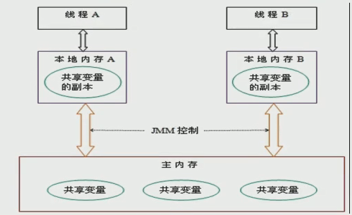
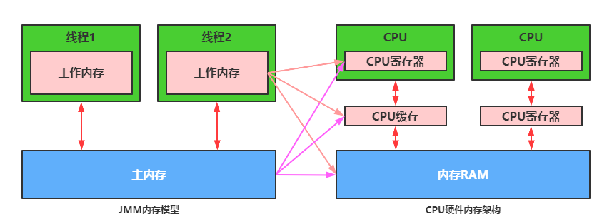

# Java 内存模型

## 计算机结构

## Java 内存模型概念

``JMM(Java内存模型Java Memory Model,简称JMM)``本身是一种``抽象的概念 并不真实存在``。

Java 内存模型是java虚拟机规范中所定义的一种内存模型，是标准化的，屏蔽掉了底层不同计算机的区别。

Java内存模型是一套规范，它描述了Java程序中各种变量(包括实例字段,静态字段和构成数组对象的元素等线程共享变量)的访问规则，以及在JVM中将变量存储到内存和从内存中读取变量这样的底层细节。

JMM有以下规定：

* ``主内存``是所有线程都共享的，所有的共享变量都存储于主内存，这里所说的变量指的是``实例变量和类变量``。不包含局部变量，因为局部变量是线程私有的，因此不存在竞争问题
* 每一个线程还存在自己的``工作内存``，线程的工作内存(有些地方称为栈空间)，工作内存是每个线程的私有数据区域，保留了被线程使用的变量的工作副本
* 线程对变量的所有操作（读，取）都必须在工作内存中完成，而不能直接读写主内存中的变量
* 不同线程之间也不能直接访问对方工作内存中的变量，线程间变量的值的传递需要通过主内存中转来完成

JMM关于同步规定:

1.线程解锁前,必须把共享变量的值刷新回主内存

2.线程加锁前,必须读取主内存的最新值到自己的工作内存

3.加锁解锁是同一把锁 

## Java内存模型作用

Java内存模型是一套在多线程读写共享数据时，对共享数据的可见性、有序性、和原子性的规则保障。 

synchronized,volatile

## 计算机结构和 JMM 的关系

通过对前面的CPU硬件内存架构、Java内存模型以及Java多线程的实现原理的了解，我们应该已经意识到，多线程的执行最终都会映射到硬件处理器上进行执行。 

但Java内存模型和硬件内存架构并不完全一致。对于硬件内存来说只有寄存器、缓存内存、主内存的概念，并没有工作内存和主内存之分，也就是说Java内存模型对内存的划分对硬件内存并没有任何影响，因为JMM只是一种抽象的概念，是一组规则，不管是工作内存的数据还是主内存的数据，对于计算机硬件来说都会存储在计算机主内存中，当然也有可能存储到CPU缓存或者寄存器中，因此总体上来说， Java内存模型和计算机硬件内存架构是一个相互交叉的关系，是一种抽象概念划分与真实物理硬件的交叉。 

## 主内存与工作内存之间的交互

Java内存模型中定义了以下8种操作来完成，主内存与工作内存之间具体的交互协议，即一个变量如何从主内存拷贝到工作内存、如何从工作内存同步回主内存之类的实现细节，虚拟机实现时必须保证下面提及的每一种操作都是原子的、不可再分的。 

对应如下的流程图：

注意: 

1. 如果对一个变量执行lock操作，将会清空工作内存中此变量的值 

2. 对一个变量执行unlock操作之前，必须先把此变量同步到主内存中 

主内存与工作内存之间的数据交互过程：

lock -> read -> load -> use -> assign -> store -> write -> unlock