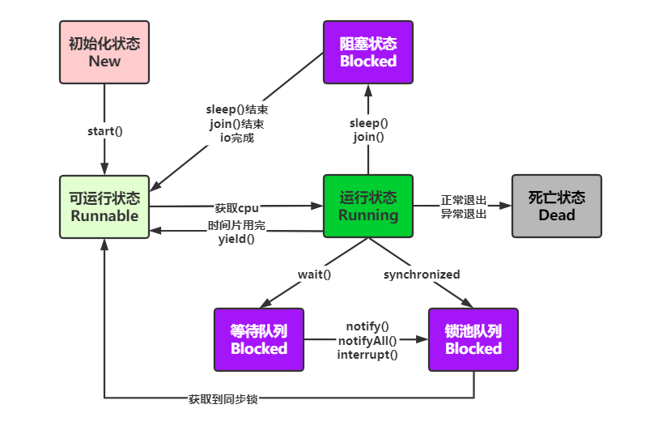
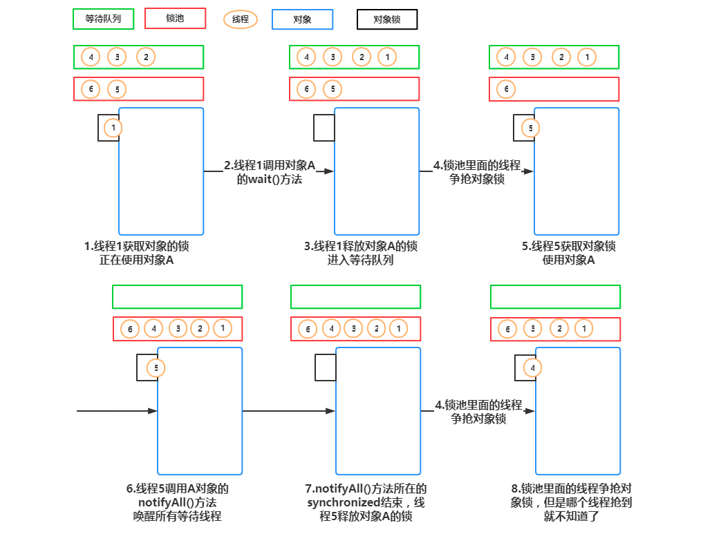

# Java 线程状态

## 线程状态图



众所周知，Java的线程状态有5种，分别对应上图中五种不同颜色，下面对这5种状态及状态间的转化做相应的解释：

* `初始化状态`：新建一个线程对象

* `可运行状态`：其他线程调用了该线程对象的start()方法。该状态的线程位于可运行线程池中，变得可运行，等待获取CPU的使用权

* `运行状态`：可运行状态的线程获得了cpu 时间片（timeslice），执行程序代码

* `阻塞状态`：线程因为某种原因放弃CPU使用权，暂时停止运行。直到线程再次进入可运行状态，才有机会转到运行状态。如图所示，会有三种不同类型的阻塞状态：

  - `等待阻塞`：运行中的线程执行wait()方法，线程会进入等待队列中。等待notify()、notifyAll()或interrupt()对其唤醒或中断

  - `同步阻塞`：运行中的线程执行在获取同步锁（注：只有synchronized这种方式的锁（monitor锁）才会让线程出现BLOCKED状态，等待ReentrantLock则不会）时，若该锁已被其他线程占用，线程则会进入锁池队列。等待获取到锁

  - `其他阻塞`：运行的线程执行sleep()、join()，或触发了I/O请求，该该线程被置为阻塞状态。当sleep()状态超时、join()等待线程终止或超时、I/O处理完成，线程会重新进入可运行状态。

* `死亡状态`：线程执行完或因异常退出run()方法，线程生命周期结束

##  等待队列和锁池

``等待队列`` 和 ``锁池`` 都和wait()、notify()、synchronized有关，wait()和notify()又必须由对象调用且必须写在synchronized同步代码块内。

1. 等待队列（等待被唤醒）：对应等待阻塞。调用obj的wait()方法，则进入等待队列

2. 锁池（等待抢锁）：对应同步阻塞。

   a) 当前running线程调用对象obj的同步方法时，发现锁被其他线程持有，则直接进入锁池。

   b) 当前等待队列中阻塞的线程A，等待被线程B唤醒，唤醒后并非直接进去runnable状态，而是进入线程A所对应的锁池中，等待抢到锁。

 下图直观描绘了running -> 等待队列 -> 锁池 -> runnable间的状态流转，帮助理解：



## Thread.State 枚举类

JDK源码中Thread类，会发现里面有定义State的枚举，枚举中有：NEW、RUNNABLE、BLOCKED、WAITING、TIMED_WAITING、TERMINATED。由于线程中的初始化和死亡状态很短，我们不用太关心，runnable状态暂无歧义。我们只针对BLOCKED、WAITING、TIMED_WAITING三种可能混淆的状态进行分析 。

```java
public enum State {
    NEW,
    RUNNABLE,
    /**
    * Thread state for a thread blocked waiting for a monitor lock.
    * A thread in the blocked state is waiting for a monitor lock to enter a synchronized block/method 
    * or
    * reenter a synchronized block/method after calling
    */
    // 受阻塞并且正在等待monitor锁的某一线程的线程状态
    BLOCKED,
    // 某一等待线程的线程状态
    WAITING,
    // 具有指定等待时间的某一等待线程的线程状态
    TIMED_WAITING,
    TERMINATED;
}
```

* `BLOCKED`场景：
  - 某一线程在等待monitor lock，比如在等待执行synchronized代码块/方法，进入了锁池阻塞状态；
  - 在synchronized块/方法中wait 之后重进入（reenter）同步块时，也就是线程在等待进入临界区。
* `WAITING`场景：某一线程因为调用下列方法之一而处于等待状态：
- 不带超时值的 Object.wait()
  
- 不带超时值的 Thread.join()
  
- LockSupport.park 分析：既有可能进入等待队列，也有可能进入其他阻塞的阻塞状态
* `TIMED_WAITING`场景：某一线程因为调用以下带有指定正等待时间的方法之一而处于定时等待状态：

  - Thread.sleep(long millis)

  - 带有超时值的 Object.wait()

  - 带有超时值的 Thread.join()

  - LockSupport.parkNanos()

  - LockSupport.parkUntil() 分析：既有可能进入等待队列，也有可能进入其他阻塞的阻塞状态。和WAITING区别在于是否指定时间

## 并发编程中常用API的理解

### obj.wait() 或 obj.wait(long timeout) 

JDK中一共提供了这三个版本的方法：

（1）wait()方法的作用是将当前运行的线程挂起（即让其进入阻塞状态），直到notify或notifyAll方法来唤醒线程.

（2）wait(long timeout)，该方法与wait()方法类似，唯一的区别就是在指定时间内，如果没有notify或notifAll方法的唤醒，也会自动唤醒。

（3）至于wait(long timeout,long nanos)，本意在于更精确的控制调度时间，不过从目前版本来看，该方法貌似没有完整的实现该功能，其源码(JDK1.8)如下：

```java
public final void wait(long timeout, int nanos) throws InterruptedException {
    if (timeout < 0) {
        throw new IllegalArgumentException("timeout value is negative");
    }
    if (nanos < 0 || nanos > 999999) {
        throw new IllegalArgumentException(
                            "nanosecond timeout value out of range");
    }
    if (nanos > 0) {
        timeout++;
    }
    wait(timeout);
}
```

 wait方法是一个本地方法，其底层是通过一个叫做监视器锁的对象来完成的。 所以wait方法的使用必须在同步的范围内，否则就会抛出`IllegalMonitorStateException`异常 。

#### 虚假唤醒

并发编程中为什么使用while循环而不是if()来调用wait方法？

当其他获取到该对象锁的线程释放锁时，上面的线程有可能被意外唤醒，但是此时上面线程是不满足条件的，导致它破坏了被锁保护的约束关系，引起意外后果。 用while()方法，就会再次判断条件是不是成立，满足执行条件了，才会继续执行；而if会直接唤醒wait()方法，继续往下执行，不管被notify或notifyAll唤醒的是不是它，而极有可能，此时并不满足if的判断条件，就是JDK文档中所谓的“虚假唤醒”。 

### obj.notify()/obj.notifyAll()

 wait方式是通过对象的monitor对象来实现的，所以只要在同一对象上去调用notify/notifyAll方法，就可以唤醒对应对象monitor上等待的线程了。notify和notifyAll的区别在于前者只能唤醒monitor上的一个线程，对其他线程没有影响，而notifyAll则唤醒所有的线程，看下面的例子很容易理解这两者的差别： 

```java
public class NotifyTest {
    public synchronized void testWait() {
        System.out.println(Thread.currentThread().getName() + "Start------");
        try {
            wait();
        } catch (InterruptedException e) {
            e.printStackTrace();
        }
        System.out.println(Thread.currentThread().getName() + "End------");
    }

    public static void main(String[] args) throws InterruptedException {
        final NotifyTest test = new NotifyTest();
        for (int i = 0; i < 5; i++) {
            new Thread(() -> test.testWait()).start();
        }
        Thread.sleep(500);
        synchronized (test) {
            test.notify();
        }
        Thread.sleep(3000);
        System.out.println("----------------------------------");
        synchronized (test) {
            test.notifyAll();
        }
    }
}
Thread-0Start------
Thread-2Start------
Thread-1Start------
Thread-3Start------
Thread-4Start------
Thread-0End------
----------------------------------
Thread-4End------
Thread-3End------
Thread-1End------
Thread-2End------
```

最后，有两点点需要注意：

1. 调用wait方法后，线程是会释放对monitor对象的所有权的。

2. 一个通过wait方法阻塞的线程，必须同时满足以下两个条件才能被真正执行：

   * 线程需要被唤醒（超时唤醒或调用notify/notifyll）。

   * 线程唤醒后需要竞争到锁（monitor）。

### Thread.sleep(long millis)

Thread.sleep() 方法的作用是让当前线程暂停指定的时间（毫秒）， 使当前线程进入阻塞状态（其他阻塞），但不释放任何锁资源，一定时间后线程自动进入runnable状态。给其它线程执行机会的最佳方式 。

唯一需要注意的是其与wait方法的区别。最简单的区别是，wait方法依赖于同步，而sleep方法可以直接调用。而更深层次的区别在于``sleep方法只是暂时让出CPU的执行权，并不释放锁。而wait方法则需要释放锁``。

```java
public class SleepTest {
    public synchronized void sleepMethod() {
        System.out.println(Thread.currentThread().getName() + "Sleep start ------");
        try {
            Thread.sleep(1000);
        } catch (InterruptedException e) {
            e.printStackTrace();
        }
        System.out.println(Thread.currentThread().getName() + "Sleep end ------");
    }

    public synchronized void waitMethod() {
        System.out.println(Thread.currentThread().getName() + "Wait start ------");
        try {
            wait(1000);
        } catch (InterruptedException e) {
            e.printStackTrace();
        }
        System.out.println(Thread.currentThread().getName() + "Wait end ------");
    }

    public static void main(String[] args) throws InterruptedException {
        final SleepTest test = new SleepTest();

        for (int i = 0; i < 3; i++) {
            new Thread(() -> test.sleepMethod()).start();
        }


        Thread.sleep(5000);
        System.out.println("--------------------");

        final SleepTest test2 = new SleepTest();

        for(int i = 0;i < 3;i++){
            new Thread(() -> test2.waitMethod()).start();
        }

    }
}
Thread-0Sleep start ------
Thread-0Sleep end ------
Thread-2Sleep start ------
Thread-2Sleep end ------
Thread-1Sleep start ------
Thread-1Sleep end ------
--------------------
Thread-3Wait start ------
Thread-5Wait start ------
Thread-4Wait start ------
Thread-5Wait end ------
Thread-3Wait end ------
Thread-4Wait end ------
```

### Thread.yield()

yield暂停当前线程，以便其他线程有机会执行，不过不能指定暂停的时间，并且也不能保证当前线程马上停止。yield方法只是将Running状态转变为Runnable状态 ，放弃cpu使用权，让cpu再次选择要执行的线程。 

 yield仅仅是让其它具有同等优先级的runnable线程获取执行权，但并不能保证其它具有同等优先级的线程就一定能获得cpu执行权。因为做出让步的当前线程，可能会被cpu再次选中，进入running状态。yield()不会导致阻塞。 

```java
public class YieldTest implements Runnable {

    @Override
    public void run() {
        try {
            Thread.sleep(100);
        } catch (InterruptedException e) {
            e.printStackTrace();
        }
        for (int i = 1; i <= 5; i++) {
            System.out.println(Thread.currentThread().getName() + ": " + i);
            Thread.yield();
        }
    }

    public static void main(String[] args) {
        YieldTest test = new YieldTest();
        Thread t1 = new Thread(test, "FirstThread");
        Thread t2 = new Thread(test, "SecondThread");

        t1.start();
        t2.start();
    }
}
```

 这个例子就是通过yield方法来实现两个线程的交替执行。不过请注意：这种交替并不一定能得到保证。

### t.join() 或 t.join(long millis) 

当前线程A执行过程中，调用B线程的join方法，使当前线程进入阻塞状态（其他阻塞），但不释放对象锁，等待B线程执行完后或一定时间millis后，A线程进入runnable状态。 

 JDK中提供三个版本的join方法，其实现与wait方法类似，join()方法实际上执行的join(0)，而join(long millis, int nanos)也与wait(long millis, int nanos)的实现方式一致 ：

```java
public final synchronized void join(long millis)
throws InterruptedException {
    long base = System.currentTimeMillis();
    long now = 0;
    if (millis < 0) {
        throw new IllegalArgumentException("timeout value is negative");
    }
    if (millis == 0) {
        while (isAlive()) {
            wait(0);
        }
    } else {
        while (isAlive()) {
            long delay = millis - now;
            if (delay <= 0) {
                break;
            }
            wait(delay);
            now = System.currentTimeMillis() - base;
        }
    }
}

public final synchronized void join(long millis, int nanos)
throws InterruptedException {
    if (millis < 0) {
        throw new IllegalArgumentException("timeout value is negative");
    }
    if (nanos < 0 || nanos > 999999) {
        throw new IllegalArgumentException(
                            "nanosecond timeout value out of range");
    }
    if (nanos >= 500000 || (nanos != 0 && millis == 0)) {
        millis++;
    }
    join(millis);
}
```

看一下join(long millis)方法的实现，可以看出join方法就是通过wait方法来将线程的阻塞，如果join的线程还在执行，则将当前线程阻塞起来，直到join的线程执行完成，当前线程才能执行。不过有一点需要注意，这里的join只调用了wait方法，却没有对应的notify方法，原因是Thread的start方法中做了相应的处理，所以当join的线程执行完成以后，会自动唤醒主线程继续往下执行。 

```java
public class JoinTest {
    public static void main(String[] args) throws InterruptedException {
        for (int i = 1; i <= 5; i++) {
            Thread t = new Thread(() -> {
                System.out.println(Thread.currentThread().getName() + " start------");
                try {
                    Thread.sleep(1000);
                } catch (InterruptedException e) {
                    e.printStackTrace();
                }
                System.out.println(Thread.currentThread().getName() + " end------");
            }, "线程" + i);
            t.start();
            t.join();
        }
        System.out.println("Finished~~~");
    }
}
```

对比两段代码的执行结果很容易发现，在没有使用join方法之间，线程是并发执行的，而使用join方法后，所有线程是顺序执行的。 


