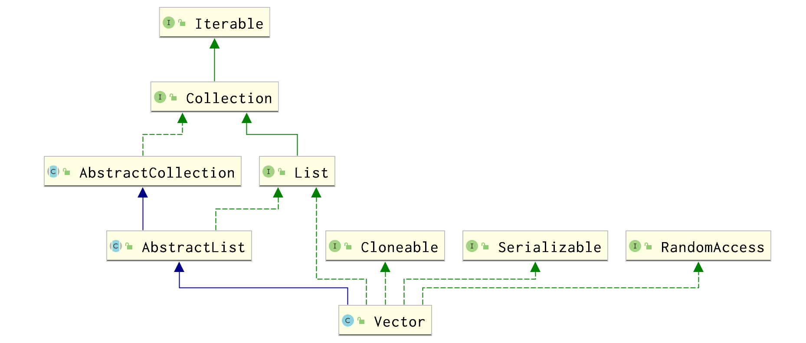

## 集合类不安全

```java
/**
 * 集合类是不安全的
 * 1. 故障现象 java.util.ConcurrentModificationException
 * 2. 解决方案
 *  Vector
 *  Collections.synchronizedList(new ArrayList<>())
 *  new CopyOnWriteArrayList<>()
 */
public class NotSafeDemo {
    public static void main(String[] args) {
        List<String> list = new CopyOnWriteArrayList<>();
        //Collections.synchronizedList(new ArrayList<>());
        //new Vector<>(); 
        //new ArrayList<>();

        for (int i = 1; i <= 30; i++) {
            new Thread(() -> {
                list.add(UUID.randomUUID().toString().substring(0, 8));
                System.out.println(list);
            }, String.valueOf(i)).start();
        }
    }
}
```

ArrayList在迭代的时候如果同时对其进行修改就会抛出``java.util.ConcurrentModificationException``异常并发修改异常。

```java
// 看ArrayList的源码 
public boolean add( E  e) {
  ensureCapacityInternal( size  +  1 );   // Increments modCount!!
  elementData [ size ++] = e;
  return true ;
} 
// 没有 synchronized 线程不安全 
```

### Vector

```java
// 看Vector的源码 
public synchronized boolean add( E  e) {
  modCount ++;
  ensureCapacityHelper( elementCount  +  1 );
  elementData [ elementCount ++] = e;
  return true ;
} 
//有 synchronized 线程安全 
```



### Collections


Collections提供了方法 *synchronizedList*保证*list*是同步线程安全的。

那*HashMap*，*HashSet*是线程安全的吗？也不是，所以有同样的线程安全方法。

### 写时复制

不加锁性能提升出错误，加锁数据一致性能下降。

> A thread-safe variant of ArrayList in which all mutative operations (add, set, and so on) are implemented by making a fresh copy of the underlying array. 

CopyOnWriteArrayList是arraylist的一种线程安全变体， 其中所有可变操作（add、set等）都是通过生成底层数组的新副本来实现的。 

```java
/**
 * Appends the specified element to the end of this list.
 *
 * @param e element to be appended to this list
 * @return {@code true} (as specified by {@link Collection#add})
 */
public boolean add(E e) {
    final ReentrantLock lock = this.lock;
    lock.lock();
    try {
        Object[] elements = getArray();
        int len = elements.length;
        Object[] newElements = Arrays.copyOf(elements, len + 1);
        newElements[len] = e;
        setArray(newElements);
        return true;
    } finally {
        lock.unlock();
    }
}
```

*CopyOnWrite*容器即写时复制的容器。往一个容器添加元素的时候，不直接往当前容器*Object[]*添加，而是先将当前容器*Object[]*进行*Copy*，复制出一个新的容器*Object[] newElements*，然后向新的容器*Object[] newElements*里添加元素。添加元素后，再将原容器的引用指向新的容器*setArray(newElements)*。
这样做的好处是可以对*CopyOnWrite*容器进行并发的读，而不需要加锁，因为当前容器不会添加任何元素。所以*CopyOnWrite*容器也是一种读写分离的思想，读和写不同的容器。 

#### HashSet

```java
Set<String> set = new HashSet<>();//线程不安全 
Set<String> set = new CopyOnWriteArraySet<>();//线程安全
```

 HashSet底层数据结构是什么？ 

HashMap

但HashSet的add是放一个值，而HashMap是放K、V键值对 

```java
public HashSet() {
   map = new HashMap<>();
} 
private static final Object PRESENT = new Object(); 

public boolean add( E e) {
   return map.put(e, PRESENT)==null;
} 
```

#### HashMap

```java
Map<String,String> map =  new  HashMap<>();//线程不安全 
Map<String,String> map =  new  ConcurrentHashMap<>();//线程安全
```

