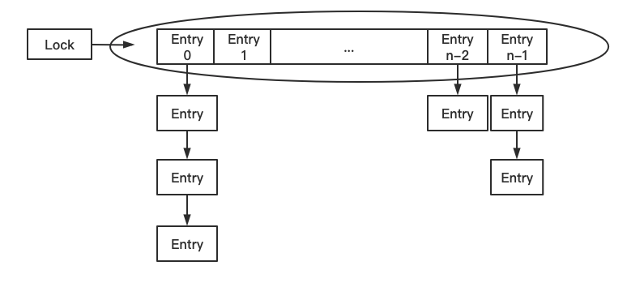

# synchronized

## 1 synchronized 保证三大特性

### 1.1 synchronized 与原子性

```java
/**
* 5个线程各执行1000次 i++
*/
public class AtomicityTest {

    private static int number;
    private static Object obj = new Object();

    public static void add() {
        synchronized (obj) {
            number++;
        }
    }

    public static void main(String[] args) throws InterruptedException {
        for (int i = 0; i < 5; i++) {
            new Thread(() -> {
                for (int j = 0; j < 1000; j++) {
                    add();
                }
            }).start();
        }
        Thread.sleep(2000);
        System.out.println(number);
    }
}
```


**synchronized 保证原子性的原理**

对 number++ 增加 synchronized 同步后，`保证被它修饰的方法或者代码块在任意时刻只能有一个线程`进入同步代码操作 number++，就不会出现安全问题。

### 1.2 synchronized 与可见性

```java
public class VisibilityTest {
    private static boolean flag = true;

    public static void main(String[] args) throws InterruptedException {
        new Thread(() -> {
            while (flag) {
                // 增加对象共享数据的打印，println是同步方法 
                try {
                    Thread.sleep(500);
                } catch (InterruptedException e) {
                    e.printStackTrace();
                }
                System.out.println("flag = " + flag);
                // System.out.println 源码
                /* public void println(String x) {
                    synchronized (this) {
                        print(x);
                        newLine();
                    }
                } */
            }
        }).start();

        Thread.sleep(2000);

        new Thread(() -> {
            flag = false;
            System.out.println("线程修改了变量的值为false");
        }).start();
    }
}
```

synchronized 保证可见性的原理，执行 synchronized 时，会对应 lock 原子操作会`刷新工作内存中共享变量`的值(参考 Java 内存模型 -- 主内存与工作内存之间的交互)。

### 1.3 synchronized 与有序性

synchronized 保证有序性的原理，我们加 synchronized 后，依然会发生重排序，只不过，我们有同步代码块，可以`保证只有一个线程执行同步代码中的代码`，保证有序性。

## 2 synchronized 的特性

### 2.1 可重入特性

一个线程可以多次执行synchronized，重复获取同一把锁。

```java
public class ReentrantDemo {
    public static void main(String[] args) {
        new MyThread().start();
        new MyThread().start();
    }

    static void test() {
        synchronized (MyThread.class) {
            System.out.println(Thread.currentThread().getName() + "进入了同步代码块2");
        }
    }
}

class MyThread extends Thread {
    @Override
    public void run() {
        synchronized (MyThread.class) {
            System.out.println(getName() + "进入了同步代码块1");
            ReentrantDemo.test();
          	/* synchronized (MyThread.class) {
            		System.out.println(getName() + "进入了同步代码块2");
        		} */
        }
    }
}
```

可重入原理：synchronized 的锁对象中有一个计数器（recursions变量）会记录线程获得几次锁。

可重入的好处：

1. 可以避免死锁

2. 可以让我们更好的来封装代码

synchronized 是可重入锁，内部锁对象中会有一个计数器记录线程获取几次锁啦，在执行完同步代码块时，计数器的数量会 -1，知道计数器的数量为 0，就释放这个锁。

### 2.2 不可中断特性

一个线程获得锁后，另一个线程想要获得锁，必须处于阻塞或等待状态，如果第一个线程不释放锁，第二个线程就会一直阻塞或等待（不可被中断）。

#### synchronized 不可中断

synchronized 是不可中断，`处于阻塞状态的线程会一直等待锁`。

```java
public class Uninterruptible {

    public synchronized void test() {
        System.out.println(Thread.currentThread().getName() + "进入同步代码块");
        try {
            Thread.sleep(88888);
        } catch (InterruptedException e) {
            e.printStackTrace();
        }
    }

    public static void main(String[] args) throws InterruptedException {
        Uninterruptible u = new Uninterruptible();
        Thread t1 = new Thread(() -> u.test());
        t1.start();
        Thread.sleep(1000);
        Thread t2 = new Thread(() -> u.test());
        t2.start();

        System.out.println("停止线程前");
        t2.interrupt();
        System.out.println("停止线程前");

        Thread.sleep(1000);
        System.out.println(t1.getState());
        System.out.println(t2.getState());
    }
}
```

#### ReentrantLock 可中断

```java
public class InterruptibleLock {

    private static Lock lock = new ReentrantLock();

    public void test01() {
        // Lock 不可中断
        //lock.lock();
        boolean b = false;
        try {
            b = lock.tryLock(3, TimeUnit.SECONDS);
            // Lock 可中断
            if (b) {
                System.out.println(Thread.currentThread().getName() + "获得了锁");
                Thread.sleep(88888);
            } else {
                System.out.println(Thread.currentThread().getName() + "在指定时间没获得了锁做其他操作");
            }
        } catch (InterruptedException e) {
            e.printStackTrace();
        } finally {
            if (b) {
                lock.unlock();
            }
        }
    }

    public static void main(String[] args) throws InterruptedException {
        InterruptibleLock i = new InterruptibleLock();
        Thread t1 = new Thread(() -> i.test01());
        t1.start();
        Thread.sleep(1000);
        Thread t2 = new Thread(() -> i.test01());
        t2.start();

//        System.out.println("停止线程前");
//        t2.interrupt();
//        System.out.println("停止线程前");
//
//        Thread.sleep(1000);
//        System.out.println(t1.getState());
//        System.out.println(t2.getState());
    }

}
```

Lock 的 lock 方法是不可中断的

Lock 的 `tryLock` 方法是`可中断`的

## 3 synchronized 原理

### 3.1 javap 反汇编

```java
// javac Demo01.java
// javap -c Demo01
public class Demo01 {
    private static Object obj = new Object();

    public static void main(String[] args) {
        synchronized (obj) {
            System.out.println("b");
        }
    }

    public synchronized void test() {
        System.out.println("a");
    }
}
```

```java
{
  private static java.lang.Object obj;
    descriptor: Ljava/lang/Object;
    flags: ACC_PRIVATE, ACC_STATIC

  public com.juc.sync.Demo01();
    descriptor: ()V
    flags: ACC_PUBLIC
    Code:
      stack=1, locals=1, args_size=1
         0: aload_0
         1: invokespecial #1                  // Method java/lang/Object."<init>":()V
         4: return
      LineNumberTable:
        line 3: 0
      LocalVariableTable:
        Start  Length  Slot  Name   Signature
            0       5     0  this   Lcom/juc/sync/Demo01;

  public static void main(java.lang.String[]);
    descriptor: ([Ljava/lang/String;)V
    flags: ACC_PUBLIC, ACC_STATIC
    Code:
      stack=2, locals=3, args_size=1
         0: getstatic     #2                  // Field obj:Ljava/lang/Object;
         3: dup
         4: astore_1
         5: monitorenter
         6: getstatic     #3                  // Field java/lang/System.out:Ljava/io/PrintStream;
         9: ldc           #4                  // String b
        11: invokevirtual #5                  // Method java/io/PrintStream.println:(Ljava/lang/String;)V
        14: aload_1
        15: monitorexit
        16: goto          24
        19: astore_2
        20: aload_1
        21: monitorexit
        22: aload_2
        23: athrow
        24: return
      Exception table:
         from    to  target type
             6    16    19   any
            19    22    19   any
      LineNumberTable:
        line 7: 0
        line 8: 6
        line 9: 14
        line 10: 24
      LocalVariableTable:
        Start  Length  Slot  Name   Signature
            0      25     0  args   [Ljava/lang/String;
      StackMapTable: number_of_entries = 2
        frame_type = 255 /* full_frame */
          offset_delta = 19
          locals = [ class "[Ljava/lang/String;", class java/lang/Object ]
          stack = [ class java/lang/Throwable ]
        frame_type = 250 /* chop */
          offset_delta = 4

  public synchronized void test();
    descriptor: ()V
    flags: ACC_PUBLIC, ACC_SYNCHRONIZED
    Code:
      stack=2, locals=1, args_size=1
         0: getstatic     #3                  // Field java/lang/System.out:Ljava/io/PrintStream;
         3: ldc           #6                  // String a
         5: invokevirtual #5                  // Method java/io/PrintStream.println:(Ljava/lang/String;)V
         8: return
      LineNumberTable:
        line 13: 0
        line 14: 8
      LocalVariableTable:
        Start  Length  Slot  Name   Signature
            0       9     0  this   Lcom/juc/sync/Demo01;

  static {};
    descriptor: ()V
    flags: ACC_STATIC
    Code:
      stack=2, locals=0, args_size=0
         0: new           #7                  // class java/lang/Object
         3: dup
         4: invokespecial #1                  // Method java/lang/Object."<init>":()V
         7: putstatic     #2                  // Field obj:Ljava/lang/Object;
        10: return
      LineNumberTable:
        line 4: 0
}
```

#### 3.1.1 monitorenter

> Each object is associated with a monitor. A monitor is locked if and only if it has an owner. The thread that executes monitorenter attempts to gain ownership of the monitorassociated with objectref， as follows: 
>
> • If the entry count of the monitor associated with objectref is zero， the thread enters the monitor and sets its entry count to one. The thread is then the owner of the monitor. 
>
> • If the thread already owns the monitor associated with objectref， it reenters the monitor， incrementing its entry count. 
>
> • If another threadalready owns the monitor associated with objectref， the thread blocks until the monitor's entry count is zero， then tries again to gain ownership.

``每一个对象都会和一个监视器 monitor (它才是真正的锁对象)关联``。监视器被占用时会被锁住，其他线程无法来获取该 monitor。 当 JVM 执行某个线程的某个方法内部的 monitorenter 时，它会尝试去获取当前对象对应的 monitor 的所有权。其过程如下：

1. 若 monior 的进入数为 0，线程可以进入 monitor，并将 monitor 的进入数置为1。``当前线程成为 monitor 的 owner``（所有者）

2. 若线程已拥有 monitor 的所有权，允许它重入 monitor，则进入 monitor 的进入数加 1 

3. 若其他线程已经占有 monitor 的所有权，那么当前尝试获取 monitor 的所有权的线程会被阻塞，直到 monitor 的进入数变为 0，才能重新尝试获取 monitor 的所有权。

synchronized 的锁对象会关联一个 monitor，这个 monitor 不是我们主动创建的，是 JVM 的线程执行到这个同步代码块，发现锁对象没有 monitor 就会创建 monitor，当一个线程拥有 monitor 后其他线程只能等待。

monitor 内部有两个重要的成员变量：

``owner`` 拥有这把锁的线程

``recursions`` 会记录线程拥有锁的次数

#### 3.1.2 monitorexit

> The thread that executes monitorexit must be the owner of the monitor associated with the instance referenced by objectref. 
>
> The thread decrements the entry count of the monitor associated with objectref. If as a result the value of the entry count is zero， the thread exits the monitor and is no longer its owner. Other threads that are blocking to enter the monitor are allowed to attempt to do so.

1. 能执行 monitorexit 指令的线程一定是拥有当前对象的 monitor 的所有权的线程

2. 执行 monitorexit 时会将 monitor 的进入数减 1。当 monitor 的进入数减为 0 时，当前线程退出 monitor，不再拥有 monitor 的所有权，此时其他被这个 monitor 阻塞的线程可以尝试去获取这个 monitor 的所有权

monitorexit 释放锁。

monitorexit 插入在方法结束处和异常处，JVM 保证每个 monitorenter 必须有对应的 monitorexit。

##### synchroznied 出现异常会释放锁

从反编译代码可以看到：

```java
Exception table:
         from    to  target type
             6    16    19   any
            19    22    19   any
```

反编译代码的第 6 行到第 16 行如果出现异常会执行第 19 行代码，19 行到 22 行如果出现异常，会执行第 19 行代码，22 行代码为 monitorexit，所以无论如何都会释放锁。

#### 3.1.3 同步方法

从反编译代码中可以看到同步方法在反汇编后，会增加 ``ACC_SYNCHRONIZED`` 修饰。会隐式调用 monitorenter 和 

monitorexit。在执行同步方法前会调用 monitorenter，在执行完同步方法后会调用 monitorexit。

### 3.2 深入 JVM 源码

JVM 源码下载：http://openjdk.java.net/ --> Mercurial --> jdk8 --> hotspot --> zip

#### 3.2.1 monitor 监视器锁

在 HotSpot 虚拟机中，monitor 是由 ObjectMonitor 实现的。其源码是用 c++ 来实现的，位于 HotSpot 虚拟机源码 ObjectMonitor.hpp 文件中(src/share/vm/runtime/objectMonitor.hpp)。ObjectMonitor 主要数据结构如下：

```c++
ObjectMonitor() {
  _header       = NULL;
  _count        = 0;
  _waiters      = 0,
  _recursions   = 0;			// 线程的重入次数
  _object       = NULL;		// 存储该monitor的对象
  _owner        = NULL;		// 标识拥有该monitor的线程
  _WaitSet      = NULL;		// 处于wait状态的线程，会被加入到_WaitSet
  _WaitSetLock  = 0 ;
  _Responsible  = NULL ;
  _succ         = NULL ;
  _cxq          = NULL ;	// 多线程竞争锁时的单向列表
  FreeNext      = NULL ;	// 处于等待锁block状态的线程
  _EntryList    = NULL ;
  _SpinFreq     = 0 ;
  _SpinClock    = 0 ;
  OwnerIsThread = 0 ;
  _previous_owner_tid = 0;
}
```

1. _owner：初始时为NULL。当有线程占有该monitor时，owner标记为该线程的唯一标识。当线程释放monitor时，owner又恢复为NULL。owner是一个临界资源，JVM是通过CAS操作来保证其线程安全的。

2. _cxq：竞争队列，所有请求锁的线程首先会被放在这个队列中（单向链接）。_cxq是一个临界资源，JVM通过CAS原子指令来修改_cxq队列。修改前_cxq的旧值填入了node的next字段，_cxq指向新值（新线程）。因此_cxq是一个后进先出的stack（栈）。

3. _EntryList：_cxq队列中有资格成为候选资源的线程会被移动到该队列中。

4. _WaitSet：因为调用wait方法而被阻塞的线程会被放在该队列中。

Java代码里不会显示地去创造这么一个monitor对象，我们也无需创建，事实上可以这么理解：monitor并不是随着对象创建而创建的。我们是通过synchronized修饰符告诉JVM需要为我们的某个对象创建关联的monitor对象。每个线程都存在两个ObjectMonitor对象列表，分别为free和used列表。同时JVM中也维护着global locklist。当线程需要ObjectMonitor对象时，首先从线程自身的free表中申请，若存在则使用，若不存在则从global list中申请。

ObjectMonitor的数据结构中包含：_owner、_WaitSet和_EntryList，它们之间的关系转换可以用下图表示：


#### 3.2.2 monitor 竞争

1. 执行monitorenter时，会调用InterpreterRuntime.cpp(位于：src/share/vm/interpreter/interpreterRuntime.cpp) 的 InterpreterRuntime::monitorenter函数。具体代码可参见HotSpot源码。

   ```c++
   IRT_ENTRY_NO_ASYNC(void, InterpreterRuntime::monitorenter(JavaThread* thread, BasicObjectLock* elem))
   #ifdef ASSERT
     thread->last_frame().interpreter_frame_verify_monitor(elem);
   #endif
     if (PrintBiasedLockingStatistics) {
       Atomic::inc(BiasedLocking::slow_path_entry_count_addr());
     }
     Handle h_obj(thread, elem->obj());
     assert(Universe::heap()->is_in_reserved_or_null(h_obj()),
            "must be NULL or an object");
   	// 是否使用偏向锁，JVM可设置的一个参数
     if (UseBiasedLocking) {
       // Retry fast entry if bias is revoked to avoid unnecessary inflation
       ObjectSynchronizer::fast_enter(h_obj, elem->lock(), true, CHECK);
     } else {
       ObjectSynchronizer::slow_enter(h_obj, elem->lock(), CHECK);
     }
     assert(Universe::heap()->is_in_reserved_or_null(elem->obj()),
            "must be NULL or an object");
   #ifdef ASSERT
     thread->last_frame().interpreter_frame_verify_monitor(elem);
   #endif
   IRT_END
   ```

2. 对于重量级锁，monitorenter函数中会调用 ObjectSynchronizer::slow_enter

3. 最终调用 ObjectMonitor::enter（位于：src/share/vm/runtime/objectMonitor.cpp），源码如下：

   ```c++
   void ATTR ObjectMonitor::enter(TRAPS) {
     // The following code is ordered to check the most common cases first
     // and to reduce RTS->RTO cache line upgrades on SPARC and IA32 processors.
     Thread * const Self = THREAD ;
     void * cur ;
   	// 通过CAS操作尝试把monitor的_owner字段设置为当前线程
     cur = Atomic::cmpxchg_ptr (Self, &_owner, NULL) ;
     if (cur == NULL) {
        // Either ASSERT _recursions == 0 or explicitly set _recursions = 0.
        assert (_recursions == 0   , "invariant") ;
        assert (_owner      == Self, "invariant") ;
        // CONSIDER: set or assert OwnerIsThread == 1
        return ;
     }
   	// 线程重入
     if (cur == Self) {
        // TODO-FIXME: check for integer overflow!  BUGID 6557169.
        _recursions ++ ;
        return ;
     }
   	// 如果当前线程是第一次进入该monitor，设置_recursions为1，_owner为当前线程
     if (Self->is_lock_owned ((address)cur)) {
       assert (_recursions == 0, "internal state error");
       _recursions = 1 ;
       // Commute owner from a thread-specific on-stack BasicLockObject address to
       // a full-fledged "Thread *".
       _owner = Self ;
       OwnerIsThread = 1 ;
       return ;
     }
     ...
     {
   		...
       for (;;) {
         jt->set_suspend_equivalent();
         // cleared by handle_special_suspend_equivalent_condition()
         // or java_suspend_self()
   			// 如果获取锁失败，则等待锁的释放
         EnterI (THREAD) ;
   
         if (!ExitSuspendEquivalent(jt)) break ;
   
         //
         // We have acquired the contended monitor, but while we were
         // waiting another thread suspended us. We don't want to enter
         // the monitor while suspended because that would surprise the
         // thread that suspended us.
         //
             _recursions = 0 ;
         _succ = NULL ;
         exit (false, Self) ;
   
         jt->java_suspend_self();
       }
       Self->set_current_pending_monitor(NULL);
     }
   ```

   以上代码的具体流程概括如下：

   1. 通过CAS尝试把monitor的owner字段设置为当前线程。

   2. 如果设置之前的owner指向当前线程，说明当前线程再次进入monitor，即重入锁，执行recursions ++ ，记录重入的次数。

   3. 如果当前线程是第一次进入该monitor，设置recursions为1，_owner为当前线程，该线程成功获得锁并返回。

   4. 如果获取锁失败，则等待锁的释放。

#### 3.2.3 monitor 等待

竞争失败等待调用的是ObjectMonitor对象的EnterI方法（位于：src/share/vm/runtime/objectMonitor.cpp），源码如下所示：

```c++
void ATTR ObjectMonitor::EnterI (TRAPS) {
    Thread * Self = THREAD ;
    assert (Self->is_Java_thread(), "invariant") ;
    assert (((JavaThread *) Self)->thread_state() == _thread_blocked   , "invariant") ;

    // 再次尝试一下
    if (TryLock (Self) > 0) {
        assert (_succ != Self              , "invariant") ;
        assert (_owner == Self             , "invariant") ;
        assert (_Responsible != Self       , "invariant") ;
        return ;
    }

    DeferredInitialize () ;
		// 自旋
    if (TrySpin (Self) > 0) {
        assert (_owner == Self        , "invariant") ;
        assert (_succ != Self         , "invariant") ;
        assert (_Responsible != Self  , "invariant") ;
        return ;
    }
   ...
		// 当前线程被封装成ObjectWaiter对象node，状态设置成ObjectWaiter::TS_CXQ
    ObjectWaiter node(Self) ;
    Self->_ParkEvent->reset() ;
    node._prev   = (ObjectWaiter *) 0xBAD ;
    node.TState  = ObjectWaiter::TS_CXQ ;

    // 通过CAS把node节点push到_cxq列表中
    ObjectWaiter * nxt ;
    for (;;) {
        node._next = nxt = _cxq ;
        if (Atomic::cmpxchg_ptr (&node, &_cxq, nxt) == nxt) break ;

        // Interference - the CAS failed because _cxq changed.  Just retry.
        // As an optional optimization we retry the lock.
        if (TryLock (Self) > 0) {
            assert (_succ != Self         , "invariant") ;
            assert (_owner == Self        , "invariant") ;
            assert (_Responsible != Self  , "invariant") ;
            return ;
        }
    }
		...
    for (;;) {
				// 线程在被挂起前做一下挣扎，看能不能获得到锁
        if (TryLock (Self) > 0) break ;
        assert (_owner != Self, "invariant") ;

        if ((SyncFlags & 2) && _Responsible == NULL) {
           Atomic::cmpxchg_ptr (Self, &_Responsible, NULL) ;
        }

        // park self
        if (_Responsible == Self || (SyncFlags & 1)) {
            TEVENT (Inflated enter - park TIMED) ;
            Self->_ParkEvent->park ((jlong) RecheckInterval) ;
            // Increase the RecheckInterval, but clamp the value.
            RecheckInterval *= 8 ;
            if (RecheckInterval > 1000) RecheckInterval = 1000 ;
        } else {
            TEVENT (Inflated enter - park UNTIMED) ;
          	// 通过park将当前线程挂起，等待被唤醒
            Self->_ParkEvent->park() ;
        }

        if (TryLock(Self) > 0) break ;
      	...
    }
		...
}
```

以上代码的具体流程概括如下：

1. 当前线程被封装成ObjectWaiter对象node，状态设置成ObjectWaiter::TS_CXQ。 

2. 在for循环中，通过CAS把node节点push到_cxq列表中，同一时刻可能有多个线程把自己的node节点push到_cxq列表中。

3. node节点push到_cxq列表之后，通过自旋尝试获取锁，如果还是没有获取到锁，则通过park将当前线程挂起，等待被唤醒。

4. 当该线程被唤醒时，会从挂起的点继续执行，通过 ObjectMonitor::TryLock 尝试获取锁。

#### 3.2.4 monitor 释放

当某个持有锁的线程执行完同步代码块时，会进行锁的释放，给其它线程机会执行同步代码，在HotSpot中，通过退出monitor的方式实现锁的释放，并通知被阻塞的线程，具体实现位于ObjectMonitor的exit方法中。（位于：src/share/vm/runtime/objectMonitor.cpp），源码如下所示：

```c++
void ATTR ObjectMonitor::exit(bool not_suspended, TRAPS) {
   Thread * Self = THREAD ;
   ...
   if (_recursions != 0) {
     _recursions--;        // this is simple recursive enter
     TEVENT (Inflated exit - recursive) ;
     return ;
   }
	 ...
   for (;;) {
			...
      ObjectWaiter * w = NULL ;
      int QMode = Knob_QMode ;
			// qmode = 2:直接绕过EntryList队列，从cxq队列中获取线程用于竞争锁
      if (QMode == 2 && _cxq != NULL) {
          // QMode == 2 : cxq has precedence over EntryList.
          // Try to directly wake a successor from the cxq.
          // If successful, the successor will need to unlink itself from cxq.
          w = _cxq ;
          assert (w != NULL, "invariant") ;
          assert (w->TState == ObjectWaiter::TS_CXQ, "Invariant") ;
          ExitEpilog (Self, w) ;
          return ;
      }
			// qmode == 3:cxq队列插入EntryList尾部
      if (QMode == 3 && _cxq != NULL) {
          // Aggressively drain cxq into EntryList at the first opportunity.
          // This policy ensure that recently-run threads live at the head of EntryList.
          // Drain _cxq into EntryList - bulk transfer.
          // First, detach _cxq.
          // The following loop is tantamount to: w = swap (&cxq, NULL)
          w = _cxq ;
          for (;;) {
             assert (w != NULL, "Invariant") ;
             ObjectWaiter * u = (ObjectWaiter *) Atomic::cmpxchg_ptr (NULL, &_cxq, w) ;
             if (u == w) break ;
             w = u ;
          }
          assert (w != NULL              , "invariant") ;

          ObjectWaiter * q = NULL ;
          ObjectWaiter * p ;
          for (p = w ; p != NULL ; p = p->_next) {
              guarantee (p->TState == ObjectWaiter::TS_CXQ, "Invariant") ;
              p->TState = ObjectWaiter::TS_ENTER ;
              p->_prev = q ;
              q = p ;
          }

          // Append the RATs to the EntryList
          // TODO: organize EntryList as a CDLL so we can locate the tail in constant-time.
          ObjectWaiter * Tail ;
          for (Tail = _EntryList ; Tail != NULL && Tail->_next != NULL ; Tail = Tail->_next) ;
          if (Tail == NULL) {
              _EntryList = w ;
          } else {
              Tail->_next = w ;
              w->_prev = Tail ;
          }

          // Fall thru into code that tries to wake a successor from EntryList
      }
			// qmode == 4:cxq队列插入到EntryList头部
      if (QMode == 4 && _cxq != NULL) {
          // Aggressively drain cxq into EntryList at the first opportunity.
          // This policy ensure that recently-run threads live at the head of EntryList.

          // Drain _cxq into EntryList - bulk transfer.
          // First, detach _cxq.
          // The following loop is tantamount to: w = swap (&cxq, NULL)
          w = _cxq ;
          for (;;) {
             assert (w != NULL, "Invariant") ;
             ObjectWaiter * u = (ObjectWaiter *) Atomic::cmpxchg_ptr (NULL, &_cxq, w) ;
             if (u == w) break ;
             w = u ;
          }
          assert (w != NULL              , "invariant") ;

          ObjectWaiter * q = NULL ;
          ObjectWaiter * p ;
          for (p = w ; p != NULL ; p = p->_next) {
              guarantee (p->TState == ObjectWaiter::TS_CXQ, "Invariant") ;
              p->TState = ObjectWaiter::TS_ENTER ;
              p->_prev = q ;
              q = p ;
          }

          // Prepend the RATs to the EntryList
          if (_EntryList != NULL) {
              q->_next = _EntryList ;
              _EntryList->_prev = q ;
          }
          _EntryList = w ;

          // Fall thru into code that tries to wake a successor from EntryList
      }

      w = _EntryList  ;
      if (w != NULL) {
          // I'd like to write: guarantee (w->_thread != Self).
          // But in practice an exiting thread may find itself on the EntryList.
          // Lets say thread T1 calls O.wait().  Wait() enqueues T1 on O's waitset and
          // then calls exit().  Exit release the lock by setting O._owner to NULL.
          // Lets say T1 then stalls.  T2 acquires O and calls O.notify().  The
          // notify() operation moves T1 from O's waitset to O's EntryList. T2 then
          // release the lock "O".  T2 resumes immediately after the ST of null into
          // _owner, above.  T2 notices that the EntryList is populated, so it
          // reacquires the lock and then finds itself on the EntryList.
          // Given all that, we have to tolerate the circumstance where "w" is
          // associated with Self.
          assert (w->TState == ObjectWaiter::TS_ENTER, "invariant") ;
          ExitEpilog (Self, w) ;
          return ;
      }

      // If we find that both _cxq and EntryList are null then just
      // re-run the exit protocol from the top.
      w = _cxq ;
      if (w == NULL) continue ;

      // Drain _cxq into EntryList - bulk transfer.
      // First, detach _cxq.
      // The following loop is tantamount to: w = swap (&cxq, NULL)
      for (;;) {
          assert (w != NULL, "Invariant") ;
          ObjectWaiter * u = (ObjectWaiter *) Atomic::cmpxchg_ptr (NULL, &_cxq, w) ;
          if (u == w) break ;
          w = u ;
      }
      TEVENT (Inflated exit - drain cxq into EntryList) ;

      assert (w != NULL              , "invariant") ;
      assert (_EntryList  == NULL    , "invariant") ;

      // Convert the LIFO SLL anchored by _cxq into a DLL.
      // The list reorganization step operates in O(LENGTH(w)) time.
      // It's critical that this step operate quickly as
      // "Self" still holds the outer-lock, restricting parallelism
      // and effectively lengthening the critical section.
      // Invariant: s chases t chases u.
      // TODO-FIXME: consider changing EntryList from a DLL to a CDLL so
      // we have faster access to the tail.

      if (QMode == 1) {
         // QMode == 1 : drain cxq to EntryList, reversing order
         // We also reverse the order of the list.
         ObjectWaiter * s = NULL ;
         ObjectWaiter * t = w ;
         ObjectWaiter * u = NULL ;
         while (t != NULL) {
             guarantee (t->TState == ObjectWaiter::TS_CXQ, "invariant") ;
             t->TState = ObjectWaiter::TS_ENTER ;
             u = t->_next ;
             t->_prev = u ;
             t->_next = s ;
             s = t;
             t = u ;
         }
         _EntryList  = s ;
         assert (s != NULL, "invariant") ;
      } else {
         // QMode == 0 or QMode == 2
         _EntryList = w ;
         ObjectWaiter * q = NULL ;
         ObjectWaiter * p ;
         for (p = w ; p != NULL ; p = p->_next) {
             guarantee (p->TState == ObjectWaiter::TS_CXQ, "Invariant") ;
             p->TState = ObjectWaiter::TS_ENTER ;
             p->_prev = q ;
             q = p ;
         }
      }

      // In 1-0 mode we need: ST EntryList; MEMBAR #storestore; ST _owner = NULL
      // The MEMBAR is satisfied by the release_store() operation in ExitEpilog().

      // See if we can abdicate to a spinner instead of waking a thread.
      // A primary goal of the implementation is to reduce the
      // context-switch rate.
      if (_succ != NULL) continue;

      w = _EntryList  ;
      if (w != NULL) {
          guarantee (w->TState == ObjectWaiter::TS_ENTER, "invariant") ;
          ExitEpilog (Self, w) ;
          return ;
      }
   }
}
```

1. 退出同步代码块时会让_recursions减1，当_recursions的值减为0时，说明线程释放了锁。

2. 根据不同的策略（由QMode指定），从cxq或EntryList中获取头节点，通过ObjectMonitor::ExitEpilog 方法唤醒该节点封装的线程，唤醒操作最终由unpark完成，实现如下：

   ```c++
   void ObjectMonitor::ExitEpilog (Thread * Self, ObjectWaiter * Wakee) {
      assert (_owner == Self, "invariant") ;
   
      // Exit protocol:
      // 1. ST _succ = wakee
      // 2. membar #loadstore|#storestore;
      // 2. ST _owner = NULL
      // 3. unpark(wakee)
   
      _succ = Knob_SuccEnabled ? Wakee->_thread : NULL ;
      ParkEvent * Trigger = Wakee->_event ;
   
      // Hygiene -- once we've set _owner = NULL we can't safely dereference Wakee again.
      // The thread associated with Wakee may have grabbed the lock and "Wakee" may be
      // out-of-scope (non-extant).
      Wakee  = NULL ;
   
      // Drop the lock
      OrderAccess::release_store_ptr (&_owner, NULL) ;
      OrderAccess::fence() ;                               // ST _owner vs LD in unpark()
   
      if (SafepointSynchronize::do_call_back()) {
         TEVENT (unpark before SAFEPOINT) ;
      }
   
      DTRACE_MONITOR_PROBE(contended__exit, this, object(), Self);
      Trigger->unpark() ; // 唤醒之前被pack()挂起的线程
   
      // Maintain stats and report events to JVMTI
      if (ObjectMonitor::_sync_Parks != NULL) {
         ObjectMonitor::_sync_Parks->inc() ;
      }
   }
   ```

   被唤醒的线程，会回到 void ATTR ObjectMonitor::EnterI (TRAPS) 的第600行，继续执行monitor的竞争。

   ```c++
   // park self
   if (_Responsible == Self || (SyncFlags & 1)) {
       TEVENT (Inflated enter - park TIMED) ;
       Self->_ParkEvent->park ((jlong) RecheckInterval) ;
       // Increase the RecheckInterval, but clamp the value.
       RecheckInterval *= 8 ;
       if (RecheckInterval > 1000) RecheckInterval = 1000 ;
   } else {
       TEVENT (Inflated enter - park UNTIMED) ;
       Self->_ParkEvent->park() ;
   }
   if (TryLock(Self) > 0) break ;
   ```

#### 3.2.5 monitor 重量级锁

可以看到ObjectMonitor的函数调用中会涉及到Atomic::cmpxchg_ptr，Atomic::inc_ptr等内核函数，执行同步代码块，没有竞争到锁的对象会park()被挂起，竞争到锁的线程会unpark()唤醒。这个时候就会存在操作系统用户态和内核态的转换，这种切换会消耗大量的系统资源。所以synchronized是Java语言中是一个重量级(Heavyweight)的操作。

用户态和和内核态是什么东西呢？要想了解用户态和内核态还需要先了解一下Linux系统的体系架构：


从上图可以看出，Linux操作系统的体系架构分为：用户空间（应用程序的活动空间）和内核。

``内核`` 本质上可以理解为一种软件，控制计算机的硬件资源，并提供上层应用程序运行的环境。

``用户空间`` 上层应用程序活动的空间。应用程序的执行必须依托于内核提供的资源，包括CPU资源、存储资源、I/O资源等。

``系统调用`` 为了使上层应用能够访问到这些资源，内核必须为上层应用提供访问的接口：即系统调用。所有进程初始都运行于用户空间，此时即为用户运行状态（简称：``用户态``）；但是当它调用系统调用执行某些操作时，例如 I/O调用，此时需要陷入内核中运行，我们就称进程处于内核运行态（或简称为``内核态``）。 系统调用的过程可以简单理解为：

1. 用户态程序将一些数据值放在寄存器中， 或者使用参数创建一个堆栈， 以此表明需要操作系统提供的服务。

2. 用户态程序执行系统调用。

3. CPU切换到内核态，并跳到位于内存指定位置的指令。

4. 系统调用处理器(system call handler)会读取程序放入内存的数据参数，并执行程序请求的服务。

5. 系统调用完成后，操作系统会重置CPU为用户态并返回系统调用的结果。

由此可见用户态切换至内核态需要传递许多变量，同时内核还需要保护好用户态在切换时的一些寄存器值、变量等，以备内核态切换回用户态。这种切换就带来了大量的系统资源消耗，这就是在synchronized未优化之前，效率低的原因。

## 4 JDK6 synchronized 优化

### 4.1 CAS

``CAS`` 全称是 ``Conpare And Swap``(比较相同再交换)。是现代 CPU 广泛支持的一种对内存中的共享数据进行操作的一种特殊指令。

CAS 可以将比较和交换转换为原子操作，这个原子操作直接由 CPU 保证。CAS 可以保证共享变量赋值时的原子操作。

CAS 操作依赖3个值：``内存中的值V``，``旧的预估值X``，``修改的新值B``，如果旧的预估值X等于内存中的值V，就将新的值B保存到内存中。

#### CAS 和 volatile 实现无锁化并发

```java
public class AtomicIntegerTest {
    private static AtomicInteger atomicInteger = new AtomicInteger();

    public static void main(String[] args) throws InterruptedException {
        for (int i = 0; i < 1000; i++) {
            new Thread(() -> {
                atomicInteger.getAndIncrement();
            }).start();
        }

        Thread.sleep(3000);
        System.out.println(atomicInteger.get());
    }
}
```

### 4.2 CAS 原理

查看 AtomicInteger 源码可以看出，``Unsafe`` 类提供了原子操作。

#### Unsafe 类介绍

Unsafe 类使 Java 拥有了像 C 语言的指针一样操作内存空间的能力，同时也带来了指针问题。过度的使用 Unsafe 类会使得出错的几率变大，因此 Java 官方并不建议使用的，官方文档也几乎没有。Unsafe 对象不能直接调用，只能通过反射获得。

#### Unsafe 实现CAS

```java
// AtomicInteger
// java提供的获得对对象内存地址访问的类
private static final Unsafe unsafe = Unsafe.getUnsafe();
// 变量value的内存首地址的偏移量
private static final long valueOffset;
// 存放int值
private volatile int value;

public final int getAndIncrement() {
    return unsafe.getAndAddInt(this, valueOffset, 1);
}
```

``unsafe`` java 提供的获得对对象内存地址访问的类，它的作用就是在更新操作时提供“比较并替换”的作用。实际上就是 AtomicInteger 中的一个工具。

``value`` 用来存储整数的实际变量，这里被声明为 volatile，就是为了保证在更新操作时，当前线程可以拿到value 最新的值。

``valueOffset`` 是用来记录value本身在内存的偏移地址的，这个记录，也主要是为了在更新操作在内存中找到 value 的位置，方便比较。

* valueOffset 可以定位 AtomicInteger 中 value 的内存地址

* AtomicInteger 中 valueOffset 是固定的，因为 valueOffset 是静态变量，AtomicInteger.class 一加载到 JVM 中 valueOffset  就已经生成了


```java
/**
    * 比较obj的offset处内存位置中的值和期望的值，如果相同则更新。此更新是不可中断的。
    * 
    * @param obj 需要更新的对象
    * @param offset obj中整型field的偏移量
    * @param expect 希望field中存在的值
    * @param update 如果期望值expect与field的当前值相同，设置filed的值为这个新值
    * @return 如果field的值被更改返回true
*/
public final native boolean compareAndSwapInt(Object var1, long var2, int var4, int var5);

/**
    * @param atomicInstance 需要更新的对象
    * @param valueOffSet atomicInstance中 value 的偏移量
    * @param delta 要添加的值
*/
public final int getAndAddInt(Object var1, long var2, int var4) {
    int var5;
    do {
        var5 = this.getIntVolatile(var1, var2);
    } while(!this.compareAndSwapInt(var1, var2, var5, var5 + var4));
    return var5;
}
```

这里就是 CAS 的核心，它会原子性的完成以下三个操作：

- 获取 obj 对象中为 offset 的偏移值，这里假设为 realVal
- 比较 realVal 和 expect
- 如果相同，将该值更新为 update，否则不更新

语义化后的参数我们可以明白：

1. 会去获取内存中 atomicInstance 中 value 的原始值
2. 确认原始值没有被其它线程修改时，再执行更新 result + delta 操作，否则会一直循环，等待工作内存中的值与主内存中的值同步

#### 乐观锁和悲观锁

``悲观锁``从悲观的角度出发：

顾名思义，悲观锁是基于一种悲观的态度来防止一切数据冲突，它是以一种预防的姿态在修改数据之前`把数据锁住`，然后再对数据`进行读写`，在它释放锁之前任何人都不能对其数据进行操作，这样别人想拿这个数据就会阻塞。因此``synchronized``我们也将其称之为悲观锁。``JDK 中的 ReentrantLock``也是一种悲观锁。性能较差！

``乐观锁``从乐观的角度出发：

乐观锁是对于数据冲突保持一种乐观态度，操作数据时不会对操作的数据进行加锁（这使得多个任务可以并行的对数据进行操作），只有`到数据提交的时候`才通过一种机制来`验证数据是否存在冲突`(一般实现方式是通过加版本号然后进行版本号的对比方式实现)，就算冲突也没关系，再重试即可。

CAS 这种机制我们也可以将其称之为乐观锁。综合性能较好！

> CAS 获取共享变量时，为了保证该变量的可见性，需要使用 volatile 修饰。结合 CAS 和 volatile 可以实现无锁并发，适用于竞争不激烈、多核 CPU 的场景下。
>
> 1. 因为没有使用 synchronized，所以线程不会陷入阻塞，这是效率提升的因素之一。
>
> 2. 但如果竞争激烈，可以想到重试必然频繁发生，反而效率会受影响。

### 4.3 synchronized 锁升级过程

高效并发是从 JDK 5 到 JDK 6 的一个重要改进，HotSpot 虛拟机开发团队在这个版本上花费了大量的精力去实现各种锁优化技术，包括``偏向锁(Biased Locking)``、``轻量级锁(Lightweight Locking)``和``如适应性自旋(Adaptive Spinning)``、``锁消除( Lock Elimination)``、``锁粗化( Lock Coarsening )``等，这些技术都是为了在线程之间更高效地共享数据，以及解决竞争问题，从而提高程序的执行效率。

无锁 —> 偏向锁 —> 轻量级锁 —> 重量级锁

### 4.4 Java 对象布局

在 JVM 中，对象在内存中的布局分为三块区域：`对象头`、`实例数据`和`对象填充`。如下图所示：


#### 对象头

当一个线程尝试访问 synchronized 修饰的代码块时，它首先要获得锁，那么这个锁到底存在哪里呢？是存在锁对象的对象头中的。

HotSpot 采用``instanceOopDesc``和``arrayOopDesc``来描述对象头，arrayOopDesc 对象用来描述数组类型。instanceOopDesc 的定义的在 Hotspot 源码的 ``instanceOop.hpp`` 文件中，另外，arrayOopDesc 的定义对应 ``arrayOop.hpp`` 。 

```c++
class instanceOopDesc : public oopDesc {
 public:
  // aligned header size.
  static int header_size() { return sizeof(instanceOopDesc)/HeapWordSize; }

  // If compressed, the offset of the fields of the instance may not be aligned.
  static int base_offset_in_bytes() {
    // offset computation code breaks if UseCompressedClassPointers
    // only is true
    return (UseCompressedOops && UseCompressedClassPointers) ?
             klass_gap_offset_in_bytes() :
             sizeof(instanceOopDesc);
  }

  static bool contains_field_offset(int offset, int nonstatic_field_size) {
    int base_in_bytes = base_offset_in_bytes();
    return (offset >= base_in_bytes &&
            (offset-base_in_bytes) < nonstatic_field_size * heapOopSize);
  }
};
```

从 instanceOopDesc 代码中可以看到 instanceOopDesc `继承自 oopDesc`，oopDesc 的定义载 Hotspot 源码中的 ``oop.hpp`` 文件中。

```c++
class oopDesc {
  friend class VMStructs;
 private:
  volatile markOop  _mark;
  union _metadata {
    Klass*      _klass;
    narrowKlass _compressed_klass;
  } _metadata;

  // Fast access to barrier set.  Must be initialized.
  static BarrierSet* _bs;
  ...
};
```

在普通实例对象中，oopDesc 的定义包含两个成员，分别是 ``_mark`` 和 ``_metadata``。

``_mark`` 表示对象标记，属于 markOop 类型，也就是 `Mark Word`，它记录了对象和锁有关的信息

``_metadata`` 表示类元信息，类元信息存储的是对象指向它的元数据 Klass 的首地址，其中 Klass 表示`普通指针`、``_compressed_klass``表示`压缩类指针`。

对象头由两部分组成，一部分用于存储对象自身的运行时数据，如哈希码（HashCode）、GC分代年龄、锁状态标志、线程持有的锁、偏向线程ID、偏向时间戳等等，占用内存大小与虚拟机位长一致，称之为 `Mark Word`，另外一部分是`类型指针`，即对象指向它的类型元数据的指针，Java 虚拟机通过这个指针来确定对象是哪个类的实例。

**Mark Word**

Mark Word 对应的类型是 markOop 。源码位于 markOop.hpp 中。

```java
// Bit-format of an object header (most significant first, big endian layout below):
//
//  32 bits:
//  --------
//             hash:25 ------------>| age:4    biased_lock:1 lock:2 (normal object)
//             JavaThread*:23 epoch:2 age:4    biased_lock:1 lock:2 (biased object)
//             size:32 ------------------------------------------>| (CMS free block)
//             PromotedObject*:29 ---------->| promo_bits:3 ----->| (CMS promoted object)
//
//  64 bits:
//  --------
//  unused:25 hash:31 -->| unused:1   age:4    biased_lock:1 lock:2 (normal object)
//  JavaThread*:54 epoch:2 unused:1   age:4    biased_lock:1 lock:2 (biased object)
//  PromotedObject*:61 --------------------->| promo_bits:3 ----->| (CMS promoted object)
//  size:64 ----------------------------------------------------->| (CMS free block)

//    [JavaThread* | epoch | age | 1 | 01]       lock is biased toward given thread
//    [0           | epoch | age | 1 | 01]       lock is anonymously biased
//
//  - the two lock bits are used to describe three states: locked/unlocked and monitor.
//
//    [ptr             | 00]  locked             ptr points to real header on stack
//    [header      | 0 | 01]  unlocked           regular object header
//    [ptr             | 10]  monitor            inflated lock (header is wapped out)
//    [ptr             | 11]  marked             used by markSweep to mark an object
```

|                                           Mark Word(64 bits) |       State        |
| -----------------------------------------------------------: | :----------------: |
| unused:``25`` | identity_hashcode:``31`` | unused:``1`` | age:``4`` | biased_lock:``1`` | lock:``2`` |       Normal       |
| thread:``54``  |            epoch:``2``           | unused:``1`` | age:``4`` | biased_lock:``1`` | lock:``1`` |       Biased       |
|                       ptr_to_lock_record:``62`` | lock:``2`` | Lightweight Locked |
|               ptr_to_heavyweight_monitor:``62`` | lock:``2`` | Heavyweight Locked |
|                                                \| lock:``2`` |   Marked for GC    |

在 64 位虚拟机下，Mark Word 是 64 bit大小的，其存储结构如下：


**klass pointer**

这一部分用于存储对象的类型指针，该指针指向它的类元数据，JVM 通过这个指针确定对象是哪个类的实例。该指针的位长度为 JVM 的一个字大小，即 32 位的 JVM 为 32 位，64 位的 JVM 为 64 位。 如果应用的对象过多，使用 64 位的指针将浪费大量内存，统计而言，64 位的 JVM 将会比 32 位的 JVM 多耗费 50% 的内存。为了节约内存可以使用选项`` -XX:+UseCompressedOops`` 开启指针压缩，其中，oop 即 ordinaryobject pointer 普通对象指针。开启该选项后，下列指针将压缩至 32 位：

1. 每个 Class 的属性指针（即静态变量）

2. 每个对象的属性指针（即对象变量）

3. 普通对象数组的每个元素指针

当然，也不是所有的指针都会压缩，一些特殊类型的指针JVM不会优化，比如指向 PermGen 的 Class 对象指针(JDK8中指向元空间的 Class 对象指针)、本地变量、堆栈元素、入参、返回值和 NULL 指针等。

> 对象头 = Mark Word + 类型指针（未开启指针压缩的情况下）
>
> 在32位系统中，Mark Word = 4 bytes，类型指针 = 4bytes，对象头 = 8 bytes = 64 bits
>
> 在64位系统中，Mark Word = 8 bytes，类型指针 = 8bytes，对象头 = 16 bytes = 128bits

#### 实例数据

对象`真正存储的有效信息`，就是程序代码中定义的各种类型的字段内容。

#### 对齐填充

对齐填充并不是必然存在的，也没有什么特别的意义，他仅仅起着占位符的作用，由于HotSpot VM的自动内存管理系统要求对象起始地址必须是 `8 字节的整数倍`，换句话说，就是对象的大小必须是8字节的整数倍。而对象头正好是8字节的倍数，因此，当对象实例数据部分没有对齐时，就需要通过对齐填充来补全。

#### 查看Java对象布局

```xml
<dependency>
    <groupId>org.openjdk.jol</groupId>
    <artifactId>jol-core</artifactId>
    <version>0.9</version>
</dependency>
```

```java
public class Jol {
    private int x;
}
public class OpenJdkJolDemo {
    public static void main(String[] args) {
        Jol jol = new Jol();
        System.out.println(ClassLayout.parseInstance(jol).toPrintable());
    }
}
```

```markdown
com.juc.sync.Jol object internals:
 OFFSET  SIZE   TYPE DESCRIPTION                               VALUE
      0     4        (object header)                           01 00 00 00 (00000001 00000000 00000000 00000000) (1)
      4     4        (object header)                           00 00 00 00 (00000000 00000000 00000000 00000000) (0)
      8     4        (object header)                           43 c0 00 f8 (01000011 11000000 00000000 11111000) (-134168509)
     12     4    int Jol.x                                     0
Instance size: 16 bytes
Space losses: 0 bytes internal + 0 bytes external = 0 bytes total
```

可以看出结果中 object header 一共 12 字节，而非 16 字节，原因在于 JVM 默认开启了指针压缩，在 VM 配置中关闭：``-XX:-UseCompressedOops``

```markdown
com.juc.sync.Jol object internals:
 OFFSET  SIZE   TYPE DESCRIPTION                               VALUE
      0     4        (object header)                           01 00 00 00 (00000001 00000000 00000000 00000000) (1)
      4     4        (object header)                           00 00 00 00 (00000000 00000000 00000000 00000000) (0)
      8     4        (object header)                           68 38 42 07 (01101000 00111000 01000010 00000111) (121780328)
     12     4        (object header)                           01 00 00 00 (00000001 00000000 00000000 00000000) (1)
     16     4    int Jol.x                                     0
     20     4        (loss due to the next object alignment)  // 对象填充
Instance size: 24 bytes
Space losses: 0 bytes internal + 4 bytes external = 4 bytes total
```

此次结果中，包含对象头和实例数据信息，一共 20 个字节，非 8 的整数倍，所以此处添加了 4 个填充数据。

同样的，如果在默认开启指针压缩情况下：

```java
public class Jol {
    private int x;
    private boolean b;
}
public class OpenJdkJolDemo {
    public static void main(String[] args) {
        Jol jol = new Jol();
        System.out.println(ClassLayout.parseInstance(jol).toPrintable());
    }
}
```

```markdown
com.juc.sync.Jol object internals:
 OFFSET  SIZE      TYPE DESCRIPTION                               VALUE
      0     4           (object header)                           01 00 00 00 (00000001 00000000 00000000 00000000) (1)
      4     4           (object header)                           00 00 00 00 (00000000 00000000 00000000 00000000) (0)
      8     4           (object header)                           43 c0 00 f8 (01000011 11000000 00000000 11111000) (-134168509)
     12     4       int Jol.x                                     0
     16     1   boolean Jol.b                                     false
     17     7           (loss due to the next object alignment)
Instance size: 24 bytes
Space losses: 0 bytes internal + 7 bytes external = 7 bytes total
```

这里 boolean 类型占用了一个字节，头信息和实例数据一共 17 个字节，所以需要填充 7 个字节，保证字节数是 8 的倍数。

在无锁状态下，会有 31 位 hashCode 的值，但是在对象头在我们并未发现。原因是 hashCode 的值并不是一开始就有，`必须使用 hashCode 的时候，对象头才会保存 hashCode 值`。

```java
public class OpenJdkJolDemo {
    public static void main(String[] args) {
        Jol jol = new Jol();
        System.out.println(jol.hashCode());
        System.out.println(Integer.toHexString(jol.hashCode()));
        System.out.println(ClassLayout.parseInstance(jol).toPrintable());
    }
}
```

```markdown
621009875
2503dbd3

com.juc.sync.Jol object internals:
 OFFSET  SIZE   TYPE DESCRIPTION                               VALUE
      0     4        (object header)                           01 d3 db 03 (00000001 11010011 11011011 00000011) (64738049)
      4     4        (object header)                           25 00 00 00 (00100101 00000000 00000000 00000000) (37)
      8     4        (object header)                           58 b9 ff 0a (01011000 10111001 11111111 00001010) (184531288)
     12     4        (object header)                           01 00 00 00 (00000001 00000000 00000000 00000000) (1)
     16     4    int Jol.x                                     0
     20     4        (loss due to the next object alignment)
Instance size: 24 bytes
Space losses: 0 bytes internal + 4 bytes external = 4 bytes total
```

查看结果发现，hashCode 的值是倒序输出的。是因为这里涉及到一个知识点“大端存储与小端存储”。

- Little-Endian：低位字节存放在内存的低地址端，高位字节存放在内存的高地址端。
- Big-Endian：高位字节存放在内存的低地址端，低位字节存放在内存的高地址端。

### 4.5 偏向锁

#### 4.5.1 什么是偏向锁

偏向锁是 JDK 6 中的重要引进，因为 HotSpot 作者经过研究实践发现，在大多数情况下，锁不仅不存在多线程竞争，而且总是由同一线程多次获得，为了让线程获得锁的代价更低，引进了偏向锁。

偏向锁的“偏”，就是偏心的“偏”、偏袒的“偏”，它的意思是这个锁会偏向于第一个获得它的线程，会在对象头存储锁偏向的线程ID，以后该线程进入和退出同步块时只需要检查是否为偏向锁、锁标志位以及 ThreadID 即可。

不过`一旦出现多个线程竞争时必须撤销偏向锁`，所以撤销偏向锁消耗的性能必须小于之前节省下来的 CAS 原子操作的性能消耗，不然就得不偿失了。

#### 4.5.2 偏向锁原理

当线程第一次访问同步块并获取锁时，偏向锁处理流程如下：

1. 虚拟机将会把对象头中的标志位设为“01”，即偏向模式

2. 同时使用 CAS 操作把获取到这个锁的 ThreadID 记录在对象的 Mark Word 之中

以后该线程在进入和退出同步代码块时不需要进行 CAS 操作来加锁和解锁，只需要简单地测试一下对象头的 Mark Word 里是否存储着指向当前线程的偏向锁。

#### 4.5.3 偏向锁的撤销

偏向锁使用了一种`等到竞争出现才释放锁`的机制，所以当其他线程尝试竞争偏向锁时，持有偏向锁的线程才会释放锁。

1. 偏向锁的撤销动作必须等待`全局安全点`
2. 暂停拥有偏向锁的线程，检查`持有偏向锁的线程是否活着`
3. 如果线程不处于活动状态，则将对象头设置为无锁状态；如果线程仍然活着，拥有偏向锁的栈会被执行，遍历偏向对象的锁记录和对象头的 Mark Word 要么重新偏向于其他线程，要么恢复到无锁或标记对象不适合作为偏向锁
4. 最后唤醒暂停的线程

#### 4.5.4 关闭偏向锁

在 JDK 5 中偏向锁默认是关闭的，而在 JDK 6 之后是默认启用的，但在应用程序启动几秒钟之后才激活，可以使用 ``-XX:BiasedLockingStartupDelay=0`` 参数关闭延迟，如果确定应用程序中所有锁通常情况下处于竞争状态，可以通过 ``-XX:-UseBiasedLocking`` 参数关闭偏向锁。

```java
// VM:options -XX:BiasedLockingStartupDelay=0
public class BiasedLockDemo {
    public static void main(String[] args) {
        Object obj = new Object();
        new Thread(() -> {
            for (int i = 0; i < 5; i++) {
                synchronized (obj) {
                    System.out.println(ClassLayout.parseInstance(obj).toPrintable());
                }
            }
        }).start();
    }
}
```

```markdown
java.lang.Object object internals:
 OFFSET  SIZE   TYPE DESCRIPTION                               VALUE
      0     4        (object header)                           05 60 8e 15 (00000101 01100000 10001110 00010101) (361652229)
      4     4        (object header)                           bb 7f 00 00 (10111011 01111111 00000000 00000000) (32699)
      8     4        (object header)                           e5 01 00 f8 (11100101 00000001 00000000 11111000) (-134217243)
     12     4        (loss due to the next object alignment)
Instance size: 16 bytes
Space losses: 0 bytes internal + 4 bytes external = 4 bytes total
```

#### 4.5.5 偏向锁好处

偏向锁是在只有一个线程执行同步块时进一步提高性能，`适用于一个线程反复获得同一锁的情况`。偏向锁可以提高`带有同步但无竞争`的程序性能。

它同样是一个带有效益权衡性质的优化，也就是说，它并不一定总是对程序运行有利，如果程序中大多数的锁总是被多个不同的线程访问比如线程池，那偏向模式就是多余的。

### 4.6 轻量级锁

#### 4.6.1 什么是轻量级锁

轻量级锁是 JDK 6 之中加入的新型锁机制，它名字中的“轻量级”是相对于使用 monitor 的传统锁而言的，因此传统的锁机制就称为“重量级”锁。首先需要强调一点的是，轻量级锁并不是用来代替重量级锁的。

引入轻量级锁的目的：``在多线程交替执行同步块的情况下``，尽量避免重量级锁引起的性能消耗，但是如果多个线程在同一时刻进入临界区，会导致轻量级锁膨胀升级重量级锁，所以轻量级锁的出现并非是要替代重量级锁。

#### 4.6.2 轻量级锁原理

当关闭偏向锁功能或者多个线程竞争偏向锁导致偏向锁升级为轻量级锁，则会尝试获取轻量级锁，其步骤如下： 

1. 判断当前对象是否处于无锁状态（hashcode、0、01），如果是，则 JVM 首先将在当前线程的栈帧中建立一个名为`锁记录(Lock Record)`的空间，用于存储锁对象目前的 Mark Word 的拷贝（官方把这份拷贝加了一个 Displaced 前缀，即`Displaced Mark Word`），将对象的 Mark Word `复制到栈帧中的 Lock Record 中`，将 Lock Reocrd 中的 `owner 指向当前对象`

2. JVM 利用 CAS 操作尝试将对象的 Mark Word `更新为指向 Lock Record 的指针`，如果成功表示竞争到锁，则将`锁标志位变成 00`，执行同步操作

3. 如果失败则判断当前对象的 Mark Word 是否指向当前线程的栈帧，如果是则表示当前线程已经持有当前对象的锁，则直接执行同步代码块；否则只能说明该锁对象已经被其他线程抢占了，这时轻量级锁需要`膨胀为重量级锁`，锁标志位变成 10，后面等待的线程将会进入阻塞状态


#### 4.6.3 轻量级锁的释放

轻量级锁的释放也是通过 CAS 操作来进行的，主要步骤如下：

1. 取出在获取轻量级锁保存在 Displaced Mark Word 中的数据。

2. 用 CAS 操作将取出的数据替换当前对象的 Mark Word 中，如果成功，则说明释放锁成功。
3. 如果 CAS 操作替换失败，说明有其他线程尝试获取该锁，则需要将轻量级锁需要膨胀升级为重量级锁。

对于轻量级锁，其性能提升的依据是“对于绝大部分的锁，在整个生命周期内都是不会存在竞争的”，如果打破这个依据则除了互斥的开销外，还有额外的 CAS 操作，因此在有多线程竞争的情况下，轻量级锁比重量级锁更慢。

#### 4.6.4 轻量级锁好处

在多线程交替执行同步块的情况下，可以避免重量级锁引起的性能消耗。

### 4.7 自旋锁

monitor 实现锁的时候，知道 monitor 会阻塞和唤醒线程，线程的阻塞和唤醒需要 CPU 从用户态转为核心态，频繁的阻塞和唤醒对 CPU 来说是一件负担很重的工作，这些操作给系统的并发性能带来了很大的压力。同时，虚拟机的开发团队也注意到在许多应用上，共享数据的锁定状态只会持续很短的一段时间，为了这段时间阻塞和唤醒线程并不值得。如果物理机器有一个以上的处理器，能让两个或以上的线程同时并行执行，我们就可以让后面请求锁的那个线程“稍等一下”，但不放弃处理器的执行时间，看看持有锁的线程是否很快就会释放锁。为了让线程等待，我们只需让线程执行一个``忙循环(自旋) ``, 这项技术就是所谓的``自旋锁``。

自旋锁在 JDK 1.4.2 中就已经引入 ，只不过默认是关闭的，可以使用``-XX:+UseSpinning``参数来开启，在 JDK 6 中 就已经改为默认开启了。自旋等待不能代替阻塞，且先不说对处理器数量的要求，自旋等待本身虽然避免了线程切换的开销，但它是要占用处理器时间的，因此，如果锁被占用的时间很短，自旋等待的效果就会非常好，反之，如果锁被占用的时间很长。那么自旋的线程只会白白消耗处理器资源，而不会做任何有用的工作，反而会带来性能上的浪费。因此，自旋等待的时间必须要有一定的限度，如果自旋超过了限定的次数仍然没有成功获得锁，就应当使用传统的方式去挂起线程了。`自旋次数的默认值是10次`，用户可以使用参数``-XX:PreBlockSpin``来更改。

#### 适应性自旋锁

在 JDK 6 中引入了自适应的自旋锁。自适应意味着自旋的时间不再固定了，而是`由前一次在同一个锁上的自旋时间及锁的拥有者的状态来决定`。如果在同一个锁对象上，自旋等待刚刚成功获得过锁，并且持有锁的线程正在运行中，那么虚拟机就会认为这次自旋也很有可能再次成功，进而它将允许自旋等待持续相对更长的时间，比如100次循环。另外，如果对于某个锁，自旋很少成功获得过，那在以后要获取这个锁时将可能省略掉自旋过程，以避免浪费处理器资源。有了自适应自旋，随着程序运行和性能监控信息的不断完善，虚拟机对程序锁的状况预测就会越来越准确，虛拟机就会变得越来越“聪明”了。

### 4.8 锁消除

锁消除是指虚拟机即时编译器（JIT）在运行时，对一些代码上要求同步，但是被检测到不可能存在共享数据竞争的锁进行消除。锁消除的主要判定依据来源于逃逸分析的数据支持，``如果判断在一段代码中，堆上的所有数据都不会逃逸出去从而被其他线程访问到``，那就可以把它们当做栈上数据对待，认为它们是线程私有的，同步加锁自然就无须进行。变量是否逃逸，对于虚拟机来说需要使用数据流分析来确定，但是程序员自己应该是很清楚的，怎么会在明知道不存在数据争用的情况下要求同步呢?实际上有许多同步措施并不是程序员自己加入的，同步的代码在Java程序中的普遍程度也许超过了大部分读者的想象。下面这段非常简单的代码仅仅是输出3个字符串相加的结果，无论是源码字面上还是程序语义上都没有同步。

```java
public class LockEliminationDemo {
    public static void main(String[] args) {
        contactString("aa", "bb", "cc");
    }

    public static String contactString(String s1, String s2, String s3) {
        return new StringBuffer().append(s1).append(s2).append(s3).toString();
    }
}

// StringBuffer#append()
@Override
public synchronized StringBuffer append(String str) {
    toStringCache = null;
    super.append(str);
    return this;
}
```

`StringBuffffer 的 append() 是一个同步方法`，锁就是 this 也就是 new StringBuilder()。虚拟机发现它的动态作用域被限制在 concatString() 方法内部。也就是说 new StringBuilder() 对象的引用永远不会“逃逸”到 concatString() 方法之外，其他线程无法访问到它，因此虽然这里有锁，但是可以被安全地消除掉，在即时编译之后，这段代码就会忽略掉所有的同步而直接执行了。

### 4.9 锁粗化

原则上，我们在编写代码的时候，总是推荐将同步块的作用范围限制得尽量小，只在共享数据的实际作用域中才进行同步，这样是为了使得需要同步的操作数量尽可能变小，如果存在锁竞争，那等待锁的线程也能尽快拿到锁。

大部分情况下，上面的原则都是正确的，但是``如果一系列的连续操作都对同一个对象反复加锁和解锁``，甚至加锁操作是出现在循环体中的，那即使没有线程竞争，频繁地进行互斥同步操作也会导致不必要的性能损耗。

```java
public class LockCoarseningDemo {
    public static void main(String[] args) {
        StringBuffer sb = new StringBuffer();
        for (int i = 0; i < 100; i++) {
            sb.append("aa");
        }

        System.out.println(sb.toString());
    }
}
```

## 5 日常编码中对 synchronized 优化

### 5.1 减少 synchorized 范围

同步代码块中尽量短，减少同步代码块中代码的执行时间，减少锁的竞争。

### 5.2 降低 synchronized 粒度

将一个锁拆分为多个锁提高并发度。

Hashtable：锁定整个哈希表，一个操作正在进行时，其他操作也同时锁定，效率低下；



ConcurrentHashMap：局部锁定，只锁定桶。当对当前元素锁定时，其他元素不锁定。


LinkedBlockingQueue：入队和出队使用不同的锁，相对于读写只有一个锁效率要高。


### 5.3 读写分离

读取时不加锁，写入和删除时加锁

ConcurrentHashMap，CopyOnWriteArrayList 和 ConyOnWriteSet

------

