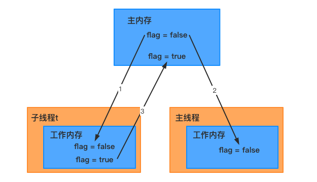
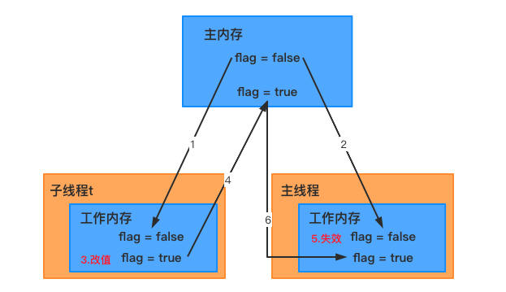
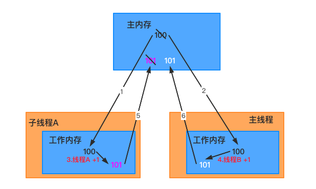
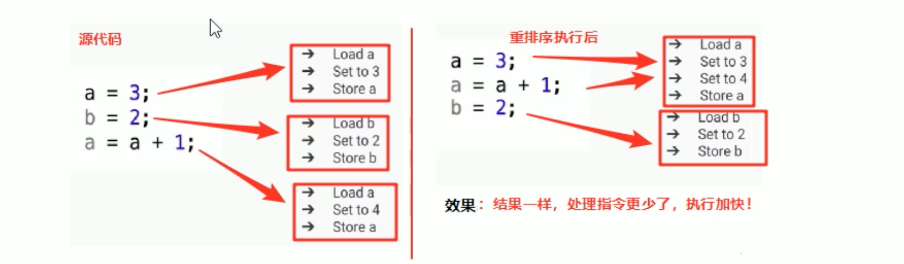
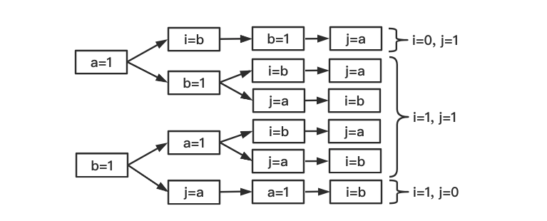
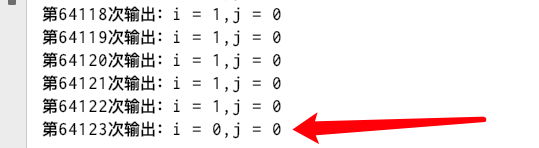
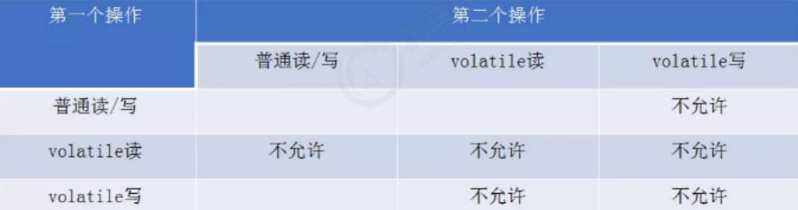

# volatile

## 1 volatile的作用

通常情况下我们可以通过同步关键字来解决这些个问题，不过如果对同步原理有了解的话，应该知道Synchronized是一个``比较重量级``的操作，对系统的性能有比较大的影响，所以，如果有其他解决方案，我们通常都避免使用Synchronized来解决问题。而volatile关键字是Java虚拟机提供的轻量级的同步机制，是Java中提供的对于原子性，需要聚焦一点，也是大家容易误解的一点：对volatile变量的单次读/写操作可以保证原子性的，如long和double类型变量，但是并不能保证i ++这种操作的原子性，因为本质上i ++是读，写两次操作。

## 2 volatile 解决多线程变量的不可见性

### 2.1 多线程下变量的不可变性

在多线程并发执行下，多个线程修改共享的成员变量，会出现一个线程修改了共享变量的值后，另一个线程不能直接看到该线程修改后的最新值。

```java
class MyThread {
    private boolean flag = false;

    public void run() {
        flag = true;
        System.out.println("flag= " + flag);
    }

    public boolean isFlag() {
        return flag;
    }
}
public class VisibilityDemo {
    public static void main(String[] args) {
        MyThread t = new MyThread();
        new Thread(() -> {
            try {
                Thread.sleep(200);
            } catch (InterruptedException e) {
                e.printStackTrace();
            }
            t.run();
        }).start();

        while (true) {
            if (t.isFlag()) {
                System.out.println("--------------");
                break;
            }
        }
    }
}
// flag= true
```

可以看到，子线程中已经将flag设置为true，但main()方法始终没有读到修改后的最新值，从而循环没有能进入到if语句中执行。

``多线程下修改共享变量会出现变量修改后的不可见性``

### 2.2 变量不可见性内存语义

在介绍多线程并发修改变量不可见现象的原因之前，需要了解一下和Java并发编程有关的Java 内存模型：``JMM``。

#### 2.2.1 问题分析



1. 子线程t从主内存读取到数据放入到其对应的工作内存
2. 将flag值更改为true，但是flag的值还没写回到主内存
3. 此时main方法读取到了flag的值为false
4. 当子线程t将flag的值写回去后，但是main函数里面的while调用的系统比较低层代码，速度快，没时间再去读取主内存的值

### 2.3 变量不可见性解决方案

如何实现多线程下访问共享变量的可见性：也就是实现一个线程修改变量后，对其他变量可见呢？

#### 2.3.1 加锁

```java
synchronized(t) {
    if (t.isFlag()) {
        System.out.println("--------------");
        break;
    }
}
```

某个线程进入synchronized代码块前后，执行过程如下：

1. 线程获得锁
2. 清空工作内存
3. 从主内存拷贝共享变量最新的值到工作内存成为副本
4. 执行代码
5. 将修改后的副本的值刷新回主内存中
6. 线程释放锁

#### 2.3.2 使用`volatile关键字`

线程本身并不直接与主内存进行数据的交互，而是通过线程的工作内存来完成相应的操作。这也是导致线程间数据不可见的本质原因。因此要实现volatile对volatile变量的写操作与普通变量的主要区别有两点：对变量的可见性，直接从这方面入手即可。

**volatile 如何保证可见性？？？**

有 volatile 变量修饰的共享变量进行写操作时会多出一行汇编代码：

```
0x01a3de1d: movb $0x0,0x1104800(%esi);0x01a3de24: lock add1 $0x0x,(%esp);
```

`Lock 前缀`的指令会在多核处理器下引发两件事：

（1）将当前处理器缓存行的数据写回到系统内存

（2）这个写回内存的操作会使在其他 CPU 里缓存了该内存地址的数据失效(`嗅探技术`保证它的内存缓存、系统内存和其他处理器缓存数据在总线上保持一致)。

因此，再读取该变量值的时候就需要重新读取系统内存中的值。

通过这两个操作，就可以解决volatile变量的可见性问题。

```java
private volatile boolean flag = false;
```



1. 子线程t从主内存读取到数据放入到其对应的工作内存
2. 将flag值更改为true，但是flag的值还没写回到主内存
3. 此时main方法读取到了flag的值为false
4. 当子线程t将flag的值写回去后，失效其他线程对此变量副本
5. 再次对flag进行操作的时候线程会从主内存取最新的值，放到工作内存中

## 3 volatile 不保证原子性

### 3.1  long和double的原子性

关于原子性的问题，上面已经解释过。volatile只能保证对单次读/写的原子性。这个问题可以看下JLS中的描述：

因为 long 和 double 两种数据类型都是8个字节共64位(一个字节=8bit)，可分为高32位和低32位两部分，因此如果是32位系统，普通的 long 或 double 类型读/写可能不是原子的。因为32位的系统要读完一个64位的变量，需要分两步执行，每次读取32位，这样就对double和long变量的赋值就会出现问题： 如果有两个线程同时写一个变量内存，一个进程写低32位，而另一个写高32位，这样将导致获取的64位数据是失效的数据。

因此，鼓励大家将共享的long和double变量设置为volatile类型，这样能保证任何情况下对long和double的单次读/写操作都具有原子性。

```java
public class LongTest implements Runnable {
    private static long aLong = 0;
    private long value;

    public LongTest(long value) {
        this.setValue(value);
    }

    public long getValue() {
        return value;
    }

    public void setValue(long value) {
        this.value = value;
    }

    @Override
    public void run() {
        int i = 0;
        while (i < 100000) {
            LongTest.aLong = this.getValue();
            i++;
            // 赋值操作！！
            long temp = LongTest.aLong;
            // 取出值操作！！！
            if (temp != 1L && temp != -1L) {
                System.out.println("出现错误结果" + temp);
                System.exit(0);
            }
        }
        System.out.println("运行正确");
    }

    public static void main(String[] args) throws InterruptedException {
        // 获取并打印当前JVM是32位还是64位的
        String sysNum = System.getProperty("sun.arch.data.model");
        System.out.println("系统的位数："+sysNum);
        LongTest t1 = new LongTest(1);
        LongTest t2 = new LongTest(-1);
        Thread T1 = new Thread(t1);
        Thread T2 = new Thread(t2);
        T1.start();
        T2.start();
        T1.join(); 
        T2.join();
    }
}
```

上面的代码在32位环境和64位环境执行的结果是不一样的： 

32位环境：出现错误

结果原因：32位环境无法一次读取long类型数据，多线程环境下对Long变量的读写是不完整的，导致temp变量既不等于1也不等于-1。出现了long和double读写的原子性问题了。 

64位环境：运行正确

#### 小结

**结论**：如果是在64位的系统中，那么对64位的long和double的读写都是原子操作的。即可以以一次性读写long或double的整个64bit。如果在32位的JVM上，long和double就不是原子性操作了。

**解决方法**：需要使用volatile关键字来防止此类现象

> 在JSR-133之前的规范中，读也是分成了两个32位的读，但是从JSR-133规范开始，即JDK5开始，读操作都具有原子性；
>
> java中对于其他类型的读写操作都是原子操作(除long和double类型以外)；
>
> 对于引用类型的读写操作都是原子操作，无论引用类型的实际类型是32位的值还是64位的值；
>
> Java商业虚拟机已经解决了long和double的读写操作的原子性。

### 3.2 问题演示

关于我们的变量变量对原子性保证，有一个问题容易被误解。现在我们就通过以下程序来演示一下这个问题：

```java
public class NoneAtomicTest {
    private volatile int i;
    public void addI() {
        i++;
    }
    public static void main(String[] args) throws InterruptedException {
        final NoneAtomicTest test = new NoneAtomicTest();
        for (int i = 0; i < 1000; i++) {
            new Thread(() -> {
                try {
                    Thread.sleep(10);
                } catch (InterruptedException e) {
                    e.printStackTrace();
                }
                test.addI();
            }).start();
        }
        Thread.sleep(3000);
        System.out.println(test.i);
    }
}
// 994
```

可能每个人运行的结果不相同。不过应该能修剪，volatile是无法保证原子性的（否则结果应该是1000）。原因也很简单，i ++其实是一个复合操作，包括三步骤：

（1）从主内存读取i的值到工作内存

（2）对工作内存进行++操作

（3）将工作内存中的数据写回到主内存

volatile是无法保证这三个操作是具有原子性的，我们可以通过 ``Atomic类`` 或者``Synchronized``来保证+1操作的原子性。



### 3.3 使用锁机制

可以给i++操作添加锁，那么i++操作就是临界区的代码，临界区只能有一个线程去执行，所以i++久变成了原子操作。

``临界区`` 一段代码如果对共享资源的多线程读写操作,这段代码就被称为临界区。 

```java
public void addI() {
    synchronized(this) {
        i++;
    }
}
```

### 3.4 原子类

JDK1.5 开始提供了``java.util.concurrent.atomic``包（简称Atomic包），这个包中的原子操作类提供了一种用法简单，性能高效，线程安全地更新一个变量的方式。

#### AtomicInteger

原子型Integer

```java
public AtomicInteger(); // 初始化一个默认值为0的原子型Integer
public AtomicInteger(int initialValue); // 初始化一个指定值原子型Integer

int get();	// 获取值
int getAndIncrement();	// 以原子方式+1，返回自增前的值
int incrementAndGet();	// 以原子方式+1，返回自增后的值	
int addAndGet(int data);	// 以原子方式将输入的值与实例中的值相加，并返回结果
int getAndSet(int value);	// 以原子方式设置newValue，并返回旧值
```

```java
public class AtomicIntegerTest {
    private static AtomicInteger atomicInteger = new AtomicInteger();
    public static void main(String[] args) throws InterruptedException {
        for (int i = 0; i < 1000; i++) {
            new Thread(() -> {
                try {
                    Thread.sleep(10);
                } catch (InterruptedException e) {
                    e.printStackTrace();
                }
                atomicInteger.getAndIncrement();
            }).start();
        }
        Thread.sleep(3000);
        System.out.println(atomicInteger.get());
    }
}
```

## 4 volatile 禁止指令重排序

### 4.1 重排序的好处

重排序可以提高处理的速度。



### 4.2 重排序问题

重排序虽然可以提高执行效率，但是在并发执行下，JVM虚拟机底层并不能保证重排序带来的安全性等问题。

```java
public class OutOfOrderDemo {
    public static int a = 0, b = 0;
    public static int i = 0, j = 0;

    public static void main(String[] args) throws InterruptedException {
        Thread one = new Thread(() -> {

            a = 1;
            try {
                Thread.sleep(10);
            } catch (InterruptedException e) {
                e.printStackTrace();
            }
            i = b;
        });

        Thread two = new Thread(() -> {
            b = 1;
            j = a;
        });

        one.start();
        two.start();
        one.join();
        two.join();

        System.out.println("i = " + i + ",j = " + j);
    }
}
```





按照以前的观点：代码执行的顺序是不会改变的，也就第一个线程是a=1是在i=b之前执行的，第二个线程b=1是在 j=a之前执行的。

发生了重排序：在线程1和线程2内部的两行代码的``实际执行顺序``和代码在Java文件中的顺序是不一致的，代码指令并不是严格按照代码顺序执行的，他们的顺序改变了，这样就是发生了重排序，这里颠倒的 是 a = 1 ,i = b 以及j=a , b=1 的顺序，从而发生了指令重排序。直接获取了i = b(0) , j = a(0)的值！显然这个值是不对的。

### 4.3 volatile 禁止重排序

> volatile修饰变量后可以实现禁止指令重排序！
>
> 使用volatile可以禁止指令重排序，从而修正重排序可能带来的并发安全问题。

```java
public volatile static int a = 0, b = 0;
public volatile static int i = 0, j = 0;
```

## 5 volatile 内存语义

### 5.1 volatile 写读建立的happens-before关系

```java
class VolitileExample {
    int a = 0;
    volatile boolean flag = fals;
    public void writer() {
        a = 1; //1
        flag = true; //2
    }
    public void reader() {
        if(flag) {//3
            int i = a;//4
            ...
        }
    }
}
```

假设线程 A 执行 writer() 方法之后，线程 B 执行 reader() 方法：

1. 根据程序顺序规则， 1 happens-before 2，3 happens-before 4
2. 根据 vlolaitle 规则，2 happens-before 3
3. 根据传递性规则，1 happens-before 4

也即是 A 线程在写 volatile 变量之前所有可见的共享变量，在 B 线程读同一个 volatile 变量后，将立刻变得对 B 线程可见。

### 5.2 volatile 写读的内存语义

当写一个 volatile 变量时，JMM 会把该线程对应的本地内存中的共享变量刷新到主内存。

当读一个 volatile 变量时，JMM 会把该线程对应的本地内存置为无效，线程接下来将从主内存中读取共享变量。

JMM 采取保守策略：

在每个 volatile 写操作的前面插入一个 StoreStore 屏障(保障上面所有的普通写在 volatile 写之前所新到主内存)。

在每个 volatile 写操作的后面插入一个 StoreLoad 屏障(避免 volatile 写与后面可能有的 volatile 读写重排序)。

在每个 volatile 读操作的后面插入一个 LoadLoad 屏障(禁止上面的 volatile 读与下面的普通读重排序)。

在每个 volatile 读操作的后面插入一个 LoadStore 屏障(禁止上面的 volatile 读与下面的普通写重排序)。

### 5.3 volatile 变量规则演示

happens-before有一个原则是：如果A是对volatile变量的写操作，B是对同一个变量的读操作，那么hb(A,B)

```java
public class VisibilityHP {
    private int a = 1;
    private int b = 2;

    public void write() {
        a = 3;
        b = a;
    }

    public void read() {
        System.out.println("b = " + b + ", a = " + a);
    }

    public static void main(String[] args) {
        while (true) {
            VisibilityHP hp = new VisibilityHP();
            new Thread(() -> hp.write()).start();

            new Thread(() -> hp.read()).start();
        }
    }
}
```

分析以上案例存在四种执行情况：

b=3;a=3

b=2;a=1

b=2;a=3

第四种情况（低概率）是：没给b加volatile,那么有可能出现a=1 , b = 3 。因为a虽然被修改了，但是其他线程不可见，而b恰好其他线程可见，造成了b=3 , a=1。 

按照happens-before规则，我们只需要给b加上volatile，那么b之前的写入（ a = 3;）将对读取b之后的代码可见，也就是说即使a不加volatile,只要b读取到3，那么b之前的操作（a=3）就一定是可见的，此时就绝对不会出现b=3的时候而读取到a=1了。

### 5.4 volatile重排序规则



* 写volatile变量时，无论前一个操作是什么，都不能重排序

* 读volatile变量时，无论后一个操作是什么，都不能重排序

* 当先写volatile变量，后读volatile变量时，不能重排序

## 6 volatile 在双重检查加锁的单例中的应用

### 6.1 懒汉式单例

```java
/**
* volatile双重检查模式
* 线程安全，延迟加载，效率较高
*/
public class Lazy {
		// 私有构造器
    private Lazy() {}
		// 静态属性，volatile保证可见性和禁止指令重排序
    private volatile static Lazy lazy = null;

    // 不使用synchronized，会出现线程不安全
    // 使用synchronized，性能较差
    public static Lazy getInstance() {
        if (lazy == null) {
            synchronized (Lazy.class) {
                if (lazy == null) {
                  	// 非原子操作
                    lazy = new Lazy();
                }
            }
        }
        return lazy;
    }
}
```

``双重检查的优点：线程安全，延迟加载，效率较高！``

现在我们分析一下为什么为什么要在变量lazy之间加上volatile关键字。

#### 禁止指令重排

要理解这个问题，先要了解对象的构造过程，实例化一个对象其实可以分为三个步骤：

（1）分配内存空间。

（2）调用构造器，初始化对象。

（3）将内存空间的地址分配值给对应的引用。

但是由于操作系统可以对指令进行重排序，所以上面的过程也可能会变成如下过程：

（1）分配内存空间。

（2）将内存空间的地址分配值给对应的引用。

（3）调用构造器，初始化对象

如果是这个流程，线程B在线程A赋值完时判断lazy就不为null了，此时B拿到的将是一个没有初始化完成的半成品。这样是很危险的。因为极有可能线程B会继续拿着个没有初始化的对象中的数据进行操作，此时容易触发``NPE异常``。

因此多线程环境下就可能将一个未初始化的对象引用暴露出来，从而导致不可预料的结果。因此，为了防止这个过程的重排序，我们需要将变量设置为volatile类型的变量。

#### 保证可见性

由于可见性问题，线程A在自己的工作线程内创建了实例，但此时还未同步到主存中；此时线程B在主存中判断lazy还是null，那么线程B又将在自己的工作线程中创建一个实例，这样就创建了多个实例。

如果加上了volatile修饰lazy之后，保证了可见性，一旦线程A返回了实例，线程B可以立即发现Instance不为null。

### 6.2 静态内部类单例方式

JVM在类初始化阶段（即在Class被加载后，且线程使用之前），会执行类的初始化。在执行类的初始化期间，JVM会去获取一个锁。这个锁可以同步多个线程对同一个类的初始化。 基于这个特性，可以实现另一种线程安全的延迟初始化方案 。

```java
public class LazyThree {
    
    // 默认使用LazyThree的时候，会先初始化内部类
    // 如果没有使用的话，内部类是不加载的
    // 如果默认构造方法不私有化，相当于有一个默认的public的无参构造方法，就意味着在代码中随时可以new出来
    private LazyThree(){}

    public static LazyThree getInstance() {
        return LazyHolder.LAZY;
    }

    private static class LazyHolder {
        private static final LazyThree LAZY = new LazyThree();
    }
}
```

1. 静态内部类是在被调用时才会被加载，这种方案实现了懒汉单例的一种思想，需要用到的时候才去创建单例，加上JVM的特性，这种方式又实现了线程安全的创建单例对象。

2. 通过对比基于volatile的双重检查锁定方案和基于类初始化方案的对比，我们会发现基于类初始化的方案的实现代码更简洁。但是基于volatile的双重检查锁定方案有一个额外的优势：``除了可以对静态字段实现延迟加载初始化外，还可以对实例字段实现延迟初始化。``

## 7 volatile 的使用场景

### 7.1 纯赋值操作

volatile不适合做``a++``等操作。 

适合做纯复制操作：如 ``boolean flag = false/true;``

```java
public class UseVolatile implements Runnable {
    volatile boolean flag = false;
    AtomicInteger realA = new AtomicInteger();

    @Override
    public void run() {
        for (int i = 0; i < 10000; i++) {
            setDone();
            realA.incrementAndGet();
        }
    }

    private void setDone() {
        flag = true;// 纯赋值操作符合预期
        // flag = !flag ; // 这样做不符合预期
    }

    public static void main(String[] args) throws InterruptedException {
        UseVolatile u = new UseVolatile();
        Thread t1 = new Thread(u);
        Thread t2 = new Thread(u);
        t1.start();
        t2.start();
        t1.join();
        t2.join();
        System.out.println(u.flag);
        System.out.println(u.realA.get());
    }
}
```

volatile可以适合做多线程中的纯赋值操作：如果一个共享变量自始至终只被各个线程赋值,而没有其他的操作,那么就可以用volatile来代替synchronized或者代替原子变量,因为赋值自身是有原子性的,而volatile又保证了可见性,所以就足以保证线程安全。

### 7.2 触发器

按照volatile的可见性和禁止重排序以及happens-before规则，volatile可以作为刷新之前变量的触发器。我们可以将某个变量设置为volatile修饰，其他线程一旦发现该变量修改的值后，触发获取到的该变量之前的操作都将是最新的且可见。 

```java
public class UseVolatile02 {

    int a = 1;
    int b = 2;
    int c = 3;
    volatile boolean flag = false;

    public void write() {
        a = 100;
        b = 200;
        c = 300;
        flag = true;
    }

    public void read() {
        while (flag) {
            // flag被volatile修饰，充当了触发器，一旦值为true,此处立即对变量之前的操作可见。
            System.out.println("a = " + a + ",b = " + b + ", c = " + c);
        }
    }

    public static void main(String[] args) throws InterruptedException {
        UseVolatile02 useVolatile02 = new UseVolatile02();
        new Thread(() -> {
            useVolatile02.write();
        }).start();
        new Thread(() -> {
            useVolatile02.read();
        }).start();
    }
}
```

volatile可以作为刷新之前变量的触发器。我们可以将某个变量设置为volatile修饰，其他线程一旦发现该变量修改的值后，触发获取到的该变量之前的操作都将是最新的且可见。

## 8 volatile 与 synchronized 区别

* volatile只能修饰实例变量和类变量，而synchronized可以修饰方法，以及代码块。 

* volatile保证数据的可见性，但是不保证原子性(多线程进行写操作，不保证线程安全);而synchronized是一种排他（互斥）的机制。 

* volatile用于禁止指令重排序：可以解决单例双重检查对象初始化代码执行乱序问题。 

* volatile可以看做是轻量版的synchronized,volatile不保证原子性，但是如果是对一个共享变量进行多个线程的赋值，而没有其他的操作，那么就可以用volatile来代替synchronized,因为赋值本身是有原子性的，而volatile又保证了可见性，所以就可以保证线程安全了。 

------

