# 1 Condition

既然 J.U.C 里面提供了锁的实现机制，那 J.U.C 里面有没有提供类似的线程通信的工具呢？ 

于是发现了一个 Condition 工具类。 Condition 是一个多线程协调通信的工具类，可以让某些线程一起等待某个条件（condition），只有满足条件时，线程才会被唤醒。

## 1.1 线程间通信

1. 生产者 + 消费者
2. 通知等待唤醒机制

## 1.2 synchronized 实现

```java
class AirConditioner {
    private int number = 0;

    public synchronized void increment() throws InterruptedException {
        // 判断，如果是if，被唤醒时不会重新检查
        while (number != 0) {
            this.wait();
        }
        // 执行
        number++;
        System.out.println(Thread.currentThread().getName() + "\t" + number);
        // 通知
        this.notifyAll();
    }

    public synchronized void decrement() throws InterruptedException {
        while (number == 0) {
            this.wait();
        }
        number--;
        System.out.println(Thread.currentThread().getName() + "\t" + number);
        this.notifyAll();
    }
}

/**
 * 两个线程，操作一个初始值为0的变量
 * 实现一个线程对该变量+1，一个-1
 * 实现交替，10轮，变量初始值为0
 *
 * 判断/执行/通知
 * 多线程交互中，必须要防止多线程的虚假唤醒，也就（判断用while，不用if）
 */
public class ThreadWaitNotifyDemo {
    public static void main(String[] args) {
        AirConditioner airConditioner = new AirConditioner();
        new Thread(() -> {
            for (int i = 1; i <= 10; i++) {
                try {
                    Thread.sleep(200);
                    airConditioner.increment();
                } catch (InterruptedException e) {
                    e.printStackTrace();
                }
            }
        }, "A").start();
        new Thread(() -> {
            for (int i = 1; i <= 10; i++) {
                try {
                    Thread.sleep(300);
                    airConditioner.decrement();
                } catch (InterruptedException e) {
                    e.printStackTrace();
                }
            }
        }, "B").start();
    }
}
```

## 1.3 Condition 实现

```java
class AirConditioner {
    private int number = 0;

    private Lock lock = new ReentrantLock();
    private Condition condition = lock.newCondition();

    public void increment() throws InterruptedException {
        lock.lock();
        try {
            // 判断，如果是if，被唤醒时不会重新检查
            while (number != 0) {
                condition.await(); //this.wait();
            }
            // 执行
            number++;
            System.out.println(Thread.currentThread().getName() + "\t" + number);
            // 通知
            condition.signalAll(); //this.notifyAll();
        } finally {
            lock.unlock();
        }
    }

    public synchronized void decrement() throws InterruptedException {
        lock.lock();
        try {
            while (number == 0) {
                condition.await();
            }
            number--;
            System.out.println(Thread.currentThread().getName() + "\t" + number);
            condition.signalAll();
        } finally {
            lock.unlock();
        }
    }
}
```

### 1.3.1 多线程协调通信

```java
class ShareResource {

    //1:A 2:B 3:C
    private int number = 1;
    private Lock lock = new ReentrantLock();
    private Condition condition1 = lock.newCondition();
    private Condition condition2 = lock.newCondition();
    private Condition condition3 = lock.newCondition();

    public void print5() {
        lock.lock();
        try {
            while (number != 1) {
                condition1.await();
            }
            for (int i = 1; i <= 5; i++) {
                System.out.println(Thread.currentThread().getName() + "\t" + i);
            }
            number = 2;
            condition2.signal();
        } catch (InterruptedException e) {
            e.printStackTrace();
        } finally {
            lock.unlock();
        }
    }

    public void print10() {
        lock.lock();
        try {
            while (number != 2) {
                condition2.await();
            }
            for (int i = 1; i <= 10; i++) {
                System.out.println(Thread.currentThread().getName() + "\t" + i);
            }
            number = 3;
            condition3.signal();
        } catch (InterruptedException e) {
            e.printStackTrace();
        } finally {
            lock.unlock();
        }
    }

    public void print15() {
        lock.lock();
        try {
            while (number != 3) {
                condition3.await();
            }
            for (int i = 1; i <= 15; i++) {
                System.out.println(Thread.currentThread().getName() + "\t" + i);
            }
            number = 1;
            condition1.signal();
        } catch (InterruptedException e) {
            e.printStackTrace();
        } finally {
            lock.unlock();
        }
    }
}

/**
 * 多线程之间实现A->B->C
 *
 * 1. 在高内聚低耦合的前提下，线程   操作（对外暴露的调用方法）   资源类
 * 2. 断/执行/通知
 * 3. 多线程交互中，必须要防止多线程的虚假唤醒，也就（判断用while，不用if）
 * 4. 标识位
 */
public class ThreadOrderAccess {
    public static void main(String[] args) {
        ShareResource shareResource = new ShareResource();
        new Thread(() -> {
            for (int i = 1; i <= 10; i++) {
                shareResource.print5();
            }
        }, "AA").start();
        new Thread(() -> {
            for (int i = 1; i <= 10; i++) {
                shareResource.print10();
            }
        }, "BB").start();
        new Thread(() -> {
            for (int i = 1; i <= 10; i++) {
                shareResource.print15();
            }
        }, "CC").start();
    }
}
```

当调用 await 方法后，当前线程会释放锁并等待，而其他线程调用 condition 对象的 signal 或者 signalall 方法通知并被阻塞的线程，然后自己执行 unlock 释放锁，被唤醒的线程获得之前的锁继续执行，最后释放锁。 所以，condition 中两个最重要的方法，一个是 await，一 个是 signal 方法 

`await` 把当前线程阻塞挂起

`signal` 唤醒阻塞的线程

## 1.4 Condition 源码分析

调用 Condition，需要获得 Lock 锁，所以意味着会存在一个 AQS 同步队列，在上面那个案例中，假如两个线程同时运行的话，那么 AQS 的队列可能是下面这种情况。

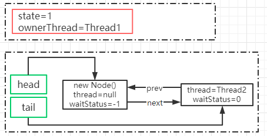

那么这个时候 Thread1 调用了 condition.await 方法，它做了什么事情呢？

**condition.await**

调用 Condition 的 await()方法（或者以 await 开头的方法）， 会使当前线程进入等待队列并释放锁，同时线程状态变为等待状态。当从 await() 方法返回时，当前线程一定获取了 Condition 相关联的锁。

```java
public final void await() throws InterruptedException {
    //表示 await 允许被中断
    if (Thread.interrupted())
        throw new InterruptedException();
    //创建一个新的节点，节点状态为 condition，采用的数据结构仍然是链表
    Node node = addConditionWaiter();
    //释放当前的锁，得到锁的状态，并唤醒 AQS 队列中的一个线程
    long savedState = fullyRelease(node);
    int interruptMode = 0;
    //如果当前节点没有在同步队列上，即还没有被 signal，则将当前线程阻塞
    //判断这个节点是否在 AQS 队列上，第一次判断的是 false，因为前面已经释放锁了
  	// 在第一次执行await之后(节点不在AQS队列返回false)线程被挂起，其他线程执行signal唤醒当前线程后，执行2，3步之后，会在此进入1步骤判断，此时线程已经在AQS队列（checkInterruptWhileWaiting-->transferAfterCancelledWait-->enq将当前线程放入AQS），跳出while，往下执行
    while (!isOnSyncQueue(node)) {// 1
         //通过 park 挂起当前线程
        LockSupport.park(this);// 2
        if ((interruptMode = checkInterruptWhileWaiting(node)) != 0)//3
            break;
    }
    // 当这个线程醒来,会尝试拿锁, 当 acquireQueued返回 false 就是拿到锁了.
 	// interruptMode != THROW_IE -> 表示这个线程没有成功将 node 入队,但 signal 执行了 enq 方法让其入队了.
	// 将这个变量设置成 REINTERRUPT.
    if (acquireQueued(node, savedState) && interruptMode != THROW_IE)
        interruptMode = REINTERRUPT;
    // 如果 node 的下一个等待者不是 null, 则进行清理,清理 Condition 队列上的节点.
	// 如果是 null ,就没有什么好清理的了.
    if (node.nextWaiter != null) // clean up if cancelled
        unlinkCancelledWaiters();
    // 如果线程被中断了,需要抛出异常.或者什么都不做
    if (interruptMode != 0)
        reportInterruptAfterWait(interruptMode);
}
```

**addConditionWaiter**

这个方法的主要作用是把当前线程封装成 Node，添加到 等待队列。这里的队列不再是双向链表，而是单向链表。

```java
private Node addConditionWaiter() {
    Node t = lastWaiter;
    // If lastWaiter is cancelled, clean out.
    // 如果 lastWaiter 不等于空并且 waitStatus 不等于 CONDITION 时，把这个节点从链表中移除
    if (t != null && t.waitStatus != Node.CONDITION) {
        unlinkCancelledWaiters();
        t = lastWaiter;
    }
    //构建一个 Node，waitStatus=CONDITION。这里的链表是一个单向的，所以相比 AQS 来说会简单很多
    Node node = new Node(Thread.currentThread(), Node.CONDITION);
    if (t == null)
        firstWaiter = node;
    else
        t.nextWaiter = node;
    lastWaiter = node;
    return node;
}
```

**图解分析 **

执行完 addConditionWaiter 这个方法之后，就会产生一个这样的 condition 队列

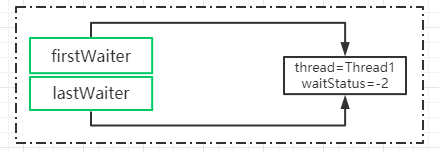

**fullyRelease**

fullRelease，就是彻底的释放锁，什么叫彻底呢，就是如果当前锁存在多次重入，那么在这个方法中只需要释放一次就会把所有的重入次数归零。

```java
final long fullyRelease(Node node) {
    boolean failed = true;
    try {
        //获得重入的次数
        long savedState = getState();
        //释放锁并且唤醒下一个同步队列中的线程
        if (release(savedState)) {
            failed = false;
            return savedState;
        } else {
            throw new IllegalMonitorStateException();
        }
    } finally {
        if (failed)
            node.waitStatus = Node.CANCELLED;
    }
}
```

**图解分析 **

此时，同步队列会触发锁的释放和重新竞争。Thread2 获得了锁。

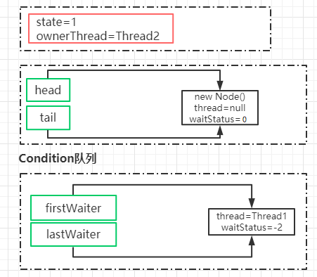

**isOnSyncQueue**

判断当前节点是否在同步队列中，返回 false 表示不在，返回 true 表示在。

如果不在 AQS 同步队列，说明当前节点没有唤醒去争抢同步锁，所以需要把当前线程阻塞起来，直到其他的线程调用 signal 唤醒。

如果在 AQS 同步队列，意味着它需要去竞争同步锁去获得执行程序执行权限。

为什么要做这个判断呢？原因是在 condition 队列中的节点会重新加入到 AQS 队列去竞争锁。也就是当调用 signal 的时候，会把当前节点从 condition 队列转移到 AQS 队列。

基于现在的逻辑结构。如何去判断 Thread1 这个节点是否存在于 AQS 队列中呢？ 

1. 如果 Thread1 的 waitStatus 的状态为 CONDITION，说明它存在于 condition 队列中，不在 AQS 队列。因为 AQS 队列的状态一定不可能有 CONDITION 
2. 如果 node.prev 为空，说明也不存在于 AQS 队列，原因是 prev=null 在 AQS 队列中只有一种可能性，就是它是 head 节点，head 节点意味着它是获得锁的节点。 
3. 如果 node.next 不等于空，说明一定存在于 AQS 队列 中，因为只有 AQS 队列才会存在 next 和 prev 的关系 
4. findNodeFromTail，表示从 tail 节点往前扫描 AQS 队列， 一旦发现 AQS 队列的节点和当前节点相等，说明节点一 定存在于 AQS 队列中

```java
final boolean isOnSyncQueue(Node node) {
    if (node.waitStatus == Node.CONDITION || node.prev == null)
        return false;
    if (node.next != null) // If has successor, it must be on queue
        return true;
    return findNodeFromTail(node);
}
```

**Condition.signal **

await 方法会阻塞 Thread1，然后 Thread2 抢占到了锁获 得了执行权限，这个时候在 Thread2 中调用了 Condition 的 signal() 方法，将会唤醒在等待队列中的节点。

```java
public final void signal() {
     //先判断当前线程是否获得了锁，这个判断比较简单，直接用获得锁的线程和当前线程相比即可
    if (!isHeldExclusively())
        throw new IllegalMonitorStateException();
    // 拿到 Condition队列上第一个节点
    Node first = firstWaiter;
    if (first != null)
        doSignal(first);
}
```

**Condition.doSignal**

对 condition 队列中从首部开始的第一个 condition 状态的节点，执行 transferForSignal 操作，将 node 从 condition 队列中转换到 AQS 队列中，同时修改 AQS 队列中原先尾节点的状态。

```java
private void doSignal(Node first) {
    do {
        //从 Condition 队列中删除 first 节点,并将当前节点的下一个节点设置为firstWaiter
        if ( (firstWaiter = first.nextWaiter) == null)
            // 将 next 节点设置成 null
            lastWaiter = null;
        first.nextWaiter = null;
    } while (!transferForSignal(first) &&
             (first = firstWaiter) != null);
}
```

**AQS.transferForSignal**

该方法先是 CAS 修改了节点状态，如果成功，就将这个节点放到 AQS 队列中，然后唤醒这个节点上的线程。此时， 那个节点就会在 await 方法中苏醒。

```java
final boolean transferForSignal(Node node) {
	//更新节点的状态为 0，如果更新失败，只有一种可能就是节点被 CANCELLED 了
    if (!compareAndSetWaitStatus(node, Node.CONDITION, 0))
        return false;
	//调用 enq，把当前节点添加到 AQS 队列。并且返回返回按当前节点的上一个节点，也就是原 tail 节点
    Node p = enq(node);
    int ws = p.waitStatus;
    // 如果上一个节点的状态被取消了, 或者尝试设置上一个节点的状态为 SIGNAL 失败了(SIGNAL 表示: 他的 next节点需要停止阻塞)
    if (ws > 0 || !compareAndSetWaitStatus(p, ws, Node.SIGNAL))
        // 唤醒节点上的线程
        LockSupport.unpark(node.thread);
    //如果 node 的 prev 节点已经是 signal 状态，那么被阻塞的 ThreadA 的唤醒工作由 AQS 队列来完成
    return true;
}
```

**图解分析**

执行完 doSignal 以后，会把 condition 队列中的节点转移到 aqs 队列上，逻辑结构图如下。

这个时候会判断 Thread1 的 prev 节点也就是 head 节点 的 waitStatus，如果大于 0 或者设置 SIGNAL 失败，表示节点被设置成了 CANCELLED 状态。这个时候会唤醒 Thread1 这个线程。否则就基于 AQS 队列的机制来唤 醒，也就是等到 Thread2 释放锁之后来唤醒 Thread1。

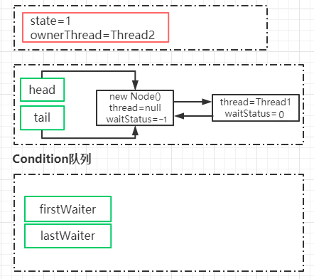

**被阻塞的线程唤醒后的逻辑**

前面在分析 await 方法时，线程会被阻塞。而通过 signal 被唤醒之后又继续回到上次执行的逻辑中 checkInterruptWhileWaiting 这个方法是干嘛呢？其实从名字就可以看出来，就是 Thread1 在 condition 队列被阻塞的过程中，有没有被其他线程触发过中断请求。

```java
public final void await() throws InterruptedException {
    ...
    while (!isOnSyncQueue(node)) {
        LockSupport.park(this);
        if ((interruptMode = checkInterruptWhileWaiting(node)) != 0)
            break;
    }
	...
}
```

**checkInterruptWhileWaiting**

如果当前线程被中断，则调用 transferAfterCancelledWait 方法判断后续的处理应该是抛出 InterruptedException 还是重新中断。 

这里需要注意的地方是，如果第一次 CAS 失败了，则不能判断当前线程是先进行了中断还是先进行了 signal 方法 的调用，可能是先执行了 signal 然后中断，也可能是先执行了中断，后执行了 signal，当然，这两个操作肯定是发生在 CAS 之前。这时需要做的就是等待当前线程的 node 被添加到 AQS 队列后，也就是 enq 方法返回后，返回 false 告诉 checkInterruptWhileWaiting 方法返回 REINTERRUPT(1)，后续进行重新中断。

简单来说，该方法的返回值代表当前线程是否在 park 的时候被中断唤醒，如果为 true 表示中断在 signal 调用之 前，signal 还未执行，那么这个时候会根据 await 的语义，在 await 时遇到中断需要抛出 interruptedException，返回 true 就是告诉 checkInterruptWhileWaiting 返回 THROW_IE(-1)。 如果返回 false，否则表示 signal 已经执行过了，只需要重新响应中断即可。

```java
private int checkInterruptWhileWaiting(Node node) {
    return Thread.interrupted() ?
        (transferAfterCancelledWait(node) ? THROW_IE : REINTERRUPT) :
        0;
}
final boolean transferAfterCancelledWait(Node node) {
    //使用 cas 修改节点状态，如果还能修改成功，说明线程被中断时，signal 还没有被调用。
	// 这里有一个知识点，就是线程被唤醒，并不一定是在 java 层面执行了locksupport.unpark，也可能是调用了线程的 interrupt()方法，这个方法会更新一个中断标识，并且会唤醒处于阻塞状态下的线程。
    if (compareAndSetWaitStatus(node, Node.CONDITION, 0)) {
        //如果 cas 成功，则把 node 添加到 AQS 队列
        enq(node);
        return true;
    }
    //如果 cas 失败，则判断当前 node 是否已经在 AQS 队列上，如果不在，则让给其他线程执行
	//当 node 被触发了 signal 方法时，node 就会被加到 aqs 队列上
    //循环检测 node 是否已经成功添加到 AQS 队列中。
    while (!isOnSyncQueue(node))
        //如果没有，则通过 yield，
        Thread.yield();
    return false;
}
```

**acquireQueued**

这个方法在讲 aqs 的时候说过，是的当前被唤醒的节点 ThreadA 去抢占同步锁。并且要恢复到原本的重入次数状 态。调用完这个方法之后，AQS 队列的状态如下 将 head 节点的 waitStatus 设置为-1，Signal 状态。

**reportInterruptAfterWait**

根据 checkInterruptWhileWaiting 方法返回的中断标识来进行中断上报。 如果是 THROW_IE，则抛出中断异常 如果是 REINTERRUPT，则重新响应中断。

```java
private void reportInterruptAfterWait(int interruptMode)
    throws InterruptedException {
    if (interruptMode == THROW_IE)
        throw new InterruptedException();
    else if (interruptMode == REINTERRUPT)
        selfInterrupt();
}
```

## 1.5 Condition 总结

await 和 signal 的总结

把前面的整个分解的图再通过一张整体的结构图来表述，线程 awaitThread 先通过 lock.lock()方法获取锁成功后调用了 condition.await 方法进入等待队列，而另一个线程 signalThread 通过 lock.lock()方法获取锁成功后调用 了 condition.signal 或者 signalAll 方法，使得线程 awaitThread 能够有机会移入到同步队列中，当其他线程释放 lock 后使得线程 awaitThread 能够有机会获取 lock，从而使得线程 awaitThread 能够从 await 方法中退出执行后续操作。如果 awaitThread 获取 lock 失败会直 接进入到同步队列。

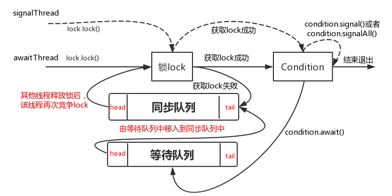

阻塞：await()方法中，在线程释放锁资源之后，如果节点不在 AQS 等待队列，则阻塞当前线程，如果在等待队 列，则自旋等待尝试获取锁

释放：signal()后，节点会从 condition 队列移动到 AQS 等待队列，则进入正常锁的获取流程 

# 2 CountDownLatch

CountDownLatch 是一个同步工具类，它允许一个或多个线程一直等待，直到其他线程的操作执行完毕再执行。从命名可以解读到 countdown 是倒数的意思，类似于我们倒计时的概念。 

CountDownLatch 初始化的时候需要传入一个整数，在这个整数倒数到 0 之前，当一个或多个线程调用 await 方法时，这些线程会阻塞。 其它线程调用 countDown 方法会将这个整数减1(调用countDown方法的线程不会阻塞)，当整数值变为0时，因await方法阻塞的线程会被唤醒，继续执行。 

## 2.1 使用案例

```java
/**
  * @Description:
  * 让一些线程阻塞直到另一些线程完成一系列操作后才被唤醒。
  * 
  * CountDownLatch主要有两个方法，当一个或多个线程调用await方法时，这些线程会阻塞。
  * 其它线程调用countDown方法会将计数器减1(调用countDown方法的线程不会阻塞)，
  * 当计数器的值变为0时，因await方法阻塞的线程会被唤醒，继续执行。
  * 
  * 解释：6个同学陆续离开教室后值班同学才可以关门。
  * main主线程必须要等前面6个线程完成全部工作后，自己才能开干 
  */
public class CountDownLatchDemo {
    public static void main(String[] args) throws InterruptedException {
        CountDownLatch countDownLatch = new CountDownLatch(6);
        for (int i = 1; i <= 6; i++) {
            new Thread(() -> {
                System.out.println(Thread.currentThread().getName() + "\t离开教室");
                countDownLatch.countDown();
            }, String.valueOf(i)).start();
        }
        countDownLatch.await();
        System.out.println(Thread.currentThread().getName() + "\t班长离开教室");
    }

    public static void closeDoor() {
        for (int i = 1; i <= 6; i++) {
            new Thread(() -> {
                System.out.println(Thread.currentThread().getName() + "\t离开教室");
            }, String.valueOf(i)).start();
        }
        System.out.println(Thread.currentThread().getName() + "\t班长离开教室");
    }
}
```

从代码的实现来看，有点类似 join 的功能，但是比 join 更 加灵活。CountDownLatch 构造函数会接收一个 int 类型的参数作为计数器的初始值，当调用 CountDownLatch 的 countDown 方法时，这个计数器就会减一。 

通过 await 方法去阻塞去阻塞主流程。

**模拟高并发场景**

```java
static CountDownLatch
            countDownLatch=new
            CountDownLatch(1);

    @Override
    public void run() {
        try {
            countDownLatch.await();
            //TODO
        } catch (InterruptedException e)
        {
            e.printStackTrace();
        }

        System.out.println("ThreadName:"+Thread.currentThread().getName());
    }

    public static void main(String[] args) {
        for(int i=0;i<1000;i++){
            new Thread(new CountDownLatchDemo()).start();
        }
        countDownLatch.countDown();
    }
```

## 2.2 使用场景

总的来说，凡事涉及到需要指定某个人物在执行之前，要等到前置人物执行完毕之后才执行的场景，都可以使用 CountDownLatch。

## 2.3 CountDownLatch 源码分析

对于 CountDownLatch，我们仅仅需要关心两个方法，一 个是 countDown() 方法，另一个是 await() 方法。 

countDown() 方法每次调用都会将 state 减 1，直到 state 的值为 0；而 await 是一个阻塞方法，当 state 减为 0 的时候，await 方法才会返回。await 可以被多个线程调用，大家在这个时候脑子里要有个图：所有调用了 await 方法的线程阻塞在 AQS 的阻塞队列中，等待条件满足（state == 0），将线程从队列中一个个唤醒过来。

```java
public void await() throws InterruptedException {
    sync.acquireSharedInterruptibly(1);
}
```

**acquireSharedInterruptibly**

countdownlatch 也用到了 AQS，在 CountDownLatch 内部写了一个 Sync 并且继承了 AQS 这个抽象类重写了 AQS 中的共享锁方法。首先看到下面这个代码，这块代码主要是判断当前线程是否获取到了共享锁;（ 在 CountDownLatch 中 ，使用的是共享锁机制 ，因为 CountDownLatch 并不需要实现互斥的特性）

```java
public final void acquireSharedInterruptibly(int arg)
        throws InterruptedException {
    if (Thread.interrupted())
        throw new InterruptedException();
    //state 如果不等于 0，说明当前线程需要加入到共享锁队列中
    if (tryAcquireShared(arg) < 0)
        doAcquireSharedInterruptibly(arg);
}
protected int tryAcquireShared(int acquires) {
    return (getState() == 0) ? 1 : -1;
}
```

**doAcquireSharedInterruptibly**

1. addWaiter 设置为 shared 模式
2. tryAcquire 和 tryAcquireShared 的返回值不同，因此会 多出一个判断过程 
3. 在判断前驱节点是头节点后，调用了 setHeadAndPropagate 方法，而不是简单的更新一下头节点

```java
private void doAcquireSharedInterruptibly(int arg)
    throws InterruptedException {
    //创建一个共享模式的节点，并添加到队列中
    final Node node = addWaiter(Node.SHARED);
    boolean failed = true;
    try {
        for (;;) {
            final Node p = node.predecessor();
            if (p == head) {
                //就判断尝试获取锁
                int r = tryAcquireShared(arg);
                //r>=0 表示获取到了执行权限，这个时候因为 state!=0，所以不会执行这段代码
                if (r >= 0) {
                    setHeadAndPropagate(node, r);
                    p.next = null; // help GC
                    failed = false;
                    return;
                }
            }
            //阻塞线程
            if (shouldParkAfterFailedAcquire(p, node) &&
                parkAndCheckInterrupt())
                throw new InterruptedException();
        }
    } finally {
        if (failed)
            cancelAcquire(node);
    }
}
```

**图解分析**

加入这个时候有 3 个线程调用了 await 方法，由于这个时 候 state 的值还不为 0，所以这三个线程都会加入到 AQS 队列中。并且三个线程都处于阻塞状态

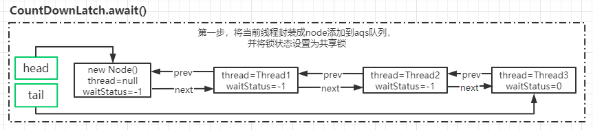

CountDownLatch.countDown

由于线程被 await 方法阻塞了，所以只有等到 countdown 方法使得 state=0 的时候才会被唤醒，我们来看看 countdown 做了什么 

1. 只有当 state 减为 0 的时候，tryReleaseShared 才返 回 true, 否则只是简单的 state = state - 1 
2. 如果 state=0, 则调用 doReleaseShared 唤醒处于 await 状态下的线程

```java
public final boolean releaseShared(int arg) {
    if (tryReleaseShared(arg)) {
        doReleaseShared();
        return true;
    }
    return false;
}
// 用自旋的方法实现 state 减 1
protected boolean tryReleaseShared(int releases) {
    // Decrement count; signal when transition to zero
    for (;;) {
        int c = getState();
        if (c == 0)
            return false;
        int nextc = c-1;
        if (compareAndSetState(c, nextc))
            return nextc == 0;
    }
}
```

**AQS. doReleaseShared**

共享锁的释放和独占锁的释放有一定的差别。

前面唤醒锁的逻辑和独占锁是一样，先判断头结点是不是 SIGNAL 状态，如果是，则修改为 0，并且唤醒头结点的 下一个节点。

PROPAGATE： 标识为 PROPAGATE 状态的节点，是共享锁模式下的节点状态，处于这个状态下的节点，会对线程的唤醒进行传播。

```java
private void doReleaseShared() {
    for (;;) {
        Node h = head;
        if (h != null && h != tail) {
            int ws = h.waitStatus;
            if (ws == Node.SIGNAL) {
                if (!compareAndSetWaitStatus(h, Node.SIGNAL, 0))
                    continue;            // loop to recheck cases
                // 唤醒头结点的下一个节点
                unparkSuccessor(h);
            }
            // 这个 CAS 失败的场景是：执行到这里的时候，刚好有一个节点入队，入队会将这个 ws 设置为 -1
            else if (ws == 0 &&
                     !compareAndSetWaitStatus(h, 0, Node.PROPAGATE))
                continue;                // loop on failed CAS
        }
        // 如果到这里的时候，前面唤醒的线程已经占领了 head，那么再循环
 		// 通过检查头节点是否改变了，如果改变了就继续循环
        if (h == head)                   // loop if head changed
            break;
    }
}
```

h == head：说明头节点还没有被刚刚用 unparkSuccessor 唤醒的线程（这里可以理解为 Thread1）占有，此时 break 退出循环。 

h != head：头节点被刚刚唤醒的线程（这里可以理解为 Thread1）占有，那么这里重新进入下一轮循环，唤醒下 一个节点（这里是 Thread2 ）。我们知道，等到 Thread2 被唤醒后，其实是会主动唤醒 Thread3...

**doAcquireSharedInterruptibly**

一旦 Thread1 被唤醒，代码又会继续回到 doAcquireSharedInterruptibly 中来执行。如果当前满足 state = 0 的条件，则会执行 setHeadAndPropagate 方法

```java
private void doAcquireSharedInterruptibly(int arg)
    ...
        for (;;) {
            if (p == head) {
                if (r >= 0) {
                    //被唤醒的线程进入下一次循环继续判断
                    setHeadAndPropagate(node, r);
                    //把当前节点移除 aqs 队列
                    p.next = null; // help GC
					failed = false;
					return;
                }
                ...
            }
        }
}
```

**setHeadAndPropagate**

这个方法的主要作用是把被唤醒的节点，设置成 head 节 点。 然后继续唤醒队列中的其他线程。 由于现在队列中有 3 个线程处于阻塞状态，一旦 ThreadA 被唤醒，并且设置为 head 之后，会继续唤醒后续的 ThreadB

```java
private void setHeadAndPropagate(Node node, int propagate) {
    Node h = head; // Record old head for check below
    setHead(node);
    if (propagate > 0 || h == null || h.waitStatus < 0 ||
        (h = head) == null || h.waitStatus < 0) {
        Node s = node.next;
        if (s == null || s.isShared())
            doReleaseShared();
    }
}
```

**图解分析**

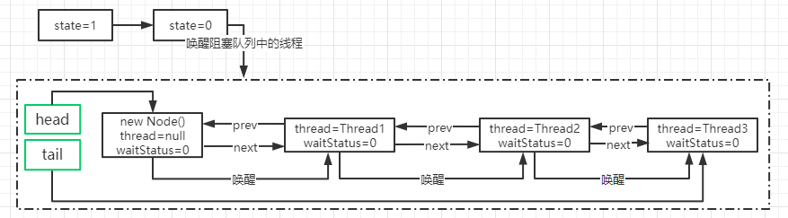

# 3 Semaphore

semaphore 也就是我们常说的信号灯，semaphore 可以控制同时访问的线程个数，通过 acquire 获取一个许可，如果没有就等待，通过 release 释放一个许可。有点类似限流的作用。

acquire（获取） 当一个线程调用acquire操作时，它要么通过成功获取信号量（信号量减1），要么一直等下去，直到有线程释放信号量，或超时。

release（释放）实际上会将信号量的值加1，然后唤醒等待的线程。

## 3.1 使用案例 

```java
public class SemaphoreDemo {
    public static void main(String[] args) {
        Semaphore semaphore = new Semaphore(3);
        for (int i = 1; i <= 6; i++) {
            new Thread(() -> {
                try {
                    semaphore.acquire();
                    System.out.println(Thread.currentThread().getName() + "\t抢占了车位");
                    try { TimeUnit.SECONDS.sleep(3); } catch (InterruptedException e) { e.printStackTrace(); }
                    System.out.println(Thread.currentThread().getName() + "\t离开了车位");
                } catch (InterruptedException e) {
                    e.printStackTrace();
                } finally {
                    semaphore.release();
                }
            }, String.valueOf(i)).start();
        }
    }
}
```

## 3.2 使用场景 

信号灯主要用于两个目的，一个是用于多个共享资源的互斥使用，另一个用于并发线程数的控制。 

Semaphore 比较常见的就是用来做限流操作。

## 3.3 Semaphore 源码分析

从 Semaphore 的功能来看，我们基本能猜测到它的底层实现一定是基于 AQS 的共享锁，因为需要实现多个线程共享一个令牌池。

创建 Semaphore 实例的时候，需要一个参数 permits， 这个基本上可以确定是设置给 AQS 的 state 的，然后每 个线程调用 acquire 的时候，执行 state = state - 1。

release 的时候执行 state = state + 1，当然，acquire 的 时候，如果 state = 0，说明没有资源了，需要等待其他线程 release。 

Semaphore 分公平策略和非公平策略：

**FairSync**

```java
static final class FairSync extends Sync {
    private static final long serialVersionUID = 2014338818796000944L;
    FairSync(int permits) {
        super(permits);
    }
    protected int tryAcquireShared(int acquires) {
        for (;;) {
            // 区别就在于是不是会先判断是否有线程在排队，然后才进行 CAS 减操作
            if (hasQueuedPredecessors())
                return -1;
            int available = getState();
            int remaining = available - acquires;
            if (remaining < 0 ||
                compareAndSetState(available, remaining))
                return remaining;
        }
    }
}
```

**NofairSync **

通过对比发现公平和非公平的区别就在于是否多了一个 hasQueuedPredecessors 的判断

后面的代码和 CountDownLatch 的是完全一样，都是基于共享锁的实现。

# 4 CyclicBarrier

CyclicBarrier 的字面意思是可循环使用（Cyclic）的屏障 （Barrier）。它要做的事情是，让一组线程到达一个屏障（也 可以叫同步点）时被阻塞，直到最后一个线程到达屏障时， 屏障才会开门，所有被屏障拦截的线程才会继续工作。 CyclicBarrier 默认的构造方法是 CyclicBarrier(int parties)， 其参数表示屏障拦截的线程数量，每个线程调用 await 方法告诉 CyclicBarrier 当前线程已经到达了屏障，然后当前线程被阻塞。

## 4.1 使用案例

```java
/**
  * 集齐7颗龙珠就可以召唤神龙
  */
public class CyclicBarrierDemo {
    public static void main(String[] args) {
        // CyclicBarrier(int parties, Runnable barrierAction)
        CyclicBarrier cyclicBarrier = new CyclicBarrier(7, () -> System.out.println("*********召唤神龙"));

        for (int i = 1;i <= 7;i++) {
            final int tempInt = i;
            new Thread(() -> {
                System.out.println(Thread.currentThread().getName() + "\t收集到第" + tempInt + "颗龙珠");
                try {
                    cyclicBarrier.await();
                } catch (InterruptedException e) {
                    e.printStackTrace();
                } catch (BrokenBarrierException e) {
                    e.printStackTrace();
                }
            }, String.valueOf(i)).start();
        }
    }
}
```

1）对于指定计数值 parties，若由于某种原因，没有足够的线程调用 CyclicBarrier 的 await，则所有调用 await 的线程都会被阻塞； 

2）同样的 CyclicBarrier 也可以调用 `await(timeout, unit)`， 设置超时时间，在设定时间内，如果没有足够线程到达， 则解除阻塞状态，继续工作； 

3）通过 reset 重置计数，会使得进入 await 的线程出现 BrokenBarrierException； 

4 ）如果采用是 CyclicBarrier(int parties, Runnable barrierAction) 构造方法，`执行 barrierAction 操作的是最后一个到达的线程`

## 4.2 使用场景

当存在需要所有的子任务都完成时，才执行主任务，这个时候就可以选择使用 CyclicBarrier。

## 4.3 实现原理 

CyclicBarrier 相比 CountDownLatch 来说，要简单很多， 源码实现是基于 ReentrantLock 和 Condition 的组合使用。看如下示意图，CyclicBarrier 和 CountDownLatch 是不是很像，只是 CyclicBarrier 可以有不止一个栅栏，因为它的栅栏（Barrier）可以重复使用（Cyclic）。

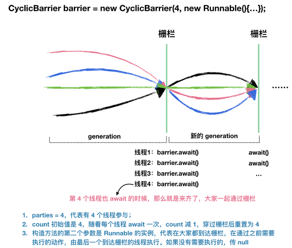

# 5 原子操作类

原子性这个概念，在多线程编程里是一个老生常谈的问题。 所谓的原子性表示一个或者多个操作，要么全部执行完， 要么一个也不执行。不能出现成功一部分失败一部分的情况。

在多线程中，如果多个线程同时更新一个共享变量，可能会得到一个意料之外的值。比如 i=1 。A 线程更新 i+1 、 B 线程也更新 i+1。 

通过两个线程并行操作之后可能 i 的值不等于 3。而可能等于 2。因为 A 和 B 在更新变量 i 的时候拿到的 i 可能都是 1 这就是一个典型的原子性问题。

前面几节课我们讲过，多线程里面，要实现原子性，有几种方法，其中一种就是加 Synchronized 同步锁。 

而从 JDK1.5 开始，在 J.U.C 包中提供了 Atomic 包，提供了 对于常用数据结构的原子操作。它提供了简单、高效、以 及线程安全的更新一个变量的方式。

## 5.1 J.U.C 中的原子操作类

由于变量类型的关系，在 J.U.C 中提供了 12 个原子操作的类。这 12 个类可以分为四大类 

原子更新基本类型 AtomicBoolean、AtomicInteger、AtomicLong

原子更新数组 AtomicIntegerArray 、 AtomicLongArray 、 AtomicReferenceArray

原子更新引用 AtomicReference 、 AtomicReferenceFieldUpdater 、 AtomicMarkableReference（更新带有标记位的引用类 型）

原子更新字段 AtomicIntegerFieldUpdater、AtomicLongFieldUpdater、 AtomicStampedReference

## 5.2 AtomicInteger 原理分析

接下来，我们来剖析一下 AtomicInteger 的实现原理，仍然是基于我们刚刚在前面的案例中使用到的方法作为突破口。

**getAndIncrement**

getAndIncrement 实际上是调用 unsafe 这个类里面提供的方法， Unsafe 类我们前面在分析 AQS 的时候讲过，这个类相当于是一个后门，使得 Java 可以像 C 语言的指针一样直接操作内存空间。当然也会带来一些弊端，就是指针的问题。 实际上这个类在很多方面都有使用，除了 J.U.C 这个包以外，还有 Netty、kafka 等等。

这个类提供了很多功能，包括多线程同步(monitorEnter)、 CAS 操 作 (compareAndSwap) 、线程的挂起和恢复 (park/unpark)、内存屏障(loadFence/storeFence) 、内存管理（内存分配、释放内存、获取内存地址等）。

```java
public final int getAndIncrement() {
    return unsafe.getAndAddInt(this, valueOffset, 1);
}
```

valueOffset，也比较熟了。通过 unsafe.objectFieldOffset() 获取当前 Value 这个变量在内存中的偏移量，后续会基于这个偏移量从内存中得到 value 的值来和当前的值做比较， 实现乐观锁。

```java
private static final long valueOffset;
static {
    try {
        valueOffset = unsafe.objectFieldOffset
            (AtomicInteger.class.getDeclaredField("value"));
    } catch (Exception ex) { throw new Error(ex); }
}
```

**getAndAddInt**

通过 do/while 循环，基于 CAS 乐观锁来做原子递增。实际上前面的 valueOffset 的作用就是从主内存中获得当前 value 的值和预期值做一个比较，如果相等，对 value 做递增并结束循环。

```java
public final int getAndAddInt(Object var1, long var2, int var4) {
    int var5;
    do {
        // 通过当前对象和偏移量拿到期望值 var5
        var5 = this.getIntVolatile(var1, var2);
    } while(!this.compareAndSwapInt(var1, var2, var5, var5 + var4));
    return var5;
}
```

**get 方法**

get 方法只需要直接返回 value 的值就行，这里的 value 是 通过 Volatile 修饰的，用来保证可见性。

```java
private volatile int value;
public final int get() {
    return value;
}
```

**其他方法**

AtomicInteger 的实现非常简单，所以我们可以很快就分析完它的实现原理，当然除了刚刚分析的这两个方法之外， 还有其他的一些 比如它提供了 compareAndSet ， 允许客户端基于 AtomicInteger 来实现乐观锁的操作。

```java
public final boolean compareAndSet(int expect, int update) { 
    return unsafe.compareAndSwapInt(this, valueOffset, expect, update); 
}
```

# 6 线程池

## 6.1 为什么用线程池

例子：10年前单核CPU电脑，假的多线程，像马戏团小丑玩多个球，CPU需要来回切换。 现在是多核电脑，多个线程各自跑在独立的CPU上，不用切换效率高。 

在 Java 中，如果每个请求到达就创建一个新线程，创建和销毁线程花费的时间和消耗的系统资源都相当大，甚至可能要比在处理实际的用户请求的时间和资源要多的多。

如果在一个 Jvm 里创建太多的线程，可能会使系统由于过度消耗内存或“切换过度”而导致系统资源不足。为了解决这个问题,就有了线程池的概念，线程池做的工作主要是控制运行的线程数量，``处理过程中将任务放入队列``，然后在线程创建后启动这些任务， ``如果线程数量超过了最大数量，超出数量的线程排队等候``，等其他线程执行完毕，再从队列中取出任务来执行。

它的主要特点为：``线程复用;控制最大并发数;管理线程``。

线程池的优势：

第一：降低资源消耗。通过重复利用已创建的线程降低线程创建和销毁造成的销耗。 

第二：提高响应速度。当任务到达时，任务可以不需要等待线程创建就能立即执行。 

第三：提高线程的可管理性。线程是稀缺资源，如果无限制的创建，不仅会销耗系统资源，还会降低系统的稳定性，使用线程池可以进行统一的分配，调优和监控。 

## 6.2 线程池的使用

### 架构说明

Java中的线程池是通过Executor框架实现的，该框架中用到了Executor，Executors，ExecutorService，ThreadPoolExecutor这几个类。

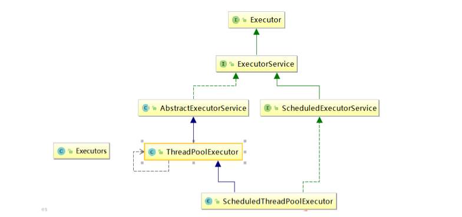

### 编码实现

在 Executors 里面提供了几个线程池的工厂方法，这样很多新手就不需要了解太多关于  ThreadPoolExecutor 的知识了，他们只需要直接使用 Executors 的工厂方法，就可以使用线程池。

#### Executors.newFixedThreadPool(int)

newFixedThreadPool创建的线程池corePoolSize和maximumPoolSize值是相等的，它使用的是LinkedBlockingQueue 

```java
//该方法返回一个固定数量的线程池，线程数不变，当有一个任务提交时，若线程池中空闲，则立即执行，若没有，则会被暂缓在一个任务队列中，等待有空闲的线程去执行。
public static ExecutorService newFixedThreadPool(int nThreads) {
    return new ThreadPoolExecutor(nThreads, nThreads,
                                  0L, TimeUnit.MILLISECONDS,
                                  new LinkedBlockingQueue<Runnable>());
}
```

#### Executors.newSingleThreadExecutor()

newSingleThreadExecutor 创建的线程池corePoolSize和maximumPoolSize值都是1，它使用的是LinkedBlockingQueue 

```java
// 创建一个线程的线程池，若空闲则执行，若没有空闲线程则暂缓在任务队列中
public static ExecutorService newSingleThreadExecutor() {
    return new FinalizableDelegatedExecutorService
        (new ThreadPoolExecutor(1, 1,
                                0L, TimeUnit.MILLISECONDS,
                                new LinkedBlockingQueue<Runnable>()));
}
```

#### Executors.newCachedThreadPool()

newCachedThreadPool创建的线程池将corePoolSize设置为0，将maximumPoolSize设置为Integer.MAX_VALUE，它使用的是SynchronousQueue，也就是说来了任务就创建线程运行，当线程空闲超过60秒，就销毁线程。 

```java
// 返回一个可根据实际情况调整线程个数的线程池，不限制最大线程数量，若用空闲的线程则执行任务，若无任务则不创建线程。并且每一个空闲线程会在 60 秒后自动回收
public static ExecutorService newCachedThreadPool() {
    return new ThreadPoolExecutor(0, Integer.MAX_VALUE,
                                  60L, TimeUnit.SECONDS,
                                  new SynchronousQueue<Runnable>());
}
```

```java
public class MyThreadPoolDemo {
    public static void main(String[] args) {
        // 一池5个工作线程
        //ExecutorService threadPool = Executors.newFixedThreadPool(5);
        // 一池1个工作线程
        //ExecutorService threadPool = Executors.newSingleThreadExecutor();
        // 一池n线程
        ExecutorService threadPool = Executors.newCachedThreadPool();
        try {
            for (int i = 1; i <= 10; i++) {
                //try { TimeUnit.SECONDS.sleep(1); } catch (InterruptedException e) { e.printStackTrace(); }
                threadPool.execute(() -> {
                    System.out.println(Thread.currentThread().getName() + "\t办理业务");
                });
            }
        } catch (Exception e) {
            e.printStackTrace();
        } finally {
            threadPool.shutdownNow();
        }
    }
}
```

**三种创建线程池的方法哪个用的多**

都不用，工作中只能使用自定义的

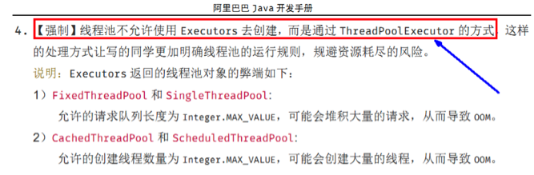

**newScheduledThreadPool**

创建一个可以指定线程的数量的线程池，但是这个线程池还带有延迟和周期性执行任务的功能，类似定时器。

## 6.3 线程池的参数

```java
public ThreadPoolExecutor(int corePoolSize,
                          int maximumPoolSize,
                          long keepAliveTime,
                          TimeUnit unit,
                          BlockingQueue<Runnable> workQueue,
                          ThreadFactory threadFactory,
                          RejectedExecutionHandler handler) {
    if (corePoolSize < 0 ||
        maximumPoolSize <= 0 ||
        maximumPoolSize < corePoolSize ||
        keepAliveTime < 0)
        throw new IllegalArgumentException();
    if (workQueue == null || threadFactory == null || handler == null)
        throw new NullPointerException();
    this.corePoolSize = corePoolSize;
    this.maximumPoolSize = maximumPoolSize;
    this.workQueue = workQueue;
    this.keepAliveTime = unit.toNanos(keepAliveTime);
    this.threadFactory = threadFactory;
    this.handler = handler;
}
```

``corePoolSize`` 线程池中的常驻核心线程数

``maximumPoolSize`` 线程池中能够容纳同时执行的最大线程数，此值必须大于等于1

``keepAliveTime`` 多余的空闲线程的存活时间，当前池中线程数量超过corePoolSize时，当空闲时间达到keepAliveTime时，多余线程会被销毁直到只剩下corePoolSize个线程为止

``unit`` keepAliveTime的单位 

``workQueue`` 任务队列，被提交但尚未被执行的任务

``threadFactory`` 表示生成线程池中工作线程的线程工厂，用于创建线程，一般默认的即可

``handler`` 拒绝策略，表示当队列满了，并且工作线程大于等于线程池的最大线程数（maximumPoolSize）时如何来拒绝请求执行的runnable的策略

## 6.4 工作原理

``ThreadPoolExecutor`` 是线程池的核心，提供了线程池的实现。

``ScheduledThreadPoolExecutor`` 继承了 ThreadPoolExecutor，并另外提供一些调度方法以支持定时和周期任务。Executers 是工具类，主要用来创建线程池对象。

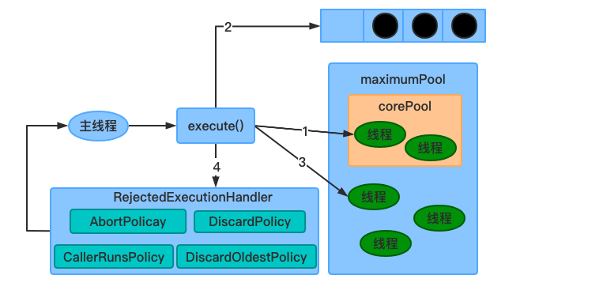

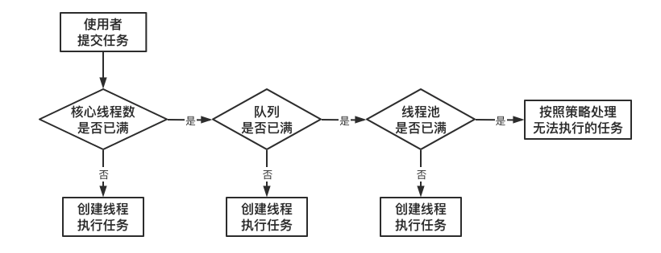

1. 在创建了线程池后，开始等待请求。 

2. 当调用 ``execute()`` 方法添加一个请求任务时，线程池会做出如下判断： 

   2.1 如果正在运行的线程数量小于 ``corePoolSize`` ，那么马上创建线程运行这个任务； 

   2.2 如果正在运行的线程数量大于或等于 ``orePoolSize`` ，那么将这个任务放入队列 ； 

   2.3 如果这个时候队列满了且正在运行的线程数量还小于``maximumPoolSize``，那么还是要创建非核心线程立刻运行该任务； 

   2.4 如果队列满了且正在运行的线程数量大于或等于 ``maximumPoolSize`` ，那么线程池会启动饱和拒绝策略来执行 。 

3. 当一个线程完成任务时，它会从队列中取下一个任务来执行。 

4. 当一个线程无事可做超过一定的时间``keepAliveTime``时，线程会判断： 如果当前运行的线程数大于 ``corePoolSize``，那么这个线程就被停掉。 所以线程池的所有任务完成后， 它最终会收缩到 ``corePoolSize``的大小 。 

6.7 源码分析

基于源码入口进行分析，先看 ``execute`` 方法：

```java
public void execute(Runnable command) {
    if (command == null)
        throw new NullPointerException();
    int c = ctl.get();
    //1.当前池中线程比核心数少，新建一个线程执行任务
    if (workerCountOf(c) < corePoolSize) {
        if (addWorker(command, true))
            return;
        c = ctl.get();
    }
    //2.核心池已满，但任务队列未满，添加到队列中
    if (isRunning(c) && workQueue.offer(command)) {
        int recheck = ctl.get();
        //任务成功添加到队列以后，再次检查是否需要添加新的线程，因为已存在的线程可能被销毁了
        if (! isRunning(recheck) && remove(command))
            //如果线程池处于非运行状态，并且把当前的任务从任务队列中移除成功，则拒绝该任务
            reject(command);
        //如果之前的线程已被销毁完，新建一个线程
        else if (workerCountOf(recheck) == 0)
            addWorker(null, false);
    }
    //3.核心池已满，队列已满，试着创建一个新线程
    else if (!addWorker(command, false))
        //如果创建新线程失败了，说明线程池被关闭或者线程池完全满了，拒绝任务
        reject(command);
}
```

6.7.1 ctl 的作用

在线程池中，ctl 贯穿在线程池的整个生命周期中

```java
private final AtomicInteger ctl = new AtomicInteger(ctlOf(RUNNING, 0));
```

它是一个原子类，主要作用是用来保存线程数量和线程池的状态。我们来分析一下这段代码，其实比较有意思，他用到了位运算一个 int 数值是 32 个 bit 位，这里采用高 3 位来保存运行状态，低 29 位来保存线程数量。

我们来分析默认情况下，也就是 ctlOf(RUNNING, 0) 调用了 ctlOf(int rs,int wc) 方法；

```java
// Integer.java
public static final int SIZE = 32;
// ThreadPoolExecutor.java
private static final int COUNT_BITS = Integer.SIZE - 3;
private static final int RUNNING    = -1 << COUNT_BITS;
private static int runStateOf(int c)     { return c & ~CAPACITY; }
private static int workerCountOf(int c)  { return c & CAPACITY; }
private static int ctlOf(int rs, int wc) { return rs | wc; }
```

其中 RUNNING 为 -1 左移 29 位。

-1 的二进制是 32 个 1【1111 1111 11111111 1111 1111 1111 1111】

> -1 的二进制计算方法
> 原码是 1000…001 高位 1 表示符号位
> 然后对原码取反，高位不变得到 1111…110
> 然后对反码进行+1 ，也就是补码操作， 最后得到 1111…1111

那么-1 左移 29 位， 也就是 【111】 表示；rs | wc，二进制的 111 | 000 。得到的结果仍然是 111。

那么同理可得其他的状态的 bit 位表示：

```java
private static final int CAPACITY = (1 << COUNT_BITS) - 1; //将 1 的二进制向左位移 29 位,再减 1 表示最大线程容量，二进制也即是29个1
//运行状态保存在 int 值的高 3 位 (所有数值左移 29 位)
private static final int RUNNING = -1 << COUNT_BITS;// 接收新任务,并执行队列中的任务
private static final int SHUTDOWN = 0 << COUNT_BITS;// 不接收新任务,但是执行队列中的任务
private static final int STOP = 1 << COUNT_BITS;// 不接收新任务,不执行队列中的任务,中断正在执行中的任务
private static final int TIDYING = 2 << COUNT_BITS; //所有的任务都已结束,线程数量为 0,处于该状态的线程池即将调用 terminated()方法
private static final int TERMINATED = 3 << COUNT_BITS;// terminated()方法执行完成
```

**状态转化**

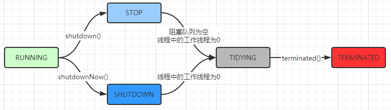

6.7.2 addWorker

如果工作线程数小于核心线程数的话，会调用 addWorker，顾名思义，其实就是要创建一个工作线程。我们来看看源码的实现源码比较长，看起来比较唬人，其实就做了两件事。

1. 才用循环 CAS 操作来将线程数加 1

2. 新建一个线程并启用

```java
private boolean addWorker(Runnable firstTask, boolean core) {
    retry: //goto 语句,避免死循环
    for (;;) {
        int c = ctl.get();
        int rs = runStateOf(c);
        // 如果线程处于非运行状态，并且 rs 不等于 SHUTDOWN 且 firstTask 不等于空且 workQueue 为空，直接返回 false（表示不可添加 work 状态）
		//1. 线程池已经 shutdown 后，还要添加新的任务，拒绝
		//2. （第二个判断）SHUTDOWN 状态不接受新任务，但仍然会执行已经加入任务队列的任务，所以当进入 SHUTDOWN 状态，而传进来的任务为空，并且任务队列不为空的时候，是允许添加新线程的,如果把这个条件取反，就表示不允许添加 worker
        if (rs >= SHUTDOWN &&
            ! (rs == SHUTDOWN &&
               firstTask == null &&
               ! workQueue.isEmpty()))
            return false;
        for (;;) { //自旋
            //获得 Worker 工作线程数
            int wc = workerCountOf(c);
            //如果工作线程数大于默认容量大小或者大于核心线程数大小，则直接返回 false 表示不能再添加 worker
            if (wc >= CAPACITY ||
                wc >= (core ? corePoolSize : maximumPoolSize))
                return false;
            //通过 cas 来增加工作线程数，如果 cas 失败，则直接重试
            if (compareAndIncrementWorkerCount(c))
                break retry;
            //再次获取 ctl 的值
            c = ctl.get();  // Re-read ctl
            if (runStateOf(c) != rs)
                continue retry;
            // else CAS failed due to workerCount change; retry inner loop
        }
    }
    //上面这段代码主要是对 worker 数量做原子+1 操作,下面的逻辑才是正式构建一个 worker
    boolean workerStarted = false;//工作线程是否启动的标识
    boolean workerAdded = false;//工作线程是否已经添加成功的标识
    Worker w = null;
    try {
        //构建一个 Worker，这个 worker 是什么呢？我们可以看到构造方法里面传入了一个 Runnable 对象
        w = new Worker(firstTask);
        final Thread t = w.thread;//从 worker 对象中取出线程
        if (t != null) {
            final ReentrantLock mainLock = this.mainLock;
            mainLock.lock();//这里有个重入锁，避免并发问题
            try {
                // Recheck while holding lock.
                // Back out on ThreadFactory failure or if
                // shut down before lock acquired.
                int rs = runStateOf(ctl.get());
                //只有当前线程池是正在运行状态，[或是 SHUTDOWN 且 firstTask 为空]，才能添加到 workers 集合中
                if (rs < SHUTDOWN ||
                    (rs == SHUTDOWN && firstTask == null)) {
                    //任务刚封装到 work 里面，还没 start,你封装的线程就是 alive，几个意思？肯定是要抛异常出去的
                    if (t.isAlive()) // precheck that t is startable
                        throw new IllegalThreadStateException();
                    //将新创建的 Worker 添加到 workers 集合中
                    workers.add(w);
                    int s = workers.size();
                    //如果集合中的工作线程数大于最大线程数，这个最大线程数表示线程池曾经出现过的最大线程数
                    if (s > largestPoolSize)
                        largestPoolSize = s; //更新线程池出现过的最大线程数
                    workerAdded = true;//表示工作线程创建成功了
                }
            } finally {
                mainLock.unlock();//释放锁
            }
            if (workerAdded) {//如果 worker 添加成功
                t.start();//启动线程
                workerStarted = true;
            }
        }
    } finally {
        if (! workerStarted)
            addWorkerFailed(w);//如果添加失败，就需要做一件事，就是递减实际工作线程数(还记得我们最开始的时候增加了工作线程数吗)
    }
    return workerStarted;
}
```

6.7.3 Worker 类说明

我们发现 addWorker 方法只是构造了一个 Worker，并且把 firstTask 封装到 worker 中，它是做什么的呢？我们来看看

1. 每个 worker,都是一条线程,同时里面包含了一个 firstTask,即初始化时要被首先执行的任务.

2. 最终执行任务的,是 runWorker()方法

Worker 类继承了 AQS，并实现了 Runnable 接口，注意其中的 firstTask 和 thread 属性：

`firstTask` 用它来保存传入的任务；

`thread` 是在调用构造方法时通过 ThreadFactory 来创建的线程，是用来处理任务的线程。

在调用构造方法时，需要传入任务，这里通过 `getThreadFactory().newThread(this);` 来新建一个线程，newThread 方法传入的参数是 this，因为 Worker 本身继承了 Runnable 接口，也就是一个线程，所以一个 Worker 对象在启动的时候会调用 Worker 类中的 run 方法。

Worker 继承了 AQS，使用 AQS 来实现独占锁的功能。为什么不使用 ReentrantLock 来实现呢？可以看到 tryAcquire 方法，它是不允许重入的，而 ReentrantLock 是允许重入的。

lock 方法一旦获取了独占锁，表示当前线程正在执行任务中；那么它会有以下几个作用：

1. 如果正在执行任务，则不应该中断线程；

2. 如果该线程现在不是独占锁的状态，也就是空闲的状态，说明它没有在处理任务，这时可以对该线程进行中断；
3. 线程池在执行 shutdown 方法或 tryTerminate 方法时会调用 interruptIdleWorkers 方法来中断空闲的线程，interruptIdleWorkers 方法会使用 tryLock 方法来判断线程池中的线程是否是空闲状态

4. 之所以设置为不可重入，是因为我们不希望任务在调用像 setCorePoolSize 这样的线程池控制方法时重新获取锁，这样会中断正在运行的线程

```java
private final class Worker
    extends AbstractQueuedSynchronizer
    implements Runnable
{
    /**
     * This class will never be serialized, but we provide a
     * serialVersionUID to suppress a javac warning.
     */
    private static final long serialVersionUID = 6138294804551838833L;
    /** Thread this worker is running in.  Null if factory fails. */
    final Thread thread;
    /** Initial task to run.  Possibly null. */
    Runnable firstTask;
    /** Per-thread task counter */
    volatile long completedTasks;
    /**
     * Creates with given first task and thread from ThreadFactory.
     * @param firstTask the first task (null if none)
     */
    Worker(Runnable firstTask) {
        setState(-1); // inhibit interrupts until runWorker
        this.firstTask = firstTask;
        this.thread = getThreadFactory().newThread(this);
    }
    /** Delegates main run loop to outer runWorker  */
    public void run() {
        runWorker(this);
    }
    // Lock methods
    //
    // The value 0 represents the unlocked state.
    // The value 1 represents the locked state.
    protected boolean isHeldExclusively() {
        return getState() != 0;
    }
    protected boolean tryAcquire(int unused) {
        if (compareAndSetState(0, 1)) {
            setExclusiveOwnerThread(Thread.currentThread());
            return true;
        }
        return false;
    }
    protected boolean tryRelease(int unused) {
        setExclusiveOwnerThread(null);
        setState(0);
        return true;
    }
    public void lock()        { acquire(1); }
    public boolean tryLock()  { return tryAcquire(1); }
    public void unlock()      { release(1); }
    public boolean isLocked() { return isHeldExclusively(); }
    void interruptIfStarted() {
        Thread t;
        if (getState() >= 0 && (t = thread) != null && !t.isInterrupted()) {
            try {
                t.interrupt();
            } catch (SecurityException ignore) {
            }
        }
    }
}
```

6.7.4 addWorkerFailed

addWorker 方法中，如果添加 Worker 并且启动线程失败，则会做失败后的处理。

这个方法主要做两件事：

1. 如果 worker 已经构造好了，则从 workers 集合中移除这个 worker

2. 原子递减核心线程数（因为在 addWorker 方法中先做了原子增加）

3. 尝试结束线程池

```java
private void addWorkerFailed(Worker w) {
    final ReentrantLock mainLock = this.mainLock;
    mainLock.lock();
    try {
        if (w != null)
            workers.remove(w);
        decrementWorkerCount();
        tryTerminate();
    } finally {
        mainLock.unlock();
    }
}
```

6.7.5 runWorker 方法

前面已经了解了 ThreadPoolExecutor 的核心方法 addWorker，主要作用是增加工作线程，而 Worker 简单理解其实就是一个线程，里面重新了 run 方法，这块是线程池中执行任务的真正处理逻辑，也就是 runWorker 方法，这个方法主要做几件事：

1. 如果 task 不为空,则开始执行 task

2. 如果 task 为空,则通过 getTask()再去取任务,并赋值给 task,如果取到的 Runnable 不为空,则执行该任务

3. 执行完毕后,通过 while 循环继续 getTask()取任务

4. 如果 getTask()取到的任务依然是空,那么整个 runWorker()方法执行完毕

```java
final void runWorker(Worker w) {
    Thread wt = Thread.currentThread();
    Runnable task = w.firstTask;
    w.firstTask = null;
    //unlock，表示当前 worker 线程允许中断，因为 new Worker 默认的 state=-1,此处是调用
	//Worker 类的 tryRelease()方法，将 state 置为 0， 而 interruptIfStarted()中只有 state>=0 才允许调用中断
    w.unlock(); // allow interrupts
    boolean completedAbruptly = true;
    try {
        //注意这个 while 循环,在这里实现了 [线程复用] 
        // 如果 task 为空，则通过getTask 来获取任务
        while (task != null || (task = getTask()) != null) {
            //上锁，不是为了防止并发执行任务，为了在 shutdown()时不终止正在运行的 worker线程池为 stop 状态时不接受新任务，不执行已经加入任务队列的任务，还中断正在执行的任务
            w.lock();
            //所以对于 stop 状态以上是要中断线程的
			//(Thread.interrupted() &&runStateAtLeast(ctl.get(), STOP)确保线程中断标志位为 true 且是 stop 状态以上，接着清除了中断标志
			//!wt.isInterrupted()则再一次检查保证线程需要设置中断标志位
            if ((runStateAtLeast(ctl.get(), STOP) ||
                 (Thread.interrupted() &&
                  runStateAtLeast(ctl.get(), STOP))) &&
                !wt.isInterrupted())
                wt.interrupt();
            try {
                //这里默认是没有实现的，在一些特定的场景中我们可以自己继承 ThreadpoolExecutor 自己重写
                beforeExecute(wt, task);
                Throwable thrown = null;
                try {
                    //执行任务中的 run 方法
                    task.run();
                } catch (RuntimeException x) {
                    thrown = x; throw x;
                } catch (Error x) {
                    thrown = x; throw x;
                } catch (Throwable x) {
                    thrown = x; throw new Error(x);
                } finally {
                    //这里默认默认而也是没有实现
                    afterExecute(task, thrown);
                }
            } finally {
                //置空任务(这样下次循环开始时,task 依然为 null,需要再通过 getTask()取) + 记录该 Worker 完成任务数量 + 解锁
                task = null;
                w.completedTasks++;
                w.unlock();
            }
        }
        completedAbruptly = false;
    } finally {
        processWorkerExit(w, completedAbruptly);
        //1.将入参 worker 从数组 workers 里删除掉；
		//2.根据布尔值 allowCoreThreadTimeOut 来决定是否补充新的 Worker 进数组workers
    }
}
```

6.7.6 getTask

worker 线程会从阻塞队列中获取需要执行的任务，这个方法不是简单的 take 数据，我们来分析下他的源码实现。

你也许好奇是怎样判断线程有多久没有活动了，是不是以为线程池会启动一个监控线程，专门监控哪个线程正在偷懒？想太多，其实只是在线程从工作队列 poll 任务时，加上了超时限制，如果线程在 keepAliveTime 的时间内 poll 不到任务，那我就认为这条线程没事做，可以干掉了，看看这个代码片段你就清楚了。

```java
private Runnable getTask() {
    boolean timedOut = false; // Did the last poll() time out?
    for (;;) {//自旋
        int c = ctl.get();
        int rs = runStateOf(c);
        // 对线程池状态的判断，两种情况会 workerCount-1，并且返回 null
     	//1. 线程池状态为 shutdown，且 workQueue 为空（反映了 shutdown 状态的线程池还是要执行 workQueue 中剩余的任务的）
 		//2. 线程池状态为 stop（shutdownNow()会导致变成 STOP）（此时不用考虑 workQueue的情况）
        // Check if queue empty only if necessary.
        if (rs >= SHUTDOWN && (rs >= STOP || workQueue.isEmpty())) {
            decrementWorkerCount();
            return null;//返回 null，则当前 worker 线程会退出
        }
        int wc = workerCountOf(c);
        // timed 变量用于判断是否需要进行超时控制。
		// allowCoreThreadTimeOut 默认是 false，也就是核心线程不允许进行超时；
 		// wc > corePoolSize，表示当前线程池中的线程数量大于核心线程数量；
 		// 对于超过核心线程数量的这些线程，需要进行超时控制
        // Are workers subject to culling?
        boolean timed = allowCoreThreadTimeOut || wc > corePoolSize;
        //1. 线程数量超过 maximumPoolSize 可能是线程池在运行时被调用了 setMaximumPoolSize()被改变了大小，否则已经 addWorker()成功不会超过 maximumPoolSize
		//2. timed && timedOut 如果为 true，表示当前操作需要进行超时控制，并且上次从阻塞队列中获取任务发生了超时.其实就是体现了空闲线程的存活时间
        if ((wc > maximumPoolSize || (timed && timedOut))
            && (wc > 1 || workQueue.isEmpty())) {
            if (compareAndDecrementWorkerCount(c))
                return null;
            continue;
        }
        try {
            //根据 timed 来判断，如果为 true，则通过阻塞队列 poll 方法进行超时控制，如果在
			//keepaliveTime 时间内没有获取到任务，则返回 null.
			//否则通过 take 方法阻塞式获取队列中的任务
            Runnable r = timed ?
                workQueue.poll(keepAliveTime, TimeUnit.NANOSECONDS) :
                workQueue.take();
            if (r != null)//如果拿到的任务不为空，则直接返回给 worker 进行处理
                return r;
            timedOut = true;//如果 r==null，说明已经超时了，设置 timedOut=true，在下次自旋的时候进行回收
        } catch (InterruptedException retry) {
            timedOut = false;// 如果获取任务时当前线程发生了中断，则设置 timedOut 为false 并返回循环重试
        }
    }
}
```

这里重要的地方是第二个 if 判断，目的是控制线程池的有效线程数量。由上文中的分析可以知道，在执行 execute 方法时，如果当前线程池的线程数量超过了 corePoolSize 且小于 maximumPoolSize，并且 workQueue 已满时，则可以增加工作线程，但这时如果超时没有获取到任务，也就是 timedOut 为 true 的情况，说明 workQueue 已经为空了，也就说明了当前线程池中不需要那么多线程来执行任务了，可以把多于 corePoolSize 数量的线程销毁掉，保持线程数量在 corePoolSize 即可。

什么时候会销毁？当然是 runWorker 方法执行完之后，也就是 Worker 中的 run 方法执行完，由 JVM 自动回收。getTask 方法返回 null 时，在 runWorker 方法中会跳出 while 循环，然后会执行processWorkerExit 方法。

6.7.7 processWorkerExit

runWorker 的 while 循环执行完毕以后，在 finally 中会调用 processWorkerExit，来销毁工作线程。

到目前为止，我们已经从 execute 方法中输入了 worker 线程的创建到执行以及最后到销毁的全部过程。那么我们继续回到 execute 方法。

我们只分析完 addWorker 这段逻辑，继续来看后面的判断 execute 后续逻辑分析。

如果核心线程数已满，说明这个时候不能再创建核心线程了，于是走第二个判断

第二个判断逻辑比较简单，如果线程池处于运行状态并且任务队列没有满，则将任务添加到队列中

第三个判断，核心线程数满了，队列也满了，那么这个时候创建新的线程也就是（非核心线程）

如果非核心线程数也达到了最大线程数大小，则直接拒绝任务。

```java
if (isRunning(c) && workQueue.offer(command)) {//2.核心池已满，但任务队列未满，添加到队列中
 int recheck = ctl.get();
//任务成功添加到队列以后，再次检查是否需要添加新的线程，因为已存在的线程可能被销毁了
 if (! isRunning(recheck) && remove(command))
 reject(command);//如果线程池处于非运行状态，并且把当前的任务从任务队列中移除成功，则拒绝该任务
 else if (workerCountOf(recheck) == 0)//如果之前的线程已被销毁完，新建一个线程
 addWorker(null, false);
 }
else if (!addWorker(command, false)) //3.核心池已满，队列已满，试着创建一个新线程
 reject(command); //如果创建新线程失败了，说明线程池被关闭或者线程池完全满了，拒绝任务
```

## 6.7 拒绝策略

等待队列已经排满了 ，再也塞不下新任务了，同时， 线程池中的max线程也达到了 ，无法继续为新任务服务。 这个时候我们就需要拒绝策略机制合理的处理这个问题。 

``AbortPolicy(默认)`` 直接抛出``RejectedExecutionException``异常阻止系统正常运行

``CallerRunsPolicy`` “调用者运行”一种调节机制，该策略既不会抛弃任务，也不会抛出异常，而是将某些任务回退到调用者，从而降低新任务的流量。

``DiscardOldestPolicy`` 抛弃队列中等待最久的任务，然后把当前任务加人队列中尝试再次提交当前任务。

``DiscardPolicy`` 该策略默默地丢弃无法处理的任务，不予任何处理也不抛出异常。如果允许任务丢失，这是最好的一种策略。

以上内置拒绝策略均实现了``RejectedExecutionHandle``接口，当然也可以根据应用场景实现 RejectedExecutionHandler 接口，自定义饱和策略，如记录日志或持久化存储不能处理的任务。

## 6.8 自定义线程池

```java
// maximumPoolSize
//如果是 CPU 密集型，主要是执行计算任务，响应时间很快，cpu 一直在运行，这种任务 cpu 的利用率很高，那么线程数的配置应该根据 CPU 核心数来决定，CPU 核心数=最大同时执行线程数，加入 CPU 核心数为 4，那么服务器最多能同时执行 4 个线程。过多的线程会导致上下文切换反而使得效率降低。
// 那线程池的最大线程数可以配置为 cpu 核心数+1~2
// CPU 密集型 Runtime.getRuntime().availableProcessors()(CPU核心数，逻辑处理器) + 1~2
// 如果是 IO 密集型，主要是进行 IO 操作，执行 IO 操作的时间较长，这是 cpu 出于空闲状态，导致 cpu 的利用率不高，这种情况下可以增加线程池的大小。这种情况下可以结合线程的等待时长来做判断，等待时间越高，那么线程数也相对越多。一般可以配置 cpu 核心数的 2 倍。
//一个公式：
//线程池设定最佳线程数目 = （（线程池设定的线程等待时间+线程 CPU 时间）/线程 CPU 时间 ）* CPU 数目
//这个公式的线程 cpu 时间是预估的程序单个线程在 cpu 上运行的时间（通常使用 loadrunner测试大量运行次数求出平均值）
ExecutorService threadPool = new ThreadPoolExecutor(
        2,
        5,
        2L,
        TimeUnit.SECONDS,
        new LinkedBlockingQueue<>(3),
        Executors.defaultThreadFactory(),
        new ThreadPoolExecutor.AbortPolicy());
```

# 7 ForkJoin

Fork：把一个复杂任务进行分拆，大事化小 

Join：把分拆任务的结果进行合并 

``ForkJoinPool ``分支合并池  类比=>  线程池 

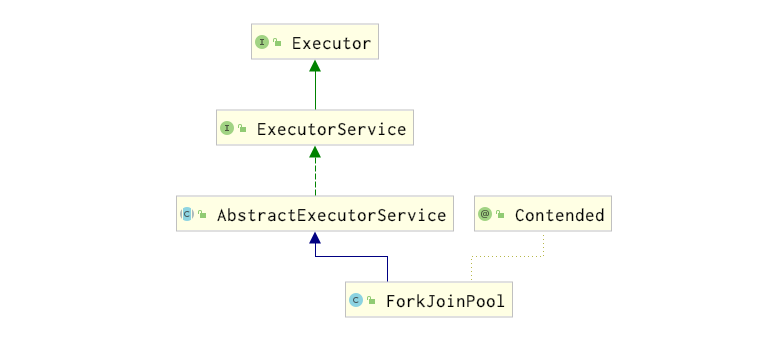

``ForkJoinTask``  类比=>  FutureTask 

递归任务：继承后可以实现递归(自己调自己)调用的任务 


```java
class MyTask extends RecursiveTask<Integer> {

    private static final Integer ADJUST_VALUE = 10;

    private int begin;
    private int end;
    private int result;

    public MyTask(int begin, int end) {
        this.begin = begin;
        this.end = end;
    }

    @Override
    protected Integer compute() {
        if ((end - begin) <= ADJUST_VALUE) {
            for (int i = begin; i <= end; i++) {
                result = result + i;
            }
        } else {
            int middle = (end + begin) / 2;
            MyTask task01 = new MyTask(begin, middle);
            MyTask task02 = new MyTask(middle + 1, end);
            task01.fork();
            task02.fork();
            result = task01.join() + task02.join();
        }
        return result;
    }
}

public class ForkJoinDemo {
    public static void main(String[] args) throws ExecutionException, InterruptedException {
        MyTask myTask = new MyTask(0, 100);
        ForkJoinPool threadPool = new ForkJoinPool();

        ForkJoinTask<Integer> forkJoinTask = threadPool.submit(myTask);
        System.out.println(forkJoinTask.get());

        threadPool.shutdown();
    }
}
```

# 8 CompletableFuture

异步回调

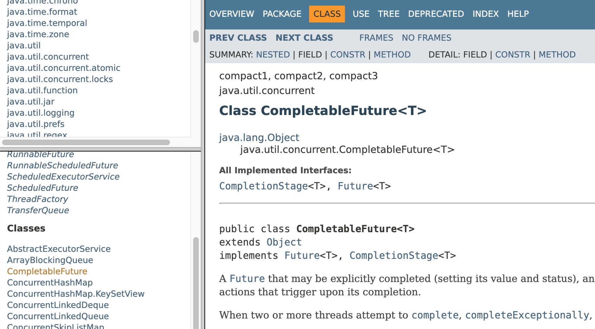

```java
public class CompletableFutureDemo {
    public static void main(String[] args) throws ExecutionException, InterruptedException {
        CompletableFuture<Void> c = CompletableFuture.runAsync(() -> {
            System.out.println(Thread.currentThread().getName() + "没有返回");
        });
        c.get();

        // 异步回调
        CompletableFuture<Integer> c1 = CompletableFuture.supplyAsync(() -> {
            System.out.println(Thread.currentThread().getName() + "有返回");
            //int age = 10 / 0;
            return 1024;
        });
        System.out.println(c1.whenComplete((t, u) -> {
            System.out.println("***********t: " + t);
            System.out.println("***********u: " + u);
        }).exceptionally(f -> {
            System.out.println("***********exception: " + f.getMessage());
            return 404;
        }).get());
    }
}
```

------

