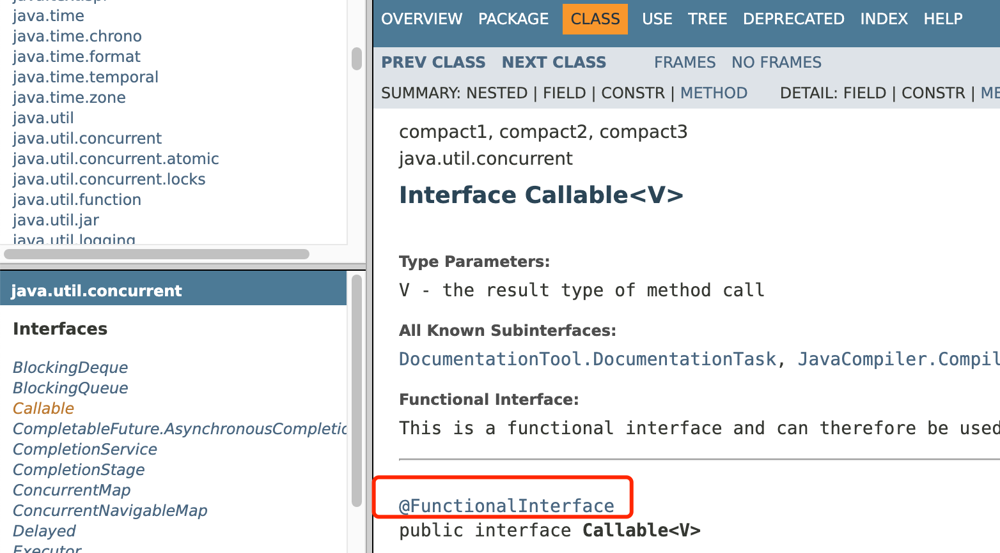
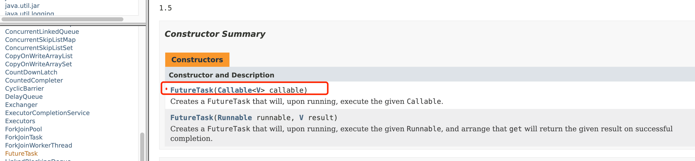

1 Condition

既然 J.U.C 里面提供了锁的实现机制，那 J.U.C 里面有没有提供类似的线程通信的工具呢？ 

于是发现了一个 Condition 工具类。 Condition 是一个多线程协调通信的工具类，可以让某些线程一起等待某个条件（condition），只有满足条件时，线程才会被唤醒。

1.1 线程间通信

1. 生产者 + 消费者
2. 通知等待唤醒机制

1.2 synchronized 实现

```java
class AirConditioner {
    private int number = 0;

    public synchronized void increment() throws InterruptedException {
        // 判断，如果是if，被唤醒时不会重新检查
        while (number != 0) {
            this.wait();
        }
        // 执行
        number++;
        System.out.println(Thread.currentThread().getName() + "\t" + number);
        // 通知
        this.notifyAll();
    }

    public synchronized void decrement() throws InterruptedException {
        while (number == 0) {
            this.wait();
        }
        number--;
        System.out.println(Thread.currentThread().getName() + "\t" + number);
        this.notifyAll();
    }
}

/**
 * 两个线程，操作一个初始值为0的变量
 * 实现一个线程对该变量+1，一个-1
 * 实现交替，10轮，变量初始值为0
 *
 * 判断/执行/通知
 * 多线程交互中，必须要防止多线程的虚假唤醒，也就（判断用while，不用if）
 */
public class ThreadWaitNotifyDemo {
    public static void main(String[] args) {
        AirConditioner airConditioner = new AirConditioner();
        new Thread(() -> {
            for (int i = 1; i <= 10; i++) {
                try {
                    Thread.sleep(200);
                    airConditioner.increment();
                } catch (InterruptedException e) {
                    e.printStackTrace();
                }
            }
        }, "A").start();
        new Thread(() -> {
            for (int i = 1; i <= 10; i++) {
                try {
                    Thread.sleep(300);
                    airConditioner.decrement();
                } catch (InterruptedException e) {
                    e.printStackTrace();
                }
            }
        }, "B").start();
    }
}
```

1.2 Condition 实现

```java
class AirConditioner {
    private int number = 0;

    private Lock lock = new ReentrantLock();
    private Condition condition = lock.newCondition();

    public void increment() throws InterruptedException {
        lock.lock();
        try {
            // 判断，如果是if，被唤醒时不会重新检查
            while (number != 0) {
                condition.await(); //this.wait();
            }
            // 执行
            number++;
            System.out.println(Thread.currentThread().getName() + "\t" + number);
            // 通知
            condition.signalAll(); //this.notifyAll();
        } finally {
            lock.unlock();
        }
    }

    public synchronized void decrement() throws InterruptedException {
        lock.lock();
        try {
            while (number == 0) {
                condition.await();
            }
            number--;
            System.out.println(Thread.currentThread().getName() + "\t" + number);
            condition.signalAll();
        } finally {
            lock.unlock();
        }
    }
}
```

1.3.1 多线程协调通信

```java
class ShareResource {

    //1:A 2:B 3:C
    private int number = 1;
    private Lock lock = new ReentrantLock();
    private Condition condition1 = lock.newCondition();
    private Condition condition2 = lock.newCondition();
    private Condition condition3 = lock.newCondition();

    public void print5() {
        lock.lock();
        try {
            while (number != 1) {
                condition1.await();
            }
            for (int i = 1; i <= 5; i++) {
                System.out.println(Thread.currentThread().getName() + "\t" + i);
            }
            number = 2;
            condition2.signal();
        } catch (InterruptedException e) {
            e.printStackTrace();
        } finally {
            lock.unlock();
        }
    }

    public void print10() {
        lock.lock();
        try {
            while (number != 2) {
                condition2.await();
            }
            for (int i = 1; i <= 10; i++) {
                System.out.println(Thread.currentThread().getName() + "\t" + i);
            }
            number = 3;
            condition3.signal();
        } catch (InterruptedException e) {
            e.printStackTrace();
        } finally {
            lock.unlock();
        }
    }

    public void print15() {
        lock.lock();
        try {
            while (number != 3) {
                condition3.await();
            }
            for (int i = 1; i <= 15; i++) {
                System.out.println(Thread.currentThread().getName() + "\t" + i);
            }
            number = 1;
            condition1.signal();
        } catch (InterruptedException e) {
            e.printStackTrace();
        } finally {
            lock.unlock();
        }
    }
}

/**
 * 多线程之间实现A->B->C
 *
 * 1. 在高内聚低耦合的前提下，线程   操作（对外暴露的调用方法）   资源类
 * 2. 断/执行/通知
 * 3. 多线程交互中，必须要防止多线程的虚假唤醒，也就（判断用while，不用if）
 * 4. 标识位
 */
public class ThreadOrderAccess {
    public static void main(String[] args) {
        ShareResource shareResource = new ShareResource();
        new Thread(() -> {
            for (int i = 1; i <= 10; i++) {
                shareResource.print5();
            }
        }, "AA").start();
        new Thread(() -> {
            for (int i = 1; i <= 10; i++) {
                shareResource.print10();
            }
        }, "BB").start();
        new Thread(() -> {
            for (int i = 1; i <= 10; i++) {
                shareResource.print15();
            }
        }, "CC").start();
    }
}
```

当调用 await 方法后，当前线程会释放锁并等待，而其他线程调用 condition 对象的 signal 或者 signalall 方法通知并被阻塞的线程，然后自己执行 unlock 释放锁，被唤醒的线程获得之前的锁继续执行，最后释放锁。 所以，condition 中两个最重要的方法，一个是 await，一 个是 signal 方法 

`await` 把当前线程阻塞挂起

`signal` 唤醒阻塞的线程

1.4 Condition 源码分析

调用 Condition，需要获得 Lock 锁，所以意味着会存在一个 AQS 同步队列，在上面那个案例中，假如两个线程同时运行的话，那么 AQS 的队列可能是下面这种情况。


那么这个时候 Thread1 调用了 condition.await 方法，它做了什么事情呢？

**condition.await**

调用 Condition 的 await()方法（或者以 await 开头的方法）， 会使当前线程进入等待队列并释放锁，同时线程状态变为等待状态。当从 await() 方法返回时，当前线程一定获取了 Condition 相关联的锁。

```java
public final void await() throws InterruptedException {
    //表示 await 允许被中断
    if (Thread.interrupted())
        throw new InterruptedException();
    //创建一个新的节点，节点状态为 condition，采用的数据结构仍然是链表
    Node node = addConditionWaiter();
    //释放当前的锁，得到锁的状态，并唤醒 AQS 队列中的一个线程
    long savedState = fullyRelease(node);
    int interruptMode = 0;
    //如果当前节点没有在同步队列上，即还没有被 signal，则将当前线程阻塞
    //判断这个节点是否在 AQS 队列上，第一次判断的是 false，因为前面已经释放锁了
    while (!isOnSyncQueue(node)) {
         //通过 park 挂起当前线程
        LockSupport.park(this);
        if ((interruptMode = checkInterruptWhileWaiting(node)) != 0)
            break;
    }
    // 当这个线程醒来,会尝试拿锁, 当 acquireQueued返回 false 就是拿到锁了.
 	// interruptMode != THROW_IE -> 表示这个线程没有成功将 node 入队,但 signal 执行了 enq 方法让其入队了.
	// 将这个变量设置成 REINTERRUPT.
    if (acquireQueued(node, savedState) && interruptMode != THROW_IE)
        interruptMode = REINTERRUPT;
    // 如果 node 的下一个等待者不是 null, 则进行清理,清理 Condition 队列上的节点.
	// 如果是 null ,就没有什么好清理的了.
    if (node.nextWaiter != null) // clean up if cancelled
        unlinkCancelledWaiters();
    // 如果线程被中断了,需要抛出异常.或者什么都不做
    if (interruptMode != 0)
        reportInterruptAfterWait(interruptMode);
}
```

**addConditionWaiter**

这个方法的主要作用是把当前线程封装成 Node，添加到 等待队列。这里的队列不再是双向链表，而是单向链表。

```java
private Node addConditionWaiter() {
    Node t = lastWaiter;
    // If lastWaiter is cancelled, clean out.
    // 如果 lastWaiter 不等于空并且 waitStatus 不等于 CONDITION 时，把这个节点从链表中移除
    if (t != null && t.waitStatus != Node.CONDITION) {
        unlinkCancelledWaiters();
        t = lastWaiter;
    }
    //构建一个 Node，waitStatus=CONDITION。这里的链表是一个单向的，所以相比 AQS 来说会简单很多
    Node node = new Node(Thread.currentThread(), Node.CONDITION);
    if (t == null)
        firstWaiter = node;
    else
        t.nextWaiter = node;
    lastWaiter = node;
    return node;
}
```

**图解分析 **

执行完 addConditionWaiter 这个方法之后，就会产生一个这样的 condition 队列


**fullyRelease**

fullRelease，就是彻底的释放锁，什么叫彻底呢，就是如果当前锁存在多次重入，那么在这个方法中只需要释放一次就会把所有的重入次数归零。

```java
final long fullyRelease(Node node) {
    boolean failed = true;
    try {
        //获得重入的次数
        long savedState = getState();
        //释放锁并且唤醒下一个同步队列中的线程
        if (release(savedState)) {
            failed = false;
            return savedState;
        } else {
            throw new IllegalMonitorStateException();
        }
    } finally {
        if (failed)
            node.waitStatus = Node.CANCELLED;
    }
}
```

**图解分析 **

此时，同步队列会触发锁的释放和重新竞争。Thread2 获得了锁。


**isOnSyncQueue**

判断当前节点是否在同步队列中，返回 false 表示不在，返回 true 表示在。

如果不在 AQS 同步队列，说明当前节点没有唤醒去争抢同步锁，所以需要把当前线程阻塞起来，直到其他的线程调用 signal 唤醒。

如果在 AQS 同步队列，意味着它需要去竞争同步锁去获得执行程序执行权限。

为什么要做这个判断呢？原因是在 condition 队列中的节点会重新加入到 AQS 队列去竞争锁。也就是当调用 signal 的时候，会把当前节点从 condition 队列转移到 AQS 队列。

基于现在的逻辑结构。如何去判断 Thread1 这个节点是否存在于 AQS 队列中呢？ 

1. 如果 Thread1 的 waitStatus 的状态为 CONDITION，说明它存在于 condition 队列中，不在 AQS 队列。因为 AQS 队列的状态一定不可能有 CONDITION 
2. 如果 node.prev 为空，说明也不存在于 AQS 队列，原因是 prev=null 在 AQS 队列中只有一种可能性，就是它是 head 节点，head 节点意味着它是获得锁的节点。 
3. 如果 node.next 不等于空，说明一定存在于 AQS 队列 中，因为只有 AQS 队列才会存在 next 和 prev 的关系 
4. findNodeFromTail，表示从 tail 节点往前扫描 AQS 队列， 一旦发现 AQS 队列的节点和当前节点相等，说明节点一 定存在于 AQS 队列中

```java
final boolean isOnSyncQueue(Node node) {
    if (node.waitStatus == Node.CONDITION || node.prev == null)
        return false;
    if (node.next != null) // If has successor, it must be on queue
        return true;
    return findNodeFromTail(node);
}
```

**Condition.signal **

await 方法会阻塞 Thread1，然后 Thread2 抢占到了锁获 得了执行权限，这个时候在 Thread2 中调用了 Condition 的 signal() 方法，将会唤醒在等待队列中的节点。

```java
public final void signal() {
     //先判断当前线程是否获得了锁，这个判断比较简单，直接用获得锁的线程和当前线程相比即可
    if (!isHeldExclusively())
        throw new IllegalMonitorStateException();
    // 拿到 Condition队列上第一个节点
    Node first = firstWaiter;
    if (first != null)
        doSignal(first);
}
```

**Condition.doSignal**

对 condition 队列中从首部开始的第一个 condition 状态的节点，执行 transferForSignal 操作，将 node 从 condition 队列中转换到 AQS 队列中，同时修改 AQS 队列中原先尾节点的状态。

```java
private void doSignal(Node first) {
    do {
        //从 Condition 队列中删除 first 节点,并将当前节点的下一个节点设置为firstWaiter
        if ( (firstWaiter = first.nextWaiter) == null)
            // 将 next 节点设置成 null
            lastWaiter = null;
        first.nextWaiter = null;
    } while (!transferForSignal(first) &&
             (first = firstWaiter) != null);
}
```

**AQS.transferForSignal**

该方法先是 CAS 修改了节点状态，如果成功，就将这个节点放到 AQS 队列中，然后唤醒这个节点上的线程。此时， 那个节点就会在 await 方法中苏醒。

```java
final boolean transferForSignal(Node node) {
	//更新节点的状态为 0，如果更新失败，只有一种可能就是节点被 CANCELLED 了
    if (!compareAndSetWaitStatus(node, Node.CONDITION, 0))
        return false;
	//调用 enq，把当前节点添加到 AQS 队列。并且返回返回按当前节点的上一个节点，也就是原 tail 节点
    Node p = enq(node);
    int ws = p.waitStatus;
    // 如果上一个节点的状态被取消了, 或者尝试设置上一个节点的状态为 SIGNAL 失败了(SIGNAL 表示: 他的 next节点需要停止阻塞)
    if (ws > 0 || !compareAndSetWaitStatus(p, ws, Node.SIGNAL))
        // 唤醒节点上的线程
        LockSupport.unpark(node.thread);
    //如果 node 的 prev 节点已经是 signal 状态，那么被阻塞的 ThreadA 的唤醒工作由 AQS 队列来完成
    return true;
}
```

**图解分析**

执行完 doSignal 以后，会把 condition 队列中的节点转移到 aqs 队列上，逻辑结构图如下。

这个时候会判断 Thread1 的 prev 节点也就是 head 节点 的 waitStatus，如果大于 0 或者设置 SIGNAL 失败，表示节点被设置成了 CANCELLED 状态。这个时候会唤醒 Thread1 这个线程。否则就基于 AQS 队列的机制来唤 醒，也就是等到 Thread2 释放锁之后来唤醒 Thread1。


**被阻塞的线程唤醒后的逻辑**

前面在分析 await 方法时，线程会被阻塞。而通过 signal 被唤醒之后又继续回到上次执行的逻辑中 checkInterruptWhileWaiting 这个方法是干嘛呢？其实从名字就可以看出来，就是 Thread1 在 condition 队列被阻塞的过程中，有没有被其他线程触发过中断请求。

```java
public final void await() throws InterruptedException {
    ...
    while (!isOnSyncQueue(node)) {
        LockSupport.park(this);
        if ((interruptMode = checkInterruptWhileWaiting(node)) != 0)
            break;
    }
	...
}
```

**checkInterruptWhileWaiting**

如果当前线程被中断，则调用 transferAfterCancelledWait 方法判断后续的处理应该是抛出 InterruptedException 还是重新中断。 

这里需要注意的地方是，如果第一次 CAS 失败了，则不能判断当前线程是先进行了中断还是先进行了 signal 方法 的调用，可能是先执行了 signal 然后中断，也可能是先执行了中断，后执行了 signal，当然，这两个操作肯定是发生在 CAS 之前。这时需要做的就是等待当前线程的 node 被添加到 AQS 队列后，也就是 enq 方法返回后，返回 false 告诉 checkInterruptWhileWaiting 方法返回 REINTERRUPT(1)，后续进行重新中断。

简单来说，该方法的返回值代表当前线程是否在 park 的时候被中断唤醒，如果为 true 表示中断在 signal 调用之 前，signal 还未执行，那么这个时候会根据 await 的语义，在 await 时遇到中断需要抛出 interruptedException，返回 true 就是告诉 checkInterruptWhileWaiting 返回 THROW_IE(-1)。 如果返回 false，否则表示 signal 已经执行过了，只需要重新响应中断即可。

```java
private int checkInterruptWhileWaiting(Node node) {
    return Thread.interrupted() ?
        (transferAfterCancelledWait(node) ? THROW_IE : REINTERRUPT) :
        0;
}
final boolean transferAfterCancelledWait(Node node) {
    //使用 cas 修改节点状态，如果还能修改成功，说明线程被中断时，signal 还没有被调用。
	// 这里有一个知识点，就是线程被唤醒，并不一定是在 java 层面执行了locksupport.unpark，也可能是调用了线程的 interrupt()方法，这个方法会更新一个中断标识，并且会唤醒处于阻塞状态下的线程。
    if (compareAndSetWaitStatus(node, Node.CONDITION, 0)) {
        //如果 cas 成功，则把 node 添加到 AQS 队列
        enq(node);
        return true;
    }
    //如果 cas 失败，则判断当前 node 是否已经在 AQS 队列上，如果不在，则让给其他线程执行
	//当 node 被触发了 signal 方法时，node 就会被加到 aqs 队列上
    //循环检测 node 是否已经成功添加到 AQS 队列中。
    while (!isOnSyncQueue(node))
        //如果没有，则通过 yield，
        Thread.yield();
    return false;
}
```

**acquireQueued**

这个方法在讲 aqs 的时候说过，是的当前被唤醒的节点 ThreadA 去抢占同步锁。并且要恢复到原本的重入次数状 态。调用完这个方法之后，AQS 队列的状态如下 将 head 节点的 waitStatus 设置为-1，Signal 状态。

**reportInterruptAfterWait**

根据 checkInterruptWhileWaiting 方法返回的中断标识来进行中断上报。 如果是 THROW_IE，则抛出中断异常 如果是 REINTERRUPT，则重新响应中断。

```java
private void reportInterruptAfterWait(int interruptMode)
    throws InterruptedException {
    if (interruptMode == THROW_IE)
        throw new InterruptedException();
    else if (interruptMode == REINTERRUPT)
        selfInterrupt();
}
```

1.5 Condition 总结

await 和 signal 的总结

把前面的整个分解的图再通过一张整体的结构图来表述，线程 awaitThread 先通过 lock.lock()方法获取锁成功后调用了 condition.await 方法进入等待队列，而另一个线程 signalThread 通过 lock.lock()方法获取锁成功后调用 了 condition.signal 或者 signalAll 方法，使得线程 awaitThread 能够有机会移入到同步队列中，当其他线程释放 lock 后使得线程 awaitThread 能够有机会获取 lock，从而使得线程 awaitThread 能够从 await 方法中退出执行后续操作。如果 awaitThread 获取 lock 失败会直 接进入到同步队列。


阻塞：await()方法中，在线程释放锁资源之后，如果节点不在 AQS 等待队列，则阻塞当前线程，如果在等待队 列，则自旋等待尝试获取锁

释放：signal()后，节点会从 condition 队列移动到 AQS 等待队列，则进入正常锁的获取流程 

2 CountDownLatch

CountDownLatch 是一个同步工具类，它允许一个或多个线程一直等待，直到其他线程的操作执行完毕再执行。从命名可以解读到 countdown 是倒数的意思，类似于我们倒计时的概念。 

CountDownLatch 初始化的时候需要传入一个整数，在这个整数倒数到 0 之前，当一个或多个线程调用 await 方法时，这些线程会阻塞。 其它线程调用 countDown 方法会将这个整数减1(调用countDown方法的线程不会阻塞)，当整数值变为0时，因await方法阻塞的线程会被唤醒，继续执行。 

```java
/**
  * @Description:
  * 让一些线程阻塞直到另一些线程完成一系列操作后才被唤醒。
  * 
  * CountDownLatch主要有两个方法，当一个或多个线程调用await方法时，这些线程会阻塞。
  * 其它线程调用countDown方法会将计数器减1(调用countDown方法的线程不会阻塞)，
  * 当计数器的值变为0时，因await方法阻塞的线程会被唤醒，继续执行。
  * 
  * 解释：6个同学陆续离开教室后值班同学才可以关门。
  * main主线程必须要等前面6个线程完成全部工作后，自己才能开干 
  */
public class CountDownLatchDemo {
    public static void main(String[] args) throws InterruptedException {
        CountDownLatch countDownLatch = new CountDownLatch(6);
        for (int i = 1; i <= 6; i++) {
            new Thread(() -> {
                System.out.println(Thread.currentThread().getName() + "\t离开教室");
                countDownLatch.countDown();
            }, String.valueOf(i)).start();
        }
        countDownLatch.await();
        System.out.println(Thread.currentThread().getName() + "\t班长离开教室");
    }

    public static void closeDoor() {
        for (int i = 1; i <= 6; i++) {
            new Thread(() -> {
                System.out.println(Thread.currentThread().getName() + "\t离开教室");
            }, String.valueOf(i)).start();
        }
        System.out.println(Thread.currentThread().getName() + "\t班长离开教室");
    }
}
```

从代码的实现来看，有点类似 join 的功能，但是比 join 更 加灵活。CountDownLatch 构造函数会接收一个 int 类型的参数作为计数器的初始值，当调用 CountDownLatch 的 countDown 方法时，这个计数器就会减一。 

通过 await 方法去阻塞去阻塞主流程。

**模拟高并发场景**

```java
static CountDownLatch
            countDownLatch=new
            CountDownLatch(1);

    @Override
    public void run() {
        try {
            countDownLatch.await();
            //TODO
        } catch (InterruptedException e)
        {
            e.printStackTrace();
        }

        System.out.println("ThreadName:"+Thread.currentThread().getName());
    }

    public static void main(String[] args) {
        for(int i=0;i<1000;i++){
            new Thread(new CountDownLatchDemo()).start();
        }
        countDownLatch.countDown();
    }
```

总的来说，凡事涉及到需要指定某个人物在执行之前，要等到前置人物执行完毕之后才执行的场景，都可以使用 CountDownLatch。

2.1 CountDownLatch 源码分析

对于 CountDownLatch，我们仅仅需要关心两个方法，一 个是 countDown() 方法，另一个是 await() 方法。 

countDown() 方法每次调用都会将 state 减 1，直到 state 的值为 0；而 await 是一个阻塞方法，当 state 减 为 0 的时候，await 方法才会返回。await 可以被多个线程调用，大家在这个时候脑子里要有个图：所有调用了 await 方法的线程阻塞在 AQS 的阻塞队列中，等待条件满足（state == 0），将线程从队列中一个个唤醒过来。


### CyclicBarrier 循环栅栏

 CountDownLatch主要有两个方法，当一个或多个线程调用await方法时，这些线程会阻塞。 

 其它线程调用countDown方法会将计数器减1(调用countDown方法的线程不会阻塞)，当计数器的值变为0时，因await方法阻塞的线程会被唤醒，继续执行。 

```java
/**
  * CyclicBarrier 的字面意思是可循环（Cyclic）使用的屏障（Barrier）。它要做的事情是，
  * 让一组线程到达一个屏障（也可以叫同步点）时被阻塞，
  * 直到最后一个线程到达屏障时，屏障才会开门，所有
  * 被屏障拦截的线程才会继续干活。
  * 线程进入屏障通过CyclicBarrier的await()方法。
  * 
  * 集齐7颗龙珠就可以召唤神龙
  */
public class CyclicBarrierDemo {
    public static void main(String[] args) {
        // CyclicBarrier(int parties, Runnable barrierAction)
        CyclicBarrier cyclicBarrier = new CyclicBarrier(7, () -> System.out.println("*********召唤神龙"));

        for (int i = 1;i <= 7;i++) {
            final int tempInt = i;
            new Thread(() -> {
                System.out.println(Thread.currentThread().getName() + "\t收集到第" + tempInt + "颗龙珠");
                try {
                    cyclicBarrier.await();
                } catch (InterruptedException e) {
                    e.printStackTrace();
                } catch (BrokenBarrierException e) {
                    e.printStackTrace();
                }
            }, String.valueOf(i)).start();
        }
    }
}
```

### Semaphore 信号灯

 在信号量上我们定义两种操作： 

 acquire（获取） 当一个线程调用acquire操作时，它要么通过成功获取信号量（信号量减1），要么一直等下去，直到有线程释放信号量，或超时。 

release（释放）实际上会将信号量的值加1，然后唤醒等待的线程。 

信号量主要用于两个目的，一个是用于多个共享资源的互斥使用，另一个用于并发线程数的控制。 

```java
public class SemaphoreDemo {
    public static void main(String[] args) {
        Semaphore semaphore = new Semaphore(3);
        for (int i = 1; i <= 6; i++) {
            new Thread(() -> {
                try {
                    semaphore.acquire();
                    System.out.println(Thread.currentThread().getName() + "\t抢占了车位");
                    try { TimeUnit.SECONDS.sleep(3); } catch (InterruptedException e) { e.printStackTrace(); }
                    System.out.println(Thread.currentThread().getName() + "\t离开了车位");
                } catch (InterruptedException e) {
                    e.printStackTrace();
                } finally {
                    semaphore.release();
                }
            }, String.valueOf(i)).start();
        }
    }
}
```

Callable接口

获得多线程的方法几种?

传统的 是继承thread类和实现runnable接口，java5以后又有实现 callable接口 和 java的线程池获得。

这是一个``函数式接口``，因此可以用作lambda表达式或方法引用的赋值对象 。 



### 与Runnable对比

```java
// 创建新类MyThread实现runnable接口 
class MyThread implements Runnable{ 
 @Override 
 public void run() { 
  
 } 
} 
// 新类MyThread2实现callable接口 
class MyThread2 implements Callable<Integer>{ 
 @Override 
 public Integer call() throws Exception { 
  return 200; 
 }  
} 
```

callable接口与runnable接口的区别？ 

（1）是否有返回值 

（2）是否抛异常 
（3）落地方法不一样，一个是run，一个是call 

### FutureTask

Thread类的构造方法根本没有Callable，可以找中间人介绍。中间人是什么？ java多态，一个类可以实现多个接口！！ 



未来的任务，用它就干一件事，异步调用 main方法就像一个冰糖葫芦，一个个方法由main串起来。 

但解决不了一个问题：正常调用挂起堵塞问题 

 在主线程中需要执行比较耗时的操作时，但又不想阻塞主线程时，可以把这些作业交给Future对象在后台完成，当主线程将来需要时，就可以通过Future对象获得后台作业的计算结果或者执行状态。 

一般FutureTask多用于耗时的计算，主线程可以在完成自己的任务后，再去获取结果。 

仅在计算完成时才能检索结果；如果计算尚未完成，则阻塞 get 方法。一旦计算完成， 就不能再重新开始或取消计算。get方法而获取结果只有在计算完成时获取，否则会一直阻塞直到任务转入完成状态， 然后会返回结果或者抛出异常。 

只计算一次，get方法放到最后 

```java
class MyThread implements Callable<Integer> {

    @Override
    public Integer call() throws Exception {
        System.out.println("********come in");
        try { TimeUnit.SECONDS.sleep(4); } catch (InterruptedException e) { e.printStackTrace(); }
        return 1024;
    }
}

public class CallableDemo {
    public static void main(String[] args) throws ExecutionException, InterruptedException {
        FutureTask futureTask = new FutureTask(new MyThread());
        new Thread(futureTask, "A").start();
        System.out.println("main*******计算完成");
        System.out.println(futureTask.get());
    }
}
```


## ForkJoin

Fork：把一个复杂任务进行分拆，大事化小 

Join：把分拆任务的结果进行合并 

``ForkJoinPool ``分支合并池  类比=>  线程池 


``ForkJoinTask``  类比=>  FutureTask 

递归任务：继承后可以实现递归(自己调自己)调用的任务 


```java
class MyTask extends RecursiveTask<Integer> {

    private static final Integer ADJUST_VALUE = 10;

    private int begin;
    private int end;
    private int result;

    public MyTask(int begin, int end) {
        this.begin = begin;
        this.end = end;
    }

    @Override
    protected Integer compute() {
        if ((end - begin) <= ADJUST_VALUE) {
            for (int i = begin; i <= end; i++) {
                result = result + i;
            }
        } else {
            int middle = (end + begin) / 2;
            MyTask task01 = new MyTask(begin, middle);
            MyTask task02 = new MyTask(middle + 1, end);
            task01.fork();
            task02.fork();
            result = task01.join() + task02.join();
        }
        return result;
    }
}

public class ForkJoinDemo {
    public static void main(String[] args) throws ExecutionException, InterruptedException {
        MyTask myTask = new MyTask(0, 100);
        ForkJoinPool threadPool = new ForkJoinPool();

        ForkJoinTask<Integer> forkJoinTask = threadPool.submit(myTask);
        System.out.println(forkJoinTask.get());

        threadPool.shutdown();
    }
}
```

## 异步回调


```java
public class CompletableFutureDemo {
    public static void main(String[] args) throws ExecutionException, InterruptedException {
        CompletableFuture<Void> c = CompletableFuture.runAsync(() -> {
            System.out.println(Thread.currentThread().getName() + "没有返回");
        });
        c.get();

        // 异步回调
        CompletableFuture<Integer> c1 = CompletableFuture.supplyAsync(() -> {
            System.out.println(Thread.currentThread().getName() + "有返回");
            //int age = 10 / 0;
            return 1024;
        });
        System.out.println(c1.whenComplete((t, u) -> {
            System.out.println("***********t: " + t);
            System.out.println("***********u: " + u);
        }).exceptionally(f -> {
            System.out.println("***********exception: " + f.getMessage());
            return 404;
        }).get());
    }
}
```

