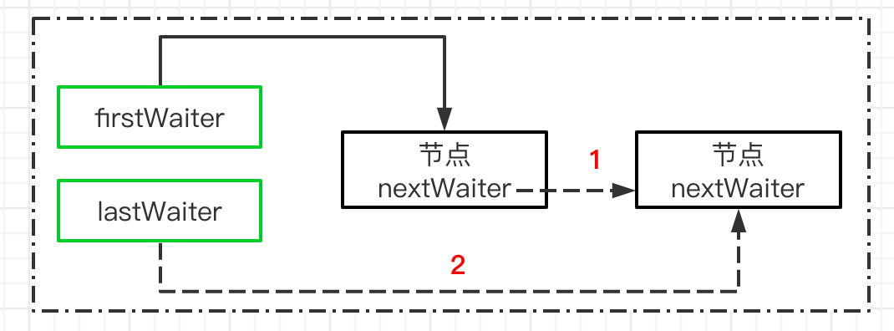
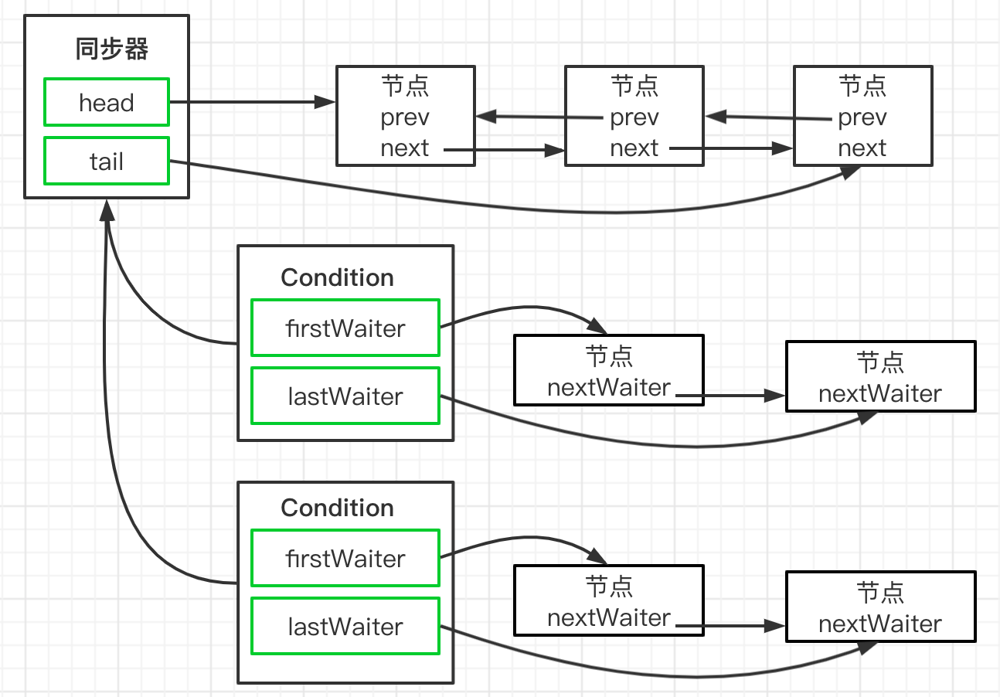

# 1 Condition

既然 J.U.C 里面提供了锁的实现机制，那 J.U.C 里面有没有提供类似的线程通信的工具呢？ 

于是发现了一个 Condition 工具类。 Condition 是一个多线程协调通信的工具类，可以让某些线程一起等待某个条件（condition），只有满足条件时，线程才会被唤醒。

## 1.1 线程间通信

1. 生产者 + 消费者
2. 通知等待唤醒机制

## 1.2 synchronized 实现

```java
class AirConditioner {
    private int number = 0;

    public synchronized void increment() throws InterruptedException {
        // 判断，如果是if，被唤醒时不会重新检查
        while (number != 0) {
            this.wait();
        }
        // 执行
        number++;
        System.out.println(Thread.currentThread().getName() + "\t" + number);
        // 通知
        this.notifyAll();
    }

    public synchronized void decrement() throws InterruptedException {
        while (number == 0) {
            this.wait();
        }
        number--;
        System.out.println(Thread.currentThread().getName() + "\t" + number);
        this.notifyAll();
    }
}

/**
 * 两个线程，操作一个初始值为0的变量
 * 实现一个线程对该变量+1，一个-1
 * 实现交替，10轮，变量初始值为0
 *
 * 判断/执行/通知
 * 多线程交互中，必须要防止多线程的虚假唤醒，也就（判断用while，不用if）
 */
public class ThreadWaitNotifyDemo {
    public static void main(String[] args) {
        AirConditioner airConditioner = new AirConditioner();
        new Thread(() -> {
            for (int i = 1; i <= 10; i++) {
                try {
                    Thread.sleep(200);
                    airConditioner.increment();
                } catch (InterruptedException e) {
                    e.printStackTrace();
                }
            }
        }, "A").start();
        new Thread(() -> {
            for (int i = 1; i <= 10; i++) {
                try {
                    Thread.sleep(300);
                    airConditioner.decrement();
                } catch (InterruptedException e) {
                    e.printStackTrace();
                }
            }
        }, "B").start();
    }
}
```

## 1.3 Condition 实现

Condition 定义了`等待 condition.await()` / `通知 condition.signal()` 两种类型的方法，当前线程调用这些方法时，需要提前获取到 Condition 对象关联的锁。Condition 对象是由 Lock 对象调用 `newCondition() 方法`创建出来的（Condition 是依赖 Lock 对象的）。

```java
class AirConditioner {
    private int number = 0;

    private Lock lock = new ReentrantLock();
    // 一般会将 Condition 对象作为成员变量
    private Condition condition = lock.newCondition();

    public void increment() throws InterruptedException {
        lock.lock();
        try {
            // 判断，如果是if，被唤醒时不会重新检查
            while (number != 0) {
                condition.await(); //this.wait();
            }
            // 执行
            number++;
            System.out.println(Thread.currentThread().getName() + "\t" + number);
            // 通知
            condition.signalAll(); //this.notifyAll();
        } finally {
            lock.unlock();
        }
    }

    public synchronized void decrement() throws InterruptedException {
        lock.lock();
        try {
            while (number == 0) {
                condition.await();
            }
            number--;
            System.out.println(Thread.currentThread().getName() + "\t" + number);
            condition.signalAll();
        } finally {
            lock.unlock();
        }
    }
}
```

### 1.3.1 多线程协调通信

```java
class ShareResource {
	// Semaphore 也可实现
    //1:A 2:B 3:C
    private int number = 1;
    private Lock lock = new ReentrantLock();
    private Condition condition1 = lock.newCondition();
    private Condition condition2 = lock.newCondition();
    private Condition condition3 = lock.newCondition();

    public void print5() {
        lock.lock();
        try {
            while (number != 1) {
                condition1.await();
            }
            for (int i = 1; i <= 5; i++) {
                System.out.println(Thread.currentThread().getName() + "\t" + i);
            }
            number = 2;
            condition2.signal();
        } catch (InterruptedException e) {
            e.printStackTrace();
        } finally {
            lock.unlock();
        }
    }

    public void print10() {
        lock.lock();
        try {
            while (number != 2) {
                condition2.await();
            }
            for (int i = 1; i <= 10; i++) {
                System.out.println(Thread.currentThread().getName() + "\t" + i);
            }
            number = 3;
            condition3.signal();
        } catch (InterruptedException e) {
            e.printStackTrace();
        } finally {
            lock.unlock();
        }
    }

    public void print15() {
        lock.lock();
        try {
            while (number != 3) {
                condition3.await();
            }
            for (int i = 1; i <= 15; i++) {
                System.out.println(Thread.currentThread().getName() + "\t" + i);
            }
            number = 1;
            condition1.signal();
        } catch (InterruptedException e) {
            e.printStackTrace();
        } finally {
            lock.unlock();
        }
    }
}

/**
 * 多线程之间实现A->B->C
 *
 * 1. 在高内聚低耦合的前提下，线程   操作（对外暴露的调用方法）   资源类
 * 2. 断/执行/通知
 * 3. 多线程交互中，必须要防止多线程的虚假唤醒，也就（判断用while，不用if）
 * 4. 标识位
 */
public class ThreadOrderAccess {
    public static void main(String[] args) {
        ShareResource shareResource = new ShareResource();
        new Thread(() -> {
            for (int i = 1; i <= 10; i++) {
                shareResource.print5();
            }
        }, "AA").start();
        new Thread(() -> {
            for (int i = 1; i <= 10; i++) {
                shareResource.print10();
            }
        }, "BB").start();
        new Thread(() -> {
            for (int i = 1; i <= 10; i++) {
                shareResource.print15();
            }
        }, "CC").start();
    }
}
```

当调用 await 方法后，当前线程会释放锁并等待，而其他线程调用 condition 对象的 signal 或者 signalall 方法通知并被阻塞的线程，然后自己执行 unlock 释放锁，被唤醒的线程获得之前的锁继续执行，最后释放锁。 

| 方法名称                           | 描述                                                         |
| ---------------------------------- | ------------------------------------------------------------ |
| void await()                       | 当前线程进入等待状态直到被通知 signal 或中断 interrupt       |
| void awaitUninterruptibly()        | 当前线程进入等待状态直到被通知，对中断不敏感                 |
| long awaitNanos(long nanosTimeout) | 当前线程进入等待状态直到被通知、中断或者超时，返回值为剩余的时间 |
| boolean awaitUntil(Date deadlien)  | 当前线程进入等待状态直到被通知、中断或者到某个时间<br>如果没有到指定时间就被通知返回 true，否则表示到了指定时间返回 false |
| void signal()/signalAll()          | 唤醒一个/所有等待在 Condition 上的线程，`能够从等待方法返回的线程必须获得与 Condition 相关联的锁` |

```java
// 实现一个有届队列
public class BoundedQueue<T> {
    private Object[] items;
    // 添加的下标、删除的下标和数组当前数量
    private int addIndex, removeIndex, count;
    private Lock lock = new ReentrantLock();
    private Condition notEmpty = lock.newCondition();
    private Condition notFull = lock.newCondition();

    public BoundedQueue(int size) {
        items = new Object[size];
    }

    // 添加一个元素，如果数组满，则添加线程进入等待状态，直到有空位
    public void add(T t) throws InterruptedException {
        lock.lock();
        try {
            while (count == items.length) {
                System.out.println("队列已满");
                notFull.await();
            }
            items[addIndex] = t;
            if (++addIndex == items.length) {
                addIndex = 0;
            }
            ++count;
            notEmpty.signal();
        } finally {
            lock.unlock();
        }
    }

    // 由头部删除一个元素，如果数组空，则删除线程进入等待状态，直到有新元素
    public T remove() throws InterruptedException {
        lock.lock();
        try {
            while (count == 0) {
                System.out.println("队列已空");
                notEmpty.await();
            }
            Object x = items[removeIndex];
            if (++removeIndex == items.length) {
                removeIndex = 0;
            }
            --count;
            notFull.signal();
            return (T) x;
        } finally {
            lock.unlock();
        }
    }
}
```

## 1.4 Condition 源码分析

调用 Condition，需要获得 Lock 锁，所以意味着会存在一个 AQS 同步队列，在上面那个案例中，假如两个线程同时运行的话，那么 AQS 的队列可能是下面这种情况。


那么这个时候 Thread1 调用了 condition.await 方法，它做了什么事情呢？

**condition.await**

如果一个线程调用 Condition 的 await() 方法（或者以 await 开头的方法）， 那么该线程将会释放锁、构造成节点加入等待队列并进入等待状态。当从 await() 方法返回时，当前线程一定获取了 Condition 相关联的锁。

节点的定义复用了同步器中节点的定义，`同步队列`和`等待队列`中节点类型都是同步器的静态内部类 `AbstractQueuedSynchronizer.Node`。

```java
public final void await() throws InterruptedException {
    //表示 await 允许被中断
    if (Thread.interrupted())
        throw new InterruptedException();
    //创建一个新的节点，节点状态为 condition，采用的数据结构仍然是链表
    Node node = addConditionWaiter();
    //释放当前的锁，得到锁的状态，并唤醒 AQS 队列中的一个线程
    long savedState = fullyRelease(node);
    int interruptMode = 0;
    //如果当前节点没有在同步队列上，即还没有被 signal，则将当前线程阻塞
    //判断这个节点是否在 AQS 队列上，第一次判断的是 false，因为前面已经释放锁了
  	// 在第一次执行await之后(节点不在AQS队列返回false)线程被挂起，其他线程执行signal唤醒当前线程后，执行2，3步之后，会在此进入1步骤判断，此时线程已经在AQS队列（checkInterruptWhileWaiting-->transferAfterCancelledWait-->enq将当前线程放入AQS），跳出while，往下执行
    while (!isOnSyncQueue(node)) {// 1
         //通过 park 挂起当前线程
        LockSupport.park(this);// 2
        if ((interruptMode = checkInterruptWhileWaiting(node)) != 0)//3
            break;
    }
    // 当这个线程醒来,会尝试拿锁, 当 acquireQueued返回 false 就是拿到锁了.
 	// interruptMode != THROW_IE -> 表示这个线程没有成功将 node 入队,但 signal 执行了 enq 方法让其入队了.
	// 将这个变量设置成 REINTERRUPT.
    if (acquireQueued(node, savedState) && interruptMode != THROW_IE)
        interruptMode = REINTERRUPT;
    // 如果 node 的下一个等待者不是 null, 则进行清理,清理 Condition 队列上的节点.
	// 如果是 null ,就没有什么好清理的了.
    if (node.nextWaiter != null) // clean up if cancelled
        unlinkCancelledWaiters();
    // 如果线程被中断了,需要抛出异常.或者什么都不做
    if (interruptMode != 0)
        reportInterruptAfterWait(interruptMode);
}
```

**addConditionWaiter**

这个方法的主要作用是把当前线程封装成 Node，添加到等待队列。

等待队列是一个 FIFO 的队列(单向链表)，在队列中的每个节点都包含了一个线程引用，该线程就是在 Condition 对象上等待的线程。

> 同步队列的首节点并不会直接加入等待队列，而是通过 addConditionWaiter 方法把当前线程构造成一个新的节点并将其加入等待队列。

```java
private Node addConditionWaiter() {
    Node t = lastWaiter;
    // If lastWaiter is cancelled, clean out.
    // 如果 lastWaiter 不等于空并且 waitStatus 不等于 CONDITION 时，把这个节点从链表中移除
    if (t != null && t.waitStatus != Node.CONDITION) {
        unlinkCancelledWaiters();
        t = lastWaiter;
    }
    //构建一个 Node，waitStatus=CONDITION。这里的链表是一个单向的，所以相比 AQS 来说会简单很多
    Node node = new Node(Thread.currentThread(), Node.CONDITION);
    if (t == null)
        firstWaiter = node;
    else
        t.nextWaiter = node;
    lastWaiter = node;
    return node;
}
```

**图解分析 **

执行完 addConditionWaiter 这个方法之后，就会产生一个这样的等待队列，一个 Condition 包含一个等待队列，Condition 拥有`首节点 firstWaiter` 和`尾节点 lastWaiter`。


Condition 拥有首位节点的引用，而新增节点只需要将`原有的尾节点 nextWaiter 指向它`，并且`更新尾节点`即可。

节点引用更新并没有 CAS 保证？

原因在于调用 await() 方法的线程必定是获取了锁的线程。



> Lock (更确切的说是同步器)拥有一个同步队列和多个等待队列。
>
> Condition 的实现是同步器的内部类，因此每个 Condition 实例都能访问同步器提供的方法，相当于每个 Condition 都拥有所属同步器的引用。
>
> 

**fullyRelease**

fullRelease，就是彻底的释放锁然后唤醒同步队列中的后继节点。

什么叫彻底呢，就是如果当前锁存在多次重入，那么在这个方法中只需要释放一次就会把所有的重入次数归零。

```java
final long fullyRelease(Node node) {
    boolean failed = true;
    try {
        //获得重入的次数
        long savedState = getState();
        //释放锁并且唤醒下一个同步队列中的线程
        if (release(savedState)) {
            failed = false;
            return savedState;
        } else {
            throw new IllegalMonitorStateException();
        }
    } finally {
        if (failed)
            node.waitStatus = Node.CANCELLED;
    }
}
```

**图解分析 **

此时，同步队列会触发锁的释放和重新竞争。Thread2 获得了锁。


**isOnSyncQueue**

判断当前节点是否在同步队列中，返回 false 表示不在，返回 true 表示在。

如果不在 AQS 同步队列，说明当前节点没有唤醒去争抢同步锁，所以需要把当前线程阻塞起来，直到其他的线程调用 signal 唤醒。

如果在 AQS 同步队列，意味着它需要去竞争同步锁去获得执行程序执行权限。

为什么要做这个判断呢？原因是在 condition 队列中的节点会重新加入到 AQS 队列去竞争锁。也就是当调用 signal 的时候，会把当前节点从 condition 队列转移到 AQS 队列。

基于现在的逻辑结构。如何去判断 Thread1 这个节点是否存在于 AQS 队列中呢？ 

1. 如果 Thread1 的 waitStatus 的状态为 CONDITION，说明它存在于 condition 队列中，不在 AQS 队列。因为 AQS 队列的状态一定不可能有 CONDITION 
2. 如果 node.prev 为空，说明也不存在于 AQS 队列，原因是 prev=null 在 AQS 队列中只有一种可能性，就是它是 head 节点，head 节点意味着它是获得锁的节点。 
3. 如果 node.next 不等于空，说明一定存在于 AQS 队列 中，因为只有 AQS 队列才会存在 next 和 prev 的关系 
4. findNodeFromTail，表示从 tail 节点往前扫描 AQS 队列， 一旦发现 AQS 队列的节点和当前节点相等，说明节点一 定存在于 AQS 队列中

```java
final boolean isOnSyncQueue(Node node) {
    if (node.waitStatus == Node.CONDITION || node.prev == null)
        return false;
    if (node.next != null) // If has successor, it must be on queue
        return true;
    return findNodeFromTail(node);
}
```

**Condition.signal **

await 方法会阻塞 Thread1，然后 Thread2 `抢占到了锁`(调用 signal 方法的前置条件)获得了执行权限，这个时候在 Thread2 中调用了 Condition 的 signal() 方法，将会唤醒在等待队列中等待时间最长的节点（首节点），在唤醒节点之前，会将节点移到同步队列。

```java
public final void signal() {
     //先判断当前线程是否获得了锁，这个判断比较简单，直接用获得锁的线程和当前线程相比即可
    if (!isHeldExclusively())
        throw new IllegalMonitorStateException();
    // 拿到 Condition队列上第一个节点
    Node first = firstWaiter;
    if (first != null)
        doSignal(first);
}
```

**Condition.doSignal**

对 condition 队列中从首部开始的第一个 condition 状态的节点，执行 transferForSignal 操作，将 node 从 condition 队列中转换到 AQS 队列中，同时修改 AQS 队列中原先尾节点的状态。

```java
private void doSignal(Node first) {
    do {
        //从 Condition 队列中删除 first 节点 == 将 firstWaiter 设置为当前节点的下一个节点
        if ( (firstWaiter = first.nextWaiter) == null)
            lastWaiter = null;
        // 将当前节点 nextWaiter 设置成 null
        first.nextWaiter = null;
    } while (!transferForSignal(first) &&
             (first = firstWaiter) != null);
}
```

**AQS.transferForSignal**

该方法先是 CAS 修改了节点状态，如果成功，就将这个节点通过同步器的 enq(Node node) 方法放到 AQS 队列中，然后使用 LockSupport 唤醒这个节点上的线程。此时， 那个节点就会在 await 方法中苏醒。

```java
final boolean transferForSignal(Node node) {
	//更新节点的状态为 0，如果更新失败，只有一种可能就是节点被 CANCELLED 了
    if (!compareAndSetWaitStatus(node, Node.CONDITION, 0))
        return false;
	//调用 enq，把当前节点添加到 AQS 队列。并且返回返回按当前节点的上一个节点，也就是原 tail 节点
    Node p = enq(node);
    int ws = p.waitStatus;
    // 如果上一个节点的状态被取消了, 或者尝试设置上一个节点的状态为 SIGNAL 失败了(SIGNAL 表示: 他的 next节点需要停止阻塞)
    if (ws > 0 || !compareAndSetWaitStatus(p, ws, Node.SIGNAL))
        // 唤醒节点上的线程
        LockSupport.unpark(node.thread);
    //如果 node 的 prev 节点已经是 signal 状态，那么被阻塞的 ThreadA 的唤醒工作由 AQS 队列来完成
    return true;
}
```

**图解分析**

执行完 doSignal 以后，会把 condition 队列中的节点转移到 aqs 队列上，逻辑结构图如下。

这个时候会判断 Thread1 的 prev 节点也就是 head 节点 的 waitStatus，如果大于 0 或者设置 SIGNAL 失败，表示节点被设置成了 CANCELLED 状态。这个时候会唤醒 Thread1 这个线程。否则就基于 AQS 队列的机制来唤醒，也就是等到 Thread2 释放锁之后来唤醒 Thread1。


**被阻塞的线程唤醒后的逻辑**

前面在分析 await 方法时，线程会被阻塞。而通过 signal 被唤醒后的线程将从 await() 方法中的 while 循环中退出，进而调用同步器的 acquireQueued() 加入到获取同步状态的竞争中。

又继续回到上次执行的逻辑中 checkInterruptWhileWaiting 这个方法是干嘛呢？其实从名字就可以看出来，就是 Thread1 在 condition 队列被阻塞的过程中，有没有被其他线程触发过中断请求。

```java
public final void await() throws InterruptedException {
    ...
    while (!isOnSyncQueue(node)) {
        LockSupport.park(this);
        if ((interruptMode = checkInterruptWhileWaiting(node)) != 0)
            break;
    }
	...
}
```

**checkInterruptWhileWaiting**

如果当前线程被中断，则调用 transferAfterCancelledWait 方法判断后续的处理应该是抛出 InterruptedException 还是重新中断。 

这里需要注意的地方是，如果第一次 CAS 失败了，则不能判断当前线程是先进行了中断还是先进行了 signal 方法 的调用，可能是先执行了 signal 然后中断，也可能是先执行了中断，后执行了 signal，当然，这两个操作肯定是发生在 CAS 之前。这时需要做的就是等待当前线程的 node 被添加到 AQS 队列后，也就是 enq 方法返回后，返回 false 告诉 checkInterruptWhileWaiting 方法返回 REINTERRUPT(1)，后续进行重新中断。

简单来说，该方法的返回值代表当前线程是否在 park 的时候被中断唤醒，如果为 true 表示中断在 signal 调用之 前，signal 还未执行，那么这个时候会根据 await 的语义，在 await 时遇到中断需要抛出 interruptedException，返回 true 就是告诉 checkInterruptWhileWaiting 返回 THROW_IE(-1)。 如果返回 false，否则表示 signal 已经执行过了，只需要重新响应中断即可。

```java
private int checkInterruptWhileWaiting(Node node) {
    return Thread.interrupted() ?
        (transferAfterCancelledWait(node) ? THROW_IE : REINTERRUPT) :
        0;
}
final boolean transferAfterCancelledWait(Node node) {
    //使用 cas 修改节点状态，如果还能修改成功，说明线程被中断时，signal 还没有被调用。
	// 这里有一个知识点，就是线程被唤醒，并不一定是在 java 层面执行了locksupport.unpark，也可能是调用了线程的 interrupt()方法，这个方法会更新一个中断标识，并且会唤醒处于阻塞状态下的线程。
    if (compareAndSetWaitStatus(node, Node.CONDITION, 0)) {
        //如果 cas 成功，则把 node 添加到 AQS 队列
        enq(node);
        return true;
    }
    //如果 cas 失败，则判断当前 node 是否已经在 AQS 队列上，如果不在，则让给其他线程执行
	//当 node 被触发了 signal 方法时，node 就会被加到 aqs 队列上
    //循环检测 node 是否已经成功添加到 AQS 队列中。
    while (!isOnSyncQueue(node))
        //如果没有，则通过 yield，
        Thread.yield();
    return false;
}
```

**acquireQueued**

这个方法在讲 aqs 的时候说过，是的当前被唤醒的节点 ThreadA 去抢占同步锁。并且要恢复到原本的重入次数状态。调用完这个方法之后，AQS 队列的状态如下 将 head 节点的 waitStatus 设置为-1，Signal 状态。

成功获取同步状态后，被唤醒的线程将从先前调用的 await() 方法返回，此时该线程已经成功获取了锁。

> Condition 的 signalAll() 方法，相当于对等待队列中的每个节点均执行一次 signal() 方法，效果就是将等待队列中所有节点全部移动到同步队列，并唤醒每个节点的线程。

**reportInterruptAfterWait**

根据 checkInterruptWhileWaiting 方法返回的中断标识来进行中断上报。 如果是 THROW_IE，则抛出中断异常；如果是 REINTERRUPT，则重新响应中断。

```java
private void reportInterruptAfterWait(int interruptMode)
    throws InterruptedException {
    if (interruptMode == THROW_IE)
        throw new InterruptedException();
    else if (interruptMode == REINTERRUPT)
        selfInterrupt();
}
```

## 1.5 Condition 总结

await 和 signal 的总结

把前面的整个分解的图再通过一张整体的结构图来表述，线程 awaitThread 先通过 lock.lock()方法获取锁成功后调用了 condition.await 方法进入等待队列，而另一个线程 signalThread 通过 lock.lock()方法获取锁成功后调用 了 condition.signal 或者 signalAll 方法，使得线程 awaitThread 能够有机会移入到同步队列中，当其他线程释放 lock 后使得线程 awaitThread 能够有机会获取 lock，从而使得线程 awaitThread 能够从 await 方法中退出执行后续操作。如果 awaitThread 获取 lock 失败会直 接进入到同步队列。


阻塞：await()方法中，在线程释放锁资源之后，如果节点不在 AQS 等待队列，则阻塞当前线程，如果在等待队 列，则自旋等待尝试获取锁

释放：signal()后，节点会从 condition 队列移动到 AQS 等待队列，则进入正常锁的获取流程 

# 2 CountDownLatch

CountDownLatch 是一个同步工具类，它允许一个或多个线程一直等待，直到其他线程的操作执行完毕再执行。从命名可以解读到 countdown 是倒数的意思，类似于我们倒计时的概念。 

CountDownLatch 初始化的时候需要传入一个整数，在这个整数倒数到 0 之前，当一个或多个线程调用 await 方法时，这些线程会阻塞。 其它线程调用 countDown 方法会将这个整数减1(调用countDown方法的线程不会阻塞)，当整数值变为0时，因await方法阻塞的线程会被唤醒，继续执行。 

## 2.1 使用案例

```java
/**
  * @Description:
  * 让一些线程阻塞直到另一些线程完成一系列操作后才被唤醒。
  * 
  * CountDownLatch主要有两个方法，当一个或多个线程调用await方法时，这些线程会阻塞。
  * 其它线程调用countDown方法会将计数器减1(调用countDown方法的线程不会阻塞)，
  * 当计数器的值变为0时，因await方法阻塞的线程会被唤醒，继续执行。
  * 
  * 解释：6个同学陆续离开教室后值班同学才可以关门。
  * main主线程必须要等前面6个线程完成全部工作后，自己才能开干 
  */
public class CountDownLatchDemo {
    public static void main(String[] args) throws InterruptedException {
        CountDownLatch countDownLatch = new CountDownLatch(6);
        for (int i = 1; i <= 6; i++) {
            new Thread(() -> {
                System.out.println(Thread.currentThread().getName() + "\t离开教室");
                countDownLatch.countDown();
            }, String.valueOf(i)).start();
        }
        countDownLatch.await();
        System.out.println(Thread.currentThread().getName() + "\t班长离开教室");
    }

    public static void closeDoor() {
        for (int i = 1; i <= 6; i++) {
            new Thread(() -> {
                System.out.println(Thread.currentThread().getName() + "\t离开教室");
            }, String.valueOf(i)).start();
        }
        System.out.println(Thread.currentThread().getName() + "\t班长离开教室");
    }
}
```

从代码的实现来看，有点类似 join 的功能，但是比 join 更 加灵活。CountDownLatch 构造函数会接收一个 int 类型的参数作为计数器的初始值，当调用 CountDownLatch 的 countDown 方法时，这个计数器就会减一。 

通过 await 方法去阻塞去阻塞主流程。

**模拟高并发场景**

```java
static CountDownLatch
            countDownLatch=new
            CountDownLatch(1);

    @Override
    public void run() {
        try {
            countDownLatch.await();
            //TODO
        } catch (InterruptedException e)
        {
            e.printStackTrace();
        }

        System.out.println("ThreadName:"+Thread.currentThread().getName());
    }

    public static void main(String[] args) {
        for(int i=0;i<1000;i++){
            new Thread(new CountDownLatchDemo()).start();
        }
        countDownLatch.countDown();
    }
```

## 2.2 使用场景

总的来说，凡事涉及到需要指定某个人物在执行之前，要等到前置人物执行完毕之后才执行的场景，都可以使用 CountDownLatch。

## 2.3 CountDownLatch 源码分析

对于 CountDownLatch，我们仅仅需要关心两个方法，一 个是 countDown() 方法，另一个是 await() 方法。 

countDown() 方法每次调用都会将 state 减 1，直到 state 的值为 0；而 await 是一个阻塞方法，当 state 减为 0 的时候，await 方法才会返回。await 可以被多个线程调用，大家在这个时候脑子里要有个图：所有调用了 await 方法的线程阻塞在 AQS 的阻塞队列中，等待条件满足（state == 0），将线程从队列中一个个唤醒过来。

```java
public void await() throws InterruptedException {
    sync.acquireSharedInterruptibly(1);
}
```

**acquireSharedInterruptibly**

countdownlatch 也用到了 AQS，在 CountDownLatch 内部写了一个 Sync 并且继承了 AQS 这个抽象类重写了 AQS 中的共享锁方法。首先看到下面这个代码，这块代码主要是判断当前线程是否获取到了共享锁;（ 在 CountDownLatch 中 ，使用的是共享锁机制 ，因为 CountDownLatch 并不需要实现互斥的特性）

```java
public final void acquireSharedInterruptibly(int arg)
        throws InterruptedException {
    if (Thread.interrupted())
        throw new InterruptedException();
    //state 如果不等于 0，说明当前线程需要加入到共享锁队列中
    if (tryAcquireShared(arg) < 0)
        doAcquireSharedInterruptibly(arg);
}
protected int tryAcquireShared(int acquires) {
    return (getState() == 0) ? 1 : -1;
}
```

**doAcquireSharedInterruptibly**

1. addWaiter 设置为 shared 模式
2. tryAcquire 和 tryAcquireShared 的返回值不同，因此会 多出一个判断过程 
3. 在判断前驱节点是头节点后，调用了 setHeadAndPropagate 方法，而不是简单的更新一下头节点

```java
private void doAcquireSharedInterruptibly(int arg)
    throws InterruptedException {
    //创建一个共享模式的节点，并添加到队列中
    final Node node = addWaiter(Node.SHARED);
    boolean failed = true;
    try {
        for (;;) {
            final Node p = node.predecessor();
            if (p == head) {
                //就判断尝试获取锁
                int r = tryAcquireShared(arg);
                //r>=0 表示获取到了执行权限，这个时候因为 state!=0，所以不会执行这段代码
                if (r >= 0) {
                    setHeadAndPropagate(node, r);
                    p.next = null; // help GC
                    failed = false;
                    return;
                }
            }
            //阻塞线程
            if (shouldParkAfterFailedAcquire(p, node) &&
                parkAndCheckInterrupt())
                throw new InterruptedException();
        }
    } finally {
        if (failed)
            cancelAcquire(node);
    }
}
```

**图解分析**

加入这个时候有 3 个线程调用了 await 方法，由于这个时 候 state 的值还不为 0，所以这三个线程都会加入到 AQS 队列中。并且三个线程都处于阻塞状态


CountDownLatch.countDown

由于线程被 await 方法阻塞了，所以只有等到 countdown 方法使得 state=0 的时候才会被唤醒，我们来看看 countdown 做了什么 

1. 只有当 state 减为 0 的时候，tryReleaseShared 才返 回 true, 否则只是简单的 state = state - 1 
2. 如果 state=0, 则调用 doReleaseShared 唤醒处于 await 状态下的线程

```java
public final boolean releaseShared(int arg) {
    if (tryReleaseShared(arg)) {
        doReleaseShared();
        return true;
    }
    return false;
}
// 用自旋的方法实现 state 减 1
protected boolean tryReleaseShared(int releases) {
    // Decrement count; signal when transition to zero
    for (;;) {
        int c = getState();
        if (c == 0)
            return false;
        int nextc = c-1;
        if (compareAndSetState(c, nextc))
            return nextc == 0;
    }
}
```

**AQS. doReleaseShared**

共享锁的释放和独占锁的释放有一定的差别。

前面唤醒锁的逻辑和独占锁是一样，先判断头结点是不是 SIGNAL 状态，如果是，则修改为 0，并且唤醒头结点的 下一个节点。

PROPAGATE： 标识为 PROPAGATE 状态的节点，是共享锁模式下的节点状态，处于这个状态下的节点，会对线程的唤醒进行传播。

```java
private void doReleaseShared() {
    for (;;) {
        Node h = head;
        if (h != null && h != tail) {
            int ws = h.waitStatus;
            if (ws == Node.SIGNAL) {
                if (!compareAndSetWaitStatus(h, Node.SIGNAL, 0))
                    continue;            // loop to recheck cases
                // 唤醒头结点的下一个节点
                unparkSuccessor(h);
            }
            // 这个 CAS 失败的场景是：执行到这里的时候，刚好有一个节点入队，入队会将这个 ws 设置为 -1
            else if (ws == 0 &&
                     !compareAndSetWaitStatus(h, 0, Node.PROPAGATE))
                continue;                // loop on failed CAS
        }
        // 如果到这里的时候，前面唤醒的线程已经占领了 head，那么再循环
 		// 通过检查头节点是否改变了，如果改变了就继续循环
        if (h == head)                   // loop if head changed
            break;
    }
}
```

h == head：说明头节点还没有被刚刚用 unparkSuccessor 唤醒的线程（这里可以理解为 Thread1）占有，此时 break 退出循环。 

h != head：头节点被刚刚唤醒的线程（这里可以理解为 Thread1）占有，那么这里重新进入下一轮循环，唤醒下 一个节点（这里是 Thread2 ）。我们知道，等到 Thread2 被唤醒后，其实是会主动唤醒 Thread3...

**doAcquireSharedInterruptibly**

一旦 Thread1 被唤醒，代码又会继续回到 doAcquireSharedInterruptibly 中来执行。如果当前满足 state = 0 的条件，则会执行 setHeadAndPropagate 方法

```java
private void doAcquireSharedInterruptibly(int arg)
    ...
        for (;;) {
            if (p == head) {
                if (r >= 0) {
                    //被唤醒的线程进入下一次循环继续判断
                    setHeadAndPropagate(node, r);
                    //把当前节点移除 aqs 队列
                    p.next = null; // help GC
					failed = false;
					return;
                }
                ...
            }
        }
}
```

**setHeadAndPropagate**

这个方法的主要作用是把被唤醒的节点，设置成 head 节 点。 然后继续唤醒队列中的其他线程。 由于现在队列中有 3 个线程处于阻塞状态，一旦 ThreadA 被唤醒，并且设置为 head 之后，会继续唤醒后续的 ThreadB

```java
private void setHeadAndPropagate(Node node, int propagate) {
    Node h = head; // Record old head for check below
    setHead(node);
    if (propagate > 0 || h == null || h.waitStatus < 0 ||
        (h = head) == null || h.waitStatus < 0) {
        Node s = node.next;
        if (s == null || s.isShared())
            doReleaseShared();
    }
}
```

**图解分析**


# 3 Semaphore

semaphore 也就是我们常说的信号灯，semaphore 可以控制同时访问的线程个数，通过 acquire 获取一个许可，如果没有就等待，通过 release 释放一个许可。有点类似限流的作用。

acquire（获取） 当一个线程调用acquire操作时，它要么通过成功获取信号量（信号量减1），要么一直等下去，直到有线程释放信号量，或超时。

release（释放）实际上会将信号量的值加1，然后唤醒等待的线程。

## 3.1 使用案例 

```java
public class SemaphoreDemo {
    public static void main(String[] args) {
        Semaphore semaphore = new Semaphore(3);
        for (int i = 1; i <= 6; i++) {
            new Thread(() -> {
                try {
                    semaphore.acquire();
                    System.out.println(Thread.currentThread().getName() + "\t抢占了车位");
                    try { TimeUnit.SECONDS.sleep(3); } catch (InterruptedException e) { e.printStackTrace(); }
                    System.out.println(Thread.currentThread().getName() + "\t离开了车位");
                } catch (InterruptedException e) {
                    e.printStackTrace();
                } finally {
                    semaphore.release();
                }
            }, String.valueOf(i)).start();
        }
    }
}
```

## 3.2 使用场景 

信号灯主要用于两个目的，一个是用于多个共享资源的互斥使用，另一个用于并发线程数的控制。 

Semaphore 比较常见的就是用来做限流操作。

## 3.3 Semaphore 源码分析

从 Semaphore 的功能来看，我们基本能猜测到它的底层实现一定是基于 AQS 的共享锁，因为需要实现多个线程共享一个令牌池。

创建 Semaphore 实例的时候，需要一个参数 permits， 这个基本上可以确定是设置给 AQS 的 state 的，然后每 个线程调用 acquire 的时候，执行 state = state - 1。

release 的时候执行 state = state + 1，当然，acquire 的 时候，如果 state = 0，说明没有资源了，需要等待其他线程 release。 

Semaphore 分公平策略和非公平策略：

**FairSync**

```java
static final class FairSync extends Sync {
    private static final long serialVersionUID = 2014338818796000944L;
    FairSync(int permits) {
        super(permits);
    }
    protected int tryAcquireShared(int acquires) {
        for (;;) {
            // 区别就在于是不是会先判断是否有线程在排队，然后才进行 CAS 减操作
            if (hasQueuedPredecessors())
                return -1;
            int available = getState();
            int remaining = available - acquires;
            if (remaining < 0 ||
                compareAndSetState(available, remaining))
                return remaining;
        }
    }
}
```

**NofairSync **

通过对比发现公平和非公平的区别就在于是否多了一个 hasQueuedPredecessors 的判断

后面的代码和 CountDownLatch 的是完全一样，都是基于共享锁的实现。

# 4 CyclicBarrier

CyclicBarrier 的字面意思是可循环使用（Cyclic）的屏障 （Barrier）。它要做的事情是，让一组线程到达一个屏障（也 可以叫同步点）时被阻塞，直到最后一个线程到达屏障时， 屏障才会开门，所有被屏障拦截的线程才会继续工作。 CyclicBarrier 默认的构造方法是 CyclicBarrier(int parties)， 其参数表示屏障拦截的线程数量，每个线程调用 await 方法告诉 CyclicBarrier 当前线程已经到达了屏障，然后当前线程被阻塞。

## 4.1 使用案例

```java
/**
  * 集齐7颗龙珠就可以召唤神龙
  */
public class CyclicBarrierDemo {
    public static void main(String[] args) {
        // CyclicBarrier(int parties, Runnable barrierAction)
        CyclicBarrier cyclicBarrier = new CyclicBarrier(7, () -> System.out.println("*********召唤神龙"));

        for (int i = 1;i <= 7;i++) {
            final int tempInt = i;
            new Thread(() -> {
                System.out.println(Thread.currentThread().getName() + "\t收集到第" + tempInt + "颗龙珠");
                try {
                    cyclicBarrier.await();
                } catch (InterruptedException e) {
                    e.printStackTrace();
                } catch (BrokenBarrierException e) {
                    e.printStackTrace();
                }
            }, String.valueOf(i)).start();
        }
    }
}
```

1）对于指定计数值 parties，若由于某种原因，没有足够的线程调用 CyclicBarrier 的 await，则所有调用 await 的线程都会被阻塞； 

2）同样的 CyclicBarrier 也可以调用 `await(timeout, unit)`， 设置超时时间，在设定时间内，如果没有足够线程到达， 则解除阻塞状态，继续工作； 

3）通过 reset 重置计数，会使得进入 await 的线程出现 BrokenBarrierException； 

4 ）如果采用是 CyclicBarrier(int parties, Runnable barrierAction) 构造方法，`执行 barrierAction 操作的是最后一个到达的线程`

## 4.2 使用场景

当存在需要所有的子任务都完成时，才执行主任务，这个时候就可以选择使用 CyclicBarrier。

## 4.3 实现原理 

CyclicBarrier 相比 CountDownLatch 来说，要简单很多， 源码实现是基于 ReentrantLock 和 Condition 的组合使用。看如下示意图，CyclicBarrier 和 CountDownLatch 是不是很像，只是 CyclicBarrier 可以有不止一个栅栏，因为它的栅栏（Barrier）可以重复使用（Cyclic）。


# 5 原子操作类

原子性这个概念，在多线程编程里是一个老生常谈的问题。 所谓的原子性表示一个或者多个操作，要么全部执行完， 要么一个也不执行。不能出现成功一部分失败一部分的情况。

在多线程中，如果多个线程同时更新一个共享变量，可能会得到一个意料之外的值。比如 i=1 。A 线程更新 i+1 、 B 线程也更新 i+1。 

通过两个线程并行操作之后可能 i 的值不等于 3。而可能等于 2。因为 A 和 B 在更新变量 i 的时候拿到的 i 可能都是 1 这就是一个典型的原子性问题。

前面几节课我们讲过，多线程里面，要实现原子性，有几种方法，其中一种就是加 Synchronized 同步锁。 

而从 JDK1.5 开始，在 J.U.C 包中提供了 Atomic 包，提供了 对于常用数据结构的原子操作。它提供了简单、高效、以 及线程安全的更新一个变量的方式。

## 5.1 J.U.C 中的原子操作类

由于变量类型的关系，在 J.U.C 中提供了 12 个原子操作的类。这 12 个类可以分为四大类 

原子更新基本类型 AtomicBoolean、AtomicInteger、AtomicLong

原子更新数组 AtomicIntegerArray 、 AtomicLongArray 、 AtomicReferenceArray

原子更新引用 AtomicReference 、 AtomicReferenceFieldUpdater 、 AtomicMarkableReference（更新带有标记位的引用类 型）

原子更新字段 AtomicIntegerFieldUpdater、AtomicLongFieldUpdater、 AtomicStampedReference

## 5.2 AtomicInteger 原理分析

接下来，我们来剖析一下 AtomicInteger 的实现原理，仍然是基于我们刚刚在前面的案例中使用到的方法作为突破口。

**getAndIncrement**

getAndIncrement 实际上是调用 unsafe 这个类里面提供的方法， Unsafe 类我们前面在分析 AQS 的时候讲过，这个类相当于是一个后门，使得 Java 可以像 C 语言的指针一样直接操作内存空间。当然也会带来一些弊端，就是指针的问题。 实际上这个类在很多方面都有使用，除了 J.U.C 这个包以外，还有 Netty、kafka 等等。

这个类提供了很多功能，包括多线程同步(monitorEnter)、 CAS 操 作 (compareAndSwap) 、线程的挂起和恢复 (park/unpark)、内存屏障(loadFence/storeFence) 、内存管理（内存分配、释放内存、获取内存地址等）。

```java
public final int getAndIncrement() {
    return unsafe.getAndAddInt(this, valueOffset, 1);
}
```

valueOffset，也比较熟了。通过 unsafe.objectFieldOffset() 获取当前 Value 这个变量在内存中的偏移量，后续会基于这个偏移量从内存中得到 value 的值来和当前的值做比较， 实现乐观锁。

```java
private static final long valueOffset;
static {
    try {
        valueOffset = unsafe.objectFieldOffset
            (AtomicInteger.class.getDeclaredField("value"));
    } catch (Exception ex) { throw new Error(ex); }
}
```

**getAndAddInt**

通过 do/while 循环，基于 CAS 乐观锁来做原子递增。实际上前面的 valueOffset 的作用就是从主内存中获得当前 value 的值和预期值做一个比较，如果相等，对 value 做递增并结束循环。

```java
public final int getAndAddInt(Object var1, long var2, int var4) {
    int var5;
    do {
        // 通过当前对象和偏移量拿到期望值 var5
        var5 = this.getIntVolatile(var1, var2);
    } while(!this.compareAndSwapInt(var1, var2, var5, var5 + var4));
    return var5;
}
```

**get 方法**

get 方法只需要直接返回 value 的值就行，这里的 value 是 通过 Volatile 修饰的，用来保证可见性。

```java
private volatile int value;
public final int get() {
    return value;
}
```

**其他方法**

AtomicInteger 的实现非常简单，所以我们可以很快就分析完它的实现原理，当然除了刚刚分析的这两个方法之外， 还有其他的一些 比如它提供了 compareAndSet ， 允许客户端基于 AtomicInteger 来实现乐观锁的操作。

```java
public final boolean compareAndSet(int expect, int update) { 
    return unsafe.compareAndSwapInt(this, valueOffset, expect, update); 
}
```

# 6 ForkJoin

Fork：把一个复杂任务进行分拆，大事化小 

Join：把分拆任务的结果进行合并 

``ForkJoinPool ``分支合并池  类比=>  线程池 


``ForkJoinTask``  类比=>  FutureTask 

递归任务：继承后可以实现递归(自己调自己)调用的任务 


```java
class MyTask extends RecursiveTask<Integer> {

    private static final Integer ADJUST_VALUE = 10;

    private int begin;
    private int end;
    private int result;

    public MyTask(int begin, int end) {
        this.begin = begin;
        this.end = end;
    }

    @Override
    protected Integer compute() {
        if ((end - begin) <= ADJUST_VALUE) {
            for (int i = begin; i <= end; i++) {
                result = result + i;
            }
        } else {
            int middle = (end + begin) / 2;
            MyTask task01 = new MyTask(begin, middle);
            MyTask task02 = new MyTask(middle + 1, end);
            task01.fork();
            task02.fork();
            result = task01.join() + task02.join();
        }
        return result;
    }
}

public class ForkJoinDemo {
    public static void main(String[] args) throws ExecutionException, InterruptedException {
        MyTask myTask = new MyTask(0, 100);
        ForkJoinPool threadPool = new ForkJoinPool();

        ForkJoinTask<Integer> forkJoinTask = threadPool.submit(myTask);
        System.out.println(forkJoinTask.get());

        threadPool.shutdown();
    }
}
```

# 7 CompletableFuture

异步回调


```java
public class CompletableFutureDemo {
    public static void main(String[] args) throws ExecutionException, InterruptedException {
        CompletableFuture<Void> c = CompletableFuture.runAsync(() -> {
            System.out.println(Thread.currentThread().getName() + "没有返回");
        });
        c.get();

        // 异步回调
        CompletableFuture<Integer> c1 = CompletableFuture.supplyAsync(() -> {
            System.out.println(Thread.currentThread().getName() + "有返回");
            //int age = 10 / 0;
            return 1024;
        });
        System.out.println(c1.whenComplete((t, u) -> {
            System.out.println("***********t: " + t);
            System.out.println("***********u: " + u);
        }).exceptionally(f -> {
            System.out.println("***********exception: " + f.getMessage());
            return 404;
        }).get());
    }
}
```

------

