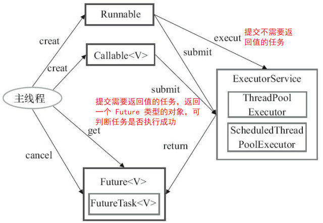
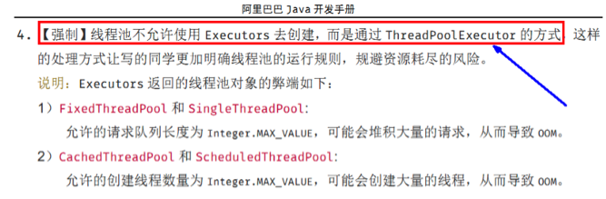
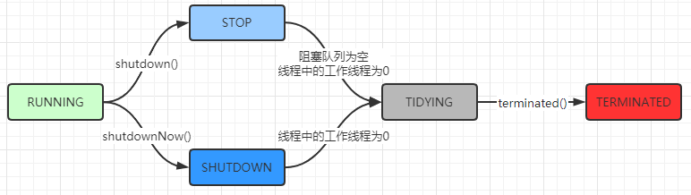

# 1 为什么用线程池

例子：10年前单核CPU电脑，假的多线程，像马戏团小丑玩多个球，CPU需要来回切换。 现在是多核电脑，多个线程各自跑在独立的CPU上，不用切换效率高。 

在 Java 中，如果每个请求到达就创建一个新线程，创建和销毁线程花费的时间和消耗的系统资源都相当大，甚至可能要比在处理实际的用户请求的时间和资源要多的多。

如果在一个 Jvm 里创建太多的线程，可能会使系统由于过度消耗内存或“切换过度”而导致系统资源不足。为了解决这个问题,就有了线程池的概念，线程池做的工作主要是控制运行的线程数量，``处理过程中将任务放入队列``，然后在线程创建后启动这些任务， ``如果线程数量超过了最大数量，超出数量的线程排队等候``，等其他线程执行完毕，再从队列中取出任务来执行。

它的主要特点为：``线程复用;控制最大并发数;管理线程``。

线程池的优势：

第一：降低资源消耗。通过重复利用已创建的线程降低线程创建和销毁造成的销耗。 

第二：提高响应速度。当任务到达时，任务可以不需要等待线程创建就能立即执行。 

第三：提高线程的可管理性。线程是稀缺资源，如果无限制的创建，不仅会销耗系统资源，还会降低系统的稳定性，使用线程池可以进行统一的分配，调优和监控。 

# 2 线程池的使用

## 架构说明

Java中的线程池是通过 `Executor 框架`实现的，该框架中用到了 Executor，Executors，ExecutorService，ThreadPoolExecutor，ScheduledExecutorService 这几个类。




## 编码实现

在 Executors 里面提供了几个线程池的工厂方法，这样很多新手就不需要了解太多关于  ThreadPoolExecutor 的知识了，他们只需要直接使用 Executors 的工厂方法，就可以使用线程池。

### Executors.newFixedThreadPool(int)

newFixedThreadPool创建的线程池corePoolSize和maximumPoolSize值是相等的，它使用的是LinkedBlockingQueue 

```java
//该方法返回一个固定数量的线程池，线程数不变，当有一个任务提交时，若线程池中空闲，则立即执行，若没有，则会被暂缓在一个任务队列中，等待有空闲的线程去执行。
public static ExecutorService newFixedThreadPool(int nThreads) {
    return new ThreadPoolExecutor(nThreads, nThreads,
                                  0L, TimeUnit.MILLISECONDS,
                                  new LinkedBlockingQueue<Runnable>());
}
```

### Executors.newSingleThreadExecutor()

newSingleThreadExecutor 创建的线程池 corePoolSize 和 maximumPoolSize 值都是1，它使用的是LinkedBlockingQueue 

```java
// 创建一个线程的线程池，若空闲则执行，若没有空闲线程则暂缓在任务队列中
public static ExecutorService newSingleThreadExecutor() {
    return new FinalizableDelegatedExecutorService
        (new ThreadPoolExecutor(1, 1,
                                0L, TimeUnit.MILLISECONDS,
                                new LinkedBlockingQueue<Runnable>()));
}
```

### Executors.newCachedThreadPool()

newCachedThreadPool创建的线程池将corePoolSize设置为0，将maximumPoolSize设置为Integer.MAX_VALUE，它使用的是SynchronousQueue，也就是说来了任务就创建线程运行，当线程空闲超过60秒，就销毁线程。 

```java
// 返回一个可根据实际情况调整线程个数的线程池，不限制最大线程数量，若用空闲的线程则执行任务，若无任务则不创建线程。并且每一个空闲线程会在 60 秒后自动回收
public static ExecutorService newCachedThreadPool() {
    return new ThreadPoolExecutor(0, Integer.MAX_VALUE,
                                  60L, TimeUnit.SECONDS,
                                  new SynchronousQueue<Runnable>());
}
```

```java
public class MyThreadPoolDemo {
    public static void main(String[] args) {
        // 一池5个工作线程
        //ExecutorService threadPool = Executors.newFixedThreadPool(5);
        // 一池1个工作线程
        //ExecutorService threadPool = Executors.newSingleThreadExecutor();
        // 一池n线程
        ExecutorService threadPool = Executors.newCachedThreadPool();
        try {
            for (int i = 1; i <= 10; i++) {
                //try { TimeUnit.SECONDS.sleep(1); } catch (InterruptedException e) { e.printStackTrace(); }
                threadPool.execute(() -> {
                    System.out.println(Thread.currentThread().getName() + "\t办理业务");
                });
            }
        } catch (Exception e) {
            e.printStackTrace();
        } finally {
            threadPool.shutdownNow();
        }
    }
}
```

**三种创建线程池的方法哪个用的多**

都不用，工作中只能使用自定义的



**newScheduledThreadPool**

创建一个可以指定线程的数量的线程池，但是这个线程池还带有延迟和周期性执行任务的功能，类似定时器。

# 3 线程池的参数

```java
public ThreadPoolExecutor(int corePoolSize,
                          int maximumPoolSize,
                          long keepAliveTime,
                          TimeUnit unit,
                          BlockingQueue<Runnable> workQueue,
                          ThreadFactory threadFactory,
                          RejectedExecutionHandler handler) {
    if (corePoolSize < 0 ||
        maximumPoolSize <= 0 ||
        maximumPoolSize < corePoolSize ||
        keepAliveTime < 0)
        throw new IllegalArgumentException();
    if (workQueue == null || threadFactory == null || handler == null)
        throw new NullPointerException();
    this.corePoolSize = corePoolSize;
    this.maximumPoolSize = maximumPoolSize;
    this.workQueue = workQueue;
    this.keepAliveTime = unit.toNanos(keepAliveTime);
    this.threadFactory = threadFactory;
    this.handler = handler;
}
```

``corePoolSize`` 线程池中的常驻核心线程数

``maximumPoolSize`` 线程池中能够容纳同时执行的最大线程数，此值必须大于等于1

``keepAliveTime`` 多余的空闲线程的存活时间，当前池中线程数量超过corePoolSize时，当空闲时间达到keepAliveTime时，多余线程会被销毁直到只剩下corePoolSize个线程为止

``unit`` keepAliveTime的单位 

``workQueue`` 任务队列，被提交但尚未被执行的任务

``threadFactory`` 表示生成线程池中工作线程的线程工厂，用于创建线程，一般默认的即可

``handler`` 拒绝策略，表示当队列满了，并且工作线程大于等于线程池的最大线程数（maximumPoolSize）时如何来拒绝请求执行的runnable的策略

# 4 工作原理

``ThreadPoolExecutor`` 是线程池的核心，提供了线程池的实现。

``ScheduledThreadPoolExecutor`` 继承了 ThreadPoolExecutor，并另外提供一些调度方法以支持定时和周期任务。Executers 是工具类，主要用来创建线程池对象。


1. 在创建了线程池后，开始等待请求。 

2. 当调用 ``execute()`` 方法添加一个请求任务时，线程池会做出如下判断： 

   2.1 如果正在运行的线程数量小于 ``corePoolSize`` ，那么马上创建线程运行这个任务； 

   2.2 如果正在运行的线程数量大于或等于 ``orePoolSize`` ，那么将这个任务放入队列 ； 

   2.3 如果这个时候队列满了且正在运行的线程数量还小于``maximumPoolSize``，那么还是要创建非核心线程立刻运行该任务； 

   2.4 如果队列满了且正在运行的线程数量大于或等于 ``maximumPoolSize`` ，那么线程池会启动饱和拒绝策略来执行 。 

3. 当一个线程完成任务时，它会从队列中取下一个任务来执行。 

4. 当一个线程无事可做超过一定的时间``keepAliveTime``时，线程会判断： 如果当前运行的线程数大于 ``corePoolSize``，那么这个线程就被停掉。 所以线程池的所有任务完成后， 它最终会收缩到 ``corePoolSize``的大小 。 

# 5 拒绝策略

等待队列已经排满了 ，再也塞不下新任务了，同时， 线程池中的max线程也达到了 ，无法继续为新任务服务。 这个时候我们就需要拒绝策略机制合理的处理这个问题。 

``AbortPolicy(默认)`` 直接抛出``RejectedExecutionException``异常阻止系统正常运行

``CallerRunsPolicy`` “调用者运行”一种调节机制，该策略既不会抛弃任务，也不会抛出异常，而是将某些任务回退到调用者，从而降低新任务的流量。

``DiscardOldestPolicy`` 抛弃队列中等待最久的任务，然后把当前任务加人队列中尝试再次提交当前任务。

``DiscardPolicy`` 该策略默默地丢弃无法处理的任务，不予任何处理也不抛出异常。如果允许任务丢失，这是最好的一种策略。

以上内置拒绝策略均实现了``RejectedExecutionHandle``接口，当然也可以根据应用场景实现 RejectedExecutionHandler 接口，自定义饱和策略，如记录日志或持久化存储不能处理的任务。

# 6 自定义线程池

```java
// maximumPoolSize
//如果是 CPU 密集型，主要是执行计算任务，响应时间很快，cpu 一直在运行，这种任务 cpu 的利用率很高，那么线程数的配置应该根据 CPU 核心数来决定，CPU 核心数=最大同时执行线程数，加入 CPU 核心数为 4，那么服务器最多能同时执行 4 个线程。过多的线程会导致上下文切换反而使得效率降低。
// 那线程池的最大线程数可以配置为 cpu 核心数+1~2
// CPU 密集型 Runtime.getRuntime().availableProcessors()(CPU核心数，逻辑处理器) + 1~2
// 如果是 IO 密集型，主要是进行 IO 操作，执行 IO 操作的时间较长，这是 cpu 出于空闲状态，导致 cpu 的利用率不高，这种情况下可以增加线程池的大小。这种情况下可以结合线程的等待时长来做判断，等待时间越高，那么线程数也相对越多。一般可以配置 cpu 核心数的 2 倍。
//一个公式：
//线程池设定最佳线程数目 = （（线程池设定的线程等待时间+线程 CPU 时间）/线程 CPU 时间 ）* CPU 数目
//这个公式的线程 cpu 时间是预估的程序单个线程在 cpu 上运行的时间（通常使用 loadrunner测试大量运行次数求出平均值）
ExecutorService threadPool = new ThreadPoolExecutor(
        2,
        5,
        2L,
        TimeUnit.SECONDS,
        new LinkedBlockingQueue<>(3),
        Executors.defaultThreadFactory(),
        new ThreadPoolExecutor.AbortPolicy());
```

# 7 源码分析

基于源码入口进行分析，先看 ``execute`` 方法：

```java
public void execute(Runnable command) {
    if (command == null)
        throw new NullPointerException();
    int c = ctl.get();
    //1.当前池中线程比核心数少，新建一个线程执行任务
    if (workerCountOf(c) < corePoolSize) {
        if (addWorker(command, true))
            return;
        c = ctl.get();
    }
    //2.核心池已满，但任务队列未满，添加到队列中
    if (isRunning(c) && workQueue.offer(command)) {
        int recheck = ctl.get();
        //任务成功添加到队列以后，再次检查是否需要添加新的线程，因为已存在的线程可能被销毁了
        if (! isRunning(recheck) && remove(command))
            //如果线程池处于非运行状态，并且把当前的任务从任务队列中移除成功，则拒绝该任务
            reject(command);
        //如果之前的线程已被销毁完，新建一个线程
        else if (workerCountOf(recheck) == 0)
            addWorker(null, false);
    }
    //3.核心池已满，队列已满，试着创建一个新线程
    else if (!addWorker(command, false))
        //如果创建新线程失败了，说明线程池被关闭或者线程池完全满了，拒绝任务
        reject(command);
}
```

## 7.1 ctl 的作用

在线程池中，ctl 贯穿在线程池的整个生命周期中

```java
private final AtomicInteger ctl = new AtomicInteger(ctlOf(RUNNING, 0));
```

它是一个原子类，主要作用是用来保存线程数量和线程池的状态。我们来分析一下这段代码，其实比较有意思，他用到了位运算一个 int 数值是 32 个 bit 位，这里采用高 3 位来保存运行状态，低 29 位来保存线程数量。

我们来分析默认情况下，也就是 ctlOf(RUNNING, 0) 调用了 ctlOf(int rs,int wc) 方法；

```java
// Integer.java
public static final int SIZE = 32;
// ThreadPoolExecutor.java
private static final int COUNT_BITS = Integer.SIZE - 3;
private static final int RUNNING    = -1 << COUNT_BITS;
private static int runStateOf(int c)     { return c & ~CAPACITY; }
private static int workerCountOf(int c)  { return c & CAPACITY; }
private static int ctlOf(int rs, int wc) { return rs | wc; }
```

其中 RUNNING 为 -1 左移 29 位。

-1 的二进制是 32 个 1【1111 1111 11111111 1111 1111 1111 1111】

> -1 的二进制计算方法
> 原码是 1000…001 高位 1 表示符号位
> 然后对原码取反，高位不变得到 1111…110
> 然后对反码进行+1 ，也就是补码操作， 最后得到 1111…1111

那么-1 左移 29 位， 也就是 【111】 表示；rs | wc，二进制的 111 | 000 。得到的结果仍然是 111。

那么同理可得其他的状态的 bit 位表示：

```java
private static final int CAPACITY = (1 << COUNT_BITS) - 1; //将 1 的二进制向左位移 29 位,再减 1 表示最大线程容量，二进制也即是29个1
//运行状态保存在 int 值的高 3 位 (所有数值左移 29 位)
private static final int RUNNING = -1 << COUNT_BITS;// 接收新任务,并执行队列中的任务
private static final int SHUTDOWN = 0 << COUNT_BITS;// 不接收新任务,但是执行队列中的任务
private static final int STOP = 1 << COUNT_BITS;// 不接收新任务,不执行队列中的任务,中断正在执行中的任务
private static final int TIDYING = 2 << COUNT_BITS; //所有的任务都已结束,线程数量为 0,处于该状态的线程池即将调用 terminated()方法
private static final int TERMINATED = 3 << COUNT_BITS;// terminated()方法执行完成
```

**状态转化**



## 7.2 addWorker

如果工作线程数小于核心线程数的话，会调用 addWorker，顾名思义，其实就是要创建一个工作线程。我们来看看源码的实现源码比较长，看起来比较唬人，其实就做了两件事。

1. 才用循环 CAS 操作来将线程数加 1

2. 新建一个线程并启用

```java
private boolean addWorker(Runnable firstTask, boolean core) {
    retry: //goto 语句,避免死循环
    for (;;) {
        int c = ctl.get();
        int rs = runStateOf(c);
        // 如果线程处于非运行状态，并且 rs 不等于 SHUTDOWN 且 firstTask 不等于空且 workQueue 为空，直接返回 false（表示不可添加 work 状态）
		//1. 线程池已经 shutdown 后，还要添加新的任务，拒绝
		//2. （第二个判断）SHUTDOWN 状态不接受新任务，但仍然会执行已经加入任务队列的任务，所以当进入 SHUTDOWN 状态，而传进来的任务为空，并且任务队列不为空的时候，是允许添加新线程的,如果把这个条件取反，就表示不允许添加 worker
        if (rs >= SHUTDOWN &&
            ! (rs == SHUTDOWN &&
               firstTask == null &&
               ! workQueue.isEmpty()))
            return false;
        for (;;) { //自旋
            //获得 Worker 工作线程数
            int wc = workerCountOf(c);
            //如果工作线程数大于默认容量大小或者大于核心线程数大小，则直接返回 false 表示不能再添加 worker
            if (wc >= CAPACITY ||
                wc >= (core ? corePoolSize : maximumPoolSize))
                return false;
            //通过 cas 来增加工作线程数，如果 cas 失败，则直接重试
            if (compareAndIncrementWorkerCount(c))
                break retry;
            //再次获取 ctl 的值
            c = ctl.get();  // Re-read ctl
            if (runStateOf(c) != rs)
                continue retry;
            // else CAS failed due to workerCount change; retry inner loop
        }
    }
    //上面这段代码主要是对 worker 数量做原子+1 操作,下面的逻辑才是正式构建一个 worker
    boolean workerStarted = false;//工作线程是否启动的标识
    boolean workerAdded = false;//工作线程是否已经添加成功的标识
    Worker w = null;
    try {
        //构建一个 Worker，这个 worker 是什么呢？我们可以看到构造方法里面传入了一个 Runnable 对象
        w = new Worker(firstTask);
        final Thread t = w.thread;//从 worker 对象中取出线程
        if (t != null) {
            final ReentrantLock mainLock = this.mainLock;
            mainLock.lock();//这里有个重入锁，避免并发问题
            try {
                // Recheck while holding lock.
                // Back out on ThreadFactory failure or if
                // shut down before lock acquired.
                int rs = runStateOf(ctl.get());
                //只有当前线程池是正在运行状态，[或是 SHUTDOWN 且 firstTask 为空]，才能添加到 workers 集合中
                if (rs < SHUTDOWN ||
                    (rs == SHUTDOWN && firstTask == null)) {
                    //任务刚封装到 work 里面，还没 start,你封装的线程就是 alive，几个意思？肯定是要抛异常出去的
                    if (t.isAlive()) // precheck that t is startable
                        throw new IllegalThreadStateException();
                    //将新创建的 Worker 添加到 workers 集合中
                    workers.add(w);
                    int s = workers.size();
                    //如果集合中的工作线程数大于最大线程数，这个最大线程数表示线程池曾经出现过的最大线程数
                    if (s > largestPoolSize)
                        largestPoolSize = s; //更新线程池出现过的最大线程数
                    workerAdded = true;//表示工作线程创建成功了
                }
            } finally {
                mainLock.unlock();//释放锁
            }
            if (workerAdded) {//如果 worker 添加成功
                t.start();//启动线程
                workerStarted = true;
            }
        }
    } finally {
        if (! workerStarted)
            addWorkerFailed(w);//如果添加失败，就需要做一件事，就是递减实际工作线程数(还记得我们最开始的时候增加了工作线程数吗)
    }
    return workerStarted;
}
```

## 7.3 Worker 类说明

我们发现 addWorker 方法只是构造了一个 Worker，并且把 firstTask 封装到 worker 中，它是做什么的呢？我们来看看

1. 每个 worker,都是一条线程,同时里面包含了一个 firstTask,即初始化时要被首先执行的任务.

2. 最终执行任务的,是 runWorker()方法

Worker 类继承了 AQS，并实现了 Runnable 接口，注意其中的 firstTask 和 thread 属性：

`firstTask` 用它来保存传入的任务；

`thread` 是在调用构造方法时通过 ThreadFactory 来创建的线程，是用来处理任务的线程。

在调用构造方法时，需要传入任务，这里通过 `getThreadFactory().newThread(this);` 来新建一个线程，newThread 方法传入的参数是 this，因为 Worker 本身继承了 Runnable 接口，也就是一个线程，所以一个 Worker 对象在启动的时候会调用 Worker 类中的 run 方法。

Worker 继承了 AQS，使用 AQS 来实现独占锁的功能。为什么不使用 ReentrantLock 来实现呢？可以看到 tryAcquire 方法，它是不允许重入的，而 ReentrantLock 是允许重入的。

lock 方法一旦获取了独占锁，表示当前线程正在执行任务中；那么它会有以下几个作用：

1. 如果正在执行任务，则不应该中断线程；

2. 如果该线程现在不是独占锁的状态，也就是空闲的状态，说明它没有在处理任务，这时可以对该线程进行中断；
3. 线程池在执行 shutdown 方法或 tryTerminate 方法时会调用 interruptIdleWorkers 方法来中断空闲的线程，interruptIdleWorkers 方法会使用 tryLock 方法来判断线程池中的线程是否是空闲状态

4. 之所以设置为不可重入，是因为我们不希望任务在调用像 setCorePoolSize 这样的线程池控制方法时重新获取锁，这样会中断正在运行的线程

```java
private final class Worker
    extends AbstractQueuedSynchronizer
    implements Runnable
{
    /**
     * This class will never be serialized, but we provide a
     * serialVersionUID to suppress a javac warning.
     */
    private static final long serialVersionUID = 6138294804551838833L;
    /** Thread this worker is running in.  Null if factory fails. */
    final Thread thread;
    /** Initial task to run.  Possibly null. */
    Runnable firstTask;
    /** Per-thread task counter */
    volatile long completedTasks;
    /**
     * Creates with given first task and thread from ThreadFactory.
     * @param firstTask the first task (null if none)
     */
    Worker(Runnable firstTask) {
        setState(-1); // inhibit interrupts until runWorker
        this.firstTask = firstTask;
        this.thread = getThreadFactory().newThread(this);
    }
    /** Delegates main run loop to outer runWorker  */
    public void run() {
        runWorker(this);
    }
    // Lock methods
    //
    // The value 0 represents the unlocked state.
    // The value 1 represents the locked state.
    protected boolean isHeldExclusively() {
        return getState() != 0;
    }
    protected boolean tryAcquire(int unused) {
        if (compareAndSetState(0, 1)) {
            setExclusiveOwnerThread(Thread.currentThread());
            return true;
        }
        return false;
    }
    protected boolean tryRelease(int unused) {
        setExclusiveOwnerThread(null);
        setState(0);
        return true;
    }
    public void lock()        { acquire(1); }
    public boolean tryLock()  { return tryAcquire(1); }
    public void unlock()      { release(1); }
    public boolean isLocked() { return isHeldExclusively(); }
    void interruptIfStarted() {
        Thread t;
        if (getState() >= 0 && (t = thread) != null && !t.isInterrupted()) {
            try {
                t.interrupt();
            } catch (SecurityException ignore) {
            }
        }
    }
}
```

## 7.4 addWorkerFailed

addWorker 方法中，如果添加 Worker 并且启动线程失败，则会做失败后的处理。

这个方法主要做两件事：

1. 如果 worker 已经构造好了，则从 workers 集合中移除这个 worker

2. 原子递减核心线程数（因为在 addWorker 方法中先做了原子增加）

3. 尝试结束线程池

```java
private void addWorkerFailed(Worker w) {
    final ReentrantLock mainLock = this.mainLock;
    mainLock.lock();
    try {
        if (w != null)
            workers.remove(w);
        decrementWorkerCount();
        tryTerminate();
    } finally {
        mainLock.unlock();
    }
}
```

## 7.5 runWorker 方法

前面已经了解了 ThreadPoolExecutor 的核心方法 addWorker，主要作用是增加工作线程，而 Worker 简单理解其实就是一个线程，里面重新了 run 方法，这块是线程池中执行任务的真正处理逻辑，也就是 runWorker 方法，这个方法主要做几件事：

1. 如果 task 不为空,则开始执行 task

2. 如果 task 为空,则通过 getTask()再去取任务,并赋值给 task,如果取到的 Runnable 不为空,则执行该任务

3. 执行完毕后,通过 while 循环继续 getTask()取任务

4. 如果 getTask()取到的任务依然是空,那么整个 runWorker()方法执行完毕

```java
final void runWorker(Worker w) {
    Thread wt = Thread.currentThread();
    Runnable task = w.firstTask;
    w.firstTask = null;
    //unlock，表示当前 worker 线程允许中断，因为 new Worker 默认的 state=-1,此处是调用
	//Worker 类的 tryRelease()方法，将 state 置为 0， 而 interruptIfStarted()中只有 state>=0 才允许调用中断
    w.unlock(); // allow interrupts
    boolean completedAbruptly = true;
    try {
        //注意这个 while 循环,在这里实现了 [线程复用] 
        // 如果 task 为空，则通过getTask 来获取任务
        while (task != null || (task = getTask()) != null) {
            //上锁，不是为了防止并发执行任务，为了在 shutdown()时不终止正在运行的 worker线程池为 stop 状态时不接受新任务，不执行已经加入任务队列的任务，还中断正在执行的任务
            w.lock();
            //所以对于 stop 状态以上是要中断线程的
			//(Thread.interrupted() &&runStateAtLeast(ctl.get(), STOP)确保线程中断标志位为 true 且是 stop 状态以上，接着清除了中断标志
			//!wt.isInterrupted()则再一次检查保证线程需要设置中断标志位
            if ((runStateAtLeast(ctl.get(), STOP) ||
                 (Thread.interrupted() &&
                  runStateAtLeast(ctl.get(), STOP))) &&
                !wt.isInterrupted())
                wt.interrupt();
            try {
                //这里默认是没有实现的，在一些特定的场景中我们可以自己继承 ThreadpoolExecutor 自己重写
                beforeExecute(wt, task);
                Throwable thrown = null;
                try {
                    //执行任务中的 run 方法
                    task.run();
                } catch (RuntimeException x) {
                    thrown = x; throw x;
                } catch (Error x) {
                    thrown = x; throw x;
                } catch (Throwable x) {
                    thrown = x; throw new Error(x);
                } finally {
                    //这里默认默认而也是没有实现
                    afterExecute(task, thrown);
                }
            } finally {
                //置空任务(这样下次循环开始时,task 依然为 null,需要再通过 getTask()取) + 记录该 Worker 完成任务数量 + 解锁
                task = null;
                w.completedTasks++;
                w.unlock();
            }
        }
        completedAbruptly = false;
    } finally {
        processWorkerExit(w, completedAbruptly);
        //1.将入参 worker 从数组 workers 里删除掉；
		//2.根据布尔值 allowCoreThreadTimeOut 来决定是否补充新的 Worker 进数组workers
    }
}
```

## 7.6 getTask

worker 线程会从阻塞队列中获取需要执行的任务，这个方法不是简单的 take 数据，我们来分析下他的源码实现。

你也许好奇是怎样判断线程有多久没有活动了，是不是以为线程池会启动一个监控线程，专门监控哪个线程正在偷懒？想太多，其实只是在线程从工作队列 poll 任务时，加上了超时限制，如果线程在 keepAliveTime 的时间内 poll 不到任务，那我就认为这条线程没事做，可以干掉了，看看这个代码片段你就清楚了。

```java
private Runnable getTask() {
    boolean timedOut = false; // Did the last poll() time out?
    for (;;) {//自旋
        int c = ctl.get();
        int rs = runStateOf(c);
        // 对线程池状态的判断，两种情况会 workerCount-1，并且返回 null
     	//1. 线程池状态为 shutdown，且 workQueue 为空（反映了 shutdown 状态的线程池还是要执行 workQueue 中剩余的任务的）
 		//2. 线程池状态为 stop（shutdownNow()会导致变成 STOP）（此时不用考虑 workQueue的情况）
        // Check if queue empty only if necessary.
        if (rs >= SHUTDOWN && (rs >= STOP || workQueue.isEmpty())) {
            decrementWorkerCount();
            return null;//返回 null，则当前 worker 线程会退出
        }
        int wc = workerCountOf(c);
        // timed 变量用于判断是否需要进行超时控制。
		// allowCoreThreadTimeOut 默认是 false，也就是核心线程不允许进行超时；
 		// wc > corePoolSize，表示当前线程池中的线程数量大于核心线程数量；
 		// 对于超过核心线程数量的这些线程，需要进行超时控制
        // Are workers subject to culling?
        boolean timed = allowCoreThreadTimeOut || wc > corePoolSize;
        //1. 线程数量超过 maximumPoolSize 可能是线程池在运行时被调用了 setMaximumPoolSize()被改变了大小，否则已经 addWorker()成功不会超过 maximumPoolSize
		//2. timed && timedOut 如果为 true，表示当前操作需要进行超时控制，并且上次从阻塞队列中获取任务发生了超时.其实就是体现了空闲线程的存活时间
        if ((wc > maximumPoolSize || (timed && timedOut))
            && (wc > 1 || workQueue.isEmpty())) {
            if (compareAndDecrementWorkerCount(c))
                return null;
            continue;
        }
        try {
            //根据 timed 来判断，如果为 true，则通过阻塞队列 poll 方法进行超时控制，如果在
			//keepaliveTime 时间内没有获取到任务，则返回 null.
			//否则通过 take 方法阻塞式获取队列中的任务
            Runnable r = timed ?
                workQueue.poll(keepAliveTime, TimeUnit.NANOSECONDS) :
                workQueue.take();
            if (r != null)//如果拿到的任务不为空，则直接返回给 worker 进行处理
                return r;
            timedOut = true;//如果 r==null，说明已经超时了，设置 timedOut=true，在下次自旋的时候进行回收
        } catch (InterruptedException retry) {
            timedOut = false;// 如果获取任务时当前线程发生了中断，则设置 timedOut 为false 并返回循环重试
        }
    }
}
```

这里重要的地方是第二个 if 判断，目的是控制线程池的有效线程数量。由上文中的分析可以知道，在执行 execute 方法时，如果当前线程池的线程数量超过了 corePoolSize 且小于 maximumPoolSize，并且 workQueue 已满时，则可以增加工作线程，但这时如果超时没有获取到任务，也就是 timedOut 为 true 的情况，说明 workQueue 已经为空了，也就说明了当前线程池中不需要那么多线程来执行任务了，可以把多于 corePoolSize 数量的线程销毁掉，保持线程数量在 corePoolSize 即可。

什么时候会销毁？当然是 runWorker 方法执行完之后，也就是 Worker 中的 run 方法执行完，由 JVM 自动回收。getTask 方法返回 null 时，在 runWorker 方法中会跳出 while 循环，然后会执行processWorkerExit 方法。

## 7.7 processWorkerExit

runWorker 的 while 循环执行完毕以后，在 finally 中会调用 processWorkerExit，来销毁工作线程。

到目前为止，我们已经从 execute 方法中输入了 worker 线程的创建到执行以及最后到销毁的全部过程。那么我们继续回到 execute 方法。

我们只分析完 addWorker 这段逻辑，继续来看后面的判断 execute 后续逻辑分析。

如果核心线程数已满，说明这个时候不能再创建核心线程了，于是走第二个判断

第二个判断逻辑比较简单，如果线程池处于运行状态并且任务队列没有满，则将任务添加到队列中

第三个判断，核心线程数满了，队列也满了，那么这个时候创建新的线程也就是（非核心线程）

如果非核心线程数也达到了最大线程数大小，则直接拒绝任务。

```java
if (isRunning(c) && workQueue.offer(command)) {//2.核心池已满，但任务队列未满，添加到队列中
 int recheck = ctl.get();
//任务成功添加到队列以后，再次检查是否需要添加新的线程，因为已存在的线程可能被销毁了
 if (! isRunning(recheck) && remove(command))
 reject(command);//如果线程池处于非运行状态，并且把当前的任务从任务队列中移除成功，则拒绝该任务
 else if (workerCountOf(recheck) == 0)//如果之前的线程已被销毁完，新建一个线程
 addWorker(null, false);
 }
else if (!addWorker(command, false)) //3.核心池已满，队列已满，试着创建一个新线程
 reject(command); //如果创建新线程失败了，说明线程池被关闭或者线程池完全满了，拒绝任务
```

