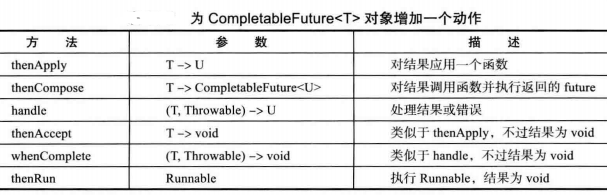
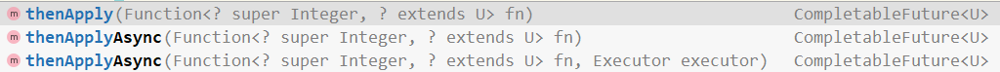
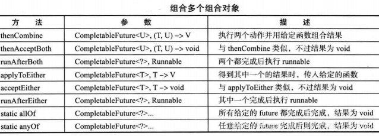

# 8.Callable与Future


Runnable封装一个异步运行的任务，可以把它想象成一个没有参数和返回值的异步方法。Callable与Runnable类似，但是有返回值。Callable接口是一个参数化的类型，只有一个方法call。

```java
@FunctionalInterface
public interface Callable<V> {
    V call() throws Exception;
}
```

类型参数是返回值的类型。 Future保存异步计算的结果，可以启动一个计算，将Future对象交给某个线程，然后忘掉它。Future对象的所有者在结果计算好之后就可以获得它：

```java
public interface Future<V> {
	// 取消该计算，如果计算还没开始，它被取消且不再开始。如果计算处于运行中，那么如果参数为true，它就被中断
    boolean cancel(boolean mayInterruptIfRunning);
    boolean isCancelled();
    // 如果计算还在进行，返回false，如果完成了，返回true
    boolean isDone();
    // 调用被阻塞，直到计算完成。如果在计算完成之前，下面一个get方法调用超时，抛出一个TimeoutException。如果运行该计算的线程被中断，两个方法将抛出InterruptedExcaption。如果计算已经完成，那么立即返回。
    V get() throws InterruptedException, ExecutionException;
    V get(long timeout, TimeUnit unit)
        throws InterruptedException, ExecutionException, TimeoutException;
}
```

FutureTask包装器，可将Callable转换成Future和Runnable，它同时实现二者的接口。

```java
public class FutureTest {
    public static void main(String[] args) {
        try (Scanner in = new Scanner(System.in)) {
            System.out.print("Enter base directory (e.g. /use/local/jdk1.8.0/src):");
            String directory = in.nextLine();
            System.out.print("Enter keyword (e.g. volatile):");
            String keyword = in.nextLine();

            MatchCounter counter = new MatchCounter(new File(directory), keyword);
            // 利用MatchCounter创建一个FutureTask对象，并用来启动一个线程
            FutureTask<Integer> task = new FutureTask<>(counter);
            Thread t = new Thread(task);
            t.start();
            try {
            	// 对get的调用会发生阻塞，直到有可获得的结果为止
                System.out.println(task.get() + " matching files");
            } catch (ExecutionException e) {
                e.printStackTrace();
            } catch (InterruptedException e) {}
        }
    }
}
// 一个需要长时间运行的任务，它产生一个整数值
class MatchCounter implements Callable<Integer> {
    private File directory;
    private String keyword;

    public MatchCounter(File directory, String keyword) {
        this.directory = directory;
        this.keyword = keyword;
    }

    @Override
    public Integer call() throws Exception {
        int count = 0;
        try {
            File[] files = directory.listFiles();
            List<Future<Integer>> results = new ArrayList<>();
			// 使用递归机制，对于每一个子目录，产生一个新的MatchCounter并为它启动一个线程
            for (File file : files) {
                if (file.isDirectory()) {
                    MatchCounter counter = new MatchCounter(file, keyword);
                    FutureTask<Integer> task = new FutureTask<>(counter);
                    results.add(task);
                    Thread t = new Thread(task);
                    t.start();
                } else {
                    if (search(file)) {
                        count++;
                    }
                }
            }
			// 把FutureTask对象隐藏在ArrayList<Future<Integer>>中，最后把所有结果加起来
            for (Future<Integer> result : results) {
                try {
                    count += result.get();
                } catch (ExecutionException e) {
                    e.printStackTrace();
                }
            }
        } catch (InterruptedException e){}
        return count;
    }

    public boolean search(File file) {
        try {
            try (Scanner in = new Scanner(file, "UTF-8")) {
                boolean found = false;
                while (!found && in.hasNextLine()) {
                    String line = in.nextLine();
                    if (line.contains(keyword)) {
                        found = true;
                    }
                }
                return found;
            }
        } catch (IOException e) {
            return false;
        }
    }
}
```

每一次对get的调用都会发生阻塞直到结果可获得为止。当然，线程是并行运行的，因此，很大可能在大致相同的时间所有结果都可获得。

# 9.执行器

如果程序中创建了大量的生命周期很短的线程，应该使用线程池（thread pool）。一个线程池中包含许多准备运行的空闲线程。将Runnable对象交给线程池，就会有一个线程调用run方法。当run方法退出时，线程不会死亡，而是在池中准备为下一个请求提供服务。 另一个使用线程池的理由是减少并发线程的数目。创建大量线程会大大降低性能甚至使用虚拟机崩溃。如果有一个会创建许多线程的算法，应该使用一个线程数“固定的”线程池以限制并发线程的总数。 执行器（Executor）类有许多静态工作方法用来创建线程池： 

### 线程池

newCachedThreadPool方法构建了一个线程池，对于每个任务，如果有空闲线程可用，立即让它执行任务，如果没有可用的空闲线程，则创建一个新线程。 newFixedThreadPool方法构建一个具有固定大小的线程池。如果提交的任务数多于空闲的线程数，那么把得不到服务的任务放置到队列中。当任务完成以后再运行它们。 newSingleThreadExecutor是一个退化了的大小为1的线程池：由一个线程执行提交的任务，一个接着一个。 这3个方法返回实现了ExecutorService接口的ThreadPoolExecutor类的对象。 可用下面的方法将一个Runnable对象或Callable对象提交给ExecutorService： Future&lt; ? &gt; submit(Runnable task) Future&lt; T &gt; submit(Runnable task, T result) Future&lt; T &gt; submit(Callable&lt; T &gt; task) 该池会在方便的时候尽早执行提交的任务。调用submit时，会得到一个Future对象，可用来查询该任务的状态。 第一个submit方法返回一个奇怪样子的Future&lt; ? &gt;。可以使用这样一个对象来调用isDone、cancel或isCancelled。但get方法在完成的时候只是简单地返回null。 第二个submit也提交一个Runnable，并且Future的get方法在完成的时候返回指定的result对象。 第三个submit提交一个Callable，并且返回的Future对象将计算结果准备好的时候得到它。

当用完一个线程池的时候，调用shutdown。该方法启动该池的关闭序列。被关闭的执行器不再接受新的任务。当所有任务都完成以后，线程池中的线程死亡。 另一种方法是调用shutdownNow，该池取消尚未开始的所有任务并试图中断正在运行的线程。

在使用线程池时应该做的事： 1.调用Executor类中的静态方法newCachedThreadPool或newFixedThreadPool 2.调用submit提交Runnable或Callable对象 3.如果想要取消一个任务，或如果提交Callable对象，那么就要保存好返回的Future对象 4.当不再提交任何任务时，调用shutdown

```java
public class ThreadPoolTest {
    public static void main(String[] args) {
        try (Scanner in = new Scanner(System.in)) {
            System.out.print("Enter base directory (e.g. /use/local/jdk1.8.0/src):");
            String directory = in.nextLine();
            System.out.print("Enter keyword (e.g. volatile):");
            String keyword = in.nextLine();

            ExecutorService pool = Executors.newCachedThreadPool();

            MatchCounter counter = new MatchCounter(new File(directory), keyword, pool);
            Future<Integer> result = pool.submit(counter);

            try {
                System.out.println(result.get() + " matching files");
            } catch (ExecutionException e) {
                e.printStackTrace();
            } catch (InterruptedException e) {}

            pool.shutdown();
			// 出于信息方面的考虑，打印池中最大的线程数。但不能通过ExecutorService这个接口得到。因此必须将该pool对象强制转为ThreadPoolExecutor对象
            int largestPoolSize = ((ThreadPoolExecutor) pool).getLargestPoolSize();
            System.out.println("largest pool size=" + largestPoolSize);
        }
    }
}

class MatchCounter implements Callable<Integer> {
    private File directory;
    private String keyword;
    private ExecutorService pool;
    private int count;

    public MatchCounter(File directory, String keyword, ExecutorService pool) {
        this.directory = directory;
        this.keyword = keyword;
        this.pool = pool;
    }

    @Override
    public Integer call() {
        count = 0;
        try {
            File[] files = directory.listFiles();
            List<Future<Integer>> results = new ArrayList<>();

            for (File file : files) {
                if (file.isDirectory()) {
                    MatchCounter counter = new MatchCounter(file, keyword, pool);
                    Future<Integer> result = pool.submit(counter);
                    results.add(result);
                } else {
                    if (search(file)) {
                        count++;
                    }
                }
            }
            for (Future<Integer> result : results) {
                try {
                    count += result.get();
                } catch (ExecutionException e) {
                    e.printStackTrace();
                }
            }
        } catch (InterruptedException e) {}
        return count;
    }

    public boolean search(File file) {
        try {
            try (Scanner in = new Scanner(file, "UTF-8")) {
                boolean found = false;
                while (!found && in.hasNextLine()) {
                    String line = in.nextLine();
                    if (line.contains(keyword)) {
                        found = true;
                    }
                }
                return found;
            }
        } catch (IOException e) {
            return false;
        }
    }
}
```

### 预定执行

ScheduledExecutorService接口具有为预定执行（Scheduled Executor）或重复执行任务而设计的方法。它是一种允许使用线程池机制的java.util.Timer的泛化。Executors类的newScheduledThreadPool和newSingleThreadScheduledExecutor方法将返回实现了ScheduledExecutorService接口的对象。 可以预定Runnable或Callable在初始的延迟之后只运行一次。也可以预定一个Runnable对象周期性地运行。

### 控制任务组

使用执行器有更有实际意义的原因，控制一组相关任务。 invokeAny方法提交所有对象到一个Callable对象的集合中，并返回某个已经完成了的任务的结果。无法知道返回的究竟是哪个任务的结果。对于搜索问题，如果愿意接受任何一种解决方案的话，就可以使用这个方法。例如，对一个大整数进行因数分解计算来解码RSA密码。可以提交多个任务，每个任务使用不同范围内的数来分解。只要一个任务得到答案，计算就可以停止了。 invokeAll方法提交所有对象到一个Callable对象的集合中，并返回一个Future对象的列表，代表所有的解决方案。当计算结果可获得时：

```java
List<Callable<T>> tasks = ...;
List<Future<T>> results = executor.invokeAll(tasks);
for(Future<T> result : results) {
	processFurther(result.get());
}
```

这个方法的缺点是如果第一个任务花去了很多时间，则可能不得不进行等待。将结果按可获得的顺序保存起来更有实际意义。可以用ExecutorCompletionService来进行排序。 用常规方法获得一个执行器。然后构建一个ExecutorCompletionService，提交任务给完成服务（completion service）。该服务管理Future对象的阻塞队列，其中包含已经提交的任务的执行结果（当这些结果成为可用时）。这样一来，相比前面的计算，一个更有效的组织形式：

```java
ExecutorCompletionService<T> service = new ExecutorCompletionService<>(executor);
for (Callable<T> task : tasks) {
	service.submit(task);
}
for (int i = 0; i < tasks.size(); i++) {
	processFurther(service.take().get());
}
```

### Fork-Join框架

有些应用使用了大量线程，但其中大多数都是空闲的。例如，一个Web服务器可能会为每一个连接分别使用一个线程。另一些可能对每个处理器内核分别使用一个线程，来完成计算密集型任务，如图像或视频处理。Java SE 7中新引入了fork-join框架，专门用来支持后一类应用。假设有一个处理任务，它可以很自然地分解为子任务。 一个例子，统计一个数组中有多少个元素满足某个特定的属性。可以将这个数组一分为二，分别对两部分进行统计，再将结果相加。

```java
public class ForkJoinTest {
    public static void main(String[] args) {
        final int SIZE = 10000000;
        double[] numbers = new double[SIZE];
        for (int i = 0; i < SIZE; i++) {
            numbers[i] = Math.random();
        }
        Counter counter = new Counter(numbers, 0, numbers.length, x -> x > 0.5);
        ForkJoinPool pool = new ForkJoinPool();
        pool.invoke(counter);
        System.out.println(counter.join());
    }
}
// 要采用框架可用的一种方式完成递归计算，需要提供一个扩展RecursiveTask<T>的类(结果为T)或提供一个扩展RecursiveAction的类(不生 成结果)
class Counter extends RecursiveTask<Integer> {
    public static  final int THRESHOLD = 1000;
    private double[] values;
    private int from;
    private int to;
    private DoublePredicate filter;

    public Counter(double[] values, int from, int to, DoublePredicate filter) {
        this.values = values;
        this.from = from;
        this.to = to;
        this.filter = filter;
    }
	// 覆盖compute方法来生成并调用子任务，然后合并其结果
    @Override
    protected Integer compute() {
        if (to - from < THRESHOLD) {
            int count = 0;
            for (int i = from; i < to; i++) {
                if (filter.test(values[i])) {
                    count++;
                }
            }
            return count;
        } else {
            int mid = (from + to) / 2;
            Counter first = new Counter(values, from, mid, filter);
            Counter second = new Counter(values, mid, to, filter);
            // invokeAll方法接收很多任务并阻塞，知道所有任务都完成，join方法将生成结果。
            invokeAll(first, second);
            return first.join() + second.join();
        }
    }
}
```

在后台，fork-join框架使用了一种有效的智能方法来平衡可用线程的工作负载，这种方法称为工作密取（work stealing）。每个工作线程都有一个双端队列（deque）来完成任务。一个工作线程将子任务压入其双端队列的对头。只有一个线程可以访问对头，所以不需要加锁。一个工作线程空闲时，它会从另一个双端队列的队尾密取一个任务。由于大的子任务都在队尾，这种密取很少出现。

## CompletableFuture

处理非阻塞调用的传统方法是使用事件处理器，程序员为任务完成之后要出现的动作注册一个处理器。当然，如果下一个动作也是异步的，在它之后的下一个动作会在一个不同的事件处理器中。尽管程序员会认为“先做步骤1,然后是步骤2,再完成步骤3”，但实际上程序逻辑会分散到不同的处理器中。如果必须增加错误处理，情况会更糟糕。假设步骤2是“用户登录”。可能需要重复这个步骤，因为用户输人凭据时可能会出错。要尝试在一组事件处理器中实现这样一个控制流，或者想要理解所实现的这样一组事件处理器，会很有难度。

Java SE 8的 `CompletableFuture` 类提供了一种候选方法。与事件处理器不同，“可完成future”可以“组合”(composed)。

例如，假设我们希望从一个Web页面抽取所有链接来建立一个网络爬虫：

```java
// Web页面可用时这会生成这个页面的文本
public void CompletableFuture<String> readPage(URL url)
// 生成一个HTML页面中的URL,可以调度当页面可用时再调用这个方法
public static List<URL> getLinks(String page)

CompletableFuture<String> contents = readPage(ur1);
// thenApply方法不会阻塞。它会返回另一个future。第一个future 完成时，其结果会提供给getLinks方法，这个方法的返回值就是最终的结果
CompletableFuture<List<URL>> links = contents.thepply(Parser:getLinks);
```

利用 CompletableFuture 可以指定你希望做什么，以及希望以什么顺序执行这些工作。当然，这不会立即发生，不过重要的是所有代码都放在一处。 从概念上讲，CompletableFuture 是一个简单API，不过有很多不同方法来组合 CompletableFuture。下面先来看处理单个 future 的方法(如表所示，在这个表中，使用了简写记法来表示复杂的函数式接口，这里会把 `Function<? super T, U>` 写为 `T -> U`)：



对于这里所示的每个方法，还有两个 Async 形式，其中一种形式使用一个共享 ForkJoinPool, 另一种形式有一个 Executor 参数：



> CompletableFuture 提供了四个静态方法来创建一个异步操作：
>
> ```java
> public static CompletableFuture<Void> runAsync(Runnable runnable)
> public static CompletableFuture<Void> runAsync(Runnable runnable, Executor executor)
> public static <U> CompletableFuture<U> supplyAsync(Supplier<U> supplier)
> public static <U> CompletableFuture<U> supplyAsync(Supplier<U> supplier, Executor executor)
> ```
>
> 没有指定 Executor 的方法会使用 `ForkJoinPool.commonPool()` 作为它的线程池执行异步代码。如果指定线程池，则使用指定的线程池运行。
>
> - runAsync 方法不支持返回值
> - supplyAsync 可以支持返回值

你已经见过 thenApply 方法。以下调用:

```java
CompletableFuture<U> future.thenApply(f);
CompletableFuture<U> future.thenApplyAsync(f);
```

会返回一个 future，可用时会对 future 的结果应用 f 。第二个调用会在另一个线程中运行 f 。

上表中第3个方法强调了目前为止我一直忽略的另一个方面：失败( failure)。

CompletableFuture 中抛出一个异常时，会捕获这个异常并在调用 get 方法时包装在一个受查异常 ExecutionException 中。不过，可能 get 永远也不会被调用。要处理异常，可以使用 handle 方法。调用指定的函数时要提供结果(如果没有则为nul)和异常(如果没有则为null)，这种情况下就有意义了。其余的方法结果都为void,通常用在处理管线的最后。

下面来看组合多个 future 的方法： 



前3个方法并行运行一个 `CompletableFuture<T>` 和一个 `CompletableFuture<U>` 动作，并组合结果。 

接下来3个方法并行运行两个 `CompletableFuture<T>` 动作。一旦其中一个动作完成，就传递它的结果，并忽略另一个结果。 

最后的静态 allof 和 anyOf 方法取一组可完成future(数目可变)，并生成一个 `CompletableFuture<Void>`，它会在所有这些future 都完成时或其中任意一个 future 完成时结束，不会传递任何结果。

# 10.同步器

java.util.concurrent 包包含了几个能帮助管理相互合作的线程集的类(见表)。这些机制具有为线程之间的共用集结点模式( common rendezvous patterns)提供的“预置功能”( canned functionality)。 如果有一个相互合作的线程集满足这些行为模式之一,那么应该直接重用合适的库类而不要试图提供手工的锁与条件的集合。 

### 信号量

概念上讲，一个信号量管理许多的许可证( permit)。为了通过信号量，线程通过调用acquire请求许可。其实没有实际的许可对象，信号量仅维护一个计数。许可的数目是固定的，由此限制了通过的线程数量。其他线程可以通过调用release释放许可。而且，许可不是必须由获取它的线程释放。事实上，任何线程都可以释放任意数目的许可，这可能会增加许可数目以至于超出初始数目。 信号量在1968年由Edsger Djkstra发明，作为同步原语( synchronization primitive )。Dijkstra指出信号量可以被有效地实现，并且有足够的能力解决许多常见的线程同步问题。在几乎任何一本操作系统教科书中，都能看到使用信号量实现的有界队列。 当然，应用程序员不必自己实现有界队列。通常，信号量不必直接映射到通用应用场景。

### 倒计时门栓

一个倒计时门栓( CountDownLatch)让一个线程集等待直到计数变为0。倒计时门栓是一次性的。一旦计数为0,就不能再重用了。 一个有用的特例是计数值为1的门栓。实现一个只能通过一次的门。线程在门外等候直到另一个线程将计数器值置为0。 举例来讲，假定一个线程集需要一些初始的数据来完成工作。工作器线程被启动并在门外等候。另一个线程准备数据。当数据准备好的时候，调用countDown,所有工作器线程就可以继续运行了。 然后，可以使用第二个门栓检查什么时候所有工作器线程完成工作。用线程数初始化门栓。每个工作器线程在结束前将门栓计数减1。另一个获取工作结果的线程在门外等待，一旦所有工作器线程终止该线程继续运行。

### 障栅

CyclicBarrier类实现了一个集结点( rendezvous)称为障栅( brrier)。考虑大量线程运行在一次计算的不同部分的情形。当所有部分都准备好时，需要把结果组合在一起。 当一个线程完成了它的那部分任务后，我们让它运行到障栅处。一旦所有的线程都到达了这个障栅，障栅就撤销，线程就可以继续运行。 下面是其细节：

```java
// 构造一个障栅，并给出参与的线程数
CyclicBarrier barrier = new CyclicBarrier(nthreads);
// 每一个线程做一些工作，完成后在障栅上调用await
public void run(){
	doWork();
	barrier.await();
	...
}
```

await方法有一个可选的超时参数:barrier.await(100, TimeUnit.MILISECONDS); 如果任何一个在障栅上等待的线程离开了障栅，那么障栅就被破坏了(线程可能离开是因为它调用await时设置了超时，或者因为它被中断了)。在这种情况下，所有其他线程的await方法抛出BrokenBarrierException异常。那些已经在等待的线程立即终止await的调用。 可以提供-一个可选的障栅动作(barrieraction)，当所有线程到达障栅的时候就会执行这一动作。

```java
Runnable barrierAction= ...;
CyclicBarrier barrier = new CyclicBarrier(nthreads, barrierAction);
```

该动作可以收集那些单个线程的运行结果。 障栅被称为是循环的(cyclic),因为可以在所有等待线程被释放后被重用。在这一点上，有别于CountDownLatch, CountDownLatch只能被使用一次。 Phaser类增加了更大的灵活性，允许改变不同阶段中参与线程的个数。

### 交换器

当两个线程在同一个数据缓冲区的两个实例上工作的时候，就可以使用交换器( Exchanger)。典型的情况是，一个线程向缓冲区填入数据，另一个线程消耗这些数据。当它们都完成以后，相互交换缓冲区。

### 同步队列

同步队列是一种将生产者与消费者线程配对的机制。当一个线程调用SynchronousQueue的put方法时，它会阻塞直到另一个线程调用take方法为止，反之亦然。与Exchanger的情况不同，数据仅仅沿一个方向传递， 从生产者到消费者。 即使SynchronousQueue类实现了BlockingQueue 接口，概念上讲，它依然不是一个队列。它没有包含任何元素，它的size方法总是返回0。

