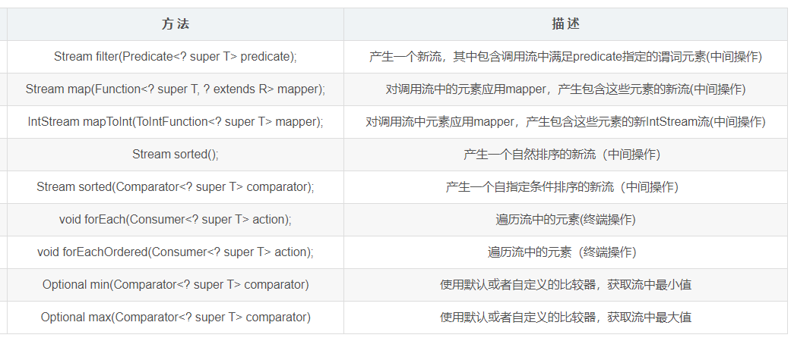
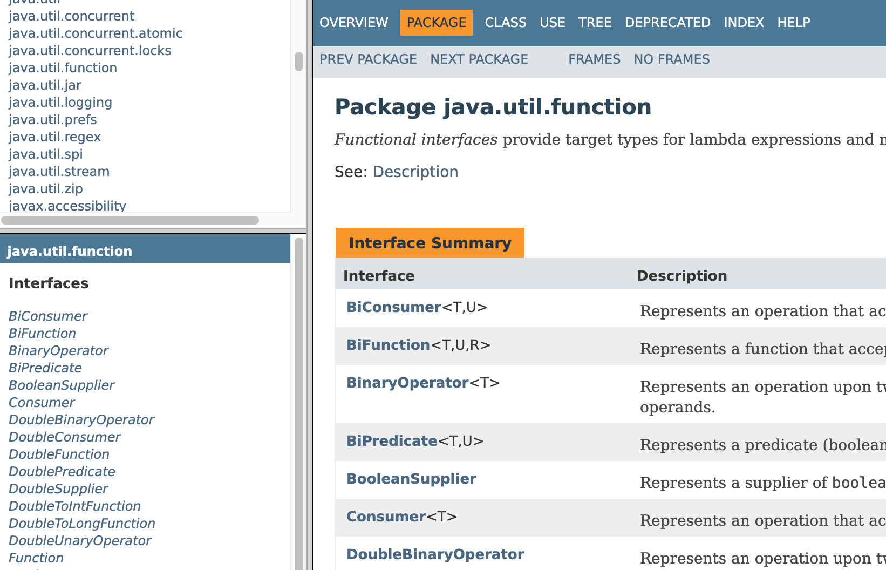
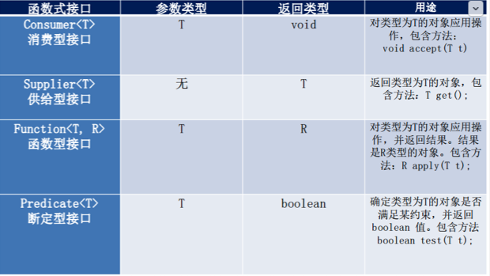

## 1.从迭代到流的操作

在处理集合时，通常迭代遍历它的元素：

```java
String contents = new String(Files.readAllBytes(Paths.get("alice30.txt")), StandardCharsets.UTF_8);
List<String> words = Arrays.asList(contents.split("\\PL+"));
long count = 0;
for (String w: words) {
    if (w.length() > 12) {
        count++;
    }
}
```

在使用流时：

```java
long count = words.stream().filter(w -> w.length() > 12).count();
```

流的版本比循环版本要更易于阅读，因为不必扫描整个代码去查找过滤和计数操作，方法名就可以直接看到代码意欲何为。 循环需要非常详细地指定操作的顺序，而流却能够以其想要的任何方式来调度这些操作，只要结果正确即可。 将stream修改为parallelStream就可以让流库以并行方式来执行过滤和计数。 

流遵循了做什么而非怎么做的原则，``集合讲的是数据，流讲的是计算``。

流和集合的显著差异： 

1. 流并不存储其元素。这些元素可能存储在底层的集合中，或者是按需生成。 

2. 流的操作不会修改其数据源。 

3. 流的操作尽可能惰性执行的。这意味着直至需要其结果时，操作才会执行。
4. 流不可复用，对一个已经进行过终端操作的流再次调用，会抛出异常。

实例代码：stream会产生一个用于words列表的stream，filter方法会返回另一个流，其中只包含长度大于12的单词。count方法会将这个流化简为一个结果。

操作流时典型的三个阶段的操作管道：

1. 创建一个流 

2. 指定将初始化流转换为其他流的中间操作，可能包含多个步骤，处理数据源数据

3. 应用终止操作，从而产生结果。这个操作会强制执行之前的惰性中间操作链，产生结果。从此之后，这个流就再也不能用了。

## 2.流的创建

数组可以用静态的`Stream.of`方法：

```java
Stream<String> words = Stream.of(contents.split("\\PL+"));
```

of方法具有可变长参数，因此可以具有任意数量引元的流：

```java
Stream<String> song = Stream.of("gently", "down", "the", "stream");
```

使用`Array.stream(arry, from, to)`可以数组中位于from(包括)和to(不包括)的元素中创建一个流。 

```java
//通过Arrays.stream
// 基本类型
int[] arr = new int[]{1,2,34,5};
IntStream intStream = Arrays.stream(arr);
// 引用类型
Stream<String> studentStream = Arrays.stream(contents.split("\\PL+"));
```

`Stream.empty`创建不包含任何元素的流。

Stream接口有两个用于创建无限流的静态方法。generate方法会接受一个不包含任何引元的函数（从技术上讲，是一个Supplier&lt; T &gt;接口的对象）。只需要一个流类型的值，该函数就会调用用以产生一个这样的值。获取一个常量值的流：

```java
Stream<String> echos = Stream.generate(() -> "Echo"); // 无限个Echo
```

获取一个随机数的流：

```java
Stream<Double> randoms = Stream.generate(Math::random);
```

为了产生无限序列（0 1 2 3）可以使用iterate方法。它会接受一个种子值，以及一个函数（OnaryOperation&lt; T &gt;），并反复将该函数应用到之前的结果：

```java
Stream<BigInteger> integers = Stream.iterate(BigInteger.ZERO, n -> n.add(BigInteger.ONE));
```

第一个元素是种子BigInteger.ZERO，第二个是f(seed)，第三个是f(f(seed))。

Patteran类有一个splitAsStream方法，它会按照某个正则表达式来分割一个CharSequence对象：

```java
Stream<String> ws = Pattern.compile("\\PL+").splitAsStream(contents);
```

静态的Files.lines方法会返回一个包含了文件所有行的Stream：

```java
Stream<String> lines = Files.lines(Paths.get("alice30.txt"));
```

```java
public class CreatingStreams {
    public static <T> void show(String title, Stream<T> stream) {
        final int SIZE = 10;
        List<T> firstElements = stream.limit(SIZE + 1).collect(Collectors.toList());
        System.out.println(title + ": ");
        for (int i = 0; i < firstElements.size(); i++) {
            if (i > 0) {
                System.out.print(", ");
            }
            if (i < SIZE) {
                System.out.print(firstElements.get(i));
            } else {
                System.out.print("...");
            }
        }
        System.out.println();
    }

    public static void main(String[] args) throws IOException {
        Path path = Paths.get("alice30.txt");
        String contents = new String(Files.readAllBytes(path), StandardCharsets.UTF_8);

        //通过Arrays.stream
        // 基本类型
        int[] arr = new int[]{1,2,34,5};
        IntStream intStream = Arrays.stream(arr);
        // 引用类型
        Stream<String> studentStream = Arrays.stream(contents.split("\\PL+"));
        
        Stream<String> words = Stream.of(contents.split("\\PL+"));
        show("words", words);
        Stream<String> song = Stream.of("gently", "down", "the", "stream");
        show("song", song);

        Stream<String> echos = Stream.generate(() -> "Echo");
        show("echos", echos);

        Stream<Double> randoms = Stream.generate(Math::random);
        show("randoms", randoms);

        Stream<BigInteger> integers = Stream.iterate(BigInteger.ZERO, n -> n.add(BigInteger.ONE));
        show("integers", integers);

        Stream<String> wordsAnotherWay = Pattern.compile("\\PL+").splitAsStream(contents);
        show("wordsAnotherWay", wordsAnotherWay);

        Stream<String> lines = Files.lines(path, StandardCharsets.UTF_8);
        show("lines", lines);
    }
}
```

## 3.filter、map和faltMap方法

```java
public interface Stream<T> extends BaseStream<T, Stream<T>> {
	...
}
```



filter转换会产生一个流，它的元素与某种条件想匹配，将符合条件的元素提取出来的操作。filter通常要配合collect（收集），将筛选结果收集成一个新的集合。

filter的引元(函数式接口，参考最下方扩展)是Predicate&lt; T &gt;，即从T到boolean的函数：

```java
list.stream().filter(w -> w.length() > 12);
```

map方法可以按照某种方式来转换流中的值。使用map方法并传递执行该转换的函数，该函数应用到每个元素上，并且其结果是包含了应用该函数后所产生的所有结果的流：

```java
// 包含所有单词的首字母
Stream<String> firstLetters = list.stream().map(s -> s.substring(0, 1));
```

```java
public static void main(String[] args) {
    List<String> words = new ArrayList<>();
    words.add("Amy");
    words.add("Mack");
    words.add("boat");
    // 得到一个包含流的流
    Stream<Stream<String>> result = words.stream().map(w -> letters(w));
    
}
// 返回包含值的流
public static Stream<String> letters(String s) {
    List<String> result = new ArrayList<>();
    for (int i = 0; i < s.length(); i++) {
        result.add(s.substring(i, i + 1));
    }
    return result.stream();
}
```

为了得到字母流，可以使用flatMap方法而不是map方法：

```java
Stream<String> result = words.stream().flatMap(w -> letters(w));
```

## 4.抽取子流和连接流

调用stream.limit(n)会返回一个新的流，它在n个元素之后结束（如果原来的流更短，那么就会在流结束时结束）。

```java
Stream<Double> randoms = Stream.generate(Math::random).limit(100);
```

调用stream.skip(n)正好相反，它会丢弃前n个元素。 Stream类的静态的concat方法可以将两个流连接起来，当然第一个流不应该是无限的，否则第二个流永远都不会得到处理的机会：

```java
Stream<String> combined = Stream.concat(letters("Hello"), letters("World"));
```

## 5.其他的流转换

distinct方法会返回一个流，它的元素是从原有流中产生的，即原来的元素按照同样的顺序剔除重复元素后产生，这个流显然能够记住它已经看过的元素：

```java
Stream<String> uniqueWords = Stream.of("merrily", "merrily", "merrily", "merrily").distinct();
```

流的排序，一种用于操作Comparable元素的流，另一种可以接受一个Comparator。

```java
Stream<String> longestFirst = words.stream().sorted(Comparator.comparing(String::length).reversed());
```

当然对集合排序可以不使用流，但是当排序处理是流管道的一部分时，sorted方法就很有用了。

peek方法会产生另一个流，它的元素与原来的元素相同，但是每次在获取元素时，都会调用一个函数（对调试很方便）：

```java
Object[] powers = Stream.iterate(1.0, p -> p * 2).peek(e -> System.out.println("Fetching " + e)).limit(20).toArray();
```

当实际访问一个元素时，就会打印一条消息，通过这种方式，可以验证iterate返回的无限流是被惰性处理的。

## 6.约简操作

约简是一种终结操作（terminal operation），它们会将流约简为可以在程序中使用的非流值。``count方法``返回流中的数量，就是一种简单约简。

简单约简还有``max和min``，会返回最大值和最小值。返回的是一个类型Optional&lt; T &gt;的值，它要么在其中包装了答案，要么表示没有任何值。碰到返回null是很常见的，如果直接返回null会导致未做完备测试的程序产生空指针异常。Optional类型是一种更好的表示缺少返回值的方式。

```java
Optional<String> largest = words.stream().max(String::compareToIgnoreCase);
System.out.println(largest.orElse(""));
```

`findFirst`返回非空集合中的第一个值，通常与filter组合使用时显得很有用：

```java
Optional<String> startWithQ = words.stream().filter(s -> s.startsWith("Q")).findFirst();
```

如果不强调使用第一个匹配，而是用任意的匹配，可以使用`findAny`方法。 如果想知道是否存在匹配，那么可以使用`anyMatch`。这个方法可以接受一个断言引元，不需要使用filter。

```java
boolean aWordStartWithQ = words.stream().parallel().anyMatch(s -> s.startsWith("Q"));
```

还有`allMatch和noneMatch`方法，它们分别会在所有元素和没有任何元素匹配断言的情况下返回true。

`reduce`方法是一种缩减操作，就是把一个流缩减成一个值，比如对一个集合求和、求乘积等，用于从流中计算某个值的通用机制。最简单的形式将接受一个二元函数，并从前两个元素开始持续应用它。如果该函数是求和函数：

```java
List<Integer> values = ...;
Optional<Integer> sum = values.stream().reduce((x,y) -> x + y);
```

reduce会计算v0 + v1 + v2 +…，如果流为空，方法会返回一个Optional。上面情况可以写成reduce(Integer::sum) 通常v0 op v1 op v2 op…，调用函数op(vi, vi+1)写作vi op vi+1。这项操作是可结合的：即组合元素时使用顺序不应该成为问题。（x op y） op z等于x op (y op z)，这使得在使用并行流时，可以执行高效约简。 求和，乘积，字符串连接，取最大值，最小值，求集的并与交等，都是可结合操作。减法不是一个可结合操作，（6-3）-2 ≠ 6 - （3 - 2）。 通常`幺元值`e使得e op x = x，可以使用这个元素做为计算的起点：

```java
Integer sum = values.stream().reduce(0, (x, y) -> x + y);
// 0 + v0 + v1 + v2 + ...
```

如果流为空，则会返回幺元值。

如果有一个对象流，且想要对某些属性求和，需要（T,T）-&gt;T这样的函数，即引元和结果的类型相同的函数。 但如果类型不同，例如流的元素具有String类型，而累积结果是整数，首先需要一个累积器（total, word） -&gt; total + word.length()，这个函数会被反复调用产生累积的总和。但是当计算被并行化时，会有更多个这种类型的计算，需要提供第二个函数来将结果合并：

```java
int result = words.reduce(0,
	(total, word) -> total + word.length(),
	(total1, total2) -> total1 + total2);
```

在实践中reduce会显得并不够通用，通常映射为数字流并使用其他方法来计算总和、最大值和最小值（words.mapToInt(String::length).sum()，因为不涉及装箱操作，所以更简单也更高效）。

## 7.Optional类型

Optional&lt; T &gt;对象是一种包装器对象，要么包装了类型T的对象，要么没有包装任何对象（要么引用某个对象，要么为null）。

### 如何使用Optional值

有效使用Optional的关键：它在值不存在的情况下会产生一个可替代物，而存在的情况下才会使用这个值。 默认值为空字符串：

```java
String result = optionalString.orElse("");
```

计算默认值：

```java
String result = optionalString.orElseGet(() -> Locale.getDefault().getDisplayName());
```

抛出异常：

```java
String result = optionalString.orElseThrow(IllegalAccessException::new);
```

上述是不存在任何值的情况下产生相应的替代物，另一条策略是只有存在的情况下才消费该值：

```java
optionalString.ifPresent(v -> results.add(v));
optionalString.ifPresent(results::add);
```

ifPresent不会返回任何值，如果想要得到处理结果：

```java
Optional<Boolean> added = optionalString.map(results::add);
```

added有三种值：true或false，以及在optionalString不存在的情况下的空Optional。

### 不适合使用Optional值的方式

get方法会在Optional值存在的情况下获得其中包装的元素，或者不存在时抛出一个NoSuchElementException对象，因此：

```java
Optional<T> optionalValue = ...;
optionalValue.get().method();
// Optional并不比下面方式安全
T value = ...;
value.method()

if (optionalValue.isPresent()) {
	optionalValue.get().method();
} 
// 并不比下面的方式更易处理
if (value != null) {
	value.method();
}
```

### 创建Optional值

```java
public static Optional<Double> inverse(Double x) {
    return x == 0 ? Optional.empty() : Optional.of(1 / x);
}
```

Optional.ofNullable(obj)会在obj不为nul的情况下返回Optional.of(obj)，否则返回Optional.empty()

### 用flatMap来构建Optional值的函数

可以产生Optional&lt; T &gt;对象的方法f，目标对象T具有一个可以产生Optional&lt; U &gt;对象的方法g。 s.f().g()这种组合没法工作，因为s.f()的类型为Optional&lt; T &gt;而不是T，因此需要：

```java
Optional<U> result = s.f().flatMap(T::g);
```

如果s.f()值存在，那么g就可以应用到上面，否则会返回一个空的Optional&lt; U &gt; 。

```java
public class OptionalTest {
    public static void main(String[] args) throws IOException {
        String contents = new String(Files.readAllBytes(Paths.get("alice30.txt")), StandardCharsets.UTF_8);
        List<String> wordList = Arrays.asList(contents.split("\\PL+"));
        Optional<String> optionalValue = wordList.stream().filter(s -> s.contains("fred")).findFirst();
        System.out.println(optionalValue.orElse("No word") + " contains fred");
        Optional<String> optionalString = Optional.empty();
        String result = optionalString.orElse("N/A");
        System.out.println("result: " + result);
        result = optionalString.orElseGet(() -> Locale.getDefault().getDisplayName());
        System.out.println("result: " + result);
        try {
            result = optionalString.orElseThrow(IllegalStateException::new);
            System.out.println("result: " + result);
        } catch (Throwable t) {
            t.printStackTrace();
        }
        optionalValue = wordList.stream().filter(s -> s.contains("red")).findFirst();
        optionalValue.ifPresent(s -> System.out.println(s + " contains red"));
        Set<String> results = new HashSet<>();
        optionalValue.ifPresent(results::add);
        Optional<Boolean> added = optionalValue.map(results::add);
        System.out.println(results);
        System.out.println(added);
        System.out.println(inverse(4.0).flatMap(OptionalTest::squareRoot));
        System.out.println(inverse(-1.0).flatMap(OptionalTest::squareRoot));
        System.out.println(inverse(0.0).flatMap(OptionalTest::squareRoot));
        Optional<Double> result2 = Optional.of(-4.0).flatMap(OptionalTest::inverse).flatMap(OptionalTest::squareRoot);
        System.out.println(result2);
    }
    public static Optional<Double> inverse(Double x) {
        return x == 0 ? Optional.empty() : Optional.of(1 / x);
    }
    public static Optional<Double> squareRoot(Double x) {
        return x < 0 ? Optional.empty() : Optional.of(Math.sqrt(x));
    }
}
```

## 8.收集结果

iterator会产生可以用来访问元素的旧式风格迭代器。 调用forEach方法，将某个函数应用于每个元素：

```java
stream.forEach(System.out::println);
```

并行流上，forEach会以任意顺序遍历各个元素。如果想按照流中顺序来处理，可以调用forEachOrdered方法，这个方法会丧失并行处理的优势。

toArray获得有流元素构成的数组，会返回一个Object[]，如果要具有正确的类型，可以将其传递给数组构造器：

```java
String[] result = stream.toArray(String[]::new);
```

`collect` 会接受一个Collector接口的实例。Collectors类提供了大量用于生产公共收集器的工厂方法。为了将流收集到列表或集中：

```java
List/Set<String> result = stream.collect(Collectors.toList()/toSet());
```

如果想要控制集的种类：

```java
TreeSet<String> result = stream.collect(Collectors.toCollection(TreeSet::new));
```

通过`连接操作joining`来收集流中所有字符串：

```java
String result = stream.collect(Collectors.joining(", "));
```

流中包含除字符串以外其他对象，需要将其转化为字符串：

```java
String result = stream.map(Object::toString).collect(Collectors.joining(", "));
```

将流的结果约间为总和、`平均值averaging(Int|Long|Double)`、最大值或最小值，可以使用summarizing(Int|Long|Double)方法中的某一个。这些方法会接受一个将流对象映射为数据的函数，会产生（Int|Long|Double）SummaryStatistics的结果，同时计算总和、数量、平均值、最小值和最大值：

```java
List<Employee> personList = new ArrayList<Employee>();
personList.add(new Employee("Tom", 8900));
personList.add(new Employee("Jack", 7000));
personList.add(new Employee("Lily", 9000));
Double averageSalary = personList.stream().collect(Collectors.averagingDouble(Employee::getSalary));
System.out.println(averageSalary);

IntSummaryStatistics summary = stream.collect(Collectors.summarizingInt(String::length));
double averageWordLength = summary.getAverage();
double maxWordLength = summary.getMax();
```

```java
public class CollectingResults {
    public static Stream<String> noVowels() throws IOException {
        String contents = new String(Files.readAllBytes(Paths.get("alice30.txt")), StandardCharsets.UTF_8);
        List<String> wordList = Arrays.asList(contents.split("\\PL+"));
        Stream<String> words = wordList.stream();
        return words.map(s -> s.replaceAll("[aeiouAEIOU]", ""));
    }
    public static <T> void show(String label, Set<T> set) {
        System.out.print(label + ": " + set.getClass().getName());
        System.out.println("["
            + set.stream().limit(10).map(Object::toString)
                .collect(Collectors.joining(", ")) + "]");
    }
    public static void main(String[] args) throws IOException {
        Iterator<Integer> iter = Stream.iterate(0, n -> n + 1).limit(10).iterator();
        while (iter.hasNext()) {
            System.out.println(iter.next());
        }
        Object[] numbers = Stream.iterate(0, n -> n + 1).limit(10).toArray();
        System.out.println("Object array:" + Arrays.toString(numbers));
        try {
            Integer number = (Integer) numbers[0];
            System.out.println("number:" + number);
            System.out.println("The following statement throws an exception:");
            Integer[] number2 = (Integer[]) numbers;
        } catch (ClassCastException ex) {
            System.out.println(ex);
        }
        Integer[] number3 = Stream.iterate(0, n-> n + 1).limit(10).toArray(Integer[]::new);
        System.out.println("Integer array:" + Arrays.toString(number3));
        Set<String> noVowelSet = noVowels().collect(Collectors.toSet());
        show("noVowelSet", noVowelSet);
        TreeSet<String> noVowelTreeSet = noVowels().collect(Collectors.toCollection(TreeSet::new));
        show("noVowelTreeSet", noVowelTreeSet);
        String result = noVowels().limit(10).collect(Collectors.joining());
        System.out.println("Joining: " + result);
        result = noVowels().limit(10).collect(Collectors.joining(", "));
        System.out.println("Joining with commas: " + result);
        IntSummaryStatistics summary = noVowels().collect(Collectors.summarizingInt(String::length));
        double averageWordLength = summary.getAverage();
        double maxWordLength = summary.getMax();
        System.out.println("Average word length: " + averageWordLength);
        System.out.println("Max word length: " + maxWordLength);
        System.out.println("forEach:");
        noVowels().limit(10).forEach(System.out::println);
    }
}
```

## 9.收集到映射表中

Collectors.toMap方法有两个函数引元，用来产生映射表的键和值：

```java
Map<Integer, String> idToName = people.collect(Collectors.toMap(Person::getId, Person::getName));
```

通常情况下，值应该是实际的元素，因此第二个函数可以使用Function.identity()

多个元素具有相同的键，收集器会抛出一个IllegalStateException对象。可以通过提供第三个函数引元来覆盖这种行为。该函数会针对给定的已有值和新值来解决冲突并确定键对应的值。这个函数应该返回已有值、新值或它们的组合。 获取所有Locale的名字为键和其本地化名字为值：

```java
Stream<Locale> locales = Stream.of(Locale.getAvailableLocales());
Map<String, String> languageNames = locales.collect(
        Collectors.toMap(
                Locale::getDisplayLanguage,
                l -> l.getDisplayLanguage(l),
                (existingValue, newValue) -> existingValue));
```

不必担心同一种语言是否可能出现两次，只记录第一项。

如果需要了解给定所有国家的语言，就需要一个Map&lt; String, Set&lt; String &gt; &gt;：

```java
Map<String, Set<String>> countryLanguageSets = locales.collect(
        Collectors.toMap(
                Locale::getDisplayCountry,
                l -> Collections.singleton(l.getDisplayLanguage()),
                (a, b) -> {
                    Set<String> union = new HashSet<>(a);
                    union.addAll(b);
                    return union;
                }
        ));
```

想要得到TreeMap，可以将构造器做为第4个引元来提供，必须提供一种合并函数：

```java
Map<Integer, Person> idToPerson = people.collect(
        Collectors.toMap(
                Person::getId,
                Function.identity(),
                (existingValue, newValue) -> { throw new IllegalStateException(); },
                TreeMap::new));
```

对于每个toMap方法，都有一个等价的可以产生并发散列表的toConcurrentMap方法。单个并发映射表可以用于并发集合处理。当使用并行流时，共享的映射表比合并映射表要高效。元素不再是按照流中的顺序收集。

```java
public class CollectingIntoMaps {
    public static class Person{
        private int id;
        private String name;
        public Person(int id, String name) {
            this.id = id;
            this.name = name;
        }
        public int getId() {
            return id;
        }
        public String getName() {
            return name;
        }
        @Override
        public String toString() {
            return getClass().getName() + "[id=" + id + ",name=" + name + "]";
        }
    }
    public static Stream<Person> people() throws IOException {
        return Stream.of(new Person(1001, "Peter"), new Person(1002, "Paul"),
                new Person(1003, "Mary"));
    }
    public static void main(String[] args) throws IOException {
        Map<Integer, String> idToName = people().collect(
                Collectors.toMap(Person::getId, Person::getName));
        System.out.println("idToName: " + idToName);
        Map<Integer, Person> idToPerson = people().collect(
                Collectors.toMap(Person::getId, Function.identity()));
        System.out.println("idToPerson: " + idToPerson.getClass().getName() + idToPerson);
        idToPerson = people().collect(
                Collectors.toMap(Person::getId, Function.identity(),
                        (existingValue, newValue) -> { throw  new IllegalStateException(); }, TreeMap::new));
        System.out.println("idToPerson: " + idToPerson.getClass().getName() + idToPerson);
        Stream<Locale> locales = Stream.of(Locale.getAvailableLocales());
        Map<String, String> languageNames = locales.collect(
                Collectors.toMap(Locale::getDisplayLanguage,
                        l -> l.getDisplayLanguage(l),
                        (existingValue, newValue) -> existingValue));
        System.out.println("languageNames: " + languageNames);
        locales = Stream.of(Locale.getAvailableLocales());
        Map<String, Set<String>> countryLanguageSets = locales.collect(
                Collectors.toMap(
                        Locale::getDisplayCountry,
                        l -> Collections.singleton(l.getDisplayLanguage()),
                        (a, b) -> {
                            Set<String> union = new HashSet<>(a);
                            union.addAll(b);
                            return union;
                        }
                ));
        System.out.println("countryLanguageSets: " + countryLanguageSets);
    }
}
```

## 10.群组和分区

groupingBy将具有相同特性的值群聚成组。

```java
Map<String, List<Locale>> countryToLocales = locales.collect(
        Collectors.groupingBy(Locale::getCountry));
List<Locale> swissLocales = countryToLocales.get("CN");
// [zh_CN]
```

每个Locale都有一个语言代码（en）和一个国家代码（US）。Locale en_US描述美国英语，而en_IE是爱尔兰英语，某些国家有过个Locale。

当分类函数是断言函数时，流的元素可以分区为两个列表：该函数返回true的元素和其他元素（partitioningBy比groupingBy更高效）。

```java
Map<Boolean, List<Locale>> englishAndOtherLocales = locales.collect(
        Collectors.partitioningBy(l -> l.getLanguage().equals("en")));
List<Locale> englishLocales = englishAndOtherLocales.get(true);
```

使用groupingByConcurrent方法，就会使用并行流时获得一个被并行组装的并行映射表。

## 11.下游收集器

groupingBy方法会产生一个映射表，它的每个值都是一个列表，如果想处理这些列表，就需要提供一个下游收集器。 静态导入java.util.stream.Collectors.*会使表达式更容易阅读。

```java
import static java.util.stream.Collectors.*;
Map<String, Set<Locale>> countryToLocales = locales.collect(
        groupingBy(Locale::getCountry, toSet()));
```

Java提供了多种可以将群组元素约简为数字的收集器： 1.counting会产生收集到的元素的个数：

```java
Map<String, Long> countryToLocaleCounts = locales.collect(
        groupingBy(Locale::getCountry, counting()));
```

2.summing(Int|Long|Double)会接收一个函数引元，将该函数应用到下游元素中，并产生它们的和：

```java
Map<String, Integer> stateToCityPopulation = cities.collect(
        groupingBy(City::getState, summarizingInt(City::getPopulation)));
```

3.maxBy和minBy会接收一个比较器，并产生下游元素中的最大值和最小值：

```java
Map<String, Optional<City>> stateToLargestCity = cities.collect(
        groupingBy(City::getState, maxBy(Comparator.comparing(City::getPopulation))));
```

mapping方法会产生函数应用到下游结果上的收集器，并将函数值传递给另一个收集器：

```java
Map<String, Optional<String>> stateToLongstCityName = cities.collect(
        groupingBy(City::getState, mapping(City::getName, maxBy(Comparator.comparing(String::length)))));
```

将城市群组在一起，在每个州内部，生成各个城市的名字，并按照最大长度约简。

9节中把语言收集到一个集中，使用mapping会有更加的解决方案：

```java
Map<String, Set<String>> contryToLanguages = locales.collect(
        groupingBy(Locale::getDisplayCountry,
                mapping(Locale::getDisplayLanguage, toSet())));
```

9节中使用的是toMap而不是groupingBy，上述方式中，无需操心如何将各个集组合起来。

可以从每个组的汇总对象中获取到这些函数值的总和、个数、平均值、最小值和最大值：

```java
Map<String, IntSummaryStatistics> stateToCityPopulationSummary = cities.collect(
                groupingBy(City::getState, summarizingInt(City::getPopulation)));
```

```java
public class DownstreamCollectors {
    public static class City {
        private String name;
        private String state;
        private int population;
        public City(String name, String state, int population) {
            this.name = name;
            this.state = state;
            this.population = population;
        }
        public String getName() {
            return name;
        }
        public String getState() {
            return state;
        }
        public int getPopulation() {
            return population;
        }
    }
    public static Stream<City> readCities(String filename) throws IOException {
        return Files.lines(Paths.get(filename)).map(l -> l.split(", ")).
                map(a -> new City(a[0], a[1], Integer.parseInt(a[2])));
    }
    public static void main(String[] args) throws IOException {
        Stream<Locale> locales = Stream.of(Locale.getAvailableLocales());
        Map<String, Set<Locale>> countryToLocaleSet = locales.collect(groupingBy(
           Locale::getCountry, toSet()));
        System.out.println("countryToLocaleSet: " + countryToLocaleSet);
        locales = Stream.of(Locale.getAvailableLocales());
        Map<String, Long> countryToLocaleCounts = locales.collect(groupingBy(
           Locale::getCountry, counting()));
        System.out.println("countryToLocaleCounts: " + countryToLocaleCounts);
        Stream<City> cities = readCities("cities.txt");
        Map<String, Integer> stateToCityPopulation = cities.collect(
                groupingBy(City::getState, summingInt(City::getPopulation)));
        System.out.println("stateToCityPopulation: " + stateToCityPopulation);
        cities = readCities("cities.txt");
        Map<String, Optional<String>> stateToLongestCityName = cities.collect(groupingBy(
                City::getState, mapping(City::getName, maxBy(Comparator.comparing(String::length)))));
        System.out.println("stateToLongestCityName: " + stateToLongestCityName);
        locales = Stream.of(Locale.getAvailableLocales());
        Map<String, Set<String>> countryToLanguages = locales.collect(groupingBy(
                Locale::getDisplayCountry, mapping(Locale::getDisplayLanguage, toSet())));
        System.out.println("countryToLanguages: " + countryToLanguages);
        cities = readCities("cities.txt");
        Map<String, IntSummaryStatistics> stateToCityPopulationSummary = cities.collect(
                groupingBy(City::getState, summarizingInt(City::getPopulation)));
        System.out.println(stateToCityPopulationSummary.get("上海市"));
        cities = readCities("cities.txt");
        Map<String, String> stateToCityNames = cities.collect(
                groupingBy(City::getState, reducing("", City::getName, (s, t) -> s.length() == 0 ? t : s + ", " + t)));
        System.out.println("stateToCityNames: " + stateToCityNames);
        cities = readCities("cities.txt");
        stateToCityNames = cities.collect(groupingBy(City::getState, mapping(City::getName, joining(", "))));
        System.out.println("stateToCityNames: " + stateToCityNames);
    }
}
```

## 12.基本类型流

将整数收集到Stream&lt; Integer &gt;中，将每个整数都包装到包装器对象中是很低效的。流库中具有专门的类型IntStream、LongStream和DoubleStream，用来直接存储基本类型值，无需使用包装器。short、char、byte和boolean，可以使用IntStream，对于float可以使用DoubleStream。

调用IntStream.of和Arrays.stream方法创建IntStream：

```java
IntStream stream = IntStream.of(1, 1, 2, 3, 5);
stream = Arrays.stream(values, 2, 4); //values是一个数组
```

基本类型流还可以使用静态的generate和iterate方法，此外，IntStream和LongStream有静态方法range和rangeClosed，可以生成步长为1的整数范围：

```java
IntStream zeroToNinetyNine = IntStream.range(0 ,100);
IntStream zeroToHundred = IntStream.rangeClosed(0 ,100);
```

CharSequence接口拥有codePoints和chars方法，可以生成有字符的Unicode码或有UTF-16编码机制的码元构成的IntStream：

```java
String sentence = "\uD835\uDD46 is the set of octonions.";
IntStream codes = sentence.codePoints();
```

对象流可以用mapToInt、mapToLong和mapToDouble将其转换为基本类型流：

```java
Stream<String> words = ...;
IntStream lengths = words.mapToInt(String::length);
```

基本类型流转换为对象流，使用boxed方法：

```java
Stream<Integer> integers = IntStream.range(0, 100).boxed();
```

基本类型流的方法与对象流的方法的主要差异： 1.toArray方法会返回基本类型数组。 2.返回结果OptionalInt|Long|Double，要用getAsInt|Long|double方法，而不是get方法 3.具有返回总和、平均值、最大值和最小值的sum、average、max和min方法，对象流没有 4.summaryStatistics方法会产生一个类型为Int|Long|DoubleSummaryStatistics的对象，他们可以同时报告流的总和、平均值、最大值和最小值。

Random类具有ints、longs和doubles方法，可以返回随机数构成的基本类型流。

```java
public class PrimitiveTypeStreams {
    public static void show(String title, IntStream stream) {
        final int SIZE = 10;
        int[] firstElements = stream.limit(SIZE + 1).toArray();
        System.out.print(title + ": ");
        for (int i = 0; i < firstElements.length; i++) {
            if (i > 0) {
                System.out.print(", ");
            }
            if (i < SIZE) {
                System.out.print(firstElements[i]);
            } else {
                System.out.print("...");
            }
        }
        System.out.println();
    }
    public static void main(String[] args) throws IOException {
        IntStream is1 = IntStream.generate(() -> (int)(Math.random() * 100));
        show("is1", is1);
        IntStream is2 = IntStream.range(5, 10);
        show("is2", is2);
        IntStream is3 = IntStream.rangeClosed(5, 10);
        show("is3", is3);
        Path path = Paths.get("alice30.txt");
        String contents = new String(Files.readAllBytes(path), StandardCharsets.UTF_8);
        Stream<String> words = Stream.of(contents.split("\\PL+"));
        IntStream is4 = words.mapToInt(String::length);
        show("is4", is4);
        String sentence = "\uD835\uDD46 is the set of octonions.";
        System.out.println(sentence);
        IntStream codes = sentence.codePoints();
        System.out.println(codes.mapToObj(c -> String.format("%X ", c)).collect(
                Collectors.joining()));
        Stream<Integer> integers = IntStream.range(0, 100).boxed();
        IntStream is5 = integers.mapToInt(Integer::intValue);
        show("is5", is5);
    }
}
```

## 13.并行流

流使得并行处理块操作变得很容易，但必须有一个并行流。可以用Collection.parallelStream()方法从任何集合中获取一个并行流：

```java
Stream<String> parallelWords = words.parallelStream();
```

而parallel方法可以将任意的顺序流转换为并行流：

```java
Stream<String> parallelWords = Stream.of(strings).parallel();
```

只要在终结方法执行时，流处于并行模式，那么所有的中间流操作都将被并行化。 当流操作并行运行时，其目标是要让其返回结果与顺序执行时返回的结果相同。重要的是，这些操作可以以任意顺序执行。

对字符串流的所有短单词计数：

```java
String contents = new String(Files.readAllBytes(Paths.get("alice30.txt")), StandardCharsets.UTF_8);
List<String> wordList = Arrays.asList(contents.split("\\PL+"));
int[] shortWords = new int[12];
wordList.parallelStream().forEach(
        s -> { if (s.length() < 12) { shortWords[s.length()]++; }});
System.out.println(Arrays.toString(shortWords));
```

这是一种非常糟糕的代码。传递给forEach的函数会在多个并发线程中运行，每个都会更新共享的数组。这是一种经典的竞争情况。如果多次运行这个程序，每次运行都会产生不同的计数值，而且每个都是错的。

需要确保传递给并行流操作的任何函数都可以安全地并行执行，最佳方式是远离易变状态。如果用长度将字符串群组，然后在分别计数，就可以安全地并行化计算：

```java
Map<Integer, Long> shortWordCounts = wordList.parallelStream().
        filter(s -> s.length() < 10).collect(Collectors.groupingBy(String::length, Collectors.counting()));
```

默认情况下，有序集合（数组和列表或Stream.sorted）产生的流都是有序的。因此结果是完全可以预知的，运行相同操作两次，结果是完全相同的结果。 排序并不排斥高效地并行处理。当计算stream.map()时，流可以被划分为n的部分，会并行处理。然后按照顺序重新组装起来。

当放弃排序需求时，可以被更有效地并行化。通过在流上调用unordered方法，就可以明确表示对排序不感兴趣。在有序的流中，distinct会保留所有相同元素的第一个，这对并行化是一种阻碍，因为处理每个部分的线程在其之前的所有部分都被处理完之前，并不知道应该丢弃哪些元素。 还可以通过放弃排序要求来提高limit方法的速度：

```java
Stream<String> sample = words.parallelStream().unordered().limit(n);
```

合并映射表的代价很高昂，所以Collectors.groupByConcurrent方法使用了共享的并发映射表。为了从并行化中获益，映射表中值的顺序不会与流中的顺序相同。

```java
Map<Integer, List<String>> result = words.parallelStream().collect(
        Collectors.groupingByConcurrent(String::length));
```

如果使用独立于排序的下游收集器：

```java
Map<Integer, Long> wordCounts = words.parallelStream().collect(
        Collectors.groupingByConcurrent(String::length, Collectors.counting()));
```

不要修改在执行某项流操作后会将元素返回到流中的集合（即使这样修改是线程安全的）。流并不会收集它们的数据，数据总是在单独的集合中。如果修改了这样的集合，那么流操作的结果就是未定义的（顺序流和并行流都采用这种方式）。 因为中间的流操作是惰性的，所以直到执行终结操作时才对集合进行修改仍旧是可行的。尽管不推荐，但仍可以工作：

```java
List<String> wordList = ...;
Stream<String> words = wordList.stream();
wordList.add("END");
long n = words.distinct().count();
```

但是下面是错误的：

```java
Stream<String> words = wordList.stream();
words.forEach(s -> if(s.length() < 12) wordList.remove(s));
```

为了让并行流正常工作，需要满足大量条件： 1.数据应该在内存中 2.流应该可以被高效地分成若干个子部分，由数组和平衡二叉树支撑的流 3.流操作的工作量应该具有较大的规模，不要将所有流都转化为并行流，只有对已经位于内存中的数据执行大量计算操作时，才应该使用并行流 4.流操作不应该被阻塞

```java
public class ParallelStreams {
    public static void main(String[] args) throws IOException {
        String contents = new String(Files.readAllBytes(Paths.get("alice30.txt")), StandardCharsets.UTF_8);
        List<String> wordList = Arrays.asList(contents.split("\\PL+"));
        // 代码很糟糕
        int[] shortWords = new int[10];
        wordList.parallelStream().forEach(s -> {
            if (s.length() < 10) {
                shortWords[s.length()]++;
            }
        });
        System.out.println(Arrays.toString(shortWords));
        //再试一次结果可能会不同（也可能是错误的）
        Arrays.fill(shortWords, 0);
        wordList.parallelStream().forEach(s ->{
            if (s.length() < 10) {
                shortWords[s.length()]++;
            }
        });
        System.out.println(Arrays.toString(shortWords));
        // 补救措施：分组计数
        Map<Integer, Long> shortWordCounts = wordList.parallelStream()
                .filter(s -> s.length() < 10)
                .collect(groupingBy(String::length, counting()));
        System.out.println(shortWordCounts);
        Map<Integer, List<String>> result = wordList.parallelStream().collect(
                groupingByConcurrent(String::length));
        System.out.println(result.get(14));
        result = wordList.parallelStream().collect(
                groupingByConcurrent(String::length));
        System.out.println(result.get(14));
        Map<Integer, Long> wordCounts = wordList.parallelStream().collect(
                groupingByConcurrent(String::length, counting()));
        System.out.println(wordCounts);
    }
}
```

## 扩展：函数式接口





```java
public class StreamDemo {
    public static void main(String[] args) {
        Function<String, Integer> function = new Function<String, Integer>() {
            @Override
            public Integer apply(String s) {
                return s.length();
            }
        };
        Function<String, Integer> function1 = s -> s.length();
        System.out.println(function.apply("abc"));
        System.out.println(function1.apply("abcde"));

        Predicate<String> predicate = new Predicate<String>() {
            @Override
            public boolean test(String s) {
                return s.length() > 3;
            }
        };
        Predicate<String> predicate1 = s -> s.length() > 3;
        System.out.println(predicate.test("abc"));
        System.out.println(predicate1.test("abcde"));

        Consumer<String> consumer = new Consumer<String>() {
            @Override
            public void accept(String s) {
                System.out.println(s);
            }
        };
        Consumer<String> consumer1 = s -> System.out.println(s);
        consumer.accept("abc");
        consumer.accept("abcde");

        Supplier<String> supplier = new Supplier<String>() {
            @Override
            public String get() {
                return "abc";
            }
        };
        Supplier<String> supplier1 = () -> {return "abcde";};
        System.out.println(supplier.get());
        System.out.println(supplier1.get());
    }
}
```

```java
@Data
@NoArgsConstructor
@AllArgsConstructor
class User {
    private Integer id;
    private String userName;
    private int age;
}

/**
 * 请按照给出数据，找出同时满足
 * 偶数 ID且 年龄大于 24且 用户名转为大写 且 用户名字母倒排序
 * 后 只输出一个用户名字
 */
public class StreamDemo {
    public static void main(String[] args) {
        User u1 = new User(11,"a",23);
        User u2 = new User(12,"b",24);
        User u3 = new User(13,"c",22);
        User u4 = new User(14,"d",28);
        User u5 = new User(16,"e",26);

        List<User> userList = Arrays.asList(u1, u2, u3, u4, u5);
        userList.stream().filter(u -> u.getId() % 2 == 0)
                .filter(u -> u.getAge() > 24)
                .map(u -> u.getUserName().toUpperCase())
                .sorted(Comparator.reverseOrder())
                .limit(1)
                .forEach(System.out::println);
    }
}
```
