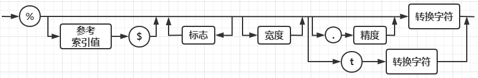

1.一个简单的Java应用程序

```java
public class FirstSample {
    public static void main(String[] args) {
        System.out.println("We will not use 'Hello, world!'");// is this to cute?
    }
}
```

`关键字 public` access modifier，访问修饰符，控制程序的其他部分对这段代码的访问级别

`关键字 class` 以字母（此处字母的范畴比较大，包括下划线”_”和美元符”$”）开头，后面跟字母和数字的任意组合，大小写敏感，长度无限制，不能使用Java的保留字

`命令 java ClassName` 运行已编译的程序时，Java虚拟机将从指定类的main方法开始执行，因此为了代码能够执行，在类的源文件中必须包含一个main方法（必须声明为main）

> 一个源文件可包含多个非 public 类，生成多个 .class 文件。
>

`System.ou` 对象，并调用了他的println方法

**注释**：

1. 每行的注释前面标记 //

2. 使用 `/* ` 和  `*/` 将一段比较长的注释括起来

3. 可用来自动地生成文档，这种注释以 `/**` 开始，以 `*/` 结束。

## 2.关键字

| 访问权限             | private    | protected | public       |           |            |           |         |      |
| -------------------- | ---------- | --------- | ------------ | --------- | ---------- | --------- | ------- | ---- |
| 类、方法和变量修饰符 | abstract   | class     | extends      | final     | implements | interface | native  | new  |
|                      | static     | strictfp  | synchronized | transient | volatile   | enum      |         |      |
| 程序控制             | break      | continue  | return       | do        | while      | if        | else    | for  |
|                      | instanceof | switch    | case         | default   | assert     |           |         |      |
| 错误处理             | try        | catch     | throw        | throws    | finally    |           |         |      |
| 包相关               | import     | package   |              |           |            |           |         |      |
| 基本类型             | byte       | short     | int          | long      | double     | float     | boolean | char |
| 变量引用             | super      | this      | void         |           |            |           |         |      |

> 除了上述关键字，Java还有以下保留字：true，false，null，goto，const

## 3.数据类型

<font color=red>Java是一种强类型语言，必须为每一个变量声明一种类型。</font>

> 1Byte（字节）&nbsp;= 8Bit（位）

### 整型

| 类型  | 字节 | 位   | 取值范围                                   |
| ----- | ---- | ---- | ------------------------------------------ |
| byte  | 1    | 8    | -2^(8-1) ~ 2^(8-1) - 1    -128 ~ 127       |
| short | 2    | 16   | -2^(16-1) ~ 2^(16-1) - 1    -32768 ~ 36767 |
| int   | 4    | 32   | -2^(32-1) ~ 2^(32-1) - 1    正好超过20亿   |
| long  | 8    | 64   | -2^(64-1) ~ 2^(64-1) - 1                   |

在 Java 中，整型的范围与运行 Java 代码的机器无关。

> `长整型后缀` L 或 l
>
> `十六进制前缀` 0X 或 0x
>
> `八进制前缀` 0
>
> `二进制前缀` 0B 或 0b

从Java 7开始，还可以为数字字面量加下划线，例1_000_000

### 浮点类型

float 类型，4个字节，32位，第1位是`符号位（数符）`，即 S，接下来的8位是`指数位（阶码）`（double有11位指数位），即 E，最后的23位，是`小数域（尾数）`，即 M。对于一个二进制数表示应该是 1.XXX* 2^X，由于第一位永远都是1所以直接省去，因此表示为S.M*2^E。所以 float 的取值范围是 -2^128 到 2^128，远远大于 long 的最大值。

`能精确表示的浮点数` 0.5的倍数，且在精度以内： *3.75* 

1. 首先将数字转为二进制： 

   整数部分 3：

   ​	3/2=1 余 1

   ​	1/2=0 余 1

   小数部分 0.75：

   ​	0.75 * 2 = 1.5 未进位 1

   ​	0.50 * 2 = 1 进位整数 1

   二进制表示：11.11

2. 将二进制数转为科学记数法表示：1.111 * 2^1

3. 转换为 IEEE754 格式存储 

   符号位 0 （正数0 负数1）

   指数 1 （float 指数 1+127，double 指数 1+1023，左移一位就+1） 

   尾数 111

   `单精度 float` 符号位 0 指数位 128(10000000) 尾数 111

   0 10000000 11100000000000000000000

   `双精度double` 符号位 0 指数位 1024(10000000000) 尾数 111

   0 10000000000 1110000000000000000000000000000000000000000000000000

`不能精确表示的浮点数`，1/3，十进制就无法精确表示三分之一这个数字。二进制也有很多很多小数无法精确表示，包括：0.1和0.2，这也是导致计算出现精度问题的根本原因。

0.2

0.20 * 2 = 0.40 未进位 0

0.40 * 2 = 0.80 未进位 0

0.80 * 2 = 1.60 进位 1

0.60 * 2 = 1.20 进位 1

0.20 * 2 = 0.40 未进位 0

0.40 * 2 = 0.80 未进位 0

0.80 * 2 = 1.60 进位 1

0.60 * 2 = 1.20 进位 1

0.20 * 2 = 0.40 未进位 0

0.40 * 2 = 0.80 未进位 0

0.80 * 2 = 1.60 进位 1

0.60 * 2 = 1.20 进位 1

0.20 * 2 = 0.40 未进位 0

0.40 * 2 = 0.80 未进位 0

0.80 * 2 = 1.60 进位 1

0.60 * 2 = 1.20 进位 1

0.20 * 2 = 0.40 未进位 0

无限循环..

二进制表示 0.2：

​	0.00110011001100110011001100110011001100110011001100110011...

科学记数表示：

​	1.10011001100110011001100110011001100110011001100110011... * 2^-3

转换为 IEEE754 格式存储：

​	符号位 0 （正数0 负数1）

​	指数 -3 （float指数 -3 + 127，double指数 -3 + 1023）

​	尾数 10011001100110011001100110011001100110011001100110011...

float 单精度浮点数，尾数只能存储 23 位，多余位数四舍五入：

​	0 01111100 10011001100110011001101

double 双精度浮点数，尾数只能存储 52 位，多余位数四舍五入：

​	0 01111111100 1001100110011001100110011001100110011001100110011010

使用下面代码可以直接查看 float 和 double 数值对应的二进制形式：

```java
float f = 3.75F;
int fb = Float.floatToIntBits(f);
System.out.println(Integer.toBinaryString(fb));
double a = 0.2;
long b = Double.doubleToLongBits(a);
System.out.println(Long.toBinaryString(b));
```

| 类型   | 字节 | 位   | 取值范围                                                     |
| ------ | ---- | ---- | ------------------------------------------------------------ |
| float  | 4    | 32   | 2^23 = 8388608，一共七位，这意味着最多能有7位有效数字，但绝对能保证的为6位，也即 float的精度为6~7位有效数字<br>-2^128 ~ +2^128（-3.40E+38 ~ +3.40E+38） |
| double | 8    | 64   | 2^52 = 4503599627370496，一共16位，double的精度为15~16位，double表示的数值精度是float类型的两倍（有人称之为双精度数值）<br>-2^1024 ~ +2^1024（-1.79E+308 ~ +1.79E+308） |

`float 后缀`  F 或 f，没有后缀的浮点数值默认为 double，也可以在浮点数值后添加后缀D或d。

用于表示溢出和出错情况的三个特殊浮点数值：

1. `正无穷大` Double.POSITIVE_INFINITY

2. `负无穷大` Double.NEGATIVE_INFINITY

3. `NaN` Double.NaN

但是不能这样检测一个特定值是否等于Double.NaN，

```java
if (x == Double.NaN)
```

因为所有非数值的值都认为不相同，

```java
Double.NaN == Double.NaN //结果为false
```

可以使用Double.isNaN方法：

```java
Double.isNaN(Double.NaN) //true
```

### char 类型

表示单个字符，采用Unicode编码，每个字符占两个字节

**转义字符**

| 转义序列 | 名称       | Unicode值 |
| -------- | ---------- | --------- |
| \b       | 退格       | \u0008    |
| \t       | 制表       | \u0009    |
| \n       | 换行       | \u000a    |
| \r       | 回车       | \u000d    |
| \\       | 反斜杠字符 | \u005c    |
| \’       | 单引号字符 | \u0027    |
| \f       | 换页       |           |

Unicode转义序列会在解析代码之前得到处理。

```java
System.out.println("\u0022+\u0022");
// .class 文件
System.out.println("");
```

并不是一个由引号(U+0022)包围加号构成的字符串。实际上 \u0022 会在解析之前转换为"，这会得到""+""，也就是一个空串。

```java
// Look inside c:\users
```

这会产生一个语法错误，因为 \u 后面未跟着4个十六进制数。

`码点(code point)` 指与一个编码表中的某个字符对应的代码值。在 Unicode 标准中，采用十六进制书写，前加前缀 U+，例如 U+00041 就是拉丁字母 A 的码点。

码点分为 17 个代码级别，第一个称为基本的多语言级别，码点从 U+0000~U+FFFF，其中包括经典的 Unicode 码；其余16个级别码点从 U+10000 到 U+10FFFF，其中包括一些辅助码点。

UFT-16 编码采用不同长度的编码表示所有 Unicode 码点。在基础的多语言代码级别中，每个字符用16为表示，通常被称为代码单元。而辅助字符采用一对连续的代码单元进行编码。这样构成的编码落入基本的多语言级别中空闲的2048字节内，被称为替代区域。例如表八元数级的一个数字符号，码点为 U+1D546，编码为两个代码单元 U+D835 和 U+DD46。

在Java中，char 类型描述了UTF-16编码中的一个代码单元。

### boolean 类型

整型值和布尔值之间不能进行转换。

## 4.变量

变量名必须是一个字母开头并由字母或数字构成，字母包括 `A~Z、a~z、_ 、$` 或在某些语言中表示字母的任何 Unicode 字符，例如希腊人可以用 ‘π’。同样，数字包括 0~9 和某语言中表示数字的任何 Unicode 字符。，但是 `+` 和`©`  不能出现在变量中，空格也不行。

可以用 Character 类的 `isJavaIdentifierStart` 和 `isJavaIdentifierPart` 方法来检查。

## 5.运算符

当参与 / 运算的两个操作数都是整型，表示整数除法，否则，表示浮点除法。

% 表示求余操作（取模）

整数被 0 除将会产生一个异常，而浮点数被 0 除将会得到无穷大或 NaN 结果：

```java
int i = 1;
double s = 1.2;
        
// System.out.println(i / 0);
System.out.println(s / 0);
```

输出：Infinity (无穷)

### 数学函数

```java
double x = 4;
double y = Math.sqrt(x);
System.out.println(y); //输出 2.0
```

println 方法处理 System.out 对象，而 Math 类中的 sqrt 方法处理的不是对象，而是静态方法。

`幂运算` pow(x,a)，x的a次幂

`平方根` sqrt

`三角函数` Mtah.sin, Math.cos, Math.tan, Math.atan, Math.atan2

`指数函数以及反函数——自然对数以及以10为底的对数` Math.exp, Math.log, Math.log10

`π` Math.PI

`e常量` Math.E

floorDiv(x,y)，返回等于或小于代数商的最大整数

```java
int r = x / y;
// 如果符号不同且模不为零，则向下舍入
if ((x ^ y) < 0 && (r * y != x)) {
    r--;
}
return r;
```

floorMod，解决一个长期存在的有关整数余数的问题。n % 2，如果n为负奇数，则表达式为-1。但是数学家们几百年都知道一个最优（或“欧几里得”）规则：余数总要&gt;=0。最早指定计算机规则的人并没有翻开数学书好好研究，而是提出了看似合理但实际上很不方便的规则。

floorMod 的源码：

```java
public static int floorMod(int x, int y) {
    int r = x - floorDiv(x, y) * y;
    return r;
}
```

```java
int n = -13;
System.out.println(n % 2);
System.out.println(Math.floorMod(n, 2));
// -1
// 1
```

### 数值类型之间的转换

Boolean类型不可以转换

byte,short,char->int->`long->float`（float类型能表示的数的最大值远远大于long，涉及到浮点数在内存中的存储问题）-&gt;double容量小的在混合运算时自动转换成容量大的数据类型。

byte,short,char之间不会互相转换，他们三者计算时首先转换成int类型

容量大的的转换成容量小的，要加`强制转换符`：

1. 浮点型强制转换成整型会舍去小数部分；

2. long-&gt;int-&gt;byte的转换直接将多余的字节去掉，是可以转换的；

3. double-&gt;float，可能会出现很大误差，正确的做法是将float型转换为字符串型，再转换为精度更高的BigDecimal型，再将其转换为double型。

```java
int i1=12;
int i2=34;
double d1=(i1+i2)*1.2;
float f1=(float)(i1+i2);
System.out.println(d1+","+f1);
byte b1=67;
byte b2=89;
//系统将转换成int型运算，需要强制转换符
byte b3=(byte)(b1+b2);
System.out.println(b3);
double d2=1e200;
//会产生溢出
float f2 = (float)d2;
System.out.println(f2);
//必须加f
float f3=1.23f;
long l1=123;
//必须加l
long l2=300000000L;
float f = l1+l2+f3;
//强制转换会舍去小数部分(不是四舍五入)
long l = (long)f;
System.out.println(l);
// 55.199999999999996,46.0
// -100
// Infinity
// 300000128
```

int 转 byte 原则：

最高位为 0 则为整数，整数等于原值

266＝（00000000）（00000000）（00000001）（00001010）=10

最高位为1则为负数，负数是以补数的形式表示的（补码变原码除符号位不变，按位取反末位加1）

156=（00000000）（00000000）（00000000）（10011100）=（11100100）= -（64+32+4） = -100

### 自增与自建运算符

```java
int m = 7;
int n = 7;
int a = 2 * ++m;
int b = 2 * n++;
System.out.println(a + ", " + m);
System.out.println(b + ", " + n);
// 16, 8
// 14, 8
```

> 前缀形式会先完成加1，而后缀形式会使用变量原来的值。
>
> 前缀形式：
>
> 先将值拿到操作数栈，再将局部变量执行 ++ 操作

### 关系和boolean运算符

检查相等性，==

检查不相等，!=

关系运算符，&gt;,&lt;,&gt;=,&lt;=

逻辑运算符：！逻辑非，&amp;&amp;逻辑与，||逻辑或，&amp;&amp; 和 || 是按照`短路`方式求值的，如果第一个操作数已经能够确定表达式的值，第二个操作数就不必计算了。

三元操作符：condition ? expression1 : expression2，如果条件为true，就为第一个表达式的值，否则为第二个表达式的值。

### 位运算符

&amp; 与

| 或

^ 异或(相同为0相异为1)

~ 非

不过 &amp; 和 | 运算符不采用短路方式求值。

n 是一个整数变量，如果用二进制表示的n，从右边数第四位为1，则会返回1，否则返回0。

&gt;&gt; 和 &lt;&lt; 运算符将位模式左移或右移，需要建立位运算来完成位掩码时，这两个运算符会很方便：

```java
int n = 23;
int fourthBitFromRight = (n & 0b1000) / 0b1000;
int fourthBitFromRight1 = (n & (1 << 3)) >> 3;
System.out.println(fourthBitFromRight);
System.out.println(fourthBitFromRight1);
```

最后，&gt;&gt;&gt; 运算符会用 0 填充高位，这与 &gt;&gt; 不同，它会用符号位填充高位，不存在 &lt;&lt;&lt; 运算符。

### 括号与运算符级别

| 运算符                                  | 结合性   |
| --------------------------------------- | -------- |
| [ ] . ( ) (方法调用)                    | 从左向右 |
| ！ ~ ++ -- + - ()(强制类型转换) new     | 从右向左 |
| * / %                                   | 从左向右 |
| + -                                     | 从左向右 |
| << >> >>>                               | 从左向右 |
| < <= > += instanceof                    | 从左向右 |
| == !=                                   | 从左向右 |
| &                                       | 从左向右 |
| ^                                       | 从左向右 |
| \|                                      | 从左向右 |
| &&                                      | 从左向右 |
| \|\|                                    | 从左向右 |
| ? :                                     | 从右向左 |
| = += -= *= /= %= &= \|= ^= <<= >>= >>>= | 从右向左 |

## 6.字符串

Java 字符串就是 Unicode 字符序列，Java 没有内置的字符串类型，而是在标准 Java 类库中提供了一个预定义类（String），每个用双引号括起来的字符串都是String类的一个实例。

### 子串

substring(a, b)，可以从一个较大的字符串提取出一个子串，第二个参数时不想复制的第一个位置。

substring 的优点是容易计算子串的长度，长度为b-a。

```java
String greeting = "Hello";
String s = greeting.substring(0,3);
System.out.println(s);
```

### 拼接

```java
String expletive = "Expletive";
String PG13 = "deleted";
String message = expletive + PG13;
System.out.println(message);
```

当将一个字符串与一个非字符串的值进行拼接时，后者被转换成字符串（任何一个Java对象都可以转化成字符串）。这种特性常用在输出语句。

```java
int age =13;
String rating = "PG" + age;
System.out.println(rating);
System.out.println("The answer is " + age);
```

如果需要把多个字符串放在一起，用一个定界符分隔，可以使用静态join方法：

```java
String all = String.join(" /", "S", "M", "L", "XL");
System.out.println(all);
//S /M /L /XL
```

### 不可变字符串

String 类没有提供用于修改字符串的方法。将 greeting 修改为“Help!”时，不能直接将最后两个字符修改为 p 和 !

```java
String greeting = "Hello";
greeting = greeting.substring(0, 3) + "p!";
System.out.println(greeting);
```

在Java文档中将String类对象成为`不可变字符串`，字符串“Hello”永远包含H、e、l、l、o的代码单元序列，而不能修改其中任何一个字符，可以修改字符串变量 greeting，让它引用另外一个字符串。

`不可变字符串的优点：编译器可以让字符串共享。`公共存储池，如果复制一个字符串变量，原始字符串与复制字符串共享相同的字符。

Java的设计者认为共享带来的高效率远远胜于提取、拼接字符串所带来的低效率。程序中很少需要修改字符串，往往是对字符串进行比较。

### 检测字符串是否相等

使用 `equals` 方法检查两个字符串是否相等。

`equalsIgnoreCase` 检测两个字符串是否相等，而不区分大小写。

不要使用 == 运算符检测两个字符串是否相等，这个运算符只是确定两个字符串是否放置在同一个位置。

完全有可能将内容相同的多个字符串的拷贝放置在不同的位置上：

```java
String s1 = new String("A");
String s2 = new String("A");
System.out.println(s1.equals(s2));
System.out.println(s1 == s2);
String s3 = "B";
String s4 = "B";
System.out.println(s3.equals(s4));
System.out.println(s3 == s4);
String greeting = "Hello";
System.out.println(greeting == "Hello");
System.out.println(greeting.substring(0, 3) == "Hel");
// true
// false
// true
// true
// true
// false
```

如果虚拟机始终将相同的字符串共享，就可以使用 ==，但实际上只有字符串常量是共享的，`而 + 和 substring 等操作产生的结果并不共享`。

### 空串与Null串

`空串""` 是一个Java对象，长度为0，内容（空）。

可以调用以下代码检查一个字符串是否为空：

```java
if (str.length() == 0)
if (str.equals(""))
```

String 变量还可以存放一个特殊值 `null`，检查是否为 null

```java
if(str == null)
```

既不是 null 也不为空串：

```java
if(str != null && string.length() != 0)
```

首先要检查 str 不为 null，在一个 null 值上调用方法，会出现错误。

### 码点与代码单元

char 数据类型是一个采用 UTF-16 编码表示 Unicode 码点的代码单元。

length 方法返回采用 UTF-16 编码表示的给定字符串所需的`代码单元数量`，要想得到实际的长度，即码点数量，可以调用：

```java
// 使用UTF-16编码表示字符𝕆(U+1D546)需要两个代码单元
String greeting = "𝕆 is the set of octonions";
int cpCount = greeting.codePointCount(0, greeting.length());
System.out.println(greeting.length());
System.out.println(cpCount);
// 26
// 25
```

表用 `s.charAt(n)` 将返回位置n的的代码单元，n介于0~s.length - 1之间：

```java
char first = greeting.charAt(0);
char first = greeting.charAt(1);
char last = greeting.charAt(4);
// ?
// ?
// s
```

要想得到第i个码点：

```java
int index = greeting.offsetByCodePoints(0, 2);
int cp = greeting.codePointAt(index);
System.out.println(index);
System.out.println(cp);
// 3
// 105
```

查看每个码点：

```java
String greeting = "𝕆 is the set of octonions";

for (int i = 0; i < greeting.length();) {
    int cp = greeting.codePointAt(i);
    System.out.println(cp);
    if (Character.isSupplementaryCodePoint(cp)) {
        i += 2;
    } else {
        i++;
    }
}
```

更简单的方法：

```java
String greeting = "𝕆 is the set of octonions";

int[] codePoints = greeting.codePoints().toArray();
for (int i = 0;i < codePoints.length;i++) {
    System.out.println(codePoints[i]);
}
```

反之，将码点数组转成一个字符串：

```java
String greeting = "𝕆 is the set of octonions";

int[] codePoints = greeting.codePoints().toArray();

String str = new String(codePoints, 0, 1);
System.out.println(str);
// 𝕆
```

### 构建字符串

在JDK5.0中引入 StringBuilder 类，这个类的前身是 StringBuffer，其效率稍有些低，但允许采用多线程的方法执行添加或删除字符的操作。如果所有字符串在一个单线程中编辑，则应该用 StringBuilder 替代它。

## 7.输入输出

构造一个Scanner对象，并与标准输入流System.in关联，就可以使用Scanner类的各种方法实现输入操作：

```java
Scanner in = new Scanner(System.in);
String name = in.nextLine();
```

使用nextLine()方法是因为在输入中可能有空格

如果只读取一个单词，可以使用 `in.next()`

想读取一个整数，就调用 `in.newInt()`

浮点数就是in.nextDouble()

### 格式化输出

Java SE 5.0沿用了C语言库函数中的printf方法：

```java
double x = 10000.0 / 3.0;
System.out.printf("%8.2f", x);
```

可以用8个字符的宽度和小数点后两个字符的精度打印x，也就是说，打印输出一个空格和7个字符。

每一个以%字符开始的格式说明符都用相应的参数替代。格式说明符尾部的转换符将指示被格式化的数值类型：

还可以给出控制格式化输出的各种标志：

| 转换符 | 类型           | 举例     |
| ------ | -------------- | -------- |
| d      | 十进制整数     | 159      |
| x      | 十六进制整数   | 9f       |
| o      | 八进制整数     | 237      |
| f      | 定点浮点数     | 15.9     |
| e      | 指数浮点数     | 1.59e+01 |
| g      | 通用浮点数     | —        |
| a      | 十六进制浮点数 |          |
| s      | 字符串         | Hello    |
| c      | 字符           | H        |
| b      | 布尔           | True     |
| h      | 散列码         | 42628b2  |
| tx或Tx | 日期时间       | 已过时   |
| %      | 百分号         | %        |
| n      | 行分隔符       |          |

```java
int i = 1000000;
System.out.printf("%,d", i);
// 1,000,000
```

用于 printf 的标志：

| 标志              | 目的                                                         | 举例         |
| ----------------- | ------------------------------------------------------------ | ------------ |
| +                 | 打印整数和负数符号                                           | +3333.33     |
| 空格              | 在整数之前加空格                                             | \| 3333.33\| |
| 0                 | 数字前面补0                                                  | 003333.33    |
| -                 | 左对齐                                                       | \|3333.33 \| |
| (                 | 将负数括在括号内                                             | (3333.33)    |
| ,                 | 添加分组分隔符                                               | 3,333.33     |
| #（对于f格式）    | 包含小数点                                                   | 3,333.       |
| #（对于x或0格式） | 添加前缀0x或0                                                | 0xcafe       |
| $                 | 给定格式化的参数索引，例如，%1$d, %1$x将以十进制和十六进制打印第一个参数 |              |
| <                 | 格式化前面说明的数值，%d%<x以十进制和十六进制打印同一个数值  |              |

格式化说明符的语法图：




### 文件输入与输出

用File对象构造一个Scanner对象：

```java
Scanner in = new Scanner(Paths.get("d:\\test.txt"), "UTF-8");
while (in.hasNextLine()) {
    System.out.println(in.nextLine());
}
// Scanner 会将字符串解释为数据而不是文件名，这个 Scanner 会将参数做为包含 10 个字符的数据
Scanner in = new Scanner("myfile.txt"); // ERROR
```

要想写入文件，就需要构造一个PrintWriter，如果文件不存在，创建该文件：

```java
PrintWriter out = new PrintWriter("myfile.text", "UTF-8");
```

## 8.控制流程

`块(block)` 即复合语句，是指由一队大括号括起来的若干条简单的Java语句。块确定了变量的作用域，一个块可以嵌套到另一个块中。但是，不能在嵌套的两个块中声明同名的变量。

**条件语句**

if

if…else

if…else if

if…else if…else if…else

**循环语句**

1. for（表达式1；表达式2；表达式3）

   首先计算表达式1，接着执行表达式2，若表达式2的值=true，则执行语句，接着计算表达式3，在判断表达式2的值；以此重复下去，直到表达式2的值=false

2. while（逻辑表达式）｛语句｝

   先判断逻辑表达式的值。若为true，则执行后面的语句，然后再次判断条件并反复执行，直到条件不成立为止。

3. do｛语句｝while（逻辑表达式）;

   先执行语句，再判断逻辑表达式的值，若为true，在执行语句，否则结束循环

```java
public static void main (String[] array){
  int i = 0;
  while(i < 10){
   System.out.print(i+" ");
   i++;
  }
  i = 0;
  do{
   System.out.print(i+" ");
   i++;
  }while(i < 10);
 }
```

结果为：

0 1 2 3 4 5 6 7 8 9 0 1 2 3 4 5 6 7 8 9&nbsp;

4. break和continue

   break语句用于终止某个语句块的执行。用在循环语句体中，可以强行退出循环；

```java
public static void main (String[] array){
        int stop = 4;
        for(int i = 1; i <=10;i++){
            if(i == stop)break;                         //当i=stop时，退出循环
            System.out.println(" i= " +i);
        }
    }
```

结果为：

i=1；

i=2；

i=3；

continue语句用在循环体中，用于终止某次循环过程，跳过循环体中continue语句下面未执行的循环，开始下一次循环过程；

```java
public static void main (String[] array){
        int skip = 4;
        for(int i = 1;i <=5;i++){
            if(i == skip)continue;                   //当i等于skip时，跳过当次循环
            System.out.println("i="+i);
        }
    }
```

结果是：

i=1 i=2 i=3 i=5

**循环语句举例，求101到200之间的质数**

```java
public static void main (String[] array){
        for(int i=101;i<200;i+=2){
            boolean f =true;
            for(int j =2;j < i;j++){
                if(i%j== 0){
                    f= false;
                    break;
                }
            }
            if(!f){
                continue;}
            System.out.print(" "+ i);
        }
    }
```

结果是： 101 103 107 109 113 127 131 137 139 149 151 157 163 167 173179 181 191 193 197 199

5. switch语句

switch(){

case xx:

……

case xx：

……

default：

……

}

(1).小心case穿透，后面跟上break；

(2).多个case可以合并到一起；

例：

```java
int i = 8;
switch(i){
    case 8：
    case 3：
    case 2：
    System.out.printIn("A");
    break;
    ……
}
```

结果是：A

(3).default可以省略，但不推荐省略

(4).java中switch语句case标签可以是：

类型为char、byte、short、或int的常量表达式

**枚举常量**

从Java SE 7开始，case 标签还可以是字符串字面量

当switch语句中使用枚举常量时，不必在每个标签中指明枚举名：

```java
Size sz = Size.SMALL;
switch (sz) {
    case SMALL:  // 不必写Size.SMALL
        ...
        break;
    case BIG:
        ...
        break;
}
```

## 9.大数值

BigInteger 和 BigDecimal，这两个类可以处理包含任意长度数字序列的数值。

## 10.数组

数组是一种数据结构，用来存储同一类型值的集合。

在声明数组变量时，需要指出数组类型和数组变量名字：

```java
int[] a;
int a[]; // java程序员更喜欢1的风格，因为它将类型int[]和变量名分开了
```

不过这条语句只声明了变量a，并没有将a初始化为一个真正的数组，应该使用new运算符创建数组：

```java
int[] a = new int[100];
```

创建了一个可以存储100个整数的数组，长度不要求是常量。

创建一个数字数组时，所有元素都初始化为0，boolean数组元素都初始化为false，对象元素都初始化为null，这表示这些元素未存放任何对象。

创建100个元素的数组，如果访问a[100]（或者任何在0~99之外的下标）时，程序会引发“array index out of bounds”异常而终止执行。

一旦创建了数组，就不能再改变它的大小，如果在运行过程中扩展数组的大小，就应该使用另一种数据结构——数组列表（array list）。

### for each 循环

增强for循环：

for (variable : collection) statement

collection这一集合表达式必须是一个数组或一个实现了Iterable接口的类对象。

普通的for循环也可以实现同样的效果，但是for each循环语句更加简洁、更不易出错。

Arrays类的toString方法，返回一个包含数组元素的字符串，这些元素被放置在括号内，并用逗号分开，要想打印数组可以调用。

### 数组初始化以及匿名数组

在Java中提供了一种创建数组并赋值初始化的简化书写方式：

```java
int[] smallPrimes = {2, 3, 5, 7, 11, 13};
```

在使用这种语句时，不需要调用new，甚至可以创建一个匿名的数组：

```java
new int[] {17, 19, 23, 29, 31, 37}
```

使用这种语法可以不在创建新变量的情况下重新初始化一个数组。

```java
smallPrimes = new int[] {}17, 19, 23, 29, 31, 37;
```

Java中允许数组长度wei0，长度为0与null不同。

### 数组拷贝

在Java中，允许将一个数组变量拷贝给另一个数组变量。这是两个变量将引用同一个数组。

```java
int[] smallPrimes = {2, 3, 5, 7, 11, 13};
int[] luckNumber = smallPrimes;
luckNumber[5] = 12;
System.out.println(Arrays.toString(smallPrimes));
// [2, 3, 5, 7, 11, 13]
```

如果希望拷贝到一个新的数组中，就要使用Arrays类的copyOf方法：

```java
int[] smallPrimes = {2, 3, 5, 7, 11, 13};
int[] luckNumber = Arrays.copyOf(smallPrimes, smallPrimes.length);
luckNumber[5] = 12;
System.out.println(Arrays.toString(smallPrimes));
// [2, 3, 5, 7, 11, 13]
```

第2个参数是新数组的长度，这个方法可以用来增加数组大小：

```java
luckNumber = Arrays.copyOf(luckNumber, luckNumber.length * 2);
```

如果是数值型，多余的元素都被赋值为0，如果长度小于原始数组的长度，则只拷贝最前面的数据元素。

### 命令行参数

main方法接收一个字符串数组，也就是命令行参数。


```java
public class Message {
    public static void main(String[] args) {
        if (args.length == 0 || args[0].equals("-h")){
            System.out.print("Hello,");
        } else if (args[0].equals("-g")) {
            System.out.print("Goodbye ,");
        }
        for (int i = 1; i < args.length; i ++) {
            System.out.print(" " + args[i]);
        }
        System.out.println("!");
    }
}
// Goodbye , cruel world!
```

程序名并没有存在args数组中，例如java Message -h world中args[0]是“-h”，而不是Message或java。

### 数组排序

Arrays.sort()使用了快速排序算法，对于大多数数据集合来说都是效率比较高的。

```java
public static void main(String[] args) {
    Scanner in = new Scanner(System.in);
    System.out.print("你需要抓取多少个数字？");
    int k = in.nextInt();
    System.out.print("你需要抓取的最大数字？");
    int n = in.nextInt();
    int[] numbers = new int[n];
    for (int i = 0; i < numbers.length; i++) {
        numbers[i] = i + 1;
    }
    int[] result = new int[k];
    for (int i = 0; i < result.length; i++) {
        int r = (int)(Math.random() * n); // 从0到 n-1 之间的一个随机数
        result[i] = numbers[r];
        numbers[r] = numbers[n - 1];
        n--;
    }
    Arrays.sort(result);
    System.out.println("结果：");
    for (int r : result) {
        System.out.println(r);
    }
}
```

### 多维数组

for each循环语句不能自动处理二位数组的每一个元素，它是按照行，也就是一维数组处理，想要访问二维数组a的所有元素，需要使用两个嵌套循环。

想快速打印一个二维数组元素列表，可以调用：

```java
Arrays.deepToString();
```

### 不规则数组

Java实际没有多维数组，只有一维数组，多维数组被解释为“数组的数组”，这样方便构造一个不规则数组，即数组的每一行有不同的长度。

```java
public class LotterArray {
    public static void main(String[] args) {
        final int NMAX = 10;

        // 指定三角形阵列
        int[][] odds = new int[NMAX + 1][];
        for (int n = 0; n <= NMAX; n++) {
            odds[n] = new int[n + 1];
        }

        // 填充三角形阵列
        for (int n = 0; n < odds.length; n++) {
            for (int k = 0; k < odds[n].length; k++) {
                int lotteryOdds = 1;
                for (int i = 1; i <= k; i++) {
                    lotteryOdds = lotteryOdds * (n -i + 1) / i;
                }
                odds[n][k] = lotteryOdds;
            }
        }
        for (int[] row : odds) {
            for (int odd : row) {
                System.out.printf("%4d", odd);
            }
            System.out.println();
        }
    }
}
```

------


