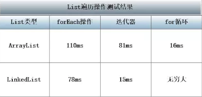
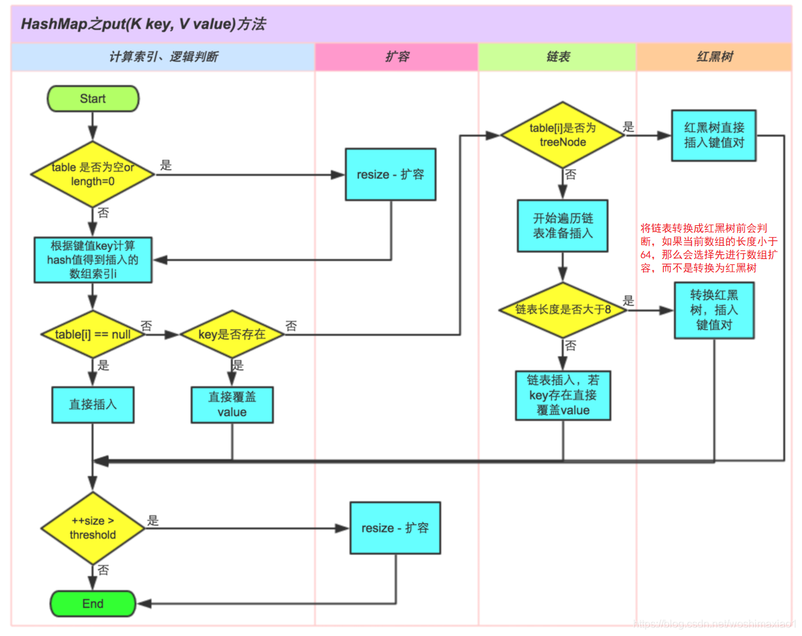

## 1.Java集合框架

### 将集合的接口与实现分离

与现代的数据结构类库的常见情况一样，Java集合类库也将接口与实现分离。

队列接口指出可以在队列的尾部添加元素，在队列的头部删除元素，并且可以查找队列中的元素个数。当需要收集对象，并按照“先进先出”的规则检索对象时就应该使用队列。

```java
// 标准库中接口的简化形式
public interface Queue<E> {
    void add(E element);
    E remove();
    int size();
}
```

队列通常有两种实现方式：一种是使用循环数组；另一种是使用链表。


每一个实现都可以通过一个实现了Queue接口的类表示。

如果需要一个循环队列，就可以使用ArrayDeque类。如果需要一个链表队列，就直接使用LinkedList类，这个类实现了Queue接口。

当在程序中使用队列时，一旦构建了集合就不需要知道究竟使用了哪种实现。因此，只有在构建集合对象时，使用具体的类才有意义。可以使用接口类型存放集合的引用。

```java
Queue<Customer> expressLane = new CircularArrayQueue<>(100);
expressLane.add(new Customer("Harry"));
```

利用这种方式，一旦改变了想法，可以轻松地使用另外一种不同的实现。只需要对程序的一个地方作出修改，即调用构造器的地方。如果觉得LinkedListQueue是更好的选择，就将代码修改为：

```java
Queue<Customer> expressLane = new LinkedListQueue<>();
expressLane.add(new Customer("Harry"));
```

接口本身并不能说明哪种实现的效率究竟如何。循环数组要比链表更高效，然而通常这样做也需要付出一定的代价。循环数组是一个有界集合，即容量有限。如果程序中要收集的对象数量没有上限，就最好使用链表来实现。

API文档中，会有一组以Abstract开头的类，这些类是为类库实现者而设计的。如果想要实现自己的队列类，会发现扩展AbstractQueue类要比实现Queue接口中的所有方法轻松得多。

### Collection接口

集合类的基本接口是Collection接口，这个接口有两个基本方法：

```java
public interface Collection<E> {
    boolean add(E element);
    Iterator<E> iterator();
}
```

除了这两个方法外，还有几个方法。

add方法用于向集合中添加元素。如果集合确实改变了就返回true。如果集合没有发生变化就返回false。

iterator方法用于返回一个实现了Iterator接口的对象。可以使用这个迭代器对象依次访 问集合中的元素。

### 迭代器

```java
public interface Iterator<E> {
    boolean hasNext();
    E next();
    void remove();
    void forEachRemaining(Consumer<? super E> action);
}
```

通过反复调用next方法，可以逐个访问集合中的每个元素。但是如果到达了集合的末尾，next方法将抛出一个NoSuchElementException。因此，需要在调用next之前调用hasNext方法。如果迭代器还有多个供访问的元素，就返回true。

```java
Collection<String> c = ...;
Iterator<String> iter = c.iterator();
while(iter.hasNext()){
    String element = iter.next();
}
```

用for each循环可以更加简练地表示同样的循环操作，编译器简单地将for each循环翻译为带有迭代器的循环。for each循环可以与任何实现了Iterable接口的对象一起工作，这个接口只包含一个抽象方法：

```java
public interface Iterable<E> {
    Iterator<T> iterator();
    ...
}
```

Collection接口扩展了Iterable接口。因此标准库中的任何集合都可以使用for each循环。

在Java SE 8中，可以调用forEachRemaining方法并提供lambda表达式。将对迭代器的每一个元素调用这个lambda表达式，直到没有元素为止。

```java
iterator.forEachRemaining(element -> ...);
```

元素访问的顺序取决于集合类型。ArrayList从索引0开始每迭代一次，索引值加0。HashSet会按照某种元素的次序出现。

Java迭代器位于两个元素之间。当调用next时，迭代器就越过下一个元素，并返回刚刚越过的那个元素的引用。


Iterator接口的remove方法将会删除上次调用next方法时返回的元素。如果要删除指定位置的元素，仍然需要越过这个元素。

next方法和remove方法调用具有相互依赖性。如果调用remove之前没有调用next将是不合法的。如果这样做将抛出一个IllegalStateException。

### 泛型实用方法

由于Collection与Iterator都是泛型接口，可以编写操作任何集合类型的实用方法。

例如检测任意集合是否包含指定元素的泛型方法：

```java
public static <E> boolean contains() {
    for (E element : c) {
        if (element.equals(obj)) {
            return true;
        }
    }
    return false;
}
```

如果实现Collection接口的每个类都要提供如此多的例行方法。为了能够让实现者更容易实现接口，Java类库提供一个类AbstractCollection，它将基础方法size和iterator抽象化，但是在此提供了例行方法。

```java
public abstract class AbstractCollection<E> implements Collection<E> {
    public abstract Iterator<E> iterator();

    public boolean contains(Object o) {
        Iterator<E> it = iterator();
        if (o==null) {
            while (it.hasNext())
                if (it.next()==null)
                    return true;
        } else {
            while (it.hasNext())
                if (o.equals(it.next()))
                    return true;
        }
        return false;
    }
}
```

具体的集合类可以扩展AbstractCollection类。由具体的集合类提供iterator方法，而contains方法已有AbstractCollection超类提供了。子类也可以自己提供contains方法。

Java SE 8中，Collection添加了许多与流相关的默认方法：

default boolean removeIf(Predicate&lt; ? super E&gt; filter)

### 集合框架柱的接口


集合有两个基本接口：Collection和Map。List是一个有序集合（ordered collection）。元素会增加到容器中的特定位置。两种方式访问元素：使用迭代器访问或者使用一个整数索引来访问。后一种方法称为随机访问（random access），因为可以按任意顺序访问元素：

void add(int index, E element)

void remove(int index)

E get(int index)

E set(int index, E element)

ListIterator接口是Iterator的一个子接口。它定义了一个方法用于在迭代器位置前面增加一个元素：

void add(E element)

由数组支持的有序集合可以快速地随机访问，因此适合使用List方法并提供一个整数索引来访问。链表尽管也是有序的，但是随机访问很慢，所以最好使用迭代器来遍历。

Set接口等同于Collection接口，不过其方法的行为有更严谨的定义。集（set）的add方法不允许增加重复元素。要适当地定义集的equals方法：只要两个集包含同样的元素就认为是相等的，而不要求这些元素有同样的顺序。hashCode方法的定义要包含相同元素的两个集会得到相同的散列码。

## 2.集合

| 集合类型        | 描述                                                 |
| --------------- | ---------------------------------------------------- |
| ArrayList       | 一种可以动态增长和缩减的索引序列                     |
| LinkedList      | 一种可以在任意位置进行高效地插入和删除操作的有序序列 |
| ArrayDeque      | 一种用循环数组实现的双端队列                         |
| HashSet         | 一种没有重复元素的无序集合                           |
| TreeSet         | 一种有序集                                           |
| EnumSet         | 一种包含枚举类型值的集                               |
| LinkedHashSet   | 一种可以记住元素插入次序的集                         |
| PriorityQueue   | 一种允许高效删除最小元素的集合                       |
| HashMap         | 一种存储键/值关联的数据结构                          |
| TreeMap         | 一种键值有序排列的映射表                             |
| EnumMap         | 一种键值属于枚举类型的映射表                         |
| LinkedHashMap   | 一种可以记住键/值项添加次序的映射表                  |
| WeakHashMap     | 一种其值无用武之地后可以被垃圾回收器回收的映射表     |
| IdentityHashMap | 一种用==而不是用equals比较键值的映射表               |


### 链表 LinkedList

数组和数组列表都有一个重大缺陷。``从数组的中间位置插入或删除一个元素要付出很大的代价，原因是数组中处于被删除元素之后的所有元素都要向数组的前端移动``。

数组在连续的存储位置上存放对象引用。而链表（linked list）将每个对象存放在独立的结点中。每个结点还存放着序列中下一个结点的引用。在Java中，所有链表实际上都是双向链接的（doubly linked），即每个结点还存放着指向前驱结点的引用。


从链表中删除元素，只需要更新被删除元素附近的链接。

```java
List<String> staff = new LinkedList<>();
staff.add("Amy");
staff.add("Bob");
staff.add("Carl");
Iterator<String> iter = staff.iterator();
String first = iter.next();
String second = iter.next();
iter.remove();
```

LinkedList.add方法将对象添加到链表的尾部。但是常常需要将元素添加到链表中间，由于迭代器是描述集合中位置的，所以这种依赖于位置的add方法将由迭代器负责。只有对自然有序的集合使用迭代器添加元素才有实际意义。集（set）的元素完全无序。因此在Iterator接口中没有add方法。相反地，集合类库提供了子接口ListIterator，其中包含add方法：

```java
interface ListIterator<E> extends Iterator<E> {
    void add(E element);
    ...
}
```

与Collection.add不同，这个方法不返回boolean类型的值，它假定添加操作总会改变链表。

ListIterator接口，可以反向遍历链表：

E previous()

boolean hasPrevious()

```java
List<String> staff = new LinkedList<>();
staff.add("Amy");
staff.add("Bob");
staff.add("Carl");
ListIterator<String> iter = staff.listIterator();
iter.next();
iter.add("Juliet");
staff.forEach(System.out::println);
```

如果多次调用add方法，将按照提供的次序把元素添加到链表中，它们被依次添加到迭代器当前位置之前。当用一个刚刚返回的Iterator，并且指向链表表头的迭代器调用add时，新添加的元素将变成列表的新表头。

如果链表有n个元素，有n+1个位置可以添加元素。

set方法用一个新元素取代调用next或previous方法返回的上一个元素。

如果在某个迭代器修改集合时，另一个迭代器对它进行遍历，会出现混乱的情况，会抛出一个ConcurrentModificationException。

Collection接口中声明了很多用于对链表操作的有用方法。其中大部分都是LinkedList类的超类AbstractCollection实现（toString,contains）。

``链表不支持快速地随机访问。鉴于这个原因，在程序需要采用整数索引访问元素时，通常不选用链表。``尽管LinkedList还是提供一个get方法访问某个特定元素，但这个方法并不是太效率。

绝不要使用下面这种让人费解的方式来遍历链表，效率极低，每次查找一个元素都要从列表头部开始搜索，LinkedList对象根本不作任何缓存位置信息的操作。

```java
for (int i = 0; i < list.size(); i++) {
    list.get(i);  // LinkedList
}
```

get方法做了微小的优化，如果索引值大于size()/2就从列表尾端开始搜索元素。

列表迭代器接口可以告之当前索引。因为Java迭代器是在两个元素之间，所以可以产生两个索引值：nextIndex方法返回下一次调用next方法时返回元素的整数索引；previousIndex返回下一次调用previous方法时返回元素的整数索引。两个索引差值为1。这两个方法的效率非常高，因为迭代器保持着当前位置的计数器。

如果有一个整数索引n，list.listIterator(n)将返回一个迭代器，这个迭代器指向索引为n的元素前面的位置。调用next与调用list.get(n)会产生同一个元素，只是获得这个迭代器的效率比较低。

``使用链表的唯一理由是尽可能地减少在列表中间插入或删除元素所付出的代价。``如果列表只有少数几个元素，完全可以使用ArrayList。避免使用整数索引表示链表中位置的所有方法。``如果需要对集合进行随机访问，就使用数组或ArrayList，而不要使用链表。``

```java
public class LinkedListTest {
    public static void main(String[] args) {
        List<String> a = new LinkedList<>();
        a.add("Amy");
        a.add("Carl");
        a.add("Erica");

        List<String> b = new LinkedList<>();
        b.add("Bob");
        b.add("Doug");
        b.add("Frances");
        b.add("Gloria");

        ListIterator<String> aIter = a.listIterator();
        Iterator<String> bIter = b.iterator();

        while (bIter.hasNext()) {
            if(aIter.hasNext()) {
                aIter.next();
            }
            aIter.add(bIter.next());
        }

        System.out.println(a);

        bIter = b.iterator();
        while (bIter.hasNext()) {
            bIter.next();
            if(bIter.hasNext()) {
                bIter.next();
                bIter.remove();
            }
        }

        System.out.println(b);

        a.removeAll(b);

        System.out.println(a);
    }
}
```

### 数组列表 ArrayList

List接口用于描述一个有序集合，并且集合中每个元素的位置十分重要。有两种访问元素的协议：一种是用迭代器，另一种是用get和set方法随机地访问每个元素。后者不适合链表，但对数组却很有用。集合类库提供了一种大家熟悉的ArrayList类，这个类也实现了List接口。``ArrayList封装了一个动态再分配的对象数组(Array)``。

> - Array 可以包含基本数据类型和引用类型，ArrayList只能包含引用类型。
> - ArrayList是基于数组实现的，Array大小不可以调整大小，但ArrayList可以通过内部方法自动调整容量。
> - ArrayList是List接口的实现类，相比Array支持更多的方法和特性。

在需要动态数组时，会用ArrayList取代Vector：

Vector类的所有方法都是同步的，可以由两个线程安全地访问一个Vector对象。但是由一个线程访问Vector，代码在同步操作上耗费大量的时间。而ArrayList方法不是同步的。``因此，建议在不需要同步时使用ArrayList，而不要使用Vector。``

#### 与 LinkedList 比较

**扩容机制**

在ArrayList中增加元素到队列尾端的代码如下：

```java
public boolean add(E e) {
    ensureCapacityInternal(size + 1);  // 确保内部数组有足够的空间
    elementData[size++] = e;	// 将元素加到数组的尾部
    return true;
}
```

ensureCapacityInternal源码如下：

```java
private void ensureCapacityInternal(int minCapacity) {
    if (elementData == DEFAULTCAPACITY_EMPTY_ELEMENTDATA) {
        minCapacity = Math.max(DEFAULT_CAPACITY, minCapacity); // 初始值为DEFAULT_CAPACITY=10
    }
    ensureExplicitCapacity(minCapacity);
}
private void ensureExplicitCapacity(int minCapacity) {
    modCount++;
    // overflow-conscious code
    if (minCapacity - elementData.length > 0)
        grow(minCapacity);
}
private void grow(int minCapacity) {
    // overflow-conscious code
    int oldCapacity = elementData.length;
    int newCapacity = oldCapacity + (oldCapacity >> 1);	// 扩容到原始容量的1.5倍
    if (newCapacity - minCapacity < 0)	// 如果新容量小于最小需要的容量，则使用最小
        newCapacity = minCapacity;	// 需要的容量大小
    if (newCapacity - MAX_ARRAY_SIZE > 0)
        newCapacity = hugeCapacity(minCapacity);
    // 进行扩容的数组复制
    elementData = Arrays.copyOf(elementData, newCapacity);
}
```

可以看到，只要ArrayList的当前容量足够大，add()操作的效率非常高的。只有当ArrayList对容量的需求超出当前数组大小时，才需要进行扩容。``扩容的过程中，会进行大量的数组复制操作。``而数组复制时，最终将调用``System.arraycopy()``方法，因此add()操作的效率还是相当高的。

LinkeList 由于使用了链表的结构，因此不需要维护容量的大小。从这点上说，它比ArrayList有一定的性能优势，然而，每次的元素增加都需要新建一个Entry对象，并进行更多的赋值操作。在频繁的系统调用中，对性能会产生一定的影响。

**增加或删除元素到任意位置**

由于实现的不同，ArrayList和LinkedList在增加或删除元素到任意位置上存在一定的性能差异，由于ArrayList是基于数组实现的，而数组是一块连续的内存空间，如果在数组的任意位置插入元素，必然导致在该位置后的所有元素需要重新排列，因此，其效率相对会比较低。

```java
public void add(int index, E element) {
    rangeCheckForAdd(index);
    ensureCapacityInternal(size + 1);
    System.arraycopy(elementData, index, elementData, index + 1,
                     size - index);
    elementData[index] = element;
    size++;
}
public E remove(int index) {
    rangeCheck(index);
    modCount++;
    E oldValue = elementData(index);
    int numMoved = size - index - 1;
    if (numMoved > 0)
        System.arraycopy(elementData, index+1, elementData, index,
                         numMoved);
    elementData[--size] = null; // clear to let GC do its work
    return oldValue;
}
```

可以看到``每次插入或删除操作，都会进行一次数组复制。``而插入操作在增加元素到List尾端的时候是不存在的，大量的数组重组操作会导致系统性能低下。``并且插入或删除元素在List中的位置越是靠前，数组重组的开销也越大。``

对LinkedList来说，在List的尾端插入或删除数据与在任意位置插入数据是一样的，不会因为位置靠前而导致插入的方法性能降低。

**遍历列表**



最简便的ForEach循环并没有很好的性能表现，综合性能不如普通的迭代器，而是用for循环通过随机访问遍历列表时，ArrayList表项很好，但是LinkedList的表现却无法让人接受，甚至没有办法等待程序的结束。这是``因为对LinkedList进行随机访问时，总会进行一次列表的遍历操作。性能非常差，应避免使用。``

### 散列集

如果不在意元素的顺序，可以有几种能够快速查找元素的数据结构。其缺点是无法控制元素出现的次序，它们将按照有利于其操作目的的原则组织数据。

散列表（hash table）为每个对象计算一个整数，成为散列码（hash code）。散列码是由对象的实例域产生的一个整数。更准确地说，具有不同数据域的对象将产生不同的散列码。

自定义类需要实现hashCode方法，自己实现的hashCode应与equals方法兼容，即如果a.equals(b)为true，a与b必须具有相同的散列码。

Java中，散列表用链表数组实现。每个列表被称为桶（bucket）。


散列码与桶的总数取余，所得到的结果就是保存这个元素的桶的索引。如果在桶中没有其他元素，此时将元素直接插入桶中即可。有时桶可能被占满，这种现象被称为散列冲突（hash collision）。此时需要新对象与桶中所有对象进行比较，查看这个对象是否已经存在。

如果散列码是合理且随机分布的，桶的数目也足够大，需要比较的次数就会很少。在Java SE 8中，桶满时会从链表变为平衡二叉树。如果选择的散列函数不当，会产生很多冲突。

想要更多地控制散列表的运行性能，就要指定一个初始的桶数。桶数是指用于收集具有相同散列值的桶的数目。如果要插入散列表中的元素太多，就会增加冲突的可能性，降低运行性能。

如果知道大致会有多少个元素就可以设置桶数，一般桶数为预计元素个数的75%~150%。尽管没有确凿的证据，但最好将桶数设置为一个素数，以防键的集聚。标准类库使用的桶数是2的幂，默认为16（为表大小提供的任何值都将被自动地转换为2的下一个幂）。

如果散列表太满，就需要再散列（rehashed）。创建一个桶数更多的表，并将所有元素插入到新表中，然后丢弃原来的表。

装填因子（load factor）决定何时对散列表进行再散列，对于大多数程序来说，0.75（默认值）是比较合理的，即表中超过75%的位置已经填入，这个表就会用双倍的桶数自动的进行再散列。

``散列表最简单的数据结构是set类型。set是没有重复元素的集合，set的add方法首先在集中查找要添加的对象，如果不存在，将这个元素加进去。``

#### HashSet

``Java集合类库提供了HashSet类，它实现了基于HashMap的集。``封装了一个 HashMap 对象来存储所有的集合元素，所有放入 HashSet 中的集合元素实际上由 HashMap 的 key 来保存，而 HashMap 的 value 则存储了一个 PRESENT，它是一个静态的 Object 对象。

add方法添加元素，contains方法被重新定义，用来快速地查看是否某个元素已经出现在集中。它只在某个桶中查找元素，而不必查看集中的所有元素。

```java
private static final Object PRESENT = new Object();
public HashSet() {
    map = new HashMap<>();
}
public boolean add(E e) {
    return map.put(e, PRESENT)==null;
}
```

散列集迭代器依次访问所有的桶，由于散列将元素分散在表的各个位置，所以顺序几乎是随机的。只有不关心集合顺序时才应该使用HashSet。

在更改集中的元素时要格外小心，如果元素的散列码发生了改变，元素在数据结构的位置也会发生变化。

```java
public class SetTest {
    public static void main(String[] args) {
        Set<String> words = new HashSet<>();
        long totalTime = 0;
        try (Scanner in = new Scanner(new File("alice30.txt"))) {
            while (in.hasNext()) {
                String word = in.next();
                long callTime = System.currentTimeMillis();
                words.add(word);
                callTime = System.currentTimeMillis() - callTime;
                totalTime += callTime;
            }
        } catch (FileNotFoundException e) {
            e.printStackTrace();
        }

        Iterator<String> iter = words.iterator();
        for (int i = 0; i < 20 && iter.hasNext(); i++) {
            System.out.println(iter.next());
        }
        System.out.println("...");
        System.out.println(words.size() + "个不同的词，" + totalTime + "毫秒。");
    }
}
```

### 树集 TreeSet

TreeSet类与散列集十分类似，它比散列集有所改进。树集是一个有序集合，可以以任意顺序将元素插入到集合中。在对集合进行遍历时，每个值将自动地按照排序后的顺序呈现：

```java
SortedSet<String> sorter = new TreeSet<>();
sorter.add("Bob");
sorter.add("Amy");
sorter.add("Carl");
for (String s : sorter) {
    System.out.println(s);
}
// Amy
// Bob
// Carl
```

&nbsp;

排序是用树结构完成的（红黑树（red-black tree））。每次将一个元素添加到树中时，都被放置在正确的排序位置上。因此，迭代器总是以排好序的顺序访问每个元素。

将一个元素添加到树中要比添加到散列表中慢，但是与检查数组或链表中的重复元素相比还是快很多。如果树中包括n个元素，查找新元素的正确位置平均需要log₂n次比较（log₂1000 = 10）。


要使用树集必须能够比较元素。这些元素必须实现Comparable接口，或者构造集时必须提供一个Comparator。

那为什么不用树集取代散列集，因为添加一个元素所花费的时间看上去并不是很长，而且元素是自动排序？

怎么取舍取决于所要收集的数据。如果不需要对数据进行排序，就没有必要付出排序的开销。对于某些数据对其排序要比散列函数更加困难。

树的排序必须是全序，也就是说任意两个元素必须是可比的（TreeSet需要提供Comparator），有些计算很牵强且繁琐。相反地，很多类已经定义了散列函数，它直接进行散列。

Java SE 6起，TreeSet类实现了NavigableSet接口，这个接口增加了几个便于定位元素以及反向遍历的方法。

```java
public class TreeSetTest {
    public static void main(String[] args) {
        SortedSet<Item> parts = new TreeSet<>();
        parts.add(new Item("Toaster", 1234));
        parts.add(new Item("Widget", 4562));
        parts.add(new Item("Modem", 9912));

        NavigableSet<Item> sortByDescription = new TreeSet<>(Comparator.comparing(Item::getDescription));
        sortByDescription.addAll(parts);
        System.out.println(sortByDescription);
    }
}

public class Item implements Comparable<Item> {
    private String description;
    private int partNumber;

    public Item(String description, int partNumber) {
        this.description = description;
        this.partNumber = partNumber;
    }

    public String getDescription() {
        return description;
    }

    @Override
    public String toString() {
        return "description='" + description + ", partNumber=" + partNumber;
    }

    @Override
    public boolean equals(Object otherObject) {
        if (this == otherObject) {
            return true;
        }
        if (otherObject == null) {
            return false;
        }
        if (getClass() != otherObject.getClass()) {
            return false;
        }
        Item other = (Item) otherObject;
        return Objects.equals(description, other.description) && partNumber == other.partNumber;
    }

    @Override
    public int hashCode() {
        return Objects.hash(description, partNumber);
    }

    @Override
    public int compareTo(Item o) {
        int diff = Integer.compare(partNumber, o.partNumber);
        return diff != 0 ? diff : description.compareTo(o.description);
    }
}
```

### 队列与双端队列

有两个端口的队列，即双端队列，可以在头部和尾部同时添加或删除元素（队列，头部删除，尾部添加）。不支持在队列中间添加元素。

在Java SE 6引入了Deque接口，并由ArrayDeque和LinkedList类实现，这两个类都提供了双端队列，而且在必要时可以增加队列长度。

&nbsp;

### 优先级队列

优先级队列（priority queue）中的元素可以按照任意的顺序插入，却总是按照排序的顺序进行检索。无论如何调用remove方法，总会获得当前优先级队列中最小的元素。

优先级队列并没有对元素进行排序，优先级队列使用了一种优雅且高效的数据结构，成为堆（heap）。堆是一个可以自我调整的二叉树，对树执行添加和删除操作，可以让最小的元素移动到根，而不必花费时间对元素进行排序。与TreeSet一样，优先级队列既可以保存实现了Comparable接口的类对象，也可以保存在构造器中提供的Comparator对象。

优先级队列的典型事例是任务调度。每个任务有一个优先级，任务以随机顺序添加进队列，每当启动一个新任务，都将优先级最高的任务从队列中删除（习惯上1为最高优先级，即最小）。

与TreeSet的迭代不同，优先级队列的迭代并不是按照元素的排列顺序访问的，而删除却总是删除剩余元素中优先级数最小的那个元素。

```java
public class PriorityQueueTest {
    public static void main(String[] args) {
        PriorityQueue<LocalDate> pq = new Priorit
        pq.add(LocalDate.of(2019, 03, 13));
        pq.add(LocalDate.of(2019, 02, 17));
        pq.add(LocalDate.of(2019, 06, 24));
        pq.add(LocalDate.of(2019, 04, 30));
        for (LocalDate date: pq) {
            System.out.println(date);
        }
        System.out.println("...");
        while (!pq.isEmpty()) {
            System.out.println(pq.remove());
        }
        // 2019-02-17
        // 2019-03-13
        // 2019-06-24
        // 2019-04-30
        // ...
        // 2019-02-17
        // 2019-03-13
        // 2019-04-30
        // 2019-06-24
    }
}
```

## 3.映射 Map

映射（map）数据结构，用来存放键/值对。如果提供了键，就能查找到值。

### HashMap和TreeMap

Java类库为映射提供了两个实现：HashMap和TreeMap。这两个类都实现了Map接口，``都是线程不安全的``。

HashMap 对键进行散列，分布是散列的、均匀的，不支持排序；数据结构主要是桶(数组)，链表或红黑树。适用于在Map中插入、删除和定位元素。

TreeMap 的键要求实现`java.lang.Comparable`，所以迭代的时候TreeMap默认是按照Key值升序排序的；TreeMap的实现是基于红黑树结构。适用于按自然顺序或自定义顺序遍历键（key）。散列或比较函数只能作用于键。与键关联的值不能进行散列或比较。

> TreeMap中默认是按照升序进行排序的，通过自定义的比较器来实现降序。

如果需要得到一个有序的结果时就应该使用TreeMap（因为HashMap中元素的排列顺序是不固定的）。除此之外，由于HashMap和集一样有更好的性能，所以大多不需要排序的时候我们会使用HashMap。

如果映射中没有与给定键对应的信息，get将返回null。有时可以有一个好的默认值，用作映射不存在的键，然后使用getOrDefault方法：

```java
Map<String, Integer> scores = new HashMap<>();
System.out.println(scores.get("a"));
System.out.println(scores.getOrDefault("a", 0));
// null
// 0
```

键必须是唯一的。不能一个键存放两个值。如果对同一个键两次调用put方法，第二个值会取代第一个值。实际上，put将返回用这个键参数存储的上一个值。

```java
Map<String, Integer> scores = new HashMap<>();
System.out.println(scores.put("a", 0));
System.out.println(scores.put("a", 1));
// null
// 0
```

remove方法用于从映射中删除给定键对应的元素。

size方法用于返回映射中的元素数。

forEach迭代，提供一个接收键和值的lambda表达式：

```java
scores.forEach((k, v) -> System.out.println("key=" + k + ", value=" + v));
```

```java
public class MapTest {
    public static void main(String[] args) {
        Map<String, Employee> staff = new HashMap<>();
        staff.put("144-25-5464", new Employee("Amy Lee"));
        staff. put("567-24-2546", new Employee("Harry Hacker"));
        staff. put("157-62-7935", new Employee("Cary Cooper"));
        staff.put("456-62-5527", new Employee("Francesca Cruz"));

        System.out.println(staff);

        staff.remove("567-24-2546");

        staff.put("456-62-5527", new Employee("Francesca Miller"));

        System.out.println(staff.get("157-62-7935"));

        staff.forEach((k, v) -> System.out.println("key=" + k + ", value=" + v));
    }
}
```

#### HashMap 线程不安全

##### JDK1.7中的HashMap

**扩容造成死循环分析过程**

```java
void transfer(Entry[] newTable, boolean rehash) {
        int newCapacity = newTable.length;
        for (Entry<K,V> e : table) {
            while(null != e) {
                Entry<K,V> next = e.next;
                if (rehash) {
                    e.hash = null == e.key ? 0 : hash(e.key);
                }
                int i = indexFor(e.hash, newCapacity);
                e.next = newTable[i];
                newTable[i] = e;  //线程挂起处
                e = next;
            }
        }
}
```

在对table进行扩容到newTable后，需要将原来数据转移到newTable中，注意10-12行代码，这里可以看出在转移元素的过程中，使用的是头插法，也就是链表的顺序会翻转，这里也是形成死循环的关键点。

**扩容造成数据丢失分析过程**

##### JDK1.8中的HashMap

在jdk1.8中对HashMap进行了优化，在发生hash碰撞，不再采用头插法方式，而是直接插入链表尾部，因此不会出现环形链表的情况，但是在多线程的情况下仍然不安全，这里我们看jdk1.8中HashMap的put操作源码：

```java
final V putVal(int hash, K key, V value, boolean onlyIfAbsent,
               boolean evict) {
    Node<K,V>[] tab; Node<K,V> p; int n, i;
    if ((tab = table) == null || (n = tab.length) == 0)
        n = (tab = resize()).length;
    if ((p = tab[i = (n - 1) & hash]) == null)	// 如果没有hash碰撞则直接插入元素
        tab[i] = newNode(hash, key, value, null);
    else {
        Node<K,V> e; K k;
        if (p.hash == hash &&
            ((k = p.key) == key || (key != null && key.equals(k))))
            e = p;
        else if (p instanceof TreeNode)
            e = ((TreeNode<K,V>)p).putTreeVal(this, tab, hash, key, value);
        else {
            for (int binCount = 0; ; ++binCount) {
                if ((e = p.next) == null) {
                    p.next = newNode(hash, key, value, null);
                    if (binCount >= TREEIFY_THRESHOLD - 1) // -1 for 1st
                        treeifyBin(tab, hash);
                    break;
                }
                if (e.hash == hash &&
                    ((k = e.key) == key || (key != null && key.equals(k))))
                    break;
                p = e;
            }
        }
        if (e != null) { // existing mapping for key
            V oldValue = e.value;
            if (!onlyIfAbsent || oldValue == null)
                e.value = value;
            afterNodeAccess(e);
            return oldValue;
        }
    }
    ++modCount;
    if (++size > threshold)
        resize();
    afterNodeInsertion(evict);
    return null;
}
```

**数据覆盖**

注意第6行代码，如果没有hash碰撞则会直接插入元素。如果线程A和线程B同时进行put操作，刚好这两条不同的数据hash值一样，并且该位置数据为null，所以这线程A、B都会进入第6行代码中。

假设一种情况，线程A进入后还未进行数据插入时挂起，而线程B正常执行，从而正常插入数据，然后线程A获取CPU时间片，此时线程A不用再进行hash判断了，问题出现：线程A会把线程B插入的数据给覆盖，发生线程不安全。

#### HashMap 的Hash函数

利用Key的HashCode值来做位运算。``Hash(Key) = HashCode（Key） & （Length - 1）``

```java
public class Test {
    public static void main(String[] args) throws Exception {
        System.out.println("apple".hashCode() & (16-1));
        System.out.println("banana".hashCode() & (16-1));
        System.out.println("book".hashCode() & (16-1));
    }
}
```

输出结果为：10 5 9  

1. 计算book的hashcode，结果为十进制的3029737，二进制的101110001110101110 1001。  

2. 假定HashMap长度是默认的16，计算Length-1的结果为十进制的15，二进制的1111。  

3. 把以上两个结果做与运算，101110001110101110 1001 &amp; 1111 = 1001，十进制是9，所以 index=9。

#### HashMap 的扩容机制

- capacity 即容量，默认16。
- loadFactor 加载因子，默认是0.75
- threshold 阈值。阈值=容量*加载因子。默认12。当元素数量超过阈值时便会触发扩容。

一般情况下，当元素数量超过阈值时便会触发扩容。``每次扩容的容量都是之前容量的2倍。``依次类推，所以HashMap的大小都是2^n。

HashMap的容量是有上限的，必须小于1<<30，即1073741824。如果容量超出了这个数，则不再增长，且阈值会被设置为Integer.MAX_VALUE（ ![[公式]](https://www.zhihu.com/equation?tex=2%5E%7B31%7D-1) ，即永远不会超出阈值了）。

> 解决Hash冲突：
>
> 判断当前确定的索引位置是否存在相同hashcode和相同key的元素，如果存在相同的hashcode和相同的key的元素，那么新值覆盖原来的旧值，并返回旧值。 
>
> 如果存在相同的hashcode，那么他们确定的索引位置就相同，这时判断他们的key是否相同，如果不相同，这时就是产生了hash冲突。 Hash冲突后，那么HashMap的单个bucket（桶）里存储的不是一个 Entry，而是一个 Entry 链。 系统只能必须按顺序遍历每个 Entry，直到找到想搜索的 Entry 为止——如果恰好要搜索的 Entry 位于该 Entry 链的最末端（该 Entry 是最早放入该 bucket 中）， 那系统必须循环到最后才能找到该元素。 

JDK1.8在JDK1.7的基础上针对增加了红黑树来进行优化。即当链表超过8时，链表就转换为红黑树，利用红黑树快速增删改查的特点提高HashMap的性能，其中会用到红黑树的插入、删除、查找等算法。



##### 为什么HashMap的长度是2的幂？

在HashMap的putVal()方法中，为了确定插入元素的下标位置，使用与&运算来计算：

```java
if ((p = tab[i = (n - 1) & hash]) == null)
```

(n - 1) & hash 这个操作如果在n为2的N次幂的情况下是等同于 hash % n 取余数的值，至于为什么要使用与（&）运算呢？``因为与运算的效率要高于hash % n取余的运算。``

同时，length为2的整数次幂的话，length-1的二进制结尾总是1111，这样便保证了散列的均匀。

### 更新映射项

处理映射时的一个难点就是更新映射项。正常情况下与一个键关联的原值，完成更新，再放回更新后的值。

例如：使用一个映射统计一个单词在文件中出现的频度，看到一个单词将计数器增1：

```java
counts.put(word, counts.get(word) + 1);
```

如果第一次看到word时，get会返回null，因此会出现一个NullPointerException。

```java
// 补救方法，1.使用getOrDefault方法
counts.put(word, counts.getOrDefault(word, 0) + 1);
// 2.调用putIfAbsent，只有当键原先不存在时才会放入一个值
counts.putIfAbsent(word, 0);
counts.put(word, counts.get(word) + 1);
// 3.merge方法，如果键原先不存在调用时，将把word与1关联，否则使用Integer::sum函数组合原值和1（也就是将原值与1求和）
counts.merge(word, 1, Integer::sum);
```

### 映射视图

集合框架不认为映射本身是一个集合。不过可以得到映射的视图（view）——实现了Collection接口或某个子接口的对象。

有三种视图：键集、值集合以及键/值对集。键和键/值对可以构成一个集，因为映射中一个键只能有一个副本。

条目集的元素是实现Map.Entry接口的类的对象。

keySet不是HashSet或TreeSet，而是实现了Set接口的另外某个类的对象。Set接口扩展了Collection接口。因此，可以像使用集合一样使用keySet。

枚举一个映射的所有键：

```java
Set<String> keys = map.keySet()
for(String key : keys) {}
```

如果想同时查看键和值，可以通过枚举条目来避免查找值：

```java
for(Map.Entry<String, Employee> entry : staff.entrySet()) {
    String k = entry.getKey();
    Employee v = entry.getValue();
}
```

原来这是访问映射条目的最高效方法。如今只需要使用forEach方法：

```java
staff.forEach((k, v) -> { });
```

如果在键集视图上调用迭代器的remove方法，实际上会从映射中删除这个键和与它相关的值。不能向键集视图增加元素。如果试图调用add方法会抛出一个UnsupportedOperationException（条目视图有同样的限制）。

&nbsp;

### 弱散列映射

专用的映射类WeakHashMap

如果有一个值，对应的键已经不再使用，由于程序中任何部分没有在出现这个键，所以这个键值对无法从映射中删除。垃圾回收器跟踪活动的对象，只要映射对象是活动的，其中的所有桶也是活动的，他们不能被回收。因此需要程序负责从长期存活的映射表中删除那些无用的值。或者使用WeakHashMap完成，当对键的唯一引用来自散列条目时，这一数据结构与垃圾回收器协同工作一起删除键值对。

WeakHashMap使用弱引用（weak references）保存键，WeakReference对象将引用保存到另外一个对象中。在这里就是散列键。对于这种类型的对象，垃圾回收器有一种特有的方式进行处理。通常如果垃圾回收器发现某个特定的对象已经没人引用了，就将其回收。然而如果某个对象只有WeakReference引用，垃圾回收器仍然回收它，但要将引用这个对象的弱引用放入队列中。WeakHashMap将周期性地检查队列，以便找到新添加的弱引用。一个弱引用进入队列意味着这个键不再被人使用，并且已经被收集起来。于是，WeakHashMap将删除对应的条目。

&nbsp;

### 链接散列集与映射

LinkedHashSet和LinkedHashMap类用来记住插入元素项的顺序。这样可以避免在散列表中的项从表面上看是随机排列的。当条目插入到表中时，就会并入到双向链表中。


```java
Map<String, Employee> staff = new LinkedHashMap<>();
staff.put("144-25-5464", new Employee("Amy Lee"));
staff. put("567-24-2546", new Employee("Harry Hacker"));
staff. put("157-62-7935", new Employee("Cary Cooper"));
staff.put("456-62-5527", new Employee("Francesca Cruz"));
staff.forEach((k, v) -> {
    System.out.println(k);
});
// 144-25-5464
// 567-24-2546
// 157-62-7935
// 456-62-5527
```

构造这样一个的散列映射表：LinkedHashMap&lt; K, V &gt;(initialCapacity, loadFactor, true)，链接散列映射将用访问顺序， 而不是插入顺序， 对映射条目进行迭代。每次调用 get或put, 受到影响的条目将从当前的位置删除， 并放到条目链表的尾部（只有条目在链表中的位置会受影响， 而散列表中的桶不会受影响。一个条目总位于与键散列码对应的桶中）。

```java
Map<String, Employee> staffs = new LinkedHashMap<>(4, 0.75f, true);
staffs.put("144-25-5464", new Employee("Amy Lee"));
staffs.put("567-24-2546", new Employee("Harry Hacker"));
staffs.put("157-62-7935", new Employee("Cary Cooper"));
staffs.put("456-62-5527", new Employee("Francesca Cruz"));
staffs.get("157-62-7935");
staffs.forEach((k, v) -> System.out.println(k));
// 144-25-5464
// 567-24-2546
// 456-62-5527
// 157-62-7935
```

 访问顺序对于实现高速缓存的“ 最近最少使用” 原则十分重要。当在表中找不到元素项且表又已经满时， 可以将迭代器加入到表中， 并将枚举的前几个元素删除掉。这些是近期最少使用的几个元素。 构造一个LinkedHashMap 的子类，然后覆盖下面这个方法： protected boolean removeEldestEntry(Map.Entry&lt; K， V &gt; eldest) 每当方法返回 true 时，就添加一个新条目，从而导致删除 eldest 条目。下面的高速缓存可以存放 100 个元素：

```java
Map<K, V> cache = new LinkedHashMapo(128, 0.75F, true){
    protected boolean removeEldestEntry(Map.Entry<K, V> eldest){
        return size() > 100;
    }
}();
```

另外，还可以对 eldest 条目进行评估，以此决定是否应该将它删除。

### 枚举集与映射

EmimSet 是一个枚举类型元素集的高效实现。 由于枚举类型只有有限个实例， 所以EnumSet 内部用位序列实现。如果对应的值在集中， 则相应的位被置为 1。 EnumSet 类没有公共的构造器。可以使用静态工厂方法构造这个集：

```java
public class EnumSetTest {
    public static void main(String[] args) {
        EnumSet<Weekday> always = EnumSet.allOf(Weekday.class);
        EnumSet<Weekday> never = EnumSet.noneOf(Weekday.class);
        EnumSet<Weekday> workday = EnumSet.range(Weekday.MONDAY, Weekday.FRIDAY);
        EnumSet<Weekday> mwf = EnumSet.of(Weekday.MONDAY, Weekday.WEDNESDAY, Weekday.FRIDAY);
        EnumMap<Weekday, Employee> personInCharge = new EnumMap<>(Weekday.class);
    }
}
enum Weekday {
    MONDAY,TUESDAY,WEDNESDAY,THURSDAY,FRIDAY,SATURDAY,SUNDAY
}
```

EnumMap 是一个键类型为枚举类型的映射。它可以直接且高效地用一个值数组实现。在使用时， 需要在构造器中指定键类型： EnumMap&lt; Weekday, Employee &gt; personlnCharge = new EnumMapo(Weekday.class);

&nbsp;

### 标识散列映射

 类IdentityHashMap有特殊的作用。在这个类中， 键的散列值不是用hashCode函数计算的， 而是用 System.identityHashCode 方法计算的。 这是 Object.hashCode 方法根据对象的内存地址来计算散列码时所使用的方式。而且， 在对两个对象进行比较时， IdentityHashMap 类使用 ==, 而不使用 equals。 也就是说， 不同的键对象， 即使内容相同， 也被视为是不同的对象。 在实现对象遍历算法（如对象串行化）时， 这个类非常有用， 可以用来跟踪每个对象的遍历状况。

## 4.视图与包装器

使用_视图（views）_可以获得其他的实现了Collection接口和Map接口的对象。 映射类的keySet方法就是一个这样的示例。keySet方法返回一个实现Set接口的类对象，这个类的方法对原映射进行操作。这种集合称为视图。

### 轻量级集合包装器

Arrays类的静态方法asList将返回一个包装了普通Java数组的List包装器。这个方法可以将数组传递给一个期望得到列表或集合参数的方法：

```java
Card[] cards = new Card[52];
List<Card> cardList = Arrays.asList(cards);
```

返回的对象不是ArrayList,是一个视图对象，带有访问底层数组的get和set方法。改变数组大小的所有方法都会抛出一个UnsupportedOperationException异常。 asList方法可以接收可变数目的参数：

```java
List<String> names = Arrays.asList("Amy", "Bob", "Carl");
List<String> nameList = Collections.nCopies(10, "Mack");
System.out.println(names);
System.out.println(nameList);
// [Amy, Bob, Carl]
// [Mack, Mack, Mack, Mack, Mack, Mack, Mack, Mack, Mack, Mack]
```

Collections.nCopies(n, anObject)返回一个实现了List接口的不可修改的对象，并给人一种包含n个元素，每个元素都像是anObject的错觉。且存储代价很小，这是视图技术的一种巧妙应用。

Collections.singleton(anObject)返回一个实现了Set接口的视图对象，是一个不可修改的单元素集，不需要付出建立数据结构的开销。singletonList与singletonMap方法类似。 集合框架的每一个接口，还有一些方法可以生成空集、列表、映射等。特别是集的类型可以推导得出：

```java
Set<String> deepThoughts = Collections.emptySet();
```

### 子范围

可以为很多集合建立子范围（subrance）视图。

```java
List group2 = staff.subList(10, 20); //取出第10~19个元素获得一个列表的子范围视图
```

第一个索引包含在内，第二个则不包含。可以将任何操作应用于子范围，并且能够自动地反应整个列表的情况。

```java
List<String> names = new ArrayList<>();
names.add("Amy");
names.add("Bob");
names.add("Yoyo");
names.add("Claire");
names.add("Carl");
List group = names.subList(2, 4);
group.add("Haha");
System.out.println(names);
System.out.println(group);
group.clear();
System.out.println(names);
System.out.println(group);
// [Amy, Bob, Yoyo, Claire, Haha, Carl]
// [Yoyo, Claire, Haha]
// [Amy, Bob, Carl]
// []
```

group.clear()元素自动从列表中清楚，并且group为空。 对于有序集合映射，可以使用排序顺序而不是元素位置建立子范围，SortedSet接口声明了3个方法： SortedSet&lt; E &gt; subSet(E from, E to) SortedSet&lt; E &gt; headSet(E to) SortedSet&lt; E &gt; tailSet(E from) 这些方法将返回大于等于from且小于to的所有元素子集。 有序映射也有类似的方法： SortedMap&lt; K, V &gt; subMap(K from, K to) SortedMap&lt; K, V &gt; headMap(K to) SortedMap&lt; K , V &gt; tailMap(K from) 返回映射视图， 该映射包含键落在指定范围内的所有元素。 Java SE 6 引人的 NavigableSet 接口赋予子范围操作更多的控制能力。可以指定是否包括边界： NavigableSet&lt; E &gt; subSet(E from, boolean fromlnclusive, E to, boolean tolnclusive) NavigableSet&lt; E &gt; headSet(E to, boolean tolnclusive) NavigableSet&lt; E &gt; tailSet(E from, boolean fromlnclusive)

### 不可修改的视图

不可修改视图（unmodifiable views），这些视图对现有集合增加了一个运行时检查，如果发现视图对集合进行修改，就抛出异常，同时这个集合将保持未修改的状态。 Collections. unmodifiableCollection Collections.unmodifiableList Collections.unmodifiableSet Collections.unmodifiableSortedSet Collections.unmodifiableNavigableSet Collections.unmodifiableMap Collections.unmodifiableSortedMap Collections.unmodifiableNavigableMap 每个方法都定义于一个接口。Collections. unmodifiableCollection与ArrayList、LinkedList或者任何实现了List接口的其他类一起协同工作。

```java
List<String> staff = new LinkedList();
1ookAt(Collections.unmodifiableList(staff));
```

Collections.unmodifiableList方法将返回一个实现 List 接口的类对象。其访问器方法将从staff 集合中获取值。当然，lookAt 方法可以调用 List 接口中的所有方法，而不只是访问器。但是所有的更改器方法（例如， add) 已经被重新定义为抛出一个UnsupportedOperationException异常，而不是将调用传递给底层集合。 不可修改视图并不是集合本身不可修改。仍然可以通过集合的原始引用在这里是 staff)对集合进行修改。并且仍然可以让集合的元素调用更改器方法。 由于视图只是包装了接口而不是实际的集合对象， 所以只能访问接口中定义的方法。例如， LinkedList 类有一些非常方便的方法，addFirst 和 addLast，它们都不是 List 接口的方法，不能通过不可修改视图进行访问。

unmodifiableCollection 方法（与本节稍后讨论的 synchronizedCollection 和 checkedCollection 方法一样）将返回一个集合， 它的 equals 方法不调用底层集合的 equals 方法。相反， 它继承了 Object 类的 equals 方法， 这个方法只是检测两个对象是否是同一个对象。

### 同步视图

Java使用视图机制来确保常规集合的线程安全，而不是实现线程安全的集合类。 例如Collections类的静态synchronizedMap方法可以将任何一个映射表转换成具有同步访问的Map：

```java
Map<String, Employee> map = Collections.synchronizedMap(new HashMap<>());
```

现在可以由多线程访问map对象，即在另一个线程调用另一个方法之前，刚才的方法调用必须彻底完成。

### 受查视图

受查视图用来对泛型类型发生问题时提供调试支持。 实际上将错误类型的元素混入泛型集合中的问题极有可能发生：

```java
ArrayList<String> strings = new ArrayList<>();
ArrayList rawList = strings;
rawList.add(new Date());
```

这个add命令在运行时检查不到，在后面调用get并转化为String时，才会抛出异常。 受查视图可以探测到这类问题：

```java
List<String> safeStrings = Collections.checkedList(strings, String.class);
```

视图的add方法将检测插入对象是否属于给定类。如果不是就抛出ClassCastException。这样做的好处是错误可以在正确的位置得以报告。 受查视图受限于虚拟机可以运行的运行时检查。对于 ArrayList &lt;Pair&lt; String&gt;&gt;, 由于虚拟机有一个单独的“ 原始” Pair 类， 所以，无法阻止插入Pair &lt; Date&gt;。

## 5.算法

泛型集合的一大优点，即算法只需实现一次。 找出数组中最大元素，程序设计人员针对数组列表、链表需要实现不同的实现。但算法都可以直接用迭代器遍历每个元素就可以计算最大元素，因此可以实现能够接收任何实现了Collection接口的max方法：

```java
public static <T extends Comparable> T max(Collection<T> c) {
    if (c.isEmpty()) {
        throw new NoSuchElementException();
    }
    Iterator<T> iterator = c.iterator();
    T largest = iterator.next();
    while (iterator.hasNext()) {
        T next = iterator.next();
        if (largest.compareTo(next) < 0) {
            largest = next;
        }
    }
    return largest;
}
```

Java类库抱哈了基本的排序、二分查找等实用算法。

### 排序与混排

Collections类中的sort方法可以对实现了List接口的集合进行排序：

```java
List<String> staff = new LinkedList<>();
Collections.sort(staff);
```

这个方法假定列表元素实现了Comparable接口。如果箱采用其它方式排序，可以使用List接口的sort方法，并传入一个Comparator对象：

```java
staff.sort(Comparator.comparingDouble(Employee::getSalary));
```

Collections.reverseOrder()返回一个对列表降序排序的比较器，比较器返回b.compareTo(a)。staff.sort(Comparator.reverseOrder())，将根据元素类型的compareTo方法给定排序顺序，按照逆序对列表staff进行排序。 同样，staff.sort(Comparator.comparingDouble(Employee::getSalary).reversed())将按工资逆序排序。

```java
List<String> staff = new ArrayList<>();
staff.add("Mack");
staff.add("Amy");
staff.add("Bobby");
Collections.sort(staff);
System.out.println(staff);
staff.sort(Collections.reverseOrder());
System.out.println(staff);
staff.sort(Comparator.reverseOrder());
System.out.println(staff);
staff.sort(Comparator.comparingInt(String::length).reversed());
System.out.println(staff);
// [Amy, Bobby, Mack]
// [Mack, Bobby, Amy]
// [Mack, Bobby, Amy]
// [Bobby, Mack, Amy]
```

很多书籍中有关排序算法，使用的是随机访问方式。Java对列表进行随机访问的效率很低，实际上可以使用归并排序对列表进行高效排序，然而Java直接将所有元素转入一个数组，对数组进行排序，然后将排序后的序列复制回列表。 集合类库中使用的排序算法比快速排序要慢一下。归并排序有一个主要优点：稳定，即不需要交换相同的元素。比如按工资排序，如果工资相同采用稳定的排序就会首先按照工资排序，工资相同者再按姓名排序。 可以传递给排序算法的列表（列表必须可以修改，但不必可以改变大小）： 如果列表支持set方法，则是可修改的。 如果列表支持add和remove，则是可改变大小的。

Collections类有一个算法shuffle，其功能与排序刚好相反，即随机地混排列表中的元素顺序。如果列表没有实现RandomAccess接口，shuffle方法将元素复制到数组中，然后打乱数组顺序，最后再将打乱顺序的元素复制回列表。

```java
List<Integer> numbers = new ArrayList<>();
for (int i = 0; i < 49; i++) {
    numbers.add(i);
}
Collections.shuffle(numbers);
List<Integer> winningCombination = numbers.subList(0, 6);
Collections.sort(winningCombination);
System.out.println(winningCombination);
// [7, 9, 25, 27, 30, 37]
```

### 二分查找

Collections类的binarySearch方法实现了这个算法。集合必须是排好序的，否则算法将返回错误的答案。要想查找某个元素，必须提供集合以及要查找的元素。如果集合没有采用Comparable接口的compareTo方法进行排序，就还要提供一个比较器对象。 如果binarySearch方法返回的数值大于等于0，则表示匹配对象的索引。c.get(i)等于在这个比较顺序下的element。如果返回负值表示没有匹配的元素。 但是可以利用返回值计算应该将element插入到集合的哪个位置，以保持集合的有序性。插入位置：

```java
if (i < 0) {
	c.add(-i -1, element);
}
```

### 简单算法

Collections类中有几个简单且有用的算法，查找最大元素、一个列表复制到另一个列表、用一个常量值填充容器、逆置一个列表元素顺序。 这些算法可以让程序员阅读算法变成一件轻松的事情。当阅读由别人实现的循环时，必须要揣摩编程者的意图。

### 批操作

从coll1中删除coll2中出现的所有元素： coll1.removeAll(coll2) 从coll1中删除所有未在coll2中出现的元素： coll1.retainAll(coll2) 找出两个集的交集（intersection）：

```java
Set<String> a = new HashSet<>();
a.add("Amy");
a.add("Bob");
Set<String> b = new HashSet<>();
b.add("Mack");
b.add("Bob");
Set<String> result = new HashSet<>(a);
result.retainAll(b);
System.out.println(result);
```

每个集都有一个构造器，其参数是包含初始值的另一个集合。

```java
// 员工ID映射到员工对象
Map<String, Employee> staffMap = ...;
// 不再聘用员工ID集
Set<String> terminatedIds = ...;
staffMap.keySet().removeAll(terminatedIds );
```

键集是映射的一个视图，所以键和相关联的员工会自动从映射中删除。

通过子范围视图，可以将批操作限制在子列表和子集上：

```java
List<Integer> relocated = new ArrayList<>();
relocated.addAll(list.subList(0, 10));
// 子范围还可以完成更改操作
list.subList(0, 10).clear();
System.out.println(list);
System.out.println(relocated);
// [10, 11, 12, 13, 14, 15, 16, 17, 18, 19]
// [0, 1, 2, 3, 4, 5, 6, 7, 8, 9]
```


数组-&gt;集合：

```java
String[] values = ...;
HashSet<String> staff = new HashSet<>(Arrays.asList(values));
```

集合-&gt;数组：

```java
Object[] values = staff.toArray();
```

返回结果是一个Object[]数组，不能改变它的类型（不能使用强制类型转换）。实际上必须使用toArray方法的一个变体形式，提供一个所需类型而且长度为0的数组。返回的数组就会创建为相同的数组类型：

```java
String[] values = staff.toArray(new String[0]);
```

可以构造一个指定大小的数组，在这种情况下，不会创建新数组：

```java
staff.toArray(new String[staff.size()]);
```

### 编写自己的算法

编写自己的算法，应该尽可能地使用接口，而不要使用具体的实现。 用一组菜单项填充JMenu。传统上会以下列方式实现：

```java
void fillMenu(JMenu menu, ArrayList<JMenuItem> items) {
    for (JMenuItem item : items) {
        menu.add(item);
    }
}
```

这样会限制必须在ArrayList中提供选项。如果选择其他容器，必须对它们重新包装，最好接受一个更加通用的集合。

```java
void fillMenu(JMenu menu, Collection<JMenuItem> items) {
    for (JMenuItem item : items) {
        menu.add(item);
    }
}
```

返回集合的方法，可能还想要一个返回接口，而不是返回类的方法，因为这样做可以在日后改变想法，并用另一个集合重新实现这个方法。

```java
List<JMenuItem> getAllItems(JMenu menu) {
    List<JMenuItem> items = new ArrayList<>();
    for (int i = 0; i < menu.getItemCount(); i++) {
        items.add(menu.getItem(i));
    }
    return items;
}
```

日后若不复制所有菜单项，仅仅提供菜单项的视图，只需返回AbstractList的匿名子类：

```java
List<JMenuItem> getAllItems(final JMenu menu) {
    return new AbstractList<JMenuItem>() {
        @Override
        public JMenuItem get(int index) {
            return menu.getItem(index);
        }
        @Override
        public int size() {
            return menu.getItemCount();
        }
    };
}
```

## 6.遗留的集合


### Hashtable类

Hashtable类与HashMap类作用一样，它们拥有相同的接口，``主要区别在于 HashMap 允许 null key 和 null value,由于非线程安全，效率上可能高于 Hashtable``。与Vector类的方式一样。Hashtable方法也是同步的。如果对同步性或与遗留代码的兼容性没有任何要求，就应该使用HashMap。如果需要并发访问，则要使用ConcurrentHashMap。

### 枚举

遗留集合使用Enumeration接口对元素序列进行遍历。Enumeration接口有两个方法，即hasMoreElement和nextElement。这两个方法与Iterator接口的hasNext方法和next方法十分类似。

```java
Hashtable<String, Employee> staff = new Hashtable<>();
staff.put("123", new Employee("Amy"));
staff.put("456", new Employee("Bob"));
staff.put("789", new Employee("Mack"));
Enumeration<Employee> e = staff.elements();
while (e.hasMoreElements()) {
    Employee employee = e.nextElement();
    System.out.println(employee.getName());
}
```

有时还会遇到遗留的方法，其参数是枚举类型的。静态方法Collections.enumeration将产生一个枚举对象，枚举集合中的元素：

```java
List<InputStream> streams = ...;
SequenceInputStream in = new SequenceInputStream(Collections.enumeration(streams));
```

### 属性映射

==属性映射（property map）==是一个类型特别的映射结构。 键与值都是字符串。 表可以保存到一个文件中，也可以从文件中加载。 使用一个默认的辅助表。 实现属性映射的Java类成为Properties。属性映射通常用于程序的特殊配置选项。

### 栈

Stack类，有push方法和pop方法。Stack类扩展为Vector类，从理论角度看，Vector类并不太令人满意，它可以让栈使用不属于栈操作的insert和remove方法，即可以在任何地方进行插入和删除，不仅仅是在栈顶。

### 位集

Java平台的BitSet类用于存放一个位序列（它不是数学上的集，称为位向量或位数组更为合适）。如果需要高效地存储位序列就可以使用位集。由于位集将位包装在字节里，使用位集要比使用Boolean对象的ArrayList更高效。 BitSet类提供了一个便于读取、设置或清除各个位的接口。使用这个接口可以避免屏蔽和其他麻烦的位操作。如果将这些位存储在int或long变量中就必须进行这些繁琐的操作。 名为bucketOfBits的BitSet： bucketOfBits.get(i)如果第i位处于开状态，就返回true；否则返回false。 bucketOfBits.set(i)将第i位设置为开状态。 bucketOfBits.clear(i)将第i位置为关状态。

```java
public class Sieve {
    public static void main(String[] args) {
        int n = 2000000;
        long start = System.currentTimeMillis();
        BitSet b = new BitSet(n + 1);
        int count = 0;
        int i;
        for (i = 2; i <= n; i++) {
            b.set(i);
        }
        i = 2;
        while (i * i <= n) {
            if (b.get(i)) {
                count++;
                int k = 2 * i;
                while (k <= n) {
                    b.clear(k);
                    k += i;
                }
            }
            i++;
        }
        while (i <= n) {
            if (b.get(i)) {
                count++;
            }
            i++;
        }
        long end = System.currentTimeMillis();
        System.out.println(count + " 个素数");
        System.out.println((end - start) + " 毫秒");
        //148933 个素数
        //41 毫秒
    }
}
```

Eratosthenes筛子算法查找素数的实现。Eratosthenes筛子算法是最早用来枚举这些基本数字的方法之一。这不是最好的查找素数的方法，但是由于某种原因，它已经成为测试编译程序性能的一种流行基准（也不是最好的测试方法，它主要用于测试位操作）。 遍历一个拥有200万个位的位集，首先将所有位置为开状态。然后将已知素数的倍数所对应的位都置为关状态。经过这个操作保留下来的位对应的就是素数。
