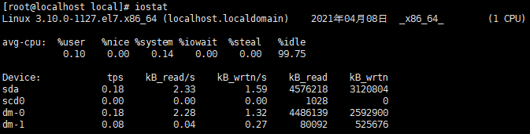

# 1 线上查询及帮助命令

## man

`man 命令名` 查看命令帮助，命令的词典，更复杂的还有 info，但不常用

## help

`help 命令名` 或 `命令名 --help` 查看Linux内置命令的帮助

# 2 文件和目录操作命令

## ls

> `ls(list)` 功能是列出目录的内容及其内容属性信息

`ls -l(long list)` 显示文件和目录的详细资料

`ls -a(--all)` 列出全部文件，包含隐藏文件

`ls -R(--recursive)` 连同子目录的内容一起列出（递归列出），等于该目录下的所有文件都会显示出来

## cd

> `cd(change directory)` 功能是从当前工作目录切换到指定的工作目录

`cd` 进入个人的主目录

`cd -` 返回上次所在的目录

## cp

`cp(copy)` 其功能为复制文件或目录

## find

> `find` 查找的意思，用于查找目录及目录下的文件

`-cmin n` 在过去 n 分钟内被修改过

`-cnewer file` 比文件 file 还要新的文件

`-mtime n` 在过去 n 天内被创建或内容被修改过的文件

> `atime(access time)` 文件被读取或者执行的时间
>
> `mtime(modify time)` 更改文件内容
>
> `ctime(change time)` 更改文件任何属性

`-empty` 空的文件

`-name name` 文件名称符合 name 的文件，`iname` 会忽略大小写

`-size [+,-]n[b,k,M,G]` 文件大小是大于/小于 n 单位

`-type c` 文件类型是 c 的文件

> b	区块装置文件
>
> c	字型装置文件
>
> d	目录
>
> f	一般文件
>
> l	符号连结
>
> p	具名贮列
>
> s	socket

```markdown
# 将目前目录及其子目录下所有延伸档名是 xml 的文件列出来
	find . -name *.xml
		find / xxx 表示从根目录查找
		find . xxx 表示从当前目录查找

# 将目前目录其其下子目录中所有目录列出
	find . -type d

# 将目前目录及其子目录下所有最近 1 天内更新过的文件列出
	find . -ctime -1
```

## mkdir

`mkdir(make directories)` 其功能是创建目录。

## mv

`mv(move)` 其功能是移动或重命名文件

## pwd

`pwd(print working directory)` 其功能是显示当前工作目录的绝对路径

## rm

> `rm(remove)` 其功能是删除一个或多个文件或目录

`-i(--interactive)` 删除前逐一询问确认

`-f(--force)` 即使原档案属性设为唯读，亦直接删除，无需逐一确认

`-r` 将目录及以下之档案亦逐一删除

```markdown
# 删除spring目录下的所有文件及目录
	rm  -rf  spring
```

## rmdir

rmdir：全拼remove empty directories，功能是删除空目录。

## file

file：显示文件的类型。 

## rename

rename：用于重命名文件。

# 3 查看文件及内容处理命令

`cat` 从第一个字节开始正向查看文件的内容，`-n` 可标示文件行数

`more` 分页显示文件内容

`less` 分页显示文件内容，more命令的相反用法

`head` 显示文件内容的头部，`-n` 表示前 n 行

`tail` 显示文件内容的尾部

- `-f` 循环读取
- `-n` 表示最后 n 行

> `tail -n +1000 file1` 从1000行开始显示，显示1000行以后的

```shell
# 单个关键词高亮显示
tail -f xxx.log | perl -pe 's/(关键词)/\e[1;颜色$1\e[0m/g'
# 多个关键词高亮显示
tail -f xxx.log | perl -pe 's/(关键词1)|(关键词2)/\e[1;颜色1$1\e[0m\e[1;颜色2$2\e[0m/g' 
30m：黑
31m：红
32m：绿
33m：黄
34m：蓝
35m：紫
36m：青
37m：白
# 显示1000行到3000行
cat filename | head -n 3000 | tail -n +1000
```

``grep(Global Regular Expression Print``，表示全局正则表达式版本)命令是查找，是一种强大的文本搜索工具，它能使用正则表达式搜索文本，并把匹配的行打印出来，该命令通常与管道命令一起使用，用于对一些命令的输出进行筛选加工等等

- `-A <显示行数> 或 --after-context=<显示行数>` 除了显示符合范本样式的那一列之外，并显示该行之后的内容
- `-B<显示行数> 或 --before-context=<显示行数>` 除了显示符合样式的那一行之外，并显示该行之前的内容
- `-C<显示行数> 或 --context=<显示行数>或-<显示行数>` 除了显示符合样式的那一行之外，并显示该行之前后的内容
- `-r 或 --recursive` 以递归的方式查找目录

```shell
# 在文件 '/var/log/messages'中查找关键词"Aug"
grep Aug /var/log/messages
# 在文件 '/var/log/messages'中查找以"Aug"开始的词汇
grep ^Aug /var/log/messages
# 选择 '/var/log/messages' 文件中所有包含数字的行
grep [0-9] /var/log/messages
# 在目录 '/var/log' 及随后的目录中搜索字符串"Aug"
grep Aug -R /var/log/*
```

`wc` 统计文件的行数、单词数或字节数

iconv：转换文件的编码格式。

vi/vim：命令行文本编辑器。

# 4 文件压缩及解压缩命令

## tar

``tar`` 命令：用来压缩和解压文件。tar本身不具有压缩功能。他是调用压缩功能实现的。 

参数： 

-c ：创建新的文档 

-x ：解压文件 

-t ：查看文件 特别注意，在参数的下达中， c/x/t 仅能存在一个，不可同时存在，因为不可能同时压缩与解压缩。

-z 通过 gzip 来进行归档压缩 

-j 通过 bzip2 来进行归档压缩 

-v 显示详细的tar处理的文件信息 

-r 增加文件，把要增加的文件追加在压缩文件的末尾 

-u 仅将较新的文件附加到存档中 

-d 比较存档与当前文件的不同之处 

-f ：要操作的文件名，在 f 之后要立即接文件名，例如使用『 tar -zcvfP tfile sfile』就是错误的写法，要写成『 tar -zcvPf tfile sfile』 

-p ：使用原文件的原来属性（属性不会依据使用者而变） 

-P ：可以使用绝对路径来压缩 

-N ：比后面接的日期(yyyy/mm/dd)还要新的才会被打包进新建的文件中 

-C --directory=DIR 解压文件至指定的目录 

–remove-files 压缩后删除原文件 

–exclude FILE：在压缩的过程中，不要将 FILE 打包

# 5 Java 后端线上问题排查常用命令

## 内存瓶颈

### free

查看系统内存

`-b / -k / -m`　以 Byte / KB / MB 为单位显示内存使用情况
`-h` 以合适的单位显示内存使用情况，最大为三位数，自动计算对应的单位值
`-s <间隔秒数>` 持续观察内存使用状况


- `Mem` 内存的使用情况
- `Swap` 交换空间的使用情况

- `total` 系统总的可用物理内存（交换空间...）
- `used` 已经被使用的物理内存
- `free` 真正未被使用的物理内存
- `shared` 被共享使用的物理内存
- `buff/cache` 被 `缓冲区(buffer)` 和 `缓存(cache)` 使用的物理内存
- `avaiable` 还可以被应用程序使用的物理内存，从应用程序角度看到的可用内存 `available ≈ free + buffer + cache`(注：只是大概的计算方法)

> total = used + free + buff/cache
>
> `交换空间(swap space)` 是磁盘上的一块区域，当系统物理内存吃紧时，Linux 会将内存中不常访问的数据保存到 swap 上，这样系统就有更多的物理内存为各个进程服务，而当系统需要访问 swap 上存储的内容时，再将 swap 上的数据加载到内存中，这就是常说的换出和换入。交换空间可以在一定程度上缓解内存不足的情况，但是它需要读写磁盘数据，所以性能不是很高。
>
> sar 和 free 类似 `sar -r 3` 每隔三秒输出一次内存信息。

### vmstat

`虚拟内存统计(Virtual Memory Statistics)` 是Linux中监控内存的常用工具，可对操作系统的虚拟内存、进程、CPU等的整体情况进行监视。

`vmstat 5 3` 表示每隔5秒统计一次，一共统计三次


**procs**

`r` 表示运行和等待 CPU 时间片的进程数，这个值如果长期大于系统 CPU 个数，说明 `CPU 不足`

`b` 表示在等待资源的进程数

**memory**

`swpd(the amount of swap memory used)` 表示切换到内存交换区的内存大小（单位KB），如果大于 0 表示`机器物理内存不足`了，如果不是程序内存泄露的原因，那么该升级内存了或者把耗内存的任务迁移到其他机器

> 活动虚拟内存的总量(VM) = 实际内存大小(size of real memory)(物理内存) + 使用的交换空间大小(amount of swap space used)

`cache` 表示缓存大小，一般作为文件系统进行缓冲，频繁访问的文件都会被缓存，如果 cache 值非常大说明缓存文件比较多，如果此时 io 中的 bi 比较小，说明文件系统效率比较好

**swap**

`si(Amount of memory swapped in from disk (/s))` 表示每秒从磁盘读入的内存大小，如果这个值大于 0，表示`物理内存不够用或者内存泄露`，要查找耗内存进程解决掉

`so(Amount of memory swapped to disk (/s))` 表示每秒写入磁盘的内存大小

> 一般情况下si、so的值都为 0，如果si、so的值长期不为 0，则说明系统内存不足，需要增加系统内存

**io**

`bi` 表示由块设备读入数据的总量，即读磁盘，单位kb/s

`bo` 表示写到块设备数据的总量，即写磁盘，单位kb/s

> 如果 bi + bo 的值过大，且 wa 值较大，则表示`系统磁盘 IO 瓶颈`

**system**

`in` 表示某一时间间隔内观测到的每秒设备终端数

`cs` 表示每秒产生的上下文切换次数，这个值要越小越好，太大要考虑`调低线程或者进程的数目`

> 这两个值越大，则由内核消耗的 CPU 就越多

**CPU**

`us` 表示用户进程消耗的 CPU 时间百分比，us 值越高，说明用户进程消耗 CPU 时间越多，如果长期大于`50%`，则需要考虑`优化程序或者算法`

`sy` 表示系统内核进程消耗的 CPU 时间百分比，一般来说 `us + sy 应该小于80%`，如果大于`80%`，说明可能`存在CPU瓶颈`

`id` 表示 CPU 处在空间状态的时间百分比

`wa` 表示 I/O 等待所占用的 CPU 时间百分比，wa 值越高，说明 I/O 等待越严重，根据经验 `wa 的参考值为20%`，如果超过`20%`，说明 `I/O 等待严重`，引起 I/O 等待的原因可能是磁盘大量随机读写造成的，也可能是磁盘或者监控器的带宽瓶颈（主要是块操作）造成的

## CPU 瓶颈

```shell
# 查看物理 CPU 个数
cat /proc/cpuinfo| grep "physical id"| sort| uniq| wc -l
# 查看每个物理 CPU 核数
cat /proc/cpuinfo| grep "cpu cores"| uniq
# 查看逻辑 CPU 个数
cat /proc/cpuinfo| grep "processor"| wc -l
# CPU 总核数 = 物理 CPU 个数 * 每颗物理 CPU 的核数
```

### top

实时显示系统资源使用情况


top 可以查看 CPU 总体消耗，包括分项消耗，如 User，System，Idle，nice 等。`Shift + H `显示java线程；`Shift + M `按照内存使用排序；`Shift + P `按照CPU使用时间（使用率）排序；`Shift + T `按照CPU累积使用时间排序；

多核CPU，进入top视图 `1`，可以看到各各CPU的负载情况。

`第一行` 13:58:39 系统时间，up 22 days 运行时间，2 users 当前登录用户数，load average 负载均衡情况，分别表示1分钟，5分钟，15分钟负载情况

`第二行` 总进程数 103，运行数1，休眠 102，停止 0，僵尸进程 0

`第三行` 用户空间 CPU 占比 0.3%，内核空间CPU占比 0.3%，改变过优先级的进程CPU占比 0%，空闲 CPU 占比 99.3，IO 等待占用 CPU 占比 0%，硬中断占用 CPU 占比 0%，软中断占用 CPU 占比 0%，当前 VM 中的 cpu 时钟被虚拟化偷走的比例 0%

`第四和第五行`表示内存和swap区域的使用情况

第七行表示：

- `PID` 进程 id
- `USER` 进程所有者
- `PR` 进程优先级
- `NI` nice 值，负值表示高优先级，正值表示低优先级
- `VIRT` 虚拟内存，进程使用的虚拟内存总量，单位 kb (VIRT=SWAP+RES)
- `RES` 常驻内存，进程使用的、未被换出的物理内存大小，单位kb
- `SHR` 共享内存，共享内存大小，单位kb
- `S` 进程状态，D=不可中断的睡眠状态 R=运行 S=睡眠 T=跟踪/停止 Z=僵尸进程
- `%CPU` 上次更新到现在的CPU时间占用百分比
- `%MEM` 进程使用的物理内存百分比
- `TIME+` 进程使用的CPU时间总计，单位1/100秒
- `COMMAND` 进程名称（命令名/命令行）

> `sar` 通过 `sar -u 3` 可以查看 CUP 总体消耗占比

```markdown
# 定位线上最耗 CPU 的线程
# 启动一个程序，每隔一秒生成一个随机数，再执行质因数分解，并打印出分解结果
	curl -O https://alibaba.github.io/arthas/arthas-demo.jar
	java -jar arthas-demo.jar

# 通过 top 命令找到最耗时的进程 shift + p
	top
	PID USER      PR  NI    VIRT    RES    SHR S  %CPU %MEM     TIME+ COMMAND
 	73063 root    20   0 2422552  23508  12108 S   0.7  1.7   0:00.32 java

# 找到进程中最耗CUP的线程，看 TIME 列可以看出那个线程耗费CUP多，根据 LWP 列可以看到线程的ID号，但是需要转换成16进制才可以查询线程堆栈信息
	ps -Lp 73063 cu
	USER        PID    LWP %CPU NLWP %MEM    VSZ   RSS TTY      STAT START   TIME COMMAND
	root      73063  73063  0.0   11  2.7 2239372 27124 pts/0   Sl+  14:31   0:00 java
	root      73063  73064  0.0   11  2.7 2239372 27124 pts/0   Sl+  14:31   0:04 java
	...

# 获取线程id的十六进制码
	printf '%x\n' 73064
	11d68

# 查看线程堆栈信息
	jstack 73063 | grep -A 10 11d68
	"main" #1 prio=5 os_prio=0 tid=0x00007f3ae0008800 nid=0x11d68 waiting on condition [0x00007f3ae6de2000]
   	java.lang.Thread.State: TIMED_WAITING (sleeping)
	at java.lang.Thread.sleep(Native Method)
	at java.lang.Thread.sleep(Thread.java:340)
	at java.util.concurrent.TimeUnit.sleep(TimeUnit.java:386)
	at demo.MathGame.main(MathGame.java:17)

	"VM Thread" os_prio=0 tid=0x00007f3ae0094000 nid=0x11d69 runnable 

	"VM Periodic Task Thread" os_prio=0 tid=0x00007f3ae00dd800 nid=0x11d70 waiting on condition 

# 通过命令我们可以看到这个线程的对应的耗时代码是在 demo.MathGame.main(MathGame.java:17)
```

## 磁盘瓶颈

### df

报告文件系统磁盘空间的使用情况，查看磁盘剩余空间使用 `df -hl` 命令

- `-h(human)` 使用人类可读的格式(预设值是不加这个选项的...)
- `-l(limit listing to local file systems)` 将列表限制为本地文件系统


### du

查看磁盘已使用空间的情况，默认为当前目录所使用的磁盘空间

- `-h` 使用人类可读的格式(预设值是不加这个选项的...)
- `-s(--summarize)` 显示文件或整个目录的大小，默认单位是KB


### iostat

查看磁盘总体的读写情况



- `tps` 该设备每秒的传输次数
- `kB_read/s` 每秒从设备（drive expressed）读取的数据量
- `kB_wrtn/s` 每秒向设备（drive expressed）写入的数据量
- `kB_read` 读取的总数据量
- `kB_wrtn` 写入的总数量数据量

通过 `iostat -x 1 3` 可以看到磁盘详细读写情况，每隔一秒输出一次一共输出 3 次。


`avg-cpu` 表示总体 cpu 使用情况统计信息，对于多核 cpu，这里为所有 cpu 的平均值：

- `%user`：CPU处在用户模式下的时间百分比
- `%nice`：CPU处在带NICE值的用户模式下的时间百分比
- `%system`：CPU处在系统模式下的时间百分比
- `%iowait`：CPU等待输入输出完成时间的百分比，`如果 %iowait 的值过高，表示硬盘存在I/O瓶颈`
- `%steal`：管理程序维护另一个虚拟处理器时，虚拟CPU的无意识等待时间百分比
- `%idle`：CPU 空闲时间百分比，如果 %idle 值高，表示CPU较空闲；如果 %idle 值高但系统响应慢时，可能是 `CPU 等待分配内存，应加大内存容量`；如果 %idle 值持续低于10，表明 `CPU 处理能力相对较低`，系统中最需要解决的资源是CPU

`Device`表示设备信息：

- `rrqm/s`：每秒对该设备的读请求被合并次数，文件系统会对读取同块(block)的请求进行合并
- `wrqm/s`：每秒对该设备的写请求被合并次数
- `r/s`：每秒完成的读次数
- `w/s`：每秒完成的写次数
- `rkB/s`：每秒读数据量(kB为单位)
- `wkB/s`：每秒写数据量(kB为单位)
- `avgrq-sz`：平均每次IO操作的数据量(扇区数为单位)
- `avgqu-sz`：平均等待处理的IO请求队列长度
- `await`：平均每次IO请求等待时间(包括等待时间和处理时间，毫秒为单位)，一般小于 5ms
- `svctm`：平均每次IO请求的处理时间(毫秒为单位)
- `%util`：一秒中有百分之多少的时间用于 I/O，如果 `%util 接近100%`，说明产生的I/O请求太多，`I/O 系统已经满负荷`。`idle 小于 70%` IO压力就较大了，一般读取速度有较多的 wait

> **!!** `iostat -xmd 1 3`：新增`m`选项可以在输出是使用`M`为单位。
>
> `iotop `命令来定位那个进程最耗费 IO，然后在通过 `iotop -p pid` 可以查看单个进程的IO情况。

## 应用瓶颈

### ps

LINUX下最常用的也是非常强大的进程查看命令

`-e` 显示所有进程

`-f(full-format)` 全格式 

`-L` 显示线程 

`-p [pid]` 按 PID 选择

`-a` 显示终端上的所有进程，包括其他用户的进程 

`-r` 只显示正在运行的进程 

`u` 显示面向用户的格式

`c` 显示真实的命令名

> ``中间的“ | ”``是管道命令是指ps命令与grep同时执行

```markdown
# 查找名字为 xxx 的线程信息
	ps -ef | grep xxx

# 查看特定进程的数量
	ps -ef | grep xxx | wc -l

# 查看线程是否存在死锁
	jstack -l [PID]

# 查看某个进程的线程数
	ps -efL | grep [PID] | wc -l

# 查看具体有哪些线程用
	ps -Lp [pid] cu

# 统计所有的log文件中，包含Error字符的行
	find / -type f -name "*.log" | xargs grep "ERROR"
```

# 6 其他

## 信息显示命令

uname：显示操作系统相关信息的命令。

hostname：显示或者设置当前系统的主机名。

dmesg：显示开机信息，用于诊断系统故障。

uptime：显示系统运行时间及负载。

stat：显示文件或文件系统的状态。

date：显示与设置系统时间。

cal：查看日历等时间信息。

## 用户管理命令

useradd：添加用户。

usermod：修改系统已经存在的用户属性。

userdel：删除用户。

groupadd：添加用户组。

passwd：修改用户密码。

id：查看用户的uid,gid及归属的用户组。

su：切换用户身份。

sudo：以另外一个用户身份(默认root用户)执行事先在sudoers文件允许的命令。

## 基础网络操作命令

ping：测试主机之间网络的连通性。

ifconfig：查看、配置、启用或禁用网络接口的命令。

netstat：查看网络状态。

## 系统权限及用户授权相关命令

chmod：改变文件或目录权限。

## 内置命令及其它

rpm：管理rpm包的命令。

yum：自动化简单化地管理rpm包的命令。

clear：清除屏幕，简称清屏。

chkconfig：管理Linux系统开机启动项。 

mpstat：显示各个可用CPU的状态统计。

## 进程管理相关命令

kill：终止进程。

### service

service：启动、停止、重新启动和关闭系统服务，还可以显示所有系统服务的当前状态。 

## 防火墙

firewall-cmd --list-all 参看防火墙 

sudo firewall-cmd --add-port=80/tcp --permanent 添加开放端口 

firewall-cmd --reload 重启 

systemctl stop firewalld 

systemctl start firewalld