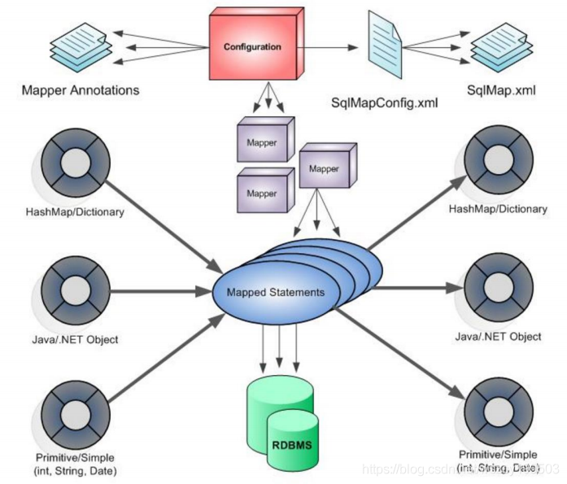
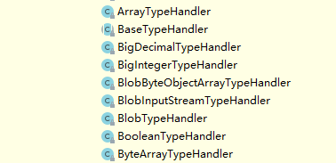
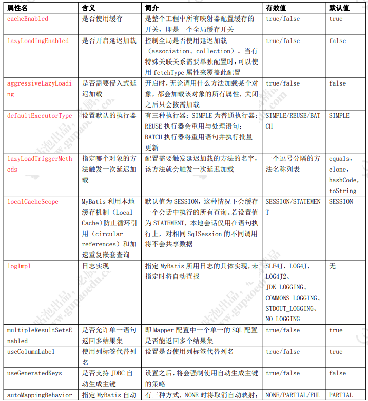
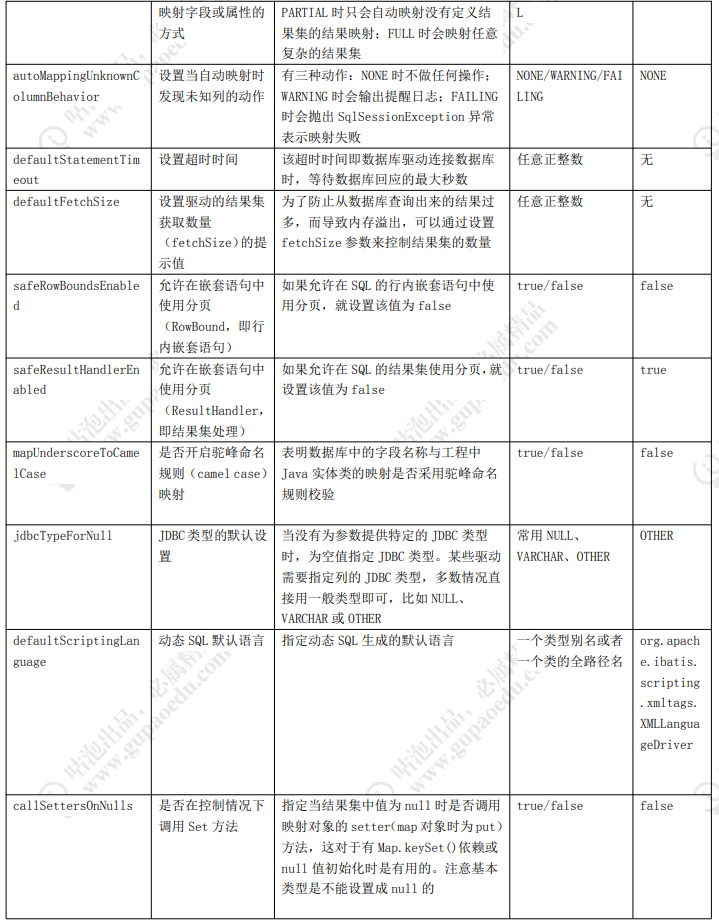
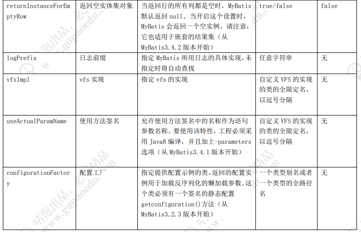

# 1 为什么要用 MyBatis

## 1.1 JDBC 连接数据库

在 Java 程序中去连接数据库，最原始的办法就是使用 JDBC 的 API ：

```java
Connection conn = null;
Statement stmt = null;
try {
    //classLoader,加载对应驱动
    Class.forName("com.mysql.jdbc.Driver");
    conn = DriverManager.getConnection("jdbc:mysql://localhost:3306/spring", "root", "root");
    stmt = conn.createStatement();
    String sql= "SELECT id, account FROM t_user WHERE id < 10";
    ResultSet rs = stmt.executeQuery(sql);
    // 获取结果集
    while(rs.next()){
        int bid = rs.getInt("id");
        String account = rs.getString("account");
        System.out.println("id = " + bid + ", account = " + account);
    }
    rs.close();
    stmt.close();
    conn.close();
} catch (Exception e) {
    e.printStackTrace();
}
```

首先，我们在 maven 中引入 MySQL 驱动的依赖（JDBC 的包在 java.sql 中）。

1. 注册驱动

2. 通过 DriverManager 获取一个 Connection，参数里 面填数据库地址，用户名和密码

3. 通过 Connection 创建一个 Statement 对象

4. 通过 Statement 的 execute()方法执行 SQL。当然 Statement 上面定义了 非常多的方法。execute()方法返回一个 ResultSet 对象，我们把它叫做结果集

5. 我们通过 ResultSet 获取数据。转换成一个 POJO 对象

6. 要关闭数据库相关的资源，包括 ResultSet、Statement、Connection， 它们的关闭顺序和打开的顺序正好是相反的。

这个就是我们通过 JDBC 的 API 去操作数据库的方法，这个仅仅是一个查询。如果我们项目当中的业务比较复杂，表非常多，各种操作数据库的增删改查的方法也比较多的话，那么这样<font color=red>代码会重复出现很多次</font>。

在每一段这样的代码里面，我们都需要自己去管理数据库的连接资源，<font color=red>如果忘记写 close()了，就可能会造成数据库服务连接耗尽</font>。

另外还有一个问题就是处理业务逻辑和处理数据的代码是耦合在一起的。如果业务流程复杂，跟数据库的交互次数多，耦合在代码里面的 SQL 语句就会非常多。<font color=red>如果要修改业务逻辑，或者修改数据库环境（因为不同的数据库 SQL 语法略有不同），这个工作量是也是难以估计的</font>。

还有就是对于结果集的处理，我们<font color=red>要把 ResultSet 转换成 POJO 的时候，必须根据字段属性的类型一个个地去处理</font>，写这样的代码是非常枯燥的：

```java
int bid = rs.getInt("id");
String account = rs.getString("account");
user.setAccount(account);
user.setId(bid);
```

也正是因为这样，我们在实际工作中是比较少直接使用 JDBC 的。那么我们在 Java 程序里面有哪些更加简单的操作数据库的方式呢？

## 1.2 Spring JDBC

Spring 对原生的 JDBC 进行了封装，并且给我们提供了一个模板方法 JdbcTemplate，来简化我们对数据库的操作。

第一个，我们不再需要去关心资源管理的问题。

第二个，对于结果集的处理，Spring JDBC 也提供了一个 RowMapper 接口，可以把结果集转换成 Java 对象。 看代码：比如我们要把结果集转换成 Employee 对象，就可以针对一个 Employee 创建一个 RowMapper 对象，实现 RowMapper 接口，并且重写 mapRow()方法。我们在 mapRow()方法里面完成对结果集的处理。

```java
public class EmployeeRowMapper implements RowMapper {
	@Override
	public Object mapRow(ResultSet resultSet, int i) throws SQLException {
		Employee employee = new Employee();
		employee.setEmpId(resultSet.getInt("emp_id"));
		employee.setEmpName(resultSet.getString("emp_name"));
		employee.setEmail(resultSet.getString("emial"));
		return employee;
	}
}
```

在 DAO 层调用的时候就可以传入自定义的 RowMapper 类，最终返回我们需要的类型。结果集和实体类类型的映射也是自动完成的。

```java
public List<Employee> query(String sql){
	new JdbcTemplate( new DruidDataSource());
	return jdbcTemplate.query(sql,new EmployeeRowMapper());
}
```

通过这种方式，我们对于结果集的处理只需要写一次代码，然后在每一个需要映射 的地方传入这个 RowMapper 就可以了，减少了很多的重复代码。

但是还是有问题：每一个实体类对象，都需要定义一个 Mapper，然后要编写每个 字段映射的 getString()、getInt 这样的代码，还增加了类的数量。 

所以有没有办法让一行数据的字段，跟实体类的属性自动对应起来，实现自动映射呢？

当然，我们肯定要解决两个问题，一个就是名称对应的问题，从下划线到驼峰命名；第二个是类型对应的问题，数据库的 JDBC 类型和 Java 对象的类型要匹配起来。 我们可以创建一个 BaseRowMapper，通过反射的方式自动获取所有属性，把 表字段全部赋值到属性。 上面的方法就可以改成： 

```java
return jdbcTemplate.query(sql,new BaseRowMapper(Employee.class)); 
```

这样，我们在使用的时候只要传入我们需要转换的类型就可以了，不用再单独创建 一个 RowMapper。

我们来总结一下，Spring JDBC，这个对 JDBC 做了轻量级封装的框架， 或者说工具类里面，都帮助我们解决了一些问题： 

1. JdbcTemplate可以传入一个数据源进行初始化，也就是资源管理这一部分的事情，可以交给专门的数据源组件去做，不用我们手动创建和关闭

2. 对操作数据的增删改查的方法进行了封装

3. 可以帮助我们映射结果集，无论是映射成 List、Map 还是实体类

但是还是存在一些缺点：

1. SQL 语句都是写死在代码里面的，依旧存在硬编码的问题

2. 参数只能按固定位置的顺序传入（数组），它是通过占位符去替换的， 不能自动映射

3. 在方法里面，可以把结果集映射成实体类，但是不能直接把实体类映射成数据库的记录（没有自动生成 SQL 的功能）

4. 查询没有缓存的功能

要解决这些问题，使用这些工具类还是不够的，要用到我们今天讲的 ORM 框架。

那什么是 ORM？为什么叫 ORM？

ORM 的全拼是 ``Object Relational Mapping``，也就是对象与关系的映射，对象是程序里面的对象，关系是它与数据库里面的数据的关系。也就是说，ORM 框架帮助我们解决的问题是程序对象和关系型数据库的相互映射的问题。

## 1.3 Mybatis

> What is MyBatis? MyBatis is a first class persistence framework with support for custom SQL, stored procedures and advanced mappings. MyBatis eliminates almost all of the JDBC code and manual setting of parameters and retrieval of results. MyBatis can use simple XML or Annotations for configuration and map primitives, Map interfaces and Java POJOs (Plain Old Java Objects) to database records.

MyBatis 是一款优秀的持久层框架，它支持自定义 SQL、存储过程以及高级映射。MyBatis 免除了几乎所有的 JDBC 代码以及设置参数和获取结果集的工作。MyBatis 可以通过简单的 XML 或注解来配置和映射原始类型、接口和 Java POJO（Plain Old Java Objects，普通老式 Java 对象）为数据库中的记录。 



“半自动化”的 ORM 框架 MyBatis 就解决了这几个问题。“半自动化”是相对于 Hibernate 的全自动化来说的，也就是说它的封装程度没有 Hibernate 那么高，不会自动生成全部的 SQL 语句，主要解决的是 SQL 和对象的映射问题。 

在 MyBatis 里面，SQL 和代码是分离的，所以会写 SQL 基本上就会用 MyBatis，没有额外的学习成本。

我们来总结一下，MyBatis 的核心特性，或者说它解决的主要问题是什么： 

1、 使用连接池对连接进行管理 

2、 SQL 和代码分离，集中管理 

3、 结果集映射 

4、 参数映射和动态 SQL 

5、 重复 SQL 的提取 

6、 缓存管理 

7、 插件机制

当然，需要明白的是，Hibernate 和 MyBatis 跟 DbUtils、Spring JDBC 一样，都是对 JDBC 的一个封装，我们去看源码，最后一定会看到 Statement 和 ResultSet 这些 对象。 

问题来了，我们有这么多的工具和不同的框架，在实际的项目里面应该怎么选择？ 

在一些业务比较简单的项目中，我们可以使用 Hibernate； 

如果需要更加灵活的 SQL，可以使用 MyBatis，对于底层的编码，或者性能要求非 常高的场合，可以用 JDBC。 

实际上在我们的项目中，MyBatis 和 Spring JDBC 是可以混合使用的。 

当然，我们也根据项目的需求自己写 ORM 框架。

# 2 MyBatis 实际使用案例

## 2.1 编程式使用

大部分时候，我们都是在 Spring 里面去集成 MyBatis。因为 Spring 对 MyBatis 的 一些操作进行的封装，我们不能直接看到它的本质，所以先看下不使用容器的时候，也就是``编程的方式``，MyBatis 怎么使用。 

先引入 mybatis jar 包。 

首先我们要创建一个全局配置文件，这里面是对 MyBatis 的核心行为的控制，比如 mybatis-config.xml。

```xml
<?xml version="1.0" encoding="UTF-8"?>
<!DOCTYPE configuration PUBLIC "-//mybatis.org//DTD SQL Map Config 3.0//EN"
        "http://mybatis.org/dtd/mybatis-3-config.dtd">
<configuration>
<environments default="development">
     <environment id="development">
         <transactionManager type="JDBC"/>
         <dataSource type="POOLED">
             <property name="username" value="root"/>
             <property name="password" value="root"/>
             <property name="url" value="jdbc:mysql://localhost:3306/spring"/>
             <property name="driver" value="com.mysql.jdbc.Driver"/>
         </dataSource>
     </environment>
 </environments>

 <mappers>
     <mapper resource="mapper/UserMapper.xml"/>
 </mappers>
</configuration>
```

第二个就是我们的映射器文件，Mapper.xml，通常来说一张表对应一个，我们会在 这个里面配置我们增删改查的 SQL 语句，以及参数和返回的结果集的映射关系。 

跟 JDBC 的代码一样，我们要执行对数据库的操作，必须创建一个会话，这个在 MyBatis 里面就是 SqlSession。SqlSession 又是工厂类根据全局配置文件创建的。所以 整个的流程就是这样的（如下代码）。最后我们通过 SqlSession 接口上的方法，传入我 们的 Statement ID 来执行 SQL。

这是第一种方式。 这种方式有一个明显的缺点，就是会对 Statement ID 硬编码，而且不能在编译时进 行类型检查，所以通常我们会使用第二种方式，就是定义一个 Mapper 接口的方式。这 个接口全路径必须跟 Mapper.xml 里面的 namespace 对应起来，方法也要跟 Statement ID 一一对应。

```java
// 使用类加载器，加载mybatis的配置文件
InputStream inputStream= Resources.getResourceAsStream("mybatis-config.xml");
// 构件sqlSession工厂
SqlSessionFactory sqlSessionFactory = new SqlSessionFactoryBuilder().build(inputStream);
SqlSession sqlSession = sqlSessionFactory.openSession();
try {
    UserMapper userMapper = sqlSession.getMapper(UserMapper.class);
    User user = userMapper.selectById(1);
    System.out.println(user);
} finally {
    sqlSession.close();
}
```

这个就是我们单独使用 MyBatis 的全部流程。 这个案例非常重要，后面我们讲源码还是基于它。

## 2.2 核心对象的生命周期

在编程式使用的这个 demo 里面，我们看到了 MyBatis 里面的几个核心对象： SqlSessionFactoryBuiler、SqlSessionFactory、SqlSession 和 Mapper 对象。这几个 核心对象在 MyBatis 的整个工作流程里面的不同环节发挥作用。如果说我们不用容器， 自己去管理这些对象的话，我们必须思考一个问题：什么时候创建和销毁这些对象？ 

在一些分布式的应用里面，多线程高并发的场景中，如果要写出高效的代码，必须 了解这四个对象的生命周期。这四个对象的声明周期的描述在官网上面也可以找到。

http://www.mybatis.org/mybatis-3/zh/getting-started.html 

我们从每个对象的作用的角度来理解一下，只有理解了它们是干什么的，才知道什 么时候应该创建，什么时候应该销毁。

### SqlSessionFactoryBuiler 

它是用来构建 SqlSessionFactory 的 ， 而 SqlSessionFactory 只需要一个，所以只要构建了这一个 SqlSessionFactory，它的使命就完成了，也就没有存在的意义了。所以它的生命周期只存在于`方法的局部`。

### SqlSessionFactory

SqlSessionFactory 是用来创建 SqlSession 的，每次应用程序访问数据库，都需要创建一个会话。因为我们一直有创建会话的需要，所以 SqlSessionFactory 应该存在于应用的整个生命周期中（`作用域是应用作用域`）。创建 SqlSession 只需要一个实例来做这件事就行了，否则会产生很多的混乱，和浪费资源。所以我们要采用单例模式。

### SqlSession

SqlSession 是一个会话，因为它不是线程安全的，不能在线程间共享。所以我们在请求开始的时候创建一个 SqlSession 对象，在请求结束或者说方法执行完毕的时候要及时关闭它（`一次请求或者操作中`）。 

### Mapper

Mapper（实际上是一个代理对象）是从 SqlSession 中获取的。 

```java
UserMapper userMapper = sqlSession.getMapper(UserMapper.class);
```

它的作用是发送 SQL 来操作数据库的数据。它应该在一个 SqlSession 事务`方法之内`。

## 2.3 核心配置解读

第一个是 config 文件。大部分时候我们只需要很少的配置就可以让 MyBatis 运行起 来。其实 MyBatis 里面提供的配置项非常多，我们没有配置的时候使用的是系统的默认值。 

mybatis-3 的源码托管在 github 上 。 源码地址 https://github.com/mybatis/mybatis-3/releases 目前最新的版本是 3.5.6，大家可以从官方上下载到最新的源码。 


第一个是 jar 包和文档。第二个第三个是源码。

在这个压缩包里面，解压出来有一个 mybatis-3.5.6.pdf，是英文版本的。如果阅读 英文困难，可以基于 3.5.1 的中文版本学习。 

http://www.mybatis.org/mybatis-3/zh/index.html

### configuration

configuration 是整个配置文件的根标签，实际上也对应着 MyBatis 里面最重要的配置类 Configuration。它贯穿 MyBatis 执行流程的每一个环节。我们打开这个类看一 下，这里面有很多的属性，跟其他的子标签也能对应上。 

注意：MyBatis 全局配置文件顺序是固定的，否则启动的时候会报错。

### 一级标签

#### properties

第一个是 properties 标签，用来配置参数信息，比如最常见的数据库连接信息。

为了避免直接把参数写死在 xml 配置文件中，我们可以把这些参数单独放在 properties 文件中，用 properties 标签引入进来，然后在 xml 配置文件中用${}引用就可以了。

可以用 resource 引用应用里面的相对路径，也可以用 url 指定本地服务器或者网络的绝对路径。 我们为什么要把这些配置独立出来？有什么好处？或者说，公司的项目在打包的时候，有没有把 properties 文件打包进去？

1、 提取，利于多处引用，维护简单

2、 把配置文件放在外部，避免修改后重新编译打包，只需要重启应用

3、 程序和配置分离，提升数据的安全性，比如生产环境的密码只有运维人员掌握

#### settings

setttings 里面是 MyBatis 的一些核心配置，我们最后再看，先看下其他的以及标签。

#### typeAliases

TypeAlias 是类型的别名，跟 Linux 系统里面的 alias 一样，主要用来简化全路径类名的拼写。比如我们的参数类型和返回值类型都可能会用到我们的 Bean，如果每个地方 都配置全路径的话，那么内容就比较多，还可能会写错。 

我们可以为自己的 Bean 创建别名，既可以指定单个类，也可以指定一个 package， 自动转换。配置了别名以后，只需要写别名就可以了，比如 com.spring.domain.Blog 都只要写 blog 就可以了。

MyBatis 里面有系统预先定义好的类型别名，在 TypeAliasRegistry 中。

#### typeHandlers【重点】 

由于 Java 类型和数据库的 JDBC 类型不是一一对应的（比如 String 与 varchar）， 所以我们把 Java 对象转换为数据库的值，和把数据库的值转换成 Java 对象，需要经过一定的转换，这两个方向的转换就要用到 TypeHandler。

有的同学可能会有疑问，我没有做任何的配置，为什么实体类对象里面的一个 String 属性，可以保存成数据库里面的 varchar 字段，或者保存成 char 字段？ 这是因为 MyBatis 已经内置了很多 TypeHandler（在 type 包下），它们全部全部注册在 TypeHandlerRegistry 中，他们都继承了抽象类 BaseTypeHandler，泛型就是要处理的 Java 数据类型。



当我们做数据类型转换的时候，就会自动调用对应的 TypeHandler 的方法。

如果我们需要自定义一些类型转换规则，或者要在处理类型的时候做一些特殊的动作，就可以编写自己的 TypeHandler，跟系统自定义的 TypeHandler 一样，继承抽象类 BaseTypeHandler。有 4 个抽象方法必须实现，我们把它分成两类：

set 方法从 Java 类型转换成 JDBC 类型的，get 方法是从 JDBC 类型转换成 Java 类 型的。

| 从 Java 类型到 JDBC 类型          | 从 JDBC 类型到 Java 类型                                     |
| --------------------------------- | ------------------------------------------------------------ |
| setNonNullParameter：设置非空参数 | getNullableResult：获取空结果集（根据列名），一般都是调用这个<br>getNullableResult：获取空结果集（根据下标值）<br/>getNullableResult：存储过程用的 |

比如我们想要在获取或者设置 String 类型的时候做一些特殊处理，我们可以写一个 String 类型的 TypeHandler。

```java
public class SpringTypeHandle extends BaseTypeHandler<String> {
    @Override
    public void setNonNullParameter(PreparedStatement ps, int i, String parameter, JdbcType jdbcType) throws SQLException {
        ps.setString(i, parameter + "-Spring");
    }

    @Override
    public String getNullableResult(ResultSet rs, String columnName) throws SQLException {
        return rs.getString(columnName);
    }

    @Override
    public String getNullableResult(ResultSet rs, int columnIndex) throws SQLException {
        return rs.getString(columnIndex);
    }

    @Override
    public String getNullableResult(CallableStatement cs, int columnIndex) throws SQLException {
        return cs.getString(columnIndex);
    }
}
```

在 mybatis-config.xml 文件中注册：

```xml
<typeHandlers><!--非必须-->
	<typeHandler handler="com.mybatis.handler.SpringTypeHandle"></typeHandler>
</typeHandlers>
```

UserMapper.xml：

```java
<!-- 插入和更新从 Java 类型到 JDBC 类型，在字段属性中指定 typehandle -->
<insert id="insertUser" parameterType="com.mybatis.model.User">
    INSERT INTO user (name) VALUES (#{name, jdbcType=VARCHAR, typeHandler=com.mybatis.handler.SpringTypeHandle})
</insert>
```

返回值的时候，从 JDBC 类型到 Java 类型，在 resultMap 的列上指定 typehandler。

#### objectFactory【重点】

当我们把数据库返回的结果集转换为实体类的时候，需要创建对象的实例，由于我 们不知道需要处理的类型是什么，有哪些属性，所以不能用 new 的方式去创建。在 MyBatis 里面，它提供了一个工厂类的接口，叫做 ObjectFactory，专门用来创建对象的 实例，里面定义了 4 个方法。

```java
public interface ObjectFactory {
    void setProperties(Properties var1);
    <T> T create(Class<T> var1);
    <T> T create(Class<T> var1, List<Class<?>> var2, List<Object> var3);
    <T> boolean isCollection(Class<T> var1);
}
```

| 方法                                                         | 作用                           |
| ------------------------------------------------------------ | ------------------------------ |
| void setProperties(Properties var1);                         | 设置参数时调用                 |
| <T> T create(Class<T> var1);                                 | 创建对象（调用无参构造函数）   |
| <T> T create(Class<T> var1, List<Class<?>> var2, List<Object> var3); | 创建对象（调用带参数构造函数） |
| <T> boolean isCollection(Class<T> var1);                     | 判断是否集合                   |

ObjectFactory 有一个默认的实现类 DefaultObjectFactory，创建对象的方法最终 都调用了 instantiateClass()，是通过反射来实现的。

如果想要修改对象工厂在初始化实体类的时候的行为，就可以通过创建自己的对象 工厂，继承 DefaultObjectFactory 来实现（不需要再实现 ObjectFactory 接口）。 例如：

//TODO

#### plugins

插件是 MyBatis 的一个很强大的机制，跟很多其他的框架一样，MyBatis 预留了插 件的接口，让 MyBatis 更容易扩展。 

MyBatis 允许在映射语句执行过程中的这四个对象(我们把这四个对象称作 MyBatis 的四大对象)某一点进行拦截调用。默认情况下，MyBatis 允许使用插件来拦截的方法调用包括：

- Executor (update, query, flushStatements, commit, rollback, getTransaction, close, isClosed) 
- ParameterHandler (getParameterObject, setParameters) 
- ResultSetHandler (handleResultSets, handleOutputParameters) 
- StatementHandler (prepare, parameterize, batch, update, query)

```java
// 实现org.apache.ibatis.plugin.Interceptor
@Intercepts({@Signature(type = Executor.class, method = "query",
        args = {MappedStatement.class, Object.class, RowBounds.class, ResultHandler.class})})
public class SpringPlugins implements Interceptor {

    @Override
    public Object intercept(Invocation invocation) throws Throwable {
        MappedStatement mappedStatement = (MappedStatement) invocation.getArgs()[0];
        Object parameter = null;
        if (invocation.getArgs().length > 1) {
            parameter = invocation.getArgs()[1];
        }

        BoundSql boundSql = mappedStatement.getBoundSql(parameter);
        System.out.println("SpringPlugins: " + boundSql.getSql());
        return invocation.proceed();
    }

    @Override
    public Object plugin(Object target) {
        return Plugin.wrap(target, this);
    }

    @Override
    public void setProperties(Properties properties) {

    }
}
```

配置 mybatis-config.xml：

```java
<plugins>
    <plugin interceptor="com.mybatis.plugins.SpringPlugins"/>
</plugins>
```

#### environments

environments 标签用来管理数据库的环境，比如我们可以有开发环境、测试环境、 生产环境的数据库。可以在不同的环境中使用不同的数据库地址或者类型。

```xml
<environments default="development">
     <environment id="development">
         <transactionManager type="JDBC"/>
         <dataSource type="POOLED">
             <property name="username" value="root"/>
             <property name="password" value="root"/>
             <property name="url" value="jdbc:mysql://localhost:3306/spring"/>
             <property name="driver" value="com.mysql.jdbc.Driver"/>
         </dataSource>
     </environment>
 </environments>
```

一个 environment 标签就是一个数据源，代表一个数据库。这里面有两个关键的标签，一个是事务管理器，一个是数据源。

#### transactionManager

如果配置的是 JDBC，则会使用 Connection 对象的 commit()、rollback()、close() 管理事务。 

如果配置成 MANAGED，会把事务交给容器来管理，比如 JBOSS，Weblogic。因为我们跑的是本地程序，如果配置成 MANAGE 不会有任何事务。 

如果是 Spring + MyBatis ， 则没有必要配置 ， 因为我们会直接在 applicationContext.xml 里面配置数据源，覆盖 MyBatis 的配置。

#### dataSource

将在下一节（settings）详细分析。在跟 Spring 集成的时候，事务和数据源都会交给 Spring 来管理。

#### mappers 

mappers 标签配置的是我们的映射器，也就是 Mapper.xml 的路径。这里配置的 目的是让 MyBatis 在启动的时候去扫描这些映射器，创建映射关系。 我们有四种指定 Mapper 文件的方式：

 http://www.mybatis.org/mybatis-3/zh/configuration.html#mappers 

1、使用相对于类路径的资源引用（resource） 

2、使用完全限定资源定位符（绝对路径）（URL） 

3、使用映射器接口实现类的完全限定类名 

4、将包内的映射器接口实现全部注册为映射器（最常用）

#### settings

最后 settings 我们来单独说一下，因为 MyBatis 的一些最关键的配置都在这个标签里面（只讲解一些主要的）。







### Mapper.xml 映射配置文件

http://www.mybatis.org/mybatis-3/zh/sqlmap-xml.html 

映射器里面最主要的是配置了 SQL 语句，也解决了我们的参数映射和结果集映射的 问题。一共有 8 个标签：

cache – 给定命名空间的缓存配置（是否开启二级缓存）。

cache-ref – 其他命名空间缓存配置的引用。这两个标签我们在讲解缓存的时候会详细讲到。

resultMap – 是最复杂也是最强大的元素，用来描述如何从数据库结果集中来加载对象。

sql – 可被其他语句引用的可重用语句块。

insert – 映射插入语句 

update – 映射更新语句 

delete – 映射删除语句 

select – 映射查询语句

# 3 MyBatis 最佳实践

## 3.1 动态SQL

查询条件不确定，需要根据情况产生SQL语法，这种情况叫动态SQL。

按照官网的分类，MyBatis 的动态标签主要有四类：if，choose (when, otherwise)， trim (where, set)，foreach。

`if` 需要判断的时候，条件写在 test 中

`choose (when, otherwise) ` 需要选择一个条件的时候

`trim (where, set)` 需要去掉 where、and、逗号之类的符号的时候

注意最后一个条件 dId 多了一个逗号，就是用 trim 去掉的：

```xml
<update id="updateByPrimaryKeySelective" parameterType="com.spring.crud.bean.Employee">
update tbl_emp
	<set>
		<if test="empName != null">
			emp_name = #{empName,jdbcType=VARCHAR},
		</if>
		<if test="gender != null">
			gender = #{gender,jdbcType=CHAR},
		</if>
		<if test="email != null">
			email = #{email,jdbcType=VARCHAR},
		</if>
		<if test="dId != null">
			d_id = #{dId,jdbcType=INTEGER},
		</if>
	</set>
where emp_id = #{empId,jdbcType=INTEGER}
</update>
```

trim 用来指定或者去掉前缀或者后缀：

```xml
<insert id="insertSelective" parameterType="com.gupaoedu.crud.bean.Employee">
insert into tbl_emp
	<trim prefix="(" suffix=")" suffixOverrides=",">
		<if test="empId != null">
			emp_id,
		</if>
		<if test="empName != null">
			emp_name,
		</if>
		<if test="dId != null">
			d_id,
		</if>
	</trim>
	<trim prefix="values (" suffix=")" suffixOverrides=",">
		<if test="empId != null">
			#{empId,jdbcType=INTEGER},
		</if>
		<if test="empName != null">
			#{empName,jdbcType=VARCHAR},
		</if>
		<if test="dId != null">
			#{dId,jdbcType=INTEGER},
		</if>
	</trim>
</insert>
```

`foreach` 需要遍历集合的时候

## 3.2 批量操作

我们在生产的项目中会有一些批量操作的场景，比如导入文件批量处理数据的情况 （批量新增商户、批量修改商户信息），当数据量非常大，比如超过几万条的时候，在 Java 代码中循环发送 SQL 到数据库执行肯定是不现实的，因为这个意味着要跟数据库创 建几万次会话，即使我们使用了数据库连接池技术，对于数据库服务器来说也是不堪重 负的。 

在 MyBatis 里面是支持批量的操作的，包括批量的插入、更新、删除。我们可以直 接传入一个 List、Set、Map 或者数组，配合动态 SQL 的标签，MyBatis 会自动帮我们 生成语法正确的 SQL 语句。 

比如我们来看两个例子，批量插入和批量更新

### 批量插入

批量插入的语法是这样的，只要在 values 后面增加插入的值就可以了。

在 Mapper 文件里面，我们使用 foreach 标签拼接 values 部分的语句：  

```xml
<!-- 批量插入 -->
<insert id="batchInsert" parameterType="java.util.List" useGeneratedKeys="true">
	<selectKey resultType="long" keyProperty="id" order="AFTER">
		SELECT LAST_INSERT_ID()
	</selectKey>
	insert into tbl_emp (emp_id, emp_name, gender,email, d_id)
	values
	<foreach collection="list" item="emps" index="index" separator=",">
		( #{emps.empId},#{emps.empName},#{emps.gender},#{emps.email},#{emps.dId} )
	</foreach>
</insert>
```

Java 代码里面，直接传入一个 List 类型的参数。 

我们来测试一下。效率要比循环发送 SQL 执行要高得多。最关键的地方就在于减少 了跟数据库交互的次数，并且避免了开启和结束事务的时间消耗。

### 批量更新 

批量更新的语法是这样的，通过 case when，来匹配 id 相关的字段值。

```sql
update tbl_emp set
emp_name =
case emp_id
when ? then ?
when ? then ?
when ? then ? end ,
gender =
case emp_id
when ? then ?
when ? then ?
when ? then ? end ,
email =
case emp_id
when ? then ?
when ? then ?
when ? then ? end
where emp_id in ( ? , ? , ? )
```

所以在 Mapper 文件里面最关键的就是 case when 和 where 的配置。 

需要注意一下 open 属性和 separator 属性。

```xml
<update id="updateBatch">
update tbl_emp set
emp_name =
<foreach collection="list" item="emps" index="index" separator=" " open="case emp_id" close="end">
when #{emps.empId} then #{emps.empName}
</foreach>
,gender =
<foreach collection="list" item="emps" index="index" separator=" " open="case emp_id" close="end">
when #{emps.empId} then #{emps.gender}
</foreach>
,email =
<foreach collection="list" item="emps" index="index" separator=" " open="case emp_id" close="end">
when #{emps.empId} then #{emps.email}
</foreach>
where emp_id in
<foreach collection="list" item="emps" index="index" separator="," open="("close=")">
#{emps.empId}
</foreach>
</update>
```

### Batch Executor 

当然 MyBatis 的动态标签的批量操作也是存在一定的缺点的，比如数据量特别大的 时候，拼接出来的 SQL 语句过大。 

MySQL 的服务端对于接收的数据包有大小限制，max_allowed_packet 默认是 4M，需要修改默认配置才可以解决这个问题。 

```
Caused by: com.mysql.jdbc.PacketTooBigException: Packet for query is too large (7188967 > 4194304). You can change this value on the server by setting the max_allowed_packet' variable. 
```

在我们的全局配置文件中，可以配置默认的 Executor 的类型。其中有一种 BatchExecutor。

```xml
<setting name="defaultExecutorType" value="BATCH" />
```

也可以在创建会话的时候指定执行器类型： 

```java
SqlSession session = sqlSessionFactory.openSession(ExecutorType.BATCH); 
```

BatchExecutor 底层是对 JDBC ps.addBatch()的封装，原理是攒一批 SQL 以后再发送。 

## 3.3 嵌套（关联）查询

### 两种 result resultType vs resultMap

MyBatis中在查询进行select映射的时候，返回类型可以用resultType，也可以用resultMap，resultType是直接表示返回类型的(对应着我们的model对象中的实体)，而resultMap则是对外部ResultMap的引用(提前定义了db和model之间的隐射key–&gt;value关系)，但是resultType跟resultMap不能同时存在。 在MyBatis进行查询映射时，其实查询出来的每一个属性都是放在一个对应的Map里面的，其中键是属性名，值则是其对应的值。

- 当提供的返回类型属性是resultType时，MyBatis会将Map里面的键值对取出赋给resultType所指定的对象对应的属性。所以其实MyBatis的每一个查询映射的返回类型都是ResultMap，只是当提供的返回类型属性是resultType的时候，MyBatis对自动的给把对应的值赋给resultType所指定对象的属性。 
- 当提供的返回类型是resultMap时，因为Map不能很好表示领域模型，就需要自己再进一步的把它转化为对应的对象，这常常在复杂查询中很有作用。

### 嵌套结果和嵌套查询

```xml
<!-- 嵌套结果 start -->
<resultMap id="BlogResultMap" type="com.spring.model.Blog">
    <id column="bid" jdbcType="INTEGER" property="bid" />
    <result column="name" jdbcType="VARCHAR" property="name"/>
    <association property="author" javaType="com.spring.model.Author">
        <id column="aid" jdbcType="INTEGER" property="aid" />
        <result column="author_name" jdbcType="VARCHAR" property="authorName"/>
    </association>
</resultMap>

<select id="selectBlogAuthor2" resultMap="BlogResultMap" parameterType="int">
    select b.*,a.* from blog b, author a
    where b.bid = #{bid}
    and b.aid = a.aid
</select>
<!-- 嵌套结果 end -->

<!-- 嵌套查询 start -->
<resultMap id="BaseResultMap" type="com.spring.model.Blog">
    <id column="bid" jdbcType="INTEGER" property="bid" />
    <result column="name" jdbcType="VARCHAR" property="name"/>
    <association property="author" column="aid" select="com.spring.mybatis.dao.AuthorMapper.selectByPrimaryKey">

    </association>
</resultMap>

<select id="selectBlogAuthor" resultMap="BaseResultMap" parameterType="int">
    select * from blog
    where bid = #{bid}
</select>
<!-- 嵌套查询 end -->

<!-- 嵌套查询 1：N start -->
<resultMap id="BlogPostsResultMap" type="com.spring.model.Blog">
    <id column="bid" jdbcType="INTEGER" property="bid" />
    <result column="name" jdbcType="VARCHAR" property="name"/>
    <collection column="bid" property="posts" select="selectByBlogId" ofType="com.spring.model.Posts">
    </collection>
</resultMap>

<select id="selectByBlogId" resultType="com.spring.model.Posts" parameterType="java.lang.Integer">
    select pid, post_name AS postName, bid
    from posts
    where bid = #{id}
</select>

<select id="selectBlogPosts" resultMap="BlogPostsResultMap" parameterType="int">
    select * from blog
    where bid = #{id}
</select>
<!-- 嵌套查询 1：N end -->
```

其中第二种方式：嵌套查询，由于是分两次查询，当我们查询了博客信息之后，会再发送一条 SQL 到数据库查询作者信息。 

我们只执行了一次查询博客信息的 SQL（所谓的 1），如果返回了 N 条记录，就会再发送 N 条到数据库查询作者信息（所谓的 N），这个就是我们所说的 N+1 的问题。 这样会白白地浪费我们的应用和数据库的性能。 

如果我们用了嵌套查询的方式，怎么解决这个问题？能不能等到使用作者信息的时候再去查询？这个就是我们所说的延迟加载，或者叫`懒加载`。

### 懒加载

在 MyBatis 里面可以通过开启延迟加载的开关来解决这个问题。 在 settings 标签里面可以配置：

```xml
<!--不主动加载级联Mapper resultMap配置-->
<settings>
   <!-- 全局性设置懒加载。如果设为‘false'，则所有相关联的都会被初始化加载。 -->
   <setting name="lazyLoadingEnabled" value="true"/>
   <!-- 当设置为‘true'的时候，懒加载的对象可能被任何懒属性全部加载。否则，每个属性都按需加载。 -->
   <setting name="aggressiveLazyLoading" value="false"/>
</settings>
```

```java
@Test
public void test() {
	Blog blog = mapper.selectBlogPosts(1);
	System.out.println(blog.getName());
	Thread.sleep(5000);
	System.out.println(blog.getPosts().get(0).getBid());
}
```

日志:

```java
JDBC Connection [com.alibaba.druid.proxy.jdbc.ConnectionProxyImpl@3e7634b9] will not be managed by Spring
==>  Preparing: select * from blog where bid = ? 
==> Parameters: 1(Integer)
<==    Columns: bid, name, aid
<==        Row: 1, 花开, 1
<==      Total: 1
Closing non transactional SqlSession [org.apache.ibatis.session.defaults.DefaultSqlSession@4212a0c8]
花开

5s之后

JDBC Connection [com.alibaba.druid.proxy.jdbc.ConnectionProxyImpl@3e7634b9] will not be managed by Spring
==>  Preparing: select pid, post_name AS postName, bid from posts where bid = ? 
==> Parameters: 1(Integer)
<==    Columns: pid, postName, bid
<==        Row: 1, spring, 1
<==        Row: 2, mybatis, 1
<==      Total: 2
```

## 3.4 Generator

### 引入 plugin

```xml
<build>
    <plugins>
        <plugin>
            <groupId>org.mybatis.generator</groupId>
            <artifactId>mybatis-generator-maven-plugin</artifactId>
            <version>1.3.3</version>
            <configuration>
                <configurationFile>${project.basedir}/src/main/resources/generator/generatorConfig.xml</configurationFile>
                <overwrite>true</overwrite>
            </configuration>
            <dependencies>
                <dependency>
                    <groupId>mysql</groupId>
                    <artifactId>mysql-connector-java</artifactId>
                    <version>5.1.31</version>
                </dependency>
            </dependencies>
        </plugin>
    </plugins>
</build>
```

### generatorConfig.xml

```xml
<?xml version="1.0" encoding="UTF-8"?>
<!DOCTYPE generatorConfiguration
  PUBLIC "-//mybatis.org//DTD MyBatis Generator Configuration 1.0//EN"
  "mybatis-generator-config_1_0.dtd">

<generatorConfiguration>
   <context id="testTables" targetRuntime="MyBatis3">
      <commentGenerator>
         <!-- 是否去除自动生成的注释 true：是 ： false:否 -->
         <property name="suppressAllComments" value="true" />
      </commentGenerator>
      <!--数据库连接的信息：驱动类、连接地址、用户名、密码 -->
      <jdbcConnection driverClass="com.mysql.jdbc.Driver"
         connectionURL="jdbc:mysql://127.0.0.1:3306/spring" userId="root"
         password="root">
      </jdbcConnection>

      <!-- 默认false，把JDBC DECIMAL 和 NUMERIC 类型解析为 Integer，为 true时把JDBC DECIMAL 和 
         NUMERIC 类型解析为java.math.BigDecimal -->
      <javaTypeResolver>
         <property name="forceBigDecimals" value="false" />
      </javaTypeResolver>

      <!-- targetProject:生成PO类的位置 -->
      <javaModelGenerator targetPackage="com.mybatis.po"
         targetProject=".\src\main\java\">
         <!-- enableSubPackages:是否让schema作为包的后缀 -->
         <property name="enableSubPackages" value="false" />
         <!-- 从数据库返回的值被清理前后的空格 -->
         <property name="trimStrings" value="true" />
      </javaModelGenerator>
        <!-- targetProject:mapper映射文件生成的位置 -->
      <sqlMapGenerator targetPackage="com.mybatis.mapper" 
         targetProject=".\src\main\java\">
         <!-- enableSubPackages:是否让schema作为包的后缀 -->
         <property name="enableSubPackages" value="false" />
      </sqlMapGenerator>
      <!-- targetPackage：mapper接口生成的位置 -->
      <javaClientGenerator type="XMLMAPPER"
         targetPackage="com.mybatis.mapper" 
         targetProject=".\src\main\java\">
         <!-- enableSubPackages:是否让schema作为包的后缀 -->
         <property name="enableSubPackages" value="false" />
      </javaClientGenerator>
      <!-- 指定数据库表 -->

      <table tableName="customer"></table>
      
      <!-- 有些表的字段需要指定java类型
       <table schema="" tableName="">
         <columnOverride column="" javaType="" />
      </table> -->
   </context>
</generatorConfiguration>
```

### 执行 mybatis-generator:generate


## 3.5 分页

在写存储过程的年代，翻页也是一件很难调试的事情，我们要实现数据不多不少准 确地返回，需要大量的调试和修改。但是如果自己手写过分页，就能清楚分页的原理。 

在我们查询数据库的操作中，有两种翻页方式，一种是`逻辑翻页（假分页）`，一种是`物理翻页（真分页）`。逻辑翻页的原理是把所有数据查出来，在内存中删选数据。 物理翻页是真正的翻页，比如 MySQL 使用 limit 语句，Oracle 使用 rownum 语句，SQL Server 使用 top 语句。

### 逻辑分页

数据库返回的不是分页结果，而是全部数据，然后通过代码获取分页数据：

```java
private void skipRows(ResultSet rs, RowBounds rowBounds) throws SQLException {
  if (rs.getType() != ResultSet.TYPE_FORWARD_ONLY) {
    if (rowBounds.getOffset() != RowBounds.NO_ROW_OFFSET) {
      rs.absolute(rowBounds.getOffset());
    }
  } else {
    for (int i = 0; i < rowBounds.getOffset(); i++) {
      rs.next();
    }
  }
}
```

### 物理分页

物理翻页是真正的翻页，它是通过数据库支持的语句来翻页。

第一种简单的办法就是传入参数（或者包装一个 page 对象），在 SQL 语句中翻页。

第一个问题是我们要在 Java 代码里面去计算起止序号；第二个问题是：每个需要翻页的 Statement 都要编写 limit 语句，会造成 Mapper 映射器里面很多代码冗余。 

那我们就需要一种通用的方式，不需要去修改配置的任何一条 SQL 语句，只要在我 们需要翻页的地方封装一下翻页对象就可以了。 

我们最常用的做法就是使用翻页的插件，这个是基于 MyBatis 的拦截器实现的，比 如 PageHelper。

#### 分页插件

依赖：

```xml
<dependency>
    <groupId>com.github.pagehelper</groupId>
    <artifactId>pagehelper</artifactId>
    <version>5.1.8</version>
</dependency>
```

配置插件：

```xml
<plugins>
     <!-- com.github.pagehelper为PageHelper类所在包名 -->
     <plugin interceptor="com.github.pagehelper.PageInterceptor">
         <!-- 使用下面的方式配置参数，后面会有所有的参数介绍 -->
         <property name="helperDialect" value="mysql"/>
     </plugin>
 </plugins>
```

```java
@Test
public void test() {
    PageHelper.startPage(2, 10);
    List<User> userList = mapper.selectAll();
    System.out.println(userList);
}
```

PageHelper 是通过 MyBatis 的拦截器实现的，插件的具体原理后面再分析。简单地来说，它会根据 PageHelper 的参数，改写我们的 SQL 语句。比如 MySQL 会生成 limit 语句，Oracle 会生成 rownum 语句，SQL Server 会生成 top 语句。

## 3.6 Spring-MyBatis

### 数据库连接池

db.properties:

```properties
sysbase.mysql.jdbc.driverClassName=com.mysql.jdbc.Driver
sysbase.mysql.jdbc.url=jdbc:mysql://127.0.0.1:3306/spring?characterEncoding=UTF-8&rewriteBatchedStatements=true
sysbase.mysql.jdbc.username=root
sysbase.mysql.jdbc.password=root

dbPool.initialSize=1
dbPool.minIdle=1
dbPool.maxActive=200
dbPool.maxWait=60000
dbPool.timeBetweenEvictionRunsMillis=60000
dbPool.minEvictableIdleTimeMillis=300000
dbPool.validationQuery=SELECT 'x' 
dbPool.testWhileIdle=true
dbPool.testOnBorrow=false
dbPool.testOnReturn=false
dbPool.poolPreparedStatements=false
dbPool.maxPoolPreparedStatementPerConnectionSize=20
dbPool.filters=stat,log4j,wall
```

```xml
<?xml version="1.0" encoding="UTF-8"?>
<beans xmlns="http://www.springframework.org/schema/beans"
       xmlns:xsi="http://www.w3.org/2001/XMLSchema-instance"
       xsi:schemaLocation="http://www.springframework.org/schema/beans http://www.springframework.org/schema/beans/spring-beans.xsd"
       default-init-method="start" default-destroy-method="stop">
    <bean id="propertyConfigurer" class="org.springframework.beans.factory.config.PropertyPlaceholderConfigurer">
        <property name="locations">
            <list>
                <!--配置jdbc-->
                <value>classpath:db.properties</value>
            </list>
        </property>
    </bean>

    <bean id="datasourcePool" abstract="true" class="com.alibaba.druid.pool.DruidDataSource" init-method="init" destroy-method="close">
        <property name="initialSize" value="${dbPool.initialSize}" />
        <property name="minIdle" value="${dbPool.minIdle}" />
        <property name="maxActive" value="${dbPool.maxActive}" />
        <property name="maxWait" value="${dbPool.maxWait}" />
        <property name="timeBetweenEvictionRunsMillis" value="${dbPool.timeBetweenEvictionRunsMillis}" />
        <property name="minEvictableIdleTimeMillis" value="${dbPool.minEvictableIdleTimeMillis}" />
        <property name="validationQuery" value="${dbPool.validationQuery}" />
        <property name="testWhileIdle" value="${dbPool.testWhileIdle}" />
        <property name="testOnBorrow" value="${dbPool.testOnBorrow}" />
        <property name="testOnReturn" value="${dbPool.testOnReturn}" />
        <property name="poolPreparedStatements" value="${dbPool.poolPreparedStatements}" />
        <property name="maxPoolPreparedStatementPerConnectionSize" value="${dbPool.maxPoolPreparedStatementPerConnectionSize}" />
        <property name="filters" value="${dbPool.filters}" />
    </bean>

    <bean id="dataSource" parent="datasourcePool">
        <property name="driverClassName" value="${sysbase.mysql.jdbc.driverClassName}" />
        <property name="url" value="${sysbase.mysql.jdbc.url}" />
        <property name="username" value="${sysbase.mysql.jdbc.username}" />
        <property name="password" value="${sysbase.mysql.jdbc.password}" />
    </bean>
</beans>
```

### mybatis.xml

```xml
<?xml version="1.0" encoding="UTF-8"?>
<beans xmlns="http://www.springframework.org/schema/beans"
       xmlns:xsi="http://www.w3.org/2001/XMLSchema-instance"
       xsi:schemaLocation="http://www.springframework.org/schema/beans
						http://www.springframework.org/schema/beans/spring-beans.xsd">

    <!--mybatis 创建session工厂-->
    <bean id="sessionFactoryBean" class="org.mybatis.spring.SqlSessionFactoryBean">
        <property name="dataSource" ref="dataSource"/>
        <!--加载mybatis映射文件-->
        <property name="configLocation" value="classpath:mybatis-config.xml"/>
        <!-- 加载mapper映射文件 -->
        <property name="mapperLocations" value="classpath:mapper/*.xml"/>
        <!-- 加载别名 -->
        <property name="typeAliasesPackage" value="com.mybatis.model"/>
    </bean>

    <bean id="sqlSessionTemplate" class="org.mybatis.spring.SqlSessionTemplate">
        <constructor-arg ref="sessionFactoryBean" />
    </bean>
    <!-- 扫包 -->
    <bean class="org.mybatis.spring.mapper.MapperScannerConfigurer">
        <property name="basePackage" value="com.mybatis.dao"/>
    </bean>

</beans>
```

### mybatis-config.xml

```xml
<?xml version="1.0" encoding="UTF-8"?>
<!DOCTYPE configuration PUBLIC "-//mybatis.org//DTD SQL Map Config 3.0//EN"
        "http://mybatis.org/dtd/mybatis-3-config.dtd">
<configuration>
    <settings>
        <!-- 全局映射器启用缓存 -->
        <setting name="cacheEnabled" value="true" />
        <setting name="useGeneratedKeys" value="true" />
        <setting name="defaultExecutorType" value="REUSE" />
        <setting name="callSettersOnNulls" value="true"/>
        <setting name="logImpl" value="STDOUT_LOGGING" />
    </settings>
</configuration>
```

实体类com.mybatis.model.User和接口com.mybaits.dao.UserMapper(包含List<User> selectAll())。

### XML

UserMapper.xml

```xml
<?xml version="1.0" encoding="UTF-8"?>
<!DOCTYPE mapper PUBLIC "-//mybatis.org//DTD Mapper 3.0//EN" "http://mybatis.org/dtd/mybatis-3-mapper.dtd">
<mapper namespace="com.mybatis.dao.UserMapper">
    <resultMap id="BaseResultMap" type="com.mybatis.model.User">
        <id column="id" jdbcType="INTEGER" property="id" />
        <result column="name" jdbcType="VARCHAR" property="name"/>
    </resultMap>

    <select id="selectAll" resultMap="BaseResultMap">
        SELECT * FROM user
    </select>

</mapper>
```

### Annotation

```java
public interface UserMapper {
    @Select("SELECT * FROM user")
    List<User> selectAllByAnnotation();
}
```
