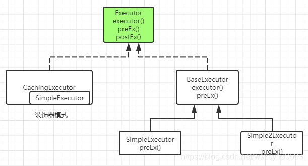

# 1 Mybatis 工作流程

首先在 MyBatis 启动的时候我们要去解析配置文件，包括全局配置文件和映射器配置文件，这里面包含了我们怎么控制 MyBatis 的行为，和我们要对数据库下达的指令， 也就是我们的 SQL 信息。我们会把它们解析成一个 Configuration 对象。 

接下来就是我们操作数据库的接口，它在应用程序和数据库中间，代表我们跟数据库之间的一次连接：这个就是 SqlSession 对象。 

我们要获得一个会话，必须有一个会话工厂 SqlSessionFactory 。SqlSessionFactory 里面又必须包含我们的所有的配置信息，所以我们会通过一个 Builder 来创建工厂类。 

我们知道，MyBatis 是对 JDBC 的封装，也就是意味着底层一定会出现 JDBC 的一 些核心对象，比如执行 SQL 的 Statement，结果集 ResultSet。在 Mybatis 里面， SqlSession 只是提供给应用的一个接口，还不是 SQL 的真正的执行对象。 

SqlSession 持有了一个 Executor 对象，用来封装对数据库的操作。

在执行器 Executor 执行 query 或者 update 操作的时候我们创建一系列的对象， 来处理参数、执行 SQL、处理结果集，这里我们把它简化成一个对象：StatementHandler， 在阅读源码的时候我们再去了解还有什么其他的对象。 

这个就是 MyBatis 主要的工作流程，如图：


# 2 MyBatis 架构分层与模块划分

在 MyBatis 的主要工作流程里面，不同的功能是由很多不同的类协作完成的，它们 分布在 MyBatis jar 包的不同的 package 里面。 

我们来看一下 MyBatis 的 jar 包（基于 3.4.0）， jar 包结构是这样的（21 个包）：


大概有 300 多个类，这样看起来不够清楚，不知道什么类在什么环节工作，属于什么层次。 

跟 Spring 一样，MyBatis 按照功能职责的不同，所有的 package 可以分成不同的 工作层次。 

我们可以把 MyBatis 的工作流程类比成餐厅的服务流程。 第一个是跟客户打交道的服务员，它是用来接收程序的工作指令的，我们把它叫做`接口层`。 

第二个是后台的厨师，他们根据客户的点菜单，把原材料加工成成品，然后传到窗口。这一层是真正去操作数据的，我们把它叫做`核心层`。 

最后就是餐厅也需要有人做后勤（比如清洁、采购、财务），来支持厨师的工作和整个餐厅的运营。我们把它叫做`基础层`。 

来看一下这张图，我们根据刚才的分层，和大体的执行流程，做了这么一个总结。 当然，从不同的角度来描述，架构图的划分有所区别，这张图画起来也有很多形式。我们先从总体上建立一个印象。每一层的主要对象和主要的功能我们也给大家分析一下：


## 2.1 接口层

首先接口层是我们打交道最多的。核心对象是 SqlSession，它是上层应用和 MyBatis 打交道的桥梁，SqlSession 上定义了非常多的对数据库的操作方法。接口层在接收到调 用请求的时候，会调用核心处理层的相应模块来完成具体的数据库操作。 

## 2.2 核心处理层 

接下来是核心处理层。既然叫核心处理层，也就是跟数据库操作相关的动作都是在这一层完成的。

 核心处理层主要做了这几件事： 

1. 把接口中传入的参数解析并且映射成 JDBC 类型； 
2. 解析 xml 文件中的 SQL 语句，包括插入参数，和动态 SQL 的生成； 
3. 执行 SQL 语句； 
4. 处理结果集，并映射成 Java 对象。 

插件也属于核心层，这是由它的工作方式和拦截的对象决定的。 

## 2.3 基础支持层 

最后一个就是基础支持层。基础支持层主要是一些抽取出来的通用的功能（实现复 用），用来支持核心处理层的功能。比如数据源、缓存、日志、xml 解析、反射、IO、 事务等等这些功能。 这个就是 MyBatis 的主要工作流程和架构分层。接下来我们来学习一下基础层里面 的一个主要模块，缓存。我们一起来了解一下 MyBatis 一级缓存和二级缓存的区别，和 它们的工作方式，以及使用过程里面有什么注意事项。

# 3 MyBatis 缓存详解

## 3.1 cache 缓存

缓存是一般的 ORM 框架都会提供的功能，目的就是提升查询的效率和减少数据库的 压力。跟 Hibernate 一样，MyBatis 也有一级缓存和二级缓存，并且预留了集成第三方缓存的接口。

## 3.2 缓存体系结构

MyBatis 跟缓存相关的类都在 cache 包里面，其中有一个 Cache 接口，只有一个默认的实现类 PerpetualCache，它是用 HashMap 实现的。

除此之外，还有很多的装饰器，通过这些装饰器可以额外实现很多的功能：回收策略、日志记录、定时刷新等等。

> // 煎饼加鸡蛋加香肠 
>
> 装饰者模式（Decorator Pattern）是指在不改变原有对象的基础之上，将功能附加到对象上，提供了比继承更有弹 性的替代方案（扩展原有对象的功能）。


但是无论怎么装饰，经过多少层装饰，最后使用的还是基本的实现类（默认 PerpetualCache）。


所有的缓存实现类总体上可分为三类：基本缓存、淘汰算法缓存、装饰器缓存。

| 缓存实现类          | 描述             | 作用                                                         | 装饰条件                                            |
| ------------------- | ---------------- | ------------------------------------------------------------ | --------------------------------------------------- |
| 基本缓存            | 缓存基本实现类   | 默认是 PerpetualCache，也可以自定义比如 RedisCache、EhCache 等，具备基本功能的缓存类 | 无                                                  |
| LruCache            | LRU策略的缓存    | 当缓存到达上限时候，删除最近最少使用的缓存 （Least Recently Use） | eviction="LRU"（默 认）                             |
| FifoCache           | FIFO 策略的缓存  | 当缓存到达上限时候，删除最先入队的缓存                       | eviction="FIFO"                                     |
| SoftCache WeakCache | 带清理策略的缓存 | 通过 JVM 的软引用和弱引用来实现缓存，当 JVM 内存不足时，会自动清理掉这些缓存，基于 SoftReference 和 WeakReference | eviction="SOFT" eviction="WEAK"                     |
| LoggingCache        | 带日志功能的缓存 | 比如：输出缓存命中率                                         | 基本                                                |
| SynchronizedCache   | 同步缓存         | 基于 synchronized 关键字实现，解决并发问题                   | 基本                                                |
| BlockingCache       | 阻塞缓存         | 通过在 get/put 方式中加锁，保证只有一个线程操 作缓存，基于 Java 重入锁实现 | blocking=true                                       |
| SerializedCache     | 支持序列化的缓存 | 将对象序列化以后存到缓存中，取出时反序列化                   | readOnly=false（默 认）                             |
| ScheduledCache      | 定时调度的缓存   | 在进行 get/put/remove/getSize 等操作前，判断 缓存时间是否超过了设置的最长缓存时间（默认是 一小时），如果是则清空缓存--即每隔一段时间清 空一次缓存 | flushInterval 不为空                                |
| TransactionalCache  | 事务缓存         | 在二级缓存中使用，可一次存入多个缓存，移除多 个缓存          | 在 TransactionalCach eManager 中用 Map 维护对应关系 |

思考：缓存对象在什么时候创建？什么情况下被装饰？ 

我们要弄清楚这个问题，就必须要知道 MyBatis 的一级缓存和二级缓存的工作位置 和工作方式的区别。

## 3.3 一级缓存

一级缓存也叫本地缓存，MyBatis 的一级缓存是在会话（SqlSession）层面进行缓存的。MyBatis 的一级缓存是默认开启的，不需要任何的配置。 

首先我们必须去弄清楚一个问题，在 MyBatis 执行的流程里面，涉及到这么多的对 象，那么缓存 PerpetualCache 应该放在哪个对象里面去维护？如果要在同一个会话里面 共享一级缓存，这个对象肯定是在 SqlSession 里面创建的，作为 SqlSession 的一个属性。 

DefaultSqlSession 里面只有两个属性，Configuration 是全局的，所以缓存只可能 放在 Executor 里面维护——SimpleExecutor/ReuseExecutor/BatchExecutor 的父类 BaseExecutor 的构造函数中持有了 PerpetualCache。 

在同一个会话里面，多次执行相同的 SQL 语句，会直接从内存取到缓存的结果，不会再发送 SQL 到数据库。但是不同的会话里面，即使执行的 SQL 一模一样（通过一个 Mapper 的同一个方法的相同参数调用），也不能使用到一级缓存。

```java
public abstract class BaseExecutor implements Executor {
  ...
  protected PerpetualCache localCache;
  ...
  public <E> List<E> query(MappedStatement ms, Object parameter, RowBounds rowBounds, ResultHandler resultHandler, CacheKey key, BoundSql boundSql) throws SQLException {
  ...
  try {
    queryStack++;
    list = resultHandler == null ? (List<E>) localCache.getObject(key) : null;
    if (list != null) {
      handleLocallyCachedOutputParameters(ms, key, parameter, boundSql);
    } else {
      list = queryFromDatabase(ms, parameter, rowBounds, resultHandler, key, boundSql);
    }
  } finally {
    queryStack--;
  }
  ...
  }
  private <E> List<E> queryFromDatabase(MappedStatement ms, Object parameter, RowBounds rowBounds, ResultHandler resultHandler, CacheKey key, BoundSql boundSql) throws SQLException {
  List<E> list;
  localCache.putObject(key, EXECUTION_PLACEHOLDER);
  try {
    list = doQuery(ms, parameter, rowBounds, resultHandler, boundSql);
  } finally {
    localCache.removeObject(key);
  }
  localCache.putObject(key, list);
  if (ms.getStatementType() == StatementType.CALLABLE) {
    localOutputParameterCache.putObject(key, parameter);
  }
  return list;
}
}
```


### 3.3.1 一级缓存验证

演示一级缓存需要先关闭二级缓存， localCacheScope 设置为 SESSION。

判断是否命中缓存：如果再次发送 SQL 到数据库执行，说明没有命中缓存；如果直接打印对象，说明是从内存缓存中取到了结果。 

1、在同一个 session 中共享

```java
UserMapper userMapper = sqlSession.getMapper(UserMapper.class);
System.out.println(userMapper.selectAll());
System.out.println(userMapper.selectAll());
```

2、不同 session 不能共享

```java
UserMapper userMapper = sqlSession.getMapper(UserMapper.class);
UserMapper userMapper1 = sqlSession1.getMapper(UserMapper.class);
System.out.println(userMapper.selectAll());
System.out.println(userMapper1.selectAll());
```

PS：一级缓存在 BaseExecutor 的 query()——queryFromDatabase()中存入。在 queryFromDatabase()之前会 get()。

3、同一个会话中，update（包括 delete,insert）会导致一级缓存被清空

```java
UserMapper userMapper = sqlSession.getMapper(UserMapper.class);
System.out.println(userMapper.selectAll());
User user = new User();
user.setName("Cache");
userMapper.insertUser(user);
sqlSession.commit();
System.out.println(userMapper.selectAll());
sqlSession.close();
```

一级缓存是在 BaseExecutor 中的 update()方法中调用 clearLocalCache()清空的 （无条件），query 中会判断。

4、其他会话更新了数据，导致读取到脏数据（一级缓存不能跨会话共享）

```java
UserMapper userMapper = sqlSession.getMapper(UserMapper.class);
System.out.println(userMapper.selectAll());
// sqlSession1 更新了数据，sqlSession1 的一级缓存更新
UserMapper userMapper1 = sqlSession1.getMapper(UserMapper.class);
User user = new User();
user.setName("Cache");
userMapper1.insertUser(user);
sqlSession1.commit();
// sqlSession 读取到脏数据，因为一级缓存不能跨会话共享
System.out.println(userMapper.selectAll());
sqlSession.close();
sqlSession1.close();
```

### 3.3.2 一级缓存的不足

> 为什么要一级缓存？
>
> 减少对数据库的压力 

使用一级缓存的时候，因为缓存不能跨会话共享，不同的会话之间对于相同的数据 可能有不一样的缓存。在有多个会话或者分布式环境下，会存在脏数据的问题。如果要 解决这个问题，就要用到二级缓存。

每次查询spring会重新创建SqlSession，所以一级缓存是不生效的。

【思考】一级缓存怎么命中？CacheKey 怎么构成？ 

【思考】一级缓存是默认开启的，怎么关闭一级缓存？

## 3.4 二级缓存

二级缓存是用来解决一级缓存不能跨会话共享的问题的，范围是 namespace 级别的，可以被多个 SqlSession 共享（只要是同一个接口里面的相同方法，都可以共享），生命周期和应用同步。 

思考一个问题：如果开启了二级缓存，二级缓存应该是工作在一级缓存之前，还是在一级缓存之后呢？二级缓存是在哪里维护的呢？ 

作为一个作用范围更广的缓存，它肯定是在 SqlSession 的外层，否则不可能被多个 SqlSession 共享。而一级缓存是在 SqlSession 内部的，所以第一个问题，肯定是工作`在一级缓存之前`，也就是只有取不到二级缓存的情况下才到一个会话中去取一级缓存。 

第二个问题，二级缓存放在哪个对象中维护呢？ 要跨会话共享的话，SqlSession 本身和它里面的 BaseExecutor 已经满足不了需求了，那我们应该在 BaseExecutor 之外创建一个对象。 

实际上 MyBatis 用了一个`装饰器的类`来维护，就是 `CachingExecutor`。如果启用了二级缓存，MyBatis 在创建 Executor 对象的时候会对 Executor 进行装饰。 CachingExecutor 对于查询请求，会判断二级缓存是否有缓存结果，如果有就直接返回，如果没有委派交给真正的查询器 Executor 实现类，比如 SimpleExecutor 来执行查询，再走到一级缓存的流程。最后会把结果缓存起来，并且返回给用户。


一级缓存是默认开启的，那二级缓存怎么开启呢？

### 3.4.1 开启二级缓存的方法

1. 设置mybatis-config.xml

   只要没有显式地设置 cacheEnabled=false，都会用 CachingExecutor 装饰基本的执行器。

```java
<settings>
	<!-- 全局映射器启用缓存 -->
	<setting name="cacheEnabled" value="true" />
</settings>
```

2. 为 Mapper.xml 添加cache支持

```xml
<!-- 声明这个 namespace 使用二级缓存 -->
<cache type="org.apache.ibatis.cache.impl.PerpetualCache"
	size="1024" <!-- 最多缓存对象个数，默认 1024-->
	eviction="LRU" <!-- 回收策略-->
	flushInterval="120000" <!-- 自动刷新时间 ms，未配置时只有调用时刷新-->
	readOnly="false"/><!-- 默认是 false（安全），改为 true 可读写时，对象必须支持序列化 -->
```

cache 属性详解：

| 属性          | 含义                                   | 取值                                                         |
| ------------- | -------------------------------------- | ------------------------------------------------------------ |
| type          | 缓存实现类                             | 需要实现 Cache 接口，默认是 PerpetualCache                   |
| size          | 最多缓存对象个数                       | 默认 1024                                                    |
| eviction      | 回收策略（缓存淘汰算法）               | LRU – 最近最少使用的：移除最长时间不被使用的对象（默认） <br>FIFO – 先进先出：按对象进入缓存的顺序来移除它们 <br>SOFT – 软引用：移除基于垃圾回收器状态和软引用规则的对象<br>WEAK – 弱引用：更积极地移除基于垃圾收集器状态和弱引用规则的对象 |
| flushInterval | 定时自动清空缓存间隔                   | 自动刷新时间，单位 ms，未配置时只有调用时刷新                |
| readOnly      | 是否只读                               | true：只读缓存；会给所有调用者返回缓存对象的相同实例。<br>因此这些对象不能被修改。这提供了很重要的性能优势。<br> false：读写缓存；会返回缓存对象的拷贝（通过序列化），不会共享。<br>这会慢一些，但是安全，因此默认是 false。 改为 false 可读写时，对象必须支持序列化。 |
| blocking      | 是否使用可重入锁实现<br>缓存的并发控制 | true，会使用 BlockingCache 对 Cache 进行装饰<br>默认 false   |

Mapper.xml 配置了之后，select()会被缓存。update()、delete()、insert() 会刷新缓存。 

思考：如果 cacheEnabled=true，Mapper.xml 没有配置标签，还有二级缓存吗？ 还会出现 CachingExecutor 包装对象吗？

只要 cacheEnabled=true 基本执行器就会被装饰。有没有配置，决定了在启动的时候会不会创建这个 mapper 的 Cache 对象，最终会影响到 CachingExecutor query 方法里面的判断：

```java
public class CachingExecutor implements Executor {
  ...
  @Override
  public <E> List<E> query(MappedStatement ms, Object parameterObject, RowBounds rowBounds, ResultHandler resultHandler, CacheKey key, BoundSql boundSql)
      throws SQLException {
    Cache cache = ms.getCache();
    // 影响此处判断
    if (cache != null) {
      flushCacheIfRequired(ms);
      if (ms.isUseCache() && resultHandler == null) {
        ensureNoOutParams(ms, parameterObject, boundSql);
        @SuppressWarnings("unchecked")
        List<E> list = (List<E>) tcm.getObject(cache, key);
        if (list == null) {
          list = delegate.<E> query(ms, parameterObject, rowBounds, resultHandler, key, boundSql);
          tcm.putObject(cache, key, list); // issue #578 and #116
        }
        return list;
      }
    }
    return delegate.<E> query(ms, parameterObject, rowBounds, resultHandler, key, boundSql);
  }
}
```

如果某些查询方法对数据的实时性要求很高，不需要二级缓存，怎么办？ 

我们可以在单个 Statement ID 上显式关闭二级缓存（默认是 true）：

```xml
<select id="selectBlog" resultMap="BaseResultMap" useCache="false">
```

### 3.4.2 二级缓存验证

1、 事务不提交，二级缓存不存在

```java
UserMapper userMapper = sqlSession.getMapper(UserMapper.class);
System.out.println(userMapper.selectAll());
// 事务不提交的情况下，二级缓存不会写入
// sqlSession.commit();
UserMapper userMapper1 = sqlSession1.getMapper(UserMapper.class);
System.out.println(userMapper1.selectAll());
```

思考：为什么事务不提交，二级缓存不生效？ 

因为二级缓存使用 TransactionalCacheManager（TCM）来管理，最后又调用了 TransactionalCache 的getObject()、putObject和 commit()方法，TransactionalCache 里面又持有了真正的 Cache 对象，比如是经过层层装饰的 PerpetualCache。 

在 putObject 的时候，只是添加到了 entriesToAddOnCommit 里面，只有它的 commit()方法被调用的时候才会调用 flushPendingEntries()真正写入缓存。它就是在 DefaultSqlSession 调用 commit()的时候被调用的。

2、 使用不同的 session 和 mapper，验证二级缓存可以跨 session 存在（取消以上 commit()的注释 ）

3、 在其他的 session 中执行增删改操作，验证缓存会被刷新

```java
UserMapper userMapper1 = sqlSession1.getMapper(UserMapper.class);
User user = new User();
user.setName("A");
userMapper1.insertUser(user);
sqlSession1.commit();
// 执行了更新操作，二级缓存失效，再次发送 SQL 查询
UserMapper userMapper2 = sqlSession2.getMapper(UserMapper.class);
System.out.println(userMapper2.selectAll());
```

思考：为什么增删改操作会清空缓存？ 

在 CachingExecutor 的 update()方法里面会调用 flushCacheIfRequired(ms)， isFlushCacheRequired 就是从标签里面渠道的 flushCache 的值。而增删改操作的 flushCache 属性默认为 true。

### 3.4.3 什么时候开启二级缓存

一级缓存默认是打开的，二级缓存需要配置才可以开启。那么我们必须思考一个问题，在什么情况下才有必要去开启二级缓存？ 

1、因为所有的增删改都会刷新二级缓存，导致二级缓存失效，所以适合在查询为主的应用中使用，比如历史交易、历史订单的查询。否则缓存就失去了意义。 

2、如果多个 namespace 中有针对于同一个表的操作，比如 Blog 表，如果在一个 namespace 中刷新了缓存，另一个 namespace 中没有刷新，就会出现读到脏数据的情况。所以，推荐在一个 Mapper 里面只操作单表的情况使用。 

思考：如果要让多个 namespace 共享一个二级缓存，应该怎么做？ 

跨 namespace 的缓存共享的问题，可以使用来解决：

```xml
<cache-ref namespace="com.spring.demo.dao.DepartmentMapper" />
```

cache-ref 代表引用别的命名空间的 Cache 配置，两个命名空间的操作使用的是同一个 Cache。在关联的表比较少，或者按照业务可以对表进行分组的时候可以使用。 

注意：在这种情况下，多个 Mapper 的操作都会引起缓存刷新，缓存的意义已经不大了。

# 4 MyBatis 源码解读

分析源码，从编程式的 demo 入手。把文件读取成流的这一步我们就省略了。所以下面我们分成四步来分析。

第一步，我们通过建造者模式创建一个工厂类，配置文件的解析就是在这一步完成的，包括 mybatis-config.xml 和 Mapper 适配器文件。 

问题：解析的时候怎么解析的，做了什么，产生了什么对象，结果存放到了哪里。 解析的结果决定着我们后面有什么对象可以使用，和到哪里去取。 

第二步，通过 SqlSessionFactory 创建一个 SqlSession。 

问题：SqlSession 是用来操作数据库的，返回了什么实现类，除了 SqlSession，还创建了什么对象，创建了什么环境？ 

第三步，获得一个 Mapper 对象。 

问题：Mapper 是一个接口，没有实现类，是不能被实例化的，那获取到的这个 Mapper 对象是什么对象？为什么要从 SqlSession 里面去获取？为什么传进去一个接口，然后还要用接口类型来接收？ 

第四步，调用接口方法。 

问题：我们的接口没有创建实现类，为什么可以调用它的方法？那它调用的是什么方法？它又是根据什么找到我们要执行的 SQL 的？也就是接口方法怎么和 XML 映射器 里面的 StatementID 关联起来的？

此外，我们的方法参数是怎么转换成 SQL 参数的？获取到的结果集是怎么转换成对 象的？ 

接下来我们就会详细分析每一步的流程，包括里面有哪些核心的对象和关键的方法。

## 4.1 配置解析过程

首先我们要清楚的是配置解析的过程全部只解析了两种文件。一个是 mybatis-config.xml 全局配置文件。另外就是可能有很多个的 Mapper.xml 文件，也包括在 Mapper 接口类上面定义的注解。 

我们从 mybatis-config.xml 开始。在第一节课的时候我们已经分析了核心配置了， 大概明白了 MyBatis 有哪些配置项，和这些配置项的大致含义。这里我们再具体看一下这里面的标签都是怎么解析的，解析的时候做了什么。

```java
SqlSessionFactory sqlSessionFactory = new SqlSessionFactoryBuilder().build(inputStream);
```

首先我们 new 了一个 SqlSessionFactoryBuilder，非常明显的建造者模式，它里面定义了很多个 build 方法的重载，最终返回的是一个 SqlSessionFactory 对象（单例模式）。我们点进去 build 方法。 

这里面创建了一个 XMLConfigBuilder 对象（Configuration 对象也是这个时候创建的）。

### SqlSessionFactoryBuilder

```java
public SqlSessionFactory build(InputStream inputStream) {
    return build(inputStream, null, null);
}

public SqlSessionFactory build(InputStream inputStream, String environment, Properties properties) {
  try {
    XMLConfigBuilder parser = new XMLConfigBuilder(inputStream, environment, properties);
    return build(parser.parse());
  } catch (Exception e) {
    throw ExceptionFactory.wrapException("Error building SqlSession.", e);
  } finally {
    ErrorContext.instance().reset();
    try {
      inputStream.close();
    } catch (IOException e) {
      // Intentionally ignore. Prefer previous error.
    }
  }
}
```

### XMLConfigBuilder

XMLConfigBuilder 是抽象类 BaseBuilder 的一个子类，专门用来解析全局配置文件，针对不同的构建目标还有其他的一些子类，比如： 

XMLMapperBuilder：解析 Mapper 映射器 

XMLStatementBuilder：解析增删改查标签

根据我们解析的文件流，这里后面两个参数都是空的，创建了一个 parser。 

这里有两步，第一步是调用 parser 的 parse()方法，它会返回一个 Configuration 类。 

之前我们说过，也就是配置文件里面所有的信息都会放在 Configuration 里面。 Configuration 类里面有很多的属性，有很多是跟 config 里面的标签直接对应的。 

我们先看一下 parse()方法： 首先会检查是不是已经解析过，也就是说在应用的生命周期里面，config 配置文件只需要解析一次，生成的 Configuration 对象也会存在应用的整个生命周期中。接下来就是 parseConfiguration 方法：

```java
public Configuration parse() {
  if (parsed) {
    throw new BuilderException("Each XMLConfigBuilder can only be used once.");
  }
  parsed = true;
  parseConfiguration(parser.evalNode("/configuration"));
  return configuration;
}
private void parseConfiguration(XNode root) {
  try {
    Properties settings = settingsAsPropertiess(root.evalNode("settings"));
    //issue #117 read properties first
    propertiesElement(root.evalNode("properties"));
    loadCustomVfs(settings);
    typeAliasesElement(root.evalNode("typeAliases"));
    pluginElement(root.evalNode("plugins"));
    objectFactoryElement(root.evalNode("objectFactory"));
    objectWrapperFactoryElement(root.evalNode("objectWrapperFactory"));
    reflectionFactoryElement(root.evalNode("reflectionFactory"));
    settingsElement(settings);
    // read it after objectFactory and objectWrapperFactory issue #631
    environmentsElement(root.evalNode("environments"));
    databaseIdProviderElement(root.evalNode("databaseIdProvider"));
    typeHandlerElement(root.evalNode("typeHandlers"));
    mapperElement(root.evalNode("mappers"));
  } catch (Exception e) {
    throw new BuilderException("Error parsing SQL Mapper Configuration. Cause: " + e, e);
  }
}
```

这下面有十几个方法，对应着 config 文件里面的所有一级标签。 

问题：MyBatis 全局配置文件的顺序可以颠倒吗？

#### propertiesElement() 

第一个是解析标签，读取我们引入的外部配置文件。这里面又有两种 类型，一种是放在 resource 目录下的，是相对路径，一种是写的绝对路径的。解析的最 终结果就是我们会把所有的配置信息放到名为 defaults 的 Properties 对象里面，最后把 XPathParser 和 Configuration 的 Properties 属性都设置成我们填充后的 Properties 对象。

#### settingsAsProperties() 

第二个，我们把 settings 标签也解析成了一个 Properties 对象，对于settings 标签的子标签的处理在后面。 

在早期的版本里面解析和设置都是在后面一起的，这里先解析成 Properties 对象是因为下面的两个方法要用到。

#### loadCustomVfs(settings) 

loadCustomVfs 是获取 Vitual File System 的自定义实现类，比如我们要读取本地文件，或者 FTP 远程文件的时候，就可以用到自定义的 VFS 类。我们根据 settings 标签里面的 vfsImpl 标签，生成了一个抽象类 VFS 的子类，并且赋值到 Configuration 中。 

#### loadCustomLogImpl(settings) 

loadCustomLogImpl 是根据 logImpl 标签获取日志的实现类，我们可以用到很 多的日志的方案，包括 LOG4J，LOG4J2，SLF4J 等等。这里生成了一个 Log 接口的实 现类，并且赋值到 Configuration 中。

#### typeAliasesElement() 

接下来，我们解析 typeAliases 标签，我们在讲配置的时候也讲过，它有两种定义 方式，一种是直接定义一个类的别名，一种就是指定一个包，那么这个 package 下面所有的类的名字就会成为这个类全路径的别名。 

类的别名和类的关系，我们放在一个 TypeAliasRegistry 对象里面。

#### pluginElement()

接下来就是解析 plugins 标签，比如 Pagehelper 的翻页插件，或者我们自定义的 插件。plugins 标签里面只有 plugin 标签，标签里面只有 property 标签。 

标签解析完以后，会生成一个 Interceptor 对象，并且添加到 Configuration 的 InterceptorChain 属性里面，它是一个 List。 

#### objectFactoryElement()、objectWrapperFactoryElement()

接下来的两个标签是用来实例化对象用的，objectFactory 和 objectWrapperFactory 这两个标签，分别生成 ObjectFactory 、 ObjectWrapperFactory 对象，同样设置到 Configuration 的属性里面。 

#### reflectorFactoryElement()

解析 reflectorFactory 标签，生成 ReflectorFactory 对象（在官方 3.5.1 的 pdf 文 档里面没有找到这个配置）。 

#### settingsElement(settings)

这里就是对 settings 标签里面所有子标签的处理了，前面我们已经把子标签全部转换成了 Properties 对象，所以在这里处理 Properties 对象就可以了。 

二级标签里面有很多的配置，比如二级缓存，延迟加载，自动生成主键这些。需要 注意的是，我们之前提到的所有的默认值，都是在这里赋值的。如果说后面我们不知道这个属性的值是什么，也可以到这一步来确认一下。 

所有的值，都会赋值到 Configuration 的属性里面去。 

#### environmentsElement() 

这一步是解析 environments 标签。 

我们前面讲过，一个 environment 就是对应一个数据源，所以在这里我们会根据配置的 transactionManager 创建一个事务工厂，根据 dataSource 标签创建一个数据源，最后把这两个对象设置成 Environment 对象的属性，放到 Configuration 里面。 

回答了前面的问题：数据源工厂和数据源在哪里创建。 

先记下这个问题：数据源和事务工厂在哪里会用到？ 

#### databaseIdProviderElement() 

解析 databaseIdProvider 标签，生成 DatabaseIdProvider 对象（用来支持不同厂 商的数据库）。 

#### typeHandlerElement() 

跟 TypeAlias 一样，TypeHandler 有两种配置方式，一种是单独配置一个类，一种 是指定一个 package。最后我们得到的是 JavaType 和 JdbcType，以及用来做相互映射 的 TypeHandler 之间的映射关系。 

最后存放在 TypeHandlerRegistry 对象里面。 

问题：这种三个对象（Java 类型，JDBC 类型，Handler）的关系怎么映射？（Map 里面再放一个 Map）

#### mapperElement()

http://www.mybatis.org/mybatis-3/zh/configuration.html#mappers

1）判断 

最后就是标签的解析。 

| 扫描类型 | 含义     |
| -------- | -------- |
| resource | 相对路径 |
| url      | 绝对路径 |
| package  | 包       |
| class    | 单个接口 |

首先会判断是不是接口，只有接口才解析；然后判断是不是已经注册了，单个 Mapper 重复注册会抛出异常。

```java
private void mapperElement(XNode parent) throws Exception {
    if (parent != null) {
      for (XNode child : parent.getChildren()) {
        if ("package".equals(child.getName())) {
          String mapperPackage = child.getStringAttribute("name");
          configuration.addMappers(mapperPackage);
        } else {
          String resource = child.getStringAttribute("resource");
          String url = child.getStringAttribute("url");
          String mapperClass = child.getStringAttribute("class");
          if (resource != null && url == null && mapperClass == null) {
            ErrorContext.instance().resource(resource);
            InputStream inputStream = Resources.getResourceAsStream(resource);
            XMLMapperBuilder mapperParser = new XMLMapperBuilder(inputStream, configuration, resource, configuration.getSqlFragments());
            // XMLMapperBuilder.parse()方法，是对 Mapper 映射器的解析。里面有两个方法
            mapperParser.parse();
          } else if (resource == null && url != null && mapperClass == null) {
            ErrorContext.instance().resource(url);
            InputStream inputStream = Resources.getUrlAsStream(url);
            XMLMapperBuilder mapperParser = new XMLMapperBuilder(inputStream, configuration, url, configuration.getSqlFragments());
            mapperParser.parse();
          } else if (resource == null && url == null && mapperClass != null) {
            Class<?> mapperInterface = Resources.classForName(mapperClass);
            configuration.addMapper(mapperInterface);
          } else {
            throw new BuilderException("A mapper element may only specify a url, resource or class, but not more than one.");
          }
        }
      }
    }
  }
```

2）注册

无论是按 package 扫描，还是按接口扫描，最后都会调用到 MapperRegistry 的 addMapper()方法。

MapperRegistry 里面维护的其实是一个 Map 容器，存储接口和代理工厂的映射关系。 

问题：为什么要放一个代理工厂呢？代理工厂用来干什么？

```java
// XMLMapperBuilder.java
public void parse() {
  if (!configuration.isResourceLoaded(resource)) {
    // 解析所有的子标签，其中buildStatementFromContext()最终获得 MappedStatement 对象。
    configurationElement(parser.evalNode("/mapper"));
    configuration.addLoadedResource(resource);
    // 把 namespace（接口类型）和工厂类绑定起来
    bindMapperForNamespace();
  }
  parsePendingResultMaps();
  parsePendingChacheRefs();
  parsePendingStatements();
}
private void configurationElement(XNode context) {
    try {
      String namespace = context.getStringAttribute("namespace");
      if (namespace == null || namespace.equals("")) {
        throw new BuilderException("Mapper's namespace cannot be empty");
      }
      builderAssistant.setCurrentNamespace(namespace);
      cacheRefElement(context.evalNode("cache-ref"));
      cacheElement(context.evalNode("cache"));
      parameterMapElement(context.evalNodes("/mapper/parameterMap"));
      resultMapElements(context.evalNodes("/mapper/resultMap"));
      sqlElement(context.evalNodes("/mapper/sql"));
      buildStatementFromContext(context.evalNodes("select|insert|update|delete"));
    } catch (Exception e) {
      throw new BuilderException("Error parsing Mapper XML. Cause: " + e, e);
    }
  }
private void bindMapperForNamespace() {
  String namespace = builderAssistant.getCurrentNamespace();
  if (namespace != null) {
    Class<?> boundType = null;
    try {
      boundType = Resources.classForName(namespace);
    } catch (ClassNotFoundException e) {
      //ignore, bound type is not required
    }
    if (boundType != null) {
      if (!configuration.hasMapper(boundType)) {
        configuration.addLoadedResource("namespace:" + namespace);
        configuration.addMapper(boundType);
      }
    }
  }
}
// Configuration.java
public <T> void addMapper(Class<T> type) {
  mapperRegistry.addMapper(type);
}
// MapperRegistry.java
private final Map<Class<?>, MapperProxyFactory<?>> knownMappers = new HashMap<Class<?>, MapperProxyFactory<?>>();
public <T> void addMapper(Class<T> type) {
  if (type.isInterface()) {
    if (hasMapper(type)) {
      throw new BindingException("Type " + type + " is already known to the MapperRegistry.");
    }
    boolean loadCompleted = false;
    try {
      knownMappers.put(type, new MapperProxyFactory<T>(type));
      // It's important that the type is added before the parser is run
      // otherwise the binding may automatically be attempted by the
      // mapper parser. If the type is already known, it won't try.
      MapperAnnotationBuilder parser = new MapperAnnotationBuilder(config, type);
      parser.parse();
      loadCompleted = true;
    } finally {
      if (!loadCompleted) {
        knownMappers.remove(type);
      }
    }
  }
}
```

解析mapper标签,有两种形式，分别是扫描 package 和 mapper 标签、只能使用一种方式加载mapper

```xml
<mappers>
    <!-- resource,class,url也只能使用一种 -->
	<mapper resource="mapper/UserMapper.xml" class="" url=""/>
</mappers>
<mappers>
	<package name="com.mybatis.dao.mapper"/>
</mappers>
```

3）处理注解

除了映射器文件，在这里也会去解析 Mapper 接口方法上的注解。在 addMapper() 方法里面创建了一个 MapperAnnotationBuilder，我们点进去看一下 parse()方法。

parseCache() 和 parseCacheRef() 方法其实是对 @CacheNamespace 和 @CacheNamespaceRef 这两个注解的处理。

parseStatement()方法里面的各种 getAnnotation()，都是对注解的解析，比如 @Options，@SelectKey，@ResultMap 等等。 

最后同样会解析成 MappedStatement 对象，也就是说在 XML 中配置，和使用注 解配置，最后起到一样的效果。

```java
public void parse() {
  String resource = type.toString();
  if (!configuration.isResourceLoaded(resource)) {
    loadXmlResource();
    configuration.addLoadedResource(resource);
    assistant.setCurrentNamespace(type.getName());
    parseCache();
    parseCacheRef();
    Method[] methods = type.getMethods();
    for (Method method : methods) {
      try {
        // issue #237
        if (!method.isBridge()) {
          parseStatement(method);
        }
      } catch (IncompleteElementException e) {
        configuration.addIncompleteMethod(new MethodResolver(this, method));
      }
    }
  }
  parsePendingMethods();
}
```

4）收尾

如果注册没有完成，还要从 Map 里面 remove 掉。

```java
 // MapperRegistry.java 
 finally { if (!loadCompleted) { knownMappers.remove(type); } 
```

最后，MapperRegistry 也会放到 Configuration 里面去。 

第二步是调用另一个 build()方法，返回 DefaultSqlSessionFactory。

在这一步，我们主要完成了 config 配置文件、Mapper 文件、Mapper 接口上的注 解的解析。 

我们得到了一个最重要的对象 Configuration，这里面存放了全部的配置信息，它在属性里面还有各种各样的容器。 

最后，返回了一个 DefaultSqlSessionFactory，里面持有了 Configuration 的实例。


## 4.2 会话创建过程

这是第二步，我们跟数据库的每一次连接，都需要创建一个会话，我们用 openSession()方法来创建。 

DefaultSqlSessionFactory —— openSessionFromDataSource() 

这个会话里面，需要包含一个 Executor 用来执行 SQL。Executor 又要指定事务类 型和执行器的类型。 

所以我们会先从 Configuration 里面拿到 Enviroment，Enviroment 里面就有事务 工厂。

```java
@Override
  public SqlSession openSession() {
    return openSessionFromDataSource(configuration.getDefaultExecutorType(), null, false);
  }
  private SqlSession openSessionFromDataSource(ExecutorType execType, TransactionIsolationLevel level, boolean autoCommit) {
    Transaction tx = null;
    try {
      final Environment environment = configuration.getEnvironment();
      final TransactionFactory transactionFactory = getTransactionFactoryFromEnvironment(environment);
      tx = transactionFactory.newTransaction(environment.getDataSource(), level, autoCommit);
      final Executor executor = configuration.newExecutor(tx, execType);
      return new DefaultSqlSession(configuration, executor, autoCommit);
    } catch (Exception e) {
      closeTransaction(tx); // may have fetched a connection so lets call close()
      throw ExceptionFactory.wrapException("Error opening session.  Cause: " + e, e);
    } finally {
      ErrorContext.instance().reset();
    }
  }
```

1、创建 Transaction

| 属性    | 产生工厂类                | 产生事务           |
| ------- | ------------------------- | ------------------ |
| JDBC    | JdbcTransactionFactory    | JdbcTransaction    |
| MANAGED | ManagedTransactionFactory | ManagedTransaction |

如果配置的是 JDBC，则会使用 Connection 对象的 commit()、rollback()、close() 管理事务。 

如果配置成 MANAGED，会把事务交给容器来管理，比如 JBOSS，Weblogic。

因为跑的是本地程序，如果配置成 MANAGE 不会有任何事务。 

如果是 Spring + MyBatis ， 则没有必要配置，因为我们会直接在 applicationContext.xml 里面配置数据源和事务管理器，覆盖 MyBatis 的配置。

2、创建 Executor 

我们知道，Executor 的基本类型有三种：SIMPLE、BATCH、REUSE，默认是 SIMPLE （settingsElement()读取默认值），他们都继承了抽象类 BaseExecutor。 

为什么要让抽象类实现接口，然后让具体实现类继承抽象类？（模板方法模式）


问题：三种类型的区别（通过 update()方法对比）？ 

`SimpleExecutor` 每执行一次 update 或 select，就开启一个 Statement 对象，用完立刻关闭 Statement 对象。 

`ReuseExecutor` 执行 update 或 select，以 sql 作为 key 查找 Statement 对象， 存在就使用，不存在就创建，用完后，不关闭 Statement 对象，而是放置于 Map 内， 供下一次使用。简言之，就是重复使用 Statement 对象。 

`BatchExecutor` 执行 update（没有 select，JDBC 批处理不支持 select），将所有 sql 都添加到批处理中（addBatch()），等待统一执行（executeBatch()），它缓存了多个 Statement 对象，每个 Statement 对象都是 addBatch()完毕后，等待逐一执行 executeBatch()批处理。与 JDBC 批处理相同。

如果配置了 cacheEnabled=ture，会用装饰器模式对 executor 进行包装：new CachingExecutor(executor)。 

包装完毕后，会执行: 

```java
executor = (Executor) interceptorChain.pluginAll(executor); 
```

此处会对 executor 进行包装

回答了前面的问题：数据源和事务工厂在哪里会用到——创建执行器的时候。

最终返回 DefaultSqlSession，属性包括 Configuration、Executor 对象。 

总结：创建会话的过程，我们获得了一个 DefaultSqlSession，里面包含了一个 Executor，它是 SQL 的执行者。


## 4.3 获得 Mapper 对象

现在我们已经有一个 DefaultSqlSession 了，必须找到 Mapper.xml 里面定义的 Statement ID，才能执行对应的 SQL 语句。

找到 Statement ID 有两种方式：一种是直接调用 session 的方法，在参数里面传入 Statement ID，这种方式属于硬编码，我们没办法知道有多少处调用，修改起来也很麻烦。 

另一个问题是如果参数传入错误，在编译阶段也是不会报错的，不利于预先发现问题。

```java
Blog blog = (Blog) session.selectOne("com.spring.mapper.BlogMapper.selectBlogById", 1);
```

所以在 MyBatis 后期的版本提供了第二种方式，就是定义一个接口，然后再调用 Mapper 接口的方法。

由于我们的接口名称跟 Mapper.xml 的 namespace 是对应的，接口的方法跟 statement ID 也都是对应的，所以根据方法就能找到对应的要执行的 SQL。

```java
UserMapper userMapper = sqlSession.getMapper(UserMapper.class);
```

在这里我们主要研究一下 Mapper 对象是怎么获得的，它的本质是什么。 

DefaultSqlSession 的 getMapper()方法，调用了 Configuration 的 getMapper() 方法。

```java
// DefaultSqlSession.java
public <T> T getMapper(Class<T> type) {
  return configuration.<T>getMapper(type, this);
}
// Configuration
public <T> T getMapper(Class<T> type, SqlSession sqlSession) {
  return mapperRegistry.getMapper(type, sqlSession);
}
//  MapperRegistry.java
@SuppressWarnings("unchecked")
public <T> T getMapper(Class<T> type, SqlSession sqlSession) {
    final MapperProxyFactory<T> mapperProxyFactory = (MapperProxyFactory<T>) knownMappers.get(type);
    if (mapperProxyFactory == null) {
      throw new BindingException("Type " + type + " is not known to the MapperRegistry.");
    }
    try {
      // 在解析 mapper 标签和 Mapper.xml 的时候已经把接口类型和类型对应的 MapperProxyFactory 放到了一个 Map 中。获取 Mapper 代理对象，实际上是从 Map 中获取对应的工厂类后，调用以下方法创建对象
      return mapperProxyFactory.newInstance(sqlSession);
    } catch (Exception e) {
      throw new BindingException("Error getting mapper instance. Cause: " + e, e);
    }
}

public class MapperProxyFactory<T> {
  private final Class<T> mapperInterface;
  private final Map<Method, MapperMethod> methodCache = new ConcurrentHashMap<Method, MapperMethod>();
  ...
  protected T newInstance(MapperProxy<T> mapperProxy) {
    // 最终通过代理模式返回代理对象
    return (T) Proxy.newProxyInstance(mapperInterface.getClassLoader(), new Class[] { mapperInterface }, mapperProxy);
  }
  public T newInstance(SqlSession sqlSession) {
    final MapperProxy<T> mapperProxy = new MapperProxy<T>(sqlSession, mapperInterface, methodCache);
    return newInstance(mapperProxy);
  }
}
```

回答了前面的问题：为什么要保存一个工厂类，它是用来创建代理对象的。 

JDK 动态代理和 MyBatis 用到的 JDK 动态代理有什么区别？

JDK 动态代理代理，在实现了 InvocationHandler 的代理类里面，需要传入一个被代理对象的实现类。


不需要实现类的原因：我们只需要根据接口类型+方法的名称，就可以找到 Statement ID 了，而唯一要做的一件事情也是这件，所以不需要实现类。在 MapperProxy 里面直接执行逻辑（也就是执行 SQL）就可以。

总结： 获得 Mapper 对象的过程，实质上是获取了一个 MapperProxy 的代理对象。 

MapperProxy 中有 sqlSession、mapperInterface、methodCache。


先记下这个问题：在代理类中为什么要持有一个 SqlSession？


## 4.4 执行 SQL

由于所有的 Mapper 都是 MapperProxy 代理对象，所以任意的方法都是执行 MapperProxy 的 invoke()方法。 

问题 1：我们引入 MapperProxy 为了解决什么问题？

硬编码和编译时检查问题。它需要做的事情是：根据方法查找 Statement ID 的问题。 

问题 2：这里没有实现类，进入到 invoke 方法的时候做了什么事情？它是怎么找到我们要执行的 SQL 的？ 

我们看一下 invoke()方法：

1、MapperProxy.invoke()

```java
public Object invoke(Object proxy, Method method, Object[] args) throws Throwable {
  try {
    // 首先判断是否需要去执行 SQL，还是直接执行方法
    if (Object.class.equals(method.getDeclaringClass())) {
      return method.invoke(this, args);
    } else if (isDefaultMethod(method)) {
      // Object 本身的方法和 Java 8 中接口的默认方法不需要去执行 SQL
      return invokeDefaultMethod(proxy, method, args);
    }
  } catch (Throwable t) {
    throw ExceptionUtil.unwrapThrowable(t);
  }
  // 获取缓存，保存了方法签名和接口方法的关系
  final MapperMethod mapperMethod = cachedMapperMethod(method);
  // 接下来又调用了 mapperMethod 的 execute 方法
  return mapperMethod.execute(sqlSession, args);
}
private MapperMethod cachedMapperMethod(Method method) {
  // Map 的 computeIfAbsent()方法：只有 key 不存在或者 value 为 null 的时候才调用 mappingFunction()。
  return methodCache.computeIfAbsent(method, k -> new MapperMethod(mapperInterface, method, sqlSession.getConfiguration()));
}
```

2、MapperMethod.execute()


MapperMethod 里面主要有两个属性 ，一个是 SqlCommand ，一个是 MethodSignature，这两个都是 MapperMethod 的内部类。 

另外定义了多个 execute()方法。 

在这一步，根据不同的 type 和返回类型： 

调用 convertArgsToSqlCommandParam()将参数转换为 SQL 的参数。 

调用 sqlSession 的 insert()、update()、delete()、selectOne ()方法，我们以查询为例，会走到 selectOne()方法。

```java
// MapperMethod.java
public Object execute(SqlSession sqlSession, Object[] args) {
  Object result;
  switch (command.getType()) {
    case INSERT: {
      Object param = method.convertArgsToSqlCommandParam(args);
      result = rowCountResult(sqlSession.insert(command.getName(), param));
      break;
    }
    case UPDATE: {
      Object param = method.convertArgsToSqlCommandParam(args);
      result = rowCountResult(sqlSession.update(command.getName(), param));
      break;
    }
    case DELETE: {
      Object param = method.convertArgsToSqlCommandParam(args);
      result = rowCountResult(sqlSession.delete(command.getName(), param));
      break;
    }
    case SELECT:
      if (method.returnsVoid() && method.hasResultHandler()) {
        executeWithResultHandler(sqlSession, args);
        result = null;
      } else if (method.returnsMany()) {
        result = executeForMany(sqlSession, args);
      } else if (method.returnsMap()) {
        result = executeForMap(sqlSession, args);
      } else if (method.returnsCursor()) {
        result = executeForCursor(sqlSession, args);
      } else {
        Object param = method.convertArgsToSqlCommandParam(args);
        result = sqlSession.selectOne(command.getName(), param);
        if (method.returnsOptional()
            && (result == null || !method.getReturnType().equals(result.getClass()))) {
          result = Optional.ofNullable(result);
        }
      }
      break;
    case FLUSH:
      result = sqlSession.flushStatements();
      break;
    default:
      throw new BindingException("Unknown execution method for: " + command.getName());
  }
  if (result == null && method.getReturnType().isPrimitive() && !method.returnsVoid()) {
    throw new BindingException("Mapper method '" + command.getName()
        + " attempted to return null from a method with a primitive return type (" + method.getReturnType() + ").");
  }
  return result;
}
```

3、DefaultSqlSession.selectOne()

```java
// DefaultSqlSession.java
public <T> T selectOne(String statement, Object parameter) {
  // Popular vote was to return null on 0 results and throw exception on too many.
  List<T> list = this.selectList(statement, parameter);
  if (list.size() == 1) {
    return list.get(0);
  } else if (list.size() > 1) {
    throw new TooManyResultsException("Expected one result (or null) to be returned by selectOne(), but found: " + list.size());
  } else {
    return null;
  }
}
```

selectOne()最终也是调用了 selectList()。 

在 SelectList()中，我们先根据 command name（Statement ID）从 Configuration 中拿到 MappedStatement，这个 ms 上面有我们在 xml 中配置的所有属性，包括 id、 statementType、sqlSource、useCache、入参、出参等等。

```java
public <E> List<E> selectList(String statement, Object parameter, RowBounds rowBounds) {
  try {
    MappedStatement ms = configuration.getMappedStatement(statement);
    return executor.query(ms, wrapCollection(parameter), rowBounds, Executor.NO_RESULT_HANDLER);
  } catch (Exception e) {
    throw ExceptionFactory.wrapException("Error querying database.  Cause: " + e, e);
  } finally {
    ErrorContext.instance().reset();
  }
}
```


然后执行了 Executor 的 query()方法。 

前面我们说到了 Executor 有三种基本类型，同学们还记得是哪几种么？ 

SIMPLE/REUSE/BATCH，还有一种包装类型，CachingExecutor。 

那么在这里到底会选择哪一种执行器呢？ 

我们要回过头去看看 DefaultSqlSession 在初始化的时候是怎么赋值的，这个就是我们的会话创建过程。 

如果启用了二级缓存，就会先调用 CachingExecutor 的 query()方法，里面有缓存相关的操作，然后才是再调用基本类型的执行器，比如默认的 SimpleExecutor。

在没有开启二级缓存的情况下，先会走到 BaseExecutor 的 query()方法（否则会先走到 CachingExecutor）。

4、BaseExecutor.query()

1）创建 CacheKey 

从 Configuration 中获取 MappedStatement， 然后从 BoundSql 中获取 SQL 信息，创建 CacheKey。

这个 CacheKey 就是缓存的 Key。 

然后再调用另一个 query()方法。 

```java
// BaseExecutor.java
public <E> List<E> query(MappedStatement ms, Object parameterObject, RowBounds rowBounds, ResultHandler resultHandler) throws SQLException {
  BoundSql boundSql = ms.getBoundSql(parameterObject);
  CacheKey key = createCacheKey(ms, parameterObject, rowBounds, boundSql);
  return query(ms, parameterObject, rowBounds, resultHandler, key, boundSql);
}
public CacheKey createCacheKey(MappedStatement ms, Object parameterObject, RowBounds rowBounds, BoundSql boundSql) {
  if (closed) {
    throw new ExecutorException("Executor was closed.");
  }
  CacheKey cacheKey = new CacheKey();
  cacheKey.update(ms.getId());
  cacheKey.update(rowBounds.getOffset());
  cacheKey.update(rowBounds.getLimit());
  cacheKey.update(boundSql.getSql());
  List<ParameterMapping> parameterMappings = boundSql.getParameterMappings();
  TypeHandlerRegistry typeHandlerRegistry = ms.getConfiguration().getTypeHandlerRegistry();
  // mimic DefaultParameterHandler logic
  for (ParameterMapping parameterMapping : parameterMappings) {
    if (parameterMapping.getMode() != ParameterMode.OUT) {
      Object value;
      String propertyName = parameterMapping.getProperty();
      if (boundSql.hasAdditionalParameter(propertyName)) {
        value = boundSql.getAdditionalParameter(propertyName);
      } else if (parameterObject == null) {
        value = null;
      } else if (typeHandlerRegistry.hasTypeHandler(parameterObject.getClass())) {
        value = parameterObject;
      } else {
        MetaObject metaObject = configuration.newMetaObject(parameterObject);
        value = metaObject.getValue(propertyName);
      }
      cacheKey.update(value);
    }
  }
  if (configuration.getEnvironment() != null) {
    // issue #176
    cacheKey.update(configuration.getEnvironment().getId());
  }
  return cacheKey;
}
```

2）清空本地缓存

queryStack 用于记录查询栈，防止递归查询重复处理缓存。

 flushCache=true 的时候，会先清理本地缓存（一级缓存）：clearLocalCache(); 

如果没有缓存，会从数据库查询：queryFromDatabase() 

如果 LocalCacheScope == STATEMENT，会清理本地缓存。

```java
public <E> List<E> query(MappedStatement ms, Object parameter, RowBounds rowBounds, ResultHandler resultHandler, CacheKey key, BoundSql boundSql) throws SQLException {
  ErrorContext.instance().resource(ms.getResource()).activity("executing a query").object(ms.getId());
  if (closed) {
    throw new ExecutorException("Executor was closed.");
  }
  if (queryStack == 0 && ms.isFlushCacheRequired()) {
    clearLocalCache();
  }
  List<E> list;
  try {
    queryStack++;
    list = resultHandler == null ? (List<E>) localCache.getObject(key) : null;
    if (list != null) {
      handleLocallyCachedOutputParameters(ms, key, parameter, boundSql);
    } else {
      list = queryFromDatabase(ms, parameter, rowBounds, resultHandler, key, boundSql);
    }
  } finally {
    queryStack--;
  }
  if (queryStack == 0) {
    for (DeferredLoad deferredLoad : deferredLoads) {
      deferredLoad.load();
    }
    // issue #601
    deferredLoads.clear();
    if (configuration.getLocalCacheScope() == LocalCacheScope.STATEMENT) {
      // issue #482
      clearLocalCache();
    }
  }
  return list;
}
```

3）从数据库查询 

a) 缓存

先在缓存用占位符占位。执行查询后，移除占位符，放入数据。 

b) 查询

执行 Executor 的 doQuery()；默认是 SimpleExecutor。

```java
private <E> List<E> queryFromDatabase(MappedStatement ms, Object parameter, RowBounds rowBounds, ResultHandler resultHandler, CacheKey key, BoundSql boundSql) throws SQLException {
  List<E> list;
  localCache.putObject(key, EXECUTION_PLACEHOLDER);
  try {
    list = doQuery(ms, parameter, rowBounds, resultHandler, boundSql);
  } finally {
    localCache.removeObject(key);
  }
  localCache.putObject(key, list);
  if (ms.getStatementType() == StatementType.CALLABLE) {
    localOutputParameterCache.putObject(key, parameter);
  }
  return list;
}
```



5、SimpleExecutor.doQuery()

1）创建 StatementHandler

在 configuration.newStatementHandler()中，new 一个 StatementHandler，先得到 RoutingStatementHandler。 

RoutingStatementHandler 里面没有任何的实现，是用来创建基本的 StatementHandler 的。这里会根据 MappedStatement 里面的 statementType 决定 StatementHandler 的类型。默认是 PREPARED （ STATEMENT 、 PREPARED 、 CALLABLE）。

```java
public <E> List<E> doQuery(MappedStatement ms, Object parameter, RowBounds rowBounds, ResultHandler resultHandler, BoundSql boundSql) throws SQLException {
  Statement stmt = null;
  try {
    Configuration configuration = ms.getConfiguration();
    StatementHandler handler = configuration.newStatementHandler(wrapper, ms, parameter, rowBounds, resultHandler, boundSql);
    stmt = prepareStatement(handler, ms.getStatementLog());
    return handler.query(stmt, resultHandler);
  } finally {
    closeStatement(stmt);
  }
}
// Configuration.java
public StatementHandler newStatementHandler(Executor executor, MappedStatement mappedStatement, Object parameterObject, RowBounds rowBounds, ResultHandler resultHandler, BoundSql boundSql) {
  StatementHandler statementHandler = new RoutingStatementHandler(executor, mappedStatement, parameterObject, rowBounds, resultHandler, boundSql);
  statementHandler = (StatementHandler) interceptorChain.pluginAll(statementHandler);
  return statementHandler;
}
// RoutingStatementHandler.java
public RoutingStatementHandler(Executor executor, MappedStatement ms, Object parameter, RowBounds rowBounds, ResultHandler resultHandler, BoundSql boundSql) {
  switch (ms.getStatementType()) {
    case STATEMENT:
      delegate = new SimpleStatementHandler(executor, ms, parameter, rowBounds, resultHandler, boundSql);
      break;
    case PREPARED:
      delegate = new PreparedStatementHandler(executor, ms, parameter, rowBounds, resultHandler, boundSql);
      break;
    case CALLABLE:
      delegate = new CallableStatementHandler(executor, ms, parameter, rowBounds, resultHandler, boundSql);
      break;
    default:
      throw new ExecutorException("Unknown statement type: " + ms.getStatementType());
  }
}
```

StatementHandler 里面包含了处理参数的 ParameterHandler 和处理结果集的 ResultSetHandler。 

这两个对象都是在上面 new 的时候创建的。

```java
this.parameterHandler = configuration.newParameterHandler(mappedStatement, parameterObject, boundSql);
this.resultSetHandler = configuration.newResultSetHandler(executor, mappedStatement, rowBounds, parameterHandler, resultHandler, boundSql);
```

这三个对象都是可以被插件拦截的四大对象之一，所以在创建之后都要用拦截器进行包装的方法。

```java
statementHandler = (StatementHandler) interceptorChain.pluginAll(statementHandler);
parameterHandler = (ParameterHandler) interceptorChain.pluginAll(parameterHandler);
resultSetHandler = (ResultSetHandler) interceptorChain.pluginAll(resultSetHandler);
```

PS：四大对象还有一个是谁？在什么时候创建的？（Executor）

2）创建 Statement 

用 new 出来的 StatementHandler 创建 Statement 对象——prepareStatement() 方法对语句进行预编译，处理参数。 

handler.parameterize(stmt) ; 

```java
private Statement prepareStatement(StatementHandler handler, Log statementLog) throws SQLException {
  Statement stmt;
  Connection connection = getConnection(statementLog);
  stmt = handler.prepare(connection, transaction.getTimeout());
  handler.parameterize(stmt);
  return stmt;
}
```

3）执行的 StatementHandler 的 query()方法

 RoutingStatementHandler 的 query()方法。

 delegate 委派，最终执行 PreparedStatementHandler 的 query()方法。

```java
public <E> List<E> query(Statement statement, ResultHandler resultHandler) throws SQLException {
  PreparedStatement ps = (PreparedStatement) statement;
  ps.execute();
  return resultSetHandler.handleResultSets(ps);
}
```


4）执行 PreparedStatement 的 execute()方法

后面就是 JDBC 包中的 PreparedStatement 的执行了。

5）ResultSetHandler 处理结果集

问题：怎么把 ResultSet 转换成 List？ 

ResultSetHandler 只有一个实现类：DefaultResultSetHandler。也就是执行 DefaultResultSetHandler 的 handleResultSets ()方法。 

首先我们会先拿到第一个结果集，如果没有配置一个查询返回多个结果集的情况， 一般只有一个结果集。如果下面的这个 while 循环我们也不用，就是执行一次。 

然后会调用 handleResultSet()方法。


## 4.5 MyBatis 核心对象

| 对象             | 相关对象                                                     | 作用                                                         |
| ---------------- | ------------------------------------------------------------ | ------------------------------------------------------------ |
| Configuration    | MapperRegistry<br>TypeAliasRegistry<br>TypeHandlerRegistry   | 包含了 MyBatis 的所有的配置信息                              |
| SqlSession       | SqlSessionFactory<br>DefaultSqlSession                       | 对操作数据库的增删改查的 API 进行了封装，提供给应用层使用    |
| Executor         | BaseExecutor<br/>SimpleExecutor<br/>BatchExecutor<br/>ReuseExecutor | MyBatis 执行器，是 MyBatis 调度的核心，负责 SQL 语句的生成和查询缓存的维护 |
| StatementHandler | BaseStatementHandler<br/>SimpleStatementHandler<br/>PreparedStatementHandler<br/>CallableStatementHandler | 封装了 JDBC Statement 操作，负责对 JDBC statement 的操作，如设置参数、将 Statement 结果集转换成 List 集合 |
| ParameterHandler | DefaultParameterHandler                                      | 把用户传递的参数转换成 JDBC Statement 所需要的参数           |
| ResultSetHandler | DefaultResultSetHandler                                      | 把 JDBC 返回的 ResultSet 结果集对象转换成 List 类型的集合    |
| MapperProxy      | MapperProxyFactory                                           | 代理对象，用于代理 Mapper 接口方法                           |
| MappedStatement  | SqlSource<br/>BoundSql                                       | MappedStatement 维护了一条节点的封装，包括了 SQL 信息、入参信息、出参信息 |


# 5 Mybatis 插件原理

## 5.1 插件编写与注册

1、编写自己的插件类 

1）实现 Interceptor 接口 

这个是所有的插件必须实现的接口。 

2）添加@Intercepts({@Signature()})，指定拦截的对象和方法、方法参数

方法名称+参数类型，构成了方法的签名，决定了能够拦截到哪个方法。 

问题：拦截签名跟参数的顺序有关系吗？ 

3）实现接口的 3 个方法

```java
// 用于覆盖被拦截对象的原有方法（在调用代理对象 Plugin 的 invoke()方法时被调用）
Object intercept(Invocation invocation) throws Throwable;
// target 是被拦截对象，这个方法的作用是给被拦截对象生成一个代理对象，并返回它
Object plugin(Object target);
// 设置参数
void setProperties(Properties properties);
```

2、插件注册，在 mybatis-config.xml 中注册插件

```xml
<plugins>
	<plugin interceptor="com.github.pagehelper.PageInterceptor">
		<property name="offsetAsPageNum" value="true"/> 
        <!--后面全部省略-->
	</plugin>
</plugins>
```

3、插件登记

MyBatis 启动时扫描 plugins 标签，注册到 Configuration 对象的 InterceptorChain 中。property 里面的参数，会调用 setProperties()方法处理。

## 5.2 代理和拦截是怎么实现的

问题 1：四大对象什么时候被代理，也就是：代理对象是什么时候创建的？

Executor 是 openSession() 的时候创建的；

StatementHandler 是 SimpleExecutor.doQuery()创建的；里面包含了处理参数的 ParameterHandler 和处理结果集的 ResultSetHandler 的创建，创建之后即调用 InterceptorChain.pluginAll()， 返回层层代理后的对象。

问题 2：多个插件的情况下，代理能不能被代理？代理顺序和调用顺序的关系？

可以被代理，debug 看一下。


问题 3：谁来创建代理对象？

Plugin 类 。 在我们重写的 plugin() 方法里面可以直接调用 <font color=red>return Plugin.wrap(target, this);</font> 返回代理对象。

问题 4：被代理后，调用的是什么方法？怎么调用到原被代理对象的方法?

因为代理类是 Plugin，所以最后调用的是 Plugin 的 invoke()方法。它先调用了定义的拦截器的 intercept()方法。可以通过 invocation.proceed() 调用到被代理对象被拦截 的方法。


总结：

| 对象           | 作用                                                        |
| -------------- | ----------------------------------------------------------- |
| Interceptor    | 自定义插件需要实现接口，实现 3 个方法                       |
| InterceptChain | 配置的插件解析后会保存在 Configuration 的 InterceptChain 中 |
| Plugin         | 用来创建代理对象，包装四大对象                              |
| Invocation     | 对被代理类进行包装，可以调用 proceed()调用到被拦截的方法    |

## 5.3 PageHelper 原理

```java
// Controller
PageHelper.startPage(pn, 10);

// PageInterceptor.intercepte()
beforeCount();

// 翻页参数是从一个 Page 对象中拿到的，那么 Page 对象是怎么传到这里的呢？
// AbstractHelperDialect.java
Page page = getLocalPage();

public <T> Page<T> getLocalPage() {
	return PageHelper.getLocalPage();
}
// PageHelper extends PageMethod
// PageMethod.java
protected static final ThreadLocal<Page> LOCAL_PAGE = new ThreadLocal<Page>();
// Page 对象是从一个 ThreadLocal<>变量中拿到的
protected static void setLocalPage(Page page) {
    LOCAL_PAGE.set(page);
}

public static <T> Page<T> getLocalPage() {
    return LOCAL_PAGE.get();
}
```

## 5.4 应用场景分析

| 作用         | 实现方式                                                     |
| ------------ | ------------------------------------------------------------ |
| 水平分表     | 对 query update 方法进行拦截<br>在接口上添加注解，通过反射获取接口注解，根据注解上配置的参数进行分表，修改原 SQL，例 如 id 取模，按月分表 |
| 数据加解密   | update——加密；query——解密<br>获得入参和返回值                |
| 菜单权限控制 | 对 query 方法进行拦截<br>在方法上添加注解，根据权限配置，以及用户登录信息，在 SQL 上加上权限过滤条件 |

# 6 事务

## 6.1 JDBC 事务

```java
try{
  connection.setAutoCommit(false);
  ...
  connection.commit();
} catch (Exception e) {
  conn.rollback();
}
```

## 6.2 MyBatis 内置事务


org.apache.ibatis.executor.BaseExecutor:

```java
@Override
public void commit(boolean required) throws SQLException {
  if (closed) {
    throw new ExecutorException("Cannot commit, transaction is already closed");
  }
  clearLocalCache();
  flushStatements();
  if (required) {
    transaction.commit();
  }
}
```

------

