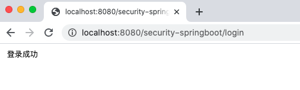
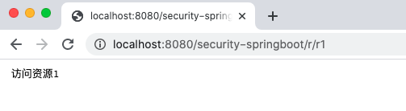
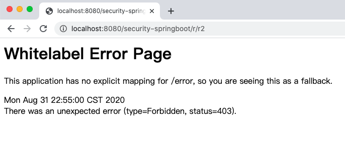
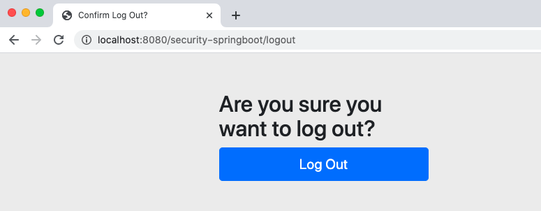
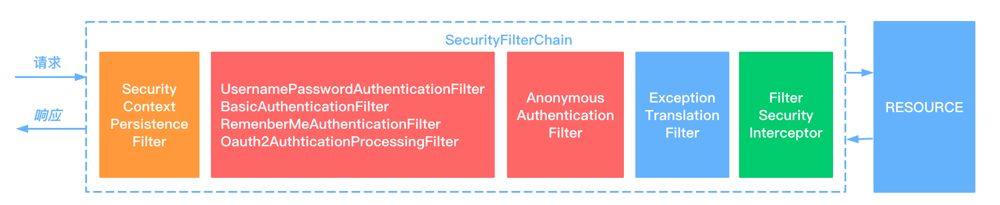
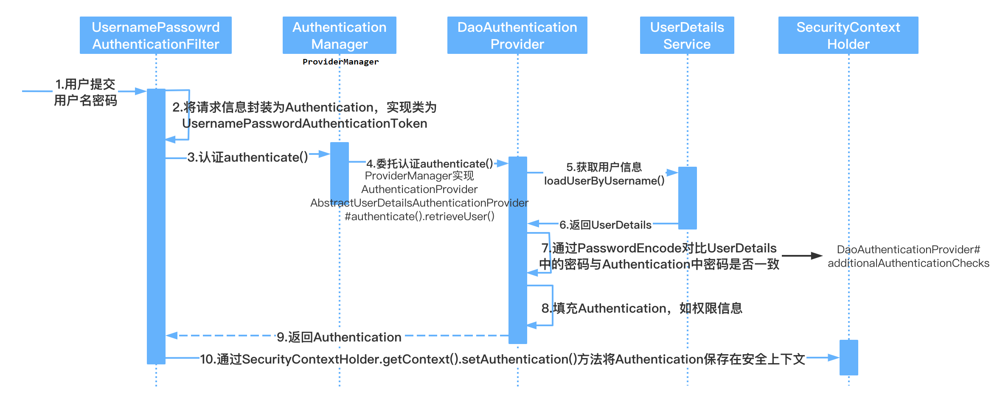
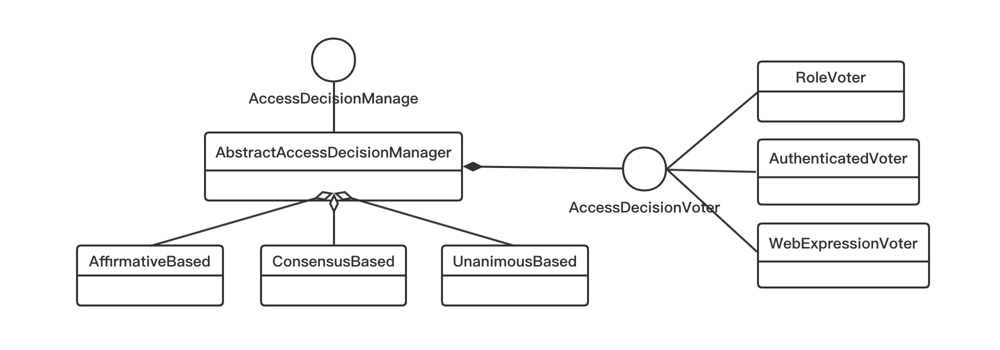
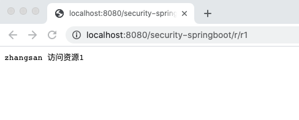
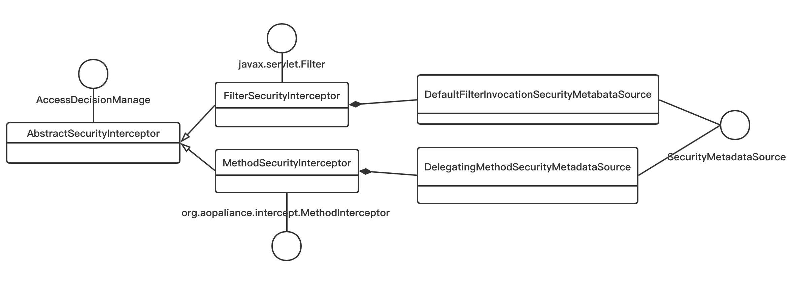
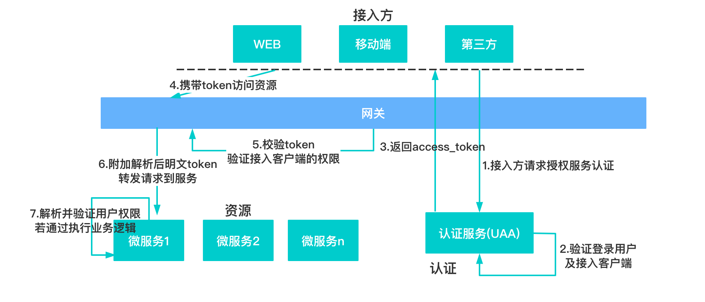

# Spring Security OAuth2.0 认证授权

## 1 基本概念

### 1.1 什么是认证

> 输入账号和密码登录的过程就是认证，系统为什么要认证？ 
>
> 认证是为了保护系统的隐私数据与资源，用户的身份合法方可访问该系统的资源。 

``认证`` 用户认证就是判断一个用户的身份是否合法的过程，用户去访问系统资源时系统要求验证用户的身份信息，身份合法方可继续访问，不合法则拒绝访问。常见的用户身份认证方式有：用户名密码登录，二维码登录，手机短信登录，指纹认证等方式。 

### 1.2 什么是会话

用户认证通过后，为了避免用户的每次操作都进行认证可将用户的信息保证在会话中。会话就是系统为了保持当前用户的登录状态所提供的机制，常见的有``基于session方式``、``基于token方式``等。 

**基于session的认证方式**

它的交互流程是，用户认证成功后，在服务端生成用户相关的数据保存在session(当前会话)中，发给客户端的 sesssion_id 存放到 cookie 中，这样用户客户端请求时带上 session_id 就可以验证服务器端是否存在 session 数据，以此完成用户的合法校验，当用户退出系统或session过期销毁时,客户端的session_id也就无效了。


**基于token方式**

它的交互流程是，用户认证成功后，服务端生成一个token发给客户端，客户端可以放到 cookie 或 localStorage 等存储中，每次请求时带上 token，服务端收到token通过验证后即可确认用户身份。 


基于 session 的认证方式由 Servlet 规范定制，服务端要存储 session 信息需要占用内存资源，客户端需要支持 cookie；基于token的方式则一般不需要服务端存储token，并且不限制客户端的存储方式。如今移动互联网时代更多类型的客户端需要接入系统，系统多是采用前后端分离的架构进行实现，所以基于token的方式更适合。 

### 1.3 什么是授权

> 拥有发朋友圈功能的权限才可以使用发朋友圈功能，这个根据用户的权限来控制用户使用资源的过程就是授权。
>
> 为什么要授权？ 
>
> 认证是`为了保证用户身份的合法性`，授权则是`为了更细粒度的对隐私数据进行划分`，授权是在认证通过后发生的，控制不同的用户能够访问不同的资源。 

``授权`` 通过根据用户的权限来控制用户访问资源的过程，拥有资源的访问权限则正常访问，没有权限则拒绝访问。

### 1.4 授权的数据模型

如何进行授权即如何对用户访问资源进行控制，首先需要学习授权相关的数据模型。 

授权可简单理解为 Who 对 What(which) 进行 How 操作，包括如下： 

Who，即``主体（Subject）``，主体一般是指用户，也可以是程序，需要访问系统中的资源。 What，即``资源（Resource）``，如系统菜单、页面、按钮、代码方法、系统商品信息、系统订单信息等。系统菜单、页面、按钮、代码方法都属于系统功能资源，对于web系统每个功能资源通常对应一个URL；系统商品信息、系统订单信息都属于实体资源（数据资源），实体资源由资源类型和资源实例组成，比如商品信息为资源类型，商品编号 为001的商品为资源实例。 How，``权限/许可（Permission）``，规定了用户对资源的操作许可，权限离开资源没有意义， 如用户查询权限、用户添加权限、某个代码方法的调用权限、编号为001的用户的修改权限等，通过权限可知用户对哪些资源都有哪些操作许可。 

主体、资源、权限关系如下图： 


主体、资源、权限相关的数据模型如下： 

主体（用户id、账号、密码、...） 

资源（资源id、资源名称、访问地址、...） 

权限（权限id、权限标识、权限名称、资源id、...） 

角色（角色id、角色名称、...）

角色和权限关系（角色id、权限id、...） 

主体（用户）和角色关系（用户id、角色id、...） 

主体（用户）、资源、权限关系如下图： 


通常企业开发中将资源和权限表合并为一张权限表，如下： 

资源（资源id、资源名称、访问地址、...） 

权限（权限id、权限标识、权限名称、资源id、...） 

合并为： 

权限（权限id、权限标识、权限名称、资源名称、资源访问地址、...） 

修改后数据模型之间的关系如下图： 


### 1.5 RBAC

如何实现授权？业界通常基于RBAC实现授权。

#### 1.5.1 基于角色的访问控制

``RBAC 基于角色的访问控制（Role-Based Access Control）``是按角色进行授权，比如：主体的角色为总经理可以查询企业运营报表，查询员工工资信息等。

```java
if(主体.hasRole("总经理角色id")){ 
	查询工资 
}
```

如果查询工资所需要的角色变化为总经理和部门经理，此时就需要修改判断逻辑为判断用户的角色是否是总经理或部门经理，修改代码如下： 

```java
if(主体.hasRole("总经理角色id") || 主体.hasRole("部门经理角色id")){ 
	查询工资 
} 
```

根据上边的例子发现，当需要修改角色的权限时就需要修改授权的相关代码，系统可扩展性差。 

#### 1.5.2 基于资源的访问控制

``RBAC 基于资源的访问控制（Resource-Based Access Control）``是按资源（或权限）进行授权，比如：用户必须具有查询工资权限才可以查询员工工资信息等。

授权代码可以表示为： 

```java
if(主体.hasPermission("查询工资权限标识")){ 
	查询工资 
} 
```

优点：系统设计时定义好查询工资的权限标识，即使查询工资所需要的角色变化为总经理和部门经理也不需要修改授权代码，系统可扩展性强。 

## 2 Spring Security 应用详解

### 2.1 Spring Security 介绍

Spring Security是一个能够``为基于Spring的企业应用系统提供声明式的安全访问控制解决方案的安全框架``。由于它是Spring生态系统中的一员，因此它伴随着整个Spring生态系统不断修正、升级，在spring boot项目中加入spring security更是十分简单，使用Spring Security 减少了为企业系统安全控制编写大量重复代码的工作。 

### 2.2 集成 Spring Boot

#### 2.2.1 Spring Boot **介绍** 

Spring Boot是一套Spring的快速开发框架，基于Spring 4.0设计，使用Spring Boot开发可以避免一些繁琐的工程搭建和配置，同时它集成了大量的常用框架，快速导入依赖包，避免依赖包的冲突。基本上常用的开发框架都支持 Spring Boot开发，例如：MyBatis、Dubbo等，Spring 家族更是如此，例如：Spring cloud、Spring mvc、 Spring security等，使用Spring Boot开发可以大大得高生产率，所以Spring Boot的使用率非常高。 

#### 2.2.2 创建 maven 工程

```xml
<?xml version="1.0" encoding="UTF-8"?>
<project xmlns="http://maven.apache.org/POM/4.0.0" xmlns:xsi="http://www.w3.org/2001/XMLSchema-instance"
         xsi:schemaLocation="http://maven.apache.org/POM/4.0.0 https://maven.apache.org/xsd/maven-4.0.0.xsd">
    <modelVersion>4.0.0</modelVersion>
    <parent>
        <groupId>org.springframework.boot</groupId>
        <artifactId>spring-boot-starter-parent</artifactId>
        <version>2.3.3.RELEASE</version>
        <relativePath/> <!-- lookup parent from repository -->
    </parent>
    <groupId>com.spring</groupId>
    <artifactId>security-demo</artifactId>
    <version>0.0.1-SNAPSHOT</version>
    <name>security-demo</name>
    <description>Demo project for Spring Boot</description>

    <properties>
        <java.version>1.8</java.version>
    </properties>

    <dependencies>
        <dependency>
            <groupId>org.springframework.boot</groupId>
            <artifactId>spring-boot-starter-web</artifactId>
        </dependency>

        <!-- 以下是spring security依赖 -->
        <dependency>
            <groupId>org.springframework.boot</groupId>
            <artifactId>spring-boot-starter-security</artifactId>
        </dependency>

        <dependency>
            <groupId>org.springframework.boot</groupId>
            <artifactId>spring-boot-starter-test</artifactId>
            <scope>test</scope>
            <exclusions>
                <exclusion>
                    <groupId>org.junit.vintage</groupId>
                    <artifactId>junit-vintage-engine</artifactId>
                </exclusion>
            </exclusions>
        </dependency>
    </dependencies>

    <build>
        <plugins>
            <plugin>
                <groupId>org.springframework.boot</groupId>
                <artifactId>spring-boot-maven-plugin</artifactId>
            </plugin>
        </plugins>
    </build>

</project>
```

#### 2.2.3 Spring 容器配置

SpringBoot工程启动会自动扫描启动类所在包下的所有Bean，加载到spring容器。 

1. Spring Boot配置文件 

   ```yml
   server:
     port: 8080
     servlet:
       context-path: /security‐springboot
   
   spring:
     application:
       name: security‐springboot
   ```

2. Servlet Context 配置

   ```java
   @Configuration
   public class WebConfig implements WebMvcConfigurer {
   
       /**
        * 默认Url根路径跳转到/login，此url为spring security提供
        * @param registry
        */
       @Override
       public void addViewControllers(ViewControllerRegistry registry) {
           registry.addViewController("/").setViewName("redirect:/login");
       }
   }
   ```

3. 安全配置

   ```java
   @Configuration
   public class WebSecurityConfig extends WebSecurityConfigurerAdapter {
   
       /**
        * 定义用户信息服务（查询用户信息）
        * @return
        */
       @Override
       @Bean
       public UserDetailsService userDetailsService(){
           InMemoryUserDetailsManager manager = new InMemoryUserDetailsManager();
           manager.createUser(User.withUsername("zhangsan").password("123").authorities("p1").build());
           manager.createUser(User.withUsername("lisi").password("456").authorities("p2").build());
           return manager;
       }
   
       /**
        * 密码编码器
        * @return
        */
       @Bean
       public PasswordEncoder passwordEncoder(){
           return NoOpPasswordEncoder.getInstance();
       }
   
       /**
        * 安全拦截机制（最重要）
        * @param http
        * @throws Exception
        */
       @Override
       protected void configure(HttpSecurity http) throws Exception {
           http.authorizeRequests()
             			// 访问/r/r1资源的 url需要拥有p1权限
                   .antMatchers("/r/r1").hasAuthority("p1")
             			// 访问/r/r2资源的 url需要拥有p2权限
                   .antMatchers("/r/r2").hasAuthority("p2")
                   // 所有/r/**的请求必须认证通过
                   .antMatchers("/r/**").authenticated()
                   // 除了/r/**，其他请求可以访问
                   .anyRequest().permitAll()
                   .and()
                   // 允许表单登录
                   .formLogin()
                   // 自定义登录成功的页面地址
                   .successForwardUrl("/login-success");
       }
   }
   ```

   在 ``userDetailsService()`` 方法中，我们返回了一个 ``UserDetailsService`` 给 spring 容器，Spring Security会使用它来获取用户信息。我们暂时使用 ``InMemoryUserDetailsManager`` 实现类，并在其中分别创建了zhangsan、lisi两个用户，并设置密码和权限。 

   而在 ``confifigure()`` 中，我们通过 HttpSecurity 设置了安全拦截规则，其中包含了以下内容： 

   （1）url匹配/r/**的资源，经过认证后才能访问

   （2）其他url完全开放

   （3）支持form表单认证，认证成功后转向 /login-success

   关于HttpSecurity 的配置清单请参考附录 HttpSecurity。

4. 测试controller

   ```java
   @RestController
   public class LoginController {
   
       @RequestMapping(value = "/login-success",produces = {"text/plain;charset=UTF-8"})
       public String loginSuccess(){
           //提示具体用户名称登录成功
           return " 登录成功";
       }
   
       /**
        * 测试资源1
        * @return
        */
       @GetMapping(value = "/r/r1",produces = {"text/plain;charset=UTF-8"})
       public String r1(){
           return " 访问资源1";
       }
   
       /**
        * 测试资源2
        * @return
        */
       @GetMapping(value = "/r/r2",produces = {"text/plain;charset=UTF-8"})
       public String r2(){
           return " 访问资源2";
       }
   
   }
   ```

5. 测试

   









## 3 工作原理

### 3.1 结构总览

Spring Security 所解决的问题就是``安全访问控制``，而安全访问控制功能其实就是对所有进入系统的请求进行拦截，校验每个请求是否能够访问它所期望的资源。根据前边知识的学习，可以通过 Filter 或 AOP 等技术来实现，Spring Security 对 Web 资源的保护是靠 Filter 实现的，所以从这个 Filter 来入手，逐步深入Spring Security 原理。 

当初始化 Spring Security 时，会创建一个名为 `SpringSecurityFilterChain` 的Servlet过滤器，类型为``org.springframework.security.web.FilterChainProxy``，它实现了 javax.servlet.Filter，因此外部的请求会经过此类：

```java
// public class WebSecurityConfiguration implements ImportAware, BeanClassLoaderAware
@Bean(name = AbstractSecurityWebApplicationInitializer.DEFAULT_FILTER_NAME)
public Filter springSecurityFilterChain() throws Exception {
   boolean hasConfigurers = webSecurityConfigurers != null
         && !webSecurityConfigurers.isEmpty();
   if (!hasConfigurers) {
      WebSecurityConfigurerAdapter adapter = objectObjectPostProcessor
            .postProcess(new WebSecurityConfigurerAdapter() {
            });
      webSecurity.apply(adapter);
   }
   return webSecurity.build();
}
```

下图是Spring Security过虑器链结构图：


``FilterChainProxy`` 是一个代理，真正起作用的是 FilterChainProxy 中 `SecurityFilterChain 所包含的各个 Filter`，同时这些Filter作为Bean被Spring管理，它们是Spring Security核心，各有各的职责，但他们并不直接处理用户的认证，也不直接处理用户的授权，而是把它们交给了``认证管理器（AuthenticationManager）``和``决策管理器（AccessDecisionManager）``进行处理，下图是FilterChainProxy相关类的UML图示。 


Spring Security功能的实现主要是由一系列过滤器链相互配合完成。



下面介绍过滤器链中主要的几个过滤器及其作用： 

``SecurityContextPersistenceFilter`` 这个Filter是整个拦截过程的入口和出口（也就是第一个和最后一个拦截器），会在请求开始时从配置好的 SecurityContextRepository 中获取 SecurityContext，然后把它设置给 SecurityContextHolder。在请求完成后将 SecurityContextHolder 持有的 SecurityContext 再保存到配置好的 SecurityContextRepository，同时清除securityContextHolder 所持有的 SecurityContext； 

``UsernamePasswordAuthenticationFilter``用于处理来自表单提交的认证。该表单必须提供对应的用户名和密码，其内部还有登录成功或失败后进行处理的 AuthenticationSuccessHandler 和 AuthenticationFailureHandler，这些都可以根据需求做相关改变； 

``FilterSecurityInterceptor`` 是用于保护web资源的，使用AccessDecisionManager对当前用户进行授权访问，前面已经详细介绍过了； 

``ExceptionTranslationFilter`` 能够捕获来自 FilterChain 所有的异常，并进行处理。但是它只会处理两类异常： AuthenticationException 和 AccessDeniedException，其它的异常它会继续抛出。

> OAuth 2 中的 Filter：
>
> `ClientCredentialsTokenEndpointFilter` 对于获取 TOKEN 的请求(默认是 /oauth/token)，需要认证 client_id 和 client_secret

### 3.2 认证流程



```java
/***************** AbstractAuthenticationProcessingFilter *****************/
public void doFilter(ServletRequest req, ServletResponse res, FilterChain chain)
		throws IOException, ServletException {
    // 子类 UsernamePasswordAuthenticationFilter 实现
    authResult = attemptAuthentication(request, response);
    // ...
	successfulAuthentication(request, response, chain, authResult);
}
/***************** UsernamePasswordAuthenticationFilter *****************/
public Authentication attemptAuthentication(HttpServletRequest request,
      HttpServletResponse response) throws AuthenticationException {
   if (postOnly && !request.getMethod().equals("POST")) {
      throw new AuthenticationServiceException(
            "Authentication method not supported: " + request.getMethod());
   }
   String username = obtainUsername(request);
   String password = obtainPassword(request);
   if (username == null) {
      username = "";
   }
   if (password == null) {
      password = "";
   }
   username = username.trim();
   UsernamePasswordAuthenticationToken authRequest = new UsernamePasswordAuthenticationToken(
         username, password);
   // Allow subclasses to set the "details" property
   setDetails(request, authRequest);
   // 委托 AuthenticationManager 进行认证
   return this.getAuthenticationManager().authenticate(authRequest);
}
```

让我们仔细分析认证过程： 

1. 用户提交用户名、密码被 SecurityFilterChain 中的 ``UsernamePasswordAuthenticationFilter`` 过滤器获取到， 封装为请求 Authentication，通常情况下是``UsernamePasswordAuthenticationToken``这个实现类。 

2. 然后过滤器将 Authentication 提交至认证管理器（AuthenticationManager）进行认证 

3. 认证成功后， AuthenticationManager 身份管理器返回一个被填充满了信息的（包括上面提到的权限信息，身份信息，细节信息，但密码通常会被移除） Authentication 实例。 

4. SecurityContextHolder 安全上下文容器将第3步填充了信息的 Authentication ，通过 SecurityContextHolder.getContext().setAuthentication(…)方法，设置到其中。 

认证核心组件的大体关系如下：


#### 3.2.1 AuthenticationManager

从认证流程中可知实际的认证交给了 AuthenticationManager 处理，即是从 getAuthenticationManager() 方法取到的 ：

```java
/***************** AbstractAuthenticationFilterConfigurer *****************/
public void configure(B http) throws Exception {
    // ...
    // 设置 AuthenticationManager
	authFilter.setAuthenticationManager(http.getSharedObject(AuthenticationManager.class));
}
/***************** AbstractConfiguredSecurityBuilder *****************/
private final Map<Class<?>, Object> sharedObjects = new HashMap<>();
public <C> C getSharedObject(Class<C> sharedType) {
    // 从 sharedObjects 的 HashMap 中获取
	return (C) this.sharedObjects.get(sharedType);
}
public <C> void setSharedObject(Class<C> sharedType, C object) {
	this.sharedObjects.put(sharedType, object);
}
/***************** HttpSecurity *****************/
public HttpSecurity(ObjectPostProcessor<Object> objectPostProcessor,
		AuthenticationManagerBuilder authenticationBuilder,
		Map<Class<?>, Object> sharedObjects) {
	// 设置一个 AuthenticationManagerBuilder
	setSharedObject(AuthenticationManagerBuilder.class, authenticationBuilder);
	// ...
}
@Override
protected void beforeConfigure() throws Exception {
    // getAuthenticationRegistry 返回初始化时设置的 AuthenticationManagerBuilder
    // WebSecurityConfigurerAdapter$DefaultPasswordEncoderAuthenticationManagerBuilder
	setSharedObject(AuthenticationManager.class, getAuthenticationRegistry().build());
}
/***************** WebSecurityConfigurerAdapter *****************/
public void setApplicationContext(ApplicationContext context) {
    authenticationBuilder = new DefaultPasswordEncoderAuthenticationManagerBuilder(objectPostProcessor, passwordEncoder);
}
```

从 `getAuthenticationRegistry()` 返回的是 WebSecurityConfigurerAdapter 的内部类 `DefaultPasswordEncoderAuthenticationManagerBuilder`，所以后续执行它的 build() 方法，但是其未实现该方法：

```java
// DefaultPasswordEncoderAuthenticationManagerBuilder extends AuthenticationManagerBuilder
// AuthenticationManagerBuilder extends AbstractConfiguredSecurityBuilder
// AbstractConfiguredSecurityBuilder extends AbstractSecurityBuilder
/***************** AbstractSecurityBuilder *****************/
public final O build() throws Exception {
	if (this.building.compareAndSet(false, true)) {
		this.object = doBuild();
		return this.object;
	}
	throw new AlreadyBuiltException("This object has already been built");
}
/***************** AbstractConfiguredSecurityBuilder *****************/
protected final O doBuild() throws Exception {
	synchronized (configurers) {
		buildState = BuildState.INITIALIZING;
		beforeInit();
		init();
		buildState = BuildState.CONFIGURING;
		beforeConfigure();
		configure();
		buildState = BuildState.BUILDING;
		O result = performBuild();
		buildState = BuildState.BUILT;
		return result;
	}
}
/***************** AuthenticationManagerBuilder *****************/
protected ProviderManager performBuild() throws Exception {
	//...
    // 由此可见，最终的 AuthenticationManager 是 ProviderManager
	ProviderManager providerManager = new ProviderManager(authenticationProviders,
			parentAuthenticationManager);
	if (eraseCredentials != null) {
		providerManager.setEraseCredentialsAfterAuthentication(eraseCredentials);
	}
	if (eventPublisher != null) {
		providerManager.setAuthenticationEventPublisher(eventPublisher);
	}
	providerManager = postProcess(providerManager);
	return providerManager;
}
```

可以看出 AuthenticationManager 接口（认证管理器）是认证相关的核心接口，也是发起认证的出发点，它的实现类为 `ProviderManager`。而 Spring Security 支持多种认证方式，因此 ProviderManager 维护着一个``List<AuthenticationProvider> ``列表，存放多种认证方式，最终实际的认证工作是由 AuthenticationProvider 完成的。咱们知道 web 表单的对应的 AuthenticationProvider 实现类为 `DaoAuthenticationProvider`，它的内部又维护着一个 `UserDetailsService` 负责 UserDetails 的获取。最终 AuthenticationProvider 将 UserDetails 填充至 Authentication。 

```java
/***************** ProviderManager *****************/
private List<AuthenticationProvider> providers = Collections.emptyList();
public Authentication authenticate(Authentication authentication)
      throws AuthenticationException {
   //...
   // provider == DaoAuthenticationProvider
   for (AuthenticationProvider provider : getProviders()) {
      if (!provider.supports(toTest)) {
         continue;
      }
      result = provider.authenticate(authentication);
       //...
   }
}
```

#### 3.2.2 AuthenticationProvider

通过前面的 Spring Security 认证流程我们得知，``认证管理器（AuthenticationManager）``委托 ``AuthenticationProvider``完成认证工作。 

AuthenticationProvider是一个接口，定义如下： 

```java
public interface AuthenticationProvider {
	Authentication authenticate(Authentication authentication)
			throws AuthenticationException;

	boolean supports(Class<?> authentication);
}
```

``authenticate()``方法定义了``认证的实现过程``，它的参数是一个Authentication，里面包含了登录用户所提交的用户、密码等。而返回值也是一个Authentication，这个Authentication则是在认证成功后，将用户的权限及其他信 息重新组装后生成。 

Spring Security 中维护着一个 ``List<AuthenticationProvider> `` 列表，存放多种认证方式，不同的认证方式使用不同的AuthenticationProvider。如使用用户名密码登录时，使用AuthenticationProvider1，短信登录时使用AuthenticationProvider2等等这样的例子很多。 

每个AuthenticationProvider需要实现``supports()``方法来表明自己支持的认证方式，如我们使用表单方式认证，在提交请求时Spring Security会生成``UsernamePasswordAuthenticationToken``，它是一个Authentication，里面封装着用户提交的用户名、密码信息。而对应的，哪个AuthenticationProvider来处理它。

我们在 DaoAuthenticationProvider 的基类``AbstractUserDetailsAuthenticationProvider``发现以下代码： 

```java
public boolean supports(Class<?> authentication) {
	return (UsernamePasswordAuthenticationToken.class
			.isAssignableFrom(authentication));
}
public Authentication authenticate(Authentication authentication)
		throws AuthenticationException {
	//...
	user = retrieveUser(username, (UsernamePasswordAuthenticationToken) authentication);
    // 校验 userDetails 信息是否正确，即密码是否一致
	additionalAuthenticationChecks(user, (UsernamePasswordAuthenticationToken) authentication);
	return createSuccessAuthentication(principalToReturn, authentication, user);
}
/***************** DaoAuthenticationProvider  *****************/
protected final UserDetails retrieveUser(String username,
		UsernamePasswordAuthenticationToken authentication)
		throws AuthenticationException {
    // this.getUserDetailsService()
    // 执行自定义 UserDetailsService 的 loadUserByUsername 方法
    UserDetails loadedUser = this.getUserDetailsService().loadUserByUsername(username);
    if (loadedUser == null) {
        throw new InternalAuthenticationServiceException(
            "UserDetailsService returned null, which is an interface contract violation");
    }
    return loadedUser;
}
/***************** InitializeUserDetailsManagerConfigurer  *****************/
// DaoAuthenticationProvider 中所需的 UserDetailsService 和 PasswordEncoder，来源于此处的配置
public void configure(AuthenticationManagerBuilder auth) throws Exception {
    // 获取上下文中的 UserDetailsService(自定义实现的)
	UserDetailsService userDetailsService = getBeanOrNull(UserDetailsService.class);
	if (userDetailsService == null) {
		return;
	}
	PasswordEncoder passwordEncoder = getBeanOrNull(PasswordEncoder.class);
	UserDetailsPasswordService passwordManager = getBeanOrNull(UserDetailsPasswordService.class);
	DaoAuthenticationProvider provider = new DaoAuthenticationProvider();
	provider.setUserDetailsService(userDetailsService);
    if (passwordEncoder != null) {
        provider.setPasswordEncoder(passwordEncoder);
    }
}
private <T> T getBeanOrNull(Class<T> type) {
    // AbstractApplicationContext -> DefaultListableBeanFactory.getBeanNamesForType -> doGetBeanNamesForType(class, true, true)
	String[] beanNames = InitializeUserDetailsBeanManagerConfigurer.this.context
			.getBeanNamesForType(type);
	if (beanNames.length != 1) {
		return null;
	}
	return InitializeUserDetailsBeanManagerConfigurer.this.context
			.getBean(beanNames[0], type);
}
```

也就是说``当web表单提交用户名密码时``，Spring Security 由 DaoAuthenticationProvider 处理。

最后，我们来看一下``Authentication(认证信息)``的结构，它是一个接口，我们之前提到的 UsernamePasswordAuthenticationToken 就是它的实现之一： 

```java
public interface Authentication extends Principal, Serializable {

	Collection<? extends GrantedAuthority> getAuthorities();

	Object getCredentials();

	Object getDetails();

	Object getPrincipal();

	boolean isAuthenticated();

	void setAuthenticated(boolean isAuthenticated) throws IllegalArgumentException;
}
// AbstractUserDetailsAuthenticationProvider 最终调用 createSuccessAuthentication 方法返回 Authentication
// 即其实现类 UsernamePasswordAuthenticationToken
protected Authentication createSuccessAuthentication(Object principal,
		Authentication authentication, UserDetails user) {
	UsernamePasswordAuthenticationToken result = new UsernamePasswordAuthenticationToken(
			principal, authentication.getCredentials(),
			authoritiesMapper.mapAuthorities(user.getAuthorities()));
	result.setDetails(authentication.getDetails());
	return result;
}
```

1. Authentication 是spring security 包中的接口，直接继承自 `Principal` 类，而 Principal 是位于 java.security 包中的。它是表示着一个抽象主体身份，任何主体都有一个名称，因此包含一个getName()方法。 

2. ``getAuthorities()`` 权限信息列表，默认是GrantedAuthority接口的一些实现类，通常是代表权限信息的一系列字符串。 

3. ``getCredentials()`` 凭证信息，用户输入的密码字符串，在认证过后通常会被移除，用于保障安全。 

4. ``getDetails()`` 细节信息，web应用中的实现接口通常为 WebAuthenticationDetails，它记录了访问者的ip地址和sessionId的值。 

5. ``getPrincipal()`` 身份信息，大部分情况下返回的是UserDetails接口的实现类，UserDetails代表用户的详细信息，那从Authentication中取出来的UserDetails就是当前登录用户信息，它也是框架中的常用接口之一。 

#### 3.2.3 UserDetailsService

DaoAuthenticationProvider 处理了 web 表单的认证逻辑，认证成功后既得到一个Authentication(UsernamePasswordAuthenticationToken实现)，里面包含了身份信息（Principal）。这个身份信息就是一个 Object ，大多数情况下它可以被强转为UserDetails对象。 

DaoAuthenticationProvider中包含了一个UserDetailsService实例，它负责根据用户名提取用户信息UserDetails(包含密码)，而后DaoAuthenticationProvider会去对比UserDetailsService提取的用户密码与用户提交的密码是否匹配作为认证成功的关键依据，因此可以通过将自定义的 UserDetailsService 公开为spring bean来定义自定义身份验证。 

```java
public interface UserDetailsService {
	UserDetails loadUserByUsername(String username) throws UsernameNotFoundException;
}
```

很多人把 DaoAuthenticationProvider 和 UserDetailsService 的职责搞混淆，其实UserDetailsService只负责从`特定的地方（通常是数据库）加载用户信息`，仅此而已。而DaoAuthenticationProvider的职责更大，它完成完整的认证流程，同时会把UserDetails填充至Authentication。 

上面一直提到UserDetails是用户信息，咱们看一下它的真面目：

```java
public interface UserDetails extends Serializable {

	Collection<? extends GrantedAuthority> getAuthorities();

	String getPassword();

	String getUsername();

	boolean isAccountNonExpired();

	boolean isAccountNonLocked();

	boolean isEnabled();
}
```

它和Authentication接口很类似，比如它们都拥有username，authorities。Authentication的getCredentials()与 UserDetails中的getPassword()需要被区分对待，前者是用户提交的密码凭证，后者是用户实际存储的密码，认证其实就是对这两者的比对。Authentication中的getAuthorities()实际是由UserDetails的getAuthorities()传递而形成的。还记得Authentication接口中的getDetails()方法吗？其中的UserDetails用户详细信息便是经过了AuthenticationProvider认证之后被填充的。 

通过实现UserDetailsService和UserDetails，我们可以完成对用户信息获取方式以及用户信息字段的扩展。 

Spring Security提供的`InMemoryUserDetailsManager(内存认证)`，`JdbcUserDetailsManager(jdbc认证)`就是UserDetailsService的实现类，主要区别无非就是从内存还是从数据库加载用户。 

自定义UserDetailsService :

```java
@Service
public class SpringDataUserDetailsService implements UserDetailsService {
    @Override
    public UserDetails loadUserByUsername(String username) throws UsernameNotFoundException {
        //登录账号
        System.out.println("username="+username);
        //根据账号去数据库查询...
        // 这里暂时使用静态数据
        UserDetails userDetails = User.withUsername(username).password("123")
                .authorities("p1").build();
        return userDetails;
    }
}
```

屏蔽安全配置类中UserDetailsService的定义 :

```java
/* @Bean 
public UserDetailsService userDetailsService() { } */
```

#### 3.2.4 PasswordEncoder

DaoAuthenticationProvider 认证处理器通过 UserDetailsService 获取到 UserDetails 后，它是如何与请求 Authentication 中的密码做对比呢？ 

在这里Spring Security为了适应多种多样的加密类型，又做了抽象，DaoAuthenticationProvider通过 PasswordEncoder 接口的matches方法进行密码的对比，而具体的密码对比细节取决于实现： 

```java
public interface PasswordEncoder {

	String encode(CharSequence rawPassword);
  
	boolean matches(CharSequence rawPassword, String encodedPassword);

	default boolean upgradeEncoding(String encodedPassword) {
		return false;
	}
}
```

而Spring Security提供很多内置的PasswordEncoder，能够开箱即用，使用某种PasswordEncoder只需要进行如下声明即可，如下： 

```java
@Bean
public PasswordEncoder passwordEncoder(){
    return NoOpPasswordEncoder.getInstance();
}
```

``NoOpPasswordEncoder``采用字符串匹配方法，不对密码进行加密比较处理，密码比较流程如下： 

1. 用户输入密码（明文 ） 

2. DaoAuthenticationProvider获取UserDetails（其中存储了用户的正确密码） 

3. DaoAuthenticationProvider使用PasswordEncoder对输入的密码和正确的密码进行校验，密码一致则校验通 过，否则校验失败。

NoOpPasswordEncoder的校验规则拿 输入的密码和UserDetails中的正确密码进行字符串比较，字符串内容一致 则校验通过，否则 校验失败。 

实际项目中推荐使用BCryptPasswordEncoder, Pbkdf2PasswordEncoder, SCryptPasswordEncoder等，感兴趣的大家可以看看这些PasswordEncoder的具体实现。 

##### 使用BCryptPasswordEncoder

在安全配置类中定义： 

```java
@Bean 
public PasswordEncoder passwordEncoder() { 
	return new BCryptPasswordEncoder(); 
} 
```

测试发现认证失败，提示：Encoded password does not look like BCrypt。 

原因： 

由于UserDetails中存储的是原始密码（比如：123），它不是BCrypt格式。 

##### 测试BCrypt

```xml
<dependency>
    <groupId>org.springframework.boot</groupId>
    <artifactId>spring-boot-starter-test</artifactId>
    <scope>test</scope>
    <exclusions>
        <exclusion>
            <groupId>org.junit.vintage</groupId>
            <artifactId>junit-vintage-engine</artifactId>
        </exclusion>
    </exclusions>
</dependency>
```

```java
@SpringBootTest
class BCryptTest {

    @Test
    public void test() {
        // 对原始密码加密
        String hashpw = BCrypt.hashpw("123", BCrypt.gensalt());
        System.out.println(hashpw);

        // 校验原始密码和BCrypt密码是否一致
        boolean checkpw = BCrypt.checkpw("123", "$2a$10$c4G.dGQSKvaoFT3ZyuJr2e8KVWsINT4F.2jH7m8YysbeJBxRwS8fy");
        System.out.println(checkpw);
    }

}
```

##### 修改安全配置类 

将UserDetails中的原始密码修改为BCrypt格式 

```java
UserDetails userDetails = User.withUsername(username).password("$2a$10$c4G.dGQSKvaoFT3ZyuJr2e8KVWsINT4F.2jH7m8YysbeJBxRwS8fy")
                .authorities("p1").build();
```

实际项目中存储在数据库中的密码并不是原始密码，都是经过加密处理的密码。

### 3.3 授权流程

Spring Security可以通过 `http.authorizeRequests() 对web请求进行授权保护`。Spring Security使用标准Filter建立了对web请求的拦截，最终实现对资源的授权访问。 

Spring Security的授权流程如下：


分析授权流程： 

1. 拦截请求，已认证用户访问受保护的web资源将被SecurityFilterChain中的 FilterSecurityInterceptor 的子类拦截。 

2. 获取资源访问策略，``FilterSecurityInterceptor#invoke`` 方法会调用父类的 ``beforeInvocation()`` 方法会从 SecurityMetadataSource 的子类 ``DefaultFilterInvocationSecurityMetadataSource`` 获取要访问当前资源所需要的权限 ``Collection<ConfigAttribute>`` 。 

   SecurityMetadataSource 其实就是读取访问策略的抽象，而读取的内容，其实就是我们配置的访问规则， 读取访问策略如： 

   ```java
   http
   	.authorizeRequests() 
   		.antMatchers("/r/r1").hasAuthority("p1") 
   		.antMatchers("/r/r2").hasAuthority("p2") 
   		... 
   ```

3. 最后，FilterSecurityInterceptor 会调用 AccessDecisionManager 进行授权决策，若决策通过，则允许访问资源，否则将禁止访问。 

AccessDecisionManager（访问决策管理器）的核心接口如下：

```java
public interface AccessDecisionManager {
	/** 
	* 通过传递的参数来决定用户是否有访问对应受保护资源的权限 
	*/
	void decide(Authentication authentication, Object object,
			Collection<ConfigAttribute> configAttributes) throws AccessDeniedException,
			InsufficientAuthenticationException;

	boolean supports(ConfigAttribute attribute);

	boolean supports(Class<?> clazz);
}
```

这里着重说明一下decide的参数： 

``authentication`` 要访问资源的访问者的身份 

``object`` 要访问的受保护资源，web请求对应FilterInvocation 

``confifigAttributes`` 是受保护资源的访问策略，通过SecurityMetadataSource获取。 

> decide接口就是用来鉴定当前用户是否有访问对应受保护资源的权限。
>

#### 3.3.1 授权决策

AccessDecisionManager 采用``投票``的方式来确定是否能够访问受保护资源。



通过上图可以看出，AccessDecisionManager中包含的一系列AccessDecisionVoter将会被用来对 Authentication 是否有权访问受保护对象进行投票，AccessDecisionManager根据投票结果，做出最终决策。 

AccessDecisionVoter是一个接口，其中定义有三个方法，具体结构如下所示。

```java
public interface AccessDecisionVoter<S> {

	int ACCESS_GRANTED = 1;
	int ACCESS_ABSTAIN = 0;
	int ACCESS_DENIED = -1;

	boolean supports(ConfigAttribute attribute);

	boolean supports(Class<?> clazz);

	int vote(Authentication authentication, S object,
			Collection<ConfigAttribute> attributes);
}
```

``ACCESS_DENIED``表示拒绝，``ACCESS_ABSTAIN``表示弃权。如果一个AccessDecisionVoter不能判定当前 Authentication 是否拥有访问对应受保护对象的权限，则其 vote() 方法的返回值应当为弃权 ACCESS_ABSTAIN。 

Spring Security内置了三个基于投票的AccessDecisionManager实现类如下，它们分别是``AffirmativeBased``、``ConsensusBased``和``UnanimousBased``。 

``AffirmativeBased`` 的逻辑是： 

（1）只要有AccessDecisionVoter的投票为ACCESS_GRANTED则同意用户进行访问； 

（2）如果全部弃权也表示通过； 

（3）如果没有一个人投赞成票，但是有人投反对票，则将抛出AccessDeniedException。 

> Spring security默认使用的是AffirmativeBased。 

``ConsensusBased`` 的逻辑是： 

（1）如果赞成票多于反对票则表示通过。 

（2）反过来，如果反对票多于赞成票则将抛出AccessDeniedException。 

（3）如果赞成票与反对票相同且不等于0，并且属性allowIfEqualGrantedDeniedDecisions的值为true，则表示通过，否则将抛出异常AccessDeniedException。参数allowIfEqualGrantedDeniedDecisions的值默认为true。

（4）如果所有的AccessDecisionVoter都弃权了，则将视参数allowIfAllAbstainDecisions的值而定，如果该值 

为true则表示通过，否则将抛出异常AccessDeniedException。参数allowIfAllAbstainDecisions的值默认为false。 

``UnanimousBased`` 的逻辑与另外两种实现有点不一样，另外两种会一次性把受保护对象的配置属性全部传递给AccessDecisionVoter进行投票，而UnanimousBased会一次只传递一个ConfifigAttribute给 AccessDecisionVoter进行投票。这也就意味着如果我们的AccessDecisionVoter的逻辑是只要传递进来的 ConfifigAttribute中有一个能够匹配则投赞成票，但是放到UnanimousBased中其投票结果就不一定是赞成了。 UnanimousBased的逻辑具体来说是这样的： 

（1）如果受保护对象配置的某一个ConfifigAttribute被任意的AccessDecisionVoter反对了，则将抛出 AccessDeniedException。 

（2）如果没有反对票，但是有赞成票，则表示通过。 

（3）如果全部弃权了，则将视参数allowIfAllAbstainDecisions的值而定，true则通过，false则抛出 AccessDeniedException。 

Spring Security也内置一些投票者实现类如``RoleVoter``、``AuthenticatedVoter``和``WebExpressionVoter``等。 

### 3.4 自定义认证

Spring Security提供了非常好的认证扩展方法，比如：快速上手中将用户信息存储到内存中，实际开发中用户信息通常在数据库，Spring security可以实现从数据库读取用户信息，Spring security还支持多种授权方法。 

#### 3.4.1 自定义登录页面

##### 3.4.1.1 修改 pom

```xml
<!-- 以下是jsp依赖-->
<dependency>
    <groupId>javax.servlet</groupId>
    <artifactId>javax.servlet-api</artifactId>
    <scope>provided</scope>
</dependency>
<!--jsp页面使用jstl标签 -->
<dependency>
    <groupId>javax.servlet</groupId>
    <artifactId>jstl</artifactId>
</dependency>
<dependency>
    <groupId>org.springframework.boot</groupId>
    <artifactId>spring-boot-starter-tomcat</artifactId>
    <scope>provided</scope>
</dependency>
<!--用于编译jsp -->
<dependency>
    <groupId>org.apache.tomcat.embed</groupId>
    <artifactId>tomcat-embed-jasper</artifactId>
    <scope>provided</scope>
</dependency>

<build>
    <finalName>security-springboot</finalName>
    <pluginManagement>
        <plugins>
            <plugin>
                <groupId>org.apache.tomcat.maven</groupId>
                <artifactId>tomcat7-maven-plugin</artifactId>
                <version>2.2</version>
            </plugin>
            <plugin>
                <groupId>org.apache.maven.plugins</groupId>
                <artifactId>maven-compiler-plugin</artifactId>
                <configuration>
                    <source>1.8</source>
                    <target>1.8</target>
                </configuration>
            </plugin>
            <plugin>
                <artifactId>maven-resources-plugin</artifactId>
                <configuration>
                    <encoding>utf-8</encoding>
                    <useDefaultDelimiters>true</useDefaultDelimiters>
                    <resources>
                        <resource>
                            <directory>src/main/resources</directory>
                            <filtering>true</filtering>
                            <includes>
                                <include>**/*</include>
                            </includes>
                        </resource>
                        <resource>
                            <directory>src/main/java</directory>
                            <includes>
                                <include>**/*.xml</include>
                            </includes>
                        </resource>
                    </resources>
                </configuration>
            </plugin>
        </plugins>
    </pluginManagement>
</build>
```

##### 3.4.1.2 配置认证页面

在 main 下创建 webapp/WEB-INF/view/login.jsp

修改 WebConfig 中配置认证页面地址：

```java
@Override
public void addViewControllers(ViewControllerRegistry registry) {
    registry.addViewController("/").setViewName("redirect:/login-view");
    registry.addViewController("/login-view").setViewName("login");
}
```

##### 3.4.1.3 安全配置

在WebSecurityConfifig中配置表单登录信息：

```java
@Override
protected void configure(HttpSecurity http) throws Exception {
    http.csrf().disable().authorizeRequests()
            .antMatchers("/r/**").authenticated()
            .anyRequest().permitAll()
            .and()
            .formLogin()	// (1)
            .loginPage("/login-view")	//(2)
            .loginProcessingUrl("/login") //(3)
            .successForwardUrl("/login-success") //(4)
            .permitAll();	//(5)
}
```

（1）允许表单登录 

（2）指定我们自己的登录页,spring security以重定向方式跳转到/login-view 

（3）指定登录处理的URL，也就是用户名、密码表单提交的目的路径 

（4）指定登录成功后的跳转URL 

（5）我们必须允许所有用户访问我们的登录页（例如为验证的用户），这个 formLogin().permitAll() 方法允许任意用户访问基于表单登录的所有的URL。 

> spring security为防止CSRF（Cross-site request forgery跨站请求伪造）的发生，限制了除了get以外的大多数方法。
>
> ``csrf().disable()`` 屏蔽CSRF控制，即spring security不再限制CSRF。 

#### 3.4.2 连接数据库认证

##### 3.4.2.1 创建数据库

创建user_db数据库 

```sql
CREATE DATABASE `user_db` CHARACTER SET 'utf8' COLLATE 'utf8_general_ci'; 
```

创建t_user表 

```sql
CREATE TABLE `t_user` ( 
`id` bigint(20) NOT NULL COMMENT '用户id', 
`username` varchar(64) NOT NULL, 
`password` varchar(64) NOT NULL, 
`fullname` varchar(255) NOT NULL COMMENT '用户姓名', 
`mobile` varchar(11) DEFAULT NULL COMMENT '手机号', 
PRIMARY KEY (`id`) USING BTREE 
) ENGINE=InnoDB DEFAULT CHARSET=utf8 ROW_FORMAT=DYNAMIC
```

##### 3.4.2.2 代码实现

1. 添加依赖 

   ```xml
   <dependency>
       <groupId>org.projectlombok</groupId>
       <artifactId>lombok</artifactId>
       <version>1.18.0</version>
   </dependency>
   <dependency>
       <groupId>org.springframework.boot</groupId>
       <artifactId>spring-boot-starter-jdbc</artifactId>
   </dependency>
   <dependency>
       <groupId>mysql</groupId>
       <artifactId>mysql-connector-java</artifactId>
       <version>5.1.47</version>
   </dependency>
   ```

2. 定义 datasource

   ```yml
   spring:
     datasource:
       url: jdbc:mysql://localhost:3306/user_db
       username: root
       password: root
       driver-class-name: com.mysql.jdbc.Driver
   ```

3. 定义 Dao

   ```java
   @Data
   public class UserDto {
       private String id;
       private String username;
       private String password;
       private String fullname;
       private String mobile;
   }
   
   @Repository
   public class UserDao {
   
       @Autowired
       JdbcTemplate jdbcTemplate;
   
       //根据账号查询用户信息
       public UserDto getUserByUsername(String username){
           String sql = "select id,username,password,fullname,mobile from t_user where username = ?";
           //连接数据库查询用户
           List<UserDto> list = jdbcTemplate.query(sql, new Object[]{username}, new BeanPropertyRowMapper<>(UserDto.class));
           if(list !=null && list.size()==1){
               return list.get(0);
           }
           return null;
       }
   }
   ```

##### 3.4.2.3 定义 UserDetailsService

```java
@Service
public class SpringDataUserDetailsService implements UserDetailsService {

    @Autowired
    UserDao userDao;

    @Override
    public UserDetails loadUserByUsername(String username) throws UsernameNotFoundException {
        //登录账号
        System.out.println("username="+username);
        //根据账号去数据库查询...
        UserDto user = userDao.getUserByUsername(username);
        if (user == null) {
            return null;
        }
        return User.withUsername(user.getUsername()).password(user.getPassword())
                .authorities("p1").build();
    }
}
```

### 3.5 会话

用户认证通过后，为了避免用户的每次操作都进行认证可将用户的信息保存在会话中。spring security提供会话管理，认证通过后将身份信息放入``SecurityContextHolder``上下文，SecurityContext与当前线程进行绑定，方便获取用户身份。 

#### 3.5.1 获取用户身份

编写LoginController，实现/r/r1、/r/r2的测试资源，并修改loginSuccess方法，注意getUsername方法，Spring Security获取当前登录用户信息的方法为``SecurityContextHolder.getContext().getAuthentication() ``。

```java
/**
 * 测试资源1
 * @return
 */
@GetMapping(value = "/r/r1",produces = {"text/plain;charset=UTF-8"})
public String r1(){
    return getUsername() + " 访问资源1";
}

//获取当前用户信息
private String getUsername(){
    String username = null;
    //当前认证通过的用户身份
    Authentication authentication = SecurityContextHolder.getContext().getAuthentication();
    //用户身份
    Object principal = authentication.getPrincipal();
    if(principal == null){
        username = "匿名";
    }
    if(principal instanceof org.springframework.security.core.userdetails.UserDetails){
        UserDetails userDetails = (UserDetails) principal;
        username = userDetails.getUsername();
    }else{
        username = principal.toString();
    }
    return username;
}
```



#### 3.5.2 会话控制

可以通过以下选项准确控制会话何时创建以及Spring Security如何与之交互： 

| 机制        | 描述                                                         |
| ----------- | ------------------------------------------------------------ |
| ALWAYS      | 如果没有session存在就创建一个                                |
| IF_REQUIRED | 如果需要就创建一个Session（默认）登录时                      |
| NEVER       | SpringSecurity 将不会创建Session，但是如果应用中其他地方创建了Session，那么Spring Security将会使用它 |
| STATELESS   | SpringSecurity将绝对不会创建Session，也不使用Session         |

通过以下配置方式对该选项进行配置：

```java
@Override
protected void configure(HttpSecurity http) throws Exception {
    http.(...)
            .and().sessionManagement().sessionCreationPolicy(SessionCreationPolicy.IF_REQUIRED);
}
```

默认情况下，Spring Security会为每个登录成功的用户会新建一个Session，就是 ``IF_REQUIRED ``。 

若选用``NEVER``，则指示Spring Security对登录成功的用户不创建Session了，但若你的应用程序在某地方新建了 session，那么Spring Security会用它的。 

若使用 ``STATELESS``，则说明Spring Security对登录成功的用户不会创建Session了，你的应用程序也不会允许新建 session。并且它会暗示不使用cookie，所以每个请求都需要重新进行身份验证。这种无状态架构适用于REST API 及其无状态认证机制。 

**会话超时** 

可以再sevlet容器中设置Session的超时时间，如下设置Session有效期为3600s； 

spring boot 配置文件： 

```properties
server.servlet.session.timeout=3600s
```

session超时之后，可以通过Spring Security 设置失效后的策略。 

```java
http.(...).and()
.and()
.sessionManagement()
.invalidSessionUrl("/login‐view?error=INVALID_SESSION")
.maximumSessions(1)
.expiredUrl("/login‐view?error=EXPIRED_SESSION");;
```

expiredUrl 指session过期，invalidSession 指传入的sessionid无效。 

**安全会话cookie** 

可以使用httpOnly和secure标签来保护我们的会话cookie： 

``httpOnly`` 如果为true，那么浏览器脚本将无法访问cookie 

``secure`` 如果为true，则cookie将仅通过HTTPS连接发送 

spring boot 配置文件： 

```properties
server.servlet.session.cookie.http‐only=true 
server.servlet.session.cookie.secure=true 
```

### 3.6 退出

在 WebSecurityConfifig 的protected void confifigure(HttpSecurity http)中配置： 

```java
.and()
.logout()
.logoutUrl("/logout")
.logoutSuccessUrl("/login-view?logout")
```

当退出操作出发时，将发生： 

* 使HTTP Session 无效 
* 清除 SecurityContextHolder 
* 跳转到 /login-view?logout 

但是，类似于配置登录功能，咱们可以进一步自定义退出功能： 

```java
@Override protected void configure(HttpSecurity http) throws Exception { 
  http .authorizeRequests() 
    //... .and() 
    .logout() //(1) 
    .logoutUrl("/logout") //(2) 
    .logoutSuccessUrl("/login‐view?logout") //(3) 
    .logoutSuccessHandler(logoutSuccessHandler) //(4) 
    .addLogoutHandler(logoutHandler) //(5) 
    .invalidateHttpSession(true); //(6) 
}
```

（1）提供系统退出支持，使用 WebSecurityConfigurerAdapter 会自动被应用 

（2）设置触发退出操作的URL (默认是 /logout ). 

（3）退出之后跳转的URL。默认是 /login-view?logout 。 

（4）定制的 LogoutSuccessHandler ，用于实现用户退出成功时的处理。如果指定了这个选项那么 logoutSuccessUrl() 的设置会被忽略。 

（5）添加一个 LogoutHandler ，用于实现用户退出时的清理工作.默认 SecurityContextLogoutHandler 会被添加 为最后一个 LogoutHandler 。 

（6）指定是否在退出时让 HttpSession 无效。 默认设置为 true。 

> 注意：如果让logout在GET请求下生效，必须关闭防止CSRF攻击csrf().disable()。如果开启了CSRF，必须使用post方式请求/logout。

**logoutHandler**

一般来说， LogoutHandler 的实现类被用来执行必要的清理，因而他们不应该抛出异常。 

下面是Spring Security提供的一些实现： 

``PersistentTokenBasedRememberMeServices`` 基于持久化token的RememberMe功能的相关清理 

``TokenBasedRememberMeService`` 基于token的RememberMe功能的相关清理 

``CookieClearingLogoutHandler`` 退出时Cookie的相关清理 

``CsrfLogoutHandler`` 负责在退出时移除csrfToken 

``SecurityContextLogoutHandler`` 退出时SecurityContext的相关清理 

链式API提供了调用相应的 LogoutHandler 实现的快捷方式，比如deleteCookies()。

### 3.7 授权

#### 3.7.1 概述

授权的方式包括 ``web授权``和``方法授权``，web授权是通过 url 拦截进行授权，方法授权是通过 方法拦截进行授权。他们都会调用accessDecisionManager进行授权决策，若为web授权则拦截器为FilterSecurityInterceptor；若为方法授权则拦截器为MethodSecurityInterceptor。如果同时通过web授权和方法授权则先执行web授权，再执行方法授权，最后决策通过，则允许访问资源，否则将禁止访问。 

类关系如下： 



#### 3.7.2 环境准备

在t_user数据库创建如下表： 

角色表： 

```mysql
CREATE TABLE `t_role` ( 
`id` varchar(32) NOT NULL, 
`role_name` varchar(255) DEFAULT NULL, 
`description` varchar(255) DEFAULT NULL, 
`create_time` datetime DEFAULT NULL, 
`update_time` datetime DEFAULT NULL, 
`status` char(1) NOT NULL, 
PRIMARY KEY (`id`), 
UNIQUE KEY `unique_role_name` (`role_name`) 
) ENGINE=InnoDB DEFAULT CHARSET=utf8 

insert into `t_role`(`id`,`role_name`,`description`,`create_time`,`update_time`,`status`) values ('1','管理员',NULL,NULL,NULL,''); 
```

用户角色关系表：

```mysql
CREATE TABLE `t_user_role` ( 
`user_id` varchar(32) NOT NULL, 
`role_id` varchar(32) NOT NULL, 
`create_time` datetime DEFAULT NULL, 
`creator` varchar(255) DEFAULT NULL, 
PRIMARY KEY (`user_id`,`role_id`) 
) ENGINE=InnoDB DEFAULT CHARSET=utf8 

insert into `t_user_role`(`user_id`,`role_id`,`create_time`,`creator`) values ('1','1',NULL,NULL); 
```

权限表： 

```mysql
CREATE TABLE `t_permission` ( 
`id` varchar(32) NOT NULL, 
`code` varchar(32) NOT NULL COMMENT '权限标识符', 
`description` varchar(64) DEFAULT NULL COMMENT '描述', 
`url` varchar(128) DEFAULT NULL COMMENT '请求地址', 
PRIMARY KEY (`id`) 
) ENGINE=InnoDB DEFAULT CHARSET=utf8 

insert into `t_permission`(`id`,`code`,`description`,`url`) values ('1','p1','测试资源1','/r/r1'),('2','p3','测试资源2','/r/r2'); 
```

角色权限关系表： 

```mysql
CREATE TABLE `t_role_permission` ( 
`role_id` varchar(32) NOT NULL, 
`permission_id` varchar(32) NOT NULL, 
PRIMARY KEY (`role_id`,`permission_id`) 
) ENGINE=InnoDB DEFAULT CHARSET=utf8 

insert into `t_role_permission`(`role_id`,`permission_id`) values ('1','1'),('1','2'); 
```

在UserDao中添加：

```java
//根据用户id查询用户权限
public List<String> findPermissionsByUserId(String userId){
    String sql = "SELECT * FROM t_permission WHERE id IN(\n" +
            "\n" +
            "SELECT permission_id FROM t_role_permission WHERE role_id IN(\n" +
            "  SELECT role_id FROM t_user_role WHERE user_id = ? \n" +
            ")\n" +
            ")\n";
    List<PermissionDto> list = jdbcTemplate.query(sql, new Object[]{userId}, new BeanPropertyRowMapper<>(PermissionDto.class));
    List<String> permissions = new ArrayList<>();
    list.forEach(c -> permissions.add(c.getCode()));
    return permissions;
}
```

修改UserDetailService :

```java
@Service
public class SpringDataUserDetailsService implements UserDetailsService {

    @Autowired
    UserDao userDao;

    @Override
    public UserDetails loadUserByUsername(String username) throws UsernameNotFoundException {
        //登录账号
        System.out.println("username="+username);
        //根据账号去数据库查询...
        UserDto user = userDao.getUserByUsername(username);
        if (user == null) {
            return null;
        }
        //查询用户权限
        List<String> permissions = userDao.findPermissionsByUserId(user.getId());
        String[] perarray = new String[permissions.size()];
        permissions.toArray(perarray);
        return User.withUsername(user.getUsername()).password(user.getPassword())
                .authorities(perarray).build();
    }
}
```

#### 3.7.3 web 授权

在上面例子中我们完成了认证拦截，并对/r/**下的某些资源进行简单的授权保护，但是我们想进行灵活的授权控制该怎么做呢？通过给 http.authorizeRequests() 添加多个子节点来定制需求到我们的URL，如下代码： 

```java
http
                .authorizeRequests() //(1)
                .antMatchers("/r/r1").hasAuthority("p1") //(2)
                .antMatchers("/r/r2").hasAuthority("p2") //(3)
                .antMatchers("/r/r3").access("hasAuthority('p1') and hasAuthority('p2')") //(4)
                .antMatchers("/r/**").authenticated() //(5)
                .anyRequest().permitAll() //(6)
  							...
```

（1） http.authorizeRequests() 方法有多个子节点，每个macher按照他们的声明顺序执行。 

（2）指定"/r/r1"URL，拥有p1权限能够访问 

（3）指定"/r/r2"URL，拥有p2权限能够访问北京市昌平区建材城西路金燕龙办公楼一层 电话：400-618-9090

（4）指定了"/r/r3"URL，同时拥有p1和p2权限才能够访问 

（5）指定了除了r1、r2、r3之外"/r/**"资源，同时通过身份认证就能够访问，这里使用SpEL（Spring Expression Language）表达式

（6）剩余的尚未匹配的资源，不做保护

> **注意**： 规则的顺序是重要的，更具体的规则应该先写

现在以/ admin 开始的所有内容都需要具有ADMIN角色的身份验证用户，即使是/ admin/login路径(因为/admin/ login已经被/admin/**规则匹配,因此第二个规则被忽略)：

```java
.antMatchers("/admin/**").hasRole("ADMIN") 
.antMatchers("/admin/login").permitAll() 
```

因此,登录页面的规则应该在/ admin/**规则之前。

保护URL常用的方法有： 

``authenticated()`` 保护URL，需要用户登录 

``permitAll()`` 指定URL无需保护，一般应用与静态资源文件 

``hasRole(String role)`` 限制单个角色访问，角色将被增加 “ROLE_” .所以”ADMIN” 将和 “ROLE_ADMIN”进行比较. 

``hasAuthority(String authority)`` 限制单个权限访问 

``hasAnyRole(String… roles)`` 允许多个角色访问. 

``hasAnyAuthority(String… authorities)`` 允许多个权限访问. 

``access(String attribute)`` 该方法使用 SpEL表达式, 所以可以创建复杂的限制. 

``hasIpAddress(String ipaddressExpression)`` 限制IP地址或子网 

#### 3.7.4 方法授权

从Spring Security2.0版本开始，它支持服务层方法的安全性的支持。本节学习``@PreAuthorize``,``@PostAuthorize``, ``@Secured``三类注解。 

可以在任何 @Configuration 实例上使用 ``@EnableGlobalMethodSecurity`` 注释来启用基于注解的安全性。 

以下内容将启用Spring Security的 @Secured 注释。

```java
@Configuration
@EnableGlobalMethodSecurity(securedEnabled = true)
public class WebSecurityConfig extends WebSecurityConfigurerAdapter {
	...
}
```

然后向方法（在类或接口上）添加注解就会限制对该方法的访问。 Spring Security的原生注释支持为该方法定义了一组属性。 这些将被传递给``AccessDecisionManager``以供它作出实际的决定： 

```java
public interface BankService { 
	@Secured("IS_AUTHENTICATED_ANONYMOUSLY") 
  public Account readAccount(Long id); 
  
  @Secured("IS_AUTHENTICATED_ANONYMOUSLY") 
  public Account[] findAccounts(); 
  
  @Secured("ROLE_TELLER") 
  public Account post(Account account, double amount); 
}
```

以上配置标明readAccount、fifindAccounts方法可匿名访问，底层使用WebExpressionVoter投票器，可从 AffirmativeBased第23行代码跟踪。

post方法需要有TELLER角色才能访问，底层使用RoleVoter投票器。 

使用如下代码可启用prePost注解的支持 

```java
@EnableGlobalMethodSecurity(prePostEnabled = true) 
public class MethodSecurityConfig { 
	...
} 

public interface BankService { 
	@PreAuthorize("isAnonymous()") 
	public Account readAccount(Long id); 

	@PreAuthorize("isAnonymous()") 
	public Account[] findAccounts(); 

	@PreAuthorize("hasAuthority('p_transfer') and hasAuthority('p_read_account')") 
	public Account post(Account account, double amount); 
} 
```

以上配置标明readAccount、fifindAccounts方法可匿名访问，post方法需要同时拥有p_transfer和p_read_account 权限才能访问，底层使用WebExpressionVoter投票器，可从 AffirmativeBased 第23行代码跟踪。

## 4 分布式系统认证方案

根据选型的分析，决定采用基于token的认证方式，它的优点是： 

1. 适合统一认证的机制，客户端、一方应用、三方应用都遵循一致的认证机制。 

2. token认证方式对第三方应用接入更适合，因为它更开放，可使用当前有流行的开放协议Oauth2.0、JWT等。 

3. 一般情况服务端无需存储会话信息，减轻了服务端的压力。 

分布式系统认证技术方案见下图：



流程描述： 

（1）用户通过接入方（应用）登录，接入方采取OAuth2.0方式在统一认证服务(UAA)中认证。 

（2）认证服务(UAA)调用验证该用户的身份是否合法，并获取用户权限信息，认证服务(UAA)获取接入方权限信息，并验证接入方是否合法。

（3）若登录用户以及接入方都合法，认证服务生成jwt令牌返回给接入方，其中jwt中包含了用户权限及接入方权限。

（4）后续，接入方携带jwt令牌对API网关内的微服务资源进行访问。 

（5）API网关对令牌解析、并验证接入方的权限是否能够访问本次请求的微服务。 

（6）如果接入方的权限没问题，API网关将原请求header中附加解析后的明文Token，并将请求转发至微服务。 

（7）微服务收到请求，明文token中包含登录用户的身份和权限信息。因此后续微服务自己可以干两件事：1，用户授权拦截（看当前用户是否有权访问该资源）2，将用户信息存储进当前线程上下文（有利于后续业务逻辑随时 获取当前用户信息） 

流程所涉及到UAA服务、API网关这三个组件职责如下： 

``统一认证服务(UAA)``

它承载了 OAuth2.0 接入方认证、登入用户的认证、授权以及生成令牌的职责，完成实际的用户认证、授权功能。 

``API网关``

作为系统的唯一入口，API网关为接入方提供定制的API集合，它可能还具有其它职责，如身份验证、监控、负载均衡、缓存等。API网关方式的核心要点是，所有的接入方和消费端都通过统一的网关接入微服务，在网关层处理所有的非业务功能。

------

