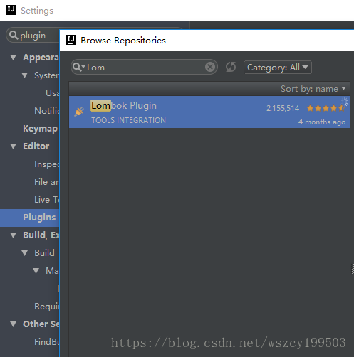

# 1 SpringBoot 入门

## 1.1 第一个Spring Boot应用

### 1.1.1 创建项目

IDEA—&gt;File—&gt;New—&gt;Project—&gt;Spring Initializr 


```java
@SpringBootApplication
public class DemoApplication {

    public static void main(String[] args) {
        SpringApplication.run(DemoApplication.class, args);
    }
}
```

Run ‘DemoApplication‘，访问8080端口


```java
@RestController
public class HelloController {

    @GetMapping(value = "/hello")
    public String say() {
        return "Hello Spring Boot!";
    }
}
```

访问localhost:8080/hello，页面输出Hello Spring Boot!

#### 其他启动方式

1. 命令行进入项目目录下，运行`mvn spring-boot:run`
2. mvn install 把程序编译，进入target目录下，多出一个.jar文件`java -jar girl-0.0.1-SNAPSHOT.jar`

## 1.2 项目属性配置

application.properties：

```properties
server.port=8080
server.servlet.context-path=/demo
```

application.yml：

```yml
server:
  port: 8080
  servlet: 
    context-path: /demo
```

.yml文件格式：后面必须有一个空格，这两种配置保留一个即可。

### 1.2.1 配置变量

```java
cupSize: B
age: 18
```

HelloController:

```java
@RestController
public class HelloController {

    @Value("${cupSize}")
    private String cupSize;

    @GetMapping(value = "/hello")
    public String say() {
        return cupSize + " " + age;
    }
}
```

打印 B 18

### 1.2.2 配置中使用配置

```java
// application.properties
content: "cupSize: ${cupSize}, age: ${age}"

@Value("${content}")
private String content;

@GetMapping(value = "/hello")
public String say() {
   return content;
}
```

打印 cupSize: B, age: 18

### 1.2.3 多配置变量

```java
girl:
  cupSize: B
  age: 18
```

```java
/**
 * 定义Spring管理Bean
 * 获取前缀是girl的配置
 */
@Component
@ConfigurationProperties(prefix = "girl")
public class GirlProperties {
    private String cupSize;

    private Integer age;

    public String getCupSize() {
        return cupSize;
    }

    public void setCupSize(String cupSize) {
        this.cupSize = cupSize;
    }

    public Integer getAge() {
        return age;
    }

    public void setAge(Integer age) {
        this.age = age;
    }
}

@RestController
public class HelloController {

    @Autowired
    private GirlProperties girlProperties;

    @GetMapping(value = "/hello")
    public String say() {
        return girlProperties.getCupSize();
    }
}
```

## 1.3 开发环境和生产环境

application.yml只保留:

```yml
spring:
  profiles:
    active: dev
```

application-dev.yml:

```yml
server:
  port: 8080
  context-path: /girl
girl:
  cupSize: B
  age: 18
```

application-prod.yml:

```yml
server:
  port: 8081
  context-path: /girl
girl:
  cupSize: F
  age: 18
```

可以使用其他方法启动：`java -jar girl-0.0.1-SNAPSHOT.jar –spring.profiles.active=prod`

## 1.4 Controller的使用

```xml
<!-- spring官方模版 -->
<dependency>
	<groupId>org.springframework.boot</groupId>
    <artifactId>spring-boot-starter-thymeleaf</artifactId>
</dependency>
```

新建resources/templates/index.html

```java
// 此处使用 @Controller
// @RestController = @Controller + @ResponseBody
@Controller
public class HelloController {
    @GetMapping("/index")
    public String hello() {
        return "index";
    }
}
```

模版生效。类似于java web的jsp，不过使用的引擎是thymeleaf。其他（freemarker）。

### 1.4.1 多路径访问

```java
@Controller
public class HelloController {
    //  @GetMapping = @RequestMapping(method = RequestMethod.GET)
    @GetMapping({"/index", "/hello"})
    public String hello() {
        return "index";
    }
}
```

修改方法为RequestMethod.POST，使用postman访问

如果不写method参数，任何请求方式都可以访问。

### 1.4.2 处理URL的参数

@PathVariable 获取url中的数据

@RequestParam 获取请求参数的值

```java
@RestController
public class HelloController {
    @GetMapping(value = "/hello/{id}")
    public String say(@PathVariable("id") Integer id) {
        return "id: " + id;
    }
}
```

```java
@RestController
public class HelloController {
    @GetMapping(value = "/hello")
    public String say(@RequestParam("id") Integer myId) {
        return "id: " + myId;
    }
}
```

```java
@RestController
public class HelloController {
    @GetMapping(value = "/hello")
    public String say(@RequestParam(value = "id", required = false, defaultValue = "0") Integer myId) {
        return "id: " + myId;
    }
}
```

## 1.5 数据库操作

`JPA(Java Persistence API)`定义了一系列对象持久化的标准，目前实现这一规范的产品有Hibenate、TopLikn等。  Spring-Data-Jpa，就是Spring对Hibenate的整合。

```xml
<dependency>
	<groupId>org.springframework.boot</groupId>
    <artifactId>spring-boot-starter-data-jpa</artifactId>
</dependency>

<dependency>
    <groupId>mysql</groupId>
    <artifactId>mysql-connector-java</artifactId>
</dependency>
```

application.yml:

```yml
spring:
  profiles:
    active: dev
  datasource:
    driver-class-name: com.mysql.cj.jdbc.Driver
    url: jdbc:mysql://127.0.0.1:3306/spring?useUnicode=true&characterEncoding=utf8&serverTimezone=Asia/Shanghai
    username: root
    password: root
  jpa:
    hibernate:
      # create-drop在应用停下来时就会把表全部删掉
      # none什么都不做
      # validate会验证类里面的数据是否和表中一致，如果不一致会报错
      # create在运行时自动创建表，每次都会建一个空的表，之前有这个表会先删掉
      # ddl-auto: create
      # 之前有这个表不会删掉，会保留着
      ddl-auto: update
    # 控制台打印sql
    show-sql: true
```

```java
@Entity
public class Girl {

    @Id
    @GeneratedValue
    private Integer id;  //自增

    private String cupSize;

    private Integer age;

    /**
     * 必须有一个无参构造器，不然数据库生成会报错
     */
    public Girl() {
    }

    public Integer getId() {
        return id;
    }

    public void setId(Integer id) {
        this.id = id;
    }

    public String getCupSize() {
        return cupSize;
    }

    public void setCupSize(String cupSize) {
        this.cupSize = cupSize;
    }

    public Integer getAge() {
        return age;
    }

    public void setAge(Integer age) {
        this.age = age;
    }
}
```


### 1.5.1 RestFul API

```java
public interface GirlRepository extends JpaRepository<Girl, Integer> {

    /**
     * 通过年龄来查询，方法名一定按照这个格式来写
     * @param age
     * @return
     */
    List<Girl> findByAge(Integer age);

}

@RestController
public class GirlController {

    @Autowired
    private GirlRepository girlRepository;

    /**
     * 查询所有女生列表
     * @return
     */
    @GetMapping(value = "/girls")
    public List<Girl> girlList() {
        return girlRepository.findAll();
    }

    /**
     * 添加一个女生
     * @param cupSize
     * @param age
     * @return
     */
    @PostMapping(value = "/girls")
    public Girl girlAdd(@RequestParam("cupSize") String cupSize,
                          @RequestParam("age") Integer age) {
        Girl girl = new Girl();
        girl.setCupSize(cupSize);
        girl.setAge(age);

        return girlRepository.save(girl);
    }

    @GetMapping(value = "/girls/{id}")
    public Girl girlFindOne(@PathVariable("id") Integer id) {
        return girlRepository.findOne(id);
    }

    @PutMapping(value = "/girls/{id}")
    public Girl girlUpdate(@PathVariable("id") Integer id,
                           @RequestParam("cupSize") String cupSize,
                           @RequestParam("age") Integer age) {
        Girl girl = new Girl();
        girl.setId(id);
        girl.setCupSize(cupSize);
        girl.setAge(age);

        return girlRepository.save(girl);
    }

    @DeleteMapping(value = "/girls/{id}")
    public void girlDelete(@PathVariable("id") Integer id) {
        girlRepository.delete(id);
    }

   //通过年龄查询
    @GetMapping(value = "/girls/age/{age}")
    public List<Girl> girlListByAge(@PathVariable("age") Integer age) {
        return girlRepository.findByAge(age);
    }
}
```

PUT要使用x-www-form-urlencoded


## 1.6 事务管理

```java
@Service
public class GirlService {

    @Autowired
    private GirlRepository girlRepository;

    public void insertTwo() {
        Girl girlA = new Girl();
        girlA.setCupSize("A");
        girlA.setAge(18);
        girlRepository.save(girlA);

        Girl girlB = new Girl();
        girlB.setCupSize("BBBB");
        girlB.setAge(19);
        girlRepository.save(girlB);
    }
}

@RestController
public class GirlController {
    @Autowired
    private GirlService girlService;

    @PostMapping(value = "/girls/two")
    public void girlTwo() {
        girlService.insertTwo();
    }
}
```

修改数据库的cupSize字段的长度为1  此时会报错：

```markdown
com.mysql.jdbc.MysqlDataTruncation: Data truncation: Data too long for column ‘cup_size’ at row 1  
```

但是A可以插入成功，B插入失败。

为方法添加`import org.springframework.transaction.annotation.Transactional;`注解，就会产生事务。

## 1.7 表单验证

修改Girl类：

```java
@NotBlank(message = "这个字段必传")
private String cupSize;

@Min(value = 18, message = "未成年少女禁止入内")
private Integer age;

@NotNull(message = "金额必传")
private Double money;
```

修改PUT方法：

```java
@PostMapping(value = "/girls")
public Girl girlAdd(@Valid Girl girl, BindingResult bindingResult) {
	if (bindingResult.hasErrors()) {   					                         	System.out.println(
        	bindingResult.getFieldError().getDefaultMessage());
         return null;
    }
    girl.setCupSize(girl.getCupSize());
    girl.setAge(girl.getAge());

    return girlRepository.save(girl);
}
```

# 2 SpringBoot 进阶

## 2.1 AOP统一处理请求日志

AOP是一种编程范式，与语言无关，是一种程序设计思想。

面向切面（AOP）Aspect Oriented Programming，利用横切技术，将面向对象构建的庞大的类的体系进行水平的切割，并且会将那些影响到了多个类的公共行为封装成一个可重用模块，这个模块称为切面。（将通用逻辑从业务逻辑中分离出来）  

面向对象（OOP）Object Oriented Programming，将需求功能垂直划分为不同的并且相对独立的，会封装成良好的类并且让它们有属于自己的行为  

面向过程（POP）Procedure Oriented Programming


```xml
<dependency>
	<groupId>org.springframework.boot</groupId>
    <artifactId>spring-boot-starter-aop</artifactId>
</dependency>
```

```java
@Aspect
@Component
public class HttpAspect {

    @Before("execution(public * com.imooc.controller.GirlController.*(..))")
    public void log() {
        System.out.println(111111111);
    }

    @After("execution(public * com.imooc.controller.GirlController.*(..))")
    public void doAfter() {
        System.out.println(222222222);
    }
}
```

改良：

```java
@Aspect
@Component
public class HttpAspect {

    @Pointcut("execution(public * com.imooc.controller.GirlController.*(..))")
    public void log() {
    }

    @Before("log()")
    public void doBefore() {
        System.out.println(11111111);
    }

    @After("log()")
    public void doAfter() {
        System.out.println(222222222);
    }
}
```

使用Logger：

```java
@Aspect
@Component
public class HttpAspect {

    private final static Logger logger = Logger.getLogger(HttpAspect.class);

    @Pointcut("execution(public * com.imooc.controller.GirlController.*(..))")
    public void log() {
    }

    @Before("log()")
    public void doBefore() {
        logger.info("1111111");
    }

    @After("log()")
    public void doAfter() {
        logger.info("2222222");
    }
}
```

```java
@Aspect
@Component
public class HttpAspect {

    private final static Logger logger = LoggerFactory.getLogger(HttpAspect.class);

    @Pointcut("execution(public * com.imooc.controller.GirlController.*(..))")
    public void log() {
    }

    @Before("log()")
    public void doBefore(JoinPoint joinPoint) {
        ServletRequestAttributes attributes = (ServletRequestAttributes) RequestContextHolder.getRequestAttributes();
        HttpServletRequest request = attributes.getRequest();
        //url
        logger.info("url={}", request.getRequestURL());
        //method
        logger.info("method={}", request.getMethod());
        //ip
        logger.info("ip={}", request.getRemoteAddr());
        //类方法
        logger.info("class_method={}", joinPoint.getSignature().getDeclaringTypeName() + "." + joinPoint.getSignature().getName());
        //参数
        logger.info("args={}", joinPoint.getArgs());
    }

    @After("log()")
    public void doAfter() {
        logger.info("2222222");
    }

    @AfterReturning(returning = "object",pointcut = "log()")
    public void doAfterReturning(Object object) {
        logger.info("response={}", object);
    }
}
```

## 2.2 统一异常处理

```java
/**
 * http请求返回的最外层对象
 */
public class Result<T> {

    /** 错误码. */
    private Integer code;

    /** 提示信息. */
    private String msg;

    /** 具体内容. */
    private T data;

    public Integer getCode() {
        return code;
    }

    public void setCode(Integer code) {
        this.code = code;
    }

    public String getMsg() {
        return msg;
    }

    public void setMsg(String msg) {
        this.msg = msg;
    }

    public T getData() {
        return data;
    }

    public void setData(T data) {
        this.data = data;
    }
}

public class ResultUtil {

    public static Result success(Object object) {
        Result result = new Result();
        result.setCode(0);
        result.setMsg("成功");
        result.setData(object);
        return result;
    }

    public static Result success() {
        return success(null);
    }

    public static Result error(Integer code, String msg) {
        Result result = new Result();
        result.setCode(code);
        result.setMsg(msg);
        return result;
    }
}

@PostMapping(value = "/girls")
public Result girlAdd(@Valid Girl girl, BindingResult bindingResult) {
	if (bindingResult.hasErrors()) {
		return ResultUtil.error(1, bindingResult.getFieldError().getDefaultMessage());
    }
    girl.setCupSize(girl.getCupSize());
    girl.setAge(girl.getAge());

    return ResultUtil.success(girlRepository.save(girl));
}
```

GirlService：

```java
public void getAge(Integer id) throws Exception {
        Girl girl = girlRepository.findOne(id);
        Integer age = girl.getAge();
        if (age < 10 ) {
            throw new Exception("你还在上小学吧");
        } else if (age > 10 && age < 16) {
            throw new Exception("你可能在上初中");
        }
    }
```

Controller：

```java
@GetMapping(value = "girls/getAge/{id}")
    public void getAge(@PathVariable("id") Integer id) throws Exception {
        girlService.getAge(id);
    }
```

```java
@ControllerAdvice
public class ExceptionHandle {
    @ExceptionHandler(value = Exception.class)
    @ResponseBody
    public Result handle(Exception e) {
        return ResultUtil.error(100, e.getMessage());
    }
}
```

### 2.2.1 定义带有错误码的异常

自定义异常：

```java
//抛出Exception是不会进行事务回滚的
public class GirlException extends RuntimeException {

    private Integer code;

    public GirlException(Integer code, String message) {
        super(message);
        this.code = code;
    }

    public Integer getCode() {
        return code;
    }

    public void setCode(Integer code) {
        this.code = code;
    }
}


@ControllerAdvice
public class ExceptionHandle {

    private final static Logger logger = LoggerFactory.getLogger(ExceptionHandle.class);

    @ExceptionHandler(value = Exception.class)
    @ResponseBody
    public Result handle(Exception e) {
        if (e instanceof GirlException) {
            GirlException girlException = (GirlException) e;
            return ResultUtil.error(girlException.getCode(), girlException.getMessage());
        } else {
            logger.error("【系统异常】{}", e);
            return ResultUtil.error(-1, "未知错误");
        }
    }
}
```

### 2.2.2 统一管理错误码和提示

修改GirlException:

```java
public GirlException(ResultEnum resultEnum) {
        super(resultEnum.getMsg());
        this.code = resultEnum.getCode();
    }
```

修改GirlService:

```java
public void getAge(Integer id) throws Exception {
        Girl girl = girlRepository.findOne(id);
        Integer age = girl.getAge();
        if (age < 10 ) {
            throw new GirlException(ResultEnum.PRIMARY_SCHOOL);
        } else if (age > 10 && age < 16) {
            throw new GirlException(ResultEnum.MIDDLE_SCHOOL);
        }
    }
```

添加ResultEnum:

```java
public enum  ResultEnum {
    UNKONW_ERROR(-1, "未知错误"),
    SUCCDESS(0, "成功"),
    PRIMARY_SCHOOL(100, "你可能还在上小学"),
    MIDDLE_SCHOOL(101, "你可能在上初中")
    ;


    private Integer code;

    private String msg;

    ResultEnum(Integer code, String msg) {
        this.code = code;
        this.msg = msg;
    }

    public Integer getCode() {
        return code;
    }

    public String getMsg() {
        return msg;
    }
}
```

## 2.3 单元测试

GirlService:

```java
public Girl findOne(Integer id) {
	return girlRepository.findOne(id);
}
```

测试类：

```java
@RunWith(SpringRunner.class)
@SpringBootTest
public class GirlServiceTest {

    @Autowired
    private GirlService girlService;

    @Test
    public void findOneTest() {
        Girl girl = girlService.findOne(11);
        Assert.assertEquals(new Integer(10), girl.getAge());
    }
}/*
java.lang.AssertionError: 
Expected :10
Actual   :9
*/
```

### 2.3.1 使用IDEA自带功能


### 2.3.2 Controller测试

```java
@RunWith(SpringRunner.class)
@SpringBootTest
@AutoConfigureMockMvc
public class GirlControllerTest {

    @Autowired
    private MockMvc mockMvc;

    @Test
    public void girlList() throws Exception {
        mockMvc.perform(MockMvcRequestBuilders.get("/girls"))
                .andExpect(MockMvcResultMatchers.status().isOk());
                //.andExpect(MockMvcResultMatchers.content().string("abc"));
    }
}
```

在项目打包时会自动执行单元测试。  跳过单元测试：

`mvn clean package -Dmaven.test.ship=true`

## 2.4 @DynamicUpdate注解

```java
@Entity
public class ProductCategory {
    /** 类目id. */
    @Id
    @GeneratedValue
    private Integer categoryId;

    /** 类目名字. */
    private String categoryName;

    /** 类目编号. */
    private Integer categoryType;

    private Date createTime;

    // 数据库设置，根据当前时间戳更新
    private Date updateTime;
}
@Test
public void saveTest() {
    ProductCategory productCategory = repository.findOne(1);
    productCategory.setCategoryType(1);
    repository.save(productCategory);
}
```

执行 sql 为：

```sql
/** update_time 没有更新 **/
/** update_time虽设置了根据当前时间戳更新，但是 sql 中包含update_time的更新，不会触发自动更新时间 **/
update product_category set category_name=?, category_type=?, create_time=?, update_time=? where category_id=?
```

在 ProductCategory 添加 @DynamicUpdate，再次进行修改，update_time 就会进行修改（需要修改为其他 categoryType 的值）。  

```sql
/** update_time 更新 **/
update product_category set category_type=? where category_id=?
```

@DynamicUpdate 表示比较更新要使用的实体类中的字段值与从数据库中查询出来的字段值，判断其是否有修改。看这个例子，数据库中 id=1 的记录所有字段只有 categoryType 被修改，其他字段都没改变，所以只是 categoryType 字段被更新为了新的值。

## 2.5 快捷 getter and setter

添加依赖

```xml
<dependency>
	<groupId>org.projectlombok</groupId>
    <artifactId>lombok</artifactId>
</dependency>
```

还需 idea 插件 lombok：


在 ProductCategory 添加@Date注解，就不许在生成getter和setter方法，toString()等方法。  如果只需要getter方法，只需添加@Getter，setter同理。

## 2.6  javax.transaction.Transactional

测试成功后，测试数据不影响数据库数据。与service中的事务不同，这里的Transactional在测试完成后，无论是否发生异常，都会将所有数据库操作回滚。

```java
@Test
@Transactional
public void saveTest() {
	ProductCategory productCategory = new ProductCategory("男生最爱", 4);
    ProductCategory result = repository.save(productCategory);
    // 断言方法
    Assert.assertNotNull(result);
    //Assert.assertNotEquals(null, result);
}
```

## 2.7 @JsonProperty

```java
@JsonProperty("id")
private String productId;
```

productId为了让我们看清楚字段的含义，id为接口要求的返回值。

## 2.8 BeanUtils

Spring提供的一个工具类：  

```java
BeanUtils.copyProperties(productInfo, productInofVO);  
```

把productInfo对象的属性值copy到productInofVO中去。

## 2.9 分页

org.springframework.data.domain.Page

```java
public interface OrderMasterRepository extends JpaRepository<OrderMaster, String> {
    Page<OrderMaster> findByBuyerOpenid(String buyerOpenid, Pageable pageable);
}
```

测试：

```java
@RunWith(SpringRunner.class)
@SpringBootTest
public class OrderMasterRepositoryTest {

    @Autowired
    private OrderMasterRepository repository;

    private final String OPENID = "110110";

    @Test
    public void findByBuyerOpenid() {
        // 第一个参数表示第几页，第二个表示一页几个
        PageRequest request = new PageRequest(0,1);

        Page<OrderMaster> result = repository.findByBuyerOpenid(OPENID, request);
        Assert.assertNotEquals(0, result.getTotalElements());
    }
}
```

## 2.10 @Transient

javax.persistence.Transient  在与数据库对照的实体类中，某个字段添加这个注解，会忽略掉这个字段。

## 2.11 日期转换之JsonSerialize

```java
public class Date2LongSerializer extends JsonSerializer<Date> {

    @Override
    public void serialize(Date date, JsonGenerator jsonGenerator, SerializerProvider serializerProvider) throws IOException, JsonProcessingException {
        jsonGenerator.writeNumber(date.getTime() / 1000);
    }
}

@Data
public class OrderDTO {

    /** ... */

    @JsonSerialize(using = Date2LongSerializer.class)
    private Date createTime;

    @JsonSerialize(using = Date2LongSerializer.class)
    private Date updateTime;
}
```

在返回结果OrderDTO时，会处理器时间。

## 2.12 实体类参数查询到为null的不显示

单个实体类配置，类头添加注解@JsonInclude(JsonInclude.Include.NON_NULL)

全局配置：

```java
spring:
  jackson:
    default-property-inclusion: non_null
```

忽略方法：

@JsonIgnore

## 2.13 异常捕获

```java
@ControllerAdvice
public class SellexceptionHandler {

    @ExceptionHandler(value = SellException.class)
    @ResponseBody
    public ResultVO handlerSellerException(SellException e) {
        return ResultVOUtil.error(e.getCode(), e.getMessage());
    }

    @ExceptionHandler(value = SellerAuthorizeException.class)
    @ResponseStatus(HttpStatus.FORBIDDEN)
    public void handlerSellerAuthorizeException(SellerAuthorizeException e) {

    }
}
```

# 3 日志框架

一套能实现日志输出的工具包，能够描述系统运行状态的所有时间都可以算作日志（用户下线、接口超时、数据库崩溃、hello world）。

## 3.1 日志框架的能力

定制输出目标

定制输出格式

携带上下文信息

运行时选择性输出

灵活的配置

优异的性能

## 3.2 常见的日志框架

日志门面(日志实现的抽象层)：

JCL：apache自带的common logging

SLF4j

jboss-logging

日志实现：

Log4j

Log4j2

Logback

UL：JDK自带的log

选择SLF4j和Logback同一个作者。

## 3.3 测试日志

```java
@RunWith(SpringRunner.class)
@SpringBootTest
public class LoggerTest {

    private final Logger logger = LoggerFactory.getLogger(LoggerTest.class);

    @Test
    public void test1() {
        logger.debug("debug...");
        // 系统默认日志级别为info，不会打印debug
        logger.info("info...");
        logger.error("error...");
    }

}
```

打印：  2018-06-20 11:43:20.782 INFO 11620 — [ main] com.imooc.LoggerTest : info…  2018-06-20 11:43:20.782 ERROR 11620 — [ main] com.imooc.LoggerTest : error…

```java
package org.slf4j.event;

public enum Level {
    ERROR(40, "ERROR"),
    WARN(30, "WARN"),
    INFO(20, "INFO"),
    DEBUG(10, "DEBUG"),
    TRACE(0, "TRACE");
}
```

## 3.4 @Slf4j的使用

添加依赖：

```xml
<dependency>
    <groupId>org.projectlombok</groupId>
    <artifactId>lombok</artifactId>
</dependency>
```

```java
@RunWith(SpringRunner.class)
@SpringBootTest
@Slf4j
public class LoggerTest {

    @Test
    public void test1() {
        log.debug("debug...");
        log.info("info...");
        log.error("error...");
    }

}
```

如果还不能解析log：  

1.需要安装插件：  



2.可能是idea的版本过低

## 3.5 打印变量

```java
String name = "zcy";
String password = "123456";
log.info("name: {}, password: {}", name, password);
```

## 3.6 Logback的配置

第一种方式：application.yml：

```yml
# 配置日志格式
logging:
  pattern:
    console: "%d - %msg%n"
  # 日志生成的路径，不受console影响
  path: /var/log/tomcat/
  # 自定义名字
  file: /var/log/tomcat/sell.log
  level: debug
  # 指定到某个类的级别限制
  # level:
      # com.imooc.LoggerTest: debug
```

第二种方式：logback-spring.xml

```xml
<?xml version="1.0" encoding="UTF-8"?>

<configuration>

    <appender name="consoleLog" class="ch.qos.logback.core.ConsoleAppender">
        <layout class="ch.qos.logback.classic.PatternLayout">
            <pattern>
                %d - %msg%n
            </pattern>
        </layout>
    </appender>

    <appender name="fileInfoLog" class="ch.qos.logback.core.rolling.RollingFileAppender">
        <filter class="ch.qos.logback.classic.filter.LevelFilter">
            <level>ERROR</level>
            <onMatch>DENY</onMatch>
            <onMismatch>ACCEPT</onMismatch>
        </filter>
        <encoder>
            <pattern>
                %msg%n
            </pattern>
        </encoder>
        <!--滚动策略-->
        <rollingPolicy class="ch.qos.logback.core.rolling.TimeBasedRollingPolicy">
            <!--路径-->
            <fileNamePattern>/var/log/tomcat/sell/info.%d.log</fileNamePattern>
        </rollingPolicy>
    </appender>

    <appender name="fileErrorLog" class="ch.qos.logback.core.rolling.RollingFileAppender">
        <filter class="ch.qos.logback.classic.filter.ThresholdFilter">
            <level>ERROR</level>
        </filter>
        <encoder>
            <pattern>
                %msg%n
            </pattern>
        </encoder>
        <!--滚动策略-->
        <rollingPolicy class="ch.qos.logback.core.rolling.TimeBasedRollingPolicy">
            <!--路径-->
            <fileNamePattern>/var/log/tomcat/sell/error.%d.log</fileNamePattern>
        </rollingPolicy>
    </appender>

    <root level="info">
        <appender-ref ref="consoleLog"/>
        <appender-ref ref="fileInfoLog"/>
        <appender-ref ref="fileErrorLog"/>
    </root>

</configuration>
```

------

