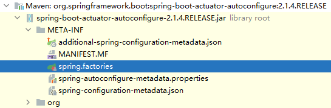
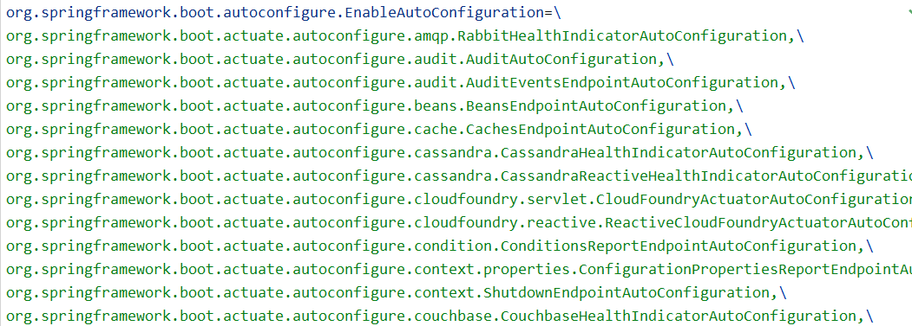
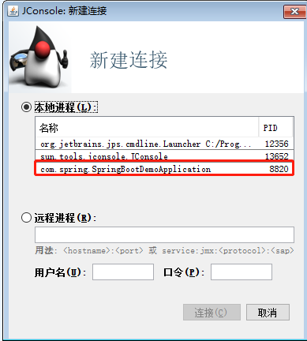
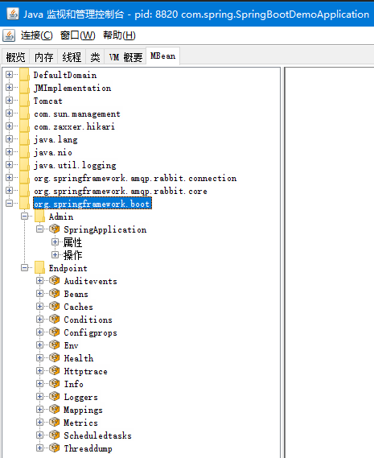

# 1 什么是 springboot 

SpringBoot 框架是为了能够帮助使用 Spring 框架的开发者快速高效的构建一个基于 Spirng 框架以及 Spring 生态体系的应用解决方案。它是对`约定优于配置`这个理念下的一个最佳实践。因此它是一个服务于框架的框架，服务的范围是简化配置文件。

# 2 约定优于配置的体现

约定优于配置的体现主要是

1. maven 的目录结构 

   a) 默认有 resources 文件夹存放配置文件 

   b) 默认打包方式为 jar 

2. spring-boot-starter-web 中默认包含 spring mvc 相关依赖以及内置的 tomcat 容器，使得构建一个 web 应用更加简单 

3. 默认提供 application.properties/yml 文件 

4. 默认通过 spring.profiles.active 属性来决定运行环境时读取的配置文件 

5. EnableAutoConfiguration 默认对于依赖的 starter 进行自动装载

# 3 从 SpringBootApplication 注解入手 

为了揭开 springboot 的奥秘，我们直接从 Annotation 入手，看看@SpringBootApplication 里面，做了什么？ 

打开 SpringBootApplication 这个注解，可以看到它实际上是一个复合注解：

```java
@Target(ElementType.TYPE)
@Retention(RetentionPolicy.RUNTIME)
@Documented
@Inherited
// 内部是一个@Configuration
@SpringBootConfiguration
@EnableAutoConfiguration
@ComponentScan(excludeFilters = {
		@Filter(type = FilterType.CUSTOM, classes = TypeExcludeFilter.class),
		@Filter(type = FilterType.CUSTOM,
				classes = AutoConfigurationExcludeFilter.class) })
```

SpringBootApplication 本质上是由 3 个注解组成，分别是：

1. @Configuration 
2. @EnableAutoConfiguration 
3. @ComponentScan 

我们可以直接用这三个注解也可以启动 springboot 应用， 只是每次配置三个注解比较繁琐，所以直接用一个复合注解更方便些。 然后仔细观察者三个注解，除了 EnableAutoConfiguration 可能稍微陌生一点，其他两个注解使用得都很多。

## 3.1 Configuration

Configuration 这个注解大家应该有用过，它是 JavaConfig 形式的基于 Spring IOC 容器的配置类使用的一种注解。因为 SpringBoot 本质上就是一个 spring 应用，所以通过这个注解来加载 IOC 容器的配置是很正常的。所以在启动类里面标注了@Configuration，意味着它其实也是一个 IoC 容器的配置类。

传统意义上的 spring 应用都是基于 xml 形式来配置 bean 的依赖关系。然后通过 spring 容器在启动的时候，把 bean 进行初始化并且，如果 bean 之间存在依赖关系，则分析这些已经在 IoC 容器中的 bean 根据依赖关系进行组装。

直到 Java5 中，引入了 Annotations 这个特性，Spring 框架也紧随大流并且推出了基于 Java 代码和 Annotation 元信息的依赖关系绑定描述的方式。也就是 JavaConfig。 从 spring3 开始，spring 就支持了两种 bean 的配置方式， 一种是基于 xml 文件方式、另一种就是 JavaConfig 任何一个标注了@Configuration 的 Java 类定义都是一个 JavaConfig 配置类。而在这个配置类中，任何标注了 @Bean 的方法，它的返回值都会作为 Bean 定义注册到 Spring 的 IOC 容器，方法名默认成为这个 bean 的 id。

## 3.2 ComponentScan 

ComponentScan 这个注解是大家接触得最多的了，相当于 xml 配置文件中的。 它的主要作用就是扫描指定路径下的标识了需要装配的类，自动装配到 spring 的 Ioc 容器中。 

标识需要装配的类的形式主要是： @Component 、 @Repository、@Service、@Controller 这类的注解标识的类。

ComponentScan 默认会扫描当前 package 下的所有加了相关注解标识的类到 IoC 容器中；

```java
@ComponentScan(basePackages = "com.spring.core.firstDemo")
public class ConfigurationMain {
    public static void main(String[] args) {
        // new AnnotationConfigApplicationContext(ConfigurationDemo.class);
        AnnotationConfigApplicationContext context = new AnnotationConfigApplicationContext(ConfigurationMain.class);
        String[] defNames = context.getBeanDefinitionNames();
        for(int i = 0;i < defNames.length; i++){
            System.out.println(defNames[i]);
        }
    }
}
@Configuration
public class ConfigurationDemo {
    /*@Bean
    public DemoClass demoClass() {
        return new DemoClass();
    }*/
}
@Service
public class DemoClass {
    public void say(){
        System.out.println("Say: Hello Mic");
    }
}
```

## 3.3 EnableAutoConfiguration

我们把 EnableAutoConfiguration 放在最后讲的目的并不是说它是一个新的东西，只是他对于 springboot 来说意义重大。

### 3.3.1 Enable 并不是新鲜玩意

仍然是在 spring3.1 版本中，提供了一系列的@Enable 开头的注解，Enable 主机应该是在 JavaConfig 框架上更进一 步的完善，是的用户在使用 spring 相关的框架是，避免配置大量的代码从而降低使用的难度。

比如常见的一些 Enable 注解：EnableWebMvc，（这个注解引入了 MVC 框架在 Spring 应用中需要用到的所有 bean）； 

比如说@EnableScheduling，开启计划任务的支持； 

找到 EnableAutoConfiguration，我们可以看到每一个涉及到 Enable 开头的注解，都会带有一个@Import 的注解。 

```java
@Import(AutoConfigurationImportSelector.class)
public @interface EnableAutoConfiguration {
	......
}
```

### 3.3.2 Import 注解

import 注解是什么意思呢？ 联想到 xml 形式下有一个形式的注解，就明白它的作用了。 import 就是`把多个分来的容器配置合并在一个配置中`。在 JavaConfig 中所表达的意义是一样的。

```java
public class SecondMain {
    public static void main(String[] args) {
        AnnotationConfigApplicationContext context = new AnnotationConfigApplicationContext(SecondConfig.class);
        String[] defNames = context.getBeanDefinitionNames();
        for(int i = 0;i < defNames.length; i++){
            System.out.println(defNames[i]);
        }
    }
}
@Import(OtherConfig.class)
@Configuration
public class SecondConfig {
    @Bean
    public SecondDemo secondDemo() {
        return new SecondDemo();
    }
}
public class SecondDemo {
}
// 不同包的类
@Configuration
public class OtherConfig {
    @Bean
    public OtherDemo otherDemo() {
        return new OtherDemo();
    }
}
public class OtherDemo {
}
```

# 4 深入分析 EnableAutoConfiguration

EnableAutoConfiguration 的主要作用其实就是帮助 springboot 应用把所有符合条件的@Configuration 配置都加载到当前 SpringBoot 创建并使用的 IoC 容器中。 再回到 EnableAutoConfiguration 这个注解中，我们发现它的 import 是这样：

```java
@Import(AutoConfigurationImportSelector.class) 
```

## 4.1 AutoConfigurationImportSelector

Enable 注解不仅仅可以像前面演示的案例一样很简单的实现多个 Configuration 的整合，还可以实现一些复杂的场景，比如可以根据上下文来激活不同类型的 bean， @Import 注解可以配置三种不同的 class：

1. 第一种就是前面演示过的，基于普通 bean 或者带有 @Configuration 的 bean 进行注入
2. 实现 `ImportSelector 接口`进行动态注入 
3. 实现 ImportBeanDefinitionRegistrar 接口进行动态注入

```java
public class CacheService {
}

public class CacheImportSelector implements ImportSelector {
    @Override
    public String[] selectImports(AnnotationMetadata importingClassMetadata) {
        //动态注入bean :自己去实现判断逻辑实现动态配置
        Map<String,Object> attributes=
                importingClassMetadata.getAnnotationAttributes(EnableDefineService.class.getName());

        //返回的是一个固定的CacheService
        return new String[]{CacheService.class.getName()};
    }
}

public class LoggerService {
}

public class LoggerDefinitionRegistrar implements ImportBeanDefinitionRegistrar {
    @Override
    public void registerBeanDefinitions(AnnotationMetadata importingClassMetadata, BeanDefinitionRegistry registry) {
        Class beanClass=LoggerService.class;
        RootBeanDefinition beanDefinition=new RootBeanDefinition(beanClass);
        String beanName= StringUtils.uncapitalize(beanClass.getSimpleName());
        registry.registerBeanDefinition(beanName,beanDefinition);
    }
}

@Target(ElementType.TYPE)
@Retention(RetentionPolicy.RUNTIME)
@Documented
@Inherited
@Import({LoggerDefinitionRegistrar.class, CacheImportSelector.class})
public @interface EnableDefineService {
    //配置一些方法
    Class<?>[] exclude() default {};
}

@SpringBootApplication
@EnableDefineService
public class ThirdDemoMain {
    public static void main(String[] args) {
        ConfigurableApplicationContext ca= SpringApplication.run(ThirdDemoMain.class,args);

        System.out.println(ca.getBean(CacheService.class));
        System.out.println(ca.getBean(LoggerService.class));
    }
}
```

## 4.2 @EnableAutoConfiguration 注解的实现原理

了解了 ImportSelector 和 ImportBeanDefinitionRegistrar 后，对于 EnableAutoConfiguration 的理解就容易一些了。

它会通过 import 导入第三方提供的 bean 的配置类 AutoConfigurationImportSelector：

```java
@Override
public String[] selectImports(AnnotationMetadata annotationMetadata) {
	if (!isEnabled(annotationMetadata)) {
		return NO_IMPORTS;
	}
	AutoConfigurationMetadata autoConfigurationMetadata = AutoConfigurationMetadataLoader
			.loadMetadata(this.beanClassLoader);
	AutoConfigurationEntry autoConfigurationEntry = getAutoConfigurationEntry(
			autoConfigurationMetadata, annotationMetadata);
	return StringUtils.toStringArray(autoConfigurationEntry.getConfigurations());
}

protected AutoConfigurationEntry getAutoConfigurationEntry(
		AutoConfigurationMetadata autoConfigurationMetadata,
		AnnotationMetadata annotationMetadata) {
	if (!isEnabled(annotationMetadata)) {
		return EMPTY_ENTRY;
	}
	AnnotationAttributes attributes = getAttributes(annotationMetadata);
	List<String> configurations = getCandidateConfigurations(annotationMetadata,
			attributes);
	configurations = removeDuplicates(configurations);
	Set<String> exclusions = getExclusions(annotationMetadata, attributes);
	checkExcludedClasses(configurations, exclusions);
	configurations.removeAll(exclusions);
	configurations = filter(configurations, autoConfigurationMetadata);
	fireAutoConfigurationImportEvents(configurations, exclusions);
	return new AutoConfigurationEntry(configurations, exclusions);
}

protected List<String> getCandidateConfigurations(AnnotationMetadata metadata,
		AnnotationAttributes attributes) {
	List<String> configurations = SpringFactoriesLoader.loadFactoryNames(
			getSpringFactoriesLoaderFactoryClass(), getBeanClassLoader());
	Assert.notEmpty(configurations,
			"No auto configuration classes found in META-INF/spring.factories. If you "
					+ "are using a custom packaging, make sure that file is correct.");
	return configurations;
}

protected Class<?> getSpringFactoriesLoaderFactoryClass() {
	return EnableAutoConfiguration.class;
}
```

从名字来看，可以猜到它是基于 ImportSelector 来实现基于动态 bean 的加载功能。之前我们讲过 Springboot @Enable 注解的工作原理 ImportSelector 接口 selectImports 返回的数组（类的全类名）都会被纳入到 spring 容器中。 

那么可以猜想到这里的实现原理也一定是一样的，定位到 AutoConfigurationImportSelector 这个类中的 selectImports 方法本质上来说，其实 EnableAutoConfiguration 会帮助 springboot 应用把所有符合@Configuration 配置都加载到当前 SpringBoot 创建的 IoC 容器，而这里面借助了 Spring 框架提供的一个工具类 SpringFactoriesLoader 的支持。以及用到了 Spring 提供的条件注解 @Conditional，选择性的针对需要加载的 bean 进行条件过滤。

## 4.3 SpringFactoriesLoader

在这里简单分析一下 SpringFactoriesLoader 这个工具类的使用。它其实和 java 中的 SPI 机制的原理是一样的，不过它比 SPI 更好的点在于不会一次性加载所有的类，而是根据 key 进行加载。 首先， SpringFactoriesLoader 的作用是从 `classpath/META-INF/spring.factories` 文件中，根据 key 来加载对应的类到 spring IoC 容器中。

```java
public static final String FACTORIES_RESOURCE_LOCATION = "META-INF/spring.factories";
public static List<String> loadFactoryNames(Class<?> factoryClass, @Nullable ClassLoader classLoader) {
	String factoryClassName = factoryClass.getName();
	return loadSpringFactories(classLoader).getOrDefault(factoryClassName, Collections.emptyList());
}

private static Map<String, List<String>> loadSpringFactories(@Nullable ClassLoader classLoader) {
	MultiValueMap<String, String> result = cache.get(classLoader);
	if (result != null) {
		return result;
	}
	try {
		Enumeration<URL> urls = (classLoader != null ?
				classLoader.getResources(FACTORIES_RESOURCE_LOCATION) :
				ClassLoader.getSystemResources(FACTORIES_RESOURCE_LOCATION));
		result = new LinkedMultiValueMap<>();
		while (urls.hasMoreElements()) {
			URL url = urls.nextElement();
			UrlResource resource = new UrlResource(url);
			Properties properties = PropertiesLoaderUtils.loadProperties(resource);
			for (Map.Entry<?, ?> entry : properties.entrySet()) {
				String factoryClassName = ((String) entry.getKey()).trim();
				for (String factoryName : StringUtils.commaDelimitedListToStringArray((String) entry.getValue())) {
					result.add(factoryClassName, factoryName.trim());
				}
			}
		}
		cache.put(classLoader, result);
		return result;
	}
	catch (IOException ex) {
		throw new IllegalArgumentException("Unable to load factories from location [" +
				FACTORIES_RESOURCE_LOCATION + "]", ex);
	}
}
```

## 4.4 深入理解条件过滤 

在分析 AutoConfigurationImportSelector 的源码时，会先扫描 `spring-autoconfiguration-metadata.properties` 文件，最后在扫描 spring.factories 对应的类时，会结合前面的元数据进行过滤，为什么要过滤呢？ 

原因是很多的 @Configuration 其实是依托于其他的框架来加载的， 如果当前的 classpath 环境下没有相关联的依赖，则意味着这些类没必要进行加载，所以，通过这种条件过滤可以有效的减少@configuration 类的数量从而降低 SpringBoot 的启动时间。 

```java
// AutoConfigurationImportSelector.selectImports()
AutoConfigurationMetadata autoConfigurationMetadata = AutoConfigurationMetadataLoader
		.loadMetadata(this.beanClassLoader);

// AutoConfigurationMetadataLoader.java
protected static final String PATH = "META-INF/"
		+ "spring-autoconfigure-metadata.properties";

public static AutoConfigurationMetadata loadMetadata(ClassLoader classLoader) {
	return loadMetadata(classLoader, PATH);
}

static AutoConfigurationMetadata loadMetadata(ClassLoader classLoader, String path) {
	try {
		Enumeration<URL> urls = (classLoader != null) ? classLoader.getResources(path)
				: ClassLoader.getSystemResources(path);
		Properties properties = new Properties();
		while (urls.hasMoreElements()) {
			properties.putAll(PropertiesLoaderUtils
					.loadProperties(new UrlResource(urls.nextElement())));
		}
		return loadMetadata(properties);
	}
	catch (IOException ex) {
		throw new IllegalArgumentException(
				"Unable to load @ConditionalOnClass location [" + path + "]", ex);
	}
}
```

### 4.4.1 Conditional 中的其他注解

Conditions 描述 

@ConditionalOnBean 在存在某个 bean 的时候 

@ConditionalOnMissingBean 不存在某个 bean 的时候 

@ConditionalOnClass 当前 classpath 可以找到某个类型的类时 

@ConditionalOnMissingClass 当前 classpath 不可以找到某个类型的类时 

@ConditionalOnResource 当前 classpath 是否存在某个资源文件 

@ConditionalOnProperty 当前 jvm 是否包含某个系统属性为某个值 

@ConditionalOnWebApplication 当前 spring context 是否是 web 应用程序

## 4.5 示例

### 4.5.1 starter 项目

```xml
<dependency>
	<groupId>org.springframework</groupId>
    <artifactId>spring-context</artifactId>
    <version>4.3.16.RELEASE</version>
</dependency>
```

resources/META-INF/spring.factories：

```factories
org.springframework.boot.autoconfigure.EnableAutoConfiguration=com.spring.core.SpringConfig
```

```java
@Configuration
public class SpringConfig {
    @Bean
    public SpringCore springCore(){
        return new SpringCore();
    }
}

public class SpringCore {
    public String study(){
        System.out.println("good good study, day day up");
        return "SpringEdu.com";
    }
}
```

resources/META-INF/spring-autoconfigure-metadata.properties：

```properties
com.spring.core.SpringConfig.ConditionalOnClass=com.spring.fourthDemo.TestClass
```

### 4.5.2 当前项目

引入 starter 项目 maven 路径。

```java
@SpringBootApplication
public class FourthDemo {
    public static void main(String[] args) {
        ConfigurableApplicationContext ca= SpringApplication.run(FourthDemo.class,args);
        System.out.println(ca.getBean(SpringCore.class).study());
    }
}
```

直接运行：

```markdown
Exception in thread "main" org.springframework.beans.factory.NoSuchBeanDefinitionException: No qualifying bean of type 'com.spring.core.SpringCore' available
	at org.springframework.beans.factory.support.DefaultListableBeanFactory.getBean(DefaultListableBeanFactory.java:343)
	at org.springframework.beans.factory.support.DefaultListableBeanFactory.getBean(DefaultListableBeanFactory.java:335)
	at org.springframework.context.support.AbstractApplicationContext.getBean(AbstractApplicationContext.java:1123)
	at com.spring.fourthDemo.FourthDemo.main(FourthDemo.java:18)
```

当前项目添加 com.spring.fourthDemo.TestClass 类，项目即可正常启动运行。

# 5 Starter

`Starter` 是 Spring Boot 中的一个非常重要的概念，Starter 相当于模块，它能将模块所需的依赖整合起来并对模块内的 Bean 根据环境（ 条件）进行自动配置。使用者只需要依赖相应功能的 Starter，无需做过多的配置和依赖，Spring Boot 就能自动扫描并加载相应的模块。 

在 Maven 的依赖中加入 spring-boot-starter-web 就能使项目支持 Spring MVC，并且 Spring Boot 还为我们做了很多默认配置，无需再依赖 spring-web、 spring-webmvc 等相关包及做相关配置就能够立即使用起来。

SpringBoot 存在很多`开箱即用`的 Starter 依赖，使得我们在开发业务代码时能够非常方便的、不需要过多关注框架的配置，而只需要关注业务即可。

## 5.1 spring-boot-starter-logging

在实际应用中，日志是最重要的一个组件： 

1. 它可以为系统提供错误以及日常的定位
2. 也可以对访问的记录进行跟踪
3. 当然，在很多大型的互联网应用中，基于日志的收集以及分析可以了解用户的用户画像，比如兴趣爱好、点击 行为。

### 5.1.1 常见的日志框架

可能是太过于常见了，所以使得大家很少关注，只是要用到的时候复制粘贴一份就行，甚至连日志配置文件中的配 置语法都不清楚。另外一方面，Java 中提供的日志组件太 多了，一会儿 log4j，一会儿 logback，一会儿又是 log4j2。

不清楚其中的关联 Java 中常用的日志框架： Log4j、Log4j2、Commons Logging、Slf4j、Logback、Jul(Java Util Logging) 

### 5.1.2 简单介绍日志的发展历史

最早的日志组件是 Apache 基金会提供的 Log4j，log4j 能够通过配置文件轻松的实现日志系统的管理和多样化配置，所以很快被广泛运用。也是我们接触得比较早和比较多的日志组件。它几乎成了 Java 社区的日志标准。

据说 Apache 基金会还曾经建议 Sun 引入 Log4j 到 java 的标准库中，但 Sun 拒绝了。 所以 sun 公司在 java1.4 版本中，增加了日志库(Java Util Logging)。其实现基本模仿了 Log4j 的实现。在 JUL 出来以前，Log4j 就已经成为一项成熟的技术，使得 Log4j 在选择上占据了一定的优势 Apache 推出的 JUL 后，有一些项目使用 JUL，也有一些项目使用 log4j，这样就造成了开发者的混乱，因为这两个日志组件没有关联，所以要想实现统一管理或者替换就非常 困难。怎么办呢？

这个状况交给你来想想办法，你该如何解决呢？<font color=red>进行抽象， 抽象出一个接口层，对每个日志实现都适配，这样这些提供给别人的库都直接使用抽象层即可。</font>

这个时候又轮到 Apache 出手了，它推出了一个 Apache Commons Logging 组件，JCL 只是定义了一套日志接口 (其内部也提供一个 Simple Log 的简单实现)，支持运行时动态加载日志组件的实现，也就是说，在你应用代码里， 只需调用 Commons Logging 的接口，底层实现可以是 Log4j，也可以是 Java Util Logging。

由于它很出色的完成了主流日志的兼容，所以基本上在后 面很长一段时间，是无敌的存在。连 spring 也都是依赖 JCL 进行日志管理。

但是故事并没有结束，原 Log4J 的作者，它觉得 Apache Commons Logging 不够优秀，所以他想搞一套更优雅的方案，于是 slf4j 日志体系诞生了，slf4j 实际上就是一个日志门面接口，它的作用类似于 Commons Loggins。 并且他还为 slf4j 提供了一个日志的实现 logback。 

因此大家可以发现 Java 的日志领域被划分为两个大营： Commons Logging 和 slf4j。

另外，还有一个 log4j2 是怎么回事呢？ 因为 slf4j 以及它的实现 logback 出来以后，很快就赶超了原本 apache 的 log4j 体系，所以 apache 在 2012 年重写了 log4j， 成立了新的项目 Log4j2。

总的来说，日志的整个体系分为日志框架和日志系统：

日志框架：JCL/ Slf4j 

日志系统：Log4j、Log4j2、Logback、JUL。

 而在我们现在的应用中，绝大部分都是使用 slf4j 作为门面， 然后搭配 logback 或者 log4j2 日志系统。

## 5.2 starter 项目示例

### 5.2.1 starter 项目

```xml
<dependencies>
    <dependency>
        <groupId>org.springframework.boot</groupId>
        <artifactId>spring-boot-starter</artifactId>
        <version>2.1.6.RELEASE</version>
    </dependency>
    <dependency>
        <groupId>com.alibaba</groupId>
        <artifactId>fastjson</artifactId>
        <version>1.2.56</version>
        <optional>true</optional><!--可选-->
    </dependency>
    <!-- 配置相关 -->
    <dependency>
        <groupId>org.springframework.boot</groupId>
        <artifactId>spring-boot-configuration-processor</artifactId>
        <version>2.1.6.RELEASE</version>
        <optional>true</optional>
    </dependency>
</dependencies>
```

定义 Format：

```java
public interface FormatProcessor {
    public <T> String format(T obj);
}

public class JsonFormatProcessor implements FormatProcessor {
    @Override
    public <T> String format(T obj) {
        return "JsonFormatProcessor:"+ JSON.toJSONString(obj);
    }
}

public class StringFormatProcessor implements FormatProcessor {
    @Override
    public <T> String format(T obj) {
        return "StringFormatProcessor:"+ Objects.toString(obj);
    }
}
```

配置 Configuration：

```java
@Configuration
public class FormatAutoConfiguration {

    @ConditionalOnMissingClass("com.alibaba.fastjson.JSON")
    @Bean
    @Primary
    public FormatProcessor stringFormatProcessor() {
        return new StringFormatProcessor();
    }

    @ConditionalOnClass(name = "com.alibaba.fastjson.JSON")
    @Bean
    public FormatProcessor jsonFormatProcessor() {
        return new JsonFormatProcessor();
    }
}

@ConfigurationProperties(prefix=HelloProperties.HELLO_FORMAT_PREFIX)
public class HelloProperties {
    public static final String HELLO_FORMAT_PREFIX="xiaoxiao.hello.format";

    private Map<String,Object> info;

    public Map<String, Object> getInfo() {
        return info;
    }

    public void setInfo(Map<String, Object> info) {
        this.info = info;
    }
}

public class HelloFormatTemplate {
    private FormatProcessor formatProcessor;

    private HelloProperties helloProperties;

    public HelloFormatTemplate(HelloProperties helloProperties,FormatProcessor formatProcessor) {
        this.helloProperties=helloProperties;
        this.formatProcessor = formatProcessor;
    }

    public <T> String doFormat(T obj){

        StringBuilder stringBuilder=new StringBuilder();
        stringBuilder.append("begin:Execute format").append("<br/>");
        stringBuilder.append("HelloProperties:").append(formatProcessor.format(helloProperties.getInfo())).append("<br/>");
        stringBuilder.append("Obj format result:").append(formatProcessor.format(obj)).append("<br/>");
        return stringBuilder.toString();

    }
}

@Import(FormatAutoConfiguration.class)
@EnableConfigurationProperties(HelloProperties.class)
@Configuration
public class HelloAutoConfiguration {
    @Bean
    public HelloFormatTemplate helloFormatTemplate(HelloProperties helloProperties, FormatProcessor formatProcessor){
        return new HelloFormatTemplate(helloProperties,formatProcessor);
    }
}
```

resources/META-INF/spring.factories：

```markdown
org.springframework.boot.autoconfigure.EnableAutoConfiguration=\
  com.spring.starter.autoconfiguration.HelloAutoConfiguration
```

### 5.2.2 项目加载 starter

```xml
<dependency>
    <groupId>com.spring</groupId>
    <artifactId>demo-spring-boot-starter</artifactId>
    <version>1.0-SNAPSHOT</version>
</dependency>
```

```yml
xiaoxiao:
  hello:
    format:
      info:
        sex: '美女'
        age: 18
```

```java
@Autowired
HelloFormatTemplate helloFormatTemplate;

@GetMapping("/format")
public String format(){
    User user=new User();
    user.setId(1);
    user.setAccount("Xiaoxiao");
    return helloFormatTemplate.doFormat(user);
}
```

如果当前项目引入了 fastjson，则使用 JsonFormat 打印，否则使用 StringFormat。

```
begin:Execute format
HelloProperties:JsonFormatProcessor:{"sex":"美女","age":18}
Obj format result:JsonFormatProcessor:{"account":"Xiaoxiao","id":1}
```

# 6 SpringBoot 另一大神器 Actuator

微服务应用开发完成以后，最终目的是为了发布到生产环境上给用户试用，开发结束并不意味着研发的生命周期结 束，更多的时候他只是一个开始，因为服务在本地测试完成以后，并不一定能够非常完善的考虑到各种场景。所以 需要通过运维来保障服务的稳定。 

在以前的传统应用中，我们可以靠人工来监控。但是微服务中，几千上万个服务，我们需要了解每个服务的健康状 态，就必须要依靠监控平台来实现。 

所以在 SpringBoot 框架中提供了 spring-boot-starter-actuator 自动配置模块来支持对于 SpringBoot 应用的监控。

## 6.1 Actuator

Spring Boot Actuator 的关键特性是在应用程序里提供众多 Web 端点，通过它们了解应用程序运行时的内部状况。 有了 Actuator，你可以知道 Bean 在 Spring 应用程序上下 文里是如何组装在一起的，掌握应用程序可以获取的环境属性信息 在 spring-boot 项目中，添加 actuator 的一个 starter。

```xml
<dependency>
    <groupId>org.springframework.boot</groupId>
    <artifactId>spring-boot-starter-actuator</artifactId>
</dependency>
```

## 6.2 Actuator 提供的 endpoint

启动服务之后，可以通过下面这个地址看到 actuator 提供的所有 Endpoint 地址。

 http://localhost:8080/actuator

可以看到非常多的 Endpoint。 有一些 Endpoint 是不能访问的，涉及到安全问题。 

如果想开启访问那些安全相关的 url ，可以在 application.properties 中配置， 开启所有的 endpoint：

```properties
management.endpoints.web.exposure.include=* 
```

**health**

针对当前 SpringBoot 应用的健康检查，默认情况下，会通过“up”或者“down”; 可以基于下面这个配置，来打印 heath 更详细的信息：

```properties
management.endpoint.health.show-details=always
```

**Loggers**

显示当前 spring-boot 应用中的日志配置信息，针对每个 package 对应的日志级别

**beans**

获取当前 spring-boot 应用中 IoC 容器中所有的 bean

**Dump**

获取活动线程的快照

**Mappings**

返回全部的 uri 路径，以及和控制器的映射关系

**conditions**

显示当前所有的条件注解，提供一份自动配置生效的条件 情况，记录哪些自动配置条件通过了，哪些没通过 

**shutdown**

关闭应用程序，需要添加这个配置：

```properties
management.endpoint.shutdown.enabled=true
```

这个 Endpoint 是比较危险的，如果没有一定的安全保 障，不要开启

**Env**

获取全部的环境信息

## 6.3 关于 health 的原理

应用健康状态的检查应该是监控系统中最基本的需求，所以我们基于 health 来分析一下它是如何实现的。 

SpringBoot 预先通过 `org.springframework.boot.actuate.autoconfigure.health.HealthIndicatorAutoConfiguration` 这个就是基于 springboot 的自动装配来载入的。 所以，我们可以在 actuator-autoconfigure 这个包下找到 spring.factories。



Actuator 中提供了非常多的扩展点，默认情况下提供了一些常见的服务的监控检查的支持。 

DataSourceHealthIndicator 

DiskSpaceHealthIndicator 

RedisHealthIndicator… 

其中，有一些服务的检查，需要依赖于当前应用是否集成了对应的组件，比如 redis，如果没有集成，那么 RedisHealthIndicatorAutoConfiguration 就不会被装载。 因为它有 condition 的条件判断。



## 6.4 Actuator 对于 JMX 支持

除了 REST 方式发布的 Endpoint，Actuator 还把它的端点以 JMX MBean 的方式发布出来，可以通过 JMX 来查看和管理。

### 6.4.1 操作步骤

在 cmd 中输入 jconsole，连接到 spring-boot 的应用：



就可以看到 JBean 的信息以及相应的操作。比如可以在操作菜单中访问 shutdown 的 endpoint 来关闭服：



## 6.5 什么是 JMX

JMX 全称是 Java Management Extensions。 Java 管理扩展。它提供了对 Java 应用程序和 JVM 的监控和管理功能。 通过 JMX，我们可以监控：

1. 服务器中的各种资源的使用情况，CPU、内存
2. JVM 内存的使用情况 
3. JVM 线程使用情况 

比如前面讲的 Actuator 中，就是基于 JMX 的技术来实现 对 endpoint 的访问。

------

