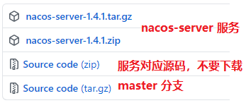
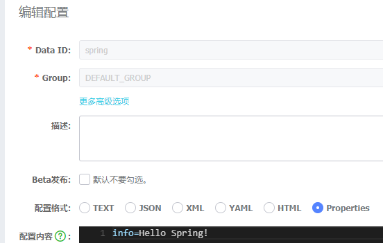

# 1 什么是 Nacos

Nacos 用于发现、配置和管理微服务。Nacos 提供了一组简单易用的特性集，快速实现动态服务发现、服务配置、服务元数据及流量管理。

Nacos 是构建以“服务”为中心的现代应用架构 (例如微服务范式、云原生范式) 的服务基础设施。

# 2 Nacos 基本使用

下载 releases https://github.com/alibaba/nacos/releases




## 2.1 快速开始

```shell
# 源码目录运行
mvn -Prelease-nacos -Dmaven.test.skip=true clean install -U
cd distribution/target/nacos-server-$version/nacos/bin
# 启动服务器
sh startup.sh -m standalone
```

也可以直接从 [最新稳定版本](https://github.com/alibaba/nacos/releases) 下载 `nacos-server` 包，解压运行 bin 目录 startup.sh 启动服务器。



## 2.2 Nacos Spring Boot

```xml
<!-- 版本 0.2.x.RELEASE 对应的是 Spring Boot 2.x 版本，版本 0.1.x.RELEASE 对应的是 Spring Boot 1.x 版本 -->
<dependency>
    <groupId>com.alibaba.boot</groupId>
    <artifactId>nacos-config-spring-boot-starter</artifactId>
    <version>0.2.7</version>
</dependency>
```

```yml
nacos:
  config:
    server-addr: localhost:8848
```

```java
// dataId groupId 用于进行配置隔离
// dataId 是一个数据集
// group 是分组
@RestController
@NacosPropertySource(dataId = "spring", groupId = "DEFAULT_GROUP", autoRefreshed = true)
public class NacosController {
	// hello Nacos 表示本地属性，降级
    @NacosValue(value = "${info:hello Nacos}", autoRefreshed = true)
    private String info;

    @GetMapping("nacos")
    public String nacos() {
        return info;
    }
}
```

> Nacos 提供两种方式来访问和改变配置信息：
>
> Open API(上诉 Spring Boot 加载配置我呢见)
>
> SDK(如下)

## 2.3 SDK 方式

```xml
<dependency>
    <groupId>com.alibaba.nacos</groupId>
    <artifactId>nacos-client</artifactId>
    <version>1.4.1</version>
</dependency>
```

```java
public class NacosSdkDemo {
    private static final String SERVER_ADDR = "localhost:8848";
    private static final String DATA_ID = "spring";
    private static final String GROUP_ID = "DEFAULT_GROUP";

    public static void main(String[] args) {
        Properties properties = new Properties();
        properties.put("serverAddr", SERVER_ADDR);

        try {
            ConfigService configService = NacosFactory.createConfigService(properties);
            String info = configService.getConfig(DATA_ID, GROUP_ID, 3000);
            System.out.println(info);
		   // 监听
            configService.addListener(DATA_ID, GROUP_ID, new Listener() {
                @Override
                public Executor getExecutor() {
                    return null;
                }
                @Override
                public void receiveConfigInfo(String configInfo) {
                    System.out.println("配置改变==》" + configInfo);
                }
            });
            System.in.read();
        } catch (Exception e) {
            e.printStackTrace();
        }
    }
}
```

## 2.4 配置数据库

Nacos 在单机模式下默认使用内置数据库 `derby`。

### 使用 MySQL

1. 创建数据库 nacos-config 并运行 `nacos/conf/nacos-mysql.sql` 的 SQL 文件

2. 修改 `nacos/conf/application.properties` 配置

   ```properties
   #*************** Config Module Related Configurations ***************#
   ### If use MySQL as datasource:
   spring.datasource.platform=mysql
   
   ### Count of DB:
   db.num=1
   
   ### Connect URL of DB:
   db.url.0=jdbc:mysql://127.0.0.1:3306/nacos-config?characterEncoding=utf8&connectTimeout=1000&socketTimeout=3000&autoReconnect=true&useUnicode=true&useSSL=false&serverTimezone=UTC
   db.user.0=root
   db.password.0=root
   ```

3. 使用 MySQL，必须在集群模式下，所以这里在 nacos/conf/ 目录下创建一个 cluster.conf

   ```
   locahost
   locahost
   locahost
   ```

4. 集群模式启动 Nacos

   ```shell
   sh startup.sh -m cluster
   ```

# 3 源码分析

## 3.1 实例化 NacosConfigService

以 NacosFactory.createConfigService(properties) 为入口：

```java
// ConfigFactory.java
public static ConfigService createConfigService(Properties properties) throws NacosException {
    try {
        // 通过反射实例化一个 NacosConfigService
        Class<?> driverImplClass = Class.forName("com.alibaba.nacos.client.config.NacosConfigService");
        Constructor constructor = driverImplClass.getConstructor(Properties.class);
        ConfigService vendorImpl = (ConfigService) constructor.newInstance(properties);
        return vendorImpl;
    } catch (Throwable e) {
        throw new NacosException(NacosException.CLIENT_INVALID_PARAM, e);
    }
}
// NacosConfigService.java
public NacosConfigService(Properties properties) throws NacosException {
    ValidatorUtils.checkInitParam(properties);
    String encodeTmp = properties.getProperty(PropertyKeyConst.ENCODE);
    if (StringUtils.isBlank(encodeTmp)) {
        this.encode = Constants.ENCODE;
    } else {
        this.encode = encodeTmp.trim();
    }
    initNamespace(properties);
    // 通过装饰器模式初始化一个 Http 连接的代理对象，http的方式去发起请求
    // MetricsHttpAgent 中做了一个监控和统计
    this.agent = new MetricsHttpAgent(new ServerHttpAgent(properties));
    this.agent.start();
    this.worker = new ClientWorker(this.agent, this.configFilterChainManager, properties);
}

// clientWorker -> 具体的工作相关
public ClientWorker(final HttpAgent agent, final ConfigFilterChainManager configFilterChainManager,
            final Properties properties) {
		this.agent = agent;
    this.configFilterChainManager = configFilterChainManager;
        
    // Initialize the timeout parameter
    init(properties);
        
    this.executor = Executors.newScheduledThreadPool(1, new ThreadFactory() {
        @Override
        public Thread newThread(Runnable r) {
            Thread t = new Thread(r);
            // 自定义线了线程名称
            t.setName("com.alibaba.nacos.client.Worker." + agent.getName());
            t.setDaemon(true);
            return t;
        }
    });
        
    // 长轮询线程池
    this.executorService = Executors
        .newScheduledThreadPool(Runtime.getRuntime().availableProcessors(), new ThreadFactory() {
        @Override
        public Thread newThread(Runnable r) {
            Thread t = new Thread(r);
            t.setName("com.alibaba.nacos.client.Worker.longPolling." + agent.getName());
            t.setDaemon(true);
            return t;
        }
    });
    // 指定延迟执行，延迟 1 ms 每次执行的间隔是 10 ms
    // 不断检查有没有新的分组需要分配长轮询线程
    this.executor.scheduleWithFixedDelay(new Runnable() {
        @Override
        public void run() {
            try {
                // 检查配置
                checkConfigInfo();
            } catch (Throwable e) {
                LOGGER.error("[" + agent.getName() + "] [sub-check] rotate check error", e);
            }
        }
    }, 1L, 10L, TimeUnit.MILLISECONDS);
}
public void checkConfigInfo() {
    // Dispatch taskes. 分任务，解决了大数据量的长轮询
    int listenerSize = cacheMap.size();
    // Round up the longingTaskCount. 向上取整为整数
    int longingTaskCount = (int) Math.ceil(listenerSize / ParamUtil.getPerTaskConfigSize());
    if (longingTaskCount > currentLongingTaskCount) {
        for (int i = (int) currentLongingTaskCount; i < longingTaskCount; i++) {
            // 为每一个分组分配一个长轮询线程
            executorService.execute(new LongPollingRunnable(i));
        }
        currentLongingTaskCount = longingTaskCount;
    }
}
```

## 3.2 注册 listener

可以看到此处使用了一个内存缓存 cacheMap，cacheMap 会在添加 listener 的时候填充：

```java
// main 方法中在通过 configServer.addListener() 
public void addListener(String dataId, String group, Listener listener) throws NacosException {
    worker.addTenantListeners(dataId, group, Arrays.asList(listener));
}
// ClientWorker.java
public void addTenantListeners(String dataId, String group, List<? extends Listener> listeners) throws NacosException {
    group = null2defaultGroup(group);
    String tenant = agent.getTenant();
    CacheData cache = addCacheDataIfAbsent(dataId, group, tenant);
    for (Listener listener : listeners) {
        cache.addListener(listener);
    }
}
public CacheData addCacheDataIfAbsent(String dataId, String group, String tenant) throws NacosException {
    // 根据 dataId group tenant 生成 cacheMap 的 key
    // 不同 dataId 不同的 CacheData
    String key = GroupKey.getKeyTenant(dataId, group, tenant);
    CacheData cacheData = cacheMap.get(key);
    if (cacheData != null) {
        return cacheData;
    }

    cacheData = new CacheData(configFilterChainManager, agent.getName(), dataId, group, tenant);
    // 如果不存在（新的entry），那么会向map中添加该键值对，并返回null
	// 如果已经存在，那么不会覆盖已有的值，直接返回已经存在的值
    CacheData lastCacheData = cacheMap.putIfAbsent(key, cacheData);
    if (lastCacheData == null) {
        // 是否在监听器注册时主动去向远端拉取当前最新的配置信息
        if (enableRemoteSyncConfig) {
            String[] ct = getServerConfig(dataId, group, tenant, 3000L);
            cacheData.setContent(ct[0]);
        }
        int taskId = cacheMap.size() / (int) ParamUtil.getPerTaskConfigSize();
        cacheData.setTaskId(taskId);
        lastCacheData = cacheData;
    }
    ...
}
// CacheData.java
public CacheData(ConfigFilterChainManager configFilterChainManager, String name, String dataId, String group,
            String tenant) {
    if (null == dataId || null == group) {
        throw new IllegalArgumentException("dataId=" + dataId + ", group=" + group);
    }
    this.name = name;
    this.configFilterChainManager = configFilterChainManager;
    this.dataId = dataId;
    this.group = group;
    this.tenant = tenant;
    listeners = new CopyOnWriteArrayList<ManagerListenerWrap>();
    this.isInitializing = true;
	// 从本地文件读取配置信息  
    this.content = loadCacheContentFromDiskLocal(name, dataId, group, tenant);
    this.md5 = getMd5String(content);
}
```

## 3.3 创建长轮询线程

> `长轮询` 客户端发起一个请求到服务端，服务端收到客户端的请求后，并不会立刻响应给客户端，而是先把这个请求hold 住，然后服务端会在 hold 住的这段时间检查数据是否有更新，如果有，则响应给客户端，如果一直没有数据变更，则达到一定的时间（长轮训时间间隔）才返回。

回到 checkConfigInfo 的 for 循环代码，其中通过 LongPollingRunnable 创建多个线程对缓存中的配置进行检查。

```java
class LongPollingRunnable implements Runnable {
    
    private final int taskId;
    
    public LongPollingRunnable(int taskId) {
        this.taskId = taskId;
    }
    
    @Override
    public void run() {
        
        List<CacheData> cacheDatas = new ArrayList<CacheData>();
        List<String> inInitializingCacheList = new ArrayList<String>();
        try {
            // check failover config
            // 拿到缓存集合中属于对应 taskId 的缓存
            for (CacheData cacheData : cacheMap.values()) {
                if (cacheData.getTaskId() == taskId) {
                    cacheDatas.add(cacheData);
                    try {
                        // 检查本地配置（如果有本地配置则使用本地配置，不再使用线上）
                        // cacheData 当前配置中的某一个配置
                        checkLocalConfig(cacheData);
                      	// 内存缓存设置成功后
                        if (cacheData.isUseLocalConfigInfo()) {
                            cacheData.checkListenerMd5();
                        }
                    } catch (Exception e) {
                        LOGGER.error("get local config info error", e);
                    }
                }
            }
            // 远程监控
            List<String> changedGroupKeys = checkUpdateDataIds(cacheDatas, inInitializingCacheList);
            if (!CollectionUtils.isEmpty(changedGroupKeys)) {
                LOGGER.info("get changedGroupKeys:" + changedGroupKeys);
            }
			// 根据服务端提供的发生变化的 dataid 去服务端取配置信息
            for (String groupKey : changedGroupKeys) {
                String[] key = GroupKey.parseKey(groupKey);
                String dataId = key[0];
                String group = key[1];
                String tenant = null;
                if (key.length == 3) {
                    tenant = key[2];
                }
                try {
                    // 根据获取到的发生变化的datdaid 去服务端拿配置信息
                    String[] ct = getServerConfig(dataId, group, tenant, 3000L);
                    CacheData cache = cacheMap.get(GroupKey.getKeyTenant(dataId, group, tenant));
                    // 设置 content 和 md5 值
                    cache.setContent(ct[0]);
                    if (null != ct[1]) {
                        cache.setType(ct[1]);
                    }
                ...
            }
            for (CacheData cacheData : cacheDatas) {
                if (!cacheData.isInitializing() || inInitializingCacheList
                    .contains(GroupKey.getKeyTenant(cacheData.dataId, cacheData.group, cacheData.tenant))) {
                    // 校验 md5
                    cacheData.checkListenerMd5();
                    cacheData.setInitializing(false);
                }
            }
            inInitializingCacheList.clear();

            executorService.execute(this);
            ...
        }
    }
}
```

## 3.4 检查本地配置

```java
private void checkLocalConfig(CacheData cacheData) {
    final String dataId = cacheData.dataId;
    final String group = cacheData.group;
    final String tenant = cacheData.tenant;
    // 本地文件
    // Nacos 优先使用本地配置，如果我们需要在某台机器上使用跟线上环境不同的配置用于调试等场景，可以通过在本地添加配置来达到目的
    // 同时可做容灾使用
    File path = LocalConfigInfoProcessor.getFailoverFile(agent.getName(), dataId, group, tenant);
    // 检查内存缓存中是否使用本地配置标识
    // 检查本地文件是否存在
    // 存在本地文件且 cacheData 未使用本地配置，则使用加载本地配置
    if (!cacheData.isUseLocalConfigInfo() && path.exists()) {
        // 读取本地文件，放到 cacheData
        String content = LocalConfigInfoProcessor.getFailover(agent.getName(), dataId, group, tenant);
        final String md5 = MD5Utils.md5Hex(content, Constants.ENCODE);
        // 使用本地配置
        cacheData.setUseLocalConfigInfo(true);
        cacheData.setLocalConfigInfoVersion(path.lastModified());
        cacheData.setContent(content);

        LOGGER.warn(
            "[{}] [failover-change] failover file created. dataId={}, group={}, tenant={}, md5={}, content={}",
            agent.getName(), dataId, group, tenant, md5, ContentUtils.truncateContent(content));
        return;
    }

    // 使用本地配置，但是配置文件被删除，设置为不使用本地配置，进行下一次轮询
    if (cacheData.isUseLocalConfigInfo() && !path.exists()) {
        cacheData.setUseLocalConfigInfo(false);
        LOGGER.warn("[{}] [failover-change] failover file deleted. dataId={}, group={}, tenant={}", agent.getName(),
                    dataId, group, tenant);
        return;
    }

    // 使用本地配置且文件存在，但是版本不同，同步缓存配置和本地配置
    if (cacheData.isUseLocalConfigInfo() && path.exists() && cacheData.getLocalConfigInfoVersion() != path.lastModified()) {
        String content = LocalConfigInfoProcessor.getFailover(agent.getName(), dataId, group, tenant);
        final String md5 = MD5Utils.md5Hex(content, Constants.ENCODE);
        cacheData.setUseLocalConfigInfo(true);
        cacheData.setLocalConfigInfoVersion(path.lastModified());
        cacheData.setContent(content);
        LOGGER.warn(
            "[{}] [failover-change] failover file changed. dataId={}, group={}, tenant={}, md5={}, content={}",
            agent.getName(), dataId, group, tenant, md5, ContentUtils.truncateContent(content));
    }
}
```

## 3.5 远程监控

本地检查结束之后，回到长轮询程序的后续内容，远程监控：

```java
// 从 server 获取变化了的 dataID
List<String> checkUpdateDataIds(List<CacheData> cacheDatas, List<String> inInitializingCacheList) throws Exception {
    StringBuilder sb = new StringBuilder();
    for (CacheData cacheData : cacheDatas) {
        // 如果使用本地配置，则不进行远程监控
        if (!cacheData.isUseLocalConfigInfo()) {
            sb.append(cacheData.dataId).append(WORD_SEPARATOR);
            sb.append(cacheData.group).append(WORD_SEPARATOR);
            if (StringUtils.isBlank(cacheData.tenant)) {
                sb.append(cacheData.getMd5()).append(LINE_SEPARATOR);
            } else {
                sb.append(cacheData.getMd5()).append(WORD_SEPARATOR);
                sb.append(cacheData.getTenant()).append(LINE_SEPARATOR);
            }
            if (cacheData.isInitializing()) {
                // 当 cacheMap 中的 cacheData 第一次出现时，它会更新
                inInitializingCacheList
                        .add(GroupKey.getKeyTenant(cacheData.dataId, cacheData.group, cacheData.tenant));
            }
        }
    }
    boolean isInitializingCacheList = !inInitializingCacheList.isEmpty();
  	// 把可能发生变化的 dataid 发送到服务端进行判断
  	// 服务端返回发生变化的 dataid
    return checkUpdateConfigStr(sb.toString(), isInitializingCacheList);
}
List<String> checkUpdateConfigStr(String probeUpdateString, boolean isInitializingCacheList) throws Exception {
    Map<String, String> params = new HashMap<String, String>(2);
    params.put(Constants.PROBE_MODIFY_REQUEST, probeUpdateString);
    Map<String, String> headers = new HashMap<String, String>(2);
    // 服务端会根据 Long-Pulling-Timeout 判断是否时长轮询
    headers.put("Long-Pulling-Timeout", "" + timeout);

    // 告诉服务器如果是新数据初始化，不要挂起(直接返回)
    if (isInitializingCacheList) {
        headers.put("Long-Pulling-Timeout-No-Hangup", "true");
    }

    if (StringUtils.isBlank(probeUpdateString)) {
        return Collections.emptyList();
    }

    try {
        long readTimeoutMs = timeout + (long) Math.round(timeout >> 1);
        // 这个请求在服务器端如果对应 dataid 有数据更新、新数据初始化或者超时时候才会返回
        // 超时时间 timeout = Math.max(ConvertUtils.toInt(properties.getProperty(PropertyKeyConst.CONFIG_LONG_POLL_TIMEOUT),Constants.CONFIG_LONG_POLL_TIMEOUT), Constants.MIN_CONFIG_LONG_POLL_TIMEOUT);
        // public static final int CONFIG_LONG_POLL_TIMEOUT = 30000;
        // 默认 30000 ms
        // 实际服务端在 29.5 s 超时，为了保证在网络延迟情况下返回，一般最终时间为 29.5+
        // 请求路径为 "/v1/cs/configs/listener"
        HttpRestResult<String> result = agent
            .httpPost(Constants.CONFIG_CONTROLLER_PATH + "/listener", headers, params, agent.getEncode(),readTimeoutMs);
        ...
}
```

## 3.6 从服务端获取配置信息

长轮询线程拿到服务端发生变化的 dataid 后，会执行 getServerConfig() 方法获取配置信息：

```java
private String getConfigInner(String tenant, String dataId, String group, long timeoutMs) throws NacosException {
    group = null2defaultGroup(group);
    ParamUtils.checkKeyParam(dataId, group);
    ConfigResponse cr = new ConfigResponse();
    
    cr.setDataId(dataId);
    cr.setTenant(tenant);
    cr.setGroup(group);
    
    // 优先使用本地配置
    String content = LocalConfigInfoProcessor.getFailover(agent.getName(), dataId, group, tenant);
    if (content != null) {
        LOGGER.warn("[{}] [get-config] get failover ok, dataId={}, group={}, tenant={}, config={}", agent.getName(),
                dataId, group, tenant, ContentUtils.truncateContent(content));
        cr.setContent(content);
        configFilterChainManager.doFilter(null, cr);
        content = cr.getContent();
        return content;
    }
    
    try {
        String[] ct = worker.getServerConfig(dataId, group, tenant, timeoutMs);
        cr.setContent(ct[0]);
        
        configFilterChainManager.doFilter(null, cr);
        content = cr.getContent();
        
        return content;
    } catch (NacosException ioe) {
        // 连接不成功，捕获但不在抛出
        if (NacosException.NO_RIGHT == ioe.getErrCode()) {
            throw ioe;
        }
        LOGGER.warn("[{}] [get-config] get from server error, dataId={}, group={}, tenant={}, msg={}",
                agent.getName(), dataId, group, tenant, ioe.toString());
    }
    
    LOGGER.warn("[{}] [get-config] get snapshot ok, dataId={}, group={}, tenant={}, config={}", agent.getName(),
            dataId, group, tenant, ContentUtils.truncateContent(content));
    // 连接异常，使用快照文件
    content = LocalConfigInfoProcessor.getSnapshot(agent.getName(), dataId, group, tenant);
    cr.setContent(content);
    configFilterChainManager.doFilter(null, cr);
    content = cr.getContent();
    return content;
}
public String[] getServerConfig(String dataId, String group, String tenant, long readTimeout)
        throws NacosException {
    	...
        result = agent.httpGet(Constants.CONFIG_CONTROLLER_PATH, null, params, agent.getEncode(), readTimeout);
    } catch (Exception ex) {
        // 连接不成功，抛出异常，会在上层捕获
        String message = String
                .format("[%s] [sub-server] get server config exception, dataId=%s, group=%s, tenant=%s",
                        agent.getName(), dataId, group, tenant);
        LOGGER.error(message, ex);
        throw new NacosException(NacosException.SERVER_ERROR, ex);
    }
    
    switch (result.getCode()) {
        case HttpURLConnection.HTTP_OK:
            // 保存本地快照
            LocalConfigInfoProcessor.saveSnapshot(agent.getName(), dataId, group, tenant, result.getData());
            ct[0] = result.getData();
            if (result.getHeader().getValue(CONFIG_TYPE) != null) {
                ct[1] = result.getHeader().getValue(CONFIG_TYPE);
            } else {
                ct[1] = ConfigType.TEXT.getType();
            }
            return ct;
		...
    }
}
```

## 3.7 MD5 校验

获取到更新过的 dataid 配置信息后，后续会对 MD5 值和之前的 MD5 进行比对：

```java
// CacheData.java
public void setContent(String content) {
    this.content = content;
    this.md5 = getMd5String(this.content);
}
void checkListenerMd5() {
    // 遍历自己定义添加的 listener
    for (ManagerListenerWrap wrap : listeners) {
        // md5 值如果不一致
        if (!md5.equals(wrap.lastCallMd5)) {
            safeNotifyListener(dataId, group, content, type, md5, wrap);
        }
    }
}
private void safeNotifyListener(final String dataId, final String group, final String content, final String type,
            final String md5, final ManagerListenerWrap listenerWrap) {
        final Listener listener = listenerWrap.listener;
        
        Runnable job = new Runnable() {
            @Override
            public void run() {
                ClassLoader myClassLoader = Thread.currentThread().getContextClassLoader();
                ClassLoader appClassLoader = listener.getClass().getClassLoader();
                try {
                    if (listener instanceof AbstractSharedListener) {
                        AbstractSharedListener adapter = (AbstractSharedListener) listener;
                        adapter.fillContext(dataId, group);
                        LOGGER.info("[{}] [notify-context] dataId={}, group={}, md5={}", name, dataId, group, md5);
                    }
                    // 执行回调之前先将线程classloader设置为具体webapp的classloader，以免回调方法中调用spi接口是出现异常或错用（多应用部署才会有该问题）。
                    Thread.currentThread().setContextClassLoader(appClassLoader);
                    
                    ConfigResponse cr = new ConfigResponse();
                    cr.setDataId(dataId);
                    cr.setGroup(group);
                    cr.setContent(content);
                    configFilterChainManager.doFilter(null, cr);
                    String contentTmp = cr.getContent();
                  	// 执行自己定义的 receiveConfigInfo 方法
                    listener.receiveConfigInfo(contentTmp);
                    ...
    }
```

## 3.8 Nacos 服务端

### 3.8.1 服务端响应客户端 http 请求

客户端会通过长轮询向服务端请求发生变化的 dataId，路径为 /v1/cs/configs/listener。这是一个 http 请求，可以在服务端代码中找到对应的 ConfigController：

```java
@PostMapping("/listener")
@Secured(action = ActionTypes.READ, parser = ConfigResourceParser.class)
public void listener(HttpServletRequest request, HttpServletResponse response)
        throws ServletException, IOException {
    if (LongPollingService.isSupportLongPolling(request)) {
    	// do long-polling
    	// 长轮询
    	inner.doPollingConfig(request, response, clientMd5Map, probeModify.length());
        return HttpServletResponse.SC_OK + "";
        // else 兼容短轮询逻辑
        ...
    }
}
public String doPollingConfig(HttpServletRequest request, HttpServletResponse response,
        Map<String, String> clientMd5Map, int probeRequestSize) throws IOException {
    
    // Long polling.
    if (LongPollingService.isSupportLongPolling(request)) {
        longPollingService.addLongPollingClient(request, response, clientMd5Map, probeRequestSize);
        return HttpServletResponse.SC_OK + "";
    }
    ...
}
public static boolean isSupportLongPolling(HttpServletRequest req) {
    // public static final String LONG_POLLING_HEADER = "Long-Pulling-Timeout";
    return null != req.getHeader(LONG_POLLING_HEADER);
}
```

在客户端发起请求时设置了 header LONG_POLLING_HEADER，所以此处会走  longPollingService.addLongPollingClient()：

```java
public void addLongPollingClient(HttpServletRequest req, HttpServletResponse rsp, Map<String, String> clientMd5Map,
        int probeRequestSize) {
    // Long-Pulling-Timeout
    String str = req.getHeader(LongPollingService.LONG_POLLING_HEADER);
    // Long-Pulling-Timeout-No-Hangup
    String noHangUpFlag = req.getHeader(LongPollingService.LONG_POLLING_NO_HANG_UP_HEADER);
    // Client-AppName
    String appName = req.getHeader(RequestUtil.CLIENT_APPNAME_HEADER);
    String tag = req.getHeader("Vipserver-Tag");
    // 延迟时间默认 500 ms
    int delayTime = SwitchService.getSwitchInteger(SwitchService.FIXED_DELAY_TIME, 500);
    
    // 客户端发送的超时时间 - 延迟时间
    long timeout = Math.max(10000, Long.parseLong(str) - delayTime);
    // 当然如果 isFixedPolling=true 的情况下，不会提前返回响应
    if (isFixedPolling()) {
        timeout = Math.max(10000, getFixedPollingInterval());
        // Do nothing but set fix polling timeout.
    } else {
    	...
    }
    String ip = RequestUtil.getRemoteIp(req);
    // Must be called by http thread, or send response.
    // 一定要由HTTP线程调用，否则离开后容器会立即发送响应
    final AsyncContext asyncContext = req.startAsync();
    // AsyncContext.setTimeout() is incorrect, Control by oneself
    // AsyncContext.setTimeout()的超时时间不准，所以只能自己控制
    asyncContext.setTimeout(0L);
    // ConfigExecutor.executeLongPolling()实际上就是在线程池中启动线程
    // private static final ScheduledExecutorService LONG_POLLING_EXECUTOR = ExecutorFactory.Managed.newSingleScheduledExecutorService(ClassUtils.getCanonicalName(Config.class),new NameThreadFactory("com.alibaba.nacos.config.LongPolling"));
    // LONG_POLLING_EXECUTOR.execute(runnable);
    ConfigExecutor.executeLongPolling(new ClientLongPolling(asyncContext, clientMd5Map, ip, probeRequestSize, timeout, appName, tag));
}
```

所以在里着重看 ClientLongPolling 的 run() 方法，它是 LongPollingService 的一个内部类：

```java
/**
* 长轮询订阅关系
*/
final Queue<ClientLongPolling> allSubs;
public void run() {
    // 定义一个延迟执行线程
    // 延迟指定时间执行，即是 30000 - 500
    asyncTimeoutFuture = ConfigExecutor.scheduleLongPolling(new Runnable() {
        @Override
        public void run() {
            try {
                getRetainIps().put(ClientLongPolling.this.ip, System.currentTimeMillis());
                
                // Delete subsciber's relations.
                // allSubs队列移除
                allSubs.remove(ClientLongPolling.this);
                ...
                    	// 通过 response 返回给客户端
                        sendResponse(null);
                ...
        }
        
    }, timeoutTime, TimeUnit.MILLISECONDS);
    // allSubs队列添加
    allSubs.add(this);
}
```

我们发现有一个 allSubs 的东西，它似乎和发布订阅有关系。那是不是有可能当前的 clientLongPolling 订阅了数据变化的事件呢？

通过客户端源码分析我们得知，如果服务端配置信息得到修改，服务端无需等待 29500 ms 就提前返回，所以我们需要找到服务端配置修改的代码实现。

### 3.8.2 服务端配置更新通知

```java
// ConfigController.java
@PostMapping
@Secured(action = ActionTypes.WRITE, parser = ConfigResourceParser.class)
public Boolean publishConfig(...) throws NacosException {
    ...
    String betaIps = request.getHeader("betaIps");
    ConfigInfo configInfo = new ConfigInfo(dataId, group, tenant, appName, content);
    configInfo.setType(type);
    if (StringUtils.isBlank(betaIps)) {
        if (StringUtils.isBlank(tag)) {
            persistService.insertOrUpdate(srcIp, srcUser, configInfo, time, configAdvanceInfo, true);
            // 执行完新增或更新操作，进行相关通知
            ConfigChangePublisher
                    .notifyConfigChange(new ConfigDataChangeEvent(false, dataId, group, tenant, time.getTime()));
        }
        ...
    } else {
    ...
}
// ConfigChangePublisher.java
public static void notifyConfigChange(ConfigDataChangeEvent event) {
    if (PropertyUtil.isEmbeddedStorage() && !EnvUtil.getStandaloneMode()) {
        return;
    }
    NotifyCenter.publishEvent(event);
}
// NotifyCenter.java
private static boolean publishEvent(final Class<? extends Event> eventType, final Event event) {
    if (ClassUtils.isAssignableFrom(SlowEvent.class, eventType)) {
        return INSTANCE.sharePublisher.publish(event);
    }
    // 非 SlowEvent
    final String topic = ClassUtils.getCanonicalName(eventType);
    
    EventPublisher publisher = INSTANCE.publisherMap.get(topic);
    if (publisher != null) {
        return publisher.publish(event);
    }
    LOGGER.warn("There are no [{}] publishers for this event, please register", topic);
    return false;
}
// DefaultPublisher.java
public boolean publish(Event event) {
    checkIsStart();
    // 将 evene 添加到队列中
    boolean success = this.queue.offer(event);
    if (!success) {
        receiveEvent(event);
        return true;
    }
    return true;
}
```

### 3.8.3 LongPollingService 注册订阅

配置信息更新后，会在队列中添加 event，但是这个队列在哪里消费?

回到 LongPollingService，在其初始化函数中：

```java
public LongPollingService() {
    allSubs = new ConcurrentLinkedQueue<ClientLongPolling>();
    
    ConfigExecutor.scheduleLongPolling(new StatTask(), 0L, 10L, TimeUnit.SECONDS);
    
    // Register LocalDataChangeEvent to NotifyCenter.
    NotifyCenter.registerToPublisher(LocalDataChangeEvent.class, NotifyCenter.ringBufferSize);
    
    // Register A Subscriber to subscribe LocalDataChangeEvent.
    // 注册订阅
    NotifyCenter.registerSubscriber(new Subscriber() {
        
        @Override
        public void onEvent(Event event) {
            if (isFixedPolling()) {
                // Ignore.
            } else {
                if (event instanceof LocalDataChangeEvent) {
                    LocalDataChangeEvent evt = (LocalDataChangeEvent) event;
                    ConfigExecutor.executeLongPolling(new DataChangeTask(evt.groupKey, evt.isBeta, evt.betaIps));
                }
            }
        }
        
        @Override
        public Class<? extends Event> subscribeType() {
            return LocalDataChangeEvent.class;
        }
    });
    
}
// NotifyCenter#registerSubscriber -> addSubscriber -> DefaultPulisher#addSubscriber
protected final ConcurrentHashSet<Subscriber> subscribers = new ConcurrentHashSet<Subscriber>();
public void addSubscriber(Subscriber subscriber) {
    subscribers.add(subscriber);
}
```

最终将 LongPollingService 中声明的 subscriber 添加到 DefaultPulisher 的 ConcurrentHashSet 中。那么 subscribers 在哪里使用？

### 3.8.4 DefaultPulisher 自旋消费

DefaultPulisher 自身继承自 Thread：

```java
// NotifyCenter.java
static {
    ...
    INSTANCE.sharePublisher = new DefaultSharePublisher();
	INSTANCE.sharePublisher.init(SlowEvent.class, shareBufferSize);
}
// DefaultPulisher 
public void init(Class<? extends Event> type, int bufferSize) {
    setDaemon(true);
    setName("nacos.publisher-" + type.getName());
    this.eventType = type;
    this.queueMaxSize = bufferSize;
    this.queue = new ArrayBlockingQueue<Event>(bufferSize);
    // 启动线程
    start();
}
public void run() {
    openEventHandler();
}
void openEventHandler() {
    try {
        
        // This variable is defined to resolve the problem which message overstock in the queue.
        int waitTimes = 60;
        // To ensure that messages are not lost, enable EventHandler when
        // waiting for the first Subscriber to register
        for (; ; ) {
            if (shutdown || hasSubscriber() || waitTimes <= 0) {
                break;
            }
            ThreadUtils.sleep(1000L);
            waitTimes--;
        }
        
        for (; ; ) {
            if (shutdown) {
                break;
            }
            // 服务端的新增或更新操作会将 evene 添加到队列中
            // 此处从队列中提取 event
            final Event event = queue.take();
            receiveEvent(event);
            UPDATER.compareAndSet(this, lastEventSequence, Math.max(lastEventSequence, event.sequence()));
        }
    } catch (Throwable ex) {
        LOGGER.error("Event listener exception : {}", ex);
    }
}
void receiveEvent(Event event) {
    final long currentEventSequence = event.sequence();
    
    // Notification single event listener
    for (Subscriber subscriber : subscribers) {
        ...
        // 遍历订阅进行通知 
        notifySubscriber(subscriber, event);
    }
}
public void notifySubscriber(final Subscriber subscriber, final Event event) {
    
    LOGGER.debug("[NotifyCenter] the {} will received by {}", event, subscriber);
    
    final Runnable job = new Runnable() {
        @Override
        public void run() {
            // 执行最早定义的 onEvent
            subscriber.onEvent(event);
        }
    };
    
    final Executor executor = subscriber.executor();
    
    if (executor != null) {
        executor.execute(job);
    } else {
        try {
            job.run();
        } catch (Throwable e) {
            LOGGER.error("Event callback exception : {}", e);
        }
    }
}
```

### 3.8.5 DataChangeTask.run

LongPollingService.onEvent() 方法中在线程池执行 DataChangeTask：

```java
public void run() {
    try {
        ConfigCacheService.getContentBetaMd5(groupKey);
        for (Iterator<ClientLongPolling> iter = allSubs.iterator(); iter.hasNext(); ) {
            ClientLongPolling clientSub = iter.next();
            if (clientSub.clientMd5Map.containsKey(groupKey)) {
                // If published tag is not in the beta list, then it skipped.
                // 如果beta发布且不在beta列表直接跳过
                if (isBeta && !CollectionUtils.contains(betaIps, clientSub.ip)) {
                    continue;
                }
                // If published tag is not in the tag list, then it skipped.
                // 如果tag发布且不在tag列表直接跳过
                if (StringUtils.isNotBlank(tag) && !tag.equals(clientSub.tag)) {
                    continue;
                }
                getRetainIps().put(clientSub.ip, System.currentTimeMillis());
                iter.remove(); // Delete subscribers' relationships.
                ...
                // 发送 Response
                clientSub.sendResponse(Arrays.asList(groupKey));
            }
        }
    } catch (Throwable t) {
        LogUtil.DEFAULT_LOG.error("data change error: {}", ExceptionUtil.getStackTrace(t));
    }
}
void sendResponse(List<String> changedGroups) {
    // Cancel time out task.
    if (null != asyncTimeoutFuture) {
        // 取消延迟执行线程
        asyncTimeoutFuture.cancel(false);
    }
    generateResponse(changedGroups);
}
```

# 4 服务注册发现

# 5 集群选举

nacos 的集群类似于 zookeeper， 它分为 leader 角色和 follower 角色， 那么从这个角色的名字可以看出来，这个集群存在选举的机制。 因为如果自己不具备选举功能，角色的命名可能就是 master/slave 了， 当然这只是我基于这么多组件的命名的一个猜测。

## 5.1 选举算法

Nacos 集群采用 `raft` 算法来实现，它是相对 zookeeper 的选举算法较为简单的一种。 选举算法的核心在 `RaftCor` 中，包括数据的处理和数据同步。

[raft 算法演示地址](http://thesecretlivesofdata.com/raft/)

在Raft中，节点有三种角色：

`Leader` 负责接收客户端的请求

`Candidate` 用于选举 Leader 的一种角色

`Follower` 负责响应来自 Leader 或者 Candidate 的请求

选举分为两个节点：

* 服务启动的时候

* leader 挂了的时候

所有节点启动的时候，都是 follower 状态。 如果在一段时间内如果没有收到 leader 的心跳（可能是没有 leader，也可能是 leader 挂了），那么 follower 会变成 Candidate。然后发起选举，选举之前，会增加 term，这个 term 和 zookeeper 中的 epoch 的道理是一样的。 

* follower会投自己一票，并且给其他节点发送票据vote，等到其他节点回复

* 在这个过程中，可能出现几种情况：

  - 收到过半的票数通过，则成为leader

  - 被告知其他节点已经成为leader，则自己切换为follower

  - 一段时间内没有收到过半的投票，则重新发起选举

* 约束条件在`任一 term 中，单个节点最多只能投一票`

选举的几种情况：

* 第一种情况，赢得选举之后，leader 会给所有节点发送消息，避免其他节点触发新的选举

* 第二种情况，比如有三个节点 A B C。A B 同时发起选举，而 A 的选举消息先到达 C，C 给 A 投了一 票，当 B 的消息到达 C 时，已经不能满足上面提到的第一个约束，即 C 不会给 B 投票，而 A 和 B 显然都不会给对方投票。A 胜出之后，会给 B C 发心跳消息，节点 B 发现节点 A 的 term 不低于自己的 term， 知道有已经有 Leader 了，于是转换成follower

* 第三种情况，没有任何节点获得majority投票，可能是平票的情况。假如总共有四个节点A B C D，C 和 D 同时成为了candidate，但 A 投了 D 一票，B 投 了 C 一票，这就出现了`平票 split vote` 的情况。这个时候大家都在等啊等，直到超时后重新发起选举。如果出现平票的情况，那么就延长了系统不可用的时间，因此raft引入了randomized election timeouts 来尽量避免平票情况

## 5.2 数据的处理

对于事务操作，请求会转发给leader

非事务操作上，可以任意一个节点来处理

下面这段代码摘自 `RaftCore`， 在发布内容的时候，做了两个事情：

* 如果当前的节点不是 leader，则转发给 leader 节点处理

* 如果是，则向所有节点发送 onPublish

```java
/**
 * Raft core code.
 * @deprecated will remove in 1.4.x
 * 已不推荐使用
 */
@Deprecated
@DependsOn("ProtocolManager")
@Component
public class RaftCore implements Closeable
 
public void signalPublish(String key, Record value) throws Exception {
    if (stopWork) {
        throw new IllegalStateException("old raft protocol already stop work");
    }
    if (!isLeader()) {
        ObjectNode params = JacksonUtils.createEmptyJsonNode();
        params.put("key", key);
        params.replace("value", JacksonUtils.transferToJsonNode(value));
        Map<String, String> parameters = new HashMap<>(1);
        parameters.put("key", key);
        
        final RaftPeer leader = getLeader();
        
        raftProxy.proxyPostLarge(leader.ip, API_PUB, params.toString(), parameters);
        return;
    }
    
    OPERATE_LOCK.lock();
    try {
        final long start = System.currentTimeMillis();
        final Datum datum = new Datum();
        datum.key = key;
        datum.value = value;
        if (getDatum(key) == null) {
            datum.timestamp.set(1L);
        } else {
            datum.timestamp.set(getDatum(key).timestamp.incrementAndGet());
        }
        
        ObjectNode json = JacksonUtils.createEmptyJsonNode();
        json.replace("datum", JacksonUtils.transferToJsonNode(datum));
        json.replace("source", JacksonUtils.transferToJsonNode(peers.local()));
        
        onPublish(datum, peers.local());
        
        final String content = json.toString();
        
        final CountDownLatch latch = new CountDownLatch(peers.majorityCount());
        for (final String server : peers.allServersIncludeMyself()) {
            if (isLeader(server)) {
                latch.countDown();
                continue;
            }
            final String url = buildUrl(server, API_ON_PUB);
            HttpClient.asyncHttpPostLarge(url, Arrays.asList("key", key), content, new Callback<String>() {
                @Override
                public void onReceive(RestResult<String> result) {
                    if (!result.ok()) {
                        Loggers.RAFT
                                .warn("[RAFT] failed to publish data to peer, datumId={}, peer={}, http code={}",
                                        datum.key, server, result.getCode());
                        return;
                    }
                    latch.countDown();
                }
                
                @Override
                public void onError(Throwable throwable) {
                    Loggers.RAFT.error("[RAFT] failed to publish data to peer", throwable);
                }
                
                @Override
                public void onCancel() {
                
                }
            });
            
        }
        
        if (!latch.await(UtilsAndCommons.RAFT_PUBLISH_TIMEOUT, TimeUnit.MILLISECONDS)) {
            // only majority servers return success can we consider this update success
            Loggers.RAFT.error("data publish failed, caused failed to notify majority, key={}", key);
            throw new IllegalStateException("data publish failed, caused failed to notify majority, key=" + key);
        }
        
        long end = System.currentTimeMillis();
        Loggers.RAFT.info("signalPublish cost {} ms, key: {}", (end - start), key);
    } finally {
        OPERATE_LOCK.unlock();
    }
}
```

------

