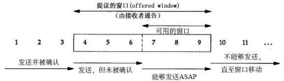
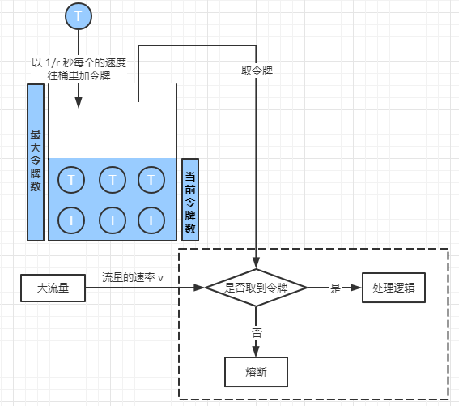

# 1 限流的基本认识

## 1.1 场景分析

一个互联网产品打算搞一次大促来增加销量以及曝光。公司的架构师基于往期的流量情况做了一个活动流量的预估，然后整个公司的各个技术团队开始按照这个目标进行设计和优化，最终在大家不懈的努力之下，达到了链路压测的目标流量峰值。到了活动开始那天，大家都在盯着监控面板，看着流量像洪水一样涌进来。由于前期的宣传工作做得很好，使得这个流量远远超过预估的峰值，后端服务开始不稳定，CPU、内存各种爆表。部分服务开始出现无响应的情况。最后，整个系统开始崩溃，用户无法正常访问服务，最后导致公司巨大的损失。

## 1.2 引入限流

在10.1黄金周，各大旅游景点都是人满为患。所有有些景点为了避免出现踩踏事故，会采取限流措施。 那在架构场景中，是不是也能这么做呢？针对这个场景，能不能够设置一个最大的流量限制，如果超过这个流量，我们就拒绝提供服务，从而使得我们的服务不会挂掉。 当然，限流虽然能够保护系统不被压垮，但是对于被限流的用户，就会很不开心。所以限流其实是一种有损的解决方案。但是相比于全部不可用，有损服务是最好的一种解决办法。

## 1.3 限流的作用

除了前面说的限流使用场景之外，限流的设计还能`防止恶意请求流量、恶意攻击`。

所以，限流的基本原理是通过对并发访问/请求进行限速或者一个时间窗口内的请求进行限速来保护系统，一旦达到限制速率则可以拒绝服务（定向到错误页或者告知资源没有了）、排队或等待(秒杀、下单)、降级（返回兜底数据或默认数据或默认数据，如商品详情页库存默认有货）。

一般互联网企业常见的限流有：限制总并发数（如数据库连接池、线程池）、限制瞬时并发数（nginx 的limit_conn模块，用来限制瞬时并发连接数）、限制时间窗口内的平均速率（如Guava的 RateLimiter、nginx的limit_req模块，限制每秒的平均速率）；其他的还有限制远程接口调用速率、限制 MQ 的消费速率。另外还可以根据网络连接数、网络流量、CPU或内存负载等来限流。

有了限流，就意味着在处理高并发的时候多了一种保护机制，不用担心瞬间流量导致系统挂掉或雪崩， 最终做到有损服务而不是不服务；但是限流需要评估好，不能乱用，否则一些正常流量出现一些奇怪的 问题而导致用户体验很差造成用户流失。

## 1.4 常见的限流算法

### 滑动窗口

发送和接受方都会维护一个数据帧的序列，这个序列被称作`窗口`。发送方的窗口大小由接受方确定，目的在于控制发送速度，以免接受方的缓存不够大，而导致溢出，同时控制流量也可以避免网络拥塞。下面图中的4,5,6号数据帧已经被发送出去，但是未收到关联的 ACK，7,8,9帧则是等待发送。可以看出发送端的窗口大小为6，这是由接受端告知的。此时如果发送端收到4号ACK，则窗口的左边缘向右收缩，窗 口的右边缘则向右扩展，此时窗口就向前“滑动了”，即数据帧10也可以被发送。

[滑动窗口演示地址](https://media.pearsoncmg.com/aw/ecs_kurose_compnetwork_7/cw/content/interactiveanimations/selective-repeat-protocol/index.html)

### 漏桶(控制传输速率Leaky bucket)

漏桶算法思路是，不断的往桶里面注水，无论注水的速度是大还是小，水都是按固定的速率往外漏水； 如果桶满了，水会溢出；

桶本身具有一个恒定的速率往下漏水，而上方时快时慢的会有水进入桶内。当桶还未满时，上方的水可以加入。一旦水满，上方的水就无法加入。桶满正是算法中的一个关键的触发条件（即流量异常判断成 立的条件）。而此条件下如何处理上方流下来的水，有两种常见的处理方式为： 

1. 暂时拦截住上方水的向下流动，等待桶中的一部分水漏走后，再放行上方水

2. 溢出的上方水直接抛弃

**特点**

1. 漏水的速率是固定的 
2. 即使存在突然注水量变大的情况，漏水的速率也是固定的

### 令牌桶(能够解决突发流量)

令牌桶算法是`网络流量整形（Traffic Shaping）`和`速率限制（Rate Limiting）`中最常使用的一种算法。 典型情况下，令牌桶算法用来控制发送到网络上的数据的数目，并允许突发数据的发送。

令牌桶是一个存放固定容量令牌（token）的桶，按照固定速率往桶里添加令牌; 令牌桶算法实际上由三 部分组成：两个流和一个桶，分别是令牌流、数据流和令牌桶

**令牌流与令牌桶**

系统会以一定的速度生成令牌，并将其放置到令牌桶中，可以将令牌桶想象成一个缓冲区（可以用队列 这种数据结构来实现），当缓冲区填满的时候，新生成的令牌会被扔掉。这里有两个变量很重要： 

第一个是生成令牌的速度，一般称为 rate 。比如，我们设定 rate = 2 ，即每秒钟生成 2 个令牌，也就 是每 1/2 秒生成一个令牌； 

第二个是令牌桶的大小，一般称为 burst 。比如，我们设定 burst = 10 ，即令牌桶最大只能容纳 10 个 令牌。 

有以下三种情形可能发生： 

`数据流的速率 等于 令牌流的速率` 这种情况下,每个到来的数据包或者请求都能对应一个令牌,然 后无延迟地通过队列

`数据流的速率 小于 令牌流的速率` 通过队列的数据包或者请求只消耗了一部分令牌，剩下的令牌 会在令牌桶里积累下来，直到桶被装满。剩下的令牌可以在突发请求的时候消耗掉

`数据流的速率 大于 令牌流的速率`这意味着桶里的令牌很快就会被耗尽。导致服务中断一段时 间，如果数据包或者请求持续到来,将发生丢包或者拒绝响应