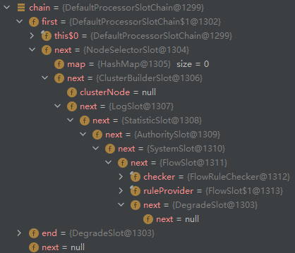

# 1 限流的基本认识

## 1.1 场景分析

一个互联网产品打算搞一次大促来增加销量以及曝光。公司的架构师基于往期的流量情况做了一个活动流量的预估，然后整个公司的各个技术团队开始按照这个目标进行设计和优化，最终在大家不懈的努力之下，达到了链路压测的目标流量峰值。到了活动开始那天，大家都在盯着监控面板，看着流量像洪水一样涌进来。由于前期的宣传工作做得很好，使得这个流量远远超过预估的峰值，后端服务开始不稳定，CPU、内存各种爆表。部分服务开始出现无响应的情况。最后，整个系统开始崩溃，用户无法正常访问服务，最后导致公司巨大的损失。

## 1.2 引入限流

在10.1黄金周，各大旅游景点都是人满为患。所有有些景点为了避免出现踩踏事故，会采取限流措施。 那在架构场景中，是不是也能这么做呢？针对这个场景，能不能够设置一个最大的流量限制，如果超过这个流量，我们就拒绝提供服务，从而使得我们的服务不会挂掉。 当然，限流虽然能够保护系统不被压垮，但是对于被限流的用户，就会很不开心。所以限流其实是一种有损的解决方案。但是相比于全部不可用，有损服务是最好的一种解决办法。

## 1.3 限流的作用

除了前面说的限流使用场景之外，限流的设计还能`防止恶意请求流量、恶意攻击`。

所以，限流的基本原理是通过对并发访问/请求进行限速或者一个时间窗口内的请求进行限速来保护系统，一旦达到限制速率则可以拒绝服务（定向到错误页或者告知资源没有了）、排队或等待(秒杀、下单)、降级（返回兜底数据或默认数据或默认数据，如商品详情页库存默认有货）。

一般互联网企业常见的限流有：限制总并发数（如数据库连接池、线程池）、限制瞬时并发数（nginx 的limit_conn模块，用来限制瞬时并发连接数）、限制时间窗口内的平均速率（如Guava的 RateLimiter、nginx的limit_req模块，限制每秒的平均速率）；其他的还有限制远程接口调用速率、限制 MQ 的消费速率。另外还可以根据网络连接数、网络流量、CPU或内存负载等来限流。

有了限流，就意味着在处理高并发的时候多了一种保护机制，不用担心瞬间流量导致系统挂掉或雪崩， 最终做到有损服务而不是不服务；但是限流需要评估好，不能乱用，否则一些正常流量出现一些奇怪的 问题而导致用户体验很差造成用户流失。

## 1.4 常见的限流算法

### 滑动窗口

发送和接受方都会维护一个数据帧的序列，这个序列被称作`窗口`。发送方的窗口大小由接受方确定，目的在于控制发送速度，以免接受方的缓存不够大，而导致溢出，同时控制流量也可以避免网络拥塞。下面图中的4,5,6号数据帧已经被发送出去，但是未收到关联的 ACK，7,8,9帧则是等待发送。可以看出发送端的窗口大小为6，这是由接受端告知的。此时如果发送端收到4号ACK，则窗口的左边缘向右收缩，窗 口的右边缘则向右扩展，此时窗口就向前“滑动了”，即数据帧10也可以被发送。

[滑动窗口演示地址](https://media.pearsoncmg.com/aw/ecs_kurose_compnetwork_7/cw/content/interactiveanimations/selective-repeat-protocol/index.html)


### 漏桶(控制传输速率Leaky bucket)

漏桶算法思路是，不断的往桶里面注水，无论注水的速度是大还是小，水都是按固定的速率往外漏水； 如果桶满了，水会溢出；

桶本身具有一个恒定的速率往下漏水，而上方时快时慢的会有水进入桶内。当桶还未满时，上方的水可以加入。一旦水满，上方的水就无法加入。桶满正是算法中的一个关键的触发条件（即流量异常判断成 立的条件）。而此条件下如何处理上方流下来的水，有两种常见的处理方式为： 

1. 暂时拦截住上方水的向下流动，等待桶中的一部分水漏走后，再放行上方水

2. 溢出的上方水直接抛弃

**特点**

1. 漏水的速率是固定的 
2. 即使存在突然注水量变大的情况，漏水的速率也是固定的

### 令牌桶(能够解决突发流量)

令牌桶算法是`网络流量整形（Traffic Shaping）`和`速率限制（Rate Limiting）`中最常使用的一种算法。 典型情况下，令牌桶算法用来控制发送到网络上的数据的数目，并允许突发数据的发送。

令牌桶是一个存放固定容量令牌（token）的桶，按照固定速率往桶里添加令牌; 令牌桶算法实际上由三 部分组成：两个流和一个桶，分别是令牌流、数据流和令牌桶

**令牌流与令牌桶**

系统会以一定的速度生成令牌，并将其放置到令牌桶中，可以将令牌桶想象成一个缓冲区（可以用队列 这种数据结构来实现），当缓冲区填满的时候，新生成的令牌会被扔掉。这里有两个变量很重要： 

第一个是生成令牌的速度，一般称为 rate 。比如，我们设定 rate = 2 ，即每秒钟生成 2 个令牌，也就 是每 1/2 秒生成一个令牌； 

第二个是令牌桶的大小，一般称为 burst 。比如，我们设定 burst = 10 ，即令牌桶最大只能容纳 10 个 令牌。 


有以下三种情形可能发生： 

`数据流的速率 等于 令牌流的速率` 这种情况下,每个到来的数据包或者请求都能对应一个令牌,然 后无延迟地通过队列

`数据流的速率 小于 令牌流的速率` 通过队列的数据包或者请求只消耗了一部分令牌，剩下的令牌 会在令牌桶里积累下来，直到桶被装满。剩下的令牌可以在突发请求的时候消耗掉

`数据流的速率 大于 令牌流的速率`这意味着桶里的令牌很快就会被耗尽。导致服务中断一段时 间，如果数据包或者请求持续到来,将发生丢包或者拒绝响应

# 2 Sentinel

## 2.1 什么是 Sentinel 

Sentinel 是面向分布式服务架构的流量控制组件，主要以流量为切入点，从限流、流量整形、熔断降级、系统负载保护、热点防护等多个维度来帮助开发者保障微服务的稳定性。

## 2.2 流量控制

`流量控制`用于调整网络包的发送数据。任意时间到来的请求往往是随机不可控的，而系统的处理能力是有限的。我们需要根据系统的处理能力对流量进行控制。Sentinel 作为一个调配器，可以根据需要把随机的请求调整成合适的形状，如下图所示：


**流量控制设计理念**

流量控制有以下几个角度:

- 资源的调用关系，例如资源的调用链路，资源和资源之间的关系；
- 运行指标，例如 QPS、线程池、系统负载等；
- 控制的效果，例如直接限流、冷启动、排队等。

Sentinel 的设计理念是让用户自由选择控制的角度，并进行灵活组合，从而达到想要的效果。

### 流量控制规则 (FlowRule)

重要属性：

| Field           | 说明                                                         | 默认值                        |
| --------------- | ------------------------------------------------------------ | ----------------------------- |
| resource        | 资源名，资源名是限流规则的作用对象                           |                               |
| count           | 限流阈值                                                     |                               |
| grade           | 限流阈值类型，QPS 模式（1）或并发线程数模式（0）             | QPS 模式                      |
| limitApp        | 流控针对的调用来源                                           | `default`，代表不区分调用来源 |
| strategy        | 调用关系限流策略：直接、链路、关联                           | 根据资源本身（直接）          |
| controlBehavior | 流控效果（直接拒绝/WarmUp/匀速+排队等待），不支持按调用关系限流 | 直接拒绝                      |
| clusterMode     | 是否集群限流                                                 | 否                            |

同一个资源可以同时有多个限流规则，检查规则时会依次检查。

## 2.3 熔断降级

Sentinel 和 Hystrix 的原则是一致的: 当检测到调用链路中某个资源出现不稳定的表现，例如请求响应时间长或异常比例升高的时候，则对这个资源的调用进行限制，让请求快速失败，避免影响到其它的资源而导致级联故障。

**熔断降级设计理念**

在限制的手段上，Sentinel 和 Hystrix 采取了完全不一样的方法。

Hystrix 通过`线程池隔离`的方式，来对依赖（在 Sentinel 的概念中对应资源）进行了隔离。这样做的好处是资源和资源之间做到了最彻底的隔离。缺点是除了增加了线程切换的成本（过多的线程池导致线程数目过多），还需要预先给各个资源做线程池大小的分配。

Sentinel 对这个问题采取了两种手段:通过`并发线程数`进行限制和通过`响应时间`对资源进行降级

### 熔断策略

Sentinel 提供以下几种熔断策略：

- 慢调用比例 (`SLOW_REQUEST_RATIO`)：选择以慢调用比例作为阈值，需要设置允许的慢调用 RT（即最大的响应时间），请求的响应时间大于该值则统计为慢调用。当单位统计时长（`statIntervalMs`）内请求数目大于设置的最小请求数目，并且慢调用的比例大于阈值，则接下来的熔断时长内请求会自动被熔断。经过熔断时长后熔断器会进入探测恢复状态（HALF-OPEN 状态），若接下来的一个请求响应时间小于设置的慢调用 RT 则结束熔断，若大于设置的慢调用 RT 则会再次被熔断。
- 异常比例 (`ERROR_RATIO`)：当单位统计时长（`statIntervalMs`）内请求数目大于设置的最小请求数目，并且异常的比例大于阈值，则接下来的熔断时长内请求会自动被熔断。经过熔断时长后熔断器会进入探测恢复状态（HALF-OPEN 状态），若接下来的一个请求成功完成（没有错误）则结束熔断，否则会再次被熔断。异常比率的阈值范围是 `[0.0, 1.0]`，代表 0% - 100%。
- 异常数 (`ERROR_COUNT`)：当单位统计时长内的异常数目超过阈值之后会自动进行熔断。经过熔断时长后熔断器会进入探测恢复状态（HALF-OPEN 状态），若接下来的一个请求成功完成（没有错误）则结束熔断，否则会再次被熔断。

### 熔断降级规则 (DegradeRule)

熔断降级规则包含下面几个重要的属性：

| Field              | 说明                                                         | 默认值     |
| ------------------ | ------------------------------------------------------------ | ---------- |
| resource           | 资源名，即规则的作用对象                                     |            |
| grade              | 熔断策略，支持慢调用比例/异常比例/异常数策略                 | 慢调用比例 |
| count              | 慢调用比例模式下为慢调用临界 RT（超出该值计为慢调用）；异常比例/异常数模式下为对应的阈值 |            |
| timeWindow         | 熔断时长，单位为 s                                           |            |
| minRequestAmount   | 熔断触发的最小请求数，请求数小于该值时即使异常比率超出阈值也不会熔断（1.7.0 引入） | 5          |
| statIntervalMs     | 统计时长（单位为 ms），如 60*1000 代表分钟级（1.8.0 引入）   | 1000 ms    |
| slowRatioThreshold | 慢调用比例阈值，仅慢调用比例模式有效（1.8.0 引入）           |            |

同一个资源可以同时有多个降级规则。

# 3 手动接入 Sentinel

```xml
<dependency>
    <groupId>com.alibaba.csp</groupId>
    <artifactId>sentinel-core</artifactId>
    <version>1.6.3</version>
</dependency>
<!--加入 sentinel 监控所需-->
<dependency>
    <groupId>com.alibaba.csp</groupId>
    <artifactId>sentinel-transport-simple-http</artifactId>
    <version>1.6.3</version>
</dependency>
```

```java
public class SentinelDemo {

    /**
     * 定义规则
     */
    public static void initFlowRules() {
        // 限流规则的集合
        List<FlowRule> ruleList = new ArrayList<>();
        FlowRule flowRule = new FlowRule();
        // 资源（方法名称、接口）
        flowRule.setResource("doTest");
        // 限流的阈值类型
        flowRule.setGrade(RuleConstant.FLOW_GRADE_QPS);
        flowRule.setCount(10);
        ruleList.add(flowRule);
        FlowRuleManager.loadRules(ruleList);
    }

    public static void main(String[] args) {
        initFlowRules();
        while (true) {
            // 定义资源
            Entry entry = null;
            try {
                Thread.sleep(new Random().nextInt(200));
                entry = SphU.entry("doTest");
                // 把需要控制流量的代码用 Sentinel API SphU.entry("doTest") 和 entry.exit() 包围起来即可
                // 这端代码作为资源，用 API 包围起来（埋点）
                /*业务逻辑 - 开始*/
                System.out.println("Hello Sentinel");
                /*业务逻辑 - 结束*/
            } catch (Exception e) {
                // 如果被限流了，会抛出异常
                /*流控逻辑处理 - 开始*/
                System.out.println("block!");
                /*流控逻辑处理 - 结束*/
            } finally {
                if (entry != null) {
                    // 释放
                    entry.exit();
                }
            }
        }
    }
}
```

```markdown
# 启动 Sentinel Dashboard
	java -jar sentinel-dashboard.jar
	# 将 sentinel-dashboard 自身也加入监控
	java -Dserver.port=8080 -Dcsp.sentinel.dashboard.server=localhost:8080 -Dproject.name=sentinel-dashboard -jar sentinel-dashboard.jar
# 启动 java 程序
	-Dcsp.sentinel.dashboard.server=localhost:8080
```


# 4 Sentinel 源码分析

以 `SphU.entry()` 为入口：

```java
// SphU.entry() ===> CtSph.entry() ===> entryWithPriority
private Entry entryWithPriority(ResourceWrapper resourceWrapper, int count, boolean prioritized, Object... args) throws BlockException {
    ...
    // 可以看出，这里是一个责任链
    ProcessorSlot<Object> chain = lookProcessChain(resourceWrapper);
    if (chain == null) {
        return new CtEntry(resourceWrapper, null, context);
    }
    Entry e = new CtEntry(resourceWrapper, chain, context);
    try {
        chain.entry(context, resourceWrapper, null, count, prioritized, args);
    } ...
    return e;
}
ProcessorSlot<Object> lookProcessChain(ResourceWrapper resourceWrapper) {
    ProcessorSlotChain chain = chainMap.get(resourceWrapper);
    // 双重锁机制
    if (chain == null) {
        synchronized (LOCK) {
            chain = chainMap.get(resourceWrapper);
            if (chain == null) {
                // Entry size limit.
                if (chainMap.size() >= Constants.MAX_SLOT_CHAIN_SIZE) {
                    return null;
                }
                // 生成插槽
                chain = SlotChainProvider.newSlotChain();
                Map<ResourceWrapper, ProcessorSlotChain> newMap = new HashMap<ResourceWrapper, ProcessorSlotChain>(
                    chainMap.size() + 1);
                newMap.putAll(chainMap);
                newMap.put(resourceWrapper, chain);
                chainMap = newMap;
            }
        }
    }
    return chain;
}
```

## 4.1 解析插槽生成器 SPI

```java
public static ProcessorSlotChain newSlotChain() {
    if (slotChainBuilder != null) {
        return slotChainBuilder.build();
    }
    // 解析插槽生成器 SPI
    slotChainBuilder = SpiLoader.of(SlotChainBuilder.class).loadFirstInstanceOrDefault();
    ...
    return slotChainBuilder.build();
}
// loadFirstInstanceOrDefault ===> load
public void load() {
    if (!loaded.compareAndSet(false, true)) {
        return;
    }
	// META-INF/services/com.alibaba.csp.sentinel.slotchain.SlotChainBuilder
    String fullFileName = SPI_FILE_PREFIX + service.getName();
	...
    Enumeration<URL> urls = null;
    urls = classLoader.getResources(fullFileName);
   	...
    while (urls.hasMoreElements()) {
        URL url = urls.nextElement();

        InputStream in = null;
        BufferedReader br = null;
        try {
            in = url.openStream();
            br = new BufferedReader(new InputStreamReader(in, StandardCharsets.UTF_8));
            String line;
            while ((line = br.readLine()) != null) { 
                // com.alibaba.csp.sentinel.slots.DefaultSlotChainBuilder
                line = line.trim();
                ...
                Class<S> clazz = null;
                clazz = (Class<S>) Class.forName(line, false, classLoader);
         	    ...
                classList.add(clazz);
            }
        } catch {...}
    }
}
```

类似于 Dubbo 的 SPI 加载机制，加载文件中记录的类：

```markdown
# Default slot chain builder
com.alibaba.csp.sentinel.slots.DefaultSlotChainBuilder
```

## 4.2 解析插槽 SPI

loadFirstInstanceOrDefault() 方法最终返回的是 `META-INF/services/com.alibaba.csp.sentinel.slotchain.SlotChainBuilder` 文件中记录的 `DefaultSlotChainBuilder`，后续会执行它的 build() 方法：

```java
public ProcessorSlotChain build() {
    ProcessorSlotChain chain = new DefaultProcessorSlotChain();
    // 与解析插槽生成器 SPI 一样的方式解析插槽
    // 加载位置 META-INF/services/com.alibaba.csp.sentinel.slotchain.ProcessorSlot
    List<ProcessorSlot> sortedSlotList = SpiLoader.of(ProcessorSlot.class).loadInstanceListSorted();
    for (ProcessorSlot slot : sortedSlotList) {
        ...
        chain.addLast((AbstractLinkedProcessorSlot<?>) slot);
    }
    return chain;
}
```

```markdown
# Sentinel default ProcessorSlots
com.alibaba.csp.sentinel.slots.nodeselector.NodeSelectorSlot
com.alibaba.csp.sentinel.slots.clusterbuilder.ClusterBuilderSlot
com.alibaba.csp.sentinel.slots.logger.LogSlot
com.alibaba.csp.sentinel.slots.statistic.StatisticSlot
com.alibaba.csp.sentinel.slots.block.authority.AuthoritySlot
com.alibaba.csp.sentinel.slots.system.SystemSlot
com.alibaba.csp.sentinel.slots.block.flow.FlowSlot
com.alibaba.csp.sentinel.slots.block.degrade.DegradeSlot
```

> 在 Sentinel 里面，所有的资源都对应一个资源名称（`resourceName`），每次资源调用都会创建一个 `Entry` 对象。Entry 可以通过对主流框架的适配自动创建，也可以通过注解的方式或调用 `SphU` API 显式创建。Entry 创建的时候，同时也会创建一系列功能插槽（slot chain），这些插槽有不同的职责，例如:
>
> - `NodeSelectorSlot` 负责收集资源的路径，并将这些资源的调用路径，以树状结构存储起来，用于根据调用路径来限流降级；
> - `ClusterBuilderSlot` 则用于存储资源的统计信息以及调用者信息，例如该资源的 RT, QPS, thread count 等等，这些信息将用作为多维度限流，降级的依据；
> - `StatisticSlot` 则用于记录、统计不同纬度的 runtime 指标监控信息；
> - `FlowSlot` 则用于根据预设的限流规则以及前面 slot 统计的状态，来进行流量控制；
> - `AuthoritySlot` 则根据配置的黑白名单和调用来源信息，来做黑白名单控制；
> - `DegradeSlot` 则通过统计信息以及预设的规则，来做熔断降级；
> - `SystemSlot` 则通过系统的状态，例如 load1 等，来控制总的入口流量；


Sentinel 将 `ProcessorSlot` 作为 SPI 接口进行扩展（1.7.2 版本以前 `SlotChainBuilder` 作为 SPI），使得 Slot Chain 具备了扩展的能力。可以自行加入自定义的 slot 并编排 slot 间的顺序，从而可以给 Sentinel 添加自定义的功能。

## 4.3 ProcessorSlotChain

DefaultSlotChainBuilder.build() 方法中，最开始初始化了一个 ProcessorSlotChain，指向 `DefaultProcessorSlotChain`：

```java
public class DefaultProcessorSlotChain extends ProcessorSlotChain {
    AbstractLinkedProcessorSlot<?> first = new AbstractLinkedProcessorSlot<Object>() {
        ...
    };
    // 设置 end = first
    AbstractLinkedProcessorSlot<?> end = first;
	
    public void addLast(AbstractLinkedProcessorSlot<?> protocolProcessor) {
    	end.setNext(protocolProcessor);
    	end = protocolProcessor;
        // 第一次循环 end.next = first.next = NodeSelectorSlot
        //           end = NodeSelectorSlot
        // 第二次循环 end.next = NodeSelectorSlot.next = first.next.next = ClusterBuilderSlot
        // 			end = ClusterBuilderSlot
        // ...
	}
}
// AbstractLinkedProcessorSlot.java
private AbstractLinkedProcessorSlot<?> next = null;
public void setNext(AbstractLinkedProcessorSlot<?> next) {
    this.next = next;
}
```



## 4.4 执行 ProcessorSlot

创建完插槽后，回到 CtSph.entryWithPriority() 执行，整个链路的第一个节点即是在 `DefaultProcessorSlotChain` 中创建的 first：

```java
// chain.entry(context, resourceWrapper, null, count, prioritized, args)
// DefaultProcessorSlotChain.first#entry ===> AbstractLinkedProcessorSlot#fireEntry ===> transformEntry()
// AbstractLinkedProcessorSlot.java
void transformEntry(Context context, ResourceWrapper resourceWrapper, Object o, int count, boolean prioritized, Object... args)
    throws Throwable {
    T t = (T)o;
    entry(context, resourceWrapper, t, count, prioritized, args);
}
// 这里来到第一个插槽 NodeSelectorSlot
public void entry(Context context, ResourceWrapper resourceWrapper, Object obj, int count, boolean prioritized, Object... args) throws Throwable {
    ...
    // 依次调用整个链路
    fireEntry(context, resourceWrapper, node, count, prioritized, args);
}
```

## 4.5 StatisticSlot

`StatisticSlot` 是 Sentinel 的核心功能插槽之一，用于统计实时的调用数据。

- `clusterNode`：资源唯一标识的 ClusterNode 的实时统计
- `origin`：根据来自不同调用者的统计信息
- `defaultnode`: 根据入口上下文区分的资源 ID 的 runtime 统计
- 入口流量的统计

Sentinel 底层采用高性能的滑动窗口数据结构 `LeapArray` 来统计实时的秒级指标数据，可以很好地支撑写多于读的高并发场景。


```java
public void entry(Context context, ResourceWrapper resourceWrapper, DefaultNode node, int count,
                  boolean prioritized, Object... args) throws Throwable {
    try {
        // Do some checking.
        fireEntry(context, resourceWrapper, node, count, prioritized, args);
        // Request passed, add thread count and pass count.
        // 请求已通过，添加线程计数和通过计数
        node.increaseThreadNum();
        node.addPassRequest(count);
        ...
    catch () {....}
}
public void addPassRequest(int count) {
    super.addPassRequest(count);
    this.clusterNode.addPassRequest(count);
}
public void addPassRequest(int count) {
    rollingCounterInSecond.addPass(count);
    rollingCounterInMinute.addPass(count);
}
```

**rollingCounterInSecond 和 rollingCounterInMinute**

```java
/**
 * 保存最近 INTERVAL 毫秒的统计信息，划分给定的 sampleCount 个时间跨度
 * INTERVAL 默认 1000
 * sampleCount 默认 2
 */
private transient volatile Metric rollingCounterInSecond = new ArrayMetric(SampleCountProperty.SAMPLE_COUNT,
    IntervalProperty.INTERVAL);
/**
 * 保存最近60秒的统计信息。windowLengthInMs故意设置为1000毫秒，也就是说每一个bucket每秒，这样我们就可以得到每一秒的准确统计数据
 */
private transient Metric rollingCounterInMinute = new ArrayMetric(60, 60 * 1000, false);
```

以 `rollingCounterInSecond` 为例：

```java
// ArrayMetric.java
public ArrayMetric(int sampleCount, int intervalInMs) {
    // OccupiableBucketLeapArray extends LeapArray
    this.data = new OccupiableBucketLeapArray(sampleCount, intervalInMs);
}
public void addPass(int count) {
    WindowWrap<MetricBucket> wrap = data.currentWindow();
    wrap.value().addPass(count);
}
// LeapArray.java
public WindowWrap<T> currentWindow(long timeMillis) {
    if (timeMillis < 0) {
        return null;
    }
    // timeMillis 当前时间毫秒数
    // (int)(timeMillis / windowLengthInMs % array.length())
    int idx = calculateTimeIdx(timeMillis);
    // timeMillis - timeMillis % windowLengthInMs
    long windowStart = calculateWindowStart(timeMillis);
    // 每100ms发一次请求 
    //   timeMillis	   idx	windowStart	  
    // 1614768657946L   1  1614768657500  1
    // 1614768658046L   0  1614768658000  2
    // ...   2，3，5
    // 1614768658446L   0  1614768658000  6
    // 1614768658546L   1  1614768658500  7
    while (true) {
        WindowWrap<T> old = array.get(idx);
        // 1，2请求 old==null，返回新创建的 WindowWrap
        if (old == null) {
            WindowWrap<T> window = new WindowWrap<T>(windowLengthInMs, windowStart, newEmptyBucket(timeMillis));
            if (array.compareAndSet(idx, null, window)) {
                // Successfully updated, return the created bucket.
                return window;
            } else {
                // Contention failed, the thread will yield its time slice to wait for bucket available.
                Thread.yield();
            }
        } 
        // 3,4,5,6 windowStart == 2.windowStart，返回 请求 2 创建的 WindowWrap
        else if (windowStart == old.windowStart()) {
            return old;
        } 
        // 7 windowStart > 1.windowStart
        else if (windowStart > old.windowStart()) {
            if (updateLock.tryLock()) {
                try {
                    // Successfully get the update lock, now we reset the bucket.
                    // 成功获得锁，现在重置bucket
                    return resetWindowTo(old, windowStart);
                } finally {
                    updateLock.unlock();
                }
            } else {
                // Contention failed, the thread will yield its time slice to wait for bucket available.
                Thread.yield();
            }
        } else if (windowStart < old.windowStart()) {
            // Should not go through here, as the provided time is already behind.
            return new WindowWrap<T>(windowLengthInMs, windowStart, newEmptyBucket(timeMillis));
        }
    }
}
// OccupiableBucketLeapArray.java
protected WindowWrap<MetricBucket> resetWindowTo(WindowWrap<MetricBucket> w, long time) {
    // Update the start time and reset value.
    // 设置 windowStart 为最新的
    w.resetTo(time);
    MetricBucket borrowBucket = borrowArray.getWindowValue(time);
    if (borrowBucket != null) {
        w.value().reset();
        w.value().addPass((int)borrowBucket.pass());
    } else {
        w.value().reset();
    }
    return w;
}
// MetricBucket.java
public MetricBucket reset() {
    // 将 counters 中每个位置都置为 0
    for (MetricEvent event : MetricEvent.values()) {
        // MetricEvent 是枚举类型
        // MetricEvent..ordinal() 此方法返回枚举常量的序数，0 表示第一个
        counters[event.ordinal()].reset();
    }
    initMinRt();
    return this;
}
```

回到 addPass(int count) 方法的第二步：

```java
// WindowWrap<MetricBucket> wrap
// wrap.value().addPass(count);
// wrap.value() ===> MetricBucket
// MetricBucket.java
public void addPass(int n) {
    add(MetricEvent.PASS, n);
}
public MetricBucket add(MetricEvent event, long n) {
    // MetricEvent.PASS 为枚举类第一个
    // counters[0].add(1);
    counters[event.ordinal()].add(n);
    return this;
}
```

# 5 Sentinel 整合 Dubbo 限流实战

基于 dubbo-springboot 项目进行改造：

```xml
<!-- server-boot-provider 添加依赖 -->
<dependency>
    <groupId>com.alibaba.csp</groupId>
    <artifactId>sentinel-apache-dubbo-adapter</artifactId>
    <version>1.8.1</version>
</dependency>
<dependency>
    <groupId>com.alibaba.csp</groupId>
    <artifactId>sentinel-transport-simple-http</artifactId>
    <version>1.8.1</version>
</dependency>
```

```java
// 通过注解方式配置dubbo，注释掉properties中的配置
@Configuration
@DubboComponentScan("com.spring")
public class DubboConfig {

    @Bean
    public ApplicationConfig applicationConfig() {
        ApplicationConfig applicationConfig = new ApplicationConfig();
        applicationConfig.setName("dubbo-sentinel");
        applicationConfig.setOwner("Spring");
        return applicationConfig;
    }

    @Bean
    public RegistryConfig registryConfig() {
        RegistryConfig registryConfig = new RegistryConfig();
        registryConfig.setAddress("zookeeper://192.168.25.128:2181");
        return registryConfig;
    }

    @Bean
    public ProtocolConfig protocolConfig() {
        ProtocolConfig protocolConfig = new ProtocolConfig();
        protocolConfig.setName("dubbo");
        protocolConfig.setPort(20880);
        return protocolConfig;
    }
}
@SpringBootApplication
public class DubboSpringBootApplication {
    public static void main(String[] args) {
        initFlowRules();
        SpringApplication.run(DubboSpringBootApplication.class, args);
    }

    //初始化规则
    private static void initFlowRules() {
        //限流规则的集合
        List<FlowRule> rules = new ArrayList<>();
        FlowRule flowRule = new FlowRule();
        //资源(方法名称、接口）
        flowRule.setResource("com.spring.service.ISayHelloService:sayHello()");
        //限流阈值 qps=10
        flowRule.setCount(10);
        //限流阈值类型（QPS 或并发线程数）
        flowRule.setGrade(RuleConstant.FLOW_GRADE_QPS);
        //流量控制手段（直接拒绝、Warm Up、匀速排队）
        flowRule.setControlBehavior(RuleConstant.CONTROL_BEHAVIOR_DEFAULT);
        //流控针对的调用来源，若为 default 则不区分调用来源
        flowRule.setLimitApp("dubbo-springboot-client");
        rules.add(flowRule);
        FlowRuleManager.loadRules(rules);
    }
}
```

```xml
<!-- 客户端依赖 -->
<dependency>
    <groupId>com.alibaba.csp</groupId>
    <artifactId>sentinel-apache-dubbo-adapter</artifactId>
    <version>1.8.1</version>
</dependency>
```

```java
@RestController
public class DubboController {

    @Reference(timeout = 3000, check = false)//cluster = "failfast", mock = "com.spring.mock.SayHelloServiceMock")// loadbalance = "random",
    ISayHelloService sayHelloService;

    @GetMapping("/sayHello")
    public String sayHello() {
        // 如果不引入 Sentinel Apache Dubbo Adapter，需要手动配置 Attachment，针对单个服务的限流才能生效
        //RpcContext.getContext().setAttachment("dubboApplication","dubbo-springboot-client");
        return sayHelloService.sayHello();
    }

}
```

使用 `-Dproject.name=server-boot-provider -Dcsp.sentinel.dashboard.server=192.168.25.128:8080` 启动。

使用 jemeter 进行压测：


另一方面启动了 Sentinel-Dashboard 可以通过控制台查看：


## 5.1 参数解释

### Resource

限流粒度可以是服务接口和服务方法两种粒度。若希望整个服务接口的 QPS 不超过一定数值，则可以为对应服务接口资源（resourceName 为接口全限定名）配置 QPS 阈值；若希望服务的某个方法的 QPS 不超过一定数值，则可以为对应服务方法资源（resourceName 为接口全限定名:方法签名）配置 QPS 阈值

### LimitApp

很多场景下，根据调用方来限流也是非常重要的。比如有两个服务 A 和 B 都向 Service Provider 发起调用请求，我们希望只对来自服务 B 的请求进行限流，则可以设置`限流规则的 limitApp` 为服务 B 的名称。`Sentinel Apache Dubbo Adapter` 会<font color=red>自动解析 Dubbo 消费者（调用方）的 application name 作为调用方名称（origin）</font>，在进行资源保护的时候都会带上调用方名称。若限流规则未配置调用方（default），则该限流规则对所有调用方生效。若限流规则配置了调用方则限流规则将仅对指定调用方生效。

> 注：Dubbo 默认通信不携带对端 application name 信息，因此需要开发者在调用端手动将 applicationname 置入 attachment 中，provider 端进行相应的解析。Sentinel Apache Dubbo Adapter 实现了一个 Filter 用于<font color=red>自动从 consumer 端向 provider 端透传 application name</font>。若调用端未引入 sentinel-apache-dubbo-adapter，又希望根据调用端限流，可以在调用端手动将 application name 置入 attachment 中，key 为 dubboApplication.

### ControlBehavior

当 QPS 超过某个阈值的时候，则采取措施进行流量控制。流量控制的手段包括以下几种：直接拒绝、 Warm Up、匀速排队，对应 FlowRule 中的 controlBehavior 字段。

`直接拒绝（RuleConstant.CONTROL_BEHAVIOR_DEFAULT）`方式是默认的流量控制方式，当QPS超过任意规则的阈值后，新的请求就会被立即拒绝，拒绝方式为抛出FlowException。这种方式适用于对系统处理能力确切已知的情况下，比如通过压测确定了系统的准确水位时

`Warm Up（RuleConstant.CONTROL_BEHAVIOR_WARM_UP）`方式，即预热/冷启动方式，当系统长期处于低并发的情况下，流量突然增加到 qps 的最高峰值，可能会造成系统的瞬间流量过大把系统压垮。所以warmup，相当于处理请求的数量是缓慢增加，经过一段时间以后，到达系统处理请求个数的最大值

`匀速排队（RuleConstant.CONTROL_BEHAVIOR_RATE_LIMITER）`方式会严格控制请求通过的间隔时间，也即是让请求以均匀的速度通过，对应的是漏桶算法

> 它的原理是，以固定的间隔时间让请求通过。当请求过来的时候，如果当前请求距离上个通过的请求通过的时间间隔不小于预设值，则让当前请求通过；否则，计算当前请求的预期通过时间，如果该请求的预期通过时间小于规则预设的 timeout 时间，则该请求会等待直到预设时间到来通过；反之，则马上抛出阻塞异常。 
>
> 可以设置一个最长排队等待时间： 
>
> ```java
> // 最长排队等待时间：5s
> flowRule.setMaxQueueingTimeMs(5 * 1000); 
> ```
>
> 这种方式主要用于处理间隔性突发的流量，例如消息队列。想象一下这样的场景，在某一秒有大量的请求到来，而接下来的几秒则处于空闲状态，我们希望系统能够在接下来的空闲期间逐渐处理这些请求， 而不是在第一秒直接拒绝多余的请求。

5.2 分布式限流

为什么要使用集群流控呢？假设我们希望给某个用户限制调用某个 API 的总 QPS 为 50，但机器数可能很多（比如有 100 台）。这时候我们很自然地就想到，找一个 server 来专门来统计总的调用量，其它的实例都与这台 server 通信来判断是否可以调用。这就是最基础的集群流控的方式。

另外集群流控还可以解决流量不均匀导致总体限流效果不佳的问题。假设集群中有 10 台机器，我们给每台机器设置单机限流阈值为 10 QPS，理想情况下整个集群的限流阈值就为 100 QPS。不过实际情况下流量到每台机器可能会不均匀，会导致总量没有到的情况下某些机器就开始限流。因此仅靠单机维度去限制的话会无法精确地限制总体流量。而集群流控可以精确地控制整个集群的调用总量，结合单机限流兜底，可以更好地发挥流量控制的效果。

集群流控中共有两种身份：

- Token Client：集群流控客户端，用于向所属 Token Server 通信请求 token。集群限流服务端会返回给客户端结果，决定是否限流。
- Token Server：即集群流控服务端，处理来自 Token Client 的请求，根据配置的集群规则判断是否应该发放 token（是否允许通过）。

要想使用集群流控功能，我们需要在应用端配置动态规则源，并通过 Sentinel 控制台实时进行推送。如下图所示：


