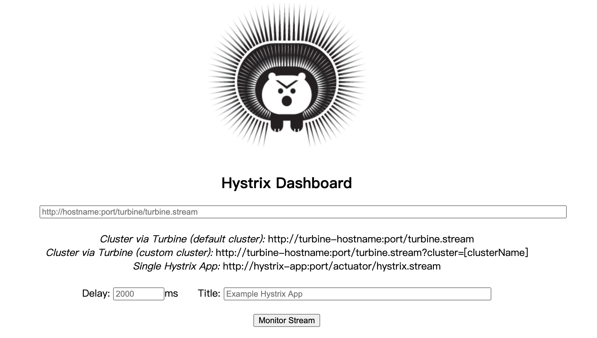
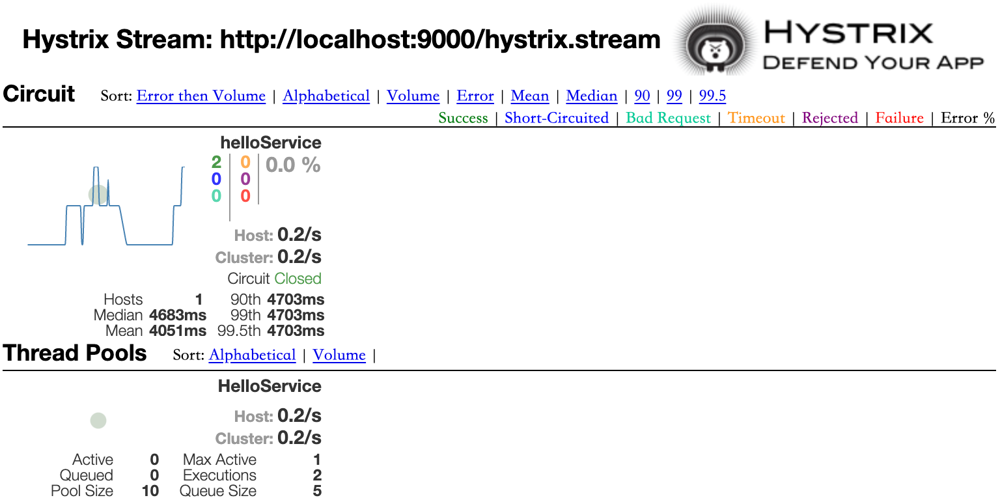

# 1 快速入门

前面 ribbon-consume 实例中，在未加入断路器之前，关闭 8081 的实例，发送 GET 请求，会得到以下输出：

```markdown
Servlet.service() for servlet [dispatcherServlet] in context with path [] threw exception [Request processing failed; nested exception is org.springframework.web.client.ResourceAccessException: I/O error on GET request for "http://HELLO-SERVICE/hello": Connection refused: connect; nested exception is java.net.ConnectException: Connection refused: connect] with root cause
java.net.ConnectException: Connection refused: connect
```

下面开始引入 Spring Cloud Hystrix。

在 ribbon-consumer 引入 spring-cloud-starter-netflix-hystrix 依赖：

```xml
<dependency>
    <groupId>org.springframework.cloud</groupId>
    <artifactId>spring-cloud-starter-netflix-hystrix</artifactId>
</dependency>
```

在 ribbon-consumer 的主类 RibbonConsumerApplication 中使用 @EnableCircuitBreaker 注解开启断路器功能：

```java
@SpringBootApplication
@EnableDiscoveryClient
@EnableCircuitBreaker
public class RibbonConsumerApplication {

    @Bean
    @LoadBalanced
    RestTemplate restTemplate() {
        return new RestTemplate();
    }

    public static void main(String[] args) {
        SpringApplication.run(RibbonConsumerApplication.class, args);
    }
}
```

> 注意:这里还可以使用Spring Cloud应用中的@SpringCloudApplication注解来修饰应用主类，该注解的具体定义如下所示。可以看到，该注解中包含了上述我们所引用的三个注解，这也意味着一个Spring Cloud标准应用应包含服务发现以及断路器。
>
> ```java
> @Target(ElementType.TYPE)
> @Retention(RetentionPolicy.RUNTIME)
> @Documented
> @Inherited
> @SpringBootApplication
> @EnableDiscoveryClient
> @EnableCircuitBreaker
> public @interface SpringCloudApplication {
> }
> ```

```java
@Service
public class HelloService {

    @Autowired
    private RestTemplate restTemplate;

    @HystrixCommand(fallbackMethod = "helloFallback")
    public String helloService() {
        return restTemplate.getForEntity("http://HELLO-SERVICE/hello", String.class).getBody();
    }

    public String helloFallback() {
        return "error";
    }
}
@RestController
public class ConsumerController {

    @Autowired
    private HelloService helloService;

    @GetMapping("/ribbon-consumer")
    public String helloConsumer() {
        return helloService.helloService();
    }java

}
```

8081断开后，会返回 error。

对 HELLO-SERVICE 的 /hello 接口做一些修改：

```java
@GetMapping("/hello")
public String index() throws InterruptedException {
    ServiceInstance instance = serviceInstance();
    int sleepTime = new Random().nextInt(3000);
    System.out.println("sleepTime:" + sleepTime);
    Thread.sleep(sleepTime);
    System.out.println("/hello, host:" + instance.getHost()  + ", service_id:" + instance.getServiceId());
    return "Hello World";
}
```

通过Thread.sleep()函数可让/hello接口的处理线程不是马上返回内容,而是在阻塞几秒之后才返回内容。由于`Hystrix 默认超时时间为1000毫秒`，所以这里采用了0至3000的随机数以让处理过程有一定概率发生超时来触发断路器。

当 sleepTime 大于 2000 的时候，就会返回 error，即服务消费者因调用的服务超时从而触发熔断请求，并调用回调逻辑返回结果。

# 2 原理分析

## 2.1 工作流程


### 2.1.1 创建 HystrixCommand 或 HystrixObservableCommand 对象

首先，构建一个HystrixCommand 或是 HystrixObservableCommand对象，用来表示对依赖服务的操作请求，同时传递所有需要的参数。从其命名中我们就能知道它采用了“命令模式”来实现对服务调用操作的封装。而这两个Command 对象分别针对不同的应用场景。

* `HystrixCommand` 用在依赖的服务返回单个操作结果的时候。

* `HystrixObservableCommand` 用在依赖的服务返回多个操作结果的时候。

**命令模式**

命令模式，将来自客户端的请求封装成一个对象，从而让你可以使用不同的请求对客户端进行参数化。它可以被用于实现“行为请求者”与“行为实现者”的解耦，以便使两者可以适应变化。下面的示例是对命令模式的简单实现:

```java
//接收者
public class Receiver {
	public void action () {
        //真正的业务逻辑
    }
}
//抽象命令
interface Command{
	void execute();
)
//具体命令实现
public class ConcreteCommand implements Command{
	private Receiver receiver;
	public ConcreteCommand(Receiver receiver){
		this.receiver = receiver;
	}
    public void execute(){
        this.receiver.action();
    }
}
//客户端调用者
public class Invoker {
	private Command command;
	public void setCommand(Command command){
        this.command = command;
    }
	public void action(){
		this.command.execute();
    }
}
public class Client{
	public static void main (String[] args){
		Receiver receiver = new Receiver();
		Command command = new ConcreteCommand(receiver);
        Invoker invoker = new Invoker();
		invoker.setCommand(command);
		invoker.action();//客户端通过调用者来执行命令
  	}
}
```

从代码中，我们可以看到这样几个对象。

* `Receiver 接收者`，它知道如何处理具体的业务逻辑。

* `Command 抽象命令`，它定义了一个命令对象应具备的一系列命令操作，比如execute ( ) 、 undo ( )、redo ()等。当命令操作被调用的时候就会触发接收者去做具体命令对应的业务逻辑。

* `ConcreteCommand 具体的命令实现`，在这里它绑定了命令操作与接收者之间的关系，execute()命令的实现委托给了Receiver的action ()函数。

* `Invoker 调用者`，它持有一个命令对象，并且可以在需要的时候通过命令对象完成具体的业务逻辑。

从上面的示例中,我们可以看到,调用者 Invoker 与操作者 Receiver 通过 Command 命令接口实现了解耦。对于调用者来说，我们可以为其注入多个命令操作，比如新建文件、复制文件、删除文件这样三个操作，调用者只需在需要的时候直接调用即可，而不需要知道这些操作命令实际是如何实现的。而在`这里所提到的 HystrixCommand 和HystrixObservableCommand则是在 Hystrix 中对 Command 的进一步抽象定义`。在后续的内容中，会逐步展开介绍它的部分内容来帮助理解其运作原理。

从上面的示例中我们也可以发现，Invoker和Receiver的关系非常类似于“请求-响应”模式，所以它比较适用于实现记录日志、撤销操作、队列请求等。

### 2.1.2 命令执行

从图中我们可以看到一共存在4种命令的执行方式，而Hystrix在执行时会根据创建的 Command 对象以及具体的情况来选择一个执行。其中 HystrixCommand 实现了下面两个执行方式。

* `execute() 同步执行`，从依赖的服务返回一个单一的结果对象，或是在发生错误的时候抛出异常。

* `queue() 异步执行`，直接返回一个Future对象，其中包含了服务执行结束时要返回的单一结果对象。

```java
R value = command.execute();
Future<R> fValue = command.queue();
```

而HystrixObservablecommand 实现了另外两种执行方式。

* `observe() 返回Observable对象`，它代表了操作的多个结果，它是一个Hot Observable。

* `toObservable() 同样会返回observable对象`，也代表了操作的多个结果，但它返回的是一个Cold Observable。

```java
Observable<R> ohvalue = command.observe();
Observable<R> ocvalue = command.toObservable();
```

在Hystrix的底层实现中大量地使用了 RxJava。

上面我们所提到的 observable 对象就是RxJava中的核心内容之一，可以把它理解为“事件源”或是“被观察者”，与其对应的Subscriber对象，可以理解为“订阅者”或是“观察者”。这两个对象是RxJava响应式编程的重要组成部分。

* Observable用来向订阅者subscriber对象发布事件，Subscriber对象则在接收到事件后对其进行处理，而在这里所指的事件通常就是对依赖服务的调用。

* 一个 Observable 可以发出多个事件，直到结束或是发生异常。
* Observable对象每发出一个事件，就会调用对应观察者 subscriber对象的onNext()方法。

* 每一个 Observable的执行,最后一定会通过调用subscriber.onCompleted ( )或者subscriber.onError ()来结束该事件的操作流。

### 2.1.3 结果是否被缓存

若当前命令的请求缓存功能是被启用的，并且该命令缓存命中，那么缓存的结果会立即以 observable 对象的形式返回。

### 2.1.4 断路器是否打开

在命令结果没有缓存命中的时候，Hystrix在执行命令前需要检查断路器是否为打开状态:

* 如果断路器是打开的，那么Hystrix不会执行命令,而是转接到 fallback 处理逻辑(对应下面第8步)。

* 如果断路器是关闭的，那么Hystrix跳到第5步，检查是否有可用资源来执行命令。关于断路器的具体实现细节，后续会做更加详细的分析。

### 2.1.5 线程池/请求队列/信号量是否占满

如果与命令相关的线程池和请求队列，或者信号量（不使用线程池的时候）已经被占满，那么Hystrix也不会执行命令，而是转接到 fallback处理逻辑（对应下面第8步)。

需要注意的是，这里Hystrix所判断的线程池并非容器的线程池，而是每个依赖服务的专有线程池。Hystrix为了保证不会因为某个依赖服务的问题影响到其他依赖服务而采用了“舱璧模式”(Bulkhead Pattern）来隔离每个依赖的服务。

**依赖隔离**

线程池隔离：会为每个 HystrixCommand 设置一个独立的线程池，这样在一个 HystrixCommand 包装下的依赖服务出现延迟过高的情况，也只是对该依赖服务的调用产生影响，并不会拖慢其他服务。 Hystric自动实现了依赖隔离。

### 2.1.6 HystrixObservableCommand.construct() 或 HystrixCommand.run()

Hystrix 会根据我们编写的方法来决定采取什么样的方式去请求依赖服务。

* HystrixCommand.run( ): 返回一个单一的结果，或者抛出异常。

* Hystrix0bservableCommand.construct( ): 返回一个observable对象来发射多个结果，或通过onError发送错误通知。

如果run()或construct ()方法的执行时间超过了命令设置的超时阈值，当前处理线程将会抛出一个 TimeoutException（如果该命令不在其自身的线程中执行，则会通过单独的计时线程来抛出)。在这种情况下，Hystrix 会转接到 fallback 处理逻辑（第8步)。同时，如果当前命令没有被取消或中断，那么它最终会忽略run()或者construct()方法的返回。

如果命令没有抛出异常并返回了结果，那么 Hystrix 在记录一些日志并采集监控报告之后将该结果返回。在使用run() 的情况下，Hystrix 会返回一个 Observable，它发射单个结果并产生 onCompleted 的结束通知;而在使用construct() 的情况下，Hystrix 会直接返回该方法产生的observable对象。

### 2.1.7 计算断路器的健康度

Hystrix会将“成功”、“失败”、“拒绝”、“超时”等信息报告给断路器，而断路器会维护一组计数器来统计这些数据。

断路器会使用这些统计数据来决定是否要将断路器打开，来对某个依赖服务的请求进行“熔断/短路”，直到恢复期结束。若在恢复期结束后，根据统计数据判断如果还是未达到健康指标，就再次“熔断/短路”。

### 2.1.8 fallback 处理

当命令执行失败的时候，Hystrix 会进入 fallback 尝试回退处理，我们通常也称该操作为“`服务降级`”。而能够引起服务降级处理的情况有下面几种:

* 第4步，当前命令处于“熔断/短路”状态，断路器是打开的时候。

* 第5步，当前命令的线程池、请求队列或者信号量被占满的时候。

* 第6步，HystrixObservableCommand.construct ()或HystrixCommand.run ()抛出异常的时候。

在服务降级逻辑中，我们需要实现一个通用的响应结果，并且该结果的处理逻辑应当是从缓存或是根据一些静态逻辑来获取，而不是依赖网络请求获取。如果一定要在降级逻辑中包含网络请求，那么该请求也必须被包装在 HystrixCommand 或是 HystrixObservableCommand 中，从而形成级联的降级策略，而最终的降级逻辑一定不是一个依赖网络请求的处理，而是一个能够稳定地返回结果的处理逻辑。

在HystrixCommand和 HystrixObservableCommand中实现降级逻辑时还略有不同:

* 当使用HystrixCommand 的时候，通过实现HystrixCommand.getFallback() 来实现服务降级逻辑。

* 当使用Hystrix0bservableCommand 的时候，通过 HystrixObservableCommand.resumewithFallback() 实现服务降级逻辑，该方法会返回一个Observable对象来发射一个或多个降级结果。

当命令的降级逻辑返回结果之后，Hystrix 就将该结果返回给调用者。当使用 HystrixCommand.getFallback() 的时候，它会返回一个 observable 对象，该对象会发射getFallback()的处理结果。而使用Hystrix0bservableCommand.resumewithFallback() 实现的时候，它会将observable对象直接返回。

如果我们没有为命令实现降级逻辑或者降级处理逻辑中抛出了异常，Hystrix依然会返回一个 observable 对象，但是它不会发射任何结果数据，而是通过onError方法通知命令立即中断请求，并通过onError()方法将引起命令失败的异常发送给调用者。实现一个有可能失败的降级逻辑是一种非常糟糕的做法，我们应该在实现降级策略时尽可能避免失败的情况。

当然完全不可能出现失败的完美策略是不存在的，如果降级执行发现失败的时候，Hystrix会根据不同的执行方法做出不同的处理。

* execute ( ):抛出异常。

* queue ():正常返回Future对象，但是当调用get ()来获取结果的时候会抛出异常。

* observe ( ):正常返回observable对象，当订阅它的时候，将立即通过调用订阅者的onError方法来通知中止请求。

* toObservable ( ):正常返回observable对象，当订阅它的时候，将通过调用订阅者的onError方法来通知中止请求。

### 2.1.9 返回成功的响应

当Hystrix命令执行成功之后，它会将处理结果直接返回或是以observable的形式返回。而具体以哪种方式返回取决于之前第2步中我们所提到的对命令的4种不同执行方式，下图中总结了这4种调用方式之间的依赖关系。我们可以将此图与在第2步中对前两者源码的分析联系起来，并且从源头toObservable ()来开始分析。


* toObservable( ):返回最原始的 Observable，必须通过订阅它才会真正触发命令的执行流程。

* observe():在to0bservable ()产生原始 observable之后立即订阅它，让命令能够马上开始异步执行，并返回一个 observable 对象，当调用它的subscribe时，将重新产生结果和通知给订阅者。

* queue( ):将toObservable()产生的原始observable通过toBlocking ()方法转换成 Blockingobservable对象，并调用它的 toFuture ( )方法返回异步的Future对象。

* execute():在 queue ( )产生异步结果Future对象之后，通过调用get()方法阻塞并等待结果的返回。

## 2.2 断路器原理

断路器在 HystrixCommand 和 HystrixObservableCommand 执行过程中起到了举足轻重的作用，它是Hystrix的核心部件。那么断路器是如何决策熔断和记录信息的呢?

我们先来看看断路器 HystrixCircuitBreaker 的定义:

```java
public interface HystrixCircuitBreaker {
	// 每个 Hystrix 命令的请求都会通过它判断是否执行
    boolean allowRequest();
	// 返回当前断路器是否打开
    boolean isOpen();
	// 用来闭合断路器
    void markSuccess();

    class Factory {...}

    class HystrixCircuitBreakerImpl implements HystrixCircuitBreaker {...}

    static class NoOpCircuitBreaker implements HystrixCircuitBreaker {...}

}
```

另外还有三个类。

* Factory 中维护了一个 Hystrix 命令与 HystrixCircuitBreaker 的关系集合 `ConcurrentHashMap<String, HystrixCircuitBreaker> circuitBreakersByCommand`，其中 String 类型的 key 通过HystrixCommandKey 定义，每一个 Hystrix 命令需要有一个 key 来标识，同时一个 Hystrix 命令也会在该集合中找到它对应的断路器 HystrixcircuitBreaker 实例。

* NoopCircuitBreaker 定义了一个什么都不做的断路器实现，它允许所有请求，并且断路器状态始终闭合。

* HystrixCircuitBreakerImpl 是断路器接口 HystrixCircuitBreaker 的实现类，在该类中定义了断路器的4个核心对象。

  - `HystrixCommandProperties properties` 断路器对应HystrixCommand实例的属性对象，它的详细内容我们将在后续章节做具体的介绍。

  - `HystrixcommandMetrics metrics` 用来让 HystrixCommand 记录各类度量指标的对象。

  - `AtomicReference<Status> status` 断路器状态 CLOSED, OPEN, HALF_OPEN，默认为 CLOSED。

  - `AtomicLong circuitOpened` 断路器打开或是上一次测试的时间戳。

HystrixcircuitBreakerImpl 对 HystrixcircuitBreaker 接口的各个方法实现如下所示。

**isopen ()**

判断断路器的打开/关闭状态。详细逻辑如下所示。

* 先根据配置对象 properties 中的断路器判断强制打开或关闭属性是否被设置。

  - 如果强制打开，就直接返回true。

  - 如果强制关闭，就直接返回 false。

* 如果上面的两个条件都不满足，则判断 circuitOpened >= 0，如果为 true，表示断路器为打开状态。

```java
public boolean isOpen() {
    if (properties.circuitBreakerForceOpen().get()) {
        return true;
    }
    if (properties.circuitBreakerForceClosed().get()) {
        return false;
    }
    return circuitOpened.get() >= 0;
}
```

**allowRequest()**

判断请求是否被允许，这个实现非常简单。

* 先根据配置对象 properties 中的断路器判断强制打开或关闭属性是否被设置。

  - 如果强制打开，就直接返回 false，拒绝请求。

  - 如果强制关闭，它会允许所有请求。

* 如果 circuitOpened == -1，表示断路器关闭，直接返回 true，允许请求通过。
* 如果 circuitOpened 的其他情况，表明断路器处于打开或半开状态。
  - 如果为半开状态，返回 false 拒绝请求
  - 如果为打开状态，则执行 isAfterSleepWindow

```java
public boolean allowRequest() {
    if (properties.circuitBreakerForceOpen().get()) {
        return false;
    }
    if (properties.circuitBreakerForceClosed().get()) {
        return true;
    }
    if (circuitOpened.get() == -1) {
        return true;
    } else {
        if (status.get().equals(Status.HALF_OPEN)) {
            return false;
        } else {
            return isAfterSleepWindow();
        }
    }
}
private boolean isAfterSleepWindow() {
    final long circuitOpenTime = circuitOpened.get();
    final long currentTime = System.currentTimeMillis();
    final long sleepWindowTime = properties.circuitBreakerSleepWindowInMilliseconds().get();
    return currentTime > circuitOpenTime + sleepWindowTime;
}
```

从 isAfterSleepWindow() 的实现中我们可以看到，当断路器在打开状态的时候，这里会判断断开时的时间戳＋配置中的 circuitBreakersleepwindowInMilliseconds 时间是否小于当前时间。简单地说，通过circuitBreakerSleepwindowInMilliseconds 属性设置了一个断路器打开之后的休眠时间（默认为5秒)，在该休眠时间到达之后，将再次允许请求尝试访问，此时断路器处于“半开”状态，若此时请求继续失败，断路器又进入打开状态，并继续等待下一个休眠窗口过去之后再次尝试；若请求成功，则将断路器重新置于关闭状态。

**marksuccess()**

该函数用来在“半开路”状态时使用。若Hystrix命令调用成功，通过调用它将打开的断路器关闭，并重置度量指标对象。

```java
public void markSuccess() {
    // 通过 CAS 方式将半开状态设置为关闭
    if (status.compareAndSet(Status.HALF_OPEN, Status.CLOSED)) {
        metrics.resetStream();
        Subscription previousSubscription = activeSubscription.get();
        if (previousSubscription != null) {
            previousSubscription.unsubscribe();
        }
        Subscription newSubscription = subscribeToStream();
        activeSubscription.set(newSubscription);
        // 置为-1 表示断路器关闭
        circuitOpened.set(-1L);
    }
}
```

下图是Netflix Hystrix官方文档中关于断路器的详细执行逻辑,可以帮助我们理解上面的分析内容。


## 2.3 属性详解

```yml
# 4个不同优先级别的配置
# 全局默认配置
# 全局配置属性：通过在配置文件中定义全局属性值，在应用启动时或在与Spring Cloud Config和Spring Cloud Bus实现的动态刷新配置功能配合下，可以实现对“全局默认值”的覆盖以及在运行期对“全局默认值"的动态调整。
# 实例默认值
# 实例配置属性
hystrix:
	# Command属性主要用来控制 HystrixCommand 命令的行为，它主要有下面5种不同类型的属性配置。
  command:
  	 # 全局默认配置
    default:
      # execution 配置控制的是 HystrixCommand.run() 执行
      execution:
        isolation:
          thread:
            # 配置 HystrixCommand 执行的超时时间，单位毫秒，默认1000毫秒
            timeoutInMilliseconds: 1000
          # 配置执行的隔离策略，THREAD 通过线程池隔离的策略，SEMAPHORE 通过信号量隔离的策略
          strategry: THREAD
      	# 是否启用超时时间
      	timeout:
      		enabled: true
      # 设置服务降级策略是否启用，如果设置false那么当请求失败或者拒绝发生时，将不调用getFallback()
      fallback:
      	enable: true
      circuitBreaker:
      	# 当服务请求命令失败时，是否使用断路器来跟踪其健康指标和熔断请求
      	enable: true
      	# 设置在滚动时间窗中，断路器熔断的最小请求数（即在滚动时间窗（默认10秒）内收到19个请求，即使19个请求都失败，断路器也不打开）
      	requestVolumeThreshold: 20
      	# 断路器打开的错误百分比条件，在滚动时间窗中，在请求数量超过 ciruitBreaker.requestVolumeThreshold阈值的前提下，如果错误请求数的百分比超过50，就将断路器打开
      	errorThresholdPercentage: 50
      	# 当断路器打开之后的休眠时间窗。休眠时间窗结束后，会将断路器置为半开状态，尝试熔断的请求命令，如果依然失败就将断路器继续设置为打开，如果成功置为关闭
      	sleepWindowInMilliseconds: 5000
      	# 强制打开断路器
      	forceOpen: false
      	# 断路器强制进入关闭状态
      	forceClosed: false
      metrics:
      	rollingStats:
      		# 滚动时间窗的长度
      		timeInMilliseconds: 10000
    # 单个方法自定义超时时间，名称为controller方法名
    getProductInfoList:
      execution:
         isolation:
             thread:
                timeoutInMilliseconds: 3000
```

## 2.4 Hystrix 仪表盘

`Hystrix Dashboard` 主要用来实时监控 Hystrix的各项指标信息。通过Hystrix Dashboard反馈的实时信息，可以帮助我们快速发现系统中存在的问题，从而及时地采取应对措施。

创建标准的 Spring Boot 工程，命名为 hystrix-dashboard。

```xml
<dependency>
    <groupId>org.springframework.cloud</groupId>
    <artifactId>spring-cloud-starter-netflix-hystrix</artifactId>
</dependency>
<dependency>
    <groupId>org.springframework.cloud</groupId>
    <artifactId>spring-cloud-starter-netflix-hystrix-dashboard</artifactId>
</dependency>
<dependency>
    <groupId>org.springframework.boot</groupId>
    <artifactId>spring-boot-starter-actuator</artifactId>
</dependency>
```

```java
// 修改启动类
@EnableHystrixDashboard
```

```yml
server:
  port: 2001
spring:
  application:
    name: hystrix-dashboard
```

到这里我们已经完成了基本配置，接下来可以启动该应用，并访问 http://localhost:2001/hystrix 可以看到如下页面:



这是 Hystrix Dashboard 的监控首页，该页面中并没有具体的监控信息。从页面的文字内容中我们可以知道，Hystrix Dashboard共支持三种不同的监控方式，如下所示。

* `默认的集群监控` 通过URL http://turbine-hostname:port/turbine.stream 开启，实现对默认集群的监控。

* `指定的集群监控` 通过URL http://turbine-hostname:port/turbine.stream?cluster=[clusterName] 开启，实现对clusterName集群的监控。

* `单体应用的监控` 通过URL http://hystrix-app:port/hystrix.stream 开启，实现对具体某个服务实例的监控。

前两者都是对集群的监控，需要整合`Turbine`才能实现。

既然Hystrix Dashboard监控单实例节点需要通过访问实例的 /hystrix.stream 接口来实现，我们自然需要为服务实例添加这个端点，而添加该功能的步骤也同样简单，只需要下面三步。

在服务实例 pom. xml 中的 dependencies 节点中新增 spring-boot-starter-actuator 监控模块以开启监控相关的端点，并确保已经引入断路器的依赖 spring-cloud-starter-hystrix:

```xml
<dependency>
    <groupId>org.springframework.boot</groupId>
    <artifactId>spring-boot-starter-actuator</artifactId>
</dependency>
```

```java
// springboot 版本如果是2.0则需要添加 ServletRegistrationBean 因为springboot的默认路径不是 "/hystrix.stream"，只要在自己的项目里配置上下面的servlet就可以了
@Bean
public ServletRegistrationBean getServlet() {
    HystrixMetricsStreamServlet streamServlet = new HystrixMetricsStreamServlet();
    ServletRegistrationBean registrationBean = new ServletRegistrationBean(streamServlet);
    registrationBean.setLoadOnStartup(1);
    registrationBean.addUrlMappings("/hystrix.stream");
    registrationBean.setName("HystrixMetricsStreamServlet");
    return registrationBean;
}
```

确保在服务实例的主类中已经使用@EnableCircuitBreaker注解，开启了断路器功能。

在为RIBBON-CONSUMER加入上面的配置之后，重启它的实例，此时我们可以在控制台中看到打印了大量的监控端点，其中/hystrix. stream就是用于Hystrix Dashboard来展现监控信息的接口。

```
Servlet HystrixMetricsStreamServlet mapped to [/hystrix.stream]
```

到这里已经完成了所有的配置，`在Hystrix Dashboard的首页`输入http://localhost:9000/hystrix.stream，可以看到已启动对RIBBON-CONSUMER的监控，`单击 Monitor Stream 按钮`，可以看到如下页面。

 

在对该页面进行介绍之前，先看看在首页中我们还没有介绍的另外两个参数。

* `Delay` 该参数用来控制服务器上轮询监控信息的延迟时间，默认为2000毫秒，可以通过配置该属性来降低客户端的网络和CPU消耗。

* `Title` 该参数对应了上图头部标题 Hystrix Stream 之后的内容，默认会使用具体监控实例的URL，可以通过配置该信息来展示更合适的标题。

回到监控页面，我们来详细说说其中各元素的具体含义。

可以在监控信息的左上部找到两个重要的图形信息：一个实心圆和一条曲线。

`实心圆` 其有两种含义。通过颜色的变化代表了实例的健康程度,如下图所示，它的健康度从绿色、黄色、橙色、红色递减。该实心圆除了颜色的变化之外，它的大小也会根据实例的请求流量发生变化，流量越大该实心圆就越大。所以通过该实心圆的展示，我们可以在大量的实例中快速发现故障实例和高压力实例。

`曲线` 用来记录2分钟内流量的相对变化，可以通过它来观察流量的上升和下降趋势。

其他一些数量指标如下图所示。


使用 Hystrix Dashboard 来对单个实例做信息监控了，但是在分布式系统中，往往有非常多的实例需要去维护和监控。到目前为止，我们能做的就是通过开启多个窗口来监控多个实例，很显然这样的做法并不合理。可利用 Turbine 和 Hystrix Dashboard 配合实现对集群的监控。

> 注意：当使用Hystrix Board来监控Spring Cloud Zuul构建的API网关时，ThreadPool信息会一直 处于Loading状态。这是由于Zuul默认会使用信号量来实现隔离，只有通过Hystrix配置把隔离机制改为线程池的方式才能够得以展示。


#### Feign-Hystric

1.配置：

```java
feign:
  hystrix:
    enabled: true
```

2.服务端

```java
@FeignClient(name = "product", fallback = ProductClient.ProductClientFallback.class)
public interface ProductClient {

    @PostMapping("/product/listForOrder")
    List<ProductInfoOutput> listForOrder(@RequestBody List<String> productIdList);

    @Component
    static class ProductClientFallback implements ProductClient {

        @Override
        public List<ProductInfoOutput> listForOrder(List<String> productIdList) {
            return null;
        }
    }
}
```

3.调用方启动类配置

```java
@ComponentScan(basePackages =  "com.imooc")
```

防雪崩利器 基于Netflix对应的Hystrix 具备的功能： 1.服务降级 2.依赖隔离 3.服务熔断 4.监控（Hystrix Dashboard）

服务降级

优先核心服务，非核心服务不可用或弱可用 通过HystrixCommand注解指定 fallbackMethod（回退函数）中具体实现降级逻辑

使用RestTemplate的简单实例：

1.引入依赖

## 服务熔断


Circuit Breaker:断路器

断路器模式设计状态机：3种模式closed，open，half open 调用失败累计达到一定的阈值或者一定的比例就会启动熔断机制，open是容器打开状态，此时对服务都直接返回错误，但是会设置一个时钟选项，默认的到达这个时间之后，就会进入半熔断状态，允许定量的服务请求。如果调用都成功，或者达到一定的比例，则会关闭熔断器，否则再次进入open。

```java
@HystrixCommand(commandProperties = {
    @HystrixProperty(name = "circuitBreaker.enabled", value = "true"), // 设置熔断
    @HystrixProperty(name = "circuitBreaker.requestVolumeThreshold", value = "10"),
    @HystrixProperty(name = "circuitBreaker.sleepWindowInMilliseconds", value = "10000"),
    @HystrixProperty(name = "circuitBreaker.errorThresholdPercentage", value = "60")
})
```

circuitBreaker.sleepWindowInMilliseconds：休眠时间窗（10000毫秒），休眠时间结束之后，会将断路器设置为half open，尝试熔断请求命令，如果失败，会重新进入熔断状态，休眠时间窗重新计时。如果成功，则关闭熔断器。 circuitBreaker.requestVolumeThreshold：滚动时间窗口中，断路器的最小请求数（10次） circuitBreaker.errorThresholdPercentage：滚动时间窗口中请求超过这个比例，会进入熔断状态（60%，也就是10次中的7次）