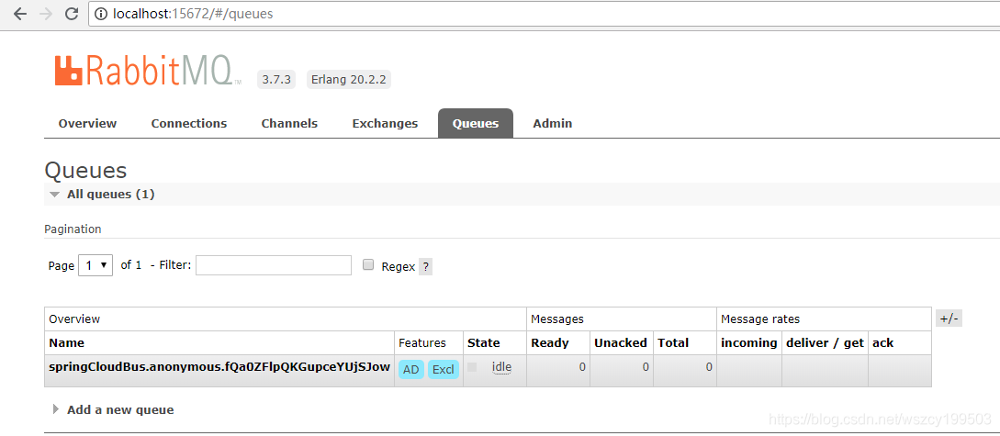
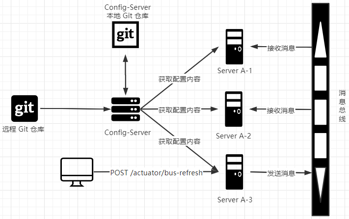
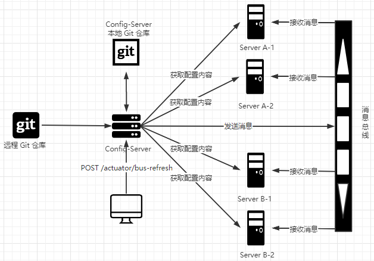
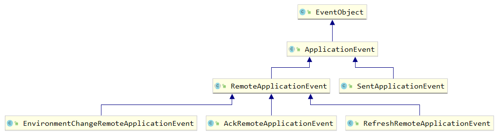
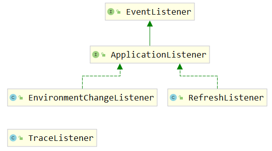
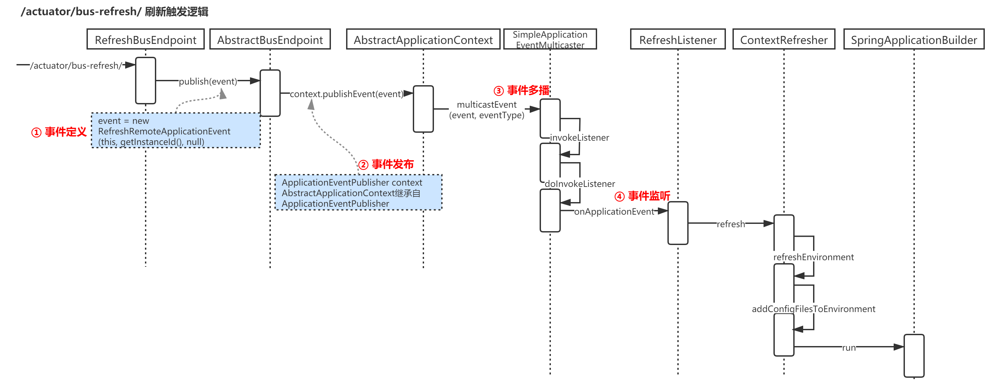

# 消息总线 Spring Cloud Bus

在微服务架构的系统中，我们通常会使用轻量级的消息代理来构建一个共用的消息主题让系统中所有微服务实例都连接上来，由于该主题中产生的消息会被所有实例监听和消费，所以我们称它为`消息总线`。在总线上的各个实例都可以方便地广播一些需要让其他连接在该主题上的实例都知道的消息，例如配置信息的变更或者其他一些管理操作等。

## 1 消息代理

`消息代理（Message Broker)`是一种消息验证、传输、路由的架构模式。它在应用程序之间起到通信调度并最小化应用之间的依赖的作用，使得应用程序可以高效地解耦通信过程。消息代理是一个中间件产品，它的核心是一个消息的路由程序，用来实现接收和分发消息，并根据设定好的消息处理流来转发给正确的应用。它包括独立的通信和消息传递协议，能够实现组织内部和组织间的网络通信。

设计代理的目的就是为了能够从应用程序中传入消息，并执行一些特别的操作。

* 将消息路由到一个或多个目的地
* 消息转化为其他的表现方式
* 执行消息的聚集、消息的分解，并将结果发送到它们的目的地，然后重新组合响应返回给消息用户
* 调用Web 服务来检索数据
* 响应事件或错误
* 使用发布-订阅模式来提供内容或基于主题的消息路由

## 2 RabbitMQ 实现消息总线

### 2.1 快速入门

在Spring Boot中整合 RabbitMQ 是一件非常容易的事，StarterPOMs 中的 AMQP 模块就可以很好地支持RabbitMQ。

> Starter POMs 是可以包含到应用中的一个方便的依赖关系描述符集合。你可以获取所有 Spring 及相关技术的一站式服务，而不需要翻阅示例代码，拷贝粘贴大量的依赖描述符。例如，如果你想使用 Spring 和 JPA 进行数据库访问，只需要在你的项目中包含 spring-boot-starter-data-jpa 依赖，然后你就可以开始了。

```xml
<dependency>
    <groupId>org.springframework.boot</groupId>
    <artifactId>spring-boot-starter-amqp</artifactId>
</dependency>
```

```java
// 创建消息生产者
@Component
public class Sender {
    // 注入AmqpTemplate来实现消息的发送
    @Autowired
    private AmqpTemplate amqpTemplate;

    public void sent() {
        String context = "hello " + new Date();
        System.out.println("Sender: " + context);
        this.amqpTemplate.convertAndSend("hello", context);
    }
}
// 创建消息消费者
@Component
// 定义该类对 hello 队列的监听
@RabbitListener(queues = "hello")
public class Receiver {
    // 指定对消息的处理方法
    @RabbitHandler
    public void process(String hello) {
        System.out.println("Receiver: " + hello);
    }
}
// 创建 RabbitMQ 的配置类，用来配置队列、交换器、路由等高级信息
@Configuration
public class RabbitConfig {
    @Bean
    public Queue helloQueue() {
        return new Queue("hello");
    }
}
@RunWith(SpringRunner.class)
@SpringBootTest
public class ApplicaitionTests {
    @Autowired
    private Sender sender;

    @Test
    public void hello() {
        sender.sent();
    }
}
```

```
o.s.a.r.c.CachingConnectionFactory       : Created new connection: rabbitConnectionFactory#5b58ed3c:0/SimpleConnection@19dcfa0a [delegate=amqp://guest@127.0.0.1:5672/, localPort= 53525]
Sender: hello Fri Jan 15 11:28:23 CST 2021
Receiver: hello Fri Jan 15 11:28:23 CST 2021
```

通过上面的示例，我们在Spring Boot应用中引入 spring-boot-starter-amqp 模块，进行简单配置就完成了对 RabbitMQ的消息生产和消费的开发内容。

### 2.2 整合 Spring Cloud Bus

这里需要使用到 Eureka 服务治理项目，config-server，config-client。

扩展 config-client 应用，修改pom.xml 增加 spring-cloud-starter-bus-amqp 模块(注意spring-boot-starter-actuator 模块也是必需的，用来提供刷新端点)。

```xml
<dependency>
	<groupId>org.springframework.cloud</groupId>
    <artifactId>spring-cloud-starter-bus-amqp</artifactId>
</dependency>
```

```yml
spring:
  rabbitmq:
    host: localhost
    port: 5672
    username: guest
    password: guest
management:
  endpoints:
    web:
      exposure:
        include: refresh, bus-refresh
```

启动两个 config-client 项目，端口分别为7002，7003，RabbitMQ会多出一个队列：



```markdown
# 同时 客户端程序多出了 /actuator/bus-refresh 请求
s.b.a.e.w.s.WebMvcEndpointHandlerMapping : Mapped "{[/actuator/bus-refresh/{destination}],methods=[POST]}" onto public java.lang.Object org.springframework.boot.actuate.endpoint.web.servlet.AbstractWebMvcEndpointHandlerMapping$OperationHandler.handle(javax.servlet.http.HttpServletRequest,java.util.Map<java.lang.String, java.lang.String>)
s.b.a.e.w.s.WebMvcEndpointHandlerMapping : Mapped "{[/actuator/bus-refresh],methods=[POST]}" onto public java.lang.Object org.springframework.boot.actuate.endpoint.web.servlet.AbstractWebMvcEndpointHandlerMapping$OperationHandler.handle(javax.servlet.http.HttpServletRequest,java.util.Map<java.lang.String, java.lang.String>)
```

修改 git 上的配置文件 from 字段，同时使用post方式请求 http://localhost:7002/actuator/bus-refresh。

访问 http://localhost:7002/from 和 http://localhost:7002/from，发现配置均已改。

### 2.3 原理分析



**指定刷新范围**

Spring Cloud Bus对这种场景也有很好的支持，/bus-refresh/{destination} 接口提供了一个 destination 参数，用来定位具体要刷新的应用程序。比如，我们可以请求/bus/refresh/localhost:springspace:7002，此时总线上的各应用实例会根据 destination 属性的值来判断是否为自己的实例名，若符合才进行配置刷新，若不符合就忽略该消息。

> 实例名默认生成规则
>
> ${spring.cloud.client.hostname}:${spring.application.name}:${spring.application.instance_id:$ {server.port}}
>
> 此时 config-client 的默认实例名为：localhost:springspace:7003 , localhost:springspace:7002

destination 参数除了可以定位具体的实例之外，还可以用来定位具体的服务。定位服务的原理是通过使用 Spring 的 PathMatecher （路径匹配）来实现的，比如/bus/refresh/springspace:**，该请求会触发customers服务的所有实例进行刷新。

**架构优化**

在之前的架构中，服务的配置更新需要通过向具体服务中的某个实例发送请求，再触发对整个服务集群的配置更新。虽然能实现功能，但是这样的结果是，我们指定的应用实例会不同于集群中的其他应用实例，这样会增加集群内部的复杂度，不利于将来的运维工作。



## 3 源码分析

通过全局搜索 bus-refresh，查找到线索 RefreshBusEndpoint 中，使用了 RefreshRemoteApplicationEvent 类，从这里入手开始分析。

顺着 RefreshRemoteApplicationEvent 整理出如下的事件关系类图。



可以看到，其中 RefreshRemoteApplicationEvent 和 AckRemoteApplicationEvent 这些我们已经接触过的事件都继承了RemoteApplicationEvent 抽象类，而 RemoteApplicationEvent 继承自Spring Framework的ApplicationEvent，可以断定，Spring Cloud Bus也采用了Spring 的`事件驱动模型`。

### 3.1 事件驱动模型

Spring 的事件驱动模型包含三个基本概念：事件、事件监听者、事件发布者。

* `事件` Spring 中定义了事件的抽象类 ApplicationEvent，它继承自JDK的 Eventobject 类。事件包含了两个成员变量: timestamp，该字段用于存储事件发生的时间戳，以及父类中的 source，该字段表示源事件对象。

  当我们需要自定义事件的时候，只需要继承 ApplicationEvent，比如 RemoteApplicationEvent、RefreshRemoteApplicationEvent 等，可以在自定义的Event中增加一些事件的属性来给事件监听者处理。

* `事件监听者` Spring 中定义了事件监听者的接口 ApplicationListener，它继承自JDK的 EventListener 接口，同时 ApplicationListener 接口限定了 ApplicationEvent 子类作为该接口中 onApplicationEvent(E event);函数的参数。所以，每一个 ApplicationListener 都是针对某个 ApplicationEvent 子类的监听和处理者。

* `事件发布者` Spring中定义了 ApplicationEventPublisher 和 ApplicationEventMulticaster 两个接口用来发布事件。其中 ApplicationEventPublisher 接口定义了发布事件的函数 publishEvent(ApplicationEvent event)和 publishEvent(Object event);而ApplicationEventMulticaster接口中定义了对ApplicationListener的维护操作（比如新增、移除等）以及将 ApplicationEvent 多播给可用 ApplicationListener 的操作。

ApplicationEventPublisher 的 publishEvent 方法实现在 AbstractApplicationContext：

```java
protected void publishEvent(Object event, @Nullable ResolvableType eventType) {
   Assert.notNull(event, "Event must not be null");
   ...
   if (this.earlyApplicationEvents != null) {
      this.earlyApplicationEvents.add(applicationEvent);
   }
   else {
      // 最终调用 AbstractApplicationEventMulticaster 的multicastEvent方法来具体实现发布时间给监听者的操作
       // AbstractApplicationEventMulticaster默认实现位于SimpleApplicationEventMulticaster
      getApplicationEventMulticaster().multicastEvent(applicationEvent, eventType);
   }
}
// SimpleApplicationEventMulticaster.java
public void multicastEvent(final ApplicationEvent event, @Nullable ResolvableType eventType) {
	ResolvableType type = (eventType != null ? eventType : resolveDefaultEventType(event));
    // 通过遍历维护的ApplicationListener集合来找到对应ApplicationEvent的监听器
	for (final ApplicationListener<?> listener : getApplicationListeners(event, type)) {
		Executor executor = getTaskExecutor();
		if (executor != null) {
			executor.execute(() -> invokeListener(listener, event));
		}
		else {
			invokeListener(listener, event);
		}
	}
}
protected void invokeListener(ApplicationListener<?> listener, ApplicationEvent event) {
	ErrorHandler errorHandler = getErrorHandler();
	if (errorHandler != null) {
		try {
			doInvokeListener(listener, event);
		}
		catch (Throwable err) {
			errorHandler.handleError(err);
		}
	}
	else {
		doInvokeListener(listener, event);
	}
}
// 然后调用监听器的onApplicationEvent函数来对具体事件做出处理操作
private void doInvokeListener(ApplicationListener listener, ApplicationEvent event) {
	listener.onApplicationEvent(event);
	...
}
```

### 3.2 事件定义

从 RemoteApplicationEvent 抽象类开始:

```java
// Jackson对多态类型的处理注解，当进行序列化时，会使用子类的名称作为type属性值
@JsonTypeInfo(use = JsonTypeInfo.Id.NAME, property = "type")
// 序列化时忽略 source 属性，source时父类属性，用来定义事件的发生源
@JsonIgnoreProperties("source")
public abstract class RemoteApplicationEvent extends ApplicationEvent {
   private static final Object TRANSIENT_SOURCE = new Object();
   private final String originService;
   private final String destinationService;
   private final String id;

   protected RemoteApplicationEvent() {
      // for serialization libs like jackson
      this(TRANSIENT_SOURCE, null, null);
   }

   protected RemoteApplicationEvent(Object source, String originService,
         String destinationService) {
      super(source);
      this.originService = originService;
      if (destinationService == null) {
         destinationService = "**";
      }
      if (!"**".equals(destinationService)) {
         if (StringUtils.countOccurrencesOf(destinationService, ":") <= 1
               && !StringUtils.endsWithIgnoreCase(destinationService, ":**")) {
            // All instances of the destination unless specifically requested
            destinationService = destinationService + ":**";
         }
      }
      this.destinationService = destinationService;
      this.id = UUID.randomUUID().toString();
   }

   protected RemoteApplicationEvent(Object source, String originService) {
      this(source, originService, null);
   }
   ...
}
```

几个集体实现的事件类：

**RefreshRemoteApplicationEvent**

该事件用于远程刷新应用的配置信息。它的实现非常简单，只是继承了RemoteApplicationEvent，并没有增加其他内容。从之前的示例中我们也能看到，消息中的内容与RemoteApplicationEvent中包含的属性完全一致。

```java
public class RefreshRemoteApplicationEvent extends RemoteApplicationEvent {

   @SuppressWarnings("unused")
   private RefreshRemoteApplicationEvent() {
      // for serializers
   }

   public RefreshRemoteApplicationEvent(Object source, String originService,
         String destinationService) {
      super(source, originService, destinationService);
   }
}
```

**AckRemoteApplicationEvent**

该事件用于告知某个事件消息已经被接收，通过该消息我们可以监控各个事件消息的响应。多出的几个属性: ackId、ackDestinationService 以及event。

其中event成员变量通过泛型限定了必须为 RemoteApplicationEvent 的子类对象，该定义符合这样的逻辑:Ack 消息肯定有一个事件源头，而每一个事件都必须继承RemoteApplicationEvent 抽象类，所以AckRemoteApplicationEvent的事件源头肯定是一个RemoteApplicationEvent的子类。

```java
public class AckRemoteApplicationEvent extends RemoteApplicationEvent {
   private final String ackId;
   private final String ackDestinationService;
   private Class<? extends RemoteApplicationEvent> event;
   @SuppressWarnings("unused")
   private AckRemoteApplicationEvent() {
      super();
      this.ackDestinationService = null;
      this.ackId = null;
      this.event = null;
   }
   public AckRemoteApplicationEvent(Object source, String originService,
         String destinationService, String ackDestinationService, String ackId,
         Class<? extends RemoteApplicationEvent> type) {
      super(source, originService, destinationService);
      this.ackDestinationService = ackDestinationService;
      this.ackId = ackId;
      this.event = type;
   }
    ...
}
```

**EnvironmentChangeRemoteApplicationEvent**

该事件用于动态更新消息总线上每个节点的Spring环境属性。可以看到，该类中定义了一个Map类型的成员变量，而接收消息的节点就是根据该Map对象中的属性来覆盖本地的Spring环境属性。

```java
public class EnvironmentChangeRemoteApplicationEvent extends RemoteApplicationEvent {
   private final Map<String, String> values;
   @SuppressWarnings("unused")
   private EnvironmentChangeRemoteApplicationEvent() {
      // for serializers
      values = null;
   }
   public EnvironmentChangeRemoteApplicationEvent(Object source, String originService,
         String destinationService, Map<String, String> values) {
      super(source, originService, destinationService);
      this.values = values;
   }
   ...
}
```

### 3.3 事件监听器



```java
// 从泛型中我们可以看到该监听器就是针对我们之前所介绍的 RefreshRemoteApplicationEvent事件的
public class RefreshListener
      implements ApplicationListener<RefreshRemoteApplicationEvent> {

   private static Log log = LogFactory.getLog(RefreshListener.class);

   private ContextRefresher contextRefresher;

   public RefreshListener(ContextRefresher contextRefresher) {
      this.contextRefresher = contextRefresher;
   }

   @Override
   public void onApplicationEvent(RefreshRemoteApplicationEvent event) {
      // onApplicationEvent函数中调用了ContextRefresher中的refresh()函数进行配置属性的刷新
      Set<String> keys = contextRefresher.refresh();
      log.info("Received remote refresh request. Keys refreshed " + keys);
   }
}
```

```java
// 它是针对EnvironmentChangeRemoteApplicationEvent 事件的监听类
public class EnvironmentChangeListener
      implements ApplicationListener<EnvironmentChangeRemoteApplicationEvent> {

   private static Log log = LogFactory.getLog(EnvironmentChangeListener.class);

   @Autowired
   private EnvironmentManager env;

    // 从 EnvironmentChangeRemoteApplicationEvent中获取了之前提到的事件中定义的Map对象,然后通过遍历来更新EnvironmentManager中的属性内容
   @Override
   public void onApplicationEvent(EnvironmentChangeRemoteApplicationEvent event) {
      Map<String, String> values = event.getValues();
      log.info("Received remote environment change request. Keys/values to update "
            + values);
      for (Map.Entry<String, String> entry : values.entrySet()) {
         env.setProperty(entry.getKey(), entry.getValue());
      }
   }
}
```

### 3.4 事件发布

在 org.springframework.cloud.bus 包下，我们可以找到关于Spring Cloud Bus启动时加载的一些基础类和接口，包括自动化配置类BusAutoConfiguration、属性定义类BusProperties等。我们可以从Spring Cloud Bus 的自动化配置类中看看它在启动的时候都加载了什么内容:

```java
@Configuration
@ConditionalOnBusEnabled
@EnableBinding(SpringCloudBusClient.class)
@EnableConfigurationProperties(BusProperties.class)
public class BusAutoConfiguration implements ApplicationEventPublisherAware {
   public static final String BUS_PATH_MATCHER_NAME = "busPathMatcher";
   @Autowired
   @Output(SpringCloudBusClient.OUTPUT)
    // 该接口定义了发送消息的抽象方法
   private MessageChannel cloudBusOutboundChannel;
   @Autowired
    // 该对象提供了两个重要的函数用来判断事件的来源是否为自己，以及判断目标是否为自己
   private ServiceMatcher serviceMatcher;
   @Autowired
    // 消息服务的绑定属性
   private BindingServiceProperties bindings;
   @Autowired
    // 该对象定义了 Spring Cloud Bus 的属性
   private BusProperties bus;
    // Spring 事件模型中用来发布时间的接口
   private ApplicationEventPublisher applicationEventPublisher;
	...
}
public class ServiceMatcher {
	...
	public boolean isFromSelf(RemoteApplicationEvent event) {
		String originService = event.getOriginService();
		String serviceId = getServiceId();
		return this.matcher.match(originService, serviceId);
	}

	public boolean isForSelf(RemoteApplicationEvent event) {
		String destinationService = event.getDestinationService();
		return (destinationService == null || destinationService.trim().isEmpty()
				|| this.matcher.match(destinationService, getServiceId()));
	}
	...
}
// 前缀使用了 spring.cloud.bus
@ConfigurationProperties("spring.cloud.bus")
public class BusProperties {
	private Env env = new Env();
	private Refresh refresh = new Refresh();
	private Ack ack = new Ack();
	private Trace trace = new Trace();
    // 默认的队列或主题
	private String destination = "springCloudBus";
    private String id = "application";
    // 是否连接到消息总线
	private boolean enabled = true;
	...
}
```

另外，在该配置类中为 Env、Refresh、Ack、Trace 4种已经实现的事件分别创建了配置对象，这些配置类都是BusProperties 的内部类。

```java
// 从下面的源码中，我们可以看到对于这4种事件，Env、Refresh、Ack均是默认开启的，只有Trace事件需要通过修改配置来开启，就如之前我们介绍“事件跟踪”的时候配置spring.cloud.bus.trace.enabled=true属性那样
public static class Env {
   /**
    * Flag to switch off environment change events (default on).
    */
   private boolean enabled = true;
   public boolean isEnabled() {
      return enabled;
   }
   public void setEnabled(boolean enabled) {
      this.enabled = enabled;
   }
}
public static class Refresh {
   /**
    * Flag to switch off refresh events (default on).
    */
   private boolean enabled = true;
   public boolean isEnabled() {
      return enabled;
   }
   public void setEnabled(boolean enabled) {
      this.enabled = enabled;
   }
}
public static class Ack {
   /**
    * Flag to switch off acks (default on).
    */
   private boolean enabled = true;
   /**
    * Service that wants to listen to acks. By default null (meaning all services).
    */
   private String destinationService;
   public boolean isEnabled() {
      return enabled;
   }
   public void setEnabled(boolean enabled) {
      this.enabled = enabled;
   }
   public String getDestinationService() {
      return destinationService;
   }
   public void setDestinationService(String destinationService) {
      this.destinationService = destinationService;
   }
}
public static class Trace {
   /**
    * Flag to switch on tracing of acks (default off).
    */
   private boolean enabled = false;
   public boolean isEnabled() {
      return enabled;
   }
   public void setEnabled(boolean enabled) {
      this.enabled = enabled;
   }
}
```

BusAutoConfiguration 除了定义的这些成员变量之外，还能看到这里定义了两个监听方法acceptLocal和acceptRemote。

```java
// 可以将该函数理解为对 RemoteApplicationEvent事件的监听器，监听本地事件来进行消息的发送
@EventListener(classes = RemoteApplicationEvent.class)
public void acceptLocal(RemoteApplicationEvent event) {
   // 只对事件来源是自己并且事件类型不是AckRemoteApplicationEvent的内容进行后续的处理
    if (this.serviceMatcher.isFromSelf(event)
         && !(event instanceof AckRemoteApplicationEvent)) {
      // 通过消息管道将该事件发送出去
      this.cloudBusOutboundChannel.send(MessageBuilder.withPayload(event).build());
   }
}
// 将该函数注册为消息代理上数据流的事件监听器
// SpringcloudBusclient.INPUT 指定了监听的通道名
// 该函数所在类的定义，使用了@EnableBinding注解，该注解用来实现与消息代理的连接，注解中的属性值 springcloudBusclient.class声明了输入和输出通道的定义，用来绑定消息代理的输入与输出，以实现向消息总线上发送和接收消息
@StreamListener(SpringCloudBusClient.INPUT)
public void acceptRemote(RemoteApplicationEvent event) {
    // 监听消息代理的输入通道，并根据事件类型和配置内容来确定是否要发布事件给我们之前分析的几个事件监听器来对事件做具体的处理
	if (event instanceof AckRemoteApplicationEvent) {
		if (this.bus.getTrace().isEnabled() && !this.serviceMatcher.isFromSelf(event)
				&& this.applicationEventPublisher != null) {
			this.applicationEventPublisher.publishEvent(event);
		}
		// If it's an ACK we are finished processing at this point
		return;
	}
	if (this.serviceMatcher.isForSelf(event)
			&& this.applicationEventPublisher != null) {
		if (!this.serviceMatcher.isFromSelf(event)) {
			this.applicationEventPublisher.publishEvent(event);
		}
		if (this.bus.getAck().isEnabled()) {
			AckRemoteApplicationEvent ack = new AckRemoteApplicationEvent(this,
					this.serviceMatcher.getServiceId(),
					this.bus.getAck().getDestinationService(),
					event.getDestinationService(), event.getId(), event.getClass());
			this.cloudBusOutboundChannel
					.send(MessageBuilder.withPayload(ack).build());
			this.applicationEventPublisher.publishEvent(ack);
		}
	}
	if (this.bus.getTrace().isEnabled() && this.applicationEventPublisher != null) {
		// We are set to register sent events so publish it for local consumption,
		// irrespective of the origin
		this.applicationEventPublisher.publishEvent(new SentApplicationEvent(this,
				event.getOriginService(), event.getDestinationService(),
				event.getId(), event.getClass()));
	}
}
```

### 3.5 控制端点

```java
// BusAutoConfiguration 有这么一段配置
// endpoints.spring.cloud.bus.refresh.enabled为true，就会配置RefreshBusEndpoint
@Configuration
@ConditionalOnBean(ContextRefresher.class)
@ConditionalOnProperty(value = "endpoints.spring.cloud.bus.refresh.enabled", matchIfMissing = true)
protected static class BusRefreshEndpointConfiguration {
   @Bean
   public RefreshBusEndpoint refreshBusEndpoint(ApplicationContext context,
         BusProperties bus) {
      return new RefreshBusEndpoint(context, bus.getId());
   }
}
// RefreshBusEndpoint控制 bus-refresh端口
@Endpoint(id = "bus-refresh") //TODO: document new id
public class RefreshBusEndpoint extends AbstractBusEndpoint {

   public RefreshBusEndpoint(ApplicationEventPublisher context, String id) {
      super(context, id);
   }

   @WriteOperation
   public void busRefreshWithDestination(@Selector String destination) { //TODO: document destination
      publish(new RefreshRemoteApplicationEvent(this, getInstanceId(), destination));
   }

   @WriteOperation
   public void busRefresh() {
      publish(new RefreshRemoteApplicationEvent(this, getInstanceId(), null));
   }

}
```



------

