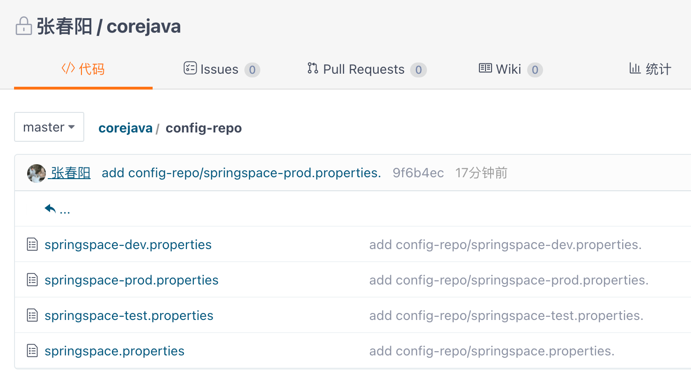
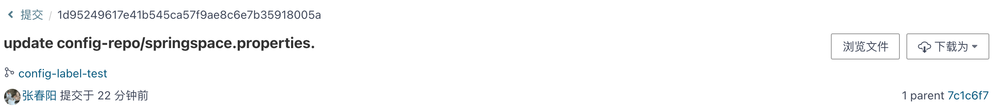

# 分布式配置中心 Spring Cloud Config

Spring Cloud Config 是 Spring Cloud 团队创建的一个全新项目，用来为分布式系统中的基础设施和微服务应用提供集中化的外部配置支持，它分为服务端与客户端两个部分。其中服务端也称为`分布式配置中心`，它是一个独立的微服务应用，用来连接配置仓库并为客户端提供获取配置信息、加密/解密信息等访问接口；而客户端则是微服务架构中的各个微服务应用或基础设施，它们通过指定的配置中心来管理应用资源与业务相关的配置内容，并在启动的时候从配置中心获取和加载配置信息。

Spring Cloud Config 实现了对服务端和客户端中环境变量和属性配置的抽象映射，所以它除了适用于Spring构建的应用程序之外, 也可以在任何其他语言运行的应用程序中使用。由于Spring Cloud Config实现的配置中心默认采用 Git 来存储配置信息，所以使用Spring Cloud Config构建的配置服务器，天然就支持对微服务应用配置信息的版本管理，并且可以通过Git客户端工具来方便地管理和访问配置内容。当然它也提供了对其他存储方式的支持，比如SVN仓库、本地化文件系统。

## 1 快速入门

### 1.1 构建配置中心

创建一个基础的 Spring Boot 工程，命名为 config-server。

```xml
<dependency>
    <groupId>org.springframework.cloud</groupId>
    <artifactId>spring-cloud-config-server</artifactId>
</dependency>
```

启动类添加注解 `@EnableConfigServer`

```yml
server:
  port: 7001
spring:
  application:
    name: config-server
  cloud:
    config:
      server:
        git:
        	# Git 仓库位置
          uri: https://gitee.com/spring_zcy/corejava.git
          # 仓库路径下的相对搜索位置，可配置多个
          search-paths: config-repo
          # Git 仓库的用户名密码
          username: 457540867
          password: zcy
```

启动起来，确保没有产生错误。

### 1.2 配置规则详解

在 Git 仓库位置创建 config-repo 目录作为配置仓库，并根据不同环境新建 4 个配置文件。



在 4 个配置文件中均设置了一个 from 属性，并且每个设置不同的值。

为了测试版本控制，在该 Git 仓库的 master 分支中，我们为 from 属性加入1.0的后缀，同时创建一个 config-label-test 分支,并将各配置文件中的值用2.0作为后缀。

访问配置信息的 URL 与配置文件的映射关系如下所示:

* /{application}/{profile}[/{label}]
* /{application}-{profile}.yml
* /{label}/{application}-{profile}.yml
* /{application}-{profile}.properties
* /{label}/{application}-{profile}.properties

上面的 url 会映射{application}-{profile} .properties对应的配置文件，其中{label}对应Git上不同的分支，默认为master。

我们可以尝试构造不同的url来访问不同的配置内容，比如，要访问config-label-test 分支，springspace 应用的prod
环境，就可以访问这个url: http://localhost:7001/springspace/prod/config-label-test，并获得如下返回信息:

```json
{
  "name":"springspace",
  "profiles":[
    "prod"
  ],
  "label":"config-label-test",
  "version":"1d95249617e41b545ca57f9ae8c6e7b35918005a",
  "state":null,
  "propertySources":[
    {
      "name":"https://gitee.com/spring_zcy/corejava.git/config-repo/springspace-prod.properties",
      "source":{
        "from":"git-prod-2.0"
      }
    },
    {
      "name":"https://gitee.com/spring_zcy/corejava.git/config-repo/springspace.properties",
      "source":{
        "from":"git-default-2.0"
      }
    }
  ]
}
```

我们可以看到该 JSON 中返回了应用名 springspace，环境名prod，分支名config-label-test，以及default环境和prod环境的配置内容。另外，之前没有提到过的version，从下图我们可以观察到，它对应的是在 Git 上的commit号。



同时，我们可以看到config-server的控制台中还输出了下面的内容，配置服务器在从Git 中获取配置信息后，会存储一份 config-server 的文件系统中，实质上 config-server 是通过 git clone 命令将配置内容复制了一份在本地存储，然后读取这些内容并返回给微服务应用进行加载。

```
s.c.a.AnnotationConfigApplicationContext : Refreshing org.springframework.context.annotation.AnnotationConfigApplicationContext@378f08b2: startup date [Wed Jan 13 22:00:09 CST 2021]; root of context hierarchy
o.s.c.c.s.e.NativeEnvironmentRepository  : Adding property source: file:/var/folders/dd/9vlpnh69585_l1b9p_4kl1hm0000gn/T/config-repo-3976395801827396203/config-repo/springspace-prod.properties
o.s.c.c.s.e.NativeEnvironmentRepository  : Adding property source: file:/var/folders/dd/9vlpnh69585_l1b9p_4kl1hm0000gn/T/config-repo-3976395801827396203/config-repo/springspace.properties
s.c.a.AnnotationConfigApplicationContext : Closing org.springframework.context.annotation.AnnotationConfigApplicationContext@378f08b2: startup date [Wed Jan 13 22:00:09 CST 2021]; root of context hierarchy
```

config-server 通过Git在本地仓库暂存，可以有效防止当Git仓库出现故障而引起无法加载配置信息的情况。断开网络，再次发起请求，虽然 onfig-server 提示无法从远程获取该分支内容的报错信息: Could not pull remote for config-label-test， 但是它依然会为该请求返回配置内容，这些内容源于之前访问时存于config-server本地文件系统中的配置内容。

### 1.3 客户端配置映射

创建一个 Spring Boot 基础应用，命名为 config-clietn。

```xml
<dependency>
    <groupId>org.springframework.cloud</groupId>
    <artifactId>spring-cloud-starter-config</artifactId>
</dependency>
```

```yml
######################### bootstrap.yml #########################
spring:
  application:
  	# 对应配置文件规则中的 {application} 部分
    name: springspace
  cloud:
    config:
    	# 对应配置文件规则中的 {profile} 部分
      profile: dev
      # 对应配置文件规则中的 {label} 部分
      label: master
      # 配置中心 config-server 的地址
      uri: http://localhost:7001/
server:
  port: 7002
```

上面这些`属性必须配置在 bootstrap.properties 或 bootstrap.yml 中`，这样 config-server 中的配置信息才能被正确加载。

Spring Boot 对配置文件的加载顺序，对于本应用 jar 包之外的配置文件加载会优先于应用 jar 包内的配置内容，而通过bootstrap.properties 对 config-server 的配置，使得该应用会从 config-server 中获取一些外部配置信息，这些信息的优先级比本地的内容要高，从而实现了外部化配置。

```java
@RestController
public class TestController {
    @Value("${from}")
    private String from;

    @GetMapping("/from")
    public String from() {
        return this.from;
    }
}
```

启动config-client应用，并访问http://localhost:7002/from，我们就可以根据配置内容输出对应环境的from内容了。根据当前配置,我们可以获得如下返回内容 git-dev-1.0。可以继续通过修改 bootstrap.properties 中的配置内容获取不同的配置信息来熟悉配置服务中的配置规则。


## eureka如果不使用默认8761端口

1.eureka使用8762端口，启动项目 2.修改config的配置注册到eureka服务中心，启动项目 3.但是此时order项目并未注册到eureka上去，是因为git服务器上没有修改配置文件。修改git上的order配置文件为8762。 4.访问http://localhost:8080/order-dev.yml，配置生效 5.启动order项目无法启动，而且访问的config也变成了http://localhost:8888 原因在于，首先order回去访问eureka，现在配置放在config中，访问不到，就会去访问默认的8761端口。 所以需要把git上关于eureka的配置挪到bootstrap.yml中

```java
eureka:
  client:
    service-url:
      defaultZone: http://localhost:8762/eureka/
```


6.但配置仍未生效，原因在于  在获取order-test.yml的配置时，同时会拿到order.yml（默认）并将两个配置文件合并。 所以，无需将所有配置都写入到order-环境.yml配置文件中，可以将各个环境下配置文件的公有配置放到order.yml。

## Bus自动更新配置


1.修改spring boot和Spring cloud版本为2.0.0.BUILD-SNAPSHOT和Finchley.BUILD-SNAPSHOT 2.添加依赖

```java
<dependency>
            <groupId>org.springframework.cloud</groupId>
            <artifactId>spring-cloud-starter-bus-amqp</artifactId>
        </dependency>
```

3.修改配置

```java
# 将bus所有的接口暴漏出去（包括bus-refresh）
management:
  endpoints:
    web:
      exposure:
        include: "*"
```


4.启动项目RabbitMQ会多出一个队列 

5.order项目做同样操作，也会多出一个RabbitMQ队列 6.测试方法添加注解

```java
@RestController
@RequestMapping("/env")
@RefreshScope
public class EnvController {

    @Value("${env}")
    private String env;

    @GetMapping("/print")
    public String print() {
        return env;
    }
}
```

7.修改git上的配置文件，同时使用post方式请求http://localhost:8080/actuator/bus-refresh 访问http://localhost:8081/env/print，发现配置已改

#### RefreshScope

前缀方式：

```java
@Data
@Component
@ConfigurationProperties("girl")
@RefreshScope
public class GirlConfig {

    private String name;

    private Integer age;
}
```

```java
@RestController
public class GirlController {

    @Autowired
    private GirlConfig girlConfig;

    @GetMapping("/girl/print")
    public String print() {
        return "name:" + girlConfig.getName() + " age:" + girlConfig.getAge();
    }
}
```

git配置文件中添加：

```java
girl:
  name: xiaoxiao
  age: 19
```

#### 通过Git类型的网站设置push时自动调用bus-refresh接口


