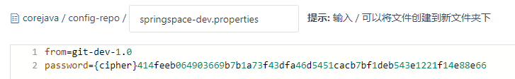
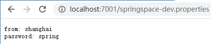
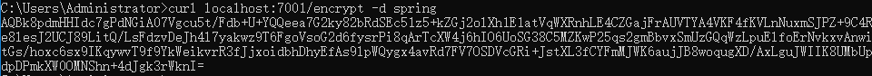
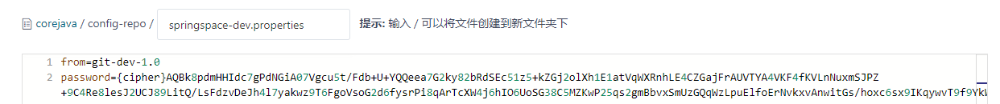
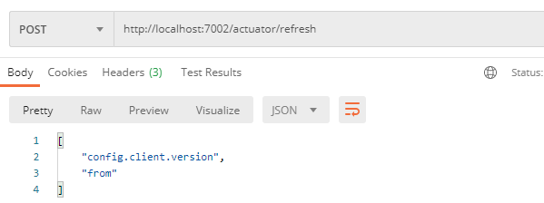
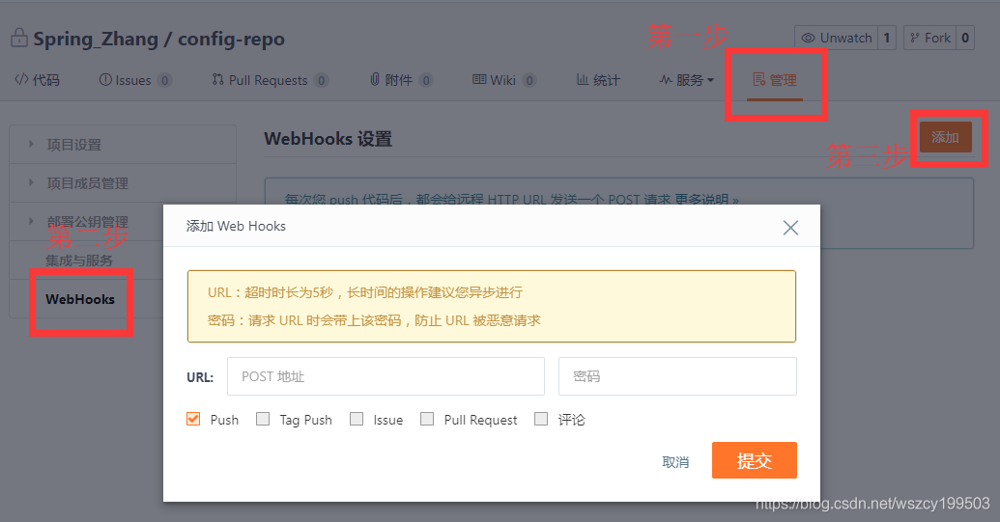

# 分布式配置中心 Spring Cloud Config

Spring Cloud Config 是 Spring Cloud 团队创建的一个全新项目，用来为分布式系统中的基础设施和微服务应用提供集中化的外部配置支持，它分为服务端与客户端两个部分。其中服务端也称为`分布式配置中心`，它是一个独立的微服务应用，用来连接配置仓库并为客户端提供获取配置信息、加密/解密信息等访问接口；而客户端则是微服务架构中的各个微服务应用或基础设施，它们通过指定的配置中心来管理应用资源与业务相关的配置内容，并在启动的时候从配置中心获取和加载配置信息。

Spring Cloud Config 实现了对服务端和客户端中环境变量和属性配置的抽象映射，所以它除了适用于Spring构建的应用程序之外, 也可以在任何其他语言运行的应用程序中使用。由于Spring Cloud Config实现的配置中心默认采用 Git 来存储配置信息，所以使用Spring Cloud Config构建的配置服务器，天然就支持对微服务应用配置信息的版本管理，并且可以通过Git客户端工具来方便地管理和访问配置内容。当然它也提供了对其他存储方式的支持，比如SVN仓库、本地化文件系统。

## 1 快速入门

### 1.1 构建配置中心

创建一个基础的 Spring Boot 工程，命名为 config-server。

```xml
<dependency>
    <groupId>org.springframework.cloud</groupId>
    <artifactId>spring-cloud-config-server</artifactId>
</dependency>
```

启动类添加注解 `@EnableConfigServer`

```yml
server:
  port: 7001
spring:
  application:
    name: config-server
  cloud:
    config:
      server:
        git:
        	# Git 仓库位置
          uri: https://gitee.com/spring_zcy/corejava.git
          # uri: file://${user.home}/config-repo 可以配置本地文件系统，仅适用于开发与测试
          # 占位符配置URI https://gitee.com/spring_zcy/corejava.git/{application}-config
          # 配置多个仓库
          #spring.cloud.config.server.git.uri=http://git.oschina.net/didispace/config-repo
  		  #spring.cloud.config.server.git.repos.dev.pattern=dev/*
  		  #spring.cloud.config.server.git.repos.dev.urimfile://home/git/config-repo
  		  #spring.cloud.config.server.git.repos.test=http://git.oschina.net/test/config-repo
  		  #spring.cloud.config.server.git.repos.prod.pattern=prod/pp* , online/oo*
  		  #spring.cloud.config.server.git.repos.prod.uri=http://git.oschina,net/prod/config-repo
          # 仓库路径下的相对搜索位置，可配置多个
          search-paths: config-repo
          # Git 仓库的用户名密码
          username: 457540867
          password: zcy
```

启动起来，确保没有产生错误。

### 1.2 配置规则详解

在 Git 仓库位置创建 config-repo 目录作为配置仓库，并根据不同环境新建 4 个配置文件。


在 4 个配置文件中均设置了一个 from 属性，并且每个设置不同的值。

为了测试版本控制，在该 Git 仓库的 master 分支中，我们为 from 属性加入1.0的后缀，同时创建一个 config-label-test 分支,并将各配置文件中的值用2.0作为后缀。

访问配置信息的 URL 与配置文件的映射关系如下所示:

* /{application}/{profile}[/{label}]
* /{application}-{profile}.yml
* /{label}/{application}-{profile}.yml
* /{application}-{profile}.properties
* /{label}/{application}-{profile}.properties

上面的 url 会映射{application}-{profile} .properties对应的配置文件，其中{label}对应Git上不同的分支，默认为master。

我们可以尝试构造不同的url来访问不同的配置内容，比如，要访问config-label-test 分支，springspace 应用的prod
环境，就可以访问这个url: http://localhost:7001/springspace/prod/config-label-test，并获得如下返回信息:

```json
{
  "name":"springspace",
  "profiles":[
    "prod"
  ],
  "label":"config-label-test",
  "version":"1d95249617e41b545ca57f9ae8c6e7b35918005a",
  "state":null,
  "propertySources":[
    {
      "name":"https://gitee.com/spring_zcy/corejava.git/config-repo/springspace-prod.properties",
      "source":{
        "from":"git-prod-2.0"
      }
    },
    {
      "name":"https://gitee.com/spring_zcy/corejava.git/config-repo/springspace.properties",
      "source":{
        "from":"git-default-2.0"
      }
    }
  ]
}
```

我们可以看到该 JSON 中返回了应用名 springspace，环境名prod，分支名config-label-test，以及default环境和prod环境的配置内容。另外，之前没有提到过的version，从下图我们可以观察到，它对应的是在 Git 上的commit号。


同时，我们可以看到config-server的控制台中还输出了下面的内容，配置服务器在从Git 中获取配置信息后，会存储一份 config-server 的文件系统中，实质上 config-server 是通过 git clone 命令将配置内容复制了一份在本地存储，然后读取这些内容并返回给微服务应用进行加载。

```
s.c.a.AnnotationConfigApplicationContext : Refreshing org.springframework.context.annotation.AnnotationConfigApplicationContext@378f08b2: startup date [Wed Jan 13 22:00:09 CST 2021]; root of context hierarchy
o.s.c.c.s.e.NativeEnvironmentRepository  : Adding property source: file:/var/folders/dd/9vlpnh69585_l1b9p_4kl1hm0000gn/T/config-repo-3976395801827396203/config-repo/springspace-prod.properties
o.s.c.c.s.e.NativeEnvironmentRepository  : Adding property source: file:/var/folders/dd/9vlpnh69585_l1b9p_4kl1hm0000gn/T/config-repo-3976395801827396203/config-repo/springspace.properties
s.c.a.AnnotationConfigApplicationContext : Closing org.springframework.context.annotation.AnnotationConfigApplicationContext@378f08b2: startup date [Wed Jan 13 22:00:09 CST 2021]; root of context hierarchy
```

config-server 通过Git在本地仓库暂存，可以有效防止当Git仓库出现故障而引起无法加载配置信息的情况。断开网络，再次发起请求，虽然 onfig-server 提示无法从远程获取该分支内容的报错信息: Could not pull remote for config-label-test， 但是它依然会为该请求返回配置内容，这些内容源于之前访问时存于config-server本地文件系统中的配置内容。

### 1.3 客户端配置映射

创建一个 Spring Boot 基础应用，命名为 config-clietn。

```xml
<dependency>
    <groupId>org.springframework.cloud</groupId>
    <artifactId>spring-cloud-starter-config</artifactId>
</dependency>
```

```yml
######################### bootstrap.yml #########################
spring:
  application:
  	# 对应配置文件规则中的 {application} 部分
    name: springspace
  cloud:
    config:
      # name 呢配置对应配置文件中的{application}内容
      # 对应配置文件规则中的 {profile} 部分
      profile: dev
      # 对应配置文件规则中的 {label} 部分
      label: master
      # 配置中心 config-server 的地址
      uri: http://localhost:7001/
server:
  port: 7002
```

上面这些`属性必须配置在 bootstrap.properties 或 bootstrap.yml 中`，这样 config-server 中的配置信息才能被正确加载。

Spring Boot 对配置文件的加载顺序，对于本应用 jar 包之外的配置文件加载会优先于应用 jar 包内的配置内容，而通过bootstrap.properties 对 config-server 的配置，使得该应用会从 config-server 中获取一些外部配置信息，这些信息的优先级比本地的内容要高，从而实现了外部化配置。

```java
@RestController
public class TestController {
    @Value("${from}")
    private String from;

    @GetMapping("/from")
    public String from() {
        return this.from;
    }
}
```

启动 config-client 应用，并访问http://localhost:7002/from，我们就可以根据配置内容输出对应环境的from内容了。根据当前配置,我们可以获得如下返回内容 git-dev-1.0。可以继续通过修改 bootstrap.yml 中的配置内容获取不同的配置信息来熟悉配置服务中的配置规则。

## 2 服务端详解

### 2.1 健康检测

由于 Spring Cloud Config 的服务端为 spring-boot-actuator 模块的 /health 端点实现了对应的健康检测器: org.springframework.cloud.config.server.config.configserverHealthIndicator。在该检测器中，默认构建了一个 application 为 app 的仓库。该检测器会不断地检查 https://gitee.com/spring_zcy/corejava.git/config-repo 仓库是否可以连通。此时，我们可以访问配置中心的 /health 端点来查看它的健康状态。

### 2.2 属性覆盖

Config Server 还有一个“属性覆盖”的特性，比如:

```properties
spring.cloud.config.server.overrides.from=shanghai
```

通过该属性配置的参数，不会被 Spring Cloud 的客户端修改，并且 Spring Cloud 客户端从 Config Server 中获取配置信息时，都会取得这些配置信息。利用该特性可以方便地为Spring Cloud应用配置一些共同属性或是默认属性。当然，这些属性并非强制的，我们可以通过改变客户端中更高优先级的配置方式(比如，配置环境变量或是系统属性)，来选择是否使用 Config Server 提供的默认值。

### 2.3 安全保护

由于配置中心存储的内容比较敏感，做一定的安全处理是必需的。为配置中心实现安全保护的方式有很多，比如物理网络限制、OAuth2授权等。不过，由于我们的微服务应用和配置中心都构建于 Spring Boot 基础上，所以与Spring Security(详细见 Spring Security 专题) 结合使用会更加方便。

我们只需要在配置中心的 pom.xml 中加入 `spring-boot-starter-security` 依赖，不需要做任何其他改动就能实现对配置中心访问的安全保护。

```xml
<dependency>
    <groupId>org.springframework.boot</groupId>
    <artifactId>spring-boot-starter-security</artifactId>
</dependency>
```

默认情况下，我们可以获得一个名为 user 的用户，并且在配置中心启动的时候，在日志中打印出该用户的随机密码，具体如下:

```
INFO22028 ---[main] b.a.s.AuthenticationManagerConfiguration : Using default security password: 1a32a848-daOc-4590-9c58-e860be8c50dd281
```

大多数情况下，我们并不会使用随机生成密码的机制。我们可以在配置文件中指定用户和密码，比如:

```yml
spring:
	security:
  		user:
    		name: user
    		password: 4ffd2b73-75d4-485a-b090-f168c1ff883f
```

由于我们已经为config-server设置了安全保护，如果这时候连接到配置中心的客户端中没有设置对应的安全信息，在获取配置信息时会返回401错误。所以，需要通过配置的方式在客户端中加入安全信息来通过校验，比如:

```yml
spring:
  cloud:
    config:
      username: user
      password: 4ffd2b73-75d4-485a-b090-f168c1ff883f
```

### 2.4 加密解密
在微服务架构中，我们通常会采用 `DevOps` 的组织方式来降低因团队间沟通造成的巨大成本，以加速微服务应用的交付能力。这就使得原本由运维团队控制的线上信息将交由微服务所属组织的成员自行维护，其中将会包括大量的敏感信息，比如数据库的账户与密码等。

Spring Cloud Config 提供了对属性进行加密解密的功能，以保护配置文件中的信息安全:

```properties
spring.datasource.username=didi
spring.datasource.password={cipher}dba6505baa81d78bd08799d8d4429de499bd4c2053c051029e7cfbf143695f5b
```

在 Spring Cloud Config 中通过在属性值前使用 {cipher} 前缀来标注该内容是一个加密值，当微服务客户端加载配置时，配置中心会自动为带有 {cipher} 前缀的值进行解密。通过该机制的实现，运维团队就可以放心地将线上信息的加密资源给到微服务团队。

**JCE**

JRE 中虽然自带了 JCE(Unlimited Strength Java Cryptography Extension)，但长度有限制，JDK1.8.0_161 以上已经不再限制密钥长度。

> JDK1.8.0_151 以上，需要修改 ${JAVA_HOME}\jre\lib\security\java.security 文件，修改配置 crypto.policy=unlimited
>
> JDK1.8.0_151 之前的，需要替换jar

**配置密钥**

> /encrypt/status 查看加密功能状态的端点
>
> /key 查看密钥的端点
>
> /encrypt 对请求的body 内容进行加密的端点
>
> /decrypt 对请求的body 内容进行解密的端点

设置加密的key，但是一定要写在bootstrap.properties或者bootstrap.yml中，否则不设置该属性：

```yml
encrypt:
  key: springspace
```

访问 http://localhost:7001/encrypt/status：

```
{"status":"OK"}
```

访问一下 /encrypt 和 /decrypt 端点来使用加密和解密的功能。注意，这两个端点都是POST请求，加密和解密信息需要通过请求体来发送(暂时先关闭security功能):

```shell
$ curl localhost:7001/encrypt -d spring
414feeb064903669b7b1a73f43dfa46d5451cacb7bf1deb543e1221f14e88e66
$ curl localhost:7001/decrypt -d 414feeb064903669b7b1a73f43dfa46d5451cacb7bf1deb543e1221f14e88e66
spring
```





**非对称加密**

keytool 是 JDK 中的一个密钥和证书管理工具。

```shell
keytool -genkeypair -alias config-server -keyalg RSA -dname "CN=Zhang Chun Yang,OU=Java,O=Spring,L=Zhengzhou,S=Henan,C=China" -keypass xiaoxiao -keystore config-server.jks -storepass love520 -validity 365
```

> -dname 不使用提示直接指定 CN 名字与姓氏 OU 组织单位 O 组织名称 L 城市或区域 S 省市县自治区 C 国家
>
> -storepass 密钥库口令
>
> -keypass 密钥口令
>
> -validity 有效期（默认90天）

将 config-server.jks 放在配置中心的 src/main/resource 目录下:

```yml
encrypt:
  key-store:
  	# 也可通过 file:// 指定文件目录
    location: config-server.jks
    alias: config-server
    password: love520
    secret: xiaoxiao
```






### 2.5 高可用配置

**传统模式**

所有的 Config Server 都指向同一个Git仓库，只需要配置 Config Server上层的负载均衡设备地址即可。

**服务模式**

将 Config Server 作为一个普通的微服务应用，纳入 Eureka的服务治理体系中。这样我们的微服务应用就可以通过配置中心的服务名来获取配置信息，这种方式比起传统的实现模式来说更加有利于维护，因为对于服务端的负载均衡配置和客户端的配置中心指定都通过服务治理机制一并解决了，既实现了高可用，也实现了自维护。

## 3 客户端详解

### 3.1 URI指定配置中心

Spring Cloud Config 的客户端在启动的时候，默认会从工程的 classpath 中加载配置信息并启动应用。只有当我们配置 `spring.cloud.config.uri` 的时候，客户端应用才会尝试连接Spring Cloud Config 的服务端来获取远程配置信息并初始化 Spring 环境配置。同时，我们`必须将该参数配置在 bootstrap.properties、环境变量或是其他优先级高于应用 Jar 包内的配置信息中`，才能正确加载到远程配置。若不指定 spring.cloud.config.uri 参数的话，Spring Cloud Config 的客户端会默认尝试连接 http://localhost:8888。

### 3.2 服务化配置中心

config-server 和 config-client 均添加 spring-cloud-starter-netflix-eureka-client 依赖，将自己加入到 Eureka 的服务治理体系。

启动类均添加 @EnableDiscoveryClient

**服务端配置**

```yml
server:
  port: 7001
spring:
  application:
    name: config-server
  cloud:
    config:
      server:
        git:
          uri: https://gitee.com/spring_zcy/corejava.git
          search-paths: config-repo
          username: 457540867
          password: zcy
eureka:
  client:
    service-url:
      defaultZone: http://192.168.25.128:8761/eureka/
```

**客户端配置**

```yml
spring:
  application:
    name: springspace
  cloud:
    config:
      profile: dev
      discovery:
      	# 开启通过服务来访问Config Server的功能
        enabled: true
        # 指定Config Server注册的服务名
        service-id: CONFIG-SERVER
server:
  port: 7002
eureka:
  client:
    service-url:
      defaultZone: http://192.168.25.128:8761/eureka/
```

### 3.3 失败快速响应与重试

Spring Cloud Config 的客户端会预先加载很多其他信息，比如Controller的请求等，然后再开始连接 Config Server进行属性的注入。当我们构建的应用较为复杂的时候，可能在连接Config Server之前花费较长的启动时间。要实现客户端优先判断 Config Server 获取是否正常，并快速响应失败内容：

```properties
spring.cloud.config.failFast=true
```

加入参数之后，不会报 Controller 中 from 找不到的错误，而是：

```
java.lang.IllegalStateException: Could not locate PropertySource and the fail fast property is set, failing
```

可见当 Config Server 宕机或是客户端配置不正确导致连接不到而启动失败的情况，快速响应的配置可以发挥比较好的效果。

但是，若只是因为网络波动等其他间歇性原因导致的问题，直接启动失败似乎代价有些高。所以，Config 客户端还提供了自动重试的功能，在开启重试功能前，`先确保已经配置了 spring.cloud.config.failFast=true`。

在客户端的 pom.xml 中增加 spring-retry 和 spring-boot-starter-aop 依赖，具体如下:

```xml
<dependency>
    <groupId>org.springframework.retry</groupId>
    <artifactId>spring-retry</artifactId>
</dependency>
<dependency>
    <groupId>org.springframework.boot</groupId>
    <artifactId>spring-boot-starter-aop</artifactId>
</dependency>
```

不需要再做其他任何配置，启动客户端应用，在控制台中可以看到如下内容。客户端在连接 Config Server 失败之后，会继续尝试，直到第6次失败后，才返回错误信息。通过这样的重试机制，可以避免一些间歇性问题引起的失败导致客户端应用无法启动的情况。

```
c.c.c.ConfigServicePropertySourceLocator : Fetching config from server at : http://localhost:7001/
c.c.c.ConfigServicePropertySourceLocator : Fetching config from server at : http://localhost:7001/
c.c.c.ConfigServicePropertySourceLocator : Fetching config from server at : http://localhost:7001/
c.c.c.ConfigServicePropertySourceLocator : Fetching config from server at : http://localhost:7001/
c.c.c.ConfigServicePropertySourceLocator : Fetching config from server at : http://localhost:7001/
c.c.c.ConfigServicePropertySourceLocator : Fetching config from server at : http://localhost:7001/
Application run failed
```

若对默认的最大重试次数和重试间隔等设置不满意，还可以通过下面的参数进行调整。

`spring.cloud.config.retry.multiplier` 初始重试间隔时间（单位为毫秒)，默认为1000毫秒。

`spring.cloud.config.retry.initial-interval` 下一间隔的乘数，默认为1.1，所以当最初间隔是1000毫秒时，下一次失败后的间隔为1100毫秒。

`spring.cloud.config.retry.max-interval` 最大间隔时间，默认为2000毫秒。

`spring.cloud.config.retry.max-attempts` 最大重试次数，默认为6次。

### 3.4 动态刷新配置

在 config-client 的 pom.xml 中新增 spring-boot-starter-actuator 监控模块。

其中包含了 /actuator/refresh 端点的实现，该端点将用于实现客户端应用配置信息的重新获取与刷新。

```yml
management:
  endpoints:
    web:
      exposure:
      	# springboot 2.x 默认只开启了info、health的访问，*代表开启所有访问，这里只开启refresh
        include: refresh
```

对应使用配置字段的 Controller 添加 `@RefreshScope` 注解：

```java
// 使用该注解的类，会在接到SpringCloud配置中心配置刷新的时候，自动将新的配置更新到该类对应的字段中。
@RefreshScope 
```

项目启动后，访问 http://localhost:7002/from，然后去 Git 修改对应 from 的值，之后刷新页面值并未发生改变。



POST 执行 http://localhost:8081/actuator/refresh 后，刷新页面，发生改变。

该功能还可以同 `Git 仓库的 Web Hook 功能`进行关联，当有Git 提交变化时，就给对应的配置主机发送 /actuator/refresh 请求来实现配置信息的实时更新。



但是，当我们的系统发展壮大之后，维护这样的刷新清单也将成为一个非常大的负担,而且很容易犯错，那么有什么办法可以解决这个复杂度呢?可通过Spring Cloud Bus来实现以消息总线的方式进行配置变更的通知，并完成集群上的批量配置更新。

------

