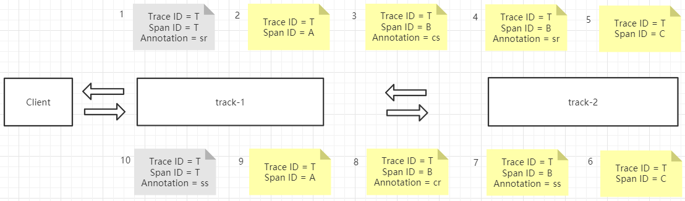
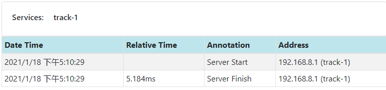
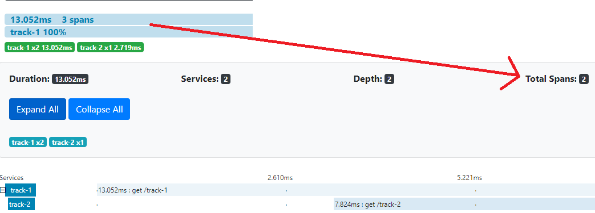
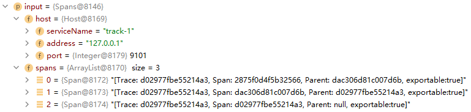
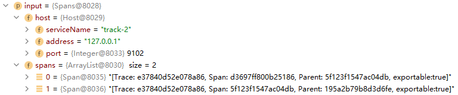
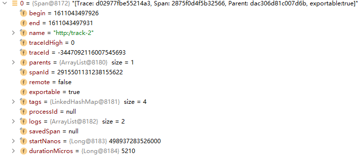
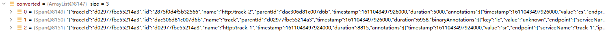
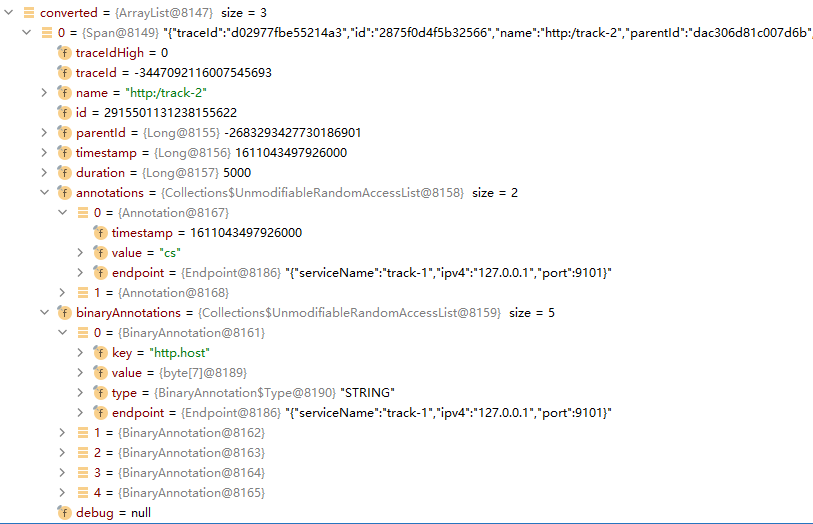
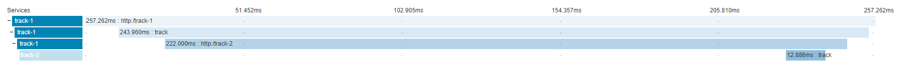

# 分布式服务跟踪 Spring Cloud Sleuth

随着系统规模也会变得越来越大，各微服务间的调用关系也变得越来越错综复杂。一个由客户端发起的请求在后端系统中会经过多个不同的微服务调用来协同产生最后的请求结果，会形成一条复杂的分布式服务调用链路，在每条链路中任何一个依赖服务出现延迟过高或错误的时候都有可能引起请求最后的失败。

通过实现对请求调用的跟踪可以帮助我们快速发现错误根源以及监控分析每条请求链路上的性能瓶颈等。Spring Cloud Sleuth 提供了一套完整的解决方案。

## 1 快速入门

### 1.1 准备工作

构建基础设施和应用，微服务应用: trace-1， 实现一个REST接口/trace-1，使用 RestTemplate 调用该接口后将触发对 trace-2 应用的调用。

对 trace-1的接口发送请求 http://localhost:9101/trace-1，可以得到返回值 Trace，同时还能在它们的控制台中分别获得下面的输出:

```
INFO 8300 --- [nio-9101-exec-5] com.spring.Track1Application             : === call track1 ===
INFO 7408 --- [nio-9102-exec-3] com.spring.Track2Application             : === call track2 ===
```

### 1.2 实现跟踪

通过Spring Cloud Sleuth的封装，我们为应用增加服务跟踪能力的操作非常简单，只需在 trace-1 和  trace-2 的 pom.xml 依赖管理中增加 `spring-cloud-starter-sleuth` 依赖即可，具体如下:

```xml
<dependency>
    <groupId>org.springframework.cloud</groupId>
    <artifactId>spring-cloud-starter-sleuth</artifactId>
</dependency>
```

我们可以从它们的控制台输出中窥探到Sleuth的一些端倪：

```
INFO [track-1,b313f9f69c22acf9,b313f9f69c22acf9,false] 6776 --- [nio-9101-exec-1] com.spring.Track1Application             : === call track-1 ===
INFO [track-2,b313f9f69c22acf9,7058b3684a90bbf7,false] 13488 --- [nio-9102-exec-2] com.spring.Track2Application             : === call track-2 ===
```

从控制台输出内容中，可以看到多了一些形如`[trace-1,b313f9f69c22acf9,b313f9f69c22acf9,false]`的日志信息，而这些元素正是实现分布式服务跟踪的重要组成部分。

* trace-1，它记录了应用的名称，也就是 application.properties 中 spring.application.name 参数配置的属性
* b313f9f69c22acf9，Spring Cloud Sleuth生成的一个ID，称为Trace ID，它用来标识一条请求链路。一条请求链路中包含一个Trace ID，多个Span ID。
* 第三个值: 7058b3684a90bbf7，Spring Cloud Sleuth生成的另外一个ID，称为Span ID，它表示一个基本的工作单元，比如发送一个HTTP请求
* 第四个值: false，表示是否要将该信息输出到Zipkin等服务中来收集和展示。

上面四个值中的Trace ID和Span ID 是 Spring Cloud Sleuth 实现分布式服务跟踪的核心。在一次服务请求链路的调用过程中，会保持并传递同一个Trace ID，从而将整个分布于不同微服务进程中的请求跟踪信息串联起来。以上面输出内容为例，trace-1 和trace-2同属于一个前端服务请求来源，所以它们的Trace ID是相同的，处于同一条请求链路中。

## 2 跟踪原理

为了实现`请求跟踪`，当请求发送到分布式系统的入口端点时，只需要服务跟踪框架为该请求创建一个唯一的跟踪标识，同时在分布式系统内部流转的时候，框架始终保持传递该唯一标识，直到返回给请求方为止，这个唯一标识就是前文中提到的Trace ID。通过 Trace ID 的记录，我们就能将所有请求过程的日志关联起来。

为了统计各处理单元的`时间延迟`，当请求到达各个服务组件时，或是处理逻辑到达某个状态时，也通过一个唯一标识来标记它的开始、具体过程以及结束，该标识就是前文中提到的Span ID。对于每个Span来说，它必须有开始和结束两个节点，通过记录开始Span和结束Span的时间戳，就能统计出该Span的时间延迟，除了时间戳记录之外，它还可以包含一些其他元数据，比如事件名称、请求信息等。

在Spring Boot 应用中，通过在工程中引入spring-cloud-starter-sleuth依赖之后，它会自动为当前应用构建起各通信通道的跟踪机制，比如:

通过诸如 RabbitMQ、Kafka(或者其他任何Spring Cloud Stream绑定器实现的消息中间件）传递的请求。

通过 Zuul 代理传递的请求。

通过 RestTemplate 发起的请求。

由于 trace-1对 trace-2 发起的请求是通过 RestTemplate 实现的，所以 spring-cloud-starter-sleuth 组件会对该请求进行处理。在发送到trace-2之前，Sleuth 会在该请求的 Header 中增加实现跟踪需要的重要信息，主要有下面这几个（更多关于头信息的定义可以通过查看 `org.springframework.cloud.sleuth.instrument.messaging.MessageHeaderPropagation` 的源码获取)。

`X-B3-Traceld` 一条请求链路(Trace）的唯一标识，必需的值。

`X-B3-Spanld` 一个工作单元（Span）的唯一标识，必需的值。

`X-B3-ParentSpanld` 标识当前工作单元所属的上一个工作单元，Root Span(请求链路的第一个工作单元)的该值为空。

`X-B3-Sampled` 是否被抽样输出的标志，1表示需要被输出，0表示不需要被输出。

可以通过对 trace-2 的实现做一些修改来输出这些头部信息，具体如下:

```java
@GetMapping("/track-2")
public String track(HttpServletRequest request) {
    log.info("=== call track-2, TraceId={}, SpanId={} ===", request.getHeader("X-B3-TraceId"), request.getHeader("X-B3-SpanId"));
    return "Track";
}
//INFO [track-2,7a8509891d30707f,5dd9001e2fda8cd0,false] 1568 --- [nio-9102-exec-1] com.spring.Track2Application             : === call track-2, TraceId=7a8509891d30707f, SpanId=5dd9001e2fda8cd0 ===
```

为了更直观地观察跟踪信息，我们还可以在 application.properties 中增加下面的配置:

```properties
logging. level.org.springframework.web.servlet.DispatcherServlet=DEBUG
```

## 3 抽样收集

通过 Trace ID 和 Span ID 已经实现了对分布式系统中的请求跟踪，而记录的跟踪信息最终会被分析系统收集起来，并用来实现对分布式系统的监控和分析功能，比如，预警延迟过长的请求链路、查询请求链路的调用明细等。此时，我们在对接分析系统时就会碰到一个问题：分析系统在收集跟踪信息的时候，需要收集多少跟踪信息才合适呢?

收集的跟踪信息越多就可以越好地反映出系统的实际运行情况，但收集过多的跟踪信息将会对整个分布式系统的性能造成一定的影响，同时保存大量的日志信息也需要不少的存储开销。

所以，在 Sleuth中采用了`抽象收集`的方式来为跟踪信息打上收集标记，也就是我们之前在日志信息中看到的第4个布尔类型的值，它代表了该信息是否要被后续的跟踪信息收集器获取和存储。

Sleuth 中的抽样收集策略是通过 Sampler 接口实现的，它的定义如下：

```java
public interface Sampler(
	boolean issampled(Span span);
}
```

通过实现 isSampled 方法，Spring Cloud Sleuth 会在产生跟踪信息的时候调用它来为跟踪信息生成是否要被收集的标志。需要注意的是，即使 issampled 返回了false，它仅代表该跟踪信息不被输出到后续对接的远程分析系统（比如Zipkin)，对于请求的跟踪活动依然会进行，所以我们在日志中还是能看到收集标识为false的记录。

默认情况下，Sleuth 会使用 `PercentageBasedsampler` 实现的抽样策略，以请求百分比的方式配置和收集跟踪信息。我们可以通过在 application.properties 中配置下面的参数对其百分比值进行设置，它的默认值为 0.1，代表收集 10% 的请求跟踪信息。

```properties
spring.sleuth.sampler.probability=0.1
```

在开发调试期间，通常会收集全部跟踪信息并输出到远程仓库，我们可以将其值设置为 1。

在实际使用时，通过与 Span 对象中存储信息的配合，我们可以根据实际情况做出更贴近需求的抽样策略，比如实现一个仅包含指定 Tag 的抽样策略:

```java
public class Tagsarmpler implements SamplerT
	private String tag;
	public TagSampler (String tag) {
		this.tag = tag;
    }
	@Override
	public boolean isSampled(Span span){
		return span.tags().get(tag) != null;
    }
}
```

由于跟踪日志信息数据的价值往往仅在最近的一段时间内非常有用，比如一周。那么我们在设计抽样策略时，主要考虑在不对系统造成明显性能影响的情况下，以在日志保留时间窗内充分利用存储空间的原则来实现抽样策略。

## 4 与 Zipkin 整合

Zipkin是 Twitter 的一个开源项目，它基于 Google Dapper 实现。我们可以使用它来收集各个服务器上请求链路的跟踪数据，并通过它提供的REST API 接口来辅助查询跟踪数据以实现对分布式系统的监控程序，从而及时发现系统中出现的延迟升高问题并找出系统性能瓶颈的根源。除了面向开发的 API 接口之外，它还提供了方便的 UI 组件来帮助我们直观地搜索跟踪信息和分析请求链路明细，比如可以查询某段时间内各用户请求的处理时间等。

下图展示了Zipkin的基础架构，它主要由4个核心组件构成。


`Collector` 收集器组件，它主要处理从外部系统发送过来的跟踪信息，将这些信息转换为Zipkin内部处理的Span格式，以支持后续的存储、分析、展示等功能。

`Storage` 存储组件，它主要处理收集器接收到的跟踪信息，默认会将这些信息存储在内存中。我们也可以修改此存储策略，通过使用其他存储组件将跟踪信息存储到数据库中。

`RESTfulAPI` API组件，它主要用来提供外部访问接口。比如给客户端展示跟踪信息，或是外接系统访问以实现监控等。

`Web UI` UI组件，基于API组件实现的上层应用。通过UI组件，用户可以方便而又直观地查询和分析跟踪信息。

### 4.1 HTTP 收集

#### 4.1.1 搭建 Zipkin Server

**使用 docker 搭建**

```
docker run -d -p 9411:9411 openzipkin/zipkin
```

**使用 jar 搭建**

zipkin2.0 之后官方不再建议自定义 zipkin，建议使用官方提供的 zipkin.jar 包。[下载地址](https://dl.bintray.com/openzipkin/maven/io/zipkin/zipkin-server/)

```
java -jar zipkin-server-2.16.1-exec.jar
```

访问 http://localhost:9411/zipkin/，可看到 Zipkin 管理界面：


#### 4.1.2 应用引入 Zipkin

在完成了 Zipkin Server 的搭建之后，我们还需要对应用做一些配置，以实现将跟踪信息输出到 Zipkin Server。我们以之前实现的 trace-1 和 trace-2 为例，对它们做以下改造。

```xml
<!--<dependency>
	<groupId>org.springframework.cloud</groupId>
	<artifactId>spring-cloud-starter-sleuth</artifactId>
</dependency>

<dependency>
	<groupId>org.springframework.cloud</groupId>
	<artifactId>spring-cloud-sleuth-zipkin</artifactId>
</dependency>-->

<!-- 包含 starter-sleuth 和 sleuth-zipkin -->
<dependency>
	<groupId>org.springframework.cloud</groupId>
	<artifactId>spring-cloud-starter-zipkin</artifactId>
</dependency>
```

```yml
spring:
  #采样率
  sleuth:
    sampler:
      probability: 1.0
  zipkin:
    base-url: http://localhost:9411/
    # 配置zipkin发送类型为web
    # 此配置在不同的版本中配置不同，此处使用的是Spring Boot 2.0.0.BUILD-SNAPSHOT和Spring Cloud Finchley.BUILD-SNAPSHOT。如果不配置此项，后台Sleuth数据export状态为true，但是zipkin接受不到采集数据
    sender:
      type: web
```


### 4.2 消息中间件收集

Spring Cloud Sleuth 在整合 Zipkin 时，不仅实现了以HTTP的方式收集跟踪信息，还实现了通过消息中间件来对跟踪信息进行异步收集的封装。通过结合 Spring Cloud Stream 可以非常轻松地让应用客户端将跟踪信息输出到消息中间件上，同时 Zipkin 服务端从消息中间件上异步地消费这些跟踪信息。

为了让 trace-1 和 trace-2 在产生跟踪信息之后，能够将抽样记录输出到消息中间件，除了需要之前引入的 spring-cloud-starter-sleuth 依赖之外，还需要引入Zipkin 实现的消息中间件绑定器依赖。以使用RabbitMQ为例，我们可以加入如下依赖:

```xml
<!-- spring-cloud-sleuth-stream -->
<dependency>
    <groupId>org.springframework.cloud</groupId>
    <artifactId>spring-cloud-stream-binder-rabbit</artifactId>
</dependency>
```

```yml
spring:
  sleuth:
    sampler:
      probability: 1.0
  zipkin:
    base-url: http://192.168.25.128:9411/
    sender:
      # 修改消息发送方式为 rabbit
      type: rabbit
  rabbitmq:
    host: localhost
    port: 5672
    username: guest
    password: guest
```

以绑定相同 RabbitMQ 的方式启动 Zipkin-Server：

```
java -jar zipkin-server-2.16.1-exec.jar --zipkin.collector.rabbitmq.addresses=localhost:5672 --zipkin.collector.rabbitmq.username=guest --zipkin.collector.rabbitmq.password=guest
```

在完成了上述改造内容之后，在 RabbitMQ 的控制页面中看到一个名为 zipkin 的消息队列，它就是 Zipkin 的消息中间件收集器实现使用的。


### 4.3 收集原理

#### 4.3.1 数据模型

由于 Zipkin 的实现借鉴了 Google 的 Dapper，所以它们有着类似的核心术语，主要有下面几项内容。

`Span` 它代表了一个基础的工作单元。我们以 HTTP 请求为例，一次完整的请求过程在客户端和服务端都会产生多个不同的事件状态（比如下面所说的 4 个核心 Annotation 所标识的不同阶段)。对于同一个请求来说，它们属于一个工作单元，所以同一 HTTP 请求过程中的 4 个 Annotation 同属于一个 Span。每一个不同的工作单元都通过一个64位的ID来唯一标识，称为 `Span ID`。另外，在工作单元中还存储了一个用来串联其他工作单元的 ID，它也通过一个64位的ID来唯一标识，称为 `Trace ID`。

`Trace` 它是由一系列具有相同 Trace ID 的 Span 串联形成的一个树状结构。在复杂的分布式系统中，每一个外部请求通常都会产生一个复杂的树状结构的 Trace。

`Annotation` 它用来及时地记录一个事件的存在。我们可以把 Annotation 理解为一个包含有时间戳的事件标签，对于一个 HTTP 请求来说，在 Sleuth 中定义了下面 4 个核心 Annotation 来标识一个请求的开始和结束。

* cs (Client Send) 该Annotation用来记录客户端发起了一个请求，同时它也标识了这个HTTP请求的开始。
* sr (Server Receive) 该Annotation用来记录服务端接收到了请求，并准备开始处理它。通过计算sr与cs两个Annotation的时间戳之差，我们可以得到当前HTTP请求的网络延迟。
* ss ( Server Send) 该Annotation用来记录服务端处理完请求后准备发送请求响应信息。通过计算ss 与sr两个Annotation的时间戳之差，我们可以得到当前服务端处理请求的时间消耗。
* cr (Client Receive) 该Annotation用来记录客户端接收到服务端的回复，同时它也标识了这个HTTP请求的结束。通过计算cr 与cs两个Annotation的时间戳之差，我们可以得到该 HTTP请求从客户端发起到接收服务端响应的总时间消耗。

`BinaryAnnotation` 它用来对跟踪信息添加一些额外的补充说明，一般以键值对的方式出现。比如，在记录 HTTP请求接收后执行具体业务逻辑时，此时并没有默认的Annotation来标识该事件状态，但是有BinaryAnnotation 信息对其进行补充。

#### 4.3.2 收集机制



在上图的请求过程中，为整个调用过程标记了 10 个标签，它们分别代表了该请求链路运行过程中记录的几个重要事件状态。根据事件发生的时间顺序我们为这些标签做了从小到大的编号，1代表请求的开始、10代表请求的结束。每个标签中记录了一些上面提到过的核心元素：Trace ID、Span ID 以及 Annotation。由于这些标签都源自一个请求，所以它们的 Trace ID 相同，而标签 1 和标签 10 是起始和结束节点，它们的 Trace ID 与 Span ID 是相同的。

根据 Span ID，我们可以发现在这些标签中一共产生了 4 个不同 ID 的 Span，这 4 个 Span 分别代表了这样 4 个工作单元。

* Span T 记录了客户端请求到达 trace-1 和 trace-1 发送请求响应的两个事件，它可以计算出`客户端请求响应过程的总延迟时间`(5.184ms)。
* Span A 记录了 trace-1 应用在接收到客户端请求之后调用处理方法的开始和结束两个事件，它可以计算出  trace-1 应用用于处理客户端请求时，内部逻辑花费的时间延迟。
* Span B 记录了 trace-1 应用发送请求给 trace-2 应用、trace-2 应用接收请求，trace-2 应用发送响应、trace-1 应用接收响应4个事件，它可以计算出 `trace-1 调用trace-2的总体依赖时间(cr - cs)` (3.476ms)，也可以计算出 trace-1 到 trace-2 的网络延迟(sr-cs)，还可以计算出 trace-2 应用用于处理客户端请求的内部逻辑花费的时间延迟(ss - sr)。
* Span C 记录了 trace-2 应用在接收到 trace-1 的请求之后调用处理方法的开始和结束两个事件，它可以计算出  trace-2 应用处理来自 trace-1 的请求时，内部逻辑花费的时间延迟。





在 Zipkin 服务端查询跟踪信息时（如下图所示)，在查询结果页面中显示的 spans 是 3，而单击进入跟踪明细页面时，显示的 TotalSpans 又是 2，为什么会出现span数量不一致的情况呢?



实际上这两边的 span 数量内容有不同的含义，查询结果页面中的 3 spans 代表了总共接收的 Span 数量，而在详细页面中的 Total spans 则是对接收 Span 进行合并后的结果，也就是 2个不同 ID 的 Span 内容。

由于版本差异，旧版本中会监控到 Total spans = 5 和 4 个不同 ID 的 Span 内容。

为了更直观地观察 Zipkin 服务端的收集过程，我们可以对之前实现的消息中间件方式收集跟踪信息的程序进行调试，这里使用 maven 引入依赖的 zipkin-server 项目(构建于 Spring Cloud Brixton.SR7)。

消息通道监听的实现类: `org.springframework.cloud.sleuth.zipkin. stream.ZipkinMessageListener`。它的具体实现如下所示，其中 `Sleuthsink.INPUT` 定义了监听的输入通道，默认会使用名为 sleuth 的主题，我们也可以通过 Spring Cloud Stream 的配置对其进行修改：

```java
@MessageEndpoint
@Conditional(NotSleuthStreamClient.class)
public class ZipkinMessageListener {
   final Collector collector;

   /**
   	* 两个不同的Span定义
   */
   @StreamListener(SleuthSink.INPUT)
   // 消息通道的输入对象 org.springframework.cloud.sleuth.stream.Spans，它是 Sleuth 中定义的用于消息通道传输的 org.springframework.cloud.sleuth.Span 对象
   public void sink(Spans input) {
      // 真正在Zipkin 服务端使用的并非这个Span对象，而是Zipkin自己的zipkin.Span对象
      // 在消息通道监听处理方法中，对Sleuth 的Span 做了处理，每次接收到Sleuth 的Span之后就将其转换成Zipkin 的 Span
      List<zipkin.Span> converted = ConvertToZipkinSpanList.convert(input);
      this.collector.accept(converted, Callback.NOOP);
   }
}
```





点开一个具体的 Span 内容，它记录了 Sleuth 中定义的 Span 详细信息，包括该 Span 的开始时间、结束时间、Span 的名称、Trace ID、Span ID、Tags(对应Zipkin中的 BinaryAnnotation)、Logs （对应Zipkin 中的Annotation) 等之前提到过的核心跟踪信息。



TraceID 和 Span ID 都是使用 long 类型存储的，但是在查看 Span 对象的时候，在输出 Trace ID 和 Span ID 时都调用了 `idToHex 函数`将 long 类型的值转换成了十六进制的字符串值。

```java
public String toString() {
    return "[Trace: " + this.traceIdString() + ", Span: " + idToHex(this.spanId) + ", Parent: " + this.getParentIdIfPresent() + ", exportable:" + this.exportable + "]";
}
public static String idToHex(long id) {
    char[] data = new char[16];
    writeHexLong(data, 0, id);
    return new String(data);
}
```

在接收到 Sleuth 之后可以看到经过转换后的 Zipkin 的 Span 内容，它们保存在一个名为 converted 的列表中，具体内容如下所示:





`annotations` 中存储了当前 Span 包含的各种事件状态以及对应事件状态的时间戳，而 `binaryAnnotations` 则存储了对事件的补充信息。

可以发现每个 Span 中都包含有3个 ID 信息，其中除了标识 Span 自身的 ID 以及用来标识整条链路的 traceId 之外，还有一个之前没有提过的 parentId，它是用来标识各 Span 父子关系的 ID（它的值来自与上一步执行单元Span的ID） ，通过 parentId 的定义我们可以为每个 Span 找到它的前置节点，从而定位每个 Span 在请求调用链中的确切位置。在每条调用链路中都有一个特殊的 Span，它的 parentId 为null，这类 Span 我们称它为`Root Span`，也就是这条请求调用链的根节点。

| Host(name)       | Span ID          | Parent Span ID   | Annotation | Binary Annotation                                    |
| ---------------- | ---------------- | ---------------- | ---------- | ---------------------------------------------------- |
| track-1          | d02977fbe55214a3 | null             | 【sr，ss】 |                                                      |
| track-1(track)   | dac306d81c007d6b | d02977fbe55214a3 |            | unknown，Track1Application，track                    |
| track-1(track-2) | 2875f0d4f5b32566 | dac306d81c007d6b | 【cs，cr】 | track-2，GET，/track-2，http://track-2/track-2，true |
| track-2          | 2875f0d4f5b32566 | dac306d81c007d6b | 【sr，ss】 |                                                      |
| track-2(track)   | 901ac48bae118062 | 2875f0d4f5b32566 |            | unknown，Track2Application，track                    |

* `Host` 代表了该Span是从哪个应用发送过来的

* `Span ID` 是当前Span的唯一标识

* `Parent Span ID` 代表了上一执行单元的Span ID

* `Annotation` 代表了该Span中记录的事件

* `BinaryAnnotation` 代表了事件的补充信息，在上表中我们只记录了服务名、类名、方法名，省略了一些其他信息，比如：时间戳、IP地址、端口号等信息

通过收集到的 Zipkin Span 详细信息，我们很容易将它们与本节开始时介绍的一次调用链路中的 10 个标签内容联系起来。

* Span ID = T 的标签有 2 个，分别是序号 1 和 10，它们分别表示这次请求的开始和结束。它们对应了上表中 ID 为  d02977fbe55214a3 的 Span，该 Span 的内容在标签 10 执行结束后，由 trace-1 将标签 1 和 10 合并成一个 Span(d02977fbe55214a3 ) 发送给 Zipkin Server。

* Span ID = A 的标签有 2 个，分别是序号 2 和 9，它们分别表示了 trace-1 请求接收后，具体处理方法调用的开始和结束。该 Span 的内容在标签 9 执行结束后，由 trace-1 将标签 2 和 9 合并成一个 Span(dac306d81c007d6b) 发送给 Zipkin Server。

* Span ID = B 的标签有 4 个，分别是序号 3、4、7、8，该 Span 比较特殊，它的产生跨越了两个实例，其中标签 3 和 8 是由 trace-1 生成的，而标签 4 和 7 则是由 trace-2 生成的，所以该标签会拆分成两个 Span(2875f0d4f5b32566) 内容发送给 Zipkin Server。trace-1 会在标签 8 结束的时候将标签 3 和 8 合并成一个 Span 发送给 Zipkin Server，而 trace-2 会在标签7结束的时候将标签 4 和 7 合并成一个 Span 发送给ZipkinServer。

* Span ID = C 的标签有 2 个，分别是序号 5 和 6 ，它们分别表示了 trace-2 请求接收后，具体处理方法调用的开始和结束。该 Span 的内容在标签 6 执行结束后，由 trace-2 将标签 5 和 6 合并成一个 Span(901ac48bae118062) 发送给 Zipkin Server。

虽然，Zipkin服务端接收到了 5 个Span，但就如前文中分析的那样，其中有两个`Span ID = B`的标签，由于它们来自于同一个HTTP请求（`trace-1`对`trace-2`的服务调用），概念上它们属于同一个工作单元，因此 Zipkin 服务端在前端展现分析详情时会将这两个 Span 合并了来显示，而合并后的Span数量就是在请求链路详情页面中`Total Spans`的数量。

下图是一个请求链路详情页面，在页面中显示了各个 Span 的延迟统计，其中第三条 Span 信息就是 `trace-1 `对 `trace-2 `的HTTP请求调用，通过点击它可以查看该 Span 的详细信息，点击后会以模态框的方式弹出 Span 详细信息，在弹出框中详细展示了 Span 的 Annotation 和 BinaryAnnotation 信息，在 Annotation 区域我们可以看到它同时包含了 `trace-1` 和 `trace-2` 发送的Span信息，而在 BinaryAnnotation 区域则展示了该HTTP请求的详细信息。

> 第二张图片为新版本 zipkin 对数据的处理，从直观上看，新版本取消了 Annotation 为空的展示。




### 4.4 数据存储

默认情况下，Zipkin Server 会将跟踪信息存储在内存中，每次重启Zipkin Server都会使之前收集的跟踪信息丢失，并且当有大量跟踪信息时我们的内存存储也会成为瓶颈，所以通常情况下我们都需要将跟踪信息对接到外部存储组件中去，比如使用MySQL存储。

Zipkin的 Storage 组件中默认提供了对MySQL的支持，所以我们可以很轻松地为 zipkin-server 增加 MySQL存储功能。

```mysql
--
-- 建表语句如下：【版本不同，建表语句也有不同。这里比较坑，官方版本更新后应该也要有相应的mysql语句更新提示】
--
 
CREATE DATABASE `zipkin` /*!40100 DEFAULT CHARACTER SET utf8 */;
use zipkin;
 
CREATE TABLE IF NOT EXISTS zipkin_spans (
  `trace_id_high` BIGINT NOT NULL DEFAULT 0 COMMENT 'If non zero, this means the trace uses 128 bit traceIds instead of 64 bit',
  `trace_id` BIGINT NOT NULL,
  `id` BIGINT NOT NULL,
  `name` VARCHAR(255) NOT NULL,
  `remote_service_name` VARCHAR(255),
  `parent_id` BIGINT,
  `debug` BIT(1),
  `start_ts` BIGINT COMMENT 'Span.timestamp(): epoch micros used for endTs query and to implement TTL',
  `duration` BIGINT COMMENT 'Span.duration(): micros used for minDuration and maxDuration query',
  PRIMARY KEY (`trace_id_high`, `trace_id`, `id`)
) ENGINE=InnoDB ROW_FORMAT=COMPRESSED CHARACTER SET=utf8 COLLATE utf8_general_ci;
 
ALTER TABLE zipkin_spans ADD INDEX(`trace_id_high`, `trace_id`) COMMENT 'for getTracesByIds';
ALTER TABLE zipkin_spans ADD INDEX(`name`) COMMENT 'for getTraces and getSpanNames';
ALTER TABLE zipkin_spans ADD INDEX(`remote_service_name`) COMMENT 'for getTraces and getRemoteServiceNames';
ALTER TABLE zipkin_spans ADD INDEX(`start_ts`) COMMENT 'for getTraces ordering and range';
 
CREATE TABLE IF NOT EXISTS zipkin_annotations (
  `trace_id_high` BIGINT NOT NULL DEFAULT 0 COMMENT 'If non zero, this means the trace uses 128 bit traceIds instead of 64 bit',
  `trace_id` BIGINT NOT NULL COMMENT 'coincides with zipkin_spans.trace_id',
  `span_id` BIGINT NOT NULL COMMENT 'coincides with zipkin_spans.id',
  `a_key` VARCHAR(255) NOT NULL COMMENT 'BinaryAnnotation.key or Annotation.value if type == -1',
  `a_value` BLOB COMMENT 'BinaryAnnotation.value(), which must be smaller than 64KB',
  `a_type` INT NOT NULL COMMENT 'BinaryAnnotation.type() or -1 if Annotation',
  `a_timestamp` BIGINT COMMENT 'Used to implement TTL; Annotation.timestamp or zipkin_spans.timestamp',
  `endpoint_ipv4` INT COMMENT 'Null when Binary/Annotation.endpoint is null',
  `endpoint_ipv6` BINARY(16) COMMENT 'Null when Binary/Annotation.endpoint is null, or no IPv6 address',
  `endpoint_port` SMALLINT COMMENT 'Null when Binary/Annotation.endpoint is null',
  `endpoint_service_name` VARCHAR(255) COMMENT 'Null when Binary/Annotation.endpoint is null'
) ENGINE=InnoDB ROW_FORMAT=COMPRESSED CHARACTER SET=utf8 COLLATE utf8_general_ci;
 
ALTER TABLE zipkin_annotations ADD UNIQUE KEY(`trace_id_high`, `trace_id`, `span_id`, `a_key`, `a_timestamp`) COMMENT 'Ignore insert on duplicate';
ALTER TABLE zipkin_annotations ADD INDEX(`trace_id_high`, `trace_id`, `span_id`) COMMENT 'for joining with zipkin_spans';
ALTER TABLE zipkin_annotations ADD INDEX(`trace_id_high`, `trace_id`) COMMENT 'for getTraces/ByIds';
ALTER TABLE zipkin_annotations ADD INDEX(`endpoint_service_name`) COMMENT 'for getTraces and getServiceNames';
ALTER TABLE zipkin_annotations ADD INDEX(`a_type`) COMMENT 'for getTraces and autocomplete values';
ALTER TABLE zipkin_annotations ADD INDEX(`a_key`) COMMENT 'for getTraces and autocomplete values';
ALTER TABLE zipkin_annotations ADD INDEX(`trace_id`, `span_id`, `a_key`) COMMENT 'for dependencies job';
 
CREATE TABLE IF NOT EXISTS zipkin_dependencies (
  `day` DATE NOT NULL,
  `parent` VARCHAR(255) NOT NULL,
  `child` VARCHAR(255) NOT NULL,
  `call_count` BIGINT,
  `error_count` BIGINT,
  PRIMARY KEY (`day`, `parent`, `child`)
) ENGINE=InnoDB ROW_FORMAT=COMPRESSED CHARACTER SET=utf8 COLLATE utf8_general_ci;
```

```markdown
# 也可使用 --STORAGE_TYPE=mysql --MYSQL_HOST=localhost --MYSQL_TCP_PORT=3306 形式
	java -jar zipkin-server-2.16.1-exec.jar --zipkin.collector.rabbitmq.addresses=localhost:5672 --zipkin.collector.rabbitmq.username=guest --zipkin.collector.rabbitmq.password=guest --zipkin.storage.type=mysql --zipkin.storage.mysql.host=localhost --zipkin.storage.mysql.port=3306 --zipkin.storage.mysql.password=root --zipkin.storage.mysql.username=root --zipkin.storage.mysql.db=zipkin
```


从zipkin_spans表中，我们可以看到一次请求调用链路的跟踪信息产生了2条 span 数据，也就是说，在入 zipkin_spans表的时候，已经对收集的span信息进行了合并，所以在查询详细信息时，不需要每次都来计算合并span。而在zipkin_annotations表中，通过span_id字段可以关联到每个具体工作单元的详细信息，同时根据endpoint_service_name和 span_id字段还可以计算出一次请求调用链路中总共接收到的span数量。

Zipkin在存储方面除了对MySQL有扩展组件之外，还实现了对Cassandra和ElasticSearch 的支持扩展。具体的整合方式与MySQL 的整合类似，读者可自行查阅Zipkin的官方文档做进一步的了解。

### 4.5 API 接口

Zipkin 还提供了丰富的RESTful API接口供用户在第三方系统中调用来定制自己的跟踪信息展示或监控。

可以看到 Zipkin Serve r提供的API接口都以 /api/v2 路径作为前缀,它们的具体功能整理如下:

| 接口路径         | 请求方式 | 接口描述                                   |
| ---------------- | -------- | ------------------------------------------ |
| /dependencies    | GET      | 用来获取通过收集到的 Span 分析出的依赖关系 |
| /services        | GET      | 用来获取服务列表                           |
| /spans           | GET      | 根据服务名来获取所有的 Span 名             |
| /spans           | POST     | 向Zipkin Server 上传 Span                  |
| /trace/{traceId} | GET      | 根据 Trace ID 获取指定跟踪信息的 Span 列表 |
| /traces          | GET      | 根据指定条件查询并返回符合条件的trace清单  |


更多关于接口的请求参数和请求返回格式等细节说明，可以通过访问 Zipkin 官方的API页面 http://zipkin.io/zipkin-api/ 来查看，帮助我们根据自身系统架构来访问 Zipkin Server 以定制自己的 Dashboard 或监控系统。实际上，Zipkin 的 UI 模块也是基于 RESTful API 接口来实现的。

------

