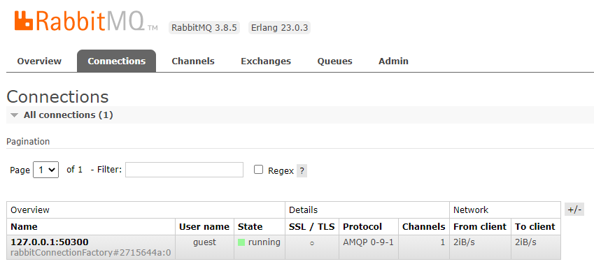
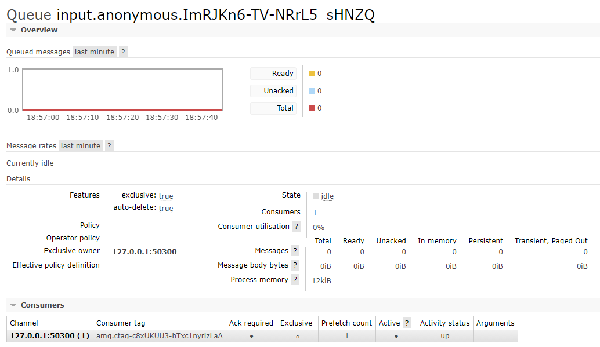
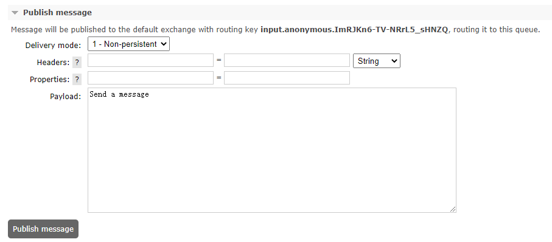
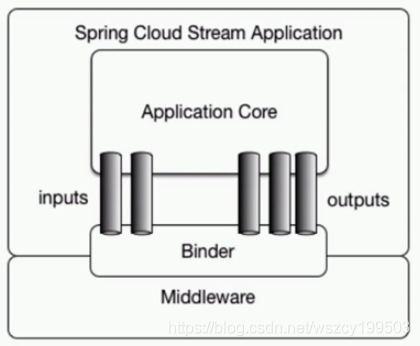
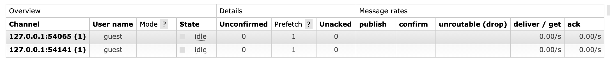

# 消息驱动的微服务 Spring Cloud Stream

Spring Cloud Stream 是一个用来为微服务应用构建消息驱动能力的框架。它可以基于 Spring Boot 来创建独立的、可用于生产的Spring应用程序。它通过使用 Spring Integration 来连接消息代理中间件以实现消息事件驱动。Spring Cloud Stream为一些供应商的消息中间件产品提供了个性化的自动化配置实现，并且引入了发布-订阅、消费组以及分区这三个核心概念。

简单地说，Spring Cloud Stream 本质上就是整合了Spring Boot和Spring Integration，实现了一套轻量级的消息驱动的微服务框架。通过使用Spring Cloud Stream，可以有效简化开发人员对消息中间件的使用复杂度，让系统开发人员可以有更多的精力关注于核心业务逻辑的处理。

由于Spring Cloud Stream基于Spring Boot实现，所以它秉承了Spring Boot的优点，自动化配置的功能可帮助我们快速上手使用。

## 1 快速入门

创建一个基础的Spring Boot工程，命名为stream-hello。

```xml
<dependency>
	<groupId>org.springframework.cloud</groupId>
    <artifactId>spring-cloud-starter-stream-rabbit</artifactId>
</dependency>
```

```java
// 创建用于接收来自RabbitMQ消息的消费者
@EnableBinding(Sink.class)
public class SinkReceiver {

    private Logger log = LoggerFactory.getLogger(SinkReceiver.class);

    @StreamListener(Sink.INPUT)
    public void receive(Object payload) {
        log.info("Received: " + payload);
    }

}
```

创建应用主类，并启动：

```markdown
o.s.a.r.c.CachingConnectionFactory       : Created new connection: rabbitConnectionFactory#2715644a:0/SimpleConnection@64524dd [delegate=amqp://guest@127.0.0.1:5672/, localPort= 50300]
o.s.c.stream.binder.BinderErrorChannel   : Channel 'application.input.anonymous.ImRJKn6-TV-NRrL5_sHNZQ.errors' has 1 subscriber(s).
o.s.i.a.i.AmqpInboundChannelAdapter      : started inbound.input.anonymous.ImRJKn6-TV-NRrL5_sHNZQ
```

使用 guest 用户创建了一个127.0.0.1:5672 RabbitMQ 连接。



声明了一个名为 input.anonymous.ImRJKn6-TV-NRrL5_sHNZQ 的队列，并通过 RabbitMessageChannelBinder 将自己绑定为消费者。



可以在 RabbitMQ 控制台发送一条消息。



```
INFO 13908 --- [emjYlBwftYKAw-1] com.spring.rabbit.SinkReceiver           : Received: [B@6e73a4d0
```

可以发现在应用控制台中输出的内容就是 sinkReceiver 中的 receive 方法定义的，而输出的具体内容则来自消息队列中获取的对象。这里由于我们没有对消息进行序列化，所以输出的只是该对象的引用。

## 2 原理解析

首先，我们对 Spring Boot 应用做的就是引入 spring-cloud-starter-stream-rabbit 依赖，该依赖包是Spring Cloud Stream 对 RabbitMQ 支持的封装，其中包含了对 RabbitMQ 的自动化配置等内容。从下面它定义的依赖关系中，我们还可以知道它等价于 spring-cloud-stream-binder-rabbit 依赖。

```xml
<dependency>
	<groupId>org.springframework.clouds/groupId>
	<artifactId>spring-cloud-stream-binder-rabbit</artifactId>
</dependency>
```

在sinkReceiver 中，@EnableBinding 注解用来指定一个或多个定义了 @Input 或 @Output 注解的接口，以此实现对消息通道（Channel）的绑定。在上面的例子中，我们通过 @EnableBinding(Sink.class) 绑定了 Sink 接口，该接口是 Spring Cloud Stream中默认实现的对输入消息通道绑定的定义，它的源码如下:

```java
public interface Sink {
    String INPUT = "input";

    @Input("input")
    SubscribableChannel input();
}
```

它通过 @Input 注解绑定了一个名为 input 的通道。除了 Sink 之外，Spring Cloud Stream还默认实现了绑定 output通道的 source 接口，还有结合了 Sink 和 Source 的 Processor 接口，实际使用时我们也可以自己通过 @Input 和 @Output 注解来定义绑定消息通道的接口。当需要为 @EnableBinding 指定多个接口来绑定消息通道的时候，可以这样定义:

```java
@EnableBinding(value = {Sink.class, source.class})
```

@StreamListener，它主要定义在方法上，作用是将被修饰的方法注册为消息中间件上数据流的事件监听器，注解中的属性值对应了监听的消息通道名。在上面的例子中，我们通过@StreamListener(sink.INPUT)注解将 receive 方法注册为 input 消息通道的监听处理器，所以当我们在 RabbitMQ 的控制页面中发布消息的时候，receive方法会做出对应的响应动作。

## 3 核心概念

下图是官方文档中 Spring Cloud Stream 应用模型的结构图。从中我们可以看到，Spring Cloud Stream 构建的应用程序与消息中间件之间是通过绑定器 Binder 相关联的，绑定器对于应用程序而言起到了隔离作用，它使得不同消息中间件的实现细节对应用程序来说是透明的。所以对于每一个 Spring Cloud Stream的应用程序来说，它不需要知晓消息中间件的通信细节，它只需知道 Binder 对应程序提供的抽象概念来使用消息中间件来实现业务逻辑即可，而这个抽象概念就是在快速入门中我们提到的消息通道:channel。如下图所示，在应用程序和 Binder之间定义了两条输入通道和三条输出通道来传递消息，而绑定器则是作为这些通道和消息中间件之间的桥梁进行通信。



### 3.1 绑定器

`Binder 绑定器`是Spring Cloud Stream中一个非常重要的概念。在没有绑定器这个概念的情况下，实现的消息交互逻辑就会非常笨重。

通过定义绑定器作为中间层，完美地实现了应用程序与消息中间件细节之间的隔离。通过向应用程序暴露统一的 Channel 通道，使得应用程序不需要再考虑各种不同的消息中间件的实现。当需要升级消息中间件，或是更换其他消息中间件产品时，我们要做的就是更换它们对应的 Binder 绑定器而不需要修改任何 Spring Boot 的应用逻辑。

示例中，并没有使用 application.properties 或是 application.yml来做任何属性设置。那是因为它也秉承了SpringBoot的设计理念，提供了对RabbitMQ默认的自动化配置。当然,我们也可以通过Spring Boot应用支持的任何方式来修改这些配置。比如，下面就是通过配置文件来对 RabbitMQ 的连接信息以及名为 input 的通道的主题进行配置的示例:

```properties
spring.cloud.stream.bindings.input.destination=raw-sensor-data
spring.rabbitmg.host=localhost
spring.rabbitmq.port=5672
spring.rabbitmq.username=springcloud
spring.rabbitmq.password=123456
```

### 3.2 发布-订阅模式

Spring Cloud Stream 中的消息通信方式遵循了发布-订阅模式，当一条消息被投递到消息中间件之后，它会通过共享的Topic主题进行广播，消息消费者在订阅的主题中收到它并触发自身的业务逻辑处理。这里所提到的Topic主题是Spring Cloud Stream中的一个抽象概念，用来代表发布共享消息给消费者的地方。在不同的消息中间件中，Topic可能对应不同的概念，比如，`在RabbitMQ中，它对应Exchange`，而在Kakfa中则对应Kafka中的Topic。

在快速入门的示例中，在 RabbitMQ 的 Exchange 中也创建了一个名为 input 的 Exchange 交换器，由于 Binder 的隔离作用，应用程序并无法感知它的存在，应用程序只知道自己指向 Binder 的输入或是输出通道。为了直观地感受在发布-订阅模式中，消息是如何被分发到多个订阅者的，我们可以使用快速入门的例子，通过命令行的方式启动两个不同端口的进程。此时，我们在RabbitMQ控制页面的Channels选项卡中看到如下图所示的两个消息通道，它们分别绑定了启动的两个应用程序。




名为input的交换器 Bindings 栏中的内容就是两个应用程序绑定通道中的消息队列，我们可以通过Exchange页面的 PublishMessage 来发布消息，此时可以发现两个启动的应用程序都输出了消息内容。


两个应用程序都建立了一条输入通道绑定到同一个Topic ( RabbitMQ的Exchange)上。当该Topic中有消息发布进来后，连接到该 Topic 上的所有订阅者可以收到该消息并根据自身的需求进行消费操作。


### 3.3 消费组

有时同一应用部署多个实例，但是消息只需要被消费一次。在 Spring Cloud Stream 提供了消费
组的概念。如果在同一个主题上的应用需要启动多个实例的时候，可以通过`spring.cloud.stream.bindings.input.group`属性为应用指定一个组名，这样这个应用的多个实例在接收到消息时，只会有一个实例真正收到消息并处理。

Group A和Group B都会收到消息的副本，但是在两个组中都只会有一个实例对其进行消费。


默认情况下，当没有为应用指定消费组的时候，Spring Cloud Stream 会为其分配一个独立的匿名消费组。所以，如果同一主题下的所有应用都没有被指定消费组的时候，当有消息发布之后，所有的应用都会对其进行消费，因为它们各自都属于一个独立的组。

### 3.4 消息分区

引入消费组，之后只能保证消息被同一组的一个实例消费，但不能知道具体被哪一个实例消费。对于一些业务场景，需要对一些具有相同特征的消息设置每次都被同一个消费实例处理，比如，一些用于监控服务，为了统计某段时间内消息生产者发送的报告内容，监控服务需要在自身聚合这些数据，那么消息生产者可以为消息增加一个固有的特征ID来进行分区，使得拥有这些ID的消息每次都能被发送到一个特定的实例上实现累计统计的效果，否则这些数据就会分散到各个不同的节点导致监控结果不一致的情况。

而分区概念的引入就是为了解决这样的问题:当生产者将消息数据发送给多个消费者实例时，保证拥有共同特征的消息数据始终是由同一个消费者实例接收和处理。

Spring Cloud Stream为分区提供了通用的抽象实现，用来在消息中间件的上层实现分区处理，所以它对于消息中间件自身是否实现了消息分区并不关心，这使得Spring Cloud Stream为不具备分区功能的消息中间件也增加了分区功能扩展。

在消费者应用 SinkReceiver 中，对配置文件做一些修改，具体如下:

```yml
spring:
  cloud:
    stream:
      bindings:
        input:
          consumer:
            partitioned: true
          destination: myMessage
          # 通过json格式传递数据
          content-type: application/json
          # 消息分组，把一个服务划到一个组里，无论你起了多少个实例，只会有一个实例消费
          group: stream-hello
      instance-count: 2
      instance-index: 0
```

从上面的配置中，我们可以看到增加了下面这三个参数。

`spring.cloud.stream.bindings.input.consumer.partitioned` 通过该参数开启消费者分区功能。

`spring.cloud.stream.instanceCount` 该参数指定了当前消费者的总实例数量。

`spring.cloud.stream.instanceIndex` 该参数设置当前实例的索引号，从0开始，最大值为spring.cloud.stream.instanceCount 参数减一。

在生产者应用SinkSender中，对配置文件也做一些修改，具体如下所示。

```yml
spring:
  cloud:
    stream:
      bindings:
        output:
          producer:
            partitionKeyExpression: payload
            partitionCount: 2
          destination: myMessage
          content-type: application/json
          group: stream-hello
```

从上面的配置中，我们可以看到增加了下面这两个参数。

`spring.cloud.stream.bindings.output.producer.partitionKey-Expression` 通过该参数指定了分区键的表达式规则，我们可以根据实际的输出消息规则配置SpEL来生成合适的分区键。

`spring.cloud.stream.bindings.output.producer.partitionCount` 该参数指定了消息分区的数量。

到这里消息分区配置就完成了，我们可以再次启动生产者应用，同时启动多个消费者。但需要注意的是，要为消费者指定不同的实例索引号，这样当同一个消息被发送给消费组时，可以发现只有一个消费实例在接收和处理这些相同的消息。

## 4 使用详解

### 4.1 开启绑定功能

在Spring Cloud Stream中,我们需要通过@EnableBinding注解来为应用启动消息驱动的功能：

```java
@Target({ElementType.TYPE, ElementType.ANNOTATION_TYPE})
@Retention(RetentionPolicy.RUNTIME)
@Documented
@Inherited
@Configuration
@Import({BindingServiceConfiguration.class, BindingBeansRegistrar.class, BinderFactoryConfiguration.class})
@EnableIntegration
public @interface EnableBinding {
    Class<?>[] value() default {};
}
```

它自身包含了@Configuration注解，所以用它注解的类也会成为Spring 的基本配置类。另外该注解还通过@Import加载了Spring Cloud Stream运行需要的几个基础配置类。

* `BindingServiceConfiguration` 该配置会加载消息通道绑定必要的一些实例， 比如，用于处理消息通道绑定的ChannelBindingService实例、消息类型转换器MessageConverterConfigurer、消息通道工厂BindableChannel-Factory等重要实例
* `BindingBeansRegistrar` 该类是ImportBeanDefinitionRegistrar接口的实现，主要是在Spring加载Bean的时候被调用，用来实现加载更多的Bean。由于BindingBeansRegistrar被@EnableBinding注解的@Import所引用，所以在其他配置加载完后，它的实现会被回调来创建其他的Bean，而这些Bean则从@EnableBinding注解的value属性定义的类中获取。就如我们入门实例中定义的@EnableBinding(Sink.class)，它在加载用于消息驱动的基础Bean之后，会继续加载Sink中定义的具体消息通道绑定。
* `BinderFactoryConfiguration` Binder厂的配置，主要用来加载与消息中间件相关的配置信息，比如，它会从应用工程的META-INE/spring.binders中加载针对具体消息中间件相关的配置文件等。

### 4.2 绑定消息通道

在Spring Cloud Steam中，我们可以在接口中通过@Input和@Output注解来定义消息通道，而用于定义绑定消息通道的接口则可以被@EnableBinding注解的value参数来指定，从而在应用启动的时候实现对定义消息通道的绑定。

Sink接口是Spring Cloud Steam提供的一个默认实现，除此之外还有Source和Processor，可从它们的源码中学习它们的定义方式:

```java
public interface Sink {

   String INPUT = "input";

   @Input(Sink.INPUT)
   SubscribableChannel input();

}
public interface Source {

	String OUTPUT = "output";

	@Output(Source.OUTPUT)
	MessageChannel output();

}
public interface Processor extends Source, Sink {

}
```

Sink 和Source中分别通过@ Input和@Output注解定义了输入通道和输出通道，而Processor通过继承Source和Sink的方式同时
定义了一个输入通道和一个输出通道。

另外，@Input 和 @Output 注解都还有一个value属性，该属性可以用来设置消息通道的名称，这里 Sink 和 Source 中指定的消息通道名称分别为input和output。如果我们直接使用这两个注解而没有指定具体的value值，将默认使用方法名作为消息通道的名称。

当我们定义输出通道的时候，需要返回MessageChannel接口对象，该接口定义了向消息通道发送消息的方法；而定义输入通道时，需要返回SubscribableChannel接口对象，该接口继承自MessageChannel接口，它定义了维护消息通道订阅者的方法。

### 4.3 注入绑定接口

在快速入门示例中已经为 Sink 接口绑定的 input 消息通道实现了具体的消息消费者，下面可以通过注入的方式实现一个消息生成者，向 input 消息通道发送数据：

```java
public interface SinkSender {
    // 消息生产实现
  	@Output(Source.OUTPUT)
    MessageChannel output();

    @Input("input2")
    SubscribableChannel input2();

    @Output("output2")
    MessageChannel output2();
}
```

在@EnableBinding注解中增加对SinkSender接口的指定，使Spring Cloud Stream能创建出对应的实例。

```java
@EnableBinding({Sink.class, SinkSender.class})
public class SinkReceiver {

    private Logger log = LoggerFactory.getLogger(SinkReceiver.class);

  	// 消息消费实现
    @StreamListener(Sink.INPUT)
  	// 很多时候在处理完输入消息之后，需要反馈一个消息给对方，这时候可以通过 @SendTo 注解来指定返回内容的输出通道
    // 消息反馈
    @SendTo("output2")
    public String receive(String message) {
        log.info("Received: {}", message);
        return "消息反馈";
    }

    @StreamListener("input2")
    public void process2(String message) {
        log.info("Received2: {}", message);
    }
}
```

同时需要将 input 通道和 output 通道绑定到同一个主题上：

```yml
spring:
  cloud:
    stream:
      bindings:
        input:
          destination: myMessage
          # @StreamListener注解能够通过配置属性实现JSON字符串到对象的转换，这是因为在Spring Cloud Steam中实现了一套可扩展的消息转换机制。在消息消费逻辑执行之前，消息转换机制会根据消息头信息中声明的消息类型(即上面对input 通道配置的content-type参数)，找到对应的消息转换器并实现对消息的自动转换。
          # 通过json格式传递数据
          content-type: application/json
          # 消息分组，把一个服务划到一个组里，无论你起了多少个实例，只会有一个实例消费
          group: stream-hello
        output:
          destination: myMessage
          content-type: application/json
          group: stream-hello
        input2:
          destination: myMessage2
          content-type: application/json
          group: stream-hello
        output2:
          destination: myMessage2
          content-type: application/json
          group: stream-hello
```

```java
@RunWith(SpringRunner.class)
@SpringBootTest(classes = StreamApplication.class)
@WebAppConfiguration
public class StreamApplicationTest {

    @Autowired
    private SinkSender sinkSender;

    @Test
    public void test() {
      // sinkSender.output2().send(MessageBuilder.withPayload("From SinkSender2").build());
        sinkSender.output().send(MessageBuilder.withPayload("From SinkSender").build());
    }

}
```

```
INFO 44332 --- [0eEnlhecM2f6Q-1] com.spring.rabbit.SinkReceiver           : Received: From SinkSender
```

### 4.4 消息类型

Spring Cloud Stream 为了让开发者能够在消息中声明它的内容类型，在输出消息中义了一个默认的头信息: contentType。对于那些不直接支持头信息的消息中间件, Spring Cloud Stream提供了自己的实现机制，它会在消息发出前自动将消息包装进它自定义的消息封装格式中，并加入头信息。

而对于那些自身就支持头信息的消息中间件，Spring Cloud Stream构建的服务可以接收并处理来自非SpringCloudStream构建但包含符合规范头信息的应用程序发出的消息。

Spring Cloud Stream 允许使用`spring.cloud.stream.bindngs.<channelName>.content-type`属性以声明式的配置方式为绑定的输入和输出通道设置消息内容的类型。

在Spring Cloud Stream中定义的content-type属性采用了Media Type，即Internet Media Type (互联网媒体类型)，也被称为MIME类型，常见的有application/json、text/plain;charset=UTF-8。

Spring Cloud Stream 除了提供上面这些开箱即用的转换器之外，还支持开发者自定义的消息转换器。这使得我们可以使用任意格式(包括二进制)的数据进行发送和接收，并且将这些数据与特定的contentType相关联。在应用启用的时候，Spring Cloud Stream 会将所有org.springframework.messaging.converter.MessageConverter 接口实现的自定义转换器以及默认实现的那些转换器都加载到消息转换工厂中，以提供给消息处理时使用。

## 5 绑定器详解

Binder绑定器是定义在应用程序与消息中间件之间的抽象层，用来屏蔽消息中间件对应用的复杂性，并提供简单而统一的操作接口给应用程序使用。

### 5.1 绑定器SPI

绑定器 SPI 涵盖了一套可插拔的用于连接外部中间件的实现机制，其中包含了许多接口、开箱即用的实现类以及发现策略等内容。其中，最为关键的就是Binder接口，它是用来将输入和输出连接到外部中间件的抽象:

```java
public interface Binder<T, C extends ConsumerProperties, P extends ProducerProperties> {
   // 从消息通道接收数据的消费者调用bindConsumer方法来绑定输入通道时
   // name 接收消息中间件的目标名称
   // group 消费组的名称(如果多个消费者实例使用相同的组名，则消息将对这些消费者实例实现负载均衡，每个生产者发出的消息只会被组内一个消费者实例接收和处理)
   // inboundBindTarget 接收消息的本地通道实例
   // consumerProperties 创建通道时使用的属性配置。
   Binding<T> bindConsumer(String name, String group, T inboundBindTarget, C consumerProperties);
	 // 向消息通道发送数据的生产者调用bindProducer方法来绑定输出通道时
   // name 发往消息中间件的目标名称
   // outboundBindTarget 发送消息的本地通道实例
   // producerProperties 创建通道时使用的属性配置( 比如分区键的表达式等) 
   Binding<T> bindProducer(String name, T outboundBindTarget, P producerProperties);
}
```

一个典型的Binder绑定器实现一般包含以下内容。

* 一个实现Binder接口的类。

* 一个Spring配置加载类，用来创建连接消息中间件的基础结构使用的实例。

* 一个或多个能够在classpath下的META-INF/spring.binders路径找到的绑定器定义文件。比如我们可以在 spring-cloud-starter-stream-rabbit 中找到该文件，该文件中存储了当前绑定器要使用的自动化配置类的路径:

```
rabbit:\
org.springframework.cloud.stream.binder.rabbit.config.RabbitServiceAutoConfiguration
```

### 5.2 自动化配置

Spring Cloud Stream 通过绑定器SPI的实现将应用程序逻辑.上的输入输出通道连接到物理上的消息中间件。消息中间件之间通常都会有或多或少的差异性，所以为了适配不同的消息中间件，需要为它们实现各自独有的绑定器。

默认情况下，Spring Cloud Stream 也遵循Spring Boot 自动化配置的特性。如果在 classpath 中能够找到单个绑定器的实现，那么Spring Cloud Stream会自动加载它。

### 5.3 多绑定器配置

```properties
# 为了适应一些特殊要求(比如性能等原因)。我们可以先通过设置默认绑定器来为大部分的通道设置绑定器
spring.cloud.stream.defaultBinder=rabbit
# 在设置了默认绑定器之后，再为其他一些少数的消息通道单独设置绑定器
spring.cloud.stream.bindings. input.binder=kafka
```

需要注意的是，上面我们设置参数时用来指定具体绑定器的值并不是消息中间件的名称，而是在每个绑定器实现的META-INE/spring.binders文件中定义的标识(一个绑 定器实现的标识可以定义多个，以逗号分隔)。

另外，当需要在一个应用程序中使用同一类型不同环境的绑定器时，我们也可以通过配置轻松实现通道绑定。比如，当需要连接两个不同的RabbitMQ 实例的时候，可以参照如下配置:

```properties
spring.cloud.stream.bindings.input.binder=rabbit1
spring.cloud.stream.bindings.output.binder=rabbit2
spring.cloud.stream.binders.rabbit1.type=rabbit
spring.cloud.stream.binders.rabbit1.environment.spring.rabbitmq.host=192.168.0.101
...
spring.cloud.stream.binders.rabbit2.type=rabbit
spring.cloud.stream.binders.rabbit2.environment.spring.rabbitmq.host=192.168.0.102
...
```

### 5.4 RabbitMQ与Kafka绑定器

**RabbitMQ绑定器**

在RabbitMQ中，通过Exchange交换器来实现Spring Cloud Stream的主题概念，所以消息通道的输入输出目标映射了一个具体的Exchange交换器。而对于每个消费组，则会为对应的Exchange交换器绑定一个Queue队列进行消息收发。

**Kafka绑定器**

由于Kafka自身就有Topic概念，所以Spring Cloud Stream的主题直接采用了Kafka 的Topic主题概念，每个消费组的通道目标都会直接连接Kafka的主题进行消息收发。

------

