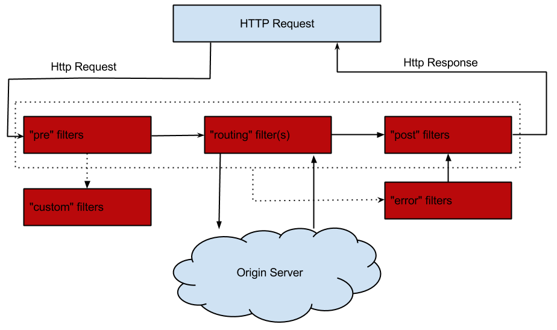
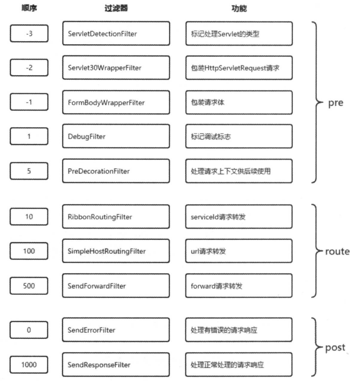
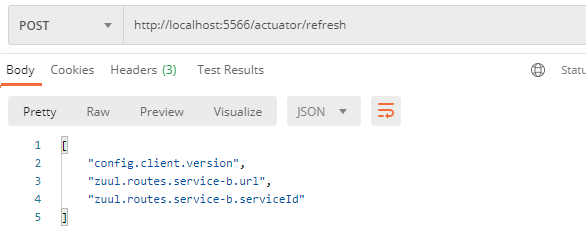
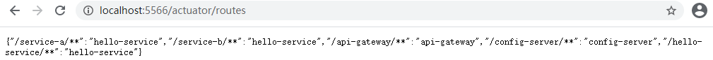
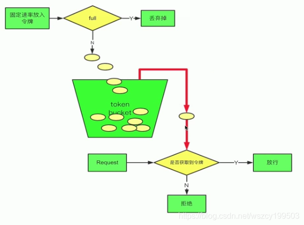

# API 网关服务 Spring Cloud Zuul

我们服务集群包含内部服务 Service A 和 Service B，它们都会向 EurekaServer 集群进行注册与订阅服务，而Open Service 是一个对外的 RESTful API 服务，它通过 F5、Nginx 等网络设备或工具软件实现对各个微服务的路由与负载均衡，并公开给外部的客户端调用。

我们将把视线聚焦在对外服务这块内容，通常也称为`边缘服务`。

`API网关` 是一个更为智能的应用服务器，它的定义类似于面向对象设计模式中的 Facade 模式，它的存在就像是整个微服务架构系统的门面一样，所有的外部客户端访问都需要经过它来进行调度和过滤。它除了要实现请求路由、负载均衡、校验过滤等功能之外，还需要更多能力，比如与服务治理框架的结合、请求转发时的熔断机制、服务的聚合等一系列高级功能。

在Spring Cloud 中了提供了基于 Netflix Zuul 实现的API网关组件 Spring Cloud Zuul。那么，它是如何解决上面这两个普遍问题的呢?

首先，对于路由规则与服务实例的维护问题。Spring Cloud Zuul 通过与 Spring Cloud Eureka 进行整合，将自身注册为 Eureka服务治理下的应用，同时`从 Eureka 中获得了所有其他微服务的实例信息`。而对于路由规则的维护，Zuul 默认会将通过`以服务名作为 ContextPath 的方式来创建路由映射`。

其次，对于类似签名校验、登录校验在微服务架构中的冗余问题。理论上来说，这些校验逻辑在本质上与微服务应用自身的业务并没有多大的关系，所以它们完全可以独立成一个单独的服务存在，只是它们被剥离和独立出来之后，并不是给各个微服务调用，而是在API网关服务上进行统一调用来对微服务接口做前置过滤，以实现对微服务接口的拦截和校验。Spring Cloud Zuul提供了一套过滤器机制，它可以很好地支持这样的任务。开发者可以通过使用Zuul来创建各种校验过滤器，然后指定哪些规则的请求需要执行校验逻辑，只有通过校验的才会被路由到具体的微服务接口,不然就返回错误提示。

## 1 快速入门

创建 Spring Boot 工程，命名为 api-gateway。

```xml
<dependency>
    <groupId>org.springframework.cloud</groupId>
    <artifactId>spring-cloud-starter-netflix-zuul</artifactId>
</dependency>
```

对于 spring-cloud-starter-zuul 依赖，可以通过查看它的依赖内容了解到：

该模块中不仅包含了 Netflix Zuul 的核心依赖 zuul-core，它还包含了下面这些网关服务需要的重要依赖。

* spring-cloud-starter-hystrix: 该依赖用来在网关服务中实现对微服务转发时候的保护机制，通过线程隔离和断路器，防止微服务的故障引发API网关资源无法释放，从而影响其他应用的对外服务。
* spring-cloud-starter-ribbon: 该依赖用来实现在网关服务进行路由转发时候的客户端负载均衡以及请求重试。
* spring-boot-starter-actuator: 该依赖用来提供常规的微服务管理端点。另外，在 Spring Cloud Zuul 中还特别提供了 /routes 端点来返回当前的所有路由规则。

创建应用主类，使用 `@EnablezuulProxy` 注解开启Zuul的API网关服务功能。

```java
server:
  port: 5555
spring:
  application:
    name: api-gateway
zuul:
  routes:
    api-a-url:
      path: /api-a-url/**
      url: http://localhost:8080/
```

### 1.1 传统路由方式

该配置定义了发往API网关服务的请求中，所有符合 /api-a-url/** 规则的访问都将被路由转发到 http://localhost:8080/ 地址上，也就是说，当我们访问 http://localhost:5555/api-a-url/hello 的时候，API网关服务会将该请求路由到 http://localhost:8080/hello 提供的微服务接口上。

其中，配置属性 zuul.routes.api-a-url.path 中的 api-a-url 部分为路由的名字，可以任意定义，但是一组 path 和 url 映射关系的路由名要相同，下面将要介绍的面向服务的映射方式也是如此。

### 1.2 面向服务的路由

让路由的 path 不是映射具体的 url，而是让它映射到某个具体的服务，而具体的 url 则交给Eureka 的服务发现机制去自动维护，我们称这类路由为面向服务的路由。

为了与 Eureka整合，我们需要在 api-gateway 的 pom.xml 中引入 spring-cloud-starter-eureka依赖:

```xml
<dependency>
    <groupId>org.springframework.cloud</groupId>
    <artifactId>spring-cloud-starter-netflix-eureka-client</artifactId>
</dependency>
```

```yml
zuul:
  routes:
    api-a:
      path: /api-a/**
      serviceId: hello-service
    api-b:
      path: /api-b/**
      serviceId: feign-consumer
eureka:
  client:
    service-url:
      defaultZone: http://localhost:8761/eureka/
```

通过上面的搭建工作，我们已经可以通过服务网关来访问 hello-service 和 feign-consumer 这两个服务了。根据配置的映射关系，分别向网关发起下面这些请求。

http://localhost:5555/api-a/hello 该url符合 /api-a/** 规则，由 api-a 路由负责转发，该路由映射的 serviceId 为 hello-service，所以最终 /hello 请求会被发送到 hello-service 服务的某个实例上去。

通过面向服务的路由配置方式，我们不需要再为各个路由维护微服务应用的具体实例的位置，而是通过简单的path 与 serviceld 的映射组合，使得维护工作变得非常简单。这完全归功于Spring Cloud Eureka 的服务发现机制，它使得API网关服务可以自动化完成服务实例清单的维护，完美地解决了对路由映射实例的维护问题。

### 1.3 请求过滤

为了在API网关中实现对客户端请求的校验，我们将继续介绍Spring Cloud Zuul的另外一个核心功能：`请求过滤`。

Zuul允许开发者在API网关上通过定义过滤器来实现对请求的拦截与过滤，实现的方法非常简单，我们只需要继承`ZuulFilter` 抽象类并实现它定义的4个抽象函数就可以完成对请求的拦截和过滤了。

```java
// 在请求被路由之前检查HttpservletRequest中是否有accessToken参数，若有就进行路由，若没有就拒绝访问，返回401 Unauthorized错误
@Component
public class AccessFilter extends ZuulFilter {

    private static Logger log = LoggerFactory.getLogger(AccessFilter.class);

    // 过滤器的类型，它决定过滤器在请求的哪个生命周期中执行。这里定义为pre，代表会在请求被路由之前执行。
    @Override
    public String filterType() {
        //pre:可以在请求被路由之前调用。
        //routing:在路由请求时被调用。
		//post: 在routing和error过滤器之后被调用。
        //error:处理请求时发生错误时被调用。
        return PRE_TYPE;
    }

    // 过滤器的执行顺序。当请求在一个阶段中存在多个过滤器时，需要根据该方法返回的值来依次执行。
    @Override
    public int filterOrder() {
        return 0;
    }

    // 判断该过滤器是否需要被执行。这里我们直接返回了true，因此该过滤器对所有请求都会生效。实际运用中我们可以利用该函数来指定过滤器的有效范围。
    @Override
    public boolean shouldFilter() {
        return true;
    }

    // 过滤器的具体逻辑
    @Override
    public Object run() throws ZuulException {
        RequestContext ctx = RequestContext.getCurrentContext();
        HttpServletRequest request = ctx.getRequest();

        log.info("send {} request to {}", request.getMethod(), request.getRequestURL().toString());

        Object accessToken = request.getParameter("accessToken");
        if (accessToken == null) {
            log.warn("access token is empty");
            // 通过ctx.setSendzuulResponse (false)令zuul过滤该请求，不对其进行路由
            ctx.setSendZuulResponse(false);
            // 通过ctx.setResponsestatus-code (401)设置了其返回的错误码
            ctx.setResponseStatusCode(401);
            return null;
        }
        log.info("access token is ok");
        return null;
    }
}
```


http://localhost:5555/api-a/hello?accessToken=xiaoxiao 可以成功访问。

API网关知识总结:

* 它作为系统的统一入口，屏蔽了系统内部各个微服务的细节。

* 它可以与服务治理框架结合，实现自动化的服务实例维护以及负载均衡的路由转发。
* 它可以实现接口权限校验与微服务业务逻辑的解耦。

* 通过服务网关中的过滤器，在各生命周期中去校验请求的内容，将原本在对外服务层做的校验前移，保证了微服务的无状态性，同时降低了微服务的测试难度，让服务本身更集中关注业务逻辑的处理。

## 2 路由详解

Zuul 巧妙地整合了 Eureka 来实现面向服务的路由。实际上，我们可以直接将 API 网关也看作 Eureka 服务治理下的一个普通微服务应用。它除了会将自己注册到 Eureka 服务注册中心上之外，也会从注册中心获取所有服务以及它们的实例清单。所以在 Eureka的帮助下，API网关服务本身就已经维护了系统中所有 serviceId 与实例地址的映射关系。当有外部请求到达API网关的时候，根据请求的 URL 路径找到最佳匹配的 path 规则，API网关就可以知道要将该请求路由到哪个具体的 serviceId 上去。由于在API网关中已经知道 serviceId 对应服务实例的地址清单，那么只需要通过 Ribbon 的负载均衡策略，直接在这些清单中选择一个具体的实例进行转发就能完成路由工作了。

### 2.1 服务路由的默认规则

在实际的运用过程中会发现，大部分的路由配置规则几乎都会采用服务名作为外部请求的前缀。

```yml
zuul:
  routes:
    hello-service:
      path: /hello-service/**
      serviceId: hello-service
```

Zuul 默认实现了这样的贴心功能，当我们为 Spring Cloud Zuul 构建的API网关服务引入 SpringCloud Eureka 之后，它为Eureka中的每个服务都自动创建一个默认路由规则，这些默认规则的 path 会使用 serviceId 配置的服务名作为请求前缀，就如上面的例子那样。

由于默认情况下所有Eureka 上的服务都会被Zuul自动地创建映射关系来进行路由，这会使得一些我们不希望对外开放的服务也可能被外部访问到。这个时候，我们可以使用 `zuul.ignored-services` 参数来设置一个服务名匹配表达式来定义不自动创建路由的规则。Zuul在自动创建服务路由的时候会根据该表达式来进行判断，如果服务名匹配表达式，那么Zuul 将跳过该服务，不为其创建路由规则。比如，设置为 `zuul.ignored-services=*` 的时候，Zuul将对所有的服务都不自动创建路由规则。

### 2.2 路径匹配

在 Zuul 中，路由匹配的路径表达式采用了 Ant 风格定义。

| 通配符 | 说明                         | URL 路径                          |
| ------ | ---------------------------- | --------------------------------- |
| ？     | 匹配任意单个字符             | /user-service/a、/user-service/b  |
| *      | 匹配任意数量的字符           | /user-service/a、/user-service/aa |
| **     | 匹配任意数量的字符，支持多级 | /user-service/aa/b                |

```properties
# 无法保证优先选择/user-service/ext/**路由，再去匹配/user-service/**
zuul.routes.user-service.path=/user-service/**
zuul.routes.user-service.serviceId=user-service
zuul.routes.user-service-ext.path=/user-service/ext/**
zuul.routes.user-service-ext.serviceId=user-service-ext
```

由于 properties 的配置内容无法保证有序，所以当出现这种情况的时候，为了保证路由的优先顺序，我们需要使用YAML文件来配置，以实现有序的路由规则。

```yml
zuul:
  routes:
    user-service-ext:
      path: /user-service/ext/**
      serviceId: user-service-ext
    user-service:
      path: /user-service/**
      serviceId: user-service
```

**忽略表达式**

通过 path 参数定义的 Ant 表达式已经能够完成 API 网关上的路由规则配置功能，但是为了更细粒度和更为灵活地配置路由规则，Zuul还提供了一个忽略表达式参数 `zuul.ignored-patterns`。该参数可以用来设置不希望被API网关进行路由的URL表达式。

比如，以快速入门中的示例为基础，如果不希望/hello接口被路由，那么我们可以这样设置:

```properties
zuul.ignored-patterns=/**/hello/**
zuul .routes.api-a.path=/api-a/**
zuul.routes.api-a.serviceId=hello-service
```

然后，可以尝试通过网关来访问 hello-service 的 /hello 接口 http://localhost:5555/api-a/hello。虽然该访问路径完全符合 path参数定义的/api-a/**规则，但是由于该路径符合 `zuul.ignored-patterns` 参数定义的规则，所以不会被正确路由。

**路由前缀**

为了方便全局地为路由规则增加前缀信息，Zuul提供了 zuul.prefix 参数来进行设置。比如，希望为网关上的路由规则都增加 /api 前缀，那么我们可以在配置文件中增加配置: 

```properties
zuul.prefix=/api
```

另外，对于代理前缀会默认从路径中移除，我们可以通过设置 zuul.stripPrefix=false 来关闭该移除代理前缀的动作，也可以通过 `zuul.routes.<route>.strip-prefix=true` 来对指定路由关闭移除代理前缀的动作。

**本地跳转**

在 Zuul 实现的 API 网关路由功能中，还支持 forward 形式的服务端跳转配置。实现方式非常简单,只需通过使用path与 url 的配置方式就能完成，通过url中使用 forward 来指定需要跳转的服务器资源路径。

```properties
zuul.routes.api-b.path=/api-b/**
# /api-b/hello 会被 API 网关转发到网关的 local/hello
zuul.routes.api-b.url=forward:/local
```

### 2.3 Cookie 与头信息

默认情况下，Spring Cloud Zuul 在请求路由时，会过滤掉 HTTP 请求头信息中的一些敏感信息（导致 Spring Security、Shiro等安全框架构建无法实现登录和鉴权），防止它们被传递到下游的外部服务器。默认的敏感头信息通过 zuul.sensitiveHeaders 参数定义，包括 Cookie、Set-Cookie、Authorization 三个属性。

通过指定路由的参数来配置 sensitiveHeaders ，方法有下面两种。

```properties
#方法一:对指定路由开启自定义敏感头
zuul.routes.<router>.customSensitiveHeaders=true
#方法二:将指定路由的敏感头设置为空
zuul.routes.<router>.sensitiveHeaders=
```

仅对指定的Web应用开启对敏感信息的传递，影响范围小，不至于引起其他服务的信息泄露问题。

**重定向问题**

由于Spring Security或 Shiro在登录完成之后，通过重定向的方式跳转到登录后的页面，此时登录后的请求结果状态码为302，请求响应头信息中的 Location 指向了具体的服务实例地址，而请求头信息中的Host也指向了具体的服务实例P地址和端口。所以，该问题的根本原因在于 Spring Cloud Zuul 在路由请求时，并没有将最初的Host信息设置正确。那么如何解决这个问题呢?

```properties
zuul.addHostHeader=true
```

3 过滤器详解

3.1 过滤器

`路由映射`和`请求转发`都是由几个不同的过滤器完成的。其中，路由映射主要通过 pre 类型的过滤器完成，它将请求路径与配置的路由规则进行匹配，以找到需要转发的目标地址；而请求转发的部分则是由 route 类型的过滤器来完成，对 pre 类型过滤器获得的路由地址进行转发。所以，过滤器可以说是 Zuul 实现 API 网关功能最为核心的部件，每一个进入 Zuul 的 HTTP 请求都会经过一系列的过滤器处理链得到请求响应并返回给客户端。

在 Spring Cloud Zuul 中实现的过滤器必须包含4个基本特征：过滤类型、执行顺序、执行条件、具体操作。这些元素看起来非常熟悉，实际上它就是 ZuulFilter 接口中定义的4个抽象方法。

3.2 请求生命周期

Zuul 默认定义了4种不同的过滤器类型，它们覆盖了一个外部HTTP请求到达API网关，直到返回请求结果的全部生命周期。



首先它会进入第一个阶段pre，在这里它会被pre 类型的过滤器进行处理，该类型过滤器的主要目的是在进行请求路由之前做一些前置加工，比如请求的校验等。

在完成了pre类型的过滤器处理之后，请求进入第二个阶段routing，也就是之前说的路由请求转发阶段，请求将会被routing类型过滤器处理。这里的具体处理内容就是`将外部请求转发到具体服务实例上去的过程`，当服务实例将请求结果都返回之后，routing 阶段完成，请求进入第三个阶段post。

此时请求将会被post类型的过滤器处理，这些过滤器在处理的时候不仅可以获取到请求信息，还能获取到服务实例的返回信息，所以在 post类型的过滤器中，我们可以对处理结果进行一些加工或转换等内容。

另外，还有一个特殊的阶段error，该阶段只有在上述三个阶段中发生异常的时候才会触发，但是它的最后流向还是post类型的过滤器，因为它需要通过post过滤器将最终结果返回给请求客户端。

3.3 核心过滤器



3.4 异常处理

Zuul 中提供了对异常处理的过滤器 SendErrorFilter，默认会跳转到 /error 页面:

```java
public class SendErrorFilter extends ZuulFilter {

	private static final Log log = LogFactory.getLog(SendErrorFilter.class);
	protected static final String SEND_ERROR_FILTER_RAN = "sendErrorFilter.ran";

	@Value("${error.path:/error}")
	private String errorPath;

	@Override
	public String filterType() {
		return ERROR_TYPE;
	}

	@Override
	public int filterOrder() {
		return SEND_ERROR_FILTER_ORDER;
	}

	@Override
	public boolean shouldFilter() {
		RequestContext ctx = RequestContext.getCurrentContext();
		// only forward to errorPath if it hasn't been forwarded to already
		return ctx.getThrowable() != null
				&& !ctx.getBoolean(SEND_ERROR_FILTER_RAN, false);
	}

	@Override
	public Object run() {
		try {
			RequestContext ctx = RequestContext.getCurrentContext();
			ExceptionHolder exception = findZuulException(ctx.getThrowable());
			HttpServletRequest request = ctx.getRequest();

			request.setAttribute("javax.servlet.error.status_code", exception.getStatusCode());

			log.warn("Error during filtering", exception.getThrowable());
			request.setAttribute("javax.servlet.error.exception", exception.getThrowable());

			if (StringUtils.hasText(exception.getErrorCause())) {
				request.setAttribute("javax.servlet.error.message", exception.getErrorCause());
			}

			RequestDispatcher dispatcher = request.getRequestDispatcher(
					this.errorPath);
			if (dispatcher != null) {
				ctx.set(SEND_ERROR_FILTER_RAN, true);
				if (!ctx.getResponse().isCommitted()) {
					ctx.setResponseStatusCode(exception.getStatusCode());
					dispatcher.forward(request, ctx.getResponse());
				}
			}
		}
		catch (Exception ex) {
			ReflectionUtils.rethrowRuntimeException(ex);
		}
		return null;
	}
    ...
}
```

此处的错误页面与 Spring Boot中的 server.error.path 配置冲突，所以需要将 springboot 的配置设置任意值或者置为空。同时需要在网关服务中定义 /error 路径相应。

**自定义异常过滤器**

```java
@Component
public class ThrowExceptionFilter extends ZuulFilter {

    private static Logger log = LoggerFactory.getLogger(ThrowExceptionFilter.class);

    @Override
    public String filterType() {
        return ERROR_TYPE;
    }

    @Override
    public int filterOrder() {
        //需要在默认的 SendErrorFilter 之前
        return -1;
    }

    @Override
    public boolean shouldFilter() {
        // 只有在抛出异常时才会进行拦截
        return RequestContext.getCurrentContext().containsKey("throwable");
    }

    @Override
    public Object run() {
        log.info("This is a pre filter, it will throw a RuntimeException");
        RequestContext ctx = RequestContext.getCurrentContext();
        Throwable throwable = ctx.getThrowable();

        // 删除该异常信息,不然在下一个过滤器中还会被执行处理
        ctx.remove("throwable");

        //响应信息
        HttpServletResponse response = ctx.getResponse();
        response.setHeader("Content-type", "application/json;charset=UTF-8");
        // 可对 response 做处理，返回值中添加Header
        response.setHeader("Error", "Internal Server Error");
        response.setCharacterEncoding("UTF-8");

        // 响应给客户端信息
        PrintWriter pw = null;
        JSONObject ret = new JSONObject();
        ret.put("timestamp", System.currentTimeMillis());
        ret.put("status", HttpServletResponse.SC_INTERNAL_SERVER_ERROR);
        ret.put("exception", throwable.getClass());
        ret.put("message", throwable.getMessage());
        try {
            pw = response.getWriter();
            pw.write(ret.toJSONString());
            pw.close();
        } catch (IOException e) {
            e.printStackTrace();
        }

        return null;
    }
}
```

**禁用过滤器**

如何禁用它们呢?大多情况下初识Zuul的使用者第一反应就是通过重写shouldFilter逻辑，让它返回false，这样该过滤器对于任何请求都不会被执行，基本实现了对过滤器的禁用。但是，对于自定义过滤器来说似乎是实现了过滤器不生效的功能，但是这样的做法缺乏灵活性。

在Zuul中特别提供了一个参数来禁用指定的过滤器，该参数的配置格式如下:

```properties
zuul.<SimpleclassName>.<filterType>.disable=true
zuul.AccessFilter.pre.disable=true
```

其中，SimpleclassName 代表过滤器的类名，比如快速入门示例中的AccessFilter；filterType 代表过滤器类型，比如快速入门示例中 AccessFilter 的过滤器类型pre。

该参数配置除了可以对自定义的过滤器进行禁用配置之外，很多时候可以用它来禁用Spring Cloud Zuul中默认定义的核心过滤器。这样我们就可以抛开Spring Cloud Zuul自带的那套核心过滤器，实现一套更符合我们实际需求的处理机制。

### 2.4 动态加载

在微服务架构中，由于API网关服务担负着外部访问统一入口的重任，它同其他应用不同，任何关闭应用和重启应用的操作都会使系统对外服务停止，对于很多7 x 24小时服务的系统来说，这样的情况是绝对不被允许的。所以，作为最外部的网关，它必须具备动态更新内部逻辑的能力，比如动态修改路由规则、动态添加/删除过滤器等。

通过 Zuul 实现的API网关服务当然也具备了动态路由和动态过滤器的能力。

**动态路由**

如何实现Zuul的动态路由，我们很自然地会将它与Spring Cloud Config的动态刷新机制联系到一起。只需将API网关服务的配置文件通过Spring Cloud Config 连接的Git仓库存储和管理，我们就能轻松实现动态刷新路由规则的功能。

创建一个基础的 Spring Boot 工程，命名为 api-gateway-dynamic-route。

在pom.xml中引入对zuul、eureka和 config 的依赖，具体内容如下:

```xml
<dependency>
    <groupId>org.springframework.cloud</groupId>
    <artifactId>spring-cloud-starter-netflix-zuul</artifactId>
</dependency>
<dependency>
    <groupId>org.springframework.cloud</groupId>
    <artifactId>spring-cloud-starter-netflix-eureka-client</artifactId>
</dependency>
<dependency>
    <groupId>org.springframework.cloud</groupId>
    <artifactId>spring-cloud-starter-config</artifactId>
</dependency>
<dependency>
    <groupId>org.springframework.boot</groupId>
    <artifactId>spring-boot-starter-actuator</artifactId>
</dependency>
```

```yml
# *************** bootstrap.yml ***************
spring:
  application:
    name: api-gateway
  cloud:
    config:
      uri: http://localhost:7001/
server:
  port: 5566
eureka:
  client:
    service-url:
      defaultZone: http://192.168.25.128:8761/eureka/
management:
  endpoints:
    web:
      exposure:
      	# 端点全部开放，可以只开放refresh和route
        include: '*'
```

```java
@EnableZuulProxy
@SpringCloudApplication
public class DynamicRouteApplication {

    public static void main(String[] args) {
        SpringApplication.run(DynamicRouteApplication.class, args);
    }

    @Primary
    @Bean
    // 需要使用@Refreshscope注解来将Zuul的配置内容动态化
    @RefreshScope
    @ConfigurationProperties("zuul")
    public ZuulProperties zuulProperties() {
        return new ZuulProperties();
    }
}
```

Git 仓库创建 config-repo/api-gateway.properties：

```properties
zuul.routes.service-a.path=/service-a/**
zuul.routes.service-a.serviceId=hello-service
zuul.routes.service-b.path=/service-b/**
zuul.routes.service-b.url=http://localhost:8001
```

启动 config-server、eureka-server、api-gateway-dynamic-route、hello-service。

可通过对 API 网关服务调用 http://localhost:5566/actuator/routes 接口来获取当前网关上的路由规则。

```json
{
  "/service-a/**": "hello-service",
  "/service-b/**": "http://localhost:8001",
  "/api-gateway/**": "api-gateway",
  "/config-server/**": "config-server",
  "/hello-service/**": "hello-service"
}
```

修改 Git 仓库 config-repo/api-gateway.properties：

```properties
zuul.routes.service-b.serviceId=hello-service
```





**动态过滤器**

对于实现请求过滤器的动态加载，我们需要借助基于JVM实现的动态语言的帮助，比如Groovy。

创建一个基础的Spring Boot工程，命名为 api-gateway-dynamic-filter。

在pom.xml中引入对zuul、eureka和 groovy的依赖，具体内容如下:

```xml
<dependency>
    <groupId>org.springframework.cloud</groupId>
    <artifactId>spring-cloud-starter-netflix-zuul</artifactId>
</dependency>
<dependency>
    <groupId>org.springframework.cloud</groupId>
    <artifactId>spring-cloud-starter-netflix-eureka-client</artifactId>
</dependency>
<dependency>
    <groupId>org.codehaus.groovy</groupId>
    <artifactId>groovy-all</artifactId>
</dependency>
```

```yml
spring:
  application:
    name: api-gateway
server:
  port: 5555
eureka:
  client:
    service-url:
      defaultZone: http://192.168.25.128:8761/eureka/
zuul:
  routes:
    hello:
      path: /hello-service/**
      serviceId: hello-service
  filter:
    # zuul.filter.root用来指定动态加载的过滤器存储路径
    # zuul.filter.interval用来配置动态加载的间隔时间，以秒为单位
    root: api-gateway-dynamic-filter\src\main\java\com\spring\filter
    interval: 5
```

```java
// 创建用来加载自定义属性的配置类，命名为 FilterConfiguration
@ConfigurationProperties("zuul.filter")
public class FilterConfiguration {

    private String root;
    private Integer interval;

    public String getRoot() {
        return root;
    }

    public void setRoot(String root) {
        this.root = root;
    }

    public Integer getInterval() {
        return interval;
    }

    public void setInterval(Integer interval) {
        this.interval = interval;
    }
}
//创建应用启动主类，并在该类中引入上面定义的FilterConfiguration配置
@EnableZuulProxy
@EnableConfigurationProperties({FilterConfiguration.class})
@SpringCloudApplication
public class DynamicFilterApplication {
    public static void main(String[] args) {
        SpringApplication.run(DynamicFilterApplication.class, args);
    }

    // 创建动态加载过滤器的实例
    @Bean
    public FilterLoader filterLoader(FilterConfiguration filterConfiguration) {
        FilterLoader filterLoader = FilterLoader.getInstance();
        filterLoader.setCompiler(new GroovyCompiler());
        try {
            FilterFileManager.setFilenameFilter(new GroovyFileFilter());
            FilterFileManager.init(
                    filterConfiguration.getInterval(),
                    filterConfiguration.getRoot() + "/pre",
                    filterConfiguration.getRoot() + "/post"
            );
        } catch (Exception e) {
            throw new RuntimeException(e);
        }
        return filterLoader;
    }
}
```

至此，我们就已经完成了为基础的API网关服务增加动态加载过滤器的能力。根据上面的定义，API网关应用会每隔5秒，从 API 网关服务所在位置的 filter/pre和filter/post目录下获取Groovy定义的过滤器，并对其进行编译和动态加载使用。对于动态加载的时间间隔，可通过 zuul.filter.interval 参数来修改。而加载过滤器实现类的根目录可通过 zuul.filter.root 调整根目录的位置来修改。

访问 http://localhost:5555/hello-service/hello，可以正确输出 Hello World。

在filter/pre目录下创建一个 pre 类型的过滤器，命名为PreFilter.groovy。

```groovy
class PreFilter extends ZuulFilter {

    Logger log = LoggerFactory.getLogger(PreFilter.class)

    @Override
    String filterType() {
        return "pre"
    }

    @Override
    int filterOrder() {
        return 1000
    }

    @Override
    boolean shouldFilter() {
        return true
    }

    @Override
    Object run() {
        HttpServletRequest request = RequestContext.getCurrentContext().getRequest()
        log.info("this is a pre filter: Send {} request to {}", request.getMethod(), request.getRequestURL().toString())
        return null
    }
}
```

在加入了该过滤器之后，不需要重启API网关服务，只需要稍等几秒就会生效。继续向 API 网关服务发起请求，此时在控制台中可以看到 PreFilter.groovy 过滤器中定义的日志信息，具体如下:

```
com.spring.filter.pre.PreFilter          : this is a pre filter: Send GET request to http://localhost:5555/hello-service/hello
```

在filter/post目录下创建一个 post 类型的过滤器，命名为PostFilter.groovy。

```groovy
class PostFilter extends ZuulFilter {

    Logger log = LoggerFactory.getLogger(PostFilter.class)

    @Override
    String filterType() {
        return "post"
    }

    @Override
    int filterOrder() {
        return 2000
    }

    @Override
    boolean shouldFilter() {
        return true
    }

    @Override
    Object run() {
        log.info("this is a post filter: Receive response")
        HttpServletResponse response = RequestContext.getCurrentContext().getResponse()
        response.getOutputStream().print(", I love Xiaoxiao")
        response.flushBuffer()
    }
}
```

在加入了该过滤器之后，我们也不需要重启API网关服务，稍等几秒后就可以尝试向API网关服务发起请求。此时不仅可以在控制台中看到 PostFilter.groovy 过滤器中定义的日志输出信息，也可以从请求返回的内容发现过滤器的效果，该接口返回的内容不再是Hello world，而是经过加工处理后的Hello world, I love Xiaoxiao。

## 3 Zuul限流

时机：请求被转发之前调用 使用令牌桶：（谷歌插件RateLimiterFilter） 



```java
@Component
public class RateLimiterFilter extends ZuulFilter {
	//每秒钟提供100个令牌
    private static  final RateLimiter RATE_LIMITER = RateLimiter.create(100);

    @Override
    public String filterType() {
        return PRE_TYPE;
    }

    @Override
    public int filterOrder() {
        return SERVLET_DETECTION_FILTER_ORDER - 1;
    }

    @Override
    public boolean shouldFilter() {
        return true;
    }

    @Override
    public Object run() throws ZuulException {
        if (!RATE_LIMITER.tryAcquire()) {
            throw new RateLimitException();
        }
        return null;
    }
}
```

## 4 Zuul跨域

1. 通常Spring的处理方式：在被调用的类或方法上增加@CrossOrigin注解 

2. 在Zuul里增加CorsFilter过滤器

```java
import org.springframework.context.annotation.Bean;
import org.springframework.context.annotation.Configuration;
import org.springframework.web.cors.CorsConfiguration;
import org.springframework.web.cors.UrlBasedCorsConfigurationSource;
import org.springframework.web.filter.CorsFilter;

import java.util.Arrays;

/**
 * C - Cross O - Origin R - Resource S - Sharing
 */
@Configuration
public class CorsConfig {

    @Bean
    public CorsFilter corsFilter() {
        final UrlBasedCorsConfigurationSource source = new UrlBasedCorsConfigurationSource();
        final CorsConfiguration config = new CorsConfiguration();

        config.setAllowCredentials(true);
        config.setAllowedOrigins(Arrays.asList("*"));
        config.setAllowedHeaders(Arrays.asList("*"));
        config.setAllowedMethods(Arrays.asList("*"));
        config.setMaxAge(300L);

        source.registerCorsConfiguration("/**", config);

        return new CorsFilter(source);
    }

}
```

------

