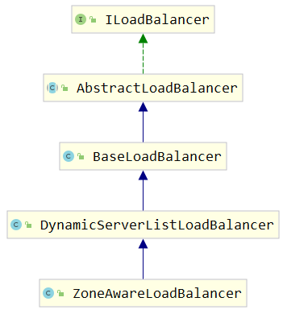

# 1 客户端负载均衡器 Spring Cloud Ribbon

Spring Cloud Ribbon 是一个基于 HTTP 和 TCP 的客户端负载均衡工具。

RestTemplate，Feign，Zuul 服务发现 服务选择规则 服务监听 ServerList（通过ServerList获取所有的可用服务列表），ServerListFilter（根据ServerListFilter过滤掉一部分服务），IRule（通过IRule选择一个实例作为最终目标结果）

客户端负载均衡中，所有客户端节点都维护着自己要访问的服务端清单，而这些服务端的清单来自于服务注册中心，比如 Eureka 服务端。

通过 Spring Cloud Ribbon 的封装，我们在微服务架构中使用客户端负载均衡调用非常简单，只需要如下两步:

* 服务提供者只需要启动多个服务实例并注册到一个注册中心或是多个相关联的服务注册中心。
* 服务消费者直接通过调用被 @LoadBalanced 注解修饰过的 RestTemplate 来实现面向服务的接口调用。

这样，我们就可以将服务提供者的高可用以及服务消费者的负载均衡调用一起实现了。

## 1.1 RestTemplate 详解

### 1.1.1 GET 请求

在 RestTemplate中，对GET 请求可以通过如下两个方法进行调用实现。

第一种: `getForEntity函数`。该方法返回的是 ResponseEntity，该对象是Spring对HTTP请求响应的封装，其中主要存储了HTTP的几个重要元素，比如HTTP请求状态码的枚举对象Httpstatus （也就是我们常说的404、500 这些错误码)、在它的父类HttpEntity中还存储着HTTP请求的头信息对象HttpHleaders以及泛型类型的请求体对象。比如下面的例子，就是访问USER-SERVER服务的/user请求，同时最后一个参数didi会替换url中的{1}占位符，而返回的ResponseEntity对象中的 body内容类型会根据第二个参数转换为String 类型。

```java
RestTemplate restTemplate = new RestTemplate();
ResponseEntity<String> responseEntity = restTemplate.getForEntity("http://USER-SERVICE/user?name={1}",String.class, "didi");
string body = responseEntity.getBody();
```

第二种: `getFor0bject函数`。该方法可以理解为对 getForEntity 的进一步封装，它通过 HttpMessageConverterExtractor 对HTTP的请求响应体 body内容进行对象转换，实现请求直接返回包装好的对象内容。比如:

```java
RestTemplate restTemplate = new RestTemplate();
string result = restTemplate.getFor0bject(uri, String.class);
```

当不需要关注请求响应除 body 外的其他内容时，该函数就非常好用，可以少一个从Response中获取 body 的步骤。

### 1.1.2 POST 请求

在RestTemplate 中，对POST请求时可以通过如下三个方法进行调用实现。
第一种: `postForEntity函数`。该方法同GET 请求中的getForEntity类似，会在调用后返回ResponseEntity<T>对象，其中T为请求响应的 body类型。比如下面这个例子，使用 postForEntity 提交POST请求到 USER-SERVICE 服务的 /user 接口，提交的 body 内容为user对象，请求响应返回的body类型为String。

```java
RestTemplate restTemplate = new RestTemplate();
User user = new User ( "didi",30);
ResponseEntity<String> responseEntity = restTemplate.postForEntity("http://USER-SERVICE/user", user, String.class);
String body = responseEntity.getBody();
```

第二种: `postFor0bject函数`。该方法也跟getFor0bject 的类型类似，它的作用是简化postForEntity的后续处理。通过直接将请求响应的 body 内容包装成对象来返回使用，比如下面的例子:

```java
RestTemplate restTemplate = new RestTemplate();
User user = new User("didi",20);
String postResult = restTemplate.postForObject("http://USER-SERVICE/user",user,String.class);
```

第三种: `postForLocation函数`。该方法实现了以POST请求提交资源，并返回新资源的URI，比如下面的例子:

```java
User user = new User("didi",40);
URI responseURI = restTemplate.postForLocation("http://USER-SERVICE/user", user);
```

### 1.1.3 PUT请求

在 RestTemplate 中，对PUT 请求可以通过put方法进行调用实现，比如:

```java
RestTemplate restTemplate = new RestTemplate();
Long id=10001L;
User user = new User("didi",40);
restTemplate.put("http://USER-SERVICE/user/{1}",user,id);
```

put函数为void类型，所以没有返回内容，也就没有其他函数定义的responseType参数，除此之外的其他传入参数定义与用法与 postForobject 基本一致。

### 1.1.4 DELETE请求

在RestTemplate 中，对DELETE请求可以通过delete方法进行调用实现，比如:

```java
RestTemplate restTermplate = new RestTemplate();
Long id = 10001L;
restTemplate.delete("http://USER-SERVICE/user/{1}",id);
```

由于我们在进行REST请求时，通常都将DELETE 请求的唯一标识拼接在url中，所以DELETE请求也不需要request的 body信息，就如上面的三个函数实现一样，非常简单。url指定DELETE请求的位置，urlvariables绑定url中的参数即可。

GET、POST、PUT、DELETE 的几个方法均有三个重载方法。

## 1.2 RestTemplate 的三种使用方式

1.第一种方式(直接使用restTemplate，url写死)

```java
RestTemplate restTemplate = new RestTemplate();
String response = restTemplate.getForObject("http://localhost:8080/msg", String.class);
```

2.第二种方式(利用loadBalancerClient通过应用名获取url，然后使用restTemplate)

```java
@Autowired
private LoadBalancerClient loadBalancerClient;

ServiceInstance serviceInstance = loadBalancerClient.choose("PRODUCT");
String url = String.format("http://%s:%s", serviceInstance.getHost(), serviceInstance.getPort() + "/msg");
RestTemplate restTemplate = new RestTemplate();
String response = restTemplate.getForObject(url, String.class);
```

3.第三种方式(需要将restTemplate作为一个bean，利用LoadBalanced，可在restTemplate里使用应用名字)

```java
@Component
public class RestTemplateConfig {
    @Bean
    @LoadBalanced
    public RestTemplate restTemplate() {
        return new RestTemplate();
    }
}
```

```java
@Autowired
private RestTemplate restTemplate;
    
String response = restTemplate.getForObject("http://PRODUCT/msg", String.class);
```

## 1.3 源码分析

**LoadBalanced **

RestTemplate 是 Spring 自己提供的，那 Ribbon 是如何通过 RestTemplate 实现客户端负载均衡的？

仔细观察之前的代码，发现 `@LoadBalanced` 可能和负载均衡相关，从 @LoadBalanced 注解源码的注释中可以知道，该注解用来给 RestTemplate 做标记，以使用负载均衡的客户端 `LoadBalancerclient` 来配置它，这是 Spring Cloud 中定义的一个接口。

```java
public interface LoadBalancerClient extends ServiceInstanceChooser {
   // 使用从负载均衡器中挑选出来的服务实例来执行请求内容
   <T> T execute(String serviceId, LoadBalancerRequest<T> request) throws IOException;
   <T> T execute(String serviceId, ServiceInstance serviceInstance, LoadBalancerRequest<T> request) throws IOException;
	// 为系统构建一个合适的 host:port 形式的URI
   URI reconstructURI(ServiceInstance instance, URI original);
}
```

**LoadBalancerAutoConfiguration**

与 LoadBalancerClient 同包的 LoadBalancerAutoConfiguration 为实现客户端负载均衡器的自动化配置类。

```java
@Configuration
@ConditionalOnClass(RestTemplate.class)
@ConditionalOnBean(LoadBalancerClient.class)
@EnableConfigurationProperties(LoadBalancerRetryProperties.class)
public class LoadBalancerAutoConfiguration {

   @LoadBalanced
   @Autowired(required = false)
   private List<RestTemplate> restTemplates = Collections.emptyList();

   @Bean
   public SmartInitializingSingleton loadBalancedRestTemplateInitializerDeprecated(
         final ObjectProvider<List<RestTemplateCustomizer>> restTemplateCustomizers) {
      return () -> restTemplateCustomizers.ifAvailable(customizers -> {
            for (RestTemplate restTemplate : LoadBalancerAutoConfiguration.this.restTemplates) {
                for (RestTemplateCustomizer customizer : customizers) {
                    customizer.customize(restTemplate);
                }
            }
        });
   }

   @Bean
   public LoadBalancerInterceptor ribbonInterceptor(
         LoadBalancerClient loadBalancerClient,
         LoadBalancerRequestFactory requestFactory) {
         return new LoadBalancerInterceptor(loadBalancerClient, requestFactory);
   }

   @Bean
   @ConditionalOnMissingBean
   public RestTemplateCustomizer restTemplateCustomizer(
         final LoadBalancerInterceptor loadBalancerInterceptor) {
      return restTemplate -> {
             List<ClientHttpRequestInterceptor> list = new ArrayList<>(
                        restTemplate.getInterceptors());
             list.add(loadBalancerInterceptor);
             restTemplate.setInterceptors(list);
         };
   }
}
```

从LoadBalancerAutoConfiguration类头上的注解可以知道，Ribbon实现的负载均衡自动化配置需要满足下面两个条件。

* Conditionalonclass(RestTemplate.class): RestTemplate类必须存在于当前工程的环境中。

* ConditionalOnBean(LoadBalancerclient.class):在Spring 的 Bean 工程中必须有LoadBalancerclient的实现Bean。

在该自动化配置类中，主要做了下面三件事:

* 创建了一个LoadBalancerInterceptor 的 Bean，用于实现对客户端发起请求时进行拦截，以实现客户端负载均衡。

* 创建了一个RestTemplateCustomizer 的 Bean，用于给RestTemplate 增加LoadBalancerInterceptor拦截器。

* 维护了一个被@LoadBalanced注解修饰的RestTemplate对象列表，并在这里进行初始化，通过调用RestTemplateCustomizer 的实例来给需要客户端负载均衡的RestTemplate增加工oadBalancerInterceptor拦截器。

**LoadBalancerInterceptor**

接下来，我们看看 LoadBalancerInterceptor 拦截器是如何将一个普通的RestTemplate变成客户端负载均衡的:

```java
public class LoadBalancerInterceptor implements ClientHttpRequestInterceptor {

   private LoadBalancerClient loadBalancer;
   private LoadBalancerRequestFactory requestFactory;

   public LoadBalancerInterceptor(LoadBalancerClient loadBalancer, LoadBalancerRequestFactory requestFactory) {
      this.loadBalancer = loadBalancer;
      this.requestFactory = requestFactory;
   }

   public LoadBalancerInterceptor(LoadBalancerClient loadBalancer) {
      // for backwards compatibility
      this(loadBalancer, new LoadBalancerRequestFactory(loadBalancer));
   }

   @Override
   public ClientHttpResponse intercept(final HttpRequest request, final byte[] body,
         final ClientHttpRequestExecution execution) throws IOException {
      final URI originalUri = request.getURI();
      String serviceName = originalUri.getHost();
      Assert.state(serviceName != null, "Request URI does not contain a valid hostname: " + originalUri);
      return this.loadBalancer.execute(serviceName, requestFactory.createRequest(request, body, execution));
   }
}
```

通过源码以及之前的自动化配置类，我们可以看到在拦截器中注入了 LoadBalancerClient 的实现。当一个被@LoadBalanced 注解修饰的 RestTemplate 对象向外发起 HTTP 请求时，会被 LoadBalancerInterceptor 类的intercept函数所拦截。由于我们在使用RestTemplate时采用了服务名作为host，所以直接从HttpRequest的URI对象中通过getHost()就可以拿到服务名，然后调用execute函数去根据服务名来选择实例并发起实际的请求。

分析到这里，LoadBalancerclient 还只是一个抽象的负载均衡器接口，所以我们还需要找到它的具体实现类来进一步进行分析。通过查看Ribbon的源码，可以很容易地在org.springframework.cloud.netflix.ribbon包下找到对应的实现类 RibbonLoadBalancerClient。

```java
public <T> T execute(String serviceId, LoadBalancerRequest<T> request) throws IOException {
   ILoadBalancer loadBalancer = getLoadBalancer(serviceId);
   Server server = getServer(loadBalancer);
   if (server == null) {
      throw new IllegalStateException("No instances available for " + serviceId);
   }
   RibbonServer ribbonServer = new RibbonServer(serviceId, server, isSecure(server,
         serviceId), serverIntrospector(serviceId).getMetadata(server));
   return execute(serviceId, ribbonServer, request);
}

public <T> T execute(String serviceId, ServiceInstance serviceInstance, LoadBalancerRequest<T> request) throws IOException {
   Server server = null;
   if(serviceInstance instanceof RibbonServer) {
      server = ((RibbonServer)serviceInstance).getServer();
   }
   if (server == null) {
      throw new IllegalStateException("No instances available for " + serviceId);
   }
   RibbonLoadBalancerContext context = this.clientFactory
         .getLoadBalancerContext(serviceId);
   RibbonStatsRecorder statsRecorder = new RibbonStatsRecorder(context, server);
   try {
      T returnVal = request.apply(serviceInstance);
      statsRecorder.recordStats(returnVal);
      return returnVal;
   }
    ...
   return null;
}
```

可以看到，在execute函数的实现中，第一步做的就是通过getserver根据传入的服务名serviceId去获得具体的服务实例:

```java
protected Server getServer(ILoadBalancer loadBalancer) {
   if (loadBalancer == null) {
      return null;
   }
   return loadBalancer.chooseServer("default");
}
```

通过getServer函数的实现源码，我们可以看到这里获取具体服务实例的时候并没有使用 LoadBalancerclient 接口中的choose函数，而是使用了Netflix Ribbon自身的 `ILoadBalancer` 接口中定义的 chooseserver 函数。

我们先来认识一下这个 ILoadBalancer 接口:

```java
public interface ILoadBalancer {
	// 向负载均衡器中维护的实例列表增加服务实例。
   public void addServers(List<Server> newServers);
	// 通过某种策略，从负载均衡器中挑选出一个具体的服务实例。
   public Server chooseServer(Object key);
	//用来通知和标识负载均衡器中某个具体实例已经停止服务，不然负载均衡器在下一次获取服务实例清单前都会认为服务实例均是正常服务的。
   public void markServerDown(Server server);
	//获取当前正常服务的实例列表。
   public List<Server> getReachableServers();
	//获取所有已知的服务实例列表，包括正常服务和停止服务的实例。
   public List<Server> getAllServers();
}
```

那么在整合Ribbon的时候 Spring Cloud 默认采用了哪个具体实现呢?我们通过RibbonclientConfiguration配置类，可以知道在整合时默认采用了 `ZoneAwareLoadBalancer` 来实现负载均衡器。

```java
@Bean
@ConditionalOnMissingBean
public ILoadBalancer ribbonLoadBalancer(IClientConfig config,
      ServerList<Server> serverList, ServerListFilter<Server> serverListFilter,
      IRule rule, IPing ping, ServerListUpdater serverListUpdater) {
   if (this.propertiesFactory.isSet(ILoadBalancer.class, name)) {
      return this.propertiesFactory.get(ILoadBalancer.class, config, name);
   }
   return new ZoneAwareLoadBalancer<>(config, rule, ping, serverList,
         serverListFilter, serverListUpdater);
}
```

下面，我们再回到 RibbonLoadBalancerclient 的execute函数逻辑，在通过ZoneAwareLoadBalancer 的chooseServer函数获取了负载均衡策略分配到的服务实例对象Server之后，将其内容包装成 RibbonServer对象（该对象除了存储了服务实例的信息之外，还增加了服务名serviceId、是否需要使用HTTPS 等其他信息)，然后使用该对象再回调 LoadBalancerInterceptor请求拦截器中 LoadBalancerRequest的 apply(final serviceInstance instance)函数，向一个实际的具体服务实例发起请求，从而实现一开始以服务名为host的URI请求到host:post形式的实际访问地址的转换。

在 apply(final ServiceInstance instance) 函数中传入的 `ServiceInstance` 接口对象是对服务实例的抽象定义。在该接口中暴露了服务治理系统中每个服务实例需要提供的一些基本信息，比如 serviceld、host、port等，具体定义如下:

```java
public interface ServiceInstance{
	String getServiceId();
	String getHost();
	int getPort();
	boolean isSecure();
	URI geturi();
	Map<string, String> getMetadata();
}
```

而上面提到的具体包装 server 服务实例的 `Ribbonserver` 对象就是 ServiceInstance 接口的实现，可以看到它除了包含 server 对象之外，还存储了服务名、是否使用HTTPS标识以及一个 Map类型的元数据集合。

**ZoneAwareLoadBalancer**



ZoneAwareLoadBalancer 负载均衡器是对 `DynamicServerListLoadBalancer` 的扩展。在 DynamicserverListLoadBalancer 中，我们可以看到它并没有重写选择具体服务实例的 chooseserver 函数，所以它依然会采用在 BaseLoadBalancer中实现的算法。使用 `RoundRobinRule` 规则，以`线性轮询`的方式来选择调用的服务实例，该算法实现简单并没有区域(Zone)的概念，所以它会把所有实例视为一个Zone下的节点来看待，这样就会周期性地产生跨区域(Zone）访问的情况，由于跨区域会产生更高的延迟，这些实例主要以防止区域性故障实现高可用为目的而不能作为常规访问的实例，所以在多区域部署的情况下会有一定的性能问题，而该负载均衡器则可以避免这样的问题。那么它是如何实现的呢?

首先，在ZoneAwareLoadBalancer中，我们可以发现,它并没有重写setserversList，说明实现服务实例清单的更新主逻辑没有修改。但是我们可以发现它重写了这个函数 `setServerListForZones(Map<string,List<Server>>zoneServersMap)`。看到这里可能会有一些陌生，因为它并不是接口中定义的必备函数，所以我们不妨去父类DynamicServerListLoadBalancer中寻找一下该函数，我们可以找到下面的定义:

```java
// DynamicServerListLoadBalancer.java
public void setServersList(List lsrv) {
    super.setServersList(lsrv);
    ...
    setServerListForZones(serversInZones);
}
protected void setServerListForZones(
        Map<String, List<Server>> zoneServersMap) {
    LOGGER.debug("Setting server list for zones: {}", zoneServersMap);
    getLoadBalancerStats().updateZoneServerMapping(zoneServersMap);
}
```

setServerListForZones 函数的调用位于更新服务实例清单函数 setServersList 的最后，同时从其实现的内容来看，它在父类 DynamicserverListLoadBalancer 中的作用是根据按区域 Zone 分组的实例列表，为负载均衡器中的 LoadBalancerstats 对象创建Zonestats 并放入Map zonestatsMap 集合中，每一个区域Zone对应一个Zonestats，它用于存储每个Zone的一些状态和统计信息。

在 ZoneAwareLoadBalancer 中对 setserverListForZones 的重写如下:

```java
protected void setServerListForZones(Map<String, List<Server>> zoneServersMap) {
    super.setServerListForZones(zoneServersMap);
    if (balancers == null) {
        balancers = new ConcurrentHashMap<String, BaseLoadBalancer>();
    }
    for (Map.Entry<String, List<Server>> entry: zoneServersMap.entrySet()) {
       String zone = entry.getKey().toLowerCase();
        getLoadBalancer(zone).setServersList(entry.getValue());
    }
    for (Map.Entry<String, BaseLoadBalancer> existingLBEntry: balancers.entrySet()) {
        if (!zoneServersMap.keySet().contains(existingLBEntry.getKey())) {
            existingLBEntry.getValue().setServersList(Collections.emptyList());
        }
    }
}    
```

可以看到，在该实现中创建了一个 ConcurrentHashMap() 类型的 balancers 对象，它将用来存储每个 Zone 区域对应的负载均衡器。而具体的负载均衡器的创建则是通过在下面的第一个循环中调用 getLoadBalancer 函数来完成，同时在创建负载均衡器的时候会创建它的规则（如果当前实现中没有IRule 的实例，就创建一个AvailabilityFilteringRule规则；如果已经有具体实例，就克隆一个)。

在创建完负载均衡器后又马上调用setserversList函数为其设置对应Zone区域的实例清单。而第二个循环则是对Zone区域中实例清单的检查，看看是否有Zone区域下已经没有实例了，是的话就将 balancers 中对应Zone区域的实例列表清空，该操作的作用是为了后续选择节点时，防止过时的Zone区域统计信息干扰具体实例的选择算法。

在了解了该负载均衡器是如何扩展服务实例清单的实现后，我们来具体看看它是如何挑选服务实例，来实现对区域的识别的:

```java
public Server chooseServer(Object key) {
    if (!ENABLED.get() || getLoadBalancerStats().getAvailableZones().size() <= 1) {
        logger.debug("Zone aware logic disabled or there is only one zone");
        return super.chooseServer(key);
    }
    Server server = null;
    try {
        LoadBalancerStats lbStats = getLoadBalancerStats();
        Map<String, ZoneSnapshot> zoneSnapshot = ZoneAvoidanceRule.createSnapshot(lbStats);
        logger.debug("Zone snapshots: {}", zoneSnapshot);
        if (triggeringLoad == null) {
            triggeringLoad = DynamicPropertyFactory.getInstance().getDoubleProperty(
                    "ZoneAwareNIWSDiscoveryLoadBalancer." + this.getName() + ".triggeringLoadPerServerThreshold", 0.2d);
        }
        if (triggeringBlackoutPercentage == null) {
            triggeringBlackoutPercentage = DynamicPropertyFactory.getInstance().getDoubleProperty(
                    "ZoneAwareNIWSDiscoveryLoadBalancer." + this.getName() + ".avoidZoneWithBlackoutPercetage", 0.99999d);
        }
        Set<String> availableZones = ZoneAvoidanceRule.getAvailableZones(zoneSnapshot, triggeringLoad.get(), triggeringBlackoutPercentage.get());
        logger.debug("Available zones: {}", availableZones);
        if (availableZones != null &&  availableZones.size() < zoneSnapshot.keySet().size()) {
            String zone = ZoneAvoidanceRule.randomChooseZone(zoneSnapshot, availableZones);
            logger.debug("Zone chosen: {}", zone);
            if (zone != null) {
                BaseLoadBalancer zoneLoadBalancer = getLoadBalancer(zone);
                server = zoneLoadBalancer.chooseServer(key);
            }
        }
    } catch (Exception e) {
        logger.error("Error choosing server using zone aware logic for load balancer={}", name, e);
    }
    if (server != null) {
        return server;
    } else {
        logger.debug("Zone avoidance logic is not invoked.");
        return super.chooseServer(key);
    }
}
```

从源码中我们可以看到，只有当负载均衡器中维护的实例所属的 Zone 区域的个数大于 1 的时候才会执行这里的选择策略，否则还是将使用父类的实现。当Zone区域的个数大于  1 的时候，它的实现步骤如下所示。

* 调用ZoneAvoidanceRule 中的静态方法 createSnapshot (lbstats)，为当前负载均衡器中所有的Zone区域分别创建快照，保存在Map zoneSnapshot中，这些快照中的数据将用于后续的算法。
* 调用ZoneAvoidanceRule中的静态方法getAvailableZones (zoneSnapshot,triggeringLoad.get ( ), triggeringBlackoutPercentage.get () )，来获取可用的Zone区域集合，在该函数中会通过Zone区域快照中的统计数据来实现可用区的挑选。
  - 首先它会剔除符合这些规则的Zone区域：所属实例数为零的Zone区域；Zone区域内实例的平均负载小于零，或者实例故障率（断路器断开次数/实例数）大于等于阈值（默认为0.99999)
  - 然后根据Zone区域的实例平均负载计算出最差的Zone区域，这里的最差指的是实例平均负载最高的Zone区域
  - 如果在上面的过程中没有符合剔除要求的区域，同时实例最大平均负载小于阈值
    (默认为20%)，就直接返回所有Zone区域为可用区域。否则，从最坏Zone区域集合中随机选择一个，将它从可用Zone区域集合中剔除。

* 当获得的可用Zone区域集合不为空，并且个数小于Zone区域总数，就随机选择一个Zone区域。
* 在确定了某个Zone区域后，则获取了对应Zone 区域的服务均衡器，并调用chooseServer来选择具体的服务实例，而在 chooseServer 中将使用 IRule接口的 choose函数来选择具体的服务实例。在这里，IRule接口的实现会使用ZoneAvoidanceRule来挑选出具体的服务实例。

## 1.4 负载均衡策略

RestTemplate默认负载均衡策略为轮询：

```yml
PRODUCT: # 自己服务的名字
  ribbon:
  	# 自定义负载均衡策略配置（修改为随机）
    NFLoadBalancerRuleClassName: com.netflix.loadbalancer.RandomRule
```

ribbon 有 7 种负载均衡策略可供选择：

| 策略类                    | 命名               | 描述                                                         |
| ------------------------- | ------------------ | ------------------------------------------------------------ |
| RandomRule                | 随机策略           | 随机选择server                                               |
| RoundRobinRule            | 轮询策略           | 按照顺序选择server（ribbon默认策略）                         |
| RetryRule                 | 重试策略           | 在一个配置时间段内，当选择server不成功，则一直尝试选择一个可用的server |
| BestAvailableRule         | 最低并发策略       | 逐个考察server，如果server断路器打开，则忽略，再选择其中并发链接最低的server |
| AvailabilityFilteringRule | 可用过滤策略       | 过滤掉一直失败并被标记为circuit tripped的server，过滤掉那些高并发链接的server（active connections超过配置的阈值） |
| WeightedResponseTimeRule  | 响应时间加权重策略 | 根据server的响应时间分配权重，响应时间越长，权重越低，被选择到的概率也就越低。响应时间越短，权重越高，被选中的概率越高，这个策略很贴切，综合了各种因素，比如：网络，磁盘，io等，都直接影响响应时间 |
| ZoneAvoidanceRule         | 区域权重策略       | 综合判断server所在区域的性能，和server的可用性，轮询选择server并且判断一个AWS Zone的运行性能是否可用，剔除不可用的Zone中的所有server |


 Feign的使用

声明式REST客户端（伪RPC） 采用了基于接口的注解 1.引入依赖

```java
<dependency>
            <groupId>org.springframework.cloud</groupId>
            <artifactId>spring-cloud-starter-openfeign</artifactId>
        </dependency>
```

2.在启动类上加注解@EnableFeignClients 3.定义好需要调用的接口

```java
@FeignClient(name = "product")
public interface ProductClient {

    @PostMapping("/product/listForOrder")
    List<ProductInfoOutput> listForOrder(@RequestBody List<String> productIdList);

    @PostMapping("/product/decreaseStock")
    void decreaseStock(@RequestBody List<DecreaseStockInput> decreaseStockInputList);
}
```

4.调用

```java
@Autowired
    private ProductClient productClient;

       //查询商品信息(调用商品服务)
        List<ProductInfoOutput> productInfoList = productClient.listForOrder(productIdList);
```

消息队列

消息中间件的选择

RabbitMQ，Kafka，ActiveMQ

RabbitMQ

安装

1.进入 [RabbitMQ](http://www.rabbitmq.com/download.html)下载页面 2.使用Docker镜像 

```java
docker run -d --hostname my-rabbit -p 5672:5672 -p 15672:15672 rabbitmq:3.7.3-management
```

默认帐号：guest，密码：guest

 微服务和容器

从系统环境开始，自底至上打包应用 轻量级，对资源的有效隔离和管理 可复用，版本化

