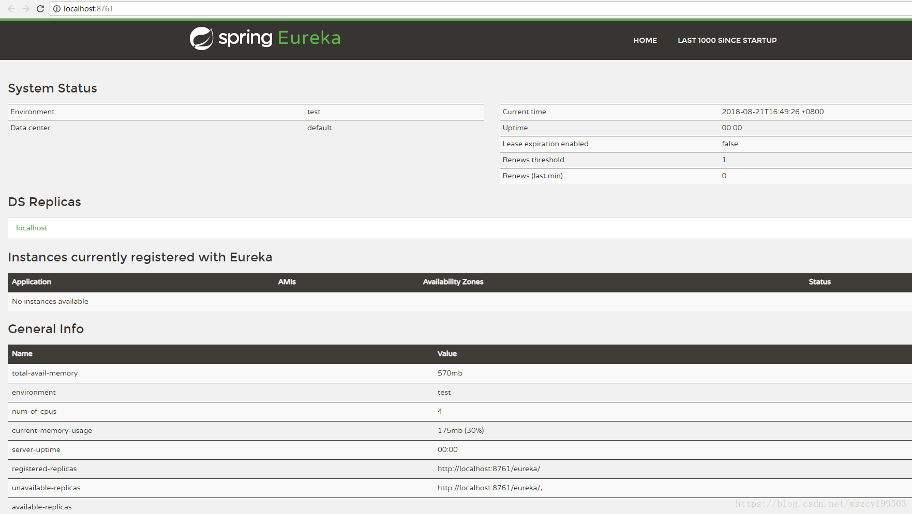

# 1 什么是微服务架构

微服务一词源于 James Lewis &amp; Martin Fowler 的名为 [《Microservices》](https://www.martinfowler.com/articles/microservices.html) 的博文(2014-03-25)。 

微服务是系统架构上的一种设计风格，它的主旨是`将一个原本独立的系统拆分成多个小型服务`，这些小型服务都`在各自独立的进城中运行`，服务之间通过基于 HTTP 的 RESTful API 进行通信协作。

被拆分成的每一个小型服务都围绕着`系统中的某项或一些耦合度较高的业务功能进行构建`，并且每个服务都维护着自身的数据存储、业务开发、自动化测试案例以及`独立部署机制`。由于有了轻量级的通信协作基础，所以这些微服务可以使用不同的语言来编写。

# 2 Spring Cloud 简介

Spring Cloud 是一个基于 Spring Boot 实现的微服务架构开发工具。它为微服务架构中涉及的配置管理、服务治理、断路器、智能路由、微代理、控制总线、全局锁、决策竞选、分布式会话和集群状态管理等操作提供了一种简单的开发方式。

Spring Cloud包含了多个子项目，如下所述：

`Spring Cloud Config` 配置管理工具，支持使用Git存储配置内容，可以使用它实现应用配置的外部化存储，并支持客户端配置信息刷新、加密/解密配置内容等。

`Spring Cloud Netflix` 核心组件，对多个Netflix OSS开源套件进行整合。

* `Eureka` 服务治理组件，包含服务注册中心、服务注册与发现机制的实现。
* `Hystrix` 容错管理组件，实现断路器模式，帮助服务依赖中出现的延迟和为故障提供强大的容错能力。
* `Ribbon` 客户端负载均衡的服务调用组件。

- `Feign` 基于Ribbon和 Hystrix的声明式服务调用组件。
- `Zuul`网关组件，提供智能路由、访问过滤等功能。
- `Archaius` 外部化配置组件。

`Spring Cloud Bus` 事件、消息总线，用于传播集群中的状态变化或事件，以触发后续的处理，比如用来动态刷新配置等。

`Spring Cloud Cluster` 针对ZooKeeper、Redis、Hazelcast、Consul 的选举算法和通用状态模式的实现。

`Spring Cloud Consul` 服务发现与配置管理工具。

`Spring Cloud Stream` 通过Redis、Rabbit或者Kafka实现的消费微服务，可以通过简单的声明式模型来发送和接收消息。

`Spring Cloud Security` 安全工具包，提供在Zuul代理中对OAuth2客户端请求的中继器。

`Spring Cloud Sleuth` Spring Cloud应用的分布式跟踪实现，可以完美整合Zipkin。

`Spring Cloud ZooKeeper` 基于ZooKeeper 的服务发现与配置管理组件。

**版本说明**

`伦敦地铁站名.SRX` 当一个版本的 Spring Cloud 项目的发布内容累积到临界点或者一个严重 bug 解决可用后，就会发布一个 “`service releases`” 版本，简称 SRX 版本，其中 X 是一个递增的数字。

# 3 Spring Cloud Eureka

Spring Cloud Eureka 是 Spring Cloud Netflix 微服务套件中的一部分，它基于 Netflix Eureka 做了二次封装，主要负责完成微服务架构中的服务治理功能。

`服务治理`可以说是微服务架构中最为核心和基础的模块，它主要用来实现各个微服务实例的自动化注册与发现。

在最初开始构建微服务系统的时候可能服务并不多，我们可以通过做一些静态配置来完成服务的调用。随着业务的发展，系统功能越来越复杂，相应的微服务应用也不断增加，静态配置就会变得越来越难以维护。并且面对不断发展的业务，我们的集群规模、服务的位置、服务的命名等都有可能发生变化，如果还是通过手工维护的方式，那么极易发生错误或是命名冲突等问题。同时，对于这类静态内容的维护也必将消耗大量的人力。

Eureka 的实现都围绕着`服务注册`与`服务发现`机制来完成对微服务应用实例的自动化管理。

服务注册: 在服务治理框架中，通常都会构建一个注册中心，每个服务单元向注册中心登记自己提供的服务，将主机与端口号、版本号、通信协议等一些附加信息告知注册中心，注册中心按服务名分类组织服务清单。服务注册中心还需要以心跳的方式去监测清单中的服务是否可用，若不可用需要从服务清单中剔除，达到排除故障服务的效果。

服务发现: 由于在服务治理框架下运作，服务间的调用不再通过指定具体的实例地址来实现，而是通过向服务名发起请求调用实现。所以，服务调用方在调用服务提供方接口的时候，并不知道具体的服务实例位置。因此，调用方需要向服务注册中心咨询服务，并获取所有服务的实例清单，以实现对具体服务实例的访问。当服务要发起调用的时候，便从该清单中以某种轮询策略取出一个位置来进行服务调用，这就是后续我们将会介绍的`客户端负载均衡`。

由于 Eureka 的服务端提供了较为完善的 RESTful API，所以它也支持将非 java 语言实现的服务纳入到自己的服务治理体系中来，只需要其他语言自己实现 Eureka 的客户端程序，比如 Node.js 实现了一套 eureka-js-client。

Eureka服务端，我们也称为服务注册中心。它同其他服务注册中心一样，支持高可用配置。它依托于强一致性提供良好的服务实例可用性，可以应对多种不同的故障场景。如果Eureka 以集群模式部署，当集群中有分片出现故障时，那么Eureka就转入自我保护模式。它允许在分片故障期间继续提供服务的发现和注册，当故障分片恢复运行时，集群中的其他分片会把它们的状态再次同步回来。

Eureka客户端，主要处理服务的注册与发现。客户端服务通过注解和参数配置的方式，嵌入在客户端应用程序的代码中，在应用程序运行时，Eureka客户端向注册中心注册自身提供的服务并周期性地发送心跳来更新它的服务租约。同时，它也能从服务端查询当前注册的服务信息并把它们缓存到本地并周期性地刷新服务状态。

## 3.1 搭建服务注册中心

 

**核心依赖**

```xml
<parent>
    <groupId>org.springframework.boot</groupId>
    <artifactId>spring-boot-starter-parent</artifactId>
    <version>2.0.9.RELEASE</version>
    <relativePath/> <!-- lookup parent from repository -->
</parent>
<dependencies>
    <dependency>
        <groupId>org.springframework.cloud</groupId>
        <artifactId>spring-cloud-starter-netflix-eureka-server</artifactId>
    </dependency>
</dependencies>
<properties>
	<java.version>1.8</java.version>
	<spring-cloud.version>Finchley.SR2</spring-cloud.version>
</properties>

<dependencyManagement>
	<dependencies>
		<dependency>
			<groupId>org.springframework.cloud</groupId>
            <artifactId>spring-cloud-dependencies</artifactId>
            <version>${spring-cloud.version}</version>
            <type>pom</type>
            <scope>import</scope>
        </dependency>
    </dependencies>
</dependencyManagement>
```

> 北京时间2020-12-22深夜，Spring Cloud 2020.0.0版本正式发布。2020.0.0是第一个使用新版本方案的Spring Cloud发行版本，除了肉眼可见的更开发者友好的命名方式，这次发布全面抛弃了 Netflix 技术栈，并且是一个长期维护的主要版本。
>
> 旧版本的 spring-cloud-netflix-dependencies 管理着 Netflix 所有组件，包括 Hystrix、Ribbon、Zuul、Eureka 等。而自 2020.0 版本起它有且只管理 Eureka（包括 Server 和 Client）。
>
> 关于版本号这里啰嗦几句：在这之前，Spring Cloud的Release Train名称采用的是伦敦地铁站命名方式，如：Hoxton、Greenwich等。
> 2020.0.0版本又名Ilford（地铁站名），因为此项目3月后才按照新规更名，你也可以理解为它仅是一个内部代号而已。
> Spring Framework：5.3.2
> Spring Boot：2.4.1
> Spring Cloud：2020.0.0

**修改启动类**

添加 `@EnableEurekaServer` 注解，表示项目具有注册中心的功能

**修改application.yml**

```yml
server:
  port: 8761

eureka:
  instance:
    hostname: localhost
  client:
    register-with-eureka: false # 不向注册中心注册自己
    fetch-registry: false # 注册中心的职责就是维护服务，不需要去检索服务
    service-url:
      defaultZone: http://${eureka.instance.hostname}:${server.port}/eureka/
```




## 3.2 注册服务提供者


**核心依赖**

```xml
<dependencies>
   <dependency>
      <groupId>org.springframework.cloud</groupId>
      <artifactId>spring-cloud-starter-netflix-eureka-client</artifactId>
   </dependency>
   <!--同时检查是否引入spring-boot-starter-web依赖-->
    <dependency>
    	<groupId>org.springframework.boot</groupId>
    	<artifactId>spring-boot-starter-web</artifactId>
	</dependency>
</dependencies>
```

**修改启动类**

添加注解：@EnableDiscoveryClient

**修改application.yml**

```yml
spring:
  application:
    name: hello-service
eureka:
  client:
    service-url:
      defaultZone: http://localhost:8761/eureka/ # 指定服务注册中心的地址
```

```java
@RestController
public class HelloController {

    @Qualifier("eurekaRegistration")
    @Autowired
    private Registration registration;

    // 通过注入 DiscoveryClient 对象，在日志中打印出服务的相关信息
    @Autowired
    private DiscoveryClient client;

    @GetMapping("/hello")
    public String index() {
        ServiceInstance instance = serviceInstance();
        System.out.println("/hello, host:" + instance.getHost()  + ", service_id:" + instance.getServiceId());
        return "Hello World";
    }

    public ServiceInstance serviceInstance() {
        List<ServiceInstance> list = client.getInstances(registration.getServiceId());
        if (list != null && list.size() > 0) {
            for(ServiceInstance itm : list){
                if(itm.getPort() == 8080) {
                    return itm;
                }
            }
        }
        return null;
    }
}
```

在hello-service服务控制台中，Tomcat 启动之后，com.netflix.discovery.DiscoveryClient 对象打印了该服务的注册信息，表示服务注册成功。

```markdown
o.s.b.w.embedded.tomcat.TomcatWebServer  : Tomcat started on port(s): 8080 (http) with context path ''
.s.c.n.e.s.EurekaAutoServiceRegistration : Updating port to 8080
com.netflix.discovery.DiscoveryClient    : DiscoveryClient_HELLO-SERVICE/localhost:hello-service - registration status: 204
c.s.h.HelloServiceApplication            : Started HelloServiceApplication in 6.07 seconds (JVM running for 6.56)
# 服务中心控制台看到如下输出
c.n.e.registry.AbstractInstanceRegistry  : Registered instance HELLO-SERVICE/localhost:hello-service with status UP (replication=false)
```


## 3.3 Eureka Server 高可用

**配置3个Eureka服务端**


使用复制功能复制2个服务器配置，分别配置端口为8761，8762

**依次配置并启动 Eureka Server**

```yml
spring:
  application:
    name: eureka-server
eureka:
  client:
    # 高可用时，需要向其他服务注册中心注册自己
    #register-with-eureka: false # 不向注册中心注册自己
    #fetch-registry: false # 注册中心的职责就是维护服务，不需要去检索服务
    service-url:
      # 启动EurekaApplication1时，配置
      defaultZone: http://localhost:8762/eureka/
      # 启动EurekaApplication2时，配置
      defaultZone: http://localhost:8761/eureka/
```

**启动 client**

配置defaultZone:  http://localhost:8761/eureka/,http://localhost:8762/eureka/

会发现三个服务端都注册上了client


## 3.4 服务发现与消费

首先，启动之前实现的服务注册中心eureka-server 以及hello-service服务，为了实验Ribbon的客户端负载均衡功能，我们通过 java-jar 命令行的方式来启动两个不同端口的hello-service，具体如下:

```
java -jar hello-service-0.0.1-SNAPSHOT.jar --server.port=8080
java -jar hello-service-0.0.1-SNAPSHOT.jar --server.port=8081
```

创建一个Spring Boot 的基础工程来实现服务消费者，取名为ribbon-consumer，并在pom.xml 中引入如下的依赖内容。较之前的 hello-service，我们新增了Ribbon模块的依赖spring-cloud-starter-ribbon。

```xml
<dependency>
    <groupId>org.springframework.cloud</groupId>
    <artifactId>spring-cloud-starter-netflix-ribbon</artifactId>
</dependency>
```

创建应用主类 ConsumerApplication，通过@EnableDiscoveryclient注解让该应用注册为Eureka客户端应用，以获得服务发现的能力。同时，在该主类中创建RestTemplate的Spring Bean实例，并通过@LoadBalanced注解开启客户端负载均衡。

```java
@SpringBootApplication
@EnableDiscoveryClient
public class ConsumerApplication {
    @Bean
    @LoadBalanced
    RestTemplate restTemplate() {
        return new RestTemplate();
    }
    public static void main(String[] args) {
        SpringApplication.run(ConsumerApplication.class, args);
    }
}
// 创建consumerController类并实现/ribbon-consumer接口。在该接口中，通过在上面创建的 RestTemplate来实现对HELLO-SERVICE服务提供的/hello接口进行调用。可以看到这里访问的地址是服务名HELLO-SERVICE，而不是一个具体的地址，在服务治理框架中，这是一个非常重要的特性。
@RestController
public class ConsumerController {
    @Autowired
    private RestTemplate restTemplate;
    @GetMapping("/ribbon-consumer")
    public String helloConsumer() {
        return restTemplate.getForEntity("http://HELLO-SERVICE/hello", String.class).getBody();
    }
}
```

配置文件与 hello-service 项目保持一致，不能与之前的应用端口号冲突。

通过向 http: / /localhost : 9000/ribbon-consumer 发起GET请求，成功返回了“Hello World”。此时，我们可以在ribbon-consumer应用的控制台中看到如下信息，Ribbon输出了当前客户端维护的HELLO-SERVICE 的服务列表情况。其中包含了各个实例的位置，Ribbon就是按照此信息进行轮询访问，以实现基于客户端的负载均衡。另外还输出了一些其他非常有用的信息，如对各个实例的请求总数量、第一次连接信息、上一次连接信息、总的请求失败数量等。

```markdown
DynamicServerListLoadBalancer for client HELLO-SERVICE initialized: DynamicServerListLoadBalancer:{NFLoadBalancer:name=HELLO-SERVICE,current list of Servers=[localhost:8081, localhost:8080],Load balancer stats=Zone stats: {defaultzone=[Zone:defaultzone;	Instance count:2;	Active connections count: 0;	Circuit breaker tripped count: 0;	Active connections per server: 0.0;]
},Server stats: [[Server:localhost:8081;	Zone:defaultZone;	Total Requests:0;	Successive connection failure:0;	Total blackout seconds:0;	Last connection made:Thu Jan 01 08:00:00 CST 1970;	First connection made: Thu Jan 01 08:00:00 CST 1970;	Active Connections:0;	total failure count in last (1000) msecs:0;	average resp time:0.0;	90 percentile resp time:0.0;	95 percentile resp time:0.0;	min resp time:0.0;	max resp time:0.0;	stddev resp time:0.0]
, [Server:localhost:8080;	Zone:defaultZone;	Total Requests:0;	Successive connection failure:0;	Total blackout seconds:0;	Last connection made:Thu Jan 01 08:00:00 CST 1970;	First connection made: Thu Jan 01 08:00:00 CST 1970;	Active Connections:0;	total failure count in last (1000) msecs:0;	average resp time:0.0;	90 percentile resp time:0.0;	95 percentile resp time:0.0;	min resp time:0.0;	max resp time:0.0;	stddev resp time:0.0]
]}ServerList:org.springframework.cloud.netflix.ribbon.eureka.DomainExtractingServerList@7b05489b
```

## 3.5 服务治理机制

整个 Eureka 服务治理基础架构的三个核心要素：服务注册中心(eureka-server)、服务提供者(hello-service)、服务消费者(ribbon-consumer)。

以下图为例，其中几个重要元素：

* **服务注册中心-1** 和 **服务注册中心-2** 相互注册组成了高可用集群
* **服务提供者** 启动了两个实例，一个注册到服务注册中心-1，另一个注册到服务注册中心-2
* 两个 **服务消费者**，它们也分别指向一个注册中心


### 服务提供者

**服务注册**
服务提供者在启动的时候会通过发送 REST 请求的方式将自己注册到 EurekaServer 上，同时带上了自身服务的一些元数据信息。Eureka Server 接收到这个 REST 请求之后，将元数据信息存储在一个双层结构 Map 中，其中第一层的 key 是服务名，第二层的 key 是具体服务的实例名。(我们可以回想一下之前在实现Ribbon负载均衡的例子中，Eureka 信息面板中一个服务有多个实例的情况，这些内容就是以这样的双层Map形式存储的。)

```java
// 存储服务元数据信息的双层结构 Map
ConcurrentHashMap<String, Map<String, Lease<InstanceInfo>>> registry
            = new ConcurrentHashMap<String, Map<String, Lease<InstanceInfo>>>();
```


在服务注册时，需要确认一下 `eureka.client.register-with-eureka=true` 参数是否正确，该值默认为 true。若设置为 false 将不会启动注册操作。

**服务同步**

如架构图中所示，这里的两个服务提供者分别注册到了两个不同的服务注册中心上，也就是说，它们的信息分别被两个服务注册中心所维护。此时，由于服务注册中心之间因互相注册为服务，当服务提供者发送注册请求到一个服务注册中心时，它会将该请求转发给集群中相连的其他注册中心，从而实现注册中心之间的服务同步。通过服务同步，两个服务提供者的服务信息就可以通过这两台服务注册中心中的任意一台获取到。

**服务续约**

在注册完服务之后，服务提供者会维护一个`心跳用`来持续告诉Eureka Server:“我还活着”，以防止Eureka Server 的“剔除任务”将该服务实例从服务列表中排除出去，我们称该操作为`服务续约(Renew)`。

关于服务续约有两个重要属性，我们可以关注并根据需要来进行调整:

```properties
# 定义服务续约任务的调用间隔时间，默认为30秒
eureka.instance.lease-renewal-interval-in-seconds=30
# 定义服务失效的时间，默认为90秒
eureka.instance.lease-expiration-duration-in-seconds=90
```

```java
// @EnableDiscoveryClient，主要用于开启 DiscoveryClient 实例
// DiscoverClient.java
private final ScheduledExecutorService scheduler;
// 两个定时任务，分别是服务获取和服务续约
private void initScheduledTasks() {
    if (clientConfig.shouldFetchRegistry()) {
        // registry cache refresh timer
        int registryFetchIntervalSeconds = clientConfig.getRegistryFetchIntervalSeconds();
        int expBackOffBound = clientConfig.getCacheRefreshExecutorExponentialBackOffBound();
        scheduler.schedule(
                new TimedSupervisorTask(
                        "cacheRefresh",
                        scheduler,
                        cacheRefreshExecutor,
                        registryFetchIntervalSeconds,
                        TimeUnit.SECONDS,
                        expBackOffBound,
                        new CacheRefreshThread()
                ),
                registryFetchIntervalSeconds, TimeUnit.SECONDS);
    }
    if (clientConfig.shouldRegisterWithEureka()) {
        int renewalIntervalInSecs = instanceInfo.getLeaseInfo().getRenewalIntervalInSecs();
        int expBackOffBound = clientConfig.getHeartbeatExecutorExponentialBackOffBound();
        // Heartbeat timer
        scheduler.schedule(
                new TimedSupervisorTask(
                        "heartbeat",
                        scheduler,
                        heartbeatExecutor,
                        renewalIntervalInSecs,
                        TimeUnit.SECONDS,
                        expBackOffBound,
                        new HeartbeatThread()
                ),
                renewalIntervalInSecs, TimeUnit.SECONDS);
    }
}
```

### 服务消费者

**获取服务**

到这里，在服务注册中心已经注册了一个服务，并且该服务有两个实例。当我们启动服务消费者的时候，它会发送一个REST请求给服务注册中心，来获取上面注册的服务清单。为了性能考虑，EurekaServer 会维护一份`只读的服务清单`来返回给客户端，同时该`缓存清单会每隔30秒更新一次`。

获取服务是服务消费者的基础，所以必须确保 `eureka.client.fetch-registry=true` 参数没有被修改成false，该值默认为true。若希望修改缓存清单的更新时间，可以通过 `eureka. client.registry-fetch-interval-seconds=30` 参数进行修改，该参数默认值为30，单位为秒。

**服务调用**

服务消费者在获取服务清单后，通过服务名可以获得具体提供服务的实例名和该实例的元数据信息。因为有这些服务实例的详细信息，所以客户端可以根据自己的需要决定具体调用哪个实例，在 Ribbon 中会默认采用轮询的方式进行调用，从而实现客户端的负载均衡。

对于访问实例的选择，Eureka中有 Region 和 Zone 的概念，一个 Region 中可以包含多个 Zone，每个服务客户端需要被注册到一个 Zone 中，所以每个客户端对应一个 Region 和 一个 Zone。在进行服务调用的时候，优先访问同处一个Zone中的服务提供方，若访问不到，就访问其他的Zone。

```java
public static List<String> getServiceUrlsFromConfig(EurekaClientConfig clientConfig, String instanceZone, boolean preferSameZone) {
    List<String> orderedUrls = new ArrayList<String>();
    // 获取 Region
    String region = getRegion(clientConfig);
    // 获取 Region 的 Zone
    String[] availZones = clientConfig.getAvailabilityZones(clientConfig.getRegion());
    if (availZones == null || availZones.length == 0) {
        availZones = new String[1];
        availZones[0] = DEFAULT_ZONE;
    }
    // 根据传入的参数按一定算法确定位于哪一个zone配置的serviceUrls
    int myZoneOffset = getZoneOffset(instanceZone, preferSameZone, availZones);
    // 通过zone获取serviceUrls
    List<String> serviceUrls = clientConfig.getEurekaServerServiceUrls(availZones[myZoneOffset]);
    if (serviceUrls != null) {
    	orderedUrls.addAll(serviceUrls);
	}
    ...
	// 返回给客户端，做负载均衡
    return orderedUrls;
}
// Region 默认为 defalut
public static String getRegion(EurekaClientConfig clientConfig) {
    String region = clientConfig.getRegion();
    if (region == null) {
        region = DEFAULT_REGION;
    }
    region = region.trim().toLowerCase();
    return region;
}
// eureka.client.serviceUrl.defaultZone 在没有特别为 Region 配置 Zone时候，默认采用defaultZone
// Zone 可设置多个，并且通过逗号分隔开，Region 与 Zone 是一对多的关系
public String[] getAvailabilityZones(String region) {
    String value = (String)this.availabilityZones.get(region);
    if (value == null) {
        value = "defaultZone";
    }
    return value.split(",");
}
```

**服务下线**

在系统运行过程中必然会面临关闭或重启服务的某个实例的情况，在服务关闭期间，我们自然不希望客户端会继续调用关闭了的实例。所以在客户端程序中，当服务实例进行正常的关闭操作时，它会触发一个服务下线的 REST 请求给 Eureka Server，告诉服务注册中心:“我要下线了”。服务端在接收到请求之后，将该服务状态置为下线(DOWN)，并把该下线事件传播出去。

**健康检测**

默认情况下，Eureka 中各个服务实例的健康检测并不是通过 `spring-boot-actuator` 模块的 /health 端点来实现的，而是依靠客户端心跳的方式来保持服务实例的存活。在 Eureka 的服务续约与剔除机制下，客户端的健康状态从注册到注册中心开始都会处于 `UP 状态`，除非心跳终止一段时间之后，服务注册中心将其剔除。默认的心跳实现方式可以有效检查客户端进程是否正常运作，但却无法保证客户端应用能够正常提供服务。由于大多数微服务应用都会有一些其他的外部资源依赖，比如数据库、缓存、消息代理等，如果我们的应用与这些外部资源无法联通的时候，实际上已经不能提供正常的对外服务了，但是因为客户端心跳依然在运行，所以它还是会被服务消费者调用，而这样的调用实际上并不能获得预期的结果。

在 Spring Cloud Eureka 中，我们可以通过简单的配置，把 Eureka 客户端的健康检测交给 spring-boot-actuator模块的 /health 端点(状态页和健康检查默认使用 actuator  提供的 /info 和 /health 端点，可通过配置进行自定义)，以实现更加全面的健康状态维护。详细的配置步骤如下所示:

* 在pom. xml中引入 spring-boot-starter-actuator 模块的依赖。
* 在 application.properties 中增加参数配置 `eureka.client.healthcheck.enabled=true`。
* 如果客户端的 /health 端点路径做了一些特殊处理，请参考前文介绍端点配置时的方法进行配置，让服务注册中心可以正确访问到健康检测端点。

### 服务注册中心

**失效剔除**

有些时候，我们的服务实例并不一定会正常下线，可能由于内存溢出、网络故障等原因使得服务不能正常工作，而服务注册中心并未收到“服务下线”的请求。为了从服务列表中将这些无法提供服务的实例剔除，Eureka Server 在启动的时候会创建一个定时任务，`默认每隔一段时间(默认为60秒)将当前清单中超时(默认为90秒)没有续约的服务剔除出去`。

**自我保护**

当我们在本地调试基于 Eureka 的程序时，基本上都会碰到这样一个问题， 在服务注册中心的信息面板中出现类似下面的红色警告信息:

```
EMERGENCYI EUREKA MAY BE INCORRECTLY CL AIMING INSTANCES ARE UP WHEN THEY'RE NOT. RENEWALS ARE LESSER THANTHRESHOLD AND HENCE THE INSTANCES ARE NOT BEING EXPIRED JUST TO BE SAFE.
```

实际上，该警告就是触发了 Eureka Server 的自我保护机制。之前我们介绍过，服务注册到EurekaServer之后，会维护一个心跳连接，告诉 EurekaServer 自己还活着。EurekaServer 在运行期间，会统计心跳失败的比例在15分钟之内是否低于85%，如果出现低于的情况(在单机调试的时候很容易满足，实际在生产环境上通常是由于网络不稳定导致)，Eureka Server 会将当前的实例注册信息保护起来，让这些实例不会过期，尽可能保护这些注册信息。但是，在这段保护期间内实例若出现问题，那么客户端很容易拿到实际已经不存在的服务实例，会出现调用失败的情况，所以客户端必须要有容错机制，比如可以使用请求重试、断路器等机制。

由于本地调试很容易触发注册中心的保护机制，这会使得注册中心维护的服务实例不那么准确。所以，我们在本地进行开发的时候，可以使用 `eureka.server.enable-self-preservation=false 参数来关闭保护机制`，以确保注册中心可以将不可用的实例正确剔除。

关闭后会出现： 

```
THE SELF PRESERVATION MODE IS TURNED OFF.THIS MAY NOT PROTECT INSTANCE EXPIRY IN CASE OF NETWORK/OTHER PROBLEMS. 
```

意思是：自保模式已经被你关闭，这可能无法保护网络/其他问题的情况下失效。

------

