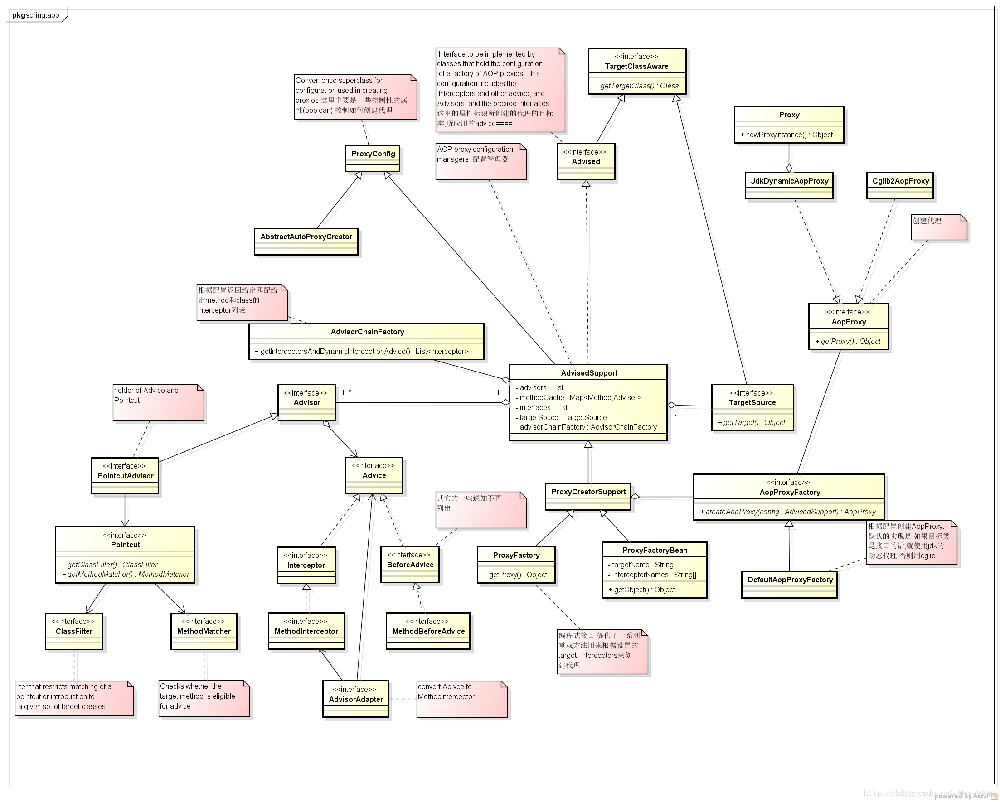
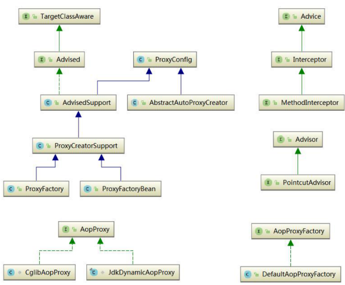
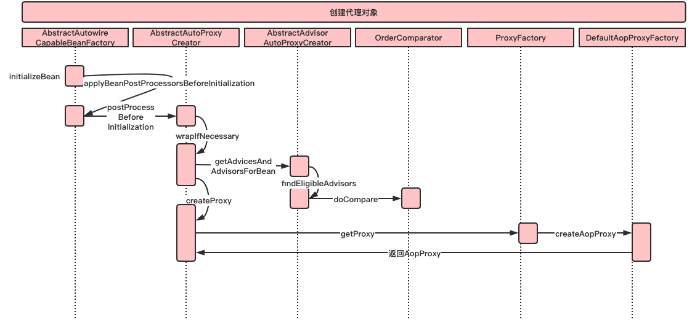
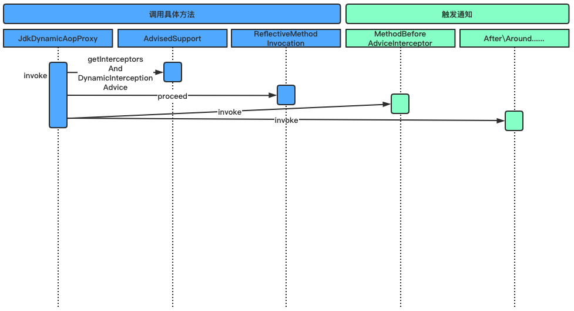

# 1 Spring AOP

## 1.1 Spring AOP 应用场景

AOP是OOP的延续，是 `Aspect Oriented Programming` 的缩写，意思是`面向切面编程`。可以通过预编译方式和运行期动态代理实现在不修改源代码的情况下给程序动态统一添加功能的一种技术。AOP实际是GoF设计模式的延续，设计模式孜孜不倦追求的是调用者和被调用者之间的解耦，AOP可以说也是这种目标的一种实现。 现在做的一些非业务，如：日志、事务、安全等都会写在业务代码中(也即是说，这些非业务类横切于业务类)，但这些代码往往是重复，复制——粘贴式的代码会给程序的维护带来不便，AOP就实现了把这些业务需求与系统需求分开来做。这种解决的方式也称代理机制。AOP的核心构造是切面，它将那些影响多个类的行为(有一定的规则，可以单独把一定规律的规则单独分离出来)封装到可重用的模块中。

## 1.2 AOP 中必须明白的几个概念

### 切面(Aspect)

`切面(Aspect)` 官方的抽象定义为“一个关注点的模块化，这个关注点可能会横切多个对象”。“切面"在ApplicationContext中`<aop:aspect>`来配置。 

`连接点(Joinpoint) ` 程序执行过程中的某一行为，例如，UserService .get 的调用或者 UserService.delete 抛出异常等行为。 

### 通知(Advice)

`通知(Advice)` “切面对于某个“连接点"所产生的动作，例如，TestAspect 中对com spring.service包下所有类的方法进行日志记录的动作就是一个 Advice。其中，一个“切面”可以包含多个“Advice",例如ServiceAspect。

### 切入点(Pointcut)

`切入点(Pointcut) ` 匹配连接点的断言，在AOP中通知和一个切入点表达式关联。`切面中所有通知所关注的连接点，都由切入点表达式execution(* com spring service. *.* (. ))来决定`。 

### 目标对象(Target Object)

`目标对象(Target Object)` 被一个或者多个切面所通知的对象。例如，AServcieImpl 和BServiceImpl，当然在实际运行时，Spring AOP采用代理实现，实际AOP操作的是TargetObject的代理对象。

### AOP代理(AOP Proxy)

`AOP代理(AOP Proxy)` 在Spring AOP中有两种代理方式,JDK动态代理和CGLIB代理。默认情祝下, TargetObject实现了接口时，则采用JDK动态代理，例如，AServiceImpl; 反之，采用CGLIB代理，例如，BServiceImplo 强制使用CGLIB代理需要将`<aop.config>` 的`proxy-target-class` 属性设为true。 

`织入` 把切面连接到其他的应用程序或对象上，并创建一个被通知的对象，分为：编译时织入，类加载时织入，执行时织入(Spring AOP利用的是运行时织入)。

### 通知(Advice) 类型

`前置通知(Beforeadvice)` 在某连接点(JoinPoint)之前执行的通知，但这个通知不能阻止连接点前的执行。ApplicationContext中在`<aop:aspect>`里面使用`<aop:before>`元素进行声明。例如，TestAspect 中的doBefore方法。 

`后置通知(After advice)` 当某连接点退出的时候执行的通知(不论是正常返回还是异常退出)。ApplicationContext中在`<aop:aspect>`里面使用`<aop:affter>`元素进行声明。例如，ServiceAspect 中的returnAfter方法，所以Teser.中调用UserService. delete抛出异常时，returnAfter 方法仍然执行。. 

`返回后通知(Afterreturnadvice)` 在某连接点正常完成后执行的通知，不包括抛出异常的情祝。ApplicationContext中在`<aop:aspect>`里面使用`<after-returning>`元素进行声明。 

`环绕通知(Around advice)` 包围一个连接点的通知，类似Web中Servlet规范中的Filter的doFilter 方法。可以在方法的调用前后完成自定义的行为，也可以选择不执行。ApplicationContext 中在`<aop:aspect>`里面使用`<aop:around>`元素进行声明。例如，ServiceAspect 中的around方法。 

`抛出异常后通知(After throwing advice)` 在方法抛出异常退出时执行的通知。ApplicationContext中在`<aop:aspect>`里面使用`<aop:after-throwing>`元素进行声明。例如，ServiceAspect 中的returnThrow方法。 注:可以将多个通知应用到一个目标对象上，即可以将多个切面织入到同一目标对象。

# 2 Spring AOP 的两种方式

使用 Spring AOP 可以基于两种方式，一种是比较方便和强大的注解方式，另一种则是中规中矩的 xml 配置方式。

## 2.1 注解

使用注解配置SpringAOP总体分为两步，第一步是在xml文件中声明激活自动扫描组件功能，同时激活自动代理功能（来测试AOP的注解功能）：

```xml
<?xml version="1.0" encoding="UTF-8"?>
<beans xmlns="http://www.springframework.org/schema/beans"
   xmlns:xsi="http://www.w3.org/2001/XMLSchema-instance"
   xmlns:aop="http://www.springframework.org/schema/aop"
   xsi:schemaLocation="http://www.springframework.org/schema/beans http://www.springframework.org/schema/beans/spring-beans.xsd http://www.springframework.org/schema/context http://www.springframework.org/schema/context/spring-context.xsd http://www.springframework.org/schema/aop http://www.springframework.org/schema/aop/spring-aop.xsd">
	<!-- 激活组件扫描功能,在包com.spring.aop及其子包下面自动扫描通过注解配置的组件 -->
	<context:component-scan base-package="com.spring"/>
	<!-- 激活自动代理功能 -->
	<aop:aspectj-autoproxy proxy-target-class="true"/>
</beans>
```

第二步是为Aspect切面类型添加注解：

```java
// 声明这个类是被SpringIOC容器来管理的，如果不声明就无法做到自动织入
@Component
// 这个类被声明为是一个需要动态织入到我们的虚拟切面中的类
@Aspect
public class AnnotationAspect {

    private final static Logger logger = Logger.getLogger(AnnotationAspect.class);

    // 声明切点
    // 因为要利用反射机制去读取这个切面中的所有的注解信息
    @Pointcut("execution(* com.spring.aop.service..*(..))")
    public void pointcutConfig(){}

    @Before("pointcutConfig()")
    public void before(JoinPoint joinPoint) {
        logger.info("调用方法之前执行" + joinPoint);
    }

    @After("pointcutConfig()")
    public void after(JoinPoint joinPoint) {
        logger.info("调用方法之后执行" + joinPoint);
    }

    @AfterReturning("pointcutConfig()")
    public void afterReturn(JoinPoint joinPoint) {
        logger.info("调用获得返回值之后执行" + joinPoint);
    }

    @AfterThrowing("pointcutConfig()", throwing="ex")
    public void afterThrow(JoinPoint joinPoint) {
        System.out.println("切点的参数" + Arrays.toString(joinPoint.getArgs()));
        System.out.println("切点的方法" + joinPoint.getKind());
        System.out.println(joinPoint.getSignature());
        // 生成以后的代理对象
        System.out.println(joinPoint.getTarget());
        // 当前类的本身（通过反射机制去调用）
        System.out.println(joinPoint.getThis());

        logger.info("抛出异常之后执行" + joinPoint);
    }
}
@ContextConfiguration(locations = {"classpath*:application-context.xml"})
@RunWith(SpringJUnit4ClassRunner.class)
public class MemberManagerServiceTest {

    @Autowired
    MemberManagerService memberManagerService;

    @Test
    @Ignore
    public void testAdd() {
        memberManagerService.add(null);
    }

    // 做事务代理的时候
    // TransactionManage来管理事务操作（切面）
    // DataSource,SessionFactory
    // DataSource包含了链接信息，事物的提交或回滚一些基础功能
    // 通过连接点是可以获得到方法（切点）具体操作哪个DataSource
    // 通过切面通知类型，去执行DataSource的功能方法
    @Test
    public void testRemove() {
        try {
            memberManagerService.remove(0);
        } catch (Exception e) {
            //e.printStackTrace();
        }
    }

    public void testModify() {
        memberManagerService.modify(null);
    }

    public void testQuery() {
        memberManagerService.query("");
    }

}
```

可以看到，虽然并没有对MemberService类包括其调用方式做任何改变，但是 Spring 仍然拦截到了其中方法的调用。

## 2.2 XML配置方式

```xml
<beans xmlns="http://www.springframework.org/schema/beans"
        xmlns:tx="http://www.springframework.org/schema/tx"
        xmlns:aop="http://www.springframework.org/schema/aop"
        xmlns:xsi="http://www.w3.org/2001/XMLSchema-instance"
        xsi:schemaLocation="http://www.springframework.org/schema/beans
        http://www.springframework.org/schema/beans/spring-beans-3.0.xsd
        http://www.springframework.org/schema/tx
        http://www.springframework.org/schema/tx/spring-tx-3.0.xsd
        http://www.springframework.org/schema/aop
        http://www.springframework.org/schema/aop/spring-aop-3.0.xsd">
    <!-- 声明一个需要织入到虚拟切面的逻辑 -->
    <bean id="logAspect" class="com.spring.aop.aspect.LogAspect">

    </bean>

    <aop:config>
        <aop:aspect ref="logAspect">
            <!-- 切点，具体的方法声明 -->
            <aop:pointcut id="logPointcut" expression="execution(* com.spring.aop.service..*(..))"/>
            <aop:before method="before" pointcut-ref="logPointcut"/>
            <aop:after-returning method="afterReturn" pointcut-ref="logPointcut"/>
            <aop:after method="after" pointcut-ref="logPointcut"/>
            <aop:after-throwing method="afterThrow" pointcut-ref="logPointcut"/>
        </aop:aspect>
    </aop:config>
</beans>
```

个人觉得不如注解灵活和强大，你可以不同意这个观点，但是不知道如下的代码会不会让你的想法有所改善：

```java
//配置切入点,该方法无方法体,主要为方便同类中其他方法使用此处配置的切入点
@Pointcut("execution(* com.spring.aop.service..*(..))")
public void aspect(){ }

//配置前置通知,拦截返回值为com.spring.aop.bean.User的方法
@Before("execution(com.spring.aop.bean.User com.spring.aop.service..*(..))")
public void beforeReturnUser(JoinPoint joinPoint){
    log.info("beforeReturnUser " + joinPoint);
}

//配置前置通知,拦截参数为com.spring.aop.bean.User的方法
@Before("execution(* com.spring.aop.service..*(com.spring.aop.bean.User))")
public void beforeArgUser(JoinPoint joinPoint){
    log.info("beforeArgUser " + joinPoint);
}

//配置前置通知,拦截含有long类型参数的方法,并将参数值注入到当前方法的形参id中
@Before("aspect()&&args(id)")
public void beforeArgId(JoinPoint joinPoint, long id){
    log.info("beforeArgId " + joinPoint + "\tID:" + id);
}
@Service
public class MemberManagerService {

    private final static Logger logger = Logger.getLogger(MemberManagerService.class);

    public void add(Member member) {
        logger.info("增加用户");
    }

    public boolean remove(long id) throws Exception {
        logger.info("删除用户");
        throw new Exception("这是自己抛出来的异常");
    }

    public boolean modify(Member member) {
        logger.info("修改用户");
        return true;
    }

    public boolean query(String loginName) {
        logger.info("查询用户");
        return true;
    }
}
```

## 2.3 切入点表达式的配置规则

应该说学习 Spring AOP 有两个难点，第一点在于理解 AOP 的理念和相关概念，第二点在于灵活掌握 和使用切入点表达式。概念的理解通常不在一朝一夕，慢慢浸泡的时间长了，自然就明白了，下面我们简单地介绍一下切入点表达式的配置规则吧。 

通常情况下，表达式中使用”execution“就可以满足大部分的要求。表达式格式如下：

```java
execution(modifiers-pattern? ret-type-pattern declaring-type-pattern? name-pattern(param-pattern) throws-pattern?
```

- modifiers-pattern：方法的操作权限 
- ret-type-pattern：返回值 
- declaring-type-pattern：方法所在的包 
- name-pattern：方法名 
- parm-pattern：参数名 
- throws-pattern：异常

其中，除 ret-type-pattern 和 name-pattern 之外，其他都是可选的。上例中，execution(* com.spring.aop.service…*(…))表示 com.spring.aop.service 包下，返回值为任意类型；方法名任意；参数不作限制的所有方法。

## 2.4 通知参数

可以通过args来绑定参数，这样就可以在通知（Advice）中访问具体参数了。例如，`<aop:aspect>`配置如下：

```xml
<aop:config>
    <aop:aspect ref="xmlAspect">
        <aop:pointcut id="simplePointcut" expression="execution(* com.spring.aop.service..*(..)) and args(msg,..)"/>
        <aop:after pointcut-ref=" simplePointcut" Method="after"/>
    </aop:aspect>
</aop:config>
```

上面的代码args(msg,…)是指将切入点方法上的第一个String类型参数添加到参数名为msg的通知的入参上，这样就可以直接使用该参数啦。

## 2.5 访问当前的连接点

在上面的Aspect切面Bean中已经看到了，每个通知方法第一个参数都是JoinPoint。其实，在Spring中，任何通知（Advice）方法都可以将第一个参数定义为org.aspectj.lang.JoinPoint类型用以接受当前连接点对象。JoinPoint接口提供了一系列有用的方法，比如getArgs()（返回方法参数）、getThis()（返回代理对象）、getTarget()（返回目标）、getSignature()（返回正在被通知的方法相关信息）和toString()（打印出正在被通知的方法的有用信息）。

# 3 Spring 源码分析

## 3.1 Spring 中主要的 AOP 组件



## 3.2 寻找入口

Spring 的 AOP 是通过接入 BeanPostProcessor 后置处理器开始的，它是 Spring IOC 容器经常使用到的一个特性，这个 Bean 后置处理器是一个监听器，可以监听容器触发的 Bean 声明周期事件。后置处理器向容器注册以后，容器中管理的 Bean 就具备了接收 IOC 容器事件回调的能力。 

BeanPostProcessor 的使用非常简单，只需要提供一个实现接口 BeanPostProcessor 的实现类，然后在 Bean 的配置文件中设置即可。

**1、BeanPostProcessor 源码**

```java
public interface BeanPostProcessor {

	//为在Bean的初始化前提供回调入口
	@Nullable
	default Object postProcessBeforeInitialization(Object bean, String beanName) throws BeansException {
		return bean;
	}

	//为在Bean的初始化之后提供回调入口
	@Nullable
	default Object postProcessAfterInitialization(Object bean, String beanName) throws BeansException {
		return bean;
	}

}
```

这两个回调的入口都是和容器管理的 Bean 的生命周期事件紧密相关，可以为用户提供在 Spring IOC 容器初始化 Bean 过程中自定义的处理操作。 

**2、AbstractAutowireCapableBeanFactory 类对容器生成的 Bean 添加后置处理器** 

BeanPostProcessor 后置处理器的调用发生在 Spring IOC 容器完成对 Bean 实例对象的创建和属性的依赖注入完成之后，在对Spring依赖注入的源码分析过程中我们知道，当应用程序第一次调用 getBean() 方法(lazy-init 预实例化除外)向 Spring IOC 容器索取指定 Bean 时触发 Spring IOC 容器创建 Bean 实例对象并进行依赖注入的过程，其中真正实现创建 Bean 对象并进行依赖注入的方法是 AbstractAutowireCapableBeanFactory 类的 doCreateBean()方法，主要源码如下：

```java
protected Object doCreateBean(final String beanName, final RootBeanDefinition mbd, final @Nullable Object[] args)
		throws BeanCreationException {
	// 创建 Bean 实例对象
  ...
	Object exposedObject = bean;
	try {
		//将Bean实例对象封装，并且Bean定义中配置的属性值赋值给实例对象
		populateBean(beanName, mbd, instanceWrapper);
		//初始化Bean对象
		exposedObject = initializeBean(beanName, exposedObject, mbd);
	}
	catch (Throwable ex) {
		if (ex instanceof BeanCreationException && beanName.equals(((BeanCreationException) ex).getBeanName())) {
			throw (BeanCreationException) ex;
		}
		else {
			throw new BeanCreationException(
					mbd.getResourceDescription(), beanName, "Initialization of bean failed", ex);
		}
	}
	...
	return exposedObject;
}
```

从上面的代码中我们知道，为 Bean 实例对象添加 BeanPostProcessor 后置处理器的入口的是 initializeBean()方法。

**3、initializeBean()方法为容器产生的 Bean 实例对象添加 BeanPostProcessor 后置处理器**

同样在 AbstractAutowireCapableBeanFactory 类中，initializeBean()方法实现为容器创建的 Bean 实例对象添加 BeanPostProcessor 后置处理器，源码如下： 

```java
//初始容器创建的Bean实例对象，为其添加BeanPostProcessor后置处理器
protected Object initializeBean(final String beanName, final Object bean, @Nullable RootBeanDefinition mbd) {
	//JDK的安全机制验证权限
	if (System.getSecurityManager() != null) {
		//实现PrivilegedAction接口的匿名内部类
		AccessController.doPrivileged((PrivilegedAction<Object>) () -> {
			invokeAwareMethods(beanName, bean);
			return null;
		}, getAccessControlContext());
	}
	else {
		//为Bean实例对象包装相关属性，如名称，类加载器，所属容器等信息
		invokeAwareMethods(beanName, bean);
	}
	Object wrappedBean = bean;
	//对BeanPostProcessor后置处理器的postProcessBeforeInitialization
	//回调方法的调用，为Bean实例初始化前做一些处理
	if (mbd == null || !mbd.isSynthetic()) {
		wrappedBean = applyBeanPostProcessorsBeforeInitialization(wrappedBean, beanName);
	}
	//调用Bean实例对象初始化的方法，这个初始化方法是在Spring Bean定义配置
	//文件中通过init-method属性指定的
	try {
		invokeInitMethods(beanName, wrappedBean, mbd);
	}
	catch (Throwable ex) {
		throw new BeanCreationException(
				(mbd != null ? mbd.getResourceDescription() : null),
				beanName, "Invocation of init method failed", ex);
	}
	//对BeanPostProcessor后置处理器的postProcessAfterInitialization
	//回调方法的调用，为Bean实例初始化之后做一些处理
	if (mbd == null || !mbd.isSynthetic()) {
		wrappedBean = applyBeanPostProcessorsAfterInitialization(wrappedBean, beanName);
	}
	return wrappedBean;
}
@Override
//调用BeanPostProcessor后置处理器实例对象初始化之前的处理方法
public Object applyBeanPostProcessorsBeforeInitialization(Object existingBean, String beanName)
		throws BeansException {
	Object result = existingBean;
	//遍历容器为所创建的Bean添加的所有BeanPostProcessor后置处理器
	for (BeanPostProcessor beanProcessor : getBeanPostProcessors()) {
		//调用Bean实例所有的后置处理中的初始化前处理方法，为Bean实例对象在
		//初始化之前做一些自定义的处理操作
		Object current = beanProcessor.postProcessBeforeInitialization(result, beanName);
		if (current == null) {
			return result;
		}
		result = current;
	}
	return result;
}
@Override
//调用BeanPostProcessor后置处理器实例对象初始化之后的处理方法
public Object applyBeanPostProcessorsAfterInitialization(Object existingBean, String beanName)
		throws BeansException {
	Object result = existingBean;
	//遍历容器为所创建的Bean添加的所有BeanPostProcessor后置处理器
	for (BeanPostProcessor beanProcessor : getBeanPostProcessors()) {
		//调用Bean实例所有的后置处理中的初始化后处理方法，为Bean实例对象在
		//初始化之后做一些自定义的处理操作
		Object current = beanProcessor.postProcessAfterInitialization(result, beanName);
		if (current == null) {
			return result;
		}
		result = current;
	}
	return result;
}
```

BeanPostProcessor 是一个接口，其初始化前的操作方法和初始化后的操作方法均委托其实现子类来实现，在 Spring 中，BeanPostProcessor 的实现子类非常的多，分别完成不同的操作，如：AOP 面向切面编程的注册通知适配器、Bean 对象的数据校验、Bean 继承属性、方法的合并等等，我们以最简单的 AOP 切面织入来简单了解其主要的功能。下面我们来分析其中一个创建 AOP 代理对象的子类 AbstractAutoProxyCreator 类。该类重写了 postProcessAfterInitialization()方法。

## 3.3 选择代理策略

进入 postProcessAfterInitialization()方法，我们发现调到了一个非常核心的方法 wrapIfNecessary()， 其源码如下： 

```java
@Override
public Object postProcessAfterInitialization(@Nullable Object bean, String beanName) throws BeansException {
	if (bean != null) {
		Object cacheKey = getCacheKey(bean.getClass(), beanName);
		if (!this.earlyProxyReferences.contains(cacheKey)) {
			return wrapIfNecessary(bean, beanName, cacheKey);
		}
	}
	return bean;
}
protected Object wrapIfNecessary(Object bean, String beanName, Object cacheKey) {
	if (StringUtils.hasLength(beanName) && this.targetSourcedBeans.contains(beanName)) {
		return bean;
	}
	if (Boolean.FALSE.equals(this.advisedBeans.get(cacheKey))) {
		return bean;
	}
	if (isInfrastructureClass(bean.getClass()) || shouldSkip(bean.getClass(), beanName)) {
		this.advisedBeans.put(cacheKey, Boolean.FALSE);
		return bean;
	}
	// Create proxy if we have advice.
	Object[] specificInterceptors = getAdvicesAndAdvisorsForBean(bean.getClass(), beanName, null);
	if (specificInterceptors != DO_NOT_PROXY) {
		this.advisedBeans.put(cacheKey, Boolean.TRUE);
		Object proxy = createProxy(
				bean.getClass(), beanName, specificInterceptors, new SingletonTargetSource(bean));
		this.proxyTypes.put(cacheKey, proxy.getClass());
		return proxy;
	}
	this.advisedBeans.put(cacheKey, Boolean.FALSE);
	return bean;
}
protected Object createProxy(Class<?> beanClass, @Nullable String beanName,
		@Nullable Object[] specificInterceptors, TargetSource targetSource) {
	if (this.beanFactory instanceof ConfigurableListableBeanFactory) {
		AutoProxyUtils.exposeTargetClass((ConfigurableListableBeanFactory) this.beanFactory, beanName, beanClass);
	}
	ProxyFactory proxyFactory = new ProxyFactory();
	proxyFactory.copyFrom(this);
	if (!proxyFactory.isProxyTargetClass()) {
		if (shouldProxyTargetClass(beanClass, beanName)) {
			proxyFactory.setProxyTargetClass(true);
		}
		else {
			evaluateProxyInterfaces(beanClass, proxyFactory);
		}
	}
	Advisor[] advisors = buildAdvisors(beanName, specificInterceptors);
	proxyFactory.addAdvisors(advisors);
	proxyFactory.setTargetSource(targetSource);
	customizeProxyFactory(proxyFactory);
	proxyFactory.setFrozen(this.freezeProxy);
	if (advisorsPreFiltered()) {
		proxyFactory.setPreFiltered(true);
	}
	return proxyFactory.getProxy(getProxyClassLoader());
}
```

整个过程跟下来，我发现最终调用的是 proxyFactory.getProxy()方法。到这里我们大概能够猜到 proxyFactory 有 JDK 和 CGLib 的，那么我们该如何选择呢？最终调用的是 DefaultAopProxyFactory 的 createAopProxy()方法： 

```java
public class DefaultAopProxyFactory implements AopProxyFactory, Serializable {

	@Override
	public AopProxy createAopProxy(AdvisedSupport config) throws AopConfigException {
        // hasNoUserSuppliedProxyInterfaces(字面意思：没有用户提供的代理接口) 判断有无实现接口
        // config.isProxyTargetClass() 是否强制使用 CGLIB 代理
		if (config.isOptimize() || config.isProxyTargetClass() || hasNoUserSuppliedProxyInterfaces(config)) {
			Class<?> targetClass = config.getTargetClass();
			if (targetClass == null) {
				throw new AopConfigException("TargetSource cannot determine target class: " +
						"Either an interface or a target is required for proxy creation.");
			}
			if (targetClass.isInterface() || Proxy.isProxyClass(targetClass)) {
				return new JdkDynamicAopProxy(config);
			}
			return new ObjenesisCglibAopProxy(config);
		}
		else {
			return new JdkDynamicAopProxy(config);
		}
	}

	private boolean hasNoUserSuppliedProxyInterfaces(AdvisedSupport config) {
		Class<?>[] ifcs = config.getProxiedInterfaces();
		return (ifcs.length == 0 || (ifcs.length == 1 && SpringProxy.class.isAssignableFrom(ifcs[0])));
	}

}
```

> 如果希望强制使用 CGLIB 代理，需要考虑其无法通知被代理类的 final 方法，因为它们不能被覆写。
>
> ```xml
> <aop:config proxy-target-class="true">...</aop:config>
> ```

## 3.4 调用代理方法

分析调用逻辑之前先上类图，看看 Spring 中主要的 AOP 组件： 



Spring提供了两种方式生成代理对象：JDKProxy和CGLib，具体使用哪种方式生成由AopProxyFactory根据AdvisedSupport对象的配置来决定。`默认的策略是如果被代理的目标对象实现了至少一个接口，则使用JDK动态代理技术(所有该目标对象实现的接口都将被代理)，否则使用CGLib来生成代理`。下面研究Spring如何使用JDK来生成代理对象，具体生成代码在JdkDynamicAopProxy这个类中：

```java
/**
 * 获取代理类要实现的接口，除了Advised对象中配置的，还会加上SpringProxy，Advised（opaque=false）
 * 检查上面得到的接口中有没有定义equals或hashcode的接口
 * 调用Proxy.newProxyInstance创建代理对象
 */
public Object getProxy(ClassLoader classLoader) {
   if (logger.isDebugEnabled()) {
      logger.debug("Creating JDK dynamic proxy: target source is " + this.advised.getTargetSource());
   }
   Class[] proxiedInterfaces = AopProxyUtils.completeProxiedInterfaces(this.advised);
   findDefinedEqualsAndHashCodeMethods(proxiedInterfaces);
   return Proxy.newProxyInstance(classLoader, proxiedInterfaces, this);
}
```

通过注释我们应该已经看得非常明白代理对象的生成过程，此处不再赘述。下面的问题是，代理对象生成了，那切面是如何织入的？ 

InvocationHandler是JDK动态代理的核心，生成的代理对象的方法调用都会委托到InvocationHandler.invoke()方法。通过JdkDynamicAopProxy的签名可以看到这个类也实现了InvocationHandler，下面通过分析这个类中实现的invoke()方法具体来看下Spring AOP是如何织入切面的：

```java
public Object invoke(Object proxy, Method method, Object[] args) throws Throwable {
   MethodInvocation invocation;
   Object oldProxy = null;
   boolean setProxyContext = false;

   TargetSource targetSource = this.advised.targetSource;
   Class targetClass = null;
   Object target = null;

   try {
      // equals()方法，具目标对象未实现此方法
      if (!this.equalsDefined && AopUtils.isEqualsMethod(method)) {
         // The target does not implement the equals(Object) method itself.
         return equals(args[0]);
      }
      // hashCode()方法，具目标对象未实现此方法
      if (!this.hashCodeDefined && AopUtils.isHashCodeMethod(method)) {
         // The target does not implement the hashCode() method itself.
         return hashCode();
      }
      // Advised接口或其父接口中定义的方法，直接反射调用，不应用通知
      if (!this.advised.opaque && method.getDeclaringClass().isInterface() &&
            method.getDeclaringClass().isAssignableFrom(Advised.class)) {
         // Service invocations on ProxyConfig with the proxy config...
         return AopUtils.invokeJoinpointUsingReflection(this.advised, method, args);
      }

      Object retVal;

      if (this.advised.exposeProxy) {
         // Make invocation available if necessary.
         oldProxy = AopContext.setCurrentProxy(proxy);
         setProxyContext = true;
      }

      // May be null. Get as late as possible to minimize the time we "own" the target,
      // in case it comes from a pool.
      // 获得目标对象的类
      target = targetSource.getTarget();
      if (target != null) {
         targetClass = target.getClass();
      }

      // Get the interception chain for this method.
      // 获取可以应用到此方法上的Interceptor列表
      List<Object> chain = this.advised.getInterceptorsAndDynamicInterceptionAdvice(method, targetClass);

      // Check whether we have any advice. If we don't, we can fallback on direct
      // reflective invocation of the target, and avoid creating a MethodInvocation.
      // 如果没有可以应用到此方法的通知(Interceptor)，此直接反射调用method.invoke(target, args)
      if (chain.isEmpty()) {
         // We can skip creating a MethodInvocation: just invoke the target directly
         // Note that the final invoker must be an InvokerInterceptor so we know it does
         // nothing but a reflective operation on the target, and no hot swapping or fancy proxying.
         retVal = AopUtils.invokeJoinpointUsingReflection(target, method, args);
      }
      else {
         // We need to create a method invocation...
         // 创建MethodInvocation
         invocation = new ReflectiveMethodInvocation(proxy, target, method, args, targetClass, chain);
         // Proceed to the joinpoint through the interceptor chain.
         retVal = invocation.proceed();
      }

      // Massage return value if necessary.
      Class<?> returnType = method.getReturnType();
      if (retVal != null && retVal == target && returnType.isInstance(proxy) &&
            !RawTargetAccess.class.isAssignableFrom(method.getDeclaringClass())) {
         // Special case: it returned "this" and the return type of the method
         // is type-compatible. Note that we can't help if the target sets
         // a reference to itself in another returned object.
         retVal = proxy;
      } else if (retVal == null && returnType != Void.TYPE && returnType.isPrimitive()) {
         throw new AopInvocationException("Null return value from advice does not match primitive return type for: " + method);
      }
      return retVal;
   }
   finally {
      if (target != null && !targetSource.isStatic()) {
         // Must have come from TargetSource.
         targetSource.releaseTarget(target);
      }
      if (setProxyContext) {
         // Restore old proxy.
         AopContext.setCurrentProxy(oldProxy);
      }
   }
}
```

主流程可以简述为：获取可以应用到此方法上的通知链(Interceptor Chain)，如果有，则应用通知，并执行joinpoint；如果没有，则直接反射调用 method.invoke。而这里的关键是`通知链是如何获取的`以及它又是`如何执行`的。 首先，从上面代码可以看到，通知链是`通过 Advised.getInterceptorAndDynamicInterceptionAdvice() 这个方法来获取的`：

```java
public List<Object> getInterceptorsAndDynamicInterceptionAdvice(Method method, Class targetClass) {
   MethodCacheKey cacheKey = new MethodCacheKey(method);
   List<Object> cached = this.methodCache.get(cacheKey);
   if (cached == null) {
      cached = this.advisorChainFactory.getInterceptorsAndDynamicInterceptionAdvice(
            this, method, targetClass);
      this.methodCache.put(cacheKey, cached);
   }
   return cached;
}
```

可以看到，实际工作由AdvisorChainFactory.getInterceptorsAndDynamicInterceptionAdvice()这个方法来完成的，获取得到的结果被缓存。

```java
/**
 * 从提供的配置实例config中获取advisor列表，遍历处理这些advisor。如果是IntroductionAdvisor
 * 则判断此Advisor能够应用到目标类targetClass上，如果是PointcutAdvisor，则判断
 * 此Advisor能否应用到目标方法method上，将满足条件的Advisor通过AdvisorAdaptor转化成Interceptor列表返回
 */
public List<Object> getInterceptorsAndDynamicInterceptionAdvice(
      Advised config, Method method, Class targetClass) {

   // This is somewhat tricky... we have to process introductions first,
   // but we need to preserve order in the ultimate list.
   List<Object> interceptorList = new ArrayList<Object>(config.getAdvisors().length);
   // 查看是否包含IntroductionAdvisor
   boolean hasIntroductions = hasMatchingIntroductions(config, targetClass);
   // 这里实际上注册一系列AdvisorAdapter，用于将Advisor转化成MethodInterceptor
   AdvisorAdapterRegistry registry = GlobalAdvisorAdapterRegistry.getInstance();
   for (Advisor advisor : config.getAdvisors()) {
      if (advisor instanceof PointcutAdvisor) {
         // Add it conditionally.
         PointcutAdvisor pointcutAdvisor = (PointcutAdvisor) advisor;
         if (config.isPreFiltered() || pointcutAdvisor.getPointcut().getClassFilter().matches(targetClass)) {
            // 这个地方这两个方法位置可互换下
            // 将Advisor转化成Interceptor
            // MethodInterceptor一定是一个链表结构，要有顺序的
            MethodInterceptor[] interceptors = registry.getInterceptors(advisor);

            // 检查当前advisor的pointcut是否可以匹配当前方法
            MethodMatcher mm = pointcutAdvisor.getPointcut().getMethodMatcher();
            if (MethodMatchers.matches(mm, method, targetClass, hasIntroductions)) {
               if (mm.isRuntime()) {
                  // Creating a new object instance in the getInterceptors() method
                  // isn't a problem as we normally cache created chains.
                  for (MethodInterceptor interceptor : interceptors) {
                     interceptorList.add(new InterceptorAndDynamicMethodMatcher(interceptor, mm));
                  }
               }
               else {
                  interceptorList.addAll(Arrays.asList(interceptors));
               }
            }
         }
      }
      else if (advisor instanceof IntroductionAdvisor) {
         IntroductionAdvisor ia = (IntroductionAdvisor) advisor;
         if (config.isPreFiltered() || ia.getClassFilter().matches(targetClass)) {
            Interceptor[] interceptors = registry.getInterceptors(advisor);
            interceptorList.addAll(Arrays.asList(interceptors));
         }
      }
      else {
         Interceptor[] interceptors = registry.getInterceptors(advisor);
         interceptorList.addAll(Arrays.asList(interceptors));
      }
   }
   return interceptorList;
}
```

这个方法执行完后，Advised中配置能够应用到连接点或目标类的Advisor全部被转换成了MethodInterceptor，接下来看一下连接器链是怎么起作用的：

```java
......
// Check whether we have any advice. If we don't, we can fallback on direct
// reflective invocation of the target, and avoid creating a MethodInvocation.
// 如果没有可以应用到此方法的通知(Interceptor)，此直接反射调用method.invoke(target, args)
if (chain.isEmpty()) {
   // We can skip creating a MethodInvocation: just invoke the target directly
   // Note that the final invoker must be an InvokerInterceptor so we know it does
   // nothing but a reflective operation on the target, and no hot swapping or fancy proxying.
   retVal = AopUtils.invokeJoinpointUsingReflection(target, method, args);
}
else {
   // We need to create a method invocation...
   // 创建MethodInvocation
   invocation = new ReflectiveMethodInvocation(proxy, target, method, args, targetClass, chain);
   // Proceed to the joinpoint through the interceptor chain.
   retVal = invocation.proceed();
}
......
```

从这段代码可以看出，如果得到的拦截器链为空，则直接反射调用目标方法，否则创建MethodInvocation，调用其proceed方法，触发拦截器链的执行：

```java
public Object proceed() throws Throwable {
   // We start with an index of -1 and increment early.
   // 如果Interceptor执行完了，则执行joinPoint
   if (this.currentInterceptorIndex == this.interceptorsAndDynamicMethodMatchers.size() - 1) {
      return invokeJoinpoint();
   }

   Object interceptorOrInterceptionAdvice =
         this.interceptorsAndDynamicMethodMatchers.get(++this.currentInterceptorIndex);
   // 如果要动态匹配joinPoint
   if (interceptorOrInterceptionAdvice instanceof InterceptorAndDynamicMethodMatcher) {
      // Evaluate dynamic method matcher here: static part will already have
      // been evaluated and found to match.
      InterceptorAndDynamicMethodMatcher dm =
            (InterceptorAndDynamicMethodMatcher) interceptorOrInterceptionAdvice;
      // 动态匹配，运行时参数是否满足匹配条件
      if (dm.methodMatcher.matches(this.method, this.targetClass, this.arguments)) {
         // 执行当前Interceptor
         return dm.interceptor.invoke(this);
      }
      else {
         // Dynamic matching failed.
         // Skip this interceptor and invoke the next in the chain.
         // 动态匹配失败时，略过当前Interceptor，调用下一个Interceptor
         return proceed();
      }
   }
   else {
      // It's an interceptor, so we just invoke it: The pointcut will have
      // been evaluated statically before this object was constructed.
      // 执行当前Interceptor
      return ((MethodInterceptor) interceptorOrInterceptionAdvice).invoke(this);
   }
}
```

至此，通知链就完美地形成了。我们再往下来看 invokeJoinpointUsingReflection()方法，其实就是反射调用：

```java
@Nullable
public static Object invokeJoinpointUsingReflection(@Nullable Object target, Method method, Object[] args)
		throws Throwable {
	// Use reflection to invoke the method.
	try {
		ReflectionUtils.makeAccessible(method);
		return method.invoke(target, args);
	}
	catch (InvocationTargetException ex) {
		// Invoked method threw a checked exception.
		// We must rethrow it. The client won't see the interceptor.
		throw ex.getTargetException();
	}
	catch (IllegalArgumentException ex) {
		throw new AopInvocationException("AOP configuration seems to be invalid: tried calling method [" +
				method + "] on target [" + target + "]", ex);
	}
	catch (IllegalAccessException ex) {
		throw new AopInvocationException("Could not access method [" + method + "]", ex);
	}
}
```

Spring AOP 源码就分析到这儿，相信小伙伴们应该有了基本思路，下面时序图来一波。 





## 3.5 触发通知

在为 AopProxy 代理对象配置拦截器的实现中，有一个取得拦截器的配置过程，这个过程是由 DefaultAdvisorChainFactory 实现的，这个工厂类负责`生成拦截器链`，在它的 getInterceptorsAndDynamicInterceptionAdvice 方法中，有一个适配器和注册过程，通过配置 Spring 预先设计好的拦截器，Spring 加入了它对 AOP 实现的处理。

```java
public List<Object> getInterceptorsAndDynamicInterceptionAdvice(
      Advised config, Method method, Class targetClass) {

   // This is somewhat tricky... we have to process introductions first,
   // but we need to preserve order in the ultimate list.
   List<Object> interceptorList = new ArrayList<Object>(config.getAdvisors().length);
   // 查看是否包含IntroductionAdvisor
   boolean hasIntroductions = hasMatchingIntroductions(config, targetClass);
   // 这里实际上注册一系列AdvisorAdapter，用于将Advisor转化成MethodInterceptor
   AdvisorAdapterRegistry registry = GlobalAdvisorAdapterRegistry.getInstance();
   for (Advisor advisor : config.getAdvisors()) {
    ...
   }     
   return interceptorList;
}
```

GlobalAdvisorAdapterRegistry 负责拦截器的适配和注册过程。 

```java
public abstract class GlobalAdvisorAdapterRegistry {
	/**
	 * Keep track of a single instance so we can return it to classes that request it.
	 */
	private static AdvisorAdapterRegistry instance = new DefaultAdvisorAdapterRegistry();
	/**
	 * Return the singleton {@link DefaultAdvisorAdapterRegistry} instance.
	 */
	public static AdvisorAdapterRegistry getInstance() {
		return instance;
	}
	/**
	 * Reset the singleton {@link DefaultAdvisorAdapterRegistry}, removing any
	 * {@link AdvisorAdapterRegistry#registerAdvisorAdapter(AdvisorAdapter) registered}
	 * adapters.
	 */
	static void reset() {
		instance = new DefaultAdvisorAdapterRegistry();
	}
}
```

而 GlobalAdvisorAdapterRegistry 起到了适配器和单例模式的作用，提供了一个 `DefaultAdvisorAdapterRegistry`，它用来`完成各种通知的适配和注册过程`。 

```java
public class DefaultAdvisorAdapterRegistry implements AdvisorAdapterRegistry, Serializable {
	private final List<AdvisorAdapter> adapters = new ArrayList<>(3);

	/**
	 * Create a new DefaultAdvisorAdapterRegistry, registering well-known adapters.
	 */
	public DefaultAdvisorAdapterRegistry() {
		registerAdvisorAdapter(new MethodBeforeAdviceAdapter());
		registerAdvisorAdapter(new AfterReturningAdviceAdapter());
        // 暂未有实现
		registerAdvisorAdapter(new ThrowsAdviceAdapter());
	}

	@Override
	public MethodInterceptor[] getInterceptors(Advisor advisor) throws UnknownAdviceTypeException {
		List<MethodInterceptor> interceptors = new ArrayList<>(3);
		Advice advice = advisor.getAdvice();
		if (advice instanceof MethodInterceptor) {
			interceptors.add((MethodInterceptor) advice);
		}
		for (AdvisorAdapter adapter : this.adapters) {
			if (adapter.supportsAdvice(advice)) {
				interceptors.add(adapter.getInterceptor(advisor));
			}
		}
		if (interceptors.isEmpty()) {
			throw new UnknownAdviceTypeException(advisor.getAdvice());
		}
		return interceptors.toArray(new MethodInterceptor[interceptors.size()]);
	}

	@Override
	public void registerAdvisorAdapter(AdvisorAdapter adapter) {
		this.adapters.add(adapter);
	}
}
```

DefaultAdvisorAdapterRegistry 设置了一系列的是配置，正是这些适配器的实现，为 Spring AOP 提供了编织能力。下面以 MethodBeforeAdviceAdapter 为例，看具体的实现：

```java
class MethodBeforeAdviceAdapter implements AdvisorAdapter, Serializable {

	@Override
	public boolean supportsAdvice(Advice advice) {
		return (advice instanceof MethodBeforeAdvice);
	}

	@Override
	public MethodInterceptor getInterceptor(Advisor advisor) {
		MethodBeforeAdvice advice = (MethodBeforeAdvice) advisor.getAdvice();
		return new MethodBeforeAdviceInterceptor(advice);
	}

}
```

Spring AOP 为了实现 advice 的织入，设计了特定的拦截器对这些功能进行了封装。我们接着看 MethodBeforeAdviceInterceptor 如何完成封装的？ 

```java
public class MethodBeforeAdviceInterceptor implements MethodInterceptor, Serializable {

	private MethodBeforeAdvice advice;


	/**
	 * Create a new MethodBeforeAdviceInterceptor for the given advice.
	 * @param advice the MethodBeforeAdvice to wrap
	 */
	public MethodBeforeAdviceInterceptor(MethodBeforeAdvice advice) {
		Assert.notNull(advice, "Advice must not be null");
		this.advice = advice;
	}

	@Override
	public Object invoke(MethodInvocation mi) throws Throwable {
		this.advice.before(mi.getMethod(), mi.getArguments(), mi.getThis() );
		return mi.proceed();
	}

}
```

可以看到，invoke 方法中，首先触发了 advice 的 `before 回调`，然后才是 proceed。proceed() 方法调用的还是 ReflectiveMethodInvocation，此时所有的 interceptor 遍历完毕，`执行 invokeJoinpoint() 方法`：

```java
protected Object invokeJoinpoint() throws Throwable {
    // 与 Interceptor 链为空时执行方法一致，即调用反射执行原始方法
   return AopUtils.invokeJoinpointUsingReflection(this.target, this.method, this.arguments);
}
```

执行完 invokeJoinpoint() 返回，同时 MethodBeforeAdviceInterceptor 的 invoke 方法也返回，该 invoke 方法是由 ReflectiveMethodInvocation 的遍历 Interceptor 链调用，上一层为 AspectJAfterAdvice invoke 方法：

```java
public Object invoke(MethodInvocation mi) throws Throwable {
   try {
      return mi.proceed();
   }
   finally {
       // mi.proceed() 返回后，invokeAdviceMethod 会触发了 advice 的 after 回调
       // 以此类推，向上推论
      invokeAdviceMethod(getJoinPointMatch(), null, null);
   }
}
```

至此，我们知道了对目标对象的增强是`通过拦截器实现`的。

------

