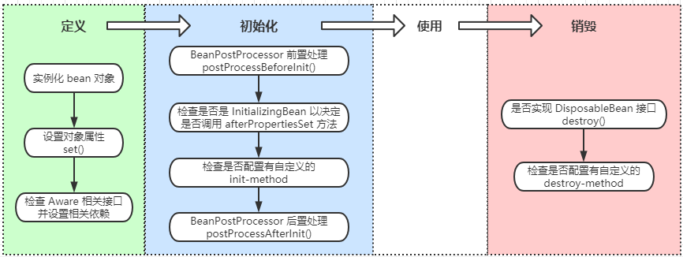

# Bean管理的注解实现


类的自动检测与注册Bean

```xml
<!--通过在基于xml的Spring排至如下标签(请注意包含上下文命名空间)-->
<context:annotation-config/>
```

``context:annotation-config``，仅会查找在同一个applicationContext的bean注解，为了能够检测这些类并注册相应的bean，需要下面内容：

```xml
<context:component-scan base-package="com.spring"></context:component-scan>
```

``context:annotation-scan``包含``context:annotation-config``，通常在使用前者后，不在使用后者AutowiredAnnotationBeanPostProcessor和CommonAnnotationBeanPostProcessor也被包含进来。 点击前往： [context:component-scan标签详解](https://blog.csdn.net/wszcy199503/article/details/78900208)

Spring 的定义及作用于的注解实现： 从 Spring3.0 开始，SpringJavaConfig 项目提供了很多特性，包括使用 java 而不是 xml 定义bean，比如``@Configuration``，``@bean``，``@import``，``@DependsOn`` ``@Componnent`` 是一个通用注解，可用于任何bean。 ``@Repository``，``@Service``，``@Controller`` 是更有针对性的注解

- @Repository 通用于注解DAO类，即持久层 
- @Service 通用于注解Service，即服务层 
- @Controller 通用于Controller类，即控制层(MVC)

```java
@Repository
public class UserDao {

    public void save(String name) {
        System.out.println("保存用户：" + name);
    }

}
public interface UserService {

    void insertUser(String name);

}
@Service
public class UserServiceImpl implements UserService {

    @Autowired
    private UserDao userDao;

    @Override
    public void insertUser(String name) {
        userDao.save(name);
    }
}
@ContextConfiguration(locations = {"classpath*:application-context.xml"})
@RunWith(SpringJUnit4ClassRunner.class)
public class UserServiceTest {

    @Autowired
    private UserService userService;

    @Test
    public void insert() {
        userService.insertUser("Tom");
    }

}
```

## @Required

这个注解仅仅表示，受影响的bean属性必须在配置时被填充，通过在bean定义或者通过自动装配一个明确的属性值

```java
public class SimpleMovieLister{
	private MovieFinder movieFinder;
	
	@Required
	public void setMovieFinder(MovieFinder movieFinder){
		this.movieFinder = movieFinder;
	}
}
```

## @Autowired

1.可以将@Autowired注解为“传统”的setter方法

```java
priavte MovieFinder movieFinder;
@Autowired
public void setMovieFind (MovieFinder movieFinder){
    // 普通的setter方法是将传入的参数赋给相应的属性，和直接autowired效果一样,但是也有一些情况会在set方法里面写一些处理逻辑，这是就需要在set方法上进行标注
	this.movieFinder = movieFinder;
}
```

2.可用于构造器或成员变量

```java
@Autowired
private MovieCatalog movieCatelog;

private CustomerpreferenceDao customerpreferenceDao;

@Autowired
public MovieRecommender(CustomerpreferenceDaocustomerpreferenceDao){
	this.customerpreferenceDao = customerpreferenceDao;
}
```

默认情况下，如果因为找不到合适的bean将导致autowiring失败抛出异常，可以通过下面的方式避免：

```java
public class SimpleMovieLister{
	private MovieFinder movieFinder;
	
	@Autowired(required = false)
	public void setMovieFind (MovieFinder movieFinder){
		this.movieFinder = movieFinder;
	}
}
```

每个类只能有一个构造器被标记为required=true，@Autowired的必要属性，建议使用@Required注解

例子：

```java
@Service
public class UserServiceImpl implements UserService {

	// 属性注入
    //@Autowired
    private UserDao userDao;

    // 构造器注入
    @Autowired
    public UserServiceImpl(UserDao userDao) {
        this.userDao = userDao;
    }

    // 设值注入
    /*@Autowired
    public void setUserDao(UserDao userDao) {
        this.userDao = userDao;
    }*/

    @Override
    public void insertUser(String name) {
        userDao.save(name);
    }
}
```

无论利用 UserServiceImpl 中的哪一种 @Autowired 的方式结果都能正常执行。

3.可以使用@Autowired注解那些众所周知的解析依赖性接口，比如：BrenFactory,ApplicationContext,Environment,ResourceLoader,ApplicationEventPublisher,andMessageSource

```java
public class MovieRecommender{
	@Autowired
	private ApplicationContext context;
	public MovieeRecommender(){
	}
}
```

4.可以通过添加注解给需要该类型的数组的字段或方法，以提供 ApplicationContext 中的所有特定类型的bean

```java
private set<MovieCatalog> movieCatalogs;
@Autowired
public void setMovieCatalogs(Set<MovieCatalogs> movieCatalogs){
	this.movieCatalogs = movieCatalogs;
}
```

5.可以用于装配 key 为 string 的 Map

```java
private Map<String,MovieCatalogs> movieCatalogs;
@Autowired
public void setMovieCatalogs(Map<String,MovieCatalogs> movieCatalogs){
	this.movieCatalogs = movieCatalogs;
}
```

如果希望数组有序，可以让bean实现 org.springframework.core.Ordered接口或使用 @Order 注解 @Autowired是有 SpringBeanPostProcessor 处理的，所以不能在自己的 BeanPostProcessor 或 BeanFactoryPostProcessor 类型应用这些注解，这些类型必须通过XML或者Spring的@Bean注解加载。

```java
public interface BeanInterface {
}

@Order(2)
@Component
public class BeanImplOne implements BeanInterface {}

@Order(1)
@Component
public class BeanImplTwo implements BeanInterface {}

@Component
public class BeanInvoker {
	@Autowired
	private List<BeanInterface> list;
	@Autowired
	private Map<String, BeanInterface> map;
	public void say() {
		if (null != list && 0 != list.size()) {
			System.out.println("list...");
			for (BeanInterface bean : list) {
				System.out.println(bean.getClass().getName());
			}
		} else {
			System.out.println("List<BeanInterface> list is null!!!!!!!!!!");
		}
		System.out.println();
		if (null != map && 0 != map.size()) {
			System.out.println("map...");
			for (Map.Entry entry : map.entrySet()) {
				System.out.println(entry.getKey() + "     " +entry.getValue().getClass().getName());
			}
		} else {
			System.out.println("Map<String, BeanInterface> map is null!!!!!!!!!!");
		}
	}
}

@ContextConfiguration(locations = {"classpath*:application-context.xml"})
@RunWith(SpringJUnit4ClassRunner.class)
public class TestInjection {

    @Autowired
    private BeanInvoker beanInvoker;

    @Test
    public void testMultiBean() {
        beanInvoker.say();
    }

}
```

结果： 

list… 

com.imooc.beanannotation.multibean.BeanImplTwo 

com.imooc.beanannotation.multibean.BeanImplOne

map…

beanImplOne com.imooc.beanannotation.multibean.BeanImplOne 

beanImplTwo com.imooc.beanannotation.multibean.BeanImplTwo

如果去掉@Order(1)和@Order(2)结果是： 

list… 

com.imooc.beanannotation.multibean.BeanImplOne 

com.imooc.beanannotation.multibean.BeanImplTwo

map… 

beanImplOne com.imooc.beanannotation.multibean.BeanImplOne 

beanImplTwo com.imooc.beanannotation.multibean.BeanImplTwo 

也就是说Order只能影响list的顺序，只有list先执行了有Order(1)的BeanImplTwo，而Map没有受到影响。

## @Qualifier

按类型自动装配可能多个bean实例的情况，可以使用Spring的@Qulifier注解缩小范围（或指定唯一），也可以用于指定单独的构造器参数或方法参数 。

1.可用于注解集合类型变量 

如果通过名字进行注解注入，主要使用的不是@Autowired（即使在技术上能够通过@Qualifier指定bean的名字），替代方式是使用JSR-250 ``@Resource`` 注解，它是**通过其独特的名称来定义来识别特定的目标**(这是一个与所声明的类型是无关的匹配过程) 

因语意差异，集合或Map类型的bean无法通过@Autowired来注入，因为没有类型匹配到这样的bean，为这些bean使用@Resource注解，通过唯一名称引用集合或Map的bean 

@Autpwired适用于fields，constructors，multi-argumentmethods这些允许在参数级别使用@Qualifier注解缩小范围的情况 @Resource适用于成员变量，只有一个参数的setter方法，所以在目标是构造器或者一个多参数方法时，最好的方式是使用qualifiers

```java
@Component
public class BeanInvoker {
    @Autowired
    @Qualifier("beanImplOne")
    private BeanInterface beanInterface;

    @Autowired
    private List<BeanInterface> list;

    @Autowired
    private Map<String, BeanInterface> map;

    public void say() {
        if (null != list && 0 != list.size()) {
            System.out.println("list...");
            for (BeanInterface bean : list) {
                System.out.println(bean.getClass().getName());
            }
        } else {
            System.out.println("List<BeanInterface> list is null!!!!!!!!!!");
        }

        System.out.println();

        if (null != map && 0 != map.size()) {
            System.out.println("map...");
            for (Map.Entry entry : map.entrySet()) {
                System.out.println(entry.getKey() + "     " +entry.getValue().getClass().getName());
            }
        } else {
            System.out.println("Map<String, BeanInterface> map is null!!!!!!!!!!");
        }

        System.out.println();
        if (null != beanInterface) {
            System.out.println(beanInterface.getClass().getName());
        } else {
            System.out.println("beanInterface is null...");
        }
    }
}
```

运行单元测试方法： 

list… 

com.imooc.beanannotation.multibean.BeanImplOne 

com.imooc.beanannotation.multibean.BeanImplTwo

map… 

beanImplOne com.imooc.beanannotation.multibean.BeanImplOne 

beanImplTwo com.imooc.beanannotation.multibean.BeanImplTwo

com.imooc.beanannotation.multibean.BeanImplOne

如果是@Qualifier(“beanImplTwo”)结果是：com.imooc.beanannotation.multibean.BeanImplTwo

## 基于java的容器注解

@Bean 标识一个用于配置和初始化一个由 Spring IOC 容器管理的新对象的方法，类似于XML配置文件的``<bean/>`` 可以在spring的@Component注解的类中使用@Bean注解任何方法(仅仅是可以) 上一点中，通常使用的是@Configuration

```java
@Configuration
public class AppConfig{
	@Bean
	public MyService myService(){
		return new MyServiceImol();
	}
}
```

相当于

```java
<beans>
	<bean id="myService" class="com.spring.service.MyService"/>
</beans>
```

```java
public interface Store {
    void init();

    void destroy();
}
public class StringStore implements Store {

    public void init() {
        System.out.println("This is init.");
    }
    public void destroy() {
        System.out.println("This is destroy.");
    }

}
@Configuration
public class StoreConfig {

    @Bean(name ="store", initMethod="init", destroyMethod="destroy")
    public Store getStringStore() {
        return new StringStore();
    }

}
@ContextConfiguration(locations = {"classpath*:application-context.xml"})
@RunWith(SpringJUnit4ClassRunner.class)
public class StoreTest {

    @Autowired
    private Store store;

    @Test
    public void test() {
        System.out.println(store.getClass().getName());
    }

}
```

执行测试方法： 

This is init. 

com.imooc.beanannotation.javabased.StringStore 

This is destroy.

## @ImportResource 和 @Value

```java
public class MyDriverManager {
    public MyDriverManager(String url, String userName, String password) {
        System.out.println("url : " + url);
        System.out.println("userName: " + userName);
        System.out.println("password: " + password);
    }
}
@Configuration
@ImportResource("classpath:config.xml")
public class StoreConfig {

    @Value("${url}")
    private String url;

    @Value("${username}")
    private String username;

    @Value("${password}")
    private String password;

    @Bean
    public MyDriverManager myDriverManager() {
        return new MyDriverManager(url, username, password);
    }

    @Bean(name ="store", initMethod="init", destroyMethod="destroy")
    public Store getStringStore() {
        return new StringStore();
    }

}
```

config.xml

```xml
<?xml version="1.0" encoding="UTF-8"?>
<beans xmlns="http://www.springframework.org/schema/beans"
       xmlns:xsi="http://www.w3.org/2001/XMLSchema-instance"
       xmlns:context="http://www.springframework.org/schema/context"
       xsi:schemaLocation="http://www.springframework.org/schema/beans http://www.springframework.org/schema/beans/spring-beans-3.2.xsd
       http://www.springframework.org/schema/context http://www.springframework.org/schema/context/spring-context-3.2.xsd">
    <context:property-placeholder location="classpath:config.properties"/>
</beans>
```

config.properties

```java
username=root
password=root
url=127.0.0.1
```

运行StoreTest 测试代码： 

url : 127.0.0.1 

userName: Administrator 

password: root

明显这里的username并不是我们本来设置好的值，这里返回的是登陆windows的值，所以我们需要将config.properties中的username更改为jdbc.username=root，并且更改@Value("${jdbc.username}")

## @Bean 和 @Scope

默认@Bean是单例的，Bean的作用域包括singleton,prototype,request,session,globalsession

```java
@Configuration
public calss MyConfiguration{
	@Bean
	@Scope("prototype")
	public Encryptor encryptory(){}
}

@Configuration
public class StoreConfig {
	@Bean(name = "stringStore")
	@Scope(value="prototype")
	public Store stringStore() {
		return new StringStore();
	}
}

@Test
public void testScope() {
	Store store = super.getBean("stringStore");
	System.out.println(store.hashCode());
	store = super.getBean("stringStore");
	System.out.println(store.hashCode());
}
```

测试结果： 

1612798177 

760368405 

其他的用法@Scope(value=“prototype”,proxyMode=ScopedProxyMode.TARGET_CLASS)

## 基于泛型的自动装配

```java
public interface Store<T> {
}

public class StringStore implements Store<String> {
}

public class IntegerStore implements Store<Integer> {
}

@Configuration
public class StoreConfig {
	@Autowired
	private Store<String> s1;
	@Autowired
	private Store<Integer> s2;
	@Bean
	public StringStore stringStore() {
		return new StringStore();
	}
	@Bean
	public IntegerStore integerStore() {
		return new IntegerStore();
	}
	@Bean(name = "stringStoreTest")
	public Store stringStoreTest() {
		System.out.println("s1:"+s1.getClass().getSimpleName());
		System.out.println("s2:"+s2.getClass().getSimpleName());
		return new StringStore();
	}
}

@Test
public void testG() {
	StringStore store = super.getBean("stringStoreTest");
}
```

测试结果： 

s1:StringStore 

s2:IntegerStore

## Spring对JSR支持的说明

Spring还支持使用JSR-250(Java Specification Requests的缩写，意思是Java 规范提案) @Resource注解的变量或setter方法，这是一种在java EE5和6的通用模式，Spring管理的对象也支持这种模式 @Resource有一个那么属性，并且默认Spring解释该值作为被注入bean的名称

```java
public class SimpleMovieLister{
	private MovieFinder movieFinder;
	@Resource(name="myMoviFinder")
	public void setMovieFinder(MovieFinder movieFinder){
		this.movieFinder = movieFinder;
	}
}
```

如果没有显式地指定@Resource的name，默认的名称是从属性名或者setter方法得出

```java
public class SimpleMovieLister{
	private MovieFinder movieFinder;
	@Resource
	public void setMovieFinder(MovieFinder movieFinder){
		this.movieFinder = movieFinder;
	}
}
```

注解提供的名字被解析为一个bean的名称，这是由ApplicationContext的中的CommonAnnotationBeanPostProcessor发现并处理的 CommonAnnotationBeanPostProcessor不仅能识别出JSR-250中的生命周期注解@Resource，在spring2.5中引入支持初始化回调和销毁回调，前提是CommonAnnotationBeanPostProcessor是spring的ApplicationContext注册的

```java
@Repository
public class JsrDAO {
	public void save() {
		System.out.println("JsrDAO invoked.");
	}
}
@Service
public class JsrServie {
	private JsrDAO jsrDAO;
	@Resource
	public void setJsrDAO(JsrDAO jsrDAO) {
		this.jsrDAO = jsrDAO;
	}

	/*@Resource
	private JsrDAO jsrDAO;
	public void setJsrDAO(JsrDAO jsrDAO) {
		this.jsrDAO = jsrDAO;
	}*/

	public void save() {
		jsrDAO.save();
	}
	
	@PostConstruct
	public void init() {
		System.out.println("JsrServie init.");
	}
	@PreDestroy
	public void destroy() {
		System.out.println("JsrServie destroy.");
	}
}

@RunWith(BlockJUnit4ClassRunner.class)
public class TestJsr extends UnitTestBase {
	public TestJsr() {
		super("classpath*:spring-beanannotation.xml");
	}
	@Test
	public void testSave() {
		JsrServie service = getBean("jsrServie");
		service.save();
	}
}
```

测试结果：

 JsrServie init. 

JsrDAO invoked. 

JsrServie destroy.

这和我们在使用xml文件配置的时候使用的initMethod和destoryMethod两个xml的配置属性起到的效果是一样的。

### 使用JSR330标准注解

从Spring3.0开始支持JSR330标准注解，其扫描方式与Spring注解一致 使用JSr330需要依赖javax.inject包 使用Maven引入方式

#### @Inject

@Inject等效于@Autowired，可以使用类，属性，方法，构造器

#### @Named

如果想使用特定名称进行依赖注入，使用@named @Named与@Component是等效的

更改上面代码：

```java
//@Service
@Named
public class JsrServie {
	// @Resource
	// @Inject
	private JsrDAO jsrDAO;
	// @Resource
	@Inject
	public void setJsrDAO(JsrDAO jsrDAO) {
		this.jsrDAO = jsrDAO;
	}
}
```

在两个地方添加@Inject运行结果是一致的： JsrServie init. JsrDAO invoked. JsrServie destroy.

更改：

```java
@Inject
public void setJsrDAO(@Named("jsrDAO") JsrDAO jsrDAO) {
	this.jsrDAO = jsrDAO;
}
```

运行结果和上面的一致，这个named的用处在于和前面提到的一个接口有两个实现方法，这里的named给出了具体的哪一个实现方式。


基础：两个包

- org.springframework.beans 
- org.springframework.context 
- BeanFactory提供配置结构和基本功能，加载并初始化Bean 
- ApplicationContext保存了Bean对象并在Spring中被广泛使用

方式，ApplicationContext

- 本地文件 
- Classpath 
- Web应用中依赖servlet或Listener

# bean容器初始化

```java
// 文件
FileSystemXmlApplicationContext context = newFileSystemXmlApplicaitonContext("F:/workspace/application.xml");
// Classpath
ClassPathXmlApplicationContext context = newClassPathXmlApplicationContext("classpath:spring-context.xml")
```

web应用

```xml
<listener>
	 <listener-class>org.springframework.web.context.ContextLoaderListener</listener-class>
</listener>
<servlet>
	<servlet-name>context</servlet-name>
	<servlet-class>org.springframework.web.context.ContextLoaderServlet></servlet-class>
	<load-on-startup>1</load-on-startup>
</servlet>
```

## Spring注入

Spring注入是指在启动Spring容器加载bean配置的时候，完成对变量的赋值行为 常用的两种注入方式

- 设值注入 
- 构造注入

```xml
<?xml version="1.0" encoding="UTF-8"?>
<beansxmlns="http://www.springframework.org/schema/beans"
   xmlns:xsi="http://www.w3.org/2001/XMLSchema-instance"
   xsi:schemaLocation="http://www.springframework.org/schema/beans
      http://www.springframework.org/schema/beans/spring-beans.xsd">
<!-- 设值注入 -->
<!--        <bean id="injectionService"   class="com.imooc.ioc.injection.service.InjectionServiceImpl">-->
<!--        	<property name="injectionDAO"ref="injectionDAO"></property> -->
<!--        </bean> -->
 
 	<!-- 构造注入 -->
	<bean id="injectionService" class="com.imooc.ioc.injection.service.InjectionServiceImpl">
		<constructor-arg name="injectionDAO" ref="injectionDAO"></constructor-arg>
	</bean>
	<bean id="injectionDAO" class="com.imooc.ioc.injection.dao.InjectionDAOImpl"></bean>
</beans>
```

```java
public interface InjectionDAO {
	public void save(String arg);
}
public class InjectionDAOImpl implements InjectionDAO {
	public void save(String arg) {
	//模拟数据库保存操作
	System.out.println("保存数据：" + arg);
	}
}
 
public interface InjectionService {
	public void save(String arg);
}
 
public class InjectionServiceImpl implements InjectionService{
	private InjectionDAO injectionDAO;
	//构造器注入
	public InjectionServiceImpl(InjectionDAO injectionDAO1){
		this.injectionDAO = injectionDAO1;
	}
	//设值注入
	public void setInjectionDAO(InjectionDAO injectionDAO) {
		this.injectionDAO = injectionDAO;
	}
 
	public void save(String arg) {
	//模拟业务操作
		System.out.println("Service接收参数：" + arg);
		arg = arg + ":" + this.hashCode();
		injectionDAO.save(arg);
	}
}
 
@RunWith(BlockJUnit4ClassRunner.class)
public class TestInjection extends UnitTestBase {
	public TestInjection() {
		super("classpath:spring-injection.xml");
	}
	@Test
	public void testSetter() {
		InjectionService service =super.getBean("injectionService");
		service.save("这是要保存的数据");
	}
	@Test
	public void testCons() {
		InjectionService service =super.getBean("injectionService");
		service.save("这是要保存的数据");
	}
}
```

# Bean 专题

## Bean配置项

Id Bean的唯一标识 

Class 具体要实例化的那一个类 

Scope 作用域 

Constructor arguments 构造器的参数 

Properties 属性 

Autowiring mode 自动装配的方法 

lazy-initialization mode 懒加载方式 

Initialization/destruction method 初始化和销毁的方法

## Bean的作用域

`singleton 单例` 指一个Bean容器中存在一份 

`prototype` 每次请求创建新的实例，destroy方式不生效 

`request` 每次http请求创建一个实例且仅在当前request内有效 

`session` 同上，每次http请求创建，当前session内有效 

`global session` 基于portlet的web中有效(portlet定义了globalsession)，如果实在web中，同session

## Bean的生命周期

- 定义 
  - 如果涉及到一些属性值利用 `set()`方法设置一些属性值
  - 如果 Bean 实现了 `BeanNameAware` 接口，调用 `setBeanName()`方法，传入Bean的名字
  - 如果 Bean 实现了 `BeanClassLoaderAware` 接口，调用 `setBeanClassLoader()`方法，传入 `ClassLoader`对象的实例
  - 与上面的类似，如果实现了其他 `*.Aware`接口，就调用相应的方法
- 初始化 
  - 如果有和加载这个 Bean 的 Spring 容器相关的 `BeanPostProcessor` 对象，执行`postProcessBeforeInitialization()` 方法
  - 如果Bean实现了`InitializingBean`接口，执行`afterPropertiesSet()`方法。
  - 如果 Bean 在配置文件中的定义包含 init-method 属性，执行指定的方法。
  - 如果有和加载这个 Bean的 Spring 容器相关的 `BeanPostProcessor` 对象，执行`postProcessAfterInitialization()` 方法
- 使用 
- 销毁
  - 当要销毁 Bean 的时候，如果 Bean 实现了 `DisposableBean` 接口，执行 `destroy()` 方法
  - 当要销毁 Bean 的时候，如果 Bean 在配置文件中的定义包含 `destroy-method` 属性，执行指定的方法



### 初始化

两种方式： 

1.实现 ``org.springframework.beans.factory.InitializingBean`` 接口，覆盖afterPropertiesSet方法

```java
public class ExampleInitializingBean implements InitializingBean{
	@Override
	public void afterPropertiesSet() throws Exceptin{
		//do something
	}
}
```

在spring初始化bean的时候，如果bean实现了InitializingBean接口，会自动调用afterPropertiesSet方法。 

2.配置init-method

```xml
<bean id="meampleInitBean" class="examples.ExampleBean" init-method="init"/>
```

```java
public class ExampleBean{
	public void init(){
		//do some initialization work
	}
}
```

### 销毁

两种方式： 

1.实现 ``org.springframework.beans.factory.DisposableBean`` 接口，覆盖destroy方法 

2.配置destroy-method

```xml
<bean id="exampleDisBean" class="examples.ExampleBean" destory-method="cleanup">
```

```java
public class ExampleDisposableBean implements DisposableBean{
	@Override
	public void destroy() throws Exception{
		//do something
	}
}
public class Example {
	public void cleanup{
		//执行一些销毁的操作
	}
}
```

### 配置全局默认初始化和销毁方法

```xml
<bean id="beanLifeCycle" class="com.imooc.lifecycle.BeanLifeCycle" init-method="start" destroy-method="stop"></bean>
```

```java
public class BeanLifeCycle{
	public void start() {
		System.out.println("Bean start .");
	}
	public void stop() {
		System.out.println("Bean stop.");
	}
}
 
 
@RunWith(BlockJUnit4ClassRunner.class)
public class TestBeanLifecycle extends UnitTestBase {
	public TestBeanLifecycle() {
		super("classpath:spring-lifecycle.xml");
	}
	@Test
	public void test1() {
		super.getBean("beanLifeCycle");
	}
}
```

输出： 

Bean start . 

Bean stop.

这里不是在于我们是不是执行了getbean方法，是在我们执行@test的时候，程序会首先执行基类UnitTestBase的before，在test执行后再执行基类的after，在before中，我们会启动ioc容器，在after中我们会调用ioc的distory方法。所以测试的目的是为了在测试前调用ioc容器加载bean同时调用bean的init-method，结束时同样。

另一种方式，修改配置文件：

```xml
<bean id="beanLifeCycle" class="com.imooc.lifecycle.BeanLifeCycle"></bean>
```

```java
public class BeanLifeCycle implements InitializingBean,DisposableBean {
	@Override
	public void destroy() throws Exception {
		System.out.println("Bean destroy.");
	}

	@Override
	public void afterPropertiesSet() throws Exception {
		System.out.println("Bean afterPropertiesSet.");
	}
}
```

执行测试文件： Bean afterPropertiesSet. Bean destroy.

配置默认的方法：

```xml
<bean id="beanLifeCycle" class="com.imooc.lifecycle.BeanLifeCycle" default-init-method="defautInit" default-destroy-method="defaultDestroy"></bean>
```

```java
public class BeanLifeCycle{
	public void defautInit() {
		System.out.println("Bean defautInit.");
	}
	public void defaultDestroy() {
		System.out.println("Bean defaultDestroy.");
	}
}
```

测试结果： 

Bean afterPropertiesSet. 

Bean destroy.

如果三种方式同时执行： 

Bean afterPropertiesSet. 

Bean start . 

Bean destroy. 

Bean stop.

可以看出如果使用初始化bean和销毁bean的接口初始化bean和销毁bean时，**默认方式的初始化和销毁就会不是起作用，而且会先执行接口方法，在执行简单的自定义方式。**

### Aware

Spring中提供了一些以 Aware 结尾的接口，实现了Aware接口的bean在被初始化，可以获取相应资源。

通过Aware接口，可以对Spring相应资源进行操作(一定要慎重)。

 为对Spring进行简单的扩展提供了方便的入口 spring-aware.xml:

```xml
<bean id="moocApplicationContext" class="com.imooc.aware.MoocApplicationContext" ></bean>
```

创建类：MoocBeanName

```java
public class MoocApplicationContext implements ApplicationContextAware  {
	@Override
	public void setApplicationContext(ApplicationContextapplicationContext) throws BeansException {
		System.out.println("MoocApplicationContext : " + applicationContext.getBean("moocApplicationContext").hashCode());
	}
}
 
@RunWith(BlockJUnit4ClassRunner.class)
public class TestAware extends UnitTestBase {
	public TestAware() {
		super("classpath:spring-aware.xml");
	}
	@Test
	public void testMoocApplicationContext() {
		System.out.println("testMoocApplicationContext : " + super.getBean("moocApplicationContext").hashCode());
	}
}
```

结果： 

MoocApplicationContext : 1592838887 

testMoocApplicationContext : 1592838887

另一种：

```xml
<bean id="moocBeanName" class="com.imooc.aware.MoocBeanName"></bean>
```

```java
public class MoocBeanName implements BeanNameAware{
	private String beanName;
	@Override
	public void setBeanName(String name) {
		this.beanName = name;
		System.out.println("MoocBeanName : " + name);
	}
}
 
@Test
public void textMoocBeanName() {
	System.out.println("textMoocBeanName : " + super.getBean("moocBeanName").hashCode());
}
```

结果： 

MoocBeanName : moocBeanName 

textMoocBeanName : 2098935205

同时使用：

```java
public class MoocBeanName implements BeanNameAware,ApplicationContextAware {
 
	private String beanName;
	@Override
	public void setBeanName(String name) {
		this.beanName = name;
		System.out.println("MoocBeanName : " + name);
	}
 
	@Override
	public void setApplicationContext(ApplicationContextapplicationContext)throws BeansException {
		System.out.println("setApplicationContext : " + applicationContext.getBean(this.beanName).hashCode());
	}
}
```

测试结果： 

MoocBeanName : moocBeanName 

setApplicationContext : 312030307 

textMoocBeanName : 312030307 

也就是说无论是通过aware接口传入还是通过getbean方法，ioc的上下文的引用效果是一样的，得到相同的实例。

## Bean的自动装配(Autowiring)

No：不做任何操作 

byName:根据属性名自动装配，此选项将检查容器并根据名字查找与属性完全一致的bean，并将其与属性自动装配 

byType：如果容器中存在一个与指定属性类型相同的bean，那么将与该属性自动装配；如果存在多个该类型bean,那么抛出异常，并指出异常，并指出不能使用byType方式进行自动装配了如果没有找到相匹配的bean,则什么事都不会发生。 constructor:与bytype方式类似，不同之处在于它应用于构造器参数。如果容器中没有找到与构造器参数类型一致的bean，那么抛出异常。

配置文件： 

默认：

```xml
<bean id="autoWiringService" class="com.imooc.autowiring.AutoWiringService" autowire="byName"/>
<bean id="autoWiringDAO" class="com.imooc.autowiring.AutoWiringDAO"/>
```

```java
public class AutoWiringDAO {
	public void say(String word) {
		System.out.println("AutoWiringDAO : " + word);
	}
}
 
public class AutoWiringService {
	private AutoWiringDAO autoWiringDAO;
 
	public void setAutoWiringDAO(AutoWiringDAO autoWiringDAO){
		this.autoWiringDAO = autoWiringDAO;
	}
	public void say(String word) {
		this.autoWiringDAO.say(word);
	}
}

@RunWith(BlockJUnit4ClassRunner.class)
public class TestAutoWiring extends UnitTestBase {
	public TestAutoWiring() {
		super("classpath:spring-autowiring.xml");
	}
	@Test
	public void testSay() {
		AutoWiringService service =super.getBean("autoWiringService");
		service.say(" this is a test");
	}
}
```

测试结果： 

AutoWiringDAO : this is a test 

改为byType结果和过程都是一样的。 

如果去掉DAO在配置文件中的id，那么在bytype的情况下会正常进行，而在byname时不做操作。

如果改为constructor，则需要在AutoWiringService 添加一个构造器：

```java
public AutoWiringService(AutoWiringDAO autoWiringDAO) {
	System.out.println("AutoWiringService");
	this.autoWiringDAO = autoWiringDAO;
}
```

测试结果(没有DAO的id同样)： 

AutoWiringService 

AutoWiringDAO : this is a test

## Resources

针对于资源文件的统一接口。

- UrlResource：URL对应的资源，根据一个URL地址即可构建 
- ClassPathResource：获取类路径下的资源文件 
- FileSystemResource：获取文件系统里面的资源 
- ServletContextResource：ServletContext封装的资源，用于访问ServletContext环境下的资源 
- InputStreamResource：针对于输入流封装的资源 
- ByteArrayResource：针对于字节数组封装的资源

``ResourceLoader``，所有的applicationcontexts都实现了ResourceLoader接口，也就是说所有applicationcontexts都可以实现Resource方法。

```java
public interface ResourceLoader{
	Resource getResource(String location);
}
Resource template =ctx.getResource("some.resource/path/myTemple.txt");
Resource template =ctx.getResource("classpath:some.resource/path/myTemple.txt");
Resource template =ctx.getResource("file:some.resource/path/myTemple.txt");
```

配置文件：

```xml
<bean  id="moocResource" class="com.imooc.resource.MoocResource"></bean>
```

```java
public class MoocResource implements ApplicationContextAware {
	private ApplicationContext applicationContext;
	@Override
	public void setApplicationContext(ApplicationContextapplicationContext) throws BeansException {
		this.applicationContext = applicationContext;
	}
	public void resource() throws IOException {
		Resource resource =applicationContext.getResource("classpath:config.txt"); //该文件放置在项目的一个包下，并且该包已经在classpath中配置，所以可以直接写文件名不用写路径
		System.out.println(resource.getFilename());
		System.out.println(resource.contentLength());
	}
}
 
 
@RunWith(BlockJUnit4ClassRunner.class)
public class TestResource extends UnitTestBase {
	public TestResource() {
		super("classpath:spring-resource.xml");
	}
	@Test
	public void testResource() {
		MoocResource resource = super.getBean("moocResource");
		try {
			resource.resource();
		} catch (IOException e) {
			e.printStackTrace();
		}
	}
}
```

测试结果： 

config.txt 

10

修改：

```java
Resource resource =applicationContext.getResource("file:C:\\Users\\Administrator\\Workspaces\\MyEclipseProfessional2014\\Spring\\src\\test\\resources\\config.txt");
```

测试结果一样。

修改：

```java
Resource resource =applicationContext.getResource("url:http://docs.spring.io/spring/docs/4.0.5.RELEASE/spring-framework-reference/htmlsingle/");
```

测试结果： 

htmlsingle 

-1

修改：

```java
Resource resource =applicationContext.getResource("config.txt");
```

结果： 

config.txt 

10 

当文件前什么都不写的情况下，那就将依赖于applicationcontext的创建方式，也就是classpath的方式去加载。

