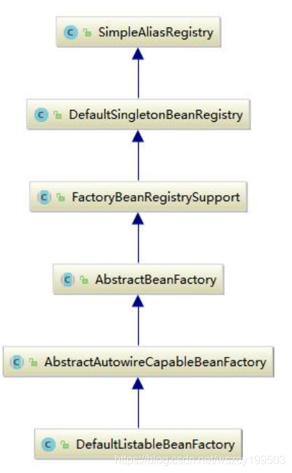
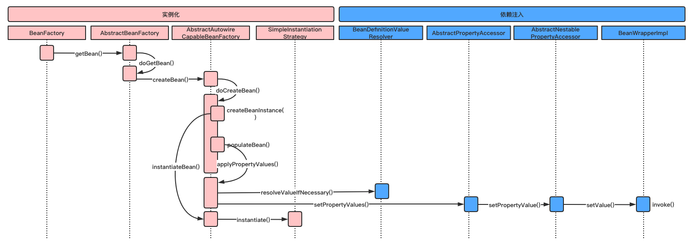

# 1 Spring 自动装配之依赖注入

## 1.1 依赖注入发生的时间

当Spring IOC容器完成了Bean资源的定位，载入和解析注册之后，IOC容器中已经管理类Bean定义的相关数据，但是此时IOC容器还没有对所管理的Bean进行依赖注入，依赖注入发生在以下两种情况发生：

- 用户第一次通过getBean方法向IOC容器要Bean时，IOC容器触发依赖注入 
- 当用户在Bean定义资源中为`<Bean>`元素配置了lazy-init属性，即让容器在解析注册Bean定义时进行预实例化，触发依赖注入

>lazy-init是Spring中延迟加载bean的属性。默认<code>lazy-init="false"</code>，那么Spring启动时会立即进行实例化。
>
>lazy-init=“true”，那么bean将不会在ApplicationContext启动时提前被实例化，而是在第一次向容器通过getBean索取bean时实例化的。
>
>`lazy-init 仅在 scope 属性为 singleton 时才会有效`，如果 scope 的属性值为 pototype，那么即使设置了 lazy-init=“false”，容器启动时也不会被实例化，而是调用getBean方法实例化。

BeanFactory接口定义了Spring IOC容器的基本功能规范，是Spring IOC容器所应遵守的最底层和最基本的编程规范。BeanFactory接口中定义了几个getBean方法，就是用户向IOC容器索取管理的Bean的方法，通过分析其子类的具体实现，理解Spring IOC容器在用户索取Bean时如何完成依赖注入。 



在BeanFactory中看到getBean函数，它的具体实现在AbstracBeanFactory中。

## 1.2 寻找获取 Bean 的入口

AbstractBeanFactory的getBean相关方法源码如下：

```java
//获取IOC容器中指定名称的Bean 
public Object getBean(String name) throws BeansException {
   //doGetBean才是真正向IoC容器获取被管理Bean的过程
   return doGetBean(name, null, null, false);
}

//获取IOC容器中指定名称和类型的Bean
public <T> T getBean(String name, Class<T> requiredType) throws BeansException {
   //doGetBean才是真正向IoC容器获取被管理Bean的过程
   return doGetBean(name, requiredType, null, false);
}

//获取IOC容器中指定名称和参数的Bean
public Object getBean(String name, Object... args) throws BeansException {
   //doGetBean才是真正向IoC容器获取被管理Bean的过程 
   return doGetBean(name, null, args, false);
}
//获取IOC容器中指定名称、类型和参数的Bean
public <T> T getBean(String name, Class<T> requiredType, Object... args) throws BeansException {
   //doGetBean才是真正向IoC容器获取被管理Bean的过程
   return doGetBean(name, requiredType, args, false);
}
//真正实现向IOC容器获取Bean的功能，也是触发依赖注入功能的地方
@SuppressWarnings("unchecked")
protected <T> T doGetBean(
      final String name, final Class<T> requiredType, final Object[] args, boolean typeCheckOnly)
      throws BeansException {

   // 根据指定的名称获取被管理Bean的名称，剥离指定名称中对容器的相关依赖
   // 如果是 FactoryBean，以 & 开头，做特殊处理
   // 如果指定的是别名，将别名转换为规范的Bean名称
   final String beanName = transformedBeanName(name);
   Object bean;

   // Eagerly check singleton cache for manually registered singletons.
   //先从缓存中取是否已经有被创建过的单态类型的Bean
   //对于单例模式的Bean整个IOC容器中只创建一次，不需要重复创建
   // 循环依赖三 getSingleton 的逻辑：
   // 如果 singletonsCurrentlyInCreation 中存在，则从 earlySingletonObjects 获取提前暴露的引用
   // 如果 earlySingletonObjects 中没有，就从 singletonFactories 获取
   Object sharedInstance = getSingleton(beanName);
    //IOC容器创建单例模式Bean实例对象
   if (sharedInstance != null && args == null) {
      if (logger.isDebugEnabled()) {
         //如果指定名称的Bean在容器中已有单例模式的Bean被创建
         //直接返回已经创建的Bean
         if (isSingletonCurrentlyInCreation(beanName)) {
            logger.debug("Returning eagerly cached instance of singleton bean '" + beanName +
                  "' that is not fully initialized yet - a consequence of a circular reference");
         }
         else {
            logger.debug("Returning cached instance of singleton bean '" + beanName + "'");
         }
      }
      //获取给定Bean的实例对象，主要是完成FactoryBean的相关处理  
      //注意：BeanFactory是管理容器中Bean的工厂，而FactoryBean是  
      //创建创建对象的工厂Bean，两者之间有区别
      bean = getObjectForBeanInstance(sharedInstance, name, beanName, null);
   }

   else {
      // Fail if we're already creating this bean instance:
      // We're assumably within a circular reference.
      //缓存没有正在创建的单例模式Bean  
      //缓存中已经有已经创建的原型模式Bean
      //但是由于循环引用的问题导致实例化对象失败
      if (isPrototypeCurrentlyInCreation(beanName)) {
         throw new BeanCurrentlyInCreationException(beanName);
      }

      // Check if bean definition exists in this factory.
      //对IOC容器中是否存在指定名称的BeanDefinition进行检查，首先检查是否  
      //能在当前的BeanFactory中获取的所需要的Bean，如果不能则委托当前容器  
      //的父级容器去查找，如果还是找不到则沿着容器的继承体系向父级容器查找
      BeanFactory parentBeanFactory = getParentBeanFactory();
      //当前容器的父级容器存在，且当前容器中不存在指定名称的Bean
      if (parentBeanFactory != null && !containsBeanDefinition(beanName)) {
         // Not found -> check parent.
         //解析指定Bean名称的原始名称
         String nameToLookup = originalBeanName(name);
         if (args != null) {
            // Delegation to parent with explicit args.
            //委派父级容器根据指定名称和显式的参数查找
            return (T) parentBeanFactory.getBean(nameToLookup, args);
         }
         else {
            // No args -> delegate to standard getBean method.
            //委派父级容器根据指定名称和类型查找
            return parentBeanFactory.getBean(nameToLookup, requiredType);
         }
      }

      //创建的Bean是否需要进行类型验证，一般不需要
      if (!typeCheckOnly) {
         //向容器标记指定的Bean已经被创建
         markBeanAsCreated(beanName);
      }

      try {
         //根据指定Bean名称获取其父级的Bean定义
         //主要解决Bean继承时子类合并父类公共属性问题 
         final RootBeanDefinition mbd = getMergedLocalBeanDefinition(beanName);
         checkMergedBeanDefinition(mbd, beanName, args);

         // Guarantee initialization of beans that the current bean depends on.
         //获取当前Bean所有依赖Bean的名称
         String[] dependsOn = mbd.getDependsOn();
         //如果当前Bean有依赖Bean
         if (dependsOn != null) {
            for (String dependsOnBean : dependsOn) {
               //递归调用getBean方法，获取当前Bean的依赖Bean
               getBean(dependsOnBean);
               //把被依赖Bean注册给当前依赖的Bean
               registerDependentBean(dependsOnBean, beanName);
            }
         }

         // Create bean instance.
         //创建单例模式Bean的实例对象
         if (mbd.isSingleton()) {
            // 这里使用了一个匿名内部类，创建Bean实例对象，并且注册给所依赖的对象
            // getSingleton 中的 beforeSingletonCreation(String beanName) 方法，会事先将 beanName
            // 添加到一个 singletonsCurrentlyInCreation 的 Set 中
            // 循环依赖一
            // getSingleton 会先执行 beforeSingletonCreation 方法，然后调用 ObjectFactory<?> singletonFactory.getObject() 方法，已启动 createBean 方法
            sharedInstance = getSingleton(beanName, new ObjectFactory<Object>() {
               public Object getObject() throws BeansException {
                  try {
                     //创建一个指定Bean实例对象，如果有父级继承，则合并子类和父类的定义
                     return createBean(beanName, mbd, args);
                  }
                  catch (BeansException ex) {
                     // Explicitly remove instance from singleton cache: It might have been put there
                     // eagerly by the creation process, to allow for circular reference resolution.
                     // Also remove any beans that received a temporary reference to the bean.
                     //显式地从容器单例模式Bean缓存中清除实例对象
                     destroySingleton(beanName);
                     throw ex;
                  }
               }
            });
            //获取给定Bean的实例对象
            bean = getObjectForBeanInstance(sharedInstance, name, beanName, mbd);
         }

         //IOC容器创建原型模式Bean实例对象
         else if (mbd.isPrototype()) {
            // It's a prototype -> create a new instance.
            //原型模式(Prototype)是每次都会创建一个新的对象
            Object prototypeInstance = null;
            try {
               //回调beforePrototypeCreation方法，默认的功能是注册当前创建的原型对象
               beforePrototypeCreation(beanName);
               //创建指定Bean对象实例
               prototypeInstance = createBean(beanName, mbd, args);
            }
            finally {
               //回调afterPrototypeCreation方法，默认的功能告诉IOC容器指定Bean的原型对象不再创建了
               afterPrototypeCreation(beanName);
            }
            //获取给定Bean的实例对象
            bean = getObjectForBeanInstance(prototypeInstance, name, beanName, mbd);
         }

         //要创建的Bean既不是单例模式，也不是原型模式，则根据Bean定义资源中  
           //配置的生命周期范围，选择实例化Bean的合适方法，这种在Web应用程序中  
           //比较常用，如：request、session、application等生命周期 
         else {
            String scopeName = mbd.getScope();
            final Scope scope = this.scopes.get(scopeName);
            //Bean定义资源中没有配置生命周期范围，则Bean定义不合法
            if (scope == null) {
               throw new IllegalStateException("No Scope registered for scope '" + scopeName + "'");
            }
            try {
               //这里又使用了一个匿名内部类，获取一个指定生命周期范围的实例
               Object scopedInstance = scope.get(beanName, new ObjectFactory<Object>() {
                  public Object getObject() throws BeansException {
                     beforePrototypeCreation(beanName);
                     try {
                        return createBean(beanName, mbd, args);
                     }
                     finally {
                        afterPrototypeCreation(beanName);
                     }
                  }
               });
               //获取给定Bean的实例对象
               bean = getObjectForBeanInstance(scopedInstance, name, beanName, mbd);
            }
            catch (IllegalStateException ex) {
               throw new BeanCreationException(beanName,
                     "Scope '" + scopeName + "' is not active for the current thread; " +
                     "consider defining a scoped proxy for this bean if you intend to refer to it from a singleton",
                     ex);
            }
         }
      }
      catch (BeansException ex) {
         cleanupAfterBeanCreationFailure(beanName);
         throw ex;
      }
   }

   // Check if required type matches the type of the actual bean instance.
   //对创建的Bean实例对象进行类型检查
   if (requiredType != null && bean != null && !requiredType.isAssignableFrom(bean.getClass())) {
      try {
         return getTypeConverter().convertIfNecessary(bean, requiredType);
      }
      catch (TypeMismatchException ex) {
         if (logger.isDebugEnabled()) {
            logger.debug("Failed to convert bean '" + name + "' to required type [" +
                  ClassUtils.getQualifiedName(requiredType) + "]", ex);
         }
         throw new BeanNotOfRequiredTypeException(name, requiredType, bean.getClass());
      }
   }
   return (T) bean;
}
```

通过上面对 IOC 容器获取 Bean 方法的分析，可以看到在 Spring 中，如果 Bean 定义的单例模式 Singleton，则容器在创建之前`先从缓存中查找`，以确保整个容器中只存在一个实例对象。如果 Bean 定义的是原型模式 Prototype，则容器每次都会创建一个新的实例对象。除此之外，Bean 定义还可以扩展为指定其生命周期范围。 

上面源码只是定义了根据 Bean 定义的模式，采取的不同创建 Bean 实例对象的策略，具体的 Bean 实现对象的创建过程由实现了 ObjectFactory 接口的匿名内部类的 createBean 方法完成，ObjectFactory 使用`委派模式`，具体的 `Bean 实例创建过程交由其实现类 AbstractAutowireCapableBeanFactory 完成`，继续分析 AbstractAutowireCapableBeanFactory 的 createBean 方法的源码，理解其创建 Bean 实例的具体实现。

## 1.3 开始实例化

AbstractAutowireCapableBeanFactory 类实现了 ObjectFactory 接口，创建容器指定的 Bean 实例对象，同时还对创建的 Bean 实例对象进行初始化处理。其创建 Bean 实例对象的方法源码：

```java
//创建Bean实例对象
@Override
protected Object createBean(final String beanName, final RootBeanDefinition mbd, final Object[] args)
      throws BeanCreationException {

   if (logger.isDebugEnabled()) {
      logger.debug("Creating instance of bean '" + beanName + "'");
   }
   // Make sure bean class is actually resolved at this point.
   //判断需要创建的Bean是否可以实例化，即是否可以通过当前的类加载器加载
   Class<?> resolvedClass = resolveBeanClass(mbd, beanName);
   if (resolvedClass != null && !mbd.hasBeanClass() && mbd.getBeanClassName() != null) {
	    mbdToUse = new RootBeanDefinition(mbd);
	    mbdToUse.setBeanClass(resolvedClass);
	}

   // Prepare method overrides.
   //校验和准备Bean中的方法覆盖
   try {
      mbd.prepareMethodOverrides();
   }
   catch (BeanDefinitionValidationException ex) {
      throw new BeanDefinitionStoreException(mbd.getResourceDescription(),
            beanName, "Validation of method overrides failed", ex);
   }

   try {
      // Give BeanPostProcessors a chance to return a proxy instead of the target bean instance.
      //如果Bean配置了初始化前和初始化后的处理器，则试图返回一个需要创建Bean的代理对象
      // 处理 InstantiationAwareBeanPostProcessor接口
      // 其主要作用在于目标对象的实例化过程中需要处理的事情，包括实例化对象的前后过程以及实例的属性设置
      Object bean = resolveBeforeInstantiation(beanName, mbd);
      if (bean != null) {
         return bean;
      }
   }
   catch (Throwable ex) {
      throw new BeanCreationException(mbd.getResourceDescription(), beanName,
            "BeanPostProcessor before instantiation of bean failed", ex);
   }

   //创建Bean的入口
   Object beanInstance = doCreateBean(beanName, mbd, args);
   if (logger.isDebugEnabled()) {
      logger.debug("Finished creating instance of bean '" + beanName + "'");
   }
   return beanInstance;
}
//真正创建Bean的方法 
protected Object doCreateBean(final String beanName, final RootBeanDefinition mbd, final Object[] args) {
   // Instantiate the bean.
   //封装被创建的Bean对象
   BeanWrapper instanceWrapper = null;
   if (mbd.isSingleton()) {//单例模式的Bean，先从容器中缓存中获取同名Bean
      instanceWrapper = this.factoryBeanInstanceCache.remove(beanName);
   }
   if (instanceWrapper == null) {
      //创建实例对象
      instanceWrapper = createBeanInstance(beanName, mbd, args);
   }
   final Object bean = (instanceWrapper != null ? instanceWrapper.getWrappedInstance() : null);
   //获取实例化对象的类型
   Class<?> beanType = (instanceWrapper != null ? instanceWrapper.getWrappedClass() : null);

   // Allow post-processors to modify the merged bean definition.
   //调用PostProcessor后置处理器
   synchronized (mbd.postProcessingLock) {
      if (!mbd.postProcessed) {
         applyMergedBeanDefinitionPostProcessors(mbd, beanType, beanName);
         mbd.postProcessed = true;
      }
   }

   // Eagerly cache singletons to be able to resolve circular references
   // even when triggered by lifecycle interfaces like BeanFactoryAware.
   //向容器中缓存单例模式的Bean对象，以防循环引用
   boolean earlySingletonExposure = (mbd.isSingleton() && this.allowCircularReferences &&
         isSingletonCurrentlyInCreation(beanName));
   if (earlySingletonExposure) {
      if (logger.isDebugEnabled()) {
         logger.debug("Eagerly caching bean '" + beanName +
               "' to allow for resolving potential circular references");
      }
      // 这里是一个匿名内部类，为了防止循环依赖二，尽早持有对象的引用
      // addSingletonFactory ==》 this.singletonFactories.put(beanName, singletonFactory);
      addSingletonFactory(beanName, new ObjectFactory<Object>() {
         public Object getObject() throws BeansException {
            return getEarlyBeanReference(beanName, mbd, bean);
         }
      });
   }

   // Initialize the bean instance.
   //Bean对象的初始化，依赖注入在此触发  
    //这个exposedObject在初始化完成之后返回作为依赖注入完成后的Bean
   Object exposedObject = bean;
   try {
      //将Bean实例对象封装，并且Bean定义中配置的属性值赋值给实例对象
      populateBean(beanName, mbd, instanceWrapper);
      if (exposedObject != null) {
         //初始化Bean对象 
         //在对Bean实例对象生成和依赖注入完成以后，开始对Bean实例对象  
            //进行初始化 ，为Bean实例对象应用BeanPostProcessor后置处理器
         exposedObject = initializeBean(beanName, exposedObject, mbd);
      }
   }
   catch (Throwable ex) {
      if (ex instanceof BeanCreationException && beanName.equals(((BeanCreationException) ex).getBeanName())) {
         throw (BeanCreationException) ex;
      }
      else {
         throw new BeanCreationException(mbd.getResourceDescription(), beanName, "Initialization of bean failed", ex);
      }
   }

   if (earlySingletonExposure) {
      //获取指定名称的已注册的单例模式Bean对象
      Object earlySingletonReference = getSingleton(beanName, false);
      if (earlySingletonReference != null) {
         //根据名称获取的已注册的Bean和正在实例化的Bean是同一个
         if (exposedObject == bean) {
            //当前实例化的Bean初始化完成
            exposedObject = earlySingletonReference;
         }
         //当前Bean依赖其他Bean，并且当发生循环引用时不允许新创建实例对象
         else if (!this.allowRawInjectionDespiteWrapping && hasDependentBean(beanName)) {
            String[] dependentBeans = getDependentBeans(beanName);
            Set<String> actualDependentBeans = new LinkedHashSet<String>(dependentBeans.length);
            //获取当前Bean所依赖的其他Bean 
            for (String dependentBean : dependentBeans) {
               //对依赖Bean进行类型检查
               if (!removeSingletonIfCreatedForTypeCheckOnly(dependentBean)) {
                  actualDependentBeans.add(dependentBean);
               }
            }
            if (!actualDependentBeans.isEmpty()) {
               throw new BeanCurrentlyInCreationException(beanName,
                     "Bean with name '" + beanName + "' has been injected into other beans [" +
                     StringUtils.collectionToCommaDelimitedString(actualDependentBeans) +
                     "] in its raw version as part of a circular reference, but has eventually been " +
                     "wrapped. This means that said other beans do not use the final version of the " +
                     "bean. This is often the result of over-eager type matching - consider using " +
                     "'getBeanNamesOfType' with the 'allowEagerInit' flag turned off, for example.");
            }
         }
      }
   }

   // Register bean as disposable.
   //注册完成依赖注入的Bean
   try {
      registerDisposableBeanIfNecessary(beanName, bean, mbd);
   }
   catch (BeanDefinitionValidationException ex) {
      throw new BeanCreationException(mbd.getResourceDescription(), beanName, "Invalid destruction signature", ex);
   }

   //为应用返回所需要的实例对象
   return exposedObject;
}
```

通过对方法源码的分析，看到具体的依赖注入实现在以下两个方法中：

- createBeanInstance：生成 Bean 所包含的 Java 对象实例 
- populateBean：对 Bean 属性的`依赖注入`进行处理

## 1.4 选择 Bean 实例化策略

在 createBeanInstance 方法中，根据指定的初始化策略，使用静态工厂、工厂方法或容器的自动装配特性生成 java 实例对象，创建对象的源码如下：

```java
//创建Bean的实例对象
protected BeanWrapper createBeanInstance(String beanName, RootBeanDefinition mbd, Object[] args) {
   // Make sure bean class is actually resolved at this point.
   //检查确认Bean是可实例化的
   Class<?> beanClass = resolveBeanClass(mbd, beanName);

   //使用工厂方法对Bean进行实例化
   if (beanClass != null && !Modifier.isPublic(beanClass.getModifiers()) && !mbd.isNonPublicAccessAllowed()) {
      throw new BeanCreationException(mbd.getResourceDescription(), beanName,
            "Bean class isn't public, and non-public access not allowed: " + beanClass.getName());
   }

   if (mbd.getFactoryMethodName() != null)  {
      //调用工厂方法实例化
      return instantiateUsingFactoryMethod(beanName, mbd, args);
   }

   // Shortcut when re-creating the same bean...
   //使用容器的自动装配方法进行实例化
   boolean resolved = false;
   boolean autowireNecessary = false;
   if (args == null) {
      synchronized (mbd.constructorArgumentLock) {
         if (mbd.resolvedConstructorOrFactoryMethod != null) {
            resolved = true;
            autowireNecessary = mbd.constructorArgumentsResolved;
         }
      }
   }
   if (resolved) {
      if (autowireNecessary) {
         //配置了自动装配属性，使用容器的自动装配实例化  
            //容器的自动装配是根据参数类型匹配Bean的构造方法
         return autowireConstructor(beanName, mbd, null, null);
      }
      else {
         //使用默认的无参构造方法实例化
         return instantiateBean(beanName, mbd);
      }
   }

   // Need to determine the constructor...
   //使用Bean的构造方法进行实例化
   Constructor<?>[] ctors = determineConstructorsFromBeanPostProcessors(beanClass, beanName);
   if (ctors != null ||
         mbd.getResolvedAutowireMode() == RootBeanDefinition.AUTOWIRE_CONSTRUCTOR ||
         mbd.hasConstructorArgumentValues() || !ObjectUtils.isEmpty(args))  {
      //使用容器的自动装配特性，调用匹配的构造方法实例化 
      return autowireConstructor(beanName, mbd, ctors, args);
   }

   // No special handling: simply use no-arg constructor.
   //使用默认的无参构造方法实例化
   return instantiateBean(beanName, mbd);
}
//使用默认的无参构造方法实例化Bean对象
protected BeanWrapper instantiateBean(final String beanName, final RootBeanDefinition mbd) {
   try {
      Object beanInstance;
      final BeanFactory parent = this;
      //获取系统的安全管理接口，JDK标准的安全管理AP
      if (System.getSecurityManager() != null) {
         //这里是一个匿名内置类，根据实例化策略创建实例对象
         beanInstance = AccessController.doPrivileged(new PrivilegedAction<Object>() {
            public Object run() {
               return getInstantiationStrategy().instantiate(mbd, beanName, parent);
            }
         }, getAccessControlContext());
      }
      else {
         //将实例化的对象封装起来
         beanInstance = getInstantiationStrategy().instantiate(mbd, beanName, parent);
      }
      BeanWrapper bw = new BeanWrapperImpl(beanInstance);
      initBeanWrapper(bw);
      return bw;
   }
   catch (Throwable ex) {
      throw new BeanCreationException(mbd.getResourceDescription(), beanName, "Instantiation of bean failed", ex);
   }
}
```

经过对上面的代码分析，可以看出对使用工厂方法和自动装配特性的 Bean 的实例化相当清楚，调用相应的`工厂方法或参数匹配的构造方法即可完成实例化对象`的工作，但是对于最常使用的`默认无参构造方法`就需要使用相应的初始化策略(`JDK的反射机制`或者`CGLib`)来初始化，在方法 getInstantiationStrategy().instantiate 中就具体实现类使用初始策略实例化对象。

## 1.5 执行 Bean 实例化

在使用默认的无参构造方法创建 Bean 的实例化对象时，方法 getInstantiationStratrgy().instantiate 调用了SimpleInstantiationStrategy 类中的实例化 Bean 的方法：

```java
//使用初始化策略实例化Bean对象
public Object instantiate(RootBeanDefinition beanDefinition, String beanName, BeanFactory owner) {
   // Don't override the class with CGLIB if no overrides.
   // 如果Bean定义中没有方法覆盖，则就不需要CGLIB父类类的方法
   // 如果有需要覆盖或者动态替换的方法则当然需要使用 cglib 进行动态代理，因为可以在创建代理的同时将动态方法织入类中
   // 但是如果没有需要动态改变的方法，为了方便直接反射就可以了
   if (beanDefinition.getMethodOverrides().isEmpty()) {
      Constructor<?> constructorToUse;
      synchronized (beanDefinition.constructorArgumentLock) {
         //获取对象的构造方法或工厂方法
         constructorToUse = (Constructor<?>) beanDefinition.resolvedConstructorOrFactoryMethod;
         
         //如果没有构造方法且没有工厂方法 
         if (constructorToUse == null) {
            //使用JDK的反射机制，判断要实例化的Bean是否是接口
            final Class clazz = beanDefinition.getBeanClass();
            if (clazz.isInterface()) {
               throw new BeanInstantiationException(clazz, "Specified class is an interface");
            }
            try {
               if (System.getSecurityManager() != null) {
                  //这里是一个匿名内置类，使用反射机制获取Bean的构造方法
                  constructorToUse = AccessController.doPrivileged(new PrivilegedExceptionAction<Constructor>() {
                     public Constructor run() throws Exception {
                        return clazz.getDeclaredConstructor((Class[]) null);
                     }
                  });
               }
               else {
                  constructorToUse = clazz.getDeclaredConstructor((Class[]) null);
               }
               beanDefinition.resolvedConstructorOrFactoryMethod = constructorToUse;
            }
            catch (Exception ex) {
               throw new BeanInstantiationException(clazz, "No default constructor found", ex);
            }
         }
      }
      //使用BeanUtils实例化，通过反射机制调用”构造方法.newInstance(arg)”来进行实例化
      return BeanUtils.instantiateClass(constructorToUse);
   }
   else {
      // Must generate CGLIB subclass.
      //使用CGLIB来实例化对象
      return instantiateWithMethodInjection(beanDefinition, beanName, owner);
   }
}
```

<font color=red>如果Bean定义中没有方法覆盖，则就不需要CGLIB父类的方法。</font>

那么是什么条件才会触发这个方法覆盖`MethodOverrides`呢？

其实就是用户没有使用 replace 或者 lookup 的配置方法(Spring配置文件中的 `lookup-method` 和 `replace-method`)，这是两个`方法级别的注入`，和一般的属性(Property)注入是不一样的，它们注入的是方法(Method)。

instantiateWithMethodInjection 方法调用了 SimpleInstantiationStrategy 的子类 CglibSubclassingInstantiationStrategy 使用CGLIB 来进行初始化：

```java
//使用CGLIB进行Bean对象实例化
public Object instantiate(Constructor ctor, Object[] args) {
   //CGLIB中的类
   Enhancer enhancer = new Enhancer();
   //将Bean本身作为其基类
   enhancer.setSuperclass(this.beanDefinition.getBeanClass());
   enhancer.setCallbackFilter(new CallbackFilterImpl());
   enhancer.setCallbacks(new Callback[] {
         NoOp.INSTANCE,
         new LookupOverrideMethodInterceptor(),
         new ReplaceOverrideMethodInterceptor()
   });

   //使用CGLIB的create方法生成实例对象
   return (ctor == null) ?
         enhancer.create() :
         enhancer.create(ctor.getParameterTypes(), args);
}
```

CGLIB 是一个常用的字节码生成器的类库，它提供了一系列 API 实现 java 字节码的生成和转换功能。

## 1.6 准备依赖注入

上面我们已经分析了容器初始化生成 Bean 所包含的 Java 实例对象的过程，现在我们继续分析生成对象后，Spring IOC 容器是如何将 Bean 的属性依赖关系注入 Bean 实例对象中并设置好的，回到 AbstractAutowireCapableBeanFactory 的 populateBean() 方法，对属性依赖注入的代码如下： 

```java
//将Bean属性设置到生成的实例对象上
protected void populateBean(String beanName, RootBeanDefinition mbd, BeanWrapper bw) {
   //获取容器在解析Bean定义资源时为BeanDefiniton中设置的属性值
   PropertyValues pvs = mbd.getPropertyValues();

   //实例对象为null
   if (bw == null) {
      if (!pvs.isEmpty()) {
         throw new BeanCreationException(
               mbd.getResourceDescription(), beanName, "Cannot apply property values to null instance");
      }
      else {
         // Skip property population phase for null instance.
         //实例对象为null，属性值也为空，不需要设置属性值，直接返回 
         return;
      }
   }

   // Give any InstantiationAwareBeanPostProcessors the opportunity to modify the
   // state of the bean before properties are set. This can be used, for example,
   // to support styles of field injection.
   //在设置属性之前调用 InstantiationAwareBeanPostProcessor 处理器
   boolean continueWithPropertyPopulation = true;

   if (!mbd.isSynthetic() && hasInstantiationAwareBeanPostProcessors()) {
      for (BeanPostProcessor bp : getBeanPostProcessors()) {
         if (bp instanceof InstantiationAwareBeanPostProcessor) {
            InstantiationAwareBeanPostProcessor ibp = (InstantiationAwareBeanPostProcessor) bp;
            if (!ibp.postProcessAfterInstantiation(bw.getWrappedInstance(), beanName)) {
               continueWithPropertyPopulation = false;
               break;
            }
         }
      }
   }

   if (!continueWithPropertyPopulation) {
      return;
   }

   //依赖注入开始，首先处理autowire自动装配的注入
   if (mbd.getResolvedAutowireMode() == RootBeanDefinition.AUTOWIRE_BY_NAME ||
         mbd.getResolvedAutowireMode() == RootBeanDefinition.AUTOWIRE_BY_TYPE) {
      MutablePropertyValues newPvs = new MutablePropertyValues(pvs);

      // Add property values based on autowire by name if applicable.
      //对autowire自动装配的处理，根据Bean名称自动装配注入
      if (mbd.getResolvedAutowireMode() == RootBeanDefinition.AUTOWIRE_BY_NAME) {
         autowireByName(beanName, mbd, bw, newPvs);
      }

      // Add property values based on autowire by type if applicable.
      //根据Bean类型自动装配注入
      if (mbd.getResolvedAutowireMode() == RootBeanDefinition.AUTOWIRE_BY_TYPE) {
         autowireByType(beanName, mbd, bw, newPvs);
      }

      pvs = newPvs;
   }

   //检查容器是否持有用于处理单例模式Bean关闭时的后置处理器
   boolean hasInstAwareBpps = hasInstantiationAwareBeanPostProcessors();
   //Bean实例对象没有依赖，即没有继承基类
   boolean needsDepCheck = (mbd.getDependencyCheck() != RootBeanDefinition.DEPENDENCY_CHECK_NONE);

   if (hasInstAwareBpps || needsDepCheck) {
      //从实例对象中提取属性描述符
      PropertyDescriptor[] filteredPds = filterPropertyDescriptorsForDependencyCheck(bw, mbd.allowCaching);
      if (hasInstAwareBpps) {
         for (BeanPostProcessor bp : getBeanPostProcessors()) {
            if (bp instanceof InstantiationAwareBeanPostProcessor) {
               InstantiationAwareBeanPostProcessor ibp = (InstantiationAwareBeanPostProcessor) bp;
               //使用BeanPostProcessor处理器处理属性值
               pvs = ibp.postProcessPropertyValues(pvs, filteredPds, bw.getWrappedInstance(), beanName);
               if (pvs == null) {
                  return;
               }
            }
         }
      }
      if (needsDepCheck) {
         //为要设置的属性进行依赖检查
         checkDependencies(beanName, mbd, filteredPds, pvs);
      }
   }
   //对属性进行注入
   applyPropertyValues(beanName, mbd, bw, pvs);
}
//解析并注入依赖属性的过程
protected void applyPropertyValues(String beanName, BeanDefinition mbd, BeanWrapper bw, PropertyValues pvs) {
   if (pvs == null || pvs.isEmpty()) {
      return;
   }

   //封装属性值
   MutablePropertyValues mpvs = null;
   List<PropertyValue> original;

   if (System.getSecurityManager()!= null) {
      if (bw instanceof BeanWrapperImpl) {
         //设置安全上下文，JDK安全机制
         ((BeanWrapperImpl) bw).setSecurityContext(getAccessControlContext());
      }
   }

   if (pvs instanceof MutablePropertyValues) {
      mpvs = (MutablePropertyValues) pvs;
      //属性值已经转换
      if (mpvs.isConverted()) {
         // Shortcut: use the pre-converted values as-is.
         try {
            //为实例化对象设置属性值
            bw.setPropertyValues(mpvs);
            return;
         }
         catch (BeansException ex) {
            throw new BeanCreationException(
                  mbd.getResourceDescription(), beanName, "Error setting property values", ex);
         }
      }
      //获取属性值对象的原始类型值
      original = mpvs.getPropertyValueList();
   }
   else {
      original = Arrays.asList(pvs.getPropertyValues());
   }

   //获取用户自定义的类型转换
   TypeConverter converter = getCustomTypeConverter();
   if (converter == null) {
      converter = bw;
   }
   //创建一个Bean定义属性值解析器，将Bean定义中的属性值解析为Bean实例对象的实际值
   BeanDefinitionValueResolver valueResolver = new BeanDefinitionValueResolver(this, beanName, mbd, converter);

   // Create a deep copy, resolving any references for values.
   //为属性的解析值创建一个拷贝，将拷贝的数据注入到实例对象中
   List<PropertyValue> deepCopy = new ArrayList<PropertyValue>(original.size());
   boolean resolveNecessary = false;
   for (PropertyValue pv : original) {
      //属性值不需要转换
      if (pv.isConverted()) {
         deepCopy.add(pv);
      }
      //属性值需要转换
      else {
         String propertyName = pv.getName();
         //原始的属性值，即转换之前的属性值
         Object originalValue = pv.getValue();
         //转换属性值，例如将引用转换为IoC容器中实例化对象引用
         Object resolvedValue = valueResolver.resolveValueIfNecessary(pv, originalValue);
         //转换之后的属性值
         Object convertedValue = resolvedValue;
         //属性值是否可以转换
         boolean convertible = bw.isWritableProperty(propertyName) &&
               !PropertyAccessorUtils.isNestedOrIndexedProperty(propertyName);
         if (convertible) {
            //使用用户自定义的类型转换器转换属性值
            convertedValue = convertForProperty(resolvedValue, propertyName, bw, converter);
         }
         // Possibly store converted value in merged bean definition,
         // in order to avoid re-conversion for every created bean instance.
         //存储转换后的属性值，避免每次属性注入时的转换工作
         if (resolvedValue == originalValue) {
            if (convertible) {
               //设置属性转换之后的值
               pv.setConvertedValue(convertedValue);
            }
            deepCopy.add(pv);
         }
         //属性是可转换的，且属性原始值是字符串类型，且属性的原始类型值不是  
            //动态生成的字符串，且属性的原始值不是集合或者数组类型
         else if (convertible && originalValue instanceof TypedStringValue &&
               !((TypedStringValue) originalValue).isDynamic() &&
               !(convertedValue instanceof Collection || ObjectUtils.isArray(convertedValue))) {
            pv.setConvertedValue(convertedValue);
            deepCopy.add(pv);
         }
         else {
            resolveNecessary = true;
            //重新封装属性的值
            deepCopy.add(new PropertyValue(pv, convertedValue));
         }
      }
   }
   if (mpvs != null && !resolveNecessary) {
      //标记属性值已经转换过
      mpvs.setConverted();
   }

   // Set our (possibly massaged) deep copy.
   //进行属性依赖注入
   try {
      bw.setPropertyValues(new MutablePropertyValues(deepCopy));
   }
   catch (BeansException ex) {
      throw new BeanCreationException(
            mbd.getResourceDescription(), beanName, "Error setting property values", ex);
   }
}
```

分析上述代码，我们可以看出，对属性的注入过程分以下两种情况：

- 属性值类型不需要转换时，不需要解析属性值，直接准备进行依赖注入 
- 属性值需要进行类型转换时，如对其他对象的引用等，首先需要解析属性值，然后对解析后的属性值进行依赖注入 

对属性值的解析是在 BeanDefinitionValueResolver 类中的 resolveValueIfNecessary 方法中进行的，对属性值的依赖注入是通过 bw.setPropertyValues 方法实现的，在分析属性值的依赖注入之前，先分析一下对属性值的解析过程。

## 1.7 解析属性注入规则

当容器在对属性进行依赖注入时，如果发现属性值需要进行类型转换，如属性值是容器中另一个 Bean 实例对象的引用，则容器首先需要根据属性值解析出来所引用的对象，然后才能将该引用对象注入到目标实例对象的属性上去，`对属性进行解析`的由 resolveValueIfNecessary 方法实现：

```java
//解析属性值，对注入类型进行转换
public Object resolveValueIfNecessary(Object argName, Object value) {
   // We must check each value to see whether it requires a runtime reference
   // to another bean to be resolved.
   //对引用类型的属性进行解析
   if (value instanceof RuntimeBeanReference) {
      RuntimeBeanReference ref = (RuntimeBeanReference) value;
      //调用引用类型属性的解析方法
      return resolveReference(argName, ref);
   }
   //对属性值是引用容器中另一个Bean名称的解析
   else if (value instanceof RuntimeBeanNameReference) {
      String refName = ((RuntimeBeanNameReference) value).getBeanName();
      refName = String.valueOf(evaluate(refName));
      //从容器中获取指定名称的Bean
      if (!this.beanFactory.containsBean(refName)) {
         throw new BeanDefinitionStoreException(
               "Invalid bean name '" + refName + "' in bean reference for " + argName);
      }
      return refName;
   }
   //对Bean类型属性的解析，主要是Bean中的内部类
   else if (value instanceof BeanDefinitionHolder) {
      // Resolve BeanDefinitionHolder: contains BeanDefinition with name and aliases.
      BeanDefinitionHolder bdHolder = (BeanDefinitionHolder) value;
      return resolveInnerBean(argName, bdHolder.getBeanName(), bdHolder.getBeanDefinition());
   }
   else if (value instanceof BeanDefinition) {
      // Resolve plain BeanDefinition, without contained name: use dummy name.
      BeanDefinition bd = (BeanDefinition) value;
      return resolveInnerBean(argName, "(inner bean)", bd);
   }
   //对集合数组类型的属性解析
   else if (value instanceof ManagedArray) {
      // May need to resolve contained runtime references.
      ManagedArray array = (ManagedArray) value;
      //获取数组的类型
      Class<?> elementType = array.resolvedElementType;
      if (elementType == null) {
          //获取数组元素的类型
         String elementTypeName = array.getElementTypeName();
         if (StringUtils.hasText(elementTypeName)) {
            try {
               //使用反射机制创建指定类型的对象
               elementType = ClassUtils.forName(elementTypeName, this.beanFactory.getBeanClassLoader());
               array.resolvedElementType = elementType;
            }
            catch (Throwable ex) {
               // Improve the message by showing the context.
               throw new BeanCreationException(
                     this.beanDefinition.getResourceDescription(), this.beanName,
                     "Error resolving array type for " + argName, ex);
            }
         }
         //没有获取到数组的类型，也没有获取到数组元素的类型 
            //则直接设置数组的类型为Object
         else {
            elementType = Object.class;
         }
      }
      //创建指定类型的数组
      return resolveManagedArray(argName, (List<?>) value, elementType);
   }
   //解析list类型的属性值
   else if (value instanceof ManagedList) {
      // May need to resolve contained runtime references.
      return resolveManagedList(argName, (List<?>) value);
   }
   //解析set类型的属性值
   else if (value instanceof ManagedSet) {
      // May need to resolve contained runtime references.
      return resolveManagedSet(argName, (Set<?>) value);
   }
   //解析map类型的属性值
   else if (value instanceof ManagedMap) {
      // May need to resolve contained runtime references.
      return resolveManagedMap(argName, (Map<?, ?>) value);
   }
   //解析props类型的属性值，props其实就是key和value均为字符串的map
   else if (value instanceof ManagedProperties) {
      Properties original = (Properties) value;
      //创建一个拷贝，用于作为解析后的返回值
      Properties copy = new Properties();
      for (Map.Entry propEntry : original.entrySet()) {
         Object propKey = propEntry.getKey();
         Object propValue = propEntry.getValue();
         if (propKey instanceof TypedStringValue) {
            propKey = evaluate((TypedStringValue) propKey);
         }
         if (propValue instanceof TypedStringValue) {
            propValue = evaluate((TypedStringValue) propValue);
         }
         copy.put(propKey, propValue);
      }
      return copy;
   }
   //解析字符串类型的属性值
   else if (value instanceof TypedStringValue) {
      // Convert value to target type here.
      TypedStringValue typedStringValue = (TypedStringValue) value;
      Object valueObject = evaluate(typedStringValue);
      try {
         //获取属性的目标类型
         Class<?> resolvedTargetType = resolveTargetType(typedStringValue);
         if (resolvedTargetType != null) {
            //对目标类型的属性进行解析，递归调用
            return this.typeConverter.convertIfNecessary(valueObject, resolvedTargetType);
         }
         //没有获取到属性的目标对象，则按Object类型返回
         else {
            return valueObject;
         }
      }
      catch (Throwable ex) {
         // Improve the message by showing the context.
         throw new BeanCreationException(
               this.beanDefinition.getResourceDescription(), this.beanName,
               "Error converting typed String value for " + argName, ex);
      }
   }
   else {
      return evaluate(value);
   }
}
//解析引用类型的属性值
private Object resolveReference(Object argName, RuntimeBeanReference ref) {
   try {
      //获取引用的Bean名称
      String refName = ref.getBeanName();
      refName = String.valueOf(evaluate(refName));
      //如果引用的对象在父类容器中，则从父类容器中获取指定的引用对象
      if (ref.isToParent()) {
         if (this.beanFactory.getParentBeanFactory() == null) {
            throw new BeanCreationException(
                  this.beanDefinition.getResourceDescription(), this.beanName,
                  "Can't resolve reference to bean '" + refName +
                  "' in parent factory: no parent factory available");
         }
         return this.beanFactory.getParentBeanFactory().getBean(refName);
      }
      //从当前的容器中获取指定的引用Bean对象，如果指定的Bean没有被实例化  
        //则会递归触发引用Bean的初始化和依赖注入
      else {
         Object bean = this.beanFactory.getBean(refName);
         //将当前实例化对象的依赖引用对象
         this.beanFactory.registerDependentBean(refName, this.beanName);
         return bean;
      }
   }
   catch (BeansException ex) {
      throw new BeanCreationException(
            this.beanDefinition.getResourceDescription(), this.beanName,
            "Cannot resolve reference to bean '" + ref.getBeanName() + "' while setting " + argName, ex);
   }
}
//解析array类型的属性
private Object resolveManagedArray(Object argName, List<?> ml, Class<?> elementType) {
   //创建一个指定类型的数组，用于存放和返回解析后的数组
   Object resolved = Array.newInstance(elementType, ml.size());
   for (int i = 0; i < ml.size(); i++) {
      //递归解析array的每一个元素，并将解析后的值设置到resolved数组中，索引为i
      Array.set(resolved, i,
            resolveValueIfNecessary(new KeyedArgName(argName, i), ml.get(i)));
   }
   return resolved;
}
//解析list类型的属性
private List resolveManagedList(Object argName, List<?> ml) {
   List<Object> resolved = new ArrayList<Object>(ml.size());
   for (int i = 0; i < ml.size(); i++) {
      //递归解析list的每一个元素
      resolved.add(
            resolveValueIfNecessary(new KeyedArgName(argName, i), ml.get(i)));
   }
   return resolved;
}
//解析set类型的属性
private Set resolveManagedSet(Object argName, Set<?> ms) {
   Set<Object> resolved = new LinkedHashSet<Object>(ms.size());
   int i = 0;
   //递归解析set的每一个元素
   for (Object m : ms) {
      resolved.add(resolveValueIfNecessary(new KeyedArgName(argName, i), m));
      i++;
   }
   return resolved;
}
//解析map类型的属性
private Map resolveManagedMap(Object argName, Map<?, ?> mm) {
   Map<Object, Object> resolved = new LinkedHashMap<Object, Object>(mm.size());
   //递归解析map中每一个元素的key和value
   for (Map.Entry entry : mm.entrySet()) {
      Object resolvedKey = resolveValueIfNecessary(argName, entry.getKey());
      Object resolvedValue = resolveValueIfNecessary(
            new KeyedArgName(argName, entry.getKey()), entry.getValue());
      resolved.put(resolvedKey, resolvedValue);
   }
   return resolved;
}
```

通过上述代码分析，可以明白Spring是如何将引用类型，内部类以及集合类型等属性进行解析的，属性值解析完成后就可以进行依赖注入了，依赖注入的过程就是 `Bean 对象实例设置到它所依赖的 Bean 对象属性上去`，在BeanDefinitionValueResolver解析属性值中已经说过，依赖注入是通过bw.setPropertyValues方法实现的，该方法也使用了委派模式，在BeanWrapper接口在至少定义了方法生命，依赖注入的具体实现交由其实现类BeanwrapperImpl来完成。

## 1.8 注入赋值

BeanWrapperImpl类主要是对容器中完成初始化的Bean实例对象进行属性的依赖注入，即把Bean对象设置到它所依赖的另一个Bean的属性中去。然而，BeanWrapperImpl 中的注入方法实际上由 AbstractNestablePropertyAccessor 来实现的，其相关源码如下： 

```java
//实现属性依赖注入功能
protected void setPropertyValue(PropertyTokenHolder tokens, PropertyValue pv) throws BeansException {
	if (tokens.keys != null) {
		processKeyedProperty(tokens, pv);
	}
	else {
		processLocalProperty(tokens, pv);
	}
}
//实现属性依赖注入功能
@SuppressWarnings("unchecked")
private void processKeyedProperty(PropertyTokenHolder tokens, PropertyValue pv) {
    //调用属性的getter方法，获取属性的值
    Object propValue = getPropertyHoldingValue(tokens);
    PropertyHandler ph = getLocalPropertyHandler(tokens.actualName);
    if (ph == null) {
        throw new InvalidPropertyException(
            getRootClass(), this.nestedPath + tokens.actualName, "No property handler found");
    }
    Assert.state(tokens.keys != null, "No token keys");
    String lastKey = tokens.keys[tokens.keys.length - 1];

    //注入array类型的属性值
    if (propValue.getClass().isArray()) {
        Class<?> requiredType = propValue.getClass().getComponentType();
        int arrayIndex = Integer.parseInt(lastKey);
        Object oldValue = null;
        try {
            if (isExtractOldValueForEditor() && arrayIndex < Array.getLength(propValue)) {
                oldValue = Array.get(propValue, arrayIndex);
            }
            Object convertedValue = convertIfNecessary(tokens.canonicalName, oldValue, pv.getValue(),
                                                       requiredType, ph.nested(tokens.keys.length));
            //获取集合类型属性的长度
            int length = Array.getLength(propValue);
            if (arrayIndex >= length && arrayIndex < this.autoGrowCollectionLimit) {
                Class<?> componentType = propValue.getClass().getComponentType();
                Object newArray = Array.newInstance(componentType, arrayIndex + 1);
                System.arraycopy(propValue, 0, newArray, 0, length);
                setPropertyValue(tokens.actualName, newArray);
                //调用属性的getter方法，获取属性的值
                propValue = getPropertyValue(tokens.actualName);
            }
            //将属性的值赋值给数组中的元素
            Array.set(propValue, arrayIndex, convertedValue);
        }
        catch (IndexOutOfBoundsException ex) {
            throw new InvalidPropertyException(getRootClass(), this.nestedPath + tokens.canonicalName,
                                               "Invalid array index in property path '" + tokens.canonicalName + "'", ex);
        }
    }

    //注入list类型的属性值
    else if (propValue instanceof List) {
        //获取list集合的类型
        Class<?> requiredType = ph.getCollectionType(tokens.keys.length);
        List<Object> list = (List<Object>) propValue;
        //获取list集合的size
        int index = Integer.parseInt(lastKey);
        Object oldValue = null;
        if (isExtractOldValueForEditor() && index < list.size()) {
            oldValue = list.get(index);
        }
        //获取list解析后的属性值
        Object convertedValue = convertIfNecessary(tokens.canonicalName, oldValue, pv.getValue(),
                                                   requiredType, ph.nested(tokens.keys.length));
        int size = list.size();
        //如果list的长度大于属性值的长度，则多余的元素赋值为null
        if (index >= size && index < this.autoGrowCollectionLimit) {
            for (int i = size; i < index; i++) {
                try {
                    list.add(null);
                }
                catch (NullPointerException ex) {
                    throw new InvalidPropertyException(getRootClass(), this.nestedPath + tokens.canonicalName,
                                                       "Cannot set element with index " + index + " in List of size " +
                                                       size + ", accessed using property path '" + tokens.canonicalName +
                                                       "': List does not support filling up gaps with null elements");
                }
            }
            list.add(convertedValue);
        }
        else {
            try {
                //将值添加到list中
                list.set(index, convertedValue);
            }
            catch (IndexOutOfBoundsException ex) {
                throw new InvalidPropertyException(getRootClass(), this.nestedPath + tokens.canonicalName,
                                                   "Invalid list index in property path '" + tokens.canonicalName + "'", ex);
            }
        }
    }

    //注入map类型的属性值
    else if (propValue instanceof Map) {
        //获取map集合key的类型
        Class<?> mapKeyType = ph.getMapKeyType(tokens.keys.length);
        //获取map集合value的类型
        Class<?> mapValueType = ph.getMapValueType(tokens.keys.length);
        Map<Object, Object> map = (Map<Object, Object>) propValue;
        // IMPORTANT: Do not pass full property name in here - property editors
        // must not kick in for map keys but rather only for map values.
        TypeDescriptor typeDescriptor = TypeDescriptor.valueOf(mapKeyType);
        //解析map类型属性key值
        Object convertedMapKey = convertIfNecessary(null, null, lastKey, mapKeyType, typeDescriptor);
        Object oldValue = null;
        if (isExtractOldValueForEditor()) {
            oldValue = map.get(convertedMapKey);
        }
        // Pass full property name and old value in here, since we want full
        // conversion ability for map values.
        //解析map类型属性value值
        Object convertedMapValue = convertIfNecessary(tokens.canonicalName, oldValue, pv.getValue(),
                                                      mapValueType, ph.nested(tokens.keys.length));
        //将解析后的key和value值赋值给map集合属性
        map.put(convertedMapKey, convertedMapValue);
    }

    else {
        throw new InvalidPropertyException(getRootClass(), this.nestedPath + tokens.canonicalName,
                                           "Property referenced in indexed property path '" + tokens.canonicalName +
                                           "' is neither an array nor a List nor a Map; returned value was [" + propValue + "]");
    }
}
private Object getPropertyHoldingValue(PropertyTokenHolder tokens) {
    // Apply indexes and map keys: fetch value for all keys but the last one.
    Assert.state(tokens.keys != null, "No token keys");
    PropertyTokenHolder getterTokens = new PropertyTokenHolder(tokens.actualName);
    getterTokens.canonicalName = tokens.canonicalName;
    getterTokens.keys = new String[tokens.keys.length - 1];
    System.arraycopy(tokens.keys, 0, getterTokens.keys, 0, tokens.keys.length - 1);

    Object propValue;
    try {
        //获取属性值
        propValue = getPropertyValue(getterTokens);
    }
    catch (NotReadablePropertyException ex) {
        throw new NotWritablePropertyException(getRootClass(), this.nestedPath + tokens.canonicalName,
                                               "Cannot access indexed value in property referenced " +
                                               "in indexed property path '" + tokens.canonicalName + "'", ex);
    }

    if (propValue == null) {
        // null map value case
        if (isAutoGrowNestedPaths()) {
            int lastKeyIndex = tokens.canonicalName.lastIndexOf('[');
            getterTokens.canonicalName = tokens.canonicalName.substring(0, lastKeyIndex);
            propValue = setDefaultValue(getterTokens);
        }
        else {
            throw new NullValueInNestedPathException(getRootClass(), this.nestedPath + tokens.canonicalName,
                                                     "Cannot access indexed value in property referenced " +
                                                     "in indexed property path '" + tokens.canonicalName + "': returned null");
        }
    }
    return propValue;
}
```

通过对上面依赖注入代码的分析，已经明白类SpringIOC容器是如何将属性的值注入到Bean实例对象中去的：

- 对于集合类型的属性，将其属性值解析为目标类型的集合后直接赋值给属性 
- 对于非集合类型的属性，大量使用了`JDK的反射机制`，通过属性的 getter 方法获取指定属性注入以前的值，同时调用属性的 setter 方法为属性设置诸如后的值。 



至此Spring IOC 容器对Bean定义资源文件的定位，载入、解析和依赖注入已经全部分析完毕，现在SpringIOC容器中管理了一系列靠依赖关系联系起来的Bean，程序不需要应用自己手动创建所需的对象，Spring IOC 容器会在我们使用的时候自动为我们创建，并且为我们注入好相关的依赖，这就是Spring核心功能的控制反转和依赖注入的相关功能。

------

