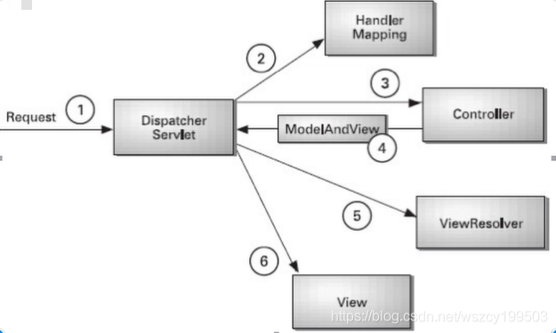
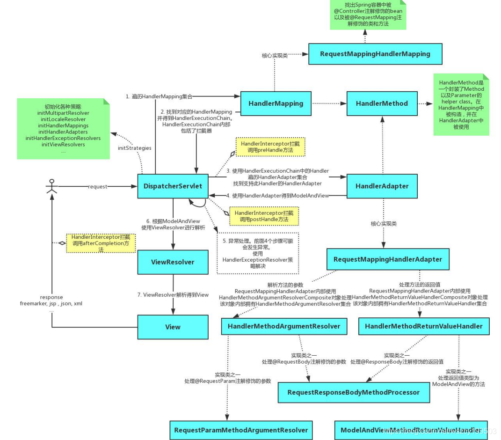
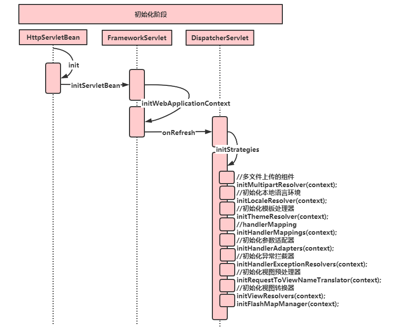
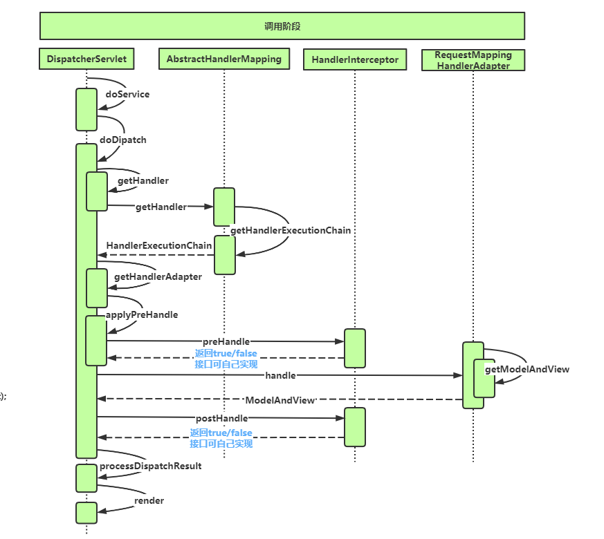

## 1 MVC本质


MVC的核心思想是业务数据抽取业务数据呈现相分离 MVC，Model-View-Controller

- View，视图层：为用户提供UI重点关注数据的呈现 
- Model，模型层：业务数据的信息表示，关注支持业务的信息构成，通常是多个业务实体的组合 
- Controller，控制层：调用业务逻辑产生合适的数据(Model)传递数据给视图层用于呈现

>区别于，三层机构，Dao数据访问层，Service业务处理层，Web层（J2EE的内容，Request和Response）

## 2 Spring MVC 基本概念

### 2.1 Spring MVC 请求处理流程

引用 Spring in Action 上的一张图来说明了 SpringMVC 的核心组件和请求处理流程：  

 

(1) `DispatcherServlet`（实现``Awaer``接口，能够得到 ApplicationContext）是 SpringMVC 中的前端控制器(Front Controller)，负责接收 request 并将 request 转发给对应的处理组件，客户端（浏览器）发送请求，直接请求到 `DispatcherServlet`

 (2) ``HandlerMapping``是 SpringMVC 中完成 url 到 controller 映射的组件，DispatcherServlet 接收 request，然后从HandlerMapping 解析请求对应的 `Handler`

 (3) 解析到对应的 `Handler`（也就是我们平常说的 `Controller` 控制器）后，开始由 `HandlerAdapter` 适配器处理，`HandlerAdapter` 会根据 `Handler `来调用真正的处理器来处理请求，并处理相应的业务逻辑

(4) 处理器处理完业务后，会返回一个 `ModelAndView` 对象，Controller 是 SpringMVC 中负责处理 request 的组件，ModelAndView 是封装结果视图的组件 

(5) `ViewResolver` 会根据逻辑 `View` 查找实际的 `View`

(6) `DispaterServlet` 把返回的 `Model` 传给 `View`（视图渲染），把 `View` 返回给请求者（浏览器）

### 2.2 Spring MVC 工作机制

在容器初始化时会建立所有url和controller的对应关系，保存到Map<url, controller>中。Tomcat启动时会通知Spring初始化容器（加载bean的定义信息和初始化所有单例bean，然后springmvc会遍历容器中的bean），获取每一个controller中的方法访问的url，然后将url和controller保存到一个Map中； 这样就可以根据request快速定位到controller，因为最终处理request的是controller中的方法，Map中只保留了url和controller中的对应关系，所以要根据request的url进一步确认controller中的method。

这一步工作的原理就是拼接controller的url（controller上@RequestMapping的值）和方法的url（metnod上的@RequestMapping的值），与request的url进行匹配，找到匹配的那个方法； 确定处理请求的method后，接下来的任务就是要参数绑定，把request中参数绑定到方法的形式参数上，这一步是整个请求处理过程中最复杂的一个步骤。

springmvc提供了两种request参数与方法形参的绑定方法：

1. `通过注解进行绑定@RequestParam` 使用注解进行绑定，我们只要在方法参数前面声明@RequestParam(“name”)，就可以将request中参数 name 的值绑定到方法的该参数上。RequestParam，自动调用request的getParament方法，而且能够自动转型，getParament获得是字符转（自动转为其他类型） 
2. `通过参数名称进行绑定` 使用参数名称进行绑定的前提是必须要获取方法中参数的名称，Java反射只提供了获取方法的参数的类型，并没有提供获取参数名称的方法。springmvc解决这个问题的方法是用asm框架读取字节码文件，来获取方法的参数名称。asm框架是一个字节码操作框架，关于asm更多介绍可以参考它的官网。个人建议，使用注解来完成参数绑定，这样就可以省去asm框架的读取字节码的操作。

## 3 Spring MVC 源码分析


根据工作机制中三部分来分析springmvc的源代码：

- ApplicationContext初始化时建立所有url和controller类的对应关系(用Map保存) 
- 根据请求url找到对应的controller,并从controller中找到处理请求的方法 
- request参数绑定到方法的形参,执行方法处理请求,并返回结果视图

### 3.1 初始化阶段

根据 DispatcherServlet 的继承关系可知，``DispatcherServlet  -> FrameworkServlet -> HttpServletBean -> javax.servlet.http.HttpServlet``，其接口 HttpServlet 的 init() 方法最终由 HttpServletBean 实现。

HttpServletBean 的 init() 方法调用了由 FrameworkServlet 实现的 initServletBean() -> initWebApplicationContext()，最终触发 由 DispatcherServlet  实现的 onRefresh 方法，初始化过程：

```java
@Override
// 只要IOC容器启动以后，就会调用onRefresh方法
protected void onRefresh(ApplicationContext context) {
   initStrategies(context);
}
// 初始化策略
protected void initStrategies(ApplicationContext context) {
   //多文件上传组件
   initMultipartResolver(context);
   //初始化本地语言环境
   initLocaleResolver(context);
   //初始化模块处理器
   initThemeResolver( context);
   //解析url和Method的关联关系
   initHandlerMappings( context);
   //初始化参数适配器( 匹配的过程)
   initHandlerAdapters ( context);
   //初始化异常拦截器
   initHandlerExceptionResolvers (context);
   //初始化视图预处理器(根据视图名字匹配到一个具体模板)
   initRequestToViewNameTranslator(context);
   //初始化视图转换器，解析模板中的内容(拿到服务器传过来的数据，生成HTML代码)
   initViewResolvers ( context);
   //FlashMap 管理器
   initFlashMapManager(context);
}
```

#### 建立Map<urls,controller>的关系

初始化过程中首先看建立Map<url,controller>关系的部分。

DispatcherServlet的初始化策略中，初始化HandlerMapping的方法 initHandlerMappings() ：

```java
/**
* Initialize the HandlerMappings used by this class.
* <p>If no HandlerMapping beans are defined in the BeanFactory for this namespace,
* we default to BeanNameUrlHandlerMapping.
*/
private void initHandlerMappings(ApplicationContext context) {
   this.handlerMappings = null;

   if (this.detectAllHandlerMappings) {
      // Find all HandlerMappings in the ApplicationContext, including ancestor contexts.
      // 从ApplicationContext获取所有的HandlerMappings
      Map<String, HandlerMapping> matchingBeans =
            BeanFactoryUtils.beansOfTypeIncludingAncestors(context, HandlerMapping.class, true, false);
      if (!matchingBeans.isEmpty()) {
         // Map转换为List
         this.handlerMappings = new ArrayList<HandlerMapping>(matchingBeans.values());
         // We keep HandlerMappings in sorted order.
         OrderComparator.sort(this.handlerMappings);
      }
   }
   else {
      try {
         HandlerMapping hm = context.getBean(HANDLER_MAPPING_BEAN_NAME, HandlerMapping.class);
         this.handlerMappings = Collections.singletonList(hm);
      }
      catch (NoSuchBeanDefinitionException ex) {
         // Ignore, we'll add a default HandlerMapping later.
      }
   }

   // Ensure we have at least one HandlerMapping, by registering
   // a default HandlerMapping if no other mappings are found.
   if (this.handlerMappings == null) {
      this.handlerMappings = getDefaultStrategies(context, HandlerMapping.class);
      if (logger.isDebugEnabled()) {
         logger.debug("No HandlerMappings found in servlet '" + getServletName() + "': using default");
      }
   }
}
```

查看方法注释可知HandlerMapping 默认使用的是``BeanNameUrlHandlerMapping``，第一部分的入口类即为其继承关系中的``ApplicationObjectSupport``（其实现了接口ApplicationContextAware），所以 ApplicationObjectSupport 的 ``setApplicationContext``方法中核心部分就是初始化容器``initApplicationContext(context)``，子类``AbstractDetectingUrlHandlerMapping``实现了该方法,所以我们直接看子类中的初始化容器方法：

```java
@Override
public void initApplicationContext() throws ApplicationContextException {
   super.initApplicationContext();
   detectHandlers();
}
// 建立当前ApplicationContext中的所有controller和url的对应关系
protected void detectHandlers() throws BeansException {
   if (logger.isDebugEnabled()) {
      logger.debug("Looking for URL mappings in application context: " + getApplicationContext());
   }
   // 获取ApplicationContext容器中所有bean的Name
   String[] beanNames = (this.detectHandlersInAncestorContexts ?
         BeanFactoryUtils.beanNamesForTypeIncludingAncestors(getApplicationContext(), Object.class) :
         getApplicationContext().getBeanNamesForType(Object.class));

   // Take any bean name that we can determine URLs for.
   // 遍历beanNames，并找到这些bean对应的url
   for (String beanName : beanNames) {
      // 找bean上的所有url(controller上url+方法上的url)，该方法由对应的子类实现
      String[] urls = determineUrlsForHandler(beanName);
      if (!ObjectUtils.isEmpty(urls)) {
         // URL paths found: Let's consider it a handler.
         // 保存urls和beanName的对应关系，put it to Map<urls, beanName>，该方法
         // 在父类AbstractUrlHandlerMapping中实现
         registerHandler(urls, beanName);
      }
      else {
         if (logger.isDebugEnabled()) {
            logger.debug("Rejected bean name '" + beanName + "': no URL paths identified");
         }
      }
   }
}
// 获取controller中所有方法的url，由子类实现，典型的模版模式
protected abstract String[] determineUrlsForHandler(String beanName);
```

`determineUrlsForHandler(String beanName)`方法的作用是获取每个controller中的url，不同的子类有不同的实现，这是一个典型的模版设计模式。因为开发中我们用的最多的就是注解来配置controller中的url，DefaultAnnotationHandlerMapping是AbstractDetectingUrlHandlerMapping的子类，处理注解形式的url映射，所以这里以DefaultAnnotationHandlerMapping来进行分析：

```java
// 获取controller中的所有url
protected String[] determineUrlsForHandler(String beanName) {
   // 获取ApplicationContext容器
   ApplicationContext context = getApplicationContext();
   // 从容器中获取controller
   Class<?> handlerType = context.getType(beanName);
   // 获取controller上的@RequestMapping注解
   RequestMapping mapping = context.findAnnotationOnBean(beanName, RequestMapping.class);
   // controller上有注解
   if (mapping != null) {
      // @RequestMapping found at type level
      this.cachedMappings.put(handlerType, mapping);
      // 返回结果集
      Set<String> urls = new LinkedHashSet<String>();
      // controller的映射url
      String[] typeLevelPatterns = mapping.value();
      if (typeLevelPatterns.length > 0) {
         // @RequestMapping specifies paths at type level
         // 获取controller中所有方法及方法的映射url
         String[] methodLevelPatterns = determineUrlsForHandlerMethods(handlerType, true);
         for (String typeLevelPattern : typeLevelPatterns) {
            if (!typeLevelPattern.startsWith("/")) {
               typeLevelPattern = "/" + typeLevelPattern;
            }
            boolean hasEmptyMethodLevelMappings = false;
            for (String methodLevelPattern : methodLevelPatterns) {
               if (methodLevelPattern == null) {
                  hasEmptyMethodLevelMappings = true;
               }
               else {
                  // controller的映射url+方法映射的url
                  String combinedPattern = getPathMatcher().combine(typeLevelPattern, methodLevelPattern);
                  // 保存到set集合中
                  addUrlsForPath(urls, combinedPattern);
               }
            }
            if (hasEmptyMethodLevelMappings ||
                  org.springframework.web.servlet.mvc.Controller.class.isAssignableFrom(handlerType)) {
               addUrlsForPath(urls, typeLevelPattern);
            }
         }
         // 以数组星矢返回controller上的所有url
         return StringUtils.toStringArray(urls);
      }
      else {
         // actual paths specified by @RequestMapping at method level
         // controller上的@RequestMapping映射url为空串，直接找方法的映射url
         return determineUrlsForHandlerMethods(handlerType, false);
      }
   }//controller上没有@RequestMapping注解
   else if (AnnotationUtils.findAnnotation(handlerType, Controller.class) != null) {
      // @RequestMapping to be introspected at method level
      // 获取controller中方法上的映射url
      return determineUrlsForHandlerMethods(handlerType, false);
   }
   else {
      return null;
   }
}
```

到这里HandlerMapping组件就已经建立所有url和controller的对应关系。

### 3.2 调用阶段

#### 根据访问url找到对应controller中处理请求的方法

下面开始分析第二个步骤，第二个步骤是由请求触发的，所以入口为DispatcherServlet的核心方法为``doService()``，doService() 中的核心逻辑由 ``doDispatch()`` 实现，我们查看doDispatch()的源代码。

```java
/** 中央控制器,控制请求的转发 **/
protected void doDispatch(HttpServletRequest request, HttpServletResponse response) throws Exception {
   HttpServletRequest processedRequest = request;
   HandlerExecutionChain mappedHandler = null;
   boolean multipartRequestParsed = false;

   WebAsyncManager asyncManager = WebAsyncUtils.getAsyncManager(request);

   try {
      ModelAndView mv = null;
      Exception dispatchException = null;

      try {
         //1.检查是否是复合请求（文件流（多媒体））
         processedRequest = checkMultipart(request);
         multipartRequestParsed = processedRequest != request;

         // Determine handler for the current request.
         // 取得处理当前请求的controller,这里也称为hanlder处理器
         // 第一个步骤的意义就在这里体现了.这里并不是直接返回controller
         // 而是返回的HandlerExecutionChain请求处理器链对象,该对象封装了handler和interceptors.
         mappedHandler = getHandler(processedRequest, false);
         // 如果handler为空,则返回404
         if (mappedHandler == null || mappedHandler.getHandler() == null) {
            noHandlerFound(processedRequest, response);
            return;
         }

         // Determine handler adapter for the current request.
         //3. 获取处理request的处理器适配器handler adapter
         HandlerAdapter ha = getHandlerAdapter(mappedHandler.getHandler());

         // Process last-modified header, if supported by the handler.
         // 处理 last-modified 请求头，判断request的请求类型，request带过来的所有信息
         String method = request.getMethod();
         boolean isGet = "GET".equals(method);
         if (isGet || "HEAD".equals(method)) {
            
            long lastModified = ha.getLastModified(request, mappedHandler.getHandler());
            if (logger.isDebugEnabled()) {
               String requestUri = urlPathHelper.getRequestUri(request);
               logger.debug("Last-Modified value for [" + requestUri + "] is: " + lastModified);
            }
            if (new ServletWebRequest(request, response).checkNotModified(lastModified) && isGet) {
               return;
            }
         }

         // 4.拦截器的预处理方法
         if (!mappedHandler.applyPreHandle(processedRequest, response)) {
            return;
         }

         try {
            // Actually invoke the handler.
            // 5.实际的处理器处理请求,返回结果视图对象
            mv = ha.handle(processedRequest, response, mappedHandler.getHandler());
         }
         finally {
            if (asyncManager.isConcurrentHandlingStarted()) {
               return;
            }
         }

         // 结果视图对象的处理
         applyDefaultViewName(request, mv);
         // 6.拦截器的后处理方法
         mappedHandler.applyPostHandle(processedRequest, response, mv);
      }
      catch (Exception ex) {
         dispatchException = ex;
      }
       // 7.对最终结果进行渲染，将 mv 渲染从response可以输出的结果
      processDispatchResult(processedRequest, response, mappedHandler, mv, dispatchException);
   }
   catch (Exception ex) {
      // 请求成功响应之后的方法
      triggerAfterCompletion(processedRequest, response, mappedHandler, ex);
   }
   catch (Error err) {
      triggerAfterCompletionWithError(processedRequest, response, mappedHandler, err);
   }
   finally {
      if (asyncManager.isConcurrentHandlingStarted()) {
         // Instead of postHandle and afterCompletion
         mappedHandler.applyAfterConcurrentHandlingStarted(processedRequest, response);
         return;
      }
      // Clean up any resources used by a multipart request.
      if (multipartRequestParsed) {
         cleanupMultipart(processedRequest);
      }
   }
}
```

`getHandler(processedRequest)`方法实际上就是从HandlerMapping中找到url和controller的对应关系。这也就是建立Map<url, Controller>的意义，我们知道最终处理request的是controller中的方法，我们现在只是知道了controller，还要进一步确认controller中处理request的方法。由于下面的步骤和第三个步骤关系更加紧密，直接转到第三个步骤。

#### 反射调用处理请求的方法返回结果视图

上面的方法中，第2步其实就是从第一个步骤中的Map&lt;urls,beanName&gt;中取得controller，然后经过拦截器的预处理方法。到最核心的部分第5步调用controller的方法处理请求。

在第2步中我们可以知道处理request的controller，第5步就是要根据url确定controller中处理请求的方法，经过拦截器的预处理方法，然后通过反射获取该方法上的注解和参数，解析方法和参数上的注解,最后反射调用方法获取ModelAndView结果视图。因为上面采用注解url形式说明的,所以我们这里继续以注解处理器适配器来说明。

第5步调用的就是实现了 `HandlerAdapter` 的 `AbstractHandlerMethodAdapter` 的handle。最后，调用的就是 `RequestMappingHandlerAdapter` 的 handle()中的核心逻辑由 handleInternal(request, response, handler)实现。 

```java
@Override
protected ModelAndView handleInternal(HttpServletRequest request,
		HttpServletResponse response, HandlerMethod handlerMethod) throws Exception {
	ModelAndView mav;
	checkRequest(request);
	// Execute invokeHandlerMethod in synchronized block if required.
	if (this.synchronizeOnSession) {
		HttpSession session = request.getSession(false);
		if (session != null) {
			Object mutex = WebUtils.getSessionMutex(session);
			synchronized (mutex) {
				mav = invokeHandlerMethod(request, response, handlerMethod);
			}
		}
		else {
			// No HttpSession available -> no mutex necessary
			mav = invokeHandlerMethod(request, response, handlerMethod);
		}
	}
	else {
		// No synchronization on session demanded at all...
		mav = invokeHandlerMethod(request, response, handlerMethod);
	}
	if (!response.containsHeader(HEADER_CACHE_CONTROL)) {
		if (getSessionAttributesHandler(handlerMethod).hasSessionAttributes()) {
			applyCacheSeconds(response, this.cacheSecondsForSessionAttributeHandlers);
		}
		else {
			prepareResponse(response);
		}
	}
	return mav;
}
```

整个处理过程中最核心的其实就是拼接Controller的url和方法url，与Request的url进行匹配，找到匹配的的方法。

```java
/** 根据 url 获取处理请求的方法 **/
@Override
protected HandlerMethod getHandlerInternal(HttpServletRequest request) throws Exception {
	// 如果请求 url 为,http://localhost:8080/web/hello.json, 则 lookupPath=web/hello.json
	String lookupPath = getUrlPathHelper().getLookupPathForRequest(request);
	if (logger.isDebugEnabled()) {
		logger.debug("Looking up handler method for path " + lookupPath);
	}
	this.mappingRegistry.acquireReadLock();
	try {
		HandlerMethod handlerMethod = lookupHandlerMethod(lookupPath, request);
		if (logger.isDebugEnabled()) {
			if (handlerMethod != null) {
				logger.debug("Returning handler method [" + handlerMethod + "]");
			}
			else {
				logger.debug("Did not find handler method for [" + lookupPath + "]");
			}
		}
		return (handlerMethod != null ? handlerMethod.createWithResolvedBean() : null);
	}
	finally {
		this.mappingRegistry.releaseReadLock();
	}
```

通过分析，已经可以找到处理 Request 的 Controller 中的方法了，那么如何解析该方法上的参数，并反射调用该方法呢？由``invokeHandlerMethod(request, response, handler)``实现。

```java
/** 获取处理请求的方法,执行并返回结果视图 **/
@Nullable
protected ModelAndView invokeHandlerMethod(HttpServletRequest request,
		HttpServletResponse response, HandlerMethod handlerMethod) throws Exception {
	ServletWebRequest webRequest = new ServletWebRequest(request, response);
	try {
		WebDataBinderFactory binderFactory = getDataBinderFactory(handlerMethod);
		ModelFactory modelFactory = getModelFactory(handlerMethod, binderFactory);
		ServletInvocableHandlerMethod invocableMethod = createInvocableHandlerMethod(handlerMethod);
		if (this.argumentResolvers != null) {
			invocableMethod.setHandlerMethodArgumentResolvers(this.argumentResolvers);
		}
		if (this.returnValueHandlers != null) {
			invocableMethod.setHandlerMethodReturnValueHandlers(this.returnValueHandlers);
		}
		invocableMethod.setDataBinderFactory(binderFactory);
		invocableMethod.setParameterNameDiscoverer(this.parameterNameDiscoverer);
		ModelAndViewContainer mavContainer = new ModelAndViewContainer();
		mavContainer.addAllAttributes(RequestContextUtils.getInputFlashMap(request));
		modelFactory.initModel(webRequest, mavContainer, invocableMethod);
		mavContainer.setIgnoreDefaultModelOnRedirect(this.ignoreDefaultModelOnRedirect);
		AsyncWebRequest asyncWebRequest = WebAsyncUtils.createAsyncWebRequest(request, response);
		asyncWebRequest.setTimeout(this.asyncRequestTimeout);
		WebAsyncManager asyncManager = WebAsyncUtils.getAsyncManager(request);
		asyncManager.setTaskExecutor(this.taskExecutor);
		asyncManager.setAsyncWebRequest(asyncWebRequest);
		asyncManager.registerCallableInterceptors(this.callableInterceptors);
		asyncManager.registerDeferredResultInterceptors(this.deferredResultInterceptors);
		if (asyncManager.hasConcurrentResult()) {
			Object result = asyncManager.getConcurrentResult();
			mavContainer = (ModelAndViewContainer) asyncManager.getConcurrentResultContext()[0];
			asyncManager.clearConcurrentResult();
			if (logger.isDebugEnabled()) {
				logger.debug("Found concurrent result value [" + result + "]");
			}
			invocableMethod = invocableMethod.wrapConcurrentResult(result);
		}
		invocableMethod.invokeAndHandle(webRequest, mavContainer);
		if (asyncManager.isConcurrentHandlingStarted()) {
			return null;
		}
		return getModelAndView(mavContainer, modelFactory, webRequest);
	}
	finally {
		webRequest.requestCompleted();
	}
}

```

`invocableMethod.invokeAndHandle()` 最终要实现的目的就是：完成request中的参数和方法参数上数据的绑定。springmvc中提供两种request参数到方法中参数的绑定方式（前面已有介绍）。

最终调用 doDispatch() 中的 processDispatchResult() 对最终结果进行渲染，将 mv 渲染（根据 ModelAndView 使用 ViewResolver 进行解析得到 View）从response可以输出的结果：

```java
private void processDispatchResult(HttpServletRequest request, HttpServletResponse response,
		@Nullable HandlerExecutionChain mappedHandler, @Nullable ModelAndView mv,
		@Nullable Exception exception) throws Exception {
	boolean errorView = false;
	if (exception != null) {
		if (exception instanceof ModelAndViewDefiningException) {
			logger.debug("ModelAndViewDefiningException encountered", exception);
			mv = ((ModelAndViewDefiningException) exception).getModelAndView();
		}
		else {
			Object handler = (mappedHandler != null ? mappedHandler.getHandler() : null);
			mv = processHandlerException(request, response, handler, exception);
			errorView = (mv != null);
		}
	}
	// Did the handler return a view to render?
	if (mv != null && !mv.wasCleared()) {
		render(mv, request, response);
		if (errorView) {
			WebUtils.clearErrorRequestAttributes(request);
		}
	}
	else {
		if (logger.isTraceEnabled()) {
			logger.trace("No view rendering, null ModelAndView returned.");
		}
	}
	if (WebAsyncUtils.getAsyncManager(request).isConcurrentHandlingStarted()) {
		// Concurrent handling started during a forward
		return;
	}
	if (mappedHandler != null) {
		mappedHandler.triggerAfterCompletion(request, response, null);
	}
}
protected void render(ModelAndView mv, HttpServletRequest request, HttpServletResponse response) throws Exception {
	// Determine locale for request and apply it to the response.
	Locale locale =
			(this.localeResolver != null ? this.localeResolver.resolveLocale(request) : request.getLocale());
	response.setLocale(locale);
	View view;
	String viewName = mv.getViewName();
	if (viewName != null) {
		// We need to resolve the view name.
		view = resolveViewName(viewName, mv.getModelInternal(), locale, request);
		if (view == null) {
			throw new ServletException("Could not resolve view with name '" + mv.getViewName() +
					"' in servlet with name '" + getServletName() + "'");
		}
	}
	else {
		// No need to lookup: the ModelAndView object contains the actual View object.
		view = mv.getView();
		if (view == null) {
			throw new ServletException("ModelAndView [" + mv + "] neither contains a view name nor a " +
					"View object in servlet with name '" + getServletName() + "'");
		}
	}
	// Delegate to the View object for rendering.
	if (logger.isTraceEnabled()) {
		logger.trace("Rendering view [" + view + "] ");
	}
	try {
		if (mv.getStatus() != null) {
			response.setStatus(mv.getStatus().value());
		}
		view.render(mv.getModelInternal(), request, response);
	}
	catch (Exception ex) {
		if (logger.isDebugEnabled()) {
			logger.debug("Error rendering view [" + view + "]", ex);
		}
		throw ex;
	}
}
protected View resolveViewName(String viewName, @Nullable Map<String, Object> model,
		Locale locale, HttpServletRequest request) throws Exception {
	if (this.viewResolvers != null) {
		for (ViewResolver viewResolver : this.viewResolvers) {
			View view = viewResolver.resolveViewName(viewName, locale);
			if (view != null) {
				return view;
			}
		}
	}
	return null;
}
```

到这里,方法的参数值列表也获取到了,就可以直接进行方法的调用了。整个请求过程 中最复杂的一步就是在这里了。到这里整个请求处理过程的关键步骤都已了解。理解了Spring MVC 中的请求处理流程,整个代码还是比较清晰的。最后我们再来梳理一下 Spring MVC 核心组件的关联关系（如下图）：



最后来一张时序图：





## 4 Spring MVC 使用优化建议

上面我们已经对 SpringMVC 的工作原理和源码进行了分析，在这个过程发现了几个优化点: 

1、``Controller 如果能保持单例，尽量使用单例`` 这样可以减少创建对象和回收对象的开销。也就是说，如果 Controller 的类变量和实例变量可以以方法形参声明的尽量以方法的形参声明，不要以类变量和实例变量声明，这样可以避免线程安全问题。 

2、``处理 Request 的方法中的形参务必加上@RequestParam 注解`` 这样可以避免 Spring MVC 使用 asm 框架读取 class 文件获取方法参数名的过程。 即便 Spring MVC 对读取出的方法参数名进行了缓存，如果不要读取 class 文件当然是更好。

 3、``缓存 URL`` 阅读源码的过程中，我们发现 Spring MVC 并没有对处理 url 的方法进行缓存，也就是说每次都要根据请求 url 去匹配 Controller 中的方法 url，如果把 url 和 Method 的关系缓存起来，会不会带来性能上的提升呢？有点恶心的是，负责解析 url 和 Method 对应关系的 ServletHandlerMethodResolver 是一个 private 的内部类，不能直接继承该类增强代码，必须要该代码后重新编译。当然，如果缓存起来，必须要考虑缓存的线程安全问题。

------

