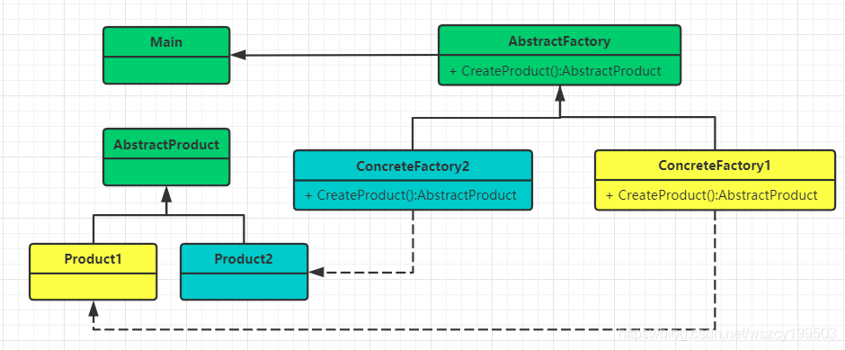

# 23 种经典设计模式

| 分类       | 设计模式                                                     |
| ---------- | ------------------------------------------------------------ |
| 创建型模式 | 工厂方法模式（Factory Method）、抽象工厂模式（Abstract Factory）、建造者模式（Builder）、 原型模式（Prototype）、单例模式(Singleton) |
| 结构型     | 适配器模式(Adapter)、桥接模式（Bridge）、组合模式（Composite）、装饰器模式（Decorator）、 门面模式（Facade）、享元模式（Flyweight）、代理模式（Proxy） |
| 行为型     | 解释器模式（Interpreter）、模板方法模式（Template Method）、责任链模式（Chain of Responsibility）、 命令模式（Command）、迭代器模式（Iterator）、调解者模式（Mediator）、备忘录模式（Memento）、 观察者模式（Observer）、状态模式（State）、策略模式（Strategy）、访问者模式（Visitor） |


通常来说，设计模式都是混合使用，不会独立应用。利用穷举法充分理解设计模式的应用场景。在平时 的应用中，不是用设计模式去生搬硬套，而是根据具体业务问题需要时借鉴。

## 设计模式在应用中遵循六大原则

1. 开闭原则（Open Close Principle） 开闭原则就是说对扩展开放，对修改关闭。在程序需要进行拓展的时候，不能去修改原有的代码，实现一个热插拔的效果。所以一句话概括就是：为了使程序的扩展性好，易于维护和升级。想要达到这样的效果，我们需要使用接口和抽象类，后面的具体设计中我们会提到这点。 
2. 里氏代换原则（Liskov Substitution Principle） 里氏代换原则(Liskov Substitution Principle LSP)面向对象设计的基本原则之一。 里氏代换原则中说，任何基类可以出现的地方，子类一定可以出现。 LSP 是继承复用的基石，只有当衍生类可以替换掉基类，软件单位的功能不受到影响时，基类才能真正被复用，而衍生类也能够在基类的基础上增加新的行为。里氏代换原则是对“开-闭”原则的补充。实现“开-闭”原则的关键步骤就是抽象化。而基类与子类的继承关系就是抽象化的具体实现，所以里氏代换原则是对实现抽象化的具体步骤的规范。
3. 依赖倒转原则（Dependence Inversion Principle） 这个是开闭原则的基础，具体内容：针对接口编程，依赖于抽象而不依赖于具体。
4. 接口隔离原则（Interface Segregation Principle） 这个原则的意思是：使用多个隔离的接口，比使用单个接口要好。还是一个降低类之间的耦合度的意思，从这儿我们看出，其实设计模式就是一个软件的设计思想，从大型软件架构出发，为了升级和维护方便。所以上文中多次出现：降低依赖，降低耦合。
5. 迪米特法则（最少知道原则）（Demeter Principle） 为什么叫最少知道原则，就是说：一个实体应当尽量少的与其他实体之间发生相互作用，使得系统功能模块相对独立。
6. 合成复用原则（Composite Reuse Principle） 原则是尽量使用合成/聚合的方式，而不是使用继承。</li>

## 设计模式之间的关系图


# 1 单例模式

创建型模式，保证一个类仅有一个实例，并提供一个访问它的全局访问点。 Spring 中的单例模式完成了后半句话，即提供了全局的访问点 BeanFactory。但没有从构造器级别去控制单例，这是因为 Spring 管理的是是任意的 Java 对象。 Spring 下默认的 Bean 均为单例。 常用单例模式写法:饿汉式、懒汉式、注册登记式(枚举或Map)、序列化。

## 1.1 懒汉式

懒汉式，默认加载的时候不实例化，在需要用到这个实例时候才实例化

```java
// 线程不安全
public class LazyOne {
    private LazyOne(){}

    private static LazyOne lazy = null;

    public static LazyOne getInstance() {
        if (lazy == null) {
            lazy = new LazyOne();
        }
        return lazy;
    }
}
```

### 加锁的懒汉式

```java
public class LazyLock {
    private LazyLock(){}

    private static LazyLock lazy = null;
	//使用synchronized，线程安全，但性能较差
    public synchronized static LazyLock getInstance() {
        if (lazy == null) {
            lazy = new LazyLock();
        }
        return lazy;
    }

    /*public static LazyLock getInstance() {
        synchronized (LazyLock.class) {
            if (lazy == null) {
                lazy = new LazyLock();
            }
        }
        return lazy;
    }*/
}
```

### 双重判断加锁的懒汉式

```java
public class LazyDoubleLock {
    private LazyDoubleLock(){}

    private static LazyDoubleLock instance;

    public static LazyDoubleLock getInstance() {
        if (instance == null) {
            synchronized (LazyDoubleLock.class) {
                // 可能会有几个线程同时进入外层代码块，第一个线程执行完，后续线程还会进入内层
                if (instance == null) {
                    instance = new LazyDoubleLock();
                }
            }
        }
        return instance;
    }
}
```

双重检查模式，进行了两次的判断，`外层判断是为了避免 synchonized 导致的性能开销`，`内层判断是为了避免重复实例化`。由于singleton=new Singleton()对象的创建在JVM中可能会进行重排序，在多线程访问下存在风险，使用volatile修饰signleton实例变量有效，解决该问题。

>`volatile`
>
> <mark>经过volatile的修饰避免JVM编译器的指令重排</mark>，当线程A执行instance = new LazyDoubleLock()的时候，JVM执行顺序是：
>
>```java
>memory =allocate(); //1：分配对象的内存空间
>ctorInstance(memory); //2：初始化对象
>instance =memory; //3：设置instance指向刚分配的内存地址
>```
>
>如此在线程B看来，instance对象的引用要么指向null，要么指向一个初始化完毕的Instance，而不会出现某个中间态，保证了安全。
>
>`指令重排`
>
>上诉这些指令顺序并非一成不变，有可能会经过JVM和CPU的优化，指令重排成下面的顺序：
>
>```java
>memory =allocate(); //1：分配对象的内存空间
>instance =memory; //3：设置instance指向刚分配的内存地址
>ctorInstance(memory); //2：初始化对象<br>
>```
>
>当线程A执行完1,3,时，instance对象还未完成初始化，但已经不再指向null。此时如果线程B抢占到CPU资源，执行 if（instance == null）的结果会是false，从而返回一个没有初始化完成的instance对象。

### 内部类实现的懒汉式

```java
public class LazyInnerClass {
    private LazyInnerClass(){}

    public static LazyInnerClass getInstance() {
        return SingletonHolder.SINGLETON;
    }

    private static class SingletonHolder {
        private static final LazyInnerClass SINGLETON = new LazyInnerClass();
    }
}
```

只有第一次调用getInstance方法时，虚拟机才加载 Inner 并初始化instance ，只有一个线程可以获得对象的初始化锁，其他线程无法进行初始化，保证对象的唯一性。目前此方式是所有单例模式中最推荐的模式，但具体还是根据项目选择。

### 线程安全且防止反射侵犯的懒汉式

```java
// 默认使用LazyThree的时候，会先初始化内部类，如果没有使用的话，内部类是不加载的
// 如果默认构造方法不私有化，相当于有一个默认的public的无参构造方法，就意味着在代码中随时可以new出来
// 此方式可以防止反射侵犯
public class LazyThree {
    private static boolean initialized = false;
    
    private LazyThree() {
        synchronized (LazyThree.class) {
            if (!initialized) {
                initialized = !initialized;
            } else {
                throw new RuntimeException("单例已被侵犯");
            }
        }
    }
    
    public static LazyThree getInstance() {
        return LazyHolder.LAZY;
    }
    
    private static class LazyHolder {
        private static final LazyThree LAZY = new LazyThree();
    }
}
```

## 1.2 饿汉式

在实例使用之前，不管用不用，都先new一个，避免线程安全问题，但容易产生垃圾，因为一开始就初始化

```java
// 也是解决懒汉式指令重排的类初始化方案之一
public class Hungry {
    // 私有化构造方法
    private Hungry(){}
	// 类加载顺序，先静态，后动态，先属性，后方法，先上，后下
    private static final Hungry hungry = new Hungry();

    public static Hungry getInstance() {
        return hungry;
    }
}
```

## 1.3 注册登记式

### 枚举

```java
public enum RegisterEnum {
    INSTANCE;
}
```

默认枚举实例的创建是线程安全的，并且在任何情况下都是单例。实际上：

- 枚举类隐藏了私有的构造器 
- 枚举类的域 是相应类型的一个实例对象

那么枚举类型日常用例是这样子的：

```java
public enum  RegisterEnum {
    INSTANCE;
    
    public static RegisterEnum getInstance() {
        return RegisterEnum.INSTANCE;
    }
}
```

枚举单例模式在Effective Java中推荐的单例模式之一。但枚举实例在日常开发是很少使用的，就是很简单以导致可读性较差。

### 容器

注册登记式，每使用一次，都往一个固定的容器中注册并且将使用过的对象进行缓存，下次取对象时候，就直接从缓存中取值，以保证每次获取的都是统一对象，IOC中的单例模式，就是典型的注册登记式单例：

```java
public class RegisterMap {
    private RegisterMap(){}

    // ConcurrentHashMap线程安全，HashMap
    private static Map<String, Object> register = new ConcurrentHashMap<>();

    public static RegisterMap getInstance(String name) {
        if (name == null) {
            name = RegisterMap.class.getName();
        }
        if (register.get(name) == null) {
            try {
                register.put(name, new RegisterMap());
            } catch (Exception e) {
                e.printStackTrace();
            }
        }
        return (RegisterMap) register.get(name);
    }
}
```

### 序列化

序列化与反序列化保证单例，重写readResolve

```java
public class Seriable implements Serializable {

    public final static Seriable INSTANCE = new Seriable();

    private Seriable(){}

    public static Seriable getInstance() {
        return INSTANCE;
    }

    // 解决单例序列化问题
    private Object readResolve() {
        return INSTANCE;
    }
}
```

## 1.4 单例模式并发性能测试

```java
public class ThreadSafeTest {
    public static void main(String[] args) throws InterruptedException {
        long start = System.currentTimeMillis();
        int threadNum = 10;
        final CountDownLatch countDownLatch = new CountDownLatch(threadNum);

        for(int i = 0; i < threadNum; i++) {
            new Thread(new Runnable() {
                @Override
                public void run() {
                    for (int i = 0; i < 1000; i++) {
                        LazyOne lazy = LazyOne.getInstance();
                        System.out.println(lazy.hashCode());
                    }
                    countDownLatch.countDown();
                }
            }).start();
        }
        // main线程阻塞，直到计数器变为0，才会继续往下执行！
        countDownLatch.await();

        long end = System.currentTimeMillis();
        System.out.println("总耗时：" + (end - start));

        //RegisterEnum.INSTANCE.hashCode();

        Seriable s1 = null;
        Seriable s2 = Seriable.getInstance();

        try {
            FileOutputStream fos = new FileOutputStream("Seriable.obj");
            ObjectOutputStream oos = new ObjectOutputStream(fos);
            oos.writeObject(s2);
            oos.flush();
            oos.close();

            FileInputStream fis = new FileInputStream("Seriable.obj");
            ObjectInputStream ois = new ObjectInputStream(fis);
            s1 = (Seriable) ois.readObject();
            ois.close();
            System.out.println(s1);
            System.out.println(s2);
            System.out.println(s1 == s2);
        } catch (Exception e) {
            e.printStackTrace();
        }

    }
}
```

# 2 工厂模式（Factory）

该模式用于封装和管理对象的创建，是一种创建型模式。

## 2.1 简单工厂模式（Factory）

应用场景:又叫做静态工厂方法(StaticFactory Method)模式，但不属于 23 种设计模式之一。 简单工厂模式的实质是由一个工厂类根据传入的参数，动态决定应该创建哪一个产品类。 Spring 中的 BeanFactory 就是简单工厂模式的体现，根据传入一个唯一的标识来获得 Bean 对象，但是否是在传入参数后创建还是传入参数前创建这个要根据具体情况来定。 


```java
/**
 * 产品接口-大众汽车
 * AbstractProduct
 */
public interface Volkswagen {
    void makeCar();
}
// Product1
public class Sagitar implements Volkswagen {
    public Sagitar() {
        this.makeCar();
    }

    @Override
    public void makeCar() {
        System.out.println("大众-速腾");
    }
}
// Product2
public class Lavida implements Volkswagen {
    public Lavida() {
        this.makeCar();
    }

    @Override
    public void makeCar() {
        System.out.println("大众-朗逸");
    }
}
```

```java
// Factory
public class SimpleFactory {
    /**
     * 实现统一管理，专业化管理，如果没有工厂模式，小作坊，没有执行标准
     * 这种工厂模式不太合理
     */
    public Volkswagen makeCar(String carType) {
        if ("S".equalsIgnoreCase(carType)) {
            return new Sagitar();
        } else if ("L".equalsIgnoreCase(carType)) {
            return new Lavida();
        } else {
            System.out.println("无该产品");
            return null;
        }
    }
}
public class SimpleFactoryTest {
    public static void main(String[] args) {
        SimpleFactory factory = new SimpleFactory();
        Volkswagen sagitar = factory.makeCar("S");
        Volkswagen lavida = factory.makeCar("L");
    }
}
```

## 2.2 工厂方法模式（Factory Method）

应用场景:通常由应用程序直接使用 new 创建新的对象，为了将对象的创建和使用相分离，采用工厂模 式,即应用程序将对象的创建及初始化职责交给工厂对象。 一般情况下,应用程序有自己的工厂对象来创建 Bean.如果将应用程序自己的工厂对象交给 Spring 管 理,那么 Spring 管理的就不是普通的 Bean,而是工厂 Bean。 



定义一个抽象工厂，其定义了产品的生产接口，但不负责具体的产品，将生产任务交给不同的派生类工厂。这样不用通过指定类型来创建对象了。

```java
/**
 * AbstractFactory
 * 工厂接口，就定义了所有工厂的执行标准
 * 这种工厂模式增加了代码的使用复杂度
 */
public interface VolkswagenFactory {
    Volkswagen makeCar();
}
// ConcreteFactory1
public class SagitarFactory implements VolkswagenFactory {
    @Override
    public Volkswagen makeCar() {
        return new Sagitar();
    }
}
// ConcreteFactory2
public class LavidaFactory implements VolkswagenFactory {
    @Override
    public Volkswagen makeCar() {
        return new Lavida();
    }
}
```

```java
public class FactoryMethodTest {
    public static void main(String[] args) {
        VolkswagenFactory sagitarFactory = new SagitarFactory();
        VolkswagenFactory lavidaFactory = new LavidaFactory();
        sagitarFactory.makeCar();
        lavidaFactory.makeCar();
    }
}
```

## 2.3 抽象工厂模式（Abstract Factory）

上面两种模式不管工厂怎么拆分抽象，都只是针对一类产品AbstractProduct。 抽象工厂模式通过在AbstarctFactory中增加创建产品的接口，并在具体子工厂中实现新加产品的创建，当然前提是子工厂支持生产该产品。否则继承的这个接口可以什么也不干。 


```java
// AbstractFactory 
public abstract class AbstractFactory {
    public abstract Volkswagen makeSagitar();
    public abstract Volkswagen makeLavida();
}
// ConcreteFactory
public class VolkswagenFactory extends AbstractFactory {
    @Override
    public Volkswagen makeSagitar() {
        return new Sagitar();
    }

    @Override
    public Volkswagen makeLavida() {
        return new Lavida();
    }
}
public class AbstractFactoryTest {
    public static void main(String[] args) {
        AbstractFactory v = new VolkswagenFactory();
        v.makeLavida();
        v.makeSagitar();
    }
}
```

## 扩展

如果要添加一种产品：

```java
public class Polo implements Volkswagen {

    public Polo(){
        this.makeCar();
    }

    @Override
    public void makeCar() {
        System.out.println("polo");
    }
}
```

简单工厂模式修改源码添加一个 else if，代码中需要指定新的类型才能使用：

```java
public Volkswagen makeCar(String carType) {
    if ("S".equalsIgnoreCase(carType)) {
        return new Sagitar();
    } else if ("L".equalsIgnoreCase(carType)) {
        return new Lavida();
    } else if ("P".equalsIgnoreCase(carType)) {
        return new Polo();
    } else {
        System.out.println("无该产品");
        return null;
    }
}
```

工厂方法模式，需要添加一个Factory，代码中需要创建新的接口才能使用：

```java
public class PoloFactory implements VolkswagenFactory{
    @Override
    public Volkswagen makeCar() {
        return new Polo();
    }
}
```

抽象工厂模式，需要更新API，然后代码中可以直接调用：

```java
public abstract class AbstractFactory {
    public abstract Volkswagen makeSagitar();
    public abstract Volkswagen makeLavida();
    public abstract Volkswagen makePolo();
}
public class VolkswagenFactory extends AbstractFactory {
    @Override
    public Volkswagen makeSagitar() {
        return new Sagitar();
    }

    @Override
    public Volkswagen makeLavida() {
        return new Lavida();
    }

    @Override
    public Volkswagen makePolo() {
        return new Polo();
    }
}
```

# 3 代理模式（Proxy）

代理模式应用场景的三个必要条件：

- 两个角色：执行者、被代理对象 
- 注重过程，必须要做，被代理对象没时间做或者不想做 
- 执行者必须拿到被代理对象的个人资料（执行者持有被代理对象的引用）

应用场景：为其他对象提供一种代理以控制对这个对象的访问。从结构上来看和 Decorator 模式类似，但 Proxy 是控制，更像是一种对功能的限制，而 Decorator 是增加职责。 Spring 的 Proxy 模式在 AOP 中有体现，比如 JdkDynamicAopProxy 和 Cglib2AopProxy。

代理模式，字节码重组，可以在每一个方法调用之前加一些代码，在方法调用之后再加一些代码 AOP:事务代理（声明式事务，那个方法需要加事务，那个方法不需要事务）、日志监听

>service方法
>
>开启一个事务（open）
>
>事务执行(由我们代码完成)
>
>监听到是否异常，可能需要根据异常的类型来决定这个事务是否需要回滚还是继续提交
>
>事务关闭（close）

`JDK的动态代理`是通过接口来进行强制转换的，生成以后的代理对象，可以强制转换为接口

`CGLib的动态代理`是通过生成一个被代理对象的子类，然后重写父类的方法，生成以后的对象，可以强制转换为被代理对象（也就是用自己写的类），子类引用赋值给父类

## 3.1 JDK动态代理

> JDK 动态代理只能针对接口，如果一个类没有实现任何接口，要对其进行动态代理只能使用 CGLIB

```java
/**
 * 代理对象，房地产经纪人，中介
 */
public class Realtor implements InvocationHandler {

    //被代理对象的引用作为一个成员变量保存下来了
    private Tenant tenant;

    //获取被代理人的个人资料
    public Object getInstance(Tenant tenant) {
        this.tenant = tenant;
        Class clazz = tenant.getClass();
        System.out.println("被代理对象的class是:" + clazz);
        return Proxy.newProxyInstance(clazz.getClassLoader(), clazz.getInterfaces(), this);
    }

    @Override
    public Object invoke(Object proxy, Method method, Object[] args) throws Throwable {
        System.out.println("我是中介，请提出你的要求：");
        System.out.println("--------------------");
        method.invoke(this.tenant, args);
        System.out.println("--------------------");
        System.out.println("找到房源，如果合适的话，就准备入住。");
        return null;
    }
}
// JDK代理中被代理对象必须实现接口
public interface Tenant {
    void rentingRoom();
}
// 被代理对象
public class Jack implements Tenant {
    @Override
    public void rentingRoom() {
        System.out.println("一室一厅，2000元以下！");
    }
}
public class ProxyTest {
    public static void main(String[] args) throws IOException {
        Tenant obj = (Tenant)new Realtor().getInstance(new Jack());
        System.out.println(obj.getClass());
        obj.rentingRoom();
    }
}
```

### 原理

1. 通过实现 `InvocationHandler` 接口创建自己的调用处理器，拿到被代理对象的引用，然后获取它的接口 
2. 通过为 Proxy 类指定 ClassLoader 对象和一组 interface(代理对象所实现的接口) 来创建动态代理
3. 通过反射机制获取动态代理类的构造函数，其唯一参数类型就是调用处理器接口类型
4. 重新动态生成一个 class 字节码 
5. 然后编译

获取代理类字节码内容：

```java
byte[] data = ProxyGenerator.generateProxyClass("$Proxy0", new Class[]{Tenant.class});
FileOutputStream os = new FileOutputStream("E:/JAVA/$Proxy0.class");
os.write(data);
os.close();
```

```java
public final class $Proxy0 extends Proxy implements Tenant {
    private static Method m1;
    private static Method m2;
    private static Method m3;
    private static Method m0;

    public $Proxy0(InvocationHandler var1) throws  {
        super(var1);
    }

    public final boolean equals(Object var1) throws  {
        try {
            return (Boolean)super.h.invoke(this, m1, new Object[]{var1});
        } catch (RuntimeException | Error var3) {
            throw var3;
        } catch (Throwable var4) {
            throw new UndeclaredThrowableException(var4);
        }
    }

    public final String toString() throws  {
        try {
            return (String)super.h.invoke(this, m2, (Object[])null);
        } catch (RuntimeException | Error var2) {
            throw var2;
        } catch (Throwable var3) {
            throw new UndeclaredThrowableException(var3);
        }
    }
  	// 实际上就是调用Realtor的public Object invoke(Object proxy, Method method, Object[] args)方法
    public final void rentingRoom() throws  {
        try {
            super.h.invoke(this, m3, (Object[])null);
        } catch (RuntimeException | Error var2) {
            throw var2;
        } catch (Throwable var3) {
            throw new UndeclaredThrowableException(var3);
        }
    }

    public final int hashCode() throws  {
        try {
            return (Integer)super.h.invoke(this, m0, (Object[])null);
        } catch (RuntimeException | Error var2) {
            throw var2;
        } catch (Throwable var3) {
            throw new UndeclaredThrowableException(var3);
        }
    }
  	// 在静态代码块中获取了4个方法：Object中的equals方法、Tenant中的rentingRoom方法、Object中的hashCode方法、Object中toString方法  
    static {
        try {
            m1 = Class.forName("java.lang.Object").getMethod("equals", Class.forName("java.lang.Object"));
            m2 = Class.forName("java.lang.Object").getMethod("toString");
            m3 = Class.forName("com.spring.design.proxy.jdk.Tenant").getMethod("rentingRoom");
            m0 = Class.forName("java.lang.Object").getMethod("hashCode");
        } catch (NoSuchMethodException var2) {
            throw new NoSuchMethodError(var2.getMessage());
        } catch (ClassNotFoundException var3) {
            throw new NoClassDefFoundError(var3.getMessage());
        }
    }
}
```

## 3.2 Cglib代理

> 由于 cglib 是基于继承的方式实现类的动态代理，无法覆写 final 方法。

```java
public class Mic {
    public void rentingRoom() {
        System.out.println("一室一厅，2000元以下！");
    }
    public final void test() {
        System.out.println("final 方法测试");
    }
}
public class Realtor implements MethodInterceptor {

    public Object getInstance(Class clazz) {
        Enhancer enhancer = new Enhancer();
        // 把父类设置为谁,这一步就是告诉CGLib生成的子类需要继承那个类
        enhancer.setSuperclass(clazz);
        enhancer.setCallback(this);
        // 1.生成源代码
        // 2.编译class文件
        // 3.加载到jvm中，并返回被代理对象
        return enhancer.create();
    }

    @Override
    public Object intercept(Object o, Method method, Object[] objects, MethodProxy methodProxy) throws Throwable {
        System.out.println("我是中介，请提出你的要求：");
        System.out.println("--------------------");
        methodProxy.invokeSuper(o, objects);
        System.out.println("--------------------");
        System.out.println("找到房源，如果合适的话，就准备入住。");
        return null;
    }
}
public class ProxyTest {
    public static void main(String[] args) {
        Mic obj = (Mic)new Realtor().getInstance(Mic.class);
        obj.rentingRoom();
        // obj.test(); // 无法执行代理内容，只能正常调用
    }
}
```

# 4 委派模式（Delegate）

应用场景：不属于 23 种设计模式之一，是面向对象设计模式中常用的一种模式。 这种模式的原理为类 B和类 A 是两个互相没有任何关系的类，B 具有和 A 一模一样的方法和属性；并且调用 B 中的方法，属性就是调用 A 中同名的方法和属性。B 好像就是一个受 A 授权委托的中介。第三方的代码不需要知道 A 的存在，也不需要和 A 发生直接的联系，通过 B 就可以直接使用 A 的功能，这样既能够使用到 A 的各种功能，又能够很好的将 A 保护起来了，一举两得。 行为型模式，要和代理模式区分开来。持有被委托人的引用。`不关心过程，只关心结果`。主要目的就是隐藏具体的实现逻辑。 IOC容器中，有一个Register（为了告诉容器，在这个类被初始化的过程中，需要做很多不同的逻辑 ，需要实现多个任务执行者，分别实现各自的功能）显式指定谁来执行。

```java
public interface MyDelegate {
    void doing();
}
public class EmployeeA implements MyDelegate {
    @Override
    public void doing() {
        System.out.println("员工A开始执行任务");
    }
}
public class EmployeeB implements MyDelegate {
    @Override
    public void doing() {
        System.out.println("员工B开始执行任务");
    }
}
public class Dispatcher implements MyDelegate {

    MyDelegate myDelegate;

    public Dispatcher(MyDelegate myDelegate) {
        this.myDelegate = myDelegate;
    }

    @Override
    public void doing() {
        this.myDelegate.doing();
    }
}
public class DelegateTest {
    public static void main(String[] args) {
        Dispatcher dispatcher = new Dispatcher(new EmployeeA());
        dispatcher.doing();
    }
}
```

# 5 策略模式（Strategy）

应用场景：定义一系列的算法，把它们一个个封装起来，并且使它们可相互替换。本模式使得算法可独立于使用它的客户而变化。 Spring 中在实例化对象的时候用到 Strategy 模式，在 SimpleInstantiationStrategy 有使用。 行为型模式，最终执行结果是固定的。执行过程和执行逻辑不一样。

```java
// 策略模式,Comparator为例
List<Long> numbers = new ArrayList<>();
// 返回值是固定的，-1，0，1
Collections.sort(numbers, (o1, o2) -> {
    // 中间逻辑是不一样的
    return 0;
});
```

# 6 模板方法模式（Template Method）

定义一个操作中的算法的骨架，而将一些步骤延迟到子类中。Template Method 使得子类可以不改变一个算法的结构即可重定义该算法的某些特定步骤。Template Method 模式一般是需要继承的。这里想要探讨另一种对 Template Method 的理解。 Spring中的 JdbcTemplate，在用这个类时并不想去继承这个类，因为这个类的方法太多，但是我们还是想用到 JdbcTemplate 已有的稳定的、公用的数据库连接，可以把变化的东西抽出来作为一个参数传入 JdbcTemplate 的方法中。但是变化的东西是一段代码，而且这段代码会用到JdbcTemplate 中的变量。怎么办？那我们就用回调对象吧。在这个回调对象中定义一个操纵JdbcTemplate 中变量的方法，我们去实现这个方法，就把变化的东西集中到这里了。然后我们再传入这个回调对象到 JdbcTemplate，从而完成了调用。这就是 Template Method 不需要继承的另一种实现方式。 Spring JDBC就是一个模版模式，是Java规范，各个数据库厂商自己去实现：

1. 加载驱动类DriverManager 
2. 建立连接 
3. 创建语句集（标准语句集，预处理语句集） 
4. 执行语句集 
5. 结果集ResultSet 游标

行为型模式 ，执行流程固定，但中间有些步骤有细微差别（运行时才确定）。可实现批量生产。

```java
public abstract class Bevegrage {
    // 不能被重写
    public final void create() {
        //1.把水烧开
        boilWater();
        //2.把杯子准备好，把原材料放到杯子中
        pourInCup();
        //3.用水冲泡
        brew();
        //4.添加辅料
        addAccessories();
    }

    public abstract void addAccessories();

    public abstract void pourInCup();

    public void brew() {
        System.out.println("将开水倒入杯中");
    }

    public void boilWater() {
        System.out.println("烧开水，烧到100度可以起锅了");
    }
}
public class Coffee extends Bevegrage {
    @Override
    public void addAccessories() {
        System.out.println("添加牛奶");
    }

    @Override
    public void pourInCup() {
        System.out.println("将咖啡倒入杯子");
    }
}
public class Tea extends Bevegrage {
    @Override
    public void addAccessories() {
        System.out.println("添加蜂蜜");
    }

    @Override
    public void pourInCup() {
        System.out.println("将茶叶倒入杯子");
    }
}
public class TemplateTest {
    public static void main(String[] args) {
        Coffee coffee = new Coffee();
        coffee.create();

        Tea tea = new Tea();
        tea.create();
    }
}
```

# 7 原型模式（Prototype）

应用场景：原型模式就是从一个对象再创建另外一个可定制的对象，而且不需要知道任何创建的细节。 所谓原型模式，就是 Java 中的克隆技术，以某个对象为原型。复制出新的对象。显然新的对象具备原 型对象的特点，效率高（避免了重新执行构造过程步骤）。 创建型模式，首先有一个原型。数据内容相同，但对象实例不同（完全两个个体）。就是一个现成的对象，这个对象里面已经有设置好的值，当我要新建一个对象，并且要给新建的对象赋值，赋值内容要跟之前的一模一样。

>传统做法
>
>```java
>ConcretePrototype cp = new ConcretePrototype();
>cp.setAge(18);
>ConcretePrototype copy = new ConcretePrototype();
>copy.setAge(cp.getAge());
>```
>
>`浅拷贝`：能够直接拷贝其实际内容的数据类型，只支持9种，八大基本数据类型和String
>
>克隆是不走构造方法，直接是字节流复制

```java
public class ConcretePrototype implements Cloneable  {
    public int age;

    public ArrayList<String> list = new ArrayList<>();

    public int getAge() {
        return age;
    }

    public void setAge(int age) {
        this.age = age;
    }

    @Override
    protected Object clone() throws CloneNotSupportedException {
        return (ConcretePrototype) super.clone();
    }
}
public class CloneTest {
    public static void main(String[] args) {
        try {
            ConcretePrototype cp = new ConcretePrototype();
            cp.setAge(18);
            ConcretePrototype copy = (ConcretePrototype) cp.clone();
            copy.setAge(20);

            //结果为true，证明两个对象cp和copy虽然地址不同，但是公用同一个list地址,为浅拷贝
            System.out.println(cp.list == copy.list);
            System.out.println(cp.getAge());
            System.out.println(copy.getAge());
        } catch (Exception e) {
            e.printStackTrace();
        }
    }
}
```

```java
@Override
protected Object clone() {
    ConcretePrototype prototype = null;
    try {
        prototype = (ConcretePrototype) super.clone();
        // 深克隆
        prototype.list = (ArrayList) list.clone();
        // 克隆基于字节码的
        // 用反射或者循环
    } catch (Exception e) {
    }
    return prototype;
}
```

## 利用序列化实现深拷贝

```java
public class Monkey {
    int height;

    int weight;

    Date birthday;
}
public class GoldRingedStaff implements Serializable {

}
public class TheGreatestSage extends Monkey implements Cloneable, Serializable {

    // 金箍棒
    private GoldRingedStaff staff;

    public TheGreatestSage() {
        this.staff = new GoldRingedStaff();
        this.birthday = new Date();
        this.height = 150;
        this.weight = 30;
        System.out.println("------------------------------");
    }

    @Override
    public Object clone() {
        ByteArrayOutputStream bos = null;
        ObjectOutputStream oos = null;
        ByteArrayInputStream bis = null;
        ObjectInputStream ois = null;
        try {
            //return super.clone();
            // 序列化
            bos = new ByteArrayOutputStream();
            oos = new ObjectOutputStream(bos);
            oos.writeObject(this);

            // 反序列化
            bis = new ByteArrayInputStream(bos.toByteArray());
            ois = new ObjectInputStream(bis);
            TheGreatestSage copy = (TheGreatestSage) ois.readObject();
            copy.birthday = new Date();
            return copy;
        } catch (Exception e) {
            e.printStackTrace();
            return null;
        } finally {
            try {
                bos.close();
                oos.close();
                ois.close();
                bis.close();
            } catch (IOException e) {
                e.printStackTrace();
            }

        }
    }

    public void change() {
        TheGreatestSage copySage = (TheGreatestSage) clone();
        System.out.println("大圣本尊生日是：" + this.birthday.getTime());
        System.out.println("克隆大圣的生日是：" + copySage.birthday.getTime());
        System.out.println("大圣本尊和克隆大圣是否为同一个对象：" + (this == copySage));
        System.out.println("大圣本尊持有的金箍棒和克隆大圣持有的金箍棒是否为同一个对象：" + (this.getStaff() == copySage.getStaff()));

    }

    public GoldRingedStaff getStaff() {
        return staff;
    }

    public void setStaff(GoldRingedStaff staff) {
        this.staff = staff;
    }
}
public class TestPrototype {
    public static void main(String[] args) {
        TheGreatestSage sage = new TheGreatestSage();
        sage.change();
    }
}
//------------------------------
//大圣本尊生日是：1585814593421
//克隆大圣的生日是：1585814593446
//大圣本尊和克隆大圣是否为同一个对象：false
//大圣本尊持有的金箍棒和克隆大圣持有的金箍棒是否为同一个对象：false
```

# 8 适配器模式

`适配器模式（Adapter Pattern）`是作为两个不兼容的接口之间的桥梁。这种类型的设计模式属于结构型模式，它结合了两个独立接口的功能。

根据适配器类与适配者类的关系不同，适配器模式可分为对象适配器和类适配器两种，在`对象适配器模式`中，适配器与适配者之间是`关联`关系；在`类适配器模式`中，适配器与适配者之间是`继承（或实现）`关系。

**使用场景：**有动机地修改一个正常运行的系统的接口

```java
/**
* 进口笔记本电脑需要的三项电源，和只提供的二项电源冲突
*/
// 插头二项供电 Adaptee 适配者类(原有的类) 被适配的角色
public class TwoPower {
    public void powerByTwo() {
        System.out.println("提供二项供电");
    }
}
// 插头提供三项供电 Target 目标抽象类 定义客户所需接口，可以是一个抽象类、接口或具体类
public interface ThreePower {
    void powerByThree();
}
// 二项转三项的适配器  组合的方式对象适配器 Adapter适配器类 对 Adaptee 和 Target 进行适配
public class TwoToThreeAdapter implements ThreePower {
    /**
     * 使用委托来完成适配
     */
    private TwoPower twoPower;

    public TwoToThreeAdapter(TwoPower twoPower) {
        this.twoPower = twoPower;
    }


    @Override
    public void powerByThree() {
        System.out.println("借助组合适配器转化二项电");
        twoPower.powerByTwo();
    }
}
// 二项转三项的适配器  继承的方式  类
public class TwoToThreeAdapter2 extends TwoPower implements ThreePower {
    @Override
    public void powerByThree() {
        System.out.println("借助继承适配器转化二项电");
        this.powerByTwo();
    }
}
public class NoteBook {
    /**
     * 期望的三项供电接口
     */
    private ThreePower threePower;

    public NoteBook(ThreePower threePower) {
        this.threePower = threePower;
    }
    public static void main(String[] args) {
        // 继承方式的适配器使用 类适配器
        ThreePower threePower1 = new TwoToThreeAdapter2();
        NoteBook noteBook1 = new NoteBook(threePower1);
        noteBook1.recharge();
        noteBook1.work();

        // 组合方式的适配器使用 对象适配器
        // 现在只有二项供电
        TwoPower twoPower = new TwoPower();
        ThreePower threePower = new TwoToThreeAdapter(twoPower);
        NoteBook noteBook = new NoteBook(threePower);
        // 1. 充电
        noteBook.recharge();
        // 2. 工作
        noteBook.work();
    }

    public void work() {
        System.out.println("笔记本电脑开始工作!");
    }

    public void recharge() {
        // 使用三项充电
        threePower.powerByThree();
    }
}
```

9 装饰器模式

10 总结

| 设计模式                | 应用场景（特点）                                             | 一句话归纳                                       |
| ----------------------- | ------------------------------------------------------------ | ------------------------------------------------ |
| 工厂模式（Factory）     | 1、对调用者隐藏复杂的逻辑处理过程，调用者只关心执行结果 2、工厂要对结果负责，包装生产出符合规范的产品 | 只对结果负责，不要三无产品                       |
| 单例模式（Singleton）   | 1、保证从系统启动到系统终止，全过程只会产生一个实例 2、当在应用中遇到功能性冲突的时候，需要使用单例模式 | 保证独一无二。                                   |
| 适配器模式（Adapter）   |                                                              | 需要一个转换头（兼容）。                         |
| 装饰器模式（Decorator） |                                                              | 需要包装，但不改变本质(同宗同源)。               |
| 代理模式（Proxy）       | 1、两个参与角色：执行者，被代理人 2、对于被代理人来说，这件事情是一定要做的，但是自己又不想做或没时间做 3、需要获取被代理人的个人资料，即引用 | 办事要求人，所以找代理。                         |
| 观察者模式（Observer）  |                                                              | 完成时通知我。                                   |
| 策略模式（Strategy）    | 1、执行最终结果一样 2、执行过程和执行逻辑不一样              | 我行我素，达到目的就行。                         |
| 模板模式（Template）    | 1、执行流程固定，但中加你有些步骤有细微差别 2、可实现批量生产 | 流程标准化，原料自己加。                         |
| 委派模式（Delegate）    | 1、两个参与角色，委托人和被委托人 2、委托人和被委托人在权力上平等（实现统一接口） 3、委托人持有被委托人的引用 4、不关心过程，只关心结果 | 干活是你的（普通员工），功劳是我的（项目经理）。 |
| 原型模式（Prototype）   | 1、首先有一个原型 2、数据内容相同，但对象实例不同（完全不同的内存地址） | 拔一根猴毛，吹出千万个。                         |

