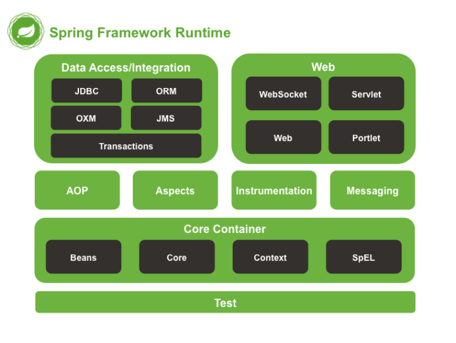

## 框架

维基百科：软件框架，通常指的是为了实现某个业界标准或完成特定基本任务的软件组件规范，也指为了实现某个软件组件规范时，提供规范所要求之基本功能的软件产品。 框架就是制定一套规范或者规则，大家在该规范或者规则下工作。或者说就是使用别人搭好的舞台，你来做表演。 框架的特点：

- 半成品 
- 封装了特定的处理流程和控制逻辑 
- 成熟的，不断升级改进的软件

框架与类库的区别：

- 框架一般是封装了逻辑，高内聚的，类库则是松散的工具组合 
- 框架专注于某一领域，类库则是更为通用的

为什么使用框架：

- 软件系统日趋复杂 
- 重用度高，开发效率和质量提高 
- 软件设计人员专注于对领域的了解，使需求分析更充分 
- 易于上手，快速解决问题

## Spring 是什么

``Spring`` 是一个开源的轻量级`` Java SE(Java标准版本)/Java EE(Java企业版本) ``开发应用框架，其目的是用于**简化企业级应用程序开发**，是一个轻量级的控制反转(IoC)和面向切面(AOP)的容器框架。

- 从大小与开销两方面而言Spring都是轻量级的 
- 通过控制反转(IoC)的技术达到松耦合 
- 面向Bean，只需要编写非常普通的Bean，面向切面编程的丰富支持，允许通过分离应用的业务逻辑与系统级服务器进行内聚性的开发 
- 包含并管理应用对象的配置和生命周期，这个意义上是一个容器 
- 将简单的组件配置，组合成为复杂的应用，这个意义上是框架，与主流框架无缝集成 
- 设计模式，将Java中经典的设计模式运用得淋漓尽致

## 为什么是 Spring

通过面向Bean，依赖注入，面向切面来达成简化开发，采取了4个关键策略：

1.基于POJO的轻量级和最小侵入性编程 

2.通过依赖注入和面向接口松耦合 

3.基于切面和惯性进行声明式编程 

4.通过切面和模版减少样板式代码 

Spring 带来了复杂 Java EE 开发的春天。

## 面向 Bean

Spring 是``面向 Bean 的编程（Bean Oriented Programming, BOP）``。Spring 提供了 ``IOC 容器`` 通过配置文件或者注解的方式来管理对象之间的依赖关系。 ``控制反转``(其中最常见的方式叫做依赖注入（Dependency Injection，DI），还有一种方式叫“依赖查找”（Dependency Lookup，DL），她在 C++、Java、PHP 以及.NET 中都运用。在最早的 Spring中是包含有依赖注入方法和依赖查询的，但因为依赖查询使用频率过低，不久就被 Spring 移除了，所以在**Spring 中控制反转也被称作依赖注入**)，她的基本概念是：**不创建对象，但是描述创建它们的方式。在代码中不直接与对象和服务连接，但在配置文件中描述哪一个组件需要哪一项服务。容器（在 Spring框架中是 IOC 容器）负责将这些联系在一起。** 

在典型的 IOC 场景中，容器创建了所有对象，并设置必要的属性将它们连接在一起，决定什么时间调用方法。

## 依赖注入的基本概念

Spring 设计的核心 ``org.springframework.beans`` 包（架构核心是 ``org.springframework.core`` 包），它的设计目标是与 JavaBean 组件一起使用。这个包通常不是由用户直接使用，而是由服务器将其用作其他多数功能的底层中介。下一个最高级抽象是 BeanFactory 接口，它是工厂设计模式的实现，允许通过名称创建和检索对象。BeanFactory 也可以管理对象之间的关系。 BeanFactory 支持两个对象模型： 

1，单例：模型提供了具有特定名称的对象的共享实例，可以在查询时对其进行检索。Singleton 是默认的也是最常用的对象模型。对于无状态服务对象很理想。 

2，原型：模型确保每次检索都会创建单独的对象。在每个用户都需要自己的对象时，原型模型最适合。 Bean 工厂的概念是 Spring 作为 IOC 容器的基础。IOC 则将处理事情的责任从应用程序代码转移到框架。

## AOP 编程思想

面向切面编程，即 AOP，是一种编程思想，它允许程序员对横切关注点或横切典型的职责分界线的行为（例如日志和事务管理）进行模块化。AOP 的核心构造是方面（切面），它将那些影响多个类的行为封装到可重用的模块中。 AOP 和 IOC 是补充性的技术，它们都运用模块化方式解决企业应用程序开发中的复杂问题。在典型的面向对象开发方式中，可能要将日志记录语句放在所有方法和 Java 类中才能实现日志功能。在 AOP 方式中，可以反过来将日志服务模块化，并以声明的方式将它们应用到需要日志的组件上。当然，优势就是 Java 类不需要知道日志服务的存在，也不需要考虑相关的代码。所以，用 Spring AOP 编写的应 用程序代码是松散耦合的。AOP 的功能完全集成到了 Spring 事务管理、日志和其他各种特性的上下文中。AOP 编程的常用场景有：Authentication 权限认证、Logging 日志、Transctions Manager 事务、Lazy Loading 懒加载、Context Process 上下文处理、Error Handler 错误跟踪（异常捕获机制）、Cache 缓存。

## Spring 架构

Spring 总共大约有 20 个模块，由 1300 多个不同的文件构成。而这些组件被分别整合在核心容器（Core Container）、AOP（Aspect Oriented Programming）和设备支持（Instrmentation）、数据访问及集成（Data Access/Integeration）、Web、报文发送（Messaging）、Test，6 个模块集合中。以下是 Spring 4 的模块结构图：

## 核心容器

由 ``spring-beans``、``spring-core``、``spring-context`` 和 ``spring-expression``（SpringExpression Language, SpEL） 4 个模块组成。 spring-beans 和 spring-core 模块是 Spring 框架的核心模块，包含了控制反转（Inversion ofControl, IOC）和依赖注入（Dependency Injection, DI）。BeanFactory 接口是 Spring 框架中的核心接口，它是工厂模式的具体实现。BeanFactory 使用控制反转对应用程序的配置和依赖性规范与实际的应用程序代码进行了分离。但 BeanFactory 容器实例化后并不会自动实例化 Bean，只有当 Bean被使用时 BeanFactory 容器才会对该 Bean 进行实例化与依赖关系的装配。 

``spring-context`` 模块构架于核心模块之上，他扩展了 BeanFactory，为她添加了 Bean 生命周期控制、框架事件体系以及资源加载透明化等功能。此外该模块还提供了许多企业级支持，如邮件访问、远程访问、任务调度等，ApplicationContext 是该模块的核心接口，她是 BeanFactory 的超类，与BeanFactory 不同，ApplicationContext 容器实例化后会自动对所有的单实例 Bean 进行实例化与依赖关系的装配，使之处于待用状态。 

``spring-expression`` 模块是统一表达式语言（EL）的扩展模块，可以查询、管理运行中的对象，同时也方便的可以调用对象方法、操作数组、集合等。它的语法类似于传统 EL，但提供了额外的功能，最出色的要数函数调用和简单字符串的模板函数。这种语言的特性是基于 Spring 产品的需求而设计，他可以非常方便地同 Spring IOC 进行交互。

## AOP 和设备支持

由 ``spring-aop``、``spring-aspects`` 和 ``spring-instrument`` 3 个模块组成。 

spring-aop 是 Spring 的另一个核心模块，是 AOP 主要的实现模块。作为继 OOP 后，对程序员影响最大的编程思想之一，AOP 极大地开拓了人们对于编程的思路。在 Spring 中，他是以 JVM 的动态代理技术为基础，然后设计出了一系列的 AOP 横切实现，比如前置通知、返回通知、异常通知等，同时，Pointcut 接口来匹配切入点，可以使用现有的切入点来设计横切面，也可以扩展相关方法根据需求进行切入。 

``spring-aspects`` 模块集成自 AspectJ 框架，主要是为 Spring AOP 提供多种 AOP 实现方法。

 ``spring-instrument`` 模块是基于 JAVA SE 中的 ``java.lang.instrument`` 进行设计的，应该算是AOP 的一个支援模块，主要作用是在 JVM 启用时，生成一个代理类，程序员通过代理类在运行时修改类的字节，从而改变一个类的功能，实现 AOP 的功能。在分类里，我把他分在了 AOP 模块下，在 Spring 官方文档里对这个地方也有点含糊不清。

## 数据访问及集成

由 ``spring-jdbc``、``spring-tx``、``spring-orm``、``spring-jms`` 和 ``spring-oxm`` 5 个模块组成。 

``spring-jdbc`` 模块是 Spring 提供的 JDBC 抽象框架的主要实现模块，用于简化 Spring JDBC。主要是提供 JDBC 模板方式、关系数据库对象化方式、SimpleJdbc 方式、事务管理来简化 JDBC 编程，主要实现类是 JdbcTemplate、SimpleJdbcTemplate 以及 NamedParameterJdbcTemplate。 

``spring-tx`` 模块是 Spring JDBC 事务控制实现模块。使用 Spring 框架，它对事务做了很好的封装，通过它的 AOP 配置，可以灵活的配置在任何一层；但是在很多的需求和应用，直接使用 JDBC 事务控制还是有其优势的。其实，事务是以业务逻辑为基础的；一个完整的业务应该对应业务层里的一个方法；如果业务操作失败，则整个事务回滚；所以，事务控制是绝对应该放在业务层的；但是，持久层的设计则应该遵循一个很重要的原则：保证操作的原子性，即持久层里的每个方法都应该是不可以分割的。所以，在使用 Spring JDBC 事务控制时，应该注意其特殊性。 spring-orm 模块是 ORM 框架支持模块，主要集成 Hibernate, Java Persistence API (JPA) 和Java Data Objects (JDO) 用于资源管理、数据访问对象(DAO)的实现和事务策略。 

``spring-jms`` 模块（Java Messaging Service）能够发送和接受信息，自 Spring Framework 4.1以后，他还提供了对 spring-messaging 模块的支撑。 

``spring-oxm`` 模块主要提供一个抽象层以支撑 OXM（OXM 是 Object-to-XML-Mapping 的缩写，它是一个 O/M-mapper，将 java 对象映射成 XML 数据，或者将 XML 数据映射成 java 对象），例如：JAXB,Castor, XMLBeans, JiBX 和 XStream 等。

## Web

由 ``spring-web``、``spring-webmvc``、``spring-websocket`` 和 ``spring-webflux`` 4 个模块组成。 

``spring-web`` 模块为 Spring 提供了最基础 Web 支持，主要建立于核心容器之上，通过 Servlet 或者 Listeners 来初始化 IOC 容器，也包含一些与 Web 相关的支持。 

``spring-webmvc`` 模 块 众 所 周 知 是 一 个 的 Web-Servlet 模 块 ， 实 现 了 Spring MVC（model-view-Controller）的 Web 应用。

``spring-websocket`` 模块主要是与 Web 前端的全双工通讯的协议。 

``spring-webflux`` 是一个新的非堵塞函数式 Reactive Web 框架，可以用来建立异步的，非阻塞，事件驱动的服务，并且扩展性非常好。

## 报文发送

即 spring-messaging 模块。spring-messaging 是从 Spring4 开始新加入的一个模块，主要职责是为 Spring 框架集成一些基础的报文传送应用。

## Test

即 spring-test 模块。spring-test 模块主要为测试提供支持的，毕竟在不需要发布（程序）到你的应用服务器或者连接到其他企业设施的情况下能够执行一些集成测试或者其他测试对于任何企业都是非常重要的。

## Spirng 各模块之间的依赖关系

该图是 Spring 3.2.X 的包结构，可以从中清楚看出 Spring 各个模块之间的依赖关系。  

可以看出，IOC 的实现包 spring-beans 和 AOP 的实现包 spring-aop 是整个框架的基础，而 spring-core 则是整个框架的核心，基础功能都在这三个包里。 在此基础之上，spring-context 提供上下文环境，为各个模块提供粘合作用。 在 spring-context 基础之上提供了 spring-tx 和 spring-orm 包，而 web 部分的功能，都是依赖于 spring-web 来实现的。

## 总结

| Spring 思想 | 应用场景（特点）                                             | 归纳                       |
| ----------- | ------------------------------------------------------------ | -------------------------- |
| AOP         | 1.Aspect Oriented Programming（面向切面编程）  2.找出多个类中有一定规律的代码，开发时拆开，运行时在合并  3.面向切面编程，即面向规则编程 | 解耦，专人做专事           |
| OOP         | 1.Object Oriented Programming（面向对象编程）  2.归纳总结生活中一切事物 | 封装、继承、多态           |
| BOP         | 1.Bean Oriented Programming（面向 Bean 编程）  2.面向 Bean （普通的 Java 类）设计程序 | 一切从 Bean 开始           |
| IOC         | 1.Inversion of Control  2.将 new 对象的动作交给 Spring 管理，并由 Spring 保存已创建的对象 | 转交控制权（即控制权反转） |
| DI/DL       | 1.Dependency Injection/Dependency Lookup  2.依赖注入、依赖查找，Spring 不仅保存自己创建的对象，而且保存对象与对象之间的关系  3.注入即赋值，主要三种方式构造方法、set方法、直接赋值 | 先理清关系再赋值           |