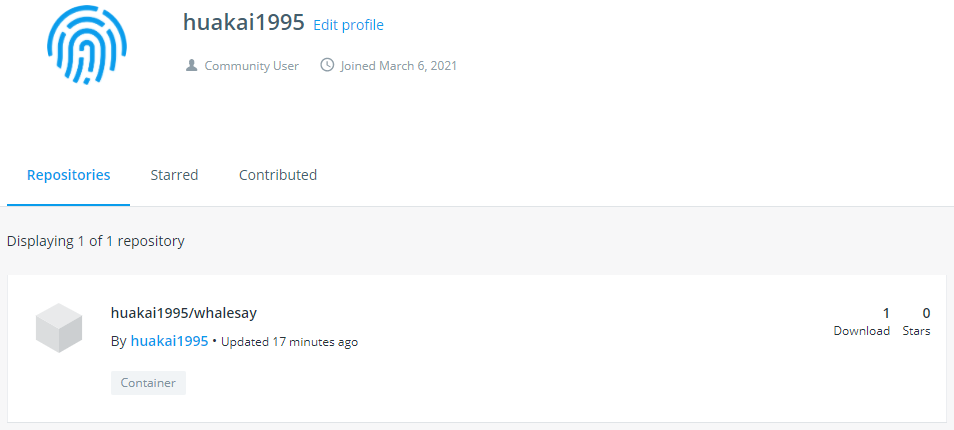
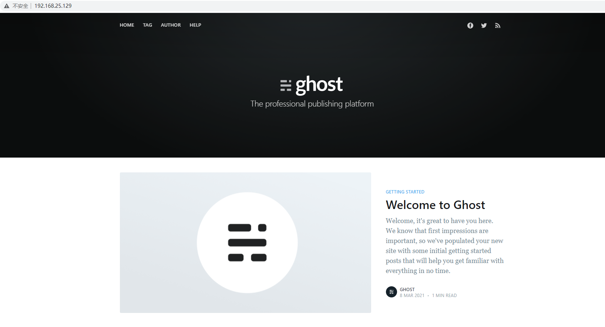

# 1 什么是 Docker

Docker 将任何应用以轻量级的形式来打包，发布和运行，可以被粗糙地理解为轻量级的虚拟机。 

Docker 利用 Host OS 里面的 namespace，controlgroup 来做到将应用程序分离，因为 Docker 没有 hypervisor 虚拟层，它会比虚拟机轻量很多，包括程序的启动速度以及存储的需求等等。

> 虚拟机和容器都是在硬件和操作系统以上的，虚拟机有 Hypervisor 层，Hypervisor 是整个虚拟机的核心所在。它为虚拟机提供了虚拟的运行平台，管理虚拟机的操作系统运行。每个虚拟机都有自己的系统和系统库以及应用。
>
> 容器没有 Hypervisor 这一层，并且每个容器是和宿主机共享硬件资源及操作系统，那么由 Hypervisor 带来性能的损耗，在 linux 容器这边是不存在的。

容器是一个标准的软件单元，它将代码及其所有依赖项打包起来，以便应用程序从一个计算环境快速可靠地运行到另一个计算环境。Docker 容器镜像是一个轻量级的、独立的、可执行的软件包，包括运行应用程序所需的一切：代码、运行时、系统工具、系统库和设置。


# 2 安装 Docker

## 2.1 Docker Desktop

Docker Desktop 是一个用于 MacOS 和 Windows 机器的应用程序，用于构建和共享容器化应用程序和微服务。

[下载 Docker Desktop](https://www.docker.com/products/docker-desktop) 


## 2.2 Linux

```shell
# O-是大写的o和减号，-q标识输出要简单，O-标识标准输出，而不是输出到文件
sudo wget -qO- https://get.docker.com | sh
# 把xxx用户添加到docker用户组中
sudo usermod -aG docker xxx 
#启动docker服务
service docker start
#设置成开机自启
sudo chkconfig docker on
```

# 3 使用 Docker

## 3.1 Docker 命令

```shell
# Docker Desktop 官方示例
# 从github官网clone一个名为alpine/git的容器(亦安装git)并将其启动，并将容器重命名为repo，同时执行 git clone 命令
docker run --name repo alpine/git clone https://github.com/docker/getting-started.git
# docker run --name repo alpine/git --version

# 将容器repo的/git/getting-started/的目录拷贝到主机的.目录中
docker cp repo:/git/getting-started/ .

# 如果本地装有 git，则不需要上面步骤(本地 git clone getting-started.git)，直接进入 getting-started 目录中
cd getting-started

# 使用当前目录的 Dockerfile 创建镜像，标签为 docker-tutorial
docker build -t docker-tutorial .

# 使用镜像docker-tutorial，以后台模式启动一个容器并将容器命名为docker-tutorial，将容器的80端口映射到主机的80端口
# -d: 后台运行容器，并返回容器ID
# -p: 指定端口映射，格式为：主机(宿主)端口:容器端口
docker run -d -p 80:80 --name hello-docker docker-tutorial

# 访问 localhost
```


## 3.2 Dockerfile

通过编写简单的文件自创 docker 镜像：

```dockerfile
# 创建文件 Dockerfile
FROM alpine:latest
# MAINTAINER 作者
MAINTAINER spring
CMD echo "Hello Docker!"
```

> alpine 为专门为 Docker 设计的一款体积很小的 linux
>

```shell
# 运行 Dockerfile
# -t 表示给一个标签叫做 my_docker
# . 表示路径名，将该路径下所有文件都送给 Docker engine
docker build -t my_docker .
```


```shell
docker images my_docker
# REPOSITORY   TAG       IMAGE ID       CREATED       SIZE
# my_docker    latest    771a467779a5   2 weeks ago   5.61MB
docker run my_docker
# Hello Docker!
```

### 复杂的 Dockerfile

```dockerfile
FROM ubuntu
MAINTAINER spring
# 采用国内镜像下载地址
RUN sed -i 's/archive.ubuntu.com/mirrors.ustc.edu.cn/g' /etc/apt/sources.list
RUN apt-get update
RUN apt-get install -y nginx
COPY index.html /var/www/html
# 将nginx在前台执行，而不是作为守护进程
ENTRYPOINT ["/usr/sbin/nginx", "-g", "daemon off;"]
EXPOSE 80
```

同目录下创建一个 index.html

```shell
docker build -t hello_nginx .
docker run -d -p 80:80 hello_nginx
curl http://localhost
```

## 3.3 镜像分层

Dickerfile 中的每一行都产生一个新层


已经存在的 image 里面的层是只读的，一旦一个 image 被运行成为一个容器的话，会产生一个新层，这一次是可读可写的。 分层的好处：多个image可以共享分层，这样存储压力就小很多。

## 3.4 Volume

提供独立于容器之外的持久化存储

```bash
# Centos7 下运行
# 会将 容器 /usr/share/nginx/html 内容复制并挂载到宿主机某路径下
docker run -d --name nginx -v /usr/share/nginx/html nginx
docker inspect nginx
```


这个路径，容器的宿主机里面，不是在容器里面

```bash
# 在运行 Docker 的 Centos7 下运行执行
cd /var/lib/docker/volumes/d8764999a1f7f270c8639d62043faf8d6d216006dbeb30fa1c9d421407c7250f/_data
ls
# 50x.html  index.html
cat index.html
echo "it's 2021" > index.html
```

```shell
# 进入容器里面查看
docker exec -it nginx /bin/bash
cd /usr/share/nginx/html/
cat index.html
# it's 2021
```

**将本地目录挂载到容器里面的数据卷**

将目录html挂载到容器

```shell
# /html为绝对路径，windows 下如果文件在E盘下，需要写 E:/html
docker run -p 80:80 -d -v /html:/usr/share/nginx/html nginx
```

**创建一个仅有数据的容器并将该容器挂载到其他容器中**

```bash
docker create -v E:/data:/var/mydata --name data_container ubuntu
docker run -it --volumes-from data_container ubuntu /bin/bash
# 自动进入到启动的容器 ubuntu 内
mount
```

会发现一个 mydata 的文件夹

```bash
ca /var/mydata
touch whatever.txt
```

在本地会发现一个 whatever.txt 文件

## 3.5 Registry 镜像仓库

```shell
# 搜索镜像
docker search whalesay
# 拉取下来
docker pull whalesay
# 将自己镜像 push 到仓库
docker push myname/whalesay
```

### 国内仓库

daocloud 时速云 阿里云

```bash
docker search whalesay
docker pull docker/whalesay
docker run docker/whalesay cowsay Docker很好玩！
```


```bash
# 创建自己的tag
# 在 build 自己的镜像的时候添加 tag 时必须在前面加上自己的 dockerhub 的 username
docker tag docker/whalesay huakai1995/whalesay
# 需要登录自己的Docker帐号
docker login
Username: huakai1995
Password:
# 上传到仓库
docker push huakai1995/whalesay
```

上传成功后，在 Docker 官网可以看到自己上传的镜像： 



## 3.6 Docker Compose

Compose 是用于定义和运行多容器 Docker 应用程序的工具。通过 Compose，您可以使用 YML 文件来配置应用程序需要的所有服务。然后，使用一个命令，就可以从 YML 文件配置中创建并启动所有服务。

Mac 和 Windows 的 Docker 中已带有 compose，Linux 需要单独安装

```bash
# 安装 Docker Compose 可以通过下面命令自动下载适应版本的 Compose
curl -L https://github.com/docker/compose/releases/download/1.9.0/docker-compose-$(uname -s )-$(uname -m) > /usr/local/bin/docker-compose
# 为安装脚本添加执行权限
chmod a+x /usr/local/bin/docker-compose
# 查看安装是否成功
docker-compose -v
```

### ghost 配置

```bash
mkdir ghost
cd ghost
vim Dockerfile
vim config.production.json
```

Dockerfile

```dockerfile
FROM ghost
COPY ./config.production.json /var/lib/ghost/content/config.production.json
EXPOSE 2368
#CMD ["npm","start","--production"]
```

config.production.json

```json
{
    "url": "http://localhost:2368/",
    "server": {
        "port": 2368,
        "host": "0.0.0.0"
    },
    "database": {
        "client": "mysql",
        "connection": {
            "host": "db",
            "user": "ghost",
            "password": "ghost",
            "database": "ghost",
            "port": 3307,
            "charset": "utf8"
        }
    },
    "mail": {
        "transport": "Direct"
    },
    "logging": {
        "transports": [
            "file",
            "stdout"
        ]
    },
    "process": "systemd",
    "paths": {
        "contentPath": "/var/lib/ghost/content"
    }
}
```

### nginx 配置

```bash
cd ..
mkdir nginx
cd nginx
vim Dockerfile
vim nginx.conf
```

Dockerfile

```dockerfile
FROM nginx
COPY nginx.conf /etc/nginx/nginx.conf
EXPOSE 80
```

nginx.conf

```
worker_processes 4;
events {worker_connections 1024;}
http {
    server {
        listen 80;
        location / {
            proxy_pass http://ghost-app:2368;
        }
    }
}
```

### docker-compose.yml

```bash
cd ..
vim docker-compose.yml
docker-compose up -d
```

```yml
version: '2'
networks:
  ghost:
services:
  ghost-app:
    build: ghost
    networks:
      - ghost
    depends_on:
      - db
    ports:
      - "2368:2368"
  nginx:
    build: nginx
    networks:
      - ghost
    depends_on:
      - ghost-app
    ports:
      - "80:80"
  db:
    image: "mysql:5.7.15"
    networks:
      - ghost
    environment:
      MYSQL_ROOT_PASSWORD: mysqlroot
      MYSQL_USER: ghost
      MYSQL_PASSWORD: ghost
    volumes:
      - ./data:/var/lib/mysql
    ports:
      - "3307:3307"
```



### docker-compose 常用命令

```markdown
# 停止容器  
	docker-compost stop
# 删除容器
	docker-compose rm       
# 重新建立
	docker-compose build
# 启动运行
	docker-compose up -d
```

# 4 Spring Boot & Docker

将 Spring Boot 项目打包好成 jar 包，同时准备好 Dorkerfile :

```dockerfile
FROM java:8
MAINTAINER huakai
ADD hello-docker-0.0.1-SNAPSHOT.jar app.jar
EXPOSE 8080
ENTRYPOINT ["java","-jar","app.jar"]
```

```bash
docker build -t hello/docker .
docker run -d --name demo -p 8080:8080 hello/docker
```

------

