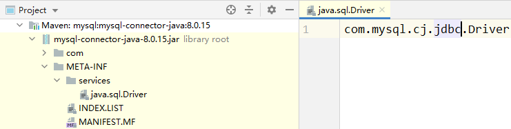
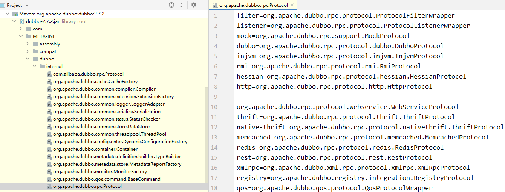
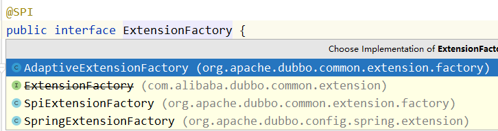

# 1 关于 Java SPI

SPI 是 JDK 内置的一种服务提供发现机制。目前市面上有很多框架都是用它来做服务的扩展发现。简单来说，它是一种动态替换发现的机制。

举个简单的例子，我们想在运行时动态给它添加实现，你只需要添加一个实现，然后把新的实现描述给 JDK 知道就行了。大家耳熟能详的如 JDBC、日志框架都有用到。

## 1.1 实现 SPI 需要遵循的标准

1. 需要在 classpath 下创建一个目录，该目录命名必须是：META-INF/services
2. 在该目录下创建一个 properties 文件，该文件需要满足以下几个条件 
   * 文件名必须是扩展的接口的全路径名称
   * 文件内部描述的是该扩展接口的所有实现类
   * 文件的编码格式是 UTF-8

3. 通过 java.util.ServiceLoader 的加载机制来发现

```java
// spi-server 模块定义接口
public interface SpiServer {
    void sayHello(String name);
}
// spi-api-a 模块因为 spi-server 依赖并实现 SpiServer 接口
public class SpiServerImplA implements SpiServer {
    @Override
    public void sayHello(String name) {
        System.out.println("Hello, " + name + "! from Service-A");
    }
}
// 创建 spi-api-b 模块，通 spi-api-a
```

```java
// spi-api-a 模块创建 /resources/META-INF/services/com.spring.SpiServer 文件
com.spring.SpiServerImplA
```

```java
// spi-test 模块引入 spi-api-a,spi-api-b 依赖进行测试
ServiceLoader<SpiServer> loadedParsers = ServiceLoader.load(SpiServer.class);
Iterator<SpiServer> iterator = loadedParsers.iterator();
while (iterator.hasNext()){
    SpiServer SpiServer = iterator.next();
    SpiServer.sayHello("xiaoxiao");
}
// Hello, xiaoxiao! from Service-A
// Hello, xiaoxiao! from Service-B
```

## 1.2 SPI 的实际应用

SPI 在很多地方有应用，可能大家都没有关注，最常用的就是 JDBC 驱动。

JDK 本身提供了数据访问的 api，在 java.sql 这个包里面。我们在连接数据库的时候，一定需要用到 java.sql.Driver 这个接口。Driver 并没有实现，而是提供了一套标准的 api 接口。

因为我们在实际应用中用的比较多的是 mysql，所以去 mysql 的包里面看到一个如下的目录结构：



这个文件里面写的就是 mysql 的驱动实现。通过 SPI 机制把 java.sql.Driver 和 mysql 的驱动做了集成。这样就达到了各个数据库厂商自己去实现数据库连接，jdk 本身不关心你怎么实现。

## 1.3 SPI 的缺点

1. JDK 标准的 SPI 会一次性加载实例化扩展点的所有实现，什么意思呢？就是如果你在 META-INF/service 下的文件里面加了 N 个实现类，那么 JDK 启动的时候都会一次性全部加载。那么如果有的扩展点实现初始化很耗时或者如果有些实现类并没有用到， 那么会很浪费资源
2. 如果扩展点加载失败，会导致调用方报错，而且这个错误很难定位到是这个原因

# 2 Dubbo SPI 机制

## 2.1 基于 Dubbo SPI 的实现自己的扩展

Dubbo 的 SPI 扩展机制，有两个规则

1. 需要在 resource 目录下配置 META-INF/dubbo 或者 META-INF/dubbo/internal 或者 META-INF/services，并基于 SPI 接口去创建一个文件
2. 文件名称和接口名称保持一致，文件内容和 SPI 有差异，内容是 KEY 对应 Value

Dubbo 针对的扩展点非常多，可以针对协议、拦截、集群、路由、负载均衡、序列化、容器… 几乎里面用到的所有功能，都可以实现自己的扩展，我觉得这个是 dubbo 比较强大的一点。



### 2.1.1 扩展协议扩展点

创建如下结构，添加 META-INF.dubbo 文件。类名和 Dubbo 提供的协议扩展点接口保持一致：

```java
// /resources/META-INF/dubbo/org.apache.dubbo.rpc.Protocol
myProtocol=com.spring.protocol.MyProtocol
```

创建 MyProtocol 协议类可以实现自己的协议，我们为了模拟协议产生了作用，修改一个端口：

```java
public class MyProtocol implements Protocol {
    @Override
    public int getDefaultPort() {
        return 8888;
    }
    ...
}
Protocol protocol = ExtensionLoader.getExtensionLoader(Protocol.class).getExtension("myProtocol");
System.out.println(protocol.getDefaultPort());
// 输出结果，可以看到运行结果，是执行的自定义的协议扩展点
// 8888
```

总的来说，思路和 SPI 是差不多，都是基于约定的路径下制定配置文件。通过配置的方式轻松实现功能的扩展。 我们的猜想是一定有一个地方通过读取指定路径下的所有文件进行 load，然后讲对应的结果保存到一个 map 中，key 对应为 名称，value 对应为实现类。那么这个实现，一定就在 ExtensionLoader 中了。接下来我们就可以基于这个猜想去看看代码的实现。

## 2.2 Dubbo 扩展点实现原理

在看它的实现代码之前，大家要思考一个问题，所谓的扩展点，就是通过指定目录下配置一个对应接口的实现类，然后程序会进行查找和解析，找到对应的扩展点。那么这里就涉及到两个问题：

1. 怎么解析 
2. 被加载的类如何存储和使用？ 

dubbo的扩展点框架主要位于这个包下：org.alibaba.dubbo.common.extension

```java
1.	org.alibaba.dubbo.common.extension  
2.	 |  
3.	 |--factory  
4.	 |     |--AdaptiveExtensionFactory   #稍后解释  
5.	 |     |--SpiExtensionFactory        #稍后解释  
6.	 |  
7.	 |--support  
8.	 |     |--ActivateComparator  
9.	 |  
10.	 |--Activate  #自动激活加载扩展的注解  
11.	 |--Adaptive  #自适应扩展点的注解  
12.	 |--ExtensionFactory  #扩展点对象生成工厂接口  
13.	 |--ExtensionLoader   #扩展点加载器，扩展点的查找，校验，加载等核心逻辑的实现类  
14.	 |--SPI   #扩展点注解
```

其中最核心的类就是ExtensionLoader，几乎所有特性都在这个类中实现。 ExtensionLoader 没有提供 public 的构造方法，但是提供了一个 public static 的getExtensionLoader，这个方法就是获取ExtensionLoader实例的工厂方法。其public成员方法中有三个比较重要的方法：

- getActivateExtension ：根据条件获取当前扩展可自动激活的实现 
- getExtension ： 根据名称获取当前扩展的指定实现 
- getAdaptiveExtension : 获取当前扩展的自适应实现

**ExtensionLoader.getExtensionLoader.getExtension**

从这段代码着手，去看看到底做了什么事情，能够通过这样一段代码实现扩展协议的查找和加载。

```java
private static final ConcurrentMap<Class<?>, ExtensionLoader<?>> EXTENSION_LOADERS = new ConcurrentHashMap<>();

public static <T> ExtensionLoader<T> getExtensionLoader(Class<T> type) {
    if (type == null) {
        throw new IllegalArgumentException("Extension type == null");
    }
    if (!type.isInterface()) {
        throw new IllegalArgumentException("Extension type (" + type + ") is not an interface!");
    }
    // 只接受使用@SPI注解注释的接口
    if (!withExtensionAnnotation(type)) {
        throw new IllegalArgumentException("Extension type (" + type +
                ") is not an extension, because it is NOT annotated with @" + SPI.class.getSimpleName() + "!");
    }
    // 初始化 ExtensionLoader
    ExtensionLoader<T> loader = (ExtensionLoader<T>) EXTENSION_LOADERS.get(type);
    if (loader == null) {
        EXTENSION_LOADERS.putIfAbsent(type, new ExtensionLoader<T>(type));
        loader = (ExtensionLoader<T>) EXTENSION_LOADERS.get(type);
    }
    return loader;
}
```

**实例化 ExtensionLoader**

```java
private ExtensionLoader(Class<?> type) {
    this.type = type;
    // 如果当前的 type = ExtensionFactory, 那么 objectFactory=null否则会创建一个自适应扩展点给到 objectFacotry
    objectFactory = (type == ExtensionFactory.class ? null : ExtensionLoader.getExtensionLoader(ExtensionFactory.class).getAdaptiveExtension());
}
```

objectFactory 在这里赋值了，并且是返回一个 AdaptiveExtension()，这个暂时不展开，后面再分析。

**getExtension**

这个方法就是根据一个名字来获得一个对应类的实例，所以我们来猜想一下，回想一下前面咱们配置的自定义协议，name 实际上就是 myProtocol，而返回的实现类应该就是 MyProtocol。

```java
public T getExtension(String name) {
    if (StringUtils.isEmpty(name)) {
        throw new IllegalArgumentException("Extension name == null");
    }
    // 如果 name=true，表示返回一个默认的扩展点，思考一下什么是默认的
    if ("true".equals(name)) {
        return getDefaultExtension();
    }
    Holder<Object> holder = getOrCreateHolder(name);
    // 缓存一下，如果实例已经记载过了，直接从缓存读取
    Object instance = holder.get();
    if (instance == null) {
        synchronized (holder) {
            instance = holder.get();
            if (instance == null) {
                // 根据名称创建实例
                instance = createExtension(name);
                holder.set(instance);
            }
        }
    }
    return (T) instance;
}
```

**createExtension**

```java
private T createExtension(String name) {
	// 加载指定路径下的所有文件
    Class<?> clazz = getExtensionClasses().get(name);
    // 如果没有找到，则抛出异常
    if (clazz == null) {
        throw findException(name);
    }
    try {
        // 这里用一个 chm 来保存实例，做缓存
        T instance = (T) EXTENSION_INSTANCES.get(clazz);
        if (instance == null) {
            EXTENSION_INSTANCES.putIfAbsent(clazz, clazz.newInstance());
            instance = (T) EXTENSION_INSTANCES.get(clazz);
        }
        // 实例注入，可以猜到，这里应该是对这个实例种的成员属性来实现依赖注入功能
        injectExtension(instance);
        Set<Class<?>> wrapperClasses = cachedWrapperClasses;
        if (CollectionUtils.isNotEmpty(wrapperClasses)) {
            for (Class<?> wrapperClass : wrapperClasses) {
                instance = injectExtension((T) wrapperClass.getConstructor(type).newInstance(instance));
            }
        }
        return instance;
    } catch (Throwable t) {
        throw new IllegalStateException("Extension instance (name: " + name + ", class: " +
                type + ") couldn't be instantiated: " + t.getMessage(), t);
    }
}
```

**getExtensionClasses**

这个方法，会查找指定目录 /META-INF/dubbo || /META-INF/services 下对应的 type，也就是本次演示案例的 Protocol 的 properties 文件，然后扫描这个文件下的所有配置信息。然后保存到一个 HashMap 中（classes），key = name(对应 protocol 文件中配置的 myprotocol)，value 对应配置的类的实例。

```java
private Map<String, Class<?>> getExtensionClasses() {
    Map<String, Class<?>> classes = cachedClasses.get();
    // 判断是否已经加载了当前Extension的所有实现类
    if (classes == null) {
        synchronized (cachedClasses) {
            classes = cachedClasses.get();
            if (classes == null) {
                // 如果还没有加载Extension的实现，则进行扫描加载，完成后赋值给cachedClasses
                // 这里的代码就是加载的过程
                classes = loadExtensionClasses();
                cachedClasses.set(classes);
            }
        }
    }
    return classes;
}

private static final String SERVICES_DIRECTORY = "META-INF/services/";
private static final String DUBBO_DIRECTORY = "META-INF/dubbo/";
private static final String DUBBO_INTERNAL_DIRECTORY = DUBBO_DIRECTORY + "internal/";
private Map<String, Class<?>> loadExtensionClasses() {
    cacheDefaultExtensionName();
    Map<String, Class<?>> extensionClasses = new HashMap<>();
    loadDirectory(extensionClasses, DUBBO_INTERNAL_DIRECTORY, type.getName());
    loadDirectory(extensionClasses, DUBBO_INTERNAL_DIRECTORY, type.getName().replace("org.apache", "com.alibaba"));
    loadDirectory(extensionClasses, DUBBO_DIRECTORY, type.getName());
    loadDirectory(extensionClasses, DUBBO_DIRECTORY, type.getName().replace("org.apache", "com.alibaba"));
    loadDirectory(extensionClasses, SERVICES_DIRECTORY, type.getName());
    loadDirectory(extensionClasses, SERVICES_DIRECTORY, type.getName().replace("org.apache", "com.alibaba"));
    return extensionClasses;
}
```

**injectExtension**

这个方法是用来实现依赖注入的，如果被加载的实例中，有成员属性本身也是一个扩展点，则会通过 set 方法进行注入。

```java
private T injectExtension(T instance) {
    try {
        if (objectFactory != null) {// objectFactory 在这里用到了
            // 获得实例对应的方法，判断方法是否是一个set方法
            for (Method method : instance.getClass().getMethods()) {
                if (isSetter(method)) {
                    // 可以选择禁用依赖注入
                    if (method.getAnnotation(DisableInject.class) != null) {
                        continue;
                    }
                    // 获得方法的参数，这个参数必须是一个对象类型并且是一个扩展点
                    Class<?> pt = method.getParameterTypes()[0];
                    // 如果不是对象类型，则跳过
                    if (ReflectUtils.isPrimitives(pt)) {
                        continue;
                    }
                    try {
                        // 获得 set 方法中的属性名字，根据属性名字进行加载
                        String property = getSetterProperty(method);
                        // 根据 class 以及name，使用自适应扩展点进行加载并且赋值到当前的 set 方法中
                        Object object = objectFactory.getExtension(pt, property);
                        if (object != null) {
                            // 调用 set 方法进行赋值
                            method.invoke(instance, object);
                        }
                    } catch (Exception e) {
                        logger.error("Failed to inject via method " + method.getName()
                                + " of interface " + type.getName() + ": " + e.getMessage(), e);
                    }
                }
            }
        }
    } catch (Exception e) {
        logger.error(e.getMessage(), e);
    }
    return instance;
}
```

分析到这里我们发现，所谓的扩展点套路都一样，不管是 springfactorieyLoader，还是 Dubbo 的 spi。实际上，Dubbo 的功能会更加强大，比如自适应扩展点，比如依赖注入。

## 2.3 Adaptive 自适应扩展点

什么叫自适应扩展点呢？我们先演示一个例子，在下面这个例子中，我们传入一个 Compiler 接口，它会返回一个 AdaptiveCompiler，这个就叫自适应。 

```java
import org.apache.dubbo.common.compiler.Compiler;
Compiler compiler= ExtensionLoader.getExtensionLoader(Compiler.class).getAdaptiveExtension();
System.out.println(compiler.getClass());
// class org.apache.dubbo.common.compiler.support.AdaptiveCompiler
```

它是怎么实现的呢？ 我们根据返回的 AdaptiveCompiler 这个类，看到这个类上面有一个注解`@Adaptive`。 

```java
@Adaptive
public class AdaptiveCompiler implements Compiler
```

这个就是一个自适应扩展点的标识。它可以修饰在类上，也可以修饰在方法上面，这两者有什么区别呢？ 

简单来说，放在类上说明当前类是一个确定的自适应扩展点的类。如果是放在方法级别，那么需要生成一个动态字节码，来进行转发。

比如拿 Protocol 这个接口来说，它里面定义了 export 和 refer 两个抽象方法，这两个方法分别带有 @Adaptive 的标识，标识是一个`自适应方法`。 我们知道 Protocol 是一个通信协议的接口，具体有多种实现，那么这个时候选择哪一种呢？ 取决于我们在使用 dubbo 的时候所配置的协议名称。而这里的方法层面的 Adaptive 就决定了当前这个方法会采用何种协议来发布服务。

**getAdaptiveExtension**

这个方法主要就是要根据传入的接口返回一个自适应的实现类。

```java
public T getAdaptiveExtension() {
    // cachedAdaptiveInstance是一个缓存，在dubbo中大量用到这种内存缓存
    Object instance = cachedAdaptiveInstance.get();
    if (instance == null) {
        if (createAdaptiveInstanceError == null) {
            synchronized (cachedAdaptiveInstance) {
                instance = cachedAdaptiveInstance.get();
                if (instance == null) {
                    try {
                        // 创建一个自适应扩展点的实现
                        instance = createAdaptiveExtension();
                        cachedAdaptiveInstance.set(instance);
                    } catch (Throwable t) {
                        createAdaptiveInstanceError = t;
                        throw new IllegalStateException("Failed to create adaptive instance: " + t.toString(), t);
                    }
                }
            }
        } else {
            throw new IllegalStateException("Failed to create adaptive instance: " + createAdaptiveInstanceError.toString(), createAdaptiveInstanceError);
        }
    }
    return (T) instance;
}
```

**createAdaptiveExtension**

这个方法中做两个事情：

1. 获得一个自适应扩展点实例 
2. 实现依赖注入

```java
private T createAdaptiveExtension() {
    try {
        // 先获取AdaptiveExtensionClass，在获取其实例，最后进行注入处理
        return injectExtension((T) getAdaptiveExtensionClass().newInstance());
    } catch (Exception e) {
        throw new IllegalStateException("Can't create adaptive extension " + type + ", cause: " + e.getMessage(), e);
    }
}
private Class<?> getAdaptiveExtensionClass() {
    // getExtensionClasses() 这个方法在前面讲过了，会加载当前传入的类型的所有扩展点，保存在一个 hashmap 中
    getExtensionClasses();
    // 如果 cachedApdaptiveClas!=null ,直接返回这个 cachedAdaptiveClass
    if (cachedAdaptiveClass != null) {
        return cachedAdaptiveClass;
    }
    return cachedAdaptiveClass = createAdaptiveExtensionClass();
}
```

这个 cachedAdaptiveClass 是一个什么？ 

cachedAdaptiveClass， 还记得前面讲过 Adaptive 可以方在两个位置，一个是类级别，一个是方法级别。那么这个 cachedAdaptiveClass 很显然，就是放在类级别的 Adaptive，表示告诉 dubbo spi loader，“我是一个自适应扩展点，你来加载我吧”。

cachedAdaptiveClass 应该是在加载解析/META-INF/dubbo 下的扩展点的时候加载进来的。在加载完之后如果这个类有@Adaptive 标识，则会赋值赋值而给 cachedAdaptiveClass。

如果 cachedAdaptiveClass 不存在，dubbo 会动态生成一个代理类 Protocol$Adaptive。前面的名字 protocol 是根据当前 ExtensionLoader 所加载的扩展点来定义的。

**createAdaptiveExtensionClass**

动态生成字节码，然后进行动态加载。那么这个时候锁返回的 class，如果加载的是 Protocol.class，应该是 Protocol$Adaptive。

这个 cachedDefaultName 实际上就是扩展点接口的 @SPI 注解对应的名字，如果此时加载的是 Protocol.class，那么 cachedDefaultName=dubbo。

```java
private Class<?> createAdaptiveExtensionClass() {
    String code = new AdaptiveClassCodeGenerator(type, cachedDefaultName).generate();
    ClassLoader classLoader = findClassLoader();
    org.apache.dubbo.common.compiler.Compiler compiler = ExtensionLoader.getExtensionLoader(org.apache.dubbo.common.compiler.Compiler.class).getAdaptiveExtension();
    return compiler.compile(code, classLoader);
}
```

**Protocol$Adaptive**

动态生成的代理类，以下是通过 debug 拿到的代理类。

前面传入进来的 cachedDefaultName，在这个动态生成的类中，会体现在下面destroy和getDefaultPort，也就是它的默认实现是 DubboProtocol。

```java
package org.apache.dubbo.rpc;
import org.apache.dubbo.common.extension.ExtensionLoader;

public class Protocol$Adaptive implements org.apache.dubbo.rpc.Protocol {
    public void destroy() {
        throw new UnsupportedOperationException("The method public abstract void org.apache.dubbo.rpc.Protocol.destroy() of interface org.apache.dubbo.rpc.Protocol is not adaptive method!");
    }

    public int getDefaultPort() {
        throw new UnsupportedOperationException("The method public abstract int org.apache.dubbo.rpc.Protocol.getDefaultPort() of interface org.apache.dubbo.rpc.Protocol is not adaptive method!");
    }

    public org.apache.dubbo.rpc.Exporter export(org.apache.dubbo.rpc.Invoker arg0) throws org.apache.dubbo.rpc.RpcException {
        if (arg0 == null) throw new IllegalArgumentException("org.apache.dubbo.rpc.Invoker argument == null");
        if (arg0.getUrl() == null)
            throw new IllegalArgumentException("org.apache.dubbo.rpc.Invoker argument getUrl() == null");
        org.apache.dubbo.common.URL url = arg0.getUrl();
        String extName = (url.getProtocol() == null ? "dubbo" : url.getProtocol());
        if (extName == null)
            throw new IllegalStateException("Failed to get extension (org.apache.dubbo.rpc.Protocol) name from url (" + url.toString() + ") use keys([protocol])");
        org.apache.dubbo.rpc.Protocol extension = (org.apache.dubbo.rpc.Protocol) ExtensionLoader.getExtensionLoader(org.apache.dubbo.rpc.Protocol.class).getExtension(extName);
        return extension.export(arg0);
    }

    public org.apache.dubbo.rpc.Invoker refer(java.lang.Class arg0, org.apache.dubbo.common.URL arg1) throws org.apache.dubbo.rpc.RpcException {
        if (arg1 == null) throw new IllegalArgumentException("url == null");
        org.apache.dubbo.common.URL url = arg1;
        String extName = (url.getProtocol() == null ? "dubbo" : url.getProtocol());
        if (extName == null)
            throw new IllegalStateException("Failed to get extension (org.apache.dubbo.rpc.Protocol) name from url (" + url.toString() + ") use keys([protocol])");
        org.apache.dubbo.rpc.Protocol extension = (org.apache.dubbo.rpc.Protocol) ExtensionLoader.getExtensionLoader(org.apache.dubbo.rpc.Protocol.class).getExtension(extName);
        return extension.refer(arg0, arg1);
    }
}
```

**关于 objectFactory**

在 injectExtension 这个方法中，我们发现入口出的代码首先判断了 objectFactory 这个对象是否为空。这个是在哪里初始化的呢？ 实际上我们在获得 ExtensionLoader 的时候，就对 objectFactory 进行了初始化。

```java
private ExtensionLoader(Class<?> type) {
    this.type = type;
    objectFactory = (type == ExtensionFactory.class ? null : ExtensionLoader.getExtensionLoader(ExtensionFactory.class).getAdaptiveExtension());
}
```

然后通过 ExtensionLoader.getExtensionLoader(ExtensionFactory.class).getAdaptiveExtension()去获得一个自适应的扩展点，进入 ExtensionFactory 这个接口中，可以看到它是一个扩展点，并且有一个自己实现的自适应扩展点 AdaptiveExtensionFactory; 

注意：@Adaptive 加载到类上表示这是一个自定义的适配器类，表示我们再调用 getAdaptiveExtension 方法的时候，不需要走上面这么复杂的过程。会直接加载到 AdaptiveExtensionFactory。然后在 getAdaptiveExtensionClass() 方法处有判断：



我们可以看到除了自定义的自适应适配器类以外，还有两个实现类，一个是 SPI，一个是 Spring，AdaptiveExtensionFactory 轮询这 2 个，从一个中获取到就返回。

```java
public <T> T getExtension(Class<T> type, String name) {
    // 依次遍历各个ExtensionFactory实现的getExtension方法，一旦获取到Extension即返回
    // 如果遍历完所有的ExtensionFactory实现均无法找到Extension，则返回null
    for (ExtensionFactory factory : factories) {
        T extension = factory.getExtension(type, name);
        if (extension != null) {
            return extension;
        }
    }
    return null;
}
```

## 2.4 Activate 自动激活扩展点

自动激活扩展点，有点类似我们讲 springboot 的时候用到的 conditional，根据条件进行自动激活。但是这里设计的初衷是，对于一个类会加载多个扩展点的实现，这个时候可以通过自动激活扩展点进行动态加载， 从而简化配置我们的配置工作。

@Activate 提供了一些配置来允许我们配置加载条件，比如 group 过滤，比如 key 过滤。 

举个例子，我们可以看看 org.apache.dubbo.Filter 这个类，它有非常多的实现，比如说 CacheFilter，这个缓存过滤器，配置信息如下：

```jAVA
// group 表示客户端和服务端都会加载，value 表示 url 中有 cache_key 的时候
@Activate(group = {CONSUMER, PROVIDER}, value = CACHE_KEY)
public class CacheFilter implements Filter
```

通过下面这段代码，演示关于 Filter 的自动激活扩展点的效果。没有添加注释部分代码时，list 的结果是 10，添加之后 list 的结果是 11，会自动把 cacheFilter 加载进来。

```java
ExtensionLoader<Filter> extensionLoader = ExtensionLoader.getExtensionLoader(Filter.class);
URL url = new URL("", "", 0);
url= url.addParameter("cache", "cache");
List<Filter> cache = extensionLoader.getActivateExtension(url, "cache");
System.out.println(cache.size());
```

------

